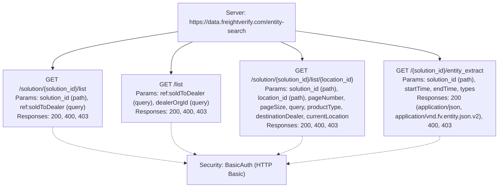
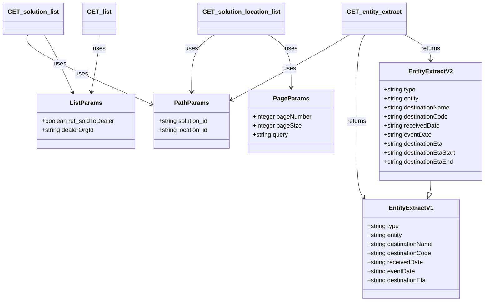

# Diagram: entity_core/entity_search/entity_search/lambdas/filters/api_documentation/EntitySearch.yaml

> Auto-generated by Obscura crawlers

## Diagram 1

### SVG

<svg id="container" width="1350.1875" xmlns="http://www.w3.org/2000/svg" class="flowchart" height="494" viewBox="0 0 1350.1875 494" role="graphics-document document" aria-roledescription="flowchart-v2"><g><marker id="container_flowchart-v2-pointEnd" class="marker flowchart-v2" viewBox="0 0 10 10" refX="5" refY="5" markerUnits="userSpaceOnUse" markerWidth="8" markerHeight="8" orient="auto"><path d="M 0 0 L 10 5 L 0 10 z" class="arrowMarkerPath" style="stroke-width: 1; stroke-dasharray: 1, 0;"></path></marker><marker id="container_flowchart-v2-pointStart" class="marker flowchart-v2" viewBox="0 0 10 10" refX="4.5" refY="5" markerUnits="userSpaceOnUse" markerWidth="8" markerHeight="8" orient="auto"><path d="M 0 5 L 10 10 L 10 0 z" class="arrowMarkerPath" style="stroke-width: 1; stroke-dasharray: 1, 0;"></path></marker><marker id="container_flowchart-v2-circleEnd" class="marker flowchart-v2" viewBox="0 0 10 10" refX="11" refY="5" markerUnits="userSpaceOnUse" markerWidth="11" markerHeight="11" orient="auto"><circle cx="5" cy="5" r="5" class="arrowMarkerPath" style="stroke-width: 1; stroke-dasharray: 1, 0;"></circle></marker><marker id="container_flowchart-v2-circleStart" class="marker flowchart-v2" viewBox="0 0 10 10" refX="-1" refY="5" markerUnits="userSpaceOnUse" markerWidth="11" markerHeight="11" orient="auto"><circle cx="5" cy="5" r="5" class="arrowMarkerPath" style="stroke-width: 1; stroke-dasharray: 1, 0;"></circle></marker><marker id="container_flowchart-v2-crossEnd" class="marker cross flowchart-v2" viewBox="0 0 11 11" refX="12" refY="5.2" markerUnits="userSpaceOnUse" markerWidth="11" markerHeight="11" orient="auto"><path d="M 1,1 l 9,9 M 10,1 l -9,9" class="arrowMarkerPath" style="stroke-width: 2; stroke-dasharray: 1, 0;"></path></marker><marker id="container_flowchart-v2-crossStart" class="marker cross flowchart-v2" viewBox="0 0 11 11" refX="-1" refY="5.2" markerUnits="userSpaceOnUse" markerWidth="11" markerHeight="11" orient="auto"><path d="M 1,1 l 9,9 M 10,1 l -9,9" class="arrowMarkerPath" style="stroke-width: 2; stroke-dasharray: 1, 0;"></path></marker><g class="root"><g class="clusters"></g><g class="edgePaths"><path d="M463.246,84.54L409.038,92.95C354.831,101.36,246.415,118.18,192.208,134.09C138,150,138,165,138,172.5L138,180" id="L_Server_B_0" class="edge-thickness-normal edge-pattern-solid edge-thickness-normal edge-pattern-solid flowchart-link" style=";" data-edge="true" data-et="edge" data-id="L_Server_B_0" data-points="W3sieCI6NDYzLjI0NjA5Mzc1LCJ5Ijo4NC41Mzk1ODc3MzU3MzYyMn0seyJ4IjoxMzgsInkiOjEzNX0seyJ4IjoxMzgsInkiOjE4NH1d" marker-end="url(#container_flowchart-v2-pointEnd)"></path><path d="M507.166,110L497.305,114.167C487.444,118.333,467.722,126.667,457.861,138.333C448,150,448,165,448,172.5L448,180" id="L_Server_C_0" class="edge-thickness-normal edge-pattern-solid edge-thickness-normal edge-pattern-solid flowchart-link" style=";" data-edge="true" data-et="edge" data-id="L_Server_C_0" data-points="W3sieCI6NTA3LjE2NTU1MzA0Mjc2MzIsInkiOjExMH0seyJ4Ijo0NDgsInkiOjEzNX0seyJ4Ijo0NDgsInkiOjE4NH1d" marker-end="url(#container_flowchart-v2-pointEnd)"></path><path d="M748.561,110L758.422,114.167C768.283,118.333,788.005,126.667,797.866,134.333C807.727,142,807.727,149,807.727,152.5L807.727,156" id="L_Server_D_0" class="edge-thickness-normal edge-pattern-solid edge-thickness-normal edge-pattern-solid flowchart-link" style=";" data-edge="true" data-et="edge" data-id="L_Server_D_0" data-points="W3sieCI6NzQ4LjU2MTAwOTQ1NzIzNjksInkiOjExMH0seyJ4Ijo4MDcuNzI2NTYyNSwieSI6MTM1fSx7IngiOjgwNy43MjY1NjI1LCJ5IjoxNjB9XQ==" marker-end="url(#container_flowchart-v2-pointEnd)"></path><path d="M792.48,81.263L858.704,90.219C924.927,99.175,1057.374,117.088,1123.597,129.544C1189.82,142,1189.82,149,1189.82,152.5L1189.82,156" id="L_Server_E_0" class="edge-thickness-normal edge-pattern-solid edge-thickness-normal edge-pattern-solid flowchart-link" style=";" data-edge="true" data-et="edge" data-id="L_Server_E_0" data-points="W3sieCI6NzkyLjQ4MDQ2ODc1LCJ5Ijo4MS4yNjMxMDExODc5NTIyNn0seyJ4IjoxMTg5LjgyMDMxMjUsInkiOjEzNX0seyJ4IjoxMTg5LjgyMDMxMjUsInkiOjE2MH1d" marker-end="url(#container_flowchart-v2-pointEnd)"></path><path d="M138,334L138,342.167C138,350.333,138,366.667,197.316,382.583C256.632,398.499,375.265,413.998,434.581,421.748L493.897,429.497" id="L_B_F_0" class="edge-thickness-normal edge-pattern-dotted edge-thickness-normal edge-pattern-solid flowchart-link" style=";" data-edge="true" data-et="edge" data-id="L_B_F_0" data-points="W3sieCI6MTM4LCJ5IjozMzR9LHsieCI6MTM4LCJ5IjozODN9LHsieCI6NDk3Ljg2MzI4MTI1LCJ5Ijo0MzAuMDE1NjY5MjMxNjg5MzR9XQ==" marker-end="url(#container_flowchart-v2-pointEnd)"></path><path d="M448,334L448,342.167C448,350.333,448,366.667,459.082,378.777C470.164,390.886,492.327,398.773,503.409,402.716L514.491,406.659" id="L_C_F_0" class="edge-thickness-normal edge-pattern-dotted edge-thickness-normal edge-pattern-solid flowchart-link" style=";" data-edge="true" data-et="edge" data-id="L_C_F_0" data-points="W3sieCI6NDQ4LCJ5IjozMzR9LHsieCI6NDQ4LCJ5IjozODN9LHsieCI6NTE4LjI1OTA5NDIzODI4MTIsInkiOjQwOH1d" marker-end="url(#container_flowchart-v2-pointEnd)"></path><path d="M807.727,358L807.727,362.167C807.727,366.333,807.727,374.667,796.645,382.777C785.563,390.886,763.4,398.773,752.318,402.716L741.236,406.659" id="L_D_F_0" class="edge-thickness-normal edge-pattern-dotted edge-thickness-normal edge-pattern-solid flowchart-link" style=";" data-edge="true" data-et="edge" data-id="L_D_F_0" data-points="W3sieCI6ODA3LjcyNjU2MjUsInkiOjM1OH0seyJ4Ijo4MDcuNzI2NTYyNSwieSI6MzgzfSx7IngiOjczNy40Njc0NjgyNjE3MTg4LCJ5Ijo0MDh9XQ==" marker-end="url(#container_flowchart-v2-pointEnd)"></path><path d="M1189.82,358L1189.82,362.167C1189.82,366.333,1189.82,374.667,1118.49,386.957C1047.159,399.247,904.498,415.495,833.168,423.618L761.838,431.742" id="L_E_F_0" class="edge-thickness-normal edge-pattern-dotted edge-thickness-normal edge-pattern-solid flowchart-link" style=";" data-edge="true" data-et="edge" data-id="L_E_F_0" data-points="W3sieCI6MTE4OS44MjAzMTI1LCJ5IjozNTh9LHsieCI6MTE4OS44MjAzMTI1LCJ5IjozODN9LHsieCI6NzU3Ljg2MzI4MTI1LCJ5Ijo0MzIuMTk0NTk3NTYyOTI1M31d" marker-end="url(#container_flowchart-v2-pointEnd)"></path></g><g class="edgeLabels"><g class="edgeLabel"><g class="label" data-id="L_Server_B_0" transform="translate(0, 0)"><foreignObject width="0" height="0">

</foreignObject></g></g><g class="edgeLabel"><g class="label" data-id="L_Server_C_0" transform="translate(0, 0)"><foreignObject width="0" height="0">

</foreignObject></g></g><g class="edgeLabel"><g class="label" data-id="L_Server_D_0" transform="translate(0, 0)"><foreignObject width="0" height="0">

</foreignObject></g></g><g class="edgeLabel"><g class="label" data-id="L_Server_E_0" transform="translate(0, 0)"><foreignObject width="0" height="0">

</foreignObject></g></g><g class="edgeLabel"><g class="label" data-id="L_B_F_0" transform="translate(0, 0)"><foreignObject width="0" height="0">

</foreignObject></g></g><g class="edgeLabel"><g class="label" data-id="L_C_F_0" transform="translate(0, 0)"><foreignObject width="0" height="0">

</foreignObject></g></g><g class="edgeLabel"><g class="label" data-id="L_D_F_0" transform="translate(0, 0)"><foreignObject width="0" height="0">

</foreignObject></g></g><g class="edgeLabel"><g class="label" data-id="L_E_F_0" transform="translate(0, 0)"><foreignObject width="0" height="0">

</foreignObject></g></g></g><g class="nodes"><g class="node default" id="flowchart-Server-0" transform="translate(627.86328125, 59)"><rect class="basic label-container" style="" x="-164.6171875" y="-51" width="329.234375" height="102"></rect><g class="label" style="" transform="translate(-134.6171875, -36)"><rect></rect><foreignObject width="269.234375" height="72">

Server: https://data.freightverify.com/entity-search

</foreignObject></g></g><g class="node default" id="flowchart-B-1" transform="translate(138, 259)"><rect class="basic label-container" style="" x="-130" y="-75" width="260" height="150"></rect><g class="label" style="" transform="translate(-100, -60)"><rect></rect><foreignObject width="200" height="120">

GET /solution/{solution_id}/list Params: solution_id (path), ref:soldToDealer (query) Responses: 200, 400, 403

</foreignObject></g></g><g class="node default" id="flowchart-C-2" transform="translate(448, 259)"><rect class="basic label-container" style="" x="-130" y="-75" width="260" height="150"></rect><g class="label" style="" transform="translate(-100, -60)"><rect></rect><foreignObject width="200" height="120">

GET /list Params: ref:soldToDealer (query), dealerOrgId (query) Responses: 200, 400, 403

</foreignObject></g></g><g class="node default" id="flowchart-D-3" transform="translate(807.7265625, 259)"><rect class="basic label-container" style="" x="-179.7265625" y="-99" width="359.453125" height="198"></rect><g class="label" style="" transform="translate(-149.7265625, -84)"><rect></rect><foreignObject width="299.453125" height="168">

GET /solution/{solution_id}/list/{location_id} Params: solution_id (path), location_id (path), pageNumber, pageSize, query, productType, destinationDealer, currentLocation Responses: 200, 400, 403

</foreignObject></g></g><g class="node default" id="flowchart-E-4" transform="translate(1189.8203125, 259)"><rect class="basic label-container" style="" x="-152.3671875" y="-99" width="304.734375" height="198"></rect><g class="label" style="" transform="translate(-122.3671875, -84)"><rect></rect><foreignObject width="244.734375" height="168">

GET /{solution_id}/entity_extract Params: solution_id (path), startTime, endTime, types Responses: 200 (application/json, application/vnd.fv.entity.json.v2), 400, 403

</foreignObject></g></g><g class="node default" id="flowchart-F-5" transform="translate(627.86328125, 447)"><rect class="basic label-container" style="" x="-130" y="-39" width="260" height="78"></rect><g class="label" style="" transform="translate(-100, -24)"><rect></rect><foreignObject width="200" height="48">

Security: BasicAuth (HTTP Basic)

</foreignObject></g></g></g></g></g></svg>

## Diagram 2

### SVG

<svg id="container" width="1270.67578125" xmlns="http://www.w3.org/2000/svg" class="classDiagram" height="800" viewBox="0 0 1270.67578125 800" role="graphics-document document" aria-roledescription="class"><g><defs><marker id="container_class-aggregationStart" class="marker aggregation class" refX="18" refY="7" markerWidth="190" markerHeight="240" orient="auto"><path d="M 18,7 L9,13 L1,7 L9,1 Z"></path></marker></defs><defs><marker id="container_class-aggregationEnd" class="marker aggregation class" refX="1" refY="7" markerWidth="20" markerHeight="28" orient="auto"><path d="M 18,7 L9,13 L1,7 L9,1 Z"></path></marker></defs><defs><marker id="container_class-extensionStart" class="marker extension class" refX="18" refY="7" markerWidth="190" markerHeight="240" orient="auto"><path d="M 1,7 L18,13 V 1 Z"></path></marker></defs><defs><marker id="container_class-extensionEnd" class="marker extension class" refX="1" refY="7" markerWidth="20" markerHeight="28" orient="auto"><path d="M 1,1 V 13 L18,7 Z"></path></marker></defs><defs><marker id="container_class-compositionStart" class="marker composition class" refX="18" refY="7" markerWidth="190" markerHeight="240" orient="auto"><path d="M 18,7 L9,13 L1,7 L9,1 Z"></path></marker></defs><defs><marker id="container_class-compositionEnd" class="marker composition class" refX="1" refY="7" markerWidth="20" markerHeight="28" orient="auto"><path d="M 18,7 L9,13 L1,7 L9,1 Z"></path></marker></defs><defs><marker id="container_class-dependencyStart" class="marker dependency class" refX="6" refY="7" markerWidth="190" markerHeight="240" orient="auto"><path d="M 5,7 L9,13 L1,7 L9,1 Z"></path></marker></defs><defs><marker id="container_class-dependencyEnd" class="marker dependency class" refX="13" refY="7" markerWidth="20" markerHeight="28" orient="auto"><path d="M 18,7 L9,13 L14,7 L9,1 Z"></path></marker></defs><defs><marker id="container_class-lollipopStart" class="marker lollipop class" refX="13" refY="7" markerWidth="190" markerHeight="240" orient="auto"><circle stroke="black" fill="transparent" cx="7" cy="7" r="6"></circle></marker></defs><defs><marker id="container_class-lollipopEnd" class="marker lollipop class" refX="1" refY="7" markerWidth="190" markerHeight="240" orient="auto"><circle stroke="black" fill="transparent" cx="7" cy="7" r="6"></circle></marker></defs><g class="root"><g class="clusters"></g><g class="edgePaths"><path d="M69.15,92L67.082,98.167C65.014,104.333,60.878,116.667,113.125,147.043C165.372,177.419,274.003,225.837,328.318,250.047L382.633,274.256" id="id_GET_solution_list_PathParams_1" class="edge-thickness-normal edge-pattern-solid relation" style=";;;" data-edge="true" data-et="edge" data-id="id_GET_solution_list_PathParams_1" data-points="W3sieCI6NjkuMTQ5OTIwODg2MDc1OTUsInkiOjkyfSx7IngiOjU2Ljc0MjE4NzUsInkiOjEyOX0seyJ4IjozODguMTEzMjgxMjUsInkiOjI3Ni42OTg1Mzg1NjU2MjkyNH1d" marker-end="url(#container_class-dependencyEnd)"></path><path d="M105.995,92L109.337,98.167C112.679,104.333,119.363,116.667,130.992,142.082C142.621,167.496,159.195,205.993,167.482,225.241L175.769,244.489" id="id_GET_solution_list_ListParams_2" class="edge-thickness-normal edge-pattern-solid relation" style=";;;" data-edge="true" data-et="edge" data-id="id_GET_solution_list_ListParams_2" data-points="W3sieCI6MTA1Ljk5NTQ1MDk0OTM2NzEsInkiOjkyfSx7IngiOjEyNi4wNDY4NzUsInkiOjEyOX0seyJ4IjoxNzguMTQxOTIwMzM2Nzg3NTYsInkiOjI1MH1d" marker-end="url(#container_class-dependencyEnd)"></path><path d="M249.422,92L249.422,98.167C249.422,104.333,249.422,116.667,245.417,142.021C241.412,167.376,233.403,205.751,229.398,224.939L225.394,244.127" id="id_GET_list_ListParams_3" class="edge-thickness-normal edge-pattern-solid relation" style=";;;" data-edge="true" data-et="edge" data-id="id_GET_list_ListParams_3" data-points="W3sieCI6MjQ5LjQyMTg3NSwieSI6OTJ9LHsieCI6MjQ5LjQyMTg3NSwieSI6MTI5fSx7IngiOjIyNC4xNjc4MjcwNzI1Mzg4NywieSI6MjUwfV0=" marker-end="url(#container_class-dependencyEnd)"></path><path d="M551.535,92L541.238,98.167C530.94,104.333,510.345,116.667,500.048,142C489.75,167.333,489.75,205.667,489.75,224.833L489.75,244" id="id_GET_solution_location_list_PathParams_4" class="edge-thickness-normal edge-pattern-solid relation" style=";;;" data-edge="true" data-et="edge" data-id="id_GET_solution_location_list_PathParams_4" data-points="W3sieCI6NTUxLjUzNTI3OTg2NTUwNjQsInkiOjkyfSx7IngiOjQ4OS43NSwieSI6MTI5fSx7IngiOjQ4OS43NSwieSI6MjUwfV0=" marker-end="url(#container_class-dependencyEnd)"></path><path d="M691.805,92L702.102,98.167C712.4,104.333,732.995,116.667,743.292,140C753.59,163.333,753.59,197.667,753.59,214.833L753.59,232" id="id_GET_solution_location_list_PageParams_5" class="edge-thickness-normal edge-pattern-solid relation" style=";;;" data-edge="true" data-et="edge" data-id="id_GET_solution_location_list_PageParams_5" data-points="W3sieCI6NjkxLjgwNDU2Mzg4NDQ5MzYsInkiOjkyfSx7IngiOjc1My41ODk4NDM3NSwieSI6MTI5fSx7IngiOjc1My41ODk4NDM3NSwieSI6MjM4fV0=" marker-end="url(#container_class-dependencyEnd)"></path><path d="M904.708,92L895.352,98.167C885.995,104.333,867.283,116.667,815.943,145.415C764.604,174.163,680.637,219.327,638.654,241.908L596.671,264.49" id="id_GET_entity_extract_PathParams_6" class="edge-thickness-normal edge-pattern-solid relation" style=";;;" data-edge="true" data-et="edge" data-id="id_GET_entity_extract_PathParams_6" data-points="W3sieCI6OTA0LjcwNzg5NjU1ODU0NDMsInkiOjkyfSx7IngiOjg0OC41NzAzMTI1LCJ5IjoxMjl9LHsieCI6NTkxLjM4NjcxODc1LCJ5IjoyNjcuMzMyMjg0NjEzMjA3M31d" marker-end="url(#container_class-dependencyEnd)"></path><path d="M946.436,92L943.206,98.167C939.977,104.333,933.518,116.667,930.288,155C927.059,193.333,927.059,257.667,927.059,320C927.059,382.333,927.059,442.667,930.123,476.255C933.187,509.843,939.315,516.687,942.379,520.109L945.443,523.53" id="id_GET_entity_extract_EntityExtractV1_7" class="edge-thickness-normal edge-pattern-solid relation" style=";;;" data-edge="true" data-et="edge" data-id="id_GET_entity_extract_EntityExtractV1_7" data-points="W3sieCI6OTQ2LjQzNTg0MzU1MjIxNTEsInkiOjkyfSx7IngiOjkyNy4wNTg1OTM3NSwieSI6MTI5fSx7IngiOjkyNy4wNTg1OTM3NSwieSI6MzIyfSx7IngiOjkyNy4wNTg1OTM3NSwieSI6NTAzfSx7IngiOjk0OS40NDYxMzM1NTg5MTcyLCJ5Ijo1Mjh9XQ==" marker-end="url(#container_class-dependencyEnd)"></path><path d="M1048.783,90.414L1061.569,96.845C1074.355,103.276,1099.928,116.138,1112.714,127.736C1125.5,139.333,1125.5,149.667,1125.5,154.833L1125.5,160" id="id_GET_entity_extract_EntityExtractV2_8" class="edge-thickness-normal edge-pattern-solid relation" style=";;;" data-edge="true" data-et="edge" data-id="id_GET_entity_extract_EntityExtractV2_8" data-points="W3sieCI6MTA0OC43ODMyMDMxMjUsInkiOjkwLjQxNDA4MTI0OTQ1NTk4fSx7IngiOjExMjUuNSwieSI6MTI5fSx7IngiOjExMjUuNSwieSI6MTY2fV0=" marker-end="url(#container_class-dependencyEnd)"></path><path d="M1125.5,478L1125.5,482.167C1125.5,486.333,1125.5,494.667,1124.959,500.302C1124.418,505.938,1123.335,508.876,1122.794,510.345L1122.253,511.814" id="id_EntityExtractV2_EntityExtractV1_9" class="edge-thickness-normal edge-pattern-solid relation" style=";;;" data-edge="true" data-et="edge" data-id="id_EntityExtractV2_EntityExtractV1_9" data-points="W3sieCI6MTEyNS41LCJ5Ijo0Nzh9LHsieCI6MTEyNS41LCJ5Ijo1MDN9LHsieCI6MTExNi4yODg1ODk3NjkxMDgzLCJ5Ijo1Mjh9XQ==" marker-end="url(#container_class-extensionEnd)"></path></g><g class="edgeLabels"><g class="edgeLabel" transform="translate(204.60542, 194.90552)"><g class="label" data-id="id_GET_solution_list_PathParams_1" transform="translate(-16.4921875, -12)"><foreignObject width="32.984375" height="24">

uses

</foreignObject></g></g><g class="edgeLabel" transform="translate(143.77346, 170.17315)"><g class="label" data-id="id_GET_solution_list_ListParams_2" transform="translate(-16.4921875, -12)"><foreignObject width="32.984375" height="24">

uses

</foreignObject></g></g><g class="edgeLabel" transform="translate(249.421875, 129)"><g class="label" data-id="id_GET_list_ListParams_3" transform="translate(-16.4921875, -12)"><foreignObject width="32.984375" height="24">

uses

</foreignObject></g></g><g class="edgeLabel" transform="translate(489.75, 129)"><g class="label" data-id="id_GET_solution_location_list_PathParams_4" transform="translate(-16.4921875, -12)"><foreignObject width="32.984375" height="24">

uses

</foreignObject></g></g><g class="edgeLabel" transform="translate(753.58984375, 129)"><g class="label" data-id="id_GET_solution_location_list_PageParams_5" transform="translate(-16.4921875, -12)"><foreignObject width="32.984375" height="24">

uses

</foreignObject></g></g><g class="edgeLabel" transform="translate(749.58463, 182.24179)"><g class="label" data-id="id_GET_entity_extract_PathParams_6" transform="translate(-16.4921875, -12)"><foreignObject width="32.984375" height="24">

uses

</foreignObject></g></g><g class="edgeLabel" transform="translate(927.05859375, 322)"><g class="label" data-id="id_GET_entity_extract_EntityExtractV1_7" transform="translate(-26.265625, -12)"><foreignObject width="52.53125" height="24">

returns

</foreignObject></g></g><g class="edgeLabel" transform="translate(1125.5, 129)"><g class="label" data-id="id_GET_entity_extract_EntityExtractV2_8" transform="translate(-26.265625, -12)"><foreignObject width="52.53125" height="24">

returns

</foreignObject></g></g><g class="edgeLabel"><g class="label" data-id="id_EntityExtractV2_EntityExtractV1_9" transform="translate(0, 0)"><foreignObject width="0" height="0">

</foreignObject></g></g></g><g class="nodes"><g class="node default" id="classId-EntityExtractV1-0" transform="translate(1067.65234375, 660)"><g class="basic label-container"><path d="M-129.04296875 -132 L129.04296875 -132 L129.04296875 132 L-129.04296875 132" stroke="none" stroke-width="0" fill="#ECECFF" style=""></path><path d="M-129.04296875 -132 C-28.93012947101333 -132, 71.18270980797334 -132, 129.04296875 -132 M-129.04296875 -132 C-35.85101392668295 -132, 57.340940896634095 -132, 129.04296875 -132 M129.04296875 -132 C129.04296875 -48.055734588014744, 129.04296875 35.88853082397051, 129.04296875 132 M129.04296875 -132 C129.04296875 -28.940788625262428, 129.04296875 74.11842274947514, 129.04296875 132 M129.04296875 132 C67.94083789361613 132, 6.838707037232254 132, -129.04296875 132 M129.04296875 132 C71.88521170871218 132, 14.727454667424354 132, -129.04296875 132 M-129.04296875 132 C-129.04296875 28.124519850538306, -129.04296875 -75.75096029892339, -129.04296875 -132 M-129.04296875 132 C-129.04296875 30.59364012179425, -129.04296875 -70.8127197564115, -129.04296875 -132" stroke="#9370DB" stroke-width="1.3" fill="none" stroke-dasharray="0 0" style=""></path></g><g class="annotation-group text" transform="translate(0, -108)"></g><g class="label-group text" transform="translate(-55.0234375, -108)"><g class="label" style="font-weight: bolder" transform="translate(0,-12)"><foreignObject width="110.046875" height="24">

EntityExtractV1

</foreignObject></g></g><g class="members-group text" transform="translate(-117.04296875, -60)"><g class="label" style="" transform="translate(0,-12)"><foreignObject width="85.65625" height="24">

+string type

</foreignObject></g><g class="label" style="" transform="translate(0,12)"><foreignObject width="95.8125" height="24">

+string entity

</foreignObject></g><g class="label" style="" transform="translate(0,36)"><foreignObject width="179.0625" height="24">

+string destinationName

</foreignObject></g><g class="label" style="" transform="translate(0,60)"><foreignObject width="173.265625" height="24">

+string destinationCode

</foreignObject></g><g class="label" style="" transform="translate(0,84)"><foreignObject width="148.046875" height="24">

+string receivedDate

</foreignObject></g><g class="label" style="" transform="translate(0,108)"><foreignObject width="127.296875" height="24">

+string eventDate

</foreignObject></g><g class="label" style="" transform="translate(0,132)"><foreignObject width="159.703125" height="24">

+string destinationEta

</foreignObject></g></g><g class="methods-group text" transform="translate(-117.04296875, 132)"></g><g class="divider" style=""><path d="M-129.04296875 -84 C-60.934514140429 -84, 7.173940469141996 -84, 129.04296875 -84 M-129.04296875 -84 C-61.54514569847305 -84, 5.9526773530539 -84, 129.04296875 -84" stroke="#9370DB" stroke-width="1.3" fill="none" stroke-dasharray="0 0" style=""></path></g><g class="divider" style=""><path d="M-129.04296875 108 C-29.18971595647274 108, 70.66353683705452 108, 129.04296875 108 M-129.04296875 108 C-36.128802838602724 108, 56.78536307279455 108, 129.04296875 108" stroke="#9370DB" stroke-width="1.3" fill="none" stroke-dasharray="0 0" style=""></path></g></g><g class="node default" id="classId-EntityExtractV2-1" transform="translate(1125.5, 322)"><g class="basic label-container"><path d="M-137.17578125 -156 L137.17578125 -156 L137.17578125 156 L-137.17578125 156" stroke="none" stroke-width="0" fill="#ECECFF" style=""></path><path d="M-137.17578125 -156 C-41.713728013507904 -156, 53.74832522298419 -156, 137.17578125 -156 M-137.17578125 -156 C-80.61021886054438 -156, -24.044656471088757 -156, 137.17578125 -156 M137.17578125 -156 C137.17578125 -41.60767968932406, 137.17578125 72.78464062135188, 137.17578125 156 M137.17578125 -156 C137.17578125 -46.166300300973845, 137.17578125 63.66739939805231, 137.17578125 156 M137.17578125 156 C34.52845140476937 156, -68.11887844046126 156, -137.17578125 156 M137.17578125 156 C28.86501703423471 156, -79.44574718153058 156, -137.17578125 156 M-137.17578125 156 C-137.17578125 47.3225782995102, -137.17578125 -61.354843400979604, -137.17578125 -156 M-137.17578125 156 C-137.17578125 87.07410901640534, -137.17578125 18.14821803281069, -137.17578125 -156" stroke="#9370DB" stroke-width="1.3" fill="none" stroke-dasharray="0 0" style=""></path></g><g class="annotation-group text" transform="translate(0, -132)"></g><g class="label-group text" transform="translate(-55.6015625, -132)"><g class="label" style="font-weight: bolder" transform="translate(0,-12)"><foreignObject width="111.203125" height="24">

EntityExtractV2

</foreignObject></g></g><g class="members-group text" transform="translate(-125.17578125, -84)"><g class="label" style="" transform="translate(0,-12)"><foreignObject width="85.65625" height="24">

+string type

</foreignObject></g><g class="label" style="" transform="translate(0,12)"><foreignObject width="95.8125" height="24">

+string entity

</foreignObject></g><g class="label" style="" transform="translate(0,36)"><foreignObject width="179.0625" height="24">

+string destinationName

</foreignObject></g><g class="label" style="" transform="translate(0,60)"><foreignObject width="173.265625" height="24">

+string destinationCode

</foreignObject></g><g class="label" style="" transform="translate(0,84)"><foreignObject width="148.046875" height="24">

+string receivedDate

</foreignObject></g><g class="label" style="" transform="translate(0,108)"><foreignObject width="127.296875" height="24">

+string eventDate

</foreignObject></g><g class="label" style="" transform="translate(0,132)"><foreignObject width="159.703125" height="24">

+string destinationEta

</foreignObject></g><g class="label" style="" transform="translate(0,156)"><foreignObject width="194.75" height="24">

+string destinationEtaStart

</foreignObject></g><g class="label" style="" transform="translate(0,180)"><foreignObject width="187.046875" height="24">

+string destinationEtaEnd

</foreignObject></g></g><g class="methods-group text" transform="translate(-125.17578125, 156)"></g><g class="divider" style=""><path d="M-137.17578125 -108 C-50.1096345578586 -108, 36.956512134282804 -108, 137.17578125 -108 M-137.17578125 -108 C-61.223234625649326 -108, 14.729311998701348 -108, 137.17578125 -108" stroke="#9370DB" stroke-width="1.3" fill="none" stroke-dasharray="0 0" style=""></path></g><g class="divider" style=""><path d="M-137.17578125 132 C-36.455016314204244 132, 64.26574862159151 132, 137.17578125 132 M-137.17578125 132 C-53.656357378377294 132, 29.863066493245412 132, 137.17578125 132" stroke="#9370DB" stroke-width="1.3" fill="none" stroke-dasharray="0 0" style=""></path></g></g><g class="node default" id="classId-PageParams-2" transform="translate(753.58984375, 322)"><g class="basic label-container"><path d="M-112.203125 -84 L112.203125 -84 L112.203125 84 L-112.203125 84" stroke="none" stroke-width="0" fill="#ECECFF" style=""></path><path d="M-112.203125 -84 C-33.06544294776093 -84, 46.07223910447814 -84, 112.203125 -84 M-112.203125 -84 C-62.724127396794394 -84, -13.245129793588788 -84, 112.203125 -84 M112.203125 -84 C112.203125 -35.60943655838079, 112.203125 12.781126883238414, 112.203125 84 M112.203125 -84 C112.203125 -28.338994280389556, 112.203125 27.322011439220887, 112.203125 84 M112.203125 84 C64.7629309121607 84, 17.32273682432141 84, -112.203125 84 M112.203125 84 C40.465942779024374 84, -31.271239441951252 84, -112.203125 84 M-112.203125 84 C-112.203125 35.452601930897785, -112.203125 -13.09479613820443, -112.203125 -84 M-112.203125 84 C-112.203125 20.42487733820328, -112.203125 -43.15024532359344, -112.203125 -84" stroke="#9370DB" stroke-width="1.3" fill="none" stroke-dasharray="0 0" style=""></path></g><g class="annotation-group text" transform="translate(0, -60)"></g><g class="label-group text" transform="translate(-44.046875, -60)"><g class="label" style="font-weight: bolder" transform="translate(0,-12)"><foreignObject width="88.09375" height="24">

PageParams

</foreignObject></g></g><g class="members-group text" transform="translate(-100.203125, -12)"><g class="label" style="" transform="translate(0,-12)"><foreignObject width="156.359375" height="24">

+integer pageNumber

</foreignObject></g><g class="label" style="" transform="translate(0,12)"><foreignObject width="126.84375" height="24">

+integer pageSize

</foreignObject></g><g class="label" style="" transform="translate(0,36)"><foreignObject width="95.515625" height="24">

+string query

</foreignObject></g></g><g class="methods-group text" transform="translate(-100.203125, 84)"></g><g class="divider" style=""><path d="M-112.203125 -36 C-37.41596609916404 -36, 37.371192801671924 -36, 112.203125 -36 M-112.203125 -36 C-58.86396194586789 -36, -5.524798891735784 -36, 112.203125 -36" stroke="#9370DB" stroke-width="1.3" fill="none" stroke-dasharray="0 0" style=""></path></g><g class="divider" style=""><path d="M-112.203125 60 C-57.669307319943805 60, -3.1354896398876093 60, 112.203125 60 M-112.203125 60 C-39.52777811694099 60, 33.14756876611801 60, 112.203125 60" stroke="#9370DB" stroke-width="1.3" fill="none" stroke-dasharray="0 0" style=""></path></g></g><g class="node default" id="classId-ListParams-3" transform="translate(209.140625, 322)"><g class="basic label-container"><path d="M-128.97265625 -72 L128.97265625 -72 L128.97265625 72 L-128.97265625 72" stroke="none" stroke-width="0" fill="#ECECFF" style=""></path><path d="M-128.97265625 -72 C-57.84151112323717 -72, 13.289634003525663 -72, 128.97265625 -72 M-128.97265625 -72 C-44.77408919470591 -72, 39.42447786058818 -72, 128.97265625 -72 M128.97265625 -72 C128.97265625 -31.69433808396606, 128.97265625 8.611323832067882, 128.97265625 72 M128.97265625 -72 C128.97265625 -26.92236875957404, 128.97265625 18.155262480851917, 128.97265625 72 M128.97265625 72 C75.66206790219368 72, 22.351479554387353 72, -128.97265625 72 M128.97265625 72 C71.00504181831569 72, 13.037427386631379 72, -128.97265625 72 M-128.97265625 72 C-128.97265625 20.717620904414716, -128.97265625 -30.56475819117057, -128.97265625 -72 M-128.97265625 72 C-128.97265625 20.324487458086793, -128.97265625 -31.351025083826414, -128.97265625 -72" stroke="#9370DB" stroke-width="1.3" fill="none" stroke-dasharray="0 0" style=""></path></g><g class="annotation-group text" transform="translate(0, -48)"></g><g class="label-group text" transform="translate(-40.0234375, -48)"><g class="label" style="font-weight: bolder" transform="translate(0,-12)"><foreignObject width="80.046875" height="24">

ListParams

</foreignObject></g></g><g class="members-group text" transform="translate(-116.97265625, 0)"><g class="label" style="" transform="translate(0,-12)"><foreignObject width="193.921875" height="24">

+boolean ref_soldToDealer

</foreignObject></g><g class="label" style="" transform="translate(0,12)"><foreignObject width="139.65625" height="24">

+string dealerOrgId

</foreignObject></g></g><g class="methods-group text" transform="translate(-116.97265625, 72)"></g><g class="divider" style=""><path d="M-128.97265625 -24 C-74.34284216369011 -24, -19.713028077380216 -24, 128.97265625 -24 M-128.97265625 -24 C-71.39959582936494 -24, -13.826535408729882 -24, 128.97265625 -24" stroke="#9370DB" stroke-width="1.3" fill="none" stroke-dasharray="0 0" style=""></path></g><g class="divider" style=""><path d="M-128.97265625 48 C-54.84427041523121 48, 19.284115419537585 48, 128.97265625 48 M-128.97265625 48 C-34.47752585695879 48, 60.017604536082416 48, 128.97265625 48" stroke="#9370DB" stroke-width="1.3" fill="none" stroke-dasharray="0 0" style=""></path></g></g><g class="node default" id="classId-PathParams-4" transform="translate(489.75, 322)"><g class="basic label-container"><path d="M-101.63671875 -72 L101.63671875 -72 L101.63671875 72 L-101.63671875 72" stroke="none" stroke-width="0" fill="#ECECFF" style=""></path><path d="M-101.63671875 -72 C-43.37360299054008 -72, 14.889512768919843 -72, 101.63671875 -72 M-101.63671875 -72 C-29.05006697622491 -72, 43.53658479755018 -72, 101.63671875 -72 M101.63671875 -72 C101.63671875 -29.776109409256065, 101.63671875 12.44778118148787, 101.63671875 72 M101.63671875 -72 C101.63671875 -29.99738452639111, 101.63671875 12.005230947217783, 101.63671875 72 M101.63671875 72 C30.662831167194682 72, -40.311056415610636 72, -101.63671875 72 M101.63671875 72 C40.121362125401234 72, -21.393994499197532 72, -101.63671875 72 M-101.63671875 72 C-101.63671875 35.46401248069809, -101.63671875 -1.0719750386038243, -101.63671875 -72 M-101.63671875 72 C-101.63671875 36.491140718306546, -101.63671875 0.9822814366130928, -101.63671875 -72" stroke="#9370DB" stroke-width="1.3" fill="none" stroke-dasharray="0 0" style=""></path></g><g class="annotation-group text" transform="translate(0, -48)"></g><g class="label-group text" transform="translate(-43.1796875, -48)"><g class="label" style="font-weight: bolder" transform="translate(0,-12)"><foreignObject width="86.359375" height="24">

PathParams

</foreignObject></g></g><g class="members-group text" transform="translate(-89.63671875, 0)"><g class="label" style="" transform="translate(0,-12)"><foreignObject width="136.09375" height="24">

+string solution_id

</foreignObject></g><g class="label" style="" transform="translate(0,12)"><foreignObject width="135.421875" height="24">

+string location_id

</foreignObject></g></g><g class="methods-group text" transform="translate(-89.63671875, 72)"></g><g class="divider" style=""><path d="M-101.63671875 -24 C-58.291556759718844 -24, -14.946394769437688 -24, 101.63671875 -24 M-101.63671875 -24 C-37.05198200983578 -24, 27.532754730328435 -24, 101.63671875 -24" stroke="#9370DB" stroke-width="1.3" fill="none" stroke-dasharray="0 0" style=""></path></g><g class="divider" style=""><path d="M-101.63671875 48 C-55.268925896793355 48, -8.90113304358671 48, 101.63671875 48 M-101.63671875 48 C-38.89756540499334 48, 23.841587940013326 48, 101.63671875 48" stroke="#9370DB" stroke-width="1.3" fill="none" stroke-dasharray="0 0" style=""></path></g></g><g class="node default" id="classId-GET_solution_list-5" transform="translate(83.234375, 50)"><g class="basic label-container"><path d="M-75.234375 -42 L75.234375 -42 L75.234375 42 L-75.234375 42" stroke="none" stroke-width="0" fill="#ECECFF" style=""></path><path d="M-75.234375 -42 C-34.89301831792549 -42, 5.4483383641490235 -42, 75.234375 -42 M-75.234375 -42 C-23.27477522982865 -42, 28.684824540342703 -42, 75.234375 -42 M75.234375 -42 C75.234375 -19.08330336014834, 75.234375 3.8333932797033228, 75.234375 42 M75.234375 -42 C75.234375 -16.92781269274851, 75.234375 8.14437461450298, 75.234375 42 M75.234375 42 C36.17965208918123 42, -2.875070821637536 42, -75.234375 42 M75.234375 42 C22.709725313056154 42, -29.814924373887692 42, -75.234375 42 M-75.234375 42 C-75.234375 10.16658961374472, -75.234375 -21.66682077251056, -75.234375 -42 M-75.234375 42 C-75.234375 9.775365297845035, -75.234375 -22.44926940430993, -75.234375 -42" stroke="#9370DB" stroke-width="1.3" fill="none" stroke-dasharray="0 0" style=""></path></g><g class="annotation-group text" transform="translate(0, -18)"></g><g class="label-group text" transform="translate(-63.234375, -18)"><g class="label" style="font-weight: bolder" transform="translate(0,-12)"><foreignObject width="126.46875" height="24">

GET_solution_list

</foreignObject></g></g><g class="members-group text" transform="translate(-63.234375, 30)"></g><g class="methods-group text" transform="translate(-63.234375, 60)"></g><g class="divider" style=""><path d="M-75.234375 6 C-41.80780642182316 6, -8.381237843646318 6, 75.234375 6 M-75.234375 6 C-21.10830782465343 6, 33.01775935069314 6, 75.234375 6" stroke="#9370DB" stroke-width="1.3" fill="none" stroke-dasharray="0 0" style=""></path></g><g class="divider" style=""><path d="M-75.234375 24 C-23.115160631186015 24, 29.00405373762797 24, 75.234375 24 M-75.234375 24 C-44.98872791530616 24, -14.743080830612314 24, 75.234375 24" stroke="#9370DB" stroke-width="1.3" fill="none" stroke-dasharray="0 0" style=""></path></g></g><g class="node default" id="classId-GET_list-6" transform="translate(249.421875, 50)"><g class="basic label-container"><path d="M-40.953125 -42 L40.953125 -42 L40.953125 42 L-40.953125 42" stroke="none" stroke-width="0" fill="#ECECFF" style=""></path><path d="M-40.953125 -42 C-20.94153664352132 -42, -0.9299482870426417 -42, 40.953125 -42 M-40.953125 -42 C-21.520396474370255 -42, -2.08766794874051 -42, 40.953125 -42 M40.953125 -42 C40.953125 -15.6542114860119, 40.953125 10.691577027976201, 40.953125 42 M40.953125 -42 C40.953125 -14.205356544881578, 40.953125 13.589286910236844, 40.953125 42 M40.953125 42 C16.49429959002984 42, -7.96452581994032 42, -40.953125 42 M40.953125 42 C10.800505371254243 42, -19.352114257491515 42, -40.953125 42 M-40.953125 42 C-40.953125 13.212313353297809, -40.953125 -15.575373293404382, -40.953125 -42 M-40.953125 42 C-40.953125 12.619643788420316, -40.953125 -16.76071242315937, -40.953125 -42" stroke="#9370DB" stroke-width="1.3" fill="none" stroke-dasharray="0 0" style=""></path></g><g class="annotation-group text" transform="translate(0, -18)"></g><g class="label-group text" transform="translate(-28.953125, -18)"><g class="label" style="font-weight: bolder" transform="translate(0,-12)"><foreignObject width="57.90625" height="24">

GET_list

</foreignObject></g></g><g class="members-group text" transform="translate(-28.953125, 30)"></g><g class="methods-group text" transform="translate(-28.953125, 60)"></g><g class="divider" style=""><path d="M-40.953125 6 C-13.923308783617106 6, 13.106507432765788 6, 40.953125 6 M-40.953125 6 C-21.514347650601277 6, -2.0755703012025535 6, 40.953125 6" stroke="#9370DB" stroke-width="1.3" fill="none" stroke-dasharray="0 0" style=""></path></g><g class="divider" style=""><path d="M-40.953125 24 C-21.35315311263683 24, -1.7531812252736572 24, 40.953125 24 M-40.953125 24 C-12.355813712459735 24, 16.24149757508053 24, 40.953125 24" stroke="#9370DB" stroke-width="1.3" fill="none" stroke-dasharray="0 0" style=""></path></g></g><g class="node default" id="classId-GET_solution_location_list-7" transform="translate(621.669921875, 50)"><g class="basic label-container"><path d="M-109.09375 -42 L109.09375 -42 L109.09375 42 L-109.09375 42" stroke="none" stroke-width="0" fill="#ECECFF" style=""></path><path d="M-109.09375 -42 C-40.44468833486475 -42, 28.2043733302705 -42, 109.09375 -42 M-109.09375 -42 C-39.39195768098229 -42, 30.309834638035426 -42, 109.09375 -42 M109.09375 -42 C109.09375 -14.471923328661113, 109.09375 13.056153342677774, 109.09375 42 M109.09375 -42 C109.09375 -14.084603857907073, 109.09375 13.830792284185854, 109.09375 42 M109.09375 42 C28.324844112179534 42, -52.44406177564093 42, -109.09375 42 M109.09375 42 C24.205288011812442 42, -60.683173976375116 42, -109.09375 42 M-109.09375 42 C-109.09375 12.631967790488556, -109.09375 -16.736064419022888, -109.09375 -42 M-109.09375 42 C-109.09375 8.500200550698437, -109.09375 -24.999598898603125, -109.09375 -42" stroke="#9370DB" stroke-width="1.3" fill="none" stroke-dasharray="0 0" style=""></path></g><g class="annotation-group text" transform="translate(0, -18)"></g><g class="label-group text" transform="translate(-97.09375, -18)"><g class="label" style="font-weight: bolder" transform="translate(0,-12)"><foreignObject width="194.1875" height="24">

GET_solution_location_list

</foreignObject></g></g><g class="members-group text" transform="translate(-97.09375, 30)"></g><g class="methods-group text" transform="translate(-97.09375, 60)"></g><g class="divider" style=""><path d="M-109.09375 6 C-29.19930758076653 6, 50.69513483846694 6, 109.09375 6 M-109.09375 6 C-60.9734533934967 6, -12.853156786993395 6, 109.09375 6" stroke="#9370DB" stroke-width="1.3" fill="none" stroke-dasharray="0 0" style=""></path></g><g class="divider" style=""><path d="M-109.09375 24 C-57.41795893022338 24, -5.742167860446756 24, 109.09375 24 M-109.09375 24 C-55.68874534887133 24, -2.283740697742658 24, 109.09375 24" stroke="#9370DB" stroke-width="1.3" fill="none" stroke-dasharray="0 0" style=""></path></g></g><g class="node default" id="classId-GET_entity_extract-8" transform="translate(968.431640625, 50)"><g class="basic label-container"><path d="M-80.3515625 -42 L80.3515625 -42 L80.3515625 42 L-80.3515625 42" stroke="none" stroke-width="0" fill="#ECECFF" style=""></path><path d="M-80.3515625 -42 C-47.39158424238033 -42, -14.431605984760665 -42, 80.3515625 -42 M-80.3515625 -42 C-47.9625469467518 -42, -15.5735313935036 -42, 80.3515625 -42 M80.3515625 -42 C80.3515625 -16.375538901390208, 80.3515625 9.248922197219585, 80.3515625 42 M80.3515625 -42 C80.3515625 -17.3620036142566, 80.3515625 7.2759927714867985, 80.3515625 42 M80.3515625 42 C20.43079150846352 42, -39.48997948307296 42, -80.3515625 42 M80.3515625 42 C36.02766271453306 42, -8.296237070933884 42, -80.3515625 42 M-80.3515625 42 C-80.3515625 11.680376805265169, -80.3515625 -18.639246389469662, -80.3515625 -42 M-80.3515625 42 C-80.3515625 16.23875815438999, -80.3515625 -9.522483691220017, -80.3515625 -42" stroke="#9370DB" stroke-width="1.3" fill="none" stroke-dasharray="0 0" style=""></path></g><g class="annotation-group text" transform="translate(0, -18)"></g><g class="label-group text" transform="translate(-68.3515625, -18)"><g class="label" style="font-weight: bolder" transform="translate(0,-12)"><foreignObject width="136.703125" height="24">

GET_entity_extract

</foreignObject></g></g><g class="members-group text" transform="translate(-68.3515625, 30)"></g><g class="methods-group text" transform="translate(-68.3515625, 60)"></g><g class="divider" style=""><path d="M-80.3515625 6 C-23.45903116160077 6, 33.43350017679846 6, 80.3515625 6 M-80.3515625 6 C-32.390331443183825 6, 15.57089961363235 6, 80.3515625 6" stroke="#9370DB" stroke-width="1.3" fill="none" stroke-dasharray="0 0" style=""></path></g><g class="divider" style=""><path d="M-80.3515625 24 C-19.63526434502181 24, 41.08103380995638 24, 80.3515625 24 M-80.3515625 24 C-46.15231831729568 24, -11.953074134591361 24, 80.3515625 24" stroke="#9370DB" stroke-width="1.3" fill="none" stroke-dasharray="0 0" style=""></path></g></g></g></g></g></svg>
