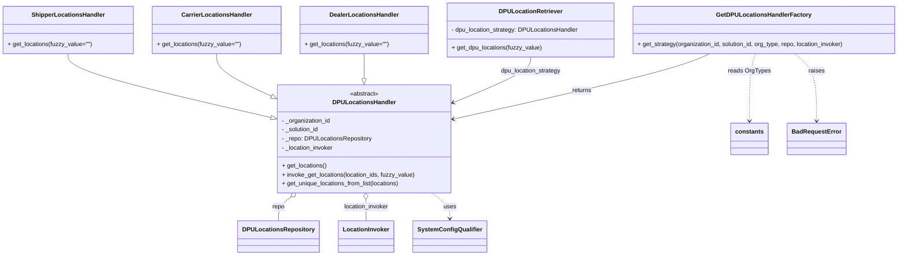

# Diagram: entity_core/entity_search/entity_search/lambdas/filters/get_dpu_locations_list.py

> Auto-generated by Obscura crawlers

## Mermaid

### SVG

<svg id="container" width="2371.3515625" xmlns="http://www.w3.org/2000/svg" class="classDiagram" height="680" viewBox="0 0 2371.3515625 680" role="graphics-document document" aria-roledescription="class"><g><defs><marker id="container_class-aggregationStart" class="marker aggregation class" refX="18" refY="7" markerWidth="190" markerHeight="240" orient="auto"><path d="M 18,7 L9,13 L1,7 L9,1 Z"></path></marker></defs><defs><marker id="container_class-aggregationEnd" class="marker aggregation class" refX="1" refY="7" markerWidth="20" markerHeight="28" orient="auto"><path d="M 18,7 L9,13 L1,7 L9,1 Z"></path></marker></defs><defs><marker id="container_class-extensionStart" class="marker extension class" refX="18" refY="7" markerWidth="190" markerHeight="240" orient="auto"><path d="M 1,7 L18,13 V 1 Z"></path></marker></defs><defs><marker id="container_class-extensionEnd" class="marker extension class" refX="1" refY="7" markerWidth="20" markerHeight="28" orient="auto"><path d="M 1,1 V 13 L18,7 Z"></path></marker></defs><defs><marker id="container_class-compositionStart" class="marker composition class" refX="18" refY="7" markerWidth="190" markerHeight="240" orient="auto"><path d="M 18,7 L9,13 L1,7 L9,1 Z"></path></marker></defs><defs><marker id="container_class-compositionEnd" class="marker composition class" refX="1" refY="7" markerWidth="20" markerHeight="28" orient="auto"><path d="M 18,7 L9,13 L1,7 L9,1 Z"></path></marker></defs><defs><marker id="container_class-dependencyStart" class="marker dependency class" refX="6" refY="7" markerWidth="190" markerHeight="240" orient="auto"><path d="M 5,7 L9,13 L1,7 L9,1 Z"></path></marker></defs><defs><marker id="container_class-dependencyEnd" class="marker dependency class" refX="13" refY="7" markerWidth="20" markerHeight="28" orient="auto"><path d="M 18,7 L9,13 L14,7 L9,1 Z"></path></marker></defs><defs><marker id="container_class-lollipopStart" class="marker lollipop class" refX="13" refY="7" markerWidth="190" markerHeight="240" orient="auto"><circle stroke="black" fill="transparent" cx="7" cy="7" r="6"></circle></marker></defs><defs><marker id="container_class-lollipopEnd" class="marker lollipop class" refX="1" refY="7" markerWidth="190" markerHeight="240" orient="auto"><circle stroke="black" fill="transparent" cx="7" cy="7" r="6"></circle></marker></defs><g class="root"><g class="clusters"></g><g class="edgePaths"><path d="M178.203,143L178.203,150.667C178.203,158.333,178.203,173.667,262.054,201.584C345.905,229.501,513.608,270.003,597.459,290.253L681.31,310.504" id="id_ShipperLocationsHandler_DPULocationsHandler_1" class="edge-thickness-normal edge-pattern-solid relation" style=";;;" data-edge="true" data-et="edge" data-id="id_ShipperLocationsHandler_DPULocationsHandler_1" data-points="W3sieCI6MTc4LjIwMzEyNSwieSI6MTQzfSx7IngiOjE3OC4yMDMxMjUsInkiOjE4OX0seyJ4Ijo2OTguMDc4MTI1LCJ5IjozMTQuNTUzNDA4MTc4Nzk1MTd9XQ==" marker-end="url(#container_class-extensionEnd)"></path><path d="M566.898,143L566.898,150.667C566.898,158.333,566.898,173.667,586.192,191.013C605.486,208.36,644.073,227.719,663.366,237.399L682.66,247.079" id="id_CarrierLocationsHandler_DPULocationsHandler_2" class="edge-thickness-normal edge-pattern-solid relation" style=";;;" data-edge="true" data-et="edge" data-id="id_CarrierLocationsHandler_DPULocationsHandler_2" data-points="W3sieCI6NTY2Ljg5ODQzNzUsInkiOjE0M30seyJ4Ijo1NjYuODk4NDM3NSwieSI6MTg5fSx7IngiOjY5OC4wNzgxMjUsInkiOjI1NC44MTQyNjIyMDI3ODA1M31d" marker-end="url(#container_class-extensionEnd)"></path><path d="M953.188,143L953.188,150.667C953.188,158.333,953.188,173.667,952.719,184.653C952.251,195.64,951.315,202.279,950.847,205.599L950.379,208.919" id="id_DealerLocationsHandler_DPULocationsHandler_3" class="edge-thickness-normal edge-pattern-solid relation" style=";;;" data-edge="true" data-et="edge" data-id="id_DealerLocationsHandler_DPULocationsHandler_3" data-points="W3sieCI6OTUzLjE4NzUsInkiOjE0M30seyJ4Ijo5NTMuMTg3NSwieSI6MTg5fSx7IngiOjk0Ny45NzAwMDE3MjY1MTkzLCJ5IjoyMjZ9XQ==" marker-end="url(#container_class-extensionEnd)"></path><path d="M740.571,525.005L735.342,529.338C730.113,533.67,719.654,542.335,714.425,552.834C709.195,563.333,709.195,575.667,709.195,581.833L709.195,588" id="id_DPULocationsHandler_DPULocationsRepository_4" class="edge-thickness-normal edge-pattern-solid relation" style=";;;" data-edge="true" data-et="edge" data-id="id_DPULocationsHandler_DPULocationsRepository_4" data-points="W3sieCI6NzUzLjg1NDY3MDIzNDgwNjcsInkiOjUxNH0seyJ4Ijo3MDkuMTk1MzEyNSwieSI6NTUxfSx7IngiOjcwOS4xOTUzMTI1LCJ5Ijo1ODh9XQ==" marker-start="url(#container_class-aggregationStart)"></path><path d="M931.791,531.244L931.875,534.537C931.96,537.83,932.128,544.415,932.213,553.874C932.297,563.333,932.297,575.667,932.297,581.833L932.297,588" id="id_DPULocationsHandler_LocationInvoker_5" class="edge-thickness-normal edge-pattern-solid relation" style=";;;" data-edge="true" data-et="edge" data-id="id_DPULocationsHandler_LocationInvoker_5" data-points="W3sieCI6OTMxLjM0OTgzNTk4MDY2MywieSI6NTE0fSx7IngiOjkzMi4yOTY4NzUsInkiOjU1MX0seyJ4Ijo5MzIuMjk2ODc1LCJ5Ijo1ODh9XQ==" marker-start="url(#container_class-aggregationStart)"></path><path d="M1392.512,152L1392.512,158.167C1392.512,164.333,1392.512,176.667,1354.233,197.738C1315.955,218.809,1239.398,248.619,1201.12,263.523L1162.841,278.428" id="id_DPULocationRetriever_DPULocationsHandler_6" class="edge-thickness-normal edge-pattern-solid relation" style=";;;" data-edge="true" data-et="edge" data-id="id_DPULocationRetriever_DPULocationsHandler_6" data-points="W3sieCI6MTM5Mi41MTE3MTg3NSwieSI6MTUyfSx7IngiOjEzOTIuNTExNzE4NzUsInkiOjE4OX0seyJ4IjoxMTU3LjI1LCJ5IjoyODAuNjA1MDAzMzE5Mjk5ODR9XQ==" marker-end="url(#container_class-dependencyEnd)"></path><path d="M1856.212,143L1837.048,150.667C1817.883,158.333,1779.554,173.667,1664.036,202.77C1548.519,231.873,1355.813,274.746,1259.46,296.182L1163.107,317.619" id="id_GetDPULocationsHandlerFactory_DPULocationsHandler_7" class="edge-thickness-normal edge-pattern-solid relation" style=";;;" data-edge="true" data-et="edge" data-id="id_GetDPULocationsHandlerFactory_DPULocationsHandler_7" data-points="W3sieCI6MTg1Ni4yMTIyNDU1NTYxOTI2LCJ5IjoxNDN9LHsieCI6MTc0MS4yMjQ2MDkzNzUsInkiOjE4OX0seyJ4IjoxMTU3LjI1LCJ5IjozMTguOTIxOTg4ODQ2Mjg5Nn1d" marker-end="url(#container_class-dependencyEnd)"></path><path d="M1978.599,143L1974.328,150.667C1970.057,158.333,1961.515,173.667,1957.244,203.5C1952.973,233.333,1952.973,277.667,1952.973,299.833L1952.973,322" id="id_GetDPULocationsHandlerFactory_constants_8" class="edge-thickness-normal edge-pattern-dashed relation" style=";;;" data-edge="true" data-et="edge" data-id="id_GetDPULocationsHandlerFactory_constants_8" data-points="W3sieCI6MTk3OC41OTg3MzEzNjQ2NzksInkiOjE0M30seyJ4IjoxOTUyLjk3MjY1NjI1LCJ5IjoxODl9LHsieCI6MTk1Mi45NzI2NTYyNSwieSI6MzI4fV0=" marker-end="url(#container_class-dependencyEnd)"></path><path d="M1101.473,514L1108.917,520.167C1116.36,526.333,1131.246,538.667,1138.69,550C1146.133,561.333,1146.133,571.667,1146.133,576.833L1146.133,582" id="id_DPULocationsHandler_SystemConfigQualifier_9" class="edge-thickness-normal edge-pattern-dashed relation" style=";;;" data-edge="true" data-et="edge" data-id="id_DPULocationsHandler_SystemConfigQualifier_9" data-points="W3sieCI6MTEwMS40NzM0NTQ3NjUxOTMzLCJ5Ijo1MTR9LHsieCI6MTE0Ni4xMzI4MTI1LCJ5Ijo1NTF9LHsieCI6MTE0Ni4xMzI4MTI1LCJ5Ijo1ODh9XQ==" marker-end="url(#container_class-dependencyEnd)"></path><path d="M2078.043,143L2085.874,150.667C2093.705,158.333,2109.366,173.667,2117.197,203.5C2125.027,233.333,2125.027,277.667,2125.027,299.833L2125.027,322" id="id_GetDPULocationsHandlerFactory_BadRequestError_10" class="edge-thickness-normal edge-pattern-dashed relation" style=";;;" data-edge="true" data-et="edge" data-id="id_GetDPULocationsHandlerFactory_BadRequestError_10" data-points="W3sieCI6MjA3OC4wNDMxODM3NzI5MzU3LCJ5IjoxNDN9LHsieCI6MjEyNS4wMjczNDM3NSwieSI6MTg5fSx7IngiOjIxMjUuMDI3MzQzNzUsInkiOjMyOH1d" marker-end="url(#container_class-dependencyEnd)"></path></g><g class="edgeLabels"><g class="edgeLabel"><g class="label" data-id="id_ShipperLocationsHandler_DPULocationsHandler_1" transform="translate(0, 0)"><foreignObject width="0" height="0">

</foreignObject></g></g><g class="edgeLabel"><g class="label" data-id="id_CarrierLocationsHandler_DPULocationsHandler_2" transform="translate(0, 0)"><foreignObject width="0" height="0">

</foreignObject></g></g><g class="edgeLabel"><g class="label" data-id="id_DealerLocationsHandler_DPULocationsHandler_3" transform="translate(0, 0)"><foreignObject width="0" height="0">

</foreignObject></g></g><g class="edgeLabel" transform="translate(709.1953125, 551)"><g class="label" data-id="id_DPULocationsHandler_DPULocationsRepository_4" transform="translate(-16.6328125, -12)"><foreignObject width="33.265625" height="24">

repo

</foreignObject></g></g><g class="edgeLabel" transform="translate(932.296875, 551)"><g class="label" data-id="id_DPULocationsHandler_LocationInvoker_5" transform="translate(-60.6796875, -12)"><foreignObject width="121.359375" height="24">

location_invoker

</foreignObject></g></g><g class="edgeLabel" transform="translate(1392.51171875, 189)"><g class="label" data-id="id_DPULocationRetriever_DPULocationsHandler_6" transform="translate(-81.0234375, -12)"><foreignObject width="162.046875" height="24">

dpu_location_strategy

</foreignObject></g></g><g class="edgeLabel" transform="translate(1509.68309, 240.51309)"><g class="label" data-id="id_GetDPULocationsHandlerFactory_DPULocationsHandler_7" transform="translate(-26.265625, -12)"><foreignObject width="52.53125" height="24">

returns

</foreignObject></g></g><g class="edgeLabel" transform="translate(1952.97265625, 189)"><g class="label" data-id="id_GetDPULocationsHandlerFactory_constants_8" transform="translate(-55.390625, -12)"><foreignObject width="110.78125" height="24">

reads OrgTypes

</foreignObject></g></g><g class="edgeLabel" transform="translate(1146.1328125, 551)"><g class="label" data-id="id_DPULocationsHandler_SystemConfigQualifier_9" transform="translate(-16.4921875, -12)"><foreignObject width="32.984375" height="24">

uses

</foreignObject></g></g><g class="edgeLabel" transform="translate(2125.02734375, 189)"><g class="label" data-id="id_GetDPULocationsHandlerFactory_BadRequestError_10" transform="translate(-21.25, -12)"><foreignObject width="42.5" height="24">

raises

</foreignObject></g></g></g><g class="nodes"><g class="node default" id="classId-DPULocationsHandler-0" transform="translate(927.6640625, 370)"><g class="basic label-container"><path d="M-229.5859375 -144 L229.5859375 -144 L229.5859375 144 L-229.5859375 144" stroke="none" stroke-width="0" fill="#ECECFF" style=""></path><path d="M-229.5859375 -144 C-125.73465136156152 -144, -21.883365223123036 -144, 229.5859375 -144 M-229.5859375 -144 C-78.72163016242379 -144, 72.14267717515241 -144, 229.5859375 -144 M229.5859375 -144 C229.5859375 -37.38185811345399, 229.5859375 69.23628377309203, 229.5859375 144 M229.5859375 -144 C229.5859375 -83.50930539645682, 229.5859375 -23.018610792913663, 229.5859375 144 M229.5859375 144 C84.89951144578188 144, -59.786914608436234 144, -229.5859375 144 M229.5859375 144 C74.54223655309809 144, -80.50146439380381 144, -229.5859375 144 M-229.5859375 144 C-229.5859375 57.55389179544758, -229.5859375 -28.892216409104833, -229.5859375 -144 M-229.5859375 144 C-229.5859375 37.790733107427144, -229.5859375 -68.41853378514571, -229.5859375 -144" stroke="#9370DB" stroke-width="1.3" fill="none" stroke-dasharray="0 0" style=""></path></g><g class="annotation-group text" transform="translate(-38.609375, -120)"><g class="label" style="" transform="translate(0,-12)"><foreignObject width="77.21875" height="24">

«abstract»

</foreignObject></g></g><g class="label-group text" transform="translate(-79.515625, -96)"><g class="label" style="font-weight: bolder" transform="translate(0,-12)"><foreignObject width="159.03125" height="24">

DPULocationsHandler

</foreignObject></g></g><g class="members-group text" transform="translate(-217.5859375, -48)"><g class="label" style="" transform="translate(0,-12)"><foreignObject width="131.453125" height="24">

- _organization_id

</foreignObject></g><g class="label" style="" transform="translate(0,12)"><foreignObject width="101.234375" height="24">

- _solution_id

</foreignObject></g><g class="label" style="" transform="translate(0,36)"><foreignObject width="238.0625" height="24">

- _repo: DPULocationsRepository

</foreignObject></g><g class="label" style="" transform="translate(0,60)"><foreignObject width="140.203125" height="24">

- _location_invoker

</foreignObject></g></g><g class="methods-group text" transform="translate(-217.5859375, 72)"><g class="label" style="" transform="translate(0,-12)"><foreignObject width="119.9375" height="24">

+ get_locations()

</foreignObject></g><g class="label" style="" transform="translate(0,12)"><foreignObject width="355.65625" height="24">

+ invoke_get_locations(location_ids, fuzzy_value)

</foreignObject></g><g class="label" style="" transform="translate(0,36)"><foreignObject width="317.453125" height="24">

+ get_unique_locations_from_list(locations)

</foreignObject></g></g><g class="divider" style=""><path d="M-229.5859375 -72 C-136.213009942554 -72, -42.84008238510802 -72, 229.5859375 -72 M-229.5859375 -72 C-86.22427760700847 -72, 57.13738228598305 -72, 229.5859375 -72" stroke="#9370DB" stroke-width="1.3" fill="none" stroke-dasharray="0 0" style=""></path></g><g class="divider" style=""><path d="M-229.5859375 48 C-125.2229942226786 48, -20.860050945357187 48, 229.5859375 48 M-229.5859375 48 C-72.63700288504768 48, 84.31193172990464 48, 229.5859375 48" stroke="#9370DB" stroke-width="1.3" fill="none" stroke-dasharray="0 0" style=""></path></g></g><g class="node default" id="classId-ShipperLocationsHandler-1" transform="translate(178.203125, 80)"><g class="basic label-container"><path d="M-170.203125 -63 L170.203125 -63 L170.203125 63 L-170.203125 63" stroke="none" stroke-width="0" fill="#ECECFF" style=""></path><path d="M-170.203125 -63 C-72.45060320295246 -63, 25.30191859409507 -63, 170.203125 -63 M-170.203125 -63 C-44.250239482342934 -63, 81.70264603531413 -63, 170.203125 -63 M170.203125 -63 C170.203125 -22.744509006095875, 170.203125 17.51098198780825, 170.203125 63 M170.203125 -63 C170.203125 -24.378796158181927, 170.203125 14.242407683636145, 170.203125 63 M170.203125 63 C76.69072242285507 63, -16.82168015428985 63, -170.203125 63 M170.203125 63 C65.90088269670828 63, -38.40135960658344 63, -170.203125 63 M-170.203125 63 C-170.203125 24.866574224852258, -170.203125 -13.266851550295485, -170.203125 -63 M-170.203125 63 C-170.203125 14.44599126642241, -170.203125 -34.10801746715518, -170.203125 -63" stroke="#9370DB" stroke-width="1.3" fill="none" stroke-dasharray="0 0" style=""></path></g><g class="annotation-group text" transform="translate(0, -39)"></g><g class="label-group text" transform="translate(-92.921875, -39)"><g class="label" style="font-weight: bolder" transform="translate(0,-12)"><foreignObject width="185.84375" height="24">

ShipperLocationsHandler

</foreignObject></g></g><g class="members-group text" transform="translate(-158.203125, 9)"></g><g class="methods-group text" transform="translate(-158.203125, 39)"><g class="label" style="" transform="translate(0,-12)"><foreignObject width="223.484375" height="24">

+ get_locations(fuzzy_value="")

</foreignObject></g></g><g class="divider" style=""><path d="M-170.203125 -15 C-91.13575009056167 -15, -12.068375181123344 -15, 170.203125 -15 M-170.203125 -15 C-47.3819022502464 -15, 75.4393204995072 -15, 170.203125 -15" stroke="#9370DB" stroke-width="1.3" fill="none" stroke-dasharray="0 0" style=""></path></g><g class="divider" style=""><path d="M-170.203125 9 C-66.8434156116016 9, 36.5162937767968 9, 170.203125 9 M-170.203125 9 C-68.74834340853604 9, 32.70643818292791 9, 170.203125 9" stroke="#9370DB" stroke-width="1.3" fill="none" stroke-dasharray="0 0" style=""></path></g></g><g class="node default" id="classId-CarrierLocationsHandler-2" transform="translate(566.8984375, 80)"><g class="basic label-container"><path d="M-168.4921875 -63 L168.4921875 -63 L168.4921875 63 L-168.4921875 63" stroke="none" stroke-width="0" fill="#ECECFF" style=""></path><path d="M-168.4921875 -63 C-40.417757091092 -63, 87.656673317816 -63, 168.4921875 -63 M-168.4921875 -63 C-53.612057907210996 -63, 61.26807168557801 -63, 168.4921875 -63 M168.4921875 -63 C168.4921875 -34.809216583825545, 168.4921875 -6.618433167651084, 168.4921875 63 M168.4921875 -63 C168.4921875 -26.37022555306779, 168.4921875 10.25954889386442, 168.4921875 63 M168.4921875 63 C54.48144761021375 63, -59.5292922795725 63, -168.4921875 63 M168.4921875 63 C69.00278708314936 63, -30.486613333701285 63, -168.4921875 63 M-168.4921875 63 C-168.4921875 26.245394224113475, -168.4921875 -10.509211551773049, -168.4921875 -63 M-168.4921875 63 C-168.4921875 18.86299459708107, -168.4921875 -25.27401080583786, -168.4921875 -63" stroke="#9370DB" stroke-width="1.3" fill="none" stroke-dasharray="0 0" style=""></path></g><g class="annotation-group text" transform="translate(0, -39)"></g><g class="label-group text" transform="translate(-89.5, -39)"><g class="label" style="font-weight: bolder" transform="translate(0,-12)"><foreignObject width="179" height="24">

CarrierLocationsHandler

</foreignObject></g></g><g class="members-group text" transform="translate(-156.4921875, 9)"></g><g class="methods-group text" transform="translate(-156.4921875, 39)"><g class="label" style="" transform="translate(0,-12)"><foreignObject width="223.484375" height="24">

+ get_locations(fuzzy_value="")

</foreignObject></g></g><g class="divider" style=""><path d="M-168.4921875 -15 C-81.00280705841813 -15, 6.486573383163744 -15, 168.4921875 -15 M-168.4921875 -15 C-72.02260809403492 -15, 24.446971311930156 -15, 168.4921875 -15" stroke="#9370DB" stroke-width="1.3" fill="none" stroke-dasharray="0 0" style=""></path></g><g class="divider" style=""><path d="M-168.4921875 9 C-81.65759406301964 9, 5.176999373960712 9, 168.4921875 9 M-168.4921875 9 C-49.31225651656426 9, 69.86767446687148 9, 168.4921875 9" stroke="#9370DB" stroke-width="1.3" fill="none" stroke-dasharray="0 0" style=""></path></g></g><g class="node default" id="classId-DealerLocationsHandler-3" transform="translate(953.1875, 80)"><g class="basic label-container"><path d="M-167.796875 -63 L167.796875 -63 L167.796875 63 L-167.796875 63" stroke="none" stroke-width="0" fill="#ECECFF" style=""></path><path d="M-167.796875 -63 C-94.71605376209469 -63, -21.635232524189377 -63, 167.796875 -63 M-167.796875 -63 C-76.49842508193736 -63, 14.800024836125289 -63, 167.796875 -63 M167.796875 -63 C167.796875 -19.151611065015686, 167.796875 24.696777869968628, 167.796875 63 M167.796875 -63 C167.796875 -18.44017209272183, 167.796875 26.11965581455634, 167.796875 63 M167.796875 63 C71.76966727369629 63, -24.25754045260743 63, -167.796875 63 M167.796875 63 C43.86861710972153 63, -80.05964078055695 63, -167.796875 63 M-167.796875 63 C-167.796875 14.06508144168383, -167.796875 -34.86983711663234, -167.796875 -63 M-167.796875 63 C-167.796875 25.628909940751825, -167.796875 -11.74218011849635, -167.796875 -63" stroke="#9370DB" stroke-width="1.3" fill="none" stroke-dasharray="0 0" style=""></path></g><g class="annotation-group text" transform="translate(0, -39)"></g><g class="label-group text" transform="translate(-88.109375, -39)"><g class="label" style="font-weight: bolder" transform="translate(0,-12)"><foreignObject width="176.21875" height="24">

DealerLocationsHandler

</foreignObject></g></g><g class="members-group text" transform="translate(-155.796875, 9)"></g><g class="methods-group text" transform="translate(-155.796875, 39)"><g class="label" style="" transform="translate(0,-12)"><foreignObject width="223.484375" height="24">

+ get_locations(fuzzy_value="")

</foreignObject></g></g><g class="divider" style=""><path d="M-167.796875 -15 C-39.01213203757348 -15, 89.77261092485304 -15, 167.796875 -15 M-167.796875 -15 C-60.47274125728933 -15, 46.85139248542134 -15, 167.796875 -15" stroke="#9370DB" stroke-width="1.3" fill="none" stroke-dasharray="0 0" style=""></path></g><g class="divider" style=""><path d="M-167.796875 9 C-41.25977344847479 9, 85.27732810305042 9, 167.796875 9 M-167.796875 9 C-45.15112657238927 9, 77.49462185522145 9, 167.796875 9" stroke="#9370DB" stroke-width="1.3" fill="none" stroke-dasharray="0 0" style=""></path></g></g><g class="node default" id="classId-GetDPULocationsHandlerFactory-4" transform="translate(2013.6953125, 80)"><g class="basic label-container"><path d="M-349.65625 -63 L349.65625 -63 L349.65625 63 L-349.65625 63" stroke="none" stroke-width="0" fill="#ECECFF" style=""></path><path d="M-349.65625 -63 C-106.16326518432618 -63, 137.32971963134764 -63, 349.65625 -63 M-349.65625 -63 C-203.78131998194203 -63, -57.90638996388407 -63, 349.65625 -63 M349.65625 -63 C349.65625 -13.641054105272332, 349.65625 35.71789178945534, 349.65625 63 M349.65625 -63 C349.65625 -37.72252896545437, 349.65625 -12.445057930908739, 349.65625 63 M349.65625 63 C100.85620568694068 63, -147.94383862611863 63, -349.65625 63 M349.65625 63 C76.9855604395645 63, -195.685129120871 63, -349.65625 63 M-349.65625 63 C-349.65625 20.094907598640326, -349.65625 -22.81018480271935, -349.65625 -63 M-349.65625 63 C-349.65625 18.0802706815004, -349.65625 -26.839458636999197, -349.65625 -63" stroke="#9370DB" stroke-width="1.3" fill="none" stroke-dasharray="0 0" style=""></path></g><g class="annotation-group text" transform="translate(0, -39)"></g><g class="label-group text" transform="translate(-118.78125, -39)"><g class="label" style="font-weight: bolder" transform="translate(0,-12)"><foreignObject width="237.5625" height="24">

GetDPULocationsHandlerFactory

</foreignObject></g></g><g class="members-group text" transform="translate(-337.65625, 9)"></g><g class="methods-group text" transform="translate(-337.65625, 39)"><g class="label" style="" transform="translate(0,-12)"><foreignObject width="556.53125" height="24">

+ get_strategy(organization_id, solution_id, org_type, repo, location_invoker)

</foreignObject></g></g><g class="divider" style=""><path d="M-349.65625 -15 C-158.4673287777377 -15, 32.72159244452462 -15, 349.65625 -15 M-349.65625 -15 C-83.43095515299706 -15, 182.79433969400588 -15, 349.65625 -15" stroke="#9370DB" stroke-width="1.3" fill="none" stroke-dasharray="0 0" style=""></path></g><g class="divider" style=""><path d="M-349.65625 9 C-78.07362530037557 9, 193.50899939924886 9, 349.65625 9 M-349.65625 9 C-96.66169193462395 9, 156.3328661307521 9, 349.65625 9" stroke="#9370DB" stroke-width="1.3" fill="none" stroke-dasharray="0 0" style=""></path></g></g><g class="node default" id="classId-DPULocationRetriever-5" transform="translate(1392.51171875, 80)"><g class="basic label-container"><path d="M-221.52734375 -72 L221.52734375 -72 L221.52734375 72 L-221.52734375 72" stroke="none" stroke-width="0" fill="#ECECFF" style=""></path><path d="M-221.52734375 -72 C-128.53235935050387 -72, -35.537374951007735 -72, 221.52734375 -72 M-221.52734375 -72 C-132.88334854943878 -72, -44.23935334887756 -72, 221.52734375 -72 M221.52734375 -72 C221.52734375 -15.174208400202808, 221.52734375 41.651583199594384, 221.52734375 72 M221.52734375 -72 C221.52734375 -41.0024640423403, 221.52734375 -10.0049280846806, 221.52734375 72 M221.52734375 72 C92.8750523377729 72, -35.7772390744542 72, -221.52734375 72 M221.52734375 72 C70.33991578754885 72, -80.8475121749023 72, -221.52734375 72 M-221.52734375 72 C-221.52734375 39.030849201988055, -221.52734375 6.061698403976109, -221.52734375 -72 M-221.52734375 72 C-221.52734375 34.63840828169467, -221.52734375 -2.723183436610654, -221.52734375 -72" stroke="#9370DB" stroke-width="1.3" fill="none" stroke-dasharray="0 0" style=""></path></g><g class="annotation-group text" transform="translate(0, -48)"></g><g class="label-group text" transform="translate(-80.3671875, -48)"><g class="label" style="font-weight: bolder" transform="translate(0,-12)"><foreignObject width="160.734375" height="24">

DPULocationRetriever

</foreignObject></g></g><g class="members-group text" transform="translate(-209.52734375, 0)"><g class="label" style="" transform="translate(0,-12)"><foreignObject width="338.6875" height="24">

- dpu_location_strategy: DPULocationsHandler

</foreignObject></g></g><g class="methods-group text" transform="translate(-209.52734375, 48)"><g class="label" style="" transform="translate(0,-12)"><foreignObject width="239.09375" height="24">

+ get_dpu_locations(fuzzy_value)

</foreignObject></g></g><g class="divider" style=""><path d="M-221.52734375 -24 C-69.92059755715655 -24, 81.68614863568689 -24, 221.52734375 -24 M-221.52734375 -24 C-117.62582696290222 -24, -13.724310175804447 -24, 221.52734375 -24" stroke="#9370DB" stroke-width="1.3" fill="none" stroke-dasharray="0 0" style=""></path></g><g class="divider" style=""><path d="M-221.52734375 24 C-46.86766103373108 24, 127.79202168253784 24, 221.52734375 24 M-221.52734375 24 C-68.35827161513268 24, 84.81080051973464 24, 221.52734375 24" stroke="#9370DB" stroke-width="1.3" fill="none" stroke-dasharray="0 0" style=""></path></g></g><g class="node default" id="classId-DPULocationsRepository-6" transform="translate(709.1953125, 630)"><g class="basic label-container"><path d="M-102.1953125 -42 L102.1953125 -42 L102.1953125 42 L-102.1953125 42" stroke="none" stroke-width="0" fill="#ECECFF" style=""></path><path d="M-102.1953125 -42 C-40.643529942062834 -42, 20.908252615874332 -42, 102.1953125 -42 M-102.1953125 -42 C-59.4945525512183 -42, -16.793792602436596 -42, 102.1953125 -42 M102.1953125 -42 C102.1953125 -22.123050457933736, 102.1953125 -2.2461009158674727, 102.1953125 42 M102.1953125 -42 C102.1953125 -19.30336544776224, 102.1953125 3.3932691044755217, 102.1953125 42 M102.1953125 42 C50.68921481262761 42, -0.8168828747447776 42, -102.1953125 42 M102.1953125 42 C38.643176827346025 42, -24.90895884530795 42, -102.1953125 42 M-102.1953125 42 C-102.1953125 10.014327219418465, -102.1953125 -21.97134556116307, -102.1953125 -42 M-102.1953125 42 C-102.1953125 10.835866372016397, -102.1953125 -20.328267255967205, -102.1953125 -42" stroke="#9370DB" stroke-width="1.3" fill="none" stroke-dasharray="0 0" style=""></path></g><g class="annotation-group text" transform="translate(0, -18)"></g><g class="label-group text" transform="translate(-90.1953125, -18)"><g class="label" style="font-weight: bolder" transform="translate(0,-12)"><foreignObject width="180.390625" height="24">

DPULocationsRepository

</foreignObject></g></g><g class="members-group text" transform="translate(-90.1953125, 30)"></g><g class="methods-group text" transform="translate(-90.1953125, 60)"></g><g class="divider" style=""><path d="M-102.1953125 6 C-45.38487684855274 6, 11.425558802894514 6, 102.1953125 6 M-102.1953125 6 C-56.855096403417804 6, -11.514880306835607 6, 102.1953125 6" stroke="#9370DB" stroke-width="1.3" fill="none" stroke-dasharray="0 0" style=""></path></g><g class="divider" style=""><path d="M-102.1953125 24 C-55.47992078048093 24, -8.764529060961863 24, 102.1953125 24 M-102.1953125 24 C-41.58690230610698 24, 19.021507887786044 24, 102.1953125 24" stroke="#9370DB" stroke-width="1.3" fill="none" stroke-dasharray="0 0" style=""></path></g></g><g class="node default" id="classId-LocationInvoker-7" transform="translate(932.296875, 630)"><g class="basic label-container"><path d="M-70.90625 -42 L70.90625 -42 L70.90625 42 L-70.90625 42" stroke="none" stroke-width="0" fill="#ECECFF" style=""></path><path d="M-70.90625 -42 C-39.8826972122136 -42, -8.859144424427193 -42, 70.90625 -42 M-70.90625 -42 C-32.5042178195782 -42, 5.897814360843597 -42, 70.90625 -42 M70.90625 -42 C70.90625 -21.468771942178876, 70.90625 -0.9375438843577513, 70.90625 42 M70.90625 -42 C70.90625 -16.0852464736357, 70.90625 9.829507052728601, 70.90625 42 M70.90625 42 C41.94985067412318 42, 12.993451348246353 42, -70.90625 42 M70.90625 42 C27.26539120711719 42, -16.37546758576562 42, -70.90625 42 M-70.90625 42 C-70.90625 11.325519256184823, -70.90625 -19.348961487630355, -70.90625 -42 M-70.90625 42 C-70.90625 21.144090297988534, -70.90625 0.28818059597706736, -70.90625 -42" stroke="#9370DB" stroke-width="1.3" fill="none" stroke-dasharray="0 0" style=""></path></g><g class="annotation-group text" transform="translate(0, -18)"></g><g class="label-group text" transform="translate(-58.90625, -18)"><g class="label" style="font-weight: bolder" transform="translate(0,-12)"><foreignObject width="117.8125" height="24">

LocationInvoker

</foreignObject></g></g><g class="members-group text" transform="translate(-58.90625, 30)"></g><g class="methods-group text" transform="translate(-58.90625, 60)"></g><g class="divider" style=""><path d="M-70.90625 6 C-37.28726485956737 6, -3.6682797191347447 6, 70.90625 6 M-70.90625 6 C-35.01765902721646 6, 0.8709319455670794 6, 70.90625 6" stroke="#9370DB" stroke-width="1.3" fill="none" stroke-dasharray="0 0" style=""></path></g><g class="divider" style=""><path d="M-70.90625 24 C-23.958430434411675 24, 22.98938913117665 24, 70.90625 24 M-70.90625 24 C-20.971658713581164 24, 28.962932572837673 24, 70.90625 24" stroke="#9370DB" stroke-width="1.3" fill="none" stroke-dasharray="0 0" style=""></path></g></g><g class="node default" id="classId-SystemConfigQualifier-8" transform="translate(1146.1328125, 630)"><g class="basic label-container"><path d="M-92.9296875 -42 L92.9296875 -42 L92.9296875 42 L-92.9296875 42" stroke="none" stroke-width="0" fill="#ECECFF" style=""></path><path d="M-92.9296875 -42 C-19.64567564726883 -42, 53.63833620546234 -42, 92.9296875 -42 M-92.9296875 -42 C-43.66584002723325 -42, 5.598007445533497 -42, 92.9296875 -42 M92.9296875 -42 C92.9296875 -17.38577727566971, 92.9296875 7.22844544866058, 92.9296875 42 M92.9296875 -42 C92.9296875 -9.227628335972078, 92.9296875 23.544743328055844, 92.9296875 42 M92.9296875 42 C54.69272186065894 42, 16.455756221317884 42, -92.9296875 42 M92.9296875 42 C24.24542815198693 42, -44.43883119602614 42, -92.9296875 42 M-92.9296875 42 C-92.9296875 19.385419862136924, -92.9296875 -3.2291602757261515, -92.9296875 -42 M-92.9296875 42 C-92.9296875 16.212518138759087, -92.9296875 -9.574963722481826, -92.9296875 -42" stroke="#9370DB" stroke-width="1.3" fill="none" stroke-dasharray="0 0" style=""></path></g><g class="annotation-group text" transform="translate(0, -18)"></g><g class="label-group text" transform="translate(-80.9296875, -18)"><g class="label" style="font-weight: bolder" transform="translate(0,-12)"><foreignObject width="161.859375" height="24">

SystemConfigQualifier

</foreignObject></g></g><g class="members-group text" transform="translate(-80.9296875, 30)"></g><g class="methods-group text" transform="translate(-80.9296875, 60)"></g><g class="divider" style=""><path d="M-92.9296875 6 C-53.871104765294064 6, -14.812522030588127 6, 92.9296875 6 M-92.9296875 6 C-53.14765935646321 6, -13.365631212926417 6, 92.9296875 6" stroke="#9370DB" stroke-width="1.3" fill="none" stroke-dasharray="0 0" style=""></path></g><g class="divider" style=""><path d="M-92.9296875 24 C-38.476084012386465 24, 15.97751947522707 24, 92.9296875 24 M-92.9296875 24 C-33.643996531277125 24, 25.64169443744575 24, 92.9296875 24" stroke="#9370DB" stroke-width="1.3" fill="none" stroke-dasharray="0 0" style=""></path></g></g><g class="node default" id="classId-constants-9" transform="translate(1952.97265625, 370)"><g class="basic label-container"><path d="M-47.7734375 -42 L47.7734375 -42 L47.7734375 42 L-47.7734375 42" stroke="none" stroke-width="0" fill="#ECECFF" style=""></path><path d="M-47.7734375 -42 C-18.853225096484564 -42, 10.066987307030871 -42, 47.7734375 -42 M-47.7734375 -42 C-10.414170166435639 -42, 26.945097167128722 -42, 47.7734375 -42 M47.7734375 -42 C47.7734375 -21.65206410522113, 47.7734375 -1.3041282104422578, 47.7734375 42 M47.7734375 -42 C47.7734375 -11.20407432702472, 47.7734375 19.59185134595056, 47.7734375 42 M47.7734375 42 C12.482063210616104 42, -22.80931107876779 42, -47.7734375 42 M47.7734375 42 C21.158082913717664 42, -5.457271672564673 42, -47.7734375 42 M-47.7734375 42 C-47.7734375 21.823161364893394, -47.7734375 1.6463227297867888, -47.7734375 -42 M-47.7734375 42 C-47.7734375 12.191985055418463, -47.7734375 -17.616029889163073, -47.7734375 -42" stroke="#9370DB" stroke-width="1.3" fill="none" stroke-dasharray="0 0" style=""></path></g><g class="annotation-group text" transform="translate(0, -18)"></g><g class="label-group text" transform="translate(-35.7734375, -18)"><g class="label" style="font-weight: bolder" transform="translate(0,-12)"><foreignObject width="71.546875" height="24">

constants

</foreignObject></g></g><g class="members-group text" transform="translate(-35.7734375, 30)"></g><g class="methods-group text" transform="translate(-35.7734375, 60)"></g><g class="divider" style=""><path d="M-47.7734375 6 C-22.728960224370994 6, 2.3155170512580128 6, 47.7734375 6 M-47.7734375 6 C-13.785339156534448 6, 20.202759186931104 6, 47.7734375 6" stroke="#9370DB" stroke-width="1.3" fill="none" stroke-dasharray="0 0" style=""></path></g><g class="divider" style=""><path d="M-47.7734375 24 C-26.999726312868177 24, -6.226015125736353 24, 47.7734375 24 M-47.7734375 24 C-20.588461589857328 24, 6.596514320285344 24, 47.7734375 24" stroke="#9370DB" stroke-width="1.3" fill="none" stroke-dasharray="0 0" style=""></path></g></g><g class="node default" id="classId-BadRequestError-10" transform="translate(2125.02734375, 370)"><g class="basic label-container"><path d="M-74.28125 -42 L74.28125 -42 L74.28125 42 L-74.28125 42" stroke="none" stroke-width="0" fill="#ECECFF" style=""></path><path d="M-74.28125 -42 C-36.94523039792809 -42, 0.3907892041438146 -42, 74.28125 -42 M-74.28125 -42 C-16.5318225329262 -42, 41.2176049341476 -42, 74.28125 -42 M74.28125 -42 C74.28125 -20.90149743882439, 74.28125 0.19700512235122147, 74.28125 42 M74.28125 -42 C74.28125 -13.700517467671773, 74.28125 14.598965064656454, 74.28125 42 M74.28125 42 C38.722630490984464 42, 3.1640109819689286 42, -74.28125 42 M74.28125 42 C26.35217182885649 42, -21.576906342287018 42, -74.28125 42 M-74.28125 42 C-74.28125 14.117000808188472, -74.28125 -13.765998383623057, -74.28125 -42 M-74.28125 42 C-74.28125 17.265533859240982, -74.28125 -7.468932281518036, -74.28125 -42" stroke="#9370DB" stroke-width="1.3" fill="none" stroke-dasharray="0 0" style=""></path></g><g class="annotation-group text" transform="translate(0, -18)"></g><g class="label-group text" transform="translate(-62.28125, -18)"><g class="label" style="font-weight: bolder" transform="translate(0,-12)"><foreignObject width="124.5625" height="24">

BadRequestError

</foreignObject></g></g><g class="members-group text" transform="translate(-62.28125, 30)"></g><g class="methods-group text" transform="translate(-62.28125, 60)"></g><g class="divider" style=""><path d="M-74.28125 6 C-28.241857440266514 6, 17.79753511946697 6, 74.28125 6 M-74.28125 6 C-21.008289523238837 6, 32.26467095352233 6, 74.28125 6" stroke="#9370DB" stroke-width="1.3" fill="none" stroke-dasharray="0 0" style=""></path></g><g class="divider" style=""><path d="M-74.28125 24 C-26.605015961080596 24, 21.071218077838807 24, 74.28125 24 M-74.28125 24 C-26.73749861809501 24, 20.80625276380998 24, 74.28125 24" stroke="#9370DB" stroke-width="1.3" fill="none" stroke-dasharray="0 0" style=""></path></g></g></g></g></g></svg>
