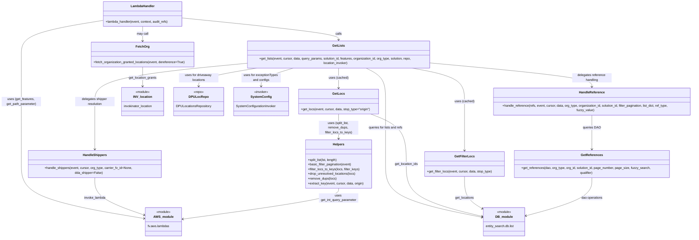

# Diagram: entity_core/entity_search/entity_search/lambdas/filters/get_list.py


> Auto-generated by Obscura crawlers

## Diagram 1



### SVG

<svg id="container" width="3531.3828125" xmlns="http://www.w3.org/2000/svg" class="classDiagram" height="1194" viewBox="0 0 3531.3828125 1194" role="graphics-document document" aria-roledescription="class"><style>#container{font-family:"trebuchet ms",verdana,arial,sans-serif;font-size:16px;fill:#333;}@keyframes edge-animation-frame{from{stroke-dashoffset:0;}}@keyframes dash{to{stroke-dashoffset:0;}}#container .edge-animation-slow{stroke-dasharray:9,5!important;stroke-dashoffset:900;animation:dash 50s linear infinite;stroke-linecap:round;}#container .edge-animation-fast{stroke-dasharray:9,5!important;stroke-dashoffset:900;animation:dash 20s linear infinite;stroke-linecap:round;}#container .error-icon{fill:#552222;}#container .error-text{fill:#552222;stroke:#552222;}#container .edge-thickness-normal{stroke-width:1px;}#container .edge-thickness-thick{stroke-width:3.5px;}#container .edge-pattern-solid{stroke-dasharray:0;}#container .edge-thickness-invisible{stroke-width:0;fill:none;}#container .edge-pattern-dashed{stroke-dasharray:3;}#container .edge-pattern-dotted{stroke-dasharray:2;}#container .marker{fill:#333333;stroke:#333333;}#container .marker.cross{stroke:#333333;}#container svg{font-family:"trebuchet ms",verdana,arial,sans-serif;font-size:16px;}#container p{margin:0;}#container g.classGroup text{fill:#9370DB;stroke:none;font-family:"trebuchet ms",verdana,arial,sans-serif;font-size:10px;}#container g.classGroup text .title{font-weight:bolder;}#container .nodeLabel,#container .edgeLabel{color:#131300;}#container .edgeLabel .label rect{fill:#ECECFF;}#container .label text{fill:#131300;}#container .labelBkg{background:#ECECFF;}#container .edgeLabel .label span{background:#ECECFF;}#container .classTitle{font-weight:bolder;}#container .node rect,#container .node circle,#container .node ellipse,#container .node polygon,#container .node path{fill:#ECECFF;stroke:#9370DB;stroke-width:1px;}#container .divider{stroke:#9370DB;stroke-width:1;}#container g.clickable{cursor:pointer;}#container g.classGroup rect{fill:#ECECFF;stroke:#9370DB;}#container g.classGroup line{stroke:#9370DB;stroke-width:1;}#container .classLabel .box{stroke:none;stroke-width:0;fill:#ECECFF;opacity:0.5;}#container .classLabel .label{fill:#9370DB;font-size:10px;}#container .relation{stroke:#333333;stroke-width:1;fill:none;}#container .dashed-line{stroke-dasharray:3;}#container .dotted-line{stroke-dasharray:1 2;}#container #compositionStart,#container .composition{fill:#333333!important;stroke:#333333!important;stroke-width:1;}#container #compositionEnd,#container .composition{fill:#333333!important;stroke:#333333!important;stroke-width:1;}#container #dependencyStart,#container .dependency{fill:#333333!important;stroke:#333333!important;stroke-width:1;}#container #dependencyStart,#container .dependency{fill:#333333!important;stroke:#333333!important;stroke-width:1;}#container #extensionStart,#container .extension{fill:transparent!important;stroke:#333333!important;stroke-width:1;}#container #extensionEnd,#container .extension{fill:transparent!important;stroke:#333333!important;stroke-width:1;}#container #aggregationStart,#container .aggregation{fill:transparent!important;stroke:#333333!important;stroke-width:1;}#container #aggregationEnd,#container .aggregation{fill:transparent!important;stroke:#333333!important;stroke-width:1;}#container #lollipopStart,#container .lollipop{fill:#ECECFF!important;stroke:#333333!important;stroke-width:1;}#container #lollipopEnd,#container .lollipop{fill:#ECECFF!important;stroke:#333333!important;stroke-width:1;}#container .edgeTerminals{font-size:11px;line-height:initial;}#container .classTitleText{text-anchor:middle;font-size:18px;fill:#333;}#container .label-icon{display:inline-block;height:1em;overflow:visible;vertical-align:-0.125em;}#container .node .label-icon path{fill:currentColor;stroke:revert;stroke-width:revert;}#container :root{--mermaid-font-family:"trebuchet ms",verdana,arial,sans-serif;}</style><g><defs><marker id="container_class-aggregationStart" class="marker aggregation class" refX="18" refY="7" markerWidth="190" markerHeight="240" orient="auto"><path d="M 18,7 L9,13 L1,7 L9,1 Z"></path></marker></defs><defs><marker id="container_class-aggregationEnd" class="marker aggregation class" refX="1" refY="7" markerWidth="20" markerHeight="28" orient="auto"><path d="M 18,7 L9,13 L1,7 L9,1 Z"></path></marker></defs><defs><marker id="container_class-extensionStart" class="marker extension class" refX="18" refY="7" markerWidth="190" markerHeight="240" orient="auto"><path d="M 1,7 L18,13 V 1 Z"></path></marker></defs><defs><marker id="container_class-extensionEnd" class="marker extension class" refX="1" refY="7" markerWidth="20" markerHeight="28" orient="auto"><path d="M 1,1 V 13 L18,7 Z"></path></marker></defs><defs><marker id="container_class-compositionStart" class="marker composition class" refX="18" refY="7" markerWidth="190" markerHeight="240" orient="auto"><path d="M 18,7 L9,13 L1,7 L9,1 Z"></path></marker></defs><defs><marker id="container_class-compositionEnd" class="marker composition class" refX="1" refY="7" markerWidth="20" markerHeight="28" orient="auto"><path d="M 18,7 L9,13 L1,7 L9,1 Z"></path></marker></defs><defs><marker id="container_class-dependencyStart" class="marker dependency class" refX="6" refY="7" markerWidth="190" markerHeight="240" orient="auto"><path d="M 5,7 L9,13 L1,7 L9,1 Z"></path></marker></defs><defs><marker id="container_class-dependencyEnd" class="marker dependency class" refX="13" refY="7" markerWidth="20" markerHeight="28" orient="auto"><path d="M 18,7 L9,13 L14,7 L9,1 Z"></path></marker></defs><defs><marker id="container_class-lollipopStart" class="marker lollipop class" refX="13" refY="7" markerWidth="190" markerHeight="240" orient="auto"><circle stroke="black" fill="transparent" cx="7" cy="7" r="6"></circle></marker></defs><defs><marker id="container_class-lollipopEnd" class="marker lollipop class" refX="1" refY="7" markerWidth="190" markerHeight="240" orient="auto"><circle stroke="black" fill="transparent" cx="7" cy="7" r="6"></circle></marker></defs><g class="root"><g class="clusters"></g><g class="edgePaths"><path d="M926.059,91.454L1056.958,104.712C1187.858,117.969,1449.658,144.485,1580.557,162.909C1711.457,181.333,1711.457,191.667,1711.457,196.833L1711.457,202" id="id_LambdaHandler_GetLists_1" class="edge-thickness-normal edge-pattern-solid relation" style=";;;" data-edge="true" data-et="edge" data-id="id_LambdaHandler_GetLists_1" data-points="W3sieCI6OTI2LjA1ODU5Mzc1LCJ5Ijo5MS40NTQwMjM5NDM0NzI1Mn0seyJ4IjoxNzExLjQ1NzAzMTI1LCJ5IjoxNzF9LHsieCI6MTcxMS40NTcwMzEyNSwieSI6MjA4fV0=" marker-end="url(#container_class-dependencyEnd)"></path><path d="M724.105,134L724.105,140.167C724.105,146.333,724.105,158.667,724.105,170C724.105,181.333,724.105,191.667,724.105,196.833L724.105,202" id="id_LambdaHandler_FetchOrg_2" class="edge-thickness-normal edge-pattern-solid relation" style=";;;" data-edge="true" data-et="edge" data-id="id_LambdaHandler_FetchOrg_2" data-points="W3sieCI6NzI0LjEwNTQ2ODc1LCJ5IjoxMzR9LHsieCI6NzI0LjEwNTQ2ODc1LCJ5IjoxNzF9LHsieCI6NzI0LjEwNTQ2ODc1LCJ5IjoyMDh9XQ==" marker-end="url(#container_class-dependencyEnd)"></path><path d="M522.152,103.779L453.127,114.982C384.102,126.186,246.051,148.593,177.025,176.463C108,204.333,108,237.667,108,273C108,308.333,108,345.667,108,384.5C108,423.333,108,463.667,108,506C108,548.333,108,592.667,108,645.5C108,698.333,108,759.667,108,819C108,878.333,108,935.667,213.844,981.837C319.689,1028.007,531.378,1063.013,637.222,1080.516L743.067,1098.02" id="id_LambdaHandler_AWS_module_3" class="edge-thickness-normal edge-pattern-solid relation" style=";;;" data-edge="true" data-et="edge" data-id="id_LambdaHandler_AWS_module_3" data-points="W3sieCI6NTIyLjE1MjM0Mzc1LCJ5IjoxMDMuNzc4OTg1OTQzNzExNDN9LHsieCI6MTA4LCJ5IjoxNzF9LHsieCI6MTA4LCJ5IjoyNzF9LHsieCI6MTA4LCJ5IjozODN9LHsieCI6MTA4LCJ5Ijo1MDR9LHsieCI6MTA4LCJ5Ijo2Mzd9LHsieCI6MTA4LCJ5Ijo4MjF9LHsieCI6MTA4LCJ5Ijo5OTN9LHsieCI6NzQ4Ljk4NjMyODEyNSwieSI6MTA5OC45OTg2NjI2ODQwODEyfV0=" marker-end="url(#container_class-dependencyEnd)"></path><path d="M1711.457,334L1711.457,342.167C1711.457,350.333,1711.457,366.667,1711.457,383.5C1711.457,400.333,1711.457,417.667,1711.457,426.333L1711.457,435" id="id_GetLists_GetLocs_4" class="edge-thickness-normal edge-pattern-solid relation" style=";;;" data-edge="true" data-et="edge" data-id="id_GetLists_GetLocs_4" data-points="W3sieCI6MTcxMS40NTcwMzEyNSwieSI6MzM0fSx7IngiOjE3MTEuNDU3MDMxMjUsInkiOjM4M30seyJ4IjoxNzExLjQ1NzAzMTI1LCJ5Ijo0NDF9XQ==" marker-end="url(#container_class-dependencyEnd)"></path><path d="M2073.577,334L2120.519,342.167C2167.46,350.333,2261.344,366.667,2308.285,395C2355.227,423.333,2355.227,463.667,2355.227,506C2355.227,548.333,2355.227,592.667,2355.227,634C2355.227,675.333,2355.227,713.667,2355.227,732.833L2355.227,752" id="id_GetLists_GetFilterLocs_5" class="edge-thickness-normal edge-pattern-solid relation" style=";;;" data-edge="true" data-et="edge" data-id="id_GetLists_GetFilterLocs_5" data-points="W3sieCI6MjA3My41NzczOTI1NzgxMjUsInkiOjMzNH0seyJ4IjoyMzU1LjIyNjU2MjUsInkiOjM4M30seyJ4IjoyMzU1LjIyNjU2MjUsInkiOjUwNH0seyJ4IjoyMzU1LjIyNjU2MjUsInkiOjYzN30seyJ4IjoyMzU1LjIyNjU2MjUsInkiOjc1OH1d" marker-end="url(#container_class-dependencyEnd)"></path><path d="M2194.535,312.78L2329.852,324.484C2465.169,336.187,2735.803,359.593,2871.12,379.963C3006.438,400.333,3006.438,417.667,3006.438,426.333L3006.438,435" id="id_GetLists_HandleReference_6" class="edge-thickness-normal edge-pattern-solid relation" style=";;;" data-edge="true" data-et="edge" data-id="id_GetLists_HandleReference_6" data-points="W3sieCI6MjE5NC41MzUxNTYyNSwieSI6MzEyLjc4MDM1OTg2MzA1Mjl9LHsieCI6MzAwNi40Mzc1LCJ5IjozODN9LHsieCI6MzAwNi40Mzc1LCJ5Ijo0NDF9XQ==" marker-end="url(#container_class-dependencyEnd)"></path><path d="M1228.379,314.931L1103.626,326.276C978.874,337.62,729.368,360.31,604.616,391.822C479.863,423.333,479.863,463.667,479.863,506C479.863,548.333,479.863,592.667,479.863,634C479.863,675.333,479.863,713.667,479.863,732.833L479.863,752" id="id_GetLists_HandleShippers_7" class="edge-thickness-normal edge-pattern-solid relation" style=";;;" data-edge="true" data-et="edge" data-id="id_GetLists_HandleShippers_7" data-points="W3sieCI6MTIyOC4zNzg5MDYyNSwieSI6MzE0LjkzMDY3OTI1MTk4NTV9LHsieCI6NDc5Ljg2MzI4MTI1LCJ5IjozODN9LHsieCI6NDc5Ljg2MzI4MTI1LCJ5Ijo1MDR9LHsieCI6NDc5Ljg2MzI4MTI1LCJ5Ijo2Mzd9LHsieCI6NDc5Ljg2MzI4MTI1LCJ5Ijo3NTh9XQ==" marker-end="url(#container_class-dependencyEnd)"></path><path d="M1845.565,334L1862.949,342.167C1880.334,350.333,1915.102,366.667,1932.487,395C1949.871,423.333,1949.871,463.667,1949.871,506C1949.871,548.333,1949.871,592.667,1949.871,645.5C1949.871,698.333,1949.871,759.667,1949.871,819C1949.871,878.333,1949.871,935.667,2034.026,980.844C2118.181,1026.021,2286.49,1059.042,2370.645,1075.553L2454.8,1092.063" id="id_GetLists_DB_module_8" class="edge-thickness-normal edge-pattern-solid relation" style=";;;" data-edge="true" data-et="edge" data-id="id_GetLists_DB_module_8" data-points="W3sieCI6MTg0NS41NjQ5NDE0MDYyNSwieSI6MzM0fSx7IngiOjE5NDkuODcxMDkzNzUsInkiOjM4M30seyJ4IjoxOTQ5Ljg3MTA5Mzc1LCJ5Ijo1MDR9LHsieCI6MTk0OS44NzEwOTM3NSwieSI6NjM3fSx7IngiOjE5NDkuODcxMDkzNzUsInkiOjgyMX0seyJ4IjoxOTQ5Ljg3MTA5Mzc1LCJ5Ijo5OTN9LHsieCI6MjQ2MC42ODc1LCJ5IjoxMDkzLjIxODE4OTA3MzEyODh9XQ==" marker-end="url(#container_class-dependencyEnd)"></path><path d="M1875.763,567L1906.189,578.667C1936.616,590.333,1997.47,613.667,2027.897,656C2058.324,698.333,2058.324,759.667,2058.324,819C2058.324,878.333,2058.324,935.667,2124.412,980.066C2190.5,1024.465,2322.675,1055.93,2388.763,1071.662L2454.851,1087.395" id="id_GetLocs_DB_module_9" class="edge-thickness-normal edge-pattern-solid relation" style=";;;" data-edge="true" data-et="edge" data-id="id_GetLocs_DB_module_9" data-points="W3sieCI6MTg3NS43NjI1NDExMTg0MjEsInkiOjU2N30seyJ4IjoyMDU4LjMyNDIxODc1LCJ5Ijo2Mzd9LHsieCI6MjA1OC4zMjQyMTg3NSwieSI6ODIxfSx7IngiOjIwNTguMzI0MjE4NzUsInkiOjk5M30seyJ4IjoyNDYwLjY4NzUsInkiOjEwODguNzgzOTk1MDIwMDU4fV0=" marker-end="url(#container_class-dependencyEnd)"></path><path d="M1711.457,567L1711.457,578.667C1711.457,590.333,1711.457,613.667,1711.457,634.5C1711.457,655.333,1711.457,673.667,1711.457,682.833L1711.457,692" id="id_GetLocs_Helpers_10" class="edge-thickness-normal edge-pattern-solid relation" style=";;;" data-edge="true" data-et="edge" data-id="id_GetLocs_Helpers_10" data-points="W3sieCI6MTcxMS40NTcwMzEyNSwieSI6NTY3fSx7IngiOjE3MTEuNDU3MDMxMjUsInkiOjYzN30seyJ4IjoxNzExLjQ1NzAzMTI1LCJ5Ijo2OTh9XQ==" marker-end="url(#container_class-dependencyEnd)"></path><path d="M2355.227,884L2355.227,902.167C2355.227,920.333,2355.227,956.667,2371.936,984.398C2388.644,1012.129,2422.062,1031.258,2438.771,1040.822L2455.48,1050.386" id="id_GetFilterLocs_DB_module_11" class="edge-thickness-normal edge-pattern-solid relation" style=";;;" data-edge="true" data-et="edge" data-id="id_GetFilterLocs_DB_module_11" data-points="W3sieCI6MjM1NS4yMjY1NjI1LCJ5Ijo4ODR9LHsieCI6MjM1NS4yMjY1NjI1LCJ5Ijo5OTN9LHsieCI6MjQ2MC42ODc1LCJ5IjoxMDUzLjM2Njk1OTI1MzQ0MTh9XQ==" marker-end="url(#container_class-dependencyEnd)"></path><path d="M3006.438,567L3006.438,578.667C3006.438,590.333,3006.438,613.667,3006.438,644.5C3006.438,675.333,3006.438,713.667,3006.438,732.833L3006.438,752" id="id_HandleReference_GetReferences_12" class="edge-thickness-normal edge-pattern-solid relation" style=";;;" data-edge="true" data-et="edge" data-id="id_HandleReference_GetReferences_12" data-points="W3sieCI6MzAwNi40Mzc1LCJ5Ijo1Njd9LHsieCI6MzAwNi40Mzc1LCJ5Ijo2Mzd9LHsieCI6MzAwNi40Mzc1LCJ5Ijo3NTh9XQ==" marker-end="url(#container_class-dependencyEnd)"></path><path d="M479.863,884L479.863,902.167C479.863,920.333,479.863,956.667,523.769,989.597C567.675,1022.528,655.487,1052.056,699.393,1066.82L743.299,1081.584" id="id_HandleShippers_AWS_module_13" class="edge-thickness-normal edge-pattern-solid relation" style=";;;" data-edge="true" data-et="edge" data-id="id_HandleShippers_AWS_module_13" data-points="W3sieCI6NDc5Ljg2MzI4MTI1LCJ5Ijo4ODR9LHsieCI6NDc5Ljg2MzI4MTI1LCJ5Ijo5OTN9LHsieCI6NzQ4Ljk4NjMyODEyNSwieSI6MTA4My40OTU5OTcwMDM4NTkyfV0=" marker-end="url(#container_class-dependencyEnd)"></path><path d="M724.105,334L724.105,342.167C724.105,350.333,724.105,366.667,724.105,382C724.105,397.333,724.105,411.667,724.105,418.833L724.105,426" id="id_FetchOrg_INV_location_14" class="edge-thickness-normal edge-pattern-solid relation" style=";;;" data-edge="true" data-et="edge" data-id="id_FetchOrg_INV_location_14" data-points="W3sieCI6NzI0LjEwNTQ2ODc1LCJ5IjozMzR9LHsieCI6NzI0LjEwNTQ2ODc1LCJ5IjozODN9LHsieCI6NzI0LjEwNTQ2ODc1LCJ5Ijo0MzJ9XQ==" marker-end="url(#container_class-dependencyEnd)"></path><path d="M1315.398,334L1264.057,342.167C1212.716,350.333,1110.034,366.667,1058.693,382C1007.352,397.333,1007.352,411.667,1007.352,418.833L1007.352,426" id="id_GetLists_DPULocRepo_15" class="edge-thickness-normal edge-pattern-solid relation" style=";;;" data-edge="true" data-et="edge" data-id="id_GetLists_DPULocRepo_15" data-points="W3sieCI6MTMxNS4zOTc3MDUwNzgxMjUsInkiOjMzNH0seyJ4IjoxMDA3LjM1MTU2MjUsInkiOjM4M30seyJ4IjoxMDA3LjM1MTU2MjUsInkiOjQzMn1d" marker-end="url(#container_class-dependencyEnd)"></path><path d="M1491.093,334L1462.528,342.167C1433.962,350.333,1376.831,366.667,1348.265,382C1319.699,397.333,1319.699,411.667,1319.699,418.833L1319.699,426" id="id_GetLists_SystemConfig_16" class="edge-thickness-normal edge-pattern-solid relation" style=";;;" data-edge="true" data-et="edge" data-id="id_GetLists_SystemConfig_16" data-points="W3sieCI6MTQ5MS4wOTMyNjE3MTg3NSwieSI6MzM0fSx7IngiOjEzMTkuNjk5MjE4NzUsInkiOjM4M30seyJ4IjoxMzE5LjY5OTIxODc1LCJ5Ijo0MzJ9XQ==" marker-end="url(#container_class-dependencyEnd)"></path><path d="M1711.457,944L1711.457,952.167C1711.457,960.333,1711.457,976.667,1582.274,1002.764C1453.091,1028.861,1194.725,1064.723,1065.542,1082.653L936.359,1100.584" id="id_Helpers_AWS_module_17" class="edge-thickness-normal edge-pattern-solid relation" style=";;;" data-edge="true" data-et="edge" data-id="id_Helpers_AWS_module_17" data-points="W3sieCI6MTcxMS40NTcwMzEyNSwieSI6OTQ0fSx7IngiOjE3MTEuNDU3MDMxMjUsInkiOjk5M30seyJ4Ijo5MzAuNDE2MDE1NjI1LCJ5IjoxMTAxLjQwODc0OTg1MTU3MDN9XQ==" marker-end="url(#container_class-dependencyEnd)"></path><path d="M3006.438,884L3006.438,902.167C3006.438,920.333,3006.438,956.667,2951.752,989.878C2897.066,1023.089,2787.695,1053.178,2733.01,1068.223L2678.324,1083.267" id="id_GetReferences_DB_module_18" class="edge-thickness-normal edge-pattern-solid relation" style=";;;" data-edge="true" data-et="edge" data-id="id_GetReferences_DB_module_18" data-points="W3sieCI6MzAwNi40Mzc1LCJ5Ijo4ODR9LHsieCI6MzAwNi40Mzc1LCJ5Ijo5OTN9LHsieCI6MjY3Mi41MzkwNjI1LCJ5IjoxMDg0Ljg1ODc2ODE1MTMzODh9XQ==" marker-end="url(#container_class-dependencyEnd)"></path></g><g class="edgeLabels"><g class="edgeLabel" transform="translate(1711.45703125, 171)"><g class="label" data-id="id_LambdaHandler_GetLists_1" transform="translate(-16.4453125, -12)"><foreignObject width="32.890625" height="24"><div xmlns="http://www.w3.org/1999/xhtml" class="labelBkg" style="display: table-cell; white-space: nowrap; line-height: 1.5; max-width: 200px; text-align: center;"><span class="edgeLabel"><p>calls</p></span></div></foreignObject></g></g><g class="edgeLabel" transform="translate(724.10546875, 171)"><g class="label" data-id="id_LambdaHandler_FetchOrg_2" transform="translate(-29.8515625, -12)"><foreignObject width="59.703125" height="24"><div xmlns="http://www.w3.org/1999/xhtml" class="labelBkg" style="display: table-cell; white-space: nowrap; line-height: 1.5; max-width: 200px; text-align: center;"><span class="edgeLabel"><p>may call</p></span></div></foreignObject></g></g><g class="edgeLabel" transform="translate(108, 504)"><g class="label" data-id="id_LambdaHandler_AWS_module_3" transform="translate(-100, -24)"><foreignObject width="200" height="48"><div xmlns="http://www.w3.org/1999/xhtml" class="labelBkg" style="display: table; white-space: break-spaces; line-height: 1.5; max-width: 200px; text-align: center; width: 200px;"><span class="edgeLabel"><p>uses (get_features, get_path_parameter)</p></span></div></foreignObject></g></g><g class="edgeLabel" transform="translate(1711.45703125, 383)"><g class="label" data-id="id_GetLists_GetLocs_4" transform="translate(-49.546875, -12)"><foreignObject width="99.09375" height="24"><div xmlns="http://www.w3.org/1999/xhtml" class="labelBkg" style="display: table-cell; white-space: nowrap; line-height: 1.5; max-width: 200px; text-align: center;"><span class="edgeLabel"><p>uses (cached)</p></span></div></foreignObject></g></g><g class="edgeLabel" transform="translate(2355.2265625, 504)"><g class="label" data-id="id_GetLists_GetFilterLocs_5" transform="translate(-49.546875, -12)"><foreignObject width="99.09375" height="24"><div xmlns="http://www.w3.org/1999/xhtml" class="labelBkg" style="display: table-cell; white-space: nowrap; line-height: 1.5; max-width: 200px; text-align: center;"><span class="edgeLabel"><p>uses (cached)</p></span></div></foreignObject></g></g><g class="edgeLabel" transform="translate(3006.4375, 383)"><g class="label" data-id="id_GetLists_HandleReference_6" transform="translate(-100, -24)"><foreignObject width="200" height="48"><div xmlns="http://www.w3.org/1999/xhtml" class="labelBkg" style="display: table; white-space: break-spaces; line-height: 1.5; max-width: 200px; text-align: center; width: 200px;"><span class="edgeLabel"><p>delegates reference handling</p></span></div></foreignObject></g></g><g class="edgeLabel" transform="translate(479.86328125, 504)"><g class="label" data-id="id_GetLists_HandleShippers_7" transform="translate(-100, -24)"><foreignObject width="200" height="48"><div xmlns="http://www.w3.org/1999/xhtml" class="labelBkg" style="display: table; white-space: break-spaces; line-height: 1.5; max-width: 200px; text-align: center; width: 200px;"><span class="edgeLabel"><p>delegates shipper resolution</p></span></div></foreignObject></g></g><g class="edgeLabel" transform="translate(1949.87109375, 637)"><g class="label" data-id="id_GetLists_DB_module_8" transform="translate(-88.453125, -12)"><foreignObject width="176.90625" height="24"><div xmlns="http://www.w3.org/1999/xhtml" class="labelBkg" style="display: table-cell; white-space: nowrap; line-height: 1.5; max-width: 200px; text-align: center;"><span class="edgeLabel"><p>queries for lists and refs</p></span></div></foreignObject></g></g><g class="edgeLabel" transform="translate(2058.32421875, 821)"><g class="label" data-id="id_GetLocs_DB_module_9" transform="translate(-59.875, -12)"><foreignObject width="119.75" height="24"><div xmlns="http://www.w3.org/1999/xhtml" class="labelBkg" style="display: table-cell; white-space: nowrap; line-height: 1.5; max-width: 200px; text-align: center;"><span class="edgeLabel"><p>get_location_ids</p></span></div></foreignObject></g></g><g class="edgeLabel" transform="translate(1711.45703125, 637)"><g class="label" data-id="id_GetLocs_Helpers_10" transform="translate(-100, -36)"><foreignObject width="200" height="72"><div xmlns="http://www.w3.org/1999/xhtml" class="labelBkg" style="display: table; white-space: break-spaces; line-height: 1.5; max-width: 200px; text-align: center; width: 200px;"><span class="edgeLabel"><p>uses (split_list, remove_dups, filter_locs_to_keys)</p></span></div></foreignObject></g></g><g class="edgeLabel" transform="translate(2355.2265625, 993)"><g class="label" data-id="id_GetFilterLocs_DB_module_11" transform="translate(-48.6796875, -12)"><foreignObject width="97.359375" height="24"><div xmlns="http://www.w3.org/1999/xhtml" class="labelBkg" style="display: table-cell; white-space: nowrap; line-height: 1.5; max-width: 200px; text-align: center;"><span class="edgeLabel"><p>get_locations</p></span></div></foreignObject></g></g><g class="edgeLabel" transform="translate(3006.4375, 637)"><g class="label" data-id="id_HandleReference_GetReferences_12" transform="translate(-44.4765625, -12)"><foreignObject width="88.953125" height="24"><div xmlns="http://www.w3.org/1999/xhtml" class="labelBkg" style="display: table-cell; white-space: nowrap; line-height: 1.5; max-width: 200px; text-align: center;"><span class="edgeLabel"><p>queries DAO</p></span></div></foreignObject></g></g><g class="edgeLabel" transform="translate(479.86328125, 993)"><g class="label" data-id="id_HandleShippers_AWS_module_13" transform="translate(-55.171875, -12)"><foreignObject width="110.34375" height="24"><div xmlns="http://www.w3.org/1999/xhtml" class="labelBkg" style="display: table-cell; white-space: nowrap; line-height: 1.5; max-width: 200px; text-align: center;"><span class="edgeLabel"><p>invoke_lambda</p></span></div></foreignObject></g></g><g class="edgeLabel" transform="translate(724.10546875, 383)"><g class="label" data-id="id_FetchOrg_INV_location_14" transform="translate(-71.8046875, -12)"><foreignObject width="143.609375" height="24"><div xmlns="http://www.w3.org/1999/xhtml" class="labelBkg" style="display: table-cell; white-space: nowrap; line-height: 1.5; max-width: 200px; text-align: center;"><span class="edgeLabel"><p>get_location_grants</p></span></div></foreignObject></g></g><g class="edgeLabel" transform="translate(1007.3515625, 383)"><g class="label" data-id="id_GetLists_DPULocRepo_15" transform="translate(-100, -24)"><foreignObject width="200" height="48"><div xmlns="http://www.w3.org/1999/xhtml" class="labelBkg" style="display: table; white-space: break-spaces; line-height: 1.5; max-width: 200px; text-align: center; width: 200px;"><span class="edgeLabel"><p>uses for driveaway locations</p></span></div></foreignObject></g></g><g class="edgeLabel" transform="translate(1319.69921875, 383)"><g class="label" data-id="id_GetLists_SystemConfig_16" transform="translate(-100, -24)"><foreignObject width="200" height="48"><div xmlns="http://www.w3.org/1999/xhtml" class="labelBkg" style="display: table; white-space: break-spaces; line-height: 1.5; max-width: 200px; text-align: center; width: 200px;"><span class="edgeLabel"><p>uses for exceptionTypes and configs</p></span></div></foreignObject></g></g><g class="edgeLabel" transform="translate(1711.45703125, 993)"><g class="label" data-id="id_Helpers_AWS_module_17" transform="translate(-100, -24)"><foreignObject width="200" height="48"><div xmlns="http://www.w3.org/1999/xhtml" class="labelBkg" style="display: table; white-space: break-spaces; line-height: 1.5; max-width: 200px; text-align: center; width: 200px;"><span class="edgeLabel"><p>uses get_int_query_parameter</p></span></div></foreignObject></g></g><g class="edgeLabel" transform="translate(3006.4375, 993)"><g class="label" data-id="id_GetReferences_DB_module_18" transform="translate(-55.1171875, -12)"><foreignObject width="110.234375" height="24"><div xmlns="http://www.w3.org/1999/xhtml" class="labelBkg" style="display: table-cell; white-space: nowrap; line-height: 1.5; max-width: 200px; text-align: center;"><span class="edgeLabel"><p>dao operations</p></span></div></foreignObject></g></g></g><g class="nodes"><g class="node default" id="classId-LambdaHandler-0" transform="translate(724.10546875, 71)"><g class="basic label-container"><path d="M-201.953125 -63 L201.953125 -63 L201.953125 63 L-201.953125 63" stroke="none" stroke-width="0" fill="#ECECFF" style=""></path><path d="M-201.953125 -63 C-97.84017782381427 -63, 6.272769352371455 -63, 201.953125 -63 M-201.953125 -63 C-84.66279909148008 -63, 32.627526817039836 -63, 201.953125 -63 M201.953125 -63 C201.953125 -36.43627832526686, 201.953125 -9.872556650533724, 201.953125 63 M201.953125 -63 C201.953125 -34.15355229431626, 201.953125 -5.3071045886325265, 201.953125 63 M201.953125 63 C63.51745953091424 63, -74.91820593817152 63, -201.953125 63 M201.953125 63 C85.67118181782612 63, -30.610761364347752 63, -201.953125 63 M-201.953125 63 C-201.953125 13.816761121138654, -201.953125 -35.36647775772269, -201.953125 -63 M-201.953125 63 C-201.953125 36.17745299230103, -201.953125 9.354905984602048, -201.953125 -63" stroke="#9370DB" stroke-width="1.3" fill="none" stroke-dasharray="0 0" style=""></path></g><g class="annotation-group text" transform="translate(0, -39)"></g><g class="label-group text" transform="translate(-58.21875, -39)"><g class="label" style="font-weight: bolder" transform="translate(0,-12)"><foreignObject width="116.4375" height="24"><div xmlns="http://www.w3.org/1999/xhtml" style="display: table-cell; white-space: nowrap; line-height: 1.5; max-width: 167px; text-align: center;"><span class="nodeLabel markdown-node-label" style=""><p>LambdaHandler</p></span></div></foreignObject></g></g><g class="members-group text" transform="translate(-189.953125, 9)"></g><g class="methods-group text" transform="translate(-189.953125, 39)"><g class="label" style="" transform="translate(0,-12)"><foreignObject width="321.6875" height="24"><div xmlns="http://www.w3.org/1999/xhtml" style="display: table-cell; white-space: nowrap; line-height: 1.5; max-width: 379px; text-align: center;"><span class="nodeLabel markdown-node-label" style=""><p>+lambda_handler(event, context, audit_refs)</p></span></div></foreignObject></g></g><g class="divider" style=""><path d="M-201.953125 -15 C-106.1810905088508 -15, -10.409056017701602 -15, 201.953125 -15 M-201.953125 -15 C-102.0588816166942 -15, -2.164638233388388 -15, 201.953125 -15" stroke="#9370DB" stroke-width="1.3" fill="none" stroke-dasharray="0 0" style=""></path></g><g class="divider" style=""><path d="M-201.953125 9 C-117.60302626218744 9, -33.25292752437488 9, 201.953125 9 M-201.953125 9 C-55.50377895172139 9, 90.94556709655723 9, 201.953125 9" stroke="#9370DB" stroke-width="1.3" fill="none" stroke-dasharray="0 0" style=""></path></g></g><g class="node default" id="classId-GetLists-1" transform="translate(1711.45703125, 271)"><g class="basic label-container"><path d="M-483.078125 -63 L483.078125 -63 L483.078125 63 L-483.078125 63" stroke="none" stroke-width="0" fill="#ECECFF" style=""></path><path d="M-483.078125 -63 C-224.9569591623673 -63, 33.164206675265405 -63, 483.078125 -63 M-483.078125 -63 C-203.46666980606153 -63, 76.14478538787694 -63, 483.078125 -63 M483.078125 -63 C483.078125 -25.100079737306267, 483.078125 12.799840525387467, 483.078125 63 M483.078125 -63 C483.078125 -15.840409302831695, 483.078125 31.31918139433661, 483.078125 63 M483.078125 63 C198.8781798880193 63, -85.32176522396139 63, -483.078125 63 M483.078125 63 C181.2791717791735 63, -120.51978144165298 63, -483.078125 63 M-483.078125 63 C-483.078125 27.869962748983625, -483.078125 -7.260074502032751, -483.078125 -63 M-483.078125 63 C-483.078125 16.816918397469415, -483.078125 -29.36616320506117, -483.078125 -63" stroke="#9370DB" stroke-width="1.3" fill="none" stroke-dasharray="0 0" style=""></path></g><g class="annotation-group text" transform="translate(0, -39)"></g><g class="label-group text" transform="translate(-29.84375, -39)"><g class="label" style="font-weight: bolder" transform="translate(0,-12)"><foreignObject width="59.6875" height="24"><div xmlns="http://www.w3.org/1999/xhtml" style="display: table-cell; white-space: nowrap; line-height: 1.5; max-width: 108px; text-align: center;"><span class="nodeLabel markdown-node-label" style=""><p>GetLists</p></span></div></foreignObject></g></g><g class="members-group text" transform="translate(-471.078125, 9)"></g><g class="methods-group text" transform="translate(-471.078125, 39)"><g class="label" style="" transform="translate(0,-12)"><foreignObject width="912.3125" height="24"><div xmlns="http://www.w3.org/1999/xhtml" style="display: table-cell; white-space: nowrap; line-height: 1.5; max-width: 970px; text-align: center;"><span class="nodeLabel markdown-node-label" style=""><p>+get_lists(event, cursor, data, query_params, solution_id, features, organization_id, org_type, solution, repo, location_invoker)</p></span></div></foreignObject></g></g><g class="divider" style=""><path d="M-483.078125 -15 C-256.61444129392567 -15, -30.15075758785133 -15, 483.078125 -15 M-483.078125 -15 C-219.31439398147 -15, 44.44933703705999 -15, 483.078125 -15" stroke="#9370DB" stroke-width="1.3" fill="none" stroke-dasharray="0 0" style=""></path></g><g class="divider" style=""><path d="M-483.078125 9 C-273.57859817989856 9, -64.07907135979718 9, 483.078125 9 M-483.078125 9 C-183.2108230459217 9, 116.6564789081566 9, 483.078125 9" stroke="#9370DB" stroke-width="1.3" fill="none" stroke-dasharray="0 0" style=""></path></g></g><g class="node default" id="classId-GetLocs-2" transform="translate(1711.45703125, 504)"><g class="basic label-container"><path d="M-203.4140625 -63 L203.4140625 -63 L203.4140625 63 L-203.4140625 63" stroke="none" stroke-width="0" fill="#ECECFF" style=""></path><path d="M-203.4140625 -63 C-42.49938114034268 -63, 118.41530021931464 -63, 203.4140625 -63 M-203.4140625 -63 C-55.120539541412654 -63, 93.17298341717469 -63, 203.4140625 -63 M203.4140625 -63 C203.4140625 -33.64988348734758, 203.4140625 -4.299766974695167, 203.4140625 63 M203.4140625 -63 C203.4140625 -32.014233478174106, 203.4140625 -1.0284669563482112, 203.4140625 63 M203.4140625 63 C97.78570524421443 63, -7.842652011571147 63, -203.4140625 63 M203.4140625 63 C102.10686529374692 63, 0.799668087493842 63, -203.4140625 63 M-203.4140625 63 C-203.4140625 15.661403588785227, -203.4140625 -31.677192822429546, -203.4140625 -63 M-203.4140625 63 C-203.4140625 34.575728878152034, -203.4140625 6.151457756304062, -203.4140625 -63" stroke="#9370DB" stroke-width="1.3" fill="none" stroke-dasharray="0 0" style=""></path></g><g class="annotation-group text" transform="translate(0, -39)"></g><g class="label-group text" transform="translate(-28.9375, -39)"><g class="label" style="font-weight: bolder" transform="translate(0,-12)"><foreignObject width="57.875" height="24"><div xmlns="http://www.w3.org/1999/xhtml" style="display: table-cell; white-space: nowrap; line-height: 1.5; max-width: 107px; text-align: center;"><span class="nodeLabel markdown-node-label" style=""><p>GetLocs</p></span></div></foreignObject></g></g><g class="members-group text" transform="translate(-191.4140625, 9)"></g><g class="methods-group text" transform="translate(-191.4140625, 39)"><g class="label" style="" transform="translate(0,-12)"><foreignObject width="353.890625" height="24"><div xmlns="http://www.w3.org/1999/xhtml" style="display: table-cell; white-space: nowrap; line-height: 1.5; max-width: 411px; text-align: center;"><span class="nodeLabel markdown-node-label" style=""><p>+get_locs(event, cursor, data, stop_type="origin")</p></span></div></foreignObject></g></g><g class="divider" style=""><path d="M-203.4140625 -15 C-98.80324925505886 -15, 5.807563989882283 -15, 203.4140625 -15 M-203.4140625 -15 C-81.12837275693627 -15, 41.157316986127455 -15, 203.4140625 -15" stroke="#9370DB" stroke-width="1.3" fill="none" stroke-dasharray="0 0" style=""></path></g><g class="divider" style=""><path d="M-203.4140625 9 C-84.91334653214308 9, 33.58736943571384 9, 203.4140625 9 M-203.4140625 9 C-82.71012569355828 9, 37.993811112883435 9, 203.4140625 9" stroke="#9370DB" stroke-width="1.3" fill="none" stroke-dasharray="0 0" style=""></path></g></g><g class="node default" id="classId-GetFilterLocs-3" transform="translate(2355.2265625, 821)"><g class="basic label-container"><path d="M-202.02734375 -63 L202.02734375 -63 L202.02734375 63 L-202.02734375 63" stroke="none" stroke-width="0" fill="#ECECFF" style=""></path><path d="M-202.02734375 -63 C-113.0612918854753 -63, -24.095240020950598 -63, 202.02734375 -63 M-202.02734375 -63 C-61.19931417708628 -63, 79.62871539582744 -63, 202.02734375 -63 M202.02734375 -63 C202.02734375 -32.35467315375651, 202.02734375 -1.709346307513016, 202.02734375 63 M202.02734375 -63 C202.02734375 -22.759650388523504, 202.02734375 17.480699222952992, 202.02734375 63 M202.02734375 63 C116.20529825232704 63, 30.38325275465408 63, -202.02734375 63 M202.02734375 63 C100.24493057547467 63, -1.5374825990506622 63, -202.02734375 63 M-202.02734375 63 C-202.02734375 19.908154825389893, -202.02734375 -23.183690349220214, -202.02734375 -63 M-202.02734375 63 C-202.02734375 25.593882012984793, -202.02734375 -11.812235974030415, -202.02734375 -63" stroke="#9370DB" stroke-width="1.3" fill="none" stroke-dasharray="0 0" style=""></path></g><g class="annotation-group text" transform="translate(0, -39)"></g><g class="label-group text" transform="translate(-47.8046875, -39)"><g class="label" style="font-weight: bolder" transform="translate(0,-12)"><foreignObject width="95.609375" height="24"><div xmlns="http://www.w3.org/1999/xhtml" style="display: table-cell; white-space: nowrap; line-height: 1.5; max-width: 144px; text-align: center;"><span class="nodeLabel markdown-node-label" style=""><p>GetFilterLocs</p></span></div></foreignObject></g></g><g class="members-group text" transform="translate(-190.02734375, 9)"></g><g class="methods-group text" transform="translate(-190.02734375, 39)"><g class="label" style="" transform="translate(0,-12)"><foreignObject width="332.25" height="24"><div xmlns="http://www.w3.org/1999/xhtml" style="display: table-cell; white-space: nowrap; line-height: 1.5; max-width: 390px; text-align: center;"><span class="nodeLabel markdown-node-label" style=""><p>+get_filter_locs(event, cursor, data, stop_type)</p></span></div></foreignObject></g></g><g class="divider" style=""><path d="M-202.02734375 -15 C-97.15797677971048 -15, 7.7113901905790385 -15, 202.02734375 -15 M-202.02734375 -15 C-77.00936032109668 -15, 48.00862310780664 -15, 202.02734375 -15" stroke="#9370DB" stroke-width="1.3" fill="none" stroke-dasharray="0 0" style=""></path></g><g class="divider" style=""><path d="M-202.02734375 9 C-40.81643149528372 9, 120.39448075943255 9, 202.02734375 9 M-202.02734375 9 C-62.748142161492666 9, 76.53105942701467 9, 202.02734375 9" stroke="#9370DB" stroke-width="1.3" fill="none" stroke-dasharray="0 0" style=""></path></g></g><g class="node default" id="classId-HandleReference-4" transform="translate(3006.4375, 504)"><g class="basic label-container"><path d="M-516.9453125 -63 L516.9453125 -63 L516.9453125 63 L-516.9453125 63" stroke="none" stroke-width="0" fill="#ECECFF" style=""></path><path d="M-516.9453125 -63 C-172.3414021697845 -63, 172.26250816043103 -63, 516.9453125 -63 M-516.9453125 -63 C-188.57562974716973 -63, 139.79405300566054 -63, 516.9453125 -63 M516.9453125 -63 C516.9453125 -14.84743264216889, 516.9453125 33.30513471566222, 516.9453125 63 M516.9453125 -63 C516.9453125 -12.619654215483067, 516.9453125 37.76069156903387, 516.9453125 63 M516.9453125 63 C260.505872332631 63, 4.066432165261972 63, -516.9453125 63 M516.9453125 63 C303.1846005227369 63, 89.42388854547386 63, -516.9453125 63 M-516.9453125 63 C-516.9453125 37.61989117413058, -516.9453125 12.239782348261159, -516.9453125 -63 M-516.9453125 63 C-516.9453125 28.659920238441458, -516.9453125 -5.680159523117084, -516.9453125 -63" stroke="#9370DB" stroke-width="1.3" fill="none" stroke-dasharray="0 0" style=""></path></g><g class="annotation-group text" transform="translate(0, -39)"></g><g class="label-group text" transform="translate(-62.390625, -39)"><g class="label" style="font-weight: bolder" transform="translate(0,-12)"><foreignObject width="124.78125" height="24"><div xmlns="http://www.w3.org/1999/xhtml" style="display: table-cell; white-space: nowrap; line-height: 1.5; max-width: 174px; text-align: center;"><span class="nodeLabel markdown-node-label" style=""><p>HandleReference</p></span></div></foreignObject></g></g><g class="members-group text" transform="translate(-504.9453125, 9)"></g><g class="methods-group text" transform="translate(-504.9453125, 39)"><g class="label" style="" transform="translate(0,-12)"><foreignObject width="947.5" height="24"><div xmlns="http://www.w3.org/1999/xhtml" style="display: table-cell; white-space: nowrap; line-height: 1.5; max-width: 1005px; text-align: center;"><span class="nodeLabel markdown-node-label" style=""><p>+handle_reference(refs, event, cursor, data, org_type, organization_id, solution_id, filter_pagination, list_dict, ref_type, fuzzy_value)</p></span></div></foreignObject></g></g><g class="divider" style=""><path d="M-516.9453125 -15 C-178.3218874748796 -15, 160.30153755024082 -15, 516.9453125 -15 M-516.9453125 -15 C-283.11526262431187 -15, -49.28521274862379 -15, 516.9453125 -15" stroke="#9370DB" stroke-width="1.3" fill="none" stroke-dasharray="0 0" style=""></path></g><g class="divider" style=""><path d="M-516.9453125 9 C-150.0970107166923 9, 216.7512910666154 9, 516.9453125 9 M-516.9453125 9 C-172.48119016761694 9, 171.9829321647661 9, 516.9453125 9" stroke="#9370DB" stroke-width="1.3" fill="none" stroke-dasharray="0 0" style=""></path></g></g><g class="node default" id="classId-GetReferences-5" transform="translate(3006.4375, 821)"><g class="basic label-container"><path d="M-399.18359375 -63 L399.18359375 -63 L399.18359375 63 L-399.18359375 63" stroke="none" stroke-width="0" fill="#ECECFF" style=""></path><path d="M-399.18359375 -63 C-117.65766605642057 -63, 163.86826163715887 -63, 399.18359375 -63 M-399.18359375 -63 C-93.66432290965378 -63, 211.85494793069245 -63, 399.18359375 -63 M399.18359375 -63 C399.18359375 -33.010033738911815, 399.18359375 -3.0200674778236305, 399.18359375 63 M399.18359375 -63 C399.18359375 -16.89959188122348, 399.18359375 29.200816237553042, 399.18359375 63 M399.18359375 63 C218.22702639308451 63, 37.27045903616903 63, -399.18359375 63 M399.18359375 63 C147.42395365907257 63, -104.33568643185487 63, -399.18359375 63 M-399.18359375 63 C-399.18359375 19.652426984864974, -399.18359375 -23.695146030270053, -399.18359375 -63 M-399.18359375 63 C-399.18359375 21.06854282239513, -399.18359375 -20.86291435520974, -399.18359375 -63" stroke="#9370DB" stroke-width="1.3" fill="none" stroke-dasharray="0 0" style=""></path></g><g class="annotation-group text" transform="translate(0, -39)"></g><g class="label-group text" transform="translate(-53.0390625, -39)"><g class="label" style="font-weight: bolder" transform="translate(0,-12)"><foreignObject width="106.078125" height="24"><div xmlns="http://www.w3.org/1999/xhtml" style="display: table-cell; white-space: nowrap; line-height: 1.5; max-width: 154px; text-align: center;"><span class="nodeLabel markdown-node-label" style=""><p>GetReferences</p></span></div></foreignObject></g></g><g class="members-group text" transform="translate(-387.18359375, 9)"></g><g class="methods-group text" transform="translate(-387.18359375, 39)"><g class="label" style="" transform="translate(0,-12)"><foreignObject width="721.328125" height="24"><div xmlns="http://www.w3.org/1999/xhtml" style="display: table-cell; white-space: nowrap; line-height: 1.5; max-width: 779px; text-align: center;"><span class="nodeLabel markdown-node-label" style=""><p>+get_references(dao, org_type, org_id, solution_id, page_number, page_size, fuzzy_search, qualifier)</p></span></div></foreignObject></g></g><g class="divider" style=""><path d="M-399.18359375 -15 C-184.39436030801699 -15, 30.39487313396603 -15, 399.18359375 -15 M-399.18359375 -15 C-84.73394835288235 -15, 229.7156970442353 -15, 399.18359375 -15" stroke="#9370DB" stroke-width="1.3" fill="none" stroke-dasharray="0 0" style=""></path></g><g class="divider" style=""><path d="M-399.18359375 9 C-115.15930153010152 9, 168.86499068979697 9, 399.18359375 9 M-399.18359375 9 C-183.58957634186868 9, 32.00444106626264 9, 399.18359375 9" stroke="#9370DB" stroke-width="1.3" fill="none" stroke-dasharray="0 0" style=""></path></g></g><g class="node default" id="classId-HandleShippers-6" transform="translate(479.86328125, 821)"><g class="basic label-container"><path d="M-336.86328125 -63 L336.86328125 -63 L336.86328125 63 L-336.86328125 63" stroke="none" stroke-width="0" fill="#ECECFF" style=""></path><path d="M-336.86328125 -63 C-172.1952585960262 -63, -7.527235942052414 -63, 336.86328125 -63 M-336.86328125 -63 C-101.80162962185952 -63, 133.26002200628096 -63, 336.86328125 -63 M336.86328125 -63 C336.86328125 -37.76759249192217, 336.86328125 -12.535184983844353, 336.86328125 63 M336.86328125 -63 C336.86328125 -20.094563219982092, 336.86328125 22.810873560035816, 336.86328125 63 M336.86328125 63 C196.49357562281529 63, 56.12386999563057 63, -336.86328125 63 M336.86328125 63 C83.04861797699863 63, -170.76604529600274 63, -336.86328125 63 M-336.86328125 63 C-336.86328125 28.834783747059753, -336.86328125 -5.330432505880495, -336.86328125 -63 M-336.86328125 63 C-336.86328125 17.570261529416356, -336.86328125 -27.859476941167287, -336.86328125 -63" stroke="#9370DB" stroke-width="1.3" fill="none" stroke-dasharray="0 0" style=""></path></g><g class="annotation-group text" transform="translate(0, -39)"></g><g class="label-group text" transform="translate(-58.2734375, -39)"><g class="label" style="font-weight: bolder" transform="translate(0,-12)"><foreignObject width="116.546875" height="24"><div xmlns="http://www.w3.org/1999/xhtml" style="display: table-cell; white-space: nowrap; line-height: 1.5; max-width: 166px; text-align: center;"><span class="nodeLabel markdown-node-label" style=""><p>HandleShippers</p></span></div></foreignObject></g></g><g class="members-group text" transform="translate(-324.86328125, 9)"></g><g class="methods-group text" transform="translate(-324.86328125, 39)"><g class="label" style="" transform="translate(0,-12)"><foreignObject width="591.453125" height="24"><div xmlns="http://www.w3.org/1999/xhtml" style="display: table-cell; white-space: nowrap; line-height: 1.5; max-width: 649px; text-align: center;"><span class="nodeLabel markdown-node-label" style=""><p>+handle_shippers(event, cursor, org_type, carrier_fv_id=None, dda_shipper=False)</p></span></div></foreignObject></g></g><g class="divider" style=""><path d="M-336.86328125 -15 C-112.24876643091935 -15, 112.36574838816131 -15, 336.86328125 -15 M-336.86328125 -15 C-99.30570719089235 -15, 138.2518668682153 -15, 336.86328125 -15" stroke="#9370DB" stroke-width="1.3" fill="none" stroke-dasharray="0 0" style=""></path></g><g class="divider" style=""><path d="M-336.86328125 9 C-186.3501201716133 9, -35.8369590932266 9, 336.86328125 9 M-336.86328125 9 C-133.71926281429793 9, 69.42475562140413 9, 336.86328125 9" stroke="#9370DB" stroke-width="1.3" fill="none" stroke-dasharray="0 0" style=""></path></g></g><g class="node default" id="classId-FetchOrg-7" transform="translate(724.10546875, 271)"><g class="basic label-container"><path d="M-261.73046875 -63 L261.73046875 -63 L261.73046875 63 L-261.73046875 63" stroke="none" stroke-width="0" fill="#ECECFF" style=""></path><path d="M-261.73046875 -63 C-122.40684452771882 -63, 16.916779694562365 -63, 261.73046875 -63 M-261.73046875 -63 C-63.21987824552602 -63, 135.29071225894796 -63, 261.73046875 -63 M261.73046875 -63 C261.73046875 -18.13724273199096, 261.73046875 26.725514536018082, 261.73046875 63 M261.73046875 -63 C261.73046875 -28.28817502065059, 261.73046875 6.423649958698817, 261.73046875 63 M261.73046875 63 C145.16643076485525 63, 28.602392779710527 63, -261.73046875 63 M261.73046875 63 C122.16363196755657 63, -17.403204814886863 63, -261.73046875 63 M-261.73046875 63 C-261.73046875 18.136411171855364, -261.73046875 -26.72717765628927, -261.73046875 -63 M-261.73046875 63 C-261.73046875 37.78392410299917, -261.73046875 12.567848205998345, -261.73046875 -63" stroke="#9370DB" stroke-width="1.3" fill="none" stroke-dasharray="0 0" style=""></path></g><g class="annotation-group text" transform="translate(0, -39)"></g><g class="label-group text" transform="translate(-32.4765625, -39)"><g class="label" style="font-weight: bolder" transform="translate(0,-12)"><foreignObject width="64.953125" height="24"><div xmlns="http://www.w3.org/1999/xhtml" style="display: table-cell; white-space: nowrap; line-height: 1.5; max-width: 115px; text-align: center;"><span class="nodeLabel markdown-node-label" style=""><p>FetchOrg</p></span></div></foreignObject></g></g><g class="members-group text" transform="translate(-249.73046875, 9)"></g><g class="methods-group text" transform="translate(-249.73046875, 39)"><g class="label" style="" transform="translate(0,-12)"><foreignObject width="466.984375" height="24"><div xmlns="http://www.w3.org/1999/xhtml" style="display: table-cell; white-space: nowrap; line-height: 1.5; max-width: 524px; text-align: center;"><span class="nodeLabel markdown-node-label" style=""><p>+fetch_organization_granted_locations(event, dereference=True)</p></span></div></foreignObject></g></g><g class="divider" style=""><path d="M-261.73046875 -15 C-54.76312539079538 -15, 152.20421796840924 -15, 261.73046875 -15 M-261.73046875 -15 C-138.38253797857988 -15, -15.03460720715978 -15, 261.73046875 -15" stroke="#9370DB" stroke-width="1.3" fill="none" stroke-dasharray="0 0" style=""></path></g><g class="divider" style=""><path d="M-261.73046875 9 C-109.3055737251527 9, 43.119321299694604 9, 261.73046875 9 M-261.73046875 9 C-123.73784772847773 9, 14.254773293044536 9, 261.73046875 9" stroke="#9370DB" stroke-width="1.3" fill="none" stroke-dasharray="0 0" style=""></path></g></g><g class="node default" id="classId-Helpers-8" transform="translate(1711.45703125, 821)"><g class="basic label-container"><path d="M-168.68359375 -123 L168.68359375 -123 L168.68359375 123 L-168.68359375 123" stroke="none" stroke-width="0" fill="#ECECFF" style=""></path><path d="M-168.68359375 -123 C-45.66249155249075 -123, 77.3586106450185 -123, 168.68359375 -123 M-168.68359375 -123 C-66.24244087625223 -123, 36.198711997495536 -123, 168.68359375 -123 M168.68359375 -123 C168.68359375 -34.15054800825607, 168.68359375 54.69890398348787, 168.68359375 123 M168.68359375 -123 C168.68359375 -72.73626290002385, 168.68359375 -22.47252580004769, 168.68359375 123 M168.68359375 123 C89.19914045787866 123, 9.714687165757312 123, -168.68359375 123 M168.68359375 123 C69.66617230733634 123, -29.351249135327322 123, -168.68359375 123 M-168.68359375 123 C-168.68359375 30.10384357781973, -168.68359375 -62.79231284436054, -168.68359375 -123 M-168.68359375 123 C-168.68359375 52.83396933921716, -168.68359375 -17.332061321565675, -168.68359375 -123" stroke="#9370DB" stroke-width="1.3" fill="none" stroke-dasharray="0 0" style=""></path></g><g class="annotation-group text" transform="translate(0, -99)"></g><g class="label-group text" transform="translate(-28.2890625, -99)"><g class="label" style="font-weight: bolder" transform="translate(0,-12)"><foreignObject width="56.578125" height="24"><div xmlns="http://www.w3.org/1999/xhtml" style="display: table-cell; white-space: nowrap; line-height: 1.5; max-width: 106px; text-align: center;"><span class="nodeLabel markdown-node-label" style=""><p>Helpers</p></span></div></foreignObject></g></g><g class="members-group text" transform="translate(-156.68359375, -51)"></g><g class="methods-group text" transform="translate(-156.68359375, -21)"><g class="label" style="" transform="translate(0,-12)"><foreignObject width="153.171875" height="24"><div xmlns="http://www.w3.org/1999/xhtml" style="display: table-cell; white-space: nowrap; line-height: 1.5; max-width: 211px; text-align: center;"><span class="nodeLabel markdown-node-label" style=""><p>+split_list(lst, length)</p></span></div></foreignObject></g><g class="label" style="" transform="translate(0,12)"><foreignObject width="223.390625" height="24"><div xmlns="http://www.w3.org/1999/xhtml" style="display: table-cell; white-space: nowrap; line-height: 1.5; max-width: 281px; text-align: center;"><span class="nodeLabel markdown-node-label" style=""><p>+basic_filter_pagination(event)</p></span></div></foreignObject></g><g class="label" style="" transform="translate(0,36)"><foreignObject width="261.34375" height="24"><div xmlns="http://www.w3.org/1999/xhtml" style="display: table-cell; white-space: nowrap; line-height: 1.5; max-width: 319px; text-align: center;"><span class="nodeLabel markdown-node-label" style=""><p>+filter_locs_to_keys(locs, filter_keys)</p></span></div></foreignObject></g><g class="label" style="" transform="translate(0,60)"><foreignObject width="244.546875" height="24"><div xmlns="http://www.w3.org/1999/xhtml" style="display: table-cell; white-space: nowrap; line-height: 1.5; max-width: 302px; text-align: center;"><span class="nodeLabel markdown-node-label" style=""><p>+drop_unresolved_locations(locs)</p></span></div></foreignObject></g><g class="label" style="" transform="translate(0,84)"><foreignObject width="144.90625" height="24"><div xmlns="http://www.w3.org/1999/xhtml" style="display: table-cell; white-space: nowrap; line-height: 1.5; max-width: 202px; text-align: center;"><span class="nodeLabel markdown-node-label" style=""><p>+remove_dups(locs)</p></span></div></foreignObject></g><g class="label" style="" transform="translate(0,108)"><foreignObject width="285.078125" height="24"><div xmlns="http://www.w3.org/1999/xhtml" style="display: table-cell; white-space: nowrap; line-height: 1.5; max-width: 342px; text-align: center;"><span class="nodeLabel markdown-node-label" style=""><p>+extract_key(event, cursor, data, origin)</p></span></div></foreignObject></g></g><g class="divider" style=""><path d="M-168.68359375 -75 C-63.17157788971765 -75, 42.34043797056469 -75, 168.68359375 -75 M-168.68359375 -75 C-94.10380878230032 -75, -19.52402381460064 -75, 168.68359375 -75" stroke="#9370DB" stroke-width="1.3" fill="none" stroke-dasharray="0 0" style=""></path></g><g class="divider" style=""><path d="M-168.68359375 -51 C-88.20259428586591 -51, -7.721594821731827 -51, 168.68359375 -51 M-168.68359375 -51 C-60.34750914202526 -51, 47.98857546594948 -51, 168.68359375 -51" stroke="#9370DB" stroke-width="1.3" fill="none" stroke-dasharray="0 0" style=""></path></g></g><g class="node default" id="classId-DB_module-9" transform="translate(2566.61328125, 1114)"><g class="basic label-container"><path d="M-105.92578125 -72 L105.92578125 -72 L105.92578125 72 L-105.92578125 72" stroke="none" stroke-width="0" fill="#ECECFF" style=""></path><path d="M-105.92578125 -72 C-33.067505356975815 -72, 39.79077053604837 -72, 105.92578125 -72 M-105.92578125 -72 C-38.38176926094293 -72, 29.162242728114137 -72, 105.92578125 -72 M105.92578125 -72 C105.92578125 -40.121403353930845, 105.92578125 -8.24280670786169, 105.92578125 72 M105.92578125 -72 C105.92578125 -23.148967456374535, 105.92578125 25.70206508725093, 105.92578125 72 M105.92578125 72 C60.755119506256875 72, 15.58445776251375 72, -105.92578125 72 M105.92578125 72 C29.7768493706714 72, -46.3720825086572 72, -105.92578125 72 M-105.92578125 72 C-105.92578125 23.4722435004779, -105.92578125 -25.055512999044197, -105.92578125 -72 M-105.92578125 72 C-105.92578125 25.52632985479626, -105.92578125 -20.94734029040748, -105.92578125 -72" stroke="#9370DB" stroke-width="1.3" fill="none" stroke-dasharray="0 0" style=""></path></g><g class="annotation-group text" transform="translate(-36.6015625, -48)"><g class="label" style="" transform="translate(0,-12)"><foreignObject width="73.203125" height="24"><div xmlns="http://www.w3.org/1999/xhtml" style="display: table-cell; white-space: nowrap; line-height: 1.5; max-width: 123px; text-align: center;"><span class="nodeLabel markdown-node-label" style=""><p>«module»</p></span></div></foreignObject></g></g><g class="label-group text" transform="translate(-41.7109375, -24)"><g class="label" style="font-weight: bolder" transform="translate(0,-12)"><foreignObject width="83.421875" height="24"><div xmlns="http://www.w3.org/1999/xhtml" style="display: table-cell; white-space: nowrap; line-height: 1.5; max-width: 133px; text-align: center;"><span class="nodeLabel markdown-node-label" style=""><p>DB_module</p></span></div></foreignObject></g></g><g class="members-group text" transform="translate(-93.92578125, 24)"><g class="label" style="" transform="translate(0,-12)"><foreignObject width="146.140625" height="24"><div xmlns="http://www.w3.org/1999/xhtml" style="display: table-cell; white-space: nowrap; line-height: 1.5; max-width: 196px; text-align: center;"><span class="nodeLabel markdown-node-label" style=""><p>entity_search.db.list</p></span></div></foreignObject></g></g><g class="methods-group text" transform="translate(-93.92578125, 72)"></g><g class="divider" style=""><path d="M-105.92578125 0 C-35.77335653048294 0, 34.379068189034115 0, 105.92578125 0 M-105.92578125 0 C-43.307434011679476 0, 19.31091322664105 0, 105.92578125 0" stroke="#9370DB" stroke-width="1.3" fill="none" stroke-dasharray="0 0" style=""></path></g><g class="divider" style=""><path d="M-105.92578125 48 C-30.77454298214758 48, 44.37669528570484 48, 105.92578125 48 M-105.92578125 48 C-43.505635873111906 48, 18.914509503776188 48, 105.92578125 48" stroke="#9370DB" stroke-width="1.3" fill="none" stroke-dasharray="0 0" style=""></path></g></g><g class="node default" id="classId-AWS_module-10" transform="translate(839.701171875, 1114)"><g class="basic label-container"><path d="M-90.71484375 -72 L90.71484375 -72 L90.71484375 72 L-90.71484375 72" stroke="none" stroke-width="0" fill="#ECECFF" style=""></path><path d="M-90.71484375 -72 C-53.895160612459065 -72, -17.07547747491813 -72, 90.71484375 -72 M-90.71484375 -72 C-32.02177337724216 -72, 26.671296995515675 -72, 90.71484375 -72 M90.71484375 -72 C90.71484375 -37.908048299829645, 90.71484375 -3.8160965996592893, 90.71484375 72 M90.71484375 -72 C90.71484375 -22.169869812988267, 90.71484375 27.660260374023466, 90.71484375 72 M90.71484375 72 C38.267082577681904 72, -14.180678594636191 72, -90.71484375 72 M90.71484375 72 C28.028317241049052 72, -34.658209267901896 72, -90.71484375 72 M-90.71484375 72 C-90.71484375 24.378105111729475, -90.71484375 -23.24378977654105, -90.71484375 -72 M-90.71484375 72 C-90.71484375 30.875753136709086, -90.71484375 -10.248493726581827, -90.71484375 -72" stroke="#9370DB" stroke-width="1.3" fill="none" stroke-dasharray="0 0" style=""></path></g><g class="annotation-group text" transform="translate(-36.6015625, -48)"><g class="label" style="" transform="translate(0,-12)"><foreignObject width="73.203125" height="24"><div xmlns="http://www.w3.org/1999/xhtml" style="display: table-cell; white-space: nowrap; line-height: 1.5; max-width: 123px; text-align: center;"><span class="nodeLabel markdown-node-label" style=""><p>«module»</p></span></div></foreignObject></g></g><g class="label-group text" transform="translate(-47.4765625, -24)"><g class="label" style="font-weight: bolder" transform="translate(0,-12)"><foreignObject width="94.953125" height="24"><div xmlns="http://www.w3.org/1999/xhtml" style="display: table-cell; white-space: nowrap; line-height: 1.5; max-width: 144px; text-align: center;"><span class="nodeLabel markdown-node-label" style=""><p>AWS_module</p></span></div></foreignObject></g></g><g class="members-group text" transform="translate(-78.71484375, 24)"><g class="label" style="" transform="translate(0,-12)"><foreignObject width="109.953125" height="24"><div xmlns="http://www.w3.org/1999/xhtml" style="display: table-cell; white-space: nowrap; line-height: 1.5; max-width: 160px; text-align: center;"><span class="nodeLabel markdown-node-label" style=""><p>fv.aws.lambdas</p></span></div></foreignObject></g></g><g class="methods-group text" transform="translate(-78.71484375, 72)"></g><g class="divider" style=""><path d="M-90.71484375 0 C-37.213475712702454 0, 16.28789232459509 0, 90.71484375 0 M-90.71484375 0 C-27.012640302307716 0, 36.68956314538457 0, 90.71484375 0" stroke="#9370DB" stroke-width="1.3" fill="none" stroke-dasharray="0 0" style=""></path></g><g class="divider" style=""><path d="M-90.71484375 48 C-21.483617414176464 48, 47.74760892164707 48, 90.71484375 48 M-90.71484375 48 C-25.82966175301395 48, 39.0555202439721 48, 90.71484375 48" stroke="#9370DB" stroke-width="1.3" fill="none" stroke-dasharray="0 0" style=""></path></g></g><g class="node default" id="classId-INV_location-11" transform="translate(724.10546875, 504)"><g class="basic label-container"><path d="M-109.2421875 -72 L109.2421875 -72 L109.2421875 72 L-109.2421875 72" stroke="none" stroke-width="0" fill="#ECECFF" style=""></path><path d="M-109.2421875 -72 C-38.476420947793926 -72, 32.28934560441215 -72, 109.2421875 -72 M-109.2421875 -72 C-53.48948788139813 -72, 2.263211737203747 -72, 109.2421875 -72 M109.2421875 -72 C109.2421875 -32.3641501276612, 109.2421875 7.271699744677605, 109.2421875 72 M109.2421875 -72 C109.2421875 -18.068162373278334, 109.2421875 35.86367525344333, 109.2421875 72 M109.2421875 72 C57.86850394065198 72, 6.494820381303967 72, -109.2421875 72 M109.2421875 72 C27.90753976430821 72, -53.42710797138358 72, -109.2421875 72 M-109.2421875 72 C-109.2421875 14.627292251105601, -109.2421875 -42.7454154977888, -109.2421875 -72 M-109.2421875 72 C-109.2421875 15.527087450908539, -109.2421875 -40.94582509818292, -109.2421875 -72" stroke="#9370DB" stroke-width="1.3" fill="none" stroke-dasharray="0 0" style=""></path></g><g class="annotation-group text" transform="translate(-36.6015625, -48)"><g class="label" style="" transform="translate(0,-12)"><foreignObject width="73.203125" height="24"><div xmlns="http://www.w3.org/1999/xhtml" style="display: table-cell; white-space: nowrap; line-height: 1.5; max-width: 123px; text-align: center;"><span class="nodeLabel markdown-node-label" style=""><p>«module»</p></span></div></foreignObject></g></g><g class="label-group text" transform="translate(-45.671875, -24)"><g class="label" style="font-weight: bolder" transform="translate(0,-12)"><foreignObject width="91.34375" height="24"><div xmlns="http://www.w3.org/1999/xhtml" style="display: table-cell; white-space: nowrap; line-height: 1.5; max-width: 141px; text-align: center;"><span class="nodeLabel markdown-node-label" style=""><p>INV_location</p></span></div></foreignObject></g></g><g class="members-group text" transform="translate(-97.2421875, 24)"><g class="label" style="" transform="translate(0,-12)"><foreignObject width="148.8125" height="24"><div xmlns="http://www.w3.org/1999/xhtml" style="display: table-cell; white-space: nowrap; line-height: 1.5; max-width: 199px; text-align: center;"><span class="nodeLabel markdown-node-label" style=""><p>invokinator_location</p></span></div></foreignObject></g></g><g class="methods-group text" transform="translate(-97.2421875, 72)"></g><g class="divider" style=""><path d="M-109.2421875 0 C-25.836667777824303 0, 57.568851944351394 0, 109.2421875 0 M-109.2421875 0 C-59.09477071424555 0, -8.947353928491097 0, 109.2421875 0" stroke="#9370DB" stroke-width="1.3" fill="none" stroke-dasharray="0 0" style=""></path></g><g class="divider" style=""><path d="M-109.2421875 48 C-60.42731027846068 48, -11.612433056921361 48, 109.2421875 48 M-109.2421875 48 C-62.45424944522307 48, -15.66631139044614 48, 109.2421875 48" stroke="#9370DB" stroke-width="1.3" fill="none" stroke-dasharray="0 0" style=""></path></g></g><g class="node default" id="classId-DPULocRepo-12" transform="translate(1007.3515625, 504)"><g class="basic label-container"><path d="M-124.00390625 -72 L124.00390625 -72 L124.00390625 72 L-124.00390625 72" stroke="none" stroke-width="0" fill="#ECECFF" style=""></path><path d="M-124.00390625 -72 C-48.49366149588779 -72, 27.016583258224415 -72, 124.00390625 -72 M-124.00390625 -72 C-37.402130404604534 -72, 49.19964544079093 -72, 124.00390625 -72 M124.00390625 -72 C124.00390625 -14.96463344717975, 124.00390625 42.0707331056405, 124.00390625 72 M124.00390625 -72 C124.00390625 -42.734290902442666, 124.00390625 -13.46858180488534, 124.00390625 72 M124.00390625 72 C35.83598985785099 72, -52.33192653429802 72, -124.00390625 72 M124.00390625 72 C37.53211244062943 72, -48.939681368741134 72, -124.00390625 72 M-124.00390625 72 C-124.00390625 32.39689512324393, -124.00390625 -7.206209753512141, -124.00390625 -72 M-124.00390625 72 C-124.00390625 16.73245397893394, -124.00390625 -38.53509204213212, -124.00390625 -72" stroke="#9370DB" stroke-width="1.3" fill="none" stroke-dasharray="0 0" style=""></path></g><g class="annotation-group text" transform="translate(-25.6015625, -48)"><g class="label" style="" transform="translate(0,-12)"><foreignObject width="51.203125" height="24"><div xmlns="http://www.w3.org/1999/xhtml" style="display: table-cell; white-space: nowrap; line-height: 1.5; max-width: 101px; text-align: center;"><span class="nodeLabel markdown-node-label" style=""><p>«repo»</p></span></div></foreignObject></g></g><g class="label-group text" transform="translate(-46.3046875, -24)"><g class="label" style="font-weight: bolder" transform="translate(0,-12)"><foreignObject width="92.609375" height="24"><div xmlns="http://www.w3.org/1999/xhtml" style="display: table-cell; white-space: nowrap; line-height: 1.5; max-width: 142px; text-align: center;"><span class="nodeLabel markdown-node-label" style=""><p>DPULocRepo</p></span></div></foreignObject></g></g><g class="members-group text" transform="translate(-112.00390625, 24)"><g class="label" style="" transform="translate(0,-12)"><foreignObject width="177.703125" height="24"><div xmlns="http://www.w3.org/1999/xhtml" style="display: table-cell; white-space: nowrap; line-height: 1.5; max-width: 228px; text-align: center;"><span class="nodeLabel markdown-node-label" style=""><p>DPULocationsRepository</p></span></div></foreignObject></g></g><g class="methods-group text" transform="translate(-112.00390625, 72)"></g><g class="divider" style=""><path d="M-124.00390625 0 C-60.232659187376235 0, 3.5385878752475293 0, 124.00390625 0 M-124.00390625 0 C-72.39299982437882 0, -20.782093398757638 0, 124.00390625 0" stroke="#9370DB" stroke-width="1.3" fill="none" stroke-dasharray="0 0" style=""></path></g><g class="divider" style=""><path d="M-124.00390625 48 C-64.38724697878865 48, -4.770587707577306 48, 124.00390625 48 M-124.00390625 48 C-38.293198483878456 48, 47.41750928224309 48, 124.00390625 48" stroke="#9370DB" stroke-width="1.3" fill="none" stroke-dasharray="0 0" style=""></path></g></g><g class="node default" id="classId-SystemConfig-13" transform="translate(1319.69921875, 504)"><g class="basic label-container"><path d="M-138.34375 -72 L138.34375 -72 L138.34375 72 L-138.34375 72" stroke="none" stroke-width="0" fill="#ECECFF" style=""></path><path d="M-138.34375 -72 C-49.0659718272146 -72, 40.21180634557081 -72, 138.34375 -72 M-138.34375 -72 C-75.44763506500128 -72, -12.551520130002558 -72, 138.34375 -72 M138.34375 -72 C138.34375 -17.260781123418425, 138.34375 37.47843775316315, 138.34375 72 M138.34375 -72 C138.34375 -15.587067319316645, 138.34375 40.82586536136671, 138.34375 72 M138.34375 72 C55.76902382803746 72, -26.805702343925077 72, -138.34375 72 M138.34375 72 C39.802669319901 72, -58.738411360198 72, -138.34375 72 M-138.34375 72 C-138.34375 17.14069809725528, -138.34375 -37.71860380548944, -138.34375 -72 M-138.34375 72 C-138.34375 39.49674194725924, -138.34375 6.9934838945184765, -138.34375 -72" stroke="#9370DB" stroke-width="1.3" fill="none" stroke-dasharray="0 0" style=""></path></g><g class="annotation-group text" transform="translate(-35.984375, -48)"><g class="label" style="" transform="translate(0,-12)"><foreignObject width="71.96875" height="24"><div xmlns="http://www.w3.org/1999/xhtml" style="display: table-cell; white-space: nowrap; line-height: 1.5; max-width: 122px; text-align: center;"><span class="nodeLabel markdown-node-label" style=""><p>«invoker»</p></span></div></foreignObject></g></g><g class="label-group text" transform="translate(-49.484375, -24)"><g class="label" style="font-weight: bolder" transform="translate(0,-12)"><foreignObject width="98.96875" height="24"><div xmlns="http://www.w3.org/1999/xhtml" style="display: table-cell; white-space: nowrap; line-height: 1.5; max-width: 147px; text-align: center;"><span class="nodeLabel markdown-node-label" style=""><p>SystemConfig</p></span></div></foreignObject></g></g><g class="members-group text" transform="translate(-126.34375, 24)"><g class="label" style="" transform="translate(0,-12)"><foreignObject width="203.203125" height="24"><div xmlns="http://www.w3.org/1999/xhtml" style="display: table-cell; white-space: nowrap; line-height: 1.5; max-width: 254px; text-align: center;"><span class="nodeLabel markdown-node-label" style=""><p>SystemConfigurationInvoker</p></span></div></foreignObject></g></g><g class="methods-group text" transform="translate(-126.34375, 72)"></g><g class="divider" style=""><path d="M-138.34375 0 C-40.668942005402116 0, 57.00586598919577 0, 138.34375 0 M-138.34375 0 C-45.18148635732615 0, 47.9807772853477 0, 138.34375 0" stroke="#9370DB" stroke-width="1.3" fill="none" stroke-dasharray="0 0" style=""></path></g><g class="divider" style=""><path d="M-138.34375 48 C-58.09551530025351 48, 22.15271939949298 48, 138.34375 48 M-138.34375 48 C-69.69952965384121 48, -1.0553093076824211 48, 138.34375 48" stroke="#9370DB" stroke-width="1.3" fill="none" stroke-dasharray="0 0" style=""></path></g></g></g></g></g></svg>

## Diagram 2

```mermaid
flowchart LR
A[lambda_handler(event, context, audit_refs)]
A --> B{determine org_type and data}
B -->|solution_id && SHIPPER| C[set data = {solution_id, location_id}\norg_type = SHIPPER]
B -->|DEALER or SHIPPER with dealerOrgId| D[fetch location_ids via fetch_organization_granted_locations\nset data = {location_ids, dealer_org_id}\norg_type = DEALER]
B -->|CARRIER| E[set data = {organization_id}\norg_type = CARRIER]
B -->|PARTNER| F[set data = {} \norg_type = PARTNER]
B -->|other/invalid| G[raise BadRequestError]
C --> H[get_features(event) and maybe invokinator.get_solution]
D --> H
E --> H
F --> H
H --> I[validate(event) - ensure pagination rules]
I --> J[DB_CONN_ENTITY_TRACKING.establish_connection()]
J --> K[cursor = DB_CONN_ENTITY_TRACKING.get_cursor()]
K --> L[get_lists(event, cursor, data, query_params, solution_id, features, organization_id, org_type, solution, repo, location_invoker)]
L --> M[compose list_dict with many handlers:\n- get_locs / get_filter_locs\n- handle_reference\n- handle_shippers\n- DB queries and filter services]
M --> N[fv.aws.lambdas.make_response(list_dict)]
N --> O[return HTTP response]
```

> SVG rendering failed for this diagram.
