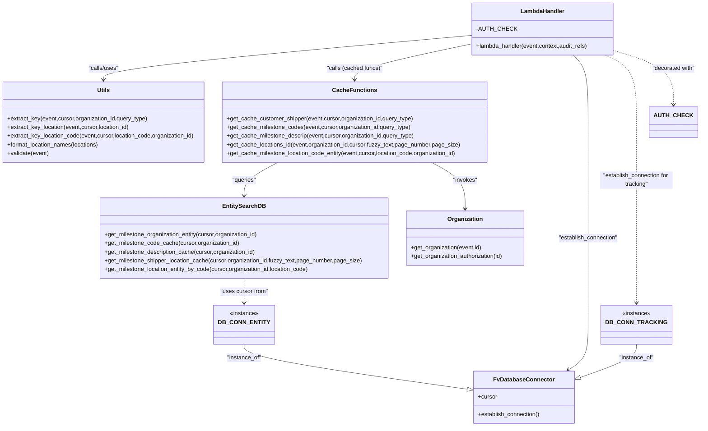

# Diagram: entity_core/entity_search/entity_search/lambdas/filters/get_milestone_list.py


> Auto-generated by Obscura crawlers

## Diagram 1

```mermaid
flowchart LR
    Start([Start]) --> ValidateCall[/"validate(event)"/]
    ValidateCall -->|valid| CheckOrg{organization_id present?}
    ValidateCall -->|invalid| BadRequest[/"BadRequestError raised"/]
    CheckOrg -- No --> Forbidden[/"ForbiddenError: missing organization_id"/]
    CheckOrg -- Yes --> EstablishEntity[/"DB_CONN_ENTITY.establish_connection()"/]
    EstablishEntity --> GetCursor[/"cursor = DB_CONN_ENTITY.cursor"/]
    GetCursor --> GetLists[/"get_lists(event, cursor, query_params, organization_id)"/]
    subgraph get_lists_flow ["get_lists"]
        GetLists --> DetermineParams{query_params contains...}
        DetermineParams -->|customer_shipper| CustBranch[get_cache_customer_shipper (cached)]
        CustBranch --> GetOrgLoop["loop: get_organization(org_id)"]
        GetOrgLoop --> AppendShippers["append {id,name} to list_dict.shippers"]
        DetermineParams -->|milestone_code| CodeBranch[get_cache_milestone_codes (cached)]
        CodeBranch --> AppendCodes["list_dict.milestone_code"]
        DetermineParams -->|milestone_description| DescBranch[get_cache_milestone_descrip (cached)]
        DescBranch --> AppendDesc["list_dict.milestone_description"]
        DetermineParams -->|location| LocBranch[get_cache_locations_id (cached)]
        LocBranch --> FormatLoc["format_location_names(cache_locations)"]
        FormatLoc --> AppendLoc["list_dict.locations = formatted locations"]
        LocBranch --> ComputeMeta["meta = {total_count, total_pages, current_page}"]
        ComputeMeta --> AppendMeta["list_dict.meta = meta"]
        DetermineParams --> Continue["other flows / return list_dict"]
    end
    GetLists --> MakeResponse[/"fv.aws.lambdas.make_response(list_dict)"/]
    MakeResponse --> End([End])
    %% exception path
    GetLists -->|exception| Traceback["traceback.print_exc() and re-raise"]
```

> SVG rendering failed for this diagram.

## Diagram 2



> SVG rendering failed for this diagram.
