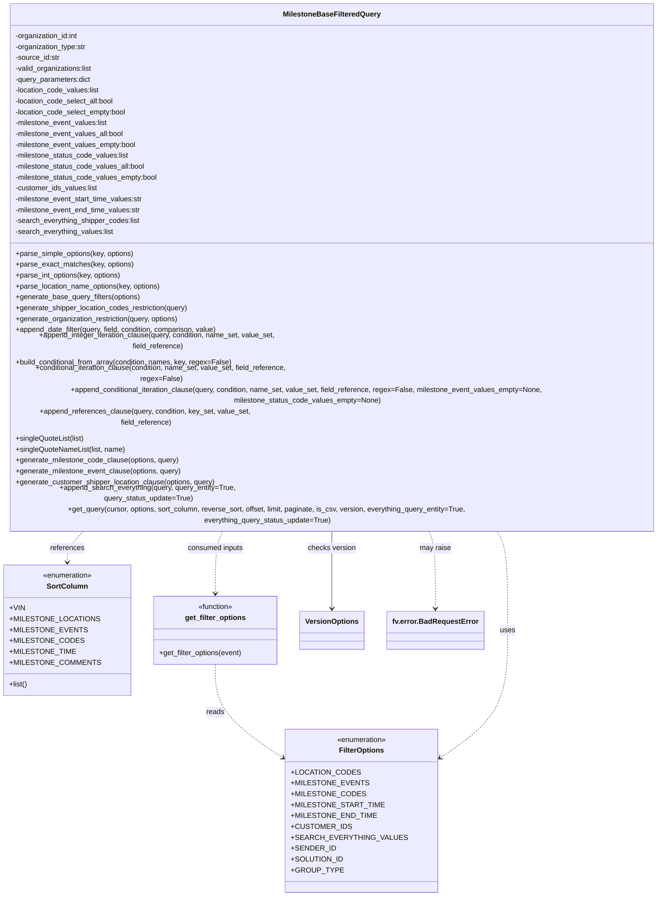

# Diagram: entity_core/entity_search/entity_search/lambdas/filters/milestone_support.py


> Auto-generated by Obscura crawlers

## Diagram 1



### SVG

<svg id="container" width="1523.1796875" xmlns="http://www.w3.org/2000/svg" class="classDiagram" height="1844" viewBox="0 0 1523.1796875 1844" role="graphics-document document" aria-roledescription="class"><style>#container{font-family:"trebuchet ms",verdana,arial,sans-serif;font-size:16px;fill:#333;}@keyframes edge-animation-frame{from{stroke-dashoffset:0;}}@keyframes dash{to{stroke-dashoffset:0;}}#container .edge-animation-slow{stroke-dasharray:9,5!important;stroke-dashoffset:900;animation:dash 50s linear infinite;stroke-linecap:round;}#container .edge-animation-fast{stroke-dasharray:9,5!important;stroke-dashoffset:900;animation:dash 20s linear infinite;stroke-linecap:round;}#container .error-icon{fill:#552222;}#container .error-text{fill:#552222;stroke:#552222;}#container .edge-thickness-normal{stroke-width:1px;}#container .edge-thickness-thick{stroke-width:3.5px;}#container .edge-pattern-solid{stroke-dasharray:0;}#container .edge-thickness-invisible{stroke-width:0;fill:none;}#container .edge-pattern-dashed{stroke-dasharray:3;}#container .edge-pattern-dotted{stroke-dasharray:2;}#container .marker{fill:#333333;stroke:#333333;}#container .marker.cross{stroke:#333333;}#container svg{font-family:"trebuchet ms",verdana,arial,sans-serif;font-size:16px;}#container p{margin:0;}#container g.classGroup text{fill:#9370DB;stroke:none;font-family:"trebuchet ms",verdana,arial,sans-serif;font-size:10px;}#container g.classGroup text .title{font-weight:bolder;}#container .nodeLabel,#container .edgeLabel{color:#131300;}#container .edgeLabel .label rect{fill:#ECECFF;}#container .label text{fill:#131300;}#container .labelBkg{background:#ECECFF;}#container .edgeLabel .label span{background:#ECECFF;}#container .classTitle{font-weight:bolder;}#container .node rect,#container .node circle,#container .node ellipse,#container .node polygon,#container .node path{fill:#ECECFF;stroke:#9370DB;stroke-width:1px;}#container .divider{stroke:#9370DB;stroke-width:1;}#container g.clickable{cursor:pointer;}#container g.classGroup rect{fill:#ECECFF;stroke:#9370DB;}#container g.classGroup line{stroke:#9370DB;stroke-width:1;}#container .classLabel .box{stroke:none;stroke-width:0;fill:#ECECFF;opacity:0.5;}#container .classLabel .label{fill:#9370DB;font-size:10px;}#container .relation{stroke:#333333;stroke-width:1;fill:none;}#container .dashed-line{stroke-dasharray:3;}#container .dotted-line{stroke-dasharray:1 2;}#container #compositionStart,#container .composition{fill:#333333!important;stroke:#333333!important;stroke-width:1;}#container #compositionEnd,#container .composition{fill:#333333!important;stroke:#333333!important;stroke-width:1;}#container #dependencyStart,#container .dependency{fill:#333333!important;stroke:#333333!important;stroke-width:1;}#container #dependencyStart,#container .dependency{fill:#333333!important;stroke:#333333!important;stroke-width:1;}#container #extensionStart,#container .extension{fill:transparent!important;stroke:#333333!important;stroke-width:1;}#container #extensionEnd,#container .extension{fill:transparent!important;stroke:#333333!important;stroke-width:1;}#container #aggregationStart,#container .aggregation{fill:transparent!important;stroke:#333333!important;stroke-width:1;}#container #aggregationEnd,#container .aggregation{fill:transparent!important;stroke:#333333!important;stroke-width:1;}#container #lollipopStart,#container .lollipop{fill:#ECECFF!important;stroke:#333333!important;stroke-width:1;}#container #lollipopEnd,#container .lollipop{fill:#ECECFF!important;stroke:#333333!important;stroke-width:1;}#container .edgeTerminals{font-size:11px;line-height:initial;}#container .classTitleText{text-anchor:middle;font-size:18px;fill:#333;}#container .label-icon{display:inline-block;height:1em;overflow:visible;vertical-align:-0.125em;}#container .node .label-icon path{fill:currentColor;stroke:revert;stroke-width:revert;}#container :root{--mermaid-font-family:"trebuchet ms",verdana,arial,sans-serif;}</style><g><defs><marker id="container_class-aggregationStart" class="marker aggregation class" refX="18" refY="7" markerWidth="190" markerHeight="240" orient="auto"><path d="M 18,7 L9,13 L1,7 L9,1 Z"></path></marker></defs><defs><marker id="container_class-aggregationEnd" class="marker aggregation class" refX="1" refY="7" markerWidth="20" markerHeight="28" orient="auto"><path d="M 18,7 L9,13 L1,7 L9,1 Z"></path></marker></defs><defs><marker id="container_class-extensionStart" class="marker extension class" refX="18" refY="7" markerWidth="190" markerHeight="240" orient="auto"><path d="M 1,7 L18,13 V 1 Z"></path></marker></defs><defs><marker id="container_class-extensionEnd" class="marker extension class" refX="1" refY="7" markerWidth="20" markerHeight="28" orient="auto"><path d="M 1,1 V 13 L18,7 Z"></path></marker></defs><defs><marker id="container_class-compositionStart" class="marker composition class" refX="18" refY="7" markerWidth="190" markerHeight="240" orient="auto"><path d="M 18,7 L9,13 L1,7 L9,1 Z"></path></marker></defs><defs><marker id="container_class-compositionEnd" class="marker composition class" refX="1" refY="7" markerWidth="20" markerHeight="28" orient="auto"><path d="M 18,7 L9,13 L1,7 L9,1 Z"></path></marker></defs><defs><marker id="container_class-dependencyStart" class="marker dependency class" refX="6" refY="7" markerWidth="190" markerHeight="240" orient="auto"><path d="M 5,7 L9,13 L1,7 L9,1 Z"></path></marker></defs><defs><marker id="container_class-dependencyEnd" class="marker dependency class" refX="13" refY="7" markerWidth="20" markerHeight="28" orient="auto"><path d="M 18,7 L9,13 L14,7 L9,1 Z"></path></marker></defs><defs><marker id="container_class-lollipopStart" class="marker lollipop class" refX="13" refY="7" markerWidth="190" markerHeight="240" orient="auto"><circle stroke="black" fill="transparent" cx="7" cy="7" r="6"></circle></marker></defs><defs><marker id="container_class-lollipopEnd" class="marker lollipop class" refX="1" refY="7" markerWidth="190" markerHeight="240" orient="auto"><circle stroke="black" fill="transparent" cx="7" cy="7" r="6"></circle></marker></defs><g class="root"><g class="clusters"></g><g class="edgePaths"><path d="M506.285,1333L506.285,1350.667C506.285,1368.333,506.285,1403.667,532.899,1439.67C559.513,1475.673,612.741,1512.346,639.355,1530.683L665.969,1549.02" id="id_get_filter_options_FilterOptions_1" class="edge-thickness-normal edge-pattern-dashed relation" style=";;;" data-edge="true" data-et="edge" data-id="id_get_filter_options_FilterOptions_1" data-points="W3sieCI6NTA2LjI4NTE1NjI1LCJ5IjoxMzMzfSx7IngiOjUwNi4yODUxNTYyNSwieSI6MTQzOX0seyJ4Ijo2NzAuOTEwMTU2MjUsInkiOjE1NTIuNDIzODA1MzMwNTg4M31d" marker-end="url(#container_class-dependencyEnd)"></path><path d="M1111.135,1040L1115.312,1046.167C1119.49,1052.333,1127.844,1064.667,1132.022,1101C1136.199,1137.333,1136.199,1197.667,1136.199,1258C1136.199,1318.333,1136.199,1378.667,1109.585,1427.17C1082.971,1475.673,1029.743,1512.346,1003.129,1530.683L976.515,1549.02" id="id_MilestoneBaseFilteredQuery_FilterOptions_2" class="edge-thickness-normal edge-pattern-dashed relation" style=";;;" data-edge="true" data-et="edge" data-id="id_MilestoneBaseFilteredQuery_FilterOptions_2" data-points="W3sieCI6MTExMS4xMzQ5Mzg2ODY3MDksInkiOjEwNDB9LHsieCI6MTEzNi4xOTkyMTg3NSwieSI6MTA3N30seyJ4IjoxMTM2LjE5OTIxODc1LCJ5IjoxMjU4fSx7IngiOjExMzYuMTk5MjE4NzUsInkiOjE0Mzl9LHsieCI6OTcxLjU3NDIxODc1LCJ5IjoxNTUyLjQyMzgwNTMzMDU4ODN9XQ==" marker-end="url(#container_class-dependencyEnd)"></path><path d="M229.228,1040L222.866,1046.167C216.504,1052.333,203.779,1064.667,197.417,1076C191.055,1087.333,191.055,1097.667,191.055,1102.833L191.055,1108" id="id_MilestoneBaseFilteredQuery_SortColumn_3" class="edge-thickness-normal edge-pattern-dashed relation" style=";;;" data-edge="true" data-et="edge" data-id="id_MilestoneBaseFilteredQuery_SortColumn_3" data-points="W3sieCI6MjI5LjIyNzkyNTgwMjQ0MTE4LCJ5IjoxMDQwfSx7IngiOjE5MS4wNTQ2ODc1LCJ5IjoxMDc3fSx7IngiOjE5MS4wNTQ2ODc1LCJ5IjoxMTE0fV0=" marker-end="url(#container_class-dependencyEnd)"></path><path d="M523.367,1040L520.52,1046.167C517.673,1052.333,511.979,1064.667,509.132,1087.5C506.285,1110.333,506.285,1143.667,506.285,1160.333L506.285,1177" id="id_MilestoneBaseFilteredQuery_get_filter_options_4" class="edge-thickness-normal edge-pattern-dashed relation" style=";;;" data-edge="true" data-et="edge" data-id="id_MilestoneBaseFilteredQuery_get_filter_options_4" data-points="W3sieCI6NTIzLjM2NzAyNTAzMzkwNiwieSI6MTA0MH0seyJ4Ijo1MDYuMjg1MTU2MjUsInkiOjEwNzd9LHsieCI6NTA2LjI4NTE1NjI1LCJ5IjoxMTgzfV0=" marker-end="url(#container_class-dependencyEnd)"></path><path d="M761.59,1040L761.59,1046.167C761.59,1052.333,761.59,1064.667,761.59,1093C761.59,1121.333,761.59,1165.667,761.59,1187.833L761.59,1210" id="id_MilestoneBaseFilteredQuery_VersionOptions_5" class="edge-thickness-normal edge-pattern-solid relation" style=";;;" data-edge="true" data-et="edge" data-id="id_MilestoneBaseFilteredQuery_VersionOptions_5" data-points="W3sieCI6NzYxLjU4OTg0Mzc1LCJ5IjoxMDQwfSx7IngiOjc2MS41ODk4NDM3NSwieSI6MTA3N30seyJ4Ijo3NjEuNTg5ODQzNzUsInkiOjEyMTZ9XQ==" marker-end="url(#container_class-dependencyEnd)"></path><path d="M967.439,1040L969.899,1046.167C972.359,1052.333,977.279,1064.667,979.739,1093C982.199,1121.333,982.199,1165.667,982.199,1187.833L982.199,1210" id="id_MilestoneBaseFilteredQuery_fv.error.BadRequestError_6" class="edge-thickness-normal edge-pattern-dashed relation" style=";;;" data-edge="true" data-et="edge" data-id="id_MilestoneBaseFilteredQuery_fv.error.BadRequestError_6" data-points="W3sieCI6OTY3LjQzODczNjE1NTA2MzIsInkiOjEwNDB9LHsieCI6OTgyLjE5OTIxODc1LCJ5IjoxMDc3fSx7IngiOjk4Mi4xOTkyMTg3NSwieSI6MTIxNn1d" marker-end="url(#container_class-dependencyEnd)"></path></g><g class="edgeLabels"><g class="edgeLabel" transform="translate(506.28515625, 1439)"><g class="label" data-id="id_get_filter_options_FilterOptions_1" transform="translate(-20.0078125, -12)"><foreignObject width="40.015625" height="24"><div xmlns="http://www.w3.org/1999/xhtml" class="labelBkg" style="display: table-cell; white-space: nowrap; line-height: 1.5; max-width: 200px; text-align: center;"><span class="edgeLabel"><p>reads</p></span></div></foreignObject></g></g><g class="edgeLabel" transform="translate(1136.19921875, 1258)"><g class="label" data-id="id_MilestoneBaseFilteredQuery_FilterOptions_2" transform="translate(-16.4921875, -12)"><foreignObject width="32.984375" height="24"><div xmlns="http://www.w3.org/1999/xhtml" class="labelBkg" style="display: table-cell; white-space: nowrap; line-height: 1.5; max-width: 200px; text-align: center;"><span class="edgeLabel"><p>uses</p></span></div></foreignObject></g></g><g class="edgeLabel" transform="translate(191.0546875, 1077)"><g class="label" data-id="id_MilestoneBaseFilteredQuery_SortColumn_3" transform="translate(-37.828125, -12)"><foreignObject width="75.65625" height="24"><div xmlns="http://www.w3.org/1999/xhtml" class="labelBkg" style="display: table-cell; white-space: nowrap; line-height: 1.5; max-width: 200px; text-align: center;"><span class="edgeLabel"><p>references</p></span></div></foreignObject></g></g><g class="edgeLabel" transform="translate(506.28515625, 1077)"><g class="label" data-id="id_MilestoneBaseFilteredQuery_get_filter_options_4" transform="translate(-62.515625, -12)"><foreignObject width="125.03125" height="24"><div xmlns="http://www.w3.org/1999/xhtml" class="labelBkg" style="display: table-cell; white-space: nowrap; line-height: 1.5; max-width: 200px; text-align: center;"><span class="edgeLabel"><p>consumed inputs</p></span></div></foreignObject></g></g><g class="edgeLabel" transform="translate(761.58984375, 1077)"><g class="label" data-id="id_MilestoneBaseFilteredQuery_VersionOptions_5" transform="translate(-53.1953125, -12)"><foreignObject width="106.390625" height="24"><div xmlns="http://www.w3.org/1999/xhtml" class="labelBkg" style="display: table-cell; white-space: nowrap; line-height: 1.5; max-width: 200px; text-align: center;"><span class="edgeLabel"><p>checks version</p></span></div></foreignObject></g></g><g class="edgeLabel" transform="translate(982.19921875, 1077)"><g class="label" data-id="id_MilestoneBaseFilteredQuery_fv.error.BadRequestError_6" transform="translate(-34.65625, -12)"><foreignObject width="69.3125" height="24"><div xmlns="http://www.w3.org/1999/xhtml" class="labelBkg" style="display: table-cell; white-space: nowrap; line-height: 1.5; max-width: 200px; text-align: center;"><span class="edgeLabel"><p>may raise</p></span></div></foreignObject></g></g></g><g class="nodes"><g class="node default" id="classId-FilterOptions-0" transform="translate(821.2421875, 1656)"><g class="basic label-container"><path d="M-150.33203125 -180 L150.33203125 -180 L150.33203125 180 L-150.33203125 180" stroke="none" stroke-width="0" fill="#ECECFF" style=""></path><path d="M-150.33203125 -180 C-52.26342413052218 -180, 45.805182988955636 -180, 150.33203125 -180 M-150.33203125 -180 C-45.96955218641972 -180, 58.39292687716056 -180, 150.33203125 -180 M150.33203125 -180 C150.33203125 -102.5172769577002, 150.33203125 -25.03455391540041, 150.33203125 180 M150.33203125 -180 C150.33203125 -74.81607702598936, 150.33203125 30.367845948021284, 150.33203125 180 M150.33203125 180 C66.25776821413032 180, -17.816494821739354 180, -150.33203125 180 M150.33203125 180 C31.99933820223727 180, -86.33335484552546 180, -150.33203125 180 M-150.33203125 180 C-150.33203125 79.2482546724385, -150.33203125 -21.503490655122988, -150.33203125 -180 M-150.33203125 180 C-150.33203125 75.94943675567204, -150.33203125 -28.10112648865592, -150.33203125 -180" stroke="#9370DB" stroke-width="1.3" fill="none" stroke-dasharray="0 0" style=""></path></g><g class="annotation-group text" transform="translate(-55.5546875, -156)"><g class="label" style="" transform="translate(0,-12)"><foreignObject width="111.109375" height="24"><div xmlns="http://www.w3.org/1999/xhtml" style="display: table-cell; white-space: nowrap; line-height: 1.5; max-width: 161px; text-align: center;"><span class="nodeLabel markdown-node-label" style=""><p>«enumeration»</p></span></div></foreignObject></g></g><g class="label-group text" transform="translate(-47.671875, -132)"><g class="label" style="font-weight: bolder" transform="translate(0,-12)"><foreignObject width="95.34375" height="24"><div xmlns="http://www.w3.org/1999/xhtml" style="display: table-cell; white-space: nowrap; line-height: 1.5; max-width: 144px; text-align: center;"><span class="nodeLabel markdown-node-label" style=""><p>FilterOptions</p></span></div></foreignObject></g></g><g class="members-group text" transform="translate(-138.33203125, -84)"><g class="label" style="" transform="translate(0,-12)"><foreignObject width="133.453125" height="24"><div xmlns="http://www.w3.org/1999/xhtml" style="display: table-cell; white-space: nowrap; line-height: 1.5; max-width: 191px; text-align: center;"><span class="nodeLabel markdown-node-label" style=""><p>+LOCATION_CODES</p></span></div></foreignObject></g><g class="label" style="" transform="translate(0,12)"><foreignObject width="150.109375" height="24"><div xmlns="http://www.w3.org/1999/xhtml" style="display: table-cell; white-space: nowrap; line-height: 1.5; max-width: 208px; text-align: center;"><span class="nodeLabel markdown-node-label" style=""><p>+MILESTONE_EVENTS</p></span></div></foreignObject></g><g class="label" style="" transform="translate(0,36)"><foreignObject width="142.984375" height="24"><div xmlns="http://www.w3.org/1999/xhtml" style="display: table-cell; white-space: nowrap; line-height: 1.5; max-width: 201px; text-align: center;"><span class="nodeLabel markdown-node-label" style=""><p>+MILESTONE_CODES</p></span></div></foreignObject></g><g class="label" style="" transform="translate(0,60)"><foreignObject width="179.53125" height="24"><div xmlns="http://www.w3.org/1999/xhtml" style="display: table-cell; white-space: nowrap; line-height: 1.5; max-width: 237px; text-align: center;"><span class="nodeLabel markdown-node-label" style=""><p>+MILESTONE_START_TIME</p></span></div></foreignObject></g><g class="label" style="" transform="translate(0,84)"><foreignObject width="167.15625" height="24"><div xmlns="http://www.w3.org/1999/xhtml" style="display: table-cell; white-space: nowrap; line-height: 1.5; max-width: 225px; text-align: center;"><span class="nodeLabel markdown-node-label" style=""><p>+MILESTONE_END_TIME</p></span></div></foreignObject></g><g class="label" style="" transform="translate(0,108)"><foreignObject width="117.0625" height="24"><div xmlns="http://www.w3.org/1999/xhtml" style="display: table-cell; white-space: nowrap; line-height: 1.5; max-width: 175px; text-align: center;"><span class="nodeLabel markdown-node-label" style=""><p>+CUSTOMER_IDS</p></span></div></foreignObject></g><g class="label" style="" transform="translate(0,132)"><foreignObject width="221.109375" height="24"><div xmlns="http://www.w3.org/1999/xhtml" style="display: table-cell; white-space: nowrap; line-height: 1.5; max-width: 279px; text-align: center;"><span class="nodeLabel markdown-node-label" style=""><p>+SEARCH_EVERYTHING_VALUES</p></span></div></foreignObject></g><g class="label" style="" transform="translate(0,156)"><foreignObject width="87.453125" height="24"><div xmlns="http://www.w3.org/1999/xhtml" style="display: table-cell; white-space: nowrap; line-height: 1.5; max-width: 145px; text-align: center;"><span class="nodeLabel markdown-node-label" style=""><p>+SENDER_ID</p></span></div></foreignObject></g><g class="label" style="" transform="translate(0,180)"><foreignObject width="103.640625" height="24"><div xmlns="http://www.w3.org/1999/xhtml" style="display: table-cell; white-space: nowrap; line-height: 1.5; max-width: 161px; text-align: center;"><span class="nodeLabel markdown-node-label" style=""><p>+SOLUTION_ID</p></span></div></foreignObject></g><g class="label" style="" transform="translate(0,204)"><foreignObject width="99.4375" height="24"><div xmlns="http://www.w3.org/1999/xhtml" style="display: table-cell; white-space: nowrap; line-height: 1.5; max-width: 157px; text-align: center;"><span class="nodeLabel markdown-node-label" style=""><p>+GROUP_TYPE</p></span></div></foreignObject></g></g><g class="methods-group text" transform="translate(-138.33203125, 180)"></g><g class="divider" style=""><path d="M-150.33203125 -108 C-36.589947849395244 -108, 77.15213555120951 -108, 150.33203125 -108 M-150.33203125 -108 C-50.506761569861126 -108, 49.31850811027775 -108, 150.33203125 -108" stroke="#9370DB" stroke-width="1.3" fill="none" stroke-dasharray="0 0" style=""></path></g><g class="divider" style=""><path d="M-150.33203125 156 C-65.50138864772957 156, 19.32925395454086 156, 150.33203125 156 M-150.33203125 156 C-30.0847003412744 156, 90.1626305674512 156, 150.33203125 156" stroke="#9370DB" stroke-width="1.3" fill="none" stroke-dasharray="0 0" style=""></path></g></g><g class="node default" id="classId-SortColumn-1" transform="translate(191.0546875, 1258)"><g class="basic label-container"><path d="M-128.02734375 -144 L128.02734375 -144 L128.02734375 144 L-128.02734375 144" stroke="none" stroke-width="0" fill="#ECECFF" style=""></path><path d="M-128.02734375 -144 C-69.84882819965674 -144, -11.670312649313459 -144, 128.02734375 -144 M-128.02734375 -144 C-26.236793677562176 -144, 75.55375639487565 -144, 128.02734375 -144 M128.02734375 -144 C128.02734375 -34.63827615782, 128.02734375 74.72344768436, 128.02734375 144 M128.02734375 -144 C128.02734375 -67.79877946571739, 128.02734375 8.402441068565224, 128.02734375 144 M128.02734375 144 C48.32777744070542 144, -31.371788868589164 144, -128.02734375 144 M128.02734375 144 C50.670022694168125 144, -26.68729836166375 144, -128.02734375 144 M-128.02734375 144 C-128.02734375 58.63294410933986, -128.02734375 -26.73411178132028, -128.02734375 -144 M-128.02734375 144 C-128.02734375 81.5948511371865, -128.02734375 19.18970227437299, -128.02734375 -144" stroke="#9370DB" stroke-width="1.3" fill="none" stroke-dasharray="0 0" style=""></path></g><g class="annotation-group text" transform="translate(-55.5546875, -120)"><g class="label" style="" transform="translate(0,-12)"><foreignObject width="111.109375" height="24"><div xmlns="http://www.w3.org/1999/xhtml" style="display: table-cell; white-space: nowrap; line-height: 1.5; max-width: 161px; text-align: center;"><span class="nodeLabel markdown-node-label" style=""><p>«enumeration»</p></span></div></foreignObject></g></g><g class="label-group text" transform="translate(-42.984375, -96)"><g class="label" style="font-weight: bolder" transform="translate(0,-12)"><foreignObject width="85.96875" height="24"><div xmlns="http://www.w3.org/1999/xhtml" style="display: table-cell; white-space: nowrap; line-height: 1.5; max-width: 135px; text-align: center;"><span class="nodeLabel markdown-node-label" style=""><p>SortColumn</p></span></div></foreignObject></g></g><g class="members-group text" transform="translate(-116.02734375, -48)"><g class="label" style="" transform="translate(0,-12)"><foreignObject width="32.140625" height="24"><div xmlns="http://www.w3.org/1999/xhtml" style="display: table-cell; white-space: nowrap; line-height: 1.5; max-width: 90px; text-align: center;"><span class="nodeLabel markdown-node-label" style=""><p>+VIN</p></span></div></foreignObject></g><g class="label" style="" transform="translate(0,12)"><foreignObject width="175.84375" height="24"><div xmlns="http://www.w3.org/1999/xhtml" style="display: table-cell; white-space: nowrap; line-height: 1.5; max-width: 233px; text-align: center;"><span class="nodeLabel markdown-node-label" style=""><p>+MILESTONE_LOCATIONS</p></span></div></foreignObject></g><g class="label" style="" transform="translate(0,36)"><foreignObject width="150.109375" height="24"><div xmlns="http://www.w3.org/1999/xhtml" style="display: table-cell; white-space: nowrap; line-height: 1.5; max-width: 208px; text-align: center;"><span class="nodeLabel markdown-node-label" style=""><p>+MILESTONE_EVENTS</p></span></div></foreignObject></g><g class="label" style="" transform="translate(0,60)"><foreignObject width="142.984375" height="24"><div xmlns="http://www.w3.org/1999/xhtml" style="display: table-cell; white-space: nowrap; line-height: 1.5; max-width: 201px; text-align: center;"><span class="nodeLabel markdown-node-label" style=""><p>+MILESTONE_CODES</p></span></div></foreignObject></g><g class="label" style="" transform="translate(0,84)"><foreignObject width="129.6875" height="24"><div xmlns="http://www.w3.org/1999/xhtml" style="display: table-cell; white-space: nowrap; line-height: 1.5; max-width: 187px; text-align: center;"><span class="nodeLabel markdown-node-label" style=""><p>+MILESTONE_TIME</p></span></div></foreignObject></g><g class="label" style="" transform="translate(0,108)"><foreignObject width="176.5" height="24"><div xmlns="http://www.w3.org/1999/xhtml" style="display: table-cell; white-space: nowrap; line-height: 1.5; max-width: 234px; text-align: center;"><span class="nodeLabel markdown-node-label" style=""><p>+MILESTONE_COMMENTS</p></span></div></foreignObject></g></g><g class="methods-group text" transform="translate(-116.02734375, 120)"><g class="label" style="" transform="translate(0,-12)"><foreignObject width="40.8125" height="24"><div xmlns="http://www.w3.org/1999/xhtml" style="display: table-cell; white-space: nowrap; line-height: 1.5; max-width: 98px; text-align: center;"><span class="nodeLabel markdown-node-label" style=""><p>+list()</p></span></div></foreignObject></g></g><g class="divider" style=""><path d="M-128.02734375 -72 C-53.363482035252574 -72, 21.300379679494853 -72, 128.02734375 -72 M-128.02734375 -72 C-62.395823910580035 -72, 3.235695928839931 -72, 128.02734375 -72" stroke="#9370DB" stroke-width="1.3" fill="none" stroke-dasharray="0 0" style=""></path></g><g class="divider" style=""><path d="M-128.02734375 96 C-50.22640861908093 96, 27.574526511838144 96, 128.02734375 96 M-128.02734375 96 C-76.34469644692126 96, -24.662049143842538 96, 128.02734375 96" stroke="#9370DB" stroke-width="1.3" fill="none" stroke-dasharray="0 0" style=""></path></g></g><g class="node default" id="classId-get_filter_options-2" transform="translate(506.28515625, 1258)"><g class="basic label-container"><path d="M-137.203125 -75 L137.203125 -75 L137.203125 75 L-137.203125 75" stroke="none" stroke-width="0" fill="#ECECFF" style=""></path><path d="M-137.203125 -75 C-28.798737792932343 -75, 79.60564941413531 -75, 137.203125 -75 M-137.203125 -75 C-70.65236252147275 -75, -4.101600042945506 -75, 137.203125 -75 M137.203125 -75 C137.203125 -38.62447304542752, 137.203125 -2.2489460908550427, 137.203125 75 M137.203125 -75 C137.203125 -38.20832929808553, 137.203125 -1.416658596171061, 137.203125 75 M137.203125 75 C38.39393112307914 75, -60.415262753841716 75, -137.203125 75 M137.203125 75 C79.72225632624703 75, 22.24138765249407 75, -137.203125 75 M-137.203125 75 C-137.203125 23.456759866231927, -137.203125 -28.086480267536146, -137.203125 -75 M-137.203125 75 C-137.203125 37.78653566295052, -137.203125 0.57307132590104, -137.203125 -75" stroke="#9370DB" stroke-width="1.3" fill="none" stroke-dasharray="0 0" style=""></path></g><g class="annotation-group text" transform="translate(-39.484375, -51)"><g class="label" style="" transform="translate(0,-12)"><foreignObject width="78.96875" height="24"><div xmlns="http://www.w3.org/1999/xhtml" style="display: table-cell; white-space: nowrap; line-height: 1.5; max-width: 129px; text-align: center;"><span class="nodeLabel markdown-node-label" style=""><p>«function»</p></span></div></foreignObject></g></g><g class="label-group text" transform="translate(-64.78125, -27)"><g class="label" style="font-weight: bolder" transform="translate(0,-12)"><foreignObject width="129.5625" height="24"><div xmlns="http://www.w3.org/1999/xhtml" style="display: table-cell; white-space: nowrap; line-height: 1.5; max-width: 177px; text-align: center;"><span class="nodeLabel markdown-node-label" style=""><p>get_filter_options</p></span></div></foreignObject></g></g><g class="members-group text" transform="translate(-125.203125, 21)"></g><g class="methods-group text" transform="translate(-125.203125, 51)"><g class="label" style="" transform="translate(0,-12)"><foreignObject width="185.625" height="24"><div xmlns="http://www.w3.org/1999/xhtml" style="display: table-cell; white-space: nowrap; line-height: 1.5; max-width: 243px; text-align: center;"><span class="nodeLabel markdown-node-label" style=""><p>+get_filter_options(event)</p></span></div></foreignObject></g></g><g class="divider" style=""><path d="M-137.203125 -3 C-49.24691248479937 -3, 38.709300030401266 -3, 137.203125 -3 M-137.203125 -3 C-68.84522948893093 -3, -0.4873339778618515 -3, 137.203125 -3" stroke="#9370DB" stroke-width="1.3" fill="none" stroke-dasharray="0 0" style=""></path></g><g class="divider" style=""><path d="M-137.203125 21 C-69.19282583535671 21, -1.182526670713429 21, 137.203125 21 M-137.203125 21 C-75.78591037657311 21, -14.368695753146227 21, 137.203125 21" stroke="#9370DB" stroke-width="1.3" fill="none" stroke-dasharray="0 0" style=""></path></g></g><g class="node default" id="classId-MilestoneBaseFilteredQuery-3" transform="translate(761.58984375, 524)"><g class="basic label-container"><path d="M-753.58984375 -516 L753.58984375 -516 L753.58984375 516 L-753.58984375 516" stroke="none" stroke-width="0" fill="#ECECFF" style=""></path><path d="M-753.58984375 -516 C-344.6901325581598 -516, 64.2095786336804 -516, 753.58984375 -516 M-753.58984375 -516 C-202.318405327567 -516, 348.953033094866 -516, 753.58984375 -516 M753.58984375 -516 C753.58984375 -220.6153741378044, 753.58984375 74.76925172439121, 753.58984375 516 M753.58984375 -516 C753.58984375 -232.50872441827283, 753.58984375 50.98255116345433, 753.58984375 516 M753.58984375 516 C420.3354421987109 516, 87.08104064742179 516, -753.58984375 516 M753.58984375 516 C180.00184898485395 516, -393.5861457802921 516, -753.58984375 516 M-753.58984375 516 C-753.58984375 214.20396899118236, -753.58984375 -87.59206201763527, -753.58984375 -516 M-753.58984375 516 C-753.58984375 105.44455503797008, -753.58984375 -305.11088992405985, -753.58984375 -516" stroke="#9370DB" stroke-width="1.3" fill="none" stroke-dasharray="0 0" style=""></path></g><g class="annotation-group text" transform="translate(0, -492)"></g><g class="label-group text" transform="translate(-103.0390625, -492)"><g class="label" style="font-weight: bolder" transform="translate(0,-12)"><foreignObject width="206.078125" height="24"><div xmlns="http://www.w3.org/1999/xhtml" style="display: table-cell; white-space: nowrap; line-height: 1.5; max-width: 253px; text-align: center;"><span class="nodeLabel markdown-node-label" style=""><p>MilestoneBaseFilteredQuery</p></span></div></foreignObject></g></g><g class="members-group text" transform="translate(-741.58984375, -444)"><g class="label" style="" transform="translate(0,-12)"><foreignObject width="142.71875" height="24"><div xmlns="http://www.w3.org/1999/xhtml" style="display: table-cell; white-space: nowrap; line-height: 1.5; max-width: 200px; text-align: center;"><span class="nodeLabel markdown-node-label" style=""><p>-organization_id:int</p></span></div></foreignObject></g><g class="label" style="" transform="translate(0,12)"><foreignObject width="160.03125" height="24"><div xmlns="http://www.w3.org/1999/xhtml" style="display: table-cell; white-space: nowrap; line-height: 1.5; max-width: 218px; text-align: center;"><span class="nodeLabel markdown-node-label" style=""><p>-organization_type:str</p></span></div></foreignObject></g><g class="label" style="" transform="translate(0,36)"><foreignObject width="99.828125" height="24"><div xmlns="http://www.w3.org/1999/xhtml" style="display: table-cell; white-space: nowrap; line-height: 1.5; max-width: 158px; text-align: center;"><span class="nodeLabel markdown-node-label" style=""><p>-source_id:str</p></span></div></foreignObject></g><g class="label" style="" transform="translate(0,60)"><foreignObject width="173.34375" height="24"><div xmlns="http://www.w3.org/1999/xhtml" style="display: table-cell; white-space: nowrap; line-height: 1.5; max-width: 231px; text-align: center;"><span class="nodeLabel markdown-node-label" style=""><p>-valid_organizations:list</p></span></div></foreignObject></g><g class="label" style="" transform="translate(0,84)"><foreignObject width="169.75" height="24"><div xmlns="http://www.w3.org/1999/xhtml" style="display: table-cell; white-space: nowrap; line-height: 1.5; max-width: 227px; text-align: center;"><span class="nodeLabel markdown-node-label" style=""><p>-query_parameters:dict</p></span></div></foreignObject></g><g class="label" style="" transform="translate(0,108)"><foreignObject width="188.734375" height="24"><div xmlns="http://www.w3.org/1999/xhtml" style="display: table-cell; white-space: nowrap; line-height: 1.5; max-width: 246px; text-align: center;"><span class="nodeLabel markdown-node-label" style=""><p>-location_code_values:list</p></span></div></foreignObject></g><g class="label" style="" transform="translate(0,132)"><foreignObject width="222.3125" height="24"><div xmlns="http://www.w3.org/1999/xhtml" style="display: table-cell; white-space: nowrap; line-height: 1.5; max-width: 280px; text-align: center;"><span class="nodeLabel markdown-node-label" style=""><p>-location_code_select_all:bool</p></span></div></foreignObject></g><g class="label" style="" transform="translate(0,156)"><foreignObject width="249.796875" height="24"><div xmlns="http://www.w3.org/1999/xhtml" style="display: table-cell; white-space: nowrap; line-height: 1.5; max-width: 307px; text-align: center;"><span class="nodeLabel markdown-node-label" style=""><p>-location_code_select_empty:bool</p></span></div></foreignObject></g><g class="label" style="" transform="translate(0,180)"><foreignObject width="206.953125" height="24"><div xmlns="http://www.w3.org/1999/xhtml" style="display: table-cell; white-space: nowrap; line-height: 1.5; max-width: 265px; text-align: center;"><span class="nodeLabel markdown-node-label" style=""><p>-milestone_event_values:list</p></span></div></foreignObject></g><g class="label" style="" transform="translate(0,204)"><foreignObject width="243.140625" height="24"><div xmlns="http://www.w3.org/1999/xhtml" style="display: table-cell; white-space: nowrap; line-height: 1.5; max-width: 301px; text-align: center;"><span class="nodeLabel markdown-node-label" style=""><p>-milestone_event_values_all:bool</p></span></div></foreignObject></g><g class="label" style="" transform="translate(0,228)"><foreignObject width="270.625" height="24"><div xmlns="http://www.w3.org/1999/xhtml" style="display: table-cell; white-space: nowrap; line-height: 1.5; max-width: 328px; text-align: center;"><span class="nodeLabel markdown-node-label" style=""><p>-milestone_event_values_empty:bool</p></span></div></foreignObject></g><g class="label" style="" transform="translate(0,252)"><foreignObject width="253.65625" height="24"><div xmlns="http://www.w3.org/1999/xhtml" style="display: table-cell; white-space: nowrap; line-height: 1.5; max-width: 311px; text-align: center;"><span class="nodeLabel markdown-node-label" style=""><p>-milestone_status_code_values:list</p></span></div></foreignObject></g><g class="label" style="" transform="translate(0,276)"><foreignObject width="289.84375" height="24"><div xmlns="http://www.w3.org/1999/xhtml" style="display: table-cell; white-space: nowrap; line-height: 1.5; max-width: 348px; text-align: center;"><span class="nodeLabel markdown-node-label" style=""><p>-milestone_status_code_values_all:bool</p></span></div></foreignObject></g><g class="label" style="" transform="translate(0,300)"><foreignObject width="317.34375" height="24"><div xmlns="http://www.w3.org/1999/xhtml" style="display: table-cell; white-space: nowrap; line-height: 1.5; max-width: 375px; text-align: center;"><span class="nodeLabel markdown-node-label" style=""><p>-milestone_status_code_values_empty:bool</p></span></div></foreignObject></g><g class="label" style="" transform="translate(0,324)"><foreignObject width="182.96875" height="24"><div xmlns="http://www.w3.org/1999/xhtml" style="display: table-cell; white-space: nowrap; line-height: 1.5; max-width: 241px; text-align: center;"><span class="nodeLabel markdown-node-label" style=""><p>-customer_ids_values:list</p></span></div></foreignObject></g><g class="label" style="" transform="translate(0,348)"><foreignObject width="286.59375" height="24"><div xmlns="http://www.w3.org/1999/xhtml" style="display: table-cell; white-space: nowrap; line-height: 1.5; max-width: 345px; text-align: center;"><span class="nodeLabel markdown-node-label" style=""><p>-milestone_event_start_time_values:str</p></span></div></foreignObject></g><g class="label" style="" transform="translate(0,372)"><foreignObject width="280.15625" height="24"><div xmlns="http://www.w3.org/1999/xhtml" style="display: table-cell; white-space: nowrap; line-height: 1.5; max-width: 338px; text-align: center;"><span class="nodeLabel markdown-node-label" style=""><p>-milestone_event_end_time_values:str</p></span></div></foreignObject></g><g class="label" style="" transform="translate(0,396)"><foreignObject width="277.59375" height="24"><div xmlns="http://www.w3.org/1999/xhtml" style="display: table-cell; white-space: nowrap; line-height: 1.5; max-width: 335px; text-align: center;"><span class="nodeLabel markdown-node-label" style=""><p>-search_everything_shipper_codes:list</p></span></div></foreignObject></g><g class="label" style="" transform="translate(0,420)"><foreignObject width="219.046875" height="24"><div xmlns="http://www.w3.org/1999/xhtml" style="display: table-cell; white-space: nowrap; line-height: 1.5; max-width: 277px; text-align: center;"><span class="nodeLabel markdown-node-label" style=""><p>-search_everything_values:list</p></span></div></foreignObject></g></g><g class="methods-group text" transform="translate(-741.58984375, 36)"><g class="label" style="" transform="translate(0,-12)"><foreignObject width="265.421875" height="24"><div xmlns="http://www.w3.org/1999/xhtml" style="display: table-cell; white-space: nowrap; line-height: 1.5; max-width: 323px; text-align: center;"><span class="nodeLabel markdown-node-label" style=""><p>+parse_simple_options(key, options)</p></span></div></foreignObject></g><g class="label" style="" transform="translate(0,12)"><foreignObject width="261.265625" height="24"><div xmlns="http://www.w3.org/1999/xhtml" style="display: table-cell; white-space: nowrap; line-height: 1.5; max-width: 319px; text-align: center;"><span class="nodeLabel markdown-node-label" style=""><p>+parse_exact_matches(key, options)</p></span></div></foreignObject></g><g class="label" style="" transform="translate(0,36)"><foreignObject width="236.875" height="24"><div xmlns="http://www.w3.org/1999/xhtml" style="display: table-cell; white-space: nowrap; line-height: 1.5; max-width: 294px; text-align: center;"><span class="nodeLabel markdown-node-label" style=""><p>+parse_int_options(key, options)</p></span></div></foreignObject></g><g class="label" style="" transform="translate(0,60)"><foreignObject width="324.71875" height="24"><div xmlns="http://www.w3.org/1999/xhtml" style="display: table-cell; white-space: nowrap; line-height: 1.5; max-width: 382px; text-align: center;"><span class="nodeLabel markdown-node-label" style=""><p>+parse_location_name_options(key, options)</p></span></div></foreignObject></g><g class="label" style="" transform="translate(0,84)"><foreignObject width="277.625" height="24"><div xmlns="http://www.w3.org/1999/xhtml" style="display: table-cell; white-space: nowrap; line-height: 1.5; max-width: 335px; text-align: center;"><span class="nodeLabel markdown-node-label" style=""><p>+generate_base_query_filters(options)</p></span></div></foreignObject></g><g class="label" style="" transform="translate(0,108)"><foreignObject width="386.203125" height="24"><div xmlns="http://www.w3.org/1999/xhtml" style="display: table-cell; white-space: nowrap; line-height: 1.5; max-width: 444px; text-align: center;"><span class="nodeLabel markdown-node-label" style=""><p>+generate_shipper_location_codes_restriction(query)</p></span></div></foreignObject></g><g class="label" style="" transform="translate(0,132)"><foreignObject width="367.59375" height="24"><div xmlns="http://www.w3.org/1999/xhtml" style="display: table-cell; white-space: nowrap; line-height: 1.5; max-width: 425px; text-align: center;"><span class="nodeLabel markdown-node-label" style=""><p>+generate_organization_restriction(query, options)</p></span></div></foreignObject></g><g class="label" style="" transform="translate(0,156)"><foreignObject width="454.78125" height="24"><div xmlns="http://www.w3.org/1999/xhtml" style="display: table-cell; white-space: nowrap; line-height: 1.5; max-width: 512px; text-align: center;"><span class="nodeLabel markdown-node-label" style=""><p>+append_date_filter(query, field, condition, comparison, value)</p></span></div></foreignObject></g><g class="label" style="" transform="translate(0,180)"><foreignObject width="647.03125" height="24"><div xmlns="http://www.w3.org/1999/xhtml" style="display: table-cell; white-space: nowrap; line-height: 1.5; max-width: 704px; text-align: center;"><span class="nodeLabel markdown-node-label" style=""><p>+append_integer_iteration_clause(query, condition, name_set, value_set, field_reference)</p></span></div></foreignObject></g><g class="label" style="" transform="translate(0,204)"><foreignObject width="481.375" height="24"><div xmlns="http://www.w3.org/1999/xhtml" style="display: table-cell; white-space: nowrap; line-height: 1.5; max-width: 539px; text-align: center;"><span class="nodeLabel markdown-node-label" style=""><p>+build_conditional_from_array(condition, names, key, regex=False)</p></span></div></foreignObject></g><g class="label" style="" transform="translate(0,228)"><foreignObject width="657.84375" height="24"><div xmlns="http://www.w3.org/1999/xhtml" style="display: table-cell; white-space: nowrap; line-height: 1.5; max-width: 715px; text-align: center;"><span class="nodeLabel markdown-node-label" style=""><p>+conditional_iteration_clause(condition, name_set, value_set, field_reference, regex=False)</p></span></div></foreignObject></g><g class="label" style="" transform="translate(0,252)"><foreignObject width="1380.140625" height="24"><div xmlns="http://www.w3.org/1999/xhtml" style="display: table-cell; white-space: nowrap; line-height: 1.5; max-width: 1438px; text-align: center;"><span class="nodeLabel markdown-node-label" style=""><p>+append_conditional_iteration_clause(query, condition, name_set, value_set, field_reference, regex=False, milestone_event_values_empty=None, milestone_status_code_values_empty=None)</p></span></div></foreignObject></g><g class="label" style="" transform="translate(0,276)"><foreignObject width="586.03125" height="24"><div xmlns="http://www.w3.org/1999/xhtml" style="display: table-cell; white-space: nowrap; line-height: 1.5; max-width: 643px; text-align: center;"><span class="nodeLabel markdown-node-label" style=""><p>+append_references_clause(query, condition, key_set, value_set, field_reference)</p></span></div></foreignObject></g><g class="label" style="" transform="translate(0,300)"><foreignObject width="153.515625" height="24"><div xmlns="http://www.w3.org/1999/xhtml" style="display: table-cell; white-space: nowrap; line-height: 1.5; max-width: 211px; text-align: center;"><span class="nodeLabel markdown-node-label" style=""><p>+singleQuoteList(list)</p></span></div></foreignObject></g><g class="label" style="" transform="translate(0,324)"><foreignObject width="244.234375" height="24"><div xmlns="http://www.w3.org/1999/xhtml" style="display: table-cell; white-space: nowrap; line-height: 1.5; max-width: 302px; text-align: center;"><span class="nodeLabel markdown-node-label" style=""><p>+singleQuoteNameList(list, name)</p></span></div></foreignObject></g><g class="label" style="" transform="translate(0,348)"><foreignObject width="363.65625" height="24"><div xmlns="http://www.w3.org/1999/xhtml" style="display: table-cell; white-space: nowrap; line-height: 1.5; max-width: 421px; text-align: center;"><span class="nodeLabel markdown-node-label" style=""><p>+generate_milestone_code_clause(options, query)</p></span></div></foreignObject></g><g class="label" style="" transform="translate(0,372)"><foreignObject width="369.359375" height="24"><div xmlns="http://www.w3.org/1999/xhtml" style="display: table-cell; white-space: nowrap; line-height: 1.5; max-width: 427px; text-align: center;"><span class="nodeLabel markdown-node-label" style=""><p>+generate_milestone_event_clause(options, query)</p></span></div></foreignObject></g><g class="label" style="" transform="translate(0,396)"><foreignObject width="445.109375" height="24"><div xmlns="http://www.w3.org/1999/xhtml" style="display: table-cell; white-space: nowrap; line-height: 1.5; max-width: 502px; text-align: center;"><span class="nodeLabel markdown-node-label" style=""><p>+generate_customer_shipper_location_clause(options, query)</p></span></div></foreignObject></g><g class="label" style="" transform="translate(0,420)"><foreignObject width="594.90625" height="24"><div xmlns="http://www.w3.org/1999/xhtml" style="display: table-cell; white-space: nowrap; line-height: 1.5; max-width: 652px; text-align: center;"><span class="nodeLabel markdown-node-label" style=""><p>+append_search_everything(query, query_entity=True, query_status_update=True)</p></span></div></foreignObject></g><g class="label" style="" transform="translate(0,444)"><foreignObject width="1177.78125" height="24"><div xmlns="http://www.w3.org/1999/xhtml" style="display: table-cell; white-space: nowrap; line-height: 1.5; max-width: 1235px; text-align: center;"><span class="nodeLabel markdown-node-label" style=""><p>+get_query(cursor, options, sort_column, reverse_sort, offset, limit, paginate, is_csv, version, everything_query_entity=True, everything_query_status_update=True)</p></span></div></foreignObject></g></g><g class="divider" style=""><path d="M-753.58984375 -468 C-299.25789076345836 -468, 155.07406222308327 -468, 753.58984375 -468 M-753.58984375 -468 C-302.16772791970254 -468, 149.25438791059491 -468, 753.58984375 -468" stroke="#9370DB" stroke-width="1.3" fill="none" stroke-dasharray="0 0" style=""></path></g><g class="divider" style=""><path d="M-753.58984375 12 C-293.92634152726276 12, 165.73716069547447 12, 753.58984375 12 M-753.58984375 12 C-256.3694249589735 12, 240.85099383205295 12, 753.58984375 12" stroke="#9370DB" stroke-width="1.3" fill="none" stroke-dasharray="0 0" style=""></path></g></g><g class="node default" id="classId-VersionOptions-4" transform="translate(761.58984375, 1258)"><g class="basic label-container"><path d="M-68.1015625 -42 L68.1015625 -42 L68.1015625 42 L-68.1015625 42" stroke="none" stroke-width="0" fill="#ECECFF" style=""></path><path d="M-68.1015625 -42 C-20.09070882378849 -42, 27.92014485242302 -42, 68.1015625 -42 M-68.1015625 -42 C-38.55876149587639 -42, -9.015960491752779 -42, 68.1015625 -42 M68.1015625 -42 C68.1015625 -16.672883431270645, 68.1015625 8.65423313745871, 68.1015625 42 M68.1015625 -42 C68.1015625 -20.80795053792063, 68.1015625 0.38409892415874225, 68.1015625 42 M68.1015625 42 C38.254013208629544 42, 8.406463917259082 42, -68.1015625 42 M68.1015625 42 C24.499689053693608 42, -19.102184392612784 42, -68.1015625 42 M-68.1015625 42 C-68.1015625 22.300837644641767, -68.1015625 2.601675289283534, -68.1015625 -42 M-68.1015625 42 C-68.1015625 16.41047975278383, -68.1015625 -9.179040494432343, -68.1015625 -42" stroke="#9370DB" stroke-width="1.3" fill="none" stroke-dasharray="0 0" style=""></path></g><g class="annotation-group text" transform="translate(0, -18)"></g><g class="label-group text" transform="translate(-56.1015625, -18)"><g class="label" style="font-weight: bolder" transform="translate(0,-12)"><foreignObject width="112.203125" height="24"><div xmlns="http://www.w3.org/1999/xhtml" style="display: table-cell; white-space: nowrap; line-height: 1.5; max-width: 161px; text-align: center;"><span class="nodeLabel markdown-node-label" style=""><p>VersionOptions</p></span></div></foreignObject></g></g><g class="members-group text" transform="translate(-56.1015625, 30)"></g><g class="methods-group text" transform="translate(-56.1015625, 60)"></g><g class="divider" style=""><path d="M-68.1015625 6 C-34.24797100913854 6, -0.39437951827707707 6, 68.1015625 6 M-68.1015625 6 C-21.02847978261031 6, 26.044602934779377 6, 68.1015625 6" stroke="#9370DB" stroke-width="1.3" fill="none" stroke-dasharray="0 0" style=""></path></g><g class="divider" style=""><path d="M-68.1015625 24 C-19.142920081716802 24, 29.815722336566395 24, 68.1015625 24 M-68.1015625 24 C-24.26519730058203 24, 19.571167898835938 24, 68.1015625 24" stroke="#9370DB" stroke-width="1.3" fill="none" stroke-dasharray="0 0" style=""></path></g></g><g class="node default" id="classId-fv.error.BadRequestError-5" transform="translate(982.19921875, 1258)"><g class="basic label-container"><path d="M-102.5078125 -42 L102.5078125 -42 L102.5078125 42 L-102.5078125 42" stroke="none" stroke-width="0" fill="#ECECFF" style=""></path><path d="M-102.5078125 -42 C-28.80610410410793 -42, 44.89560429178414 -42, 102.5078125 -42 M-102.5078125 -42 C-56.548117760943335 -42, -10.588423021886669 -42, 102.5078125 -42 M102.5078125 -42 C102.5078125 -17.86924881424871, 102.5078125 6.26150237150258, 102.5078125 42 M102.5078125 -42 C102.5078125 -23.95044323998679, 102.5078125 -5.900886479973579, 102.5078125 42 M102.5078125 42 C41.615039404247405 42, -19.27773369150519 42, -102.5078125 42 M102.5078125 42 C28.60747875090263 42, -45.29285499819474 42, -102.5078125 42 M-102.5078125 42 C-102.5078125 24.125800843534105, -102.5078125 6.251601687068209, -102.5078125 -42 M-102.5078125 42 C-102.5078125 9.167246423934195, -102.5078125 -23.66550715213161, -102.5078125 -42" stroke="#9370DB" stroke-width="1.3" fill="none" stroke-dasharray="0 0" style=""></path></g><g class="annotation-group text" transform="translate(0, -18)"></g><g class="label-group text" transform="translate(-90.5078125, -18)"><g class="label" style="font-weight: bolder" transform="translate(0,-12)"><foreignObject width="181.015625" height="24"><div xmlns="http://www.w3.org/1999/xhtml" style="display: table-cell; white-space: nowrap; line-height: 1.5; max-width: 229px; text-align: center;"><span class="nodeLabel markdown-node-label" style=""><p>fv.error.BadRequestError</p></span></div></foreignObject></g></g><g class="members-group text" transform="translate(-90.5078125, 30)"></g><g class="methods-group text" transform="translate(-90.5078125, 60)"></g><g class="divider" style=""><path d="M-102.5078125 6 C-27.10242188977344 6, 48.30296872045312 6, 102.5078125 6 M-102.5078125 6 C-34.89282876656692 6, 32.72215496686616 6, 102.5078125 6" stroke="#9370DB" stroke-width="1.3" fill="none" stroke-dasharray="0 0" style=""></path></g><g class="divider" style=""><path d="M-102.5078125 24 C-33.33214563789302 24, 35.84352122421396 24, 102.5078125 24 M-102.5078125 24 C-46.337489152608384 24, 9.832834194783231 24, 102.5078125 24" stroke="#9370DB" stroke-width="1.3" fill="none" stroke-dasharray="0 0" style=""></path></g></g></g></g></g></svg>

## Diagram 2

```mermaid
flowchart LR
    Start([get_query start]) --> GBF[generate_base_query_filters(options)]
    GBF --> OR[generate_organization_restriction(query, options)]
    OR --> SLCR[generate_shipper_location_codes_restriction(query)]
    SLCR --> MCC[generate_milestone_code_clause(options)]
    MCC --> MEC[generate_milestone_event_clause(options)]
    MEC --> ADF1[append_date_filter su.status_update_ts >= milestone_event_start_time_values]
    ADF1 --> ADF2[append_date_filter su.status_update_ts <= milestone_event_end_time_values]
    ADF2 --> ASE[append_search_everything(query_entity, query_status_update)]
    ASE --> ORDER{sort_column provided and version != COUNT?}
    ORDER -->|yes| ORDER_CLS[apply ORDER BY using SortColumn and direction]
    ORDER -->|no| SKIP_ORDER[skip ordering]
    ORDER_CLS --> PAG{paginate and version != COUNT?}
    SKIP_ORDER --> PAG
    PAG -->|yes| PAG_CLS[append OFFSET and LIMIT]
    PAG -->|no| SKIP_PAG[no pagination]
    PAG_CLS --> MOGR[call cursor.mogrify(query, query_parameters)]
    SKIP_PAG --> MOGR
    MOGR --> End([return mogrified query])
```

> SVG rendering failed for this diagram.
