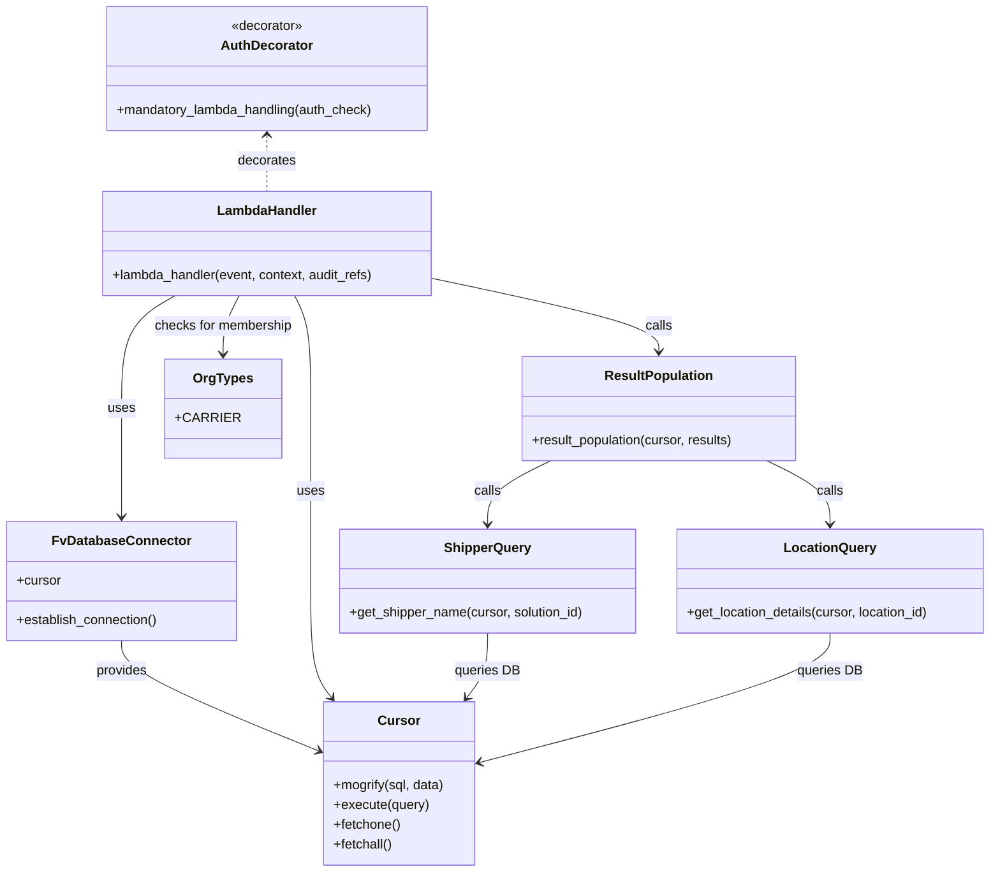

# Diagram: entity_core/entity_search/entity_search/lambdas/history_endpoints/get_carrier_entity_location_data.py


> Auto-generated by Obscura crawlers

## Diagram 1

```mermaid
flowchart TD
  Lambda[lambda_handler] -->|decorated by| Decorator[mandatory_lambda_handling(auth_check)]
  Lambda --> DB_CONN[FvDatabaseConnector: DB_CONN]
  DB_CONN --> Establish[establish_connection()]
  DB_CONN --> CursorObj[Cursor]
  Lambda --> Auth[get_user_org_types(event)]
  Lambda --> OrgId[organization_id from event.requestContext.authorizer.organization_id]
  Auth --> CheckOrg{OrgTypes.CARRIER in organization_type?}
  CheckOrg -- Yes --> GetQP[get_query_parameter(startTime/endTime)]
  GetQP --> CheckVG[check_visibility_grant_and_get_vin_details(cursor, organization_id, start_time, end_time)]
  CheckVG --> TimeCheck{start_time and end_time provided?}
  TimeCheck -- Yes --> ToUTC[convert timestamps to UTC and compute seconds]
  ToUTC --> Validate{seconds < 5 or seconds > 900?}
  Validate -- True --> HandleErr[handle_validation_error()]
  Validate -- False --> BuildSQL1[build time_interval_query with start_ts and end_ts]
  TimeCheck -- No --> BuildSQL2[build time_interval_query for last 15 minutes]
  BuildSQL1 --> SQLExec[mogrify(sql, data) -> execute(query)]
  BuildSQL2 --> SQLExec
  SQLExec --> Fetch[fetchall() -> results]
  Fetch --> Populate[result_population(cursor, results)]
  Populate --> GetShipper[get_shipper_name(cursor, solution_id)]
  Populate --> GetLocation[get_location_details(cursor, location_id)]
  GetShipper --> DB_LocationsDB[(location.organizations)]
  GetLocation --> DB_LocationTable[(location.location)]
  Populate --> Return[make_response(results, 200)]
  CheckOrg -- No --> Forbidden[raise ForbiddenError("User does not have permission")]
  Decorator --> Lambda
```

> SVG rendering failed for this diagram.

## Diagram 2



### SVG

<svg id="container" width="1196.95703125" xmlns="http://www.w3.org/2000/svg" class="classDiagram" height="1056" viewBox="0 0 1196.95703125 1056" role="graphics-document document" aria-roledescription="class"><style>#container{font-family:"trebuchet ms",verdana,arial,sans-serif;font-size:16px;fill:#333;}@keyframes edge-animation-frame{from{stroke-dashoffset:0;}}@keyframes dash{to{stroke-dashoffset:0;}}#container .edge-animation-slow{stroke-dasharray:9,5!important;stroke-dashoffset:900;animation:dash 50s linear infinite;stroke-linecap:round;}#container .edge-animation-fast{stroke-dasharray:9,5!important;stroke-dashoffset:900;animation:dash 20s linear infinite;stroke-linecap:round;}#container .error-icon{fill:#552222;}#container .error-text{fill:#552222;stroke:#552222;}#container .edge-thickness-normal{stroke-width:1px;}#container .edge-thickness-thick{stroke-width:3.5px;}#container .edge-pattern-solid{stroke-dasharray:0;}#container .edge-thickness-invisible{stroke-width:0;fill:none;}#container .edge-pattern-dashed{stroke-dasharray:3;}#container .edge-pattern-dotted{stroke-dasharray:2;}#container .marker{fill:#333333;stroke:#333333;}#container .marker.cross{stroke:#333333;}#container svg{font-family:"trebuchet ms",verdana,arial,sans-serif;font-size:16px;}#container p{margin:0;}#container g.classGroup text{fill:#9370DB;stroke:none;font-family:"trebuchet ms",verdana,arial,sans-serif;font-size:10px;}#container g.classGroup text .title{font-weight:bolder;}#container .nodeLabel,#container .edgeLabel{color:#131300;}#container .edgeLabel .label rect{fill:#ECECFF;}#container .label text{fill:#131300;}#container .labelBkg{background:#ECECFF;}#container .edgeLabel .label span{background:#ECECFF;}#container .classTitle{font-weight:bolder;}#container .node rect,#container .node circle,#container .node ellipse,#container .node polygon,#container .node path{fill:#ECECFF;stroke:#9370DB;stroke-width:1px;}#container .divider{stroke:#9370DB;stroke-width:1;}#container g.clickable{cursor:pointer;}#container g.classGroup rect{fill:#ECECFF;stroke:#9370DB;}#container g.classGroup line{stroke:#9370DB;stroke-width:1;}#container .classLabel .box{stroke:none;stroke-width:0;fill:#ECECFF;opacity:0.5;}#container .classLabel .label{fill:#9370DB;font-size:10px;}#container .relation{stroke:#333333;stroke-width:1;fill:none;}#container .dashed-line{stroke-dasharray:3;}#container .dotted-line{stroke-dasharray:1 2;}#container #compositionStart,#container .composition{fill:#333333!important;stroke:#333333!important;stroke-width:1;}#container #compositionEnd,#container .composition{fill:#333333!important;stroke:#333333!important;stroke-width:1;}#container #dependencyStart,#container .dependency{fill:#333333!important;stroke:#333333!important;stroke-width:1;}#container #dependencyStart,#container .dependency{fill:#333333!important;stroke:#333333!important;stroke-width:1;}#container #extensionStart,#container .extension{fill:transparent!important;stroke:#333333!important;stroke-width:1;}#container #extensionEnd,#container .extension{fill:transparent!important;stroke:#333333!important;stroke-width:1;}#container #aggregationStart,#container .aggregation{fill:transparent!important;stroke:#333333!important;stroke-width:1;}#container #aggregationEnd,#container .aggregation{fill:transparent!important;stroke:#333333!important;stroke-width:1;}#container #lollipopStart,#container .lollipop{fill:#ECECFF!important;stroke:#333333!important;stroke-width:1;}#container #lollipopEnd,#container .lollipop{fill:#ECECFF!important;stroke:#333333!important;stroke-width:1;}#container .edgeTerminals{font-size:11px;line-height:initial;}#container .classTitleText{text-anchor:middle;font-size:18px;fill:#333;}#container .label-icon{display:inline-block;height:1em;overflow:visible;vertical-align:-0.125em;}#container .node .label-icon path{fill:currentColor;stroke:revert;stroke-width:revert;}#container :root{--mermaid-font-family:"trebuchet ms",verdana,arial,sans-serif;}</style><g><defs><marker id="container_class-aggregationStart" class="marker aggregation class" refX="18" refY="7" markerWidth="190" markerHeight="240" orient="auto"><path d="M 18,7 L9,13 L1,7 L9,1 Z"></path></marker></defs><defs><marker id="container_class-aggregationEnd" class="marker aggregation class" refX="1" refY="7" markerWidth="20" markerHeight="28" orient="auto"><path d="M 18,7 L9,13 L1,7 L9,1 Z"></path></marker></defs><defs><marker id="container_class-extensionStart" class="marker extension class" refX="18" refY="7" markerWidth="190" markerHeight="240" orient="auto"><path d="M 1,7 L18,13 V 1 Z"></path></marker></defs><defs><marker id="container_class-extensionEnd" class="marker extension class" refX="1" refY="7" markerWidth="20" markerHeight="28" orient="auto"><path d="M 1,1 V 13 L18,7 Z"></path></marker></defs><defs><marker id="container_class-compositionStart" class="marker composition class" refX="18" refY="7" markerWidth="190" markerHeight="240" orient="auto"><path d="M 18,7 L9,13 L1,7 L9,1 Z"></path></marker></defs><defs><marker id="container_class-compositionEnd" class="marker composition class" refX="1" refY="7" markerWidth="20" markerHeight="28" orient="auto"><path d="M 18,7 L9,13 L1,7 L9,1 Z"></path></marker></defs><defs><marker id="container_class-dependencyStart" class="marker dependency class" refX="6" refY="7" markerWidth="190" markerHeight="240" orient="auto"><path d="M 5,7 L9,13 L1,7 L9,1 Z"></path></marker></defs><defs><marker id="container_class-dependencyEnd" class="marker dependency class" refX="13" refY="7" markerWidth="20" markerHeight="28" orient="auto"><path d="M 18,7 L9,13 L14,7 L9,1 Z"></path></marker></defs><defs><marker id="container_class-lollipopStart" class="marker lollipop class" refX="13" refY="7" markerWidth="190" markerHeight="240" orient="auto"><circle stroke="black" fill="transparent" cx="7" cy="7" r="6"></circle></marker></defs><defs><marker id="container_class-lollipopEnd" class="marker lollipop class" refX="1" refY="7" markerWidth="190" markerHeight="240" orient="auto"><circle stroke="black" fill="transparent" cx="7" cy="7" r="6"></circle></marker></defs><g class="root"><g class="clusters"></g><g class="edgePaths"><path d="M146.285,776L146.285,782.167C146.285,788.333,146.285,800.667,184.579,822.743C222.872,844.82,299.46,876.639,337.753,892.549L376.047,908.459" id="id_FvDatabaseConnector_Cursor_1" class="edge-thickness-normal edge-pattern-solid relation" style=";;;" data-edge="true" data-et="edge" data-id="id_FvDatabaseConnector_Cursor_1" data-points="W3sieCI6MTQ2LjI4NTE1NjI1LCJ5Ijo3NzZ9LHsieCI6MTQ2LjI4NTE1NjI1LCJ5Ijo4MTN9LHsieCI6MzgxLjU4Nzg5MDYyNSwieSI6OTEwLjc2MDcyNjQ5NTk4MTR9XQ==" marker-end="url(#container_class-dependencyEnd)"></path><path d="M208.14,358L197.831,364.167C187.522,370.333,166.904,382.667,156.594,405.5C146.285,428.333,146.285,461.667,146.285,495C146.285,528.333,146.285,561.667,146.285,583.5C146.285,605.333,146.285,615.667,146.285,620.833L146.285,626" id="id_LambdaHandler_FvDatabaseConnector_2" class="edge-thickness-normal edge-pattern-solid relation" style=";;;" data-edge="true" data-et="edge" data-id="id_LambdaHandler_FvDatabaseConnector_2" data-points="W3sieCI6MjA4LjE0MDE5NTMxMjUsInkiOjM1OH0seyJ4IjoxNDYuMjg1MTU2MjUsInkiOjM5NX0seyJ4IjoxNDYuMjg1MTU2MjUsInkiOjQ5NX0seyJ4IjoxNDYuMjg1MTU2MjUsInkiOjU5NX0seyJ4IjoxNDYuMjg1MTU2MjUsInkiOjYzMn1d" marker-end="url(#container_class-dependencyEnd)"></path><path d="M346.435,358L349.663,364.167C352.89,370.333,359.346,382.667,362.573,405.5C365.801,428.333,365.801,461.667,365.801,495C365.801,528.333,365.801,561.667,365.801,596.5C365.801,631.333,365.801,667.667,365.801,704C365.801,740.333,365.801,776.667,370.069,800.216C374.337,823.766,382.872,834.532,387.14,839.915L391.408,845.298" id="id_LambdaHandler_Cursor_3" class="edge-thickness-normal edge-pattern-solid relation" style=";;;" data-edge="true" data-et="edge" data-id="id_LambdaHandler_Cursor_3" data-points="W3sieCI6MzQ2LjQzNTAzOTA2MjUsInkiOjM1OH0seyJ4IjozNjUuODAwNzgxMjUsInkiOjM5NX0seyJ4IjozNjUuODAwNzgxMjUsInkiOjQ5NX0seyJ4IjozNjUuODAwNzgxMjUsInkiOjU5NX0seyJ4IjozNjUuODAwNzgxMjUsInkiOjcwNH0seyJ4IjozNjUuODAwNzgxMjUsInkiOjgxM30seyJ4IjozOTUuMTM1ODQyNzE1OTkyNywieSI6ODUwfV0=" marker-end="url(#container_class-dependencyEnd)"></path><path d="M515.414,337.291L561.344,346.909C607.273,356.527,699.133,375.764,745.063,390.549C790.992,405.333,790.992,415.667,790.992,420.833L790.992,426" id="id_LambdaHandler_ResultPopulation_4" class="edge-thickness-normal edge-pattern-solid relation" style=";;;" data-edge="true" data-et="edge" data-id="id_LambdaHandler_ResultPopulation_4" data-points="W3sieCI6NTE1LjQxNDA2MjUsInkiOjMzNy4yOTEwODA0MjY2NzM2Nn0seyJ4Ijo3OTAuOTkyMTg3NSwieSI6Mzk1fSx7IngiOjc5MC45OTIxODc1LCJ5Ijo0MzJ9XQ==" marker-end="url(#container_class-dependencyEnd)"></path><path d="M658.983,558L646.061,564.167C633.139,570.333,607.296,582.667,594.375,595.5C581.453,608.333,581.453,621.667,581.453,628.333L581.453,635" id="id_ResultPopulation_ShipperQuery_5" class="edge-thickness-normal edge-pattern-solid relation" style=";;;" data-edge="true" data-et="edge" data-id="id_ResultPopulation_ShipperQuery_5" data-points="W3sieCI6NjU4Ljk4MjU3ODEyNSwieSI6NTU4fSx7IngiOjU4MS40NTMxMjUsInkiOjU5NX0seyJ4Ijo1ODEuNDUzMTI1LCJ5Ijo2NDF9XQ==" marker-end="url(#container_class-dependencyEnd)"></path><path d="M923.002,558L935.923,564.167C948.845,570.333,974.688,582.667,987.61,595.5C1000.531,608.333,1000.531,621.667,1000.531,628.333L1000.531,635" id="id_ResultPopulation_LocationQuery_6" class="edge-thickness-normal edge-pattern-solid relation" style=";;;" data-edge="true" data-et="edge" data-id="id_ResultPopulation_LocationQuery_6" data-points="W3sieCI6OTIzLjAwMTc5Njg3NSwieSI6NTU4fSx7IngiOjEwMDAuNTMxMjUsInkiOjU5NX0seyJ4IjoxMDAwLjUzMTI1LCJ5Ijo2NDF9XQ==" marker-end="url(#container_class-dependencyEnd)"></path><path d="M581.453,767L581.453,774.667C581.453,782.333,581.453,797.667,577.185,810.716C572.917,823.766,564.381,834.532,560.114,839.915L555.846,845.298" id="id_ShipperQuery_Cursor_7" class="edge-thickness-normal edge-pattern-solid relation" style=";;;" data-edge="true" data-et="edge" data-id="id_ShipperQuery_Cursor_7" data-points="W3sieCI6NTgxLjQ1MzEyNSwieSI6NzY3fSx7IngiOjU4MS40NTMxMjUsInkiOjgxM30seyJ4Ijo1NTIuMTE4MDYzNTM0MDA3MywieSI6ODUwfV0=" marker-end="url(#container_class-dependencyEnd)"></path><path d="M1000.531,767L1000.531,774.667C1000.531,782.333,1000.531,797.667,929.022,823.791C857.513,849.915,714.494,886.829,642.985,905.287L571.476,923.744" id="id_LocationQuery_Cursor_8" class="edge-thickness-normal edge-pattern-solid relation" style=";;;" data-edge="true" data-et="edge" data-id="id_LocationQuery_Cursor_8" data-points="W3sieCI6MTAwMC41MzEyNSwieSI6NzY3fSx7IngiOjEwMDAuNTMxMjUsInkiOjgxM30seyJ4Ijo1NjUuNjY2MDE1NjI1LCJ5Ijo5MjUuMjQzNjY5NzI0NzcwNn1d" marker-end="url(#container_class-dependencyEnd)"></path><path d="M313.461,164L313.461,169.167C313.461,174.333,313.461,184.667,313.461,196C313.461,207.333,313.461,219.667,313.461,225.833L313.461,232" id="id_AuthDecorator_LambdaHandler_9" class="edge-thickness-normal edge-pattern-dashed relation" style=";;;" data-edge="true" data-et="edge" data-id="id_AuthDecorator_LambdaHandler_9" data-points="W3sieCI6MzEzLjQ2MDkzNzUsInkiOjE1OH0seyJ4IjozMTMuNDYwOTM3NSwieSI6MTk1fSx7IngiOjMxMy40NjA5Mzc1LCJ5IjoyMzJ9XQ==" marker-start="url(#container_class-dependencyStart)"></path><path d="M280.487,358L277.259,364.167C274.032,370.333,267.576,382.667,264.349,394.5C261.121,406.333,261.121,417.667,261.121,423.333L261.121,429" id="id_LambdaHandler_OrgTypes_10" class="edge-thickness-normal edge-pattern-solid relation" style=";;;" data-edge="true" data-et="edge" data-id="id_LambdaHandler_OrgTypes_10" data-points="W3sieCI6MjgwLjQ4NjgzNTkzNzUsInkiOjM1OH0seyJ4IjoyNjEuMTIxMDkzNzUsInkiOjM5NX0seyJ4IjoyNjEuMTIxMDkzNzUsInkiOjQzNX1d" marker-end="url(#container_class-dependencyEnd)"></path></g><g class="edgeLabels"><g class="edgeLabel" transform="translate(146.28515625, 813)"><g class="label" data-id="id_FvDatabaseConnector_Cursor_1" transform="translate(-31.3125, -12)"><foreignObject width="62.625" height="24"><div xmlns="http://www.w3.org/1999/xhtml" class="labelBkg" style="display: table-cell; white-space: nowrap; line-height: 1.5; max-width: 200px; text-align: center;"><span class="edgeLabel"><p>provides</p></span></div></foreignObject></g></g><g class="edgeLabel" transform="translate(146.28515625, 495)"><g class="label" data-id="id_LambdaHandler_FvDatabaseConnector_2" transform="translate(-16.4921875, -12)"><foreignObject width="32.984375" height="24"><div xmlns="http://www.w3.org/1999/xhtml" class="labelBkg" style="display: table-cell; white-space: nowrap; line-height: 1.5; max-width: 200px; text-align: center;"><span class="edgeLabel"><p>uses</p></span></div></foreignObject></g></g><g class="edgeLabel" transform="translate(365.80078125, 595)"><g class="label" data-id="id_LambdaHandler_Cursor_3" transform="translate(-16.4921875, -12)"><foreignObject width="32.984375" height="24"><div xmlns="http://www.w3.org/1999/xhtml" class="labelBkg" style="display: table-cell; white-space: nowrap; line-height: 1.5; max-width: 200px; text-align: center;"><span class="edgeLabel"><p>uses</p></span></div></foreignObject></g></g><g class="edgeLabel" transform="translate(790.9921875, 395)"><g class="label" data-id="id_LambdaHandler_ResultPopulation_4" transform="translate(-16.4453125, -12)"><foreignObject width="32.890625" height="24"><div xmlns="http://www.w3.org/1999/xhtml" class="labelBkg" style="display: table-cell; white-space: nowrap; line-height: 1.5; max-width: 200px; text-align: center;"><span class="edgeLabel"><p>calls</p></span></div></foreignObject></g></g><g class="edgeLabel" transform="translate(581.453125, 595)"><g class="label" data-id="id_ResultPopulation_ShipperQuery_5" transform="translate(-16.4453125, -12)"><foreignObject width="32.890625" height="24"><div xmlns="http://www.w3.org/1999/xhtml" class="labelBkg" style="display: table-cell; white-space: nowrap; line-height: 1.5; max-width: 200px; text-align: center;"><span class="edgeLabel"><p>calls</p></span></div></foreignObject></g></g><g class="edgeLabel" transform="translate(1000.53125, 595)"><g class="label" data-id="id_ResultPopulation_LocationQuery_6" transform="translate(-16.4453125, -12)"><foreignObject width="32.890625" height="24"><div xmlns="http://www.w3.org/1999/xhtml" class="labelBkg" style="display: table-cell; white-space: nowrap; line-height: 1.5; max-width: 200px; text-align: center;"><span class="edgeLabel"><p>calls</p></span></div></foreignObject></g></g><g class="edgeLabel" transform="translate(581.453125, 813)"><g class="label" data-id="id_ShipperQuery_Cursor_7" transform="translate(-39.3828125, -12)"><foreignObject width="78.765625" height="24"><div xmlns="http://www.w3.org/1999/xhtml" class="labelBkg" style="display: table-cell; white-space: nowrap; line-height: 1.5; max-width: 200px; text-align: center;"><span class="edgeLabel"><p>queries DB</p></span></div></foreignObject></g></g><g class="edgeLabel" transform="translate(1000.53125, 813)"><g class="label" data-id="id_LocationQuery_Cursor_8" transform="translate(-39.3828125, -12)"><foreignObject width="78.765625" height="24"><div xmlns="http://www.w3.org/1999/xhtml" class="labelBkg" style="display: table-cell; white-space: nowrap; line-height: 1.5; max-width: 200px; text-align: center;"><span class="edgeLabel"><p>queries DB</p></span></div></foreignObject></g></g><g class="edgeLabel" transform="translate(313.4609375, 195)"><g class="label" data-id="id_AuthDecorator_LambdaHandler_9" transform="translate(-35.5078125, -12)"><foreignObject width="71.015625" height="24"><div xmlns="http://www.w3.org/1999/xhtml" class="labelBkg" style="display: table-cell; white-space: nowrap; line-height: 1.5; max-width: 200px; text-align: center;"><span class="edgeLabel"><p>decorates</p></span></div></foreignObject></g></g><g class="edgeLabel" transform="translate(261.12109375, 395)"><g class="label" data-id="id_LambdaHandler_OrgTypes_10" transform="translate(-84.6796875, -12)"><foreignObject width="169.359375" height="24"><div xmlns="http://www.w3.org/1999/xhtml" class="labelBkg" style="display: table-cell; white-space: nowrap; line-height: 1.5; max-width: 200px; text-align: center;"><span class="edgeLabel"><p>checks for membership</p></span></div></foreignObject></g></g></g><g class="nodes"><g class="node default" id="classId-FvDatabaseConnector-0" transform="translate(146.28515625, 704)"><g class="basic label-container"><path d="M-138.28515625 -72 L138.28515625 -72 L138.28515625 72 L-138.28515625 72" stroke="none" stroke-width="0" fill="#ECECFF" style=""></path><path d="M-138.28515625 -72 C-49.57950310261231 -72, 39.126150044775386 -72, 138.28515625 -72 M-138.28515625 -72 C-29.097909502208907 -72, 80.08933724558219 -72, 138.28515625 -72 M138.28515625 -72 C138.28515625 -40.04482310653137, 138.28515625 -8.089646213062728, 138.28515625 72 M138.28515625 -72 C138.28515625 -14.539778409230266, 138.28515625 42.92044318153947, 138.28515625 72 M138.28515625 72 C42.362828680381426 72, -53.55949888923715 72, -138.28515625 72 M138.28515625 72 C68.38246565143885 72, -1.5202249471223013 72, -138.28515625 72 M-138.28515625 72 C-138.28515625 38.999620112860306, -138.28515625 5.999240225720612, -138.28515625 -72 M-138.28515625 72 C-138.28515625 19.5530714130147, -138.28515625 -32.8938571739706, -138.28515625 -72" stroke="#9370DB" stroke-width="1.3" fill="none" stroke-dasharray="0 0" style=""></path></g><g class="annotation-group text" transform="translate(0, -48)"></g><g class="label-group text" transform="translate(-79.3046875, -48)"><g class="label" style="font-weight: bolder" transform="translate(0,-12)"><foreignObject width="158.609375" height="24"><div xmlns="http://www.w3.org/1999/xhtml" style="display: table-cell; white-space: nowrap; line-height: 1.5; max-width: 207px; text-align: center;"><span class="nodeLabel markdown-node-label" style=""><p>FvDatabaseConnector</p></span></div></foreignObject></g></g><g class="members-group text" transform="translate(-126.28515625, 0)"><g class="label" style="" transform="translate(0,-12)"><foreignObject width="53.71875" height="24"><div xmlns="http://www.w3.org/1999/xhtml" style="display: table-cell; white-space: nowrap; line-height: 1.5; max-width: 112px; text-align: center;"><span class="nodeLabel markdown-node-label" style=""><p>+cursor</p></span></div></foreignObject></g></g><g class="methods-group text" transform="translate(-126.28515625, 48)"><g class="label" style="" transform="translate(0,-12)"><foreignObject width="173.265625" height="24"><div xmlns="http://www.w3.org/1999/xhtml" style="display: table-cell; white-space: nowrap; line-height: 1.5; max-width: 231px; text-align: center;"><span class="nodeLabel markdown-node-label" style=""><p>+establish_connection()</p></span></div></foreignObject></g></g><g class="divider" style=""><path d="M-138.28515625 -24 C-59.47498265056059 -24, 19.335190948878818 -24, 138.28515625 -24 M-138.28515625 -24 C-56.585857918085935 -24, 25.11344041382813 -24, 138.28515625 -24" stroke="#9370DB" stroke-width="1.3" fill="none" stroke-dasharray="0 0" style=""></path></g><g class="divider" style=""><path d="M-138.28515625 24 C-36.23681736797262 24, 65.81152151405476 24, 138.28515625 24 M-138.28515625 24 C-57.868205765649066 24, 22.54874471870187 24, 138.28515625 24" stroke="#9370DB" stroke-width="1.3" fill="none" stroke-dasharray="0 0" style=""></path></g></g><g class="node default" id="classId-Cursor-1" transform="translate(473.626953125, 949)"><g class="basic label-container"><path d="M-92.0390625 -99 L92.0390625 -99 L92.0390625 99 L-92.0390625 99" stroke="none" stroke-width="0" fill="#ECECFF" style=""></path><path d="M-92.0390625 -99 C-26.456818532232617 -99, 39.125425435534765 -99, 92.0390625 -99 M-92.0390625 -99 C-22.74897431404996 -99, 46.54111387190008 -99, 92.0390625 -99 M92.0390625 -99 C92.0390625 -51.64656353599815, 92.0390625 -4.293127071996295, 92.0390625 99 M92.0390625 -99 C92.0390625 -49.19720455703218, 92.0390625 0.6055908859356407, 92.0390625 99 M92.0390625 99 C27.37639610937778 99, -37.28627028124444 99, -92.0390625 99 M92.0390625 99 C53.70182457233284 99, 15.364586644665678 99, -92.0390625 99 M-92.0390625 99 C-92.0390625 20.789828631076674, -92.0390625 -57.42034273784665, -92.0390625 -99 M-92.0390625 99 C-92.0390625 58.28115145731569, -92.0390625 17.562302914631374, -92.0390625 -99" stroke="#9370DB" stroke-width="1.3" fill="none" stroke-dasharray="0 0" style=""></path></g><g class="annotation-group text" transform="translate(0, -75)"></g><g class="label-group text" transform="translate(-23.90625, -75)"><g class="label" style="font-weight: bolder" transform="translate(0,-12)"><foreignObject width="47.8125" height="24"><div xmlns="http://www.w3.org/1999/xhtml" style="display: table-cell; white-space: nowrap; line-height: 1.5; max-width: 98px; text-align: center;"><span class="nodeLabel markdown-node-label" style=""><p>Cursor</p></span></div></foreignObject></g></g><g class="members-group text" transform="translate(-80.0390625, -27)"></g><g class="methods-group text" transform="translate(-80.0390625, 3)"><g class="label" style="" transform="translate(0,-12)"><foreignObject width="136.171875" height="24"><div xmlns="http://www.w3.org/1999/xhtml" style="display: table-cell; white-space: nowrap; line-height: 1.5; max-width: 194px; text-align: center;"><span class="nodeLabel markdown-node-label" style=""><p>+mogrify(sql, data)</p></span></div></foreignObject></g><g class="label" style="" transform="translate(0,12)"><foreignObject width="115.96875" height="24"><div xmlns="http://www.w3.org/1999/xhtml" style="display: table-cell; white-space: nowrap; line-height: 1.5; max-width: 173px; text-align: center;"><span class="nodeLabel markdown-node-label" style=""><p>+execute(query)</p></span></div></foreignObject></g><g class="label" style="" transform="translate(0,36)"><foreignObject width="82.046875" height="24"><div xmlns="http://www.w3.org/1999/xhtml" style="display: table-cell; white-space: nowrap; line-height: 1.5; max-width: 139px; text-align: center;"><span class="nodeLabel markdown-node-label" style=""><p>+fetchone()</p></span></div></foreignObject></g><g class="label" style="" transform="translate(0,60)"><foreignObject width="72.515625" height="24"><div xmlns="http://www.w3.org/1999/xhtml" style="display: table-cell; white-space: nowrap; line-height: 1.5; max-width: 130px; text-align: center;"><span class="nodeLabel markdown-node-label" style=""><p>+fetchall()</p></span></div></foreignObject></g></g><g class="divider" style=""><path d="M-92.0390625 -51 C-31.884382902009946 -51, 28.270296695980107 -51, 92.0390625 -51 M-92.0390625 -51 C-48.59206155722633 -51, -5.14506061445266 -51, 92.0390625 -51" stroke="#9370DB" stroke-width="1.3" fill="none" stroke-dasharray="0 0" style=""></path></g><g class="divider" style=""><path d="M-92.0390625 -27 C-45.89557605951148 -27, 0.24791038097704643 -27, 92.0390625 -27 M-92.0390625 -27 C-22.067915892374216 -27, 47.90323071525157 -27, 92.0390625 -27" stroke="#9370DB" stroke-width="1.3" fill="none" stroke-dasharray="0 0" style=""></path></g></g><g class="node default" id="classId-LambdaHandler-2" transform="translate(313.4609375, 295)"><g class="basic label-container"><path d="M-201.953125 -63 L201.953125 -63 L201.953125 63 L-201.953125 63" stroke="none" stroke-width="0" fill="#ECECFF" style=""></path><path d="M-201.953125 -63 C-79.77795985977757 -63, 42.397205280444865 -63, 201.953125 -63 M-201.953125 -63 C-90.72463393479147 -63, 20.50385713041706 -63, 201.953125 -63 M201.953125 -63 C201.953125 -13.657164976345506, 201.953125 35.68567004730899, 201.953125 63 M201.953125 -63 C201.953125 -32.99832436371496, 201.953125 -2.996648727429914, 201.953125 63 M201.953125 63 C54.18232737214544 63, -93.58847025570913 63, -201.953125 63 M201.953125 63 C104.25085067221622 63, 6.548576344432433 63, -201.953125 63 M-201.953125 63 C-201.953125 17.661290823831294, -201.953125 -27.677418352337412, -201.953125 -63 M-201.953125 63 C-201.953125 29.222540037470047, -201.953125 -4.554919925059906, -201.953125 -63" stroke="#9370DB" stroke-width="1.3" fill="none" stroke-dasharray="0 0" style=""></path></g><g class="annotation-group text" transform="translate(0, -39)"></g><g class="label-group text" transform="translate(-58.21875, -39)"><g class="label" style="font-weight: bolder" transform="translate(0,-12)"><foreignObject width="116.4375" height="24"><div xmlns="http://www.w3.org/1999/xhtml" style="display: table-cell; white-space: nowrap; line-height: 1.5; max-width: 167px; text-align: center;"><span class="nodeLabel markdown-node-label" style=""><p>LambdaHandler</p></span></div></foreignObject></g></g><g class="members-group text" transform="translate(-189.953125, 9)"></g><g class="methods-group text" transform="translate(-189.953125, 39)"><g class="label" style="" transform="translate(0,-12)"><foreignObject width="321.6875" height="24"><div xmlns="http://www.w3.org/1999/xhtml" style="display: table-cell; white-space: nowrap; line-height: 1.5; max-width: 379px; text-align: center;"><span class="nodeLabel markdown-node-label" style=""><p>+lambda_handler(event, context, audit_refs)</p></span></div></foreignObject></g></g><g class="divider" style=""><path d="M-201.953125 -15 C-86.53469303646112 -15, 28.883738927077758 -15, 201.953125 -15 M-201.953125 -15 C-106.33442438380757 -15, -10.715723767615145 -15, 201.953125 -15" stroke="#9370DB" stroke-width="1.3" fill="none" stroke-dasharray="0 0" style=""></path></g><g class="divider" style=""><path d="M-201.953125 9 C-63.779547702672005 9, 74.39402959465599 9, 201.953125 9 M-201.953125 9 C-109.05567746828667 9, -16.15822993657335 9, 201.953125 9" stroke="#9370DB" stroke-width="1.3" fill="none" stroke-dasharray="0 0" style=""></path></g></g><g class="node default" id="classId-ResultPopulation-3" transform="translate(790.9921875, 495)"><g class="basic label-container"><path d="M-168.5390625 -63 L168.5390625 -63 L168.5390625 63 L-168.5390625 63" stroke="none" stroke-width="0" fill="#ECECFF" style=""></path><path d="M-168.5390625 -63 C-45.0820615254914 -63, 78.3749394490172 -63, 168.5390625 -63 M-168.5390625 -63 C-96.68550214806717 -63, -24.831941796134345 -63, 168.5390625 -63 M168.5390625 -63 C168.5390625 -35.952054343672685, 168.5390625 -8.904108687345364, 168.5390625 63 M168.5390625 -63 C168.5390625 -14.399290027570785, 168.5390625 34.20141994485843, 168.5390625 63 M168.5390625 63 C95.76625516138624 63, 22.99344782277248 63, -168.5390625 63 M168.5390625 63 C51.970679653589286 63, -64.59770319282143 63, -168.5390625 63 M-168.5390625 63 C-168.5390625 20.88819063683252, -168.5390625 -21.223618726334962, -168.5390625 -63 M-168.5390625 63 C-168.5390625 15.605680119516073, -168.5390625 -31.788639760967854, -168.5390625 -63" stroke="#9370DB" stroke-width="1.3" fill="none" stroke-dasharray="0 0" style=""></path></g><g class="annotation-group text" transform="translate(0, -39)"></g><g class="label-group text" transform="translate(-63.078125, -39)"><g class="label" style="font-weight: bolder" transform="translate(0,-12)"><foreignObject width="126.15625" height="24"><div xmlns="http://www.w3.org/1999/xhtml" style="display: table-cell; white-space: nowrap; line-height: 1.5; max-width: 175px; text-align: center;"><span class="nodeLabel markdown-node-label" style=""><p>ResultPopulation</p></span></div></foreignObject></g></g><g class="members-group text" transform="translate(-156.5390625, 9)"></g><g class="methods-group text" transform="translate(-156.5390625, 39)"><g class="label" style="" transform="translate(0,-12)"><foreignObject width="250" height="24"><div xmlns="http://www.w3.org/1999/xhtml" style="display: table-cell; white-space: nowrap; line-height: 1.5; max-width: 307px; text-align: center;"><span class="nodeLabel markdown-node-label" style=""><p>+result_population(cursor, results)</p></span></div></foreignObject></g></g><g class="divider" style=""><path d="M-168.5390625 -15 C-69.45427759539042 -15, 29.630507309219155 -15, 168.5390625 -15 M-168.5390625 -15 C-95.777517252267 -15, -23.015972004534007 -15, 168.5390625 -15" stroke="#9370DB" stroke-width="1.3" fill="none" stroke-dasharray="0 0" style=""></path></g><g class="divider" style=""><path d="M-168.5390625 9 C-46.13629438092072 9, 76.26647373815857 9, 168.5390625 9 M-168.5390625 9 C-97.04807857317736 9, -25.557094646354727 9, 168.5390625 9" stroke="#9370DB" stroke-width="1.3" fill="none" stroke-dasharray="0 0" style=""></path></g></g><g class="node default" id="classId-ShipperQuery-4" transform="translate(581.453125, 704)"><g class="basic label-container"><path d="M-180.65234375 -63 L180.65234375 -63 L180.65234375 63 L-180.65234375 63" stroke="none" stroke-width="0" fill="#ECECFF" style=""></path><path d="M-180.65234375 -63 C-43.92040259427674 -63, 92.81153856144653 -63, 180.65234375 -63 M-180.65234375 -63 C-91.18343711413846 -63, -1.714530478276913 -63, 180.65234375 -63 M180.65234375 -63 C180.65234375 -25.898172339011857, 180.65234375 11.203655321976285, 180.65234375 63 M180.65234375 -63 C180.65234375 -14.536461854967797, 180.65234375 33.927076290064406, 180.65234375 63 M180.65234375 63 C92.97589523314704 63, 5.299446716294085 63, -180.65234375 63 M180.65234375 63 C51.72846558144448 63, -77.19541258711104 63, -180.65234375 63 M-180.65234375 63 C-180.65234375 20.27154005652833, -180.65234375 -22.45691988694334, -180.65234375 -63 M-180.65234375 63 C-180.65234375 16.280317025917647, -180.65234375 -30.439365948164706, -180.65234375 -63" stroke="#9370DB" stroke-width="1.3" fill="none" stroke-dasharray="0 0" style=""></path></g><g class="annotation-group text" transform="translate(0, -39)"></g><g class="label-group text" transform="translate(-50.4921875, -39)"><g class="label" style="font-weight: bolder" transform="translate(0,-12)"><foreignObject width="100.984375" height="24"><div xmlns="http://www.w3.org/1999/xhtml" style="display: table-cell; white-space: nowrap; line-height: 1.5; max-width: 150px; text-align: center;"><span class="nodeLabel markdown-node-label" style=""><p>ShipperQuery</p></span></div></foreignObject></g></g><g class="members-group text" transform="translate(-168.65234375, 9)"></g><g class="methods-group text" transform="translate(-168.65234375, 39)"><g class="label" style="" transform="translate(0,-12)"><foreignObject width="286.8125" height="24"><div xmlns="http://www.w3.org/1999/xhtml" style="display: table-cell; white-space: nowrap; line-height: 1.5; max-width: 344px; text-align: center;"><span class="nodeLabel markdown-node-label" style=""><p>+get_shipper_name(cursor, solution_id)</p></span></div></foreignObject></g></g><g class="divider" style=""><path d="M-180.65234375 -15 C-102.40037689887417 -15, -24.148410047748342 -15, 180.65234375 -15 M-180.65234375 -15 C-69.01995618832782 -15, 42.61243137334435 -15, 180.65234375 -15" stroke="#9370DB" stroke-width="1.3" fill="none" stroke-dasharray="0 0" style=""></path></g><g class="divider" style=""><path d="M-180.65234375 9 C-49.1576130979025 9, 82.337117554195 9, 180.65234375 9 M-180.65234375 9 C-59.90965717769272 9, 60.833029394614556 9, 180.65234375 9" stroke="#9370DB" stroke-width="1.3" fill="none" stroke-dasharray="0 0" style=""></path></g></g><g class="node default" id="classId-LocationQuery-5" transform="translate(1000.53125, 704)"><g class="basic label-container"><path d="M-188.42578125 -63 L188.42578125 -63 L188.42578125 63 L-188.42578125 63" stroke="none" stroke-width="0" fill="#ECECFF" style=""></path><path d="M-188.42578125 -63 C-60.68359344643089 -63, 67.05859435713822 -63, 188.42578125 -63 M-188.42578125 -63 C-53.1021010016955 -63, 82.221579246609 -63, 188.42578125 -63 M188.42578125 -63 C188.42578125 -32.110610062454015, 188.42578125 -1.2212201249080366, 188.42578125 63 M188.42578125 -63 C188.42578125 -27.82191207688875, 188.42578125 7.356175846222499, 188.42578125 63 M188.42578125 63 C57.312750706242525 63, -73.80027983751495 63, -188.42578125 63 M188.42578125 63 C111.56704912667036 63, 34.70831700334071 63, -188.42578125 63 M-188.42578125 63 C-188.42578125 29.762994041249456, -188.42578125 -3.4740119175010875, -188.42578125 -63 M-188.42578125 63 C-188.42578125 22.619341059796056, -188.42578125 -17.761317880407887, -188.42578125 -63" stroke="#9370DB" stroke-width="1.3" fill="none" stroke-dasharray="0 0" style=""></path></g><g class="annotation-group text" transform="translate(0, -39)"></g><g class="label-group text" transform="translate(-53.2109375, -39)"><g class="label" style="font-weight: bolder" transform="translate(0,-12)"><foreignObject width="106.421875" height="24"><div xmlns="http://www.w3.org/1999/xhtml" style="display: table-cell; white-space: nowrap; line-height: 1.5; max-width: 155px; text-align: center;"><span class="nodeLabel markdown-node-label" style=""><p>LocationQuery</p></span></div></foreignObject></g></g><g class="members-group text" transform="translate(-176.42578125, 9)"></g><g class="methods-group text" transform="translate(-176.42578125, 39)"><g class="label" style="" transform="translate(0,-12)"><foreignObject width="299.640625" height="24"><div xmlns="http://www.w3.org/1999/xhtml" style="display: table-cell; white-space: nowrap; line-height: 1.5; max-width: 357px; text-align: center;"><span class="nodeLabel markdown-node-label" style=""><p>+get_location_details(cursor, location_id)</p></span></div></foreignObject></g></g><g class="divider" style=""><path d="M-188.42578125 -15 C-72.65364793155734 -15, 43.11848538688531 -15, 188.42578125 -15 M-188.42578125 -15 C-55.71832239904856 -15, 76.98913645190288 -15, 188.42578125 -15" stroke="#9370DB" stroke-width="1.3" fill="none" stroke-dasharray="0 0" style=""></path></g><g class="divider" style=""><path d="M-188.42578125 9 C-72.57198209476026 9, 43.28181706047948 9, 188.42578125 9 M-188.42578125 9 C-110.58346309895684 9, -32.74114494791368 9, 188.42578125 9" stroke="#9370DB" stroke-width="1.3" fill="none" stroke-dasharray="0 0" style=""></path></g></g><g class="node default" id="classId-AuthDecorator-6" transform="translate(313.4609375, 83)"><g class="basic label-container"><path d="M-195.96875 -75 L195.96875 -75 L195.96875 75 L-195.96875 75" stroke="none" stroke-width="0" fill="#ECECFF" style=""></path><path d="M-195.96875 -75 C-63.741032616887566 -75, 68.48668476622487 -75, 195.96875 -75 M-195.96875 -75 C-92.72587377847934 -75, 10.51700244304132 -75, 195.96875 -75 M195.96875 -75 C195.96875 -22.987292443665957, 195.96875 29.025415112668085, 195.96875 75 M195.96875 -75 C195.96875 -22.407343154310475, 195.96875 30.18531369137905, 195.96875 75 M195.96875 75 C77.39471258467611 75, -41.17932483064777 75, -195.96875 75 M195.96875 75 C77.79473404506157 75, -40.37928190987685 75, -195.96875 75 M-195.96875 75 C-195.96875 20.850782522930047, -195.96875 -33.29843495413991, -195.96875 -75 M-195.96875 75 C-195.96875 27.61411963605768, -195.96875 -19.77176072788464, -195.96875 -75" stroke="#9370DB" stroke-width="1.3" fill="none" stroke-dasharray="0 0" style=""></path></g><g class="annotation-group text" transform="translate(-44.0625, -51)"><g class="label" style="" transform="translate(0,-12)"><foreignObject width="88.125" height="24"><div xmlns="http://www.w3.org/1999/xhtml" style="display: table-cell; white-space: nowrap; line-height: 1.5; max-width: 138px; text-align: center;"><span class="nodeLabel markdown-node-label" style=""><p>«decorator»</p></span></div></foreignObject></g></g><g class="label-group text" transform="translate(-53.109375, -27)"><g class="label" style="font-weight: bolder" transform="translate(0,-12)"><foreignObject width="106.21875" height="24"><div xmlns="http://www.w3.org/1999/xhtml" style="display: table-cell; white-space: nowrap; line-height: 1.5; max-width: 156px; text-align: center;"><span class="nodeLabel markdown-node-label" style=""><p>AuthDecorator</p></span></div></foreignObject></g></g><g class="members-group text" transform="translate(-183.96875, 21)"></g><g class="methods-group text" transform="translate(-183.96875, 51)"><g class="label" style="" transform="translate(0,-12)"><foreignObject width="314.828125" height="24"><div xmlns="http://www.w3.org/1999/xhtml" style="display: table-cell; white-space: nowrap; line-height: 1.5; max-width: 372px; text-align: center;"><span class="nodeLabel markdown-node-label" style=""><p>+mandatory_lambda_handling(auth_check)</p></span></div></foreignObject></g></g><g class="divider" style=""><path d="M-195.96875 -3 C-107.1395920390955 -3, -18.310434078191008 -3, 195.96875 -3 M-195.96875 -3 C-41.58665732277612 -3, 112.79543535444776 -3, 195.96875 -3" stroke="#9370DB" stroke-width="1.3" fill="none" stroke-dasharray="0 0" style=""></path></g><g class="divider" style=""><path d="M-195.96875 21 C-93.39084470788767 21, 9.187060584224668 21, 195.96875 21 M-195.96875 21 C-55.29850357290573 21, 85.37174285418854 21, 195.96875 21" stroke="#9370DB" stroke-width="1.3" fill="none" stroke-dasharray="0 0" style=""></path></g></g><g class="node default" id="classId-OrgTypes-7" transform="translate(261.12109375, 495)"><g class="basic label-container"><path d="M-63.34375 -60 L63.34375 -60 L63.34375 60 L-63.34375 60" stroke="none" stroke-width="0" fill="#ECECFF" style=""></path><path d="M-63.34375 -60 C-19.531209805148457 -60, 24.281330389703086 -60, 63.34375 -60 M-63.34375 -60 C-14.039288839330744 -60, 35.26517232133851 -60, 63.34375 -60 M63.34375 -60 C63.34375 -28.932485627224565, 63.34375 2.135028745550869, 63.34375 60 M63.34375 -60 C63.34375 -30.42082267926303, 63.34375 -0.8416453585260584, 63.34375 60 M63.34375 60 C13.96520158082221 60, -35.41334683835558 60, -63.34375 60 M63.34375 60 C18.116513261314743 60, -27.110723477370513 60, -63.34375 60 M-63.34375 60 C-63.34375 20.990514615698835, -63.34375 -18.01897076860233, -63.34375 -60 M-63.34375 60 C-63.34375 27.06764147763125, -63.34375 -5.864717044737503, -63.34375 -60" stroke="#9370DB" stroke-width="1.3" fill="none" stroke-dasharray="0 0" style=""></path></g><g class="annotation-group text" transform="translate(0, -36)"></g><g class="label-group text" transform="translate(-34.25, -36)"><g class="label" style="font-weight: bolder" transform="translate(0,-12)"><foreignObject width="68.5" height="24"><div xmlns="http://www.w3.org/1999/xhtml" style="display: table-cell; white-space: nowrap; line-height: 1.5; max-width: 117px; text-align: center;"><span class="nodeLabel markdown-node-label" style=""><p>OrgTypes</p></span></div></foreignObject></g></g><g class="members-group text" transform="translate(-51.34375, 12)"><g class="label" style="" transform="translate(0,-12)"><foreignObject width="68.4375" height="24"><div xmlns="http://www.w3.org/1999/xhtml" style="display: table-cell; white-space: nowrap; line-height: 1.5; max-width: 126px; text-align: center;"><span class="nodeLabel markdown-node-label" style=""><p>+CARRIER</p></span></div></foreignObject></g></g><g class="methods-group text" transform="translate(-51.34375, 60)"></g><g class="divider" style=""><path d="M-63.34375 -12 C-24.165451452539386 -12, 15.012847094921227 -12, 63.34375 -12 M-63.34375 -12 C-23.132569630271696 -12, 17.078610739456607 -12, 63.34375 -12" stroke="#9370DB" stroke-width="1.3" fill="none" stroke-dasharray="0 0" style=""></path></g><g class="divider" style=""><path d="M-63.34375 36 C-32.37112131459344 36, -1.398492629186876 36, 63.34375 36 M-63.34375 36 C-23.8741034937509 36, 15.595543012498197 36, 63.34375 36" stroke="#9370DB" stroke-width="1.3" fill="none" stroke-dasharray="0 0" style=""></path></g></g></g></g></g></svg>
