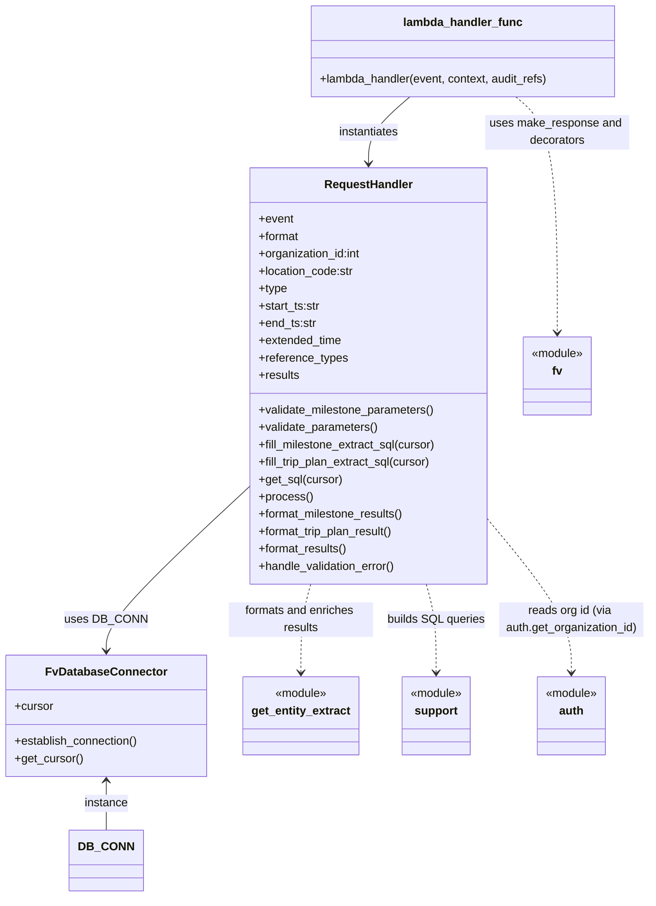

# Diagram: entity_core/entity_search/entity_search/lambdas/history_endpoints/get_entity_extract_by_location.py


> Auto-generated by Obscura crawlers

## Diagram 1



> SVG rendering failed for this diagram.

## Diagram 2

```mermaid
flowchart TD
A[Incoming event] --> B[lambda_handler(event, context, audit_refs)]
B --> C[update audit_refs with sender email (Searchable_Ids.SENDER_ID)]
C --> D[request_handler = RequestHandler(event)]
D --> E[request_handler.validate_parameters()]
E --> F{type == MILESTONES or TRIP_PLAN}
F -->|MILESTONES| G[validate_milestone_parameters (check time range)]
F -->|TRIP_PLAN| H[skip milestone-specific validation or validate similarly]
G --> I[DB_CONN.establish_connection()]
H --> I
I --> J[cursor = DB_CONN.get_cursor()]
J --> K[sql = request_handler.get_sql(cursor)]
K --> L[execute sql (cursor.execute) and fetch results]
L --> M[request_handler.results = cursor.fetchall()]
M --> N{request_handler.type == MILESTONES?}
N -->|Yes| O[formatted = request_handler.format_milestone_results()]
N -->|No| P[formatted = request_handler.format_trip_plan_result()]
O --> Q[fv.aws.lambdas.make_response(formatted,200,request_handler.format)]
P --> Q
Q --> R[Return HTTP response to caller]
```

> SVG rendering failed for this diagram.
