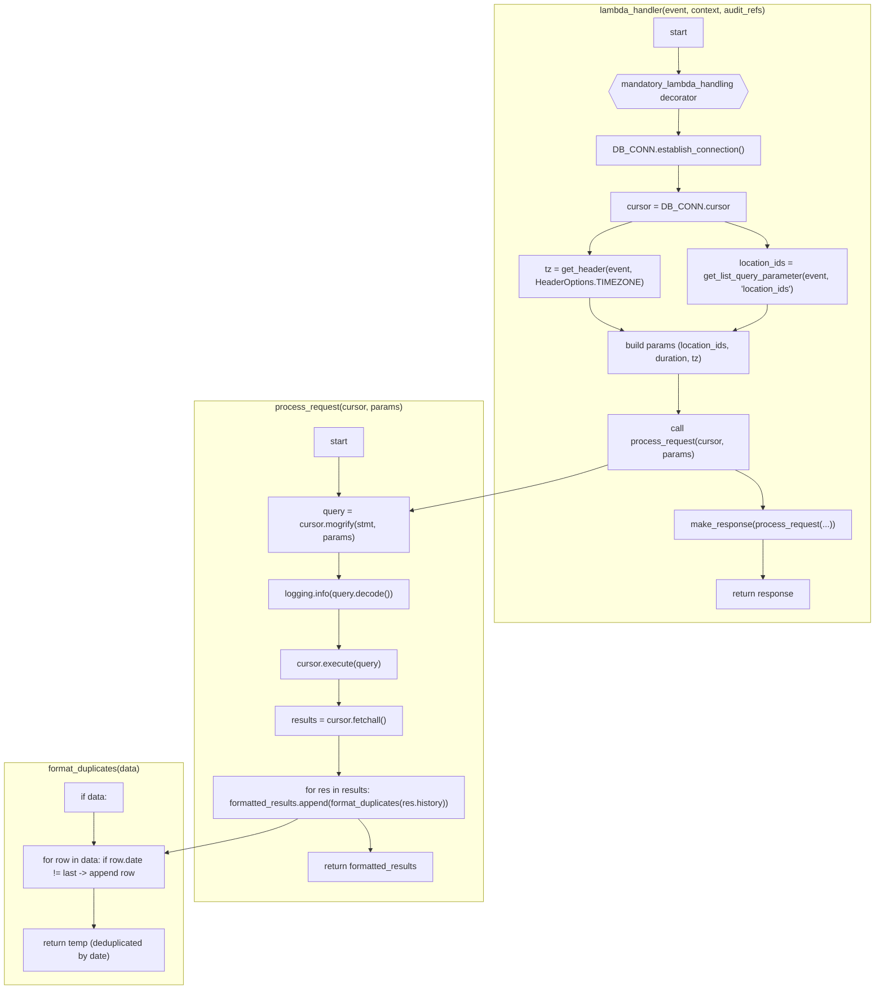
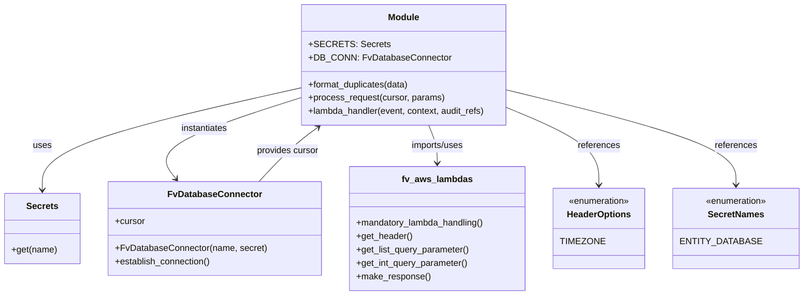

# Diagram: entity_core/entity_search/entity_search/lambdas/history_endpoints/get_location_capacity.py

> Auto-generated by Obscura crawlers

## Diagram 1

### SVG

<svg id="container" width="1629.843017578125" xmlns="http://www.w3.org/2000/svg" class="flowchart" height="1821" viewBox="0 0 1629.843017578125 1821" role="graphics-document document" aria-roledescription="flowchart-v2"><g><marker id="container_flowchart-v2-pointEnd" class="marker flowchart-v2" viewBox="0 0 10 10" refX="5" refY="5" markerUnits="userSpaceOnUse" markerWidth="8" markerHeight="8" orient="auto"><path d="M 0 0 L 10 5 L 0 10 z" class="arrowMarkerPath" style="stroke-width: 1; stroke-dasharray: 1, 0;"></path></marker><marker id="container_flowchart-v2-pointStart" class="marker flowchart-v2" viewBox="0 0 10 10" refX="4.5" refY="5" markerUnits="userSpaceOnUse" markerWidth="8" markerHeight="8" orient="auto"><path d="M 0 5 L 10 10 L 10 0 z" class="arrowMarkerPath" style="stroke-width: 1; stroke-dasharray: 1, 0;"></path></marker><marker id="container_flowchart-v2-circleEnd" class="marker flowchart-v2" viewBox="0 0 10 10" refX="11" refY="5" markerUnits="userSpaceOnUse" markerWidth="11" markerHeight="11" orient="auto"><circle cx="5" cy="5" r="5" class="arrowMarkerPath" style="stroke-width: 1; stroke-dasharray: 1, 0;"></circle></marker><marker id="container_flowchart-v2-circleStart" class="marker flowchart-v2" viewBox="0 0 10 10" refX="-1" refY="5" markerUnits="userSpaceOnUse" markerWidth="11" markerHeight="11" orient="auto"><circle cx="5" cy="5" r="5" class="arrowMarkerPath" style="stroke-width: 1; stroke-dasharray: 1, 0;"></circle></marker><marker id="container_flowchart-v2-crossEnd" class="marker cross flowchart-v2" viewBox="0 0 11 11" refX="12" refY="5.2" markerUnits="userSpaceOnUse" markerWidth="11" markerHeight="11" orient="auto"><path d="M 1,1 l 9,9 M 10,1 l -9,9" class="arrowMarkerPath" style="stroke-width: 2; stroke-dasharray: 1, 0;"></path></marker><marker id="container_flowchart-v2-crossStart" class="marker cross flowchart-v2" viewBox="0 0 11 11" refX="-1" refY="5.2" markerUnits="userSpaceOnUse" markerWidth="11" markerHeight="11" orient="auto"><path d="M 1,1 l 9,9 M 10,1 l -9,9" class="arrowMarkerPath" style="stroke-width: 2; stroke-dasharray: 1, 0;"></path></marker><g class="root"><g class="clusters"><g class="cluster" id="Format" data-look="classic"><rect style="" x="8" y="1404" width="330" height="409"></rect><g class="cluster-label" transform="translate(85.28125, 1404)"><foreignObject width="175.4375" height="24">

format_duplicates(data)

</foreignObject></g></g><g class="cluster" id="Process" data-look="classic"><rect style="" x="358" y="738" width="548.578125" height="922"></rect><g class="cluster-label" transform="translate(532.2890625, 738)"><foreignObject width="200" height="48">

process_request(cursor, params)

</foreignObject></g></g><g class="cluster" id="Lambda" data-look="classic"><rect style="" x="926.578125" y="8" width="695.2649765014648" height="1138"></rect><g class="cluster-label" transform="translate(1174.2106132507324, 8)"><foreignObject width="200" height="48">

lambda_handler(event, context, audit_refs)

</foreignObject></g></g></g><g class="edgePaths"><path d="M1265.972,87L1265.972,91.167C1265.972,95.333,1265.972,103.667,1266.042,111.417C1266.113,119.167,1266.253,126.334,1266.323,129.917L1266.394,133.501" id="L_LSTART_DECORATOR_0" class="edge-thickness-normal edge-pattern-solid edge-thickness-normal edge-pattern-solid flowchart-link" style=";" data-edge="true" data-et="edge" data-id="L_LSTART_DECORATOR_0" data-points="W3sieCI6MTI2NS45NzIwMDc3NTE0NjQ4LCJ5Ijo4N30seyJ4IjoxMjY1Ljk3MjAwNzc1MTQ2NDgsInkiOjExMn0seyJ4IjoxMjY2LjQ3MjAwNzc1MTQ2NSwieSI6MTM3LjV9XQ==" marker-end="url(#container_flowchart-v2-pointEnd)"></path><path d="M1266.472,200.5L1266.389,204.583C1266.305,208.667,1266.139,216.833,1266.055,224.417C1265.972,232,1265.972,239,1265.972,242.5L1265.972,246" id="L_DECORATOR_EST_CONN_0" class="edge-thickness-normal edge-pattern-solid edge-thickness-normal edge-pattern-solid flowchart-link" style=";" data-edge="true" data-et="edge" data-id="L_DECORATOR_EST_CONN_0" data-points="W3sieCI6MTI2Ni40NzIwMDc3NTE0NjUsInkiOjIwMC40OTk5OTk5OTk5OTk5N30seyJ4IjoxMjY1Ljk3MjAwNzc1MTQ2NDgsInkiOjIyNX0seyJ4IjoxMjY1Ljk3MjAwNzc1MTQ2NDgsInkiOjI1MH1d" marker-end="url(#container_flowchart-v2-pointEnd)"></path><path d="M1265.972,304L1265.972,308.167C1265.972,312.333,1265.972,320.667,1265.972,328.333C1265.972,336,1265.972,343,1265.972,346.5L1265.972,350" id="L_EST_CONN_CURSOR_0" class="edge-thickness-normal edge-pattern-solid edge-thickness-normal edge-pattern-solid flowchart-link" style=";" data-edge="true" data-et="edge" data-id="L_EST_CONN_CURSOR_0" data-points="W3sieCI6MTI2NS45NzIwMDc3NTE0NjQ4LCJ5IjozMDR9LHsieCI6MTI2NS45NzIwMDc3NTE0NjQ4LCJ5IjozMjl9LHsieCI6MTI2NS45NzIwMDc3NTE0NjQ4LCJ5IjozNTR9XQ==" marker-end="url(#container_flowchart-v2-pointEnd)"></path><path d="M1180.358,408L1167.146,412.167C1153.934,416.333,1127.509,424.667,1114.297,434.333C1101.085,444,1101.085,455,1101.085,460.5L1101.085,466" id="L_CURSOR_GET_TZ_0" class="edge-thickness-normal edge-pattern-solid edge-thickness-normal edge-pattern-solid flowchart-link" style=";" data-edge="true" data-et="edge" data-id="L_CURSOR_GET_TZ_0" data-points="W3sieCI6MTE4MC4zNTc3NDk5Mzg5NjQ4LCJ5Ijo0MDh9LHsieCI6MTEwMS4wODUyODkwMDE0NjQ4LCJ5Ijo0MzN9LHsieCI6MTEwMS4wODUyODkwMDE0NjQ4LCJ5Ijo0NzB9XQ==" marker-end="url(#container_flowchart-v2-pointEnd)"></path><path d="M1351.586,408L1364.798,412.167C1378.01,416.333,1404.435,424.667,1417.647,432.333C1430.859,440,1430.859,447,1430.859,450.5L1430.859,454" id="L_CURSOR_GET_LOC_0" class="edge-thickness-normal edge-pattern-solid edge-thickness-normal edge-pattern-solid flowchart-link" style=";" data-edge="true" data-et="edge" data-id="L_CURSOR_GET_LOC_0" data-points="W3sieCI6MTM1MS41ODYyNjU1NjM5NjQ4LCJ5Ijo0MDh9LHsieCI6MTQzMC44NTg3MjY1MDE0NjQ4LCJ5Ijo0MzN9LHsieCI6MTQzMC44NTg3MjY1MDE0NjQ4LCJ5Ijo0NTh9XQ==" marker-end="url(#container_flowchart-v2-pointEnd)"></path><path d="M1101.085,548L1101.085,554.167C1101.085,560.333,1101.085,572.667,1111.199,582.759C1121.312,592.851,1141.539,600.702,1151.652,604.627L1161.765,608.553" id="L_GET_TZ_BUILD_PARAMS_0" class="edge-thickness-normal edge-pattern-solid edge-thickness-normal edge-pattern-solid flowchart-link" style=";" data-edge="true" data-et="edge" data-id="L_GET_TZ_BUILD_PARAMS_0" data-points="W3sieCI6MTEwMS4wODUyODkwMDE0NjQ4LCJ5Ijo1NDh9LHsieCI6MTEwMS4wODUyODkwMDE0NjQ4LCJ5Ijo1ODV9LHsieCI6MTE2NS40OTQxNjM1MTMxODM2LCJ5Ijo2MTB9XQ==" marker-end="url(#container_flowchart-v2-pointEnd)"></path><path d="M1430.859,560L1430.859,564.167C1430.859,568.333,1430.859,576.667,1420.745,584.759C1410.632,592.851,1390.405,600.702,1380.292,604.627L1370.179,608.553" id="L_GET_LOC_BUILD_PARAMS_0" class="edge-thickness-normal edge-pattern-solid edge-thickness-normal edge-pattern-solid flowchart-link" style=";" data-edge="true" data-et="edge" data-id="L_GET_LOC_BUILD_PARAMS_0" data-points="W3sieCI6MTQzMC44NTg3MjY1MDE0NjQ4LCJ5Ijo1NjB9LHsieCI6MTQzMC44NTg3MjY1MDE0NjQ4LCJ5Ijo1ODV9LHsieCI6MTM2Ni40NDk4NTE5ODk3NDYsInkiOjYxMH1d" marker-end="url(#container_flowchart-v2-pointEnd)"></path><path d="M1265.972,688L1265.972,692.167C1265.972,696.333,1265.972,704.667,1265.972,713C1265.972,721.333,1265.972,729.667,1265.972,737.333C1265.972,745,1265.972,752,1265.972,755.5L1265.972,759" id="L_BUILD_PARAMS_CALL_PROC_0" class="edge-thickness-normal edge-pattern-solid edge-thickness-normal edge-pattern-solid flowchart-link" style=";" data-edge="true" data-et="edge" data-id="L_BUILD_PARAMS_CALL_PROC_0" data-points="W3sieCI6MTI2NS45NzIwMDc3NTE0NjQ4LCJ5Ijo2ODh9LHsieCI6MTI2NS45NzIwMDc3NTE0NjQ4LCJ5Ijo3MTN9LHsieCI6MTI2NS45NzIwMDc3NTE0NjQ4LCJ5Ijo3Mzh9LHsieCI6MTI2NS45NzIwMDc3NTE0NjQ4LCJ5Ijo3NjN9XQ==" marker-end="url(#container_flowchart-v2-pointEnd)"></path><path d="M1372.452,865L1381.151,869.167C1389.85,873.333,1407.249,881.667,1415.948,893.333C1424.648,905,1424.648,920,1424.648,927.5L1424.648,935" id="L_CALL_PROC_MAKE_RESP_0" class="edge-thickness-normal edge-pattern-solid edge-thickness-normal edge-pattern-solid flowchart-link" style=";" data-edge="true" data-et="edge" data-id="L_CALL_PROC_MAKE_RESP_0" data-points="W3sieCI6MTM3Mi40NTE4MDgzMjcxMjI4LCJ5Ijo4NjV9LHsieCI6MTQyNC42NDc3ODkwMDE0NjQ4LCJ5Ijo4OTB9LHsieCI6MTQyNC42NDc3ODkwMDE0NjQ4LCJ5Ijo5Mzl9XQ==" marker-end="url(#container_flowchart-v2-pointEnd)"></path><path d="M1424.648,993L1424.648,1001.167C1424.648,1009.333,1424.648,1025.667,1424.648,1037.333C1424.648,1049,1424.648,1056,1424.648,1059.5L1424.648,1063" id="L_MAKE_RESP_RETURN_0" class="edge-thickness-normal edge-pattern-solid edge-thickness-normal edge-pattern-solid flowchart-link" style=";" data-edge="true" data-et="edge" data-id="L_MAKE_RESP_RETURN_0" data-points="W3sieCI6MTQyNC42NDc3ODkwMDE0NjQ4LCJ5Ijo5OTN9LHsieCI6MTQyNC42NDc3ODkwMDE0NjQ4LCJ5IjoxMDQyfSx7IngiOjE0MjQuNjQ3Nzg5MDAxNDY0OCwieSI6MTA2N31d" marker-end="url(#container_flowchart-v2-pointEnd)"></path><path d="M632.289,841L632.289,849.167C632.289,857.333,632.289,873.667,632.289,885.333C632.289,897,632.289,904,632.289,907.5L632.289,911" id="L_P_START_MOGRIFY_0" class="edge-thickness-normal edge-pattern-solid edge-thickness-normal edge-pattern-solid flowchart-link" style=";" data-edge="true" data-et="edge" data-id="L_P_START_MOGRIFY_0" data-points="W3sieCI6NjMyLjI4OTA2MjUsInkiOjg0MX0seyJ4Ijo2MzIuMjg5MDYyNSwieSI6ODkwfSx7IngiOjYzMi4yODkwNjI1LCJ5Ijo5MTV9XQ==" marker-end="url(#container_flowchart-v2-pointEnd)"></path><path d="M632.289,1017L632.289,1021.167C632.289,1025.333,632.289,1033.667,632.289,1041.333C632.289,1049,632.289,1056,632.289,1059.5L632.289,1063" id="L_MOGRIFY_LOG_0" class="edge-thickness-normal edge-pattern-solid edge-thickness-normal edge-pattern-solid flowchart-link" style=";" data-edge="true" data-et="edge" data-id="L_MOGRIFY_LOG_0" data-points="W3sieCI6NjMyLjI4OTA2MjUsInkiOjEwMTd9LHsieCI6NjMyLjI4OTA2MjUsInkiOjEwNDJ9LHsieCI6NjMyLjI4OTA2MjUsInkiOjEwNjd9XQ==" marker-end="url(#container_flowchart-v2-pointEnd)"></path><path d="M632.289,1121L632.289,1125.167C632.289,1129.333,632.289,1137.667,632.289,1146C632.289,1154.333,632.289,1162.667,632.289,1170.333C632.289,1178,632.289,1185,632.289,1188.5L632.289,1192" id="L_LOG_EXEC_0" class="edge-thickness-normal edge-pattern-solid edge-thickness-normal edge-pattern-solid flowchart-link" style=";" data-edge="true" data-et="edge" data-id="L_LOG_EXEC_0" data-points="W3sieCI6NjMyLjI4OTA2MjUsInkiOjExMjF9LHsieCI6NjMyLjI4OTA2MjUsInkiOjExNDZ9LHsieCI6NjMyLjI4OTA2MjUsInkiOjExNzF9LHsieCI6NjMyLjI4OTA2MjUsInkiOjExOTZ9XQ==" marker-end="url(#container_flowchart-v2-pointEnd)"></path><path d="M632.289,1250L632.289,1254.167C632.289,1258.333,632.289,1266.667,632.289,1274.333C632.289,1282,632.289,1289,632.289,1292.5L632.289,1296" id="L_EXEC_FETCH_0" class="edge-thickness-normal edge-pattern-solid edge-thickness-normal edge-pattern-solid flowchart-link" style=";" data-edge="true" data-et="edge" data-id="L_EXEC_FETCH_0" data-points="W3sieCI6NjMyLjI4OTA2MjUsInkiOjEyNTB9LHsieCI6NjMyLjI4OTA2MjUsInkiOjEyNzV9LHsieCI6NjMyLjI4OTA2MjUsInkiOjEzMDB9XQ==" marker-end="url(#container_flowchart-v2-pointEnd)"></path><path d="M632.289,1354L632.289,1358.167C632.289,1362.333,632.289,1370.667,632.289,1379C632.289,1387.333,632.289,1395.667,632.289,1403.333C632.289,1411,632.289,1418,632.289,1421.5L632.289,1425" id="L_FETCH_FORMAT_LOOP_0" class="edge-thickness-normal edge-pattern-solid edge-thickness-normal edge-pattern-solid flowchart-link" style=";" data-edge="true" data-et="edge" data-id="L_FETCH_FORMAT_LOOP_0" data-points="W3sieCI6NjMyLjI4OTA2MjUsInkiOjEzNTR9LHsieCI6NjMyLjI4OTA2MjUsInkiOjEzNzl9LHsieCI6NjMyLjI4OTA2MjUsInkiOjE0MDR9LHsieCI6NjMyLjI4OTA2MjUsInkiOjE0Mjl9XQ==" marker-end="url(#container_flowchart-v2-pointEnd)"></path><path d="M668.711,1507L672.602,1511.167C676.494,1515.333,684.276,1523.667,688.167,1533.333C692.059,1543,692.059,1554,692.059,1559.5L692.059,1565" id="L_FORMAT_LOOP_RETURN_PROC_0" class="edge-thickness-normal edge-pattern-solid edge-thickness-normal edge-pattern-solid flowchart-link" style=";" data-edge="true" data-et="edge" data-id="L_FORMAT_LOOP_RETURN_PROC_0" data-points="W3sieCI6NjY4LjcxMTEyMDYwNTQ2ODgsInkiOjE1MDd9LHsieCI6NjkyLjA1ODU5Mzc1LCJ5IjoxNTMyfSx7IngiOjY5Mi4wNTg1OTM3NSwieSI6MTU2OX1d" marker-end="url(#container_flowchart-v2-pointEnd)"></path><path d="M173,1495L173,1501.167C173,1507.333,173,1519.667,173,1529.333C173,1539,173,1546,173,1549.5L173,1553" id="L_F_START_ITER_0" class="edge-thickness-normal edge-pattern-solid edge-thickness-normal edge-pattern-solid flowchart-link" style=";" data-edge="true" data-et="edge" data-id="L_F_START_ITER_0" data-points="W3sieCI6MTczLCJ5IjoxNDk1fSx7IngiOjE3MywieSI6MTUzMn0seyJ4IjoxNzMsInkiOjE1NTd9XQ==" marker-end="url(#container_flowchart-v2-pointEnd)"></path><path d="M173,1635L173,1639.167C173,1643.333,173,1651.667,173,1660C173,1668.333,173,1676.667,173,1684.333C173,1692,173,1699,173,1702.5L173,1706" id="L_ITER_RETURN_FMT_0" class="edge-thickness-normal edge-pattern-solid edge-thickness-normal edge-pattern-solid flowchart-link" style=";" data-edge="true" data-et="edge" data-id="L_ITER_RETURN_FMT_0" data-points="W3sieCI6MTczLCJ5IjoxNjM1fSx7IngiOjE3MywieSI6MTY2MH0seyJ4IjoxNzMsInkiOjE2ODV9LHsieCI6MTczLCJ5IjoxNzEwfV0=" marker-end="url(#container_flowchart-v2-pointEnd)"></path><path d="M1135.972,855.62L1118.074,861.35C1100.176,867.08,1064.381,878.54,1002.755,892.656C941.129,906.772,853.673,923.544,809.945,931.93L766.217,940.316" id="L_CALL_PROC_MOGRIFY_0" class="edge-thickness-normal edge-pattern-solid edge-thickness-normal edge-pattern-solid flowchart-link" style=";" data-edge="true" data-et="edge" data-id="L_CALL_PROC_MOGRIFY_0" data-points="W3sieCI6MTEzNS45NzIwMDc3NTE0NjQ4LCJ5Ijo4NTUuNjE5ODUxNTczOTQxNn0seyJ4IjoxMDI4LjU4NTI4OTAwMTQ2NDgsInkiOjg5MH0seyJ4Ijo3NjIuMjg5MDYyNSwieSI6OTQxLjA2OTE1NDQ4NzczOTF9XQ==" marker-end="url(#container_flowchart-v2-pointEnd)"></path><path d="M554.81,1507L546.533,1511.167C538.255,1515.333,521.7,1523.667,480.386,1534.199C439.072,1544.731,373,1557.463,339.964,1563.828L306.928,1570.194" id="L_FORMAT_LOOP_ITER_0" class="edge-thickness-normal edge-pattern-solid edge-thickness-normal edge-pattern-solid flowchart-link" style=";" data-edge="true" data-et="edge" data-id="L_FORMAT_LOOP_ITER_0" data-points="W3sieCI6NTU0LjgxMDM2Mzc2OTUzMTIsInkiOjE1MDd9LHsieCI6NTA1LjE0NDUzMTI1LCJ5IjoxNTMyfSx7IngiOjMwMywieSI6MTU3MC45NTA2NjM4OTExNDN9XQ==" marker-end="url(#container_flowchart-v2-pointEnd)"></path></g><g class="edgeLabels"><g class="edgeLabel"><g class="label" data-id="L_LSTART_DECORATOR_0" transform="translate(0, 0)"><foreignObject width="0" height="0">

</foreignObject></g></g><g class="edgeLabel"><g class="label" data-id="L_DECORATOR_EST_CONN_0" transform="translate(0, 0)"><foreignObject width="0" height="0">

</foreignObject></g></g><g class="edgeLabel"><g class="label" data-id="L_EST_CONN_CURSOR_0" transform="translate(0, 0)"><foreignObject width="0" height="0">

</foreignObject></g></g><g class="edgeLabel"><g class="label" data-id="L_CURSOR_GET_TZ_0" transform="translate(0, 0)"><foreignObject width="0" height="0">

</foreignObject></g></g><g class="edgeLabel"><g class="label" data-id="L_CURSOR_GET_LOC_0" transform="translate(0, 0)"><foreignObject width="0" height="0">

</foreignObject></g></g><g class="edgeLabel"><g class="label" data-id="L_GET_TZ_BUILD_PARAMS_0" transform="translate(0, 0)"><foreignObject width="0" height="0">

</foreignObject></g></g><g class="edgeLabel"><g class="label" data-id="L_GET_LOC_BUILD_PARAMS_0" transform="translate(0, 0)"><foreignObject width="0" height="0">

</foreignObject></g></g><g class="edgeLabel"><g class="label" data-id="L_BUILD_PARAMS_CALL_PROC_0" transform="translate(0, 0)"><foreignObject width="0" height="0">

</foreignObject></g></g><g class="edgeLabel"><g class="label" data-id="L_CALL_PROC_MAKE_RESP_0" transform="translate(0, 0)"><foreignObject width="0" height="0">

</foreignObject></g></g><g class="edgeLabel"><g class="label" data-id="L_MAKE_RESP_RETURN_0" transform="translate(0, 0)"><foreignObject width="0" height="0">

</foreignObject></g></g><g class="edgeLabel"><g class="label" data-id="L_P_START_MOGRIFY_0" transform="translate(0, 0)"><foreignObject width="0" height="0">

</foreignObject></g></g><g class="edgeLabel"><g class="label" data-id="L_MOGRIFY_LOG_0" transform="translate(0, 0)"><foreignObject width="0" height="0">

</foreignObject></g></g><g class="edgeLabel"><g class="label" data-id="L_LOG_EXEC_0" transform="translate(0, 0)"><foreignObject width="0" height="0">

</foreignObject></g></g><g class="edgeLabel"><g class="label" data-id="L_EXEC_FETCH_0" transform="translate(0, 0)"><foreignObject width="0" height="0">

</foreignObject></g></g><g class="edgeLabel"><g class="label" data-id="L_FETCH_FORMAT_LOOP_0" transform="translate(0, 0)"><foreignObject width="0" height="0">

</foreignObject></g></g><g class="edgeLabel"><g class="label" data-id="L_FORMAT_LOOP_RETURN_PROC_0" transform="translate(0, 0)"><foreignObject width="0" height="0">

</foreignObject></g></g><g class="edgeLabel"><g class="label" data-id="L_F_START_ITER_0" transform="translate(0, 0)"><foreignObject width="0" height="0">

</foreignObject></g></g><g class="edgeLabel"><g class="label" data-id="L_ITER_RETURN_FMT_0" transform="translate(0, 0)"><foreignObject width="0" height="0">

</foreignObject></g></g><g class="edgeLabel"><g class="label" data-id="L_CALL_PROC_MOGRIFY_0" transform="translate(0, 0)"><foreignObject width="0" height="0">

</foreignObject></g></g><g class="edgeLabel"><g class="label" data-id="L_FORMAT_LOOP_ITER_0" transform="translate(0, 0)"><foreignObject width="0" height="0">

</foreignObject></g></g></g><g class="nodes"><g class="node default" id="flowchart-LSTART-0" transform="translate(1265.9720077514648, 60)"><rect class="basic label-container" style="" x="-46.8984375" y="-27" width="93.796875" height="54"></rect><g class="label" style="" transform="translate(-16.8984375, -12)"><rect></rect><foreignObject width="33.796875" height="24">

start

</foreignObject></g></g><g class="node default" id="flowchart-DECORATOR-1" transform="translate(1265.9720077514648, 168.5)"><g class="basic label-container"><path d="M-133.26432291666666 -31.5 C-88.564390146065 -31.5, -43.86445737546333 -31.5, 0 -31.5 C48.949320776070095 -31.5, 97.89864155214019 -31.5, 133.26432291666666 -31.5 C139.53087649543932 -18.96689284245469, 145.79743007421197 -6.4337856849093775, 149.01432291666666 0 C143.17029607826694 11.688053676799417, 137.32626923986723 23.376107353598833, 133.26432291666666 31.5 C97.13697130104299 31.5, 61.00961968541931 31.5, 0 31.5 C-47.05987943204883 31.5, -94.11975886409766 31.5, -133.26432291666666 31.5 C-139.08384021143843 19.860965410456473, -144.9033575062102 8.221930820912942, -149.01432291666666 0 C-144.0870822866555 -9.854481260022338, -139.15984165664432 -19.708962520044675, -133.26432291666666 -31.5" stroke="none" stroke-width="0" fill="#ECECFF" style=""></path><path d="M-133.26432291666666 -31.5 C-89.55117257477337 -31.5, -45.83802223288011 -31.5, 0 -31.5 M-133.26432291666666 -31.5 C-102.23232289512582 -31.5, -71.20032287358498 -31.5, 0 -31.5 M0 -31.5 C45.98596450974395 -31.5, 91.9719290194879 -31.5, 133.26432291666666 -31.5 M0 -31.5 C31.9349360671561 -31.5, 63.8698721343122 -31.5, 133.26432291666666 -31.5 M133.26432291666666 -31.5 C136.59776320935748 -24.833119414618377, 139.93120350204828 -18.166238829236754, 149.01432291666666 0 M133.26432291666666 -31.5 C138.7469156032774 -20.53481462677856, 144.2295082898881 -9.569629253557117, 149.01432291666666 0 M149.01432291666666 0 C144.47984005781444 9.068965717704453, 139.9453571989622 18.137931435408905, 133.26432291666666 31.5 M149.01432291666666 0 C145.45112537502987 7.1263950832735885, 141.88792783339306 14.252790166547177, 133.26432291666666 31.5 M133.26432291666666 31.5 C85.52183076161805 31.5, 37.779338606569425 31.5, 0 31.5 M133.26432291666666 31.5 C101.55016247968527 31.5, 69.83600204270387 31.5, 0 31.5 M0 31.5 C-42.39277080991079 31.5, -84.78554161982159 31.5, -133.26432291666666 31.5 M0 31.5 C-42.85677250796061 31.5, -85.71354501592123 31.5, -133.26432291666666 31.5 M-133.26432291666666 31.5 C-136.83947941831664 24.3496869967, -140.41463591996666 17.199373993400002, -149.01432291666666 0 M-133.26432291666666 31.5 C-136.5051898852529 25.01826606282755, -139.74605685383912 18.5365321256551, -149.01432291666666 0 M-149.01432291666666 0 C-143.06367554999022 -11.901294733352897, -137.11302818331376 -23.802589466705793, -133.26432291666666 -31.5 M-149.01432291666666 0 C-145.71392320101737 -6.600799431298597, -142.41352348536805 -13.201598862597194, -133.26432291666666 -31.5" stroke="#9370DB" stroke-width="1.3" fill="none" stroke-dasharray="0 0" style=""></path></g><g class="label" style="" transform="translate(-108.9765625, -24)"><rect></rect><foreignObject width="217.953125" height="48">

mandatory_lambda_handling decorator

</foreignObject></g></g><g class="node default" id="flowchart-EST_CONN-3" transform="translate(1265.9720077514648, 277)"><rect class="basic label-container" style="" x="-148.9609375" y="-27" width="297.921875" height="54"></rect><g class="label" style="" transform="translate(-118.9609375, -12)"><rect></rect><foreignObject width="237.921875" height="24">

DB_CONN.establish_connection()

</foreignObject></g></g><g class="node default" id="flowchart-CURSOR-5" transform="translate(1265.9720077514648, 381)"><rect class="basic label-container" style="" x="-120.2890625" y="-27" width="240.578125" height="54"></rect><g class="label" style="" transform="translate(-90.2890625, -12)"><rect></rect><foreignObject width="180.578125" height="24">

cursor = DB_CONN.cursor

</foreignObject></g></g><g class="node default" id="flowchart-GET_TZ-7" transform="translate(1101.0852890014648, 509)"><rect class="basic label-container" style="" x="-130" y="-39" width="260" height="78"></rect><g class="label" style="" transform="translate(-100, -24)"><rect></rect><foreignObject width="200" height="48">

tz = get_header(event, HeaderOptions.TIMEZONE)

</foreignObject></g></g><g class="node default" id="flowchart-GET_LOC-9" transform="translate(1430.8587265014648, 509)"><rect class="basic label-container" style="" x="-149.7734375" y="-51" width="299.546875" height="102"></rect><g class="label" style="" transform="translate(-119.7734375, -36)"><rect></rect><foreignObject width="239.546875" height="72">

location_ids = get_list_query_parameter(event, 'location_ids')

</foreignObject></g></g><g class="node default" id="flowchart-BUILD_PARAMS-11" transform="translate(1265.9720077514648, 649)"><rect class="basic label-container" style="" x="-130" y="-39" width="260" height="78"></rect><g class="label" style="" transform="translate(-100, -24)"><rect></rect><foreignObject width="200" height="48">

build params (location_ids, duration, tz)

</foreignObject></g></g><g class="node default" id="flowchart-CALL_PROC-15" transform="translate(1265.9720077514648, 814)"><rect class="basic label-container" style="" x="-130" y="-51" width="260" height="102"></rect><g class="label" style="" transform="translate(-100, -36)"><rect></rect><foreignObject width="200" height="72">

call process_request(cursor, params)

</foreignObject></g></g><g class="node default" id="flowchart-MAKE_RESP-17" transform="translate(1424.6477890014648, 966)"><rect class="basic label-container" style="" x="-162.1953125" y="-27" width="324.390625" height="54"></rect><g class="label" style="" transform="translate(-132.1953125, -12)"><rect></rect><foreignObject width="264.390625" height="24">

make_response(process_request(...))

</foreignObject></g></g><g class="node default" id="flowchart-RETURN-19" transform="translate(1424.6477890014648, 1094)"><rect class="basic label-container" style="" x="-87.8046875" y="-27" width="175.609375" height="54"></rect><g class="label" style="" transform="translate(-57.8046875, -12)"><rect></rect><foreignObject width="115.609375" height="24">

return response

</foreignObject></g></g><g class="node default" id="flowchart-P_START-20" transform="translate(632.2890625, 814)"><rect class="basic label-container" style="" x="-46.8984375" y="-27" width="93.796875" height="54"></rect><g class="label" style="" transform="translate(-16.8984375, -12)"><rect></rect><foreignObject width="33.796875" height="24">

start

</foreignObject></g></g><g class="node default" id="flowchart-MOGRIFY-21" transform="translate(632.2890625, 966)"><rect class="basic label-container" style="" x="-130" y="-51" width="260" height="102"></rect><g class="label" style="" transform="translate(-100, -36)"><rect></rect><foreignObject width="200" height="72">

query = cursor.mogrify(stmt, params)

</foreignObject></g></g><g class="node default" id="flowchart-LOG-23" transform="translate(632.2890625, 1094)"><rect class="basic label-container" style="" x="-131.875" y="-27" width="263.75" height="54"></rect><g class="label" style="" transform="translate(-101.875, -12)"><rect></rect><foreignObject width="203.75" height="24">

logging.info(query.decode())

</foreignObject></g></g><g class="node default" id="flowchart-EXEC-25" transform="translate(632.2890625, 1223)"><rect class="basic label-container" style="" x="-108.0625" y="-27" width="216.125" height="54"></rect><g class="label" style="" transform="translate(-78.0625, -12)"><rect></rect><foreignObject width="156.125" height="24">

cursor.execute(query)

</foreignObject></g></g><g class="node default" id="flowchart-FETCH-27" transform="translate(632.2890625, 1327)"><rect class="basic label-container" style="" x="-119.2265625" y="-27" width="238.453125" height="54"></rect><g class="label" style="" transform="translate(-89.2265625, -12)"><rect></rect><foreignObject width="178.453125" height="24">

results = cursor.fetchall()

</foreignObject></g></g><g class="node default" id="flowchart-FORMAT_LOOP-29" transform="translate(632.2890625, 1468)"><rect class="basic label-container" style="" x="-239.2890625" y="-39" width="478.578125" height="78"></rect><g class="label" style="" transform="translate(-209.2890625, -24)"><rect></rect><foreignObject width="418.578125" height="48">

for res in results: formatted_results.append(format_duplicates(res.history))

</foreignObject></g></g><g class="node default" id="flowchart-RETURN_PROC-31" transform="translate(692.05859375, 1596)"><rect class="basic label-container" style="" x="-119.75" y="-27" width="239.5" height="54"></rect><g class="label" style="" transform="translate(-89.75, -12)"><rect></rect><foreignObject width="179.5" height="24">

return formatted_results

</foreignObject></g></g><g class="node default" id="flowchart-F_START-32" transform="translate(173, 1468)"><rect class="basic label-container" style="" x="-55.296875" y="-27" width="110.59375" height="54"></rect><g class="label" style="" transform="translate(-25.296875, -12)"><rect></rect><foreignObject width="50.59375" height="24">

if data:

</foreignObject></g></g><g class="node default" id="flowchart-ITER-33" transform="translate(173, 1596)"><rect class="basic label-container" style="" x="-130" y="-39" width="260" height="78"></rect><g class="label" style="" transform="translate(-100, -24)"><rect></rect><foreignObject width="200" height="48">

for row in data: if row.date != last -&gt; append row

</foreignObject></g></g><g class="node default" id="flowchart-RETURN_FMT-35" transform="translate(173, 1749)"><rect class="basic label-container" style="" x="-130" y="-39" width="260" height="78"></rect><g class="label" style="" transform="translate(-100, -24)"><rect></rect><foreignObject width="200" height="48">

return temp (deduplicated by date)

</foreignObject></g></g></g></g></g></svg>

## Diagram 2

> SVG rendering failed for this diagram.
