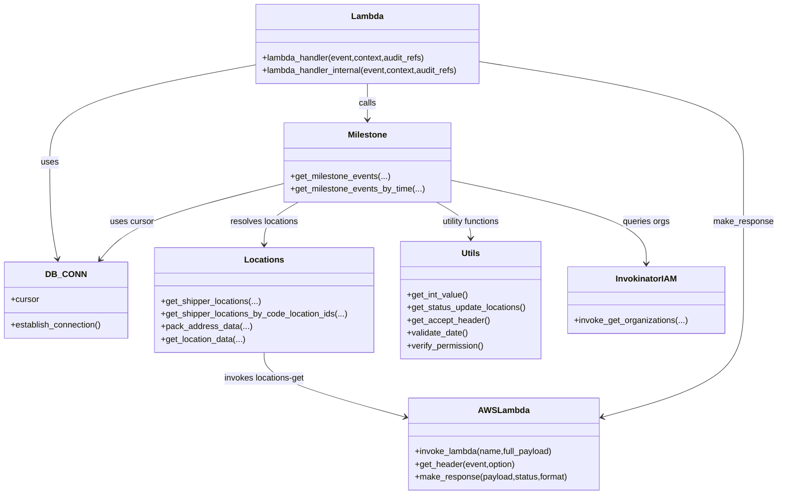
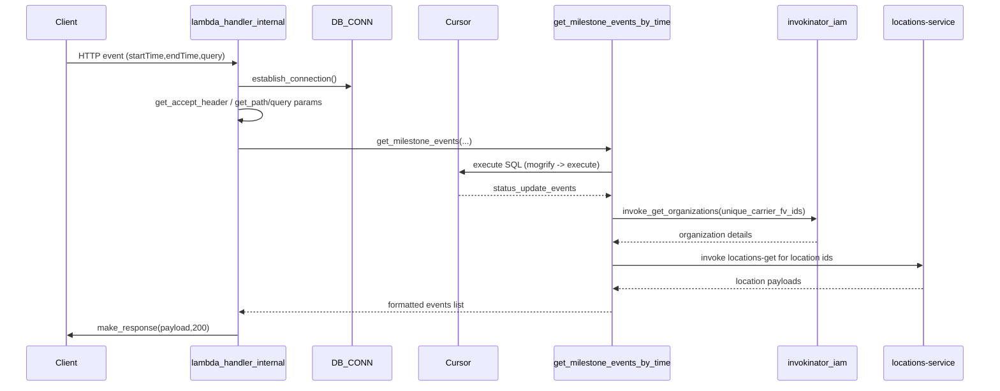

# Diagram: entity_core/entity_search/entity_search/lambdas/history_endpoints/get_milestone_events.py


> Auto-generated by Obscura crawlers

## Diagram 1

```mermaid
flowchart TD
    Event[API Event] --> LH[lambda_handler_internal]
    LH --> DB[DB_CONN.establish_connection()]
    LH --> Header[get_accept_header()]
    LH --> Solution[invokinator.get_solution()]
    LH --> Verify[verify_permission()]
    LH --> Params[get query params]
    Params --> GetMilestones[get_milestone_events()]
    GetMilestones --> GetByTime[get_milestone_events_by_time()]
    GetByTime --> Cursor[DB cursor.mogrify / execute]
    Cursor --> DBResult[status_update_events]
    GetByTime --> OrgLookup[invokinator_iam.invoke_get_organizations()]
    OrgLookup --> CarrierDetails[organization details]
    GetByTime --> Locations[get_location_data()]
    Locations --> ByCode[get_shipper_locations_by_code_location_ids()]
    ByCode --> ShipLoc[get_shipper_locations()]
    ShipLoc --> AWSInvoke[fv.aws.lambdas.invoke_lambda("locations-get")]
    GetByTime --> Format[pack_address_data / format references]
    GetByTime --> Return[return formatted events]
    LH --> MakeResponse[fv.aws.lambdas.make_response(payload,200)]
```

> SVG rendering failed for this diagram.

## Diagram 2



### SVG

<svg id="container" width="1464.328125" xmlns="http://www.w3.org/2000/svg" class="classDiagram" height="934" viewBox="0 0 1464.328125 934" role="graphics-document document" aria-roledescription="class"><style>#container{font-family:"trebuchet ms",verdana,arial,sans-serif;font-size:16px;fill:#333;}@keyframes edge-animation-frame{from{stroke-dashoffset:0;}}@keyframes dash{to{stroke-dashoffset:0;}}#container .edge-animation-slow{stroke-dasharray:9,5!important;stroke-dashoffset:900;animation:dash 50s linear infinite;stroke-linecap:round;}#container .edge-animation-fast{stroke-dasharray:9,5!important;stroke-dashoffset:900;animation:dash 20s linear infinite;stroke-linecap:round;}#container .error-icon{fill:#552222;}#container .error-text{fill:#552222;stroke:#552222;}#container .edge-thickness-normal{stroke-width:1px;}#container .edge-thickness-thick{stroke-width:3.5px;}#container .edge-pattern-solid{stroke-dasharray:0;}#container .edge-thickness-invisible{stroke-width:0;fill:none;}#container .edge-pattern-dashed{stroke-dasharray:3;}#container .edge-pattern-dotted{stroke-dasharray:2;}#container .marker{fill:#333333;stroke:#333333;}#container .marker.cross{stroke:#333333;}#container svg{font-family:"trebuchet ms",verdana,arial,sans-serif;font-size:16px;}#container p{margin:0;}#container g.classGroup text{fill:#9370DB;stroke:none;font-family:"trebuchet ms",verdana,arial,sans-serif;font-size:10px;}#container g.classGroup text .title{font-weight:bolder;}#container .nodeLabel,#container .edgeLabel{color:#131300;}#container .edgeLabel .label rect{fill:#ECECFF;}#container .label text{fill:#131300;}#container .labelBkg{background:#ECECFF;}#container .edgeLabel .label span{background:#ECECFF;}#container .classTitle{font-weight:bolder;}#container .node rect,#container .node circle,#container .node ellipse,#container .node polygon,#container .node path{fill:#ECECFF;stroke:#9370DB;stroke-width:1px;}#container .divider{stroke:#9370DB;stroke-width:1;}#container g.clickable{cursor:pointer;}#container g.classGroup rect{fill:#ECECFF;stroke:#9370DB;}#container g.classGroup line{stroke:#9370DB;stroke-width:1;}#container .classLabel .box{stroke:none;stroke-width:0;fill:#ECECFF;opacity:0.5;}#container .classLabel .label{fill:#9370DB;font-size:10px;}#container .relation{stroke:#333333;stroke-width:1;fill:none;}#container .dashed-line{stroke-dasharray:3;}#container .dotted-line{stroke-dasharray:1 2;}#container #compositionStart,#container .composition{fill:#333333!important;stroke:#333333!important;stroke-width:1;}#container #compositionEnd,#container .composition{fill:#333333!important;stroke:#333333!important;stroke-width:1;}#container #dependencyStart,#container .dependency{fill:#333333!important;stroke:#333333!important;stroke-width:1;}#container #dependencyStart,#container .dependency{fill:#333333!important;stroke:#333333!important;stroke-width:1;}#container #extensionStart,#container .extension{fill:transparent!important;stroke:#333333!important;stroke-width:1;}#container #extensionEnd,#container .extension{fill:transparent!important;stroke:#333333!important;stroke-width:1;}#container #aggregationStart,#container .aggregation{fill:transparent!important;stroke:#333333!important;stroke-width:1;}#container #aggregationEnd,#container .aggregation{fill:transparent!important;stroke:#333333!important;stroke-width:1;}#container #lollipopStart,#container .lollipop{fill:#ECECFF!important;stroke:#333333!important;stroke-width:1;}#container #lollipopEnd,#container .lollipop{fill:#ECECFF!important;stroke:#333333!important;stroke-width:1;}#container .edgeTerminals{font-size:11px;line-height:initial;}#container .classTitleText{text-anchor:middle;font-size:18px;fill:#333;}#container .label-icon{display:inline-block;height:1em;overflow:visible;vertical-align:-0.125em;}#container .node .label-icon path{fill:currentColor;stroke:revert;stroke-width:revert;}#container :root{--mermaid-font-family:"trebuchet ms",verdana,arial,sans-serif;}</style><g><defs><marker id="container_class-aggregationStart" class="marker aggregation class" refX="18" refY="7" markerWidth="190" markerHeight="240" orient="auto"><path d="M 18,7 L9,13 L1,7 L9,1 Z"></path></marker></defs><defs><marker id="container_class-aggregationEnd" class="marker aggregation class" refX="1" refY="7" markerWidth="20" markerHeight="28" orient="auto"><path d="M 18,7 L9,13 L1,7 L9,1 Z"></path></marker></defs><defs><marker id="container_class-extensionStart" class="marker extension class" refX="18" refY="7" markerWidth="190" markerHeight="240" orient="auto"><path d="M 1,7 L18,13 V 1 Z"></path></marker></defs><defs><marker id="container_class-extensionEnd" class="marker extension class" refX="1" refY="7" markerWidth="20" markerHeight="28" orient="auto"><path d="M 1,1 V 13 L18,7 Z"></path></marker></defs><defs><marker id="container_class-compositionStart" class="marker composition class" refX="18" refY="7" markerWidth="190" markerHeight="240" orient="auto"><path d="M 18,7 L9,13 L1,7 L9,1 Z"></path></marker></defs><defs><marker id="container_class-compositionEnd" class="marker composition class" refX="1" refY="7" markerWidth="20" markerHeight="28" orient="auto"><path d="M 18,7 L9,13 L1,7 L9,1 Z"></path></marker></defs><defs><marker id="container_class-dependencyStart" class="marker dependency class" refX="6" refY="7" markerWidth="190" markerHeight="240" orient="auto"><path d="M 5,7 L9,13 L1,7 L9,1 Z"></path></marker></defs><defs><marker id="container_class-dependencyEnd" class="marker dependency class" refX="13" refY="7" markerWidth="20" markerHeight="28" orient="auto"><path d="M 18,7 L9,13 L14,7 L9,1 Z"></path></marker></defs><defs><marker id="container_class-lollipopStart" class="marker lollipop class" refX="13" refY="7" markerWidth="190" markerHeight="240" orient="auto"><circle stroke="black" fill="transparent" cx="7" cy="7" r="6"></circle></marker></defs><defs><marker id="container_class-lollipopEnd" class="marker lollipop class" refX="1" refY="7" markerWidth="190" markerHeight="240" orient="auto"><circle stroke="black" fill="transparent" cx="7" cy="7" r="6"></circle></marker></defs><g class="root"><g class="clusters"></g><g class="edgePaths"><path d="M476.627,123.241L412.705,135.201C348.784,147.161,220.941,171.08,157.019,201.707C93.098,232.333,93.098,269.667,93.098,307C93.098,344.333,93.098,381.667,95.525,412.021C97.952,442.375,102.807,465.75,105.235,477.438L107.662,489.125" id="id_Lambda_DB_CONN_1" class="edge-thickness-normal edge-pattern-solid relation" style=";;;" data-edge="true" data-et="edge" data-id="id_Lambda_DB_CONN_1" data-points="W3sieCI6NDc2LjYyNjk1MzEyNSwieSI6MTIzLjI0MDg0NzAyMzUwODV9LHsieCI6OTMuMDk3NjU2MjUsInkiOjE5NX0seyJ4Ijo5My4wOTc2NTYyNSwieSI6MzA3fSx7IngiOjkzLjA5NzY1NjI1LCJ5Ijo0MTl9LHsieCI6MTA4Ljg4MjE3OTA1NDA1NDA1LCJ5Ijo0OTV9XQ==" marker-end="url(#container_class-dependencyEnd)"></path><path d="M691.701,158L691.701,164.167C691.701,170.333,691.701,182.667,691.701,194C691.701,205.333,691.701,215.667,691.701,220.833L691.701,226" id="id_Lambda_Milestone_2" class="edge-thickness-normal edge-pattern-solid relation" style=";;;" data-edge="true" data-et="edge" data-id="id_Lambda_Milestone_2" data-points="W3sieCI6NjkxLjcwMTE3MTg3NSwieSI6MTU4fSx7IngiOjY5MS43MDExNzE4NzUsInkiOjE5NX0seyJ4Ijo2OTEuNzAxMTcxODc1LCJ5IjoyMzJ9XQ==" marker-end="url(#container_class-dependencyEnd)"></path><path d="M534.896,346.466L486.865,358.555C438.834,370.644,342.771,394.822,284.863,418.808C226.954,442.795,207.199,466.589,197.322,478.486L187.445,490.384" id="id_Milestone_DB_CONN_3" class="edge-thickness-normal edge-pattern-solid relation" style=";;;" data-edge="true" data-et="edge" data-id="id_Milestone_DB_CONN_3" data-points="W3sieCI6NTM0Ljg5NjQ4NDM3NSwieSI6MzQ2LjQ2NjE0MjMxMjg5MTc1fSx7IngiOjI0Ni43MDg5ODQzNzUsInkiOjQxOX0seyJ4IjoxODMuNjEyMDE0MzU4MTA4MSwieSI6NDk1fV0=" marker-end="url(#container_class-dependencyEnd)"></path><path d="M848.506,340.383L910.052,353.486C971.599,366.588,1094.692,392.794,1156.239,419.064C1217.785,445.333,1217.785,471.667,1217.785,484.833L1217.785,498" id="id_Milestone_InvokinatorIAM_4" class="edge-thickness-normal edge-pattern-solid relation" style=";;;" data-edge="true" data-et="edge" data-id="id_Milestone_InvokinatorIAM_4" data-points="W3sieCI6ODQ4LjUwNTg1OTM3NSwieSI6MzQwLjM4Mjc0MDI0OTg1NjE3fSx7IngiOjEyMTcuNzg1MTU2MjUsInkiOjQxOX0seyJ4IjoxMjE3Ljc4NTE1NjI1LCJ5Ijo1MDR9XQ==" marker-end="url(#container_class-dependencyEnd)"></path><path d="M560.9,382L550.145,388.167C539.39,394.333,517.881,406.667,507.126,420C496.371,433.333,496.371,447.667,496.371,454.833L496.371,462" id="id_Milestone_Locations_5" class="edge-thickness-normal edge-pattern-solid relation" style=";;;" data-edge="true" data-et="edge" data-id="id_Milestone_Locations_5" data-points="W3sieCI6NTYwLjg5OTc4MDI3MzQzNzUsInkiOjM4Mn0seyJ4Ijo0OTYuMzcxMDkzNzUsInkiOjQxOX0seyJ4Ijo0OTYuMzcxMDkzNzUsInkiOjQ2OH1d" marker-end="url(#container_class-dependencyEnd)"></path><path d="M496.371,666L496.371,674.167C496.371,682.333,496.371,698.667,540.712,719.008C585.053,739.35,673.734,763.7,718.075,775.875L762.415,788.05" id="id_Locations_AWSLambda_6" class="edge-thickness-normal edge-pattern-solid relation" style=";;;" data-edge="true" data-et="edge" data-id="id_Locations_AWSLambda_6" data-points="W3sieCI6NDk2LjM3MTA5Mzc1LCJ5Ijo2NjZ9LHsieCI6NDk2LjM3MTA5Mzc1LCJ5Ijo3MTV9LHsieCI6NzY4LjIwMTE3MTg3NSwieSI6Nzg5LjYzODMyNDM3MzY1MTF9XQ==" marker-end="url(#container_class-dependencyEnd)"></path><path d="M822.503,382L833.257,388.167C844.012,394.333,865.522,406.667,876.276,418C887.031,429.333,887.031,439.667,887.031,444.833L887.031,450" id="id_Milestone_Utils_7" class="edge-thickness-normal edge-pattern-solid relation" style=";;;" data-edge="true" data-et="edge" data-id="id_Milestone_Utils_7" data-points="W3sieCI6ODIyLjUwMjU2MzQ3NjU2MjUsInkiOjM4Mn0seyJ4Ijo4ODcuMDMxMjUsInkiOjQxOX0seyJ4Ijo4ODcuMDMxMjUsInkiOjQ1Nn1d" marker-end="url(#container_class-dependencyEnd)"></path><path d="M906.775,117.029L988.909,130.024C1071.043,143.019,1235.311,169.01,1317.444,200.671C1399.578,232.333,1399.578,269.667,1399.578,307C1399.578,344.333,1399.578,381.667,1399.578,425C1399.578,468.333,1399.578,517.667,1399.578,567C1399.578,616.333,1399.578,665.667,1355.237,702.508C1310.897,739.35,1222.215,763.7,1177.875,775.875L1133.534,788.05" id="id_Lambda_AWSLambda_8" class="edge-thickness-normal edge-pattern-solid relation" style=";;;" data-edge="true" data-et="edge" data-id="id_Lambda_AWSLambda_8" data-points="W3sieCI6OTA2Ljc3NTM5MDYyNSwieSI6MTE3LjAyODk1NDMxNzA3Mzc4fSx7IngiOjEzOTkuNTc4MTI1LCJ5IjoxOTV9LHsieCI6MTM5OS41NzgxMjUsInkiOjMwN30seyJ4IjoxMzk5LjU3ODEyNSwieSI6NDE5fSx7IngiOjEzOTkuNTc4MTI1LCJ5Ijo1Njd9LHsieCI6MTM5OS41NzgxMjUsInkiOjcxNX0seyJ4IjoxMTI3Ljc0ODA0Njg3NSwieSI6Nzg5LjYzODMyNDM3MzY1MTF9XQ==" marker-end="url(#container_class-dependencyEnd)"></path></g><g class="edgeLabels"><g class="edgeLabel" transform="translate(93.09765625, 307)"><g class="label" data-id="id_Lambda_DB_CONN_1" transform="translate(-16.4921875, -12)"><foreignObject width="32.984375" height="24"><div xmlns="http://www.w3.org/1999/xhtml" class="labelBkg" style="display: table-cell; white-space: nowrap; line-height: 1.5; max-width: 200px; text-align: center;"><span class="edgeLabel"><p>uses</p></span></div></foreignObject></g></g><g class="edgeLabel" transform="translate(691.701171875, 195)"><g class="label" data-id="id_Lambda_Milestone_2" transform="translate(-16.4453125, -12)"><foreignObject width="32.890625" height="24"><div xmlns="http://www.w3.org/1999/xhtml" class="labelBkg" style="display: table-cell; white-space: nowrap; line-height: 1.5; max-width: 200px; text-align: center;"><span class="edgeLabel"><p>calls</p></span></div></foreignObject></g></g><g class="edgeLabel" transform="translate(246.708984375, 419)"><g class="label" data-id="id_Milestone_DB_CONN_3" transform="translate(-41.4765625, -12)"><foreignObject width="82.953125" height="24"><div xmlns="http://www.w3.org/1999/xhtml" class="labelBkg" style="display: table-cell; white-space: nowrap; line-height: 1.5; max-width: 200px; text-align: center;"><span class="edgeLabel"><p>uses cursor</p></span></div></foreignObject></g></g><g class="edgeLabel" transform="translate(1217.78515625, 419)"><g class="label" data-id="id_Milestone_InvokinatorIAM_4" transform="translate(-44.84375, -12)"><foreignObject width="89.6875" height="24"><div xmlns="http://www.w3.org/1999/xhtml" class="labelBkg" style="display: table-cell; white-space: nowrap; line-height: 1.5; max-width: 200px; text-align: center;"><span class="edgeLabel"><p>queries orgs</p></span></div></foreignObject></g></g><g class="edgeLabel" transform="translate(496.37109375, 419)"><g class="label" data-id="id_Milestone_Locations_5" transform="translate(-65.3125, -12)"><foreignObject width="130.625" height="24"><div xmlns="http://www.w3.org/1999/xhtml" class="labelBkg" style="display: table-cell; white-space: nowrap; line-height: 1.5; max-width: 200px; text-align: center;"><span class="edgeLabel"><p>resolves locations</p></span></div></foreignObject></g></g><g class="edgeLabel" transform="translate(496.37109375, 715)"><g class="label" data-id="id_Locations_AWSLambda_6" transform="translate(-77.4453125, -12)"><foreignObject width="154.890625" height="24"><div xmlns="http://www.w3.org/1999/xhtml" class="labelBkg" style="display: table-cell; white-space: nowrap; line-height: 1.5; max-width: 200px; text-align: center;"><span class="edgeLabel"><p>invokes locations-get</p></span></div></foreignObject></g></g><g class="edgeLabel" transform="translate(887.03125, 419)"><g class="label" data-id="id_Milestone_Utils_7" transform="translate(-57.3984375, -12)"><foreignObject width="114.796875" height="24"><div xmlns="http://www.w3.org/1999/xhtml" class="labelBkg" style="display: table-cell; white-space: nowrap; line-height: 1.5; max-width: 200px; text-align: center;"><span class="edgeLabel"><p>utility functions</p></span></div></foreignObject></g></g><g class="edgeLabel" transform="translate(1399.578125, 419)"><g class="label" data-id="id_Lambda_AWSLambda_8" transform="translate(-56.75, -12)"><foreignObject width="113.5" height="24"><div xmlns="http://www.w3.org/1999/xhtml" class="labelBkg" style="display: table-cell; white-space: nowrap; line-height: 1.5; max-width: 200px; text-align: center;"><span class="edgeLabel"><p>make_response</p></span></div></foreignObject></g></g></g><g class="nodes"><g class="node default" id="classId-DB_CONN-0" transform="translate(123.8359375, 567)"><g class="basic label-container"><path d="M-115.8359375 -72 L115.8359375 -72 L115.8359375 72 L-115.8359375 72" stroke="none" stroke-width="0" fill="#ECECFF" style=""></path><path d="M-115.8359375 -72 C-60.85047553019061 -72, -5.865013560381215 -72, 115.8359375 -72 M-115.8359375 -72 C-61.10322088933221 -72, -6.370504278664427 -72, 115.8359375 -72 M115.8359375 -72 C115.8359375 -37.09055411861334, 115.8359375 -2.181108237226681, 115.8359375 72 M115.8359375 -72 C115.8359375 -15.329499500078235, 115.8359375 41.34100099984353, 115.8359375 72 M115.8359375 72 C37.40737489744532 72, -41.021187705109355 72, -115.8359375 72 M115.8359375 72 C60.61300716096772 72, 5.390076821935438 72, -115.8359375 72 M-115.8359375 72 C-115.8359375 30.90070060216452, -115.8359375 -10.19859879567096, -115.8359375 -72 M-115.8359375 72 C-115.8359375 37.56195207108507, -115.8359375 3.123904142170133, -115.8359375 -72" stroke="#9370DB" stroke-width="1.3" fill="none" stroke-dasharray="0 0" style=""></path></g><g class="annotation-group text" transform="translate(0, -48)"></g><g class="label-group text" transform="translate(-34.40625, -48)"><g class="label" style="font-weight: bolder" transform="translate(0,-12)"><foreignObject width="68.8125" height="24"><div xmlns="http://www.w3.org/1999/xhtml" style="display: table-cell; white-space: nowrap; line-height: 1.5; max-width: 119px; text-align: center;"><span class="nodeLabel markdown-node-label" style=""><p>DB_CONN</p></span></div></foreignObject></g></g><g class="members-group text" transform="translate(-103.8359375, 0)"><g class="label" style="" transform="translate(0,-12)"><foreignObject width="53.71875" height="24"><div xmlns="http://www.w3.org/1999/xhtml" style="display: table-cell; white-space: nowrap; line-height: 1.5; max-width: 112px; text-align: center;"><span class="nodeLabel markdown-node-label" style=""><p>+cursor</p></span></div></foreignObject></g></g><g class="methods-group text" transform="translate(-103.8359375, 48)"><g class="label" style="" transform="translate(0,-12)"><foreignObject width="173.265625" height="24"><div xmlns="http://www.w3.org/1999/xhtml" style="display: table-cell; white-space: nowrap; line-height: 1.5; max-width: 231px; text-align: center;"><span class="nodeLabel markdown-node-label" style=""><p>+establish_connection()</p></span></div></foreignObject></g></g><g class="divider" style=""><path d="M-115.8359375 -24 C-36.954436420838036 -24, 41.92706465832393 -24, 115.8359375 -24 M-115.8359375 -24 C-59.75234395264631 -24, -3.668750405292613 -24, 115.8359375 -24" stroke="#9370DB" stroke-width="1.3" fill="none" stroke-dasharray="0 0" style=""></path></g><g class="divider" style=""><path d="M-115.8359375 24 C-36.46665711271858 24, 42.90262327456284 24, 115.8359375 24 M-115.8359375 24 C-68.92329993896607 24, -22.01066237793215 24, 115.8359375 24" stroke="#9370DB" stroke-width="1.3" fill="none" stroke-dasharray="0 0" style=""></path></g></g><g class="node default" id="classId-Lambda-1" transform="translate(691.701171875, 83)"><g class="basic label-container"><path d="M-215.07421875 -75 L215.07421875 -75 L215.07421875 75 L-215.07421875 75" stroke="none" stroke-width="0" fill="#ECECFF" style=""></path><path d="M-215.07421875 -75 C-108.54426196344126 -75, -2.014305176882516 -75, 215.07421875 -75 M-215.07421875 -75 C-59.795067054260784 -75, 95.48408464147843 -75, 215.07421875 -75 M215.07421875 -75 C215.07421875 -36.85133031373185, 215.07421875 1.2973393725362996, 215.07421875 75 M215.07421875 -75 C215.07421875 -16.404942409508394, 215.07421875 42.19011518098321, 215.07421875 75 M215.07421875 75 C88.37647022225141 75, -38.321278305497174 75, -215.07421875 75 M215.07421875 75 C56.058138523927795 75, -102.95794170214441 75, -215.07421875 75 M-215.07421875 75 C-215.07421875 32.08140985070644, -215.07421875 -10.837180298587114, -215.07421875 -75 M-215.07421875 75 C-215.07421875 22.575529485436405, -215.07421875 -29.84894102912719, -215.07421875 -75" stroke="#9370DB" stroke-width="1.3" fill="none" stroke-dasharray="0 0" style=""></path></g><g class="annotation-group text" transform="translate(0, -51)"></g><g class="label-group text" transform="translate(-29.1328125, -51)"><g class="label" style="font-weight: bolder" transform="translate(0,-12)"><foreignObject width="58.265625" height="24"><div xmlns="http://www.w3.org/1999/xhtml" style="display: table-cell; white-space: nowrap; line-height: 1.5; max-width: 108px; text-align: center;"><span class="nodeLabel markdown-node-label" style=""><p>Lambda</p></span></div></foreignObject></g></g><g class="members-group text" transform="translate(-203.07421875, -3)"></g><g class="methods-group text" transform="translate(-203.07421875, 27)"><g class="label" style="" transform="translate(0,-12)"><foreignObject width="313.046875" height="24"><div xmlns="http://www.w3.org/1999/xhtml" style="display: table-cell; white-space: nowrap; line-height: 1.5; max-width: 370px; text-align: center;"><span class="nodeLabel markdown-node-label" style=""><p>+lambda_handler(event,context,audit_refs)</p></span></div></foreignObject></g><g class="label" style="" transform="translate(0,12)"><foreignObject width="377.015625" height="24"><div xmlns="http://www.w3.org/1999/xhtml" style="display: table-cell; white-space: nowrap; line-height: 1.5; max-width: 434px; text-align: center;"><span class="nodeLabel markdown-node-label" style=""><p>+lambda_handler_internal(event,context,audit_refs)</p></span></div></foreignObject></g></g><g class="divider" style=""><path d="M-215.07421875 -27 C-72.13504421875518 -27, 70.80413031248963 -27, 215.07421875 -27 M-215.07421875 -27 C-47.41963325747167 -27, 120.23495223505665 -27, 215.07421875 -27" stroke="#9370DB" stroke-width="1.3" fill="none" stroke-dasharray="0 0" style=""></path></g><g class="divider" style=""><path d="M-215.07421875 -3 C-102.69093910409059 -3, 9.692340541818822 -3, 215.07421875 -3 M-215.07421875 -3 C-102.94967670443248 -3, 9.174865341135046 -3, 215.07421875 -3" stroke="#9370DB" stroke-width="1.3" fill="none" stroke-dasharray="0 0" style=""></path></g></g><g class="node default" id="classId-Milestone-2" transform="translate(691.701171875, 307)"><g class="basic label-container"><path d="M-156.8046875 -75 L156.8046875 -75 L156.8046875 75 L-156.8046875 75" stroke="none" stroke-width="0" fill="#ECECFF" style=""></path><path d="M-156.8046875 -75 C-35.85004888822645 -75, 85.1045897235471 -75, 156.8046875 -75 M-156.8046875 -75 C-34.14296112901735 -75, 88.5187652419653 -75, 156.8046875 -75 M156.8046875 -75 C156.8046875 -25.50135844089376, 156.8046875 23.99728311821248, 156.8046875 75 M156.8046875 -75 C156.8046875 -26.962359527384585, 156.8046875 21.07528094523083, 156.8046875 75 M156.8046875 75 C80.47689273596859 75, 4.149097971937181 75, -156.8046875 75 M156.8046875 75 C73.38876715355016 75, -10.027153192899675 75, -156.8046875 75 M-156.8046875 75 C-156.8046875 22.325046625860402, -156.8046875 -30.349906748279196, -156.8046875 -75 M-156.8046875 75 C-156.8046875 28.735185848937704, -156.8046875 -17.529628302124593, -156.8046875 -75" stroke="#9370DB" stroke-width="1.3" fill="none" stroke-dasharray="0 0" style=""></path></g><g class="annotation-group text" transform="translate(0, -51)"></g><g class="label-group text" transform="translate(-35.8125, -51)"><g class="label" style="font-weight: bolder" transform="translate(0,-12)"><foreignObject width="71.625" height="24"><div xmlns="http://www.w3.org/1999/xhtml" style="display: table-cell; white-space: nowrap; line-height: 1.5; max-width: 121px; text-align: center;"><span class="nodeLabel markdown-node-label" style=""><p>Milestone</p></span></div></foreignObject></g></g><g class="members-group text" transform="translate(-144.8046875, -3)"></g><g class="methods-group text" transform="translate(-144.8046875, 27)"><g class="label" style="" transform="translate(0,-12)"><foreignObject width="188.25" height="24"><div xmlns="http://www.w3.org/1999/xhtml" style="display: table-cell; white-space: nowrap; line-height: 1.5; max-width: 246px; text-align: center;"><span class="nodeLabel markdown-node-label" style=""><p>+get_milestone_events(...)</p></span></div></foreignObject></g><g class="label" style="" transform="translate(0,12)"><foreignObject width="253.796875" height="24"><div xmlns="http://www.w3.org/1999/xhtml" style="display: table-cell; white-space: nowrap; line-height: 1.5; max-width: 311px; text-align: center;"><span class="nodeLabel markdown-node-label" style=""><p>+get_milestone_events_by_time(...)</p></span></div></foreignObject></g></g><g class="divider" style=""><path d="M-156.8046875 -27 C-92.14713985781701 -27, -27.48959221563402 -27, 156.8046875 -27 M-156.8046875 -27 C-72.1300286586703 -27, 12.544630182659404 -27, 156.8046875 -27" stroke="#9370DB" stroke-width="1.3" fill="none" stroke-dasharray="0 0" style=""></path></g><g class="divider" style=""><path d="M-156.8046875 -3 C-32.75592375934501 -3, 91.29283998130998 -3, 156.8046875 -3 M-156.8046875 -3 C-53.99090795538034 -3, 48.82287158923933 -3, 156.8046875 -3" stroke="#9370DB" stroke-width="1.3" fill="none" stroke-dasharray="0 0" style=""></path></g></g><g class="node default" id="classId-Locations-3" transform="translate(496.37109375, 567)"><g class="basic label-container"><path d="M-206.69921875 -99 L206.69921875 -99 L206.69921875 99 L-206.69921875 99" stroke="none" stroke-width="0" fill="#ECECFF" style=""></path><path d="M-206.69921875 -99 C-88.1372164958597 -99, 30.424785758280592 -99, 206.69921875 -99 M-206.69921875 -99 C-102.68413166959739 -99, 1.3309554108052168 -99, 206.69921875 -99 M206.69921875 -99 C206.69921875 -47.290469470695705, 206.69921875 4.419061058608591, 206.69921875 99 M206.69921875 -99 C206.69921875 -23.059198256056405, 206.69921875 52.88160348788719, 206.69921875 99 M206.69921875 99 C56.27418382466237 99, -94.15085110067525 99, -206.69921875 99 M206.69921875 99 C61.83458205184962 99, -83.03005464630075 99, -206.69921875 99 M-206.69921875 99 C-206.69921875 44.23610380765735, -206.69921875 -10.527792384685299, -206.69921875 -99 M-206.69921875 99 C-206.69921875 31.104302275830733, -206.69921875 -36.791395448338534, -206.69921875 -99" stroke="#9370DB" stroke-width="1.3" fill="none" stroke-dasharray="0 0" style=""></path></g><g class="annotation-group text" transform="translate(0, -75)"></g><g class="label-group text" transform="translate(-35.2109375, -75)"><g class="label" style="font-weight: bolder" transform="translate(0,-12)"><foreignObject width="70.421875" height="24"><div xmlns="http://www.w3.org/1999/xhtml" style="display: table-cell; white-space: nowrap; line-height: 1.5; max-width: 120px; text-align: center;"><span class="nodeLabel markdown-node-label" style=""><p>Locations</p></span></div></foreignObject></g></g><g class="members-group text" transform="translate(-194.69921875, -27)"></g><g class="methods-group text" transform="translate(-194.69921875, 3)"><g class="label" style="" transform="translate(0,-12)"><foreignObject width="189.53125" height="24"><div xmlns="http://www.w3.org/1999/xhtml" style="display: table-cell; white-space: nowrap; line-height: 1.5; max-width: 247px; text-align: center;"><span class="nodeLabel markdown-node-label" style=""><p>+get_shipper_locations(...)</p></span></div></foreignObject></g><g class="label" style="" transform="translate(0,12)"><foreignObject width="354.1875" height="24"><div xmlns="http://www.w3.org/1999/xhtml" style="display: table-cell; white-space: nowrap; line-height: 1.5; max-width: 412px; text-align: center;"><span class="nodeLabel markdown-node-label" style=""><p>+get_shipper_locations_by_code_location_ids(...)</p></span></div></foreignObject></g><g class="label" style="" transform="translate(0,36)"><foreignObject width="169.125" height="24"><div xmlns="http://www.w3.org/1999/xhtml" style="display: table-cell; white-space: nowrap; line-height: 1.5; max-width: 226px; text-align: center;"><span class="nodeLabel markdown-node-label" style=""><p>+pack_address_data(...)</p></span></div></foreignObject></g><g class="label" style="" transform="translate(0,60)"><foreignObject width="160.390625" height="24"><div xmlns="http://www.w3.org/1999/xhtml" style="display: table-cell; white-space: nowrap; line-height: 1.5; max-width: 218px; text-align: center;"><span class="nodeLabel markdown-node-label" style=""><p>+get_location_data(...)</p></span></div></foreignObject></g></g><g class="divider" style=""><path d="M-206.69921875 -51 C-103.69867155354075 -51, -0.6981243570814968 -51, 206.69921875 -51 M-206.69921875 -51 C-83.893187684625 -51, 38.91284338074999 -51, 206.69921875 -51" stroke="#9370DB" stroke-width="1.3" fill="none" stroke-dasharray="0 0" style=""></path></g><g class="divider" style=""><path d="M-206.69921875 -27 C-77.99685612992405 -27, 50.70550649015189 -27, 206.69921875 -27 M-206.69921875 -27 C-56.2158028247658 -27, 94.2676131004684 -27, 206.69921875 -27" stroke="#9370DB" stroke-width="1.3" fill="none" stroke-dasharray="0 0" style=""></path></g></g><g class="node default" id="classId-Utils-4" transform="translate(887.03125, 567)"><g class="basic label-container"><path d="M-133.9609375 -111 L133.9609375 -111 L133.9609375 111 L-133.9609375 111" stroke="none" stroke-width="0" fill="#ECECFF" style=""></path><path d="M-133.9609375 -111 C-77.45412447542903 -111, -20.947311450858052 -111, 133.9609375 -111 M-133.9609375 -111 C-58.66606851653553 -111, 16.628800466928936 -111, 133.9609375 -111 M133.9609375 -111 C133.9609375 -29.818443382049665, 133.9609375 51.36311323590067, 133.9609375 111 M133.9609375 -111 C133.9609375 -63.83752572500364, 133.9609375 -16.675051450007274, 133.9609375 111 M133.9609375 111 C53.24471062729789 111, -27.471516245404217 111, -133.9609375 111 M133.9609375 111 C66.1753874505175 111, -1.6101625989649904 111, -133.9609375 111 M-133.9609375 111 C-133.9609375 42.996290752148184, -133.9609375 -25.007418495703632, -133.9609375 -111 M-133.9609375 111 C-133.9609375 22.218987221780537, -133.9609375 -66.56202555643893, -133.9609375 -111" stroke="#9370DB" stroke-width="1.3" fill="none" stroke-dasharray="0 0" style=""></path></g><g class="annotation-group text" transform="translate(0, -87)"></g><g class="label-group text" transform="translate(-16.796875, -87)"><g class="label" style="font-weight: bolder" transform="translate(0,-12)"><foreignObject width="33.59375" height="24"><div xmlns="http://www.w3.org/1999/xhtml" style="display: table-cell; white-space: nowrap; line-height: 1.5; max-width: 83px; text-align: center;"><span class="nodeLabel markdown-node-label" style=""><p>Utils</p></span></div></foreignObject></g></g><g class="members-group text" transform="translate(-121.9609375, -39)"></g><g class="methods-group text" transform="translate(-121.9609375, -9)"><g class="label" style="" transform="translate(0,-12)"><foreignObject width="115.625" height="24"><div xmlns="http://www.w3.org/1999/xhtml" style="display: table-cell; white-space: nowrap; line-height: 1.5; max-width: 173px; text-align: center;"><span class="nodeLabel markdown-node-label" style=""><p>+get_int_value()</p></span></div></foreignObject></g><g class="label" style="" transform="translate(0,12)"><foreignObject width="227.125" height="24"><div xmlns="http://www.w3.org/1999/xhtml" style="display: table-cell; white-space: nowrap; line-height: 1.5; max-width: 284px; text-align: center;"><span class="nodeLabel markdown-node-label" style=""><p>+get_status_update_locations()</p></span></div></foreignObject></g><g class="label" style="" transform="translate(0,36)"><foreignObject width="155.703125" height="24"><div xmlns="http://www.w3.org/1999/xhtml" style="display: table-cell; white-space: nowrap; line-height: 1.5; max-width: 213px; text-align: center;"><span class="nodeLabel markdown-node-label" style=""><p>+get_accept_header()</p></span></div></foreignObject></g><g class="label" style="" transform="translate(0,60)"><foreignObject width="116.296875" height="24"><div xmlns="http://www.w3.org/1999/xhtml" style="display: table-cell; white-space: nowrap; line-height: 1.5; max-width: 174px; text-align: center;"><span class="nodeLabel markdown-node-label" style=""><p>+validate_date()</p></span></div></foreignObject></g><g class="label" style="" transform="translate(0,84)"><foreignObject width="147.125" height="24"><div xmlns="http://www.w3.org/1999/xhtml" style="display: table-cell; white-space: nowrap; line-height: 1.5; max-width: 204px; text-align: center;"><span class="nodeLabel markdown-node-label" style=""><p>+verify_permission()</p></span></div></foreignObject></g></g><g class="divider" style=""><path d="M-133.9609375 -63 C-33.42169556428888 -63, 67.11754637142224 -63, 133.9609375 -63 M-133.9609375 -63 C-49.23643370222884 -63, 35.48807009554233 -63, 133.9609375 -63" stroke="#9370DB" stroke-width="1.3" fill="none" stroke-dasharray="0 0" style=""></path></g><g class="divider" style=""><path d="M-133.9609375 -39 C-30.561578722989594 -39, 72.83778005402081 -39, 133.9609375 -39 M-133.9609375 -39 C-69.63485571453872 -39, -5.308773929077432 -39, 133.9609375 -39" stroke="#9370DB" stroke-width="1.3" fill="none" stroke-dasharray="0 0" style=""></path></g></g><g class="node default" id="classId-InvokinatorIAM-5" transform="translate(1217.78515625, 567)"><g class="basic label-container"><path d="M-146.79296875 -63 L146.79296875 -63 L146.79296875 63 L-146.79296875 63" stroke="none" stroke-width="0" fill="#ECECFF" style=""></path><path d="M-146.79296875 -63 C-37.593489143649904 -63, 71.60599046270019 -63, 146.79296875 -63 M-146.79296875 -63 C-71.23268257567506 -63, 4.327603598649887 -63, 146.79296875 -63 M146.79296875 -63 C146.79296875 -33.44918555806531, 146.79296875 -3.898371116130612, 146.79296875 63 M146.79296875 -63 C146.79296875 -28.17086544405504, 146.79296875 6.658269111889922, 146.79296875 63 M146.79296875 63 C40.38109634362246 63, -66.03077606275508 63, -146.79296875 63 M146.79296875 63 C85.15864972164363 63, 23.524330693287254 63, -146.79296875 63 M-146.79296875 63 C-146.79296875 15.46521401361801, -146.79296875 -32.06957197276398, -146.79296875 -63 M-146.79296875 63 C-146.79296875 28.68182655100088, -146.79296875 -5.636346897998237, -146.79296875 -63" stroke="#9370DB" stroke-width="1.3" fill="none" stroke-dasharray="0 0" style=""></path></g><g class="annotation-group text" transform="translate(0, -39)"></g><g class="label-group text" transform="translate(-55.4765625, -39)"><g class="label" style="font-weight: bolder" transform="translate(0,-12)"><foreignObject width="110.953125" height="24"><div xmlns="http://www.w3.org/1999/xhtml" style="display: table-cell; white-space: nowrap; line-height: 1.5; max-width: 159px; text-align: center;"><span class="nodeLabel markdown-node-label" style=""><p>InvokinatorIAM</p></span></div></foreignObject></g></g><g class="members-group text" transform="translate(-134.79296875, 9)"></g><g class="methods-group text" transform="translate(-134.79296875, 39)"><g class="label" style="" transform="translate(0,-12)"><foreignObject width="214.109375" height="24"><div xmlns="http://www.w3.org/1999/xhtml" style="display: table-cell; white-space: nowrap; line-height: 1.5; max-width: 271px; text-align: center;"><span class="nodeLabel markdown-node-label" style=""><p>+invoke_get_organizations(...)</p></span></div></foreignObject></g></g><g class="divider" style=""><path d="M-146.79296875 -15 C-71.55312427836809 -15, 3.686720193263824 -15, 146.79296875 -15 M-146.79296875 -15 C-68.18551929114211 -15, 10.421930167715772 -15, 146.79296875 -15" stroke="#9370DB" stroke-width="1.3" fill="none" stroke-dasharray="0 0" style=""></path></g><g class="divider" style=""><path d="M-146.79296875 9 C-29.74622076960027 9, 87.30052721079946 9, 146.79296875 9 M-146.79296875 9 C-78.63722625608277 9, -10.481483762165539 9, 146.79296875 9" stroke="#9370DB" stroke-width="1.3" fill="none" stroke-dasharray="0 0" style=""></path></g></g><g class="node default" id="classId-AWSLambda-6" transform="translate(947.974609375, 839)"><g class="basic label-container"><path d="M-179.7734375 -87 L179.7734375 -87 L179.7734375 87 L-179.7734375 87" stroke="none" stroke-width="0" fill="#ECECFF" style=""></path><path d="M-179.7734375 -87 C-95.53792803206264 -87, -11.302418564125276 -87, 179.7734375 -87 M-179.7734375 -87 C-69.6229841141247 -87, 40.52746927175059 -87, 179.7734375 -87 M179.7734375 -87 C179.7734375 -27.48065666333391, 179.7734375 32.03868667333218, 179.7734375 87 M179.7734375 -87 C179.7734375 -46.07431109744549, 179.7734375 -5.148622194890976, 179.7734375 87 M179.7734375 87 C60.842305900385 87, -58.08882569923 87, -179.7734375 87 M179.7734375 87 C39.70381481481951 87, -100.36580787036098 87, -179.7734375 87 M-179.7734375 87 C-179.7734375 39.440410721085975, -179.7734375 -8.11917855782805, -179.7734375 -87 M-179.7734375 87 C-179.7734375 17.400155397076077, -179.7734375 -52.19968920584785, -179.7734375 -87" stroke="#9370DB" stroke-width="1.3" fill="none" stroke-dasharray="0 0" style=""></path></g><g class="annotation-group text" transform="translate(0, -63)"></g><g class="label-group text" transform="translate(-45.125, -63)"><g class="label" style="font-weight: bolder" transform="translate(0,-12)"><foreignObject width="90.25" height="24"><div xmlns="http://www.w3.org/1999/xhtml" style="display: table-cell; white-space: nowrap; line-height: 1.5; max-width: 139px; text-align: center;"><span class="nodeLabel markdown-node-label" style=""><p>AWSLambda</p></span></div></foreignObject></g></g><g class="members-group text" transform="translate(-167.7734375, -15)"></g><g class="methods-group text" transform="translate(-167.7734375, 15)"><g class="label" style="" transform="translate(0,-12)"><foreignObject width="262.78125" height="24"><div xmlns="http://www.w3.org/1999/xhtml" style="display: table-cell; white-space: nowrap; line-height: 1.5; max-width: 320px; text-align: center;"><span class="nodeLabel markdown-node-label" style=""><p>+invoke_lambda(name,full_payload)</p></span></div></foreignObject></g><g class="label" style="" transform="translate(0,12)"><foreignObject width="192.28125" height="24"><div xmlns="http://www.w3.org/1999/xhtml" style="display: table-cell; white-space: nowrap; line-height: 1.5; max-width: 250px; text-align: center;"><span class="nodeLabel markdown-node-label" style=""><p>+get_header(event,option)</p></span></div></foreignObject></g><g class="label" style="" transform="translate(0,36)"><foreignObject width="290.421875" height="24"><div xmlns="http://www.w3.org/1999/xhtml" style="display: table-cell; white-space: nowrap; line-height: 1.5; max-width: 348px; text-align: center;"><span class="nodeLabel markdown-node-label" style=""><p>+make_response(payload,status,format)</p></span></div></foreignObject></g></g><g class="divider" style=""><path d="M-179.7734375 -39 C-97.04725100914673 -39, -14.321064518293468 -39, 179.7734375 -39 M-179.7734375 -39 C-72.35057197555837 -39, 35.072293548883266 -39, 179.7734375 -39" stroke="#9370DB" stroke-width="1.3" fill="none" stroke-dasharray="0 0" style=""></path></g><g class="divider" style=""><path d="M-179.7734375 -15 C-94.29588663925276 -15, -8.818335778505514 -15, 179.7734375 -15 M-179.7734375 -15 C-57.40215867959279 -15, 64.96912014081443 -15, 179.7734375 -15" stroke="#9370DB" stroke-width="1.3" fill="none" stroke-dasharray="0 0" style=""></path></g></g></g></g></g></svg>

## Diagram 3



### SVG

<svg id="container" width="1958" xmlns="http://www.w3.org/2000/svg" height="777" viewBox="-50 -10 1958 777" role="graphics-document document" aria-roledescription="sequence"><g><rect x="1708" y="691" fill="#eaeaea" stroke="#666" width="150" height="65" name="LocSvc" rx="3" ry="3" class="actor actor-bottom"></rect><text x="1783" y="723.5" dominant-baseline="central" alignment-baseline="central" class="actor actor-box" style="text-anchor: middle; font-size: 16px; font-weight: 400;"><tspan x="1783" dy="0">locations-service</tspan></text></g><g><rect x="1508" y="691" fill="#eaeaea" stroke="#666" width="150" height="65" name="IAM" rx="3" ry="3" class="actor actor-bottom"></rect><text x="1583" y="723.5" dominant-baseline="central" alignment-baseline="central" class="actor actor-box" style="text-anchor: middle; font-size: 16px; font-weight: 400;"><tspan x="1583" dy="0">invokinator_iam</tspan></text></g><g><rect x="1041" y="691" fill="#eaeaea" stroke="#666" width="244" height="65" name="Milestone" rx="3" ry="3" class="actor actor-bottom"></rect><text x="1163" y="723.5" dominant-baseline="central" alignment-baseline="central" class="actor actor-box" style="text-anchor: middle; font-size: 16px; font-weight: 400;"><tspan x="1163" dy="0">get_milestone_events_by_time</tspan></text></g><g><rect x="781" y="691" fill="#eaeaea" stroke="#666" width="150" height="65" name="Cursor" rx="3" ry="3" class="actor actor-bottom"></rect><text x="856" y="723.5" dominant-baseline="central" alignment-baseline="central" class="actor actor-box" style="text-anchor: middle; font-size: 16px; font-weight: 400;"><tspan x="856" dy="0">Cursor</tspan></text></g><g><rect x="581" y="691" fill="#eaeaea" stroke="#666" width="150" height="65" name="DB" rx="3" ry="3" class="actor actor-bottom"></rect><text x="656" y="723.5" dominant-baseline="central" alignment-baseline="central" class="actor actor-box" style="text-anchor: middle; font-size: 16px; font-weight: 400;"><tspan x="656" dy="0">DB_CONN</tspan></text></g><g><rect x="319" y="691" fill="#eaeaea" stroke="#666" width="204" height="65" name="Lambda" rx="3" ry="3" class="actor actor-bottom"></rect><text x="421" y="723.5" dominant-baseline="central" alignment-baseline="central" class="actor actor-box" style="text-anchor: middle; font-size: 16px; font-weight: 400;"><tspan x="421" dy="0">lambda_handler_internal</tspan></text></g><g><rect x="0" y="691" fill="#eaeaea" stroke="#666" width="150" height="65" name="Client" rx="3" ry="3" class="actor actor-bottom"></rect><text x="75" y="723.5" dominant-baseline="central" alignment-baseline="central" class="actor actor-box" style="text-anchor: middle; font-size: 16px; font-weight: 400;"><tspan x="75" dy="0">Client</tspan></text></g><g><line id="actor6" x1="1783" y1="65" x2="1783" y2="691" class="actor-line 200" stroke-width="0.5px" stroke="#999" name="LocSvc"></line><g id="root-6"><rect x="1708" y="0" fill="#eaeaea" stroke="#666" width="150" height="65" name="LocSvc" rx="3" ry="3" class="actor actor-top"></rect><text x="1783" y="32.5" dominant-baseline="central" alignment-baseline="central" class="actor actor-box" style="text-anchor: middle; font-size: 16px; font-weight: 400;"><tspan x="1783" dy="0">locations-service</tspan></text></g></g><g><line id="actor5" x1="1583" y1="65" x2="1583" y2="691" class="actor-line 200" stroke-width="0.5px" stroke="#999" name="IAM"></line><g id="root-5"><rect x="1508" y="0" fill="#eaeaea" stroke="#666" width="150" height="65" name="IAM" rx="3" ry="3" class="actor actor-top"></rect><text x="1583" y="32.5" dominant-baseline="central" alignment-baseline="central" class="actor actor-box" style="text-anchor: middle; font-size: 16px; font-weight: 400;"><tspan x="1583" dy="0">invokinator_iam</tspan></text></g></g><g><line id="actor4" x1="1163" y1="65" x2="1163" y2="691" class="actor-line 200" stroke-width="0.5px" stroke="#999" name="Milestone"></line><g id="root-4"><rect x="1041" y="0" fill="#eaeaea" stroke="#666" width="244" height="65" name="Milestone" rx="3" ry="3" class="actor actor-top"></rect><text x="1163" y="32.5" dominant-baseline="central" alignment-baseline="central" class="actor actor-box" style="text-anchor: middle; font-size: 16px; font-weight: 400;"><tspan x="1163" dy="0">get_milestone_events_by_time</tspan></text></g></g><g><line id="actor3" x1="856" y1="65" x2="856" y2="691" class="actor-line 200" stroke-width="0.5px" stroke="#999" name="Cursor"></line><g id="root-3"><rect x="781" y="0" fill="#eaeaea" stroke="#666" width="150" height="65" name="Cursor" rx="3" ry="3" class="actor actor-top"></rect><text x="856" y="32.5" dominant-baseline="central" alignment-baseline="central" class="actor actor-box" style="text-anchor: middle; font-size: 16px; font-weight: 400;"><tspan x="856" dy="0">Cursor</tspan></text></g></g><g><line id="actor2" x1="656" y1="65" x2="656" y2="691" class="actor-line 200" stroke-width="0.5px" stroke="#999" name="DB"></line><g id="root-2"><rect x="581" y="0" fill="#eaeaea" stroke="#666" width="150" height="65" name="DB" rx="3" ry="3" class="actor actor-top"></rect><text x="656" y="32.5" dominant-baseline="central" alignment-baseline="central" class="actor actor-box" style="text-anchor: middle; font-size: 16px; font-weight: 400;"><tspan x="656" dy="0">DB_CONN</tspan></text></g></g><g><line id="actor1" x1="421" y1="65" x2="421" y2="691" class="actor-line 200" stroke-width="0.5px" stroke="#999" name="Lambda"></line><g id="root-1"><rect x="319" y="0" fill="#eaeaea" stroke="#666" width="204" height="65" name="Lambda" rx="3" ry="3" class="actor actor-top"></rect><text x="421" y="32.5" dominant-baseline="central" alignment-baseline="central" class="actor actor-box" style="text-anchor: middle; font-size: 16px; font-weight: 400;"><tspan x="421" dy="0">lambda_handler_internal</tspan></text></g></g><g><line id="actor0" x1="75" y1="65" x2="75" y2="691" class="actor-line 200" stroke-width="0.5px" stroke="#999" name="Client"></line><g id="root-0"><rect x="0" y="0" fill="#eaeaea" stroke="#666" width="150" height="65" name="Client" rx="3" ry="3" class="actor actor-top"></rect><text x="75" y="32.5" dominant-baseline="central" alignment-baseline="central" class="actor actor-box" style="text-anchor: middle; font-size: 16px; font-weight: 400;"><tspan x="75" dy="0">Client</tspan></text></g></g><style>#container{font-family:"trebuchet ms",verdana,arial,sans-serif;font-size:16px;fill:#333;}@keyframes edge-animation-frame{from{stroke-dashoffset:0;}}@keyframes dash{to{stroke-dashoffset:0;}}#container .edge-animation-slow{stroke-dasharray:9,5!important;stroke-dashoffset:900;animation:dash 50s linear infinite;stroke-linecap:round;}#container .edge-animation-fast{stroke-dasharray:9,5!important;stroke-dashoffset:900;animation:dash 20s linear infinite;stroke-linecap:round;}#container .error-icon{fill:#552222;}#container .error-text{fill:#552222;stroke:#552222;}#container .edge-thickness-normal{stroke-width:1px;}#container .edge-thickness-thick{stroke-width:3.5px;}#container .edge-pattern-solid{stroke-dasharray:0;}#container .edge-thickness-invisible{stroke-width:0;fill:none;}#container .edge-pattern-dashed{stroke-dasharray:3;}#container .edge-pattern-dotted{stroke-dasharray:2;}#container .marker{fill:#333333;stroke:#333333;}#container .marker.cross{stroke:#333333;}#container svg{font-family:"trebuchet ms",verdana,arial,sans-serif;font-size:16px;}#container p{margin:0;}#container .actor{stroke:hsl(259.6261682243, 59.7765363128%, 87.9019607843%);fill:#ECECFF;}#container text.actor&gt;tspan{fill:black;stroke:none;}#container .actor-line{stroke:hsl(259.6261682243, 59.7765363128%, 87.9019607843%);}#container .innerArc{stroke-width:1.5;stroke-dasharray:none;}#container .messageLine0{stroke-width:1.5;stroke-dasharray:none;stroke:#333;}#container .messageLine1{stroke-width:1.5;stroke-dasharray:2,2;stroke:#333;}#container #arrowhead path{fill:#333;stroke:#333;}#container .sequenceNumber{fill:white;}#container #sequencenumber{fill:#333;}#container #crosshead path{fill:#333;stroke:#333;}#container .messageText{fill:#333;stroke:none;}#container .labelBox{stroke:hsl(259.6261682243, 59.7765363128%, 87.9019607843%);fill:#ECECFF;}#container .labelText,#container .labelText&gt;tspan{fill:black;stroke:none;}#container .loopText,#container .loopText&gt;tspan{fill:black;stroke:none;}#container .loopLine{stroke-width:2px;stroke-dasharray:2,2;stroke:hsl(259.6261682243, 59.7765363128%, 87.9019607843%);fill:hsl(259.6261682243, 59.7765363128%, 87.9019607843%);}#container .note{stroke:#aaaa33;fill:#fff5ad;}#container .noteText,#container .noteText&gt;tspan{fill:black;stroke:none;}#container .activation0{fill:#f4f4f4;stroke:#666;}#container .activation1{fill:#f4f4f4;stroke:#666;}#container .activation2{fill:#f4f4f4;stroke:#666;}#container .actorPopupMenu{position:absolute;}#container .actorPopupMenuPanel{position:absolute;fill:#ECECFF;box-shadow:0px 8px 16px 0px rgba(0,0,0,0.2);filter:drop-shadow(3px 5px 2px rgb(0 0 0 / 0.4));}#container .actor-man line{stroke:hsl(259.6261682243, 59.7765363128%, 87.9019607843%);fill:#ECECFF;}#container .actor-man circle,#container line{stroke:hsl(259.6261682243, 59.7765363128%, 87.9019607843%);fill:#ECECFF;stroke-width:2px;}#container :root{--mermaid-font-family:"trebuchet ms",verdana,arial,sans-serif;}</style><g></g><defs><symbol id="computer" width="24" height="24"><path transform="scale(.5)" d="M2 2v13h20v-13h-20zm18 11h-16v-9h16v9zm-10.228 6l.466-1h3.524l.467 1h-4.457zm14.228 3h-24l2-6h2.104l-1.33 4h18.45l-1.297-4h2.073l2 6zm-5-10h-14v-7h14v7z"></path></symbol></defs><defs><symbol id="database" fill-rule="evenodd" clip-rule="evenodd"><path transform="scale(.5)" d="M12.258.001l.256.004.255.005.253.008.251.01.249.012.247.015.246.016.242.019.241.02.239.023.236.024.233.027.231.028.229.031.225.032.223.034.22.036.217.038.214.04.211.041.208.043.205.045.201.046.198.048.194.05.191.051.187.053.183.054.18.056.175.057.172.059.168.06.163.061.16.063.155.064.15.066.074.033.073.033.071.034.07.034.069.035.068.035.067.035.066.035.064.036.064.036.062.036.06.036.06.037.058.037.058.037.055.038.055.038.053.038.052.038.051.039.05.039.048.039.047.039.045.04.044.04.043.04.041.04.04.041.039.041.037.041.036.041.034.041.033.042.032.042.03.042.029.042.027.042.026.043.024.043.023.043.021.043.02.043.018.044.017.043.015.044.013.044.012.044.011.045.009.044.007.045.006.045.004.045.002.045.001.045v17l-.001.045-.002.045-.004.045-.006.045-.007.045-.009.044-.011.045-.012.044-.013.044-.015.044-.017.043-.018.044-.02.043-.021.043-.023.043-.024.043-.026.043-.027.042-.029.042-.03.042-.032.042-.033.042-.034.041-.036.041-.037.041-.039.041-.04.041-.041.04-.043.04-.044.04-.045.04-.047.039-.048.039-.05.039-.051.039-.052.038-.053.038-.055.038-.055.038-.058.037-.058.037-.06.037-.06.036-.062.036-.064.036-.064.036-.066.035-.067.035-.068.035-.069.035-.07.034-.071.034-.073.033-.074.033-.15.066-.155.064-.16.063-.163.061-.168.06-.172.059-.175.057-.18.056-.183.054-.187.053-.191.051-.194.05-.198.048-.201.046-.205.045-.208.043-.211.041-.214.04-.217.038-.22.036-.223.034-.225.032-.229.031-.231.028-.233.027-.236.024-.239.023-.241.02-.242.019-.246.016-.247.015-.249.012-.251.01-.253.008-.255.005-.256.004-.258.001-.258-.001-.256-.004-.255-.005-.253-.008-.251-.01-.249-.012-.247-.015-.245-.016-.243-.019-.241-.02-.238-.023-.236-.024-.234-.027-.231-.028-.228-.031-.226-.032-.223-.034-.22-.036-.217-.038-.214-.04-.211-.041-.208-.043-.204-.045-.201-.046-.198-.048-.195-.05-.19-.051-.187-.053-.184-.054-.179-.056-.176-.057-.172-.059-.167-.06-.164-.061-.159-.063-.155-.064-.151-.066-.074-.033-.072-.033-.072-.034-.07-.034-.069-.035-.068-.035-.067-.035-.066-.035-.064-.036-.063-.036-.062-.036-.061-.036-.06-.037-.058-.037-.057-.037-.056-.038-.055-.038-.053-.038-.052-.038-.051-.039-.049-.039-.049-.039-.046-.039-.046-.04-.044-.04-.043-.04-.041-.04-.04-.041-.039-.041-.037-.041-.036-.041-.034-.041-.033-.042-.032-.042-.03-.042-.029-.042-.027-.042-.026-.043-.024-.043-.023-.043-.021-.043-.02-.043-.018-.044-.017-.043-.015-.044-.013-.044-.012-.044-.011-.045-.009-.044-.007-.045-.006-.045-.004-.045-.002-.045-.001-.045v-17l.001-.045.002-.045.004-.045.006-.045.007-.045.009-.044.011-.045.012-.044.013-.044.015-.044.017-.043.018-.044.02-.043.021-.043.023-.043.024-.043.026-.043.027-.042.029-.042.03-.042.032-.042.033-.042.034-.041.036-.041.037-.041.039-.041.04-.041.041-.04.043-.04.044-.04.046-.04.046-.039.049-.039.049-.039.051-.039.052-.038.053-.038.055-.038.056-.038.057-.037.058-.037.06-.037.061-.036.062-.036.063-.036.064-.036.066-.035.067-.035.068-.035.069-.035.07-.034.072-.034.072-.033.074-.033.151-.066.155-.064.159-.063.164-.061.167-.06.172-.059.176-.057.179-.056.184-.054.187-.053.19-.051.195-.05.198-.048.201-.046.204-.045.208-.043.211-.041.214-.04.217-.038.22-.036.223-.034.226-.032.228-.031.231-.028.234-.027.236-.024.238-.023.241-.02.243-.019.245-.016.247-.015.249-.012.251-.01.253-.008.255-.005.256-.004.258-.001.258.001zm-9.258 20.499v.01l.001.021.003.021.004.022.005.021.006.022.007.022.009.023.01.022.011.023.012.023.013.023.015.023.016.024.017.023.018.024.019.024.021.024.022.025.023.024.024.025.052.049.056.05.061.051.066.051.07.051.075.051.079.052.084.052.088.052.092.052.097.052.102.051.105.052.11.052.114.051.119.051.123.051.127.05.131.05.135.05.139.048.144.049.147.047.152.047.155.047.16.045.163.045.167.043.171.043.176.041.178.041.183.039.187.039.19.037.194.035.197.035.202.033.204.031.209.03.212.029.216.027.219.025.222.024.226.021.23.02.233.018.236.016.24.015.243.012.246.01.249.008.253.005.256.004.259.001.26-.001.257-.004.254-.005.25-.008.247-.011.244-.012.241-.014.237-.016.233-.018.231-.021.226-.021.224-.024.22-.026.216-.027.212-.028.21-.031.205-.031.202-.034.198-.034.194-.036.191-.037.187-.039.183-.04.179-.04.175-.042.172-.043.168-.044.163-.045.16-.046.155-.046.152-.047.148-.048.143-.049.139-.049.136-.05.131-.05.126-.05.123-.051.118-.052.114-.051.11-.052.106-.052.101-.052.096-.052.092-.052.088-.053.083-.051.079-.052.074-.052.07-.051.065-.051.06-.051.056-.05.051-.05.023-.024.023-.025.021-.024.02-.024.019-.024.018-.024.017-.024.015-.023.014-.024.013-.023.012-.023.01-.023.01-.022.008-.022.006-.022.006-.022.004-.022.004-.021.001-.021.001-.021v-4.127l-.077.055-.08.053-.083.054-.085.053-.087.052-.09.052-.093.051-.095.05-.097.05-.1.049-.102.049-.105.048-.106.047-.109.047-.111.046-.114.045-.115.045-.118.044-.12.043-.122.042-.124.042-.126.041-.128.04-.13.04-.132.038-.134.038-.135.037-.138.037-.139.035-.142.035-.143.034-.144.033-.147.032-.148.031-.15.03-.151.03-.153.029-.154.027-.156.027-.158.026-.159.025-.161.024-.162.023-.163.022-.165.021-.166.02-.167.019-.169.018-.169.017-.171.016-.173.015-.173.014-.175.013-.175.012-.177.011-.178.01-.179.008-.179.008-.181.006-.182.005-.182.004-.184.003-.184.002h-.37l-.184-.002-.184-.003-.182-.004-.182-.005-.181-.006-.179-.008-.179-.008-.178-.01-.176-.011-.176-.012-.175-.013-.173-.014-.172-.015-.171-.016-.17-.017-.169-.018-.167-.019-.166-.02-.165-.021-.163-.022-.162-.023-.161-.024-.159-.025-.157-.026-.156-.027-.155-.027-.153-.029-.151-.03-.15-.03-.148-.031-.146-.032-.145-.033-.143-.034-.141-.035-.14-.035-.137-.037-.136-.037-.134-.038-.132-.038-.13-.04-.128-.04-.126-.041-.124-.042-.122-.042-.12-.044-.117-.043-.116-.045-.113-.045-.112-.046-.109-.047-.106-.047-.105-.048-.102-.049-.1-.049-.097-.05-.095-.05-.093-.052-.09-.051-.087-.052-.085-.053-.083-.054-.08-.054-.077-.054v4.127zm0-5.654v.011l.001.021.003.021.004.021.005.022.006.022.007.022.009.022.01.022.011.023.012.023.013.023.015.024.016.023.017.024.018.024.019.024.021.024.022.024.023.025.024.024.052.05.056.05.061.05.066.051.07.051.075.052.079.051.084.052.088.052.092.052.097.052.102.052.105.052.11.051.114.051.119.052.123.05.127.051.131.05.135.049.139.049.144.048.147.048.152.047.155.046.16.045.163.045.167.044.171.042.176.042.178.04.183.04.187.038.19.037.194.036.197.034.202.033.204.032.209.03.212.028.216.027.219.025.222.024.226.022.23.02.233.018.236.016.24.014.243.012.246.01.249.008.253.006.256.003.259.001.26-.001.257-.003.254-.006.25-.008.247-.01.244-.012.241-.015.237-.016.233-.018.231-.02.226-.022.224-.024.22-.025.216-.027.212-.029.21-.03.205-.032.202-.033.198-.035.194-.036.191-.037.187-.039.183-.039.179-.041.175-.042.172-.043.168-.044.163-.045.16-.045.155-.047.152-.047.148-.048.143-.048.139-.05.136-.049.131-.05.126-.051.123-.051.118-.051.114-.052.11-.052.106-.052.101-.052.096-.052.092-.052.088-.052.083-.052.079-.052.074-.051.07-.052.065-.051.06-.05.056-.051.051-.049.023-.025.023-.024.021-.025.02-.024.019-.024.018-.024.017-.024.015-.023.014-.023.013-.024.012-.022.01-.023.01-.023.008-.022.006-.022.006-.022.004-.021.004-.022.001-.021.001-.021v-4.139l-.077.054-.08.054-.083.054-.085.052-.087.053-.09.051-.093.051-.095.051-.097.05-.1.049-.102.049-.105.048-.106.047-.109.047-.111.046-.114.045-.115.044-.118.044-.12.044-.122.042-.124.042-.126.041-.128.04-.13.039-.132.039-.134.038-.135.037-.138.036-.139.036-.142.035-.143.033-.144.033-.147.033-.148.031-.15.03-.151.03-.153.028-.154.028-.156.027-.158.026-.159.025-.161.024-.162.023-.163.022-.165.021-.166.02-.167.019-.169.018-.169.017-.171.016-.173.015-.173.014-.175.013-.175.012-.177.011-.178.009-.179.009-.179.007-.181.007-.182.005-.182.004-.184.003-.184.002h-.37l-.184-.002-.184-.003-.182-.004-.182-.005-.181-.007-.179-.007-.179-.009-.178-.009-.176-.011-.176-.012-.175-.013-.173-.014-.172-.015-.171-.016-.17-.017-.169-.018-.167-.019-.166-.02-.165-.021-.163-.022-.162-.023-.161-.024-.159-.025-.157-.026-.156-.027-.155-.028-.153-.028-.151-.03-.15-.03-.148-.031-.146-.033-.145-.033-.143-.033-.141-.035-.14-.036-.137-.036-.136-.037-.134-.038-.132-.039-.13-.039-.128-.04-.126-.041-.124-.042-.122-.043-.12-.043-.117-.044-.116-.044-.113-.046-.112-.046-.109-.046-.106-.047-.105-.048-.102-.049-.1-.049-.097-.05-.095-.051-.093-.051-.09-.051-.087-.053-.085-.052-.083-.054-.08-.054-.077-.054v4.139zm0-5.666v.011l.001.02.003.022.004.021.005.022.006.021.007.022.009.023.01.022.011.023.012.023.013.023.015.023.016.024.017.024.018.023.019.024.021.025.022.024.023.024.024.025.052.05.056.05.061.05.066.051.07.051.075.052.079.051.084.052.088.052.092.052.097.052.102.052.105.051.11.052.114.051.119.051.123.051.127.05.131.05.135.05.139.049.144.048.147.048.152.047.155.046.16.045.163.045.167.043.171.043.176.042.178.04.183.04.187.038.19.037.194.036.197.034.202.033.204.032.209.03.212.028.216.027.219.025.222.024.226.021.23.02.233.018.236.017.24.014.243.012.246.01.249.008.253.006.256.003.259.001.26-.001.257-.003.254-.006.25-.008.247-.01.244-.013.241-.014.237-.016.233-.018.231-.02.226-.022.224-.024.22-.025.216-.027.212-.029.21-.03.205-.032.202-.033.198-.035.194-.036.191-.037.187-.039.183-.039.179-.041.175-.042.172-.043.168-.044.163-.045.16-.045.155-.047.152-.047.148-.048.143-.049.139-.049.136-.049.131-.051.126-.05.123-.051.118-.052.114-.051.11-.052.106-.052.101-.052.096-.052.092-.052.088-.052.083-.052.079-.052.074-.052.07-.051.065-.051.06-.051.056-.05.051-.049.023-.025.023-.025.021-.024.02-.024.019-.024.018-.024.017-.024.015-.023.014-.024.013-.023.012-.023.01-.022.01-.023.008-.022.006-.022.006-.022.004-.022.004-.021.001-.021.001-.021v-4.153l-.077.054-.08.054-.083.053-.085.053-.087.053-.09.051-.093.051-.095.051-.097.05-.1.049-.102.048-.105.048-.106.048-.109.046-.111.046-.114.046-.115.044-.118.044-.12.043-.122.043-.124.042-.126.041-.128.04-.13.039-.132.039-.134.038-.135.037-.138.036-.139.036-.142.034-.143.034-.144.033-.147.032-.148.032-.15.03-.151.03-.153.028-.154.028-.156.027-.158.026-.159.024-.161.024-.162.023-.163.023-.165.021-.166.02-.167.019-.169.018-.169.017-.171.016-.173.015-.173.014-.175.013-.175.012-.177.01-.178.01-.179.009-.179.007-.181.006-.182.006-.182.004-.184.003-.184.001-.185.001-.185-.001-.184-.001-.184-.003-.182-.004-.182-.006-.181-.006-.179-.007-.179-.009-.178-.01-.176-.01-.176-.012-.175-.013-.173-.014-.172-.015-.171-.016-.17-.017-.169-.018-.167-.019-.166-.02-.165-.021-.163-.023-.162-.023-.161-.024-.159-.024-.157-.026-.156-.027-.155-.028-.153-.028-.151-.03-.15-.03-.148-.032-.146-.032-.145-.033-.143-.034-.141-.034-.14-.036-.137-.036-.136-.037-.134-.038-.132-.039-.13-.039-.128-.041-.126-.041-.124-.041-.122-.043-.12-.043-.117-.044-.116-.044-.113-.046-.112-.046-.109-.046-.106-.048-.105-.048-.102-.048-.1-.05-.097-.049-.095-.051-.093-.051-.09-.052-.087-.052-.085-.053-.083-.053-.08-.054-.077-.054v4.153zm8.74-8.179l-.257.004-.254.005-.25.008-.247.011-.244.012-.241.014-.237.016-.233.018-.231.021-.226.022-.224.023-.22.026-.216.027-.212.028-.21.031-.205.032-.202.033-.198.034-.194.036-.191.038-.187.038-.183.04-.179.041-.175.042-.172.043-.168.043-.163.045-.16.046-.155.046-.152.048-.148.048-.143.048-.139.049-.136.05-.131.05-.126.051-.123.051-.118.051-.114.052-.11.052-.106.052-.101.052-.096.052-.092.052-.088.052-.083.052-.079.052-.074.051-.07.052-.065.051-.06.05-.056.05-.051.05-.023.025-.023.024-.021.024-.02.025-.019.024-.018.024-.017.023-.015.024-.014.023-.013.023-.012.023-.01.023-.01.022-.008.022-.006.023-.006.021-.004.022-.004.021-.001.021-.001.021.001.021.001.021.004.021.004.022.006.021.006.023.008.022.01.022.01.023.012.023.013.023.014.023.015.024.017.023.018.024.019.024.02.025.021.024.023.024.023.025.051.05.056.05.06.05.065.051.07.052.074.051.079.052.083.052.088.052.092.052.096.052.101.052.106.052.11.052.114.052.118.051.123.051.126.051.131.05.136.05.139.049.143.048.148.048.152.048.155.046.16.046.163.045.168.043.172.043.175.042.179.041.183.04.187.038.191.038.194.036.198.034.202.033.205.032.21.031.212.028.216.027.22.026.224.023.226.022.231.021.233.018.237.016.241.014.244.012.247.011.25.008.254.005.257.004.26.001.26-.001.257-.004.254-.005.25-.008.247-.011.244-.012.241-.014.237-.016.233-.018.231-.021.226-.022.224-.023.22-.026.216-.027.212-.028.21-.031.205-.032.202-.033.198-.034.194-.036.191-.038.187-.038.183-.04.179-.041.175-.042.172-.043.168-.043.163-.045.16-.046.155-.046.152-.048.148-.048.143-.048.139-.049.136-.05.131-.05.126-.051.123-.051.118-.051.114-.052.11-.052.106-.052.101-.052.096-.052.092-.052.088-.052.083-.052.079-.052.074-.051.07-.052.065-.051.06-.05.056-.05.051-.05.023-.025.023-.024.021-.024.02-.025.019-.024.018-.024.017-.023.015-.024.014-.023.013-.023.012-.023.01-.023.01-.022.008-.022.006-.023.006-.021.004-.022.004-.021.001-.021.001-.021-.001-.021-.001-.021-.004-.021-.004-.022-.006-.021-.006-.023-.008-.022-.01-.022-.01-.023-.012-.023-.013-.023-.014-.023-.015-.024-.017-.023-.018-.024-.019-.024-.02-.025-.021-.024-.023-.024-.023-.025-.051-.05-.056-.05-.06-.05-.065-.051-.07-.052-.074-.051-.079-.052-.083-.052-.088-.052-.092-.052-.096-.052-.101-.052-.106-.052-.11-.052-.114-.052-.118-.051-.123-.051-.126-.051-.131-.05-.136-.05-.139-.049-.143-.048-.148-.048-.152-.048-.155-.046-.16-.046-.163-.045-.168-.043-.172-.043-.175-.042-.179-.041-.183-.04-.187-.038-.191-.038-.194-.036-.198-.034-.202-.033-.205-.032-.21-.031-.212-.028-.216-.027-.22-.026-.224-.023-.226-.022-.231-.021-.233-.018-.237-.016-.241-.014-.244-.012-.247-.011-.25-.008-.254-.005-.257-.004-.26-.001-.26.001z"></path></symbol></defs><defs><symbol id="clock" width="24" height="24"><path transform="scale(.5)" d="M12 2c5.514 0 10 4.486 10 10s-4.486 10-10 10-10-4.486-10-10 4.486-10 10-10zm0-2c-6.627 0-12 5.373-12 12s5.373 12 12 12 12-5.373 12-12-5.373-12-12-12zm5.848 12.459c.202.038.202.333.001.372-1.907.361-6.045 1.111-6.547 1.111-.719 0-1.301-.582-1.301-1.301 0-.512.77-5.447 1.125-7.445.034-.192.312-.181.343.014l.985 6.238 5.394 1.011z"></path></symbol></defs><defs><marker id="arrowhead" refX="7.9" refY="5" markerUnits="userSpaceOnUse" markerWidth="12" markerHeight="12" orient="auto-start-reverse"><path d="M -1 0 L 10 5 L 0 10 z"></path></marker></defs><defs><marker id="crosshead" markerWidth="15" markerHeight="8" orient="auto" refX="4" refY="4.5"><path fill="none" stroke="#000000" stroke-width="1pt" d="M 1,2 L 6,7 M 6,2 L 1,7" style="stroke-dasharray: 0, 0;"></path></marker></defs><defs><marker id="filled-head" refX="15.5" refY="7" markerWidth="20" markerHeight="28" orient="auto"><path d="M 18,7 L9,13 L14,7 L9,1 Z"></path></marker></defs><defs><marker id="sequencenumber" refX="15" refY="15" markerWidth="60" markerHeight="40" orient="auto"><circle cx="15" cy="15" r="6"></circle></marker></defs><text x="247" y="80" text-anchor="middle" dominant-baseline="middle" alignment-baseline="middle" class="messageText" dy="1em" style="font-size: 16px; font-weight: 400;">HTTP event (startTime,endTime,query)</text><line x1="76" y1="113" x2="417" y2="113" class="messageLine0" stroke-width="2" stroke="none" marker-end="url(#arrowhead)" style="fill: none;"></line><text x="537" y="128" text-anchor="middle" dominant-baseline="middle" alignment-baseline="middle" class="messageText" dy="1em" style="font-size: 16px; font-weight: 400;">establish_connection()</text><line x1="422" y1="161" x2="652" y2="161" class="messageLine0" stroke-width="2" stroke="none" marker-end="url(#arrowhead)" style="fill: none;"></line><text x="422" y="176" text-anchor="middle" dominant-baseline="middle" alignment-baseline="middle" class="messageText" dy="1em" style="font-size: 16px; font-weight: 400;">get_accept_header / get_path/query params</text><path d="M 422,209 C 482,199 482,239 422,229" class="messageLine0" stroke-width="2" stroke="none" marker-end="url(#arrowhead)" style="fill: none;"></path><text x="791" y="254" text-anchor="middle" dominant-baseline="middle" alignment-baseline="middle" class="messageText" dy="1em" style="font-size: 16px; font-weight: 400;">get_milestone_events(...)</text><line x1="422" y1="287" x2="1159" y2="287" class="messageLine0" stroke-width="2" stroke="none" marker-end="url(#arrowhead)" style="fill: none;"></line><text x="1011" y="302" text-anchor="middle" dominant-baseline="middle" alignment-baseline="middle" class="messageText" dy="1em" style="font-size: 16px; font-weight: 400;">execute SQL (mogrify -&gt; execute)</text><line x1="1162" y1="335" x2="860" y2="335" class="messageLine0" stroke-width="2" stroke="none" marker-end="url(#arrowhead)" style="fill: none;"></line><text x="1008" y="350" text-anchor="middle" dominant-baseline="middle" alignment-baseline="middle" class="messageText" dy="1em" style="font-size: 16px; font-weight: 400;">status_update_events</text><line x1="857" y1="383" x2="1159" y2="383" class="messageLine1" stroke-width="2" stroke="none" marker-end="url(#arrowhead)" style="stroke-dasharray: 3, 3; fill: none;"></line><text x="1372" y="398" text-anchor="middle" dominant-baseline="middle" alignment-baseline="middle" class="messageText" dy="1em" style="font-size: 16px; font-weight: 400;">invoke_get_organizations(unique_carrier_fv_ids)</text><line x1="1164" y1="431" x2="1579" y2="431" class="messageLine0" stroke-width="2" stroke="none" marker-end="url(#arrowhead)" style="fill: none;"></line><text x="1375" y="446" text-anchor="middle" dominant-baseline="middle" alignment-baseline="middle" class="messageText" dy="1em" style="font-size: 16px; font-weight: 400;">organization details</text><line x1="1582" y1="479" x2="1167" y2="479" class="messageLine1" stroke-width="2" stroke="none" marker-end="url(#arrowhead)" style="stroke-dasharray: 3, 3; fill: none;"></line><text x="1472" y="494" text-anchor="middle" dominant-baseline="middle" alignment-baseline="middle" class="messageText" dy="1em" style="font-size: 16px; font-weight: 400;">invoke locations-get for location ids</text><line x1="1164" y1="527" x2="1779" y2="527" class="messageLine0" stroke-width="2" stroke="none" marker-end="url(#arrowhead)" style="fill: none;"></line><text x="1475" y="542" text-anchor="middle" dominant-baseline="middle" alignment-baseline="middle" class="messageText" dy="1em" style="font-size: 16px; font-weight: 400;">location payloads</text><line x1="1782" y1="575" x2="1167" y2="575" class="messageLine1" stroke-width="2" stroke="none" marker-end="url(#arrowhead)" style="stroke-dasharray: 3, 3; fill: none;"></line><text x="794" y="590" text-anchor="middle" dominant-baseline="middle" alignment-baseline="middle" class="messageText" dy="1em" style="font-size: 16px; font-weight: 400;">formatted events list</text><line x1="1162" y1="623" x2="425" y2="623" class="messageLine1" stroke-width="2" stroke="none" marker-end="url(#arrowhead)" style="stroke-dasharray: 3, 3; fill: none;"></line><text x="250" y="638" text-anchor="middle" dominant-baseline="middle" alignment-baseline="middle" class="messageText" dy="1em" style="font-size: 16px; font-weight: 400;">make_response(payload,200)</text><line x1="420" y1="671" x2="79" y2="671" class="messageLine0" stroke-width="2" stroke="none" marker-end="url(#arrowhead)" style="fill: none;"></line></svg>
