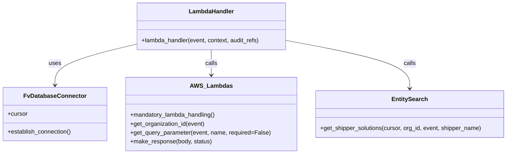

# Diagram: entity_core/entity_search/entity_search/lambdas/organizations/get_shippers_associated_to_org.py


> Auto-generated by Obscura crawlers

## Diagram 1

```mermaid
flowchart TD
    A[Lambda Event] --> D[mandatory_lambda_handling decorator]
    D --> H[lambda_handler(event, context, audit_refs)]
    H --> E[DB_CONN (FvDatabaseConnector instance)]
    E -->|establish_connection()| F[DB_CONN.establish_connection()]
    F --> C[cursor = DB_CONN.cursor]
    H --> G[get_organization_id(event)]
    H --> Q[get_query_parameter(event, "shipperName", required=False)]
    H --> S[get_shipper_solutions(cursor, org_id, event, shipper_name)]
    S --> R[make_response(solutions, 200)]
    R --> OUT[Return HTTP 200 response]
```

> SVG rendering failed for this diagram.

## Diagram 2



### SVG

<svg id="container" width="1352.875" xmlns="http://www.w3.org/2000/svg" class="classDiagram" height="414" viewBox="0 0 1352.875 414" role="graphics-document document" aria-roledescription="class"><style>#container{font-family:"trebuchet ms",verdana,arial,sans-serif;font-size:16px;fill:#333;}@keyframes edge-animation-frame{from{stroke-dashoffset:0;}}@keyframes dash{to{stroke-dashoffset:0;}}#container .edge-animation-slow{stroke-dasharray:9,5!important;stroke-dashoffset:900;animation:dash 50s linear infinite;stroke-linecap:round;}#container .edge-animation-fast{stroke-dasharray:9,5!important;stroke-dashoffset:900;animation:dash 20s linear infinite;stroke-linecap:round;}#container .error-icon{fill:#552222;}#container .error-text{fill:#552222;stroke:#552222;}#container .edge-thickness-normal{stroke-width:1px;}#container .edge-thickness-thick{stroke-width:3.5px;}#container .edge-pattern-solid{stroke-dasharray:0;}#container .edge-thickness-invisible{stroke-width:0;fill:none;}#container .edge-pattern-dashed{stroke-dasharray:3;}#container .edge-pattern-dotted{stroke-dasharray:2;}#container .marker{fill:#333333;stroke:#333333;}#container .marker.cross{stroke:#333333;}#container svg{font-family:"trebuchet ms",verdana,arial,sans-serif;font-size:16px;}#container p{margin:0;}#container g.classGroup text{fill:#9370DB;stroke:none;font-family:"trebuchet ms",verdana,arial,sans-serif;font-size:10px;}#container g.classGroup text .title{font-weight:bolder;}#container .nodeLabel,#container .edgeLabel{color:#131300;}#container .edgeLabel .label rect{fill:#ECECFF;}#container .label text{fill:#131300;}#container .labelBkg{background:#ECECFF;}#container .edgeLabel .label span{background:#ECECFF;}#container .classTitle{font-weight:bolder;}#container .node rect,#container .node circle,#container .node ellipse,#container .node polygon,#container .node path{fill:#ECECFF;stroke:#9370DB;stroke-width:1px;}#container .divider{stroke:#9370DB;stroke-width:1;}#container g.clickable{cursor:pointer;}#container g.classGroup rect{fill:#ECECFF;stroke:#9370DB;}#container g.classGroup line{stroke:#9370DB;stroke-width:1;}#container .classLabel .box{stroke:none;stroke-width:0;fill:#ECECFF;opacity:0.5;}#container .classLabel .label{fill:#9370DB;font-size:10px;}#container .relation{stroke:#333333;stroke-width:1;fill:none;}#container .dashed-line{stroke-dasharray:3;}#container .dotted-line{stroke-dasharray:1 2;}#container #compositionStart,#container .composition{fill:#333333!important;stroke:#333333!important;stroke-width:1;}#container #compositionEnd,#container .composition{fill:#333333!important;stroke:#333333!important;stroke-width:1;}#container #dependencyStart,#container .dependency{fill:#333333!important;stroke:#333333!important;stroke-width:1;}#container #dependencyStart,#container .dependency{fill:#333333!important;stroke:#333333!important;stroke-width:1;}#container #extensionStart,#container .extension{fill:transparent!important;stroke:#333333!important;stroke-width:1;}#container #extensionEnd,#container .extension{fill:transparent!important;stroke:#333333!important;stroke-width:1;}#container #aggregationStart,#container .aggregation{fill:transparent!important;stroke:#333333!important;stroke-width:1;}#container #aggregationEnd,#container .aggregation{fill:transparent!important;stroke:#333333!important;stroke-width:1;}#container #lollipopStart,#container .lollipop{fill:#ECECFF!important;stroke:#333333!important;stroke-width:1;}#container #lollipopEnd,#container .lollipop{fill:#ECECFF!important;stroke:#333333!important;stroke-width:1;}#container .edgeTerminals{font-size:11px;line-height:initial;}#container .classTitleText{text-anchor:middle;font-size:18px;fill:#333;}#container .label-icon{display:inline-block;height:1em;overflow:visible;vertical-align:-0.125em;}#container .node .label-icon path{fill:currentColor;stroke:revert;stroke-width:revert;}#container :root{--mermaid-font-family:"trebuchet ms",verdana,arial,sans-serif;}</style><g><defs><marker id="container_class-aggregationStart" class="marker aggregation class" refX="18" refY="7" markerWidth="190" markerHeight="240" orient="auto"><path d="M 18,7 L9,13 L1,7 L9,1 Z"></path></marker></defs><defs><marker id="container_class-aggregationEnd" class="marker aggregation class" refX="1" refY="7" markerWidth="20" markerHeight="28" orient="auto"><path d="M 18,7 L9,13 L1,7 L9,1 Z"></path></marker></defs><defs><marker id="container_class-extensionStart" class="marker extension class" refX="18" refY="7" markerWidth="190" markerHeight="240" orient="auto"><path d="M 1,7 L18,13 V 1 Z"></path></marker></defs><defs><marker id="container_class-extensionEnd" class="marker extension class" refX="1" refY="7" markerWidth="20" markerHeight="28" orient="auto"><path d="M 1,1 V 13 L18,7 Z"></path></marker></defs><defs><marker id="container_class-compositionStart" class="marker composition class" refX="18" refY="7" markerWidth="190" markerHeight="240" orient="auto"><path d="M 18,7 L9,13 L1,7 L9,1 Z"></path></marker></defs><defs><marker id="container_class-compositionEnd" class="marker composition class" refX="1" refY="7" markerWidth="20" markerHeight="28" orient="auto"><path d="M 18,7 L9,13 L1,7 L9,1 Z"></path></marker></defs><defs><marker id="container_class-dependencyStart" class="marker dependency class" refX="6" refY="7" markerWidth="190" markerHeight="240" orient="auto"><path d="M 5,7 L9,13 L1,7 L9,1 Z"></path></marker></defs><defs><marker id="container_class-dependencyEnd" class="marker dependency class" refX="13" refY="7" markerWidth="20" markerHeight="28" orient="auto"><path d="M 18,7 L9,13 L14,7 L9,1 Z"></path></marker></defs><defs><marker id="container_class-lollipopStart" class="marker lollipop class" refX="13" refY="7" markerWidth="190" markerHeight="240" orient="auto"><circle stroke="black" fill="transparent" cx="7" cy="7" r="6"></circle></marker></defs><defs><marker id="container_class-lollipopEnd" class="marker lollipop class" refX="1" refY="7" markerWidth="190" markerHeight="240" orient="auto"><circle stroke="black" fill="transparent" cx="7" cy="7" r="6"></circle></marker></defs><g class="root"><g class="clusters"></g><g class="edgePaths"><path d="M359.367,119.659L323.854,128.216C288.34,136.773,217.313,153.886,181.799,172.11C146.285,190.333,146.285,209.667,146.285,219.333L146.285,229" id="id_LambdaHandler_FvDatabaseConnector_1" class="edge-thickness-normal edge-pattern-solid relation" style=";;;" data-edge="true" data-et="edge" data-id="id_LambdaHandler_FvDatabaseConnector_1" data-points="W3sieCI6MzU5LjM2NzE4NzUsInkiOjExOS42NTkyODE0OTkxMn0seyJ4IjoxNDYuMjg1MTU2MjUsInkiOjE3MX0seyJ4IjoxNDYuMjg1MTU2MjUsInkiOjIzNX1d" marker-end="url(#container_class-dependencyEnd)"></path><path d="M561.32,134L561.32,140.167C561.32,146.333,561.32,158.667,561.32,170C561.32,181.333,561.32,191.667,561.32,196.833L561.32,202" id="id_LambdaHandler_AWS_Lambdas_2" class="edge-thickness-normal edge-pattern-solid relation" style=";;;" data-edge="true" data-et="edge" data-id="id_LambdaHandler_AWS_Lambdas_2" data-points="W3sieCI6NTYxLjMyMDMxMjUsInkiOjEzNH0seyJ4Ijo1NjEuMzIwMzEyNSwieSI6MTcxfSx7IngiOjU2MS4zMjAzMTI1LCJ5IjoyMDh9XQ==" marker-end="url(#container_class-dependencyEnd)"></path><path d="M763.273,109.093L817.973,119.411C872.673,129.729,982.073,150.364,1036.773,171.849C1091.473,193.333,1091.473,215.667,1091.473,226.833L1091.473,238" id="id_LambdaHandler_EntitySearch_3" class="edge-thickness-normal edge-pattern-solid relation" style=";;;" data-edge="true" data-et="edge" data-id="id_LambdaHandler_EntitySearch_3" data-points="W3sieCI6NzYzLjI3MzQzNzUsInkiOjEwOS4wOTM0MTM1OTcyMTE4OH0seyJ4IjoxMDkxLjQ3MjY1NjI1LCJ5IjoxNzF9LHsieCI6MTA5MS40NzI2NTYyNSwieSI6MjQ0fV0=" marker-end="url(#container_class-dependencyEnd)"></path></g><g class="edgeLabels"><g class="edgeLabel" transform="translate(146.28515625, 171)"><g class="label" data-id="id_LambdaHandler_FvDatabaseConnector_1" transform="translate(-16.4921875, -12)"><foreignObject width="32.984375" height="24"><div xmlns="http://www.w3.org/1999/xhtml" class="labelBkg" style="display: table-cell; white-space: nowrap; line-height: 1.5; max-width: 200px; text-align: center;"><span class="edgeLabel"><p>uses</p></span></div></foreignObject></g></g><g class="edgeLabel" transform="translate(561.3203125, 171)"><g class="label" data-id="id_LambdaHandler_AWS_Lambdas_2" transform="translate(-16.4453125, -12)"><foreignObject width="32.890625" height="24"><div xmlns="http://www.w3.org/1999/xhtml" class="labelBkg" style="display: table-cell; white-space: nowrap; line-height: 1.5; max-width: 200px; text-align: center;"><span class="edgeLabel"><p>calls</p></span></div></foreignObject></g></g><g class="edgeLabel" transform="translate(1091.47265625, 171)"><g class="label" data-id="id_LambdaHandler_EntitySearch_3" transform="translate(-16.4453125, -12)"><foreignObject width="32.890625" height="24"><div xmlns="http://www.w3.org/1999/xhtml" class="labelBkg" style="display: table-cell; white-space: nowrap; line-height: 1.5; max-width: 200px; text-align: center;"><span class="edgeLabel"><p>calls</p></span></div></foreignObject></g></g></g><g class="nodes"><g class="node default" id="classId-FvDatabaseConnector-0" transform="translate(146.28515625, 307)"><g class="basic label-container"><path d="M-138.28515625 -72 L138.28515625 -72 L138.28515625 72 L-138.28515625 72" stroke="none" stroke-width="0" fill="#ECECFF" style=""></path><path d="M-138.28515625 -72 C-39.67762898076309 -72, 58.92989828847382 -72, 138.28515625 -72 M-138.28515625 -72 C-33.621988390795934 -72, 71.04117946840813 -72, 138.28515625 -72 M138.28515625 -72 C138.28515625 -34.826218809035616, 138.28515625 2.3475623819287676, 138.28515625 72 M138.28515625 -72 C138.28515625 -16.402134004581434, 138.28515625 39.19573199083713, 138.28515625 72 M138.28515625 72 C64.94565180581287 72, -8.393852638374256 72, -138.28515625 72 M138.28515625 72 C70.53296890658706 72, 2.7807815631741164 72, -138.28515625 72 M-138.28515625 72 C-138.28515625 18.171541507497345, -138.28515625 -35.65691698500531, -138.28515625 -72 M-138.28515625 72 C-138.28515625 34.4505868681751, -138.28515625 -3.098826263649798, -138.28515625 -72" stroke="#9370DB" stroke-width="1.3" fill="none" stroke-dasharray="0 0" style=""></path></g><g class="annotation-group text" transform="translate(0, -48)"></g><g class="label-group text" transform="translate(-79.3046875, -48)"><g class="label" style="font-weight: bolder" transform="translate(0,-12)"><foreignObject width="158.609375" height="24"><div xmlns="http://www.w3.org/1999/xhtml" style="display: table-cell; white-space: nowrap; line-height: 1.5; max-width: 207px; text-align: center;"><span class="nodeLabel markdown-node-label" style=""><p>FvDatabaseConnector</p></span></div></foreignObject></g></g><g class="members-group text" transform="translate(-126.28515625, 0)"><g class="label" style="" transform="translate(0,-12)"><foreignObject width="53.71875" height="24"><div xmlns="http://www.w3.org/1999/xhtml" style="display: table-cell; white-space: nowrap; line-height: 1.5; max-width: 112px; text-align: center;"><span class="nodeLabel markdown-node-label" style=""><p>+cursor</p></span></div></foreignObject></g></g><g class="methods-group text" transform="translate(-126.28515625, 48)"><g class="label" style="" transform="translate(0,-12)"><foreignObject width="173.265625" height="24"><div xmlns="http://www.w3.org/1999/xhtml" style="display: table-cell; white-space: nowrap; line-height: 1.5; max-width: 231px; text-align: center;"><span class="nodeLabel markdown-node-label" style=""><p>+establish_connection()</p></span></div></foreignObject></g></g><g class="divider" style=""><path d="M-138.28515625 -24 C-39.09146775593865 -24, 60.102220738122696 -24, 138.28515625 -24 M-138.28515625 -24 C-70.9276655688983 -24, -3.570174887796611 -24, 138.28515625 -24" stroke="#9370DB" stroke-width="1.3" fill="none" stroke-dasharray="0 0" style=""></path></g><g class="divider" style=""><path d="M-138.28515625 24 C-62.444619752845256 24, 13.395916744309488 24, 138.28515625 24 M-138.28515625 24 C-30.236577031308528 24, 77.81200218738294 24, 138.28515625 24" stroke="#9370DB" stroke-width="1.3" fill="none" stroke-dasharray="0 0" style=""></path></g></g><g class="node default" id="classId-LambdaHandler-1" transform="translate(561.3203125, 71)"><g class="basic label-container"><path d="M-201.953125 -63 L201.953125 -63 L201.953125 63 L-201.953125 63" stroke="none" stroke-width="0" fill="#ECECFF" style=""></path><path d="M-201.953125 -63 C-40.967721047757635 -63, 120.01768290448473 -63, 201.953125 -63 M-201.953125 -63 C-118.5332581536427 -63, -35.11339130728541 -63, 201.953125 -63 M201.953125 -63 C201.953125 -35.48797504046764, 201.953125 -7.975950080935277, 201.953125 63 M201.953125 -63 C201.953125 -17.113930220616467, 201.953125 28.772139558767066, 201.953125 63 M201.953125 63 C111.49505507242594 63, 21.036985144851883 63, -201.953125 63 M201.953125 63 C85.56823621499859 63, -30.816652570002816 63, -201.953125 63 M-201.953125 63 C-201.953125 31.23349535792903, -201.953125 -0.53300928414194, -201.953125 -63 M-201.953125 63 C-201.953125 15.453990826256558, -201.953125 -32.092018347486885, -201.953125 -63" stroke="#9370DB" stroke-width="1.3" fill="none" stroke-dasharray="0 0" style=""></path></g><g class="annotation-group text" transform="translate(0, -39)"></g><g class="label-group text" transform="translate(-58.21875, -39)"><g class="label" style="font-weight: bolder" transform="translate(0,-12)"><foreignObject width="116.4375" height="24"><div xmlns="http://www.w3.org/1999/xhtml" style="display: table-cell; white-space: nowrap; line-height: 1.5; max-width: 167px; text-align: center;"><span class="nodeLabel markdown-node-label" style=""><p>LambdaHandler</p></span></div></foreignObject></g></g><g class="members-group text" transform="translate(-189.953125, 9)"></g><g class="methods-group text" transform="translate(-189.953125, 39)"><g class="label" style="" transform="translate(0,-12)"><foreignObject width="321.6875" height="24"><div xmlns="http://www.w3.org/1999/xhtml" style="display: table-cell; white-space: nowrap; line-height: 1.5; max-width: 379px; text-align: center;"><span class="nodeLabel markdown-node-label" style=""><p>+lambda_handler(event, context, audit_refs)</p></span></div></foreignObject></g></g><g class="divider" style=""><path d="M-201.953125 -15 C-108.35000119553138 -15, -14.746877391062753 -15, 201.953125 -15 M-201.953125 -15 C-57.765787137591474 -15, 86.42155072481705 -15, 201.953125 -15" stroke="#9370DB" stroke-width="1.3" fill="none" stroke-dasharray="0 0" style=""></path></g><g class="divider" style=""><path d="M-201.953125 9 C-120.20513569173596 9, -38.45714638347192 9, 201.953125 9 M-201.953125 9 C-76.54439264905892 9, 48.86433970188216 9, 201.953125 9" stroke="#9370DB" stroke-width="1.3" fill="none" stroke-dasharray="0 0" style=""></path></g></g><g class="node default" id="classId-AWS_Lambdas-2" transform="translate(561.3203125, 307)"><g class="basic label-container"><path d="M-226.75 -99 L226.75 -99 L226.75 99 L-226.75 99" stroke="none" stroke-width="0" fill="#ECECFF" style=""></path><path d="M-226.75 -99 C-107.68190580709489 -99, 11.386188385810215 -99, 226.75 -99 M-226.75 -99 C-134.7694024695206 -99, -42.7888049390412 -99, 226.75 -99 M226.75 -99 C226.75 -34.20418960360081, 226.75 30.59162079279838, 226.75 99 M226.75 -99 C226.75 -25.355834358247662, 226.75 48.288331283504675, 226.75 99 M226.75 99 C72.06882545555777 99, -82.61234908888446 99, -226.75 99 M226.75 99 C69.91537876837413 99, -86.91924246325175 99, -226.75 99 M-226.75 99 C-226.75 33.056035121982376, -226.75 -32.88792975603525, -226.75 -99 M-226.75 99 C-226.75 19.975140107852738, -226.75 -59.049719784294524, -226.75 -99" stroke="#9370DB" stroke-width="1.3" fill="none" stroke-dasharray="0 0" style=""></path></g><g class="annotation-group text" transform="translate(0, -75)"></g><g class="label-group text" transform="translate(-52.828125, -75)"><g class="label" style="font-weight: bolder" transform="translate(0,-12)"><foreignObject width="105.65625" height="24"><div xmlns="http://www.w3.org/1999/xhtml" style="display: table-cell; white-space: nowrap; line-height: 1.5; max-width: 154px; text-align: center;"><span class="nodeLabel markdown-node-label" style=""><p>AWS_Lambdas</p></span></div></foreignObject></g></g><g class="members-group text" transform="translate(-214.75, -27)"></g><g class="methods-group text" transform="translate(-214.75, 3)"><g class="label" style="" transform="translate(0,-12)"><foreignObject width="232.078125" height="24"><div xmlns="http://www.w3.org/1999/xhtml" style="display: table-cell; white-space: nowrap; line-height: 1.5; max-width: 289px; text-align: center;"><span class="nodeLabel markdown-node-label" style=""><p>+mandatory_lambda_handling()</p></span></div></foreignObject></g><g class="label" style="" transform="translate(0,12)"><foreignObject width="202.015625" height="24"><div xmlns="http://www.w3.org/1999/xhtml" style="display: table-cell; white-space: nowrap; line-height: 1.5; max-width: 259px; text-align: center;"><span class="nodeLabel markdown-node-label" style=""><p>+get_organization_id(event)</p></span></div></foreignObject></g><g class="label" style="" transform="translate(0,36)"><foreignObject width="376.671875" height="24"><div xmlns="http://www.w3.org/1999/xhtml" style="display: table-cell; white-space: nowrap; line-height: 1.5; max-width: 434px; text-align: center;"><span class="nodeLabel markdown-node-label" style=""><p>+get_query_parameter(event, name, required=False)</p></span></div></foreignObject></g><g class="label" style="" transform="translate(0,60)"><foreignObject width="219.96875" height="24"><div xmlns="http://www.w3.org/1999/xhtml" style="display: table-cell; white-space: nowrap; line-height: 1.5; max-width: 277px; text-align: center;"><span class="nodeLabel markdown-node-label" style=""><p>+make_response(body, status)</p></span></div></foreignObject></g></g><g class="divider" style=""><path d="M-226.75 -51 C-123.60358253594461 -51, -20.45716507188922 -51, 226.75 -51 M-226.75 -51 C-66.16175953445872 -51, 94.42648093108255 -51, 226.75 -51" stroke="#9370DB" stroke-width="1.3" fill="none" stroke-dasharray="0 0" style=""></path></g><g class="divider" style=""><path d="M-226.75 -27 C-125.63954709139155 -27, -24.529094182783098 -27, 226.75 -27 M-226.75 -27 C-57.21239381825376 -27, 112.32521236349248 -27, 226.75 -27" stroke="#9370DB" stroke-width="1.3" fill="none" stroke-dasharray="0 0" style=""></path></g></g><g class="node default" id="classId-EntitySearch-3" transform="translate(1091.47265625, 307)"><g class="basic label-container"><path d="M-253.40234375 -63 L253.40234375 -63 L253.40234375 63 L-253.40234375 63" stroke="none" stroke-width="0" fill="#ECECFF" style=""></path><path d="M-253.40234375 -63 C-78.35313165061413 -63, 96.69608044877174 -63, 253.40234375 -63 M-253.40234375 -63 C-118.23937082196625 -63, 16.923602106067506 -63, 253.40234375 -63 M253.40234375 -63 C253.40234375 -26.718088194532655, 253.40234375 9.56382361093469, 253.40234375 63 M253.40234375 -63 C253.40234375 -26.212501187193965, 253.40234375 10.57499762561207, 253.40234375 63 M253.40234375 63 C75.74366095427774 63, -101.91502184144451 63, -253.40234375 63 M253.40234375 63 C111.71289577052985 63, -29.97655220894029 63, -253.40234375 63 M-253.40234375 63 C-253.40234375 12.868532360987082, -253.40234375 -37.262935278025836, -253.40234375 -63 M-253.40234375 63 C-253.40234375 26.681167021349687, -253.40234375 -9.637665957300626, -253.40234375 -63" stroke="#9370DB" stroke-width="1.3" fill="none" stroke-dasharray="0 0" style=""></path></g><g class="annotation-group text" transform="translate(0, -39)"></g><g class="label-group text" transform="translate(-45.9921875, -39)"><g class="label" style="font-weight: bolder" transform="translate(0,-12)"><foreignObject width="91.984375" height="24"><div xmlns="http://www.w3.org/1999/xhtml" style="display: table-cell; white-space: nowrap; line-height: 1.5; max-width: 140px; text-align: center;"><span class="nodeLabel markdown-node-label" style=""><p>EntitySearch</p></span></div></foreignObject></g></g><g class="members-group text" transform="translate(-241.40234375, 9)"></g><g class="methods-group text" transform="translate(-241.40234375, 39)"><g class="label" style="" transform="translate(0,-12)"><foreignObject width="436.8125" height="24"><div xmlns="http://www.w3.org/1999/xhtml" style="display: table-cell; white-space: nowrap; line-height: 1.5; max-width: 494px; text-align: center;"><span class="nodeLabel markdown-node-label" style=""><p>+get_shipper_solutions(cursor, org_id, event, shipper_name)</p></span></div></foreignObject></g></g><g class="divider" style=""><path d="M-253.40234375 -15 C-75.30079840406813 -15, 102.80074694186374 -15, 253.40234375 -15 M-253.40234375 -15 C-143.66578014509545 -15, -33.92921654019091 -15, 253.40234375 -15" stroke="#9370DB" stroke-width="1.3" fill="none" stroke-dasharray="0 0" style=""></path></g><g class="divider" style=""><path d="M-253.40234375 9 C-138.80097629076434 9, -24.19960883152868 9, 253.40234375 9 M-253.40234375 9 C-145.85839895145835 9, -38.31445415291668 9, 253.40234375 9" stroke="#9370DB" stroke-width="1.3" fill="none" stroke-dasharray="0 0" style=""></path></g></g></g></g></g></svg>
