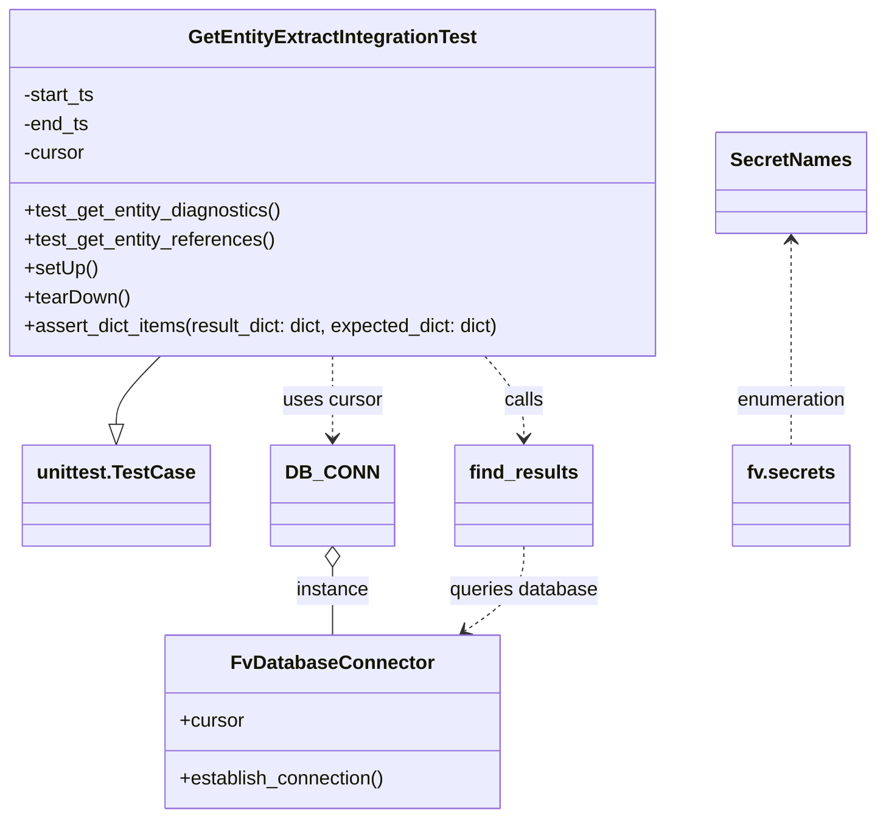
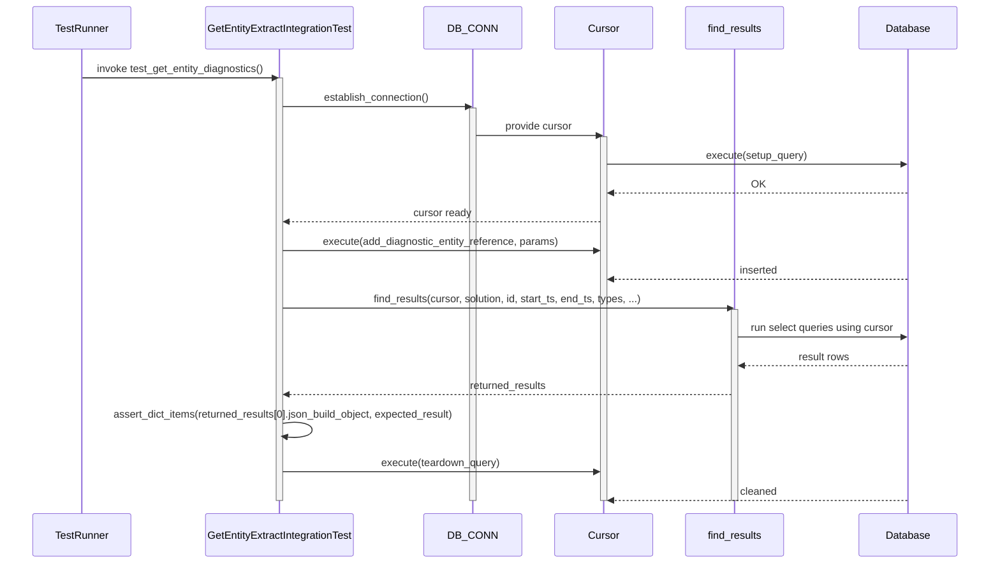

# Diagram: entity_core/entity_search/entity_search_tests/get_entity_extract_integration_test.py

> Auto-generated by Obscura crawlers

## Diagram 1

### SVG

<svg id="container" width="729.6015625" xmlns="http://www.w3.org/2000/svg" class="classDiagram" height="680" viewBox="0 0 729.6015625 680" role="graphics-document document" aria-roledescription="class"><g><defs><marker id="container_class-aggregationStart" class="marker aggregation class" refX="18" refY="7" markerWidth="190" markerHeight="240" orient="auto"><path d="M 18,7 L9,13 L1,7 L9,1 Z"></path></marker></defs><defs><marker id="container_class-aggregationEnd" class="marker aggregation class" refX="1" refY="7" markerWidth="20" markerHeight="28" orient="auto"><path d="M 18,7 L9,13 L1,7 L9,1 Z"></path></marker></defs><defs><marker id="container_class-extensionStart" class="marker extension class" refX="18" refY="7" markerWidth="190" markerHeight="240" orient="auto"><path d="M 1,7 L18,13 V 1 Z"></path></marker></defs><defs><marker id="container_class-extensionEnd" class="marker extension class" refX="1" refY="7" markerWidth="20" markerHeight="28" orient="auto"><path d="M 1,1 V 13 L18,7 Z"></path></marker></defs><defs><marker id="container_class-compositionStart" class="marker composition class" refX="18" refY="7" markerWidth="190" markerHeight="240" orient="auto"><path d="M 18,7 L9,13 L1,7 L9,1 Z"></path></marker></defs><defs><marker id="container_class-compositionEnd" class="marker composition class" refX="1" refY="7" markerWidth="20" markerHeight="28" orient="auto"><path d="M 18,7 L9,13 L1,7 L9,1 Z"></path></marker></defs><defs><marker id="container_class-dependencyStart" class="marker dependency class" refX="6" refY="7" markerWidth="190" markerHeight="240" orient="auto"><path d="M 5,7 L9,13 L1,7 L9,1 Z"></path></marker></defs><defs><marker id="container_class-dependencyEnd" class="marker dependency class" refX="13" refY="7" markerWidth="20" markerHeight="28" orient="auto"><path d="M 18,7 L9,13 L14,7 L9,1 Z"></path></marker></defs><defs><marker id="container_class-lollipopStart" class="marker lollipop class" refX="13" refY="7" markerWidth="190" markerHeight="240" orient="auto"><circle stroke="black" fill="transparent" cx="7" cy="7" r="6"></circle></marker></defs><defs><marker id="container_class-lollipopEnd" class="marker lollipop class" refX="1" refY="7" markerWidth="190" markerHeight="240" orient="auto"><circle stroke="black" fill="transparent" cx="7" cy="7" r="6"></circle></marker></defs><g class="root"><g class="clusters"></g><g class="edgePaths"><path d="M143.632,296L137.802,302.167C131.972,308.333,120.312,320.667,114.482,330.125C108.652,339.583,108.652,346.167,108.652,349.458L108.652,352.75" id="id_GetEntityExtractIntegrationTest_unittest.TestCase_1" class="edge-thickness-normal edge-pattern-solid relation" style=";;;" data-edge="true" data-et="edge" data-id="id_GetEntityExtractIntegrationTest_unittest.TestCase_1" data-points="W3sieCI6MTQzLjYzMjEwMDMxMDc3MzQ3LCJ5IjoyOTZ9LHsieCI6MTA4LjY1MjM0Mzc1LCJ5IjozMzN9LHsieCI6MTA4LjY1MjM0Mzc1LCJ5IjozNzB9XQ==" marker-end="url(#container_class-extensionEnd)"></path><path d="M279.77,471.25L279.77,474.542C279.77,477.833,279.77,484.417,279.77,493.875C279.77,503.333,279.77,515.667,279.77,521.833L279.77,528" id="id_DB_CONN_FvDatabaseConnector_2" class="edge-thickness-normal edge-pattern-solid relation" style=";;;" data-edge="true" data-et="edge" data-id="id_DB_CONN_FvDatabaseConnector_2" data-points="W3sieCI6Mjc5Ljc2OTUzMTI1LCJ5Ijo0NTR9LHsieCI6Mjc5Ljc2OTUzMTI1LCJ5Ijo0OTF9LHsieCI6Mjc5Ljc2OTUzMTI1LCJ5Ijo1Mjh9XQ==" marker-start="url(#container_class-aggregationStart)"></path><path d="M400.642,296L405.818,302.167C410.994,308.333,421.347,320.667,426.523,332C431.699,343.333,431.699,353.667,431.699,358.833L431.699,364" id="id_GetEntityExtractIntegrationTest_find_results_3" class="edge-thickness-normal edge-pattern-dashed relation" style=";;;" data-edge="true" data-et="edge" data-id="id_GetEntityExtractIntegrationTest_find_results_3" data-points="W3sieCI6NDAwLjY0MTc2ODgxOTA2MDc2LCJ5IjoyOTZ9LHsieCI6NDMxLjY5OTIxODc1LCJ5IjozMzN9LHsieCI6NDMxLjY5OTIxODc1LCJ5IjozNzB9XQ==" marker-end="url(#container_class-dependencyEnd)"></path><path d="M279.77,296L279.77,302.167C279.77,308.333,279.77,320.667,279.77,332C279.77,343.333,279.77,353.667,279.77,358.833L279.77,364" id="id_GetEntityExtractIntegrationTest_DB_CONN_4" class="edge-thickness-normal edge-pattern-dashed relation" style=";;;" data-edge="true" data-et="edge" data-id="id_GetEntityExtractIntegrationTest_DB_CONN_4" data-points="W3sieCI6Mjc5Ljc2OTUzMTI1LCJ5IjoyOTZ9LHsieCI6Mjc5Ljc2OTUzMTI1LCJ5IjozMzN9LHsieCI6Mjc5Ljc2OTUzMTI1LCJ5IjozNzB9XQ==" marker-end="url(#container_class-dependencyEnd)"></path><path d="M431.699,454L431.699,460.167C431.699,466.333,431.699,478.667,423.916,490.417C416.133,502.167,400.568,513.335,392.785,518.919L385.002,524.502" id="id_find_results_FvDatabaseConnector_5" class="edge-thickness-normal edge-pattern-dashed relation" style=";;;" data-edge="true" data-et="edge" data-id="id_find_results_FvDatabaseConnector_5" data-points="W3sieCI6NDMxLjY5OTIxODc1LCJ5Ijo0NTR9LHsieCI6NDMxLjY5OTIxODc1LCJ5Ijo0OTF9LHsieCI6MzgwLjEyNjc1NjAyMDY0MjIzLCJ5Ijo1Mjh9XQ==" marker-end="url(#container_class-dependencyEnd)"></path><path d="M661.57,200L661.57,222.167C661.57,244.333,661.57,288.667,661.57,317C661.57,345.333,661.57,357.667,661.57,363.833L661.57,370" id="id_SecretNames_fv.secrets_6" class="edge-thickness-normal edge-pattern-dashed relation" style=";;;" data-edge="true" data-et="edge" data-id="id_SecretNames_fv.secrets_6" data-points="W3sieCI6NjYxLjU3MDMxMjUsInkiOjE5NH0seyJ4Ijo2NjEuNTcwMzEyNSwieSI6MzMzfSx7IngiOjY2MS41NzAzMTI1LCJ5IjozNzB9XQ==" marker-start="url(#container_class-dependencyStart)"></path></g><g class="edgeLabels"><g class="edgeLabel"><g class="label" data-id="id_GetEntityExtractIntegrationTest_unittest.TestCase_1" transform="translate(0, 0)"><foreignObject width="0" height="0">

</foreignObject></g></g><g class="edgeLabel" transform="translate(279.76953125, 491)"><g class="label" data-id="id_DB_CONN_FvDatabaseConnector_2" transform="translate(-30.578125, -12)"><foreignObject width="61.15625" height="24">

instance

</foreignObject></g></g><g class="edgeLabel" transform="translate(431.69921875, 333)"><g class="label" data-id="id_GetEntityExtractIntegrationTest_find_results_3" transform="translate(-16.4453125, -12)"><foreignObject width="32.890625" height="24">

calls

</foreignObject></g></g><g class="edgeLabel" transform="translate(279.76953125, 333)"><g class="label" data-id="id_GetEntityExtractIntegrationTest_DB_CONN_4" transform="translate(-41.4765625, -12)"><foreignObject width="82.953125" height="24">

uses cursor

</foreignObject></g></g><g class="edgeLabel" transform="translate(431.69921875, 491)"><g class="label" data-id="id_find_results_FvDatabaseConnector_5" transform="translate(-62.7265625, -12)"><foreignObject width="125.453125" height="24">

queries database

</foreignObject></g></g><g class="edgeLabel" transform="translate(661.5703125, 333)"><g class="label" data-id="id_SecretNames_fv.secrets_6" transform="translate(-46.5859375, -12)"><foreignObject width="93.171875" height="24">

enumeration

</foreignObject></g></g></g><g class="nodes"><g class="node default" id="classId-GetEntityExtractIntegrationTest-0" transform="translate(279.76953125, 152)"><g class="basic label-container"><path d="M-271.76953125 -144 L271.76953125 -144 L271.76953125 144 L-271.76953125 144" stroke="none" stroke-width="0" fill="#ECECFF" style=""></path><path d="M-271.76953125 -144 C-108.49887112085531 -144, 54.771789008289375 -144, 271.76953125 -144 M-271.76953125 -144 C-70.84484656937781 -144, 130.07983811124438 -144, 271.76953125 -144 M271.76953125 -144 C271.76953125 -52.60236221239978, 271.76953125 38.795275575200435, 271.76953125 144 M271.76953125 -144 C271.76953125 -70.59419815517667, 271.76953125 2.8116036896466596, 271.76953125 144 M271.76953125 144 C151.49785461631882 144, 31.226177982637637 144, -271.76953125 144 M271.76953125 144 C71.1451971425154 144, -129.4791369649692 144, -271.76953125 144 M-271.76953125 144 C-271.76953125 39.91535502288363, -271.76953125 -64.16928995423274, -271.76953125 -144 M-271.76953125 144 C-271.76953125 50.43604160175751, -271.76953125 -43.12791679648498, -271.76953125 -144" stroke="#9370DB" stroke-width="1.3" fill="none" stroke-dasharray="0 0" style=""></path></g><g class="annotation-group text" transform="translate(0, -120)"></g><g class="label-group text" transform="translate(-115.4921875, -120)"><g class="label" style="font-weight: bolder" transform="translate(0,-12)"><foreignObject width="230.984375" height="24">

GetEntityExtractIntegrationTest

</foreignObject></g></g><g class="members-group text" transform="translate(-259.76953125, -72)"><g class="label" style="" transform="translate(0,-12)"><foreignObject width="61.5" height="24">

-start_ts

</foreignObject></g><g class="label" style="" transform="translate(0,12)"><foreignObject width="55.375" height="24">

-end_ts

</foreignObject></g><g class="label" style="" transform="translate(0,36)"><foreignObject width="52.1875" height="24">

-cursor

</foreignObject></g></g><g class="methods-group text" transform="translate(-259.76953125, 24)"><g class="label" style="" transform="translate(0,-12)"><foreignObject width="216.828125" height="24">

+test_get_entity_diagnostics()

</foreignObject></g><g class="label" style="" transform="translate(0,12)"><foreignObject width="210.25" height="24">

+test_get_entity_references()

</foreignObject></g><g class="label" style="" transform="translate(0,36)"><foreignObject width="60.421875" height="24">

+setUp()

</foreignObject></g><g class="label" style="" transform="translate(0,60)"><foreignObject width="87.75" height="24">

+tearDown()

</foreignObject></g><g class="label" style="" transform="translate(0,84)"><foreignObject width="404.046875" height="24">

+assert_dict_items(result_dict: dict, expected_dict: dict)

</foreignObject></g></g><g class="divider" style=""><path d="M-271.76953125 -96 C-103.70484186610594 -96, 64.35984751778813 -96, 271.76953125 -96 M-271.76953125 -96 C-69.01107121798819 -96, 133.74738881402362 -96, 271.76953125 -96" stroke="#9370DB" stroke-width="1.3" fill="none" stroke-dasharray="0 0" style=""></path></g><g class="divider" style=""><path d="M-271.76953125 0 C-87.99930367981673 0, 95.77092389036653 0, 271.76953125 0 M-271.76953125 0 C-128.62209151555817 0, 14.525348218883664 0, 271.76953125 0" stroke="#9370DB" stroke-width="1.3" fill="none" stroke-dasharray="0 0" style=""></path></g></g><g class="node default" id="classId-unittest.TestCase-1" transform="translate(108.65234375, 412)"><g class="basic label-container"><path d="M-74.7109375 -42 L74.7109375 -42 L74.7109375 42 L-74.7109375 42" stroke="none" stroke-width="0" fill="#ECECFF" style=""></path><path d="M-74.7109375 -42 C-29.331592261149666 -42, 16.047752977700668 -42, 74.7109375 -42 M-74.7109375 -42 C-37.43240668545453 -42, -0.15387587090906152 -42, 74.7109375 -42 M74.7109375 -42 C74.7109375 -21.17873768775896, 74.7109375 -0.35747537551792163, 74.7109375 42 M74.7109375 -42 C74.7109375 -9.408477715004103, 74.7109375 23.183044569991793, 74.7109375 42 M74.7109375 42 C37.61540385227685 42, 0.5198702045536976 42, -74.7109375 42 M74.7109375 42 C42.338547103642014 42, 9.966156707284028 42, -74.7109375 42 M-74.7109375 42 C-74.7109375 13.34994889797187, -74.7109375 -15.300102204056259, -74.7109375 -42 M-74.7109375 42 C-74.7109375 13.47356987022669, -74.7109375 -15.05286025954662, -74.7109375 -42" stroke="#9370DB" stroke-width="1.3" fill="none" stroke-dasharray="0 0" style=""></path></g><g class="annotation-group text" transform="translate(0, -18)"></g><g class="label-group text" transform="translate(-62.7109375, -18)"><g class="label" style="font-weight: bolder" transform="translate(0,-12)"><foreignObject width="125.421875" height="24">

unittest.TestCase

</foreignObject></g></g><g class="members-group text" transform="translate(-62.7109375, 30)"></g><g class="methods-group text" transform="translate(-62.7109375, 60)"></g><g class="divider" style=""><path d="M-74.7109375 6 C-34.802844608529085 6, 5.1052482829418295 6, 74.7109375 6 M-74.7109375 6 C-29.25147156837093 6, 16.207994363258138 6, 74.7109375 6" stroke="#9370DB" stroke-width="1.3" fill="none" stroke-dasharray="0 0" style=""></path></g><g class="divider" style=""><path d="M-74.7109375 24 C-26.642738861966393 24, 21.425459776067214 24, 74.7109375 24 M-74.7109375 24 C-25.139079872659757 24, 24.432777754680487 24, 74.7109375 24" stroke="#9370DB" stroke-width="1.3" fill="none" stroke-dasharray="0 0" style=""></path></g></g><g class="node default" id="classId-FvDatabaseConnector-2" transform="translate(279.76953125, 600)"><g class="basic label-container"><path d="M-138.28515625 -72 L138.28515625 -72 L138.28515625 72 L-138.28515625 72" stroke="none" stroke-width="0" fill="#ECECFF" style=""></path><path d="M-138.28515625 -72 C-60.72438539891796 -72, 16.83638545216408 -72, 138.28515625 -72 M-138.28515625 -72 C-66.85480185522832 -72, 4.5755525395433665 -72, 138.28515625 -72 M138.28515625 -72 C138.28515625 -33.94784550681187, 138.28515625 4.104308986376253, 138.28515625 72 M138.28515625 -72 C138.28515625 -24.995902679937956, 138.28515625 22.00819464012409, 138.28515625 72 M138.28515625 72 C39.89741979044446 72, -58.49031666911108 72, -138.28515625 72 M138.28515625 72 C64.08725361233779 72, -10.11064902532442 72, -138.28515625 72 M-138.28515625 72 C-138.28515625 41.064707535535106, -138.28515625 10.12941507107022, -138.28515625 -72 M-138.28515625 72 C-138.28515625 28.077254168139618, -138.28515625 -15.845491663720765, -138.28515625 -72" stroke="#9370DB" stroke-width="1.3" fill="none" stroke-dasharray="0 0" style=""></path></g><g class="annotation-group text" transform="translate(0, -48)"></g><g class="label-group text" transform="translate(-79.3046875, -48)"><g class="label" style="font-weight: bolder" transform="translate(0,-12)"><foreignObject width="158.609375" height="24">

FvDatabaseConnector

</foreignObject></g></g><g class="members-group text" transform="translate(-126.28515625, 0)"><g class="label" style="" transform="translate(0,-12)"><foreignObject width="53.71875" height="24">

+cursor

</foreignObject></g></g><g class="methods-group text" transform="translate(-126.28515625, 48)"><g class="label" style="" transform="translate(0,-12)"><foreignObject width="173.265625" height="24">

+establish_connection()

</foreignObject></g></g><g class="divider" style=""><path d="M-138.28515625 -24 C-72.92714931714298 -24, -7.5691423842859535 -24, 138.28515625 -24 M-138.28515625 -24 C-50.188214485065544 -24, 37.90872727986891 -24, 138.28515625 -24" stroke="#9370DB" stroke-width="1.3" fill="none" stroke-dasharray="0 0" style=""></path></g><g class="divider" style=""><path d="M-138.28515625 24 C-49.681455885218185 24, 38.92224447956363 24, 138.28515625 24 M-138.28515625 24 C-54.732647224335864 24, 28.819861801328273 24, 138.28515625 24" stroke="#9370DB" stroke-width="1.3" fill="none" stroke-dasharray="0 0" style=""></path></g></g><g class="node default" id="classId-find_results-3" transform="translate(431.69921875, 412)"><g class="basic label-container"><path d="M-55.5234375 -42 L55.5234375 -42 L55.5234375 42 L-55.5234375 42" stroke="none" stroke-width="0" fill="#ECECFF" style=""></path><path d="M-55.5234375 -42 C-27.05592149757245 -42, 1.4115945048551026 -42, 55.5234375 -42 M-55.5234375 -42 C-29.821057655024696 -42, -4.118677810049391 -42, 55.5234375 -42 M55.5234375 -42 C55.5234375 -18.445348816417898, 55.5234375 5.109302367164204, 55.5234375 42 M55.5234375 -42 C55.5234375 -15.114714494588483, 55.5234375 11.770571010823033, 55.5234375 42 M55.5234375 42 C18.407855298681483 42, -18.707726902637035 42, -55.5234375 42 M55.5234375 42 C23.26082224470302 42, -9.001793010593957 42, -55.5234375 42 M-55.5234375 42 C-55.5234375 18.713792684546792, -55.5234375 -4.572414630906415, -55.5234375 -42 M-55.5234375 42 C-55.5234375 10.038551384165888, -55.5234375 -21.922897231668223, -55.5234375 -42" stroke="#9370DB" stroke-width="1.3" fill="none" stroke-dasharray="0 0" style=""></path></g><g class="annotation-group text" transform="translate(0, -18)"></g><g class="label-group text" transform="translate(-43.5234375, -18)"><g class="label" style="font-weight: bolder" transform="translate(0,-12)"><foreignObject width="87.046875" height="24">

find_results

</foreignObject></g></g><g class="members-group text" transform="translate(-43.5234375, 30)"></g><g class="methods-group text" transform="translate(-43.5234375, 60)"></g><g class="divider" style=""><path d="M-55.5234375 6 C-22.335199744484974 6, 10.853038011030051 6, 55.5234375 6 M-55.5234375 6 C-15.410898134923777 6, 24.701641230152447 6, 55.5234375 6" stroke="#9370DB" stroke-width="1.3" fill="none" stroke-dasharray="0 0" style=""></path></g><g class="divider" style=""><path d="M-55.5234375 24 C-14.346858108786982 24, 26.829721282426036 24, 55.5234375 24 M-55.5234375 24 C-15.613918594524883 24, 24.295600310950235 24, 55.5234375 24" stroke="#9370DB" stroke-width="1.3" fill="none" stroke-dasharray="0 0" style=""></path></g></g><g class="node default" id="classId-SecretNames-4" transform="translate(661.5703125, 152)"><g class="basic label-container"><path d="M-60.03125 -42 L60.03125 -42 L60.03125 42 L-60.03125 42" stroke="none" stroke-width="0" fill="#ECECFF" style=""></path><path d="M-60.03125 -42 C-27.729135021227272 -42, 4.572979957545456 -42, 60.03125 -42 M-60.03125 -42 C-12.85281720090719 -42, 34.32561559818562 -42, 60.03125 -42 M60.03125 -42 C60.03125 -12.683104151390324, 60.03125 16.63379169721935, 60.03125 42 M60.03125 -42 C60.03125 -21.771314125223366, 60.03125 -1.5426282504467324, 60.03125 42 M60.03125 42 C14.090504731833093 42, -31.850240536333814 42, -60.03125 42 M60.03125 42 C29.881153347935857 42, -0.2689433041282854 42, -60.03125 42 M-60.03125 42 C-60.03125 13.792884447171932, -60.03125 -14.414231105656135, -60.03125 -42 M-60.03125 42 C-60.03125 15.171535492437062, -60.03125 -11.656929015125876, -60.03125 -42" stroke="#9370DB" stroke-width="1.3" fill="none" stroke-dasharray="0 0" style=""></path></g><g class="annotation-group text" transform="translate(0, -18)"></g><g class="label-group text" transform="translate(-48.03125, -18)"><g class="label" style="font-weight: bolder" transform="translate(0,-12)"><foreignObject width="96.0625" height="24">

SecretNames

</foreignObject></g></g><g class="members-group text" transform="translate(-48.03125, 30)"></g><g class="methods-group text" transform="translate(-48.03125, 60)"></g><g class="divider" style=""><path d="M-60.03125 6 C-13.086242649922994 6, 33.85876470015401 6, 60.03125 6 M-60.03125 6 C-15.958595021611465 6, 28.11405995677707 6, 60.03125 6" stroke="#9370DB" stroke-width="1.3" fill="none" stroke-dasharray="0 0" style=""></path></g><g class="divider" style=""><path d="M-60.03125 24 C-22.75750058730153 24, 14.516248825396943 24, 60.03125 24 M-60.03125 24 C-20.526881370532728 24, 18.977487258934545 24, 60.03125 24" stroke="#9370DB" stroke-width="1.3" fill="none" stroke-dasharray="0 0" style=""></path></g></g><g class="node default" id="classId-DB_CONN-5" transform="translate(279.76953125, 412)"><g class="basic label-container"><path d="M-46.40625 -42 L46.40625 -42 L46.40625 42 L-46.40625 42" stroke="none" stroke-width="0" fill="#ECECFF" style=""></path><path d="M-46.40625 -42 C-20.835381489175862 -42, 4.735487021648275 -42, 46.40625 -42 M-46.40625 -42 C-21.357304098944706 -42, 3.6916418021105883 -42, 46.40625 -42 M46.40625 -42 C46.40625 -10.154482996565267, 46.40625 21.691034006869465, 46.40625 42 M46.40625 -42 C46.40625 -20.18378288546187, 46.40625 1.6324342290762601, 46.40625 42 M46.40625 42 C13.164366308131235 42, -20.07751738373753 42, -46.40625 42 M46.40625 42 C20.887568785871245 42, -4.631112428257509 42, -46.40625 42 M-46.40625 42 C-46.40625 20.05631386961618, -46.40625 -1.8873722607676413, -46.40625 -42 M-46.40625 42 C-46.40625 12.56483783220748, -46.40625 -16.87032433558504, -46.40625 -42" stroke="#9370DB" stroke-width="1.3" fill="none" stroke-dasharray="0 0" style=""></path></g><g class="annotation-group text" transform="translate(0, -18)"></g><g class="label-group text" transform="translate(-34.40625, -18)"><g class="label" style="font-weight: bolder" transform="translate(0,-12)"><foreignObject width="68.8125" height="24">

DB_CONN

</foreignObject></g></g><g class="members-group text" transform="translate(-34.40625, 30)"></g><g class="methods-group text" transform="translate(-34.40625, 60)"></g><g class="divider" style=""><path d="M-46.40625 6 C-16.140798563765372 6, 14.124652872469255 6, 46.40625 6 M-46.40625 6 C-27.638474794848758 6, -8.870699589697516 6, 46.40625 6" stroke="#9370DB" stroke-width="1.3" fill="none" stroke-dasharray="0 0" style=""></path></g><g class="divider" style=""><path d="M-46.40625 24 C-26.824507838524575 24, -7.2427656770491495 24, 46.40625 24 M-46.40625 24 C-12.123935216797129 24, 22.158379566405742 24, 46.40625 24" stroke="#9370DB" stroke-width="1.3" fill="none" stroke-dasharray="0 0" style=""></path></g></g><g class="node default" id="classId-fv.secrets-6" transform="translate(661.5703125, 412)"><g class="basic label-container"><path d="M-47.0703125 -42 L47.0703125 -42 L47.0703125 42 L-47.0703125 42" stroke="none" stroke-width="0" fill="#ECECFF" style=""></path><path d="M-47.0703125 -42 C-21.867655183535838 -42, 3.3350021329283237 -42, 47.0703125 -42 M-47.0703125 -42 C-10.075312081499078 -42, 26.919688337001844 -42, 47.0703125 -42 M47.0703125 -42 C47.0703125 -24.032368786582335, 47.0703125 -6.06473757316467, 47.0703125 42 M47.0703125 -42 C47.0703125 -22.62770272917218, 47.0703125 -3.255405458344363, 47.0703125 42 M47.0703125 42 C19.014597296755202 42, -9.041117906489596 42, -47.0703125 42 M47.0703125 42 C16.564662915044376 42, -13.940986669911247 42, -47.0703125 42 M-47.0703125 42 C-47.0703125 16.540209863621392, -47.0703125 -8.919580272757216, -47.0703125 -42 M-47.0703125 42 C-47.0703125 18.7630457557578, -47.0703125 -4.473908488484398, -47.0703125 -42" stroke="#9370DB" stroke-width="1.3" fill="none" stroke-dasharray="0 0" style=""></path></g><g class="annotation-group text" transform="translate(0, -18)"></g><g class="label-group text" transform="translate(-35.0703125, -18)"><g class="label" style="font-weight: bolder" transform="translate(0,-12)"><foreignObject width="70.140625" height="24">

fv.secrets

</foreignObject></g></g><g class="members-group text" transform="translate(-35.0703125, 30)"></g><g class="methods-group text" transform="translate(-35.0703125, 60)"></g><g class="divider" style=""><path d="M-47.0703125 6 C-22.010278241066246 6, 3.0497560178675087 6, 47.0703125 6 M-47.0703125 6 C-22.484972532138475 6, 2.100367435723051 6, 47.0703125 6" stroke="#9370DB" stroke-width="1.3" fill="none" stroke-dasharray="0 0" style=""></path></g><g class="divider" style=""><path d="M-47.0703125 24 C-12.519012787350185 24, 22.03228692529963 24, 47.0703125 24 M-47.0703125 24 C-16.420204944171665 24, 14.22990261165667 24, 47.0703125 24" stroke="#9370DB" stroke-width="1.3" fill="none" stroke-dasharray="0 0" style=""></path></g></g></g></g></g></svg>

## Diagram 2

### SVG

<svg id="container" width="1604" xmlns="http://www.w3.org/2000/svg" height="921" viewBox="-50 -10 1604 921" role="graphics-document document" aria-roledescription="sequence"><g><rect x="1354" y="835" fill="#eaeaea" stroke="#666" width="150" height="65" name="DB" rx="3" ry="3" class="actor actor-bottom"></rect><text x="1429" y="867.5" dominant-baseline="central" alignment-baseline="central" class="actor actor-box" style="text-anchor: middle; font-size: 16px; font-weight: 400;"><tspan x="1429" dy="0">Database</tspan></text></g><g><rect x="1059" y="835" fill="#eaeaea" stroke="#666" width="150" height="65" name="Finder" rx="3" ry="3" class="actor actor-bottom"></rect><text x="1134" y="867.5" dominant-baseline="central" alignment-baseline="central" class="actor actor-box" style="text-anchor: middle; font-size: 16px; font-weight: 400;"><tspan x="1134" dy="0">find_results</tspan></text></g><g><rect x="859" y="835" fill="#eaeaea" stroke="#666" width="150" height="65" name="Cursor" rx="3" ry="3" class="actor actor-bottom"></rect><text x="934" y="867.5" dominant-baseline="central" alignment-baseline="central" class="actor actor-box" style="text-anchor: middle; font-size: 16px; font-weight: 400;"><tspan x="934" dy="0">Cursor</tspan></text></g><g><rect x="659" y="835" fill="#eaeaea" stroke="#666" width="150" height="65" name="DBConn" rx="3" ry="3" class="actor actor-bottom"></rect><text x="734" y="867.5" dominant-baseline="central" alignment-baseline="central" class="actor actor-box" style="text-anchor: middle; font-size: 16px; font-weight: 400;"><tspan x="734" dy="0">DB_CONN</tspan></text></g><g><rect x="283" y="835" fill="#eaeaea" stroke="#666" width="246" height="65" name="Test" rx="3" ry="3" class="actor actor-bottom"></rect><text x="406" y="867.5" dominant-baseline="central" alignment-baseline="central" class="actor actor-box" style="text-anchor: middle; font-size: 16px; font-weight: 400;"><tspan x="406" dy="0">GetEntityExtractIntegrationTest</tspan></text></g><g><rect x="0" y="835" fill="#eaeaea" stroke="#666" width="150" height="65" name="Runner" rx="3" ry="3" class="actor actor-bottom"></rect><text x="75" y="867.5" dominant-baseline="central" alignment-baseline="central" class="actor actor-box" style="text-anchor: middle; font-size: 16px; font-weight: 400;"><tspan x="75" dy="0">TestRunner</tspan></text></g><g><line id="actor5" x1="1429" y1="65" x2="1429" y2="835" class="actor-line 200" stroke-width="0.5px" stroke="#999" name="DB"></line><g id="root-5"><rect x="1354" y="0" fill="#eaeaea" stroke="#666" width="150" height="65" name="DB" rx="3" ry="3" class="actor actor-top"></rect><text x="1429" y="32.5" dominant-baseline="central" alignment-baseline="central" class="actor actor-box" style="text-anchor: middle; font-size: 16px; font-weight: 400;"><tspan x="1429" dy="0">Database</tspan></text></g></g><g><line id="actor4" x1="1134" y1="65" x2="1134" y2="835" class="actor-line 200" stroke-width="0.5px" stroke="#999" name="Finder"></line><g id="root-4"><rect x="1059" y="0" fill="#eaeaea" stroke="#666" width="150" height="65" name="Finder" rx="3" ry="3" class="actor actor-top"></rect><text x="1134" y="32.5" dominant-baseline="central" alignment-baseline="central" class="actor actor-box" style="text-anchor: middle; font-size: 16px; font-weight: 400;"><tspan x="1134" dy="0">find_results</tspan></text></g></g><g><line id="actor3" x1="934" y1="65" x2="934" y2="835" class="actor-line 200" stroke-width="0.5px" stroke="#999" name="Cursor"></line><g id="root-3"><rect x="859" y="0" fill="#eaeaea" stroke="#666" width="150" height="65" name="Cursor" rx="3" ry="3" class="actor actor-top"></rect><text x="934" y="32.5" dominant-baseline="central" alignment-baseline="central" class="actor actor-box" style="text-anchor: middle; font-size: 16px; font-weight: 400;"><tspan x="934" dy="0">Cursor</tspan></text></g></g><g><line id="actor2" x1="734" y1="65" x2="734" y2="835" class="actor-line 200" stroke-width="0.5px" stroke="#999" name="DBConn"></line><g id="root-2"><rect x="659" y="0" fill="#eaeaea" stroke="#666" width="150" height="65" name="DBConn" rx="3" ry="3" class="actor actor-top"></rect><text x="734" y="32.5" dominant-baseline="central" alignment-baseline="central" class="actor actor-box" style="text-anchor: middle; font-size: 16px; font-weight: 400;"><tspan x="734" dy="0">DB_CONN</tspan></text></g></g><g><line id="actor1" x1="406" y1="65" x2="406" y2="835" class="actor-line 200" stroke-width="0.5px" stroke="#999" name="Test"></line><g id="root-1"><rect x="283" y="0" fill="#eaeaea" stroke="#666" width="246" height="65" name="Test" rx="3" ry="3" class="actor actor-top"></rect><text x="406" y="32.5" dominant-baseline="central" alignment-baseline="central" class="actor actor-box" style="text-anchor: middle; font-size: 16px; font-weight: 400;"><tspan x="406" dy="0">GetEntityExtractIntegrationTest</tspan></text></g></g><g><line id="actor0" x1="75" y1="65" x2="75" y2="835" class="actor-line 200" stroke-width="0.5px" stroke="#999" name="Runner"></line><g id="root-0"><rect x="0" y="0" fill="#eaeaea" stroke="#666" width="150" height="65" name="Runner" rx="3" ry="3" class="actor actor-top"></rect><text x="75" y="32.5" dominant-baseline="central" alignment-baseline="central" class="actor actor-box" style="text-anchor: middle; font-size: 16px; font-weight: 400;"><tspan x="75" dy="0">TestRunner</tspan></text></g></g><g></g><defs><symbol id="computer" width="24" height="24"><path transform="scale(.5)" d="M2 2v13h20v-13h-20zm18 11h-16v-9h16v9zm-10.228 6l.466-1h3.524l.467 1h-4.457zm14.228 3h-24l2-6h2.104l-1.33 4h18.45l-1.297-4h2.073l2 6zm-5-10h-14v-7h14v7z"></path></symbol></defs><defs><symbol id="database" fill-rule="evenodd" clip-rule="evenodd"><path transform="scale(.5)" d="M12.258.001l.256.004.255.005.253.008.251.01.249.012.247.015.246.016.242.019.241.02.239.023.236.024.233.027.231.028.229.031.225.032.223.034.22.036.217.038.214.04.211.041.208.043.205.045.201.046.198.048.194.05.191.051.187.053.183.054.18.056.175.057.172.059.168.06.163.061.16.063.155.064.15.066.074.033.073.033.071.034.07.034.069.035.068.035.067.035.066.035.064.036.064.036.062.036.06.036.06.037.058.037.058.037.055.038.055.038.053.038.052.038.051.039.05.039.048.039.047.039.045.04.044.04.043.04.041.04.04.041.039.041.037.041.036.041.034.041.033.042.032.042.03.042.029.042.027.042.026.043.024.043.023.043.021.043.02.043.018.044.017.043.015.044.013.044.012.044.011.045.009.044.007.045.006.045.004.045.002.045.001.045v17l-.001.045-.002.045-.004.045-.006.045-.007.045-.009.044-.011.045-.012.044-.013.044-.015.044-.017.043-.018.044-.02.043-.021.043-.023.043-.024.043-.026.043-.027.042-.029.042-.03.042-.032.042-.033.042-.034.041-.036.041-.037.041-.039.041-.04.041-.041.04-.043.04-.044.04-.045.04-.047.039-.048.039-.05.039-.051.039-.052.038-.053.038-.055.038-.055.038-.058.037-.058.037-.06.037-.06.036-.062.036-.064.036-.064.036-.066.035-.067.035-.068.035-.069.035-.07.034-.071.034-.073.033-.074.033-.15.066-.155.064-.16.063-.163.061-.168.06-.172.059-.175.057-.18.056-.183.054-.187.053-.191.051-.194.05-.198.048-.201.046-.205.045-.208.043-.211.041-.214.04-.217.038-.22.036-.223.034-.225.032-.229.031-.231.028-.233.027-.236.024-.239.023-.241.02-.242.019-.246.016-.247.015-.249.012-.251.01-.253.008-.255.005-.256.004-.258.001-.258-.001-.256-.004-.255-.005-.253-.008-.251-.01-.249-.012-.247-.015-.245-.016-.243-.019-.241-.02-.238-.023-.236-.024-.234-.027-.231-.028-.228-.031-.226-.032-.223-.034-.22-.036-.217-.038-.214-.04-.211-.041-.208-.043-.204-.045-.201-.046-.198-.048-.195-.05-.19-.051-.187-.053-.184-.054-.179-.056-.176-.057-.172-.059-.167-.06-.164-.061-.159-.063-.155-.064-.151-.066-.074-.033-.072-.033-.072-.034-.07-.034-.069-.035-.068-.035-.067-.035-.066-.035-.064-.036-.063-.036-.062-.036-.061-.036-.06-.037-.058-.037-.057-.037-.056-.038-.055-.038-.053-.038-.052-.038-.051-.039-.049-.039-.049-.039-.046-.039-.046-.04-.044-.04-.043-.04-.041-.04-.04-.041-.039-.041-.037-.041-.036-.041-.034-.041-.033-.042-.032-.042-.03-.042-.029-.042-.027-.042-.026-.043-.024-.043-.023-.043-.021-.043-.02-.043-.018-.044-.017-.043-.015-.044-.013-.044-.012-.044-.011-.045-.009-.044-.007-.045-.006-.045-.004-.045-.002-.045-.001-.045v-17l.001-.045.002-.045.004-.045.006-.045.007-.045.009-.044.011-.045.012-.044.013-.044.015-.044.017-.043.018-.044.02-.043.021-.043.023-.043.024-.043.026-.043.027-.042.029-.042.03-.042.032-.042.033-.042.034-.041.036-.041.037-.041.039-.041.04-.041.041-.04.043-.04.044-.04.046-.04.046-.039.049-.039.049-.039.051-.039.052-.038.053-.038.055-.038.056-.038.057-.037.058-.037.06-.037.061-.036.062-.036.063-.036.064-.036.066-.035.067-.035.068-.035.069-.035.07-.034.072-.034.072-.033.074-.033.151-.066.155-.064.159-.063.164-.061.167-.06.172-.059.176-.057.179-.056.184-.054.187-.053.19-.051.195-.05.198-.048.201-.046.204-.045.208-.043.211-.041.214-.04.217-.038.22-.036.223-.034.226-.032.228-.031.231-.028.234-.027.236-.024.238-.023.241-.02.243-.019.245-.016.247-.015.249-.012.251-.01.253-.008.255-.005.256-.004.258-.001.258.001zm-9.258 20.499v.01l.001.021.003.021.004.022.005.021.006.022.007.022.009.023.01.022.011.023.012.023.013.023.015.023.016.024.017.023.018.024.019.024.021.024.022.025.023.024.024.025.052.049.056.05.061.051.066.051.07.051.075.051.079.052.084.052.088.052.092.052.097.052.102.051.105.052.11.052.114.051.119.051.123.051.127.05.131.05.135.05.139.048.144.049.147.047.152.047.155.047.16.045.163.045.167.043.171.043.176.041.178.041.183.039.187.039.19.037.194.035.197.035.202.033.204.031.209.03.212.029.216.027.219.025.222.024.226.021.23.02.233.018.236.016.24.015.243.012.246.01.249.008.253.005.256.004.259.001.26-.001.257-.004.254-.005.25-.008.247-.011.244-.012.241-.014.237-.016.233-.018.231-.021.226-.021.224-.024.22-.026.216-.027.212-.028.21-.031.205-.031.202-.034.198-.034.194-.036.191-.037.187-.039.183-.04.179-.04.175-.042.172-.043.168-.044.163-.045.16-.046.155-.046.152-.047.148-.048.143-.049.139-.049.136-.05.131-.05.126-.05.123-.051.118-.052.114-.051.11-.052.106-.052.101-.052.096-.052.092-.052.088-.053.083-.051.079-.052.074-.052.07-.051.065-.051.06-.051.056-.05.051-.05.023-.024.023-.025.021-.024.02-.024.019-.024.018-.024.017-.024.015-.023.014-.024.013-.023.012-.023.01-.023.01-.022.008-.022.006-.022.006-.022.004-.022.004-.021.001-.021.001-.021v-4.127l-.077.055-.08.053-.083.054-.085.053-.087.052-.09.052-.093.051-.095.05-.097.05-.1.049-.102.049-.105.048-.106.047-.109.047-.111.046-.114.045-.115.045-.118.044-.12.043-.122.042-.124.042-.126.041-.128.04-.13.04-.132.038-.134.038-.135.037-.138.037-.139.035-.142.035-.143.034-.144.033-.147.032-.148.031-.15.03-.151.03-.153.029-.154.027-.156.027-.158.026-.159.025-.161.024-.162.023-.163.022-.165.021-.166.02-.167.019-.169.018-.169.017-.171.016-.173.015-.173.014-.175.013-.175.012-.177.011-.178.01-.179.008-.179.008-.181.006-.182.005-.182.004-.184.003-.184.002h-.37l-.184-.002-.184-.003-.182-.004-.182-.005-.181-.006-.179-.008-.179-.008-.178-.01-.176-.011-.176-.012-.175-.013-.173-.014-.172-.015-.171-.016-.17-.017-.169-.018-.167-.019-.166-.02-.165-.021-.163-.022-.162-.023-.161-.024-.159-.025-.157-.026-.156-.027-.155-.027-.153-.029-.151-.03-.15-.03-.148-.031-.146-.032-.145-.033-.143-.034-.141-.035-.14-.035-.137-.037-.136-.037-.134-.038-.132-.038-.13-.04-.128-.04-.126-.041-.124-.042-.122-.042-.12-.044-.117-.043-.116-.045-.113-.045-.112-.046-.109-.047-.106-.047-.105-.048-.102-.049-.1-.049-.097-.05-.095-.05-.093-.052-.09-.051-.087-.052-.085-.053-.083-.054-.08-.054-.077-.054v4.127zm0-5.654v.011l.001.021.003.021.004.021.005.022.006.022.007.022.009.022.01.022.011.023.012.023.013.023.015.024.016.023.017.024.018.024.019.024.021.024.022.024.023.025.024.024.052.05.056.05.061.05.066.051.07.051.075.052.079.051.084.052.088.052.092.052.097.052.102.052.105.052.11.051.114.051.119.052.123.05.127.051.131.05.135.049.139.049.144.048.147.048.152.047.155.046.16.045.163.045.167.044.171.042.176.042.178.04.183.04.187.038.19.037.194.036.197.034.202.033.204.032.209.03.212.028.216.027.219.025.222.024.226.022.23.02.233.018.236.016.24.014.243.012.246.01.249.008.253.006.256.003.259.001.26-.001.257-.003.254-.006.25-.008.247-.01.244-.012.241-.015.237-.016.233-.018.231-.02.226-.022.224-.024.22-.025.216-.027.212-.029.21-.03.205-.032.202-.033.198-.035.194-.036.191-.037.187-.039.183-.039.179-.041.175-.042.172-.043.168-.044.163-.045.16-.045.155-.047.152-.047.148-.048.143-.048.139-.05.136-.049.131-.05.126-.051.123-.051.118-.051.114-.052.11-.052.106-.052.101-.052.096-.052.092-.052.088-.052.083-.052.079-.052.074-.051.07-.052.065-.051.06-.05.056-.051.051-.049.023-.025.023-.024.021-.025.02-.024.019-.024.018-.024.017-.024.015-.023.014-.023.013-.024.012-.022.01-.023.01-.023.008-.022.006-.022.006-.022.004-.021.004-.022.001-.021.001-.021v-4.139l-.077.054-.08.054-.083.054-.085.052-.087.053-.09.051-.093.051-.095.051-.097.05-.1.049-.102.049-.105.048-.106.047-.109.047-.111.046-.114.045-.115.044-.118.044-.12.044-.122.042-.124.042-.126.041-.128.04-.13.039-.132.039-.134.038-.135.037-.138.036-.139.036-.142.035-.143.033-.144.033-.147.033-.148.031-.15.03-.151.03-.153.028-.154.028-.156.027-.158.026-.159.025-.161.024-.162.023-.163.022-.165.021-.166.02-.167.019-.169.018-.169.017-.171.016-.173.015-.173.014-.175.013-.175.012-.177.011-.178.009-.179.009-.179.007-.181.007-.182.005-.182.004-.184.003-.184.002h-.37l-.184-.002-.184-.003-.182-.004-.182-.005-.181-.007-.179-.007-.179-.009-.178-.009-.176-.011-.176-.012-.175-.013-.173-.014-.172-.015-.171-.016-.17-.017-.169-.018-.167-.019-.166-.02-.165-.021-.163-.022-.162-.023-.161-.024-.159-.025-.157-.026-.156-.027-.155-.028-.153-.028-.151-.03-.15-.03-.148-.031-.146-.033-.145-.033-.143-.033-.141-.035-.14-.036-.137-.036-.136-.037-.134-.038-.132-.039-.13-.039-.128-.04-.126-.041-.124-.042-.122-.043-.12-.043-.117-.044-.116-.044-.113-.046-.112-.046-.109-.046-.106-.047-.105-.048-.102-.049-.1-.049-.097-.05-.095-.051-.093-.051-.09-.051-.087-.053-.085-.052-.083-.054-.08-.054-.077-.054v4.139zm0-5.666v.011l.001.02.003.022.004.021.005.022.006.021.007.022.009.023.01.022.011.023.012.023.013.023.015.023.016.024.017.024.018.023.019.024.021.025.022.024.023.024.024.025.052.05.056.05.061.05.066.051.07.051.075.052.079.051.084.052.088.052.092.052.097.052.102.052.105.051.11.052.114.051.119.051.123.051.127.05.131.05.135.05.139.049.144.048.147.048.152.047.155.046.16.045.163.045.167.043.171.043.176.042.178.04.183.04.187.038.19.037.194.036.197.034.202.033.204.032.209.03.212.028.216.027.219.025.222.024.226.021.23.02.233.018.236.017.24.014.243.012.246.01.249.008.253.006.256.003.259.001.26-.001.257-.003.254-.006.25-.008.247-.01.244-.013.241-.014.237-.016.233-.018.231-.02.226-.022.224-.024.22-.025.216-.027.212-.029.21-.03.205-.032.202-.033.198-.035.194-.036.191-.037.187-.039.183-.039.179-.041.175-.042.172-.043.168-.044.163-.045.16-.045.155-.047.152-.047.148-.048.143-.049.139-.049.136-.049.131-.051.126-.05.123-.051.118-.052.114-.051.11-.052.106-.052.101-.052.096-.052.092-.052.088-.052.083-.052.079-.052.074-.052.07-.051.065-.051.06-.051.056-.05.051-.049.023-.025.023-.025.021-.024.02-.024.019-.024.018-.024.017-.024.015-.023.014-.024.013-.023.012-.023.01-.022.01-.023.008-.022.006-.022.006-.022.004-.022.004-.021.001-.021.001-.021v-4.153l-.077.054-.08.054-.083.053-.085.053-.087.053-.09.051-.093.051-.095.051-.097.05-.1.049-.102.048-.105.048-.106.048-.109.046-.111.046-.114.046-.115.044-.118.044-.12.043-.122.043-.124.042-.126.041-.128.04-.13.039-.132.039-.134.038-.135.037-.138.036-.139.036-.142.034-.143.034-.144.033-.147.032-.148.032-.15.03-.151.03-.153.028-.154.028-.156.027-.158.026-.159.024-.161.024-.162.023-.163.023-.165.021-.166.02-.167.019-.169.018-.169.017-.171.016-.173.015-.173.014-.175.013-.175.012-.177.01-.178.01-.179.009-.179.007-.181.006-.182.006-.182.004-.184.003-.184.001-.185.001-.185-.001-.184-.001-.184-.003-.182-.004-.182-.006-.181-.006-.179-.007-.179-.009-.178-.01-.176-.01-.176-.012-.175-.013-.173-.014-.172-.015-.171-.016-.17-.017-.169-.018-.167-.019-.166-.02-.165-.021-.163-.023-.162-.023-.161-.024-.159-.024-.157-.026-.156-.027-.155-.028-.153-.028-.151-.03-.15-.03-.148-.032-.146-.032-.145-.033-.143-.034-.141-.034-.14-.036-.137-.036-.136-.037-.134-.038-.132-.039-.13-.039-.128-.041-.126-.041-.124-.041-.122-.043-.12-.043-.117-.044-.116-.044-.113-.046-.112-.046-.109-.046-.106-.048-.105-.048-.102-.048-.1-.05-.097-.049-.095-.051-.093-.051-.09-.052-.087-.052-.085-.053-.083-.053-.08-.054-.077-.054v4.153zm8.74-8.179l-.257.004-.254.005-.25.008-.247.011-.244.012-.241.014-.237.016-.233.018-.231.021-.226.022-.224.023-.22.026-.216.027-.212.028-.21.031-.205.032-.202.033-.198.034-.194.036-.191.038-.187.038-.183.04-.179.041-.175.042-.172.043-.168.043-.163.045-.16.046-.155.046-.152.048-.148.048-.143.048-.139.049-.136.05-.131.05-.126.051-.123.051-.118.051-.114.052-.11.052-.106.052-.101.052-.096.052-.092.052-.088.052-.083.052-.079.052-.074.051-.07.052-.065.051-.06.05-.056.05-.051.05-.023.025-.023.024-.021.024-.02.025-.019.024-.018.024-.017.023-.015.024-.014.023-.013.023-.012.023-.01.023-.01.022-.008.022-.006.023-.006.021-.004.022-.004.021-.001.021-.001.021.001.021.001.021.004.021.004.022.006.021.006.023.008.022.01.022.01.023.012.023.013.023.014.023.015.024.017.023.018.024.019.024.02.025.021.024.023.024.023.025.051.05.056.05.06.05.065.051.07.052.074.051.079.052.083.052.088.052.092.052.096.052.101.052.106.052.11.052.114.052.118.051.123.051.126.051.131.05.136.05.139.049.143.048.148.048.152.048.155.046.16.046.163.045.168.043.172.043.175.042.179.041.183.04.187.038.191.038.194.036.198.034.202.033.205.032.21.031.212.028.216.027.22.026.224.023.226.022.231.021.233.018.237.016.241.014.244.012.247.011.25.008.254.005.257.004.26.001.26-.001.257-.004.254-.005.25-.008.247-.011.244-.012.241-.014.237-.016.233-.018.231-.021.226-.022.224-.023.22-.026.216-.027.212-.028.21-.031.205-.032.202-.033.198-.034.194-.036.191-.038.187-.038.183-.04.179-.041.175-.042.172-.043.168-.043.163-.045.16-.046.155-.046.152-.048.148-.048.143-.048.139-.049.136-.05.131-.05.126-.051.123-.051.118-.051.114-.052.11-.052.106-.052.101-.052.096-.052.092-.052.088-.052.083-.052.079-.052.074-.051.07-.052.065-.051.06-.05.056-.05.051-.05.023-.025.023-.024.021-.024.02-.025.019-.024.018-.024.017-.023.015-.024.014-.023.013-.023.012-.023.01-.023.01-.022.008-.022.006-.023.006-.021.004-.022.004-.021.001-.021.001-.021-.001-.021-.001-.021-.004-.021-.004-.022-.006-.021-.006-.023-.008-.022-.01-.022-.01-.023-.012-.023-.013-.023-.014-.023-.015-.024-.017-.023-.018-.024-.019-.024-.02-.025-.021-.024-.023-.024-.023-.025-.051-.05-.056-.05-.06-.05-.065-.051-.07-.052-.074-.051-.079-.052-.083-.052-.088-.052-.092-.052-.096-.052-.101-.052-.106-.052-.11-.052-.114-.052-.118-.051-.123-.051-.126-.051-.131-.05-.136-.05-.139-.049-.143-.048-.148-.048-.152-.048-.155-.046-.16-.046-.163-.045-.168-.043-.172-.043-.175-.042-.179-.041-.183-.04-.187-.038-.191-.038-.194-.036-.198-.034-.202-.033-.205-.032-.21-.031-.212-.028-.216-.027-.22-.026-.224-.023-.226-.022-.231-.021-.233-.018-.237-.016-.241-.014-.244-.012-.247-.011-.25-.008-.254-.005-.257-.004-.26-.001-.26.001z"></path></symbol></defs><defs><symbol id="clock" width="24" height="24"><path transform="scale(.5)" d="M12 2c5.514 0 10 4.486 10 10s-4.486 10-10 10-10-4.486-10-10 4.486-10 10-10zm0-2c-6.627 0-12 5.373-12 12s5.373 12 12 12 12-5.373 12-12-5.373-12-12-12zm5.848 12.459c.202.038.202.333.001.372-1.907.361-6.045 1.111-6.547 1.111-.719 0-1.301-.582-1.301-1.301 0-.512.77-5.447 1.125-7.445.034-.192.312-.181.343.014l.985 6.238 5.394 1.011z"></path></symbol></defs><defs><marker id="arrowhead" refX="7.9" refY="5" markerUnits="userSpaceOnUse" markerWidth="12" markerHeight="12" orient="auto-start-reverse"><path d="M -1 0 L 10 5 L 0 10 z"></path></marker></defs><defs><marker id="crosshead" markerWidth="15" markerHeight="8" orient="auto" refX="4" refY="4.5"><path fill="none" stroke="#000000" stroke-width="1pt" d="M 1,2 L 6,7 M 6,2 L 1,7" style="stroke-dasharray: 0, 0;"></path></marker></defs><defs><marker id="filled-head" refX="15.5" refY="7" markerWidth="20" markerHeight="28" orient="auto"><path d="M 18,7 L9,13 L14,7 L9,1 Z"></path></marker></defs><defs><marker id="sequencenumber" refX="15" refY="15" markerWidth="60" markerHeight="40" orient="auto"><circle cx="15" cy="15" r="6"></circle></marker></defs><g><rect x="401" y="113" fill="#EDF2AE" stroke="#666" width="10" height="702" class="activation0"></rect></g><g><rect x="729" y="163" fill="#EDF2AE" stroke="#666" width="10" height="652" class="activation0"></rect></g><g><rect x="929" y="211" fill="#EDF2AE" stroke="#666" width="10" height="604" class="activation0"></rect></g><g><rect x="1129" y="499" fill="#EDF2AE" stroke="#666" width="10" height="316" class="activation0"></rect></g><text x="239" y="80" text-anchor="middle" dominant-baseline="middle" alignment-baseline="middle" class="messageText" dy="1em" style="font-size: 16px; font-weight: 400;">invoke test_get_entity_diagnostics()</text><line x1="76" y1="113" x2="402" y2="113" class="messageLine0" stroke-width="2" stroke="none" marker-end="url(#arrowhead)" style="fill: none;"></line><text x="571" y="128" text-anchor="middle" dominant-baseline="middle" alignment-baseline="middle" class="messageText" dy="1em" style="font-size: 16px; font-weight: 400;">establish_connection()</text><line x1="411" y1="161" x2="730" y2="161" class="messageLine0" stroke-width="2" stroke="none" marker-end="url(#arrowhead)" style="fill: none;"></line><text x="835" y="176" text-anchor="middle" dominant-baseline="middle" alignment-baseline="middle" class="messageText" dy="1em" style="font-size: 16px; font-weight: 400;">provide cursor</text><line x1="739" y1="209" x2="930" y2="209" class="messageLine0" stroke-width="2" stroke="none" marker-end="url(#arrowhead)" style="fill: none;"></line><text x="1182" y="224" text-anchor="middle" dominant-baseline="middle" alignment-baseline="middle" class="messageText" dy="1em" style="font-size: 16px; font-weight: 400;">execute(setup_query)</text><line x1="939" y1="257" x2="1425" y2="257" class="messageLine0" stroke-width="2" stroke="none" marker-end="url(#arrowhead)" style="fill: none;"></line><text x="1185" y="272" text-anchor="middle" dominant-baseline="middle" alignment-baseline="middle" class="messageText" dy="1em" style="font-size: 16px; font-weight: 400;">OK</text><line x1="1428" y1="305" x2="942" y2="305" class="messageLine1" stroke-width="2" stroke="none" marker-end="url(#arrowhead)" style="stroke-dasharray: 3, 3; fill: none;"></line><text x="672" y="320" text-anchor="middle" dominant-baseline="middle" alignment-baseline="middle" class="messageText" dy="1em" style="font-size: 16px; font-weight: 400;">cursor ready</text><line x1="929" y1="353" x2="414" y2="353" class="messageLine1" stroke-width="2" stroke="none" marker-end="url(#arrowhead)" style="stroke-dasharray: 3, 3; fill: none;"></line><text x="669" y="368" text-anchor="middle" dominant-baseline="middle" alignment-baseline="middle" class="messageText" dy="1em" style="font-size: 16px; font-weight: 400;">execute(add_diagnostic_entity_reference, params)</text><line x1="411" y1="401" x2="926" y2="401" class="messageLine0" stroke-width="2" stroke="none" marker-end="url(#arrowhead)" style="fill: none;"></line><text x="1185" y="416" text-anchor="middle" dominant-baseline="middle" alignment-baseline="middle" class="messageText" dy="1em" style="font-size: 16px; font-weight: 400;">inserted</text><line x1="1428" y1="449" x2="942" y2="449" class="messageLine1" stroke-width="2" stroke="none" marker-end="url(#arrowhead)" style="stroke-dasharray: 3, 3; fill: none;"></line><text x="771" y="464" text-anchor="middle" dominant-baseline="middle" alignment-baseline="middle" class="messageText" dy="1em" style="font-size: 16px; font-weight: 400;">find_results(cursor, solution, id, start_ts, end_ts, types, ...)</text><line x1="411" y1="497" x2="1130" y2="497" class="messageLine0" stroke-width="2" stroke="none" marker-end="url(#arrowhead)" style="fill: none;"></line><text x="1282" y="512" text-anchor="middle" dominant-baseline="middle" alignment-baseline="middle" class="messageText" dy="1em" style="font-size: 16px; font-weight: 400;">run select queries using cursor</text><line x1="1139" y1="545" x2="1425" y2="545" class="messageLine0" stroke-width="2" stroke="none" marker-end="url(#arrowhead)" style="fill: none;"></line><text x="1285" y="560" text-anchor="middle" dominant-baseline="middle" alignment-baseline="middle" class="messageText" dy="1em" style="font-size: 16px; font-weight: 400;">result rows</text><line x1="1428" y1="593" x2="1142" y2="593" class="messageLine1" stroke-width="2" stroke="none" marker-end="url(#arrowhead)" style="stroke-dasharray: 3, 3; fill: none;"></line><text x="772" y="608" text-anchor="middle" dominant-baseline="middle" alignment-baseline="middle" class="messageText" dy="1em" style="font-size: 16px; font-weight: 400;">returned_results</text><line x1="1129" y1="641" x2="414" y2="641" class="messageLine1" stroke-width="2" stroke="none" marker-end="url(#arrowhead)" style="stroke-dasharray: 3, 3; fill: none;"></line><text x="411" y="656" text-anchor="middle" dominant-baseline="middle" alignment-baseline="middle" class="messageText" dy="1em" style="font-size: 16px; font-weight: 400;">assert_dict_items(returned_results[0].json_build_object, expected_result)</text><path d="M 411,689 C 471,679 471,719 411,709" class="messageLine0" stroke-width="2" stroke="none" marker-end="url(#arrowhead)" style="fill: none;"></path><text x="669" y="734" text-anchor="middle" dominant-baseline="middle" alignment-baseline="middle" class="messageText" dy="1em" style="font-size: 16px; font-weight: 400;">execute(teardown_query)</text><line x1="411" y1="767" x2="926" y2="767" class="messageLine0" stroke-width="2" stroke="none" marker-end="url(#arrowhead)" style="fill: none;"></line><text x="1185" y="782" text-anchor="middle" dominant-baseline="middle" alignment-baseline="middle" class="messageText" dy="1em" style="font-size: 16px; font-weight: 400;">cleaned</text><line x1="1428" y1="815" x2="942" y2="815" class="messageLine1" stroke-width="2" stroke="none" marker-end="url(#arrowhead)" style="stroke-dasharray: 3, 3; fill: none;"></line></svg>
