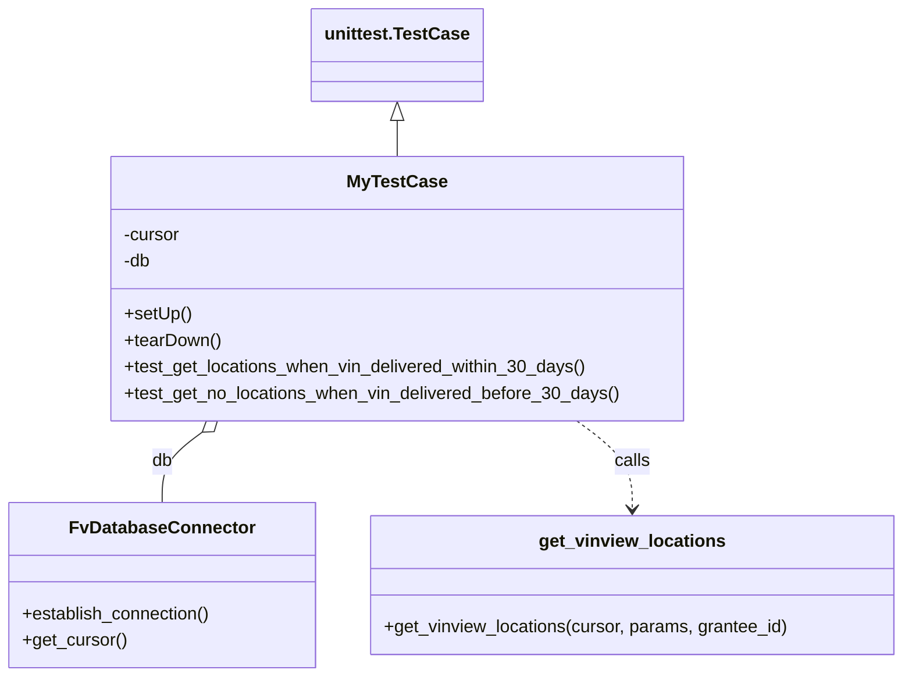

# Diagram: entity_core/entity_search/entity_search_tests/get_vinview_locations_integration_test.py


> Auto-generated by Obscura crawlers

## Diagram 1



### SVG

<svg id="container" width="816.171875" xmlns="http://www.w3.org/2000/svg" class="classDiagram" height="614" viewBox="0 0 816.171875 614" role="graphics-document document" aria-roledescription="class"><style>#container{font-family:"trebuchet ms",verdana,arial,sans-serif;font-size:16px;fill:#333;}@keyframes edge-animation-frame{from{stroke-dashoffset:0;}}@keyframes dash{to{stroke-dashoffset:0;}}#container .edge-animation-slow{stroke-dasharray:9,5!important;stroke-dashoffset:900;animation:dash 50s linear infinite;stroke-linecap:round;}#container .edge-animation-fast{stroke-dasharray:9,5!important;stroke-dashoffset:900;animation:dash 20s linear infinite;stroke-linecap:round;}#container .error-icon{fill:#552222;}#container .error-text{fill:#552222;stroke:#552222;}#container .edge-thickness-normal{stroke-width:1px;}#container .edge-thickness-thick{stroke-width:3.5px;}#container .edge-pattern-solid{stroke-dasharray:0;}#container .edge-thickness-invisible{stroke-width:0;fill:none;}#container .edge-pattern-dashed{stroke-dasharray:3;}#container .edge-pattern-dotted{stroke-dasharray:2;}#container .marker{fill:#333333;stroke:#333333;}#container .marker.cross{stroke:#333333;}#container svg{font-family:"trebuchet ms",verdana,arial,sans-serif;font-size:16px;}#container p{margin:0;}#container g.classGroup text{fill:#9370DB;stroke:none;font-family:"trebuchet ms",verdana,arial,sans-serif;font-size:10px;}#container g.classGroup text .title{font-weight:bolder;}#container .nodeLabel,#container .edgeLabel{color:#131300;}#container .edgeLabel .label rect{fill:#ECECFF;}#container .label text{fill:#131300;}#container .labelBkg{background:#ECECFF;}#container .edgeLabel .label span{background:#ECECFF;}#container .classTitle{font-weight:bolder;}#container .node rect,#container .node circle,#container .node ellipse,#container .node polygon,#container .node path{fill:#ECECFF;stroke:#9370DB;stroke-width:1px;}#container .divider{stroke:#9370DB;stroke-width:1;}#container g.clickable{cursor:pointer;}#container g.classGroup rect{fill:#ECECFF;stroke:#9370DB;}#container g.classGroup line{stroke:#9370DB;stroke-width:1;}#container .classLabel .box{stroke:none;stroke-width:0;fill:#ECECFF;opacity:0.5;}#container .classLabel .label{fill:#9370DB;font-size:10px;}#container .relation{stroke:#333333;stroke-width:1;fill:none;}#container .dashed-line{stroke-dasharray:3;}#container .dotted-line{stroke-dasharray:1 2;}#container #compositionStart,#container .composition{fill:#333333!important;stroke:#333333!important;stroke-width:1;}#container #compositionEnd,#container .composition{fill:#333333!important;stroke:#333333!important;stroke-width:1;}#container #dependencyStart,#container .dependency{fill:#333333!important;stroke:#333333!important;stroke-width:1;}#container #dependencyStart,#container .dependency{fill:#333333!important;stroke:#333333!important;stroke-width:1;}#container #extensionStart,#container .extension{fill:transparent!important;stroke:#333333!important;stroke-width:1;}#container #extensionEnd,#container .extension{fill:transparent!important;stroke:#333333!important;stroke-width:1;}#container #aggregationStart,#container .aggregation{fill:transparent!important;stroke:#333333!important;stroke-width:1;}#container #aggregationEnd,#container .aggregation{fill:transparent!important;stroke:#333333!important;stroke-width:1;}#container #lollipopStart,#container .lollipop{fill:#ECECFF!important;stroke:#333333!important;stroke-width:1;}#container #lollipopEnd,#container .lollipop{fill:#ECECFF!important;stroke:#333333!important;stroke-width:1;}#container .edgeTerminals{font-size:11px;line-height:initial;}#container .classTitleText{text-anchor:middle;font-size:18px;fill:#333;}#container .label-icon{display:inline-block;height:1em;overflow:visible;vertical-align:-0.125em;}#container .node .label-icon path{fill:currentColor;stroke:revert;stroke-width:revert;}#container :root{--mermaid-font-family:"trebuchet ms",verdana,arial,sans-serif;}</style><g><defs><marker id="container_class-aggregationStart" class="marker aggregation class" refX="18" refY="7" markerWidth="190" markerHeight="240" orient="auto"><path d="M 18,7 L9,13 L1,7 L9,1 Z"></path></marker></defs><defs><marker id="container_class-aggregationEnd" class="marker aggregation class" refX="1" refY="7" markerWidth="20" markerHeight="28" orient="auto"><path d="M 18,7 L9,13 L1,7 L9,1 Z"></path></marker></defs><defs><marker id="container_class-extensionStart" class="marker extension class" refX="18" refY="7" markerWidth="190" markerHeight="240" orient="auto"><path d="M 1,7 L18,13 V 1 Z"></path></marker></defs><defs><marker id="container_class-extensionEnd" class="marker extension class" refX="1" refY="7" markerWidth="20" markerHeight="28" orient="auto"><path d="M 1,1 V 13 L18,7 Z"></path></marker></defs><defs><marker id="container_class-compositionStart" class="marker composition class" refX="18" refY="7" markerWidth="190" markerHeight="240" orient="auto"><path d="M 18,7 L9,13 L1,7 L9,1 Z"></path></marker></defs><defs><marker id="container_class-compositionEnd" class="marker composition class" refX="1" refY="7" markerWidth="20" markerHeight="28" orient="auto"><path d="M 18,7 L9,13 L1,7 L9,1 Z"></path></marker></defs><defs><marker id="container_class-dependencyStart" class="marker dependency class" refX="6" refY="7" markerWidth="190" markerHeight="240" orient="auto"><path d="M 5,7 L9,13 L1,7 L9,1 Z"></path></marker></defs><defs><marker id="container_class-dependencyEnd" class="marker dependency class" refX="13" refY="7" markerWidth="20" markerHeight="28" orient="auto"><path d="M 18,7 L9,13 L14,7 L9,1 Z"></path></marker></defs><defs><marker id="container_class-lollipopStart" class="marker lollipop class" refX="13" refY="7" markerWidth="190" markerHeight="240" orient="auto"><circle stroke="black" fill="transparent" cx="7" cy="7" r="6"></circle></marker></defs><defs><marker id="container_class-lollipopEnd" class="marker lollipop class" refX="1" refY="7" markerWidth="190" markerHeight="240" orient="auto"><circle stroke="black" fill="transparent" cx="7" cy="7" r="6"></circle></marker></defs><g class="root"><g class="clusters"></g><g class="edgePaths"><path d="M358.828,109.25L358.828,110.542C358.828,111.833,358.828,114.417,358.828,119.875C358.828,125.333,358.828,133.667,358.828,137.833L358.828,142" id="id_unittest.TestCase_MyTestCase_1" class="edge-thickness-normal edge-pattern-solid relation" style=";;;" data-edge="true" data-et="edge" data-id="id_unittest.TestCase_MyTestCase_1" data-points="W3sieCI6MzU4LjgyODEyNSwieSI6OTJ9LHsieCI6MzU4LjgyODEyNSwieSI6MTE3fSx7IngiOjM1OC44MjgxMjUsInkiOjE0Mn1d" marker-start="url(#container_class-extensionStart)"></path><path d="M182.5,392.249L176.464,396.708C170.428,401.166,158.357,410.083,152.321,420.708C146.285,431.333,146.285,443.667,146.285,449.833L146.285,456" id="id_MyTestCase_FvDatabaseConnector_2" class="edge-thickness-normal edge-pattern-solid relation" style=";;;" data-edge="true" data-et="edge" data-id="id_MyTestCase_FvDatabaseConnector_2" data-points="W3sieCI6MTk2LjM3NDkwMDQ3NzcwNywieSI6MzgyfSx7IngiOjE0Ni4yODUxNTYyNSwieSI6NDE5fSx7IngiOjE0Ni4yODUxNTYyNSwieSI6NDU2fV0=" marker-start="url(#container_class-aggregationStart)"></path><path d="M521.281,382L529.63,388.167C537.978,394.333,554.675,406.667,563.023,420C571.371,433.333,571.371,447.667,571.371,454.833L571.371,462" id="id_MyTestCase_get_vinview_locations_3" class="edge-thickness-normal edge-pattern-dashed relation" style=";;;" data-edge="true" data-et="edge" data-id="id_MyTestCase_get_vinview_locations_3" data-points="W3sieCI6NTIxLjI4MTM0OTUyMjI5MywieSI6MzgyfSx7IngiOjU3MS4zNzEwOTM3NSwieSI6NDE5fSx7IngiOjU3MS4zNzEwOTM3NSwieSI6NDY4fV0=" marker-end="url(#container_class-dependencyEnd)"></path></g><g class="edgeLabels"><g class="edgeLabel"><g class="label" data-id="id_unittest.TestCase_MyTestCase_1" transform="translate(0, 0)"><foreignObject width="0" height="0"><div xmlns="http://www.w3.org/1999/xhtml" class="labelBkg" style="display: table-cell; white-space: nowrap; line-height: 1.5; max-width: 200px; text-align: center;"><span class="edgeLabel"></span></div></foreignObject></g></g><g class="edgeLabel" transform="translate(146.28515625, 419)"><g class="label" data-id="id_MyTestCase_FvDatabaseConnector_2" transform="translate(-9.5390625, -12)"><foreignObject width="19.078125" height="24"><div xmlns="http://www.w3.org/1999/xhtml" class="labelBkg" style="display: table-cell; white-space: nowrap; line-height: 1.5; max-width: 200px; text-align: center;"><span class="edgeLabel"><p>db</p></span></div></foreignObject></g></g><g class="edgeLabel" transform="translate(571.37109375, 419)"><g class="label" data-id="id_MyTestCase_get_vinview_locations_3" transform="translate(-16.4453125, -12)"><foreignObject width="32.890625" height="24"><div xmlns="http://www.w3.org/1999/xhtml" class="labelBkg" style="display: table-cell; white-space: nowrap; line-height: 1.5; max-width: 200px; text-align: center;"><span class="edgeLabel"><p>calls</p></span></div></foreignObject></g></g></g><g class="nodes"><g class="node default" id="classId-unittest.TestCase-0" transform="translate(358.828125, 50)"><g class="basic label-container"><path d="M-74.7109375 -42 L74.7109375 -42 L74.7109375 42 L-74.7109375 42" stroke="none" stroke-width="0" fill="#ECECFF" style=""></path><path d="M-74.7109375 -42 C-24.48064556347193 -42, 25.749646373056137 -42, 74.7109375 -42 M-74.7109375 -42 C-35.24575854730624 -42, 4.219420405387524 -42, 74.7109375 -42 M74.7109375 -42 C74.7109375 -11.834617464607206, 74.7109375 18.33076507078559, 74.7109375 42 M74.7109375 -42 C74.7109375 -12.30063345583621, 74.7109375 17.39873308832758, 74.7109375 42 M74.7109375 42 C17.875848062047403 42, -38.959241375905194 42, -74.7109375 42 M74.7109375 42 C33.92464161235984 42, -6.861654275280316 42, -74.7109375 42 M-74.7109375 42 C-74.7109375 17.859249863460317, -74.7109375 -6.2815002730793665, -74.7109375 -42 M-74.7109375 42 C-74.7109375 12.768668059862357, -74.7109375 -16.462663880275286, -74.7109375 -42" stroke="#9370DB" stroke-width="1.3" fill="none" stroke-dasharray="0 0" style=""></path></g><g class="annotation-group text" transform="translate(0, -18)"></g><g class="label-group text" transform="translate(-62.7109375, -18)"><g class="label" style="font-weight: bolder" transform="translate(0,-12)"><foreignObject width="125.421875" height="24"><div xmlns="http://www.w3.org/1999/xhtml" style="display: table-cell; white-space: nowrap; line-height: 1.5; max-width: 172px; text-align: center;"><span class="nodeLabel markdown-node-label" style=""><p>unittest.TestCase</p></span></div></foreignObject></g></g><g class="members-group text" transform="translate(-62.7109375, 30)"></g><g class="methods-group text" transform="translate(-62.7109375, 60)"></g><g class="divider" style=""><path d="M-74.7109375 6 C-44.04467625006923 6, -13.378415000138467 6, 74.7109375 6 M-74.7109375 6 C-29.58598095593443 6, 15.538975588131137 6, 74.7109375 6" stroke="#9370DB" stroke-width="1.3" fill="none" stroke-dasharray="0 0" style=""></path></g><g class="divider" style=""><path d="M-74.7109375 24 C-35.94054262643928 24, 2.829852247121437 24, 74.7109375 24 M-74.7109375 24 C-20.02648179806085 24, 34.6579739038783 24, 74.7109375 24" stroke="#9370DB" stroke-width="1.3" fill="none" stroke-dasharray="0 0" style=""></path></g></g><g class="node default" id="classId-MyTestCase-1" transform="translate(358.828125, 262)"><g class="basic label-container"><path d="M-259.26171875 -120 L259.26171875 -120 L259.26171875 120 L-259.26171875 120" stroke="none" stroke-width="0" fill="#ECECFF" style=""></path><path d="M-259.26171875 -120 C-85.78483699875 -120, 87.69204475250001 -120, 259.26171875 -120 M-259.26171875 -120 C-109.51328570475962 -120, 40.23514734048075 -120, 259.26171875 -120 M259.26171875 -120 C259.26171875 -25.776678028491787, 259.26171875 68.44664394301643, 259.26171875 120 M259.26171875 -120 C259.26171875 -34.07367911133407, 259.26171875 51.852641777331854, 259.26171875 120 M259.26171875 120 C87.54712959701882 120, -84.16745955596235 120, -259.26171875 120 M259.26171875 120 C85.74436079415275 120, -87.77299716169449 120, -259.26171875 120 M-259.26171875 120 C-259.26171875 56.05614445814227, -259.26171875 -7.887711083715459, -259.26171875 -120 M-259.26171875 120 C-259.26171875 64.69570581977342, -259.26171875 9.391411639546831, -259.26171875 -120" stroke="#9370DB" stroke-width="1.3" fill="none" stroke-dasharray="0 0" style=""></path></g><g class="annotation-group text" transform="translate(0, -96)"></g><g class="label-group text" transform="translate(-42.7890625, -96)"><g class="label" style="font-weight: bolder" transform="translate(0,-12)"><foreignObject width="85.578125" height="24"><div xmlns="http://www.w3.org/1999/xhtml" style="display: table-cell; white-space: nowrap; line-height: 1.5; max-width: 133px; text-align: center;"><span class="nodeLabel markdown-node-label" style=""><p>MyTestCase</p></span></div></foreignObject></g></g><g class="members-group text" transform="translate(-247.26171875, -48)"><g class="label" style="" transform="translate(0,-12)"><foreignObject width="52.1875" height="24"><div xmlns="http://www.w3.org/1999/xhtml" style="display: table-cell; white-space: nowrap; line-height: 1.5; max-width: 110px; text-align: center;"><span class="nodeLabel markdown-node-label" style=""><p>-cursor</p></span></div></foreignObject></g><g class="label" style="" transform="translate(0,12)"><foreignObject width="25.53125" height="24"><div xmlns="http://www.w3.org/1999/xhtml" style="display: table-cell; white-space: nowrap; line-height: 1.5; max-width: 83px; text-align: center;"><span class="nodeLabel markdown-node-label" style=""><p>-db</p></span></div></foreignObject></g></g><g class="methods-group text" transform="translate(-247.26171875, 24)"><g class="label" style="" transform="translate(0,-12)"><foreignObject width="60.421875" height="24"><div xmlns="http://www.w3.org/1999/xhtml" style="display: table-cell; white-space: nowrap; line-height: 1.5; max-width: 118px; text-align: center;"><span class="nodeLabel markdown-node-label" style=""><p>+setUp()</p></span></div></foreignObject></g><g class="label" style="" transform="translate(0,12)"><foreignObject width="87.75" height="24"><div xmlns="http://www.w3.org/1999/xhtml" style="display: table-cell; white-space: nowrap; line-height: 1.5; max-width: 145px; text-align: center;"><span class="nodeLabel markdown-node-label" style=""><p>+tearDown()</p></span></div></foreignObject></g><g class="label" style="" transform="translate(0,36)"><foreignObject width="422.859375" height="24"><div xmlns="http://www.w3.org/1999/xhtml" style="display: table-cell; white-space: nowrap; line-height: 1.5; max-width: 480px; text-align: center;"><span class="nodeLabel markdown-node-label" style=""><p>+test_get_locations_when_vin_delivered_within_30_days()</p></span></div></foreignObject></g><g class="label" style="" transform="translate(0,60)"><foreignObject width="451.734375" height="24"><div xmlns="http://www.w3.org/1999/xhtml" style="display: table-cell; white-space: nowrap; line-height: 1.5; max-width: 509px; text-align: center;"><span class="nodeLabel markdown-node-label" style=""><p>+test_get_no_locations_when_vin_delivered_before_30_days()</p></span></div></foreignObject></g></g><g class="divider" style=""><path d="M-259.26171875 -72 C-141.51752499027663 -72, -23.773331230553254 -72, 259.26171875 -72 M-259.26171875 -72 C-60.02256088377317 -72, 139.21659698245367 -72, 259.26171875 -72" stroke="#9370DB" stroke-width="1.3" fill="none" stroke-dasharray="0 0" style=""></path></g><g class="divider" style=""><path d="M-259.26171875 0 C-96.46973651443156 0, 66.32224572113688 0, 259.26171875 0 M-259.26171875 0 C-129.742465160156 0, -0.223211570312003 0, 259.26171875 0" stroke="#9370DB" stroke-width="1.3" fill="none" stroke-dasharray="0 0" style=""></path></g></g><g class="node default" id="classId-FvDatabaseConnector-2" transform="translate(146.28515625, 531)"><g class="basic label-container"><path d="M-138.28515625 -75 L138.28515625 -75 L138.28515625 75 L-138.28515625 75" stroke="none" stroke-width="0" fill="#ECECFF" style=""></path><path d="M-138.28515625 -75 C-41.651062754702934 -75, 54.98303074059413 -75, 138.28515625 -75 M-138.28515625 -75 C-79.10050118882054 -75, -19.915846127641103 -75, 138.28515625 -75 M138.28515625 -75 C138.28515625 -27.182512937990403, 138.28515625 20.634974124019195, 138.28515625 75 M138.28515625 -75 C138.28515625 -21.811095758862997, 138.28515625 31.377808482274006, 138.28515625 75 M138.28515625 75 C75.51015028672862 75, 12.735144323457249 75, -138.28515625 75 M138.28515625 75 C27.70002181586578 75, -82.88511261826844 75, -138.28515625 75 M-138.28515625 75 C-138.28515625 20.004206108799906, -138.28515625 -34.99158778240019, -138.28515625 -75 M-138.28515625 75 C-138.28515625 18.34570658645707, -138.28515625 -38.30858682708586, -138.28515625 -75" stroke="#9370DB" stroke-width="1.3" fill="none" stroke-dasharray="0 0" style=""></path></g><g class="annotation-group text" transform="translate(0, -51)"></g><g class="label-group text" transform="translate(-79.3046875, -51)"><g class="label" style="font-weight: bolder" transform="translate(0,-12)"><foreignObject width="158.609375" height="24"><div xmlns="http://www.w3.org/1999/xhtml" style="display: table-cell; white-space: nowrap; line-height: 1.5; max-width: 207px; text-align: center;"><span class="nodeLabel markdown-node-label" style=""><p>FvDatabaseConnector</p></span></div></foreignObject></g></g><g class="members-group text" transform="translate(-126.28515625, -3)"></g><g class="methods-group text" transform="translate(-126.28515625, 27)"><g class="label" style="" transform="translate(0,-12)"><foreignObject width="173.265625" height="24"><div xmlns="http://www.w3.org/1999/xhtml" style="display: table-cell; white-space: nowrap; line-height: 1.5; max-width: 231px; text-align: center;"><span class="nodeLabel markdown-node-label" style=""><p>+establish_connection()</p></span></div></foreignObject></g><g class="label" style="" transform="translate(0,12)"><foreignObject width="94.640625" height="24"><div xmlns="http://www.w3.org/1999/xhtml" style="display: table-cell; white-space: nowrap; line-height: 1.5; max-width: 152px; text-align: center;"><span class="nodeLabel markdown-node-label" style=""><p>+get_cursor()</p></span></div></foreignObject></g></g><g class="divider" style=""><path d="M-138.28515625 -27 C-66.71758339102965 -27, 4.849989467940702 -27, 138.28515625 -27 M-138.28515625 -27 C-45.117974864766765 -27, 48.04920652046647 -27, 138.28515625 -27" stroke="#9370DB" stroke-width="1.3" fill="none" stroke-dasharray="0 0" style=""></path></g><g class="divider" style=""><path d="M-138.28515625 -3 C-39.81487278806932 -3, 58.655410673861354 -3, 138.28515625 -3 M-138.28515625 -3 C-70.8078267632117 -3, -3.3304972764233867 -3, 138.28515625 -3" stroke="#9370DB" stroke-width="1.3" fill="none" stroke-dasharray="0 0" style=""></path></g></g><g class="node default" id="classId-get_vinview_locations-3" transform="translate(571.37109375, 531)"><g class="basic label-container"><path d="M-236.80078125 -63 L236.80078125 -63 L236.80078125 63 L-236.80078125 63" stroke="none" stroke-width="0" fill="#ECECFF" style=""></path><path d="M-236.80078125 -63 C-104.31508317286458 -63, 28.17061490427085 -63, 236.80078125 -63 M-236.80078125 -63 C-136.88116449341896 -63, -36.9615477368379 -63, 236.80078125 -63 M236.80078125 -63 C236.80078125 -14.149232858327068, 236.80078125 34.701534283345865, 236.80078125 63 M236.80078125 -63 C236.80078125 -13.927532393194767, 236.80078125 35.14493521361047, 236.80078125 63 M236.80078125 63 C64.82929137371158 63, -107.14219850257683 63, -236.80078125 63 M236.80078125 63 C131.61618327974844 63, 26.43158530949691 63, -236.80078125 63 M-236.80078125 63 C-236.80078125 22.359127367738687, -236.80078125 -18.281745264522627, -236.80078125 -63 M-236.80078125 63 C-236.80078125 26.231792041402365, -236.80078125 -10.53641591719527, -236.80078125 -63" stroke="#9370DB" stroke-width="1.3" fill="none" stroke-dasharray="0 0" style=""></path></g><g class="annotation-group text" transform="translate(0, -39)"></g><g class="label-group text" transform="translate(-80.9140625, -39)"><g class="label" style="font-weight: bolder" transform="translate(0,-12)"><foreignObject width="161.828125" height="24"><div xmlns="http://www.w3.org/1999/xhtml" style="display: table-cell; white-space: nowrap; line-height: 1.5; max-width: 209px; text-align: center;"><span class="nodeLabel markdown-node-label" style=""><p>get_vinview_locations</p></span></div></foreignObject></g></g><g class="members-group text" transform="translate(-224.80078125, 9)"></g><g class="methods-group text" transform="translate(-224.80078125, 39)"><g class="label" style="" transform="translate(0,-12)"><foreignObject width="368.6875" height="24"><div xmlns="http://www.w3.org/1999/xhtml" style="display: table-cell; white-space: nowrap; line-height: 1.5; max-width: 426px; text-align: center;"><span class="nodeLabel markdown-node-label" style=""><p>+get_vinview_locations(cursor, params, grantee_id)</p></span></div></foreignObject></g></g><g class="divider" style=""><path d="M-236.80078125 -15 C-48.93731283705486 -15, 138.92615557589028 -15, 236.80078125 -15 M-236.80078125 -15 C-54.33652899653319 -15, 128.12772325693362 -15, 236.80078125 -15" stroke="#9370DB" stroke-width="1.3" fill="none" stroke-dasharray="0 0" style=""></path></g><g class="divider" style=""><path d="M-236.80078125 9 C-63.50386682681105 9, 109.7930475963779 9, 236.80078125 9 M-236.80078125 9 C-127.93147387429181 9, -19.062166498583622 9, 236.80078125 9" stroke="#9370DB" stroke-width="1.3" fill="none" stroke-dasharray="0 0" style=""></path></g></g></g></g></g></svg>

## Diagram 2

```mermaid
flowchart TD
    TR[Test Runner / unittest.main()]
    TR --> Setup[setUp()]
    Setup --> DBConnect[db.establish_connection()]
    DBConnect --> Cursor[get_cursor() → cursor]
    Cursor --> Insert[Execute setup SQL inserts into entity, active_entity, visibility_grant]
    Insert --> ParallelTests{Run tests}
    ParallelTests --> T1[test_get_locations_when_vin_delivered_within_30_days()]
    ParallelTests --> T2[test_get_no_locations_when_vin_delivered_before_30_days()]
    T1 --> Call1[get_vinview_locations(cursor, {}, 98888888)]
    Call1 --> Assert1[assertEqual(expected_locations, locations)]
    Assert1 --> Tear[tearDown(): execute teardown SQL]
    T2 --> Update[UPDATE trip_plan_complete_ts = now_utc() - interval '31 days']
    Update --> Call2[get_vinview_locations(cursor, {}, 98888888)]
    Call2 --> Assert2[assertFalse(locations)]
    Assert2 --> Tear
    Tear --> End[Tests complete]
```

> SVG rendering failed for this diagram.
