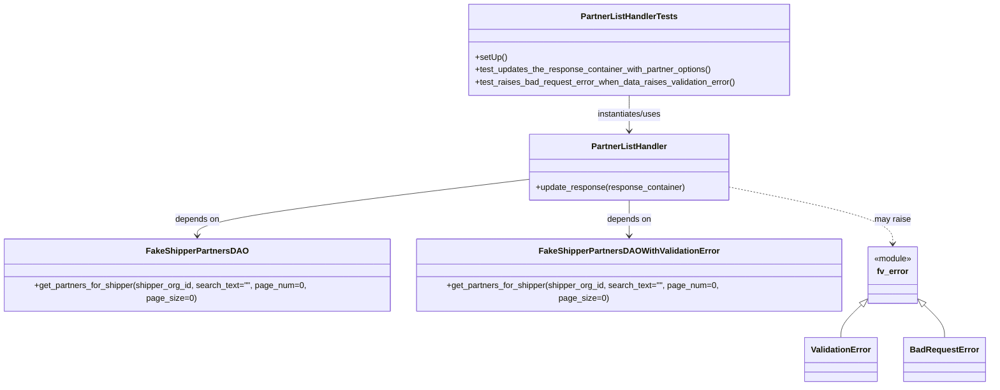

# Diagram: entity_core/entity_search/entity_search_tests/handler_tests/test_partner_list_handler.py


> Auto-generated by Obscura crawlers

## Diagram 1



### SVG

<svg id="container" width="1867.57421875" xmlns="http://www.w3.org/2000/svg" class="classDiagram" height="724" viewBox="0 0 1867.57421875 724" role="graphics-document document" aria-roledescription="class"><style>#container{font-family:"trebuchet ms",verdana,arial,sans-serif;font-size:16px;fill:#333;}@keyframes edge-animation-frame{from{stroke-dashoffset:0;}}@keyframes dash{to{stroke-dashoffset:0;}}#container .edge-animation-slow{stroke-dasharray:9,5!important;stroke-dashoffset:900;animation:dash 50s linear infinite;stroke-linecap:round;}#container .edge-animation-fast{stroke-dasharray:9,5!important;stroke-dashoffset:900;animation:dash 20s linear infinite;stroke-linecap:round;}#container .error-icon{fill:#552222;}#container .error-text{fill:#552222;stroke:#552222;}#container .edge-thickness-normal{stroke-width:1px;}#container .edge-thickness-thick{stroke-width:3.5px;}#container .edge-pattern-solid{stroke-dasharray:0;}#container .edge-thickness-invisible{stroke-width:0;fill:none;}#container .edge-pattern-dashed{stroke-dasharray:3;}#container .edge-pattern-dotted{stroke-dasharray:2;}#container .marker{fill:#333333;stroke:#333333;}#container .marker.cross{stroke:#333333;}#container svg{font-family:"trebuchet ms",verdana,arial,sans-serif;font-size:16px;}#container p{margin:0;}#container g.classGroup text{fill:#9370DB;stroke:none;font-family:"trebuchet ms",verdana,arial,sans-serif;font-size:10px;}#container g.classGroup text .title{font-weight:bolder;}#container .nodeLabel,#container .edgeLabel{color:#131300;}#container .edgeLabel .label rect{fill:#ECECFF;}#container .label text{fill:#131300;}#container .labelBkg{background:#ECECFF;}#container .edgeLabel .label span{background:#ECECFF;}#container .classTitle{font-weight:bolder;}#container .node rect,#container .node circle,#container .node ellipse,#container .node polygon,#container .node path{fill:#ECECFF;stroke:#9370DB;stroke-width:1px;}#container .divider{stroke:#9370DB;stroke-width:1;}#container g.clickable{cursor:pointer;}#container g.classGroup rect{fill:#ECECFF;stroke:#9370DB;}#container g.classGroup line{stroke:#9370DB;stroke-width:1;}#container .classLabel .box{stroke:none;stroke-width:0;fill:#ECECFF;opacity:0.5;}#container .classLabel .label{fill:#9370DB;font-size:10px;}#container .relation{stroke:#333333;stroke-width:1;fill:none;}#container .dashed-line{stroke-dasharray:3;}#container .dotted-line{stroke-dasharray:1 2;}#container #compositionStart,#container .composition{fill:#333333!important;stroke:#333333!important;stroke-width:1;}#container #compositionEnd,#container .composition{fill:#333333!important;stroke:#333333!important;stroke-width:1;}#container #dependencyStart,#container .dependency{fill:#333333!important;stroke:#333333!important;stroke-width:1;}#container #dependencyStart,#container .dependency{fill:#333333!important;stroke:#333333!important;stroke-width:1;}#container #extensionStart,#container .extension{fill:transparent!important;stroke:#333333!important;stroke-width:1;}#container #extensionEnd,#container .extension{fill:transparent!important;stroke:#333333!important;stroke-width:1;}#container #aggregationStart,#container .aggregation{fill:transparent!important;stroke:#333333!important;stroke-width:1;}#container #aggregationEnd,#container .aggregation{fill:transparent!important;stroke:#333333!important;stroke-width:1;}#container #lollipopStart,#container .lollipop{fill:#ECECFF!important;stroke:#333333!important;stroke-width:1;}#container #lollipopEnd,#container .lollipop{fill:#ECECFF!important;stroke:#333333!important;stroke-width:1;}#container .edgeTerminals{font-size:11px;line-height:initial;}#container .classTitleText{text-anchor:middle;font-size:18px;fill:#333;}#container .label-icon{display:inline-block;height:1em;overflow:visible;vertical-align:-0.125em;}#container .node .label-icon path{fill:currentColor;stroke:revert;stroke-width:revert;}#container :root{--mermaid-font-family:"trebuchet ms",verdana,arial,sans-serif;}</style><g><defs><marker id="container_class-aggregationStart" class="marker aggregation class" refX="18" refY="7" markerWidth="190" markerHeight="240" orient="auto"><path d="M 18,7 L9,13 L1,7 L9,1 Z"></path></marker></defs><defs><marker id="container_class-aggregationEnd" class="marker aggregation class" refX="1" refY="7" markerWidth="20" markerHeight="28" orient="auto"><path d="M 18,7 L9,13 L1,7 L9,1 Z"></path></marker></defs><defs><marker id="container_class-extensionStart" class="marker extension class" refX="18" refY="7" markerWidth="190" markerHeight="240" orient="auto"><path d="M 1,7 L18,13 V 1 Z"></path></marker></defs><defs><marker id="container_class-extensionEnd" class="marker extension class" refX="1" refY="7" markerWidth="20" markerHeight="28" orient="auto"><path d="M 1,1 V 13 L18,7 Z"></path></marker></defs><defs><marker id="container_class-compositionStart" class="marker composition class" refX="18" refY="7" markerWidth="190" markerHeight="240" orient="auto"><path d="M 18,7 L9,13 L1,7 L9,1 Z"></path></marker></defs><defs><marker id="container_class-compositionEnd" class="marker composition class" refX="1" refY="7" markerWidth="20" markerHeight="28" orient="auto"><path d="M 18,7 L9,13 L1,7 L9,1 Z"></path></marker></defs><defs><marker id="container_class-dependencyStart" class="marker dependency class" refX="6" refY="7" markerWidth="190" markerHeight="240" orient="auto"><path d="M 5,7 L9,13 L1,7 L9,1 Z"></path></marker></defs><defs><marker id="container_class-dependencyEnd" class="marker dependency class" refX="13" refY="7" markerWidth="20" markerHeight="28" orient="auto"><path d="M 18,7 L9,13 L14,7 L9,1 Z"></path></marker></defs><defs><marker id="container_class-lollipopStart" class="marker lollipop class" refX="13" refY="7" markerWidth="190" markerHeight="240" orient="auto"><circle stroke="black" fill="transparent" cx="7" cy="7" r="6"></circle></marker></defs><defs><marker id="container_class-lollipopEnd" class="marker lollipop class" refX="1" refY="7" markerWidth="190" markerHeight="240" orient="auto"><circle stroke="black" fill="transparent" cx="7" cy="7" r="6"></circle></marker></defs><g class="root"><g class="clusters"></g><g class="edgePaths"><path d="M1189.742,182L1189.742,188.167C1189.742,194.333,1189.742,206.667,1189.742,218C1189.742,229.333,1189.742,239.667,1189.742,244.833L1189.742,250" id="id_PartnerListHandlerTests_PartnerListHandler_1" class="edge-thickness-normal edge-pattern-solid relation" style=";;;" data-edge="true" data-et="edge" data-id="id_PartnerListHandlerTests_PartnerListHandler_1" data-points="W3sieCI6MTE4OS43NDIxODc1LCJ5IjoxODJ9LHsieCI6MTE4OS43NDIxODc1LCJ5IjoyMTl9LHsieCI6MTE4OS43NDIxODc1LCJ5IjoyNTZ9XQ==" marker-end="url(#container_class-dependencyEnd)"></path><path d="M999.293,342.326L894.954,355.105C790.616,367.884,581.939,393.442,477.6,411.388C373.262,429.333,373.262,439.667,373.262,444.833L373.262,450" id="id_PartnerListHandler_FakeShipperPartnersDAO_2" class="edge-thickness-normal edge-pattern-solid relation" style=";;;" data-edge="true" data-et="edge" data-id="id_PartnerListHandler_FakeShipperPartnersDAO_2" data-points="W3sieCI6OTk5LjI5Mjk2ODc1LCJ5IjozNDIuMzI1NjMwNjg0MjkxODd9LHsieCI6MzczLjI2MTcxODc1LCJ5Ijo0MTl9LHsieCI6MzczLjI2MTcxODc1LCJ5Ijo0NTZ9XQ==" marker-end="url(#container_class-dependencyEnd)"></path><path d="M1189.742,382L1189.742,388.167C1189.742,394.333,1189.742,406.667,1189.742,418C1189.742,429.333,1189.742,439.667,1189.742,444.833L1189.742,450" id="id_PartnerListHandler_FakeShipperPartnersDAOWithValidationError_3" class="edge-thickness-normal edge-pattern-solid relation" style=";;;" data-edge="true" data-et="edge" data-id="id_PartnerListHandler_FakeShipperPartnersDAOWithValidationError_3" data-points="W3sieCI6MTE4OS43NDIxODc1LCJ5IjozODJ9LHsieCI6MTE4OS43NDIxODc1LCJ5Ijo0MTl9LHsieCI6MTE4OS43NDIxODc1LCJ5Ijo0NTZ9XQ==" marker-end="url(#container_class-dependencyEnd)"></path><path d="M1628.261,575.351L1622.523,580.626C1616.785,585.901,1605.308,596.45,1599.57,605.892C1593.832,615.333,1593.832,623.667,1593.832,627.833L1593.832,632" id="id_fv_error_ValidationError_4" class="edge-thickness-normal edge-pattern-solid relation" style=";;;" data-edge="true" data-et="edge" data-id="id_fv_error_ValidationError_4" data-points="W3sieCI6MTY0MC45NjA5Mzc1LCJ5Ijo1NjMuNjc2ODY3ODMzNjgwMX0seyJ4IjoxNTkzLjgzMjAzMTI1LCJ5Ijo2MDd9LHsieCI6MTU5My44MzIwMzEyNSwieSI6NjMyfV0=" marker-start="url(#container_class-extensionStart)"></path><path d="M1750.864,575.351L1756.602,580.626C1762.34,585.901,1773.817,596.45,1779.555,605.892C1785.293,615.333,1785.293,623.667,1785.293,627.833L1785.293,632" id="id_fv_error_BadRequestError_5" class="edge-thickness-normal edge-pattern-solid relation" style=";;;" data-edge="true" data-et="edge" data-id="id_fv_error_BadRequestError_5" data-points="W3sieCI6MTczOC4xNjQwNjI1LCJ5Ijo1NjMuNjc2ODY3ODMzNjgwMX0seyJ4IjoxNzg1LjI5Mjk2ODc1LCJ5Ijo2MDd9LHsieCI6MTc4NS4yOTI5Njg3NSwieSI6NjMyfV0=" marker-start="url(#container_class-extensionStart)"></path><path d="M1380.191,357.104L1431.753,367.42C1483.315,377.736,1586.439,398.368,1638.001,415.351C1689.563,432.333,1689.563,445.667,1689.563,452.333L1689.563,459" id="id_PartnerListHandler_fv_error_6" class="edge-thickness-normal edge-pattern-dashed relation" style=";;;" data-edge="true" data-et="edge" data-id="id_PartnerListHandler_fv_error_6" data-points="W3sieCI6MTM4MC4xOTE0MDYyNSwieSI6MzU3LjEwMzUzNzIwODY4NDR9LHsieCI6MTY4OS41NjI1LCJ5Ijo0MTl9LHsieCI6MTY4OS41NjI1LCJ5Ijo0NjV9XQ==" marker-end="url(#container_class-dependencyEnd)"></path></g><g class="edgeLabels"><g class="edgeLabel" transform="translate(1189.7421875, 219)"><g class="label" data-id="id_PartnerListHandlerTests_PartnerListHandler_1" transform="translate(-63.3203125, -12)"><foreignObject width="126.640625" height="24"><div xmlns="http://www.w3.org/1999/xhtml" class="labelBkg" style="display: table-cell; white-space: nowrap; line-height: 1.5; max-width: 200px; text-align: center;"><span class="edgeLabel"><p>instantiates/uses</p></span></div></foreignObject></g></g><g class="edgeLabel" transform="translate(373.26171875, 419)"><g class="label" data-id="id_PartnerListHandler_FakeShipperPartnersDAO_2" transform="translate(-42.9453125, -12)"><foreignObject width="85.890625" height="24"><div xmlns="http://www.w3.org/1999/xhtml" class="labelBkg" style="display: table-cell; white-space: nowrap; line-height: 1.5; max-width: 200px; text-align: center;"><span class="edgeLabel"><p>depends on</p></span></div></foreignObject></g></g><g class="edgeLabel" transform="translate(1189.7421875, 419)"><g class="label" data-id="id_PartnerListHandler_FakeShipperPartnersDAOWithValidationError_3" transform="translate(-42.9453125, -12)"><foreignObject width="85.890625" height="24"><div xmlns="http://www.w3.org/1999/xhtml" class="labelBkg" style="display: table-cell; white-space: nowrap; line-height: 1.5; max-width: 200px; text-align: center;"><span class="edgeLabel"><p>depends on</p></span></div></foreignObject></g></g><g class="edgeLabel"><g class="label" data-id="id_fv_error_ValidationError_4" transform="translate(0, 0)"><foreignObject width="0" height="0"><div xmlns="http://www.w3.org/1999/xhtml" class="labelBkg" style="display: table-cell; white-space: nowrap; line-height: 1.5; max-width: 200px; text-align: center;"><span class="edgeLabel"></span></div></foreignObject></g></g><g class="edgeLabel"><g class="label" data-id="id_fv_error_BadRequestError_5" transform="translate(0, 0)"><foreignObject width="0" height="0"><div xmlns="http://www.w3.org/1999/xhtml" class="labelBkg" style="display: table-cell; white-space: nowrap; line-height: 1.5; max-width: 200px; text-align: center;"><span class="edgeLabel"></span></div></foreignObject></g></g><g class="edgeLabel" transform="translate(1689.5625, 419)"><g class="label" data-id="id_PartnerListHandler_fv_error_6" transform="translate(-34.65625, -12)"><foreignObject width="69.3125" height="24"><div xmlns="http://www.w3.org/1999/xhtml" class="labelBkg" style="display: table-cell; white-space: nowrap; line-height: 1.5; max-width: 200px; text-align: center;"><span class="edgeLabel"><p>may raise</p></span></div></foreignObject></g></g></g><g class="nodes"><g class="node default" id="classId-PartnerListHandlerTests-0" transform="translate(1189.7421875, 95)"><g class="basic label-container"><path d="M-307.06640625 -87 L307.06640625 -87 L307.06640625 87 L-307.06640625 87" stroke="none" stroke-width="0" fill="#ECECFF" style=""></path><path d="M-307.06640625 -87 C-84.31273734066352 -87, 138.44093156867297 -87, 307.06640625 -87 M-307.06640625 -87 C-128.13238952595734 -87, 50.80162719808533 -87, 307.06640625 -87 M307.06640625 -87 C307.06640625 -17.796459277495728, 307.06640625 51.407081445008544, 307.06640625 87 M307.06640625 -87 C307.06640625 -47.726840545173445, 307.06640625 -8.45368109034689, 307.06640625 87 M307.06640625 87 C177.85916735758246 87, 48.65192846516493 87, -307.06640625 87 M307.06640625 87 C94.61890139355586 87, -117.82860346288828 87, -307.06640625 87 M-307.06640625 87 C-307.06640625 35.38856975150778, -307.06640625 -16.22286049698444, -307.06640625 -87 M-307.06640625 87 C-307.06640625 49.024008144295834, -307.06640625 11.048016288591668, -307.06640625 -87" stroke="#9370DB" stroke-width="1.3" fill="none" stroke-dasharray="0 0" style=""></path></g><g class="annotation-group text" transform="translate(0, -63)"></g><g class="label-group text" transform="translate(-88.8203125, -63)"><g class="label" style="font-weight: bolder" transform="translate(0,-12)"><foreignObject width="177.640625" height="24"><div xmlns="http://www.w3.org/1999/xhtml" style="display: table-cell; white-space: nowrap; line-height: 1.5; max-width: 224px; text-align: center;"><span class="nodeLabel markdown-node-label" style=""><p>PartnerListHandlerTests</p></span></div></foreignObject></g></g><g class="members-group text" transform="translate(-295.06640625, -15)"></g><g class="methods-group text" transform="translate(-295.06640625, 15)"><g class="label" style="" transform="translate(0,-12)"><foreignObject width="60.421875" height="24"><div xmlns="http://www.w3.org/1999/xhtml" style="display: table-cell; white-space: nowrap; line-height: 1.5; max-width: 118px; text-align: center;"><span class="nodeLabel markdown-node-label" style=""><p>+setUp()</p></span></div></foreignObject></g><g class="label" style="" transform="translate(0,12)"><foreignObject width="457.828125" height="24"><div xmlns="http://www.w3.org/1999/xhtml" style="display: table-cell; white-space: nowrap; line-height: 1.5; max-width: 515px; text-align: center;"><span class="nodeLabel markdown-node-label" style=""><p>+test_updates_the_response_container_with_partner_options()</p></span></div></foreignObject></g><g class="label" style="" transform="translate(0,36)"><foreignObject width="501.3125" height="24"><div xmlns="http://www.w3.org/1999/xhtml" style="display: table-cell; white-space: nowrap; line-height: 1.5; max-width: 559px; text-align: center;"><span class="nodeLabel markdown-node-label" style=""><p>+test_raises_bad_request_error_when_data_raises_validation_error()</p></span></div></foreignObject></g></g><g class="divider" style=""><path d="M-307.06640625 -39 C-143.58465836382285 -39, 19.897089522354293 -39, 307.06640625 -39 M-307.06640625 -39 C-65.68623708461442 -39, 175.69393208077116 -39, 307.06640625 -39" stroke="#9370DB" stroke-width="1.3" fill="none" stroke-dasharray="0 0" style=""></path></g><g class="divider" style=""><path d="M-307.06640625 -15 C-96.65598571891996 -15, 113.75443481216007 -15, 307.06640625 -15 M-307.06640625 -15 C-133.44273409005027 -15, 40.18093806989947 -15, 307.06640625 -15" stroke="#9370DB" stroke-width="1.3" fill="none" stroke-dasharray="0 0" style=""></path></g></g><g class="node default" id="classId-PartnerListHandler-1" transform="translate(1189.7421875, 319)"><g class="basic label-container"><path d="M-190.44921875 -63 L190.44921875 -63 L190.44921875 63 L-190.44921875 63" stroke="none" stroke-width="0" fill="#ECECFF" style=""></path><path d="M-190.44921875 -63 C-112.91817035965417 -63, -35.38712196930834 -63, 190.44921875 -63 M-190.44921875 -63 C-38.611976406801205 -63, 113.22526593639759 -63, 190.44921875 -63 M190.44921875 -63 C190.44921875 -34.506330983028924, 190.44921875 -6.012661966057848, 190.44921875 63 M190.44921875 -63 C190.44921875 -26.481667781046717, 190.44921875 10.036664437906566, 190.44921875 63 M190.44921875 63 C112.31978885595639 63, 34.19035896191278 63, -190.44921875 63 M190.44921875 63 C86.73234969199575 63, -16.9845193660085 63, -190.44921875 63 M-190.44921875 63 C-190.44921875 23.956907281482877, -190.44921875 -15.086185437034246, -190.44921875 -63 M-190.44921875 63 C-190.44921875 20.42800430718222, -190.44921875 -22.14399138563556, -190.44921875 -63" stroke="#9370DB" stroke-width="1.3" fill="none" stroke-dasharray="0 0" style=""></path></g><g class="annotation-group text" transform="translate(0, -39)"></g><g class="label-group text" transform="translate(-69.7109375, -39)"><g class="label" style="font-weight: bolder" transform="translate(0,-12)"><foreignObject width="139.421875" height="24"><div xmlns="http://www.w3.org/1999/xhtml" style="display: table-cell; white-space: nowrap; line-height: 1.5; max-width: 188px; text-align: center;"><span class="nodeLabel markdown-node-label" style=""><p>PartnerListHandler</p></span></div></foreignObject></g></g><g class="members-group text" transform="translate(-178.44921875, 9)"></g><g class="methods-group text" transform="translate(-178.44921875, 39)"><g class="label" style="" transform="translate(0,-12)"><foreignObject width="287.1875" height="24"><div xmlns="http://www.w3.org/1999/xhtml" style="display: table-cell; white-space: nowrap; line-height: 1.5; max-width: 345px; text-align: center;"><span class="nodeLabel markdown-node-label" style=""><p>+update_response(response_container)</p></span></div></foreignObject></g></g><g class="divider" style=""><path d="M-190.44921875 -15 C-38.162503064078265 -15, 114.12421262184347 -15, 190.44921875 -15 M-190.44921875 -15 C-86.42426582501578 -15, 17.60068709996844 -15, 190.44921875 -15" stroke="#9370DB" stroke-width="1.3" fill="none" stroke-dasharray="0 0" style=""></path></g><g class="divider" style=""><path d="M-190.44921875 9 C-85.48726287613705 9, 19.474692997725896 9, 190.44921875 9 M-190.44921875 9 C-93.9939379239078 9, 2.4613429021844127 9, 190.44921875 9" stroke="#9370DB" stroke-width="1.3" fill="none" stroke-dasharray="0 0" style=""></path></g></g><g class="node default" id="classId-FakeShipperPartnersDAO-2" transform="translate(373.26171875, 519)"><g class="basic label-container"><path d="M-365.26171875 -63 L365.26171875 -63 L365.26171875 63 L-365.26171875 63" stroke="none" stroke-width="0" fill="#ECECFF" style=""></path><path d="M-365.26171875 -63 C-186.88035539191512 -63, -8.498992033830234 -63, 365.26171875 -63 M-365.26171875 -63 C-77.39049050105405 -63, 210.4807377478919 -63, 365.26171875 -63 M365.26171875 -63 C365.26171875 -13.422931204328968, 365.26171875 36.154137591342064, 365.26171875 63 M365.26171875 -63 C365.26171875 -27.882515579948866, 365.26171875 7.234968840102269, 365.26171875 63 M365.26171875 63 C76.40209517496436 63, -212.45752840007128 63, -365.26171875 63 M365.26171875 63 C186.7305071405134 63, 8.199295531026792 63, -365.26171875 63 M-365.26171875 63 C-365.26171875 17.27055878956115, -365.26171875 -28.4588824208777, -365.26171875 -63 M-365.26171875 63 C-365.26171875 15.408778817060245, -365.26171875 -32.18244236587951, -365.26171875 -63" stroke="#9370DB" stroke-width="1.3" fill="none" stroke-dasharray="0 0" style=""></path></g><g class="annotation-group text" transform="translate(0, -39)"></g><g class="label-group text" transform="translate(-91.5234375, -39)"><g class="label" style="font-weight: bolder" transform="translate(0,-12)"><foreignObject width="183.046875" height="24"><div xmlns="http://www.w3.org/1999/xhtml" style="display: table-cell; white-space: nowrap; line-height: 1.5; max-width: 230px; text-align: center;"><span class="nodeLabel markdown-node-label" style=""><p>FakeShipperPartnersDAO</p></span></div></foreignObject></g></g><g class="members-group text" transform="translate(-353.26171875, 9)"></g><g class="methods-group text" transform="translate(-353.26171875, 39)"><g class="label" style="" transform="translate(0,-12)"><foreignObject width="615" height="24"><div xmlns="http://www.w3.org/1999/xhtml" style="display: table-cell; white-space: nowrap; line-height: 1.5; max-width: 672px; text-align: center;"><span class="nodeLabel markdown-node-label" style=""><p>+get_partners_for_shipper(shipper_org_id, search_text="", page_num=0, page_size=0)</p></span></div></foreignObject></g></g><g class="divider" style=""><path d="M-365.26171875 -15 C-204.56412667975846 -15, -43.86653460951692 -15, 365.26171875 -15 M-365.26171875 -15 C-188.62008453939717 -15, -11.978450328794338 -15, 365.26171875 -15" stroke="#9370DB" stroke-width="1.3" fill="none" stroke-dasharray="0 0" style=""></path></g><g class="divider" style=""><path d="M-365.26171875 9 C-91.76891149709843 9, 181.72389575580314 9, 365.26171875 9 M-365.26171875 9 C-187.6055697608773 9, -9.949420771754603 9, 365.26171875 9" stroke="#9370DB" stroke-width="1.3" fill="none" stroke-dasharray="0 0" style=""></path></g></g><g class="node default" id="classId-FakeShipperPartnersDAOWithValidationError-3" transform="translate(1189.7421875, 519)"><g class="basic label-container"><path d="M-401.21875 -63 L401.21875 -63 L401.21875 63 L-401.21875 63" stroke="none" stroke-width="0" fill="#ECECFF" style=""></path><path d="M-401.21875 -63 C-113.73509511155339 -63, 173.74855977689322 -63, 401.21875 -63 M-401.21875 -63 C-210.29990749165626 -63, -19.381064983312513 -63, 401.21875 -63 M401.21875 -63 C401.21875 -32.23195222066581, 401.21875 -1.4639044413316213, 401.21875 63 M401.21875 -63 C401.21875 -17.138762712750847, 401.21875 28.722474574498307, 401.21875 63 M401.21875 63 C110.60809431740921 63, -180.00256136518158 63, -401.21875 63 M401.21875 63 C211.5941786643779 63, 21.969607328755785 63, -401.21875 63 M-401.21875 63 C-401.21875 31.240686614096106, -401.21875 -0.5186267718077886, -401.21875 -63 M-401.21875 63 C-401.21875 23.13051688759301, -401.21875 -16.73896622481398, -401.21875 -63" stroke="#9370DB" stroke-width="1.3" fill="none" stroke-dasharray="0 0" style=""></path></g><g class="annotation-group text" transform="translate(0, -39)"></g><g class="label-group text" transform="translate(-163.4375, -39)"><g class="label" style="font-weight: bolder" transform="translate(0,-12)"><foreignObject width="326.875" height="24"><div xmlns="http://www.w3.org/1999/xhtml" style="display: table-cell; white-space: nowrap; line-height: 1.5; max-width: 372px; text-align: center;"><span class="nodeLabel markdown-node-label" style=""><p>FakeShipperPartnersDAOWithValidationError</p></span></div></foreignObject></g></g><g class="members-group text" transform="translate(-389.21875, 9)"></g><g class="methods-group text" transform="translate(-389.21875, 39)"><g class="label" style="" transform="translate(0,-12)"><foreignObject width="615" height="24"><div xmlns="http://www.w3.org/1999/xhtml" style="display: table-cell; white-space: nowrap; line-height: 1.5; max-width: 672px; text-align: center;"><span class="nodeLabel markdown-node-label" style=""><p>+get_partners_for_shipper(shipper_org_id, search_text="", page_num=0, page_size=0)</p></span></div></foreignObject></g></g><g class="divider" style=""><path d="M-401.21875 -15 C-191.21503951894005 -15, 18.78867096211991 -15, 401.21875 -15 M-401.21875 -15 C-223.80191586037006 -15, -46.38508172074012 -15, 401.21875 -15" stroke="#9370DB" stroke-width="1.3" fill="none" stroke-dasharray="0 0" style=""></path></g><g class="divider" style=""><path d="M-401.21875 9 C-168.01275117852043 9, 65.19324764295914 9, 401.21875 9 M-401.21875 9 C-197.88770106003903 9, 5.44334787992193 9, 401.21875 9" stroke="#9370DB" stroke-width="1.3" fill="none" stroke-dasharray="0 0" style=""></path></g></g><g class="node default" id="classId-fv_error-4" transform="translate(1689.5625, 519)"><g class="basic label-container"><path d="M-48.6015625 -54 L48.6015625 -54 L48.6015625 54 L-48.6015625 54" stroke="none" stroke-width="0" fill="#ECECFF" style=""></path><path d="M-48.6015625 -54 C-13.70701343013242 -54, 21.18753563973516 -54, 48.6015625 -54 M-48.6015625 -54 C-17.133207168927292 -54, 14.335148162145416 -54, 48.6015625 -54 M48.6015625 -54 C48.6015625 -11.728015660167074, 48.6015625 30.543968679665852, 48.6015625 54 M48.6015625 -54 C48.6015625 -27.803852530150223, 48.6015625 -1.6077050603004466, 48.6015625 54 M48.6015625 54 C11.077390923596013 54, -26.446780652807973 54, -48.6015625 54 M48.6015625 54 C13.408386855250086 54, -21.784788789499828 54, -48.6015625 54 M-48.6015625 54 C-48.6015625 22.918404145102794, -48.6015625 -8.163191709794411, -48.6015625 -54 M-48.6015625 54 C-48.6015625 31.416317937942363, -48.6015625 8.832635875884726, -48.6015625 -54" stroke="#9370DB" stroke-width="1.3" fill="none" stroke-dasharray="0 0" style=""></path></g><g class="annotation-group text" transform="translate(-36.6015625, -30)"><g class="label" style="" transform="translate(0,-12)"><foreignObject width="73.203125" height="24"><div xmlns="http://www.w3.org/1999/xhtml" style="display: table-cell; white-space: nowrap; line-height: 1.5; max-width: 123px; text-align: center;"><span class="nodeLabel markdown-node-label" style=""><p>«module»</p></span></div></foreignObject></g></g><g class="label-group text" transform="translate(-29.1875, -6)"><g class="label" style="font-weight: bolder" transform="translate(0,-12)"><foreignObject width="58.375" height="24"><div xmlns="http://www.w3.org/1999/xhtml" style="display: table-cell; white-space: nowrap; line-height: 1.5; max-width: 108px; text-align: center;"><span class="nodeLabel markdown-node-label" style=""><p>fv_error</p></span></div></foreignObject></g></g><g class="members-group text" transform="translate(-36.6015625, 42)"></g><g class="methods-group text" transform="translate(-36.6015625, 72)"></g><g class="divider" style=""><path d="M-48.6015625 18 C-14.784760842095814 18, 19.032040815808372 18, 48.6015625 18 M-48.6015625 18 C-11.8508382808347 18, 24.8998859383306 18, 48.6015625 18" stroke="#9370DB" stroke-width="1.3" fill="none" stroke-dasharray="0 0" style=""></path></g><g class="divider" style=""><path d="M-48.6015625 36 C-22.806816816403682 36, 2.987928867192636 36, 48.6015625 36 M-48.6015625 36 C-26.951925234492837 36, -5.302287968985674 36, 48.6015625 36" stroke="#9370DB" stroke-width="1.3" fill="none" stroke-dasharray="0 0" style=""></path></g></g><g class="node default" id="classId-ValidationError-5" transform="translate(1593.83203125, 674)"><g class="basic label-container"><path d="M-67.1796875 -42 L67.1796875 -42 L67.1796875 42 L-67.1796875 42" stroke="none" stroke-width="0" fill="#ECECFF" style=""></path><path d="M-67.1796875 -42 C-13.998409689774519 -42, 39.18286812045096 -42, 67.1796875 -42 M-67.1796875 -42 C-30.280746298372044 -42, 6.618194903255912 -42, 67.1796875 -42 M67.1796875 -42 C67.1796875 -17.800389579898674, 67.1796875 6.399220840202652, 67.1796875 42 M67.1796875 -42 C67.1796875 -16.257792241733327, 67.1796875 9.484415516533346, 67.1796875 42 M67.1796875 42 C18.426716220791747 42, -30.326255058416507 42, -67.1796875 42 M67.1796875 42 C28.911871011162873 42, -9.355945477674254 42, -67.1796875 42 M-67.1796875 42 C-67.1796875 9.451144100097423, -67.1796875 -23.097711799805154, -67.1796875 -42 M-67.1796875 42 C-67.1796875 24.71564937924268, -67.1796875 7.431298758485362, -67.1796875 -42" stroke="#9370DB" stroke-width="1.3" fill="none" stroke-dasharray="0 0" style=""></path></g><g class="annotation-group text" transform="translate(0, -18)"></g><g class="label-group text" transform="translate(-55.1796875, -18)"><g class="label" style="font-weight: bolder" transform="translate(0,-12)"><foreignObject width="110.359375" height="24"><div xmlns="http://www.w3.org/1999/xhtml" style="display: table-cell; white-space: nowrap; line-height: 1.5; max-width: 160px; text-align: center;"><span class="nodeLabel markdown-node-label" style=""><p>ValidationError</p></span></div></foreignObject></g></g><g class="members-group text" transform="translate(-55.1796875, 30)"></g><g class="methods-group text" transform="translate(-55.1796875, 60)"></g><g class="divider" style=""><path d="M-67.1796875 6 C-13.58388542564137 6, 40.01191664871726 6, 67.1796875 6 M-67.1796875 6 C-20.22501717374825 6, 26.729653152503502 6, 67.1796875 6" stroke="#9370DB" stroke-width="1.3" fill="none" stroke-dasharray="0 0" style=""></path></g><g class="divider" style=""><path d="M-67.1796875 24 C-32.600846791517746 24, 1.9779939169645075 24, 67.1796875 24 M-67.1796875 24 C-25.40279789277981 24, 16.374091714440382 24, 67.1796875 24" stroke="#9370DB" stroke-width="1.3" fill="none" stroke-dasharray="0 0" style=""></path></g></g><g class="node default" id="classId-BadRequestError-6" transform="translate(1785.29296875, 674)"><g class="basic label-container"><path d="M-74.28125 -42 L74.28125 -42 L74.28125 42 L-74.28125 42" stroke="none" stroke-width="0" fill="#ECECFF" style=""></path><path d="M-74.28125 -42 C-16.272331418649202 -42, 41.736587162701596 -42, 74.28125 -42 M-74.28125 -42 C-41.94567286619847 -42, -9.610095732396942 -42, 74.28125 -42 M74.28125 -42 C74.28125 -13.985890253755077, 74.28125 14.028219492489846, 74.28125 42 M74.28125 -42 C74.28125 -21.00202146800453, 74.28125 -0.00404293600905703, 74.28125 42 M74.28125 42 C30.12421497848358 42, -14.032820043032842 42, -74.28125 42 M74.28125 42 C20.948724139125147 42, -32.383801721749705 42, -74.28125 42 M-74.28125 42 C-74.28125 23.561831655488266, -74.28125 5.123663310976532, -74.28125 -42 M-74.28125 42 C-74.28125 10.499377614972552, -74.28125 -21.001244770054896, -74.28125 -42" stroke="#9370DB" stroke-width="1.3" fill="none" stroke-dasharray="0 0" style=""></path></g><g class="annotation-group text" transform="translate(0, -18)"></g><g class="label-group text" transform="translate(-62.28125, -18)"><g class="label" style="font-weight: bolder" transform="translate(0,-12)"><foreignObject width="124.5625" height="24"><div xmlns="http://www.w3.org/1999/xhtml" style="display: table-cell; white-space: nowrap; line-height: 1.5; max-width: 174px; text-align: center;"><span class="nodeLabel markdown-node-label" style=""><p>BadRequestError</p></span></div></foreignObject></g></g><g class="members-group text" transform="translate(-62.28125, 30)"></g><g class="methods-group text" transform="translate(-62.28125, 60)"></g><g class="divider" style=""><path d="M-74.28125 6 C-41.005953707884125 6, -7.730657415768249 6, 74.28125 6 M-74.28125 6 C-18.79285578995053 6, 36.69553842009894 6, 74.28125 6" stroke="#9370DB" stroke-width="1.3" fill="none" stroke-dasharray="0 0" style=""></path></g><g class="divider" style=""><path d="M-74.28125 24 C-27.182034734720794 24, 19.91718053055841 24, 74.28125 24 M-74.28125 24 C-22.752602986988983 24, 28.776044026022035 24, 74.28125 24" stroke="#9370DB" stroke-width="1.3" fill="none" stroke-dasharray="0 0" style=""></path></g></g></g></g></g></svg>

## Diagram 2

```mermaid
sequenceDiagram
    participant Test as PartnerListHandlerTests
    participant Handler as PartnerListHandler
    participant DAO as ShipperPartnersDAO
    participant Error as fv.error

    Test->>Handler: update_response(response_container)
    Handler->>DAO: get_partners_for_shipper(org_id=1004, search_text="test", page_num=0, page_size=20)
    alt DAO returns partners successfully
        DAO-->>Handler: [{"org_name":"Test Partner","fv_id":"TEST_PARTNER"}], totalCount=1
        Handler-->>Test: response_container updated with partners and meta
        Test-->>Test: assert response_container["partners"] == [...]
        Test-->>Test: assert response_container["meta"] == {...}
    else DAO raises ValidationError
        DAO-->>Handler: raises ValidationError("Organization ID is not found")
        Handler-->>Error: convert to BadRequestError("Organization ID is not found")
        Error-->>Test: BadRequestError raised
        Test-->>Test: assertRaises BadRequestError and message matches
```

> SVG rendering failed for this diagram.
