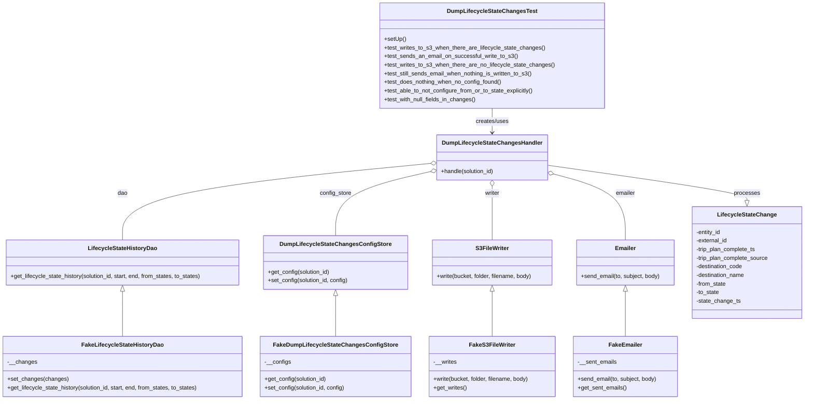
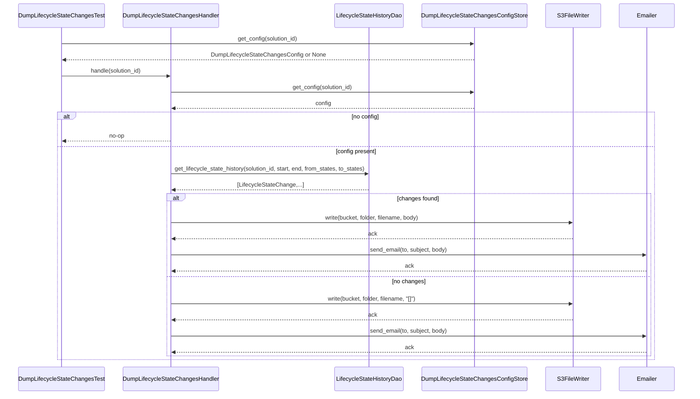

# Diagram: entity_core/entity_search/entity_search_tests/test_dump_lifecycle_state_changes.py

> Auto-generated by Obscura crawlers

## Diagram 1

### SVG

<svg id="container" width="2242.1875" xmlns="http://www.w3.org/2000/svg" class="classDiagram" height="1114" viewBox="0 0 2242.1875 1114" role="graphics-document document" aria-roledescription="class"><g><defs><marker id="container_class-aggregationStart" class="marker aggregation class" refX="18" refY="7" markerWidth="190" markerHeight="240" orient="auto"><path d="M 18,7 L9,13 L1,7 L9,1 Z"></path></marker></defs><defs><marker id="container_class-aggregationEnd" class="marker aggregation class" refX="1" refY="7" markerWidth="20" markerHeight="28" orient="auto"><path d="M 18,7 L9,13 L1,7 L9,1 Z"></path></marker></defs><defs><marker id="container_class-extensionStart" class="marker extension class" refX="18" refY="7" markerWidth="190" markerHeight="240" orient="auto"><path d="M 1,7 L18,13 V 1 Z"></path></marker></defs><defs><marker id="container_class-extensionEnd" class="marker extension class" refX="1" refY="7" markerWidth="20" markerHeight="28" orient="auto"><path d="M 1,1 V 13 L18,7 Z"></path></marker></defs><defs><marker id="container_class-compositionStart" class="marker composition class" refX="18" refY="7" markerWidth="190" markerHeight="240" orient="auto"><path d="M 18,7 L9,13 L1,7 L9,1 Z"></path></marker></defs><defs><marker id="container_class-compositionEnd" class="marker composition class" refX="1" refY="7" markerWidth="20" markerHeight="28" orient="auto"><path d="M 18,7 L9,13 L1,7 L9,1 Z"></path></marker></defs><defs><marker id="container_class-dependencyStart" class="marker dependency class" refX="6" refY="7" markerWidth="190" markerHeight="240" orient="auto"><path d="M 5,7 L9,13 L1,7 L9,1 Z"></path></marker></defs><defs><marker id="container_class-dependencyEnd" class="marker dependency class" refX="13" refY="7" markerWidth="20" markerHeight="28" orient="auto"><path d="M 18,7 L9,13 L14,7 L9,1 Z"></path></marker></defs><defs><marker id="container_class-lollipopStart" class="marker lollipop class" refX="13" refY="7" markerWidth="190" markerHeight="240" orient="auto"><circle stroke="black" fill="transparent" cx="7" cy="7" r="6"></circle></marker></defs><defs><marker id="container_class-lollipopEnd" class="marker lollipop class" refX="1" refY="7" markerWidth="190" markerHeight="240" orient="auto"><circle stroke="black" fill="transparent" cx="7" cy="7" r="6"></circle></marker></defs><g class="root"><g class="clusters"></g><g class="edgePaths"><path d="M1198.449,455.663L1056.042,469.553C913.635,483.442,628.821,511.221,486.415,546.777C344.008,582.333,344.008,625.667,344.008,647.333L344.008,669" id="id_DumpLifecycleStateChangesHandler_LifecycleStateHistoryDao_1" class="edge-thickness-normal edge-pattern-solid relation" style=";;;" data-edge="true" data-et="edge" data-id="id_DumpLifecycleStateChangesHandler_LifecycleStateHistoryDao_1" data-points="W3sieCI6MTIxNS42MTcxODc1LCJ5Ijo0NTMuOTg4NTg5MzAyNTE4NzN9LHsieCI6MzQ0LjAwNzgxMjUsInkiOjUzOX0seyJ4IjozNDQuMDA3ODEyNSwieSI6NjY5fV0=" marker-start="url(#container_class-aggregationStart)"></path><path d="M1198.809,478.353L1155.021,488.461C1111.232,498.569,1023.655,518.784,979.867,548.559C936.078,578.333,936.078,617.667,936.078,637.333L936.078,657" id="id_DumpLifecycleStateChangesHandler_DumpLifecycleStateChangesConfigStore_2" class="edge-thickness-normal edge-pattern-solid relation" style=";;;" data-edge="true" data-et="edge" data-id="id_DumpLifecycleStateChangesHandler_DumpLifecycleStateChangesConfigStore_2" data-points="W3sieCI6MTIxNS42MTcxODc1LCJ5Ijo0NzQuNDczMzQxNTY4NzU4M30seyJ4Ijo5MzYuMDc4MTI1LCJ5Ijo1Mzl9LHsieCI6OTM2LjA3ODEyNSwieSI6NjU3fV0=" marker-start="url(#container_class-aggregationStart)"></path><path d="M1369.293,519.25L1369.293,522.542C1369.293,525.833,1369.293,532.417,1369.293,557.375C1369.293,582.333,1369.293,625.667,1369.293,647.333L1369.293,669" id="id_DumpLifecycleStateChangesHandler_S3FileWriter_3" class="edge-thickness-normal edge-pattern-solid relation" style=";;;" data-edge="true" data-et="edge" data-id="id_DumpLifecycleStateChangesHandler_S3FileWriter_3" data-points="W3sieCI6MTM2OS4yOTI5Njg3NSwieSI6NTAyfSx7IngiOjEzNjkuMjkyOTY4NzUsInkiOjUzOX0seyJ4IjoxMzY5LjI5Mjk2ODc1LCJ5Ijo2Njl9XQ==" marker-start="url(#container_class-aggregationStart)"></path><path d="M1539.628,484.771L1573.263,493.809C1606.899,502.847,1674.17,520.924,1707.806,551.628C1741.441,582.333,1741.441,625.667,1741.441,647.333L1741.441,669" id="id_DumpLifecycleStateChangesHandler_Emailer_4" class="edge-thickness-normal edge-pattern-solid relation" style=";;;" data-edge="true" data-et="edge" data-id="id_DumpLifecycleStateChangesHandler_Emailer_4" data-points="W3sieCI6MTUyMi45Njg3NSwieSI6NDgwLjI5NDIxNjQzNzQ5MzQ1fSx7IngiOjE3NDEuNDQxNDA2MjUsInkiOjUzOX0seyJ4IjoxNzQxLjQ0MTQwNjI1LCJ5Ijo2Njl9XQ==" marker-start="url(#container_class-aggregationStart)"></path><path d="M344.008,812.25L344.008,829.042C344.008,845.833,344.008,879.417,344.008,900.375C344.008,921.333,344.008,929.667,344.008,933.833L344.008,938" id="id_LifecycleStateHistoryDao_FakeLifecycleStateHistoryDao_5" class="edge-thickness-normal edge-pattern-solid relation" style=";;;" data-edge="true" data-et="edge" data-id="id_LifecycleStateHistoryDao_FakeLifecycleStateHistoryDao_5" data-points="W3sieCI6MzQ0LjAwNzgxMjUsInkiOjc5NX0seyJ4IjozNDQuMDA3ODEyNSwieSI6OTEzfSx7IngiOjM0NC4wMDc4MTI1LCJ5Ijo5Mzh9XQ==" marker-start="url(#container_class-extensionStart)"></path><path d="M936.078,824.25L936.078,839.042C936.078,853.833,936.078,883.417,936.078,902.375C936.078,921.333,936.078,929.667,936.078,933.833L936.078,938" id="id_DumpLifecycleStateChangesConfigStore_FakeDumpLifecycleStateChangesConfigStore_6" class="edge-thickness-normal edge-pattern-solid relation" style=";;;" data-edge="true" data-et="edge" data-id="id_DumpLifecycleStateChangesConfigStore_FakeDumpLifecycleStateChangesConfigStore_6" data-points="W3sieCI6OTM2LjA3ODEyNSwieSI6ODA3fSx7IngiOjkzNi4wNzgxMjUsInkiOjkxM30seyJ4Ijo5MzYuMDc4MTI1LCJ5Ijo5Mzh9XQ==" marker-start="url(#container_class-extensionStart)"></path><path d="M1369.293,812.25L1369.293,829.042C1369.293,845.833,1369.293,879.417,1369.293,900.375C1369.293,921.333,1369.293,929.667,1369.293,933.833L1369.293,938" id="id_S3FileWriter_FakeS3FileWriter_7" class="edge-thickness-normal edge-pattern-solid relation" style=";;;" data-edge="true" data-et="edge" data-id="id_S3FileWriter_FakeS3FileWriter_7" data-points="W3sieCI6MTM2OS4yOTI5Njg3NSwieSI6Nzk1fSx7IngiOjEzNjkuMjkyOTY4NzUsInkiOjkxM30seyJ4IjoxMzY5LjI5Mjk2ODc1LCJ5Ijo5Mzh9XQ==" marker-start="url(#container_class-extensionStart)"></path><path d="M1741.441,812.25L1741.441,829.042C1741.441,845.833,1741.441,879.417,1741.441,900.375C1741.441,921.333,1741.441,929.667,1741.441,933.833L1741.441,938" id="id_Emailer_FakeEmailer_8" class="edge-thickness-normal edge-pattern-solid relation" style=";;;" data-edge="true" data-et="edge" data-id="id_Emailer_FakeEmailer_8" data-points="W3sieCI6MTc0MS40NDE0MDYyNSwieSI6Nzk1fSx7IngiOjE3NDEuNDQxNDA2MjUsInkiOjkxM30seyJ4IjoxNzQxLjQ0MTQwNjI1LCJ5Ijo5Mzh9XQ==" marker-start="url(#container_class-extensionStart)"></path><path d="M1369.293,302L1369.293,308.167C1369.293,314.333,1369.293,326.667,1369.293,338C1369.293,349.333,1369.293,359.667,1369.293,364.833L1369.293,370" id="id_DumpLifecycleStateChangesTest_DumpLifecycleStateChangesHandler_9" class="edge-thickness-normal edge-pattern-solid relation" style=";;;" data-edge="true" data-et="edge" data-id="id_DumpLifecycleStateChangesTest_DumpLifecycleStateChangesHandler_9" data-points="W3sieCI6MTM2OS4yOTI5Njg3NSwieSI6MzAyfSx7IngiOjEzNjkuMjkyOTY4NzUsInkiOjMzOX0seyJ4IjoxMzY5LjI5Mjk2ODc1LCJ5IjozNzZ9XQ==" marker-end="url(#container_class-dependencyEnd)"></path><path d="M1522.969,460.587L1616.004,473.656C1709.039,486.725,1895.109,512.862,1988.145,529.223C2081.18,545.583,2081.18,552.167,2081.18,555.458L2081.18,558.75" id="id_DumpLifecycleStateChangesHandler_LifecycleStateChange_10" class="edge-thickness-normal edge-pattern-solid relation" style=";;;" data-edge="true" data-et="edge" data-id="id_DumpLifecycleStateChangesHandler_LifecycleStateChange_10" data-points="W3sieCI6MTUyMi45Njg3NSwieSI6NDYwLjU4NzExMTcxMzQ4MTV9LHsieCI6MjA4MS4xNzk2ODc1LCJ5Ijo1Mzl9LHsieCI6MjA4MS4xNzk2ODc1LCJ5Ijo1NzZ9XQ==" marker-end="url(#container_class-extensionEnd)"></path></g><g class="edgeLabels"><g class="edgeLabel" transform="translate(344.0078125, 539)"><g class="label" data-id="id_DumpLifecycleStateChangesHandler_LifecycleStateHistoryDao_1" transform="translate(-13.8125, -12)"><foreignObject width="27.625" height="24">

dao

</foreignObject></g></g><g class="edgeLabel" transform="translate(936.078125, 539)"><g class="label" data-id="id_DumpLifecycleStateChangesHandler_DumpLifecycleStateChangesConfigStore_2" transform="translate(-44.3671875, -12)"><foreignObject width="88.734375" height="24">

config_store

</foreignObject></g></g><g class="edgeLabel" transform="translate(1369.29296875, 539)"><g class="label" data-id="id_DumpLifecycleStateChangesHandler_S3FileWriter_3" transform="translate(-21.296875, -12)"><foreignObject width="42.59375" height="24">

writer

</foreignObject></g></g><g class="edgeLabel" transform="translate(1741.44140625, 539)"><g class="label" data-id="id_DumpLifecycleStateChangesHandler_Emailer_4" transform="translate(-27.578125, -12)"><foreignObject width="55.15625" height="24">

emailer

</foreignObject></g></g><g class="edgeLabel"><g class="label" data-id="id_LifecycleStateHistoryDao_FakeLifecycleStateHistoryDao_5" transform="translate(0, 0)"><foreignObject width="0" height="0">

</foreignObject></g></g><g class="edgeLabel"><g class="label" data-id="id_DumpLifecycleStateChangesConfigStore_FakeDumpLifecycleStateChangesConfigStore_6" transform="translate(0, 0)"><foreignObject width="0" height="0">

</foreignObject></g></g><g class="edgeLabel"><g class="label" data-id="id_S3FileWriter_FakeS3FileWriter_7" transform="translate(0, 0)"><foreignObject width="0" height="0">

</foreignObject></g></g><g class="edgeLabel"><g class="label" data-id="id_Emailer_FakeEmailer_8" transform="translate(0, 0)"><foreignObject width="0" height="0">

</foreignObject></g></g><g class="edgeLabel" transform="translate(1369.29296875, 339)"><g class="label" data-id="id_DumpLifecycleStateChangesTest_DumpLifecycleStateChangesHandler_9" transform="translate(-46.578125, -12)"><foreignObject width="93.15625" height="24">

creates/uses

</foreignObject></g></g><g class="edgeLabel" transform="translate(2081.1796875, 539)"><g class="label" data-id="id_DumpLifecycleStateChangesHandler_LifecycleStateChange_10" transform="translate(-35.7890625, -12)"><foreignObject width="71.578125" height="24">

processes

</foreignObject></g></g></g><g class="nodes"><g class="node default" id="classId-DumpLifecycleStateChangesTest-0" transform="translate(1369.29296875, 155)"><g class="basic label-container"><path d="M-307.61328125 -147 L307.61328125 -147 L307.61328125 147 L-307.61328125 147" stroke="none" stroke-width="0" fill="#ECECFF" style=""></path><path d="M-307.61328125 -147 C-69.28082549152208 -147, 169.05163026695584 -147, 307.61328125 -147 M-307.61328125 -147 C-128.691266927226 -147, 50.23074739554801 -147, 307.61328125 -147 M307.61328125 -147 C307.61328125 -53.404874258095546, 307.61328125 40.19025148380891, 307.61328125 147 M307.61328125 -147 C307.61328125 -32.358564268863745, 307.61328125 82.28287146227251, 307.61328125 147 M307.61328125 147 C81.41674280383094 147, -144.77979564233812 147, -307.61328125 147 M307.61328125 147 C73.00291218609303 147, -161.60745687781395 147, -307.61328125 147 M-307.61328125 147 C-307.61328125 71.20502234950517, -307.61328125 -4.589955300989658, -307.61328125 -147 M-307.61328125 147 C-307.61328125 86.26826764634896, -307.61328125 25.53653529269792, -307.61328125 -147" stroke="#9370DB" stroke-width="1.3" fill="none" stroke-dasharray="0 0" style=""></path></g><g class="annotation-group text" transform="translate(0, -123)"></g><g class="label-group text" transform="translate(-118.5703125, -123)"><g class="label" style="font-weight: bolder" transform="translate(0,-12)"><foreignObject width="237.140625" height="24">

DumpLifecycleStateChangesTest

</foreignObject></g></g><g class="members-group text" transform="translate(-295.61328125, -75)"></g><g class="methods-group text" transform="translate(-295.61328125, -45)"><g class="label" style="" transform="translate(0,-12)"><foreignObject width="60.421875" height="24">

+setUp()

</foreignObject></g><g class="label" style="" transform="translate(0,12)"><foreignObject width="445.921875" height="24">

+test_writes_to_s3_when_there_are_lifecycle_state_changes()

</foreignObject></g><g class="label" style="" transform="translate(0,36)"><foreignObject width="370.578125" height="24">

+test_sends_an_email_on_successful_write_to_s3()

</foreignObject></g><g class="label" style="" transform="translate(0,60)"><foreignObject width="472.65625" height="24">

+test_writes_to_s3_when_there_are_no_lifecycle_state_changes()

</foreignObject></g><g class="label" style="" transform="translate(0,84)"><foreignObject width="417.484375" height="24">

+test_still_sends_email_when_nothing_is_written_to_s3()

</foreignObject></g><g class="label" style="" transform="translate(0,108)"><foreignObject width="329.125" height="24">

+test_does_nothing_when_no_config_found()

</foreignObject></g><g class="label" style="" transform="translate(0,132)"><foreignObject width="419.421875" height="24">

+test_able_to_not_configure_from_or_to_state_explicitly()

</foreignObject></g><g class="label" style="" transform="translate(0,156)"><foreignObject width="258.125" height="24">

+test_with_null_fields_in_changes()

</foreignObject></g></g><g class="divider" style=""><path d="M-307.61328125 -99 C-107.25284968619297 -99, 93.10758187761405 -99, 307.61328125 -99 M-307.61328125 -99 C-166.38036782268534 -99, -25.147454395370687 -99, 307.61328125 -99" stroke="#9370DB" stroke-width="1.3" fill="none" stroke-dasharray="0 0" style=""></path></g><g class="divider" style=""><path d="M-307.61328125 -75 C-85.16698124537487 -75, 137.27931875925026 -75, 307.61328125 -75 M-307.61328125 -75 C-178.60014250597237 -75, -49.58700376194474 -75, 307.61328125 -75" stroke="#9370DB" stroke-width="1.3" fill="none" stroke-dasharray="0 0" style=""></path></g></g><g class="node default" id="classId-DumpLifecycleStateChangesHandler-1" transform="translate(1369.29296875, 439)"><g class="basic label-container"><path d="M-153.67578125 -63 L153.67578125 -63 L153.67578125 63 L-153.67578125 63" stroke="none" stroke-width="0" fill="#ECECFF" style=""></path><path d="M-153.67578125 -63 C-50.83818649916944 -63, 51.99940825166112 -63, 153.67578125 -63 M-153.67578125 -63 C-66.2693524283599 -63, 21.13707639328021 -63, 153.67578125 -63 M153.67578125 -63 C153.67578125 -28.491413658798535, 153.67578125 6.017172682402929, 153.67578125 63 M153.67578125 -63 C153.67578125 -18.495308436430236, 153.67578125 26.00938312713953, 153.67578125 63 M153.67578125 63 C80.9089770740991 63, 8.142172898198197 63, -153.67578125 63 M153.67578125 63 C77.33931967294612 63, 1.0028580958922362 63, -153.67578125 63 M-153.67578125 63 C-153.67578125 37.43863555239324, -153.67578125 11.877271104786473, -153.67578125 -63 M-153.67578125 63 C-153.67578125 17.555596091836016, -153.67578125 -27.88880781632797, -153.67578125 -63" stroke="#9370DB" stroke-width="1.3" fill="none" stroke-dasharray="0 0" style=""></path></g><g class="annotation-group text" transform="translate(0, -39)"></g><g class="label-group text" transform="translate(-132.4140625, -39)"><g class="label" style="font-weight: bolder" transform="translate(0,-12)"><foreignObject width="264.828125" height="24">

DumpLifecycleStateChangesHandler

</foreignObject></g></g><g class="members-group text" transform="translate(-141.67578125, 9)"></g><g class="methods-group text" transform="translate(-141.67578125, 39)"><g class="label" style="" transform="translate(0,-12)"><foreignObject width="150.9375" height="24">

+handle(solution_id)

</foreignObject></g></g><g class="divider" style=""><path d="M-153.67578125 -15 C-46.38219740770121 -15, 60.911386434597574 -15, 153.67578125 -15 M-153.67578125 -15 C-73.2012228799195 -15, 7.273335490161003 -15, 153.67578125 -15" stroke="#9370DB" stroke-width="1.3" fill="none" stroke-dasharray="0 0" style=""></path></g><g class="divider" style=""><path d="M-153.67578125 9 C-35.646704361830444 9, 82.38237252633911 9, 153.67578125 9 M-153.67578125 9 C-87.0862505995447 9, -20.496719949089396 9, 153.67578125 9" stroke="#9370DB" stroke-width="1.3" fill="none" stroke-dasharray="0 0" style=""></path></g></g><g class="node default" id="classId-LifecycleStateHistoryDao-2" transform="translate(344.0078125, 732)"><g class="basic label-container"><path d="M-327.7421875 -63 L327.7421875 -63 L327.7421875 63 L-327.7421875 63" stroke="none" stroke-width="0" fill="#ECECFF" style=""></path><path d="M-327.7421875 -63 C-169.76872289229183 -63, -11.795258284583667 -63, 327.7421875 -63 M-327.7421875 -63 C-166.56739332569154 -63, -5.392599151383081 -63, 327.7421875 -63 M327.7421875 -63 C327.7421875 -12.798547856761807, 327.7421875 37.402904286476385, 327.7421875 63 M327.7421875 -63 C327.7421875 -37.78845003660015, 327.7421875 -12.576900073200306, 327.7421875 63 M327.7421875 63 C75.63445015216158 63, -176.47328719567685 63, -327.7421875 63 M327.7421875 63 C110.62741068309697 63, -106.48736613380606 63, -327.7421875 63 M-327.7421875 63 C-327.7421875 21.590580287651782, -327.7421875 -19.818839424696435, -327.7421875 -63 M-327.7421875 63 C-327.7421875 28.705536610140307, -327.7421875 -5.588926779719387, -327.7421875 -63" stroke="#9370DB" stroke-width="1.3" fill="none" stroke-dasharray="0 0" style=""></path></g><g class="annotation-group text" transform="translate(0, -39)"></g><g class="label-group text" transform="translate(-91.953125, -39)"><g class="label" style="font-weight: bolder" transform="translate(0,-12)"><foreignObject width="183.90625" height="24">

LifecycleStateHistoryDao

</foreignObject></g></g><g class="members-group text" transform="translate(-315.7421875, 9)"></g><g class="methods-group text" transform="translate(-315.7421875, 39)"><g class="label" style="" transform="translate(0,-12)"><foreignObject width="539.53125" height="24">

+get_lifecycle_state_history(solution_id, start, end, from_states, to_states)

</foreignObject></g></g><g class="divider" style=""><path d="M-327.7421875 -15 C-95.67040571331208 -15, 136.40137607337584 -15, 327.7421875 -15 M-327.7421875 -15 C-108.05810513109193 -15, 111.62597723781613 -15, 327.7421875 -15" stroke="#9370DB" stroke-width="1.3" fill="none" stroke-dasharray="0 0" style=""></path></g><g class="divider" style=""><path d="M-327.7421875 9 C-172.44177673554992 9, -17.141365971099845 9, 327.7421875 9 M-327.7421875 9 C-172.12695521252314 9, -16.511722925046286 9, 327.7421875 9" stroke="#9370DB" stroke-width="1.3" fill="none" stroke-dasharray="0 0" style=""></path></g></g><g class="node default" id="classId-FakeLifecycleStateHistoryDao-3" transform="translate(344.0078125, 1022)"><g class="basic label-container"><path d="M-336.0078125 -84 L336.0078125 -84 L336.0078125 84 L-336.0078125 84" stroke="none" stroke-width="0" fill="#ECECFF" style=""></path><path d="M-336.0078125 -84 C-145.14137734354333 -84, 45.72505781291335 -84, 336.0078125 -84 M-336.0078125 -84 C-192.95646976887807 -84, -49.90512703775613 -84, 336.0078125 -84 M336.0078125 -84 C336.0078125 -28.084114470406575, 336.0078125 27.83177105918685, 336.0078125 84 M336.0078125 -84 C336.0078125 -20.667443729044344, 336.0078125 42.66511254191131, 336.0078125 84 M336.0078125 84 C149.87036554987952 84, -36.267081400240954 84, -336.0078125 84 M336.0078125 84 C122.27268098963964 84, -91.46245052072072 84, -336.0078125 84 M-336.0078125 84 C-336.0078125 18.023749305354585, -336.0078125 -47.95250138929083, -336.0078125 -84 M-336.0078125 84 C-336.0078125 38.86140287317258, -336.0078125 -6.277194253654841, -336.0078125 -84" stroke="#9370DB" stroke-width="1.3" fill="none" stroke-dasharray="0 0" style=""></path></g><g class="annotation-group text" transform="translate(0, -60)"></g><g class="label-group text" transform="translate(-108.484375, -60)"><g class="label" style="font-weight: bolder" transform="translate(0,-12)"><foreignObject width="216.96875" height="24">

FakeLifecycleStateHistoryDao

</foreignObject></g></g><g class="members-group text" transform="translate(-324.0078125, -12)"><g class="label" style="" transform="translate(0,-12)"><foreignObject width="80.703125" height="24">

-__changes

</foreignObject></g></g><g class="methods-group text" transform="translate(-324.0078125, 36)"><g class="label" style="" transform="translate(0,-12)"><foreignObject width="167.046875" height="24">

+set_changes(changes)

</foreignObject></g><g class="label" style="" transform="translate(0,12)"><foreignObject width="539.53125" height="24">

+get_lifecycle_state_history(solution_id, start, end, from_states, to_states)

</foreignObject></g></g><g class="divider" style=""><path d="M-336.0078125 -36 C-156.10322628859728 -36, 23.801359922805432 -36, 336.0078125 -36 M-336.0078125 -36 C-167.44131807186548 -36, 1.1251763562690371 -36, 336.0078125 -36" stroke="#9370DB" stroke-width="1.3" fill="none" stroke-dasharray="0 0" style=""></path></g><g class="divider" style=""><path d="M-336.0078125 12 C-107.62753867044674 12, 120.75273515910652 12, 336.0078125 12 M-336.0078125 12 C-75.1403655090349 12, 185.7270814819302 12, 336.0078125 12" stroke="#9370DB" stroke-width="1.3" fill="none" stroke-dasharray="0 0" style=""></path></g></g><g class="node default" id="classId-DumpLifecycleStateChangesConfigStore-4" transform="translate(936.078125, 732)"><g class="basic label-container"><path d="M-197.796875 -75 L197.796875 -75 L197.796875 75 L-197.796875 75" stroke="none" stroke-width="0" fill="#ECECFF" style=""></path><path d="M-197.796875 -75 C-106.75148463720355 -75, -15.706094274407093 -75, 197.796875 -75 M-197.796875 -75 C-78.60681200283325 -75, 40.5832509943335 -75, 197.796875 -75 M197.796875 -75 C197.796875 -24.1381993789241, 197.796875 26.7236012421518, 197.796875 75 M197.796875 -75 C197.796875 -24.020244335100074, 197.796875 26.959511329799852, 197.796875 75 M197.796875 75 C116.58504945402585 75, 35.3732239080517 75, -197.796875 75 M197.796875 75 C99.89542590467946 75, 1.9939768093589123 75, -197.796875 75 M-197.796875 75 C-197.796875 24.022826234917567, -197.796875 -26.954347530164867, -197.796875 -75 M-197.796875 75 C-197.796875 30.042195386359204, -197.796875 -14.915609227281593, -197.796875 -75" stroke="#9370DB" stroke-width="1.3" fill="none" stroke-dasharray="0 0" style=""></path></g><g class="annotation-group text" transform="translate(0, -51)"></g><g class="label-group text" transform="translate(-145.828125, -51)"><g class="label" style="font-weight: bolder" transform="translate(0,-12)"><foreignObject width="291.65625" height="24">

DumpLifecycleStateChangesConfigStore

</foreignObject></g></g><g class="members-group text" transform="translate(-185.796875, -3)"></g><g class="methods-group text" transform="translate(-185.796875, 27)"><g class="label" style="" transform="translate(0,-12)"><foreignObject width="174.71875" height="24">

+get_config(solution_id)

</foreignObject></g><g class="label" style="" transform="translate(0,12)"><foreignObject width="225.765625" height="24">

+set_config(solution_id, config)

</foreignObject></g></g><g class="divider" style=""><path d="M-197.796875 -27 C-50.05152275492921 -27, 97.69382949014158 -27, 197.796875 -27 M-197.796875 -27 C-101.66996973400302 -27, -5.543064468006037 -27, 197.796875 -27" stroke="#9370DB" stroke-width="1.3" fill="none" stroke-dasharray="0 0" style=""></path></g><g class="divider" style=""><path d="M-197.796875 -3 C-76.43584499435501 -3, 44.92518501128998 -3, 197.796875 -3 M-197.796875 -3 C-72.64268342097915 -3, 52.51150815804169 -3, 197.796875 -3" stroke="#9370DB" stroke-width="1.3" fill="none" stroke-dasharray="0 0" style=""></path></g></g><g class="node default" id="classId-FakeDumpLifecycleStateChangesConfigStore-5" transform="translate(936.078125, 1022)"><g class="basic label-container"><path d="M-206.0625 -84 L206.0625 -84 L206.0625 84 L-206.0625 84" stroke="none" stroke-width="0" fill="#ECECFF" style=""></path><path d="M-206.0625 -84 C-120.67290110299216 -84, -35.28330220598431 -84, 206.0625 -84 M-206.0625 -84 C-84.19615498430066 -84, 37.670190031398676 -84, 206.0625 -84 M206.0625 -84 C206.0625 -49.483124443588224, 206.0625 -14.966248887176448, 206.0625 84 M206.0625 -84 C206.0625 -38.49611864982256, 206.0625 7.007762700354874, 206.0625 84 M206.0625 84 C92.79187116516317 84, -20.478757669673655 84, -206.0625 84 M206.0625 84 C78.63402035331042 84, -48.79445929337916 84, -206.0625 84 M-206.0625 84 C-206.0625 29.38603291230134, -206.0625 -25.227934175397323, -206.0625 -84 M-206.0625 84 C-206.0625 32.84351970392258, -206.0625 -18.312960592154838, -206.0625 -84" stroke="#9370DB" stroke-width="1.3" fill="none" stroke-dasharray="0 0" style=""></path></g><g class="annotation-group text" transform="translate(0, -60)"></g><g class="label-group text" transform="translate(-162.359375, -60)"><g class="label" style="font-weight: bolder" transform="translate(0,-12)"><foreignObject width="324.71875" height="24">

FakeDumpLifecycleStateChangesConfigStore

</foreignObject></g></g><g class="members-group text" transform="translate(-194.0625, -12)"><g class="label" style="" transform="translate(0,-12)"><foreignObject width="72.265625" height="24">

-__configs

</foreignObject></g></g><g class="methods-group text" transform="translate(-194.0625, 36)"><g class="label" style="" transform="translate(0,-12)"><foreignObject width="174.71875" height="24">

+get_config(solution_id)

</foreignObject></g><g class="label" style="" transform="translate(0,12)"><foreignObject width="225.765625" height="24">

+set_config(solution_id, config)

</foreignObject></g></g><g class="divider" style=""><path d="M-206.0625 -36 C-74.03671731492514 -36, 57.98906537014972 -36, 206.0625 -36 M-206.0625 -36 C-46.46540362007099 -36, 113.13169275985803 -36, 206.0625 -36" stroke="#9370DB" stroke-width="1.3" fill="none" stroke-dasharray="0 0" style=""></path></g><g class="divider" style=""><path d="M-206.0625 12 C-82.37858686664636 12, 41.30532626670728 12, 206.0625 12 M-206.0625 12 C-109.72438044828293 12, -13.386260896565858 12, 206.0625 12" stroke="#9370DB" stroke-width="1.3" fill="none" stroke-dasharray="0 0" style=""></path></g></g><g class="node default" id="classId-S3FileWriter-6" transform="translate(1369.29296875, 732)"><g class="basic label-container"><path d="M-168.88671875 -63 L168.88671875 -63 L168.88671875 63 L-168.88671875 63" stroke="none" stroke-width="0" fill="#ECECFF" style=""></path><path d="M-168.88671875 -63 C-40.45514259369608 -63, 87.97643356260784 -63, 168.88671875 -63 M-168.88671875 -63 C-76.42175030332886 -63, 16.043218143342273 -63, 168.88671875 -63 M168.88671875 -63 C168.88671875 -37.14865904170888, 168.88671875 -11.297318083417764, 168.88671875 63 M168.88671875 -63 C168.88671875 -17.50758465646829, 168.88671875 27.984830687063422, 168.88671875 63 M168.88671875 63 C78.55930728175179 63, -11.76810418649643 63, -168.88671875 63 M168.88671875 63 C40.413971458426346 63, -88.05877583314731 63, -168.88671875 63 M-168.88671875 63 C-168.88671875 14.304075919534817, -168.88671875 -34.391848160930365, -168.88671875 -63 M-168.88671875 63 C-168.88671875 21.84541682038811, -168.88671875 -19.30916635922378, -168.88671875 -63" stroke="#9370DB" stroke-width="1.3" fill="none" stroke-dasharray="0 0" style=""></path></g><g class="annotation-group text" transform="translate(0, -39)"></g><g class="label-group text" transform="translate(-44.1796875, -39)"><g class="label" style="font-weight: bolder" transform="translate(0,-12)"><foreignObject width="88.359375" height="24">

S3FileWriter

</foreignObject></g></g><g class="members-group text" transform="translate(-156.88671875, 9)"></g><g class="methods-group text" transform="translate(-156.88671875, 39)"><g class="label" style="" transform="translate(0,-12)"><foreignObject width="269.59375" height="24">

+write(bucket, folder, filename, body)

</foreignObject></g></g><g class="divider" style=""><path d="M-168.88671875 -15 C-95.93571299178386 -15, -22.98470723356772 -15, 168.88671875 -15 M-168.88671875 -15 C-94.50682618872406 -15, -20.126933627448125 -15, 168.88671875 -15" stroke="#9370DB" stroke-width="1.3" fill="none" stroke-dasharray="0 0" style=""></path></g><g class="divider" style=""><path d="M-168.88671875 9 C-63.93062552820251 9, 41.025467693594976 9, 168.88671875 9 M-168.88671875 9 C-76.32484679161249 9, 16.237025166775027 9, 168.88671875 9" stroke="#9370DB" stroke-width="1.3" fill="none" stroke-dasharray="0 0" style=""></path></g></g><g class="node default" id="classId-FakeS3FileWriter-7" transform="translate(1369.29296875, 1022)"><g class="basic label-container"><path d="M-177.15234375 -84 L177.15234375 -84 L177.15234375 84 L-177.15234375 84" stroke="none" stroke-width="0" fill="#ECECFF" style=""></path><path d="M-177.15234375 -84 C-45.56397380878758 -84, 86.02439613242484 -84, 177.15234375 -84 M-177.15234375 -84 C-81.49251976845753 -84, 14.167304213084947 -84, 177.15234375 -84 M177.15234375 -84 C177.15234375 -24.174473262089414, 177.15234375 35.65105347582117, 177.15234375 84 M177.15234375 -84 C177.15234375 -45.873763342824105, 177.15234375 -7.747526685648211, 177.15234375 84 M177.15234375 84 C88.02258857284636 84, -1.107166604307281 84, -177.15234375 84 M177.15234375 84 C71.97224158591962 84, -33.20786057816076 84, -177.15234375 84 M-177.15234375 84 C-177.15234375 41.14645342651526, -177.15234375 -1.707093146969484, -177.15234375 -84 M-177.15234375 84 C-177.15234375 28.168250100085018, -177.15234375 -27.663499799829964, -177.15234375 -84" stroke="#9370DB" stroke-width="1.3" fill="none" stroke-dasharray="0 0" style=""></path></g><g class="annotation-group text" transform="translate(0, -60)"></g><g class="label-group text" transform="translate(-60.7109375, -60)"><g class="label" style="font-weight: bolder" transform="translate(0,-12)"><foreignObject width="121.421875" height="24">

FakeS3FileWriter

</foreignObject></g></g><g class="members-group text" transform="translate(-165.15234375, -12)"><g class="label" style="" transform="translate(0,-12)"><foreignObject width="65.21875" height="24">

-__writes

</foreignObject></g></g><g class="methods-group text" transform="translate(-165.15234375, 36)"><g class="label" style="" transform="translate(0,-12)"><foreignObject width="269.59375" height="24">

+write(bucket, folder, filename, body)

</foreignObject></g><g class="label" style="" transform="translate(0,12)"><foreignObject width="92.8125" height="24">

+get_writes()

</foreignObject></g></g><g class="divider" style=""><path d="M-177.15234375 -36 C-42.57850375379371 -36, 91.99533624241258 -36, 177.15234375 -36 M-177.15234375 -36 C-37.25928790795413 -36, 102.63376793409174 -36, 177.15234375 -36" stroke="#9370DB" stroke-width="1.3" fill="none" stroke-dasharray="0 0" style=""></path></g><g class="divider" style=""><path d="M-177.15234375 12 C-105.81597699814688 12, -34.47961024629376 12, 177.15234375 12 M-177.15234375 12 C-74.7658369589081 12, 27.620669832183808 12, 177.15234375 12" stroke="#9370DB" stroke-width="1.3" fill="none" stroke-dasharray="0 0" style=""></path></g></g><g class="node default" id="classId-Emailer-8" transform="translate(1741.44140625, 732)"><g class="basic label-container"><path d="M-136.73046875 -63 L136.73046875 -63 L136.73046875 63 L-136.73046875 63" stroke="none" stroke-width="0" fill="#ECECFF" style=""></path><path d="M-136.73046875 -63 C-71.23453771789153 -63, -5.738606685783054 -63, 136.73046875 -63 M-136.73046875 -63 C-54.23058705828133 -63, 28.26929463343734 -63, 136.73046875 -63 M136.73046875 -63 C136.73046875 -18.336214344166017, 136.73046875 26.327571311667967, 136.73046875 63 M136.73046875 -63 C136.73046875 -22.129367945004468, 136.73046875 18.741264109991064, 136.73046875 63 M136.73046875 63 C58.27131184224332 63, -20.187845065513358 63, -136.73046875 63 M136.73046875 63 C81.10201290439606 63, 25.473557058792125 63, -136.73046875 63 M-136.73046875 63 C-136.73046875 19.568792543552014, -136.73046875 -23.86241491289597, -136.73046875 -63 M-136.73046875 63 C-136.73046875 21.268777285613055, -136.73046875 -20.46244542877389, -136.73046875 -63" stroke="#9370DB" stroke-width="1.3" fill="none" stroke-dasharray="0 0" style=""></path></g><g class="annotation-group text" transform="translate(0, -39)"></g><g class="label-group text" transform="translate(-27.4921875, -39)"><g class="label" style="font-weight: bolder" transform="translate(0,-12)"><foreignObject width="54.984375" height="24">

Emailer

</foreignObject></g></g><g class="members-group text" transform="translate(-124.73046875, 9)"></g><g class="methods-group text" transform="translate(-124.73046875, 39)"><g class="label" style="" transform="translate(0,-12)"><foreignObject width="221.96875" height="24">

+send_email(to, subject, body)

</foreignObject></g></g><g class="divider" style=""><path d="M-136.73046875 -15 C-33.697063681433704 -15, 69.33634138713259 -15, 136.73046875 -15 M-136.73046875 -15 C-74.39172970779664 -15, -12.052990665593285 -15, 136.73046875 -15" stroke="#9370DB" stroke-width="1.3" fill="none" stroke-dasharray="0 0" style=""></path></g><g class="divider" style=""><path d="M-136.73046875 9 C-32.369945688166766 9, 71.99057737366647 9, 136.73046875 9 M-136.73046875 9 C-32.221180088985605 9, 72.28810857202879 9, 136.73046875 9" stroke="#9370DB" stroke-width="1.3" fill="none" stroke-dasharray="0 0" style=""></path></g></g><g class="node default" id="classId-FakeEmailer-9" transform="translate(1741.44140625, 1022)"><g class="basic label-container"><path d="M-144.99609375 -84 L144.99609375 -84 L144.99609375 84 L-144.99609375 84" stroke="none" stroke-width="0" fill="#ECECFF" style=""></path><path d="M-144.99609375 -84 C-85.29401068156754 -84, -25.591927613135084 -84, 144.99609375 -84 M-144.99609375 -84 C-31.029182391371165 -84, 82.93772896725767 -84, 144.99609375 -84 M144.99609375 -84 C144.99609375 -30.93797395391683, 144.99609375 22.124052092166338, 144.99609375 84 M144.99609375 -84 C144.99609375 -49.94978854929326, 144.99609375 -15.89957709858652, 144.99609375 84 M144.99609375 84 C79.40627884530805 84, 13.816463940616103 84, -144.99609375 84 M144.99609375 84 C52.69349423258477 84, -39.60910528483046 84, -144.99609375 84 M-144.99609375 84 C-144.99609375 35.9286393644877, -144.99609375 -12.142721271024598, -144.99609375 -84 M-144.99609375 84 C-144.99609375 25.173561817650068, -144.99609375 -33.652876364699864, -144.99609375 -84" stroke="#9370DB" stroke-width="1.3" fill="none" stroke-dasharray="0 0" style=""></path></g><g class="annotation-group text" transform="translate(0, -60)"></g><g class="label-group text" transform="translate(-44.0234375, -60)"><g class="label" style="font-weight: bolder" transform="translate(0,-12)"><foreignObject width="88.046875" height="24">

FakeEmailer

</foreignObject></g></g><g class="members-group text" transform="translate(-132.99609375, -12)"><g class="label" style="" transform="translate(0,-12)"><foreignObject width="108.8125" height="24">

-__sent_emails

</foreignObject></g></g><g class="methods-group text" transform="translate(-132.99609375, 36)"><g class="label" style="" transform="translate(0,-12)"><foreignObject width="221.96875" height="24">

+send_email(to, subject, body)

</foreignObject></g><g class="label" style="" transform="translate(0,12)"><foreignObject width="136.390625" height="24">

+get_sent_emails()

</foreignObject></g></g><g class="divider" style=""><path d="M-144.99609375 -36 C-48.36140202925125 -36, 48.273289691497496 -36, 144.99609375 -36 M-144.99609375 -36 C-57.02825981170153 -36, 30.939574126596938 -36, 144.99609375 -36" stroke="#9370DB" stroke-width="1.3" fill="none" stroke-dasharray="0 0" style=""></path></g><g class="divider" style=""><path d="M-144.99609375 12 C-38.93717381452984 12, 67.12174612094032 12, 144.99609375 12 M-144.99609375 12 C-32.72705916121586 12, 79.54197542756827 12, 144.99609375 12" stroke="#9370DB" stroke-width="1.3" fill="none" stroke-dasharray="0 0" style=""></path></g></g><g class="node default" id="classId-LifecycleStateChange-10" transform="translate(2081.1796875, 732)"><g class="basic label-container"><path d="M-153.0078125 -156 L153.0078125 -156 L153.0078125 156 L-153.0078125 156" stroke="none" stroke-width="0" fill="#ECECFF" style=""></path><path d="M-153.0078125 -156 C-70.00045140413206 -156, 13.00690969173587 -156, 153.0078125 -156 M-153.0078125 -156 C-65.34372413880446 -156, 22.320364222391078 -156, 153.0078125 -156 M153.0078125 -156 C153.0078125 -74.02534942941367, 153.0078125 7.949301141172668, 153.0078125 156 M153.0078125 -156 C153.0078125 -82.24416430953377, 153.0078125 -8.488328619067545, 153.0078125 156 M153.0078125 156 C53.623778097955 156, -45.76025630409001 156, -153.0078125 156 M153.0078125 156 C77.17354547049896 156, 1.33927844099793 156, -153.0078125 156 M-153.0078125 156 C-153.0078125 85.49799602337333, -153.0078125 14.995992046746665, -153.0078125 -156 M-153.0078125 156 C-153.0078125 87.41426232225196, -153.0078125 18.828524644503915, -153.0078125 -156" stroke="#9370DB" stroke-width="1.3" fill="none" stroke-dasharray="0 0" style=""></path></g><g class="annotation-group text" transform="translate(0, -132)"></g><g class="label-group text" transform="translate(-78.140625, -132)"><g class="label" style="font-weight: bolder" transform="translate(0,-12)"><foreignObject width="156.28125" height="24">

LifecycleStateChange

</foreignObject></g></g><g class="members-group text" transform="translate(-141.0078125, -84)"><g class="label" style="" transform="translate(0,-12)"><foreignObject width="70.328125" height="24">

-entity_id

</foreignObject></g><g class="label" style="" transform="translate(0,12)"><foreignObject width="88.234375" height="24">

-external_id

</foreignObject></g><g class="label" style="" transform="translate(0,36)"><foreignObject width="168.9375" height="24">

-trip_plan_complete_ts

</foreignObject></g><g class="label" style="" transform="translate(0,60)"><foreignObject width="203.875" height="24">

-trip_plan_complete_source

</foreignObject></g><g class="label" style="" transform="translate(0,84)"><foreignObject width="132.546875" height="24">

-destination_code

</foreignObject></g><g class="label" style="" transform="translate(0,108)"><foreignObject width="138.421875" height="24">

-destination_name

</foreignObject></g><g class="label" style="" transform="translate(0,132)"><foreignObject width="84.75" height="24">

-from_state

</foreignObject></g><g class="label" style="" transform="translate(0,156)"><foreignObject width="65.359375" height="24">

-to_state

</foreignObject></g><g class="label" style="" transform="translate(0,180)"><foreignObject width="123.046875" height="24">

-state_change_ts

</foreignObject></g></g><g class="methods-group text" transform="translate(-141.0078125, 156)"></g><g class="divider" style=""><path d="M-153.0078125 -108 C-63.56595030309519 -108, 25.875911893809615 -108, 153.0078125 -108 M-153.0078125 -108 C-78.00842843317771 -108, -3.0090443663554254 -108, 153.0078125 -108" stroke="#9370DB" stroke-width="1.3" fill="none" stroke-dasharray="0 0" style=""></path></g><g class="divider" style=""><path d="M-153.0078125 132 C-44.41168022783218 132, 64.18445204433564 132, 153.0078125 132 M-153.0078125 132 C-77.9533517114463 132, -2.8988909228926047 132, 153.0078125 132" stroke="#9370DB" stroke-width="1.3" fill="none" stroke-dasharray="0 0" style=""></path></g></g></g></g></g></svg>

## Diagram 2

### SVG

<svg id="container" width="2002" xmlns="http://www.w3.org/2000/svg" height="1139" viewBox="-50 -10 2002 1139" role="graphics-document document" aria-roledescription="sequence"><g><rect x="1752" y="1053" fill="#eaeaea" stroke="#666" width="150" height="65" name="Emailer" rx="3" ry="3" class="actor actor-bottom"></rect><text x="1827" y="1085.5" dominant-baseline="central" alignment-baseline="central" class="actor actor-box" style="text-anchor: middle; font-size: 16px; font-weight: 400;"><tspan x="1827" dy="0">Emailer</tspan></text></g><g><rect x="1552" y="1053" fill="#eaeaea" stroke="#666" width="150" height="65" name="Writer" rx="3" ry="3" class="actor actor-bottom"></rect><text x="1627" y="1085.5" dominant-baseline="central" alignment-baseline="central" class="actor actor-box" style="text-anchor: middle; font-size: 16px; font-weight: 400;"><tspan x="1627" dy="0">S3FileWriter</tspan></text></g><g><rect x="1196" y="1053" fill="#eaeaea" stroke="#666" width="306" height="65" name="ConfigStore" rx="3" ry="3" class="actor actor-bottom"></rect><text x="1349" y="1085.5" dominant-baseline="central" alignment-baseline="central" class="actor actor-box" style="text-anchor: middle; font-size: 16px; font-weight: 400;"><tspan x="1349" dy="0">DumpLifecycleStateChangesConfigStore</tspan></text></g><g><rect x="946" y="1053" fill="#eaeaea" stroke="#666" width="200" height="65" name="DAO" rx="3" ry="3" class="actor actor-bottom"></rect><text x="1046" y="1085.5" dominant-baseline="central" alignment-baseline="central" class="actor actor-box" style="text-anchor: middle; font-size: 16px; font-weight: 400;"><tspan x="1046" dy="0">LifecycleStateHistoryDao</tspan></text></g><g><rect x="303" y="1053" fill="#eaeaea" stroke="#666" width="282" height="65" name="Handler" rx="3" ry="3" class="actor actor-bottom"></rect><text x="444" y="1085.5" dominant-baseline="central" alignment-baseline="central" class="actor actor-box" style="text-anchor: middle; font-size: 16px; font-weight: 400;"><tspan x="444" dy="0">DumpLifecycleStateChangesHandler</tspan></text></g><g><rect x="0" y="1053" fill="#eaeaea" stroke="#666" width="253" height="65" name="Test" rx="3" ry="3" class="actor actor-bottom"></rect><text x="126.5" y="1085.5" dominant-baseline="central" alignment-baseline="central" class="actor actor-box" style="text-anchor: middle; font-size: 16px; font-weight: 400;"><tspan x="126.5" dy="0">DumpLifecycleStateChangesTest</tspan></text></g><g><line id="actor5" x1="1827" y1="65" x2="1827" y2="1053" class="actor-line 200" stroke-width="0.5px" stroke="#999" name="Emailer"></line><g id="root-5"><rect x="1752" y="0" fill="#eaeaea" stroke="#666" width="150" height="65" name="Emailer" rx="3" ry="3" class="actor actor-top"></rect><text x="1827" y="32.5" dominant-baseline="central" alignment-baseline="central" class="actor actor-box" style="text-anchor: middle; font-size: 16px; font-weight: 400;"><tspan x="1827" dy="0">Emailer</tspan></text></g></g><g><line id="actor4" x1="1627" y1="65" x2="1627" y2="1053" class="actor-line 200" stroke-width="0.5px" stroke="#999" name="Writer"></line><g id="root-4"><rect x="1552" y="0" fill="#eaeaea" stroke="#666" width="150" height="65" name="Writer" rx="3" ry="3" class="actor actor-top"></rect><text x="1627" y="32.5" dominant-baseline="central" alignment-baseline="central" class="actor actor-box" style="text-anchor: middle; font-size: 16px; font-weight: 400;"><tspan x="1627" dy="0">S3FileWriter</tspan></text></g></g><g><line id="actor3" x1="1349" y1="65" x2="1349" y2="1053" class="actor-line 200" stroke-width="0.5px" stroke="#999" name="ConfigStore"></line><g id="root-3"><rect x="1196" y="0" fill="#eaeaea" stroke="#666" width="306" height="65" name="ConfigStore" rx="3" ry="3" class="actor actor-top"></rect><text x="1349" y="32.5" dominant-baseline="central" alignment-baseline="central" class="actor actor-box" style="text-anchor: middle; font-size: 16px; font-weight: 400;"><tspan x="1349" dy="0">DumpLifecycleStateChangesConfigStore</tspan></text></g></g><g><line id="actor2" x1="1046" y1="65" x2="1046" y2="1053" class="actor-line 200" stroke-width="0.5px" stroke="#999" name="DAO"></line><g id="root-2"><rect x="946" y="0" fill="#eaeaea" stroke="#666" width="200" height="65" name="DAO" rx="3" ry="3" class="actor actor-top"></rect><text x="1046" y="32.5" dominant-baseline="central" alignment-baseline="central" class="actor actor-box" style="text-anchor: middle; font-size: 16px; font-weight: 400;"><tspan x="1046" dy="0">LifecycleStateHistoryDao</tspan></text></g></g><g><line id="actor1" x1="444" y1="65" x2="444" y2="1053" class="actor-line 200" stroke-width="0.5px" stroke="#999" name="Handler"></line><g id="root-1"><rect x="303" y="0" fill="#eaeaea" stroke="#666" width="282" height="65" name="Handler" rx="3" ry="3" class="actor actor-top"></rect><text x="444" y="32.5" dominant-baseline="central" alignment-baseline="central" class="actor actor-box" style="text-anchor: middle; font-size: 16px; font-weight: 400;"><tspan x="444" dy="0">DumpLifecycleStateChangesHandler</tspan></text></g></g><g><line id="actor0" x1="126.5" y1="65" x2="126.5" y2="1053" class="actor-line 200" stroke-width="0.5px" stroke="#999" name="Test"></line><g id="root-0"><rect x="0" y="0" fill="#eaeaea" stroke="#666" width="253" height="65" name="Test" rx="3" ry="3" class="actor actor-top"></rect><text x="126.5" y="32.5" dominant-baseline="central" alignment-baseline="central" class="actor actor-box" style="text-anchor: middle; font-size: 16px; font-weight: 400;"><tspan x="126.5" dy="0">DumpLifecycleStateChangesTest</tspan></text></g></g><g></g><defs><symbol id="computer" width="24" height="24"><path transform="scale(.5)" d="M2 2v13h20v-13h-20zm18 11h-16v-9h16v9zm-10.228 6l.466-1h3.524l.467 1h-4.457zm14.228 3h-24l2-6h2.104l-1.33 4h18.45l-1.297-4h2.073l2 6zm-5-10h-14v-7h14v7z"></path></symbol></defs><defs><symbol id="database" fill-rule="evenodd" clip-rule="evenodd"><path transform="scale(.5)" d="M12.258.001l.256.004.255.005.253.008.251.01.249.012.247.015.246.016.242.019.241.02.239.023.236.024.233.027.231.028.229.031.225.032.223.034.22.036.217.038.214.04.211.041.208.043.205.045.201.046.198.048.194.05.191.051.187.053.183.054.18.056.175.057.172.059.168.06.163.061.16.063.155.064.15.066.074.033.073.033.071.034.07.034.069.035.068.035.067.035.066.035.064.036.064.036.062.036.06.036.06.037.058.037.058.037.055.038.055.038.053.038.052.038.051.039.05.039.048.039.047.039.045.04.044.04.043.04.041.04.04.041.039.041.037.041.036.041.034.041.033.042.032.042.03.042.029.042.027.042.026.043.024.043.023.043.021.043.02.043.018.044.017.043.015.044.013.044.012.044.011.045.009.044.007.045.006.045.004.045.002.045.001.045v17l-.001.045-.002.045-.004.045-.006.045-.007.045-.009.044-.011.045-.012.044-.013.044-.015.044-.017.043-.018.044-.02.043-.021.043-.023.043-.024.043-.026.043-.027.042-.029.042-.03.042-.032.042-.033.042-.034.041-.036.041-.037.041-.039.041-.04.041-.041.04-.043.04-.044.04-.045.04-.047.039-.048.039-.05.039-.051.039-.052.038-.053.038-.055.038-.055.038-.058.037-.058.037-.06.037-.06.036-.062.036-.064.036-.064.036-.066.035-.067.035-.068.035-.069.035-.07.034-.071.034-.073.033-.074.033-.15.066-.155.064-.16.063-.163.061-.168.06-.172.059-.175.057-.18.056-.183.054-.187.053-.191.051-.194.05-.198.048-.201.046-.205.045-.208.043-.211.041-.214.04-.217.038-.22.036-.223.034-.225.032-.229.031-.231.028-.233.027-.236.024-.239.023-.241.02-.242.019-.246.016-.247.015-.249.012-.251.01-.253.008-.255.005-.256.004-.258.001-.258-.001-.256-.004-.255-.005-.253-.008-.251-.01-.249-.012-.247-.015-.245-.016-.243-.019-.241-.02-.238-.023-.236-.024-.234-.027-.231-.028-.228-.031-.226-.032-.223-.034-.22-.036-.217-.038-.214-.04-.211-.041-.208-.043-.204-.045-.201-.046-.198-.048-.195-.05-.19-.051-.187-.053-.184-.054-.179-.056-.176-.057-.172-.059-.167-.06-.164-.061-.159-.063-.155-.064-.151-.066-.074-.033-.072-.033-.072-.034-.07-.034-.069-.035-.068-.035-.067-.035-.066-.035-.064-.036-.063-.036-.062-.036-.061-.036-.06-.037-.058-.037-.057-.037-.056-.038-.055-.038-.053-.038-.052-.038-.051-.039-.049-.039-.049-.039-.046-.039-.046-.04-.044-.04-.043-.04-.041-.04-.04-.041-.039-.041-.037-.041-.036-.041-.034-.041-.033-.042-.032-.042-.03-.042-.029-.042-.027-.042-.026-.043-.024-.043-.023-.043-.021-.043-.02-.043-.018-.044-.017-.043-.015-.044-.013-.044-.012-.044-.011-.045-.009-.044-.007-.045-.006-.045-.004-.045-.002-.045-.001-.045v-17l.001-.045.002-.045.004-.045.006-.045.007-.045.009-.044.011-.045.012-.044.013-.044.015-.044.017-.043.018-.044.02-.043.021-.043.023-.043.024-.043.026-.043.027-.042.029-.042.03-.042.032-.042.033-.042.034-.041.036-.041.037-.041.039-.041.04-.041.041-.04.043-.04.044-.04.046-.04.046-.039.049-.039.049-.039.051-.039.052-.038.053-.038.055-.038.056-.038.057-.037.058-.037.06-.037.061-.036.062-.036.063-.036.064-.036.066-.035.067-.035.068-.035.069-.035.07-.034.072-.034.072-.033.074-.033.151-.066.155-.064.159-.063.164-.061.167-.06.172-.059.176-.057.179-.056.184-.054.187-.053.19-.051.195-.05.198-.048.201-.046.204-.045.208-.043.211-.041.214-.04.217-.038.22-.036.223-.034.226-.032.228-.031.231-.028.234-.027.236-.024.238-.023.241-.02.243-.019.245-.016.247-.015.249-.012.251-.01.253-.008.255-.005.256-.004.258-.001.258.001zm-9.258 20.499v.01l.001.021.003.021.004.022.005.021.006.022.007.022.009.023.01.022.011.023.012.023.013.023.015.023.016.024.017.023.018.024.019.024.021.024.022.025.023.024.024.025.052.049.056.05.061.051.066.051.07.051.075.051.079.052.084.052.088.052.092.052.097.052.102.051.105.052.11.052.114.051.119.051.123.051.127.05.131.05.135.05.139.048.144.049.147.047.152.047.155.047.16.045.163.045.167.043.171.043.176.041.178.041.183.039.187.039.19.037.194.035.197.035.202.033.204.031.209.03.212.029.216.027.219.025.222.024.226.021.23.02.233.018.236.016.24.015.243.012.246.01.249.008.253.005.256.004.259.001.26-.001.257-.004.254-.005.25-.008.247-.011.244-.012.241-.014.237-.016.233-.018.231-.021.226-.021.224-.024.22-.026.216-.027.212-.028.21-.031.205-.031.202-.034.198-.034.194-.036.191-.037.187-.039.183-.04.179-.04.175-.042.172-.043.168-.044.163-.045.16-.046.155-.046.152-.047.148-.048.143-.049.139-.049.136-.05.131-.05.126-.05.123-.051.118-.052.114-.051.11-.052.106-.052.101-.052.096-.052.092-.052.088-.053.083-.051.079-.052.074-.052.07-.051.065-.051.06-.051.056-.05.051-.05.023-.024.023-.025.021-.024.02-.024.019-.024.018-.024.017-.024.015-.023.014-.024.013-.023.012-.023.01-.023.01-.022.008-.022.006-.022.006-.022.004-.022.004-.021.001-.021.001-.021v-4.127l-.077.055-.08.053-.083.054-.085.053-.087.052-.09.052-.093.051-.095.05-.097.05-.1.049-.102.049-.105.048-.106.047-.109.047-.111.046-.114.045-.115.045-.118.044-.12.043-.122.042-.124.042-.126.041-.128.04-.13.04-.132.038-.134.038-.135.037-.138.037-.139.035-.142.035-.143.034-.144.033-.147.032-.148.031-.15.03-.151.03-.153.029-.154.027-.156.027-.158.026-.159.025-.161.024-.162.023-.163.022-.165.021-.166.02-.167.019-.169.018-.169.017-.171.016-.173.015-.173.014-.175.013-.175.012-.177.011-.178.01-.179.008-.179.008-.181.006-.182.005-.182.004-.184.003-.184.002h-.37l-.184-.002-.184-.003-.182-.004-.182-.005-.181-.006-.179-.008-.179-.008-.178-.01-.176-.011-.176-.012-.175-.013-.173-.014-.172-.015-.171-.016-.17-.017-.169-.018-.167-.019-.166-.02-.165-.021-.163-.022-.162-.023-.161-.024-.159-.025-.157-.026-.156-.027-.155-.027-.153-.029-.151-.03-.15-.03-.148-.031-.146-.032-.145-.033-.143-.034-.141-.035-.14-.035-.137-.037-.136-.037-.134-.038-.132-.038-.13-.04-.128-.04-.126-.041-.124-.042-.122-.042-.12-.044-.117-.043-.116-.045-.113-.045-.112-.046-.109-.047-.106-.047-.105-.048-.102-.049-.1-.049-.097-.05-.095-.05-.093-.052-.09-.051-.087-.052-.085-.053-.083-.054-.08-.054-.077-.054v4.127zm0-5.654v.011l.001.021.003.021.004.021.005.022.006.022.007.022.009.022.01.022.011.023.012.023.013.023.015.024.016.023.017.024.018.024.019.024.021.024.022.024.023.025.024.024.052.05.056.05.061.05.066.051.07.051.075.052.079.051.084.052.088.052.092.052.097.052.102.052.105.052.11.051.114.051.119.052.123.05.127.051.131.05.135.049.139.049.144.048.147.048.152.047.155.046.16.045.163.045.167.044.171.042.176.042.178.04.183.04.187.038.19.037.194.036.197.034.202.033.204.032.209.03.212.028.216.027.219.025.222.024.226.022.23.02.233.018.236.016.24.014.243.012.246.01.249.008.253.006.256.003.259.001.26-.001.257-.003.254-.006.25-.008.247-.01.244-.012.241-.015.237-.016.233-.018.231-.02.226-.022.224-.024.22-.025.216-.027.212-.029.21-.03.205-.032.202-.033.198-.035.194-.036.191-.037.187-.039.183-.039.179-.041.175-.042.172-.043.168-.044.163-.045.16-.045.155-.047.152-.047.148-.048.143-.048.139-.05.136-.049.131-.05.126-.051.123-.051.118-.051.114-.052.11-.052.106-.052.101-.052.096-.052.092-.052.088-.052.083-.052.079-.052.074-.051.07-.052.065-.051.06-.05.056-.051.051-.049.023-.025.023-.024.021-.025.02-.024.019-.024.018-.024.017-.024.015-.023.014-.023.013-.024.012-.022.01-.023.01-.023.008-.022.006-.022.006-.022.004-.021.004-.022.001-.021.001-.021v-4.139l-.077.054-.08.054-.083.054-.085.052-.087.053-.09.051-.093.051-.095.051-.097.05-.1.049-.102.049-.105.048-.106.047-.109.047-.111.046-.114.045-.115.044-.118.044-.12.044-.122.042-.124.042-.126.041-.128.04-.13.039-.132.039-.134.038-.135.037-.138.036-.139.036-.142.035-.143.033-.144.033-.147.033-.148.031-.15.03-.151.03-.153.028-.154.028-.156.027-.158.026-.159.025-.161.024-.162.023-.163.022-.165.021-.166.02-.167.019-.169.018-.169.017-.171.016-.173.015-.173.014-.175.013-.175.012-.177.011-.178.009-.179.009-.179.007-.181.007-.182.005-.182.004-.184.003-.184.002h-.37l-.184-.002-.184-.003-.182-.004-.182-.005-.181-.007-.179-.007-.179-.009-.178-.009-.176-.011-.176-.012-.175-.013-.173-.014-.172-.015-.171-.016-.17-.017-.169-.018-.167-.019-.166-.02-.165-.021-.163-.022-.162-.023-.161-.024-.159-.025-.157-.026-.156-.027-.155-.028-.153-.028-.151-.03-.15-.03-.148-.031-.146-.033-.145-.033-.143-.033-.141-.035-.14-.036-.137-.036-.136-.037-.134-.038-.132-.039-.13-.039-.128-.04-.126-.041-.124-.042-.122-.043-.12-.043-.117-.044-.116-.044-.113-.046-.112-.046-.109-.046-.106-.047-.105-.048-.102-.049-.1-.049-.097-.05-.095-.051-.093-.051-.09-.051-.087-.053-.085-.052-.083-.054-.08-.054-.077-.054v4.139zm0-5.666v.011l.001.02.003.022.004.021.005.022.006.021.007.022.009.023.01.022.011.023.012.023.013.023.015.023.016.024.017.024.018.023.019.024.021.025.022.024.023.024.024.025.052.05.056.05.061.05.066.051.07.051.075.052.079.051.084.052.088.052.092.052.097.052.102.052.105.051.11.052.114.051.119.051.123.051.127.05.131.05.135.05.139.049.144.048.147.048.152.047.155.046.16.045.163.045.167.043.171.043.176.042.178.04.183.04.187.038.19.037.194.036.197.034.202.033.204.032.209.03.212.028.216.027.219.025.222.024.226.021.23.02.233.018.236.017.24.014.243.012.246.01.249.008.253.006.256.003.259.001.26-.001.257-.003.254-.006.25-.008.247-.01.244-.013.241-.014.237-.016.233-.018.231-.02.226-.022.224-.024.22-.025.216-.027.212-.029.21-.03.205-.032.202-.033.198-.035.194-.036.191-.037.187-.039.183-.039.179-.041.175-.042.172-.043.168-.044.163-.045.16-.045.155-.047.152-.047.148-.048.143-.049.139-.049.136-.049.131-.051.126-.05.123-.051.118-.052.114-.051.11-.052.106-.052.101-.052.096-.052.092-.052.088-.052.083-.052.079-.052.074-.052.07-.051.065-.051.06-.051.056-.05.051-.049.023-.025.023-.025.021-.024.02-.024.019-.024.018-.024.017-.024.015-.023.014-.024.013-.023.012-.023.01-.022.01-.023.008-.022.006-.022.006-.022.004-.022.004-.021.001-.021.001-.021v-4.153l-.077.054-.08.054-.083.053-.085.053-.087.053-.09.051-.093.051-.095.051-.097.05-.1.049-.102.048-.105.048-.106.048-.109.046-.111.046-.114.046-.115.044-.118.044-.12.043-.122.043-.124.042-.126.041-.128.04-.13.039-.132.039-.134.038-.135.037-.138.036-.139.036-.142.034-.143.034-.144.033-.147.032-.148.032-.15.03-.151.03-.153.028-.154.028-.156.027-.158.026-.159.024-.161.024-.162.023-.163.023-.165.021-.166.02-.167.019-.169.018-.169.017-.171.016-.173.015-.173.014-.175.013-.175.012-.177.01-.178.01-.179.009-.179.007-.181.006-.182.006-.182.004-.184.003-.184.001-.185.001-.185-.001-.184-.001-.184-.003-.182-.004-.182-.006-.181-.006-.179-.007-.179-.009-.178-.01-.176-.01-.176-.012-.175-.013-.173-.014-.172-.015-.171-.016-.17-.017-.169-.018-.167-.019-.166-.02-.165-.021-.163-.023-.162-.023-.161-.024-.159-.024-.157-.026-.156-.027-.155-.028-.153-.028-.151-.03-.15-.03-.148-.032-.146-.032-.145-.033-.143-.034-.141-.034-.14-.036-.137-.036-.136-.037-.134-.038-.132-.039-.13-.039-.128-.041-.126-.041-.124-.041-.122-.043-.12-.043-.117-.044-.116-.044-.113-.046-.112-.046-.109-.046-.106-.048-.105-.048-.102-.048-.1-.05-.097-.049-.095-.051-.093-.051-.09-.052-.087-.052-.085-.053-.083-.053-.08-.054-.077-.054v4.153zm8.74-8.179l-.257.004-.254.005-.25.008-.247.011-.244.012-.241.014-.237.016-.233.018-.231.021-.226.022-.224.023-.22.026-.216.027-.212.028-.21.031-.205.032-.202.033-.198.034-.194.036-.191.038-.187.038-.183.04-.179.041-.175.042-.172.043-.168.043-.163.045-.16.046-.155.046-.152.048-.148.048-.143.048-.139.049-.136.05-.131.05-.126.051-.123.051-.118.051-.114.052-.11.052-.106.052-.101.052-.096.052-.092.052-.088.052-.083.052-.079.052-.074.051-.07.052-.065.051-.06.05-.056.05-.051.05-.023.025-.023.024-.021.024-.02.025-.019.024-.018.024-.017.023-.015.024-.014.023-.013.023-.012.023-.01.023-.01.022-.008.022-.006.023-.006.021-.004.022-.004.021-.001.021-.001.021.001.021.001.021.004.021.004.022.006.021.006.023.008.022.01.022.01.023.012.023.013.023.014.023.015.024.017.023.018.024.019.024.02.025.021.024.023.024.023.025.051.05.056.05.06.05.065.051.07.052.074.051.079.052.083.052.088.052.092.052.096.052.101.052.106.052.11.052.114.052.118.051.123.051.126.051.131.05.136.05.139.049.143.048.148.048.152.048.155.046.16.046.163.045.168.043.172.043.175.042.179.041.183.04.187.038.191.038.194.036.198.034.202.033.205.032.21.031.212.028.216.027.22.026.224.023.226.022.231.021.233.018.237.016.241.014.244.012.247.011.25.008.254.005.257.004.26.001.26-.001.257-.004.254-.005.25-.008.247-.011.244-.012.241-.014.237-.016.233-.018.231-.021.226-.022.224-.023.22-.026.216-.027.212-.028.21-.031.205-.032.202-.033.198-.034.194-.036.191-.038.187-.038.183-.04.179-.041.175-.042.172-.043.168-.043.163-.045.16-.046.155-.046.152-.048.148-.048.143-.048.139-.049.136-.05.131-.05.126-.051.123-.051.118-.051.114-.052.11-.052.106-.052.101-.052.096-.052.092-.052.088-.052.083-.052.079-.052.074-.051.07-.052.065-.051.06-.05.056-.05.051-.05.023-.025.023-.024.021-.024.02-.025.019-.024.018-.024.017-.023.015-.024.014-.023.013-.023.012-.023.01-.023.01-.022.008-.022.006-.023.006-.021.004-.022.004-.021.001-.021.001-.021-.001-.021-.001-.021-.004-.021-.004-.022-.006-.021-.006-.023-.008-.022-.01-.022-.01-.023-.012-.023-.013-.023-.014-.023-.015-.024-.017-.023-.018-.024-.019-.024-.02-.025-.021-.024-.023-.024-.023-.025-.051-.05-.056-.05-.06-.05-.065-.051-.07-.052-.074-.051-.079-.052-.083-.052-.088-.052-.092-.052-.096-.052-.101-.052-.106-.052-.11-.052-.114-.052-.118-.051-.123-.051-.126-.051-.131-.05-.136-.05-.139-.049-.143-.048-.148-.048-.152-.048-.155-.046-.16-.046-.163-.045-.168-.043-.172-.043-.175-.042-.179-.041-.183-.04-.187-.038-.191-.038-.194-.036-.198-.034-.202-.033-.205-.032-.21-.031-.212-.028-.216-.027-.22-.026-.224-.023-.226-.022-.231-.021-.233-.018-.237-.016-.241-.014-.244-.012-.247-.011-.25-.008-.254-.005-.257-.004-.26-.001-.26.001z"></path></symbol></defs><defs><symbol id="clock" width="24" height="24"><path transform="scale(.5)" d="M12 2c5.514 0 10 4.486 10 10s-4.486 10-10 10-10-4.486-10-10 4.486-10 10-10zm0-2c-6.627 0-12 5.373-12 12s5.373 12 12 12 12-5.373 12-12-5.373-12-12-12zm5.848 12.459c.202.038.202.333.001.372-1.907.361-6.045 1.111-6.547 1.111-.719 0-1.301-.582-1.301-1.301 0-.512.77-5.447 1.125-7.445.034-.192.312-.181.343.014l.985 6.238 5.394 1.011z"></path></symbol></defs><defs><marker id="arrowhead" refX="7.9" refY="5" markerUnits="userSpaceOnUse" markerWidth="12" markerHeight="12" orient="auto-start-reverse"><path d="M -1 0 L 10 5 L 0 10 z"></path></marker></defs><defs><marker id="crosshead" markerWidth="15" markerHeight="8" orient="auto" refX="4" refY="4.5"><path fill="none" stroke="#000000" stroke-width="1pt" d="M 1,2 L 6,7 M 6,2 L 1,7" style="stroke-dasharray: 0, 0;"></path></marker></defs><defs><marker id="filled-head" refX="15.5" refY="7" markerWidth="20" markerHeight="28" orient="auto"><path d="M 18,7 L9,13 L14,7 L9,1 Z"></path></marker></defs><defs><marker id="sequencenumber" refX="15" refY="15" markerWidth="60" markerHeight="40" orient="auto"><circle cx="15" cy="15" r="6"></circle></marker></defs><g><line x1="433" y1="549" x2="1838" y2="549" class="loopLine"></line><line x1="1838" y1="549" x2="1838" y2="1023" class="loopLine"></line><line x1="433" y1="1023" x2="1838" y2="1023" class="loopLine"></line><line x1="433" y1="549" x2="433" y2="1023" class="loopLine"></line><line x1="433" y1="791" x2="1838" y2="791" class="loopLine" style="stroke-dasharray: 3, 3;"></line><polygon points="433,549 483,549 483,562 474.6,569 433,569" class="labelBox"></polygon><text x="458" y="562" text-anchor="middle" dominant-baseline="middle" alignment-baseline="middle" class="labelText" style="font-size: 16px; font-weight: 400;">alt</text><text x="1160.5" y="567" text-anchor="middle" class="loopText" style="font-size: 16px; font-weight: 400;"><tspan x="1160.5">[changes found]</tspan></text><text x="1135.5" y="809" text-anchor="middle" class="loopText" style="font-size: 16px; font-weight: 400;">[no changes]</text></g><g><line x1="115.5" y1="315" x2="1848" y2="315" class="loopLine"></line><line x1="1848" y1="315" x2="1848" y2="1033" class="loopLine"></line><line x1="115.5" y1="1033" x2="1848" y2="1033" class="loopLine"></line><line x1="115.5" y1="315" x2="115.5" y2="1033" class="loopLine"></line><line x1="115.5" y1="413" x2="1848" y2="413" class="loopLine" style="stroke-dasharray: 3, 3;"></line><polygon points="115.5,315 165.5,315 165.5,328 157.1,335 115.5,335" class="labelBox"></polygon><text x="141" y="328" text-anchor="middle" dominant-baseline="middle" alignment-baseline="middle" class="labelText" style="font-size: 16px; font-weight: 400;">alt</text><text x="1006.75" y="333" text-anchor="middle" class="loopText" style="font-size: 16px; font-weight: 400;"><tspan x="1006.75">[no config]</tspan></text><text x="981.75" y="431" text-anchor="middle" class="loopText" style="font-size: 16px; font-weight: 400;">[config present]</text></g><text x="736" y="80" text-anchor="middle" dominant-baseline="middle" alignment-baseline="middle" class="messageText" dy="1em" style="font-size: 16px; font-weight: 400;">get_config(solution_id)</text><line x1="127.5" y1="113" x2="1345" y2="113" class="messageLine0" stroke-width="2" stroke="none" marker-end="url(#arrowhead)" style="fill: none;"></line><text x="739" y="128" text-anchor="middle" dominant-baseline="middle" alignment-baseline="middle" class="messageText" dy="1em" style="font-size: 16px; font-weight: 400;">DumpLifecycleStateChangesConfig or None</text><line x1="1348" y1="161" x2="130.5" y2="161" class="messageLine1" stroke-width="2" stroke="none" marker-end="url(#arrowhead)" style="stroke-dasharray: 3, 3; fill: none;"></line><text x="284" y="176" text-anchor="middle" dominant-baseline="middle" alignment-baseline="middle" class="messageText" dy="1em" style="font-size: 16px; font-weight: 400;">handle(solution_id)</text><line x1="127.5" y1="209" x2="440" y2="209" class="messageLine0" stroke-width="2" stroke="none" marker-end="url(#arrowhead)" style="fill: none;"></line><text x="895" y="224" text-anchor="middle" dominant-baseline="middle" alignment-baseline="middle" class="messageText" dy="1em" style="font-size: 16px; font-weight: 400;">get_config(solution_id)</text><line x1="445" y1="257" x2="1345" y2="257" class="messageLine0" stroke-width="2" stroke="none" marker-end="url(#arrowhead)" style="fill: none;"></line><text x="898" y="272" text-anchor="middle" dominant-baseline="middle" alignment-baseline="middle" class="messageText" dy="1em" style="font-size: 16px; font-weight: 400;">config</text><line x1="1348" y1="305" x2="448" y2="305" class="messageLine1" stroke-width="2" stroke="none" marker-end="url(#arrowhead)" style="stroke-dasharray: 3, 3; fill: none;"></line><text x="287" y="365" text-anchor="middle" dominant-baseline="middle" alignment-baseline="middle" class="messageText" dy="1em" style="font-size: 16px; font-weight: 400;">no-op</text><line x1="443" y1="398" x2="130.5" y2="398" class="messageLine1" stroke-width="2" stroke="none" marker-end="url(#arrowhead)" style="stroke-dasharray: 3, 3; fill: none;"></line><text x="744" y="458" text-anchor="middle" dominant-baseline="middle" alignment-baseline="middle" class="messageText" dy="1em" style="font-size: 16px; font-weight: 400;">get_lifecycle_state_history(solution_id, start, end, from_states, to_states)</text><line x1="445" y1="491" x2="1042" y2="491" class="messageLine0" stroke-width="2" stroke="none" marker-end="url(#arrowhead)" style="fill: none;"></line><text x="747" y="506" text-anchor="middle" dominant-baseline="middle" alignment-baseline="middle" class="messageText" dy="1em" style="font-size: 16px; font-weight: 400;">[LifecycleStateChange,...]</text><line x1="1045" y1="539" x2="448" y2="539" class="messageLine1" stroke-width="2" stroke="none" marker-end="url(#arrowhead)" style="stroke-dasharray: 3, 3; fill: none;"></line><text x="1034" y="599" text-anchor="middle" dominant-baseline="middle" alignment-baseline="middle" class="messageText" dy="1em" style="font-size: 16px; font-weight: 400;">write(bucket, folder, filename, body)</text><line x1="445" y1="632" x2="1623" y2="632" class="messageLine0" stroke-width="2" stroke="none" marker-end="url(#arrowhead)" style="fill: none;"></line><text x="1037" y="647" text-anchor="middle" dominant-baseline="middle" alignment-baseline="middle" class="messageText" dy="1em" style="font-size: 16px; font-weight: 400;">ack</text><line x1="1626" y1="680" x2="448" y2="680" class="messageLine1" stroke-width="2" stroke="none" marker-end="url(#arrowhead)" style="stroke-dasharray: 3, 3; fill: none;"></line><text x="1134" y="695" text-anchor="middle" dominant-baseline="middle" alignment-baseline="middle" class="messageText" dy="1em" style="font-size: 16px; font-weight: 400;">send_email(to, subject, body)</text><line x1="445" y1="728" x2="1823" y2="728" class="messageLine0" stroke-width="2" stroke="none" marker-end="url(#arrowhead)" style="fill: none;"></line><text x="1137" y="743" text-anchor="middle" dominant-baseline="middle" alignment-baseline="middle" class="messageText" dy="1em" style="font-size: 16px; font-weight: 400;">ack</text><line x1="1826" y1="776" x2="448" y2="776" class="messageLine1" stroke-width="2" stroke="none" marker-end="url(#arrowhead)" style="stroke-dasharray: 3, 3; fill: none;"></line><text x="1034" y="836" text-anchor="middle" dominant-baseline="middle" alignment-baseline="middle" class="messageText" dy="1em" style="font-size: 16px; font-weight: 400;">write(bucket, folder, filename, "[]")</text><line x1="445" y1="869" x2="1623" y2="869" class="messageLine0" stroke-width="2" stroke="none" marker-end="url(#arrowhead)" style="fill: none;"></line><text x="1037" y="884" text-anchor="middle" dominant-baseline="middle" alignment-baseline="middle" class="messageText" dy="1em" style="font-size: 16px; font-weight: 400;">ack</text><line x1="1626" y1="917" x2="448" y2="917" class="messageLine1" stroke-width="2" stroke="none" marker-end="url(#arrowhead)" style="stroke-dasharray: 3, 3; fill: none;"></line><text x="1134" y="932" text-anchor="middle" dominant-baseline="middle" alignment-baseline="middle" class="messageText" dy="1em" style="font-size: 16px; font-weight: 400;">send_email(to, subject, body)</text><line x1="445" y1="965" x2="1823" y2="965" class="messageLine0" stroke-width="2" stroke="none" marker-end="url(#arrowhead)" style="fill: none;"></line><text x="1137" y="980" text-anchor="middle" dominant-baseline="middle" alignment-baseline="middle" class="messageText" dy="1em" style="font-size: 16px; font-weight: 400;">ack</text><line x1="1826" y1="1013" x2="448" y2="1013" class="messageLine1" stroke-width="2" stroke="none" marker-end="url(#arrowhead)" style="stroke-dasharray: 3, 3; fill: none;"></line></svg>
