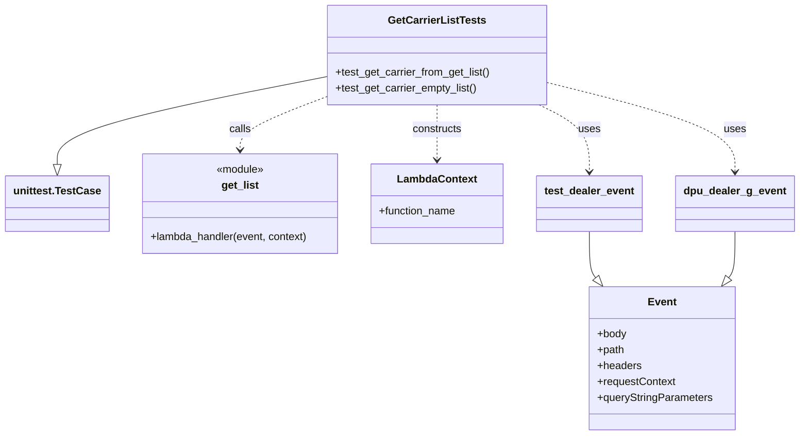

# Diagram: entity_core/entity_search/entity_search_tests/test_get_carrier_list.py


> Auto-generated by Obscura crawlers

## Diagram 1



### SVG

<svg id="container" width="1192.3359375" xmlns="http://www.w3.org/2000/svg" class="classDiagram" height="656" viewBox="0 0 1192.3359375 656" role="graphics-document document" aria-roledescription="class"><style>#container{font-family:"trebuchet ms",verdana,arial,sans-serif;font-size:16px;fill:#333;}@keyframes edge-animation-frame{from{stroke-dashoffset:0;}}@keyframes dash{to{stroke-dashoffset:0;}}#container .edge-animation-slow{stroke-dasharray:9,5!important;stroke-dashoffset:900;animation:dash 50s linear infinite;stroke-linecap:round;}#container .edge-animation-fast{stroke-dasharray:9,5!important;stroke-dashoffset:900;animation:dash 20s linear infinite;stroke-linecap:round;}#container .error-icon{fill:#552222;}#container .error-text{fill:#552222;stroke:#552222;}#container .edge-thickness-normal{stroke-width:1px;}#container .edge-thickness-thick{stroke-width:3.5px;}#container .edge-pattern-solid{stroke-dasharray:0;}#container .edge-thickness-invisible{stroke-width:0;fill:none;}#container .edge-pattern-dashed{stroke-dasharray:3;}#container .edge-pattern-dotted{stroke-dasharray:2;}#container .marker{fill:#333333;stroke:#333333;}#container .marker.cross{stroke:#333333;}#container svg{font-family:"trebuchet ms",verdana,arial,sans-serif;font-size:16px;}#container p{margin:0;}#container g.classGroup text{fill:#9370DB;stroke:none;font-family:"trebuchet ms",verdana,arial,sans-serif;font-size:10px;}#container g.classGroup text .title{font-weight:bolder;}#container .nodeLabel,#container .edgeLabel{color:#131300;}#container .edgeLabel .label rect{fill:#ECECFF;}#container .label text{fill:#131300;}#container .labelBkg{background:#ECECFF;}#container .edgeLabel .label span{background:#ECECFF;}#container .classTitle{font-weight:bolder;}#container .node rect,#container .node circle,#container .node ellipse,#container .node polygon,#container .node path{fill:#ECECFF;stroke:#9370DB;stroke-width:1px;}#container .divider{stroke:#9370DB;stroke-width:1;}#container g.clickable{cursor:pointer;}#container g.classGroup rect{fill:#ECECFF;stroke:#9370DB;}#container g.classGroup line{stroke:#9370DB;stroke-width:1;}#container .classLabel .box{stroke:none;stroke-width:0;fill:#ECECFF;opacity:0.5;}#container .classLabel .label{fill:#9370DB;font-size:10px;}#container .relation{stroke:#333333;stroke-width:1;fill:none;}#container .dashed-line{stroke-dasharray:3;}#container .dotted-line{stroke-dasharray:1 2;}#container #compositionStart,#container .composition{fill:#333333!important;stroke:#333333!important;stroke-width:1;}#container #compositionEnd,#container .composition{fill:#333333!important;stroke:#333333!important;stroke-width:1;}#container #dependencyStart,#container .dependency{fill:#333333!important;stroke:#333333!important;stroke-width:1;}#container #dependencyStart,#container .dependency{fill:#333333!important;stroke:#333333!important;stroke-width:1;}#container #extensionStart,#container .extension{fill:transparent!important;stroke:#333333!important;stroke-width:1;}#container #extensionEnd,#container .extension{fill:transparent!important;stroke:#333333!important;stroke-width:1;}#container #aggregationStart,#container .aggregation{fill:transparent!important;stroke:#333333!important;stroke-width:1;}#container #aggregationEnd,#container .aggregation{fill:transparent!important;stroke:#333333!important;stroke-width:1;}#container #lollipopStart,#container .lollipop{fill:#ECECFF!important;stroke:#333333!important;stroke-width:1;}#container #lollipopEnd,#container .lollipop{fill:#ECECFF!important;stroke:#333333!important;stroke-width:1;}#container .edgeTerminals{font-size:11px;line-height:initial;}#container .classTitleText{text-anchor:middle;font-size:18px;fill:#333;}#container .label-icon{display:inline-block;height:1em;overflow:visible;vertical-align:-0.125em;}#container .node .label-icon path{fill:currentColor;stroke:revert;stroke-width:revert;}#container :root{--mermaid-font-family:"trebuchet ms",verdana,arial,sans-serif;}</style><g><defs><marker id="container_class-aggregationStart" class="marker aggregation class" refX="18" refY="7" markerWidth="190" markerHeight="240" orient="auto"><path d="M 18,7 L9,13 L1,7 L9,1 Z"></path></marker></defs><defs><marker id="container_class-aggregationEnd" class="marker aggregation class" refX="1" refY="7" markerWidth="20" markerHeight="28" orient="auto"><path d="M 18,7 L9,13 L1,7 L9,1 Z"></path></marker></defs><defs><marker id="container_class-extensionStart" class="marker extension class" refX="18" refY="7" markerWidth="190" markerHeight="240" orient="auto"><path d="M 1,7 L18,13 V 1 Z"></path></marker></defs><defs><marker id="container_class-extensionEnd" class="marker extension class" refX="1" refY="7" markerWidth="20" markerHeight="28" orient="auto"><path d="M 1,1 V 13 L18,7 Z"></path></marker></defs><defs><marker id="container_class-compositionStart" class="marker composition class" refX="18" refY="7" markerWidth="190" markerHeight="240" orient="auto"><path d="M 18,7 L9,13 L1,7 L9,1 Z"></path></marker></defs><defs><marker id="container_class-compositionEnd" class="marker composition class" refX="1" refY="7" markerWidth="20" markerHeight="28" orient="auto"><path d="M 18,7 L9,13 L1,7 L9,1 Z"></path></marker></defs><defs><marker id="container_class-dependencyStart" class="marker dependency class" refX="6" refY="7" markerWidth="190" markerHeight="240" orient="auto"><path d="M 5,7 L9,13 L1,7 L9,1 Z"></path></marker></defs><defs><marker id="container_class-dependencyEnd" class="marker dependency class" refX="13" refY="7" markerWidth="20" markerHeight="28" orient="auto"><path d="M 18,7 L9,13 L14,7 L9,1 Z"></path></marker></defs><defs><marker id="container_class-lollipopStart" class="marker lollipop class" refX="13" refY="7" markerWidth="190" markerHeight="240" orient="auto"><circle stroke="black" fill="transparent" cx="7" cy="7" r="6"></circle></marker></defs><defs><marker id="container_class-lollipopEnd" class="marker lollipop class" refX="1" refY="7" markerWidth="190" markerHeight="240" orient="auto"><circle stroke="black" fill="transparent" cx="7" cy="7" r="6"></circle></marker></defs><g class="root"><g class="clusters"></g><g class="edgePaths"><path d="M492.746,115.103L424.407,128.419C356.068,141.735,219.389,168.368,151.05,190.475C82.711,212.583,82.711,230.167,82.711,238.958L82.711,247.75" id="id_GetCarrierListTests_unittest.TestCase_1" class="edge-thickness-normal edge-pattern-solid relation" style=";;;" data-edge="true" data-et="edge" data-id="id_GetCarrierListTests_unittest.TestCase_1" data-points="W3sieCI6NDkyLjc0NjA5Mzc1LCJ5IjoxMTUuMTAyOTcyNTU3ODY3N30seyJ4Ijo4Mi43MTA5Mzc1LCJ5IjoxOTV9LHsieCI6ODIuNzEwOTM3NSwieSI6MjY1fV0=" marker-end="url(#container_class-extensionEnd)"></path><path d="M492.746,144.573L470.258,152.978C447.77,161.382,402.793,178.191,380.305,191.762C357.816,205.333,357.816,215.667,357.816,220.833L357.816,226" id="id_GetCarrierListTests_get_list_2" class="edge-thickness-normal edge-pattern-dashed relation" style=";;;" data-edge="true" data-et="edge" data-id="id_GetCarrierListTests_get_list_2" data-points="W3sieCI6NDkyLjc0NjA5Mzc1LCJ5IjoxNDQuNTczMDY1MzQyMzUzMjZ9LHsieCI6MzU3LjgxNjQwNjI1LCJ5IjoxOTV9LHsieCI6MzU3LjgxNjQwNjI1LCJ5IjoyMzJ9XQ==" marker-end="url(#container_class-dependencyEnd)"></path><path d="M657.5,158L657.5,164.167C657.5,170.333,657.5,182.667,657.5,196.5C657.5,210.333,657.5,225.667,657.5,233.333L657.5,241" id="id_GetCarrierListTests_LambdaContext_3" class="edge-thickness-normal edge-pattern-dashed relation" style=";;;" data-edge="true" data-et="edge" data-id="id_GetCarrierListTests_LambdaContext_3" data-points="W3sieCI6NjU3LjUsInkiOjE1OH0seyJ4Ijo2NTcuNSwieSI6MTk1fSx7IngiOjY1Ny41LCJ5IjoyNDd9XQ==" marker-end="url(#container_class-dependencyEnd)"></path><path d="M884.375,349L884.375,358.667C884.375,368.333,884.375,387.667,885.923,399.259C887.47,410.851,890.565,414.703,892.113,416.628L893.661,418.554" id="id_test_dealer_event_Event_4" class="edge-thickness-normal edge-pattern-solid relation" style=";;;" data-edge="true" data-et="edge" data-id="id_test_dealer_event_Event_4" data-points="W3sieCI6ODg0LjM3NSwieSI6MzQ5fSx7IngiOjg4NC4zNzUsInkiOjQwN30seyJ4Ijo5MDQuNDY2NDg4NDg2ODQyMSwieSI6NDMyfV0=" marker-end="url(#container_class-extensionEnd)"></path><path d="M1098.148,349L1098.148,358.667C1098.148,368.333,1098.148,387.667,1096.601,399.259C1095.053,410.851,1091.958,414.703,1090.411,416.628L1088.863,418.554" id="id_dpu_dealer_g_event_Event_5" class="edge-thickness-normal edge-pattern-solid relation" style=";;;" data-edge="true" data-et="edge" data-id="id_dpu_dealer_g_event_Event_5" data-points="W3sieCI6MTA5OC4xNDg0Mzc1LCJ5IjozNDl9LHsieCI6MTA5OC4xNDg0Mzc1LCJ5Ijo0MDd9LHsieCI6MTA3OC4wNTY5NDkwMTMxNTgsInkiOjQzMn1d" marker-end="url(#container_class-extensionEnd)"></path><path d="M809.425,158L821.917,164.167C834.408,170.333,859.392,182.667,871.883,199.5C884.375,216.333,884.375,237.667,884.375,248.333L884.375,259" id="id_GetCarrierListTests_test_dealer_event_6" class="edge-thickness-normal edge-pattern-dashed relation" style=";;;" data-edge="true" data-et="edge" data-id="id_GetCarrierListTests_test_dealer_event_6" data-points="W3sieCI6ODA5LjQyNTIyMzIxNDI4NTgsInkiOjE1OH0seyJ4Ijo4ODQuMzc1LCJ5IjoxOTV9LHsieCI6ODg0LjM3NSwieSI6MjY1fV0=" marker-end="url(#container_class-dependencyEnd)"></path><path d="M822.254,124.876L868.236,136.563C914.219,148.25,1006.184,171.625,1052.166,193.979C1098.148,216.333,1098.148,237.667,1098.148,248.333L1098.148,259" id="id_GetCarrierListTests_dpu_dealer_g_event_7" class="edge-thickness-normal edge-pattern-dashed relation" style=";;;" data-edge="true" data-et="edge" data-id="id_GetCarrierListTests_dpu_dealer_g_event_7" data-points="W3sieCI6ODIyLjI1MzkwNjI1LCJ5IjoxMjQuODc1NjQ0OTEyNTA0NjV9LHsieCI6MTA5OC4xNDg0Mzc1LCJ5IjoxOTV9LHsieCI6MTA5OC4xNDg0Mzc1LCJ5IjoyNjV9XQ==" marker-end="url(#container_class-dependencyEnd)"></path></g><g class="edgeLabels"><g class="edgeLabel"><g class="label" data-id="id_GetCarrierListTests_unittest.TestCase_1" transform="translate(0, 0)"><foreignObject width="0" height="0"><div xmlns="http://www.w3.org/1999/xhtml" class="labelBkg" style="display: table-cell; white-space: nowrap; line-height: 1.5; max-width: 200px; text-align: center;"><span class="edgeLabel"></span></div></foreignObject></g></g><g class="edgeLabel" transform="translate(357.81640625, 195)"><g class="label" data-id="id_GetCarrierListTests_get_list_2" transform="translate(-16.4453125, -12)"><foreignObject width="32.890625" height="24"><div xmlns="http://www.w3.org/1999/xhtml" class="labelBkg" style="display: table-cell; white-space: nowrap; line-height: 1.5; max-width: 200px; text-align: center;"><span class="edgeLabel"><p>calls</p></span></div></foreignObject></g></g><g class="edgeLabel" transform="translate(657.5, 195)"><g class="label" data-id="id_GetCarrierListTests_LambdaContext_3" transform="translate(-37.84375, -12)"><foreignObject width="75.6875" height="24"><div xmlns="http://www.w3.org/1999/xhtml" class="labelBkg" style="display: table-cell; white-space: nowrap; line-height: 1.5; max-width: 200px; text-align: center;"><span class="edgeLabel"><p>constructs</p></span></div></foreignObject></g></g><g class="edgeLabel"><g class="label" data-id="id_test_dealer_event_Event_4" transform="translate(0, 0)"><foreignObject width="0" height="0"><div xmlns="http://www.w3.org/1999/xhtml" class="labelBkg" style="display: table-cell; white-space: nowrap; line-height: 1.5; max-width: 200px; text-align: center;"><span class="edgeLabel"></span></div></foreignObject></g></g><g class="edgeLabel"><g class="label" data-id="id_dpu_dealer_g_event_Event_5" transform="translate(0, 0)"><foreignObject width="0" height="0"><div xmlns="http://www.w3.org/1999/xhtml" class="labelBkg" style="display: table-cell; white-space: nowrap; line-height: 1.5; max-width: 200px; text-align: center;"><span class="edgeLabel"></span></div></foreignObject></g></g><g class="edgeLabel" transform="translate(884.375, 195)"><g class="label" data-id="id_GetCarrierListTests_test_dealer_event_6" transform="translate(-16.4921875, -12)"><foreignObject width="32.984375" height="24"><div xmlns="http://www.w3.org/1999/xhtml" class="labelBkg" style="display: table-cell; white-space: nowrap; line-height: 1.5; max-width: 200px; text-align: center;"><span class="edgeLabel"><p>uses</p></span></div></foreignObject></g></g><g class="edgeLabel" transform="translate(1098.1484375, 195)"><g class="label" data-id="id_GetCarrierListTests_dpu_dealer_g_event_7" transform="translate(-16.4921875, -12)"><foreignObject width="32.984375" height="24"><div xmlns="http://www.w3.org/1999/xhtml" class="labelBkg" style="display: table-cell; white-space: nowrap; line-height: 1.5; max-width: 200px; text-align: center;"><span class="edgeLabel"><p>uses</p></span></div></foreignObject></g></g></g><g class="nodes"><g class="node default" id="classId-GetCarrierListTests-0" transform="translate(657.5, 83)"><g class="basic label-container"><path d="M-164.75390625 -75 L164.75390625 -75 L164.75390625 75 L-164.75390625 75" stroke="none" stroke-width="0" fill="#ECECFF" style=""></path><path d="M-164.75390625 -75 C-67.4476056923194 -75, 29.8586948653612 -75, 164.75390625 -75 M-164.75390625 -75 C-57.36791233265029 -75, 50.01808158469942 -75, 164.75390625 -75 M164.75390625 -75 C164.75390625 -39.41818130772774, 164.75390625 -3.836362615455485, 164.75390625 75 M164.75390625 -75 C164.75390625 -28.213229974543317, 164.75390625 18.573540050913365, 164.75390625 75 M164.75390625 75 C48.93832282329362 75, -66.87726060341276 75, -164.75390625 75 M164.75390625 75 C57.15274925664174 75, -50.44840773671652 75, -164.75390625 75 M-164.75390625 75 C-164.75390625 27.466723986542327, -164.75390625 -20.066552026915346, -164.75390625 -75 M-164.75390625 75 C-164.75390625 25.55433126530459, -164.75390625 -23.89133746939082, -164.75390625 -75" stroke="#9370DB" stroke-width="1.3" fill="none" stroke-dasharray="0 0" style=""></path></g><g class="annotation-group text" transform="translate(0, -51)"></g><g class="label-group text" transform="translate(-70.2890625, -51)"><g class="label" style="font-weight: bolder" transform="translate(0,-12)"><foreignObject width="140.578125" height="24"><div xmlns="http://www.w3.org/1999/xhtml" style="display: table-cell; white-space: nowrap; line-height: 1.5; max-width: 186px; text-align: center;"><span class="nodeLabel markdown-node-label" style=""><p>GetCarrierListTests</p></span></div></foreignObject></g></g><g class="members-group text" transform="translate(-152.75390625, -3)"></g><g class="methods-group text" transform="translate(-152.75390625, 27)"><g class="label" style="" transform="translate(0,-12)"><foreignObject width="235.21875" height="24"><div xmlns="http://www.w3.org/1999/xhtml" style="display: table-cell; white-space: nowrap; line-height: 1.5; max-width: 293px; text-align: center;"><span class="nodeLabel markdown-node-label" style=""><p>+test_get_carrier_from_get_list()</p></span></div></foreignObject></g><g class="label" style="" transform="translate(0,12)"><foreignObject width="215.109375" height="24"><div xmlns="http://www.w3.org/1999/xhtml" style="display: table-cell; white-space: nowrap; line-height: 1.5; max-width: 272px; text-align: center;"><span class="nodeLabel markdown-node-label" style=""><p>+test_get_carrier_empty_list()</p></span></div></foreignObject></g></g><g class="divider" style=""><path d="M-164.75390625 -27 C-93.45803390031334 -27, -22.162161550626678 -27, 164.75390625 -27 M-164.75390625 -27 C-53.56973376424796 -27, 57.61443872150409 -27, 164.75390625 -27" stroke="#9370DB" stroke-width="1.3" fill="none" stroke-dasharray="0 0" style=""></path></g><g class="divider" style=""><path d="M-164.75390625 -3 C-40.351290402108845 -3, 84.05132544578231 -3, 164.75390625 -3 M-164.75390625 -3 C-66.51503042117716 -3, 31.723845407645683 -3, 164.75390625 -3" stroke="#9370DB" stroke-width="1.3" fill="none" stroke-dasharray="0 0" style=""></path></g></g><g class="node default" id="classId-unittest.TestCase-1" transform="translate(82.7109375, 307)"><g class="basic label-container"><path d="M-74.7109375 -42 L74.7109375 -42 L74.7109375 42 L-74.7109375 42" stroke="none" stroke-width="0" fill="#ECECFF" style=""></path><path d="M-74.7109375 -42 C-40.51849236315518 -42, -6.326047226310365 -42, 74.7109375 -42 M-74.7109375 -42 C-37.69847135362797 -42, -0.6860052072559455 -42, 74.7109375 -42 M74.7109375 -42 C74.7109375 -12.64884486430702, 74.7109375 16.70231027138596, 74.7109375 42 M74.7109375 -42 C74.7109375 -11.098731245916593, 74.7109375 19.802537508166814, 74.7109375 42 M74.7109375 42 C23.509522402567015 42, -27.69189269486597 42, -74.7109375 42 M74.7109375 42 C39.38310232127294 42, 4.055267142545887 42, -74.7109375 42 M-74.7109375 42 C-74.7109375 14.680788629651083, -74.7109375 -12.638422740697834, -74.7109375 -42 M-74.7109375 42 C-74.7109375 11.615708981557923, -74.7109375 -18.768582036884155, -74.7109375 -42" stroke="#9370DB" stroke-width="1.3" fill="none" stroke-dasharray="0 0" style=""></path></g><g class="annotation-group text" transform="translate(0, -18)"></g><g class="label-group text" transform="translate(-62.7109375, -18)"><g class="label" style="font-weight: bolder" transform="translate(0,-12)"><foreignObject width="125.421875" height="24"><div xmlns="http://www.w3.org/1999/xhtml" style="display: table-cell; white-space: nowrap; line-height: 1.5; max-width: 172px; text-align: center;"><span class="nodeLabel markdown-node-label" style=""><p>unittest.TestCase</p></span></div></foreignObject></g></g><g class="members-group text" transform="translate(-62.7109375, 30)"></g><g class="methods-group text" transform="translate(-62.7109375, 60)"></g><g class="divider" style=""><path d="M-74.7109375 6 C-24.855610847764268 6, 24.999715804471464 6, 74.7109375 6 M-74.7109375 6 C-24.819133588694534 6, 25.072670322610932 6, 74.7109375 6" stroke="#9370DB" stroke-width="1.3" fill="none" stroke-dasharray="0 0" style=""></path></g><g class="divider" style=""><path d="M-74.7109375 24 C-34.2967543430827 24, 6.117428813834593 24, 74.7109375 24 M-74.7109375 24 C-27.10858915976476 24, 20.493759180470477 24, 74.7109375 24" stroke="#9370DB" stroke-width="1.3" fill="none" stroke-dasharray="0 0" style=""></path></g></g><g class="node default" id="classId-get_list-2" transform="translate(357.81640625, 307)"><g class="basic label-container"><path d="M-150.39453125 -75 L150.39453125 -75 L150.39453125 75 L-150.39453125 75" stroke="none" stroke-width="0" fill="#ECECFF" style=""></path><path d="M-150.39453125 -75 C-70.11368792265674 -75, 10.167155404686525 -75, 150.39453125 -75 M-150.39453125 -75 C-62.58638438347435 -75, 25.221762483051293 -75, 150.39453125 -75 M150.39453125 -75 C150.39453125 -26.675745191105214, 150.39453125 21.64850961778957, 150.39453125 75 M150.39453125 -75 C150.39453125 -27.14007668837541, 150.39453125 20.719846623249182, 150.39453125 75 M150.39453125 75 C84.7408947603267 75, 19.087258270653393 75, -150.39453125 75 M150.39453125 75 C85.7504576038992 75, 21.106383957798414 75, -150.39453125 75 M-150.39453125 75 C-150.39453125 21.14389949003604, -150.39453125 -32.71220101992792, -150.39453125 -75 M-150.39453125 75 C-150.39453125 32.94839138255449, -150.39453125 -9.10321723489102, -150.39453125 -75" stroke="#9370DB" stroke-width="1.3" fill="none" stroke-dasharray="0 0" style=""></path></g><g class="annotation-group text" transform="translate(-36.6015625, -51)"><g class="label" style="" transform="translate(0,-12)"><foreignObject width="73.203125" height="24"><div xmlns="http://www.w3.org/1999/xhtml" style="display: table-cell; white-space: nowrap; line-height: 1.5; max-width: 123px; text-align: center;"><span class="nodeLabel markdown-node-label" style=""><p>«module»</p></span></div></foreignObject></g></g><g class="label-group text" transform="translate(-27.40625, -27)"><g class="label" style="font-weight: bolder" transform="translate(0,-12)"><foreignObject width="54.8125" height="24"><div xmlns="http://www.w3.org/1999/xhtml" style="display: table-cell; white-space: nowrap; line-height: 1.5; max-width: 103px; text-align: center;"><span class="nodeLabel markdown-node-label" style=""><p>get_list</p></span></div></foreignObject></g></g><g class="members-group text" transform="translate(-138.39453125, 21)"></g><g class="methods-group text" transform="translate(-138.39453125, 51)"><g class="label" style="" transform="translate(0,-12)"><foreignObject width="240.1875" height="24"><div xmlns="http://www.w3.org/1999/xhtml" style="display: table-cell; white-space: nowrap; line-height: 1.5; max-width: 298px; text-align: center;"><span class="nodeLabel markdown-node-label" style=""><p>+lambda_handler(event, context)</p></span></div></foreignObject></g></g><g class="divider" style=""><path d="M-150.39453125 -3 C-80.01843181789955 -3, -9.642332385799108 -3, 150.39453125 -3 M-150.39453125 -3 C-31.848758178930694 -3, 86.69701489213861 -3, 150.39453125 -3" stroke="#9370DB" stroke-width="1.3" fill="none" stroke-dasharray="0 0" style=""></path></g><g class="divider" style=""><path d="M-150.39453125 21 C-34.091832750748196 21, 82.21086574850361 21, 150.39453125 21 M-150.39453125 21 C-46.4524201118132 21, 57.489691026373606 21, 150.39453125 21" stroke="#9370DB" stroke-width="1.3" fill="none" stroke-dasharray="0 0" style=""></path></g></g><g class="node default" id="classId-LambdaContext-3" transform="translate(657.5, 307)"><g class="basic label-container"><path d="M-99.2890625 -60 L99.2890625 -60 L99.2890625 60 L-99.2890625 60" stroke="none" stroke-width="0" fill="#ECECFF" style=""></path><path d="M-99.2890625 -60 C-20.69849410238315 -60, 57.8920742952337 -60, 99.2890625 -60 M-99.2890625 -60 C-32.815391470615 -60, 33.658279558770005 -60, 99.2890625 -60 M99.2890625 -60 C99.2890625 -17.03885410251131, 99.2890625 25.922291794977383, 99.2890625 60 M99.2890625 -60 C99.2890625 -19.64038578642416, 99.2890625 20.719228427151677, 99.2890625 60 M99.2890625 60 C21.742814759832598 60, -55.803432980334804 60, -99.2890625 60 M99.2890625 60 C23.82582511094097 60, -51.63741227811806 60, -99.2890625 60 M-99.2890625 60 C-99.2890625 25.055433431398605, -99.2890625 -9.88913313720279, -99.2890625 -60 M-99.2890625 60 C-99.2890625 22.537208708202456, -99.2890625 -14.925582583595087, -99.2890625 -60" stroke="#9370DB" stroke-width="1.3" fill="none" stroke-dasharray="0 0" style=""></path></g><g class="annotation-group text" transform="translate(0, -36)"></g><g class="label-group text" transform="translate(-57.296875, -36)"><g class="label" style="font-weight: bolder" transform="translate(0,-12)"><foreignObject width="114.59375" height="24"><div xmlns="http://www.w3.org/1999/xhtml" style="display: table-cell; white-space: nowrap; line-height: 1.5; max-width: 163px; text-align: center;"><span class="nodeLabel markdown-node-label" style=""><p>LambdaContext</p></span></div></foreignObject></g></g><g class="members-group text" transform="translate(-87.2890625, 12)"><g class="label" style="" transform="translate(0,-12)"><foreignObject width="117.28125" height="24"><div xmlns="http://www.w3.org/1999/xhtml" style="display: table-cell; white-space: nowrap; line-height: 1.5; max-width: 175px; text-align: center;"><span class="nodeLabel markdown-node-label" style=""><p>+function_name</p></span></div></foreignObject></g></g><g class="methods-group text" transform="translate(-87.2890625, 60)"></g><g class="divider" style=""><path d="M-99.2890625 -12 C-25.930174774229883 -12, 47.428712951540234 -12, 99.2890625 -12 M-99.2890625 -12 C-56.49787668725981 -12, -13.706690874519623 -12, 99.2890625 -12" stroke="#9370DB" stroke-width="1.3" fill="none" stroke-dasharray="0 0" style=""></path></g><g class="divider" style=""><path d="M-99.2890625 36 C-47.663673939343894 36, 3.961714621312211 36, 99.2890625 36 M-99.2890625 36 C-31.799664976680006 36, 35.68973254663999 36, 99.2890625 36" stroke="#9370DB" stroke-width="1.3" fill="none" stroke-dasharray="0 0" style=""></path></g></g><g class="node default" id="classId-Event-4" transform="translate(991.26171875, 540)"><g class="basic label-container"><path d="M-109.13671875 -108 L109.13671875 -108 L109.13671875 108 L-109.13671875 108" stroke="none" stroke-width="0" fill="#ECECFF" style=""></path><path d="M-109.13671875 -108 C-34.167781193726114 -108, 40.80115636254777 -108, 109.13671875 -108 M-109.13671875 -108 C-26.83004817702293 -108, 55.47662239595414 -108, 109.13671875 -108 M109.13671875 -108 C109.13671875 -28.2211677478071, 109.13671875 51.5576645043858, 109.13671875 108 M109.13671875 -108 C109.13671875 -25.952122994324725, 109.13671875 56.09575401135055, 109.13671875 108 M109.13671875 108 C33.30842625530208 108, -42.51986623939584 108, -109.13671875 108 M109.13671875 108 C54.55183850197512 108, -0.0330417460497614 108, -109.13671875 108 M-109.13671875 108 C-109.13671875 59.5856483734946, -109.13671875 11.1712967469892, -109.13671875 -108 M-109.13671875 108 C-109.13671875 63.655091872897295, -109.13671875 19.31018374579459, -109.13671875 -108" stroke="#9370DB" stroke-width="1.3" fill="none" stroke-dasharray="0 0" style=""></path></g><g class="annotation-group text" transform="translate(0, -84)"></g><g class="label-group text" transform="translate(-20.2109375, -84)"><g class="label" style="font-weight: bolder" transform="translate(0,-12)"><foreignObject width="40.421875" height="24"><div xmlns="http://www.w3.org/1999/xhtml" style="display: table-cell; white-space: nowrap; line-height: 1.5; max-width: 90px; text-align: center;"><span class="nodeLabel markdown-node-label" style=""><p>Event</p></span></div></foreignObject></g></g><g class="members-group text" transform="translate(-97.13671875, -36)"><g class="label" style="" transform="translate(0,-12)"><foreignObject width="44.28125" height="24"><div xmlns="http://www.w3.org/1999/xhtml" style="display: table-cell; white-space: nowrap; line-height: 1.5; max-width: 102px; text-align: center;"><span class="nodeLabel markdown-node-label" style=""><p>+body</p></span></div></foreignObject></g><g class="label" style="" transform="translate(0,12)"><foreignObject width="41.1875" height="24"><div xmlns="http://www.w3.org/1999/xhtml" style="display: table-cell; white-space: nowrap; line-height: 1.5; max-width: 99px; text-align: center;"><span class="nodeLabel markdown-node-label" style=""><p>+path</p></span></div></foreignObject></g><g class="label" style="" transform="translate(0,36)"><foreignObject width="66.328125" height="24"><div xmlns="http://www.w3.org/1999/xhtml" style="display: table-cell; white-space: nowrap; line-height: 1.5; max-width: 124px; text-align: center;"><span class="nodeLabel markdown-node-label" style=""><p>+headers</p></span></div></foreignObject></g><g class="label" style="" transform="translate(0,60)"><foreignObject width="118.265625" height="24"><div xmlns="http://www.w3.org/1999/xhtml" style="display: table-cell; white-space: nowrap; line-height: 1.5; max-width: 176px; text-align: center;"><span class="nodeLabel markdown-node-label" style=""><p>+requestContext</p></span></div></foreignObject></g><g class="label" style="" transform="translate(0,84)"><foreignObject width="174.0625" height="24"><div xmlns="http://www.w3.org/1999/xhtml" style="display: table-cell; white-space: nowrap; line-height: 1.5; max-width: 231px; text-align: center;"><span class="nodeLabel markdown-node-label" style=""><p>+queryStringParameters</p></span></div></foreignObject></g></g><g class="methods-group text" transform="translate(-97.13671875, 108)"></g><g class="divider" style=""><path d="M-109.13671875 -60 C-44.05957594603322 -60, 21.01756685793356 -60, 109.13671875 -60 M-109.13671875 -60 C-32.28808277053082 -60, 44.56055320893836 -60, 109.13671875 -60" stroke="#9370DB" stroke-width="1.3" fill="none" stroke-dasharray="0 0" style=""></path></g><g class="divider" style=""><path d="M-109.13671875 84 C-37.55793142246341 84, 34.02085590507318 84, 109.13671875 84 M-109.13671875 84 C-23.981794440697286 84, 61.17312986860543 84, 109.13671875 84" stroke="#9370DB" stroke-width="1.3" fill="none" stroke-dasharray="0 0" style=""></path></g></g><g class="node default" id="classId-test_dealer_event-5" transform="translate(884.375, 307)"><g class="basic label-container"><path d="M-77.5859375 -42 L77.5859375 -42 L77.5859375 42 L-77.5859375 42" stroke="none" stroke-width="0" fill="#ECECFF" style=""></path><path d="M-77.5859375 -42 C-18.130816403928684 -42, 41.32430469214263 -42, 77.5859375 -42 M-77.5859375 -42 C-29.321551442681788 -42, 18.942834614636425 -42, 77.5859375 -42 M77.5859375 -42 C77.5859375 -19.68854052438411, 77.5859375 2.6229189512317816, 77.5859375 42 M77.5859375 -42 C77.5859375 -14.848847741877492, 77.5859375 12.302304516245016, 77.5859375 42 M77.5859375 42 C31.75935228840828 42, -14.06723292318344 42, -77.5859375 42 M77.5859375 42 C20.9718984406814 42, -35.6421406186372 42, -77.5859375 42 M-77.5859375 42 C-77.5859375 22.414744740825732, -77.5859375 2.829489481651464, -77.5859375 -42 M-77.5859375 42 C-77.5859375 10.562436305124486, -77.5859375 -20.87512738975103, -77.5859375 -42" stroke="#9370DB" stroke-width="1.3" fill="none" stroke-dasharray="0 0" style=""></path></g><g class="annotation-group text" transform="translate(0, -18)"></g><g class="label-group text" transform="translate(-65.5859375, -18)"><g class="label" style="font-weight: bolder" transform="translate(0,-12)"><foreignObject width="131.171875" height="24"><div xmlns="http://www.w3.org/1999/xhtml" style="display: table-cell; white-space: nowrap; line-height: 1.5; max-width: 179px; text-align: center;"><span class="nodeLabel markdown-node-label" style=""><p>test_dealer_event</p></span></div></foreignObject></g></g><g class="members-group text" transform="translate(-65.5859375, 30)"></g><g class="methods-group text" transform="translate(-65.5859375, 60)"></g><g class="divider" style=""><path d="M-77.5859375 6 C-36.06444055746065 6, 5.457056385078701 6, 77.5859375 6 M-77.5859375 6 C-24.300001258880727 6, 28.985934982238547 6, 77.5859375 6" stroke="#9370DB" stroke-width="1.3" fill="none" stroke-dasharray="0 0" style=""></path></g><g class="divider" style=""><path d="M-77.5859375 24 C-39.256062219446655 24, -0.9261869388933093 24, 77.5859375 24 M-77.5859375 24 C-35.82894345065628 24, 5.928050598687435 24, 77.5859375 24" stroke="#9370DB" stroke-width="1.3" fill="none" stroke-dasharray="0 0" style=""></path></g></g><g class="node default" id="classId-dpu_dealer_g_event-6" transform="translate(1098.1484375, 307)"><g class="basic label-container"><path d="M-86.1875 -42 L86.1875 -42 L86.1875 42 L-86.1875 42" stroke="none" stroke-width="0" fill="#ECECFF" style=""></path><path d="M-86.1875 -42 C-21.389673147477552 -42, 43.408153705044896 -42, 86.1875 -42 M-86.1875 -42 C-47.6380719966916 -42, -9.0886439933832 -42, 86.1875 -42 M86.1875 -42 C86.1875 -11.457709907058561, 86.1875 19.084580185882878, 86.1875 42 M86.1875 -42 C86.1875 -13.414598648526077, 86.1875 15.170802702947846, 86.1875 42 M86.1875 42 C39.53306192271184 42, -7.121376154576325 42, -86.1875 42 M86.1875 42 C31.199239821996372 42, -23.789020356007256 42, -86.1875 42 M-86.1875 42 C-86.1875 23.273911034532293, -86.1875 4.547822069064587, -86.1875 -42 M-86.1875 42 C-86.1875 11.844246214568177, -86.1875 -18.311507570863647, -86.1875 -42" stroke="#9370DB" stroke-width="1.3" fill="none" stroke-dasharray="0 0" style=""></path></g><g class="annotation-group text" transform="translate(0, -18)"></g><g class="label-group text" transform="translate(-74.1875, -18)"><g class="label" style="font-weight: bolder" transform="translate(0,-12)"><foreignObject width="148.375" height="24"><div xmlns="http://www.w3.org/1999/xhtml" style="display: table-cell; white-space: nowrap; line-height: 1.5; max-width: 197px; text-align: center;"><span class="nodeLabel markdown-node-label" style=""><p>dpu_dealer_g_event</p></span></div></foreignObject></g></g><g class="members-group text" transform="translate(-74.1875, 30)"></g><g class="methods-group text" transform="translate(-74.1875, 60)"></g><g class="divider" style=""><path d="M-86.1875 6 C-33.57554398501376 6, 19.03641202997248 6, 86.1875 6 M-86.1875 6 C-35.95203630970012 6, 14.283427380599761 6, 86.1875 6" stroke="#9370DB" stroke-width="1.3" fill="none" stroke-dasharray="0 0" style=""></path></g><g class="divider" style=""><path d="M-86.1875 24 C-36.67678202096992 24, 12.833935958060167 24, 86.1875 24 M-86.1875 24 C-33.13029174673979 24, 19.926916506520413 24, 86.1875 24" stroke="#9370DB" stroke-width="1.3" fill="none" stroke-dasharray="0 0" style=""></path></g></g></g></g></g></svg>

## Diagram 2

```mermaid
flowchart LR
Start([Start Tests]) --> T1[test_get_carrier_from_get_list]
T1 --> Call1[call get_list.lambda_handler(test_dealer_event, LambdaContext)]
Call1 --> Check1{statusCode == "200" && "FV0834338A" in body}
Check1 -->|pass| Success1[Assertion Passed]
Check1 -->|fail| Fail1[Assertion Failed]
Start --> T2[test_get_carrier_empty_list]
T2 --> Call2[call get_list.lambda_handler(dpu_dealer_g_event, LambdaContext)]
Call2 --> Check2{statusCode == "200" && body == '{"carriers": []}'}
Check2 -->|pass| Success2[Assertion Passed]
Check2 -->|fail| Fail2[Assertion Failed]
Success1 --> End([Tests Complete])
Success2 --> End
Fail1 --> End
Fail2 --> End
```

> SVG rendering failed for this diagram.
