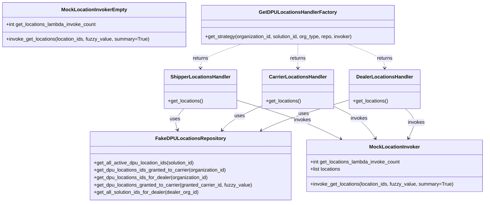
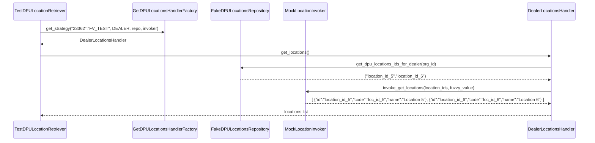

# Diagram: entity_core/entity_search/entity_search_tests/test_get_dpu_locations.py

> Auto-generated by Obscura crawlers

## Diagram 1

### SVG

<svg id="container" width="1565.82421875" xmlns="http://www.w3.org/2000/svg" class="classDiagram" height="656" viewBox="0 0 1565.82421875 656" role="graphics-document document" aria-roledescription="class"><g><defs><marker id="container_class-aggregationStart" class="marker aggregation class" refX="18" refY="7" markerWidth="190" markerHeight="240" orient="auto"><path d="M 18,7 L9,13 L1,7 L9,1 Z"></path></marker></defs><defs><marker id="container_class-aggregationEnd" class="marker aggregation class" refX="1" refY="7" markerWidth="20" markerHeight="28" orient="auto"><path d="M 18,7 L9,13 L1,7 L9,1 Z"></path></marker></defs><defs><marker id="container_class-extensionStart" class="marker extension class" refX="18" refY="7" markerWidth="190" markerHeight="240" orient="auto"><path d="M 1,7 L18,13 V 1 Z"></path></marker></defs><defs><marker id="container_class-extensionEnd" class="marker extension class" refX="1" refY="7" markerWidth="20" markerHeight="28" orient="auto"><path d="M 1,1 V 13 L18,7 Z"></path></marker></defs><defs><marker id="container_class-compositionStart" class="marker composition class" refX="18" refY="7" markerWidth="190" markerHeight="240" orient="auto"><path d="M 18,7 L9,13 L1,7 L9,1 Z"></path></marker></defs><defs><marker id="container_class-compositionEnd" class="marker composition class" refX="1" refY="7" markerWidth="20" markerHeight="28" orient="auto"><path d="M 18,7 L9,13 L1,7 L9,1 Z"></path></marker></defs><defs><marker id="container_class-dependencyStart" class="marker dependency class" refX="6" refY="7" markerWidth="190" markerHeight="240" orient="auto"><path d="M 5,7 L9,13 L1,7 L9,1 Z"></path></marker></defs><defs><marker id="container_class-dependencyEnd" class="marker dependency class" refX="13" refY="7" markerWidth="20" markerHeight="28" orient="auto"><path d="M 18,7 L9,13 L14,7 L9,1 Z"></path></marker></defs><defs><marker id="container_class-lollipopStart" class="marker lollipop class" refX="13" refY="7" markerWidth="190" markerHeight="240" orient="auto"><circle stroke="black" fill="transparent" cx="7" cy="7" r="6"></circle></marker></defs><defs><marker id="container_class-lollipopEnd" class="marker lollipop class" refX="1" refY="7" markerWidth="190" markerHeight="240" orient="auto"><circle stroke="black" fill="transparent" cx="7" cy="7" r="6"></circle></marker></defs><g class="root"><g class="clusters"></g><g class="edgePaths"><path d="M593.349,352L588.106,358.167C582.863,364.333,572.377,376.667,569.004,388.059C565.632,399.45,569.373,409.901,571.244,415.126L573.114,420.351" id="id_ShipperLocationsHandler_FakeDPULocationsRepository_1" class="edge-thickness-normal edge-pattern-solid relation" style=";;;" data-edge="true" data-et="edge" data-id="id_ShipperLocationsHandler_FakeDPULocationsRepository_1" data-points="W3sieCI6NTkzLjM0OTI5Njg3NSwieSI6MzUyfSx7IngiOjU2MS44OTA2MjUsInkiOjM4OX0seyJ4Ijo1NzUuMTM2NzE4NzUsInkiOjQyNn1d" marker-end="url(#container_class-dependencyEnd)"></path><path d="M848.469,341.907L831.467,349.756C814.466,357.605,780.464,373.302,758.644,386.571C736.824,399.839,727.188,410.677,722.369,416.097L717.551,421.516" id="id_CarrierLocationsHandler_FakeDPULocationsRepository_2" class="edge-thickness-normal edge-pattern-solid relation" style=";;;" data-edge="true" data-et="edge" data-id="id_CarrierLocationsHandler_FakeDPULocationsRepository_2" data-points="W3sieCI6ODQ4LjQ2ODc1LCJ5IjozNDEuOTA3MDE4NjgyODI0OH0seyJ4Ijo3NDYuNDYwOTM3NSwieSI6Mzg5fSx7IngiOjcxMy41NjQ0NTMxMjUsInkiOjQyNn1d" marker-end="url(#container_class-dependencyEnd)"></path><path d="M1127.672,323.583L1091.761,334.486C1055.85,345.389,984.029,367.194,936.624,383.818C889.22,400.442,866.233,411.884,854.739,417.605L843.245,423.326" id="id_DealerLocationsHandler_FakeDPULocationsRepository_3" class="edge-thickness-normal edge-pattern-solid relation" style=";;;" data-edge="true" data-et="edge" data-id="id_DealerLocationsHandler_FakeDPULocationsRepository_3" data-points="W3sieCI6MTEyNy42NzE4NzUsInkiOjMyMy41ODI5NTI4MzM4ODA5fSx7IngiOjkxMi4yMDcwMzEyNSwieSI6Mzg5fSx7IngiOjgzNy44NzQwMjM0Mzc1LCJ5Ijo0MjZ9XQ==" marker-end="url(#container_class-dependencyEnd)"></path><path d="M763.227,324.314L798.736,335.095C834.246,345.876,905.266,367.438,961.309,388.44C1017.353,409.442,1058.422,429.884,1078.956,440.105L1099.49,450.326" id="id_ShipperLocationsHandler_MockLocationInvoker_4" class="edge-thickness-normal edge-pattern-solid relation" style=";;;" data-edge="true" data-et="edge" data-id="id_ShipperLocationsHandler_MockLocationInvoker_4" data-points="W3sieCI6NzYzLjIyNjU2MjUsInkiOjMyNC4zMTM1MTE3ODI2MzV9LHsieCI6OTc2LjI4NTE1NjI1LCJ5IjozODl9LHsieCI6MTEwNC44NjExNjk3NjM1MTM1LCJ5Ijo0NTN9XQ==" marker-end="url(#container_class-dependencyEnd)"></path><path d="M1077.672,343.865L1093.385,351.388C1109.098,358.91,1140.523,373.955,1162.998,391.32C1185.472,408.685,1198.994,428.37,1205.755,438.212L1212.516,448.054" id="id_CarrierLocationsHandler_MockLocationInvoker_5" class="edge-thickness-normal edge-pattern-solid relation" style=";;;" data-edge="true" data-et="edge" data-id="id_CarrierLocationsHandler_MockLocationInvoker_5" data-points="W3sieCI6MTA3Ny42NzE4NzUsInkiOjM0My44NjUwNzIwOTI0NTc4Nn0seyJ4IjoxMTcxLjk0OTIxODc1LCJ5IjozODl9LHsieCI6MTIxNS45MTM3NDU3NzcwMjcsInkiOjQ1M31d" marker-end="url(#container_class-dependencyEnd)"></path><path d="M1309.121,352L1315.732,358.167C1322.344,364.333,1335.566,376.667,1337.213,392.608C1338.859,408.55,1328.929,428.1,1323.964,437.875L1318.999,447.65" id="id_DealerLocationsHandler_MockLocationInvoker_6" class="edge-thickness-normal edge-pattern-solid relation" style=";;;" data-edge="true" data-et="edge" data-id="id_DealerLocationsHandler_MockLocationInvoker_6" data-points="W3sieCI6MTMwOS4xMjEwMTU2MjUsInkiOjM1Mn0seyJ4IjoxMzQ4Ljc4OTA2MjUsInkiOjM4OX0seyJ4IjoxMzE2LjI4MjMwNTc0MzI0MzMsInkiOjQ1M31d" marker-end="url(#container_class-dependencyEnd)"></path><path d="M780.338,143L758.101,150.667C735.863,158.333,691.389,173.667,669.151,186.5C646.914,199.333,646.914,209.667,646.914,214.833L646.914,220" id="id_GetDPULocationsHandlerFactory_ShipperLocationsHandler_7" class="edge-thickness-normal edge-pattern-dashed relation" style=";;;" data-edge="true" data-et="edge" data-id="id_GetDPULocationsHandlerFactory_ShipperLocationsHandler_7" data-points="W3sieCI6NzgwLjMzNzgwMTAzMjExMDEsInkiOjE0M30seyJ4Ijo2NDYuOTE0MDYyNSwieSI6MTg5fSx7IngiOjY0Ni45MTQwNjI1LCJ5IjoyMjZ9XQ==" marker-end="url(#container_class-dependencyEnd)"></path><path d="M963.07,143L963.07,150.667C963.07,158.333,963.07,173.667,963.07,186.5C963.07,199.333,963.07,209.667,963.07,214.833L963.07,220" id="id_GetDPULocationsHandlerFactory_CarrierLocationsHandler_8" class="edge-thickness-normal edge-pattern-dashed relation" style=";;;" data-edge="true" data-et="edge" data-id="id_GetDPULocationsHandlerFactory_CarrierLocationsHandler_8" data-points="W3sieCI6OTYzLjA3MDMxMjUsInkiOjE0M30seyJ4Ijo5NjMuMDcwMzEyNSwieSI6MTg5fSx7IngiOjk2My4wNzAzMTI1LCJ5IjoyMjZ9XQ==" marker-end="url(#container_class-dependencyEnd)"></path><path d="M1124.043,143L1143.632,150.667C1163.221,158.333,1202.4,173.667,1221.989,186.5C1241.578,199.333,1241.578,209.667,1241.578,214.833L1241.578,220" id="id_GetDPULocationsHandlerFactory_DealerLocationsHandler_9" class="edge-thickness-normal edge-pattern-dashed relation" style=";;;" data-edge="true" data-et="edge" data-id="id_GetDPULocationsHandlerFactory_DealerLocationsHandler_9" data-points="W3sieCI6MTEyNC4wNDI3MTc4ODk5MDgzLCJ5IjoxNDN9LHsieCI6MTI0MS41NzgxMjUsInkiOjE4OX0seyJ4IjoxMjQxLjU3ODEyNSwieSI6MjI2fV0=" marker-end="url(#container_class-dependencyEnd)"></path></g><g class="edgeLabels"><g class="edgeLabel" transform="translate(564.89176, 385.47023)"><g class="label" data-id="id_ShipperLocationsHandler_FakeDPULocationsRepository_1" transform="translate(-16.4921875, -12)"><foreignObject width="32.984375" height="24">

uses

</foreignObject></g></g><g class="edgeLabel" transform="translate(774.98963, 375.82943)"><g class="label" data-id="id_CarrierLocationsHandler_FakeDPULocationsRepository_2" transform="translate(-16.4921875, -12)"><foreignObject width="32.984375" height="24">

uses

</foreignObject></g></g><g class="edgeLabel" transform="translate(980.21377, 368.35255)"><g class="label" data-id="id_DealerLocationsHandler_FakeDPULocationsRepository_3" transform="translate(-16.4921875, -12)"><foreignObject width="32.984375" height="24">

uses

</foreignObject></g></g><g class="edgeLabel" transform="translate(938.47055, 377.51915)"><g class="label" data-id="id_ShipperLocationsHandler_MockLocationInvoker_4" transform="translate(-27.5859375, -12)"><foreignObject width="55.171875" height="24">

invokes

</foreignObject></g></g><g class="edgeLabel" transform="translate(1159.82742, 383.19673)"><g class="label" data-id="id_CarrierLocationsHandler_MockLocationInvoker_5" transform="translate(-27.5859375, -12)"><foreignObject width="55.171875" height="24">

invokes

</foreignObject></g></g><g class="edgeLabel" transform="translate(1344.81824, 396.81783)"><g class="label" data-id="id_DealerLocationsHandler_MockLocationInvoker_6" transform="translate(-27.5859375, -12)"><foreignObject width="55.171875" height="24">

invokes

</foreignObject></g></g><g class="edgeLabel" transform="translate(646.9140625, 189)"><g class="label" data-id="id_GetDPULocationsHandlerFactory_ShipperLocationsHandler_7" transform="translate(-26.265625, -12)"><foreignObject width="52.53125" height="24">

returns

</foreignObject></g></g><g class="edgeLabel" transform="translate(963.0703125, 189)"><g class="label" data-id="id_GetDPULocationsHandlerFactory_CarrierLocationsHandler_8" transform="translate(-26.265625, -12)"><foreignObject width="52.53125" height="24">

returns

</foreignObject></g></g><g class="edgeLabel" transform="translate(1241.578125, 189)"><g class="label" data-id="id_GetDPULocationsHandlerFactory_DealerLocationsHandler_9" transform="translate(-26.265625, -12)"><foreignObject width="52.53125" height="24">

returns

</foreignObject></g></g></g><g class="nodes"><g class="node default" id="classId-MockLocationInvoker-0" transform="translate(1273.6171875, 537)"><g class="basic label-container"><path d="M-284.20703125 -84 L284.20703125 -84 L284.20703125 84 L-284.20703125 84" stroke="none" stroke-width="0" fill="#ECECFF" style=""></path><path d="M-284.20703125 -84 C-162.23269846330834 -84, -40.25836567661668 -84, 284.20703125 -84 M-284.20703125 -84 C-107.21041052843304 -84, 69.78621019313391 -84, 284.20703125 -84 M284.20703125 -84 C284.20703125 -49.11828497692106, 284.20703125 -14.236569953842121, 284.20703125 84 M284.20703125 -84 C284.20703125 -30.013939493587593, 284.20703125 23.972121012824815, 284.20703125 84 M284.20703125 84 C163.4150087309746 84, 42.622986211949154 84, -284.20703125 84 M284.20703125 84 C146.30043992651647 84, 8.39384860303295 84, -284.20703125 84 M-284.20703125 84 C-284.20703125 47.960459941634255, -284.20703125 11.92091988326851, -284.20703125 -84 M-284.20703125 84 C-284.20703125 43.56494890595752, -284.20703125 3.1298978119150433, -284.20703125 -84" stroke="#9370DB" stroke-width="1.3" fill="none" stroke-dasharray="0 0" style=""></path></g><g class="annotation-group text" transform="translate(0, -60)"></g><g class="label-group text" transform="translate(-78.1171875, -60)"><g class="label" style="font-weight: bolder" transform="translate(0,-12)"><foreignObject width="156.234375" height="24">

MockLocationInvoker

</foreignObject></g></g><g class="members-group text" transform="translate(-272.20703125, -12)"><g class="label" style="" transform="translate(0,-12)"><foreignObject width="296.71875" height="24">

+int get_locations_lambda_invoke_count

</foreignObject></g><g class="label" style="" transform="translate(0,12)"><foreignObject width="101.296875" height="24">

+list locations

</foreignObject></g></g><g class="methods-group text" transform="translate(-272.20703125, 60)"><g class="label" style="" transform="translate(0,-12)"><foreignObject width="466.296875" height="24">

+invoke_get_locations(location_ids, fuzzy_value, summary=True)

</foreignObject></g></g><g class="divider" style=""><path d="M-284.20703125 -36 C-134.14471669729153 -36, 15.917597855416943 -36, 284.20703125 -36 M-284.20703125 -36 C-140.90533818132528 -36, 2.396354887349446 -36, 284.20703125 -36" stroke="#9370DB" stroke-width="1.3" fill="none" stroke-dasharray="0 0" style=""></path></g><g class="divider" style=""><path d="M-284.20703125 36 C-166.7829137424631 36, -49.35879623492622 36, 284.20703125 36 M-284.20703125 36 C-71.15442672720161 36, 141.89817779559678 36, 284.20703125 36" stroke="#9370DB" stroke-width="1.3" fill="none" stroke-dasharray="0 0" style=""></path></g></g><g class="node default" id="classId-MockLocationInvokerEmpty-1" transform="translate(303.6328125, 80)"><g class="basic label-container"><path d="M-295.6328125 -72 L295.6328125 -72 L295.6328125 72 L-295.6328125 72" stroke="none" stroke-width="0" fill="#ECECFF" style=""></path><path d="M-295.6328125 -72 C-96.93700614153562 -72, 101.75880021692876 -72, 295.6328125 -72 M-295.6328125 -72 C-77.68397848262896 -72, 140.26485553474208 -72, 295.6328125 -72 M295.6328125 -72 C295.6328125 -17.595797005519643, 295.6328125 36.808405988960715, 295.6328125 72 M295.6328125 -72 C295.6328125 -32.35126691224572, 295.6328125 7.297466175508561, 295.6328125 72 M295.6328125 72 C103.39913942646507 72, -88.83453364706986 72, -295.6328125 72 M295.6328125 72 C65.83296344355 72, -163.9668856129 72, -295.6328125 72 M-295.6328125 72 C-295.6328125 36.98048821936223, -295.6328125 1.9609764387244581, -295.6328125 -72 M-295.6328125 72 C-295.6328125 37.2233109756345, -295.6328125 2.4466219512689946, -295.6328125 -72" stroke="#9370DB" stroke-width="1.3" fill="none" stroke-dasharray="0 0" style=""></path></g><g class="annotation-group text" transform="translate(0, -48)"></g><g class="label-group text" transform="translate(-100.96875, -48)"><g class="label" style="font-weight: bolder" transform="translate(0,-12)"><foreignObject width="201.9375" height="24">

MockLocationInvokerEmpty

</foreignObject></g></g><g class="members-group text" transform="translate(-283.6328125, 0)"><g class="label" style="" transform="translate(0,-12)"><foreignObject width="296.71875" height="24">

+int get_locations_lambda_invoke_count

</foreignObject></g></g><g class="methods-group text" transform="translate(-283.6328125, 48)"><g class="label" style="" transform="translate(0,-12)"><foreignObject width="466.296875" height="24">

+invoke_get_locations(location_ids, fuzzy_value, summary=True)

</foreignObject></g></g><g class="divider" style=""><path d="M-295.6328125 -24 C-91.89366699429328 -24, 111.84547851141343 -24, 295.6328125 -24 M-295.6328125 -24 C-103.30544098326865 -24, 89.0219305334627 -24, 295.6328125 -24" stroke="#9370DB" stroke-width="1.3" fill="none" stroke-dasharray="0 0" style=""></path></g><g class="divider" style=""><path d="M-295.6328125 24 C-114.6473017706848 24, 66.33820895863039 24, 295.6328125 24 M-295.6328125 24 C-144.04551753732707 24, 7.541777425345856 24, 295.6328125 24" stroke="#9370DB" stroke-width="1.3" fill="none" stroke-dasharray="0 0" style=""></path></g></g><g class="node default" id="classId-FakeDPULocationsRepository-2" transform="translate(614.875, 537)"><g class="basic label-container"><path d="M-324.53515625 -111 L324.53515625 -111 L324.53515625 111 L-324.53515625 111" stroke="none" stroke-width="0" fill="#ECECFF" style=""></path><path d="M-324.53515625 -111 C-192.3555167284794 -111, -60.17587720695877 -111, 324.53515625 -111 M-324.53515625 -111 C-104.11252777148746 -111, 116.31010070702507 -111, 324.53515625 -111 M324.53515625 -111 C324.53515625 -33.57226226997716, 324.53515625 43.85547546004568, 324.53515625 111 M324.53515625 -111 C324.53515625 -42.77484757252465, 324.53515625 25.4503048549507, 324.53515625 111 M324.53515625 111 C80.41895911129595 111, -163.6972380274081 111, -324.53515625 111 M324.53515625 111 C171.82872759739294 111, 19.122298944785882 111, -324.53515625 111 M-324.53515625 111 C-324.53515625 51.818186045182095, -324.53515625 -7.3636279096358095, -324.53515625 -111 M-324.53515625 111 C-324.53515625 25.630593920799512, -324.53515625 -59.738812158400975, -324.53515625 -111" stroke="#9370DB" stroke-width="1.3" fill="none" stroke-dasharray="0 0" style=""></path></g><g class="annotation-group text" transform="translate(0, -87)"></g><g class="label-group text" transform="translate(-106.7265625, -87)"><g class="label" style="font-weight: bolder" transform="translate(0,-12)"><foreignObject width="213.453125" height="24">

FakeDPULocationsRepository

</foreignObject></g></g><g class="members-group text" transform="translate(-312.53515625, -39)"></g><g class="methods-group text" transform="translate(-312.53515625, -9)"><g class="label" style="" transform="translate(0,-12)"><foreignObject width="333.484375" height="24">

+get_all_active_dpu_location_ids(solution_id)

</foreignObject></g><g class="label" style="" transform="translate(0,12)"><foreignObject width="436.890625" height="24">

+get_dpu_locations_ids_granted_to_carrier(organization_id)

</foreignObject></g><g class="label" style="" transform="translate(0,36)"><foreignObject width="375.6875" height="24">

+get_dpu_locations_ids_for_dealer(organization_id)

</foreignObject></g><g class="label" style="" transform="translate(0,60)"><foreignObject width="518.34375" height="24">

+get_dpu_locations_granted_to_carrier(granted_carrier_id, fuzzy_value)

</foreignObject></g><g class="label" style="" transform="translate(0,84)"><foreignObject width="345.109375" height="24">

+get_all_solution_ids_for_dealer(dealer_org_id)

</foreignObject></g></g><g class="divider" style=""><path d="M-324.53515625 -63 C-148.36493644975252 -63, 27.80528335049496 -63, 324.53515625 -63 M-324.53515625 -63 C-135.76110030957187 -63, 53.012955630856254 -63, 324.53515625 -63" stroke="#9370DB" stroke-width="1.3" fill="none" stroke-dasharray="0 0" style=""></path></g><g class="divider" style=""><path d="M-324.53515625 -39 C-102.44045171147977 -39, 119.65425282704047 -39, 324.53515625 -39 M-324.53515625 -39 C-174.66667831536967 -39, -24.79820038073933 -39, 324.53515625 -39" stroke="#9370DB" stroke-width="1.3" fill="none" stroke-dasharray="0 0" style=""></path></g></g><g class="node default" id="classId-ShipperLocationsHandler-3" transform="translate(646.9140625, 289)"><g class="basic label-container"><path d="M-116.3125 -63 L116.3125 -63 L116.3125 63 L-116.3125 63" stroke="none" stroke-width="0" fill="#ECECFF" style=""></path><path d="M-116.3125 -63 C-40.715770717087835 -63, 34.88095856582433 -63, 116.3125 -63 M-116.3125 -63 C-31.9819130194563 -63, 52.3486739610874 -63, 116.3125 -63 M116.3125 -63 C116.3125 -28.256222479652784, 116.3125 6.487555040694431, 116.3125 63 M116.3125 -63 C116.3125 -14.335097557039717, 116.3125 34.32980488592057, 116.3125 63 M116.3125 63 C63.54264348969913 63, 10.772786979398262 63, -116.3125 63 M116.3125 63 C59.66950269999051 63, 3.026505399981019 63, -116.3125 63 M-116.3125 63 C-116.3125 21.2042602536907, -116.3125 -20.591479492618603, -116.3125 -63 M-116.3125 63 C-116.3125 34.91459422200126, -116.3125 6.829188444002526, -116.3125 -63" stroke="#9370DB" stroke-width="1.3" fill="none" stroke-dasharray="0 0" style=""></path></g><g class="annotation-group text" transform="translate(0, -39)"></g><g class="label-group text" transform="translate(-92.921875, -39)"><g class="label" style="font-weight: bolder" transform="translate(0,-12)"><foreignObject width="185.84375" height="24">

ShipperLocationsHandler

</foreignObject></g></g><g class="members-group text" transform="translate(-104.3125, 9)"></g><g class="methods-group text" transform="translate(-104.3125, 39)"><g class="label" style="" transform="translate(0,-12)"><foreignObject width="115.703125" height="24">

+get_locations()

</foreignObject></g></g><g class="divider" style=""><path d="M-116.3125 -15 C-45.446347646343725 -15, 25.41980470731255 -15, 116.3125 -15 M-116.3125 -15 C-57.4313293750167 -15, 1.449841249966596 -15, 116.3125 -15" stroke="#9370DB" stroke-width="1.3" fill="none" stroke-dasharray="0 0" style=""></path></g><g class="divider" style=""><path d="M-116.3125 9 C-46.17705263191509 9, 23.958394736169822 9, 116.3125 9 M-116.3125 9 C-39.984246697895344 9, 36.34400660420931 9, 116.3125 9" stroke="#9370DB" stroke-width="1.3" fill="none" stroke-dasharray="0 0" style=""></path></g></g><g class="node default" id="classId-CarrierLocationsHandler-4" transform="translate(963.0703125, 289)"><g class="basic label-container"><path d="M-114.6015625 -63 L114.6015625 -63 L114.6015625 63 L-114.6015625 63" stroke="none" stroke-width="0" fill="#ECECFF" style=""></path><path d="M-114.6015625 -63 C-43.29304733876582 -63, 28.015467822468366 -63, 114.6015625 -63 M-114.6015625 -63 C-38.65707241576973 -63, 37.287417668460535 -63, 114.6015625 -63 M114.6015625 -63 C114.6015625 -15.955467865440149, 114.6015625 31.089064269119703, 114.6015625 63 M114.6015625 -63 C114.6015625 -26.600667778255293, 114.6015625 9.798664443489415, 114.6015625 63 M114.6015625 63 C61.82650986441126 63, 9.051457228822514 63, -114.6015625 63 M114.6015625 63 C65.96922826403008 63, 17.336894028060144 63, -114.6015625 63 M-114.6015625 63 C-114.6015625 24.78810801149524, -114.6015625 -13.42378397700952, -114.6015625 -63 M-114.6015625 63 C-114.6015625 23.45101044461432, -114.6015625 -16.097979110771362, -114.6015625 -63" stroke="#9370DB" stroke-width="1.3" fill="none" stroke-dasharray="0 0" style=""></path></g><g class="annotation-group text" transform="translate(0, -39)"></g><g class="label-group text" transform="translate(-89.5, -39)"><g class="label" style="font-weight: bolder" transform="translate(0,-12)"><foreignObject width="179" height="24">

CarrierLocationsHandler

</foreignObject></g></g><g class="members-group text" transform="translate(-102.6015625, 9)"></g><g class="methods-group text" transform="translate(-102.6015625, 39)"><g class="label" style="" transform="translate(0,-12)"><foreignObject width="115.703125" height="24">

+get_locations()

</foreignObject></g></g><g class="divider" style=""><path d="M-114.6015625 -15 C-50.71123192767735 -15, 13.179098644645293 -15, 114.6015625 -15 M-114.6015625 -15 C-48.85004645375932 -15, 16.901469592481362 -15, 114.6015625 -15" stroke="#9370DB" stroke-width="1.3" fill="none" stroke-dasharray="0 0" style=""></path></g><g class="divider" style=""><path d="M-114.6015625 9 C-33.129631806089535 9, 48.34229888782093 9, 114.6015625 9 M-114.6015625 9 C-35.37995884850089 9, 43.84164480299822 9, 114.6015625 9" stroke="#9370DB" stroke-width="1.3" fill="none" stroke-dasharray="0 0" style=""></path></g></g><g class="node default" id="classId-DealerLocationsHandler-5" transform="translate(1241.578125, 289)"><g class="basic label-container"><path d="M-113.90625 -63 L113.90625 -63 L113.90625 63 L-113.90625 63" stroke="none" stroke-width="0" fill="#ECECFF" style=""></path><path d="M-113.90625 -63 C-50.437760430414976 -63, 13.030729139170049 -63, 113.90625 -63 M-113.90625 -63 C-53.33898931716473 -63, 7.228271365670537 -63, 113.90625 -63 M113.90625 -63 C113.90625 -26.276810828568102, 113.90625 10.446378342863795, 113.90625 63 M113.90625 -63 C113.90625 -27.898890480896497, 113.90625 7.202219038207005, 113.90625 63 M113.90625 63 C32.84236846143392 63, -48.22151307713216 63, -113.90625 63 M113.90625 63 C29.907110479384542 63, -54.092029041230916 63, -113.90625 63 M-113.90625 63 C-113.90625 33.05036920518343, -113.90625 3.1007384103668585, -113.90625 -63 M-113.90625 63 C-113.90625 30.19128568931263, -113.90625 -2.617428621374742, -113.90625 -63" stroke="#9370DB" stroke-width="1.3" fill="none" stroke-dasharray="0 0" style=""></path></g><g class="annotation-group text" transform="translate(0, -39)"></g><g class="label-group text" transform="translate(-88.109375, -39)"><g class="label" style="font-weight: bolder" transform="translate(0,-12)"><foreignObject width="176.21875" height="24">

DealerLocationsHandler

</foreignObject></g></g><g class="members-group text" transform="translate(-101.90625, 9)"></g><g class="methods-group text" transform="translate(-101.90625, 39)"><g class="label" style="" transform="translate(0,-12)"><foreignObject width="115.703125" height="24">

+get_locations()

</foreignObject></g></g><g class="divider" style=""><path d="M-113.90625 -15 C-27.316169712545246 -15, 59.27391057490951 -15, 113.90625 -15 M-113.90625 -15 C-58.29059310422617 -15, -2.674936208452337 -15, 113.90625 -15" stroke="#9370DB" stroke-width="1.3" fill="none" stroke-dasharray="0 0" style=""></path></g><g class="divider" style=""><path d="M-113.90625 9 C-27.99220359613554 9, 57.92184280772892 9, 113.90625 9 M-113.90625 9 C-42.655848748260354 9, 28.594552503479292 9, 113.90625 9" stroke="#9370DB" stroke-width="1.3" fill="none" stroke-dasharray="0 0" style=""></path></g></g><g class="node default" id="classId-GetDPULocationsHandlerFactory-6" transform="translate(963.0703125, 80)"><g class="basic label-container"><path d="M-313.8046875 -63 L313.8046875 -63 L313.8046875 63 L-313.8046875 63" stroke="none" stroke-width="0" fill="#ECECFF" style=""></path><path d="M-313.8046875 -63 C-64.20123276088023 -63, 185.40222197823954 -63, 313.8046875 -63 M-313.8046875 -63 C-67.22449303848276 -63, 179.35570142303447 -63, 313.8046875 -63 M313.8046875 -63 C313.8046875 -13.192997293965, 313.8046875 36.61400541207, 313.8046875 63 M313.8046875 -63 C313.8046875 -17.95271572894265, 313.8046875 27.0945685421147, 313.8046875 63 M313.8046875 63 C141.65420969643142 63, -30.496268107137155 63, -313.8046875 63 M313.8046875 63 C179.80368727985137 63, 45.80268705970275 63, -313.8046875 63 M-313.8046875 63 C-313.8046875 26.663661291870724, -313.8046875 -9.672677416258551, -313.8046875 -63 M-313.8046875 63 C-313.8046875 21.827662173641478, -313.8046875 -19.344675652717044, -313.8046875 -63" stroke="#9370DB" stroke-width="1.3" fill="none" stroke-dasharray="0 0" style=""></path></g><g class="annotation-group text" transform="translate(0, -39)"></g><g class="label-group text" transform="translate(-118.78125, -39)"><g class="label" style="font-weight: bolder" transform="translate(0,-12)"><foreignObject width="237.5625" height="24">

GetDPULocationsHandlerFactory

</foreignObject></g></g><g class="members-group text" transform="translate(-301.8046875, 9)"></g><g class="methods-group text" transform="translate(-301.8046875, 39)"><g class="label" style="" transform="translate(0,-12)"><foreignObject width="484.828125" height="24">

+get_strategy(organization_id, solution_id, org_type, repo, invoker)

</foreignObject></g></g><g class="divider" style=""><path d="M-313.8046875 -15 C-158.60357788841318 -15, -3.4024682768263688 -15, 313.8046875 -15 M-313.8046875 -15 C-145.66040290738962 -15, 22.48388168522075 -15, 313.8046875 -15" stroke="#9370DB" stroke-width="1.3" fill="none" stroke-dasharray="0 0" style=""></path></g><g class="divider" style=""><path d="M-313.8046875 9 C-117.60478593602886 9, 78.59511562794228 9, 313.8046875 9 M-313.8046875 9 C-108.98119622787371 9, 95.84229504425258 9, 313.8046875 9" stroke="#9370DB" stroke-width="1.3" fill="none" stroke-dasharray="0 0" style=""></path></g></g></g></g></g></svg>

## Diagram 2

### SVG

<svg id="container" width="2240.5" xmlns="http://www.w3.org/2000/svg" height="555" viewBox="-50 -10 2240.5 555" role="graphics-document document" aria-roledescription="sequence"><g><rect x="1945.5" y="469" fill="#eaeaea" stroke="#666" width="195" height="65" name="Handler" rx="3" ry="3" class="actor actor-bottom"></rect><text x="2043" y="501.5" dominant-baseline="central" alignment-baseline="central" class="actor actor-box" style="text-anchor: middle; font-size: 16px; font-weight: 400;"><tspan x="2043" dy="0">DealerLocationsHandler</tspan></text></g><g><rect x="1017.5" y="469" fill="#eaeaea" stroke="#666" width="175" height="65" name="Invoker" rx="3" ry="3" class="actor actor-bottom"></rect><text x="1105" y="501.5" dominant-baseline="central" alignment-baseline="central" class="actor actor-box" style="text-anchor: middle; font-size: 16px; font-weight: 400;"><tspan x="1105" dy="0">MockLocationInvoker</tspan></text></g><g><rect x="737.5" y="469" fill="#eaeaea" stroke="#666" width="230" height="65" name="Repo" rx="3" ry="3" class="actor actor-bottom"></rect><text x="852.5" y="501.5" dominant-baseline="central" alignment-baseline="central" class="actor actor-box" style="text-anchor: middle; font-size: 16px; font-weight: 400;"><tspan x="852.5" dy="0">FakeDPULocationsRepository</tspan></text></g><g><rect x="432.5" y="469" fill="#eaeaea" stroke="#666" width="255" height="65" name="Factory" rx="3" ry="3" class="actor actor-bottom"></rect><text x="560" y="501.5" dominant-baseline="central" alignment-baseline="central" class="actor actor-box" style="text-anchor: middle; font-size: 16px; font-weight: 400;"><tspan x="560" dy="0">GetDPULocationsHandlerFactory</tspan></text></g><g><rect x="0" y="469" fill="#eaeaea" stroke="#666" width="208" height="65" name="TestDPUR" rx="3" ry="3" class="actor actor-bottom"></rect><text x="104" y="501.5" dominant-baseline="central" alignment-baseline="central" class="actor actor-box" style="text-anchor: middle; font-size: 16px; font-weight: 400;"><tspan x="104" dy="0">TestDPULocationRetriever</tspan></text></g><g><line id="actor4" x1="2043" y1="65" x2="2043" y2="469" class="actor-line 200" stroke-width="0.5px" stroke="#999" name="Handler"></line><g id="root-4"><rect x="1945.5" y="0" fill="#eaeaea" stroke="#666" width="195" height="65" name="Handler" rx="3" ry="3" class="actor actor-top"></rect><text x="2043" y="32.5" dominant-baseline="central" alignment-baseline="central" class="actor actor-box" style="text-anchor: middle; font-size: 16px; font-weight: 400;"><tspan x="2043" dy="0">DealerLocationsHandler</tspan></text></g></g><g><line id="actor3" x1="1105" y1="65" x2="1105" y2="469" class="actor-line 200" stroke-width="0.5px" stroke="#999" name="Invoker"></line><g id="root-3"><rect x="1017.5" y="0" fill="#eaeaea" stroke="#666" width="175" height="65" name="Invoker" rx="3" ry="3" class="actor actor-top"></rect><text x="1105" y="32.5" dominant-baseline="central" alignment-baseline="central" class="actor actor-box" style="text-anchor: middle; font-size: 16px; font-weight: 400;"><tspan x="1105" dy="0">MockLocationInvoker</tspan></text></g></g><g><line id="actor2" x1="852.5" y1="65" x2="852.5" y2="469" class="actor-line 200" stroke-width="0.5px" stroke="#999" name="Repo"></line><g id="root-2"><rect x="737.5" y="0" fill="#eaeaea" stroke="#666" width="230" height="65" name="Repo" rx="3" ry="3" class="actor actor-top"></rect><text x="852.5" y="32.5" dominant-baseline="central" alignment-baseline="central" class="actor actor-box" style="text-anchor: middle; font-size: 16px; font-weight: 400;"><tspan x="852.5" dy="0">FakeDPULocationsRepository</tspan></text></g></g><g><line id="actor1" x1="560" y1="65" x2="560" y2="469" class="actor-line 200" stroke-width="0.5px" stroke="#999" name="Factory"></line><g id="root-1"><rect x="432.5" y="0" fill="#eaeaea" stroke="#666" width="255" height="65" name="Factory" rx="3" ry="3" class="actor actor-top"></rect><text x="560" y="32.5" dominant-baseline="central" alignment-baseline="central" class="actor actor-box" style="text-anchor: middle; font-size: 16px; font-weight: 400;"><tspan x="560" dy="0">GetDPULocationsHandlerFactory</tspan></text></g></g><g><line id="actor0" x1="104" y1="65" x2="104" y2="469" class="actor-line 200" stroke-width="0.5px" stroke="#999" name="TestDPUR"></line><g id="root-0"><rect x="0" y="0" fill="#eaeaea" stroke="#666" width="208" height="65" name="TestDPUR" rx="3" ry="3" class="actor actor-top"></rect><text x="104" y="32.5" dominant-baseline="central" alignment-baseline="central" class="actor actor-box" style="text-anchor: middle; font-size: 16px; font-weight: 400;"><tspan x="104" dy="0">TestDPULocationRetriever</tspan></text></g></g><g></g><defs><symbol id="computer" width="24" height="24"><path transform="scale(.5)" d="M2 2v13h20v-13h-20zm18 11h-16v-9h16v9zm-10.228 6l.466-1h3.524l.467 1h-4.457zm14.228 3h-24l2-6h2.104l-1.33 4h18.45l-1.297-4h2.073l2 6zm-5-10h-14v-7h14v7z"></path></symbol></defs><defs><symbol id="database" fill-rule="evenodd" clip-rule="evenodd"><path transform="scale(.5)" d="M12.258.001l.256.004.255.005.253.008.251.01.249.012.247.015.246.016.242.019.241.02.239.023.236.024.233.027.231.028.229.031.225.032.223.034.22.036.217.038.214.04.211.041.208.043.205.045.201.046.198.048.194.05.191.051.187.053.183.054.18.056.175.057.172.059.168.06.163.061.16.063.155.064.15.066.074.033.073.033.071.034.07.034.069.035.068.035.067.035.066.035.064.036.064.036.062.036.06.036.06.037.058.037.058.037.055.038.055.038.053.038.052.038.051.039.05.039.048.039.047.039.045.04.044.04.043.04.041.04.04.041.039.041.037.041.036.041.034.041.033.042.032.042.03.042.029.042.027.042.026.043.024.043.023.043.021.043.02.043.018.044.017.043.015.044.013.044.012.044.011.045.009.044.007.045.006.045.004.045.002.045.001.045v17l-.001.045-.002.045-.004.045-.006.045-.007.045-.009.044-.011.045-.012.044-.013.044-.015.044-.017.043-.018.044-.02.043-.021.043-.023.043-.024.043-.026.043-.027.042-.029.042-.03.042-.032.042-.033.042-.034.041-.036.041-.037.041-.039.041-.04.041-.041.04-.043.04-.044.04-.045.04-.047.039-.048.039-.05.039-.051.039-.052.038-.053.038-.055.038-.055.038-.058.037-.058.037-.06.037-.06.036-.062.036-.064.036-.064.036-.066.035-.067.035-.068.035-.069.035-.07.034-.071.034-.073.033-.074.033-.15.066-.155.064-.16.063-.163.061-.168.06-.172.059-.175.057-.18.056-.183.054-.187.053-.191.051-.194.05-.198.048-.201.046-.205.045-.208.043-.211.041-.214.04-.217.038-.22.036-.223.034-.225.032-.229.031-.231.028-.233.027-.236.024-.239.023-.241.02-.242.019-.246.016-.247.015-.249.012-.251.01-.253.008-.255.005-.256.004-.258.001-.258-.001-.256-.004-.255-.005-.253-.008-.251-.01-.249-.012-.247-.015-.245-.016-.243-.019-.241-.02-.238-.023-.236-.024-.234-.027-.231-.028-.228-.031-.226-.032-.223-.034-.22-.036-.217-.038-.214-.04-.211-.041-.208-.043-.204-.045-.201-.046-.198-.048-.195-.05-.19-.051-.187-.053-.184-.054-.179-.056-.176-.057-.172-.059-.167-.06-.164-.061-.159-.063-.155-.064-.151-.066-.074-.033-.072-.033-.072-.034-.07-.034-.069-.035-.068-.035-.067-.035-.066-.035-.064-.036-.063-.036-.062-.036-.061-.036-.06-.037-.058-.037-.057-.037-.056-.038-.055-.038-.053-.038-.052-.038-.051-.039-.049-.039-.049-.039-.046-.039-.046-.04-.044-.04-.043-.04-.041-.04-.04-.041-.039-.041-.037-.041-.036-.041-.034-.041-.033-.042-.032-.042-.03-.042-.029-.042-.027-.042-.026-.043-.024-.043-.023-.043-.021-.043-.02-.043-.018-.044-.017-.043-.015-.044-.013-.044-.012-.044-.011-.045-.009-.044-.007-.045-.006-.045-.004-.045-.002-.045-.001-.045v-17l.001-.045.002-.045.004-.045.006-.045.007-.045.009-.044.011-.045.012-.044.013-.044.015-.044.017-.043.018-.044.02-.043.021-.043.023-.043.024-.043.026-.043.027-.042.029-.042.03-.042.032-.042.033-.042.034-.041.036-.041.037-.041.039-.041.04-.041.041-.04.043-.04.044-.04.046-.04.046-.039.049-.039.049-.039.051-.039.052-.038.053-.038.055-.038.056-.038.057-.037.058-.037.06-.037.061-.036.062-.036.063-.036.064-.036.066-.035.067-.035.068-.035.069-.035.07-.034.072-.034.072-.033.074-.033.151-.066.155-.064.159-.063.164-.061.167-.06.172-.059.176-.057.179-.056.184-.054.187-.053.19-.051.195-.05.198-.048.201-.046.204-.045.208-.043.211-.041.214-.04.217-.038.22-.036.223-.034.226-.032.228-.031.231-.028.234-.027.236-.024.238-.023.241-.02.243-.019.245-.016.247-.015.249-.012.251-.01.253-.008.255-.005.256-.004.258-.001.258.001zm-9.258 20.499v.01l.001.021.003.021.004.022.005.021.006.022.007.022.009.023.01.022.011.023.012.023.013.023.015.023.016.024.017.023.018.024.019.024.021.024.022.025.023.024.024.025.052.049.056.05.061.051.066.051.07.051.075.051.079.052.084.052.088.052.092.052.097.052.102.051.105.052.11.052.114.051.119.051.123.051.127.05.131.05.135.05.139.048.144.049.147.047.152.047.155.047.16.045.163.045.167.043.171.043.176.041.178.041.183.039.187.039.19.037.194.035.197.035.202.033.204.031.209.03.212.029.216.027.219.025.222.024.226.021.23.02.233.018.236.016.24.015.243.012.246.01.249.008.253.005.256.004.259.001.26-.001.257-.004.254-.005.25-.008.247-.011.244-.012.241-.014.237-.016.233-.018.231-.021.226-.021.224-.024.22-.026.216-.027.212-.028.21-.031.205-.031.202-.034.198-.034.194-.036.191-.037.187-.039.183-.04.179-.04.175-.042.172-.043.168-.044.163-.045.16-.046.155-.046.152-.047.148-.048.143-.049.139-.049.136-.05.131-.05.126-.05.123-.051.118-.052.114-.051.11-.052.106-.052.101-.052.096-.052.092-.052.088-.053.083-.051.079-.052.074-.052.07-.051.065-.051.06-.051.056-.05.051-.05.023-.024.023-.025.021-.024.02-.024.019-.024.018-.024.017-.024.015-.023.014-.024.013-.023.012-.023.01-.023.01-.022.008-.022.006-.022.006-.022.004-.022.004-.021.001-.021.001-.021v-4.127l-.077.055-.08.053-.083.054-.085.053-.087.052-.09.052-.093.051-.095.05-.097.05-.1.049-.102.049-.105.048-.106.047-.109.047-.111.046-.114.045-.115.045-.118.044-.12.043-.122.042-.124.042-.126.041-.128.04-.13.04-.132.038-.134.038-.135.037-.138.037-.139.035-.142.035-.143.034-.144.033-.147.032-.148.031-.15.03-.151.03-.153.029-.154.027-.156.027-.158.026-.159.025-.161.024-.162.023-.163.022-.165.021-.166.02-.167.019-.169.018-.169.017-.171.016-.173.015-.173.014-.175.013-.175.012-.177.011-.178.01-.179.008-.179.008-.181.006-.182.005-.182.004-.184.003-.184.002h-.37l-.184-.002-.184-.003-.182-.004-.182-.005-.181-.006-.179-.008-.179-.008-.178-.01-.176-.011-.176-.012-.175-.013-.173-.014-.172-.015-.171-.016-.17-.017-.169-.018-.167-.019-.166-.02-.165-.021-.163-.022-.162-.023-.161-.024-.159-.025-.157-.026-.156-.027-.155-.027-.153-.029-.151-.03-.15-.03-.148-.031-.146-.032-.145-.033-.143-.034-.141-.035-.14-.035-.137-.037-.136-.037-.134-.038-.132-.038-.13-.04-.128-.04-.126-.041-.124-.042-.122-.042-.12-.044-.117-.043-.116-.045-.113-.045-.112-.046-.109-.047-.106-.047-.105-.048-.102-.049-.1-.049-.097-.05-.095-.05-.093-.052-.09-.051-.087-.052-.085-.053-.083-.054-.08-.054-.077-.054v4.127zm0-5.654v.011l.001.021.003.021.004.021.005.022.006.022.007.022.009.022.01.022.011.023.012.023.013.023.015.024.016.023.017.024.018.024.019.024.021.024.022.024.023.025.024.024.052.05.056.05.061.05.066.051.07.051.075.052.079.051.084.052.088.052.092.052.097.052.102.052.105.052.11.051.114.051.119.052.123.05.127.051.131.05.135.049.139.049.144.048.147.048.152.047.155.046.16.045.163.045.167.044.171.042.176.042.178.04.183.04.187.038.19.037.194.036.197.034.202.033.204.032.209.03.212.028.216.027.219.025.222.024.226.022.23.02.233.018.236.016.24.014.243.012.246.01.249.008.253.006.256.003.259.001.26-.001.257-.003.254-.006.25-.008.247-.01.244-.012.241-.015.237-.016.233-.018.231-.02.226-.022.224-.024.22-.025.216-.027.212-.029.21-.03.205-.032.202-.033.198-.035.194-.036.191-.037.187-.039.183-.039.179-.041.175-.042.172-.043.168-.044.163-.045.16-.045.155-.047.152-.047.148-.048.143-.048.139-.05.136-.049.131-.05.126-.051.123-.051.118-.051.114-.052.11-.052.106-.052.101-.052.096-.052.092-.052.088-.052.083-.052.079-.052.074-.051.07-.052.065-.051.06-.05.056-.051.051-.049.023-.025.023-.024.021-.025.02-.024.019-.024.018-.024.017-.024.015-.023.014-.023.013-.024.012-.022.01-.023.01-.023.008-.022.006-.022.006-.022.004-.021.004-.022.001-.021.001-.021v-4.139l-.077.054-.08.054-.083.054-.085.052-.087.053-.09.051-.093.051-.095.051-.097.05-.1.049-.102.049-.105.048-.106.047-.109.047-.111.046-.114.045-.115.044-.118.044-.12.044-.122.042-.124.042-.126.041-.128.04-.13.039-.132.039-.134.038-.135.037-.138.036-.139.036-.142.035-.143.033-.144.033-.147.033-.148.031-.15.03-.151.03-.153.028-.154.028-.156.027-.158.026-.159.025-.161.024-.162.023-.163.022-.165.021-.166.02-.167.019-.169.018-.169.017-.171.016-.173.015-.173.014-.175.013-.175.012-.177.011-.178.009-.179.009-.179.007-.181.007-.182.005-.182.004-.184.003-.184.002h-.37l-.184-.002-.184-.003-.182-.004-.182-.005-.181-.007-.179-.007-.179-.009-.178-.009-.176-.011-.176-.012-.175-.013-.173-.014-.172-.015-.171-.016-.17-.017-.169-.018-.167-.019-.166-.02-.165-.021-.163-.022-.162-.023-.161-.024-.159-.025-.157-.026-.156-.027-.155-.028-.153-.028-.151-.03-.15-.03-.148-.031-.146-.033-.145-.033-.143-.033-.141-.035-.14-.036-.137-.036-.136-.037-.134-.038-.132-.039-.13-.039-.128-.04-.126-.041-.124-.042-.122-.043-.12-.043-.117-.044-.116-.044-.113-.046-.112-.046-.109-.046-.106-.047-.105-.048-.102-.049-.1-.049-.097-.05-.095-.051-.093-.051-.09-.051-.087-.053-.085-.052-.083-.054-.08-.054-.077-.054v4.139zm0-5.666v.011l.001.02.003.022.004.021.005.022.006.021.007.022.009.023.01.022.011.023.012.023.013.023.015.023.016.024.017.024.018.023.019.024.021.025.022.024.023.024.024.025.052.05.056.05.061.05.066.051.07.051.075.052.079.051.084.052.088.052.092.052.097.052.102.052.105.051.11.052.114.051.119.051.123.051.127.05.131.05.135.05.139.049.144.048.147.048.152.047.155.046.16.045.163.045.167.043.171.043.176.042.178.04.183.04.187.038.19.037.194.036.197.034.202.033.204.032.209.03.212.028.216.027.219.025.222.024.226.021.23.02.233.018.236.017.24.014.243.012.246.01.249.008.253.006.256.003.259.001.26-.001.257-.003.254-.006.25-.008.247-.01.244-.013.241-.014.237-.016.233-.018.231-.02.226-.022.224-.024.22-.025.216-.027.212-.029.21-.03.205-.032.202-.033.198-.035.194-.036.191-.037.187-.039.183-.039.179-.041.175-.042.172-.043.168-.044.163-.045.16-.045.155-.047.152-.047.148-.048.143-.049.139-.049.136-.049.131-.051.126-.05.123-.051.118-.052.114-.051.11-.052.106-.052.101-.052.096-.052.092-.052.088-.052.083-.052.079-.052.074-.052.07-.051.065-.051.06-.051.056-.05.051-.049.023-.025.023-.025.021-.024.02-.024.019-.024.018-.024.017-.024.015-.023.014-.024.013-.023.012-.023.01-.022.01-.023.008-.022.006-.022.006-.022.004-.022.004-.021.001-.021.001-.021v-4.153l-.077.054-.08.054-.083.053-.085.053-.087.053-.09.051-.093.051-.095.051-.097.05-.1.049-.102.048-.105.048-.106.048-.109.046-.111.046-.114.046-.115.044-.118.044-.12.043-.122.043-.124.042-.126.041-.128.04-.13.039-.132.039-.134.038-.135.037-.138.036-.139.036-.142.034-.143.034-.144.033-.147.032-.148.032-.15.03-.151.03-.153.028-.154.028-.156.027-.158.026-.159.024-.161.024-.162.023-.163.023-.165.021-.166.02-.167.019-.169.018-.169.017-.171.016-.173.015-.173.014-.175.013-.175.012-.177.01-.178.01-.179.009-.179.007-.181.006-.182.006-.182.004-.184.003-.184.001-.185.001-.185-.001-.184-.001-.184-.003-.182-.004-.182-.006-.181-.006-.179-.007-.179-.009-.178-.01-.176-.01-.176-.012-.175-.013-.173-.014-.172-.015-.171-.016-.17-.017-.169-.018-.167-.019-.166-.02-.165-.021-.163-.023-.162-.023-.161-.024-.159-.024-.157-.026-.156-.027-.155-.028-.153-.028-.151-.03-.15-.03-.148-.032-.146-.032-.145-.033-.143-.034-.141-.034-.14-.036-.137-.036-.136-.037-.134-.038-.132-.039-.13-.039-.128-.041-.126-.041-.124-.041-.122-.043-.12-.043-.117-.044-.116-.044-.113-.046-.112-.046-.109-.046-.106-.048-.105-.048-.102-.048-.1-.05-.097-.049-.095-.051-.093-.051-.09-.052-.087-.052-.085-.053-.083-.053-.08-.054-.077-.054v4.153zm8.74-8.179l-.257.004-.254.005-.25.008-.247.011-.244.012-.241.014-.237.016-.233.018-.231.021-.226.022-.224.023-.22.026-.216.027-.212.028-.21.031-.205.032-.202.033-.198.034-.194.036-.191.038-.187.038-.183.04-.179.041-.175.042-.172.043-.168.043-.163.045-.16.046-.155.046-.152.048-.148.048-.143.048-.139.049-.136.05-.131.05-.126.051-.123.051-.118.051-.114.052-.11.052-.106.052-.101.052-.096.052-.092.052-.088.052-.083.052-.079.052-.074.051-.07.052-.065.051-.06.05-.056.05-.051.05-.023.025-.023.024-.021.024-.02.025-.019.024-.018.024-.017.023-.015.024-.014.023-.013.023-.012.023-.01.023-.01.022-.008.022-.006.023-.006.021-.004.022-.004.021-.001.021-.001.021.001.021.001.021.004.021.004.022.006.021.006.023.008.022.01.022.01.023.012.023.013.023.014.023.015.024.017.023.018.024.019.024.02.025.021.024.023.024.023.025.051.05.056.05.06.05.065.051.07.052.074.051.079.052.083.052.088.052.092.052.096.052.101.052.106.052.11.052.114.052.118.051.123.051.126.051.131.05.136.05.139.049.143.048.148.048.152.048.155.046.16.046.163.045.168.043.172.043.175.042.179.041.183.04.187.038.191.038.194.036.198.034.202.033.205.032.21.031.212.028.216.027.22.026.224.023.226.022.231.021.233.018.237.016.241.014.244.012.247.011.25.008.254.005.257.004.26.001.26-.001.257-.004.254-.005.25-.008.247-.011.244-.012.241-.014.237-.016.233-.018.231-.021.226-.022.224-.023.22-.026.216-.027.212-.028.21-.031.205-.032.202-.033.198-.034.194-.036.191-.038.187-.038.183-.04.179-.041.175-.042.172-.043.168-.043.163-.045.16-.046.155-.046.152-.048.148-.048.143-.048.139-.049.136-.05.131-.05.126-.051.123-.051.118-.051.114-.052.11-.052.106-.052.101-.052.096-.052.092-.052.088-.052.083-.052.079-.052.074-.051.07-.052.065-.051.06-.05.056-.05.051-.05.023-.025.023-.024.021-.024.02-.025.019-.024.018-.024.017-.023.015-.024.014-.023.013-.023.012-.023.01-.023.01-.022.008-.022.006-.023.006-.021.004-.022.004-.021.001-.021.001-.021-.001-.021-.001-.021-.004-.021-.004-.022-.006-.021-.006-.023-.008-.022-.01-.022-.01-.023-.012-.023-.013-.023-.014-.023-.015-.024-.017-.023-.018-.024-.019-.024-.02-.025-.021-.024-.023-.024-.023-.025-.051-.05-.056-.05-.06-.05-.065-.051-.07-.052-.074-.051-.079-.052-.083-.052-.088-.052-.092-.052-.096-.052-.101-.052-.106-.052-.11-.052-.114-.052-.118-.051-.123-.051-.126-.051-.131-.05-.136-.05-.139-.049-.143-.048-.148-.048-.152-.048-.155-.046-.16-.046-.163-.045-.168-.043-.172-.043-.175-.042-.179-.041-.183-.04-.187-.038-.191-.038-.194-.036-.198-.034-.202-.033-.205-.032-.21-.031-.212-.028-.216-.027-.22-.026-.224-.023-.226-.022-.231-.021-.233-.018-.237-.016-.241-.014-.244-.012-.247-.011-.25-.008-.254-.005-.257-.004-.26-.001-.26.001z"></path></symbol></defs><defs><symbol id="clock" width="24" height="24"><path transform="scale(.5)" d="M12 2c5.514 0 10 4.486 10 10s-4.486 10-10 10-10-4.486-10-10 4.486-10 10-10zm0-2c-6.627 0-12 5.373-12 12s5.373 12 12 12 12-5.373 12-12-5.373-12-12-12zm5.848 12.459c.202.038.202.333.001.372-1.907.361-6.045 1.111-6.547 1.111-.719 0-1.301-.582-1.301-1.301 0-.512.77-5.447 1.125-7.445.034-.192.312-.181.343.014l.985 6.238 5.394 1.011z"></path></symbol></defs><defs><marker id="arrowhead" refX="7.9" refY="5" markerUnits="userSpaceOnUse" markerWidth="12" markerHeight="12" orient="auto-start-reverse"><path d="M -1 0 L 10 5 L 0 10 z"></path></marker></defs><defs><marker id="crosshead" markerWidth="15" markerHeight="8" orient="auto" refX="4" refY="4.5"><path fill="none" stroke="#000000" stroke-width="1pt" d="M 1,2 L 6,7 M 6,2 L 1,7" style="stroke-dasharray: 0, 0;"></path></marker></defs><defs><marker id="filled-head" refX="15.5" refY="7" markerWidth="20" markerHeight="28" orient="auto"><path d="M 18,7 L9,13 L14,7 L9,1 Z"></path></marker></defs><defs><marker id="sequencenumber" refX="15" refY="15" markerWidth="60" markerHeight="40" orient="auto"><circle cx="15" cy="15" r="6"></circle></marker></defs><text x="331" y="80" text-anchor="middle" dominant-baseline="middle" alignment-baseline="middle" class="messageText" dy="1em" style="font-size: 16px; font-weight: 400;">get_strategy("23362","FV_TEST", DEALER, repo, invoker)</text><line x1="105" y1="113" x2="556" y2="113" class="messageLine0" stroke-width="2" stroke="none" marker-end="url(#arrowhead)" style="fill: none;"></line><text x="334" y="128" text-anchor="middle" dominant-baseline="middle" alignment-baseline="middle" class="messageText" dy="1em" style="font-size: 16px; font-weight: 400;">DealerLocationsHandler</text><line x1="559" y1="161" x2="108" y2="161" class="messageLine1" stroke-width="2" stroke="none" marker-end="url(#arrowhead)" style="stroke-dasharray: 3, 3; fill: none;"></line><text x="1072" y="176" text-anchor="middle" dominant-baseline="middle" alignment-baseline="middle" class="messageText" dy="1em" style="font-size: 16px; font-weight: 400;">get_locations()</text><line x1="105" y1="209" x2="2039" y2="209" class="messageLine0" stroke-width="2" stroke="none" marker-end="url(#arrowhead)" style="fill: none;"></line><text x="1449" y="224" text-anchor="middle" dominant-baseline="middle" alignment-baseline="middle" class="messageText" dy="1em" style="font-size: 16px; font-weight: 400;">get_dpu_locations_ids_for_dealer(org_id)</text><line x1="2042" y1="257" x2="856.5" y2="257" class="messageLine0" stroke-width="2" stroke="none" marker-end="url(#arrowhead)" style="fill: none;"></line><text x="1446" y="272" text-anchor="middle" dominant-baseline="middle" alignment-baseline="middle" class="messageText" dy="1em" style="font-size: 16px; font-weight: 400;">("location_id_5","location_id_6")</text><line x1="853.5" y1="305" x2="2039" y2="305" class="messageLine1" stroke-width="2" stroke="none" marker-end="url(#arrowhead)" style="stroke-dasharray: 3, 3; fill: none;"></line><text x="1576" y="320" text-anchor="middle" dominant-baseline="middle" alignment-baseline="middle" class="messageText" dy="1em" style="font-size: 16px; font-weight: 400;">invoke_get_locations(location_ids, fuzzy_value)</text><line x1="2042" y1="353" x2="1109" y2="353" class="messageLine0" stroke-width="2" stroke="none" marker-end="url(#arrowhead)" style="fill: none;"></line><text x="1573" y="368" text-anchor="middle" dominant-baseline="middle" alignment-baseline="middle" class="messageText" dy="1em" style="font-size: 16px; font-weight: 400;">[ {"id":"location_id_5","code":"loc_id_5","name":"Location 5"}, {"id":"location_id_6","code":"loc_id_6","name":"Location 6"} ]</text><line x1="1106" y1="401" x2="2039" y2="401" class="messageLine1" stroke-width="2" stroke="none" marker-end="url(#arrowhead)" style="stroke-dasharray: 3, 3; fill: none;"></line><text x="1075" y="416" text-anchor="middle" dominant-baseline="middle" alignment-baseline="middle" class="messageText" dy="1em" style="font-size: 16px; font-weight: 400;">locations list</text><line x1="2042" y1="449" x2="108" y2="449" class="messageLine1" stroke-width="2" stroke="none" marker-end="url(#arrowhead)" style="stroke-dasharray: 3, 3; fill: none;"></line></svg>
