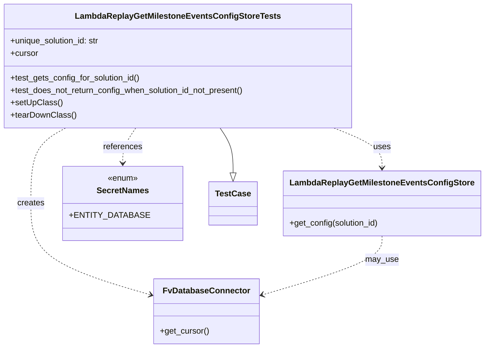

# Diagram: entity_core/entity_search/entity_search_tests/test_lambda_replay_get_milestone_events_config_store.py


> Auto-generated by Obscura crawlers

## Diagram 1



### SVG

<svg id="container" width="913.31640625" xmlns="http://www.w3.org/2000/svg" class="classDiagram" height="674" viewBox="0 0 913.31640625 674" role="graphics-document document" aria-roledescription="class"><style>#container{font-family:"trebuchet ms",verdana,arial,sans-serif;font-size:16px;fill:#333;}@keyframes edge-animation-frame{from{stroke-dashoffset:0;}}@keyframes dash{to{stroke-dashoffset:0;}}#container .edge-animation-slow{stroke-dasharray:9,5!important;stroke-dashoffset:900;animation:dash 50s linear infinite;stroke-linecap:round;}#container .edge-animation-fast{stroke-dasharray:9,5!important;stroke-dashoffset:900;animation:dash 20s linear infinite;stroke-linecap:round;}#container .error-icon{fill:#552222;}#container .error-text{fill:#552222;stroke:#552222;}#container .edge-thickness-normal{stroke-width:1px;}#container .edge-thickness-thick{stroke-width:3.5px;}#container .edge-pattern-solid{stroke-dasharray:0;}#container .edge-thickness-invisible{stroke-width:0;fill:none;}#container .edge-pattern-dashed{stroke-dasharray:3;}#container .edge-pattern-dotted{stroke-dasharray:2;}#container .marker{fill:#333333;stroke:#333333;}#container .marker.cross{stroke:#333333;}#container svg{font-family:"trebuchet ms",verdana,arial,sans-serif;font-size:16px;}#container p{margin:0;}#container g.classGroup text{fill:#9370DB;stroke:none;font-family:"trebuchet ms",verdana,arial,sans-serif;font-size:10px;}#container g.classGroup text .title{font-weight:bolder;}#container .nodeLabel,#container .edgeLabel{color:#131300;}#container .edgeLabel .label rect{fill:#ECECFF;}#container .label text{fill:#131300;}#container .labelBkg{background:#ECECFF;}#container .edgeLabel .label span{background:#ECECFF;}#container .classTitle{font-weight:bolder;}#container .node rect,#container .node circle,#container .node ellipse,#container .node polygon,#container .node path{fill:#ECECFF;stroke:#9370DB;stroke-width:1px;}#container .divider{stroke:#9370DB;stroke-width:1;}#container g.clickable{cursor:pointer;}#container g.classGroup rect{fill:#ECECFF;stroke:#9370DB;}#container g.classGroup line{stroke:#9370DB;stroke-width:1;}#container .classLabel .box{stroke:none;stroke-width:0;fill:#ECECFF;opacity:0.5;}#container .classLabel .label{fill:#9370DB;font-size:10px;}#container .relation{stroke:#333333;stroke-width:1;fill:none;}#container .dashed-line{stroke-dasharray:3;}#container .dotted-line{stroke-dasharray:1 2;}#container #compositionStart,#container .composition{fill:#333333!important;stroke:#333333!important;stroke-width:1;}#container #compositionEnd,#container .composition{fill:#333333!important;stroke:#333333!important;stroke-width:1;}#container #dependencyStart,#container .dependency{fill:#333333!important;stroke:#333333!important;stroke-width:1;}#container #dependencyStart,#container .dependency{fill:#333333!important;stroke:#333333!important;stroke-width:1;}#container #extensionStart,#container .extension{fill:transparent!important;stroke:#333333!important;stroke-width:1;}#container #extensionEnd,#container .extension{fill:transparent!important;stroke:#333333!important;stroke-width:1;}#container #aggregationStart,#container .aggregation{fill:transparent!important;stroke:#333333!important;stroke-width:1;}#container #aggregationEnd,#container .aggregation{fill:transparent!important;stroke:#333333!important;stroke-width:1;}#container #lollipopStart,#container .lollipop{fill:#ECECFF!important;stroke:#333333!important;stroke-width:1;}#container #lollipopEnd,#container .lollipop{fill:#ECECFF!important;stroke:#333333!important;stroke-width:1;}#container .edgeTerminals{font-size:11px;line-height:initial;}#container .classTitleText{text-anchor:middle;font-size:18px;fill:#333;}#container .label-icon{display:inline-block;height:1em;overflow:visible;vertical-align:-0.125em;}#container .node .label-icon path{fill:currentColor;stroke:revert;stroke-width:revert;}#container :root{--mermaid-font-family:"trebuchet ms",verdana,arial,sans-serif;}</style><g><defs><marker id="container_class-aggregationStart" class="marker aggregation class" refX="18" refY="7" markerWidth="190" markerHeight="240" orient="auto"><path d="M 18,7 L9,13 L1,7 L9,1 Z"></path></marker></defs><defs><marker id="container_class-aggregationEnd" class="marker aggregation class" refX="1" refY="7" markerWidth="20" markerHeight="28" orient="auto"><path d="M 18,7 L9,13 L1,7 L9,1 Z"></path></marker></defs><defs><marker id="container_class-extensionStart" class="marker extension class" refX="18" refY="7" markerWidth="190" markerHeight="240" orient="auto"><path d="M 1,7 L18,13 V 1 Z"></path></marker></defs><defs><marker id="container_class-extensionEnd" class="marker extension class" refX="1" refY="7" markerWidth="20" markerHeight="28" orient="auto"><path d="M 1,1 V 13 L18,7 Z"></path></marker></defs><defs><marker id="container_class-compositionStart" class="marker composition class" refX="18" refY="7" markerWidth="190" markerHeight="240" orient="auto"><path d="M 18,7 L9,13 L1,7 L9,1 Z"></path></marker></defs><defs><marker id="container_class-compositionEnd" class="marker composition class" refX="1" refY="7" markerWidth="20" markerHeight="28" orient="auto"><path d="M 18,7 L9,13 L1,7 L9,1 Z"></path></marker></defs><defs><marker id="container_class-dependencyStart" class="marker dependency class" refX="6" refY="7" markerWidth="190" markerHeight="240" orient="auto"><path d="M 5,7 L9,13 L1,7 L9,1 Z"></path></marker></defs><defs><marker id="container_class-dependencyEnd" class="marker dependency class" refX="13" refY="7" markerWidth="20" markerHeight="28" orient="auto"><path d="M 18,7 L9,13 L14,7 L9,1 Z"></path></marker></defs><defs><marker id="container_class-lollipopStart" class="marker lollipop class" refX="13" refY="7" markerWidth="190" markerHeight="240" orient="auto"><circle stroke="black" fill="transparent" cx="7" cy="7" r="6"></circle></marker></defs><defs><marker id="container_class-lollipopEnd" class="marker lollipop class" refX="1" refY="7" markerWidth="190" markerHeight="240" orient="auto"><circle stroke="black" fill="transparent" cx="7" cy="7" r="6"></circle></marker></defs><g class="root"><g class="clusters"></g><g class="edgePaths"><path d="M419.943,248L423.838,254.167C427.732,260.333,435.52,272.667,439.414,287.125C443.309,301.583,443.309,318.167,443.309,326.458L443.309,334.75" id="id_LambdaReplayGetMilestoneEventsConfigStoreTests_TestCase_1" class="edge-thickness-normal edge-pattern-solid relation" style=";;;" data-edge="true" data-et="edge" data-id="id_LambdaReplayGetMilestoneEventsConfigStoreTests_TestCase_1" data-points="W3sieCI6NDE5Ljk0MzMyMjA1NDE0MDE0LCJ5IjoyNDh9LHsieCI6NDQzLjMwODU5Mzc1LCJ5IjoyODV9LHsieCI6NDQzLjMwODU5Mzc1LCJ5IjozNTJ9XQ==" marker-end="url(#container_class-extensionEnd)"></path><path d="M632.568,248L647.388,254.167C662.209,260.333,691.851,272.667,706.671,285.5C721.492,298.333,721.492,311.667,721.492,318.333L721.492,325" id="id_LambdaReplayGetMilestoneEventsConfigStoreTests_LambdaReplayGetMilestoneEventsConfigStore_2" class="edge-thickness-normal edge-pattern-dashed relation" style=";;;" data-edge="true" data-et="edge" data-id="id_LambdaReplayGetMilestoneEventsConfigStoreTests_LambdaReplayGetMilestoneEventsConfigStore_2" data-points="W3sieCI6NjMyLjU2NzcyNDkyMDM4MjEsInkiOjI0OH0seyJ4Ijo3MjEuNDkyMTg3NSwieSI6Mjg1fSx7IngiOjcyMS40OTIxODc1LCJ5IjozMzF9XQ==" marker-end="url(#container_class-dependencyEnd)"></path><path d="M142.193,248L131.813,254.167C121.434,260.333,100.676,272.667,90.297,297C79.918,321.333,79.918,357.667,79.918,394C79.918,430.333,79.918,466.667,115.932,496.06C151.947,525.454,223.976,547.908,259.99,559.134L296.004,570.361" id="id_LambdaReplayGetMilestoneEventsConfigStoreTests_FvDatabaseConnector_3" class="edge-thickness-normal edge-pattern-dashed relation" style=";;;" data-edge="true" data-et="edge" data-id="id_LambdaReplayGetMilestoneEventsConfigStoreTests_FvDatabaseConnector_3" data-points="W3sieCI6MTQyLjE5MjUyNTg3NTc5NjE4LCJ5IjoyNDh9LHsieCI6NzkuOTE3OTY4NzUsInkiOjI4NX0seyJ4Ijo3OS45MTc5Njg3NSwieSI6Mzk0fSx7IngiOjc5LjkxNzk2ODc1LCJ5Ijo1MDN9LHsieCI6MzAxLjczMjQyMTg3NSwieSI6NTcyLjE0NjkzNDcyNDc2NzZ9XQ==" marker-end="url(#container_class-dependencyEnd)"></path><path d="M268.385,248L264.491,254.167C260.596,260.333,252.808,272.667,248.914,284C245.02,295.333,245.02,305.667,245.02,310.833L245.02,316" id="id_LambdaReplayGetMilestoneEventsConfigStoreTests_SecretNames_4" class="edge-thickness-normal edge-pattern-dashed relation" style=";;;" data-edge="true" data-et="edge" data-id="id_LambdaReplayGetMilestoneEventsConfigStoreTests_SecretNames_4" data-points="W3sieCI6MjY4LjM4NDgwMjk0NTg1OTg2LCJ5IjoyNDh9LHsieCI6MjQ1LjAxOTUzMTI1LCJ5IjoyODV9LHsieCI6MjQ1LjAxOTUzMTI1LCJ5IjozMjJ9XQ==" marker-end="url(#container_class-dependencyEnd)"></path><path d="M721.492,457L721.492,464.667C721.492,472.333,721.492,487.667,685.478,506.56C649.463,525.454,577.435,547.908,541.42,559.134L505.406,570.361" id="id_LambdaReplayGetMilestoneEventsConfigStore_FvDatabaseConnector_5" class="edge-thickness-normal edge-pattern-dashed relation" style=";;;" data-edge="true" data-et="edge" data-id="id_LambdaReplayGetMilestoneEventsConfigStore_FvDatabaseConnector_5" data-points="W3sieCI6NzIxLjQ5MjE4NzUsInkiOjQ1N30seyJ4Ijo3MjEuNDkyMTg3NSwieSI6NTAzfSx7IngiOjQ5OS42Nzc3MzQzNzUsInkiOjU3Mi4xNDY5MzQ3MjQ3Njc2fV0=" marker-end="url(#container_class-dependencyEnd)"></path></g><g class="edgeLabels"><g class="edgeLabel"><g class="label" data-id="id_LambdaReplayGetMilestoneEventsConfigStoreTests_TestCase_1" transform="translate(0, 0)"><foreignObject width="0" height="0"><div xmlns="http://www.w3.org/1999/xhtml" class="labelBkg" style="display: table-cell; white-space: nowrap; line-height: 1.5; max-width: 200px; text-align: center;"><span class="edgeLabel"></span></div></foreignObject></g></g><g class="edgeLabel" transform="translate(721.4921875, 285)"><g class="label" data-id="id_LambdaReplayGetMilestoneEventsConfigStoreTests_LambdaReplayGetMilestoneEventsConfigStore_2" transform="translate(-16.4921875, -12)"><foreignObject width="32.984375" height="24"><div xmlns="http://www.w3.org/1999/xhtml" class="labelBkg" style="display: table-cell; white-space: nowrap; line-height: 1.5; max-width: 200px; text-align: center;"><span class="edgeLabel"><p>uses</p></span></div></foreignObject></g></g><g class="edgeLabel" transform="translate(79.91796875, 394)"><g class="label" data-id="id_LambdaReplayGetMilestoneEventsConfigStoreTests_FvDatabaseConnector_3" transform="translate(-26.171875, -12)"><foreignObject width="52.34375" height="24"><div xmlns="http://www.w3.org/1999/xhtml" class="labelBkg" style="display: table-cell; white-space: nowrap; line-height: 1.5; max-width: 200px; text-align: center;"><span class="edgeLabel"><p>creates</p></span></div></foreignObject></g></g><g class="edgeLabel" transform="translate(245.01953125, 285)"><g class="label" data-id="id_LambdaReplayGetMilestoneEventsConfigStoreTests_SecretNames_4" transform="translate(-37.828125, -12)"><foreignObject width="75.65625" height="24"><div xmlns="http://www.w3.org/1999/xhtml" class="labelBkg" style="display: table-cell; white-space: nowrap; line-height: 1.5; max-width: 200px; text-align: center;"><span class="edgeLabel"><p>references</p></span></div></foreignObject></g></g><g class="edgeLabel" transform="translate(721.4921875, 503)"><g class="label" data-id="id_LambdaReplayGetMilestoneEventsConfigStore_FvDatabaseConnector_5" transform="translate(-31.5390625, -12)"><foreignObject width="63.078125" height="24"><div xmlns="http://www.w3.org/1999/xhtml" class="labelBkg" style="display: table-cell; white-space: nowrap; line-height: 1.5; max-width: 200px; text-align: center;"><span class="edgeLabel"><p>may_use</p></span></div></foreignObject></g></g></g><g class="nodes"><g class="node default" id="classId-LambdaReplayGetMilestoneEventsConfigStoreTests-0" transform="translate(344.1640625, 128)"><g class="basic label-container"><path d="M-336.1640625 -120 L336.1640625 -120 L336.1640625 120 L-336.1640625 120" stroke="none" stroke-width="0" fill="#ECECFF" style=""></path><path d="M-336.1640625 -120 C-150.71521811611728 -120, 34.73362626776543 -120, 336.1640625 -120 M-336.1640625 -120 C-148.5882778995858 -120, 38.98750670082842 -120, 336.1640625 -120 M336.1640625 -120 C336.1640625 -26.005240628895834, 336.1640625 67.98951874220833, 336.1640625 120 M336.1640625 -120 C336.1640625 -69.23030039890321, 336.1640625 -18.460600797806407, 336.1640625 120 M336.1640625 120 C156.68672308268833 120, -22.790616334623337 120, -336.1640625 120 M336.1640625 120 C181.77831500487133 120, 27.392567509742662 120, -336.1640625 120 M-336.1640625 120 C-336.1640625 44.27569956363662, -336.1640625 -31.448600872726757, -336.1640625 -120 M-336.1640625 120 C-336.1640625 32.75162376862217, -336.1640625 -54.496752462755666, -336.1640625 -120" stroke="#9370DB" stroke-width="1.3" fill="none" stroke-dasharray="0 0" style=""></path></g><g class="annotation-group text" transform="translate(0, -96)"></g><g class="label-group text" transform="translate(-188.046875, -96)"><g class="label" style="font-weight: bolder" transform="translate(0,-12)"><foreignObject width="376.09375" height="24"><div xmlns="http://www.w3.org/1999/xhtml" style="display: table-cell; white-space: nowrap; line-height: 1.5; max-width: 419px; text-align: center;"><span class="nodeLabel markdown-node-label" style=""><p>LambdaReplayGetMilestoneEventsConfigStoreTests</p></span></div></foreignObject></g></g><g class="members-group text" transform="translate(-324.1640625, -48)"><g class="label" style="" transform="translate(0,-12)"><foreignObject width="176.515625" height="24"><div xmlns="http://www.w3.org/1999/xhtml" style="display: table-cell; white-space: nowrap; line-height: 1.5; max-width: 235px; text-align: center;"><span class="nodeLabel markdown-node-label" style=""><p>+unique_solution_id: str</p></span></div></foreignObject></g><g class="label" style="" transform="translate(0,12)"><foreignObject width="53.71875" height="24"><div xmlns="http://www.w3.org/1999/xhtml" style="display: table-cell; white-space: nowrap; line-height: 1.5; max-width: 112px; text-align: center;"><span class="nodeLabel markdown-node-label" style=""><p>+cursor</p></span></div></foreignObject></g></g><g class="methods-group text" transform="translate(-324.1640625, 24)"><g class="label" style="" transform="translate(0,-12)"><foreignObject width="253.578125" height="24"><div xmlns="http://www.w3.org/1999/xhtml" style="display: table-cell; white-space: nowrap; line-height: 1.5; max-width: 311px; text-align: center;"><span class="nodeLabel markdown-node-label" style=""><p>+test_gets_config_for_solution_id()</p></span></div></foreignObject></g><g class="label" style="" transform="translate(0,12)"><foreignObject width="460.28125" height="24"><div xmlns="http://www.w3.org/1999/xhtml" style="display: table-cell; white-space: nowrap; line-height: 1.5; max-width: 518px; text-align: center;"><span class="nodeLabel markdown-node-label" style=""><p>+test_does_not_return_config_when_solution_id_not_present()</p></span></div></foreignObject></g><g class="label" style="" transform="translate(0,36)"><foreignObject width="97.15625" height="24"><div xmlns="http://www.w3.org/1999/xhtml" style="display: table-cell; white-space: nowrap; line-height: 1.5; max-width: 155px; text-align: center;"><span class="nodeLabel markdown-node-label" style=""><p>+setUpClass()</p></span></div></foreignObject></g><g class="label" style="" transform="translate(0,60)"><foreignObject width="124.484375" height="24"><div xmlns="http://www.w3.org/1999/xhtml" style="display: table-cell; white-space: nowrap; line-height: 1.5; max-width: 182px; text-align: center;"><span class="nodeLabel markdown-node-label" style=""><p>+tearDownClass()</p></span></div></foreignObject></g></g><g class="divider" style=""><path d="M-336.1640625 -72 C-122.74995936967659 -72, 90.66414376064682 -72, 336.1640625 -72 M-336.1640625 -72 C-163.21465887546796 -72, 9.734744749064077 -72, 336.1640625 -72" stroke="#9370DB" stroke-width="1.3" fill="none" stroke-dasharray="0 0" style=""></path></g><g class="divider" style=""><path d="M-336.1640625 0 C-163.4085450768192 0, 9.34697234636161 0, 336.1640625 0 M-336.1640625 0 C-126.58903492219318 0, 82.98599265561364 0, 336.1640625 0" stroke="#9370DB" stroke-width="1.3" fill="none" stroke-dasharray="0 0" style=""></path></g></g><g class="node default" id="classId-LambdaReplayGetMilestoneEventsConfigStore-1" transform="translate(721.4921875, 394)"><g class="basic label-container"><path d="M-183.82421875 -63 L183.82421875 -63 L183.82421875 63 L-183.82421875 63" stroke="none" stroke-width="0" fill="#ECECFF" style=""></path><path d="M-183.82421875 -63 C-70.50180341335842 -63, 42.82061192328317 -63, 183.82421875 -63 M-183.82421875 -63 C-106.52035646316489 -63, -29.216494176329775 -63, 183.82421875 -63 M183.82421875 -63 C183.82421875 -29.04042567519997, 183.82421875 4.919148649600061, 183.82421875 63 M183.82421875 -63 C183.82421875 -30.510320170769283, 183.82421875 1.9793596584614335, 183.82421875 63 M183.82421875 63 C63.330280067944685 63, -57.16365861411063 63, -183.82421875 63 M183.82421875 63 C66.1328939365397 63, -51.558430876920596 63, -183.82421875 63 M-183.82421875 63 C-183.82421875 35.81826648045905, -183.82421875 8.636532960918103, -183.82421875 -63 M-183.82421875 63 C-183.82421875 27.197459680587365, -183.82421875 -8.605080638825271, -183.82421875 -63" stroke="#9370DB" stroke-width="1.3" fill="none" stroke-dasharray="0 0" style=""></path></g><g class="annotation-group text" transform="translate(0, -39)"></g><g class="label-group text" transform="translate(-168.9296875, -39)"><g class="label" style="font-weight: bolder" transform="translate(0,-12)"><foreignObject width="337.859375" height="24"><div xmlns="http://www.w3.org/1999/xhtml" style="display: table-cell; white-space: nowrap; line-height: 1.5; max-width: 382px; text-align: center;"><span class="nodeLabel markdown-node-label" style=""><p>LambdaReplayGetMilestoneEventsConfigStore</p></span></div></foreignObject></g></g><g class="members-group text" transform="translate(-171.82421875, 9)"></g><g class="methods-group text" transform="translate(-171.82421875, 39)"><g class="label" style="" transform="translate(0,-12)"><foreignObject width="174.71875" height="24"><div xmlns="http://www.w3.org/1999/xhtml" style="display: table-cell; white-space: nowrap; line-height: 1.5; max-width: 232px; text-align: center;"><span class="nodeLabel markdown-node-label" style=""><p>+get_config(solution_id)</p></span></div></foreignObject></g></g><g class="divider" style=""><path d="M-183.82421875 -15 C-80.78508064653859 -15, 22.254057456922823 -15, 183.82421875 -15 M-183.82421875 -15 C-107.89845443292386 -15, -31.972690115847712 -15, 183.82421875 -15" stroke="#9370DB" stroke-width="1.3" fill="none" stroke-dasharray="0 0" style=""></path></g><g class="divider" style=""><path d="M-183.82421875 9 C-48.63575128264307 9, 86.55271618471386 9, 183.82421875 9 M-183.82421875 9 C-68.36581749423603 9, 47.09258376152795 9, 183.82421875 9" stroke="#9370DB" stroke-width="1.3" fill="none" stroke-dasharray="0 0" style=""></path></g></g><g class="node default" id="classId-FvDatabaseConnector-2" transform="translate(400.705078125, 603)"><g class="basic label-container"><path d="M-98.97265625 -63 L98.97265625 -63 L98.97265625 63 L-98.97265625 63" stroke="none" stroke-width="0" fill="#ECECFF" style=""></path><path d="M-98.97265625 -63 C-30.45552722099258 -63, 38.06160180801484 -63, 98.97265625 -63 M-98.97265625 -63 C-54.984458916122804 -63, -10.996261582245609 -63, 98.97265625 -63 M98.97265625 -63 C98.97265625 -18.21639436425378, 98.97265625 26.56721127149244, 98.97265625 63 M98.97265625 -63 C98.97265625 -19.83314456677811, 98.97265625 23.33371086644378, 98.97265625 63 M98.97265625 63 C29.622148205043246 63, -39.72835983991351 63, -98.97265625 63 M98.97265625 63 C45.43468355252666 63, -8.103289144946686 63, -98.97265625 63 M-98.97265625 63 C-98.97265625 25.555957398348042, -98.97265625 -11.888085203303916, -98.97265625 -63 M-98.97265625 63 C-98.97265625 33.55609916785842, -98.97265625 4.112198335716833, -98.97265625 -63" stroke="#9370DB" stroke-width="1.3" fill="none" stroke-dasharray="0 0" style=""></path></g><g class="annotation-group text" transform="translate(0, -39)"></g><g class="label-group text" transform="translate(-79.3046875, -39)"><g class="label" style="font-weight: bolder" transform="translate(0,-12)"><foreignObject width="158.609375" height="24"><div xmlns="http://www.w3.org/1999/xhtml" style="display: table-cell; white-space: nowrap; line-height: 1.5; max-width: 207px; text-align: center;"><span class="nodeLabel markdown-node-label" style=""><p>FvDatabaseConnector</p></span></div></foreignObject></g></g><g class="members-group text" transform="translate(-86.97265625, 9)"></g><g class="methods-group text" transform="translate(-86.97265625, 39)"><g class="label" style="" transform="translate(0,-12)"><foreignObject width="94.640625" height="24"><div xmlns="http://www.w3.org/1999/xhtml" style="display: table-cell; white-space: nowrap; line-height: 1.5; max-width: 152px; text-align: center;"><span class="nodeLabel markdown-node-label" style=""><p>+get_cursor()</p></span></div></foreignObject></g></g><g class="divider" style=""><path d="M-98.97265625 -15 C-43.260629961060076 -15, 12.451396327879849 -15, 98.97265625 -15 M-98.97265625 -15 C-21.587760315790604 -15, 55.79713561841879 -15, 98.97265625 -15" stroke="#9370DB" stroke-width="1.3" fill="none" stroke-dasharray="0 0" style=""></path></g><g class="divider" style=""><path d="M-98.97265625 9 C-57.62178974459316 9, -16.270923239186317 9, 98.97265625 9 M-98.97265625 9 C-50.700188720775095 9, -2.427721191550191 9, 98.97265625 9" stroke="#9370DB" stroke-width="1.3" fill="none" stroke-dasharray="0 0" style=""></path></g></g><g class="node default" id="classId-SecretNames-3" transform="translate(245.01953125, 394)"><g class="basic label-container"><path d="M-103.9296875 -72 L103.9296875 -72 L103.9296875 72 L-103.9296875 72" stroke="none" stroke-width="0" fill="#ECECFF" style=""></path><path d="M-103.9296875 -72 C-40.984719202938535 -72, 21.96024909412293 -72, 103.9296875 -72 M-103.9296875 -72 C-51.29869318292343 -72, 1.3323011341531412 -72, 103.9296875 -72 M103.9296875 -72 C103.9296875 -15.063152459109695, 103.9296875 41.87369508178061, 103.9296875 72 M103.9296875 -72 C103.9296875 -41.091663468097586, 103.9296875 -10.183326936195172, 103.9296875 72 M103.9296875 72 C22.202276708860254 72, -59.52513408227949 72, -103.9296875 72 M103.9296875 72 C30.411924369919134 72, -43.10583876016173 72, -103.9296875 72 M-103.9296875 72 C-103.9296875 20.176391581845003, -103.9296875 -31.647216836309994, -103.9296875 -72 M-103.9296875 72 C-103.9296875 26.996092235097834, -103.9296875 -18.007815529804333, -103.9296875 -72" stroke="#9370DB" stroke-width="1.3" fill="none" stroke-dasharray="0 0" style=""></path></g><g class="annotation-group text" transform="translate(-29.53125, -48)"><g class="label" style="" transform="translate(0,-12)"><foreignObject width="59.0625" height="24"><div xmlns="http://www.w3.org/1999/xhtml" style="display: table-cell; white-space: nowrap; line-height: 1.5; max-width: 109px; text-align: center;"><span class="nodeLabel markdown-node-label" style=""><p>«enum»</p></span></div></foreignObject></g></g><g class="label-group text" transform="translate(-48.03125, -24)"><g class="label" style="font-weight: bolder" transform="translate(0,-12)"><foreignObject width="96.0625" height="24"><div xmlns="http://www.w3.org/1999/xhtml" style="display: table-cell; white-space: nowrap; line-height: 1.5; max-width: 145px; text-align: center;"><span class="nodeLabel markdown-node-label" style=""><p>SecretNames</p></span></div></foreignObject></g></g><g class="members-group text" transform="translate(-91.9296875, 24)"><g class="label" style="" transform="translate(0,-12)"><foreignObject width="135.828125" height="24"><div xmlns="http://www.w3.org/1999/xhtml" style="display: table-cell; white-space: nowrap; line-height: 1.5; max-width: 193px; text-align: center;"><span class="nodeLabel markdown-node-label" style=""><p>+ENTITY_DATABASE</p></span></div></foreignObject></g></g><g class="methods-group text" transform="translate(-91.9296875, 72)"></g><g class="divider" style=""><path d="M-103.9296875 0 C-38.23088884600874 0, 27.467909807982522 0, 103.9296875 0 M-103.9296875 0 C-49.1599198272409 0, 5.609847845518203 0, 103.9296875 0" stroke="#9370DB" stroke-width="1.3" fill="none" stroke-dasharray="0 0" style=""></path></g><g class="divider" style=""><path d="M-103.9296875 48 C-30.34122922496711 48, 43.24722905006578 48, 103.9296875 48 M-103.9296875 48 C-27.869991334352264 48, 48.18970483129547 48, 103.9296875 48" stroke="#9370DB" stroke-width="1.3" fill="none" stroke-dasharray="0 0" style=""></path></g></g><g class="node default" id="classId-TestCase-4" transform="translate(443.30859375, 394)"><g class="basic label-container"><path d="M-44.359375 -42 L44.359375 -42 L44.359375 42 L-44.359375 42" stroke="none" stroke-width="0" fill="#ECECFF" style=""></path><path d="M-44.359375 -42 C-17.471655775423823 -42, 9.416063449152354 -42, 44.359375 -42 M-44.359375 -42 C-20.442172526147157 -42, 3.4750299477056856 -42, 44.359375 -42 M44.359375 -42 C44.359375 -17.84258684350691, 44.359375 6.3148263129861775, 44.359375 42 M44.359375 -42 C44.359375 -8.465507155350537, 44.359375 25.068985689298927, 44.359375 42 M44.359375 42 C24.564561646905624 42, 4.769748293811247 42, -44.359375 42 M44.359375 42 C18.938456703947313 42, -6.482461592105373 42, -44.359375 42 M-44.359375 42 C-44.359375 13.868165557047522, -44.359375 -14.263668885904956, -44.359375 -42 M-44.359375 42 C-44.359375 21.252330048275823, -44.359375 0.5046600965516461, -44.359375 -42" stroke="#9370DB" stroke-width="1.3" fill="none" stroke-dasharray="0 0" style=""></path></g><g class="annotation-group text" transform="translate(0, -18)"></g><g class="label-group text" transform="translate(-32.359375, -18)"><g class="label" style="font-weight: bolder" transform="translate(0,-12)"><foreignObject width="64.71875" height="24"><div xmlns="http://www.w3.org/1999/xhtml" style="display: table-cell; white-space: nowrap; line-height: 1.5; max-width: 113px; text-align: center;"><span class="nodeLabel markdown-node-label" style=""><p>TestCase</p></span></div></foreignObject></g></g><g class="members-group text" transform="translate(-32.359375, 30)"></g><g class="methods-group text" transform="translate(-32.359375, 60)"></g><g class="divider" style=""><path d="M-44.359375 6 C-10.296504990941763 6, 23.766365018116474 6, 44.359375 6 M-44.359375 6 C-21.09178413381234 6, 2.175806732375321 6, 44.359375 6" stroke="#9370DB" stroke-width="1.3" fill="none" stroke-dasharray="0 0" style=""></path></g><g class="divider" style=""><path d="M-44.359375 24 C-9.00160093931504 24, 26.35617312136992 24, 44.359375 24 M-44.359375 24 C-21.635436256587504 24, 1.0885024868249928 24, 44.359375 24" stroke="#9370DB" stroke-width="1.3" fill="none" stroke-dasharray="0 0" style=""></path></g></g></g></g></g></svg>

## Diagram 2

```mermaid
flowchart TD
    Setup[setUpClass: generate unique_solution_id & connect DB]
    Insert[Insert system_configuration row for REPLAY_FAILED_GET_MILESTONE_EVENTS]
    Setup --> Insert
    Test1[test_gets_config_for_solution_id]
    Insert --> Test1
    CreateStore[Create LambdaReplayGetMilestoneEventsConfigStore instance]
    Test1 --> CreateStore
    CallGetValid[call get_config(unique_solution_id)]
    CreateStore --> CallGetValid
    AssertValid[assert config not None and fields match:\naccepted_emails, s3_bucket, s3_folder, notify_email]
    CallGetValid --> AssertValid
    Test2[test_does_not_return_config_when_solution_id_not_present]
    AssertValid --> Test2
    CallGetInvalid[call get_config("some_invalid_solution_id")]
    Test2 --> CallGetInvalid
    AssertInvalid[assert config is None]
    CallGetInvalid --> AssertInvalid
    Teardown[tearDownClass: delete inserted system_configuration row]
    AssertInvalid --> Teardown
```

> SVG rendering failed for this diagram.
