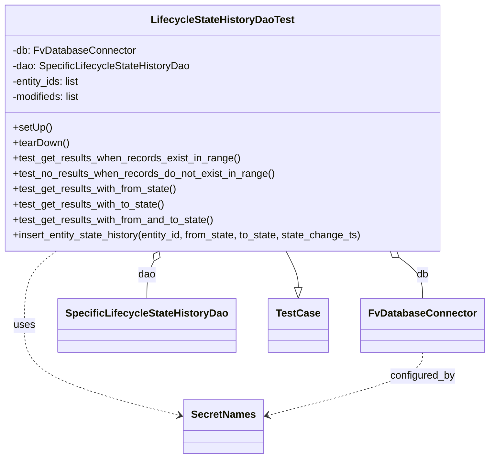

# Diagram: entity_core/entity_search/entity_search_tests/test_lifecycle_state_history_dao.py


> Auto-generated by Obscura crawlers

## Diagram 1



### SVG

<svg id="container" width="749.1953125" xmlns="http://www.w3.org/2000/svg" class="classDiagram" height="716" viewBox="0 0 749.1953125 716" role="graphics-document document" aria-roledescription="class"><style>#container{font-family:"trebuchet ms",verdana,arial,sans-serif;font-size:16px;fill:#333;}@keyframes edge-animation-frame{from{stroke-dashoffset:0;}}@keyframes dash{to{stroke-dashoffset:0;}}#container .edge-animation-slow{stroke-dasharray:9,5!important;stroke-dashoffset:900;animation:dash 50s linear infinite;stroke-linecap:round;}#container .edge-animation-fast{stroke-dasharray:9,5!important;stroke-dashoffset:900;animation:dash 20s linear infinite;stroke-linecap:round;}#container .error-icon{fill:#552222;}#container .error-text{fill:#552222;stroke:#552222;}#container .edge-thickness-normal{stroke-width:1px;}#container .edge-thickness-thick{stroke-width:3.5px;}#container .edge-pattern-solid{stroke-dasharray:0;}#container .edge-thickness-invisible{stroke-width:0;fill:none;}#container .edge-pattern-dashed{stroke-dasharray:3;}#container .edge-pattern-dotted{stroke-dasharray:2;}#container .marker{fill:#333333;stroke:#333333;}#container .marker.cross{stroke:#333333;}#container svg{font-family:"trebuchet ms",verdana,arial,sans-serif;font-size:16px;}#container p{margin:0;}#container g.classGroup text{fill:#9370DB;stroke:none;font-family:"trebuchet ms",verdana,arial,sans-serif;font-size:10px;}#container g.classGroup text .title{font-weight:bolder;}#container .nodeLabel,#container .edgeLabel{color:#131300;}#container .edgeLabel .label rect{fill:#ECECFF;}#container .label text{fill:#131300;}#container .labelBkg{background:#ECECFF;}#container .edgeLabel .label span{background:#ECECFF;}#container .classTitle{font-weight:bolder;}#container .node rect,#container .node circle,#container .node ellipse,#container .node polygon,#container .node path{fill:#ECECFF;stroke:#9370DB;stroke-width:1px;}#container .divider{stroke:#9370DB;stroke-width:1;}#container g.clickable{cursor:pointer;}#container g.classGroup rect{fill:#ECECFF;stroke:#9370DB;}#container g.classGroup line{stroke:#9370DB;stroke-width:1;}#container .classLabel .box{stroke:none;stroke-width:0;fill:#ECECFF;opacity:0.5;}#container .classLabel .label{fill:#9370DB;font-size:10px;}#container .relation{stroke:#333333;stroke-width:1;fill:none;}#container .dashed-line{stroke-dasharray:3;}#container .dotted-line{stroke-dasharray:1 2;}#container #compositionStart,#container .composition{fill:#333333!important;stroke:#333333!important;stroke-width:1;}#container #compositionEnd,#container .composition{fill:#333333!important;stroke:#333333!important;stroke-width:1;}#container #dependencyStart,#container .dependency{fill:#333333!important;stroke:#333333!important;stroke-width:1;}#container #dependencyStart,#container .dependency{fill:#333333!important;stroke:#333333!important;stroke-width:1;}#container #extensionStart,#container .extension{fill:transparent!important;stroke:#333333!important;stroke-width:1;}#container #extensionEnd,#container .extension{fill:transparent!important;stroke:#333333!important;stroke-width:1;}#container #aggregationStart,#container .aggregation{fill:transparent!important;stroke:#333333!important;stroke-width:1;}#container #aggregationEnd,#container .aggregation{fill:transparent!important;stroke:#333333!important;stroke-width:1;}#container #lollipopStart,#container .lollipop{fill:#ECECFF!important;stroke:#333333!important;stroke-width:1;}#container #lollipopEnd,#container .lollipop{fill:#ECECFF!important;stroke:#333333!important;stroke-width:1;}#container .edgeTerminals{font-size:11px;line-height:initial;}#container .classTitleText{text-anchor:middle;font-size:18px;fill:#333;}#container .label-icon{display:inline-block;height:1em;overflow:visible;vertical-align:-0.125em;}#container .node .label-icon path{fill:currentColor;stroke:revert;stroke-width:revert;}#container :root{--mermaid-font-family:"trebuchet ms",verdana,arial,sans-serif;}</style><g><defs><marker id="container_class-aggregationStart" class="marker aggregation class" refX="18" refY="7" markerWidth="190" markerHeight="240" orient="auto"><path d="M 18,7 L9,13 L1,7 L9,1 Z"></path></marker></defs><defs><marker id="container_class-aggregationEnd" class="marker aggregation class" refX="1" refY="7" markerWidth="20" markerHeight="28" orient="auto"><path d="M 18,7 L9,13 L1,7 L9,1 Z"></path></marker></defs><defs><marker id="container_class-extensionStart" class="marker extension class" refX="18" refY="7" markerWidth="190" markerHeight="240" orient="auto"><path d="M 1,7 L18,13 V 1 Z"></path></marker></defs><defs><marker id="container_class-extensionEnd" class="marker extension class" refX="1" refY="7" markerWidth="20" markerHeight="28" orient="auto"><path d="M 1,1 V 13 L18,7 Z"></path></marker></defs><defs><marker id="container_class-compositionStart" class="marker composition class" refX="18" refY="7" markerWidth="190" markerHeight="240" orient="auto"><path d="M 18,7 L9,13 L1,7 L9,1 Z"></path></marker></defs><defs><marker id="container_class-compositionEnd" class="marker composition class" refX="1" refY="7" markerWidth="20" markerHeight="28" orient="auto"><path d="M 18,7 L9,13 L1,7 L9,1 Z"></path></marker></defs><defs><marker id="container_class-dependencyStart" class="marker dependency class" refX="6" refY="7" markerWidth="190" markerHeight="240" orient="auto"><path d="M 5,7 L9,13 L1,7 L9,1 Z"></path></marker></defs><defs><marker id="container_class-dependencyEnd" class="marker dependency class" refX="13" refY="7" markerWidth="20" markerHeight="28" orient="auto"><path d="M 18,7 L9,13 L14,7 L9,1 Z"></path></marker></defs><defs><marker id="container_class-lollipopStart" class="marker lollipop class" refX="13" refY="7" markerWidth="190" markerHeight="240" orient="auto"><circle stroke="black" fill="transparent" cx="7" cy="7" r="6"></circle></marker></defs><defs><marker id="container_class-lollipopEnd" class="marker lollipop class" refX="1" refY="7" markerWidth="190" markerHeight="240" orient="auto"><circle stroke="black" fill="transparent" cx="7" cy="7" r="6"></circle></marker></defs><g class="root"><g class="clusters"></g><g class="edgePaths"><path d="M445.905,392L448.958,398.167C452.012,404.333,458.119,416.667,461.173,426.125C464.227,435.583,464.227,442.167,464.227,445.458L464.227,448.75" id="id_LifecycleStateHistoryDaoTest_TestCase_1" class="edge-thickness-normal edge-pattern-solid relation" style=";;;" data-edge="true" data-et="edge" data-id="id_LifecycleStateHistoryDaoTest_TestCase_1" data-points="W3sieCI6NDQ1LjkwNDU0NDIxMzk3MzgsInkiOjM5Mn0seyJ4Ijo0NjQuMjI2NTYyNSwieSI6NDI5fSx7IngiOjQ2NC4yMjY1NjI1LCJ5Ijo0NjZ9XQ==" marker-end="url(#container_class-extensionEnd)"></path><path d="M615.266,402.487L621.037,406.906C626.808,411.325,638.349,420.162,644.12,430.748C649.891,441.333,649.891,453.667,649.891,459.833L649.891,466" id="id_LifecycleStateHistoryDaoTest_FvDatabaseConnector_2" class="edge-thickness-normal edge-pattern-solid relation" style=";;;" data-edge="true" data-et="edge" data-id="id_LifecycleStateHistoryDaoTest_FvDatabaseConnector_2" data-points="W3sieCI6NjAxLjU3MDQ4MzA3ODYwMjYsInkiOjM5Mn0seyJ4Ijo2NDkuODkwNjI1LCJ5Ijo0Mjl9LHsieCI6NjQ5Ljg5MDYyNSwieSI6NDY2fV0=" marker-start="url(#container_class-aggregationStart)"></path><path d="M248.097,407.458L246.319,411.049C244.541,414.639,240.985,421.819,239.208,431.576C237.43,441.333,237.43,453.667,237.43,459.833L237.43,466" id="id_LifecycleStateHistoryDaoTest_SpecificLifecycleStateHistoryDao_3" class="edge-thickness-normal edge-pattern-solid relation" style=";;;" data-edge="true" data-et="edge" data-id="id_LifecycleStateHistoryDaoTest_SpecificLifecycleStateHistoryDao_3" data-points="W3sieCI6MjU1Ljc1MTcwNTc4NjAyNjIsInkiOjM5Mn0seyJ4IjoyMzcuNDI5Njg3NSwieSI6NDI5fSx7IngiOjIzNy40Mjk2ODc1LCJ5Ijo0NjZ9XQ==" marker-start="url(#container_class-aggregationStart)"></path><path d="M101.54,392L93.533,398.167C85.527,404.333,69.513,416.667,61.507,436C53.5,455.333,53.5,481.667,53.5,508C53.5,534.333,53.5,560.667,92.227,584.093C130.955,607.52,208.409,628.04,247.137,638.3L285.864,648.56" id="id_LifecycleStateHistoryDaoTest_SecretNames_4" class="edge-thickness-normal edge-pattern-dashed relation" style=";;;" data-edge="true" data-et="edge" data-id="id_LifecycleStateHistoryDaoTest_SecretNames_4" data-points="W3sieCI6MTAxLjUzOTkxNTM5MzAxMzEsInkiOjM5Mn0seyJ4Ijo1My41LCJ5Ijo0Mjl9LHsieCI6NTMuNSwieSI6NTA4fSx7IngiOjUzLjUsInkiOjU4N30seyJ4IjoyOTEuNjY0MDYyNSwieSI6NjUwLjA5NjA5ODkyODQ0OTh9XQ==" marker-end="url(#container_class-dependencyEnd)"></path><path d="M649.891,550L649.891,556.167C649.891,562.333,649.891,574.667,611.163,591.093C572.436,607.52,494.981,628.04,456.254,638.3L417.526,648.56" id="id_FvDatabaseConnector_SecretNames_5" class="edge-thickness-normal edge-pattern-dashed relation" style=";;;" data-edge="true" data-et="edge" data-id="id_FvDatabaseConnector_SecretNames_5" data-points="W3sieCI6NjQ5Ljg5MDYyNSwieSI6NTUwfSx7IngiOjY0OS44OTA2MjUsInkiOjU4N30seyJ4Ijo0MTEuNzI2NTYyNSwieSI6NjUwLjA5NjA5ODkyODQ0OTh9XQ==" marker-end="url(#container_class-dependencyEnd)"></path></g><g class="edgeLabels"><g class="edgeLabel"><g class="label" data-id="id_LifecycleStateHistoryDaoTest_TestCase_1" transform="translate(0, 0)"><foreignObject width="0" height="0"><div xmlns="http://www.w3.org/1999/xhtml" class="labelBkg" style="display: table-cell; white-space: nowrap; line-height: 1.5; max-width: 200px; text-align: center;"><span class="edgeLabel"></span></div></foreignObject></g></g><g class="edgeLabel" transform="translate(649.890625, 429)"><g class="label" data-id="id_LifecycleStateHistoryDaoTest_FvDatabaseConnector_2" transform="translate(-9.5390625, -12)"><foreignObject width="19.078125" height="24"><div xmlns="http://www.w3.org/1999/xhtml" class="labelBkg" style="display: table-cell; white-space: nowrap; line-height: 1.5; max-width: 200px; text-align: center;"><span class="edgeLabel"><p>db</p></span></div></foreignObject></g></g><g class="edgeLabel" transform="translate(237.4296875, 429)"><g class="label" data-id="id_LifecycleStateHistoryDaoTest_SpecificLifecycleStateHistoryDao_3" transform="translate(-13.8125, -12)"><foreignObject width="27.625" height="24"><div xmlns="http://www.w3.org/1999/xhtml" class="labelBkg" style="display: table-cell; white-space: nowrap; line-height: 1.5; max-width: 200px; text-align: center;"><span class="edgeLabel"><p>dao</p></span></div></foreignObject></g></g><g class="edgeLabel" transform="translate(53.5, 508)"><g class="label" data-id="id_LifecycleStateHistoryDaoTest_SecretNames_4" transform="translate(-16.4921875, -12)"><foreignObject width="32.984375" height="24"><div xmlns="http://www.w3.org/1999/xhtml" class="labelBkg" style="display: table-cell; white-space: nowrap; line-height: 1.5; max-width: 200px; text-align: center;"><span class="edgeLabel"><p>uses</p></span></div></foreignObject></g></g><g class="edgeLabel" transform="translate(649.890625, 587)"><g class="label" data-id="id_FvDatabaseConnector_SecretNames_5" transform="translate(-51.171875, -12)"><foreignObject width="102.34375" height="24"><div xmlns="http://www.w3.org/1999/xhtml" class="labelBkg" style="display: table-cell; white-space: nowrap; line-height: 1.5; max-width: 200px; text-align: center;"><span class="edgeLabel"><p>configured_by</p></span></div></foreignObject></g></g></g><g class="nodes"><g class="node default" id="classId-LifecycleStateHistoryDaoTest-0" transform="translate(350.828125, 200)"><g class="basic label-container"><path d="M-342.828125 -192 L342.828125 -192 L342.828125 192 L-342.828125 192" stroke="none" stroke-width="0" fill="#ECECFF" style=""></path><path d="M-342.828125 -192 C-187.06995556081966 -192, -31.31178612163933 -192, 342.828125 -192 M-342.828125 -192 C-69.5137662408876 -192, 203.8005925182248 -192, 342.828125 -192 M342.828125 -192 C342.828125 -68.58429249415519, 342.828125 54.831415011689614, 342.828125 192 M342.828125 -192 C342.828125 -43.74782339962425, 342.828125 104.5043532007515, 342.828125 192 M342.828125 192 C164.97456924855697 192, -12.87898650288605 192, -342.828125 192 M342.828125 192 C163.06130907636532 192, -16.705506847269362 192, -342.828125 192 M-342.828125 192 C-342.828125 79.13061348972386, -342.828125 -33.73877302055229, -342.828125 -192 M-342.828125 192 C-342.828125 44.29265631432912, -342.828125 -103.41468737134176, -342.828125 -192" stroke="#9370DB" stroke-width="1.3" fill="none" stroke-dasharray="0 0" style=""></path></g><g class="annotation-group text" transform="translate(0, -168)"></g><g class="label-group text" transform="translate(-107.203125, -168)"><g class="label" style="font-weight: bolder" transform="translate(0,-12)"><foreignObject width="214.40625" height="24"><div xmlns="http://www.w3.org/1999/xhtml" style="display: table-cell; white-space: nowrap; line-height: 1.5; max-width: 260px; text-align: center;"><span class="nodeLabel markdown-node-label" style=""><p>LifecycleStateHistoryDaoTest</p></span></div></foreignObject></g></g><g class="members-group text" transform="translate(-330.828125, -120)"><g class="label" style="" transform="translate(0,-12)"><foreignObject width="190.234375" height="24"><div xmlns="http://www.w3.org/1999/xhtml" style="display: table-cell; white-space: nowrap; line-height: 1.5; max-width: 248px; text-align: center;"><span class="nodeLabel markdown-node-label" style=""><p>-db: FvDatabaseConnector</p></span></div></foreignObject></g><g class="label" style="" transform="translate(0,12)"><foreignObject width="278.265625" height="24"><div xmlns="http://www.w3.org/1999/xhtml" style="display: table-cell; white-space: nowrap; line-height: 1.5; max-width: 336px; text-align: center;"><span class="nodeLabel markdown-node-label" style=""><p>-dao: SpecificLifecycleStateHistoryDao</p></span></div></foreignObject></g><g class="label" style="" transform="translate(0,36)"><foreignObject width="108.328125" height="24"><div xmlns="http://www.w3.org/1999/xhtml" style="display: table-cell; white-space: nowrap; line-height: 1.5; max-width: 166px; text-align: center;"><span class="nodeLabel markdown-node-label" style=""><p>-entity_ids: list</p></span></div></foreignObject></g><g class="label" style="" transform="translate(0,60)"><foreignObject width="109.078125" height="24"><div xmlns="http://www.w3.org/1999/xhtml" style="display: table-cell; white-space: nowrap; line-height: 1.5; max-width: 167px; text-align: center;"><span class="nodeLabel markdown-node-label" style=""><p>-modifieds: list</p></span></div></foreignObject></g></g><g class="methods-group text" transform="translate(-330.828125, 0)"><g class="label" style="" transform="translate(0,-12)"><foreignObject width="60.421875" height="24"><div xmlns="http://www.w3.org/1999/xhtml" style="display: table-cell; white-space: nowrap; line-height: 1.5; max-width: 118px; text-align: center;"><span class="nodeLabel markdown-node-label" style=""><p>+setUp()</p></span></div></foreignObject></g><g class="label" style="" transform="translate(0,12)"><foreignObject width="87.75" height="24"><div xmlns="http://www.w3.org/1999/xhtml" style="display: table-cell; white-space: nowrap; line-height: 1.5; max-width: 145px; text-align: center;"><span class="nodeLabel markdown-node-label" style=""><p>+tearDown()</p></span></div></foreignObject></g><g class="label" style="" transform="translate(0,36)"><foreignObject width="355.8125" height="24"><div xmlns="http://www.w3.org/1999/xhtml" style="display: table-cell; white-space: nowrap; line-height: 1.5; max-width: 413px; text-align: center;"><span class="nodeLabel markdown-node-label" style=""><p>+test_get_results_when_records_exist_in_range()</p></span></div></foreignObject></g><g class="label" style="" transform="translate(0,60)"><foreignObject width="410.921875" height="24"><div xmlns="http://www.w3.org/1999/xhtml" style="display: table-cell; white-space: nowrap; line-height: 1.5; max-width: 468px; text-align: center;"><span class="nodeLabel markdown-node-label" style=""><p>+test_no_results_when_records_do_not_exist_in_range()</p></span></div></foreignObject></g><g class="label" style="" transform="translate(0,84)"><foreignObject width="259.609375" height="24"><div xmlns="http://www.w3.org/1999/xhtml" style="display: table-cell; white-space: nowrap; line-height: 1.5; max-width: 317px; text-align: center;"><span class="nodeLabel markdown-node-label" style=""><p>+test_get_results_with_from_state()</p></span></div></foreignObject></g><g class="label" style="" transform="translate(0,108)"><foreignObject width="240.0625" height="24"><div xmlns="http://www.w3.org/1999/xhtml" style="display: table-cell; white-space: nowrap; line-height: 1.5; max-width: 297px; text-align: center;"><span class="nodeLabel markdown-node-label" style=""><p>+test_get_results_with_to_state()</p></span></div></foreignObject></g><g class="label" style="" transform="translate(0,132)"><foreignObject width="317.8125" height="24"><div xmlns="http://www.w3.org/1999/xhtml" style="display: table-cell; white-space: nowrap; line-height: 1.5; max-width: 375px; text-align: center;"><span class="nodeLabel markdown-node-label" style=""><p>+test_get_results_with_from_and_to_state()</p></span></div></foreignObject></g><g class="label" style="" transform="translate(0,156)"><foreignObject width="554.453125" height="24"><div xmlns="http://www.w3.org/1999/xhtml" style="display: table-cell; white-space: nowrap; line-height: 1.5; max-width: 612px; text-align: center;"><span class="nodeLabel markdown-node-label" style=""><p>+insert_entity_state_history(entity_id, from_state, to_state, state_change_ts)</p></span></div></foreignObject></g></g><g class="divider" style=""><path d="M-342.828125 -144 C-107.33012184107548 -144, 128.16788131784904 -144, 342.828125 -144 M-342.828125 -144 C-169.45866497851523 -144, 3.9107950429695393 -144, 342.828125 -144" stroke="#9370DB" stroke-width="1.3" fill="none" stroke-dasharray="0 0" style=""></path></g><g class="divider" style=""><path d="M-342.828125 -24 C-115.94582733131406 -24, 110.93647033737187 -24, 342.828125 -24 M-342.828125 -24 C-163.2286189481273 -24, 16.370887103745417 -24, 342.828125 -24" stroke="#9370DB" stroke-width="1.3" fill="none" stroke-dasharray="0 0" style=""></path></g></g><g class="node default" id="classId-FvDatabaseConnector-1" transform="translate(649.890625, 508)"><g class="basic label-container"><path d="M-91.3046875 -42 L91.3046875 -42 L91.3046875 42 L-91.3046875 42" stroke="none" stroke-width="0" fill="#ECECFF" style=""></path><path d="M-91.3046875 -42 C-50.47716722386935 -42, -9.649646947738702 -42, 91.3046875 -42 M-91.3046875 -42 C-43.3568547500465 -42, 4.590977999906997 -42, 91.3046875 -42 M91.3046875 -42 C91.3046875 -9.317934284879783, 91.3046875 23.364131430240434, 91.3046875 42 M91.3046875 -42 C91.3046875 -17.038318318858497, 91.3046875 7.9233633622830055, 91.3046875 42 M91.3046875 42 C33.1464693917199 42, -25.011748716560206 42, -91.3046875 42 M91.3046875 42 C39.18326526639977 42, -12.938156967200456 42, -91.3046875 42 M-91.3046875 42 C-91.3046875 22.356028941517348, -91.3046875 2.7120578830346957, -91.3046875 -42 M-91.3046875 42 C-91.3046875 23.62235653622948, -91.3046875 5.244713072458957, -91.3046875 -42" stroke="#9370DB" stroke-width="1.3" fill="none" stroke-dasharray="0 0" style=""></path></g><g class="annotation-group text" transform="translate(0, -18)"></g><g class="label-group text" transform="translate(-79.3046875, -18)"><g class="label" style="font-weight: bolder" transform="translate(0,-12)"><foreignObject width="158.609375" height="24"><div xmlns="http://www.w3.org/1999/xhtml" style="display: table-cell; white-space: nowrap; line-height: 1.5; max-width: 207px; text-align: center;"><span class="nodeLabel markdown-node-label" style=""><p>FvDatabaseConnector</p></span></div></foreignObject></g></g><g class="members-group text" transform="translate(-79.3046875, 30)"></g><g class="methods-group text" transform="translate(-79.3046875, 60)"></g><g class="divider" style=""><path d="M-91.3046875 6 C-43.383056255754845 6, 4.538574988490311 6, 91.3046875 6 M-91.3046875 6 C-25.890469383896246 6, 39.52374873220751 6, 91.3046875 6" stroke="#9370DB" stroke-width="1.3" fill="none" stroke-dasharray="0 0" style=""></path></g><g class="divider" style=""><path d="M-91.3046875 24 C-44.25812111828005 24, 2.788445263439897 24, 91.3046875 24 M-91.3046875 24 C-40.43877771552881 24, 10.427132068942385 24, 91.3046875 24" stroke="#9370DB" stroke-width="1.3" fill="none" stroke-dasharray="0 0" style=""></path></g></g><g class="node default" id="classId-SpecificLifecycleStateHistoryDao-2" transform="translate(237.4296875, 508)"><g class="basic label-container"><path d="M-132.4375 -42 L132.4375 -42 L132.4375 42 L-132.4375 42" stroke="none" stroke-width="0" fill="#ECECFF" style=""></path><path d="M-132.4375 -42 C-37.42528014338808 -42, 57.58693971322384 -42, 132.4375 -42 M-132.4375 -42 C-50.23202046544671 -42, 31.973459069106582 -42, 132.4375 -42 M132.4375 -42 C132.4375 -12.54516340423389, 132.4375 16.90967319153222, 132.4375 42 M132.4375 -42 C132.4375 -17.49342756983719, 132.4375 7.0131448603256175, 132.4375 42 M132.4375 42 C55.93905294468462 42, -20.559394110630762 42, -132.4375 42 M132.4375 42 C37.93036380514934 42, -56.57677238970132 42, -132.4375 42 M-132.4375 42 C-132.4375 23.378947664492827, -132.4375 4.757895328985654, -132.4375 -42 M-132.4375 42 C-132.4375 13.358875740904747, -132.4375 -15.282248518190507, -132.4375 -42" stroke="#9370DB" stroke-width="1.3" fill="none" stroke-dasharray="0 0" style=""></path></g><g class="annotation-group text" transform="translate(0, -18)"></g><g class="label-group text" transform="translate(-120.4375, -18)"><g class="label" style="font-weight: bolder" transform="translate(0,-12)"><foreignObject width="240.875" height="24"><div xmlns="http://www.w3.org/1999/xhtml" style="display: table-cell; white-space: nowrap; line-height: 1.5; max-width: 286px; text-align: center;"><span class="nodeLabel markdown-node-label" style=""><p>SpecificLifecycleStateHistoryDao</p></span></div></foreignObject></g></g><g class="members-group text" transform="translate(-120.4375, 30)"></g><g class="methods-group text" transform="translate(-120.4375, 60)"></g><g class="divider" style=""><path d="M-132.4375 6 C-50.98249846618178 6, 30.47250306763644 6, 132.4375 6 M-132.4375 6 C-53.86646740917692 6, 24.70456518164616 6, 132.4375 6" stroke="#9370DB" stroke-width="1.3" fill="none" stroke-dasharray="0 0" style=""></path></g><g class="divider" style=""><path d="M-132.4375 24 C-61.894747569509576 24, 8.648004860980848 24, 132.4375 24 M-132.4375 24 C-61.858675880652726 24, 8.720148238694549 24, 132.4375 24" stroke="#9370DB" stroke-width="1.3" fill="none" stroke-dasharray="0 0" style=""></path></g></g><g class="node default" id="classId-SecretNames-3" transform="translate(351.6953125, 666)"><g class="basic label-container"><path d="M-60.03125 -42 L60.03125 -42 L60.03125 42 L-60.03125 42" stroke="none" stroke-width="0" fill="#ECECFF" style=""></path><path d="M-60.03125 -42 C-32.771692128614106 -42, -5.512134257228205 -42, 60.03125 -42 M-60.03125 -42 C-30.81265942490705 -42, -1.5940688498141 -42, 60.03125 -42 M60.03125 -42 C60.03125 -10.872715872026287, 60.03125 20.254568255947426, 60.03125 42 M60.03125 -42 C60.03125 -23.99660469383208, 60.03125 -5.993209387664159, 60.03125 42 M60.03125 42 C26.81271050585366 42, -6.405828988292683 42, -60.03125 42 M60.03125 42 C28.68098561039851 42, -2.6692787792029833 42, -60.03125 42 M-60.03125 42 C-60.03125 9.057264603479368, -60.03125 -23.885470793041264, -60.03125 -42 M-60.03125 42 C-60.03125 13.732105599691899, -60.03125 -14.535788800616203, -60.03125 -42" stroke="#9370DB" stroke-width="1.3" fill="none" stroke-dasharray="0 0" style=""></path></g><g class="annotation-group text" transform="translate(0, -18)"></g><g class="label-group text" transform="translate(-48.03125, -18)"><g class="label" style="font-weight: bolder" transform="translate(0,-12)"><foreignObject width="96.0625" height="24"><div xmlns="http://www.w3.org/1999/xhtml" style="display: table-cell; white-space: nowrap; line-height: 1.5; max-width: 145px; text-align: center;"><span class="nodeLabel markdown-node-label" style=""><p>SecretNames</p></span></div></foreignObject></g></g><g class="members-group text" transform="translate(-48.03125, 30)"></g><g class="methods-group text" transform="translate(-48.03125, 60)"></g><g class="divider" style=""><path d="M-60.03125 6 C-28.355923523514964 6, 3.319402952970073 6, 60.03125 6 M-60.03125 6 C-32.016236348158145 6, -4.00122269631629 6, 60.03125 6" stroke="#9370DB" stroke-width="1.3" fill="none" stroke-dasharray="0 0" style=""></path></g><g class="divider" style=""><path d="M-60.03125 24 C-17.865392521729177 24, 24.300464956541646 24, 60.03125 24 M-60.03125 24 C-24.892330554460976 24, 10.246588891078048 24, 60.03125 24" stroke="#9370DB" stroke-width="1.3" fill="none" stroke-dasharray="0 0" style=""></path></g></g><g class="node default" id="classId-TestCase-4" transform="translate(464.2265625, 508)"><g class="basic label-container"><path d="M-44.359375 -42 L44.359375 -42 L44.359375 42 L-44.359375 42" stroke="none" stroke-width="0" fill="#ECECFF" style=""></path><path d="M-44.359375 -42 C-10.070860448663822 -42, 24.217654102672356 -42, 44.359375 -42 M-44.359375 -42 C-9.24588449987364 -42, 25.86760600025272 -42, 44.359375 -42 M44.359375 -42 C44.359375 -8.473760583105317, 44.359375 25.052478833789365, 44.359375 42 M44.359375 -42 C44.359375 -12.718128093582603, 44.359375 16.563743812834794, 44.359375 42 M44.359375 42 C16.927012680351822 42, -10.505349639296355 42, -44.359375 42 M44.359375 42 C17.302933621912068 42, -9.753507756175864 42, -44.359375 42 M-44.359375 42 C-44.359375 12.497107518026322, -44.359375 -17.005784963947356, -44.359375 -42 M-44.359375 42 C-44.359375 14.668393112207955, -44.359375 -12.66321377558409, -44.359375 -42" stroke="#9370DB" stroke-width="1.3" fill="none" stroke-dasharray="0 0" style=""></path></g><g class="annotation-group text" transform="translate(0, -18)"></g><g class="label-group text" transform="translate(-32.359375, -18)"><g class="label" style="font-weight: bolder" transform="translate(0,-12)"><foreignObject width="64.71875" height="24"><div xmlns="http://www.w3.org/1999/xhtml" style="display: table-cell; white-space: nowrap; line-height: 1.5; max-width: 113px; text-align: center;"><span class="nodeLabel markdown-node-label" style=""><p>TestCase</p></span></div></foreignObject></g></g><g class="members-group text" transform="translate(-32.359375, 30)"></g><g class="methods-group text" transform="translate(-32.359375, 60)"></g><g class="divider" style=""><path d="M-44.359375 6 C-23.51113360381769 6, -2.6628922076353803 6, 44.359375 6 M-44.359375 6 C-25.81180575097001 6, -7.264236501940019 6, 44.359375 6" stroke="#9370DB" stroke-width="1.3" fill="none" stroke-dasharray="0 0" style=""></path></g><g class="divider" style=""><path d="M-44.359375 24 C-9.930259109176056 24, 24.498856781647888 24, 44.359375 24 M-44.359375 24 C-9.226754245093055 24, 25.90586650981389 24, 44.359375 24" stroke="#9370DB" stroke-width="1.3" fill="none" stroke-dasharray="0 0" style=""></path></g></g></g></g></g></svg>

## Diagram 2

```mermaid
sequenceDiagram
participant Test as LifecycleStateHistoryDaoTest
participant DB as FvDatabaseConnector
participant DAO as SpecificLifecycleStateHistoryDao

Test->>DB: get_cursor().execute("BEGIN")
Test->>DB: INSERT INTO entity (solution_id, external_id) RETURNING id
DB-->>Test: ids
Test->>DB: INSERT INTO entity_state_history (...) RETURNING modified
DB-->>Test: modified timestamps
Test->>DAO: get_lifecycle_state_history(solution_id, start, end, from_states?, to_states?)
DAO->>DB: execute lifecycle history query
DB-->>DAO: result rows
DAO-->>Test: results
Test->>DB: DELETE FROM entity_state_history; DELETE FROM entity
DB-->>Test: deleted
Test->>DB: ROLLBACK
```

> SVG rendering failed for this diagram.
