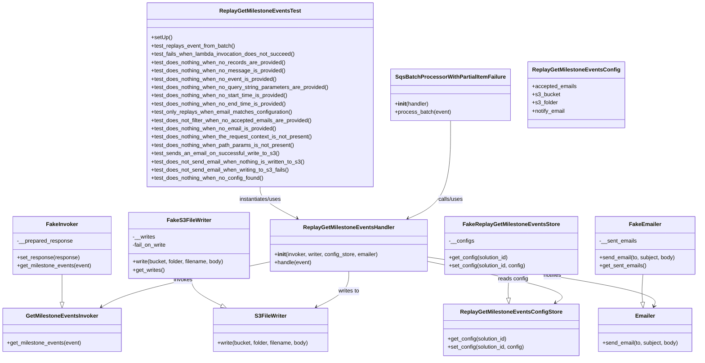
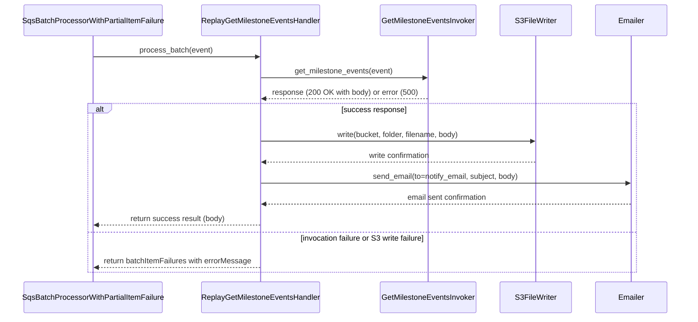

# Diagram: entity_core/entity_search/entity_search_tests/test_replay_get_milestone_events.py

> Auto-generated by Obscura crawlers

## Diagram 1

### SVG

<svg id="container" width="2021.55078125" xmlns="http://www.w3.org/2000/svg" class="classDiagram" height="1040" viewBox="0 0 2021.55078125 1040" role="graphics-document document" aria-roledescription="class"><g><defs><marker id="container_class-aggregationStart" class="marker aggregation class" refX="18" refY="7" markerWidth="190" markerHeight="240" orient="auto"><path d="M 18,7 L9,13 L1,7 L9,1 Z"></path></marker></defs><defs><marker id="container_class-aggregationEnd" class="marker aggregation class" refX="1" refY="7" markerWidth="20" markerHeight="28" orient="auto"><path d="M 18,7 L9,13 L1,7 L9,1 Z"></path></marker></defs><defs><marker id="container_class-extensionStart" class="marker extension class" refX="18" refY="7" markerWidth="190" markerHeight="240" orient="auto"><path d="M 1,7 L18,13 V 1 Z"></path></marker></defs><defs><marker id="container_class-extensionEnd" class="marker extension class" refX="1" refY="7" markerWidth="20" markerHeight="28" orient="auto"><path d="M 1,1 V 13 L18,7 Z"></path></marker></defs><defs><marker id="container_class-compositionStart" class="marker composition class" refX="18" refY="7" markerWidth="190" markerHeight="240" orient="auto"><path d="M 18,7 L9,13 L1,7 L9,1 Z"></path></marker></defs><defs><marker id="container_class-compositionEnd" class="marker composition class" refX="1" refY="7" markerWidth="20" markerHeight="28" orient="auto"><path d="M 18,7 L9,13 L1,7 L9,1 Z"></path></marker></defs><defs><marker id="container_class-dependencyStart" class="marker dependency class" refX="6" refY="7" markerWidth="190" markerHeight="240" orient="auto"><path d="M 5,7 L9,13 L1,7 L9,1 Z"></path></marker></defs><defs><marker id="container_class-dependencyEnd" class="marker dependency class" refX="13" refY="7" markerWidth="20" markerHeight="28" orient="auto"><path d="M 18,7 L9,13 L14,7 L9,1 Z"></path></marker></defs><defs><marker id="container_class-lollipopStart" class="marker lollipop class" refX="13" refY="7" markerWidth="190" markerHeight="240" orient="auto"><circle stroke="black" fill="transparent" cx="7" cy="7" r="6"></circle></marker></defs><defs><marker id="container_class-lollipopEnd" class="marker lollipop class" refX="1" refY="7" markerWidth="190" markerHeight="240" orient="auto"><circle stroke="black" fill="transparent" cx="7" cy="7" r="6"></circle></marker></defs><g class="root"><g class="clusters"></g><g class="edgePaths"><path d="M178.586,796L178.586,804.167C178.586,812.333,178.586,828.667,178.586,842.125C178.586,855.583,178.586,866.167,178.586,871.458L178.586,876.75" id="id_FakeInvoker_GetMilestoneEventsInvoker_1" class="edge-thickness-normal edge-pattern-solid relation" style=";;;" data-edge="true" data-et="edge" data-id="id_FakeInvoker_GetMilestoneEventsInvoker_1" data-points="W3sieCI6MTc4LjU4NTkzNzUsInkiOjc5Nn0seyJ4IjoxNzguNTg1OTM3NSwieSI6ODQ1fSx7IngiOjE3OC41ODU5Mzc1LCJ5Ijo4OTR9XQ==" marker-end="url(#container_class-extensionEnd)"></path><path d="M555.441,808L555.899,814.167C556.357,820.333,557.272,832.667,571.728,845.729C586.183,858.792,614.178,872.584,628.176,879.48L642.174,886.377" id="id_FakeS3FileWriter_S3FileWriter_2" class="edge-thickness-normal edge-pattern-solid relation" style=";;;" data-edge="true" data-et="edge" data-id="id_FakeS3FileWriter_S3FileWriter_2" data-points="W3sieCI6NTU1LjQ0MTQwNjI1LCJ5Ijo4MDh9LHsieCI6NTU4LjE4NzUsInkiOjg0NX0seyJ4Ijo2NTcuNjQ3ODI3MTQ4NDM3NSwieSI6ODk0fV0=" marker-end="url(#container_class-extensionEnd)"></path><path d="M1862.32,796L1861.714,804.167C1861.108,812.333,1859.896,828.667,1859.757,842.136C1859.618,855.606,1860.553,866.211,1861.02,871.514L1861.488,876.817" id="id_FakeEmailer_Emailer_3" class="edge-thickness-normal edge-pattern-solid relation" style=";;;" data-edge="true" data-et="edge" data-id="id_FakeEmailer_Emailer_3" data-points="W3sieCI6MTg2Mi4zMjAzMTI1LCJ5Ijo3OTZ9LHsieCI6MTg1OC42ODM1OTM3NSwieSI6ODQ1fSx7IngiOjE4NjMuMDAyMTk3MjY1NjI1LCJ5Ijo4OTR9XQ==" marker-end="url(#container_class-extensionEnd)"></path><path d="M1475.738,796L1475.132,804.167C1474.526,812.333,1473.314,828.667,1472.999,840.136C1472.684,851.606,1473.266,858.211,1473.557,861.514L1473.848,864.817" id="id_FakeReplayGetMilestoneEventsStore_ReplayGetMilestoneEventsConfigStore_4" class="edge-thickness-normal edge-pattern-solid relation" style=";;;" data-edge="true" data-et="edge" data-id="id_FakeReplayGetMilestoneEventsStore_ReplayGetMilestoneEventsConfigStore_4" data-points="W3sieCI6MTQ3NS43MzgyODEyNSwieSI6Nzk2fSx7IngiOjE0NzIuMTAxNTYyNSwieSI6ODQ1fSx7IngiOjE0NzUuMzYyNTQ4ODI4MTI1LCJ5Ijo4ODJ9XQ==" marker-end="url(#container_class-extensionEnd)"></path><path d="M758.689,542L758.689,548.167C758.689,554.333,758.689,566.667,776.277,582.036C793.865,597.406,829.04,615.812,846.628,625.015L864.216,634.218" id="id_ReplayGetMilestoneEventsTest_ReplayGetMilestoneEventsHandler_5" class="edge-thickness-normal edge-pattern-solid relation" style=";;;" data-edge="true" data-et="edge" data-id="id_ReplayGetMilestoneEventsTest_ReplayGetMilestoneEventsHandler_5" data-points="W3sieCI6NzU4LjY4OTQ1MzEyNSwieSI6NTQyfSx7IngiOjc1OC42ODk0NTMxMjUsInkiOjU3OX0seyJ4Ijo4NjkuNTMyMTc1MTY0NDczNiwieSI6NjM3fV0=" marker-end="url(#container_class-dependencyEnd)"></path><path d="M1306.135,350L1306.135,388.167C1306.135,426.333,1306.135,502.667,1285.73,550.087C1265.325,597.507,1224.516,616.015,1204.111,625.268L1183.706,634.522" id="id_SqsBatchProcessorWithPartialItemFailure_ReplayGetMilestoneEventsHandler_6" class="edge-thickness-normal edge-pattern-solid relation" style=";;;" data-edge="true" data-et="edge" data-id="id_SqsBatchProcessorWithPartialItemFailure_ReplayGetMilestoneEventsHandler_6" data-points="W3sieCI6MTMwNi4xMzQ3NjU2MjUsInkiOjM1MH0seyJ4IjoxMzA2LjEzNDc2NTYyNSwieSI6NTc5fSx7IngiOjExNzguMjQxOTM3ODUyNDQzNywieSI6NjM3fV0=" marker-end="url(#container_class-dependencyEnd)"></path><path d="M785.34,759.316L716.67,773.597C648.001,787.877,510.661,816.439,428.659,838.387C346.657,860.336,319.992,875.672,306.659,883.341L293.326,891.009" id="id_ReplayGetMilestoneEventsHandler_GetMilestoneEventsInvoker_7" class="edge-thickness-normal edge-pattern-solid relation" style=";;;" data-edge="true" data-et="edge" data-id="id_ReplayGetMilestoneEventsHandler_GetMilestoneEventsInvoker_7" data-points="W3sieCI6Nzg1LjMzOTg0Mzc1LCJ5Ijo3NTkuMzE2MTQ3NzUwMDAzOH0seyJ4IjozNzMuMzIyMjY1NjI1LCJ5Ijo4NDV9LHsieCI6Mjg4LjEyNTEyMjA3MDMxMjUsInkiOjg5NH1d" marker-end="url(#container_class-dependencyEnd)"></path><path d="M1012.863,787L1012.863,796.667C1012.863,806.333,1012.863,825.667,997.184,843.058C981.504,860.449,950.145,875.899,934.465,883.624L918.785,891.348" id="id_ReplayGetMilestoneEventsHandler_S3FileWriter_8" class="edge-thickness-normal edge-pattern-solid relation" style=";;;" data-edge="true" data-et="edge" data-id="id_ReplayGetMilestoneEventsHandler_S3FileWriter_8" data-points="W3sieCI6MTAxMi44NjMyODEyNSwieSI6Nzg3fSx7IngiOjEwMTIuODYzMjgxMjUsInkiOjg0NX0seyJ4Ijo5MTMuNDAyOTU0MTAxNTYyNSwieSI6ODk0fV0=" marker-end="url(#container_class-dependencyEnd)"></path><path d="M1240.387,758.374L1311.221,772.812C1382.055,787.25,1523.724,816.125,1585.313,836.208C1646.901,856.291,1628.41,867.582,1619.165,873.228L1609.919,878.873" id="id_ReplayGetMilestoneEventsHandler_ReplayGetMilestoneEventsConfigStore_9" class="edge-thickness-normal edge-pattern-solid relation" style=";;;" data-edge="true" data-et="edge" data-id="id_ReplayGetMilestoneEventsHandler_ReplayGetMilestoneEventsConfigStore_9" data-points="W3sieCI6MTI0MC4zODY3MTg3NSwieSI6NzU4LjM3NDM0MjYyNzA5NzF9LHsieCI6MTY2NS4zOTI1NzgxMjUsInkiOjg0NX0seyJ4IjoxNjA0Ljc5ODQ5Njc5MTI5NDYsInkiOjg4Mn1d" marker-end="url(#container_class-dependencyEnd)"></path><path d="M1240.387,745.666L1352.273,762.222C1464.16,778.777,1687.932,811.889,1797.032,835.678C1906.131,859.467,1900.558,873.934,1897.771,881.168L1894.984,888.401" id="id_ReplayGetMilestoneEventsHandler_Emailer_10" class="edge-thickness-normal edge-pattern-solid relation" style=";;;" data-edge="true" data-et="edge" data-id="id_ReplayGetMilestoneEventsHandler_Emailer_10" data-points="W3sieCI6MTI0MC4zODY3MTg3NSwieSI6NzQ1LjY2NjIzMjgwMzkzMzl9LHsieCI6MTkxMS43MDUwNzgxMjUsInkiOjg0NX0seyJ4IjoxODkyLjgyNjc4MjIyNjU2MjUsInkiOjg5NH1d" marker-end="url(#container_class-dependencyEnd)"></path></g><g class="edgeLabels"><g class="edgeLabel"><g class="label" data-id="id_FakeInvoker_GetMilestoneEventsInvoker_1" transform="translate(0, 0)"><foreignObject width="0" height="0">

</foreignObject></g></g><g class="edgeLabel"><g class="label" data-id="id_FakeS3FileWriter_S3FileWriter_2" transform="translate(0, 0)"><foreignObject width="0" height="0">

</foreignObject></g></g><g class="edgeLabel"><g class="label" data-id="id_FakeEmailer_Emailer_3" transform="translate(0, 0)"><foreignObject width="0" height="0">

</foreignObject></g></g><g class="edgeLabel"><g class="label" data-id="id_FakeReplayGetMilestoneEventsStore_ReplayGetMilestoneEventsConfigStore_4" transform="translate(0, 0)"><foreignObject width="0" height="0">

</foreignObject></g></g><g class="edgeLabel" transform="translate(758.689453125, 579)"><g class="label" data-id="id_ReplayGetMilestoneEventsTest_ReplayGetMilestoneEventsHandler_5" transform="translate(-63.3203125, -12)"><foreignObject width="126.640625" height="24">

instantiates/uses

</foreignObject></g></g><g class="edgeLabel" transform="translate(1306.134765625, 579)"><g class="label" data-id="id_SqsBatchProcessorWithPartialItemFailure_ReplayGetMilestoneEventsHandler_6" transform="translate(-36.8515625, -12)"><foreignObject width="73.703125" height="24">

calls/uses

</foreignObject></g></g><g class="edgeLabel" transform="translate(531.21891, 812.16355)"><g class="label" data-id="id_ReplayGetMilestoneEventsHandler_GetMilestoneEventsInvoker_7" transform="translate(-27.5859375, -12)"><foreignObject width="55.171875" height="24">

invokes

</foreignObject></g></g><g class="edgeLabel" transform="translate(1012.86328125, 845)"><g class="label" data-id="id_ReplayGetMilestoneEventsHandler_S3FileWriter_8" transform="translate(-31.5078125, -12)"><foreignObject width="63.015625" height="24">

writes to

</foreignObject></g></g><g class="edgeLabel" transform="translate(1487.67323, 808.77684)"><g class="label" data-id="id_ReplayGetMilestoneEventsHandler_ReplayGetMilestoneEventsConfigStore_9" transform="translate(-43.90625, -12)"><foreignObject width="87.8125" height="24">

reads config

</foreignObject></g></g><g class="edgeLabel" transform="translate(1602.01854, 799.17624)"><g class="label" data-id="id_ReplayGetMilestoneEventsHandler_Emailer_10" transform="translate(-27.203125, -12)"><foreignObject width="54.40625" height="24">

notifies

</foreignObject></g></g></g><g class="nodes"><g class="node default" id="classId-ReplayGetMilestoneEventsTest-0" transform="translate(758.689453125, 275)"><g class="basic label-container"><path d="M-328.3671875 -267 L328.3671875 -267 L328.3671875 267 L-328.3671875 267" stroke="none" stroke-width="0" fill="#ECECFF" style=""></path><path d="M-328.3671875 -267 C-177.78221333670731 -267, -27.19723917341463 -267, 328.3671875 -267 M-328.3671875 -267 C-70.09338674040004 -267, 188.18041401919993 -267, 328.3671875 -267 M328.3671875 -267 C328.3671875 -112.95075625863012, 328.3671875 41.098487482739756, 328.3671875 267 M328.3671875 -267 C328.3671875 -155.69952715662018, 328.3671875 -44.399054313240356, 328.3671875 267 M328.3671875 267 C189.4022035689703 267, 50.437219637940586 267, -328.3671875 267 M328.3671875 267 C192.5041579503006 267, 56.64112840060119 267, -328.3671875 267 M-328.3671875 267 C-328.3671875 73.52239689566446, -328.3671875 -119.95520620867109, -328.3671875 -267 M-328.3671875 267 C-328.3671875 137.39517524069828, -328.3671875 7.790350481396558, -328.3671875 -267" stroke="#9370DB" stroke-width="1.3" fill="none" stroke-dasharray="0 0" style=""></path></g><g class="annotation-group text" transform="translate(0, -243)"></g><g class="label-group text" transform="translate(-112.546875, -243)"><g class="label" style="font-weight: bolder" transform="translate(0,-12)"><foreignObject width="225.09375" height="24">

ReplayGetMilestoneEventsTest

</foreignObject></g></g><g class="members-group text" transform="translate(-316.3671875, -195)"></g><g class="methods-group text" transform="translate(-316.3671875, -165)"><g class="label" style="" transform="translate(0,-12)"><foreignObject width="60.421875" height="24">

+setUp()

</foreignObject></g><g class="label" style="" transform="translate(0,12)"><foreignObject width="245.390625" height="24">

+test_replays_event_from_batch()

</foreignObject></g><g class="label" style="" transform="translate(0,36)"><foreignObject width="420.5625" height="24">

+test_fails_when_lambda_invocation_does_not_succeed()

</foreignObject></g><g class="label" style="" transform="translate(0,60)"><foreignObject width="392.359375" height="24">

+test_does_nothing_when_no_records_are_provided()

</foreignObject></g><g class="label" style="" transform="translate(0,84)"><foreignObject width="390.109375" height="24">

+test_does_nothing_when_no_message_is_provided()

</foreignObject></g><g class="label" style="" transform="translate(0,108)"><foreignObject width="368.0625" height="24">

+test_does_nothing_when_no_event_is_provided()

</foreignObject></g><g class="label" style="" transform="translate(0,132)"><foreignObject width="520.1875" height="24">

+test_does_nothing_when_no_query_string_parameters_are_provided()

</foreignObject></g><g class="label" style="" transform="translate(0,156)"><foreignObject width="402.234375" height="24">

+test_does_nothing_when_no_start_time_is_provided()

</foreignObject></g><g class="label" style="" transform="translate(0,180)"><foreignObject width="395.78125" height="24">

+test_does_nothing_when_no_end_time_is_provided()

</foreignObject></g><g class="label" style="" transform="translate(0,204)"><foreignObject width="413.140625" height="24">

+test_only_replays_when_email_matches_configuration()

</foreignObject></g><g class="label" style="" transform="translate(0,228)"><foreignObject width="468.828125" height="24">

+test_does_not_filter_when_no_accepted_emails_are_provided()

</foreignObject></g><g class="label" style="" transform="translate(0,252)"><foreignObject width="368.0625" height="24">

+test_does_nothing_when_no_email_is_provided()

</foreignObject></g><g class="label" style="" transform="translate(0,276)"><foreignObject width="473.1875" height="24">

+test_does_nothing_when_the_request_context_is_not_present()

</foreignObject></g><g class="label" style="" transform="translate(0,300)"><foreignObject width="419.4375" height="24">

+test_does_nothing_when_path_params_is_not_present()

</foreignObject></g><g class="label" style="" transform="translate(0,324)"><foreignObject width="370.578125" height="24">

+test_sends_an_email_on_successful_write_to_s3()

</foreignObject></g><g class="label" style="" transform="translate(0,348)"><foreignObject width="450.46875" height="24">

+test_does_not_send_email_when_nothing_is_written_to_s3()

</foreignObject></g><g class="label" style="" transform="translate(0,372)"><foreignObject width="402.734375" height="24">

+test_does_not_send_email_when_writing_to_s3_fails()

</foreignObject></g><g class="label" style="" transform="translate(0,396)"><foreignObject width="329.125" height="24">

+test_does_nothing_when_no_config_found()

</foreignObject></g></g><g class="divider" style=""><path d="M-328.3671875 -219 C-79.39180895492635 -219, 169.5835695901473 -219, 328.3671875 -219 M-328.3671875 -219 C-125.9281379375083 -219, 76.51091162498341 -219, 328.3671875 -219" stroke="#9370DB" stroke-width="1.3" fill="none" stroke-dasharray="0 0" style=""></path></g><g class="divider" style=""><path d="M-328.3671875 -195 C-151.0408434405296 -195, 26.285500618940773 -195, 328.3671875 -195 M-328.3671875 -195 C-181.00167976476212 -195, -33.63617202952423 -195, 328.3671875 -195" stroke="#9370DB" stroke-width="1.3" fill="none" stroke-dasharray="0 0" style=""></path></g></g><g class="node default" id="classId-ReplayGetMilestoneEventsHandler-1" transform="translate(1012.86328125, 712)"><g class="basic label-container"><path d="M-227.5234375 -75 L227.5234375 -75 L227.5234375 75 L-227.5234375 75" stroke="none" stroke-width="0" fill="#ECECFF" style=""></path><path d="M-227.5234375 -75 C-90.53538434819245 -75, 46.4526688036151 -75, 227.5234375 -75 M-227.5234375 -75 C-110.92203300198732 -75, 5.679371496025368 -75, 227.5234375 -75 M227.5234375 -75 C227.5234375 -23.123886666643926, 227.5234375 28.752226666712147, 227.5234375 75 M227.5234375 -75 C227.5234375 -27.278055038788374, 227.5234375 20.443889922423253, 227.5234375 75 M227.5234375 75 C101.73650228091662 75, -24.05043293816675 75, -227.5234375 75 M227.5234375 75 C96.25906874382687 75, -35.005300012346254 75, -227.5234375 75 M-227.5234375 75 C-227.5234375 38.426928573674374, -227.5234375 1.853857147348748, -227.5234375 -75 M-227.5234375 75 C-227.5234375 38.038532702231244, -227.5234375 1.0770654044624877, -227.5234375 -75" stroke="#9370DB" stroke-width="1.3" fill="none" stroke-dasharray="0 0" style=""></path></g><g class="annotation-group text" transform="translate(0, -51)"></g><g class="label-group text" transform="translate(-126.390625, -51)"><g class="label" style="font-weight: bolder" transform="translate(0,-12)"><foreignObject width="252.78125" height="24">

ReplayGetMilestoneEventsHandler

</foreignObject></g></g><g class="members-group text" transform="translate(-215.5234375, -3)"></g><g class="methods-group text" transform="translate(-215.5234375, 27)"><g class="label" style="" transform="translate(0,-12)"><foreignObject width="304.65625" height="24">

+<strong>init</strong>(invoker, writer, config_store, emailer)

</foreignObject></g><g class="label" style="" transform="translate(0,12)"><foreignObject width="109.046875" height="24">

+handle(event)

</foreignObject></g></g><g class="divider" style=""><path d="M-227.5234375 -27 C-98.67425372744816 -27, 30.17493004510368 -27, 227.5234375 -27 M-227.5234375 -27 C-96.23020819748902 -27, 35.06302110502196 -27, 227.5234375 -27" stroke="#9370DB" stroke-width="1.3" fill="none" stroke-dasharray="0 0" style=""></path></g><g class="divider" style=""><path d="M-227.5234375 -3 C-53.00056597869815 -3, 121.5223055426037 -3, 227.5234375 -3 M-227.5234375 -3 C-79.28527154434963 -3, 68.95289441130075 -3, 227.5234375 -3" stroke="#9370DB" stroke-width="1.3" fill="none" stroke-dasharray="0 0" style=""></path></g></g><g class="node default" id="classId-SqsBatchProcessorWithPartialItemFailure-2" transform="translate(1306.134765625, 275)"><g class="basic label-container"><path d="M-169.078125 -75 L169.078125 -75 L169.078125 75 L-169.078125 75" stroke="none" stroke-width="0" fill="#ECECFF" style=""></path><path d="M-169.078125 -75 C-81.20240080748337 -75, 6.673323385033257 -75, 169.078125 -75 M-169.078125 -75 C-63.83662412096447 -75, 41.404876758071055 -75, 169.078125 -75 M169.078125 -75 C169.078125 -36.31487436329386, 169.078125 2.370251273412279, 169.078125 75 M169.078125 -75 C169.078125 -28.132472054205387, 169.078125 18.735055891589226, 169.078125 75 M169.078125 75 C89.64311878303955 75, 10.208112566079109 75, -169.078125 75 M169.078125 75 C85.54579280252977 75, 2.0134606050595494 75, -169.078125 75 M-169.078125 75 C-169.078125 44.59844974921479, -169.078125 14.196899498429573, -169.078125 -75 M-169.078125 75 C-169.078125 39.08490065644405, -169.078125 3.1698013128880973, -169.078125 -75" stroke="#9370DB" stroke-width="1.3" fill="none" stroke-dasharray="0 0" style=""></path></g><g class="annotation-group text" transform="translate(0, -51)"></g><g class="label-group text" transform="translate(-151.46875, -51)"><g class="label" style="font-weight: bolder" transform="translate(0,-12)"><foreignObject width="302.9375" height="24">

SqsBatchProcessorWithPartialItemFailure

</foreignObject></g></g><g class="members-group text" transform="translate(-157.078125, -3)"></g><g class="methods-group text" transform="translate(-157.078125, 27)"><g class="label" style="" transform="translate(0,-12)"><foreignObject width="99.328125" height="24">

+<strong>init</strong>(handler)

</foreignObject></g><g class="label" style="" transform="translate(0,12)"><foreignObject width="162.6875" height="24">

+process_batch(event)

</foreignObject></g></g><g class="divider" style=""><path d="M-169.078125 -27 C-52.641095824064024 -27, 63.79593335187195 -27, 169.078125 -27 M-169.078125 -27 C-37.75457851556047 -27, 93.56896796887906 -27, 169.078125 -27" stroke="#9370DB" stroke-width="1.3" fill="none" stroke-dasharray="0 0" style=""></path></g><g class="divider" style=""><path d="M-169.078125 -3 C-38.505081958394044 -3, 92.06796108321191 -3, 169.078125 -3 M-169.078125 -3 C-38.77030112851489 -3, 91.53752274297022 -3, 169.078125 -3" stroke="#9370DB" stroke-width="1.3" fill="none" stroke-dasharray="0 0" style=""></path></g></g><g class="node default" id="classId-GetMilestoneEventsInvoker-3" transform="translate(178.5859375, 957)"><g class="basic label-container"><path d="M-170.5859375 -63 L170.5859375 -63 L170.5859375 63 L-170.5859375 63" stroke="none" stroke-width="0" fill="#ECECFF" style=""></path><path d="M-170.5859375 -63 C-40.45552333014538 -63, 89.67489083970924 -63, 170.5859375 -63 M-170.5859375 -63 C-65.63062459613808 -63, 39.32468830772385 -63, 170.5859375 -63 M170.5859375 -63 C170.5859375 -23.260209411368997, 170.5859375 16.479581177262006, 170.5859375 63 M170.5859375 -63 C170.5859375 -32.023180154753575, 170.5859375 -1.0463603095071434, 170.5859375 63 M170.5859375 63 C41.153652922458036 63, -88.27863165508393 63, -170.5859375 63 M170.5859375 63 C56.0392473977071 63, -58.5074427045858 63, -170.5859375 63 M-170.5859375 63 C-170.5859375 25.46913157403148, -170.5859375 -12.061736851937042, -170.5859375 -63 M-170.5859375 63 C-170.5859375 34.328088255539484, -170.5859375 5.656176511078975, -170.5859375 -63" stroke="#9370DB" stroke-width="1.3" fill="none" stroke-dasharray="0 0" style=""></path></g><g class="annotation-group text" transform="translate(0, -39)"></g><g class="label-group text" transform="translate(-100.109375, -39)"><g class="label" style="font-weight: bolder" transform="translate(0,-12)"><foreignObject width="200.21875" height="24">

GetMilestoneEventsInvoker

</foreignObject></g></g><g class="members-group text" transform="translate(-158.5859375, 9)"></g><g class="methods-group text" transform="translate(-158.5859375, 39)"><g class="label" style="" transform="translate(0,-12)"><foreignObject width="217.0625" height="24">

+get_milestone_events(event)

</foreignObject></g></g><g class="divider" style=""><path d="M-170.5859375 -15 C-100.69400902426334 -15, -30.802080548526675 -15, 170.5859375 -15 M-170.5859375 -15 C-86.31272364737711 -15, -2.039509794754224 -15, 170.5859375 -15" stroke="#9370DB" stroke-width="1.3" fill="none" stroke-dasharray="0 0" style=""></path></g><g class="divider" style=""><path d="M-170.5859375 9 C-71.51061255595988 9, 27.56471238808024 9, 170.5859375 9 M-170.5859375 9 C-59.1107165686024 9, 52.3645043627952 9, 170.5859375 9" stroke="#9370DB" stroke-width="1.3" fill="none" stroke-dasharray="0 0" style=""></path></g></g><g class="node default" id="classId-FakeInvoker-4" transform="translate(178.5859375, 712)"><g class="basic label-container"><path d="M-142.578125 -84 L142.578125 -84 L142.578125 84 L-142.578125 84" stroke="none" stroke-width="0" fill="#ECECFF" style=""></path><path d="M-142.578125 -84 C-62.045750832218985 -84, 18.48662333556203 -84, 142.578125 -84 M-142.578125 -84 C-35.23706797421845 -84, 72.1039890515631 -84, 142.578125 -84 M142.578125 -84 C142.578125 -35.845787190477424, 142.578125 12.308425619045153, 142.578125 84 M142.578125 -84 C142.578125 -48.08295218453091, 142.578125 -12.16590436906182, 142.578125 84 M142.578125 84 C60.75207732098802 84, -21.073970358023956 84, -142.578125 84 M142.578125 84 C84.71717678629938 84, 26.856228572598738 84, -142.578125 84 M-142.578125 84 C-142.578125 23.7336664003749, -142.578125 -36.5326671992502, -142.578125 -84 M-142.578125 84 C-142.578125 26.417440670096312, -142.578125 -31.165118659807376, -142.578125 -84" stroke="#9370DB" stroke-width="1.3" fill="none" stroke-dasharray="0 0" style=""></path></g><g class="annotation-group text" transform="translate(0, -60)"></g><g class="label-group text" transform="translate(-44.09375, -60)"><g class="label" style="font-weight: bolder" transform="translate(0,-12)"><foreignObject width="88.1875" height="24">

FakeInvoker

</foreignObject></g></g><g class="members-group text" transform="translate(-130.578125, -12)"><g class="label" style="" transform="translate(0,-12)"><foreignObject width="162.234375" height="24">

-__prepared_response

</foreignObject></g></g><g class="methods-group text" transform="translate(-130.578125, 36)"><g class="label" style="" transform="translate(0,-12)"><foreignObject width="181.25" height="24">

+set_response(response)

</foreignObject></g><g class="label" style="" transform="translate(0,12)"><foreignObject width="217.0625" height="24">

+get_milestone_events(event)

</foreignObject></g></g><g class="divider" style=""><path d="M-142.578125 -36 C-35.787906969296756 -36, 71.00231106140649 -36, 142.578125 -36 M-142.578125 -36 C-62.71227742573622 -36, 17.153570148527564 -36, 142.578125 -36" stroke="#9370DB" stroke-width="1.3" fill="none" stroke-dasharray="0 0" style=""></path></g><g class="divider" style=""><path d="M-142.578125 12 C-35.46902177017431 12, 71.64008145965138 12, 142.578125 12 M-142.578125 12 C-45.482175030095874 12, 51.61377493980825 12, 142.578125 12" stroke="#9370DB" stroke-width="1.3" fill="none" stroke-dasharray="0 0" style=""></path></g></g><g class="node default" id="classId-S3FileWriter-5" transform="translate(785.525390625, 957)"><g class="basic label-container"><path d="M-168.88671875 -63 L168.88671875 -63 L168.88671875 63 L-168.88671875 63" stroke="none" stroke-width="0" fill="#ECECFF" style=""></path><path d="M-168.88671875 -63 C-80.00167173519505 -63, 8.883375279609908 -63, 168.88671875 -63 M-168.88671875 -63 C-71.21978205942365 -63, 26.4471546311527 -63, 168.88671875 -63 M168.88671875 -63 C168.88671875 -12.85287970479861, 168.88671875 37.29424059040278, 168.88671875 63 M168.88671875 -63 C168.88671875 -14.546155878707815, 168.88671875 33.90768824258437, 168.88671875 63 M168.88671875 63 C46.82934495533762 63, -75.22802883932476 63, -168.88671875 63 M168.88671875 63 C100.73524926441178 63, 32.583779778823555 63, -168.88671875 63 M-168.88671875 63 C-168.88671875 29.675769882090364, -168.88671875 -3.6484602358192717, -168.88671875 -63 M-168.88671875 63 C-168.88671875 37.7791844878075, -168.88671875 12.55836897561499, -168.88671875 -63" stroke="#9370DB" stroke-width="1.3" fill="none" stroke-dasharray="0 0" style=""></path></g><g class="annotation-group text" transform="translate(0, -39)"></g><g class="label-group text" transform="translate(-44.1796875, -39)"><g class="label" style="font-weight: bolder" transform="translate(0,-12)"><foreignObject width="88.359375" height="24">

S3FileWriter

</foreignObject></g></g><g class="members-group text" transform="translate(-156.88671875, 9)"></g><g class="methods-group text" transform="translate(-156.88671875, 39)"><g class="label" style="" transform="translate(0,-12)"><foreignObject width="269.59375" height="24">

+write(bucket, folder, filename, body)

</foreignObject></g></g><g class="divider" style=""><path d="M-168.88671875 -15 C-65.07608755504036 -15, 38.73454363991928 -15, 168.88671875 -15 M-168.88671875 -15 C-96.82516199946856 -15, -24.763605248937125 -15, 168.88671875 -15" stroke="#9370DB" stroke-width="1.3" fill="none" stroke-dasharray="0 0" style=""></path></g><g class="divider" style=""><path d="M-168.88671875 9 C-85.68347272396375 9, -2.480226697927492 9, 168.88671875 9 M-168.88671875 9 C-80.40107734007742 9, 8.084564069845158 9, 168.88671875 9" stroke="#9370DB" stroke-width="1.3" fill="none" stroke-dasharray="0 0" style=""></path></g></g><g class="node default" id="classId-FakeS3FileWriter-6" transform="translate(548.31640625, 712)"><g class="basic label-container"><path d="M-177.15234375 -96 L177.15234375 -96 L177.15234375 96 L-177.15234375 96" stroke="none" stroke-width="0" fill="#ECECFF" style=""></path><path d="M-177.15234375 -96 C-84.81228821191823 -96, 7.527767326163541 -96, 177.15234375 -96 M-177.15234375 -96 C-63.41329501869505 -96, 50.325753712609895 -96, 177.15234375 -96 M177.15234375 -96 C177.15234375 -28.053679138718962, 177.15234375 39.892641722562075, 177.15234375 96 M177.15234375 -96 C177.15234375 -52.230156647735306, 177.15234375 -8.460313295470613, 177.15234375 96 M177.15234375 96 C53.37980015895626 96, -70.39274343208749 96, -177.15234375 96 M177.15234375 96 C40.793519924312506 96, -95.56530390137499 96, -177.15234375 96 M-177.15234375 96 C-177.15234375 53.910286822231114, -177.15234375 11.820573644462229, -177.15234375 -96 M-177.15234375 96 C-177.15234375 46.62833300288692, -177.15234375 -2.7433339942261625, -177.15234375 -96" stroke="#9370DB" stroke-width="1.3" fill="none" stroke-dasharray="0 0" style=""></path></g><g class="annotation-group text" transform="translate(0, -72)"></g><g class="label-group text" transform="translate(-60.7109375, -72)"><g class="label" style="font-weight: bolder" transform="translate(0,-12)"><foreignObject width="121.421875" height="24">

FakeS3FileWriter

</foreignObject></g></g><g class="members-group text" transform="translate(-165.15234375, -24)"><g class="label" style="" transform="translate(0,-12)"><foreignObject width="65.21875" height="24">

-__writes

</foreignObject></g><g class="label" style="" transform="translate(0,12)"><foreignObject width="100.265625" height="24">

-fail_on_write

</foreignObject></g></g><g class="methods-group text" transform="translate(-165.15234375, 48)"><g class="label" style="" transform="translate(0,-12)"><foreignObject width="269.59375" height="24">

+write(bucket, folder, filename, body)

</foreignObject></g><g class="label" style="" transform="translate(0,12)"><foreignObject width="92.8125" height="24">

+get_writes()

</foreignObject></g></g><g class="divider" style=""><path d="M-177.15234375 -48 C-103.32231240607254 -48, -29.492281062145082 -48, 177.15234375 -48 M-177.15234375 -48 C-85.27416111535642 -48, 6.6040215192871585 -48, 177.15234375 -48" stroke="#9370DB" stroke-width="1.3" fill="none" stroke-dasharray="0 0" style=""></path></g><g class="divider" style=""><path d="M-177.15234375 24 C-76.0430330379075 24, 25.066277674184988 24, 177.15234375 24 M-177.15234375 24 C-82.12459300128701 24, 12.903157747425979 24, 177.15234375 24" stroke="#9370DB" stroke-width="1.3" fill="none" stroke-dasharray="0 0" style=""></path></g></g><g class="node default" id="classId-Emailer-7" transform="translate(1868.5546875, 957)"><g class="basic label-container"><path d="M-136.73046875 -63 L136.73046875 -63 L136.73046875 63 L-136.73046875 63" stroke="none" stroke-width="0" fill="#ECECFF" style=""></path><path d="M-136.73046875 -63 C-58.3525892694756 -63, 20.025290211048798 -63, 136.73046875 -63 M-136.73046875 -63 C-72.978681760054 -63, -9.226894770108018 -63, 136.73046875 -63 M136.73046875 -63 C136.73046875 -30.86133725550866, 136.73046875 1.277325488982683, 136.73046875 63 M136.73046875 -63 C136.73046875 -26.845235946712087, 136.73046875 9.309528106575826, 136.73046875 63 M136.73046875 63 C35.74713426954651 63, -65.23620021090699 63, -136.73046875 63 M136.73046875 63 C69.48162513640209 63, 2.2327815228041743 63, -136.73046875 63 M-136.73046875 63 C-136.73046875 32.688815188867764, -136.73046875 2.377630377735528, -136.73046875 -63 M-136.73046875 63 C-136.73046875 14.86638268063647, -136.73046875 -33.26723463872706, -136.73046875 -63" stroke="#9370DB" stroke-width="1.3" fill="none" stroke-dasharray="0 0" style=""></path></g><g class="annotation-group text" transform="translate(0, -39)"></g><g class="label-group text" transform="translate(-27.4921875, -39)"><g class="label" style="font-weight: bolder" transform="translate(0,-12)"><foreignObject width="54.984375" height="24">

Emailer

</foreignObject></g></g><g class="members-group text" transform="translate(-124.73046875, 9)"></g><g class="methods-group text" transform="translate(-124.73046875, 39)"><g class="label" style="" transform="translate(0,-12)"><foreignObject width="221.96875" height="24">

+send_email(to, subject, body)

</foreignObject></g></g><g class="divider" style=""><path d="M-136.73046875 -15 C-67.60353501209775 -15, 1.5233987258044976 -15, 136.73046875 -15 M-136.73046875 -15 C-63.92783365530458 -15, 8.874801439390836 -15, 136.73046875 -15" stroke="#9370DB" stroke-width="1.3" fill="none" stroke-dasharray="0 0" style=""></path></g><g class="divider" style=""><path d="M-136.73046875 9 C-38.41862764053225 9, 59.8932134689355 9, 136.73046875 9 M-136.73046875 9 C-49.43410560336672 9, 37.862257543266566 9, 136.73046875 9" stroke="#9370DB" stroke-width="1.3" fill="none" stroke-dasharray="0 0" style=""></path></g></g><g class="node default" id="classId-FakeEmailer-8" transform="translate(1868.5546875, 712)"><g class="basic label-container"><path d="M-144.99609375 -84 L144.99609375 -84 L144.99609375 84 L-144.99609375 84" stroke="none" stroke-width="0" fill="#ECECFF" style=""></path><path d="M-144.99609375 -84 C-30.83340277547859 -84, 83.32928819904282 -84, 144.99609375 -84 M-144.99609375 -84 C-72.04296323982867 -84, 0.9101672703426686 -84, 144.99609375 -84 M144.99609375 -84 C144.99609375 -20.113846426040432, 144.99609375 43.772307147919136, 144.99609375 84 M144.99609375 -84 C144.99609375 -42.857312665638766, 144.99609375 -1.7146253312775315, 144.99609375 84 M144.99609375 84 C35.24639577926385 84, -74.5033021914723 84, -144.99609375 84 M144.99609375 84 C38.56523819264736 84, -67.86561736470529 84, -144.99609375 84 M-144.99609375 84 C-144.99609375 41.075003285687835, -144.99609375 -1.8499934286243302, -144.99609375 -84 M-144.99609375 84 C-144.99609375 46.683756339830296, -144.99609375 9.367512679660592, -144.99609375 -84" stroke="#9370DB" stroke-width="1.3" fill="none" stroke-dasharray="0 0" style=""></path></g><g class="annotation-group text" transform="translate(0, -60)"></g><g class="label-group text" transform="translate(-44.0234375, -60)"><g class="label" style="font-weight: bolder" transform="translate(0,-12)"><foreignObject width="88.046875" height="24">

FakeEmailer

</foreignObject></g></g><g class="members-group text" transform="translate(-132.99609375, -12)"><g class="label" style="" transform="translate(0,-12)"><foreignObject width="108.8125" height="24">

-__sent_emails

</foreignObject></g></g><g class="methods-group text" transform="translate(-132.99609375, 36)"><g class="label" style="" transform="translate(0,-12)"><foreignObject width="221.96875" height="24">

+send_email(to, subject, body)

</foreignObject></g><g class="label" style="" transform="translate(0,12)"><foreignObject width="136.390625" height="24">

+get_sent_emails()

</foreignObject></g></g><g class="divider" style=""><path d="M-144.99609375 -36 C-83.20991296756985 -36, -21.4237321851397 -36, 144.99609375 -36 M-144.99609375 -36 C-61.416500432944176 -36, 22.16309288411165 -36, 144.99609375 -36" stroke="#9370DB" stroke-width="1.3" fill="none" stroke-dasharray="0 0" style=""></path></g><g class="divider" style=""><path d="M-144.99609375 12 C-39.361369587407594 12, 66.27335457518481 12, 144.99609375 12 M-144.99609375 12 C-50.5788171934404 12, 43.8384593631192 12, 144.99609375 12" stroke="#9370DB" stroke-width="1.3" fill="none" stroke-dasharray="0 0" style=""></path></g></g><g class="node default" id="classId-ReplayGetMilestoneEventsConfigStore-9" transform="translate(1481.97265625, 957)"><g class="basic label-container"><path d="M-194.78515625 -75 L194.78515625 -75 L194.78515625 75 L-194.78515625 75" stroke="none" stroke-width="0" fill="#ECECFF" style=""></path><path d="M-194.78515625 -75 C-82.94145237849315 -75, 28.902251493013694 -75, 194.78515625 -75 M-194.78515625 -75 C-78.09366609065063 -75, 38.59782406869874 -75, 194.78515625 -75 M194.78515625 -75 C194.78515625 -41.91063256953218, 194.78515625 -8.821265139064366, 194.78515625 75 M194.78515625 -75 C194.78515625 -36.8798755163247, 194.78515625 1.2402489673505954, 194.78515625 75 M194.78515625 75 C112.79645085881596 75, 30.807745467631918 75, -194.78515625 75 M194.78515625 75 C59.68576272196742 75, -75.41363080606516 75, -194.78515625 75 M-194.78515625 75 C-194.78515625 18.80049436825312, -194.78515625 -37.39901126349376, -194.78515625 -75 M-194.78515625 75 C-194.78515625 43.386101555434934, -194.78515625 11.772203110869874, -194.78515625 -75" stroke="#9370DB" stroke-width="1.3" fill="none" stroke-dasharray="0 0" style=""></path></g><g class="annotation-group text" transform="translate(0, -51)"></g><g class="label-group text" transform="translate(-139.8046875, -51)"><g class="label" style="font-weight: bolder" transform="translate(0,-12)"><foreignObject width="279.609375" height="24">

ReplayGetMilestoneEventsConfigStore

</foreignObject></g></g><g class="members-group text" transform="translate(-182.78515625, -3)"></g><g class="methods-group text" transform="translate(-182.78515625, 27)"><g class="label" style="" transform="translate(0,-12)"><foreignObject width="174.71875" height="24">

+get_config(solution_id)

</foreignObject></g><g class="label" style="" transform="translate(0,12)"><foreignObject width="225.765625" height="24">

+set_config(solution_id, config)

</foreignObject></g></g><g class="divider" style=""><path d="M-194.78515625 -27 C-105.8276111968883 -27, -16.870066143776597 -27, 194.78515625 -27 M-194.78515625 -27 C-93.34117801215751 -27, 8.102800225684973 -27, 194.78515625 -27" stroke="#9370DB" stroke-width="1.3" fill="none" stroke-dasharray="0 0" style=""></path></g><g class="divider" style=""><path d="M-194.78515625 -3 C-57.89726618773972 -3, 78.99062387452057 -3, 194.78515625 -3 M-194.78515625 -3 C-56.230456447730035 -3, 82.32424335453993 -3, 194.78515625 -3" stroke="#9370DB" stroke-width="1.3" fill="none" stroke-dasharray="0 0" style=""></path></g></g><g class="node default" id="classId-FakeReplayGetMilestoneEventsStore-10" transform="translate(1481.97265625, 712)"><g class="basic label-container"><path d="M-191.5859375 -84 L191.5859375 -84 L191.5859375 84 L-191.5859375 84" stroke="none" stroke-width="0" fill="#ECECFF" style=""></path><path d="M-191.5859375 -84 C-52.917106432734045 -84, 85.75172463453191 -84, 191.5859375 -84 M-191.5859375 -84 C-69.21114497555354 -84, 53.163647548892925 -84, 191.5859375 -84 M191.5859375 -84 C191.5859375 -21.554723199686613, 191.5859375 40.890553600626774, 191.5859375 84 M191.5859375 -84 C191.5859375 -41.47982403162537, 191.5859375 1.0403519367492606, 191.5859375 84 M191.5859375 84 C71.03055593649253 84, -49.524825627014934 84, -191.5859375 84 M191.5859375 84 C81.02475927047468 84, -29.53641895905065 84, -191.5859375 84 M-191.5859375 84 C-191.5859375 21.227195440612796, -191.5859375 -41.54560911877441, -191.5859375 -84 M-191.5859375 84 C-191.5859375 21.347972993926653, -191.5859375 -41.30405401214669, -191.5859375 -84" stroke="#9370DB" stroke-width="1.3" fill="none" stroke-dasharray="0 0" style=""></path></g><g class="annotation-group text" transform="translate(0, -60)"></g><g class="label-group text" transform="translate(-133.40625, -60)"><g class="label" style="font-weight: bolder" transform="translate(0,-12)"><foreignObject width="266.8125" height="24">

FakeReplayGetMilestoneEventsStore

</foreignObject></g></g><g class="members-group text" transform="translate(-179.5859375, -12)"><g class="label" style="" transform="translate(0,-12)"><foreignObject width="72.265625" height="24">

-__configs

</foreignObject></g></g><g class="methods-group text" transform="translate(-179.5859375, 36)"><g class="label" style="" transform="translate(0,-12)"><foreignObject width="174.71875" height="24">

+get_config(solution_id)

</foreignObject></g><g class="label" style="" transform="translate(0,12)"><foreignObject width="225.765625" height="24">

+set_config(solution_id, config)

</foreignObject></g></g><g class="divider" style=""><path d="M-191.5859375 -36 C-38.759282712527664 -36, 114.06737207494467 -36, 191.5859375 -36 M-191.5859375 -36 C-57.14119883164898 -36, 77.30353983670204 -36, 191.5859375 -36" stroke="#9370DB" stroke-width="1.3" fill="none" stroke-dasharray="0 0" style=""></path></g><g class="divider" style=""><path d="M-191.5859375 12 C-111.10420641773034 12, -30.622475335460678 12, 191.5859375 12 M-191.5859375 12 C-64.828694529799 12, 61.92854844040201 12, 191.5859375 12" stroke="#9370DB" stroke-width="1.3" fill="none" stroke-dasharray="0 0" style=""></path></g></g><g class="node default" id="classId-ReplayGetMilestoneEventsConfig-11" transform="translate(1661.810546875, 275)"><g class="basic label-container"><path d="M-136.59765625 -96 L136.59765625 -96 L136.59765625 96 L-136.59765625 96" stroke="none" stroke-width="0" fill="#ECECFF" style=""></path><path d="M-136.59765625 -96 C-75.48156591978017 -96, -14.365475589560333 -96, 136.59765625 -96 M-136.59765625 -96 C-32.234396896784276 -96, 72.12886245643145 -96, 136.59765625 -96 M136.59765625 -96 C136.59765625 -41.0262077226532, 136.59765625 13.947584554693606, 136.59765625 96 M136.59765625 -96 C136.59765625 -39.936112677693515, 136.59765625 16.12777464461297, 136.59765625 96 M136.59765625 96 C63.57707924852964 96, -9.443497752940715 96, -136.59765625 96 M136.59765625 96 C60.99125186154345 96, -14.615152526913107 96, -136.59765625 96 M-136.59765625 96 C-136.59765625 25.033271929091, -136.59765625 -45.933456141818, -136.59765625 -96 M-136.59765625 96 C-136.59765625 52.17090539516118, -136.59765625 8.341810790322356, -136.59765625 -96" stroke="#9370DB" stroke-width="1.3" fill="none" stroke-dasharray="0 0" style=""></path></g><g class="annotation-group text" transform="translate(0, -72)"></g><g class="label-group text" transform="translate(-120.2265625, -72)"><g class="label" style="font-weight: bolder" transform="translate(0,-12)"><foreignObject width="240.453125" height="24">

ReplayGetMilestoneEventsConfig

</foreignObject></g></g><g class="members-group text" transform="translate(-124.59765625, -24)"><g class="label" style="" transform="translate(0,-12)"><foreignObject width="128.96875" height="24">

+accepted_emails

</foreignObject></g><g class="label" style="" transform="translate(0,12)"><foreignObject width="80.453125" height="24">

+s3_bucket

</foreignObject></g><g class="label" style="" transform="translate(0,36)"><foreignObject width="74.75" height="24">

+s3_folder

</foreignObject></g><g class="label" style="" transform="translate(0,60)"><foreignObject width="98.09375" height="24">

+notify_email

</foreignObject></g></g><g class="methods-group text" transform="translate(-124.59765625, 96)"></g><g class="divider" style=""><path d="M-136.59765625 -48 C-46.15849883012572 -48, 44.280658589748555 -48, 136.59765625 -48 M-136.59765625 -48 C-33.89361638026399 -48, 68.81042348947202 -48, 136.59765625 -48" stroke="#9370DB" stroke-width="1.3" fill="none" stroke-dasharray="0 0" style=""></path></g><g class="divider" style=""><path d="M-136.59765625 72 C-46.390844331876664 72, 43.81596758624667 72, 136.59765625 72 M-136.59765625 72 C-37.58152868997877 72, 61.434598870042464 72, 136.59765625 72" stroke="#9370DB" stroke-width="1.3" fill="none" stroke-dasharray="0 0" style=""></path></g></g></g></g></g></svg>

## Diagram 2

### SVG

<svg id="container" width="1531" xmlns="http://www.w3.org/2000/svg" height="703" viewBox="-50 -10 1531 703" role="graphics-document document" aria-roledescription="sequence"><g><rect x="1281" y="617" fill="#eaeaea" stroke="#666" width="150" height="65" name="Email" rx="3" ry="3" class="actor actor-bottom"></rect><text x="1356" y="649.5" dominant-baseline="central" alignment-baseline="central" class="actor actor-box" style="text-anchor: middle; font-size: 16px; font-weight: 400;"><tspan x="1356" dy="0">Emailer</tspan></text></g><g><rect x="1081" y="617" fill="#eaeaea" stroke="#666" width="150" height="65" name="S3" rx="3" ry="3" class="actor actor-bottom"></rect><text x="1156" y="649.5" dominant-baseline="central" alignment-baseline="central" class="actor actor-box" style="text-anchor: middle; font-size: 16px; font-weight: 400;"><tspan x="1156" dy="0">S3FileWriter</tspan></text></g><g><rect x="813" y="617" fill="#eaeaea" stroke="#666" width="218" height="65" name="Invoker" rx="3" ry="3" class="actor actor-bottom"></rect><text x="922" y="649.5" dominant-baseline="central" alignment-baseline="central" class="actor actor-box" style="text-anchor: middle; font-size: 16px; font-weight: 400;"><tspan x="922" dy="0">GetMilestoneEventsInvoker</tspan></text></g><g><rect x="409" y="617" fill="#eaeaea" stroke="#666" width="270" height="65" name="Handler" rx="3" ry="3" class="actor actor-bottom"></rect><text x="544" y="649.5" dominant-baseline="central" alignment-baseline="central" class="actor actor-box" style="text-anchor: middle; font-size: 16px; font-weight: 400;"><tspan x="544" dy="0">ReplayGetMilestoneEventsHandler</tspan></text></g><g><rect x="0" y="617" fill="#eaeaea" stroke="#666" width="318" height="65" name="SQS" rx="3" ry="3" class="actor actor-bottom"></rect><text x="159" y="649.5" dominant-baseline="central" alignment-baseline="central" class="actor actor-box" style="text-anchor: middle; font-size: 16px; font-weight: 400;"><tspan x="159" dy="0">SqsBatchProcessorWithPartialItemFailure</tspan></text></g><g><line id="actor4" x1="1356" y1="65" x2="1356" y2="617" class="actor-line 200" stroke-width="0.5px" stroke="#999" name="Email"></line><g id="root-4"><rect x="1281" y="0" fill="#eaeaea" stroke="#666" width="150" height="65" name="Email" rx="3" ry="3" class="actor actor-top"></rect><text x="1356" y="32.5" dominant-baseline="central" alignment-baseline="central" class="actor actor-box" style="text-anchor: middle; font-size: 16px; font-weight: 400;"><tspan x="1356" dy="0">Emailer</tspan></text></g></g><g><line id="actor3" x1="1156" y1="65" x2="1156" y2="617" class="actor-line 200" stroke-width="0.5px" stroke="#999" name="S3"></line><g id="root-3"><rect x="1081" y="0" fill="#eaeaea" stroke="#666" width="150" height="65" name="S3" rx="3" ry="3" class="actor actor-top"></rect><text x="1156" y="32.5" dominant-baseline="central" alignment-baseline="central" class="actor actor-box" style="text-anchor: middle; font-size: 16px; font-weight: 400;"><tspan x="1156" dy="0">S3FileWriter</tspan></text></g></g><g><line id="actor2" x1="922" y1="65" x2="922" y2="617" class="actor-line 200" stroke-width="0.5px" stroke="#999" name="Invoker"></line><g id="root-2"><rect x="813" y="0" fill="#eaeaea" stroke="#666" width="218" height="65" name="Invoker" rx="3" ry="3" class="actor actor-top"></rect><text x="922" y="32.5" dominant-baseline="central" alignment-baseline="central" class="actor actor-box" style="text-anchor: middle; font-size: 16px; font-weight: 400;"><tspan x="922" dy="0">GetMilestoneEventsInvoker</tspan></text></g></g><g><line id="actor1" x1="544" y1="65" x2="544" y2="617" class="actor-line 200" stroke-width="0.5px" stroke="#999" name="Handler"></line><g id="root-1"><rect x="409" y="0" fill="#eaeaea" stroke="#666" width="270" height="65" name="Handler" rx="3" ry="3" class="actor actor-top"></rect><text x="544" y="32.5" dominant-baseline="central" alignment-baseline="central" class="actor actor-box" style="text-anchor: middle; font-size: 16px; font-weight: 400;"><tspan x="544" dy="0">ReplayGetMilestoneEventsHandler</tspan></text></g></g><g><line id="actor0" x1="159" y1="65" x2="159" y2="617" class="actor-line 200" stroke-width="0.5px" stroke="#999" name="SQS"></line><g id="root-0"><rect x="0" y="0" fill="#eaeaea" stroke="#666" width="318" height="65" name="SQS" rx="3" ry="3" class="actor actor-top"></rect><text x="159" y="32.5" dominant-baseline="central" alignment-baseline="central" class="actor actor-box" style="text-anchor: middle; font-size: 16px; font-weight: 400;"><tspan x="159" dy="0">SqsBatchProcessorWithPartialItemFailure</tspan></text></g></g><g></g><defs><symbol id="computer" width="24" height="24"><path transform="scale(.5)" d="M2 2v13h20v-13h-20zm18 11h-16v-9h16v9zm-10.228 6l.466-1h3.524l.467 1h-4.457zm14.228 3h-24l2-6h2.104l-1.33 4h18.45l-1.297-4h2.073l2 6zm-5-10h-14v-7h14v7z"></path></symbol></defs><defs><symbol id="database" fill-rule="evenodd" clip-rule="evenodd"><path transform="scale(.5)" d="M12.258.001l.256.004.255.005.253.008.251.01.249.012.247.015.246.016.242.019.241.02.239.023.236.024.233.027.231.028.229.031.225.032.223.034.22.036.217.038.214.04.211.041.208.043.205.045.201.046.198.048.194.05.191.051.187.053.183.054.18.056.175.057.172.059.168.06.163.061.16.063.155.064.15.066.074.033.073.033.071.034.07.034.069.035.068.035.067.035.066.035.064.036.064.036.062.036.06.036.06.037.058.037.058.037.055.038.055.038.053.038.052.038.051.039.05.039.048.039.047.039.045.04.044.04.043.04.041.04.04.041.039.041.037.041.036.041.034.041.033.042.032.042.03.042.029.042.027.042.026.043.024.043.023.043.021.043.02.043.018.044.017.043.015.044.013.044.012.044.011.045.009.044.007.045.006.045.004.045.002.045.001.045v17l-.001.045-.002.045-.004.045-.006.045-.007.045-.009.044-.011.045-.012.044-.013.044-.015.044-.017.043-.018.044-.02.043-.021.043-.023.043-.024.043-.026.043-.027.042-.029.042-.03.042-.032.042-.033.042-.034.041-.036.041-.037.041-.039.041-.04.041-.041.04-.043.04-.044.04-.045.04-.047.039-.048.039-.05.039-.051.039-.052.038-.053.038-.055.038-.055.038-.058.037-.058.037-.06.037-.06.036-.062.036-.064.036-.064.036-.066.035-.067.035-.068.035-.069.035-.07.034-.071.034-.073.033-.074.033-.15.066-.155.064-.16.063-.163.061-.168.06-.172.059-.175.057-.18.056-.183.054-.187.053-.191.051-.194.05-.198.048-.201.046-.205.045-.208.043-.211.041-.214.04-.217.038-.22.036-.223.034-.225.032-.229.031-.231.028-.233.027-.236.024-.239.023-.241.02-.242.019-.246.016-.247.015-.249.012-.251.01-.253.008-.255.005-.256.004-.258.001-.258-.001-.256-.004-.255-.005-.253-.008-.251-.01-.249-.012-.247-.015-.245-.016-.243-.019-.241-.02-.238-.023-.236-.024-.234-.027-.231-.028-.228-.031-.226-.032-.223-.034-.22-.036-.217-.038-.214-.04-.211-.041-.208-.043-.204-.045-.201-.046-.198-.048-.195-.05-.19-.051-.187-.053-.184-.054-.179-.056-.176-.057-.172-.059-.167-.06-.164-.061-.159-.063-.155-.064-.151-.066-.074-.033-.072-.033-.072-.034-.07-.034-.069-.035-.068-.035-.067-.035-.066-.035-.064-.036-.063-.036-.062-.036-.061-.036-.06-.037-.058-.037-.057-.037-.056-.038-.055-.038-.053-.038-.052-.038-.051-.039-.049-.039-.049-.039-.046-.039-.046-.04-.044-.04-.043-.04-.041-.04-.04-.041-.039-.041-.037-.041-.036-.041-.034-.041-.033-.042-.032-.042-.03-.042-.029-.042-.027-.042-.026-.043-.024-.043-.023-.043-.021-.043-.02-.043-.018-.044-.017-.043-.015-.044-.013-.044-.012-.044-.011-.045-.009-.044-.007-.045-.006-.045-.004-.045-.002-.045-.001-.045v-17l.001-.045.002-.045.004-.045.006-.045.007-.045.009-.044.011-.045.012-.044.013-.044.015-.044.017-.043.018-.044.02-.043.021-.043.023-.043.024-.043.026-.043.027-.042.029-.042.03-.042.032-.042.033-.042.034-.041.036-.041.037-.041.039-.041.04-.041.041-.04.043-.04.044-.04.046-.04.046-.039.049-.039.049-.039.051-.039.052-.038.053-.038.055-.038.056-.038.057-.037.058-.037.06-.037.061-.036.062-.036.063-.036.064-.036.066-.035.067-.035.068-.035.069-.035.07-.034.072-.034.072-.033.074-.033.151-.066.155-.064.159-.063.164-.061.167-.06.172-.059.176-.057.179-.056.184-.054.187-.053.19-.051.195-.05.198-.048.201-.046.204-.045.208-.043.211-.041.214-.04.217-.038.22-.036.223-.034.226-.032.228-.031.231-.028.234-.027.236-.024.238-.023.241-.02.243-.019.245-.016.247-.015.249-.012.251-.01.253-.008.255-.005.256-.004.258-.001.258.001zm-9.258 20.499v.01l.001.021.003.021.004.022.005.021.006.022.007.022.009.023.01.022.011.023.012.023.013.023.015.023.016.024.017.023.018.024.019.024.021.024.022.025.023.024.024.025.052.049.056.05.061.051.066.051.07.051.075.051.079.052.084.052.088.052.092.052.097.052.102.051.105.052.11.052.114.051.119.051.123.051.127.05.131.05.135.05.139.048.144.049.147.047.152.047.155.047.16.045.163.045.167.043.171.043.176.041.178.041.183.039.187.039.19.037.194.035.197.035.202.033.204.031.209.03.212.029.216.027.219.025.222.024.226.021.23.02.233.018.236.016.24.015.243.012.246.01.249.008.253.005.256.004.259.001.26-.001.257-.004.254-.005.25-.008.247-.011.244-.012.241-.014.237-.016.233-.018.231-.021.226-.021.224-.024.22-.026.216-.027.212-.028.21-.031.205-.031.202-.034.198-.034.194-.036.191-.037.187-.039.183-.04.179-.04.175-.042.172-.043.168-.044.163-.045.16-.046.155-.046.152-.047.148-.048.143-.049.139-.049.136-.05.131-.05.126-.05.123-.051.118-.052.114-.051.11-.052.106-.052.101-.052.096-.052.092-.052.088-.053.083-.051.079-.052.074-.052.07-.051.065-.051.06-.051.056-.05.051-.05.023-.024.023-.025.021-.024.02-.024.019-.024.018-.024.017-.024.015-.023.014-.024.013-.023.012-.023.01-.023.01-.022.008-.022.006-.022.006-.022.004-.022.004-.021.001-.021.001-.021v-4.127l-.077.055-.08.053-.083.054-.085.053-.087.052-.09.052-.093.051-.095.05-.097.05-.1.049-.102.049-.105.048-.106.047-.109.047-.111.046-.114.045-.115.045-.118.044-.12.043-.122.042-.124.042-.126.041-.128.04-.13.04-.132.038-.134.038-.135.037-.138.037-.139.035-.142.035-.143.034-.144.033-.147.032-.148.031-.15.03-.151.03-.153.029-.154.027-.156.027-.158.026-.159.025-.161.024-.162.023-.163.022-.165.021-.166.02-.167.019-.169.018-.169.017-.171.016-.173.015-.173.014-.175.013-.175.012-.177.011-.178.01-.179.008-.179.008-.181.006-.182.005-.182.004-.184.003-.184.002h-.37l-.184-.002-.184-.003-.182-.004-.182-.005-.181-.006-.179-.008-.179-.008-.178-.01-.176-.011-.176-.012-.175-.013-.173-.014-.172-.015-.171-.016-.17-.017-.169-.018-.167-.019-.166-.02-.165-.021-.163-.022-.162-.023-.161-.024-.159-.025-.157-.026-.156-.027-.155-.027-.153-.029-.151-.03-.15-.03-.148-.031-.146-.032-.145-.033-.143-.034-.141-.035-.14-.035-.137-.037-.136-.037-.134-.038-.132-.038-.13-.04-.128-.04-.126-.041-.124-.042-.122-.042-.12-.044-.117-.043-.116-.045-.113-.045-.112-.046-.109-.047-.106-.047-.105-.048-.102-.049-.1-.049-.097-.05-.095-.05-.093-.052-.09-.051-.087-.052-.085-.053-.083-.054-.08-.054-.077-.054v4.127zm0-5.654v.011l.001.021.003.021.004.021.005.022.006.022.007.022.009.022.01.022.011.023.012.023.013.023.015.024.016.023.017.024.018.024.019.024.021.024.022.024.023.025.024.024.052.05.056.05.061.05.066.051.07.051.075.052.079.051.084.052.088.052.092.052.097.052.102.052.105.052.11.051.114.051.119.052.123.05.127.051.131.05.135.049.139.049.144.048.147.048.152.047.155.046.16.045.163.045.167.044.171.042.176.042.178.04.183.04.187.038.19.037.194.036.197.034.202.033.204.032.209.03.212.028.216.027.219.025.222.024.226.022.23.02.233.018.236.016.24.014.243.012.246.01.249.008.253.006.256.003.259.001.26-.001.257-.003.254-.006.25-.008.247-.01.244-.012.241-.015.237-.016.233-.018.231-.02.226-.022.224-.024.22-.025.216-.027.212-.029.21-.03.205-.032.202-.033.198-.035.194-.036.191-.037.187-.039.183-.039.179-.041.175-.042.172-.043.168-.044.163-.045.16-.045.155-.047.152-.047.148-.048.143-.048.139-.05.136-.049.131-.05.126-.051.123-.051.118-.051.114-.052.11-.052.106-.052.101-.052.096-.052.092-.052.088-.052.083-.052.079-.052.074-.051.07-.052.065-.051.06-.05.056-.051.051-.049.023-.025.023-.024.021-.025.02-.024.019-.024.018-.024.017-.024.015-.023.014-.023.013-.024.012-.022.01-.023.01-.023.008-.022.006-.022.006-.022.004-.021.004-.022.001-.021.001-.021v-4.139l-.077.054-.08.054-.083.054-.085.052-.087.053-.09.051-.093.051-.095.051-.097.05-.1.049-.102.049-.105.048-.106.047-.109.047-.111.046-.114.045-.115.044-.118.044-.12.044-.122.042-.124.042-.126.041-.128.04-.13.039-.132.039-.134.038-.135.037-.138.036-.139.036-.142.035-.143.033-.144.033-.147.033-.148.031-.15.03-.151.03-.153.028-.154.028-.156.027-.158.026-.159.025-.161.024-.162.023-.163.022-.165.021-.166.02-.167.019-.169.018-.169.017-.171.016-.173.015-.173.014-.175.013-.175.012-.177.011-.178.009-.179.009-.179.007-.181.007-.182.005-.182.004-.184.003-.184.002h-.37l-.184-.002-.184-.003-.182-.004-.182-.005-.181-.007-.179-.007-.179-.009-.178-.009-.176-.011-.176-.012-.175-.013-.173-.014-.172-.015-.171-.016-.17-.017-.169-.018-.167-.019-.166-.02-.165-.021-.163-.022-.162-.023-.161-.024-.159-.025-.157-.026-.156-.027-.155-.028-.153-.028-.151-.03-.15-.03-.148-.031-.146-.033-.145-.033-.143-.033-.141-.035-.14-.036-.137-.036-.136-.037-.134-.038-.132-.039-.13-.039-.128-.04-.126-.041-.124-.042-.122-.043-.12-.043-.117-.044-.116-.044-.113-.046-.112-.046-.109-.046-.106-.047-.105-.048-.102-.049-.1-.049-.097-.05-.095-.051-.093-.051-.09-.051-.087-.053-.085-.052-.083-.054-.08-.054-.077-.054v4.139zm0-5.666v.011l.001.02.003.022.004.021.005.022.006.021.007.022.009.023.01.022.011.023.012.023.013.023.015.023.016.024.017.024.018.023.019.024.021.025.022.024.023.024.024.025.052.05.056.05.061.05.066.051.07.051.075.052.079.051.084.052.088.052.092.052.097.052.102.052.105.051.11.052.114.051.119.051.123.051.127.05.131.05.135.05.139.049.144.048.147.048.152.047.155.046.16.045.163.045.167.043.171.043.176.042.178.04.183.04.187.038.19.037.194.036.197.034.202.033.204.032.209.03.212.028.216.027.219.025.222.024.226.021.23.02.233.018.236.017.24.014.243.012.246.01.249.008.253.006.256.003.259.001.26-.001.257-.003.254-.006.25-.008.247-.01.244-.013.241-.014.237-.016.233-.018.231-.02.226-.022.224-.024.22-.025.216-.027.212-.029.21-.03.205-.032.202-.033.198-.035.194-.036.191-.037.187-.039.183-.039.179-.041.175-.042.172-.043.168-.044.163-.045.16-.045.155-.047.152-.047.148-.048.143-.049.139-.049.136-.049.131-.051.126-.05.123-.051.118-.052.114-.051.11-.052.106-.052.101-.052.096-.052.092-.052.088-.052.083-.052.079-.052.074-.052.07-.051.065-.051.06-.051.056-.05.051-.049.023-.025.023-.025.021-.024.02-.024.019-.024.018-.024.017-.024.015-.023.014-.024.013-.023.012-.023.01-.022.01-.023.008-.022.006-.022.006-.022.004-.022.004-.021.001-.021.001-.021v-4.153l-.077.054-.08.054-.083.053-.085.053-.087.053-.09.051-.093.051-.095.051-.097.05-.1.049-.102.048-.105.048-.106.048-.109.046-.111.046-.114.046-.115.044-.118.044-.12.043-.122.043-.124.042-.126.041-.128.04-.13.039-.132.039-.134.038-.135.037-.138.036-.139.036-.142.034-.143.034-.144.033-.147.032-.148.032-.15.03-.151.03-.153.028-.154.028-.156.027-.158.026-.159.024-.161.024-.162.023-.163.023-.165.021-.166.02-.167.019-.169.018-.169.017-.171.016-.173.015-.173.014-.175.013-.175.012-.177.01-.178.01-.179.009-.179.007-.181.006-.182.006-.182.004-.184.003-.184.001-.185.001-.185-.001-.184-.001-.184-.003-.182-.004-.182-.006-.181-.006-.179-.007-.179-.009-.178-.01-.176-.01-.176-.012-.175-.013-.173-.014-.172-.015-.171-.016-.17-.017-.169-.018-.167-.019-.166-.02-.165-.021-.163-.023-.162-.023-.161-.024-.159-.024-.157-.026-.156-.027-.155-.028-.153-.028-.151-.03-.15-.03-.148-.032-.146-.032-.145-.033-.143-.034-.141-.034-.14-.036-.137-.036-.136-.037-.134-.038-.132-.039-.13-.039-.128-.041-.126-.041-.124-.041-.122-.043-.12-.043-.117-.044-.116-.044-.113-.046-.112-.046-.109-.046-.106-.048-.105-.048-.102-.048-.1-.05-.097-.049-.095-.051-.093-.051-.09-.052-.087-.052-.085-.053-.083-.053-.08-.054-.077-.054v4.153zm8.74-8.179l-.257.004-.254.005-.25.008-.247.011-.244.012-.241.014-.237.016-.233.018-.231.021-.226.022-.224.023-.22.026-.216.027-.212.028-.21.031-.205.032-.202.033-.198.034-.194.036-.191.038-.187.038-.183.04-.179.041-.175.042-.172.043-.168.043-.163.045-.16.046-.155.046-.152.048-.148.048-.143.048-.139.049-.136.05-.131.05-.126.051-.123.051-.118.051-.114.052-.11.052-.106.052-.101.052-.096.052-.092.052-.088.052-.083.052-.079.052-.074.051-.07.052-.065.051-.06.05-.056.05-.051.05-.023.025-.023.024-.021.024-.02.025-.019.024-.018.024-.017.023-.015.024-.014.023-.013.023-.012.023-.01.023-.01.022-.008.022-.006.023-.006.021-.004.022-.004.021-.001.021-.001.021.001.021.001.021.004.021.004.022.006.021.006.023.008.022.01.022.01.023.012.023.013.023.014.023.015.024.017.023.018.024.019.024.02.025.021.024.023.024.023.025.051.05.056.05.06.05.065.051.07.052.074.051.079.052.083.052.088.052.092.052.096.052.101.052.106.052.11.052.114.052.118.051.123.051.126.051.131.05.136.05.139.049.143.048.148.048.152.048.155.046.16.046.163.045.168.043.172.043.175.042.179.041.183.04.187.038.191.038.194.036.198.034.202.033.205.032.21.031.212.028.216.027.22.026.224.023.226.022.231.021.233.018.237.016.241.014.244.012.247.011.25.008.254.005.257.004.26.001.26-.001.257-.004.254-.005.25-.008.247-.011.244-.012.241-.014.237-.016.233-.018.231-.021.226-.022.224-.023.22-.026.216-.027.212-.028.21-.031.205-.032.202-.033.198-.034.194-.036.191-.038.187-.038.183-.04.179-.041.175-.042.172-.043.168-.043.163-.045.16-.046.155-.046.152-.048.148-.048.143-.048.139-.049.136-.05.131-.05.126-.051.123-.051.118-.051.114-.052.11-.052.106-.052.101-.052.096-.052.092-.052.088-.052.083-.052.079-.052.074-.051.07-.052.065-.051.06-.05.056-.05.051-.05.023-.025.023-.024.021-.024.02-.025.019-.024.018-.024.017-.023.015-.024.014-.023.013-.023.012-.023.01-.023.01-.022.008-.022.006-.023.006-.021.004-.022.004-.021.001-.021.001-.021-.001-.021-.001-.021-.004-.021-.004-.022-.006-.021-.006-.023-.008-.022-.01-.022-.01-.023-.012-.023-.013-.023-.014-.023-.015-.024-.017-.023-.018-.024-.019-.024-.02-.025-.021-.024-.023-.024-.023-.025-.051-.05-.056-.05-.06-.05-.065-.051-.07-.052-.074-.051-.079-.052-.083-.052-.088-.052-.092-.052-.096-.052-.101-.052-.106-.052-.11-.052-.114-.052-.118-.051-.123-.051-.126-.051-.131-.05-.136-.05-.139-.049-.143-.048-.148-.048-.152-.048-.155-.046-.16-.046-.163-.045-.168-.043-.172-.043-.175-.042-.179-.041-.183-.04-.187-.038-.191-.038-.194-.036-.198-.034-.202-.033-.205-.032-.21-.031-.212-.028-.216-.027-.22-.026-.224-.023-.226-.022-.231-.021-.233-.018-.237-.016-.241-.014-.244-.012-.247-.011-.25-.008-.254-.005-.257-.004-.26-.001-.26.001z"></path></symbol></defs><defs><symbol id="clock" width="24" height="24"><path transform="scale(.5)" d="M12 2c5.514 0 10 4.486 10 10s-4.486 10-10 10-10-4.486-10-10 4.486-10 10-10zm0-2c-6.627 0-12 5.373-12 12s5.373 12 12 12 12-5.373 12-12-5.373-12-12-12zm5.848 12.459c.202.038.202.333.001.372-1.907.361-6.045 1.111-6.547 1.111-.719 0-1.301-.582-1.301-1.301 0-.512.77-5.447 1.125-7.445.034-.192.312-.181.343.014l.985 6.238 5.394 1.011z"></path></symbol></defs><defs><marker id="arrowhead" refX="7.9" refY="5" markerUnits="userSpaceOnUse" markerWidth="12" markerHeight="12" orient="auto-start-reverse"><path d="M -1 0 L 10 5 L 0 10 z"></path></marker></defs><defs><marker id="crosshead" markerWidth="15" markerHeight="8" orient="auto" refX="4" refY="4.5"><path fill="none" stroke="#000000" stroke-width="1pt" d="M 1,2 L 6,7 M 6,2 L 1,7" style="stroke-dasharray: 0, 0;"></path></marker></defs><defs><marker id="filled-head" refX="15.5" refY="7" markerWidth="20" markerHeight="28" orient="auto"><path d="M 18,7 L9,13 L14,7 L9,1 Z"></path></marker></defs><defs><marker id="sequencenumber" refX="15" refY="15" markerWidth="60" markerHeight="40" orient="auto"><circle cx="15" cy="15" r="6"></circle></marker></defs><g><line x1="148" y1="219" x2="1367" y2="219" class="loopLine"></line><line x1="1367" y1="219" x2="1367" y2="597" class="loopLine"></line><line x1="148" y1="597" x2="1367" y2="597" class="loopLine"></line><line x1="148" y1="219" x2="148" y2="597" class="loopLine"></line><line x1="148" y1="509" x2="1367" y2="509" class="loopLine" style="stroke-dasharray: 3, 3;"></line><polygon points="148,219 198,219 198,232 189.6,239 148,239" class="labelBox"></polygon><text x="173" y="232" text-anchor="middle" dominant-baseline="middle" alignment-baseline="middle" class="labelText" style="font-size: 16px; font-weight: 400;">alt</text><text x="782.5" y="237" text-anchor="middle" class="loopText" style="font-size: 16px; font-weight: 400;"><tspan x="782.5">[success response]</tspan></text><text x="757.5" y="527" text-anchor="middle" class="loopText" style="font-size: 16px; font-weight: 400;">[invocation failure or S3 write failure]</text></g><text x="350" y="80" text-anchor="middle" dominant-baseline="middle" alignment-baseline="middle" class="messageText" dy="1em" style="font-size: 16px; font-weight: 400;">process_batch(event)</text><line x1="160" y1="113" x2="540" y2="113" class="messageLine0" stroke-width="2" stroke="none" marker-end="url(#arrowhead)" style="fill: none;"></line><text x="732" y="128" text-anchor="middle" dominant-baseline="middle" alignment-baseline="middle" class="messageText" dy="1em" style="font-size: 16px; font-weight: 400;">get_milestone_events(event)</text><line x1="545" y1="161" x2="918" y2="161" class="messageLine0" stroke-width="2" stroke="none" marker-end="url(#arrowhead)" style="fill: none;"></line><text x="735" y="176" text-anchor="middle" dominant-baseline="middle" alignment-baseline="middle" class="messageText" dy="1em" style="font-size: 16px; font-weight: 400;">response (200 OK with body) or error (500)</text><line x1="921" y1="209" x2="548" y2="209" class="messageLine1" stroke-width="2" stroke="none" marker-end="url(#arrowhead)" style="stroke-dasharray: 3, 3; fill: none;"></line><text x="849" y="269" text-anchor="middle" dominant-baseline="middle" alignment-baseline="middle" class="messageText" dy="1em" style="font-size: 16px; font-weight: 400;">write(bucket, folder, filename, body)</text><line x1="545" y1="302" x2="1152" y2="302" class="messageLine0" stroke-width="2" stroke="none" marker-end="url(#arrowhead)" style="fill: none;"></line><text x="852" y="317" text-anchor="middle" dominant-baseline="middle" alignment-baseline="middle" class="messageText" dy="1em" style="font-size: 16px; font-weight: 400;">write confirmation</text><line x1="1155" y1="350" x2="548" y2="350" class="messageLine1" stroke-width="2" stroke="none" marker-end="url(#arrowhead)" style="stroke-dasharray: 3, 3; fill: none;"></line><text x="949" y="365" text-anchor="middle" dominant-baseline="middle" alignment-baseline="middle" class="messageText" dy="1em" style="font-size: 16px; font-weight: 400;">send_email(to=notify_email, subject, body)</text><line x1="545" y1="398" x2="1352" y2="398" class="messageLine0" stroke-width="2" stroke="none" marker-end="url(#arrowhead)" style="fill: none;"></line><text x="952" y="413" text-anchor="middle" dominant-baseline="middle" alignment-baseline="middle" class="messageText" dy="1em" style="font-size: 16px; font-weight: 400;">email sent confirmation</text><line x1="1355" y1="446" x2="548" y2="446" class="messageLine1" stroke-width="2" stroke="none" marker-end="url(#arrowhead)" style="stroke-dasharray: 3, 3; fill: none;"></line><text x="353" y="461" text-anchor="middle" dominant-baseline="middle" alignment-baseline="middle" class="messageText" dy="1em" style="font-size: 16px; font-weight: 400;">return success result (body)</text><line x1="543" y1="494" x2="163" y2="494" class="messageLine1" stroke-width="2" stroke="none" marker-end="url(#arrowhead)" style="stroke-dasharray: 3, 3; fill: none;"></line><text x="353" y="554" text-anchor="middle" dominant-baseline="middle" alignment-baseline="middle" class="messageText" dy="1em" style="font-size: 16px; font-weight: 400;">return batchItemFailures with errorMessage</text><line x1="543" y1="587" x2="163" y2="587" class="messageLine1" stroke-width="2" stroke="none" marker-end="url(#arrowhead)" style="stroke-dasharray: 3, 3; fill: none;"></line></svg>
