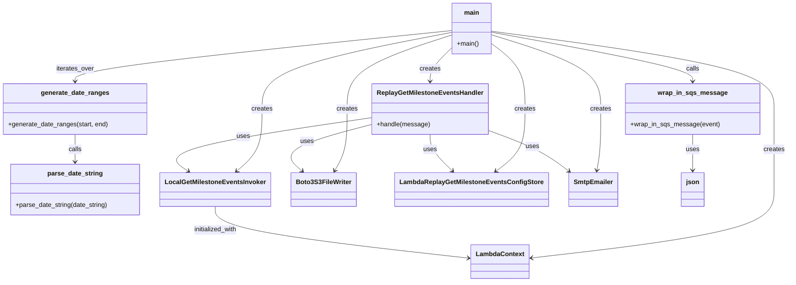

# Diagram: entity_core/entity_search/scripts/manual_replay_ford_get_milestone_events_for_time_range.py


> Auto-generated by Obscura crawlers

## Diagram 1

```mermaid
flowchart TD
    Start[Start: main()] --> SetRanges[Set start/end strings]
    SetRanges --> CreateContext[Create LambdaContext(function_name="replay_failed_get_milestone_events")]
    CreateContext --> Instantiate[Instantiate invoker, writer, config, emailer]
    Instantiate --> CreateHandler[Create ReplayGetMilestoneEventsHandler(invoker, writer, config, emailer)]
    CreateHandler --> Loop[Loop over generate_date_ranges(start, end)]
    Loop --> ForEach[For each (start_time, end_time)]
    ForEach --> CopyEvent[Copy BASE_EVENT -> event]
    CopyEvent --> SetParams[Set event.queryStringParameters and multiValueQueryStringParameters with ISO timestamps]
    SetParams --> Wrap[wrap_in_sqs_message(event) -> sqs_message]
    Wrap --> HandlerCall[handler.handle(sqs_message)]
    HandlerCall --> Loop
    Loop --> End[End]
```

> SVG rendering failed for this diagram.

## Diagram 2



### SVG

<svg id="container" width="1903.19140625" xmlns="http://www.w3.org/2000/svg" class="classDiagram" height="700" viewBox="0 0 1903.19140625 700" role="graphics-document document" aria-roledescription="class"><style>#container{font-family:"trebuchet ms",verdana,arial,sans-serif;font-size:16px;fill:#333;}@keyframes edge-animation-frame{from{stroke-dashoffset:0;}}@keyframes dash{to{stroke-dashoffset:0;}}#container .edge-animation-slow{stroke-dasharray:9,5!important;stroke-dashoffset:900;animation:dash 50s linear infinite;stroke-linecap:round;}#container .edge-animation-fast{stroke-dasharray:9,5!important;stroke-dashoffset:900;animation:dash 20s linear infinite;stroke-linecap:round;}#container .error-icon{fill:#552222;}#container .error-text{fill:#552222;stroke:#552222;}#container .edge-thickness-normal{stroke-width:1px;}#container .edge-thickness-thick{stroke-width:3.5px;}#container .edge-pattern-solid{stroke-dasharray:0;}#container .edge-thickness-invisible{stroke-width:0;fill:none;}#container .edge-pattern-dashed{stroke-dasharray:3;}#container .edge-pattern-dotted{stroke-dasharray:2;}#container .marker{fill:#333333;stroke:#333333;}#container .marker.cross{stroke:#333333;}#container svg{font-family:"trebuchet ms",verdana,arial,sans-serif;font-size:16px;}#container p{margin:0;}#container g.classGroup text{fill:#9370DB;stroke:none;font-family:"trebuchet ms",verdana,arial,sans-serif;font-size:10px;}#container g.classGroup text .title{font-weight:bolder;}#container .nodeLabel,#container .edgeLabel{color:#131300;}#container .edgeLabel .label rect{fill:#ECECFF;}#container .label text{fill:#131300;}#container .labelBkg{background:#ECECFF;}#container .edgeLabel .label span{background:#ECECFF;}#container .classTitle{font-weight:bolder;}#container .node rect,#container .node circle,#container .node ellipse,#container .node polygon,#container .node path{fill:#ECECFF;stroke:#9370DB;stroke-width:1px;}#container .divider{stroke:#9370DB;stroke-width:1;}#container g.clickable{cursor:pointer;}#container g.classGroup rect{fill:#ECECFF;stroke:#9370DB;}#container g.classGroup line{stroke:#9370DB;stroke-width:1;}#container .classLabel .box{stroke:none;stroke-width:0;fill:#ECECFF;opacity:0.5;}#container .classLabel .label{fill:#9370DB;font-size:10px;}#container .relation{stroke:#333333;stroke-width:1;fill:none;}#container .dashed-line{stroke-dasharray:3;}#container .dotted-line{stroke-dasharray:1 2;}#container #compositionStart,#container .composition{fill:#333333!important;stroke:#333333!important;stroke-width:1;}#container #compositionEnd,#container .composition{fill:#333333!important;stroke:#333333!important;stroke-width:1;}#container #dependencyStart,#container .dependency{fill:#333333!important;stroke:#333333!important;stroke-width:1;}#container #dependencyStart,#container .dependency{fill:#333333!important;stroke:#333333!important;stroke-width:1;}#container #extensionStart,#container .extension{fill:transparent!important;stroke:#333333!important;stroke-width:1;}#container #extensionEnd,#container .extension{fill:transparent!important;stroke:#333333!important;stroke-width:1;}#container #aggregationStart,#container .aggregation{fill:transparent!important;stroke:#333333!important;stroke-width:1;}#container #aggregationEnd,#container .aggregation{fill:transparent!important;stroke:#333333!important;stroke-width:1;}#container #lollipopStart,#container .lollipop{fill:#ECECFF!important;stroke:#333333!important;stroke-width:1;}#container #lollipopEnd,#container .lollipop{fill:#ECECFF!important;stroke:#333333!important;stroke-width:1;}#container .edgeTerminals{font-size:11px;line-height:initial;}#container .classTitleText{text-anchor:middle;font-size:18px;fill:#333;}#container .label-icon{display:inline-block;height:1em;overflow:visible;vertical-align:-0.125em;}#container .node .label-icon path{fill:currentColor;stroke:revert;stroke-width:revert;}#container :root{--mermaid-font-family:"trebuchet ms",verdana,arial,sans-serif;}</style><g><defs><marker id="container_class-aggregationStart" class="marker aggregation class" refX="18" refY="7" markerWidth="190" markerHeight="240" orient="auto"><path d="M 18,7 L9,13 L1,7 L9,1 Z"></path></marker></defs><defs><marker id="container_class-aggregationEnd" class="marker aggregation class" refX="1" refY="7" markerWidth="20" markerHeight="28" orient="auto"><path d="M 18,7 L9,13 L1,7 L9,1 Z"></path></marker></defs><defs><marker id="container_class-extensionStart" class="marker extension class" refX="18" refY="7" markerWidth="190" markerHeight="240" orient="auto"><path d="M 1,7 L18,13 V 1 Z"></path></marker></defs><defs><marker id="container_class-extensionEnd" class="marker extension class" refX="1" refY="7" markerWidth="20" markerHeight="28" orient="auto"><path d="M 1,1 V 13 L18,7 Z"></path></marker></defs><defs><marker id="container_class-compositionStart" class="marker composition class" refX="18" refY="7" markerWidth="190" markerHeight="240" orient="auto"><path d="M 18,7 L9,13 L1,7 L9,1 Z"></path></marker></defs><defs><marker id="container_class-compositionEnd" class="marker composition class" refX="1" refY="7" markerWidth="20" markerHeight="28" orient="auto"><path d="M 18,7 L9,13 L1,7 L9,1 Z"></path></marker></defs><defs><marker id="container_class-dependencyStart" class="marker dependency class" refX="6" refY="7" markerWidth="190" markerHeight="240" orient="auto"><path d="M 5,7 L9,13 L1,7 L9,1 Z"></path></marker></defs><defs><marker id="container_class-dependencyEnd" class="marker dependency class" refX="13" refY="7" markerWidth="20" markerHeight="28" orient="auto"><path d="M 18,7 L9,13 L14,7 L9,1 Z"></path></marker></defs><defs><marker id="container_class-lollipopStart" class="marker lollipop class" refX="13" refY="7" markerWidth="190" markerHeight="240" orient="auto"><circle stroke="black" fill="transparent" cx="7" cy="7" r="6"></circle></marker></defs><defs><marker id="container_class-lollipopEnd" class="marker lollipop class" refX="1" refY="7" markerWidth="190" markerHeight="240" orient="auto"><circle stroke="black" fill="transparent" cx="7" cy="7" r="6"></circle></marker></defs><g class="root"><g class="clusters"></g><g class="edgePaths"><path d="M1188.855,77.635L1302.216,93.196C1415.577,108.757,1642.298,139.878,1755.659,172.106C1869.02,204.333,1869.02,237.667,1869.02,271C1869.02,304.333,1869.02,337.667,1869.02,371C1869.02,404.333,1869.02,437.667,1869.02,471C1869.02,504.333,1869.02,537.667,1772.094,565.991C1675.169,594.316,1481.319,617.632,1384.394,629.29L1287.469,640.949" id="id_main_LambdaContext_1" class="edge-thickness-normal edge-pattern-solid relation" style=";;;" data-edge="true" data-et="edge" data-id="id_main_LambdaContext_1" data-points="W3sieCI6MTE4OC44NTU0Njg3NSwieSI6NzcuNjM1NDk1NDc3MTM5MDV9LHsieCI6MTg2OS4wMTk1MzEyNSwieSI6MTcxfSx7IngiOjE4NjkuMDE5NTMxMjUsInkiOjI3MX0seyJ4IjoxODY5LjAxOTUzMTI1LCJ5IjozNzF9LHsieCI6MTg2OS4wMTk1MzEyNSwieSI6NDcxfSx7IngiOjE4NjkuMDE5NTMxMjUsInkiOjU3MX0seyJ4IjoxMjgxLjUxMTcxODc1LCJ5Ijo2NDEuNjY1MDIxMjMyMDUzOH1d" marker-end="url(#container_class-dependencyEnd)"></path><path d="M1092.176,80.599L1016.301,95.666C940.426,110.733,788.676,140.866,712.801,172.6C636.926,204.333,636.926,237.667,636.926,271C636.926,304.333,636.926,337.667,626.937,363.331C616.949,388.995,596.972,406.99,586.983,415.987L576.995,424.984" id="id_main_LocalGetMilestoneEventsInvoker_2" class="edge-thickness-normal edge-pattern-solid relation" style=";;;" data-edge="true" data-et="edge" data-id="id_main_LocalGetMilestoneEventsInvoker_2" data-points="W3sieCI6MTA5Mi4xNzU3ODEyNSwieSI6ODAuNTk5MDUwNTY2NjM0ODZ9LHsieCI6NjM2LjkyNTc4MTI1LCJ5IjoxNzF9LHsieCI6NjM2LjkyNTc4MTI1LCJ5IjoyNzF9LHsieCI6NjM2LjkyNTc4MTI1LCJ5IjozNzF9LHsieCI6NTcyLjUzNjcxODc1LCJ5Ijo0Mjl9XQ==" marker-end="url(#container_class-dependencyEnd)"></path><path d="M1092.176,86.961L1049.754,100.967C1007.332,114.974,922.488,142.987,880.066,173.66C837.645,204.333,837.645,237.667,837.645,271C837.645,304.333,837.645,337.667,832.971,363.117C828.297,388.568,818.949,406.135,814.275,414.919L809.601,423.703" id="id_main_Boto3S3FileWriter_3" class="edge-thickness-normal edge-pattern-solid relation" style=";;;" data-edge="true" data-et="edge" data-id="id_main_Boto3S3FileWriter_3" data-points="W3sieCI6MTA5Mi4xNzU3ODEyNSwieSI6ODYuOTYwNTMzOTUyNDA4NTh9LHsieCI6ODM3LjY0NDUzMTI1LCJ5IjoxNzF9LHsieCI6ODM3LjY0NDUzMTI1LCJ5IjoyNzF9LHsieCI6ODM3LjY0NDUzMTI1LCJ5IjozNzF9LHsieCI6ODA2Ljc4MjE4NzUsInkiOjQyOX1d" marker-end="url(#container_class-dependencyEnd)"></path><path d="M1188.855,109.193L1201.893,119.494C1214.931,129.796,1241.007,150.398,1254.044,177.366C1267.082,204.333,1267.082,237.667,1267.082,271C1267.082,304.333,1267.082,337.667,1255.632,363.38C1244.182,389.093,1221.282,407.187,1209.831,416.234L1198.381,425.28" id="id_main_LambdaReplayGetMilestoneEventsConfigStore_4" class="edge-thickness-normal edge-pattern-solid relation" style=";;;" data-edge="true" data-et="edge" data-id="id_main_LambdaReplayGetMilestoneEventsConfigStore_4" data-points="W3sieCI6MTE4OC44NTU0Njg3NSwieSI6MTA5LjE5MzI2NTYzOTk0OTM3fSx7IngiOjEyNjcuMDgyMDMxMjUsInkiOjE3MX0seyJ4IjoxMjY3LjA4MjAzMTI1LCJ5IjoyNzF9LHsieCI6MTI2Ny4wODIwMzEyNSwieSI6MzcxfSx7IngiOjExOTMuNjczNTE1NjI1LCJ5Ijo0Mjl9XQ==" marker-end="url(#container_class-dependencyEnd)"></path><path d="M1188.855,86.701L1232.111,100.751C1275.366,114.801,1361.876,142.9,1405.132,173.617C1448.387,204.333,1448.387,237.667,1448.387,271C1448.387,304.333,1448.387,337.667,1446.802,363.016C1445.218,388.366,1442.05,405.732,1440.465,414.415L1438.881,423.097" id="id_main_SmtpEmailer_5" class="edge-thickness-normal edge-pattern-solid relation" style=";;;" data-edge="true" data-et="edge" data-id="id_main_SmtpEmailer_5" data-points="W3sieCI6MTE4OC44NTU0Njg3NSwieSI6ODYuNzAxMzI1ODg5NzQxOH0seyJ4IjoxNDQ4LjM4NjcxODc1LCJ5IjoxNzF9LHsieCI6MTQ0OC4zODY3MTg3NSwieSI6MjcxfSx7IngiOjE0NDguMzg2NzE4NzUsInkiOjM3MX0seyJ4IjoxNDM3LjgwMzk4NDM3NSwieSI6NDI5fV0=" marker-end="url(#container_class-dependencyEnd)"></path><path d="M1092.176,118.882L1083.406,127.568C1074.637,136.254,1057.098,153.627,1048.328,167.48C1039.559,181.333,1039.559,191.667,1039.559,196.833L1039.559,202" id="id_main_ReplayGetMilestoneEventsHandler_6" class="edge-thickness-normal edge-pattern-solid relation" style=";;;" data-edge="true" data-et="edge" data-id="id_main_ReplayGetMilestoneEventsHandler_6" data-points="W3sieCI6MTA5Mi4xNzU3ODEyNSwieSI6MTE4Ljg4MTYwMTg1NzIyNTc3fSx7IngiOjEwMzkuNTU4NTkzNzUsInkiOjE3MX0seyJ4IjoxMDM5LjU1ODU5Mzc1LCJ5IjoyMDh9XQ==" marker-end="url(#container_class-dependencyEnd)"></path><path d="M898.816,292.391L812.616,305.493C726.415,318.594,554.014,344.797,480.941,366.996C407.867,389.194,434.12,407.388,447.247,416.485L460.374,425.582" id="id_ReplayGetMilestoneEventsHandler_LocalGetMilestoneEventsInvoker_7" class="edge-thickness-normal edge-pattern-solid relation" style=";;;" data-edge="true" data-et="edge" data-id="id_ReplayGetMilestoneEventsHandler_LocalGetMilestoneEventsInvoker_7" data-points="W3sieCI6ODk4LjgxNjQwNjI1LCJ5IjoyOTIuMzkxMTY4MDUzOTU1OX0seyJ4IjozODEuNjEzMjgxMjUsInkiOjM3MX0seyJ4Ijo0NjUuMzA1NDY4NzUsInkiOjQyOX1d" marker-end="url(#container_class-dependencyEnd)"></path><path d="M898.816,309.439L861.25,319.699C823.684,329.96,748.551,350.48,720.973,369.737C693.395,388.995,713.372,406.99,723.36,415.987L733.349,424.984" id="id_ReplayGetMilestoneEventsHandler_Boto3S3FileWriter_8" class="edge-thickness-normal edge-pattern-solid relation" style=";;;" data-edge="true" data-et="edge" data-id="id_ReplayGetMilestoneEventsHandler_Boto3S3FileWriter_8" data-points="W3sieCI6ODk4LjgxNjQwNjI1LCJ5IjozMDkuNDM5MzgwMzYxMDI5M30seyJ4Ijo2NzMuNDE3OTY4NzUsInkiOjM3MX0seyJ4Ijo3MzcuODA3MDMxMjUsInkiOjQyOX1d" marker-end="url(#container_class-dependencyEnd)"></path><path d="M1039.559,334L1039.559,340.167C1039.559,346.333,1039.559,358.667,1048.607,373.796C1057.656,388.926,1075.753,406.852,1084.802,415.815L1093.851,424.778" id="id_ReplayGetMilestoneEventsHandler_LambdaReplayGetMilestoneEventsConfigStore_9" class="edge-thickness-normal edge-pattern-solid relation" style=";;;" data-edge="true" data-et="edge" data-id="id_ReplayGetMilestoneEventsHandler_LambdaReplayGetMilestoneEventsConfigStore_9" data-points="W3sieCI6MTAzOS41NTg1OTM3NSwieSI6MzM0fSx7IngiOjEwMzkuNTU4NTkzNzUsInkiOjM3MX0seyJ4IjoxMDk4LjExMzY3MTg3NSwieSI6NDI5fV0=" marker-end="url(#container_class-dependencyEnd)"></path><path d="M1180.301,324.308L1200.846,332.09C1221.392,339.872,1262.483,355.436,1294.479,372.265C1326.474,389.093,1349.375,407.187,1360.825,416.234L1372.275,425.28" id="id_ReplayGetMilestoneEventsHandler_SmtpEmailer_10" class="edge-thickness-normal edge-pattern-solid relation" style=";;;" data-edge="true" data-et="edge" data-id="id_ReplayGetMilestoneEventsHandler_SmtpEmailer_10" data-points="W3sieCI6MTE4MC4zMDA3ODEyNSwieSI6MzI0LjMwODI3OTU3NjI1NjE1fSx7IngiOjEzMDMuNTc0MjE4NzUsInkiOjM3MX0seyJ4IjoxMzc2Ljk4MjczNDM3NSwieSI6NDI5fV0=" marker-end="url(#container_class-dependencyEnd)"></path><path d="M525.91,513L525.91,522.667C525.91,532.333,525.91,551.667,627.751,573.056C729.593,594.446,933.275,617.891,1035.116,629.614L1136.957,641.337" id="id_LocalGetMilestoneEventsInvoker_LambdaContext_11" class="edge-thickness-normal edge-pattern-solid relation" style=";;;" data-edge="true" data-et="edge" data-id="id_LocalGetMilestoneEventsInvoker_LambdaContext_11" data-points="W3sieCI6NTI1LjkxMDE1NjI1LCJ5Ijo1MTN9LHsieCI6NTI1LjkxMDE1NjI1LCJ5Ijo1NzF9LHsieCI6MTE0Mi45MTc5Njg3NSwieSI6NjQyLjAyMzI5MDQ5MzY5OTN9XQ==" marker-end="url(#container_class-dependencyEnd)"></path><path d="M184.379,334L184.379,340.167C184.379,346.333,184.379,358.667,184.379,370C184.379,381.333,184.379,391.667,184.379,396.833L184.379,402" id="id_generate_date_ranges_parse_date_string_12" class="edge-thickness-normal edge-pattern-solid relation" style=";;;" data-edge="true" data-et="edge" data-id="id_generate_date_ranges_parse_date_string_12" data-points="W3sieCI6MTg0LjM3ODkwNjI1LCJ5IjozMzR9LHsieCI6MTg0LjM3ODkwNjI1LCJ5IjozNzF9LHsieCI6MTg0LjM3ODkwNjI1LCJ5Ijo0MDh9XQ==" marker-end="url(#container_class-dependencyEnd)"></path><path d="M1671.789,334L1671.789,340.167C1671.789,346.333,1671.789,358.667,1671.789,373.5C1671.789,388.333,1671.789,405.667,1671.789,414.333L1671.789,423" id="id_wrap_in_sqs_message_json_13" class="edge-thickness-normal edge-pattern-solid relation" style=";;;" data-edge="true" data-et="edge" data-id="id_wrap_in_sqs_message_json_13" data-points="W3sieCI6MTY3MS43ODkwNjI1LCJ5IjozMzR9LHsieCI6MTY3MS43ODkwNjI1LCJ5IjozNzF9LHsieCI6MTY3MS43ODkwNjI1LCJ5Ijo0Mjl9XQ==" marker-end="url(#container_class-dependencyEnd)"></path><path d="M1092.176,76.056L940.876,91.88C789.577,107.704,486.978,139.352,335.678,160.343C184.379,181.333,184.379,191.667,184.379,196.833L184.379,202" id="id_main_generate_date_ranges_14" class="edge-thickness-normal edge-pattern-solid relation" style=";;;" data-edge="true" data-et="edge" data-id="id_main_generate_date_ranges_14" data-points="W3sieCI6MTA5Mi4xNzU3ODEyNSwieSI6NzYuMDU1NzQ1OTgyOTgwMDF9LHsieCI6MTg0LjM3ODkwNjI1LCJ5IjoxNzF9LHsieCI6MTg0LjM3ODkwNjI1LCJ5IjoyMDh9XQ==" marker-end="url(#container_class-dependencyEnd)"></path><path d="M1188.855,80.099L1269.344,95.249C1349.833,110.399,1510.811,140.7,1591.3,161.016C1671.789,181.333,1671.789,191.667,1671.789,196.833L1671.789,202" id="id_main_wrap_in_sqs_message_15" class="edge-thickness-normal edge-pattern-solid relation" style=";;;" data-edge="true" data-et="edge" data-id="id_main_wrap_in_sqs_message_15" data-points="W3sieCI6MTE4OC44NTU0Njg3NSwieSI6ODAuMDk4ODYzMjg1NDQzMjl9LHsieCI6MTY3MS43ODkwNjI1LCJ5IjoxNzF9LHsieCI6MTY3MS43ODkwNjI1LCJ5IjoyMDh9XQ==" marker-end="url(#container_class-dependencyEnd)"></path></g><g class="edgeLabels"><g class="edgeLabel" transform="translate(1869.01953125, 371)"><g class="label" data-id="id_main_LambdaContext_1" transform="translate(-26.171875, -12)"><foreignObject width="52.34375" height="24"><div xmlns="http://www.w3.org/1999/xhtml" class="labelBkg" style="display: table-cell; white-space: nowrap; line-height: 1.5; max-width: 200px; text-align: center;"><span class="edgeLabel"><p>creates</p></span></div></foreignObject></g></g><g class="edgeLabel" transform="translate(636.92578125, 271)"><g class="label" data-id="id_main_LocalGetMilestoneEventsInvoker_2" transform="translate(-26.171875, -12)"><foreignObject width="52.34375" height="24"><div xmlns="http://www.w3.org/1999/xhtml" class="labelBkg" style="display: table-cell; white-space: nowrap; line-height: 1.5; max-width: 200px; text-align: center;"><span class="edgeLabel"><p>creates</p></span></div></foreignObject></g></g><g class="edgeLabel" transform="translate(837.64453125, 271)"><g class="label" data-id="id_main_Boto3S3FileWriter_3" transform="translate(-26.171875, -12)"><foreignObject width="52.34375" height="24"><div xmlns="http://www.w3.org/1999/xhtml" class="labelBkg" style="display: table-cell; white-space: nowrap; line-height: 1.5; max-width: 200px; text-align: center;"><span class="edgeLabel"><p>creates</p></span></div></foreignObject></g></g><g class="edgeLabel" transform="translate(1267.08203125, 271)"><g class="label" data-id="id_main_LambdaReplayGetMilestoneEventsConfigStore_4" transform="translate(-26.171875, -12)"><foreignObject width="52.34375" height="24"><div xmlns="http://www.w3.org/1999/xhtml" class="labelBkg" style="display: table-cell; white-space: nowrap; line-height: 1.5; max-width: 200px; text-align: center;"><span class="edgeLabel"><p>creates</p></span></div></foreignObject></g></g><g class="edgeLabel" transform="translate(1448.38671875, 271)"><g class="label" data-id="id_main_SmtpEmailer_5" transform="translate(-26.171875, -12)"><foreignObject width="52.34375" height="24"><div xmlns="http://www.w3.org/1999/xhtml" class="labelBkg" style="display: table-cell; white-space: nowrap; line-height: 1.5; max-width: 200px; text-align: center;"><span class="edgeLabel"><p>creates</p></span></div></foreignObject></g></g><g class="edgeLabel" transform="translate(1039.55859375, 171)"><g class="label" data-id="id_main_ReplayGetMilestoneEventsHandler_6" transform="translate(-26.171875, -12)"><foreignObject width="52.34375" height="24"><div xmlns="http://www.w3.org/1999/xhtml" class="labelBkg" style="display: table-cell; white-space: nowrap; line-height: 1.5; max-width: 200px; text-align: center;"><span class="edgeLabel"><p>creates</p></span></div></foreignObject></g></g><g class="edgeLabel" transform="translate(589.88027, 339.34585)"><g class="label" data-id="id_ReplayGetMilestoneEventsHandler_LocalGetMilestoneEventsInvoker_7" transform="translate(-16.4921875, -12)"><foreignObject width="32.984375" height="24"><div xmlns="http://www.w3.org/1999/xhtml" class="labelBkg" style="display: table-cell; white-space: nowrap; line-height: 1.5; max-width: 200px; text-align: center;"><span class="edgeLabel"><p>uses</p></span></div></foreignObject></g></g><g class="edgeLabel" transform="translate(744.31814, 351.63581)"><g class="label" data-id="id_ReplayGetMilestoneEventsHandler_Boto3S3FileWriter_8" transform="translate(-16.4921875, -12)"><foreignObject width="32.984375" height="24"><div xmlns="http://www.w3.org/1999/xhtml" class="labelBkg" style="display: table-cell; white-space: nowrap; line-height: 1.5; max-width: 200px; text-align: center;"><span class="edgeLabel"><p>uses</p></span></div></foreignObject></g></g><g class="edgeLabel" transform="translate(1039.55859375, 371)"><g class="label" data-id="id_ReplayGetMilestoneEventsHandler_LambdaReplayGetMilestoneEventsConfigStore_9" transform="translate(-16.4921875, -12)"><foreignObject width="32.984375" height="24"><div xmlns="http://www.w3.org/1999/xhtml" class="labelBkg" style="display: table-cell; white-space: nowrap; line-height: 1.5; max-width: 200px; text-align: center;"><span class="edgeLabel"><p>uses</p></span></div></foreignObject></g></g><g class="edgeLabel" transform="translate(1285.68293, 364.2234)"><g class="label" data-id="id_ReplayGetMilestoneEventsHandler_SmtpEmailer_10" transform="translate(-16.4921875, -12)"><foreignObject width="32.984375" height="24"><div xmlns="http://www.w3.org/1999/xhtml" class="labelBkg" style="display: table-cell; white-space: nowrap; line-height: 1.5; max-width: 200px; text-align: center;"><span class="edgeLabel"><p>uses</p></span></div></foreignObject></g></g><g class="edgeLabel" transform="translate(525.91015625, 571)"><g class="label" data-id="id_LocalGetMilestoneEventsInvoker_LambdaContext_11" transform="translate(-55.375, -12)"><foreignObject width="110.75" height="24"><div xmlns="http://www.w3.org/1999/xhtml" class="labelBkg" style="display: table-cell; white-space: nowrap; line-height: 1.5; max-width: 200px; text-align: center;"><span class="edgeLabel"><p>initialized_with</p></span></div></foreignObject></g></g><g class="edgeLabel" transform="translate(184.37890625, 371)"><g class="label" data-id="id_generate_date_ranges_parse_date_string_12" transform="translate(-16.4453125, -12)"><foreignObject width="32.890625" height="24"><div xmlns="http://www.w3.org/1999/xhtml" class="labelBkg" style="display: table-cell; white-space: nowrap; line-height: 1.5; max-width: 200px; text-align: center;"><span class="edgeLabel"><p>calls</p></span></div></foreignObject></g></g><g class="edgeLabel" transform="translate(1671.7890625, 371)"><g class="label" data-id="id_wrap_in_sqs_message_json_13" transform="translate(-16.4921875, -12)"><foreignObject width="32.984375" height="24"><div xmlns="http://www.w3.org/1999/xhtml" class="labelBkg" style="display: table-cell; white-space: nowrap; line-height: 1.5; max-width: 200px; text-align: center;"><span class="edgeLabel"><p>uses</p></span></div></foreignObject></g></g><g class="edgeLabel" transform="translate(184.37890625, 171)"><g class="label" data-id="id_main_generate_date_ranges_14" transform="translate(-47.2421875, -12)"><foreignObject width="94.484375" height="24"><div xmlns="http://www.w3.org/1999/xhtml" class="labelBkg" style="display: table-cell; white-space: nowrap; line-height: 1.5; max-width: 200px; text-align: center;"><span class="edgeLabel"><p>iterates_over</p></span></div></foreignObject></g></g><g class="edgeLabel" transform="translate(1671.7890625, 171)"><g class="label" data-id="id_main_wrap_in_sqs_message_15" transform="translate(-16.4453125, -12)"><foreignObject width="32.890625" height="24"><div xmlns="http://www.w3.org/1999/xhtml" class="labelBkg" style="display: table-cell; white-space: nowrap; line-height: 1.5; max-width: 200px; text-align: center;"><span class="edgeLabel"><p>calls</p></span></div></foreignObject></g></g></g><g class="nodes"><g class="node default" id="classId-main-0" transform="translate(1140.515625, 71)"><g class="basic label-container"><path d="M-48.33984375 -63 L48.33984375 -63 L48.33984375 63 L-48.33984375 63" stroke="none" stroke-width="0" fill="#ECECFF" style=""></path><path d="M-48.33984375 -63 C-10.056228214199415 -63, 28.22738732160117 -63, 48.33984375 -63 M-48.33984375 -63 C-14.592822527382232 -63, 19.154198695235536 -63, 48.33984375 -63 M48.33984375 -63 C48.33984375 -24.551957798236486, 48.33984375 13.896084403527027, 48.33984375 63 M48.33984375 -63 C48.33984375 -34.44075185190865, 48.33984375 -5.881503703817302, 48.33984375 63 M48.33984375 63 C26.901404524243 63, 5.462965298485997 63, -48.33984375 63 M48.33984375 63 C11.135295248050468 63, -26.069253253899063 63, -48.33984375 63 M-48.33984375 63 C-48.33984375 19.24236628186003, -48.33984375 -24.51526743627994, -48.33984375 -63 M-48.33984375 63 C-48.33984375 15.625579033799035, -48.33984375 -31.74884193240193, -48.33984375 -63" stroke="#9370DB" stroke-width="1.3" fill="none" stroke-dasharray="0 0" style=""></path></g><g class="annotation-group text" transform="translate(0, -39)"></g><g class="label-group text" transform="translate(-18.0234375, -39)"><g class="label" style="font-weight: bolder" transform="translate(0,-12)"><foreignObject width="36.046875" height="24"><div xmlns="http://www.w3.org/1999/xhtml" style="display: table-cell; white-space: nowrap; line-height: 1.5; max-width: 86px; text-align: center;"><span class="nodeLabel markdown-node-label" style=""><p>main</p></span></div></foreignObject></g></g><g class="members-group text" transform="translate(-36.33984375, 9)"></g><g class="methods-group text" transform="translate(-36.33984375, 39)"><g class="label" style="" transform="translate(0,-12)"><foreignObject width="54.65625" height="24"><div xmlns="http://www.w3.org/1999/xhtml" style="display: table-cell; white-space: nowrap; line-height: 1.5; max-width: 112px; text-align: center;"><span class="nodeLabel markdown-node-label" style=""><p>+main()</p></span></div></foreignObject></g></g><g class="divider" style=""><path d="M-48.33984375 -15 C-23.47463635493547 -15, 1.3905710401290605 -15, 48.33984375 -15 M-48.33984375 -15 C-19.236100453484383 -15, 9.867642843031234 -15, 48.33984375 -15" stroke="#9370DB" stroke-width="1.3" fill="none" stroke-dasharray="0 0" style=""></path></g><g class="divider" style=""><path d="M-48.33984375 9 C-13.87644381468268 9, 20.58695612063464 9, 48.33984375 9 M-48.33984375 9 C-21.135759924117888 9, 6.068323901764224 9, 48.33984375 9" stroke="#9370DB" stroke-width="1.3" fill="none" stroke-dasharray="0 0" style=""></path></g></g><g class="node default" id="classId-generate_date_ranges-1" transform="translate(184.37890625, 271)"><g class="basic label-container"><path d="M-176.37890625 -63 L176.37890625 -63 L176.37890625 63 L-176.37890625 63" stroke="none" stroke-width="0" fill="#ECECFF" style=""></path><path d="M-176.37890625 -63 C-95.87177873706328 -63, -15.364651224126561 -63, 176.37890625 -63 M-176.37890625 -63 C-85.00660171911437 -63, 6.365702811771257 -63, 176.37890625 -63 M176.37890625 -63 C176.37890625 -34.727888201966564, 176.37890625 -6.455776403933136, 176.37890625 63 M176.37890625 -63 C176.37890625 -23.509197574856934, 176.37890625 15.981604850286132, 176.37890625 63 M176.37890625 63 C96.49376841448313 63, 16.608630578966256 63, -176.37890625 63 M176.37890625 63 C74.57940540171019 63, -27.22009544657962 63, -176.37890625 63 M-176.37890625 63 C-176.37890625 23.66949303070416, -176.37890625 -15.66101393859168, -176.37890625 -63 M-176.37890625 63 C-176.37890625 26.828586874584225, -176.37890625 -9.34282625083155, -176.37890625 -63" stroke="#9370DB" stroke-width="1.3" fill="none" stroke-dasharray="0 0" style=""></path></g><g class="annotation-group text" transform="translate(0, -39)"></g><g class="label-group text" transform="translate(-81.1796875, -39)"><g class="label" style="font-weight: bolder" transform="translate(0,-12)"><foreignObject width="162.359375" height="24"><div xmlns="http://www.w3.org/1999/xhtml" style="display: table-cell; white-space: nowrap; line-height: 1.5; max-width: 210px; text-align: center;"><span class="nodeLabel markdown-node-label" style=""><p>generate_date_ranges</p></span></div></foreignObject></g></g><g class="members-group text" transform="translate(-164.37890625, 9)"></g><g class="methods-group text" transform="translate(-164.37890625, 39)"><g class="label" style="" transform="translate(0,-12)"><foreignObject width="247.578125" height="24"><div xmlns="http://www.w3.org/1999/xhtml" style="display: table-cell; white-space: nowrap; line-height: 1.5; max-width: 305px; text-align: center;"><span class="nodeLabel markdown-node-label" style=""><p>+generate_date_ranges(start, end)</p></span></div></foreignObject></g></g><g class="divider" style=""><path d="M-176.37890625 -15 C-54.541047942072424 -15, 67.29681036585515 -15, 176.37890625 -15 M-176.37890625 -15 C-62.44132271382189 -15, 51.49626082235622 -15, 176.37890625 -15" stroke="#9370DB" stroke-width="1.3" fill="none" stroke-dasharray="0 0" style=""></path></g><g class="divider" style=""><path d="M-176.37890625 9 C-56.58181162600026 9, 63.21528299799948 9, 176.37890625 9 M-176.37890625 9 C-38.96037194976887 9, 98.45816235046226 9, 176.37890625 9" stroke="#9370DB" stroke-width="1.3" fill="none" stroke-dasharray="0 0" style=""></path></g></g><g class="node default" id="classId-parse_date_string-2" transform="translate(184.37890625, 471)"><g class="basic label-container"><path d="M-160.4140625 -63 L160.4140625 -63 L160.4140625 63 L-160.4140625 63" stroke="none" stroke-width="0" fill="#ECECFF" style=""></path><path d="M-160.4140625 -63 C-96.14503184427039 -63, -31.876001188540783 -63, 160.4140625 -63 M-160.4140625 -63 C-66.41980114948426 -63, 27.574460201031485 -63, 160.4140625 -63 M160.4140625 -63 C160.4140625 -24.08034327193947, 160.4140625 14.839313456121062, 160.4140625 63 M160.4140625 -63 C160.4140625 -26.417253410864703, 160.4140625 10.165493178270594, 160.4140625 63 M160.4140625 63 C95.97457940152654 63, 31.53509630305308 63, -160.4140625 63 M160.4140625 63 C58.767424153472845 63, -42.87921419305431 63, -160.4140625 63 M-160.4140625 63 C-160.4140625 27.838505165442648, -160.4140625 -7.322989669114705, -160.4140625 -63 M-160.4140625 63 C-160.4140625 34.370569759988285, -160.4140625 5.741139519976564, -160.4140625 -63" stroke="#9370DB" stroke-width="1.3" fill="none" stroke-dasharray="0 0" style=""></path></g><g class="annotation-group text" transform="translate(0, -39)"></g><g class="label-group text" transform="translate(-66.296875, -39)"><g class="label" style="font-weight: bolder" transform="translate(0,-12)"><foreignObject width="132.59375" height="24"><div xmlns="http://www.w3.org/1999/xhtml" style="display: table-cell; white-space: nowrap; line-height: 1.5; max-width: 181px; text-align: center;"><span class="nodeLabel markdown-node-label" style=""><p>parse_date_string</p></span></div></foreignObject></g></g><g class="members-group text" transform="translate(-148.4140625, 9)"></g><g class="methods-group text" transform="translate(-148.4140625, 39)"><g class="label" style="" transform="translate(0,-12)"><foreignObject width="230.53125" height="24"><div xmlns="http://www.w3.org/1999/xhtml" style="display: table-cell; white-space: nowrap; line-height: 1.5; max-width: 288px; text-align: center;"><span class="nodeLabel markdown-node-label" style=""><p>+parse_date_string(date_string)</p></span></div></foreignObject></g></g><g class="divider" style=""><path d="M-160.4140625 -15 C-58.78362557093271 -15, 42.84681135813457 -15, 160.4140625 -15 M-160.4140625 -15 C-41.812623656374086 -15, 76.78881518725183 -15, 160.4140625 -15" stroke="#9370DB" stroke-width="1.3" fill="none" stroke-dasharray="0 0" style=""></path></g><g class="divider" style=""><path d="M-160.4140625 9 C-52.8905948303465 9, 54.632872839307 9, 160.4140625 9 M-160.4140625 9 C-56.750683264156166 9, 46.91269597168767 9, 160.4140625 9" stroke="#9370DB" stroke-width="1.3" fill="none" stroke-dasharray="0 0" style=""></path></g></g><g class="node default" id="classId-wrap_in_sqs_message-3" transform="translate(1671.7890625, 271)"><g class="basic label-container"><path d="M-162.23046875 -63 L162.23046875 -63 L162.23046875 63 L-162.23046875 63" stroke="none" stroke-width="0" fill="#ECECFF" style=""></path><path d="M-162.23046875 -63 C-34.22811940951189 -63, 93.77422993097622 -63, 162.23046875 -63 M-162.23046875 -63 C-56.237894505919385 -63, 49.75467973816123 -63, 162.23046875 -63 M162.23046875 -63 C162.23046875 -35.037950113522115, 162.23046875 -7.0759002270442295, 162.23046875 63 M162.23046875 -63 C162.23046875 -23.705117846632405, 162.23046875 15.58976430673519, 162.23046875 63 M162.23046875 63 C53.873012223295106 63, -54.48444430340979 63, -162.23046875 63 M162.23046875 63 C39.08836483312628 63, -84.05373908374744 63, -162.23046875 63 M-162.23046875 63 C-162.23046875 13.49140891977337, -162.23046875 -36.01718216045326, -162.23046875 -63 M-162.23046875 63 C-162.23046875 29.957956428506982, -162.23046875 -3.0840871429860357, -162.23046875 -63" stroke="#9370DB" stroke-width="1.3" fill="none" stroke-dasharray="0 0" style=""></path></g><g class="annotation-group text" transform="translate(0, -39)"></g><g class="label-group text" transform="translate(-81.3671875, -39)"><g class="label" style="font-weight: bolder" transform="translate(0,-12)"><foreignObject width="162.734375" height="24"><div xmlns="http://www.w3.org/1999/xhtml" style="display: table-cell; white-space: nowrap; line-height: 1.5; max-width: 210px; text-align: center;"><span class="nodeLabel markdown-node-label" style=""><p>wrap_in_sqs_message</p></span></div></foreignObject></g></g><g class="members-group text" transform="translate(-150.23046875, 9)"></g><g class="methods-group text" transform="translate(-150.23046875, 39)"><g class="label" style="" transform="translate(0,-12)"><foreignObject width="219.09375" height="24"><div xmlns="http://www.w3.org/1999/xhtml" style="display: table-cell; white-space: nowrap; line-height: 1.5; max-width: 276px; text-align: center;"><span class="nodeLabel markdown-node-label" style=""><p>+wrap_in_sqs_message(event)</p></span></div></foreignObject></g></g><g class="divider" style=""><path d="M-162.23046875 -15 C-47.15062299194811 -15, 67.92922276610378 -15, 162.23046875 -15 M-162.23046875 -15 C-64.35737250008333 -15, 33.51572374983334 -15, 162.23046875 -15" stroke="#9370DB" stroke-width="1.3" fill="none" stroke-dasharray="0 0" style=""></path></g><g class="divider" style=""><path d="M-162.23046875 9 C-40.15918843176644 9, 81.91209188646712 9, 162.23046875 9 M-162.23046875 9 C-91.30821362567565 9, -20.385958501351297 9, 162.23046875 9" stroke="#9370DB" stroke-width="1.3" fill="none" stroke-dasharray="0 0" style=""></path></g></g><g class="node default" id="classId-ReplayGetMilestoneEventsHandler-4" transform="translate(1039.55859375, 271)"><g class="basic label-container"><path d="M-140.7421875 -63 L140.7421875 -63 L140.7421875 63 L-140.7421875 63" stroke="none" stroke-width="0" fill="#ECECFF" style=""></path><path d="M-140.7421875 -63 C-83.21922087432296 -63, -25.696254248645914 -63, 140.7421875 -63 M-140.7421875 -63 C-65.26155246679353 -63, 10.219082566412936 -63, 140.7421875 -63 M140.7421875 -63 C140.7421875 -17.51395848072646, 140.7421875 27.972083038547083, 140.7421875 63 M140.7421875 -63 C140.7421875 -31.610102101045616, 140.7421875 -0.2202042020912316, 140.7421875 63 M140.7421875 63 C56.3611398971825 63, -28.019907705635006 63, -140.7421875 63 M140.7421875 63 C74.27830055493693 63, 7.814413609873867 63, -140.7421875 63 M-140.7421875 63 C-140.7421875 33.93718827147171, -140.7421875 4.8743765429434305, -140.7421875 -63 M-140.7421875 63 C-140.7421875 35.660288079629225, -140.7421875 8.320576159258458, -140.7421875 -63" stroke="#9370DB" stroke-width="1.3" fill="none" stroke-dasharray="0 0" style=""></path></g><g class="annotation-group text" transform="translate(0, -39)"></g><g class="label-group text" transform="translate(-126.390625, -39)"><g class="label" style="font-weight: bolder" transform="translate(0,-12)"><foreignObject width="252.78125" height="24"><div xmlns="http://www.w3.org/1999/xhtml" style="display: table-cell; white-space: nowrap; line-height: 1.5; max-width: 300px; text-align: center;"><span class="nodeLabel markdown-node-label" style=""><p>ReplayGetMilestoneEventsHandler</p></span></div></foreignObject></g></g><g class="members-group text" transform="translate(-128.7421875, 9)"></g><g class="methods-group text" transform="translate(-128.7421875, 39)"><g class="label" style="" transform="translate(0,-12)"><foreignObject width="131.09375" height="24"><div xmlns="http://www.w3.org/1999/xhtml" style="display: table-cell; white-space: nowrap; line-height: 1.5; max-width: 188px; text-align: center;"><span class="nodeLabel markdown-node-label" style=""><p>+handle(message)</p></span></div></foreignObject></g></g><g class="divider" style=""><path d="M-140.7421875 -15 C-48.786803417871496 -15, 43.16858066425701 -15, 140.7421875 -15 M-140.7421875 -15 C-50.02018706962542 -15, 40.701813360749156 -15, 140.7421875 -15" stroke="#9370DB" stroke-width="1.3" fill="none" stroke-dasharray="0 0" style=""></path></g><g class="divider" style=""><path d="M-140.7421875 9 C-58.38822426432115 9, 23.965738971357695 9, 140.7421875 9 M-140.7421875 9 C-37.17146566451571 9, 66.39925617096858 9, 140.7421875 9" stroke="#9370DB" stroke-width="1.3" fill="none" stroke-dasharray="0 0" style=""></path></g></g><g class="node default" id="classId-LocalGetMilestoneEventsInvoker-5" transform="translate(525.91015625, 471)"><g class="basic label-container"><path d="M-131.1171875 -42 L131.1171875 -42 L131.1171875 42 L-131.1171875 42" stroke="none" stroke-width="0" fill="#ECECFF" style=""></path><path d="M-131.1171875 -42 C-77.94484603631375 -42, -24.772504572627483 -42, 131.1171875 -42 M-131.1171875 -42 C-50.508436461948776 -42, 30.10031457610245 -42, 131.1171875 -42 M131.1171875 -42 C131.1171875 -14.165279962434145, 131.1171875 13.66944007513171, 131.1171875 42 M131.1171875 -42 C131.1171875 -8.851710223458142, 131.1171875 24.296579553083717, 131.1171875 42 M131.1171875 42 C45.23445878310336 42, -40.64826993379327 42, -131.1171875 42 M131.1171875 42 C75.85112068274393 42, 20.585053865487836 42, -131.1171875 42 M-131.1171875 42 C-131.1171875 13.338027118312954, -131.1171875 -15.323945763374091, -131.1171875 -42 M-131.1171875 42 C-131.1171875 23.143936244003577, -131.1171875 4.287872488007153, -131.1171875 -42" stroke="#9370DB" stroke-width="1.3" fill="none" stroke-dasharray="0 0" style=""></path></g><g class="annotation-group text" transform="translate(0, -18)"></g><g class="label-group text" transform="translate(-119.1171875, -18)"><g class="label" style="font-weight: bolder" transform="translate(0,-12)"><foreignObject width="238.234375" height="24"><div xmlns="http://www.w3.org/1999/xhtml" style="display: table-cell; white-space: nowrap; line-height: 1.5; max-width: 285px; text-align: center;"><span class="nodeLabel markdown-node-label" style=""><p>LocalGetMilestoneEventsInvoker</p></span></div></foreignObject></g></g><g class="members-group text" transform="translate(-119.1171875, 30)"></g><g class="methods-group text" transform="translate(-119.1171875, 60)"></g><g class="divider" style=""><path d="M-131.1171875 6 C-39.300506917843634 6, 52.51617366431273 6, 131.1171875 6 M-131.1171875 6 C-43.4245628168684 6, 44.268061866263196 6, 131.1171875 6" stroke="#9370DB" stroke-width="1.3" fill="none" stroke-dasharray="0 0" style=""></path></g><g class="divider" style=""><path d="M-131.1171875 24 C-35.452309886010326 24, 60.21256772797935 24, 131.1171875 24 M-131.1171875 24 C-32.34549358283681 24, 66.42620033432638 24, 131.1171875 24" stroke="#9370DB" stroke-width="1.3" fill="none" stroke-dasharray="0 0" style=""></path></g></g><g class="node default" id="classId-Boto3S3FileWriter-6" transform="translate(784.43359375, 471)"><g class="basic label-container"><path d="M-77.40625 -42 L77.40625 -42 L77.40625 42 L-77.40625 42" stroke="none" stroke-width="0" fill="#ECECFF" style=""></path><path d="M-77.40625 -42 C-25.71561358122299 -42, 25.97502283755402 -42, 77.40625 -42 M-77.40625 -42 C-20.296087604392675 -42, 36.81407479121465 -42, 77.40625 -42 M77.40625 -42 C77.40625 -20.60408837454702, 77.40625 0.7918232509059635, 77.40625 42 M77.40625 -42 C77.40625 -15.737940671557624, 77.40625 10.524118656884752, 77.40625 42 M77.40625 42 C27.482796151471383 42, -22.440657697057233 42, -77.40625 42 M77.40625 42 C28.26020121263977 42, -20.885847574720458 42, -77.40625 42 M-77.40625 42 C-77.40625 15.534116477092851, -77.40625 -10.931767045814297, -77.40625 -42 M-77.40625 42 C-77.40625 15.568162299856741, -77.40625 -10.863675400286517, -77.40625 -42" stroke="#9370DB" stroke-width="1.3" fill="none" stroke-dasharray="0 0" style=""></path></g><g class="annotation-group text" transform="translate(0, -18)"></g><g class="label-group text" transform="translate(-65.40625, -18)"><g class="label" style="font-weight: bolder" transform="translate(0,-12)"><foreignObject width="130.8125" height="24"><div xmlns="http://www.w3.org/1999/xhtml" style="display: table-cell; white-space: nowrap; line-height: 1.5; max-width: 179px; text-align: center;"><span class="nodeLabel markdown-node-label" style=""><p>Boto3S3FileWriter</p></span></div></foreignObject></g></g><g class="members-group text" transform="translate(-65.40625, 30)"></g><g class="methods-group text" transform="translate(-65.40625, 60)"></g><g class="divider" style=""><path d="M-77.40625 6 C-37.48701780167294 6, 2.4322143966541176 6, 77.40625 6 M-77.40625 6 C-24.18963223177623 6, 29.02698553644754 6, 77.40625 6" stroke="#9370DB" stroke-width="1.3" fill="none" stroke-dasharray="0 0" style=""></path></g><g class="divider" style=""><path d="M-77.40625 24 C-41.55250271223698 24, -5.698755424473958 24, 77.40625 24 M-77.40625 24 C-34.79449909965487 24, 7.817251800690258 24, 77.40625 24" stroke="#9370DB" stroke-width="1.3" fill="none" stroke-dasharray="0 0" style=""></path></g></g><g class="node default" id="classId-LambdaReplayGetMilestoneEventsConfigStore-7" transform="translate(1140.515625, 471)"><g class="basic label-container"><path d="M-180.9296875 -42 L180.9296875 -42 L180.9296875 42 L-180.9296875 42" stroke="none" stroke-width="0" fill="#ECECFF" style=""></path><path d="M-180.9296875 -42 C-56.93513422608656 -42, 67.05941904782688 -42, 180.9296875 -42 M-180.9296875 -42 C-38.54565810245762 -42, 103.83837129508476 -42, 180.9296875 -42 M180.9296875 -42 C180.9296875 -20.501540981410113, 180.9296875 0.9969180371797748, 180.9296875 42 M180.9296875 -42 C180.9296875 -21.763309284617673, 180.9296875 -1.526618569235346, 180.9296875 42 M180.9296875 42 C37.410529272394115 42, -106.10862895521177 42, -180.9296875 42 M180.9296875 42 C58.536560107509004 42, -63.85656728498199 42, -180.9296875 42 M-180.9296875 42 C-180.9296875 17.286743400717132, -180.9296875 -7.426513198565736, -180.9296875 -42 M-180.9296875 42 C-180.9296875 24.705039169559466, -180.9296875 7.410078339118932, -180.9296875 -42" stroke="#9370DB" stroke-width="1.3" fill="none" stroke-dasharray="0 0" style=""></path></g><g class="annotation-group text" transform="translate(0, -18)"></g><g class="label-group text" transform="translate(-168.9296875, -18)"><g class="label" style="font-weight: bolder" transform="translate(0,-12)"><foreignObject width="337.859375" height="24"><div xmlns="http://www.w3.org/1999/xhtml" style="display: table-cell; white-space: nowrap; line-height: 1.5; max-width: 382px; text-align: center;"><span class="nodeLabel markdown-node-label" style=""><p>LambdaReplayGetMilestoneEventsConfigStore</p></span></div></foreignObject></g></g><g class="members-group text" transform="translate(-168.9296875, 30)"></g><g class="methods-group text" transform="translate(-168.9296875, 60)"></g><g class="divider" style=""><path d="M-180.9296875 6 C-50.863982831039124 6, 79.20172183792175 6, 180.9296875 6 M-180.9296875 6 C-87.08075721344404 6, 6.76817307311191 6, 180.9296875 6" stroke="#9370DB" stroke-width="1.3" fill="none" stroke-dasharray="0 0" style=""></path></g><g class="divider" style=""><path d="M-180.9296875 24 C-65.12930110246698 24, 50.671085295066035 24, 180.9296875 24 M-180.9296875 24 C-68.85010157807457 24, 43.22948434385086 24, 180.9296875 24" stroke="#9370DB" stroke-width="1.3" fill="none" stroke-dasharray="0 0" style=""></path></g></g><g class="node default" id="classId-SmtpEmailer-8" transform="translate(1430.140625, 471)"><g class="basic label-container"><path d="M-58.6953125 -42 L58.6953125 -42 L58.6953125 42 L-58.6953125 42" stroke="none" stroke-width="0" fill="#ECECFF" style=""></path><path d="M-58.6953125 -42 C-17.74339844859037 -42, 23.20851560281926 -42, 58.6953125 -42 M-58.6953125 -42 C-17.788604078607904 -42, 23.118104342784193 -42, 58.6953125 -42 M58.6953125 -42 C58.6953125 -23.882596489986234, 58.6953125 -5.765192979972468, 58.6953125 42 M58.6953125 -42 C58.6953125 -15.898132662264043, 58.6953125 10.203734675471914, 58.6953125 42 M58.6953125 42 C26.81074168652476 42, -5.0738291269504785 42, -58.6953125 42 M58.6953125 42 C15.473685413331687 42, -27.747941673336626 42, -58.6953125 42 M-58.6953125 42 C-58.6953125 23.91409337050511, -58.6953125 5.828186741010221, -58.6953125 -42 M-58.6953125 42 C-58.6953125 16.547423633488943, -58.6953125 -8.905152733022113, -58.6953125 -42" stroke="#9370DB" stroke-width="1.3" fill="none" stroke-dasharray="0 0" style=""></path></g><g class="annotation-group text" transform="translate(0, -18)"></g><g class="label-group text" transform="translate(-46.6953125, -18)"><g class="label" style="font-weight: bolder" transform="translate(0,-12)"><foreignObject width="93.390625" height="24"><div xmlns="http://www.w3.org/1999/xhtml" style="display: table-cell; white-space: nowrap; line-height: 1.5; max-width: 143px; text-align: center;"><span class="nodeLabel markdown-node-label" style=""><p>SmtpEmailer</p></span></div></foreignObject></g></g><g class="members-group text" transform="translate(-46.6953125, 30)"></g><g class="methods-group text" transform="translate(-46.6953125, 60)"></g><g class="divider" style=""><path d="M-58.6953125 6 C-33.27179599975929 6, -7.848279499518583 6, 58.6953125 6 M-58.6953125 6 C-15.881096354417494 6, 26.933119791165012 6, 58.6953125 6" stroke="#9370DB" stroke-width="1.3" fill="none" stroke-dasharray="0 0" style=""></path></g><g class="divider" style=""><path d="M-58.6953125 24 C-18.08888820751038 24, 22.51753608497924 24, 58.6953125 24 M-58.6953125 24 C-25.365438537471057 24, 7.964435425057886 24, 58.6953125 24" stroke="#9370DB" stroke-width="1.3" fill="none" stroke-dasharray="0 0" style=""></path></g></g><g class="node default" id="classId-LambdaContext-9" transform="translate(1212.21484375, 650)"><g class="basic label-container"><path d="M-69.296875 -42 L69.296875 -42 L69.296875 42 L-69.296875 42" stroke="none" stroke-width="0" fill="#ECECFF" style=""></path><path d="M-69.296875 -42 C-36.948142500857024 -42, -4.599410001714048 -42, 69.296875 -42 M-69.296875 -42 C-15.237930517269419 -42, 38.82101396546116 -42, 69.296875 -42 M69.296875 -42 C69.296875 -9.894048444187852, 69.296875 22.211903111624295, 69.296875 42 M69.296875 -42 C69.296875 -21.334081061923804, 69.296875 -0.6681621238476083, 69.296875 42 M69.296875 42 C14.325013513042336 42, -40.64684797391533 42, -69.296875 42 M69.296875 42 C40.894012512469885 42, 12.49115002493977 42, -69.296875 42 M-69.296875 42 C-69.296875 22.247633564602936, -69.296875 2.495267129205871, -69.296875 -42 M-69.296875 42 C-69.296875 14.34131344780932, -69.296875 -13.31737310438136, -69.296875 -42" stroke="#9370DB" stroke-width="1.3" fill="none" stroke-dasharray="0 0" style=""></path></g><g class="annotation-group text" transform="translate(0, -18)"></g><g class="label-group text" transform="translate(-57.296875, -18)"><g class="label" style="font-weight: bolder" transform="translate(0,-12)"><foreignObject width="114.59375" height="24"><div xmlns="http://www.w3.org/1999/xhtml" style="display: table-cell; white-space: nowrap; line-height: 1.5; max-width: 163px; text-align: center;"><span class="nodeLabel markdown-node-label" style=""><p>LambdaContext</p></span></div></foreignObject></g></g><g class="members-group text" transform="translate(-57.296875, 30)"></g><g class="methods-group text" transform="translate(-57.296875, 60)"></g><g class="divider" style=""><path d="M-69.296875 6 C-19.471886747045772 6, 30.353101505908455 6, 69.296875 6 M-69.296875 6 C-37.77575465189774 6, -6.254634303795491 6, 69.296875 6" stroke="#9370DB" stroke-width="1.3" fill="none" stroke-dasharray="0 0" style=""></path></g><g class="divider" style=""><path d="M-69.296875 24 C-19.09488234414875 24, 31.1071103117025 24, 69.296875 24 M-69.296875 24 C-23.916346893370992 24, 21.464181213258016 24, 69.296875 24" stroke="#9370DB" stroke-width="1.3" fill="none" stroke-dasharray="0 0" style=""></path></g></g><g class="node default" id="classId-json-10" transform="translate(1671.7890625, 471)"><g class="basic label-container"><path d="M-27.40625 -42 L27.40625 -42 L27.40625 42 L-27.40625 42" stroke="none" stroke-width="0" fill="#ECECFF" style=""></path><path d="M-27.40625 -42 C-10.590497148889781 -42, 6.225255702220437 -42, 27.40625 -42 M-27.40625 -42 C-8.07643356287845 -42, 11.253382874243101 -42, 27.40625 -42 M27.40625 -42 C27.40625 -12.461113060638318, 27.40625 17.077773878723363, 27.40625 42 M27.40625 -42 C27.40625 -23.036234818254115, 27.40625 -4.072469636508231, 27.40625 42 M27.40625 42 C10.459154221304765 42, -6.487941557390471 42, -27.40625 42 M27.40625 42 C8.52995724271986 42, -10.34633551456028 42, -27.40625 42 M-27.40625 42 C-27.40625 13.75070291225844, -27.40625 -14.49859417548312, -27.40625 -42 M-27.40625 42 C-27.40625 17.148927540104687, -27.40625 -7.702144919790626, -27.40625 -42" stroke="#9370DB" stroke-width="1.3" fill="none" stroke-dasharray="0 0" style=""></path></g><g class="annotation-group text" transform="translate(0, -18)"></g><g class="label-group text" transform="translate(-15.40625, -18)"><g class="label" style="font-weight: bolder" transform="translate(0,-12)"><foreignObject width="30.8125" height="24"><div xmlns="http://www.w3.org/1999/xhtml" style="display: table-cell; white-space: nowrap; line-height: 1.5; max-width: 82px; text-align: center;"><span class="nodeLabel markdown-node-label" style=""><p>json</p></span></div></foreignObject></g></g><g class="members-group text" transform="translate(-15.40625, 30)"></g><g class="methods-group text" transform="translate(-15.40625, 60)"></g><g class="divider" style=""><path d="M-27.40625 6 C-9.735330152176822 6, 7.935589695646357 6, 27.40625 6 M-27.40625 6 C-6.940611914991038 6, 13.525026170017924 6, 27.40625 6" stroke="#9370DB" stroke-width="1.3" fill="none" stroke-dasharray="0 0" style=""></path></g><g class="divider" style=""><path d="M-27.40625 24 C-10.340451746003275 24, 6.72534650799345 24, 27.40625 24 M-27.40625 24 C-7.076677954482008 24, 13.252894091035984 24, 27.40625 24" stroke="#9370DB" stroke-width="1.3" fill="none" stroke-dasharray="0 0" style=""></path></g></g></g></g></g></svg>
