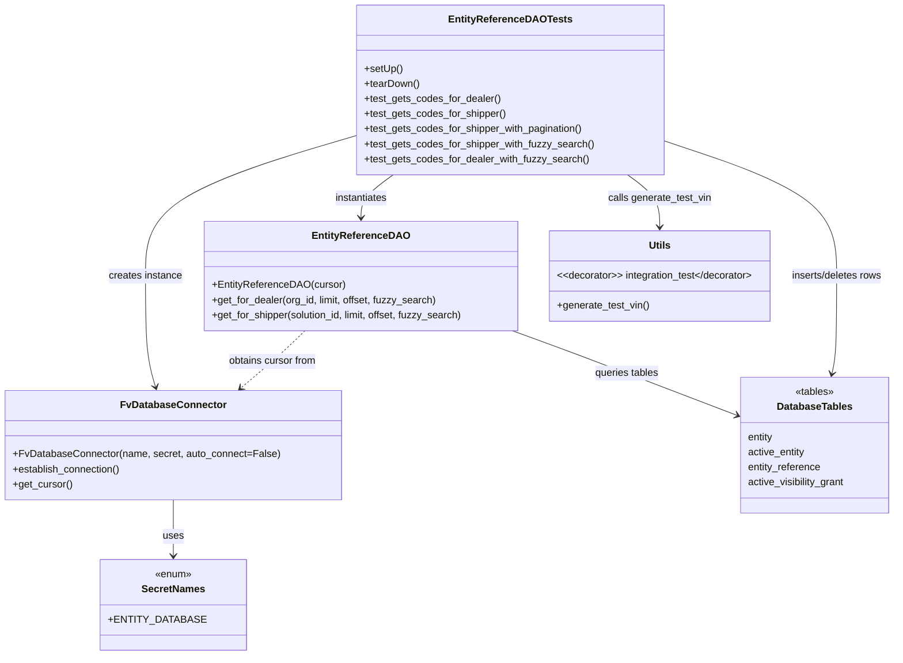
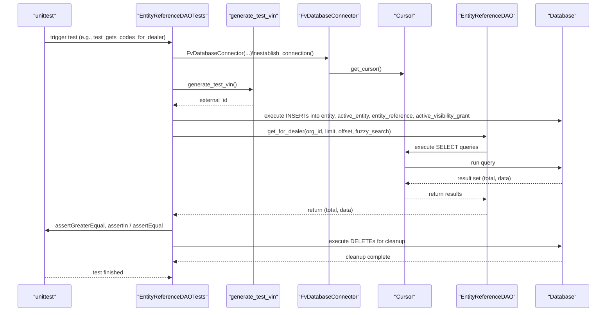

# Diagram: entity_core/entity_search/tests/integration_tests/db/test_end_user_fin_code_dao.py

> Auto-generated by Obscura crawlers

## Diagram 1

### SVG

<svg id="container" width="1427.1484375" xmlns="http://www.w3.org/2000/svg" class="classDiagram" height="1042" viewBox="0 0 1427.1484375 1042" role="graphics-document document" aria-roledescription="class"><g><defs><marker id="container_class-aggregationStart" class="marker aggregation class" refX="18" refY="7" markerWidth="190" markerHeight="240" orient="auto"><path d="M 18,7 L9,13 L1,7 L9,1 Z"></path></marker></defs><defs><marker id="container_class-aggregationEnd" class="marker aggregation class" refX="1" refY="7" markerWidth="20" markerHeight="28" orient="auto"><path d="M 18,7 L9,13 L1,7 L9,1 Z"></path></marker></defs><defs><marker id="container_class-extensionStart" class="marker extension class" refX="18" refY="7" markerWidth="190" markerHeight="240" orient="auto"><path d="M 1,7 L18,13 V 1 Z"></path></marker></defs><defs><marker id="container_class-extensionEnd" class="marker extension class" refX="1" refY="7" markerWidth="20" markerHeight="28" orient="auto"><path d="M 1,1 V 13 L18,7 Z"></path></marker></defs><defs><marker id="container_class-compositionStart" class="marker composition class" refX="18" refY="7" markerWidth="190" markerHeight="240" orient="auto"><path d="M 18,7 L9,13 L1,7 L9,1 Z"></path></marker></defs><defs><marker id="container_class-compositionEnd" class="marker composition class" refX="1" refY="7" markerWidth="20" markerHeight="28" orient="auto"><path d="M 18,7 L9,13 L1,7 L9,1 Z"></path></marker></defs><defs><marker id="container_class-dependencyStart" class="marker dependency class" refX="6" refY="7" markerWidth="190" markerHeight="240" orient="auto"><path d="M 5,7 L9,13 L1,7 L9,1 Z"></path></marker></defs><defs><marker id="container_class-dependencyEnd" class="marker dependency class" refX="13" refY="7" markerWidth="20" markerHeight="28" orient="auto"><path d="M 18,7 L9,13 L14,7 L9,1 Z"></path></marker></defs><defs><marker id="container_class-lollipopStart" class="marker lollipop class" refX="13" refY="7" markerWidth="190" markerHeight="240" orient="auto"><circle stroke="black" fill="transparent" cx="7" cy="7" r="6"></circle></marker></defs><defs><marker id="container_class-lollipopEnd" class="marker lollipop class" refX="1" refY="7" markerWidth="190" markerHeight="240" orient="auto"><circle stroke="black" fill="transparent" cx="7" cy="7" r="6"></circle></marker></defs><g class="root"><g class="clusters"></g><g class="edgePaths"><path d="M268.684,795L268.684,804.667C268.684,814.333,268.684,833.667,268.684,848.5C268.684,863.333,268.684,873.667,268.684,878.833L268.684,884" id="id_FvDatabaseConnector_SecretNames_1" class="edge-thickness-normal edge-pattern-solid relation" style=";;;" data-edge="true" data-et="edge" data-id="id_FvDatabaseConnector_SecretNames_1" data-points="W3sieCI6MjY4LjY4MzU5Mzc1LCJ5Ijo3OTV9LHsieCI6MjY4LjY4MzU5Mzc1LCJ5Ijo4NTN9LHsieCI6MjY4LjY4MzU5Mzc1LCJ5Ijo4OTB9XQ==" marker-end="url(#container_class-dependencyEnd)"></path><path d="M479.12,526L472.811,532.167C466.503,538.333,453.885,550.667,436.836,565.857C419.788,581.047,398.308,599.094,387.568,608.117L376.828,617.14" id="id_EntityReferenceDAO_FvDatabaseConnector_2" class="edge-thickness-normal edge-pattern-dashed relation" style=";;;" data-edge="true" data-et="edge" data-id="id_EntityReferenceDAO_FvDatabaseConnector_2" data-points="W3sieCI6NDc5LjEyMDE5NTk0MjU0MDMsInkiOjUyNn0seyJ4Ijo0NDEuMjY3NTc4MTI1LCJ5Ijo1NjN9LHsieCI6MzcyLjIzMzk4NDM3NSwieSI6NjIxfV0=" marker-end="url(#container_class-dependencyEnd)"></path><path d="M568.561,213.378L510.96,230.315C453.359,247.252,338.158,281.126,280.558,318.73C222.957,356.333,222.957,397.667,222.957,439C222.957,480.333,222.957,521.667,225.705,551.046C228.452,580.426,233.948,597.852,236.695,606.565L239.443,615.278" id="id_EntityReferenceDAOTests_FvDatabaseConnector_3" class="edge-thickness-normal edge-pattern-solid relation" style=";;;" data-edge="true" data-et="edge" data-id="id_EntityReferenceDAOTests_FvDatabaseConnector_3" data-points="W3sieCI6NTY4LjU2MDU0Njg3NSwieSI6MjEzLjM3ODE3NjU5NzI3MjA3fSx7IngiOjIyMi45NTcwMzEyNSwieSI6MzE1fSx7IngiOjIyMi45NTcwMzEyNSwieSI6NDM5fSx7IngiOjIyMi45NTcwMzEyNSwieSI6NTYzfSx7IngiOjI0MS4yNDc2NTYyNSwieSI6NjIxfV0=" marker-end="url(#container_class-dependencyEnd)"></path><path d="M619.706,278L611.109,284.167C602.513,290.333,585.319,302.667,576.722,314C568.125,325.333,568.125,335.667,568.125,340.833L568.125,346" id="id_EntityReferenceDAOTests_EntityReferenceDAO_4" class="edge-thickness-normal edge-pattern-solid relation" style=";;;" data-edge="true" data-et="edge" data-id="id_EntityReferenceDAOTests_EntityReferenceDAO_4" data-points="W3sieCI6NjE5LjcwNjI3MDQzOTY4MDIsInkiOjI3OH0seyJ4Ijo1NjguMTI1LCJ5IjozMTV9LHsieCI6NTY4LjEyNSwieSI6MzUyfV0=" marker-end="url(#container_class-dependencyEnd)"></path><path d="M996.11,278L1004.707,284.167C1013.304,290.333,1030.498,302.667,1039.095,316.5C1047.691,330.333,1047.691,345.667,1047.691,353.333L1047.691,361" id="id_EntityReferenceDAOTests_Utils_5" class="edge-thickness-normal edge-pattern-solid relation" style=";;;" data-edge="true" data-et="edge" data-id="id_EntityReferenceDAOTests_Utils_5" data-points="W3sieCI6OTk2LjExMDEzNTgxMDMxOTgsInkiOjI3OH0seyJ4IjoxMDQ3LjY5MTQwNjI1LCJ5IjozMTV9LHsieCI6MTA0Ny42OTE0MDYyNSwieSI6MzY3fV0=" marker-end="url(#container_class-dependencyEnd)"></path><path d="M1047.256,221.066L1095.256,236.722C1143.255,252.377,1239.255,283.689,1287.254,320.011C1335.254,356.333,1335.254,397.667,1335.254,439C1335.254,480.333,1335.254,521.667,1333.969,547.529C1332.685,573.392,1330.115,583.784,1328.83,588.979L1327.546,594.175" id="id_EntityReferenceDAOTests_DatabaseTables_6" class="edge-thickness-normal edge-pattern-solid relation" style=";;;" data-edge="true" data-et="edge" data-id="id_EntityReferenceDAOTests_DatabaseTables_6" data-points="W3sieCI6MTA0Ny4yNTU4NTkzNzUsInkiOjIyMS4wNjYwNTE2MDcyMTYyNX0seyJ4IjoxMzM1LjI1MzkwNjI1LCJ5IjozMTV9LHsieCI6MTMzNS4yNTM5MDYyNSwieSI6NDM5fSx7IngiOjEzMzUuMjUzOTA2MjUsInkiOjU2M30seyJ4IjoxMzI2LjEwNTU3NjUwODYyMDcsInkiOjYwMH1d" marker-end="url(#container_class-dependencyEnd)"></path><path d="M812.085,526L829.377,532.167C846.669,538.333,881.254,550.667,941.58,573.102C1001.907,595.537,1087.975,628.074,1131.01,644.342L1174.044,660.61" id="id_EntityReferenceDAO_DatabaseTables_7" class="edge-thickness-normal edge-pattern-solid relation" style=";;;" data-edge="true" data-et="edge" data-id="id_EntityReferenceDAO_DatabaseTables_7" data-points="W3sieCI6ODEyLjA4NDg1MDY4MDQ0MzUsInkiOjUyNn0seyJ4Ijo5MTUuODM3ODkwNjI1LCJ5Ijo1NjN9LHsieCI6MTE3OS42NTYyNSwieSI6NjYyLjczMjAzMTQ2ODc5ODV9XQ==" marker-end="url(#container_class-dependencyEnd)"></path></g><g class="edgeLabels"><g class="edgeLabel" transform="translate(268.68359375, 853)"><g class="label" data-id="id_FvDatabaseConnector_SecretNames_1" transform="translate(-16.4921875, -12)"><foreignObject width="32.984375" height="24">

uses

</foreignObject></g></g><g class="edgeLabel" transform="translate(427.01431, 574.97518)"><g class="label" data-id="id_EntityReferenceDAO_FvDatabaseConnector_2" transform="translate(-71.453125, -12)"><foreignObject width="142.90625" height="24">

obtains cursor from

</foreignObject></g></g><g class="edgeLabel" transform="translate(222.95703125, 439)"><g class="label" data-id="id_EntityReferenceDAOTests_FvDatabaseConnector_3" transform="translate(-58.8671875, -12)"><foreignObject width="117.734375" height="24">

creates instance

</foreignObject></g></g><g class="edgeLabel" transform="translate(568.125, 315)"><g class="label" data-id="id_EntityReferenceDAOTests_EntityReferenceDAO_4" transform="translate(-42.9140625, -12)"><foreignObject width="85.828125" height="24">

instantiates

</foreignObject></g></g><g class="edgeLabel" transform="translate(1047.69140625, 315)"><g class="label" data-id="id_EntityReferenceDAOTests_Utils_5" transform="translate(-82.6875, -12)"><foreignObject width="165.375" height="24">

calls generate_test_vin

</foreignObject></g></g><g class="edgeLabel" transform="translate(1335.25390625, 439)"><g class="label" data-id="id_EntityReferenceDAOTests_DatabaseTables_6" transform="translate(-74.296875, -12)"><foreignObject width="148.59375" height="24">

inserts/deletes rows

</foreignObject></g></g><g class="edgeLabel" transform="translate(996.22887, 593.39044)"><g class="label" data-id="id_EntityReferenceDAO_DatabaseTables_7" transform="translate(-51.703125, -12)"><foreignObject width="103.40625" height="24">

queries tables

</foreignObject></g></g></g><g class="nodes"><g class="node default" id="classId-FvDatabaseConnector-0" transform="translate(268.68359375, 708)"><g class="basic label-container"><path d="M-260.68359375 -87 L260.68359375 -87 L260.68359375 87 L-260.68359375 87" stroke="none" stroke-width="0" fill="#ECECFF" style=""></path><path d="M-260.68359375 -87 C-84.75725739233903 -87, 91.16907896532194 -87, 260.68359375 -87 M-260.68359375 -87 C-81.83118777832482 -87, 97.02121819335036 -87, 260.68359375 -87 M260.68359375 -87 C260.68359375 -32.91182940609419, 260.68359375 21.176341187811616, 260.68359375 87 M260.68359375 -87 C260.68359375 -20.143023775266684, 260.68359375 46.71395244946663, 260.68359375 87 M260.68359375 87 C132.46769026479004 87, 4.251786779580073 87, -260.68359375 87 M260.68359375 87 C53.350209024540305 87, -153.9831757009194 87, -260.68359375 87 M-260.68359375 87 C-260.68359375 28.37694145268015, -260.68359375 -30.2461170946397, -260.68359375 -87 M-260.68359375 87 C-260.68359375 31.578432884071965, -260.68359375 -23.84313423185607, -260.68359375 -87" stroke="#9370DB" stroke-width="1.3" fill="none" stroke-dasharray="0 0" style=""></path></g><g class="annotation-group text" transform="translate(0, -63)"></g><g class="label-group text" transform="translate(-79.3046875, -63)"><g class="label" style="font-weight: bolder" transform="translate(0,-12)"><foreignObject width="158.609375" height="24">

FvDatabaseConnector

</foreignObject></g></g><g class="members-group text" transform="translate(-248.68359375, -15)"></g><g class="methods-group text" transform="translate(-248.68359375, 15)"><g class="label" style="" transform="translate(0,-12)"><foreignObject width="418.0625" height="24">

+FvDatabaseConnector(name, secret, auto_connect=False)

</foreignObject></g><g class="label" style="" transform="translate(0,12)"><foreignObject width="173.265625" height="24">

+establish_connection()

</foreignObject></g><g class="label" style="" transform="translate(0,36)"><foreignObject width="94.640625" height="24">

+get_cursor()

</foreignObject></g></g><g class="divider" style=""><path d="M-260.68359375 -39 C-141.95664233775656 -39, -23.229690925513125 -39, 260.68359375 -39 M-260.68359375 -39 C-97.44102198257994 -39, 65.80154978484012 -39, 260.68359375 -39" stroke="#9370DB" stroke-width="1.3" fill="none" stroke-dasharray="0 0" style=""></path></g><g class="divider" style=""><path d="M-260.68359375 -15 C-136.6894733137749 -15, -12.695352877549766 -15, 260.68359375 -15 M-260.68359375 -15 C-79.40041508665996 -15, 101.88276357668008 -15, 260.68359375 -15" stroke="#9370DB" stroke-width="1.3" fill="none" stroke-dasharray="0 0" style=""></path></g></g><g class="node default" id="classId-SecretNames-1" transform="translate(268.68359375, 962)"><g class="basic label-container"><path d="M-103.9296875 -72 L103.9296875 -72 L103.9296875 72 L-103.9296875 72" stroke="none" stroke-width="0" fill="#ECECFF" style=""></path><path d="M-103.9296875 -72 C-27.646070741597427 -72, 48.637546016805146 -72, 103.9296875 -72 M-103.9296875 -72 C-58.41758691033225 -72, -12.905486320664494 -72, 103.9296875 -72 M103.9296875 -72 C103.9296875 -27.346793544056112, 103.9296875 17.306412911887776, 103.9296875 72 M103.9296875 -72 C103.9296875 -24.559075116927296, 103.9296875 22.881849766145407, 103.9296875 72 M103.9296875 72 C42.33573456219631 72, -19.258218375607385 72, -103.9296875 72 M103.9296875 72 C23.503819332338153 72, -56.92204883532369 72, -103.9296875 72 M-103.9296875 72 C-103.9296875 18.6363029166467, -103.9296875 -34.7273941667066, -103.9296875 -72 M-103.9296875 72 C-103.9296875 25.697733005488644, -103.9296875 -20.604533989022713, -103.9296875 -72" stroke="#9370DB" stroke-width="1.3" fill="none" stroke-dasharray="0 0" style=""></path></g><g class="annotation-group text" transform="translate(-29.53125, -48)"><g class="label" style="" transform="translate(0,-12)"><foreignObject width="59.0625" height="24">

«enum»

</foreignObject></g></g><g class="label-group text" transform="translate(-48.03125, -24)"><g class="label" style="font-weight: bolder" transform="translate(0,-12)"><foreignObject width="96.0625" height="24">

SecretNames

</foreignObject></g></g><g class="members-group text" transform="translate(-91.9296875, 24)"><g class="label" style="" transform="translate(0,-12)"><foreignObject width="135.828125" height="24">

+ENTITY_DATABASE

</foreignObject></g></g><g class="methods-group text" transform="translate(-91.9296875, 72)"></g><g class="divider" style=""><path d="M-103.9296875 0 C-37.78673255441326 0, 28.356222391173475 0, 103.9296875 0 M-103.9296875 0 C-36.807088848784616 0, 30.315509802430768 0, 103.9296875 0" stroke="#9370DB" stroke-width="1.3" fill="none" stroke-dasharray="0 0" style=""></path></g><g class="divider" style=""><path d="M-103.9296875 48 C-31.63798308314543 48, 40.65372133370914 48, 103.9296875 48 M-103.9296875 48 C-59.41750028887291 48, -14.905313077745816 48, 103.9296875 48" stroke="#9370DB" stroke-width="1.3" fill="none" stroke-dasharray="0 0" style=""></path></g></g><g class="node default" id="classId-EntityReferenceDAO-2" transform="translate(568.125, 439)"><g class="basic label-container"><path d="M-251.30078125 -87 L251.30078125 -87 L251.30078125 87 L-251.30078125 87" stroke="none" stroke-width="0" fill="#ECECFF" style=""></path><path d="M-251.30078125 -87 C-100.05573592414777 -87, 51.18930940170446 -87, 251.30078125 -87 M-251.30078125 -87 C-132.83101315522143 -87, -14.361245060442855 -87, 251.30078125 -87 M251.30078125 -87 C251.30078125 -35.67766788536874, 251.30078125 15.644664229262517, 251.30078125 87 M251.30078125 -87 C251.30078125 -41.618550940384196, 251.30078125 3.7628981192316076, 251.30078125 87 M251.30078125 87 C111.64151078929069 87, -28.017759671418617 87, -251.30078125 87 M251.30078125 87 C63.344966499957735 87, -124.61084825008453 87, -251.30078125 87 M-251.30078125 87 C-251.30078125 44.39059215014849, -251.30078125 1.7811843002969852, -251.30078125 -87 M-251.30078125 87 C-251.30078125 41.894955476493415, -251.30078125 -3.21008904701317, -251.30078125 -87" stroke="#9370DB" stroke-width="1.3" fill="none" stroke-dasharray="0 0" style=""></path></g><g class="annotation-group text" transform="translate(0, -63)"></g><g class="label-group text" transform="translate(-73.0859375, -63)"><g class="label" style="font-weight: bolder" transform="translate(0,-12)"><foreignObject width="146.171875" height="24">

EntityReferenceDAO

</foreignObject></g></g><g class="members-group text" transform="translate(-239.30078125, -15)"></g><g class="methods-group text" transform="translate(-239.30078125, 15)"><g class="label" style="" transform="translate(0,-12)"><foreignObject width="207.859375" height="24">

+EntityReferenceDAO(cursor)

</foreignObject></g><g class="label" style="" transform="translate(0,12)"><foreignObject width="359.9375" height="24">

+get_for_dealer(org_id, limit, offset, fuzzy_search)

</foreignObject></g><g class="label" style="" transform="translate(0,36)"><foreignObject width="405.515625" height="24">

+get_for_shipper(solution_id, limit, offset, fuzzy_search)

</foreignObject></g></g><g class="divider" style=""><path d="M-251.30078125 -39 C-64.74873435528585 -39, 121.8033125394283 -39, 251.30078125 -39 M-251.30078125 -39 C-109.65514206610086 -39, 31.99049711779827 -39, 251.30078125 -39" stroke="#9370DB" stroke-width="1.3" fill="none" stroke-dasharray="0 0" style=""></path></g><g class="divider" style=""><path d="M-251.30078125 -15 C-54.20212699489497 -15, 142.89652726021006 -15, 251.30078125 -15 M-251.30078125 -15 C-78.31202937032785 -15, 94.6767225093443 -15, 251.30078125 -15" stroke="#9370DB" stroke-width="1.3" fill="none" stroke-dasharray="0 0" style=""></path></g></g><g class="node default" id="classId-EntityReferenceDAOTests-3" transform="translate(807.908203125, 143)"><g class="basic label-container"><path d="M-239.34765625 -135 L239.34765625 -135 L239.34765625 135 L-239.34765625 135" stroke="none" stroke-width="0" fill="#ECECFF" style=""></path><path d="M-239.34765625 -135 C-127.07652931183513 -135, -14.805402373670262 -135, 239.34765625 -135 M-239.34765625 -135 C-79.93975066534082 -135, 79.46815491931835 -135, 239.34765625 -135 M239.34765625 -135 C239.34765625 -57.12199745919425, 239.34765625 20.756005081611505, 239.34765625 135 M239.34765625 -135 C239.34765625 -62.02116820716769, 239.34765625 10.95766358566462, 239.34765625 135 M239.34765625 135 C51.458549787749064 135, -136.43055667450187 135, -239.34765625 135 M239.34765625 135 C78.13547850724692 135, -83.07669923550617 135, -239.34765625 135 M-239.34765625 135 C-239.34765625 30.40409200694681, -239.34765625 -74.19181598610638, -239.34765625 -135 M-239.34765625 135 C-239.34765625 51.92631090272678, -239.34765625 -31.147378194546434, -239.34765625 -135" stroke="#9370DB" stroke-width="1.3" fill="none" stroke-dasharray="0 0" style=""></path></g><g class="annotation-group text" transform="translate(0, -111)"></g><g class="label-group text" transform="translate(-91.9140625, -111)"><g class="label" style="font-weight: bolder" transform="translate(0,-12)"><foreignObject width="183.828125" height="24">

EntityReferenceDAOTests

</foreignObject></g></g><g class="members-group text" transform="translate(-227.34765625, -63)"></g><g class="methods-group text" transform="translate(-227.34765625, -33)"><g class="label" style="" transform="translate(0,-12)"><foreignObject width="60.421875" height="24">

+setUp()

</foreignObject></g><g class="label" style="" transform="translate(0,12)"><foreignObject width="87.75" height="24">

+tearDown()

</foreignObject></g><g class="label" style="" transform="translate(0,36)"><foreignObject width="215.6875" height="24">

+test_gets_codes_for_dealer()

</foreignObject></g><g class="label" style="" transform="translate(0,60)"><foreignObject width="225.09375" height="24">

+test_gets_codes_for_shipper()

</foreignObject></g><g class="label" style="" transform="translate(0,84)"><foreignObject width="349.078125" height="24">

+test_gets_codes_for_shipper_with_pagination()

</foreignObject></g><g class="label" style="" transform="translate(0,108)"><foreignObject width="362.78125" height="24">

+test_gets_codes_for_shipper_with_fuzzy_search()

</foreignObject></g><g class="label" style="" transform="translate(0,132)"><foreignObject width="353.375" height="24">

+test_gets_codes_for_dealer_with_fuzzy_search()

</foreignObject></g></g><g class="divider" style=""><path d="M-239.34765625 -87 C-126.58290339465155 -87, -13.818150539303105 -87, 239.34765625 -87 M-239.34765625 -87 C-62.71989837786492 -87, 113.90785949427016 -87, 239.34765625 -87" stroke="#9370DB" stroke-width="1.3" fill="none" stroke-dasharray="0 0" style=""></path></g><g class="divider" style=""><path d="M-239.34765625 -63 C-114.19269754334762 -63, 10.96226116330476 -63, 239.34765625 -63 M-239.34765625 -63 C-52.59156496560712 -63, 134.16452631878576 -63, 239.34765625 -63" stroke="#9370DB" stroke-width="1.3" fill="none" stroke-dasharray="0 0" style=""></path></g></g><g class="node default" id="classId-Utils-4" transform="translate(1047.69140625, 439)"><g class="basic label-container"><path d="M-178.265625 -72 L178.265625 -72 L178.265625 72 L-178.265625 72" stroke="none" stroke-width="0" fill="#ECECFF" style=""></path><path d="M-178.265625 -72 C-88.54371317098594 -72, 1.1781986580281227 -72, 178.265625 -72 M-178.265625 -72 C-104.07911013076063 -72, -29.89259526152125 -72, 178.265625 -72 M178.265625 -72 C178.265625 -36.6443603627692, 178.265625 -1.288720725538397, 178.265625 72 M178.265625 -72 C178.265625 -34.23210159481703, 178.265625 3.5357968103659374, 178.265625 72 M178.265625 72 C41.06373450895026 72, -96.13815598209948 72, -178.265625 72 M178.265625 72 C36.19292374663593 72, -105.87977750672815 72, -178.265625 72 M-178.265625 72 C-178.265625 27.80208899145788, -178.265625 -16.395822017084242, -178.265625 -72 M-178.265625 72 C-178.265625 40.823517221003996, -178.265625 9.647034442007985, -178.265625 -72" stroke="#9370DB" stroke-width="1.3" fill="none" stroke-dasharray="0 0" style=""></path></g><g class="annotation-group text" transform="translate(0, -48)"></g><g class="label-group text" transform="translate(-16.796875, -48)"><g class="label" style="font-weight: bolder" transform="translate(0,-12)"><foreignObject width="33.59375" height="24">

Utils

</foreignObject></g></g><g class="members-group text" transform="translate(-166.265625, 0)"><g class="label" style="" transform="translate(0,-12)"><foreignObject width="315.734375" height="24">

&lt;&lt;decorator&gt;&gt; integration_test&lt;/decorator&gt;

</foreignObject></g></g><g class="methods-group text" transform="translate(-166.265625, 48)"><g class="label" style="" transform="translate(0,-12)"><foreignObject width="146.59375" height="24">

+generate_test_vin()

</foreignObject></g></g><g class="divider" style=""><path d="M-178.265625 -24 C-100.06471636186036 -24, -21.863807723720726 -24, 178.265625 -24 M-178.265625 -24 C-62.580714692615345 -24, 53.10419561476931 -24, 178.265625 -24" stroke="#9370DB" stroke-width="1.3" fill="none" stroke-dasharray="0 0" style=""></path></g><g class="divider" style=""><path d="M-178.265625 24 C-48.97908587669244 24, 80.30745324661513 24, 178.265625 24 M-178.265625 24 C-60.34635639611861 24, 57.57291220776278 24, 178.265625 24" stroke="#9370DB" stroke-width="1.3" fill="none" stroke-dasharray="0 0" style=""></path></g></g><g class="node default" id="classId-DatabaseTables-5" transform="translate(1299.40234375, 708)"><g class="basic label-container"><path d="M-119.74609375 -108 L119.74609375 -108 L119.74609375 108 L-119.74609375 108" stroke="none" stroke-width="0" fill="#ECECFF" style=""></path><path d="M-119.74609375 -108 C-64.89439643646575 -108, -10.04269912293151 -108, 119.74609375 -108 M-119.74609375 -108 C-56.099723848831665 -108, 7.546646052336669 -108, 119.74609375 -108 M119.74609375 -108 C119.74609375 -39.057854135683755, 119.74609375 29.88429172863249, 119.74609375 108 M119.74609375 -108 C119.74609375 -52.854591530724, 119.74609375 2.2908169385519983, 119.74609375 108 M119.74609375 108 C51.82786475296027 108, -16.090364244079467 108, -119.74609375 108 M119.74609375 108 C67.85289107167456 108, 15.959688393349126 108, -119.74609375 108 M-119.74609375 108 C-119.74609375 29.792023602664074, -119.74609375 -48.41595279467185, -119.74609375 -108 M-119.74609375 108 C-119.74609375 40.35908203824718, -119.74609375 -27.28183592350564, -119.74609375 -108" stroke="#9370DB" stroke-width="1.3" fill="none" stroke-dasharray="0 0" style=""></path></g><g class="annotation-group text" transform="translate(-31.46875, -84)"><g class="label" style="" transform="translate(0,-12)"><foreignObject width="62.9375" height="24">

«tables»

</foreignObject></g></g><g class="label-group text" transform="translate(-57.8671875, -60)"><g class="label" style="font-weight: bolder" transform="translate(0,-12)"><foreignObject width="115.734375" height="24">

DatabaseTables

</foreignObject></g></g><g class="members-group text" transform="translate(-107.74609375, -12)"><g class="label" style="" transform="translate(0,-12)"><foreignObject width="41.953125" height="24">

entity

</foreignObject></g><g class="label" style="" transform="translate(0,12)"><foreignObject width="92.8125" height="24">

active_entity

</foreignObject></g><g class="label" style="" transform="translate(0,36)"><foreignObject width="117.96875" height="24">

entity_reference

</foreignObject></g><g class="label" style="" transform="translate(0,60)"><foreignObject width="157.625" height="24">

active_visibility_grant

</foreignObject></g></g><g class="methods-group text" transform="translate(-107.74609375, 108)"></g><g class="divider" style=""><path d="M-119.74609375 -36 C-58.02455691434261 -36, 3.696979921314778 -36, 119.74609375 -36 M-119.74609375 -36 C-63.51940908128248 -36, -7.292724412564965 -36, 119.74609375 -36" stroke="#9370DB" stroke-width="1.3" fill="none" stroke-dasharray="0 0" style=""></path></g><g class="divider" style=""><path d="M-119.74609375 84 C-67.9000954179098 84, -16.054097085819592 84, 119.74609375 84 M-119.74609375 84 C-43.582905064330504 84, 32.58028362133899 84, 119.74609375 84" stroke="#9370DB" stroke-width="1.3" fill="none" stroke-dasharray="0 0" style=""></path></g></g></g></g></g></svg>

## Diagram 2

### SVG

<svg id="container" width="1779" xmlns="http://www.w3.org/2000/svg" height="939" viewBox="-50 -10 1779 939" role="graphics-document document" aria-roledescription="sequence"><g><rect x="1529" y="853" fill="#eaeaea" stroke="#666" width="150" height="65" name="DB" rx="3" ry="3" class="actor actor-bottom"></rect><text x="1604" y="885.5" dominant-baseline="central" alignment-baseline="central" class="actor actor-box" style="text-anchor: middle; font-size: 16px; font-weight: 400;"><tspan x="1604" dy="0">"Database"</tspan></text></g><g><rect x="1302" y="853" fill="#eaeaea" stroke="#666" width="177" height="65" name="DAO" rx="3" ry="3" class="actor actor-bottom"></rect><text x="1390.5" y="885.5" dominant-baseline="central" alignment-baseline="central" class="actor actor-box" style="text-anchor: middle; font-size: 16px; font-weight: 400;"><tspan x="1390.5" dy="0">"EntityReferenceDAO"</tspan></text></g><g><rect x="1075.5" y="853" fill="#eaeaea" stroke="#666" width="150" height="65" name="Cursor" rx="3" ry="3" class="actor actor-bottom"></rect><text x="1150.5" y="885.5" dominant-baseline="central" alignment-baseline="central" class="actor actor-box" style="text-anchor: middle; font-size: 16px; font-weight: 400;"><tspan x="1150.5" dy="0">"Cursor"</tspan></text></g><g><rect x="836.5" y="853" fill="#eaeaea" stroke="#666" width="189" height="65" name="DB_CONN" rx="3" ry="3" class="actor actor-bottom"></rect><text x="931" y="885.5" dominant-baseline="central" alignment-baseline="central" class="actor actor-box" style="text-anchor: middle; font-size: 16px; font-weight: 400;"><tspan x="931" dy="0">"FvDatabaseConnector"</tspan></text></g><g><rect x="625.5" y="853" fill="#eaeaea" stroke="#666" width="161" height="65" name="Utils" rx="3" ry="3" class="actor actor-bottom"></rect><text x="706" y="885.5" dominant-baseline="central" alignment-baseline="central" class="actor actor-box" style="text-anchor: middle; font-size: 16px; font-weight: 400;"><tspan x="706" dy="0">"generate_test_vin"</tspan></text></g><g><rect x="362.5" y="853" fill="#eaeaea" stroke="#666" width="213" height="65" name="Tests" rx="3" ry="3" class="actor actor-bottom"></rect><text x="469" y="885.5" dominant-baseline="central" alignment-baseline="central" class="actor actor-box" style="text-anchor: middle; font-size: 16px; font-weight: 400;"><tspan x="469" dy="0">"EntityReferenceDAOTests"</tspan></text></g><g><rect x="0" y="853" fill="#eaeaea" stroke="#666" width="150" height="65" name="Runner" rx="3" ry="3" class="actor actor-bottom"></rect><text x="75" y="885.5" dominant-baseline="central" alignment-baseline="central" class="actor actor-box" style="text-anchor: middle; font-size: 16px; font-weight: 400;"><tspan x="75" dy="0">"unittest"</tspan></text></g><g><line id="actor6" x1="1604" y1="65" x2="1604" y2="853" class="actor-line 200" stroke-width="0.5px" stroke="#999" name="DB"></line><g id="root-6"><rect x="1529" y="0" fill="#eaeaea" stroke="#666" width="150" height="65" name="DB" rx="3" ry="3" class="actor actor-top"></rect><text x="1604" y="32.5" dominant-baseline="central" alignment-baseline="central" class="actor actor-box" style="text-anchor: middle; font-size: 16px; font-weight: 400;"><tspan x="1604" dy="0">"Database"</tspan></text></g></g><g><line id="actor5" x1="1390.5" y1="65" x2="1390.5" y2="853" class="actor-line 200" stroke-width="0.5px" stroke="#999" name="DAO"></line><g id="root-5"><rect x="1302" y="0" fill="#eaeaea" stroke="#666" width="177" height="65" name="DAO" rx="3" ry="3" class="actor actor-top"></rect><text x="1390.5" y="32.5" dominant-baseline="central" alignment-baseline="central" class="actor actor-box" style="text-anchor: middle; font-size: 16px; font-weight: 400;"><tspan x="1390.5" dy="0">"EntityReferenceDAO"</tspan></text></g></g><g><line id="actor4" x1="1150.5" y1="65" x2="1150.5" y2="853" class="actor-line 200" stroke-width="0.5px" stroke="#999" name="Cursor"></line><g id="root-4"><rect x="1075.5" y="0" fill="#eaeaea" stroke="#666" width="150" height="65" name="Cursor" rx="3" ry="3" class="actor actor-top"></rect><text x="1150.5" y="32.5" dominant-baseline="central" alignment-baseline="central" class="actor actor-box" style="text-anchor: middle; font-size: 16px; font-weight: 400;"><tspan x="1150.5" dy="0">"Cursor"</tspan></text></g></g><g><line id="actor3" x1="931" y1="65" x2="931" y2="853" class="actor-line 200" stroke-width="0.5px" stroke="#999" name="DB_CONN"></line><g id="root-3"><rect x="836.5" y="0" fill="#eaeaea" stroke="#666" width="189" height="65" name="DB_CONN" rx="3" ry="3" class="actor actor-top"></rect><text x="931" y="32.5" dominant-baseline="central" alignment-baseline="central" class="actor actor-box" style="text-anchor: middle; font-size: 16px; font-weight: 400;"><tspan x="931" dy="0">"FvDatabaseConnector"</tspan></text></g></g><g><line id="actor2" x1="706" y1="65" x2="706" y2="853" class="actor-line 200" stroke-width="0.5px" stroke="#999" name="Utils"></line><g id="root-2"><rect x="625.5" y="0" fill="#eaeaea" stroke="#666" width="161" height="65" name="Utils" rx="3" ry="3" class="actor actor-top"></rect><text x="706" y="32.5" dominant-baseline="central" alignment-baseline="central" class="actor actor-box" style="text-anchor: middle; font-size: 16px; font-weight: 400;"><tspan x="706" dy="0">"generate_test_vin"</tspan></text></g></g><g><line id="actor1" x1="469" y1="65" x2="469" y2="853" class="actor-line 200" stroke-width="0.5px" stroke="#999" name="Tests"></line><g id="root-1"><rect x="362.5" y="0" fill="#eaeaea" stroke="#666" width="213" height="65" name="Tests" rx="3" ry="3" class="actor actor-top"></rect><text x="469" y="32.5" dominant-baseline="central" alignment-baseline="central" class="actor actor-box" style="text-anchor: middle; font-size: 16px; font-weight: 400;"><tspan x="469" dy="0">"EntityReferenceDAOTests"</tspan></text></g></g><g><line id="actor0" x1="75" y1="65" x2="75" y2="853" class="actor-line 200" stroke-width="0.5px" stroke="#999" name="Runner"></line><g id="root-0"><rect x="0" y="0" fill="#eaeaea" stroke="#666" width="150" height="65" name="Runner" rx="3" ry="3" class="actor actor-top"></rect><text x="75" y="32.5" dominant-baseline="central" alignment-baseline="central" class="actor actor-box" style="text-anchor: middle; font-size: 16px; font-weight: 400;"><tspan x="75" dy="0">"unittest"</tspan></text></g></g><g></g><defs><symbol id="computer" width="24" height="24"><path transform="scale(.5)" d="M2 2v13h20v-13h-20zm18 11h-16v-9h16v9zm-10.228 6l.466-1h3.524l.467 1h-4.457zm14.228 3h-24l2-6h2.104l-1.33 4h18.45l-1.297-4h2.073l2 6zm-5-10h-14v-7h14v7z"></path></symbol></defs><defs><symbol id="database" fill-rule="evenodd" clip-rule="evenodd"><path transform="scale(.5)" d="M12.258.001l.256.004.255.005.253.008.251.01.249.012.247.015.246.016.242.019.241.02.239.023.236.024.233.027.231.028.229.031.225.032.223.034.22.036.217.038.214.04.211.041.208.043.205.045.201.046.198.048.194.05.191.051.187.053.183.054.18.056.175.057.172.059.168.06.163.061.16.063.155.064.15.066.074.033.073.033.071.034.07.034.069.035.068.035.067.035.066.035.064.036.064.036.062.036.06.036.06.037.058.037.058.037.055.038.055.038.053.038.052.038.051.039.05.039.048.039.047.039.045.04.044.04.043.04.041.04.04.041.039.041.037.041.036.041.034.041.033.042.032.042.03.042.029.042.027.042.026.043.024.043.023.043.021.043.02.043.018.044.017.043.015.044.013.044.012.044.011.045.009.044.007.045.006.045.004.045.002.045.001.045v17l-.001.045-.002.045-.004.045-.006.045-.007.045-.009.044-.011.045-.012.044-.013.044-.015.044-.017.043-.018.044-.02.043-.021.043-.023.043-.024.043-.026.043-.027.042-.029.042-.03.042-.032.042-.033.042-.034.041-.036.041-.037.041-.039.041-.04.041-.041.04-.043.04-.044.04-.045.04-.047.039-.048.039-.05.039-.051.039-.052.038-.053.038-.055.038-.055.038-.058.037-.058.037-.06.037-.06.036-.062.036-.064.036-.064.036-.066.035-.067.035-.068.035-.069.035-.07.034-.071.034-.073.033-.074.033-.15.066-.155.064-.16.063-.163.061-.168.06-.172.059-.175.057-.18.056-.183.054-.187.053-.191.051-.194.05-.198.048-.201.046-.205.045-.208.043-.211.041-.214.04-.217.038-.22.036-.223.034-.225.032-.229.031-.231.028-.233.027-.236.024-.239.023-.241.02-.242.019-.246.016-.247.015-.249.012-.251.01-.253.008-.255.005-.256.004-.258.001-.258-.001-.256-.004-.255-.005-.253-.008-.251-.01-.249-.012-.247-.015-.245-.016-.243-.019-.241-.02-.238-.023-.236-.024-.234-.027-.231-.028-.228-.031-.226-.032-.223-.034-.22-.036-.217-.038-.214-.04-.211-.041-.208-.043-.204-.045-.201-.046-.198-.048-.195-.05-.19-.051-.187-.053-.184-.054-.179-.056-.176-.057-.172-.059-.167-.06-.164-.061-.159-.063-.155-.064-.151-.066-.074-.033-.072-.033-.072-.034-.07-.034-.069-.035-.068-.035-.067-.035-.066-.035-.064-.036-.063-.036-.062-.036-.061-.036-.06-.037-.058-.037-.057-.037-.056-.038-.055-.038-.053-.038-.052-.038-.051-.039-.049-.039-.049-.039-.046-.039-.046-.04-.044-.04-.043-.04-.041-.04-.04-.041-.039-.041-.037-.041-.036-.041-.034-.041-.033-.042-.032-.042-.03-.042-.029-.042-.027-.042-.026-.043-.024-.043-.023-.043-.021-.043-.02-.043-.018-.044-.017-.043-.015-.044-.013-.044-.012-.044-.011-.045-.009-.044-.007-.045-.006-.045-.004-.045-.002-.045-.001-.045v-17l.001-.045.002-.045.004-.045.006-.045.007-.045.009-.044.011-.045.012-.044.013-.044.015-.044.017-.043.018-.044.02-.043.021-.043.023-.043.024-.043.026-.043.027-.042.029-.042.03-.042.032-.042.033-.042.034-.041.036-.041.037-.041.039-.041.04-.041.041-.04.043-.04.044-.04.046-.04.046-.039.049-.039.049-.039.051-.039.052-.038.053-.038.055-.038.056-.038.057-.037.058-.037.06-.037.061-.036.062-.036.063-.036.064-.036.066-.035.067-.035.068-.035.069-.035.07-.034.072-.034.072-.033.074-.033.151-.066.155-.064.159-.063.164-.061.167-.06.172-.059.176-.057.179-.056.184-.054.187-.053.19-.051.195-.05.198-.048.201-.046.204-.045.208-.043.211-.041.214-.04.217-.038.22-.036.223-.034.226-.032.228-.031.231-.028.234-.027.236-.024.238-.023.241-.02.243-.019.245-.016.247-.015.249-.012.251-.01.253-.008.255-.005.256-.004.258-.001.258.001zm-9.258 20.499v.01l.001.021.003.021.004.022.005.021.006.022.007.022.009.023.01.022.011.023.012.023.013.023.015.023.016.024.017.023.018.024.019.024.021.024.022.025.023.024.024.025.052.049.056.05.061.051.066.051.07.051.075.051.079.052.084.052.088.052.092.052.097.052.102.051.105.052.11.052.114.051.119.051.123.051.127.05.131.05.135.05.139.048.144.049.147.047.152.047.155.047.16.045.163.045.167.043.171.043.176.041.178.041.183.039.187.039.19.037.194.035.197.035.202.033.204.031.209.03.212.029.216.027.219.025.222.024.226.021.23.02.233.018.236.016.24.015.243.012.246.01.249.008.253.005.256.004.259.001.26-.001.257-.004.254-.005.25-.008.247-.011.244-.012.241-.014.237-.016.233-.018.231-.021.226-.021.224-.024.22-.026.216-.027.212-.028.21-.031.205-.031.202-.034.198-.034.194-.036.191-.037.187-.039.183-.04.179-.04.175-.042.172-.043.168-.044.163-.045.16-.046.155-.046.152-.047.148-.048.143-.049.139-.049.136-.05.131-.05.126-.05.123-.051.118-.052.114-.051.11-.052.106-.052.101-.052.096-.052.092-.052.088-.053.083-.051.079-.052.074-.052.07-.051.065-.051.06-.051.056-.05.051-.05.023-.024.023-.025.021-.024.02-.024.019-.024.018-.024.017-.024.015-.023.014-.024.013-.023.012-.023.01-.023.01-.022.008-.022.006-.022.006-.022.004-.022.004-.021.001-.021.001-.021v-4.127l-.077.055-.08.053-.083.054-.085.053-.087.052-.09.052-.093.051-.095.05-.097.05-.1.049-.102.049-.105.048-.106.047-.109.047-.111.046-.114.045-.115.045-.118.044-.12.043-.122.042-.124.042-.126.041-.128.04-.13.04-.132.038-.134.038-.135.037-.138.037-.139.035-.142.035-.143.034-.144.033-.147.032-.148.031-.15.03-.151.03-.153.029-.154.027-.156.027-.158.026-.159.025-.161.024-.162.023-.163.022-.165.021-.166.02-.167.019-.169.018-.169.017-.171.016-.173.015-.173.014-.175.013-.175.012-.177.011-.178.01-.179.008-.179.008-.181.006-.182.005-.182.004-.184.003-.184.002h-.37l-.184-.002-.184-.003-.182-.004-.182-.005-.181-.006-.179-.008-.179-.008-.178-.01-.176-.011-.176-.012-.175-.013-.173-.014-.172-.015-.171-.016-.17-.017-.169-.018-.167-.019-.166-.02-.165-.021-.163-.022-.162-.023-.161-.024-.159-.025-.157-.026-.156-.027-.155-.027-.153-.029-.151-.03-.15-.03-.148-.031-.146-.032-.145-.033-.143-.034-.141-.035-.14-.035-.137-.037-.136-.037-.134-.038-.132-.038-.13-.04-.128-.04-.126-.041-.124-.042-.122-.042-.12-.044-.117-.043-.116-.045-.113-.045-.112-.046-.109-.047-.106-.047-.105-.048-.102-.049-.1-.049-.097-.05-.095-.05-.093-.052-.09-.051-.087-.052-.085-.053-.083-.054-.08-.054-.077-.054v4.127zm0-5.654v.011l.001.021.003.021.004.021.005.022.006.022.007.022.009.022.01.022.011.023.012.023.013.023.015.024.016.023.017.024.018.024.019.024.021.024.022.024.023.025.024.024.052.05.056.05.061.05.066.051.07.051.075.052.079.051.084.052.088.052.092.052.097.052.102.052.105.052.11.051.114.051.119.052.123.05.127.051.131.05.135.049.139.049.144.048.147.048.152.047.155.046.16.045.163.045.167.044.171.042.176.042.178.04.183.04.187.038.19.037.194.036.197.034.202.033.204.032.209.03.212.028.216.027.219.025.222.024.226.022.23.02.233.018.236.016.24.014.243.012.246.01.249.008.253.006.256.003.259.001.26-.001.257-.003.254-.006.25-.008.247-.01.244-.012.241-.015.237-.016.233-.018.231-.02.226-.022.224-.024.22-.025.216-.027.212-.029.21-.03.205-.032.202-.033.198-.035.194-.036.191-.037.187-.039.183-.039.179-.041.175-.042.172-.043.168-.044.163-.045.16-.045.155-.047.152-.047.148-.048.143-.048.139-.05.136-.049.131-.05.126-.051.123-.051.118-.051.114-.052.11-.052.106-.052.101-.052.096-.052.092-.052.088-.052.083-.052.079-.052.074-.051.07-.052.065-.051.06-.05.056-.051.051-.049.023-.025.023-.024.021-.025.02-.024.019-.024.018-.024.017-.024.015-.023.014-.023.013-.024.012-.022.01-.023.01-.023.008-.022.006-.022.006-.022.004-.021.004-.022.001-.021.001-.021v-4.139l-.077.054-.08.054-.083.054-.085.052-.087.053-.09.051-.093.051-.095.051-.097.05-.1.049-.102.049-.105.048-.106.047-.109.047-.111.046-.114.045-.115.044-.118.044-.12.044-.122.042-.124.042-.126.041-.128.04-.13.039-.132.039-.134.038-.135.037-.138.036-.139.036-.142.035-.143.033-.144.033-.147.033-.148.031-.15.03-.151.03-.153.028-.154.028-.156.027-.158.026-.159.025-.161.024-.162.023-.163.022-.165.021-.166.02-.167.019-.169.018-.169.017-.171.016-.173.015-.173.014-.175.013-.175.012-.177.011-.178.009-.179.009-.179.007-.181.007-.182.005-.182.004-.184.003-.184.002h-.37l-.184-.002-.184-.003-.182-.004-.182-.005-.181-.007-.179-.007-.179-.009-.178-.009-.176-.011-.176-.012-.175-.013-.173-.014-.172-.015-.171-.016-.17-.017-.169-.018-.167-.019-.166-.02-.165-.021-.163-.022-.162-.023-.161-.024-.159-.025-.157-.026-.156-.027-.155-.028-.153-.028-.151-.03-.15-.03-.148-.031-.146-.033-.145-.033-.143-.033-.141-.035-.14-.036-.137-.036-.136-.037-.134-.038-.132-.039-.13-.039-.128-.04-.126-.041-.124-.042-.122-.043-.12-.043-.117-.044-.116-.044-.113-.046-.112-.046-.109-.046-.106-.047-.105-.048-.102-.049-.1-.049-.097-.05-.095-.051-.093-.051-.09-.051-.087-.053-.085-.052-.083-.054-.08-.054-.077-.054v4.139zm0-5.666v.011l.001.02.003.022.004.021.005.022.006.021.007.022.009.023.01.022.011.023.012.023.013.023.015.023.016.024.017.024.018.023.019.024.021.025.022.024.023.024.024.025.052.05.056.05.061.05.066.051.07.051.075.052.079.051.084.052.088.052.092.052.097.052.102.052.105.051.11.052.114.051.119.051.123.051.127.05.131.05.135.05.139.049.144.048.147.048.152.047.155.046.16.045.163.045.167.043.171.043.176.042.178.04.183.04.187.038.19.037.194.036.197.034.202.033.204.032.209.03.212.028.216.027.219.025.222.024.226.021.23.02.233.018.236.017.24.014.243.012.246.01.249.008.253.006.256.003.259.001.26-.001.257-.003.254-.006.25-.008.247-.01.244-.013.241-.014.237-.016.233-.018.231-.02.226-.022.224-.024.22-.025.216-.027.212-.029.21-.03.205-.032.202-.033.198-.035.194-.036.191-.037.187-.039.183-.039.179-.041.175-.042.172-.043.168-.044.163-.045.16-.045.155-.047.152-.047.148-.048.143-.049.139-.049.136-.049.131-.051.126-.05.123-.051.118-.052.114-.051.11-.052.106-.052.101-.052.096-.052.092-.052.088-.052.083-.052.079-.052.074-.052.07-.051.065-.051.06-.051.056-.05.051-.049.023-.025.023-.025.021-.024.02-.024.019-.024.018-.024.017-.024.015-.023.014-.024.013-.023.012-.023.01-.022.01-.023.008-.022.006-.022.006-.022.004-.022.004-.021.001-.021.001-.021v-4.153l-.077.054-.08.054-.083.053-.085.053-.087.053-.09.051-.093.051-.095.051-.097.05-.1.049-.102.048-.105.048-.106.048-.109.046-.111.046-.114.046-.115.044-.118.044-.12.043-.122.043-.124.042-.126.041-.128.04-.13.039-.132.039-.134.038-.135.037-.138.036-.139.036-.142.034-.143.034-.144.033-.147.032-.148.032-.15.03-.151.03-.153.028-.154.028-.156.027-.158.026-.159.024-.161.024-.162.023-.163.023-.165.021-.166.02-.167.019-.169.018-.169.017-.171.016-.173.015-.173.014-.175.013-.175.012-.177.01-.178.01-.179.009-.179.007-.181.006-.182.006-.182.004-.184.003-.184.001-.185.001-.185-.001-.184-.001-.184-.003-.182-.004-.182-.006-.181-.006-.179-.007-.179-.009-.178-.01-.176-.01-.176-.012-.175-.013-.173-.014-.172-.015-.171-.016-.17-.017-.169-.018-.167-.019-.166-.02-.165-.021-.163-.023-.162-.023-.161-.024-.159-.024-.157-.026-.156-.027-.155-.028-.153-.028-.151-.03-.15-.03-.148-.032-.146-.032-.145-.033-.143-.034-.141-.034-.14-.036-.137-.036-.136-.037-.134-.038-.132-.039-.13-.039-.128-.041-.126-.041-.124-.041-.122-.043-.12-.043-.117-.044-.116-.044-.113-.046-.112-.046-.109-.046-.106-.048-.105-.048-.102-.048-.1-.05-.097-.049-.095-.051-.093-.051-.09-.052-.087-.052-.085-.053-.083-.053-.08-.054-.077-.054v4.153zm8.74-8.179l-.257.004-.254.005-.25.008-.247.011-.244.012-.241.014-.237.016-.233.018-.231.021-.226.022-.224.023-.22.026-.216.027-.212.028-.21.031-.205.032-.202.033-.198.034-.194.036-.191.038-.187.038-.183.04-.179.041-.175.042-.172.043-.168.043-.163.045-.16.046-.155.046-.152.048-.148.048-.143.048-.139.049-.136.05-.131.05-.126.051-.123.051-.118.051-.114.052-.11.052-.106.052-.101.052-.096.052-.092.052-.088.052-.083.052-.079.052-.074.051-.07.052-.065.051-.06.05-.056.05-.051.05-.023.025-.023.024-.021.024-.02.025-.019.024-.018.024-.017.023-.015.024-.014.023-.013.023-.012.023-.01.023-.01.022-.008.022-.006.023-.006.021-.004.022-.004.021-.001.021-.001.021.001.021.001.021.004.021.004.022.006.021.006.023.008.022.01.022.01.023.012.023.013.023.014.023.015.024.017.023.018.024.019.024.02.025.021.024.023.024.023.025.051.05.056.05.06.05.065.051.07.052.074.051.079.052.083.052.088.052.092.052.096.052.101.052.106.052.11.052.114.052.118.051.123.051.126.051.131.05.136.05.139.049.143.048.148.048.152.048.155.046.16.046.163.045.168.043.172.043.175.042.179.041.183.04.187.038.191.038.194.036.198.034.202.033.205.032.21.031.212.028.216.027.22.026.224.023.226.022.231.021.233.018.237.016.241.014.244.012.247.011.25.008.254.005.257.004.26.001.26-.001.257-.004.254-.005.25-.008.247-.011.244-.012.241-.014.237-.016.233-.018.231-.021.226-.022.224-.023.22-.026.216-.027.212-.028.21-.031.205-.032.202-.033.198-.034.194-.036.191-.038.187-.038.183-.04.179-.041.175-.042.172-.043.168-.043.163-.045.16-.046.155-.046.152-.048.148-.048.143-.048.139-.049.136-.05.131-.05.126-.051.123-.051.118-.051.114-.052.11-.052.106-.052.101-.052.096-.052.092-.052.088-.052.083-.052.079-.052.074-.051.07-.052.065-.051.06-.05.056-.05.051-.05.023-.025.023-.024.021-.024.02-.025.019-.024.018-.024.017-.023.015-.024.014-.023.013-.023.012-.023.01-.023.01-.022.008-.022.006-.023.006-.021.004-.022.004-.021.001-.021.001-.021-.001-.021-.001-.021-.004-.021-.004-.022-.006-.021-.006-.023-.008-.022-.01-.022-.01-.023-.012-.023-.013-.023-.014-.023-.015-.024-.017-.023-.018-.024-.019-.024-.02-.025-.021-.024-.023-.024-.023-.025-.051-.05-.056-.05-.06-.05-.065-.051-.07-.052-.074-.051-.079-.052-.083-.052-.088-.052-.092-.052-.096-.052-.101-.052-.106-.052-.11-.052-.114-.052-.118-.051-.123-.051-.126-.051-.131-.05-.136-.05-.139-.049-.143-.048-.148-.048-.152-.048-.155-.046-.16-.046-.163-.045-.168-.043-.172-.043-.175-.042-.179-.041-.183-.04-.187-.038-.191-.038-.194-.036-.198-.034-.202-.033-.205-.032-.21-.031-.212-.028-.216-.027-.22-.026-.224-.023-.226-.022-.231-.021-.233-.018-.237-.016-.241-.014-.244-.012-.247-.011-.25-.008-.254-.005-.257-.004-.26-.001-.26.001z"></path></symbol></defs><defs><symbol id="clock" width="24" height="24"><path transform="scale(.5)" d="M12 2c5.514 0 10 4.486 10 10s-4.486 10-10 10-10-4.486-10-10 4.486-10 10-10zm0-2c-6.627 0-12 5.373-12 12s5.373 12 12 12 12-5.373 12-12-5.373-12-12-12zm5.848 12.459c.202.038.202.333.001.372-1.907.361-6.045 1.111-6.547 1.111-.719 0-1.301-.582-1.301-1.301 0-.512.77-5.447 1.125-7.445.034-.192.312-.181.343.014l.985 6.238 5.394 1.011z"></path></symbol></defs><defs><marker id="arrowhead" refX="7.9" refY="5" markerUnits="userSpaceOnUse" markerWidth="12" markerHeight="12" orient="auto-start-reverse"><path d="M -1 0 L 10 5 L 0 10 z"></path></marker></defs><defs><marker id="crosshead" markerWidth="15" markerHeight="8" orient="auto" refX="4" refY="4.5"><path fill="none" stroke="#000000" stroke-width="1pt" d="M 1,2 L 6,7 M 6,2 L 1,7" style="stroke-dasharray: 0, 0;"></path></marker></defs><defs><marker id="filled-head" refX="15.5" refY="7" markerWidth="20" markerHeight="28" orient="auto"><path d="M 18,7 L9,13 L14,7 L9,1 Z"></path></marker></defs><defs><marker id="sequencenumber" refX="15" refY="15" markerWidth="60" markerHeight="40" orient="auto"><circle cx="15" cy="15" r="6"></circle></marker></defs><text x="271" y="80" text-anchor="middle" dominant-baseline="middle" alignment-baseline="middle" class="messageText" dy="1em" style="font-size: 16px; font-weight: 400;">trigger test (e.g., test_gets_codes_for_dealer)</text><line x1="76" y1="113" x2="465" y2="113" class="messageLine0" stroke-width="2" stroke="none" marker-end="url(#arrowhead)" style="fill: none;"></line><text x="699" y="128" text-anchor="middle" dominant-baseline="middle" alignment-baseline="middle" class="messageText" dy="1em" style="font-size: 16px; font-weight: 400;">FvDatabaseConnector(...)\nestablish_connection()</text><line x1="470" y1="161" x2="927" y2="161" class="messageLine0" stroke-width="2" stroke="none" marker-end="url(#arrowhead)" style="fill: none;"></line><text x="1039" y="176" text-anchor="middle" dominant-baseline="middle" alignment-baseline="middle" class="messageText" dy="1em" style="font-size: 16px; font-weight: 400;">get_cursor()</text><line x1="932" y1="209" x2="1146.5" y2="209" class="messageLine0" stroke-width="2" stroke="none" marker-end="url(#arrowhead)" style="fill: none;"></line><text x="586" y="224" text-anchor="middle" dominant-baseline="middle" alignment-baseline="middle" class="messageText" dy="1em" style="font-size: 16px; font-weight: 400;">generate_test_vin()</text><line x1="470" y1="257" x2="702" y2="257" class="messageLine0" stroke-width="2" stroke="none" marker-end="url(#arrowhead)" style="fill: none;"></line><text x="589" y="272" text-anchor="middle" dominant-baseline="middle" alignment-baseline="middle" class="messageText" dy="1em" style="font-size: 16px; font-weight: 400;">external_id</text><line x1="705" y1="305" x2="473" y2="305" class="messageLine1" stroke-width="2" stroke="none" marker-end="url(#arrowhead)" style="stroke-dasharray: 3, 3; fill: none;"></line><text x="1035" y="320" text-anchor="middle" dominant-baseline="middle" alignment-baseline="middle" class="messageText" dy="1em" style="font-size: 16px; font-weight: 400;">execute INSERTs into entity, active_entity, entity_reference, active_visibility_grant</text><line x1="470" y1="353" x2="1600" y2="353" class="messageLine0" stroke-width="2" stroke="none" marker-end="url(#arrowhead)" style="fill: none;"></line><text x="928" y="368" text-anchor="middle" dominant-baseline="middle" alignment-baseline="middle" class="messageText" dy="1em" style="font-size: 16px; font-weight: 400;">get_for_dealer(org_id, limit, offset, fuzzy_search)</text><line x1="470" y1="401" x2="1386.5" y2="401" class="messageLine0" stroke-width="2" stroke="none" marker-end="url(#arrowhead)" style="fill: none;"></line><text x="1272" y="416" text-anchor="middle" dominant-baseline="middle" alignment-baseline="middle" class="messageText" dy="1em" style="font-size: 16px; font-weight: 400;">execute SELECT queries</text><line x1="1389.5" y1="449" x2="1154.5" y2="449" class="messageLine0" stroke-width="2" stroke="none" marker-end="url(#arrowhead)" style="fill: none;"></line><text x="1376" y="464" text-anchor="middle" dominant-baseline="middle" alignment-baseline="middle" class="messageText" dy="1em" style="font-size: 16px; font-weight: 400;">run query</text><line x1="1151.5" y1="497" x2="1600" y2="497" class="messageLine0" stroke-width="2" stroke="none" marker-end="url(#arrowhead)" style="fill: none;"></line><text x="1379" y="512" text-anchor="middle" dominant-baseline="middle" alignment-baseline="middle" class="messageText" dy="1em" style="font-size: 16px; font-weight: 400;">result set (total, data)</text><line x1="1603" y1="545" x2="1154.5" y2="545" class="messageLine1" stroke-width="2" stroke="none" marker-end="url(#arrowhead)" style="stroke-dasharray: 3, 3; fill: none;"></line><text x="1269" y="560" text-anchor="middle" dominant-baseline="middle" alignment-baseline="middle" class="messageText" dy="1em" style="font-size: 16px; font-weight: 400;">return results</text><line x1="1151.5" y1="593" x2="1386.5" y2="593" class="messageLine1" stroke-width="2" stroke="none" marker-end="url(#arrowhead)" style="stroke-dasharray: 3, 3; fill: none;"></line><text x="931" y="608" text-anchor="middle" dominant-baseline="middle" alignment-baseline="middle" class="messageText" dy="1em" style="font-size: 16px; font-weight: 400;">return (total, data)</text><line x1="1389.5" y1="641" x2="473" y2="641" class="messageLine1" stroke-width="2" stroke="none" marker-end="url(#arrowhead)" style="stroke-dasharray: 3, 3; fill: none;"></line><text x="274" y="656" text-anchor="middle" dominant-baseline="middle" alignment-baseline="middle" class="messageText" dy="1em" style="font-size: 16px; font-weight: 400;">assertGreaterEqual, assertIn / assertEqual</text><line x1="468" y1="689" x2="79" y2="689" class="messageLine0" stroke-width="2" stroke="none" marker-end="url(#arrowhead)" style="fill: none;"></line><text x="1035" y="704" text-anchor="middle" dominant-baseline="middle" alignment-baseline="middle" class="messageText" dy="1em" style="font-size: 16px; font-weight: 400;">execute DELETEs for cleanup</text><line x1="470" y1="737" x2="1600" y2="737" class="messageLine0" stroke-width="2" stroke="none" marker-end="url(#arrowhead)" style="fill: none;"></line><text x="1038" y="752" text-anchor="middle" dominant-baseline="middle" alignment-baseline="middle" class="messageText" dy="1em" style="font-size: 16px; font-weight: 400;">cleanup complete</text><line x1="1603" y1="785" x2="473" y2="785" class="messageLine1" stroke-width="2" stroke="none" marker-end="url(#arrowhead)" style="stroke-dasharray: 3, 3; fill: none;"></line><text x="271" y="800" text-anchor="middle" dominant-baseline="middle" alignment-baseline="middle" class="messageText" dy="1em" style="font-size: 16px; font-weight: 400;">test finished</text><line x1="76" y1="833" x2="465" y2="833" class="messageLine1" stroke-width="2" stroke="none" marker-end="url(#arrowhead)" style="stroke-dasharray: 3, 3; fill: none;"></line></svg>
