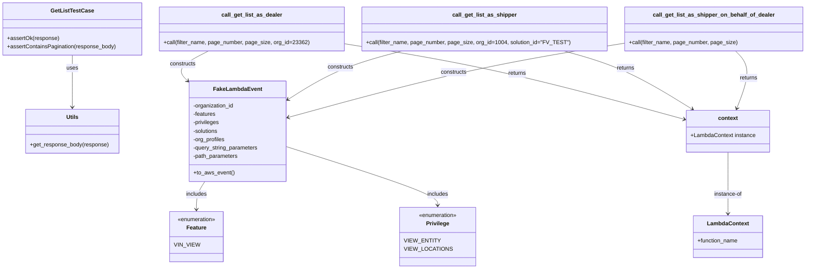

# Diagram: entity_core/entity_search/tests/integration_tests/get_list_test_case.py


> Auto-generated by Obscura crawlers

## Diagram 1



### SVG

<svg id="container" width="2267.9609375" xmlns="http://www.w3.org/2000/svg" class="classDiagram" height="770" viewBox="0 0 2267.9609375 770" role="graphics-document document" aria-roledescription="class"><style>#container{font-family:"trebuchet ms",verdana,arial,sans-serif;font-size:16px;fill:#333;}@keyframes edge-animation-frame{from{stroke-dashoffset:0;}}@keyframes dash{to{stroke-dashoffset:0;}}#container .edge-animation-slow{stroke-dasharray:9,5!important;stroke-dashoffset:900;animation:dash 50s linear infinite;stroke-linecap:round;}#container .edge-animation-fast{stroke-dasharray:9,5!important;stroke-dashoffset:900;animation:dash 20s linear infinite;stroke-linecap:round;}#container .error-icon{fill:#552222;}#container .error-text{fill:#552222;stroke:#552222;}#container .edge-thickness-normal{stroke-width:1px;}#container .edge-thickness-thick{stroke-width:3.5px;}#container .edge-pattern-solid{stroke-dasharray:0;}#container .edge-thickness-invisible{stroke-width:0;fill:none;}#container .edge-pattern-dashed{stroke-dasharray:3;}#container .edge-pattern-dotted{stroke-dasharray:2;}#container .marker{fill:#333333;stroke:#333333;}#container .marker.cross{stroke:#333333;}#container svg{font-family:"trebuchet ms",verdana,arial,sans-serif;font-size:16px;}#container p{margin:0;}#container g.classGroup text{fill:#9370DB;stroke:none;font-family:"trebuchet ms",verdana,arial,sans-serif;font-size:10px;}#container g.classGroup text .title{font-weight:bolder;}#container .nodeLabel,#container .edgeLabel{color:#131300;}#container .edgeLabel .label rect{fill:#ECECFF;}#container .label text{fill:#131300;}#container .labelBkg{background:#ECECFF;}#container .edgeLabel .label span{background:#ECECFF;}#container .classTitle{font-weight:bolder;}#container .node rect,#container .node circle,#container .node ellipse,#container .node polygon,#container .node path{fill:#ECECFF;stroke:#9370DB;stroke-width:1px;}#container .divider{stroke:#9370DB;stroke-width:1;}#container g.clickable{cursor:pointer;}#container g.classGroup rect{fill:#ECECFF;stroke:#9370DB;}#container g.classGroup line{stroke:#9370DB;stroke-width:1;}#container .classLabel .box{stroke:none;stroke-width:0;fill:#ECECFF;opacity:0.5;}#container .classLabel .label{fill:#9370DB;font-size:10px;}#container .relation{stroke:#333333;stroke-width:1;fill:none;}#container .dashed-line{stroke-dasharray:3;}#container .dotted-line{stroke-dasharray:1 2;}#container #compositionStart,#container .composition{fill:#333333!important;stroke:#333333!important;stroke-width:1;}#container #compositionEnd,#container .composition{fill:#333333!important;stroke:#333333!important;stroke-width:1;}#container #dependencyStart,#container .dependency{fill:#333333!important;stroke:#333333!important;stroke-width:1;}#container #dependencyStart,#container .dependency{fill:#333333!important;stroke:#333333!important;stroke-width:1;}#container #extensionStart,#container .extension{fill:transparent!important;stroke:#333333!important;stroke-width:1;}#container #extensionEnd,#container .extension{fill:transparent!important;stroke:#333333!important;stroke-width:1;}#container #aggregationStart,#container .aggregation{fill:transparent!important;stroke:#333333!important;stroke-width:1;}#container #aggregationEnd,#container .aggregation{fill:transparent!important;stroke:#333333!important;stroke-width:1;}#container #lollipopStart,#container .lollipop{fill:#ECECFF!important;stroke:#333333!important;stroke-width:1;}#container #lollipopEnd,#container .lollipop{fill:#ECECFF!important;stroke:#333333!important;stroke-width:1;}#container .edgeTerminals{font-size:11px;line-height:initial;}#container .classTitleText{text-anchor:middle;font-size:18px;fill:#333;}#container .label-icon{display:inline-block;height:1em;overflow:visible;vertical-align:-0.125em;}#container .node .label-icon path{fill:currentColor;stroke:revert;stroke-width:revert;}#container :root{--mermaid-font-family:"trebuchet ms",verdana,arial,sans-serif;}</style><g><defs><marker id="container_class-aggregationStart" class="marker aggregation class" refX="18" refY="7" markerWidth="190" markerHeight="240" orient="auto"><path d="M 18,7 L9,13 L1,7 L9,1 Z"></path></marker></defs><defs><marker id="container_class-aggregationEnd" class="marker aggregation class" refX="1" refY="7" markerWidth="20" markerHeight="28" orient="auto"><path d="M 18,7 L9,13 L1,7 L9,1 Z"></path></marker></defs><defs><marker id="container_class-extensionStart" class="marker extension class" refX="18" refY="7" markerWidth="190" markerHeight="240" orient="auto"><path d="M 1,7 L18,13 V 1 Z"></path></marker></defs><defs><marker id="container_class-extensionEnd" class="marker extension class" refX="1" refY="7" markerWidth="20" markerHeight="28" orient="auto"><path d="M 1,1 V 13 L18,7 Z"></path></marker></defs><defs><marker id="container_class-compositionStart" class="marker composition class" refX="18" refY="7" markerWidth="190" markerHeight="240" orient="auto"><path d="M 18,7 L9,13 L1,7 L9,1 Z"></path></marker></defs><defs><marker id="container_class-compositionEnd" class="marker composition class" refX="1" refY="7" markerWidth="20" markerHeight="28" orient="auto"><path d="M 18,7 L9,13 L1,7 L9,1 Z"></path></marker></defs><defs><marker id="container_class-dependencyStart" class="marker dependency class" refX="6" refY="7" markerWidth="190" markerHeight="240" orient="auto"><path d="M 5,7 L9,13 L1,7 L9,1 Z"></path></marker></defs><defs><marker id="container_class-dependencyEnd" class="marker dependency class" refX="13" refY="7" markerWidth="20" markerHeight="28" orient="auto"><path d="M 18,7 L9,13 L14,7 L9,1 Z"></path></marker></defs><defs><marker id="container_class-lollipopStart" class="marker lollipop class" refX="13" refY="7" markerWidth="190" markerHeight="240" orient="auto"><circle stroke="black" fill="transparent" cx="7" cy="7" r="6"></circle></marker></defs><defs><marker id="container_class-lollipopEnd" class="marker lollipop class" refX="1" refY="7" markerWidth="190" markerHeight="240" orient="auto"><circle stroke="black" fill="transparent" cx="7" cy="7" r="6"></circle></marker></defs><g class="root"><g class="clusters"></g><g class="edgePaths"><path d="M205.508,158L205.508,164.167C205.508,170.333,205.508,182.667,205.508,207.5C205.508,232.333,205.508,269.667,205.508,288.333L205.508,307" id="id_GetListTestCase_Utils_1" class="edge-thickness-normal edge-pattern-solid relation" style=";;;" data-edge="true" data-et="edge" data-id="id_GetListTestCase_Utils_1" data-points="W3sieCI6MjA1LjUwNzgxMjUsInkiOjE1OH0seyJ4IjoyMDUuNTA3ODEyNSwieSI6MTk1fSx7IngiOjIwNS41MDc4MTI1LCJ5IjozMTN9XQ==" marker-end="url(#container_class-dependencyEnd)"></path><path d="M591.203,146L575.409,154.167C559.616,162.333,528.029,178.667,517.488,192.28C506.946,205.894,517.452,216.787,522.704,222.234L527.957,227.681" id="id_call_get_list_as_dealer_FakeLambdaEvent_2" class="edge-thickness-normal edge-pattern-solid relation" style=";;;" data-edge="true" data-et="edge" data-id="id_call_get_list_as_dealer_FakeLambdaEvent_2" data-points="W3sieCI6NTkxLjIwMjg4MDg1OTM3NSwieSI6MTQ2fSx7IngiOjQ5Ni40NDE0MDYyNSwieSI6MTk1fSx7IngiOjUzMi4xMjE0NjA2MzUzNTkxLCJ5IjoyMzJ9XQ==" marker-end="url(#container_class-dependencyEnd)"></path><path d="M973.063,125.194L1044.759,136.829C1116.455,148.463,1259.848,171.731,1418.789,207.73C1577.73,243.728,1752.22,292.455,1839.465,316.819L1926.709,341.183" id="id_call_get_list_as_dealer_context_3" class="edge-thickness-normal edge-pattern-solid relation" style=";;;" data-edge="true" data-et="edge" data-id="id_call_get_list_as_dealer_context_3" data-points="W3sieCI6OTczLjA2MjUsInkiOjEyNS4xOTQ0MDA5NzU3MTE5MX0seyJ4IjoxNDAzLjI0MDIzNDM3NSwieSI6MTk1fSx7IngiOjE5MzIuNDg4MjgxMjUsInkiOjM0Mi43OTY2NzY4MjE4MjY3fV0=" marker-end="url(#container_class-dependencyEnd)"></path><path d="M1131.703,146L1101.346,154.167C1070.989,162.333,1010.276,178.667,957.519,201.387C904.762,224.108,859.961,253.217,837.561,267.771L815.16,282.325" id="id_call_get_list_as_shipper_FakeLambdaEvent_4" class="edge-thickness-normal edge-pattern-solid relation" style=";;;" data-edge="true" data-et="edge" data-id="id_call_get_list_as_shipper_FakeLambdaEvent_4" data-points="W3sieCI6MTEzMS43MDI2MzY3MTg3NSwieSI6MTQ2fSx7IngiOjk0OS41NjI1LCJ5IjoxOTV9LHsieCI6ODEwLjEyODkwNjI1LCJ5IjoyODUuNTkzOTA1OTk1ODQ5NDd9XQ==" marker-end="url(#container_class-dependencyEnd)"></path><path d="M1590.908,146L1620.078,154.167C1649.248,162.333,1707.588,178.667,1767.719,206.465C1827.849,234.262,1889.771,273.525,1920.731,293.156L1951.692,312.787" id="id_call_get_list_as_shipper_context_5" class="edge-thickness-normal edge-pattern-solid relation" style=";;;" data-edge="true" data-et="edge" data-id="id_call_get_list_as_shipper_context_5" data-points="W3sieCI6MTU5MC45MDgwODEwNTQ2ODc1LCJ5IjoxNDZ9LHsieCI6MTc2NS45Mjc3MzQzNzUsInkiOjE5NX0seyJ4IjoxOTU2Ljc1OTQzMTExMTg3ODUsInkiOjMxNn1d" marker-end="url(#container_class-dependencyEnd)"></path><path d="M1758.703,123.67L1685.441,135.558C1612.179,147.447,1465.655,171.223,1308.522,206.533C1151.39,241.843,983.649,288.686,899.778,312.107L815.908,335.529" id="id_call_get_list_as_shipper_on_behalf_of_dealer_FakeLambdaEvent_6" class="edge-thickness-normal edge-pattern-solid relation" style=";;;" data-edge="true" data-et="edge" data-id="id_call_get_list_as_shipper_on_behalf_of_dealer_FakeLambdaEvent_6" data-points="W3sieCI6MTc1OC43MDMxMjUsInkiOjEyMy42Njk5MzYwMTg0Mjc1OX0seyJ4IjoxMzE5LjEzMDg1OTM3NSwieSI6MTk1fSx7IngiOjgxMC4xMjg5MDYyNSwieSI6MzM3LjE0Mjc5NjAxMzg3Mzd9XQ==" marker-end="url(#container_class-dependencyEnd)"></path><path d="M2073.787,146L2082.142,154.167C2090.497,162.333,2107.208,178.667,2107.853,206.072C2108.499,233.477,2093.081,271.954,2085.371,291.192L2077.662,310.431" id="id_call_get_list_as_shipper_on_behalf_of_dealer_context_7" class="edge-thickness-normal edge-pattern-solid relation" style=";;;" data-edge="true" data-et="edge" data-id="id_call_get_list_as_shipper_on_behalf_of_dealer_context_7" data-points="W3sieCI6MjA3My43ODY2MjEwOTM3NSwieSI6MTQ2fSx7IngiOjIxMjMuOTE3OTY4NzUsInkiOjE5NX0seyJ4IjoyMDc1LjQzMDIyNzAzNzI5MjgsInkiOjMxNn1d" marker-end="url(#container_class-dependencyEnd)"></path><path d="M581.74,520L577.918,526.167C574.096,532.333,566.452,544.667,562.63,558C558.809,571.333,558.809,585.667,558.809,592.833L558.809,600" id="id_FakeLambdaEvent_Feature_8" class="edge-thickness-normal edge-pattern-solid relation" style=";;;" data-edge="true" data-et="edge" data-id="id_FakeLambdaEvent_Feature_8" data-points="W3sieCI6NTgxLjczOTU1NDU1ODAxMSwieSI6NTIwfSx7IngiOjU1OC44MDg1OTM3NSwieSI6NTU3fSx7IngiOjU1OC44MDg1OTM3NSwieSI6NjA2fV0=" marker-end="url(#container_class-dependencyEnd)"></path><path d="M810.129,420.565L881.128,443.304C952.126,466.043,1094.124,511.522,1165.122,539.427C1236.121,567.333,1236.121,577.667,1236.121,582.833L1236.121,588" id="id_FakeLambdaEvent_Privilege_9" class="edge-thickness-normal edge-pattern-solid relation" style=";;;" data-edge="true" data-et="edge" data-id="id_FakeLambdaEvent_Privilege_9" data-points="W3sieCI6ODEwLjEyODkwNjI1LCJ5Ijo0MjAuNTY0NzIwOTI2MjEzOX0seyJ4IjoxMjM2LjEyMTA5Mzc1LCJ5Ijo1NTd9LHsieCI6MTIzNi4xMjEwOTM3NSwieSI6NTk0fV0=" marker-end="url(#container_class-dependencyEnd)"></path><path d="M2051.387,436L2051.387,456.167C2051.387,476.333,2051.387,516.667,2051.387,546C2051.387,575.333,2051.387,593.667,2051.387,602.833L2051.387,612" id="id_context_LambdaContext_10" class="edge-thickness-normal edge-pattern-solid relation" style=";;;" data-edge="true" data-et="edge" data-id="id_context_LambdaContext_10" data-points="W3sieCI6MjA1MS4zODY3MTg3NSwieSI6NDM2fSx7IngiOjIwNTEuMzg2NzE4NzUsInkiOjU1N30seyJ4IjoyMDUxLjM4NjcxODc1LCJ5Ijo2MTh9XQ==" marker-end="url(#container_class-dependencyEnd)"></path></g><g class="edgeLabels"><g class="edgeLabel" transform="translate(205.5078125, 195)"><g class="label" data-id="id_GetListTestCase_Utils_1" transform="translate(-16.4921875, -12)"><foreignObject width="32.984375" height="24"><div xmlns="http://www.w3.org/1999/xhtml" class="labelBkg" style="display: table-cell; white-space: nowrap; line-height: 1.5; max-width: 200px; text-align: center;"><span class="edgeLabel"><p>uses</p></span></div></foreignObject></g></g><g class="edgeLabel" transform="translate(520.99306, 182.30464)"><g class="label" data-id="id_call_get_list_as_dealer_FakeLambdaEvent_2" transform="translate(-37.84375, -12)"><foreignObject width="75.6875" height="24"><div xmlns="http://www.w3.org/1999/xhtml" class="labelBkg" style="display: table-cell; white-space: nowrap; line-height: 1.5; max-width: 200px; text-align: center;"><span class="edgeLabel"><p>constructs</p></span></div></foreignObject></g></g><g class="edgeLabel" transform="translate(1457.99176, 210.28979)"><g class="label" data-id="id_call_get_list_as_dealer_context_3" transform="translate(-26.265625, -12)"><foreignObject width="52.53125" height="24"><div xmlns="http://www.w3.org/1999/xhtml" class="labelBkg" style="display: table-cell; white-space: nowrap; line-height: 1.5; max-width: 200px; text-align: center;"><span class="edgeLabel"><p>returns</p></span></div></foreignObject></g></g><g class="edgeLabel" transform="translate(960.34718, 192.09867)"><g class="label" data-id="id_call_get_list_as_shipper_FakeLambdaEvent_4" transform="translate(-37.84375, -12)"><foreignObject width="75.6875" height="24"><div xmlns="http://www.w3.org/1999/xhtml" class="labelBkg" style="display: table-cell; white-space: nowrap; line-height: 1.5; max-width: 200px; text-align: center;"><span class="edgeLabel"><p>constructs</p></span></div></foreignObject></g></g><g class="edgeLabel" transform="translate(1765.927734375, 195)"><g class="label" data-id="id_call_get_list_as_shipper_context_5" transform="translate(-26.265625, -12)"><foreignObject width="52.53125" height="24"><div xmlns="http://www.w3.org/1999/xhtml" class="labelBkg" style="display: table-cell; white-space: nowrap; line-height: 1.5; max-width: 200px; text-align: center;"><span class="edgeLabel"><p>returns</p></span></div></foreignObject></g></g><g class="edgeLabel" transform="translate(1279.08573, 206.18292)"><g class="label" data-id="id_call_get_list_as_shipper_on_behalf_of_dealer_FakeLambdaEvent_6" transform="translate(-37.84375, -12)"><foreignObject width="75.6875" height="24"><div xmlns="http://www.w3.org/1999/xhtml" class="labelBkg" style="display: table-cell; white-space: nowrap; line-height: 1.5; max-width: 200px; text-align: center;"><span class="edgeLabel"><p>constructs</p></span></div></foreignObject></g></g><g class="edgeLabel" transform="translate(2112.71187, 222.96456)"><g class="label" data-id="id_call_get_list_as_shipper_on_behalf_of_dealer_context_7" transform="translate(-26.265625, -12)"><foreignObject width="52.53125" height="24"><div xmlns="http://www.w3.org/1999/xhtml" class="labelBkg" style="display: table-cell; white-space: nowrap; line-height: 1.5; max-width: 200px; text-align: center;"><span class="edgeLabel"><p>returns</p></span></div></foreignObject></g></g><g class="edgeLabel" transform="translate(558.80859375, 557)"><g class="label" data-id="id_FakeLambdaEvent_Feature_8" transform="translate(-30.6484375, -12)"><foreignObject width="61.296875" height="24"><div xmlns="http://www.w3.org/1999/xhtml" class="labelBkg" style="display: table-cell; white-space: nowrap; line-height: 1.5; max-width: 200px; text-align: center;"><span class="edgeLabel"><p>includes</p></span></div></foreignObject></g></g><g class="edgeLabel" transform="translate(1236.12109375, 557)"><g class="label" data-id="id_FakeLambdaEvent_Privilege_9" transform="translate(-30.6484375, -12)"><foreignObject width="61.296875" height="24"><div xmlns="http://www.w3.org/1999/xhtml" class="labelBkg" style="display: table-cell; white-space: nowrap; line-height: 1.5; max-width: 200px; text-align: center;"><span class="edgeLabel"><p>includes</p></span></div></foreignObject></g></g><g class="edgeLabel" transform="translate(2051.38671875, 557)"><g class="label" data-id="id_context_LambdaContext_10" transform="translate(-41.15625, -12)"><foreignObject width="82.3125" height="24"><div xmlns="http://www.w3.org/1999/xhtml" class="labelBkg" style="display: table-cell; white-space: nowrap; line-height: 1.5; max-width: 200px; text-align: center;"><span class="edgeLabel"><p>instance-of</p></span></div></foreignObject></g></g></g><g class="nodes"><g class="node default" id="classId-GetListTestCase-0" transform="translate(205.5078125, 83)"><g class="basic label-container"><path d="M-197.5078125 -75 L197.5078125 -75 L197.5078125 75 L-197.5078125 75" stroke="none" stroke-width="0" fill="#ECECFF" style=""></path><path d="M-197.5078125 -75 C-70.00785763586534 -75, 57.49209722826933 -75, 197.5078125 -75 M-197.5078125 -75 C-58.39500823450891 -75, 80.71779603098219 -75, 197.5078125 -75 M197.5078125 -75 C197.5078125 -19.89284482049782, 197.5078125 35.21431035900436, 197.5078125 75 M197.5078125 -75 C197.5078125 -41.39196512519296, 197.5078125 -7.783930250385922, 197.5078125 75 M197.5078125 75 C47.870441529533764 75, -101.76692944093247 75, -197.5078125 75 M197.5078125 75 C78.76809685918201 75, -39.97161878163598 75, -197.5078125 75 M-197.5078125 75 C-197.5078125 26.07297256775822, -197.5078125 -22.854054864483558, -197.5078125 -75 M-197.5078125 75 C-197.5078125 30.608369010068564, -197.5078125 -13.783261979862871, -197.5078125 -75" stroke="#9370DB" stroke-width="1.3" fill="none" stroke-dasharray="0 0" style=""></path></g><g class="annotation-group text" transform="translate(0, -51)"></g><g class="label-group text" transform="translate(-58.328125, -51)"><g class="label" style="font-weight: bolder" transform="translate(0,-12)"><foreignObject width="116.65625" height="24"><div xmlns="http://www.w3.org/1999/xhtml" style="display: table-cell; white-space: nowrap; line-height: 1.5; max-width: 163px; text-align: center;"><span class="nodeLabel markdown-node-label" style=""><p>GetListTestCase</p></span></div></foreignObject></g></g><g class="members-group text" transform="translate(-185.5078125, -3)"></g><g class="methods-group text" transform="translate(-185.5078125, 27)"><g class="label" style="" transform="translate(0,-12)"><foreignObject width="147.6875" height="24"><div xmlns="http://www.w3.org/1999/xhtml" style="display: table-cell; white-space: nowrap; line-height: 1.5; max-width: 205px; text-align: center;"><span class="nodeLabel markdown-node-label" style=""><p>+assertOk(response)</p></span></div></foreignObject></g><g class="label" style="" transform="translate(0,12)"><foreignObject width="312.6875" height="24"><div xmlns="http://www.w3.org/1999/xhtml" style="display: table-cell; white-space: nowrap; line-height: 1.5; max-width: 370px; text-align: center;"><span class="nodeLabel markdown-node-label" style=""><p>+assertContainsPagination(response_body)</p></span></div></foreignObject></g></g><g class="divider" style=""><path d="M-197.5078125 -27 C-113.34426695684914 -27, -29.18072141369828 -27, 197.5078125 -27 M-197.5078125 -27 C-71.43041496390211 -27, 54.64698257219578 -27, 197.5078125 -27" stroke="#9370DB" stroke-width="1.3" fill="none" stroke-dasharray="0 0" style=""></path></g><g class="divider" style=""><path d="M-197.5078125 -3 C-62.04933629637509 -3, 73.40913990724982 -3, 197.5078125 -3 M-197.5078125 -3 C-74.12028392763696 -3, 49.26724464472608 -3, 197.5078125 -3" stroke="#9370DB" stroke-width="1.3" fill="none" stroke-dasharray="0 0" style=""></path></g></g><g class="node default" id="classId-Utils-1" transform="translate(205.5078125, 376)"><g class="basic label-container"><path d="M-133.46875 -63 L133.46875 -63 L133.46875 63 L-133.46875 63" stroke="none" stroke-width="0" fill="#ECECFF" style=""></path><path d="M-133.46875 -63 C-58.527915685997556 -63, 16.41291862800489 -63, 133.46875 -63 M-133.46875 -63 C-63.29718988555615 -63, 6.874370228887699 -63, 133.46875 -63 M133.46875 -63 C133.46875 -18.474389083277693, 133.46875 26.051221833444615, 133.46875 63 M133.46875 -63 C133.46875 -34.991229797795654, 133.46875 -6.982459595591301, 133.46875 63 M133.46875 63 C46.206573500442374 63, -41.05560299911525 63, -133.46875 63 M133.46875 63 C41.89714436098171 63, -49.674461278036574 63, -133.46875 63 M-133.46875 63 C-133.46875 27.806225401924685, -133.46875 -7.38754919615063, -133.46875 -63 M-133.46875 63 C-133.46875 21.468779194937802, -133.46875 -20.062441610124395, -133.46875 -63" stroke="#9370DB" stroke-width="1.3" fill="none" stroke-dasharray="0 0" style=""></path></g><g class="annotation-group text" transform="translate(0, -39)"></g><g class="label-group text" transform="translate(-16.796875, -39)"><g class="label" style="font-weight: bolder" transform="translate(0,-12)"><foreignObject width="33.59375" height="24"><div xmlns="http://www.w3.org/1999/xhtml" style="display: table-cell; white-space: nowrap; line-height: 1.5; max-width: 83px; text-align: center;"><span class="nodeLabel markdown-node-label" style=""><p>Utils</p></span></div></foreignObject></g></g><g class="members-group text" transform="translate(-121.46875, 9)"></g><g class="methods-group text" transform="translate(-121.46875, 39)"><g class="label" style="" transform="translate(0,-12)"><foreignObject width="226.140625" height="24"><div xmlns="http://www.w3.org/1999/xhtml" style="display: table-cell; white-space: nowrap; line-height: 1.5; max-width: 284px; text-align: center;"><span class="nodeLabel markdown-node-label" style=""><p>+get_response_body(response)</p></span></div></foreignObject></g></g><g class="divider" style=""><path d="M-133.46875 -15 C-52.9657631845439 -15, 27.537223630912194 -15, 133.46875 -15 M-133.46875 -15 C-72.18267742819177 -15, -10.896604856383547 -15, 133.46875 -15" stroke="#9370DB" stroke-width="1.3" fill="none" stroke-dasharray="0 0" style=""></path></g><g class="divider" style=""><path d="M-133.46875 9 C-56.02468526362843 9, 21.419379472743145 9, 133.46875 9 M-133.46875 9 C-75.32590003646085 9, -17.183050072921702 9, 133.46875 9" stroke="#9370DB" stroke-width="1.3" fill="none" stroke-dasharray="0 0" style=""></path></g></g><g class="node default" id="classId-FakeLambdaEvent-2" transform="translate(670.984375, 376)"><g class="basic label-container"><path d="M-139.14453125 -144 L139.14453125 -144 L139.14453125 144 L-139.14453125 144" stroke="none" stroke-width="0" fill="#ECECFF" style=""></path><path d="M-139.14453125 -144 C-31.916905444365142 -144, 75.31072036126972 -144, 139.14453125 -144 M-139.14453125 -144 C-68.93158747345197 -144, 1.2813563030960609 -144, 139.14453125 -144 M139.14453125 -144 C139.14453125 -72.66686138583117, 139.14453125 -1.3337227716623374, 139.14453125 144 M139.14453125 -144 C139.14453125 -44.105160067964874, 139.14453125 55.78967986407025, 139.14453125 144 M139.14453125 144 C72.81067798547514 144, 6.476824720950276 144, -139.14453125 144 M139.14453125 144 C37.296933118138995 144, -64.55066501372201 144, -139.14453125 144 M-139.14453125 144 C-139.14453125 79.64959467880186, -139.14453125 15.299189357603723, -139.14453125 -144 M-139.14453125 144 C-139.14453125 68.86247674798483, -139.14453125 -6.2750465040303425, -139.14453125 -144" stroke="#9370DB" stroke-width="1.3" fill="none" stroke-dasharray="0 0" style=""></path></g><g class="annotation-group text" transform="translate(0, -120)"></g><g class="label-group text" transform="translate(-65.8671875, -120)"><g class="label" style="font-weight: bolder" transform="translate(0,-12)"><foreignObject width="131.734375" height="24"><div xmlns="http://www.w3.org/1999/xhtml" style="display: table-cell; white-space: nowrap; line-height: 1.5; max-width: 181px; text-align: center;"><span class="nodeLabel markdown-node-label" style=""><p>FakeLambdaEvent</p></span></div></foreignObject></g></g><g class="members-group text" transform="translate(-127.14453125, -72)"><g class="label" style="" transform="translate(0,-12)"><foreignObject width="119.203125" height="24"><div xmlns="http://www.w3.org/1999/xhtml" style="display: table-cell; white-space: nowrap; line-height: 1.5; max-width: 177px; text-align: center;"><span class="nodeLabel markdown-node-label" style=""><p>-organization_id</p></span></div></foreignObject></g><g class="label" style="" transform="translate(0,12)"><foreignObject width="65.65625" height="24"><div xmlns="http://www.w3.org/1999/xhtml" style="display: table-cell; white-space: nowrap; line-height: 1.5; max-width: 123px; text-align: center;"><span class="nodeLabel markdown-node-label" style=""><p>-features</p></span></div></foreignObject></g><g class="label" style="" transform="translate(0,36)"><foreignObject width="76.609375" height="24"><div xmlns="http://www.w3.org/1999/xhtml" style="display: table-cell; white-space: nowrap; line-height: 1.5; max-width: 134px; text-align: center;"><span class="nodeLabel markdown-node-label" style=""><p>-privileges</p></span></div></foreignObject></g><g class="label" style="" transform="translate(0,60)"><foreignObject width="73.75" height="24"><div xmlns="http://www.w3.org/1999/xhtml" style="display: table-cell; white-space: nowrap; line-height: 1.5; max-width: 131px; text-align: center;"><span class="nodeLabel markdown-node-label" style=""><p>-solutions</p></span></div></foreignObject></g><g class="label" style="" transform="translate(0,84)"><foreignObject width="92.984375" height="24"><div xmlns="http://www.w3.org/1999/xhtml" style="display: table-cell; white-space: nowrap; line-height: 1.5; max-width: 150px; text-align: center;"><span class="nodeLabel markdown-node-label" style=""><p>-org_profiles</p></span></div></foreignObject></g><g class="label" style="" transform="translate(0,108)"><foreignObject width="188.421875" height="24"><div xmlns="http://www.w3.org/1999/xhtml" style="display: table-cell; white-space: nowrap; line-height: 1.5; max-width: 246px; text-align: center;"><span class="nodeLabel markdown-node-label" style=""><p>-query_string_parameters</p></span></div></foreignObject></g><g class="label" style="" transform="translate(0,132)"><foreignObject width="130.4375" height="24"><div xmlns="http://www.w3.org/1999/xhtml" style="display: table-cell; white-space: nowrap; line-height: 1.5; max-width: 188px; text-align: center;"><span class="nodeLabel markdown-node-label" style=""><p>-path_parameters</p></span></div></foreignObject></g></g><g class="methods-group text" transform="translate(-127.14453125, 120)"><g class="label" style="" transform="translate(0,-12)"><foreignObject width="116.421875" height="24"><div xmlns="http://www.w3.org/1999/xhtml" style="display: table-cell; white-space: nowrap; line-height: 1.5; max-width: 174px; text-align: center;"><span class="nodeLabel markdown-node-label" style=""><p>+to_aws_event()</p></span></div></foreignObject></g></g><g class="divider" style=""><path d="M-139.14453125 -96 C-49.35221645517667 -96, 40.44009833964665 -96, 139.14453125 -96 M-139.14453125 -96 C-62.5859768158364 -96, 13.972577618327193 -96, 139.14453125 -96" stroke="#9370DB" stroke-width="1.3" fill="none" stroke-dasharray="0 0" style=""></path></g><g class="divider" style=""><path d="M-139.14453125 96 C-65.571571983748 96, 8.001387282503998 96, 139.14453125 96 M-139.14453125 96 C-55.11458275132392 96, 28.915365747352155 96, 139.14453125 96" stroke="#9370DB" stroke-width="1.3" fill="none" stroke-dasharray="0 0" style=""></path></g></g><g class="node default" id="classId-LambdaContext-3" transform="translate(2051.38671875, 678)"><g class="basic label-container"><path d="M-99.2890625 -60 L99.2890625 -60 L99.2890625 60 L-99.2890625 60" stroke="none" stroke-width="0" fill="#ECECFF" style=""></path><path d="M-99.2890625 -60 C-30.53879067760468 -60, 38.21148114479064 -60, 99.2890625 -60 M-99.2890625 -60 C-59.09283958801651 -60, -18.89661667603302 -60, 99.2890625 -60 M99.2890625 -60 C99.2890625 -12.050730396005584, 99.2890625 35.89853920798883, 99.2890625 60 M99.2890625 -60 C99.2890625 -23.927057210998576, 99.2890625 12.145885578002847, 99.2890625 60 M99.2890625 60 C23.91083112196135 60, -51.4674002560773 60, -99.2890625 60 M99.2890625 60 C39.29692650036203 60, -20.695209499275947 60, -99.2890625 60 M-99.2890625 60 C-99.2890625 34.0896065649792, -99.2890625 8.179213129958399, -99.2890625 -60 M-99.2890625 60 C-99.2890625 21.296835755123787, -99.2890625 -17.406328489752426, -99.2890625 -60" stroke="#9370DB" stroke-width="1.3" fill="none" stroke-dasharray="0 0" style=""></path></g><g class="annotation-group text" transform="translate(0, -36)"></g><g class="label-group text" transform="translate(-57.296875, -36)"><g class="label" style="font-weight: bolder" transform="translate(0,-12)"><foreignObject width="114.59375" height="24"><div xmlns="http://www.w3.org/1999/xhtml" style="display: table-cell; white-space: nowrap; line-height: 1.5; max-width: 163px; text-align: center;"><span class="nodeLabel markdown-node-label" style=""><p>LambdaContext</p></span></div></foreignObject></g></g><g class="members-group text" transform="translate(-87.2890625, 12)"><g class="label" style="" transform="translate(0,-12)"><foreignObject width="117.28125" height="24"><div xmlns="http://www.w3.org/1999/xhtml" style="display: table-cell; white-space: nowrap; line-height: 1.5; max-width: 175px; text-align: center;"><span class="nodeLabel markdown-node-label" style=""><p>+function_name</p></span></div></foreignObject></g></g><g class="methods-group text" transform="translate(-87.2890625, 60)"></g><g class="divider" style=""><path d="M-99.2890625 -12 C-30.23251873522389 -12, 38.82402502955222 -12, 99.2890625 -12 M-99.2890625 -12 C-31.683691399900454 -12, 35.92167970019909 -12, 99.2890625 -12" stroke="#9370DB" stroke-width="1.3" fill="none" stroke-dasharray="0 0" style=""></path></g><g class="divider" style=""><path d="M-99.2890625 36 C-52.22891607477582 36, -5.168769649551635 36, 99.2890625 36 M-99.2890625 36 C-32.59130290278421 36, 34.106456694431586 36, 99.2890625 36" stroke="#9370DB" stroke-width="1.3" fill="none" stroke-dasharray="0 0" style=""></path></g></g><g class="node default" id="classId-Feature-4" transform="translate(558.80859375, 678)"><g class="basic label-container"><path d="M-73.51171875 -72 L73.51171875 -72 L73.51171875 72 L-73.51171875 72" stroke="none" stroke-width="0" fill="#ECECFF" style=""></path><path d="M-73.51171875 -72 C-28.441156783427097 -72, 16.629405183145806 -72, 73.51171875 -72 M-73.51171875 -72 C-29.87126276334621 -72, 13.769193223307582 -72, 73.51171875 -72 M73.51171875 -72 C73.51171875 -28.799717181458405, 73.51171875 14.40056563708319, 73.51171875 72 M73.51171875 -72 C73.51171875 -23.251863552248608, 73.51171875 25.496272895502784, 73.51171875 72 M73.51171875 72 C31.364068542441103 72, -10.783581665117794 72, -73.51171875 72 M73.51171875 72 C23.916798431484587 72, -25.678121887030827 72, -73.51171875 72 M-73.51171875 72 C-73.51171875 39.6527904504199, -73.51171875 7.3055809008398, -73.51171875 -72 M-73.51171875 72 C-73.51171875 34.64433111929081, -73.51171875 -2.7113377614183776, -73.51171875 -72" stroke="#9370DB" stroke-width="1.3" fill="none" stroke-dasharray="0 0" style=""></path></g><g class="annotation-group text" transform="translate(-55.5546875, -48)"><g class="label" style="" transform="translate(0,-12)"><foreignObject width="111.109375" height="24"><div xmlns="http://www.w3.org/1999/xhtml" style="display: table-cell; white-space: nowrap; line-height: 1.5; max-width: 161px; text-align: center;"><span class="nodeLabel markdown-node-label" style=""><p>«enumeration»</p></span></div></foreignObject></g></g><g class="label-group text" transform="translate(-27.390625, -24)"><g class="label" style="font-weight: bolder" transform="translate(0,-12)"><foreignObject width="54.78125" height="24"><div xmlns="http://www.w3.org/1999/xhtml" style="display: table-cell; white-space: nowrap; line-height: 1.5; max-width: 104px; text-align: center;"><span class="nodeLabel markdown-node-label" style=""><p>Feature</p></span></div></foreignObject></g></g><g class="members-group text" transform="translate(-61.51171875, 24)"><g class="label" style="" transform="translate(0,-12)"><foreignObject width="67.46875" height="24"><div xmlns="http://www.w3.org/1999/xhtml" style="display: table-cell; white-space: nowrap; line-height: 1.5; max-width: 117px; text-align: center;"><span class="nodeLabel markdown-node-label" style=""><p>VIN_VIEW</p></span></div></foreignObject></g></g><g class="methods-group text" transform="translate(-61.51171875, 72)"></g><g class="divider" style=""><path d="M-73.51171875 0 C-21.32000309061319 0, 30.871712568773617 0, 73.51171875 0 M-73.51171875 0 C-42.6589501164208 0, -11.806181482841595 0, 73.51171875 0" stroke="#9370DB" stroke-width="1.3" fill="none" stroke-dasharray="0 0" style=""></path></g><g class="divider" style=""><path d="M-73.51171875 48 C-24.109130230891033 48, 25.293458288217934 48, 73.51171875 48 M-73.51171875 48 C-43.47573441991179 48, -13.43975008982357 48, 73.51171875 48" stroke="#9370DB" stroke-width="1.3" fill="none" stroke-dasharray="0 0" style=""></path></g></g><g class="node default" id="classId-Privilege-5" transform="translate(1236.12109375, 678)"><g class="basic label-container"><path d="M-100.83984375 -84 L100.83984375 -84 L100.83984375 84 L-100.83984375 84" stroke="none" stroke-width="0" fill="#ECECFF" style=""></path><path d="M-100.83984375 -84 C-54.104089679483224 -84, -7.368335608966447 -84, 100.83984375 -84 M-100.83984375 -84 C-35.55790898175668 -84, 29.724025786486635 -84, 100.83984375 -84 M100.83984375 -84 C100.83984375 -19.71420976955214, 100.83984375 44.57158046089572, 100.83984375 84 M100.83984375 -84 C100.83984375 -32.3324626919843, 100.83984375 19.335074616031406, 100.83984375 84 M100.83984375 84 C24.38701229466615 84, -52.0658191606677 84, -100.83984375 84 M100.83984375 84 C31.98849023840468 84, -36.86286327319064 84, -100.83984375 84 M-100.83984375 84 C-100.83984375 27.6332182720948, -100.83984375 -28.733563455810398, -100.83984375 -84 M-100.83984375 84 C-100.83984375 46.55750075970061, -100.83984375 9.115001519401218, -100.83984375 -84" stroke="#9370DB" stroke-width="1.3" fill="none" stroke-dasharray="0 0" style=""></path></g><g class="annotation-group text" transform="translate(-55.5546875, -60)"><g class="label" style="" transform="translate(0,-12)"><foreignObject width="111.109375" height="24"><div xmlns="http://www.w3.org/1999/xhtml" style="display: table-cell; white-space: nowrap; line-height: 1.5; max-width: 161px; text-align: center;"><span class="nodeLabel markdown-node-label" style=""><p>«enumeration»</p></span></div></foreignObject></g></g><g class="label-group text" transform="translate(-31.8671875, -36)"><g class="label" style="font-weight: bolder" transform="translate(0,-12)"><foreignObject width="63.734375" height="24"><div xmlns="http://www.w3.org/1999/xhtml" style="display: table-cell; white-space: nowrap; line-height: 1.5; max-width: 112px; text-align: center;"><span class="nodeLabel markdown-node-label" style=""><p>Privilege</p></span></div></foreignObject></g></g><g class="members-group text" transform="translate(-88.83984375, 12)"><g class="label" style="" transform="translate(0,-12)"><foreignObject width="92.3125" height="24"><div xmlns="http://www.w3.org/1999/xhtml" style="display: table-cell; white-space: nowrap; line-height: 1.5; max-width: 143px; text-align: center;"><span class="nodeLabel markdown-node-label" style=""><p>VIEW_ENTITY</p></span></div></foreignObject></g><g class="label" style="" transform="translate(0,12)"><foreignObject width="122.125" height="24"><div xmlns="http://www.w3.org/1999/xhtml" style="display: table-cell; white-space: nowrap; line-height: 1.5; max-width: 172px; text-align: center;"><span class="nodeLabel markdown-node-label" style=""><p>VIEW_LOCATIONS</p></span></div></foreignObject></g></g><g class="methods-group text" transform="translate(-88.83984375, 84)"></g><g class="divider" style=""><path d="M-100.83984375 -12 C-27.084316074407113 -12, 46.671211601185774 -12, 100.83984375 -12 M-100.83984375 -12 C-45.51083824641006 -12, 9.81816725717988 -12, 100.83984375 -12" stroke="#9370DB" stroke-width="1.3" fill="none" stroke-dasharray="0 0" style=""></path></g><g class="divider" style=""><path d="M-100.83984375 60 C-34.13320661810151 60, 32.57343051379698 60, 100.83984375 60 M-100.83984375 60 C-29.725804723192823 60, 41.388234303614354 60, 100.83984375 60" stroke="#9370DB" stroke-width="1.3" fill="none" stroke-dasharray="0 0" style=""></path></g></g><g class="node default" id="classId-call_get_list_as_dealer-6" transform="translate(713.0390625, 83)"><g class="basic label-container"><path d="M-260.0234375 -63 L260.0234375 -63 L260.0234375 63 L-260.0234375 63" stroke="none" stroke-width="0" fill="#ECECFF" style=""></path><path d="M-260.0234375 -63 C-148.8526164933436 -63, -37.68179548668715 -63, 260.0234375 -63 M-260.0234375 -63 C-89.52722462435145 -63, 80.9689882512971 -63, 260.0234375 -63 M260.0234375 -63 C260.0234375 -37.43059784650183, 260.0234375 -11.861195693003665, 260.0234375 63 M260.0234375 -63 C260.0234375 -28.76530488440828, 260.0234375 5.469390231183439, 260.0234375 63 M260.0234375 63 C65.36536885428407 63, -129.29269979143186 63, -260.0234375 63 M260.0234375 63 C105.09441946763309 63, -49.834598564733824 63, -260.0234375 63 M-260.0234375 63 C-260.0234375 31.788242345224337, -260.0234375 0.5764846904486731, -260.0234375 -63 M-260.0234375 63 C-260.0234375 23.965594532526836, -260.0234375 -15.068810934946328, -260.0234375 -63" stroke="#9370DB" stroke-width="1.3" fill="none" stroke-dasharray="0 0" style=""></path></g><g class="annotation-group text" transform="translate(0, -39)"></g><g class="label-group text" transform="translate(-83.90625, -39)"><g class="label" style="font-weight: bolder" transform="translate(0,-12)"><foreignObject width="167.8125" height="24"><div xmlns="http://www.w3.org/1999/xhtml" style="display: table-cell; white-space: nowrap; line-height: 1.5; max-width: 216px; text-align: center;"><span class="nodeLabel markdown-node-label" style=""><p>call_get_list_as_dealer</p></span></div></foreignObject></g></g><g class="members-group text" transform="translate(-248.0234375, 9)"></g><g class="methods-group text" transform="translate(-248.0234375, 39)"><g class="label" style="" transform="translate(0,-12)"><foreignObject width="412.140625" height="24"><div xmlns="http://www.w3.org/1999/xhtml" style="display: table-cell; white-space: nowrap; line-height: 1.5; max-width: 470px; text-align: center;"><span class="nodeLabel markdown-node-label" style=""><p>+call(filter_name, page_number, page_size, org_id=23362)</p></span></div></foreignObject></g></g><g class="divider" style=""><path d="M-260.0234375 -15 C-82.66852281985547 -15, 94.68639186028906 -15, 260.0234375 -15 M-260.0234375 -15 C-145.3633021978141 -15, -30.703166895628186 -15, 260.0234375 -15" stroke="#9370DB" stroke-width="1.3" fill="none" stroke-dasharray="0 0" style=""></path></g><g class="divider" style=""><path d="M-260.0234375 9 C-58.54367955219158 9, 142.93607839561685 9, 260.0234375 9 M-260.0234375 9 C-72.23730370936559 9, 115.54883008126882 9, 260.0234375 9" stroke="#9370DB" stroke-width="1.3" fill="none" stroke-dasharray="0 0" style=""></path></g></g><g class="node default" id="classId-call_get_list_as_shipper-7" transform="translate(1365.8828125, 83)"><g class="basic label-container"><path d="M-342.8203125 -63 L342.8203125 -63 L342.8203125 63 L-342.8203125 63" stroke="none" stroke-width="0" fill="#ECECFF" style=""></path><path d="M-342.8203125 -63 C-149.57042664442474 -63, 43.679459211150515 -63, 342.8203125 -63 M-342.8203125 -63 C-129.19933802665417 -63, 84.42163644669165 -63, 342.8203125 -63 M342.8203125 -63 C342.8203125 -32.031321273386965, 342.8203125 -1.0626425467739367, 342.8203125 63 M342.8203125 -63 C342.8203125 -13.173471540057577, 342.8203125 36.65305691988485, 342.8203125 63 M342.8203125 63 C75.7763342954828 63, -191.2676439090344 63, -342.8203125 63 M342.8203125 63 C185.95209826594566 63, 29.08388403189133 63, -342.8203125 63 M-342.8203125 63 C-342.8203125 27.34959375448296, -342.8203125 -8.30081249103408, -342.8203125 -63 M-342.8203125 63 C-342.8203125 25.243296836692117, -342.8203125 -12.513406326615765, -342.8203125 -63" stroke="#9370DB" stroke-width="1.3" fill="none" stroke-dasharray="0 0" style=""></path></g><g class="annotation-group text" transform="translate(0, -39)"></g><g class="label-group text" transform="translate(-88.578125, -39)"><g class="label" style="font-weight: bolder" transform="translate(0,-12)"><foreignObject width="177.15625" height="24"><div xmlns="http://www.w3.org/1999/xhtml" style="display: table-cell; white-space: nowrap; line-height: 1.5; max-width: 225px; text-align: center;"><span class="nodeLabel markdown-node-label" style=""><p>call_get_list_as_shipper</p></span></div></foreignObject></g></g><g class="members-group text" transform="translate(-330.8203125, 9)"></g><g class="methods-group text" transform="translate(-330.8203125, 39)"><g class="label" style="" transform="translate(0,-12)"><foreignObject width="573.0625" height="24"><div xmlns="http://www.w3.org/1999/xhtml" style="display: table-cell; white-space: nowrap; line-height: 1.5; max-width: 630px; text-align: center;"><span class="nodeLabel markdown-node-label" style=""><p>+call(filter_name, page_number, page_size, org_id=1004, solution_id="FV_TEST")</p></span></div></foreignObject></g></g><g class="divider" style=""><path d="M-342.8203125 -15 C-129.48514591651795 -15, 83.8500206669641 -15, 342.8203125 -15 M-342.8203125 -15 C-153.64275007868176 -15, 35.534812342636485 -15, 342.8203125 -15" stroke="#9370DB" stroke-width="1.3" fill="none" stroke-dasharray="0 0" style=""></path></g><g class="divider" style=""><path d="M-342.8203125 9 C-116.60760207759489 9, 109.60510834481022 9, 342.8203125 9 M-342.8203125 9 C-157.49874057337277 9, 27.822831353254458 9, 342.8203125 9" stroke="#9370DB" stroke-width="1.3" fill="none" stroke-dasharray="0 0" style=""></path></g></g><g class="node default" id="classId-call_get_list_as_shipper_on_behalf_of_dealer-8" transform="translate(2009.33203125, 83)"><g class="basic label-container"><path d="M-250.62890625 -63 L250.62890625 -63 L250.62890625 63 L-250.62890625 63" stroke="none" stroke-width="0" fill="#ECECFF" style=""></path><path d="M-250.62890625 -63 C-137.40015675104732 -63, -24.17140725209464 -63, 250.62890625 -63 M-250.62890625 -63 C-102.05063312516285 -63, 46.52763999967431 -63, 250.62890625 -63 M250.62890625 -63 C250.62890625 -37.412953492319474, 250.62890625 -11.825906984638948, 250.62890625 63 M250.62890625 -63 C250.62890625 -13.70569480336674, 250.62890625 35.58861039326652, 250.62890625 63 M250.62890625 63 C94.1332851080995 63, -62.362336033801 63, -250.62890625 63 M250.62890625 63 C86.62388916032558 63, -77.38112792934885 63, -250.62890625 63 M-250.62890625 63 C-250.62890625 29.67250820086784, -250.62890625 -3.654983598264323, -250.62890625 -63 M-250.62890625 63 C-250.62890625 24.15819980324779, -250.62890625 -14.68360039350442, -250.62890625 -63" stroke="#9370DB" stroke-width="1.3" fill="none" stroke-dasharray="0 0" style=""></path></g><g class="annotation-group text" transform="translate(0, -39)"></g><g class="label-group text" transform="translate(-167.1640625, -39)"><g class="label" style="font-weight: bolder" transform="translate(0,-12)"><foreignObject width="334.328125" height="24"><div xmlns="http://www.w3.org/1999/xhtml" style="display: table-cell; white-space: nowrap; line-height: 1.5; max-width: 381px; text-align: center;"><span class="nodeLabel markdown-node-label" style=""><p>call_get_list_as_shipper_on_behalf_of_dealer</p></span></div></foreignObject></g></g><g class="members-group text" transform="translate(-238.62890625, 9)"></g><g class="methods-group text" transform="translate(-238.62890625, 39)"><g class="label" style="" transform="translate(0,-12)"><foreignObject width="310.09375" height="24"><div xmlns="http://www.w3.org/1999/xhtml" style="display: table-cell; white-space: nowrap; line-height: 1.5; max-width: 367px; text-align: center;"><span class="nodeLabel markdown-node-label" style=""><p>+call(filter_name, page_number, page_size)</p></span></div></foreignObject></g></g><g class="divider" style=""><path d="M-250.62890625 -15 C-140.69648085320523 -15, -30.76405545641049 -15, 250.62890625 -15 M-250.62890625 -15 C-118.96487283381938 -15, 12.69916058236123 -15, 250.62890625 -15" stroke="#9370DB" stroke-width="1.3" fill="none" stroke-dasharray="0 0" style=""></path></g><g class="divider" style=""><path d="M-250.62890625 9 C-122.90888262654256 9, 4.811140996914872 9, 250.62890625 9 M-250.62890625 9 C-73.06040632601304 9, 104.50809359797393 9, 250.62890625 9" stroke="#9370DB" stroke-width="1.3" fill="none" stroke-dasharray="0 0" style=""></path></g></g><g class="node default" id="classId-context-9" transform="translate(2051.38671875, 376)"><g class="basic label-container"><path d="M-118.8984375 -60 L118.8984375 -60 L118.8984375 60 L-118.8984375 60" stroke="none" stroke-width="0" fill="#ECECFF" style=""></path><path d="M-118.8984375 -60 C-31.84307238254449 -60, 55.21229273491102 -60, 118.8984375 -60 M-118.8984375 -60 C-27.520273780636487 -60, 63.85788993872703 -60, 118.8984375 -60 M118.8984375 -60 C118.8984375 -15.474276420948534, 118.8984375 29.05144715810293, 118.8984375 60 M118.8984375 -60 C118.8984375 -24.228738238969463, 118.8984375 11.542523522061074, 118.8984375 60 M118.8984375 60 C69.9274303786 60, 20.956423257199987 60, -118.8984375 60 M118.8984375 60 C64.95353020969168 60, 11.008622919383356 60, -118.8984375 60 M-118.8984375 60 C-118.8984375 12.552444232617333, -118.8984375 -34.895111534765334, -118.8984375 -60 M-118.8984375 60 C-118.8984375 12.187418750539614, -118.8984375 -35.62516249892077, -118.8984375 -60" stroke="#9370DB" stroke-width="1.3" fill="none" stroke-dasharray="0 0" style=""></path></g><g class="annotation-group text" transform="translate(0, -36)"></g><g class="label-group text" transform="translate(-27.40625, -36)"><g class="label" style="font-weight: bolder" transform="translate(0,-12)"><foreignObject width="54.8125" height="24"><div xmlns="http://www.w3.org/1999/xhtml" style="display: table-cell; white-space: nowrap; line-height: 1.5; max-width: 104px; text-align: center;"><span class="nodeLabel markdown-node-label" style=""><p>context</p></span></div></foreignObject></g></g><g class="members-group text" transform="translate(-106.8984375, 12)"><g class="label" style="" transform="translate(0,-12)"><foreignObject width="186.390625" height="24"><div xmlns="http://www.w3.org/1999/xhtml" style="display: table-cell; white-space: nowrap; line-height: 1.5; max-width: 244px; text-align: center;"><span class="nodeLabel markdown-node-label" style=""><p>+LambdaContext instance</p></span></div></foreignObject></g></g><g class="methods-group text" transform="translate(-106.8984375, 60)"></g><g class="divider" style=""><path d="M-118.8984375 -12 C-62.20687780269531 -12, -5.5153181053906195 -12, 118.8984375 -12 M-118.8984375 -12 C-38.372187110363 -12, 42.154063279274 -12, 118.8984375 -12" stroke="#9370DB" stroke-width="1.3" fill="none" stroke-dasharray="0 0" style=""></path></g><g class="divider" style=""><path d="M-118.8984375 36 C-54.14656216894606 36, 10.605313162107876 36, 118.8984375 36 M-118.8984375 36 C-51.76353180804276 36, 15.371373883914487 36, 118.8984375 36" stroke="#9370DB" stroke-width="1.3" fill="none" stroke-dasharray="0 0" style=""></path></g></g></g></g></g></svg>

## Diagram 2

```mermaid
flowchart TD
    A[call_get_list_as_dealer(filter_name, pageNumber, pageSize, org_id=23362)]
    B[Build FakeLambdaEvent with:
    organization_id=org_id,
    features=[Feature.VIN_VIEW],
    privileges=[Privilege.VIEW_ENTITY,Privilege.VIEW_LOCATIONS],
    solutions=[\"FV_TEST\"],
    org_profiles=[\"DL\"],
    query_string_parameters={filter,pageNumber,pageSize}]
    C[FakeLambdaEvent.to_aws_event() -> AWS event dict]
    D[Return (event, context) where context = LambdaContext(function_name=\"get_list\")]
    A --> B --> C --> D

    subgraph ShipperFlows
      S1[call_get_list_as_shipper(filter_name,pageNumber,pageSize,org_id=1004,solution_id=\"FV_TEST\")]
      S2[Build FakeLambdaEvent with path_parameters={solution_id}, org_profiles=[\"SH\"], other fields similar]
      S3[FakeLambdaEvent.to_aws_event()]
      S1 --> S2 --> S3 --> D

      H1[call_get_list_as_shipper_on_behalf_of_dealer(filter_name,pageNumber,pageSize)]
      H2[Build FakeLambdaEvent with organization_id=1004, org_profiles=[\"SH\"], query_string_parameters includes dealerOrgId=23362]
      H3[FakeLambdaEvent.to_aws_event()]
      H1 --> H2 --> H3 --> D
    end
```

> SVG rendering failed for this diagram.
