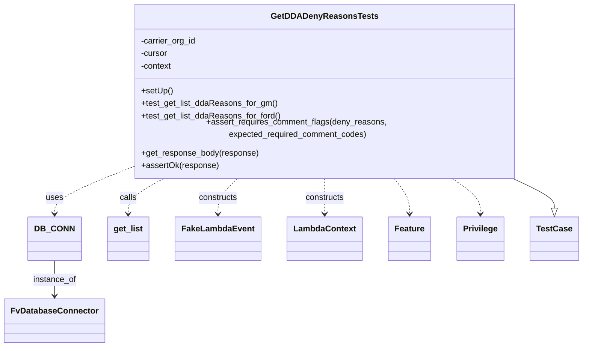
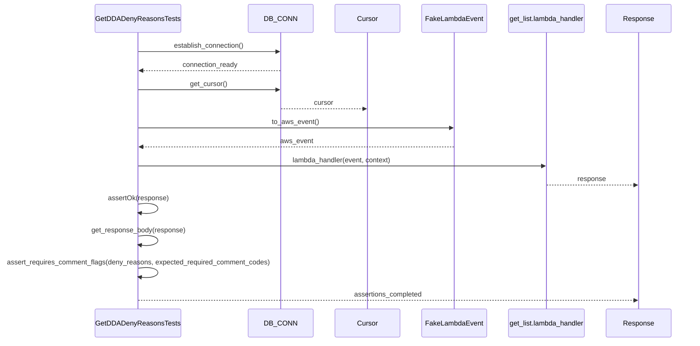

# Diagram: entity_core/entity_search/tests/integration_tests/test_get_list_dda_deny_reasons.py

> Auto-generated by Obscura crawlers

## Diagram 1

### SVG

<svg id="container" width="1082.0859375" xmlns="http://www.w3.org/2000/svg" class="classDiagram" height="644" viewBox="0 0 1082.0859375 644" role="graphics-document document" aria-roledescription="class"><g><defs><marker id="container_class-aggregationStart" class="marker aggregation class" refX="18" refY="7" markerWidth="190" markerHeight="240" orient="auto"><path d="M 18,7 L9,13 L1,7 L9,1 Z"></path></marker></defs><defs><marker id="container_class-aggregationEnd" class="marker aggregation class" refX="1" refY="7" markerWidth="20" markerHeight="28" orient="auto"><path d="M 18,7 L9,13 L1,7 L9,1 Z"></path></marker></defs><defs><marker id="container_class-extensionStart" class="marker extension class" refX="18" refY="7" markerWidth="190" markerHeight="240" orient="auto"><path d="M 1,7 L18,13 V 1 Z"></path></marker></defs><defs><marker id="container_class-extensionEnd" class="marker extension class" refX="1" refY="7" markerWidth="20" markerHeight="28" orient="auto"><path d="M 1,1 V 13 L18,7 Z"></path></marker></defs><defs><marker id="container_class-compositionStart" class="marker composition class" refX="18" refY="7" markerWidth="190" markerHeight="240" orient="auto"><path d="M 18,7 L9,13 L1,7 L9,1 Z"></path></marker></defs><defs><marker id="container_class-compositionEnd" class="marker composition class" refX="1" refY="7" markerWidth="20" markerHeight="28" orient="auto"><path d="M 18,7 L9,13 L1,7 L9,1 Z"></path></marker></defs><defs><marker id="container_class-dependencyStart" class="marker dependency class" refX="6" refY="7" markerWidth="190" markerHeight="240" orient="auto"><path d="M 5,7 L9,13 L1,7 L9,1 Z"></path></marker></defs><defs><marker id="container_class-dependencyEnd" class="marker dependency class" refX="13" refY="7" markerWidth="20" markerHeight="28" orient="auto"><path d="M 18,7 L9,13 L14,7 L9,1 Z"></path></marker></defs><defs><marker id="container_class-lollipopStart" class="marker lollipop class" refX="13" refY="7" markerWidth="190" markerHeight="240" orient="auto"><circle stroke="black" fill="transparent" cx="7" cy="7" r="6"></circle></marker></defs><defs><marker id="container_class-lollipopEnd" class="marker lollipop class" refX="1" refY="7" markerWidth="190" markerHeight="240" orient="auto"><circle stroke="black" fill="transparent" cx="7" cy="7" r="6"></circle></marker></defs><g class="root"><g class="clusters"></g><g class="edgePaths"><path d="M947.258,320L961.003,326.167C974.748,332.333,1002.237,344.667,1015.982,354.125C1029.727,363.583,1029.727,370.167,1029.727,373.458L1029.727,376.75" id="id_GetDDADenyReasonsTests_TestCase_1" class="edge-thickness-normal edge-pattern-solid relation" style=";;;" data-edge="true" data-et="edge" data-id="id_GetDDADenyReasonsTests_TestCase_1" data-points="W3sieCI6OTQ3LjI1ODM3OTIwOTg0NDYsInkiOjMyMH0seyJ4IjoxMDI5LjcyNjU2MjUsInkiOjM1N30seyJ4IjoxMDI5LjcyNjU2MjUsInkiOjM5NH1d" marker-end="url(#container_class-extensionEnd)"></path><path d="M99.305,478L99.305,484.167C99.305,490.333,99.305,502.667,99.305,514C99.305,525.333,99.305,535.667,99.305,540.833L99.305,546" id="id_DB_CONN_FvDatabaseConnector_2" class="edge-thickness-normal edge-pattern-solid relation" style=";;;" data-edge="true" data-et="edge" data-id="id_DB_CONN_FvDatabaseConnector_2" data-points="W3sieCI6OTkuMzA0Njg3NSwieSI6NDc4fSx7IngiOjk5LjMwNDY4NzUsInkiOjUxNX0seyJ4Ijo5OS4zMDQ2ODc1LCJ5Ijo1NTJ9XQ==" marker-end="url(#container_class-dependencyEnd)"></path><path d="M230.859,306.245L208.934,314.704C187.008,323.164,143.156,340.082,121.23,353.708C99.305,367.333,99.305,377.667,99.305,382.833L99.305,388" id="id_GetDDADenyReasonsTests_DB_CONN_3" class="edge-thickness-normal edge-pattern-dashed relation" style=";;;" data-edge="true" data-et="edge" data-id="id_GetDDADenyReasonsTests_DB_CONN_3" data-points="W3sieCI6MjMwLjg1OTM3NSwieSI6MzA2LjI0NTI2Nzk5MTAwNDU0fSx7IngiOjk5LjMwNDY4NzUsInkiOjM1N30seyJ4Ijo5OS4zMDQ2ODc1LCJ5IjozOTR9XQ==" marker-end="url(#container_class-dependencyEnd)"></path><path d="M304.983,320L293.339,326.167C281.695,332.333,258.406,344.667,246.762,356C235.117,367.333,235.117,377.667,235.117,382.833L235.117,388" id="id_GetDDADenyReasonsTests_get_list_4" class="edge-thickness-normal edge-pattern-dashed relation" style=";;;" data-edge="true" data-et="edge" data-id="id_GetDDADenyReasonsTests_get_list_4" data-points="W3sieCI6MzA0Ljk4MzQ0Mzk3NjY4MzkzLCJ5IjozMjB9LHsieCI6MjM1LjExNzE4NzUsInkiOjM1N30seyJ4IjoyMzUuMTE3MTg3NSwieSI6Mzk0fV0=" marker-end="url(#container_class-dependencyEnd)"></path><path d="M440.189,320L433.889,326.167C427.589,332.333,414.99,344.667,408.69,356C402.391,367.333,402.391,377.667,402.391,382.833L402.391,388" id="id_GetDDADenyReasonsTests_FakeLambdaEvent_5" class="edge-thickness-normal edge-pattern-dashed relation" style=";;;" data-edge="true" data-et="edge" data-id="id_GetDDADenyReasonsTests_FakeLambdaEvent_5" data-points="W3sieCI6NDQwLjE4ODkxNjc3NDYxMTM2LCJ5IjozMjB9LHsieCI6NDAyLjM5MDYyNSwieSI6MzU3fSx7IngiOjQwMi4zOTA2MjUsInkiOjM5NH1d" marker-end="url(#container_class-dependencyEnd)"></path><path d="M599.555,320L599.555,326.167C599.555,332.333,599.555,344.667,599.555,356C599.555,367.333,599.555,377.667,599.555,382.833L599.555,388" id="id_GetDDADenyReasonsTests_LambdaContext_6" class="edge-thickness-normal edge-pattern-dashed relation" style=";;;" data-edge="true" data-et="edge" data-id="id_GetDDADenyReasonsTests_LambdaContext_6" data-points="W3sieCI6NTk5LjU1NDY4NzUsInkiOjMyMH0seyJ4Ijo1OTkuNTU0Njg3NSwieSI6MzU3fSx7IngiOjU5OS41NTQ2ODc1LCJ5IjozOTR9XQ==" marker-end="url(#container_class-dependencyEnd)"></path><path d="M727.82,320L732.891,326.167C737.961,332.333,748.102,344.667,753.172,356C758.242,367.333,758.242,377.667,758.242,382.833L758.242,388" id="id_GetDDADenyReasonsTests_Feature_7" class="edge-thickness-normal edge-pattern-dashed relation" style=";;;" data-edge="true" data-et="edge" data-id="id_GetDDADenyReasonsTests_Feature_7" data-points="W3sieCI6NzI3LjgyMDIzMTU0MTQ1MDgsInkiOjMyMH0seyJ4Ijo3NTguMjQyMTg3NSwieSI6MzU3fSx7IngiOjc1OC4yNDIxODc1LCJ5IjozOTR9XQ==" marker-end="url(#container_class-dependencyEnd)"></path><path d="M835.531,320L844.859,326.167C854.187,332.333,872.844,344.667,882.172,356C891.5,367.333,891.5,377.667,891.5,382.833L891.5,388" id="id_GetDDADenyReasonsTests_Privilege_8" class="edge-thickness-normal edge-pattern-dashed relation" style=";;;" data-edge="true" data-et="edge" data-id="id_GetDDADenyReasonsTests_Privilege_8" data-points="W3sieCI6ODM1LjUzMTIwOTUyMDcyNTQsInkiOjMyMH0seyJ4Ijo4OTEuNSwieSI6MzU3fSx7IngiOjg5MS41LCJ5IjozOTR9XQ==" marker-end="url(#container_class-dependencyEnd)"></path></g><g class="edgeLabels"><g class="edgeLabel"><g class="label" data-id="id_GetDDADenyReasonsTests_TestCase_1" transform="translate(0, 0)"><foreignObject width="0" height="0">

</foreignObject></g></g><g class="edgeLabel" transform="translate(99.3046875, 515)"><g class="label" data-id="id_DB_CONN_FvDatabaseConnector_2" transform="translate(-41.7734375, -12)"><foreignObject width="83.546875" height="24">

instance_of

</foreignObject></g></g><g class="edgeLabel" transform="translate(99.3046875, 357)"><g class="label" data-id="id_GetDDADenyReasonsTests_DB_CONN_3" transform="translate(-16.4921875, -12)"><foreignObject width="32.984375" height="24">

uses

</foreignObject></g></g><g class="edgeLabel" transform="translate(235.1171875, 357)"><g class="label" data-id="id_GetDDADenyReasonsTests_get_list_4" transform="translate(-16.4453125, -12)"><foreignObject width="32.890625" height="24">

calls

</foreignObject></g></g><g class="edgeLabel" transform="translate(402.390625, 357)"><g class="label" data-id="id_GetDDADenyReasonsTests_FakeLambdaEvent_5" transform="translate(-37.84375, -12)"><foreignObject width="75.6875" height="24">

constructs

</foreignObject></g></g><g class="edgeLabel" transform="translate(599.5546875, 357)"><g class="label" data-id="id_GetDDADenyReasonsTests_LambdaContext_6" transform="translate(-37.84375, -12)"><foreignObject width="75.6875" height="24">

constructs

</foreignObject></g></g><g class="edgeLabel"><g class="label" data-id="id_GetDDADenyReasonsTests_Feature_7" transform="translate(0, 0)"><foreignObject width="0" height="0">

</foreignObject></g></g><g class="edgeLabel"><g class="label" data-id="id_GetDDADenyReasonsTests_Privilege_8" transform="translate(0, 0)"><foreignObject width="0" height="0">

</foreignObject></g></g></g><g class="nodes"><g class="node default" id="classId-GetDDADenyReasonsTests-0" transform="translate(599.5546875, 164)"><g class="basic label-container"><path d="M-368.6953125 -156 L368.6953125 -156 L368.6953125 156 L-368.6953125 156" stroke="none" stroke-width="0" fill="#ECECFF" style=""></path><path d="M-368.6953125 -156 C-219.35952943926372 -156, -70.02374637852745 -156, 368.6953125 -156 M-368.6953125 -156 C-165.79533483342595 -156, 37.10464283314809 -156, 368.6953125 -156 M368.6953125 -156 C368.6953125 -57.25599515609886, 368.6953125 41.488009687802275, 368.6953125 156 M368.6953125 -156 C368.6953125 -59.32561991776686, 368.6953125 37.348760164466285, 368.6953125 156 M368.6953125 156 C130.64715733275509 156, -107.40099783448983 156, -368.6953125 156 M368.6953125 156 C85.17332055537037 156, -198.34867138925927 156, -368.6953125 156 M-368.6953125 156 C-368.6953125 36.267654327909725, -368.6953125 -83.46469134418055, -368.6953125 -156 M-368.6953125 156 C-368.6953125 49.685899631570436, -368.6953125 -56.62820073685913, -368.6953125 -156" stroke="#9370DB" stroke-width="1.3" fill="none" stroke-dasharray="0 0" style=""></path></g><g class="annotation-group text" transform="translate(0, -132)"></g><g class="label-group text" transform="translate(-95.640625, -132)"><g class="label" style="font-weight: bolder" transform="translate(0,-12)"><foreignObject width="191.28125" height="24">

GetDDADenyReasonsTests

</foreignObject></g></g><g class="members-group text" transform="translate(-356.6953125, -84)"><g class="label" style="" transform="translate(0,-12)"><foreignObject width="107.1875" height="24">

-carrier_org_id

</foreignObject></g><g class="label" style="" transform="translate(0,12)"><foreignObject width="52.1875" height="24">

-cursor

</foreignObject></g><g class="label" style="" transform="translate(0,36)"><foreignObject width="60.15625" height="24">

-context

</foreignObject></g></g><g class="methods-group text" transform="translate(-356.6953125, 12)"><g class="label" style="" transform="translate(0,-12)"><foreignObject width="60.421875" height="24">

+setUp()

</foreignObject></g><g class="label" style="" transform="translate(0,12)"><foreignObject width="261.078125" height="24">

+test_get_list_ddaReasons_for_gm()

</foreignObject></g><g class="label" style="" transform="translate(0,36)"><foreignObject width="268.390625" height="24">

+test_get_list_ddaReasons_for_ford()

</foreignObject></g><g class="label" style="" transform="translate(0,60)"><foreignObject width="617.75" height="24">

+assert_requires_comment_flags(deny_reasons, expected_required_comment_codes)

</foreignObject></g><g class="label" style="" transform="translate(0,84)"><foreignObject width="226.140625" height="24">

+get_response_body(response)

</foreignObject></g><g class="label" style="" transform="translate(0,108)"><foreignObject width="147.6875" height="24">

+assertOk(response)

</foreignObject></g></g><g class="divider" style=""><path d="M-368.6953125 -108 C-210.5495655381585 -108, -52.40381857631701 -108, 368.6953125 -108 M-368.6953125 -108 C-161.54396004999944 -108, 45.60739240000112 -108, 368.6953125 -108" stroke="#9370DB" stroke-width="1.3" fill="none" stroke-dasharray="0 0" style=""></path></g><g class="divider" style=""><path d="M-368.6953125 -12 C-131.95586577774128 -12, 104.78358094451744 -12, 368.6953125 -12 M-368.6953125 -12 C-218.64218373675837 -12, -68.58905497351674 -12, 368.6953125 -12" stroke="#9370DB" stroke-width="1.3" fill="none" stroke-dasharray="0 0" style=""></path></g></g><g class="node default" id="classId-FvDatabaseConnector-1" transform="translate(99.3046875, 594)"><g class="basic label-container"><path d="M-91.3046875 -42 L91.3046875 -42 L91.3046875 42 L-91.3046875 42" stroke="none" stroke-width="0" fill="#ECECFF" style=""></path><path d="M-91.3046875 -42 C-53.71039670784981 -42, -16.11610591569962 -42, 91.3046875 -42 M-91.3046875 -42 C-29.285646025242187 -42, 32.733395449515626 -42, 91.3046875 -42 M91.3046875 -42 C91.3046875 -23.46803065192145, 91.3046875 -4.936061303842898, 91.3046875 42 M91.3046875 -42 C91.3046875 -13.54380593484796, 91.3046875 14.91238813030408, 91.3046875 42 M91.3046875 42 C29.014575261301644 42, -33.27553697739671 42, -91.3046875 42 M91.3046875 42 C46.49131424564116 42, 1.6779409912823269 42, -91.3046875 42 M-91.3046875 42 C-91.3046875 17.01741024579592, -91.3046875 -7.965179508408163, -91.3046875 -42 M-91.3046875 42 C-91.3046875 9.525142207797671, -91.3046875 -22.949715584404657, -91.3046875 -42" stroke="#9370DB" stroke-width="1.3" fill="none" stroke-dasharray="0 0" style=""></path></g><g class="annotation-group text" transform="translate(0, -18)"></g><g class="label-group text" transform="translate(-79.3046875, -18)"><g class="label" style="font-weight: bolder" transform="translate(0,-12)"><foreignObject width="158.609375" height="24">

FvDatabaseConnector

</foreignObject></g></g><g class="members-group text" transform="translate(-79.3046875, 30)"></g><g class="methods-group text" transform="translate(-79.3046875, 60)"></g><g class="divider" style=""><path d="M-91.3046875 6 C-35.47467672760833 6, 20.355334044783334 6, 91.3046875 6 M-91.3046875 6 C-24.88730695780886 6, 41.53007358438228 6, 91.3046875 6" stroke="#9370DB" stroke-width="1.3" fill="none" stroke-dasharray="0 0" style=""></path></g><g class="divider" style=""><path d="M-91.3046875 24 C-50.988690190104705 24, -10.67269288020941 24, 91.3046875 24 M-91.3046875 24 C-25.030149851216763 24, 41.244387797566475 24, 91.3046875 24" stroke="#9370DB" stroke-width="1.3" fill="none" stroke-dasharray="0 0" style=""></path></g></g><g class="node default" id="classId-DB_CONN-2" transform="translate(99.3046875, 436)"><g class="basic label-container"><path d="M-46.40625 -42 L46.40625 -42 L46.40625 42 L-46.40625 42" stroke="none" stroke-width="0" fill="#ECECFF" style=""></path><path d="M-46.40625 -42 C-23.608708357757987 -42, -0.8111667155159736 -42, 46.40625 -42 M-46.40625 -42 C-15.387924644489864 -42, 15.630400711020272 -42, 46.40625 -42 M46.40625 -42 C46.40625 -10.768664435974141, 46.40625 20.462671128051717, 46.40625 42 M46.40625 -42 C46.40625 -16.485012194762277, 46.40625 9.029975610475447, 46.40625 42 M46.40625 42 C20.526214718467045 42, -5.353820563065909 42, -46.40625 42 M46.40625 42 C24.097611542955836 42, 1.788973085911671 42, -46.40625 42 M-46.40625 42 C-46.40625 21.995225161146724, -46.40625 1.990450322293448, -46.40625 -42 M-46.40625 42 C-46.40625 16.35474386394683, -46.40625 -9.29051227210634, -46.40625 -42" stroke="#9370DB" stroke-width="1.3" fill="none" stroke-dasharray="0 0" style=""></path></g><g class="annotation-group text" transform="translate(0, -18)"></g><g class="label-group text" transform="translate(-34.40625, -18)"><g class="label" style="font-weight: bolder" transform="translate(0,-12)"><foreignObject width="68.8125" height="24">

DB_CONN

</foreignObject></g></g><g class="members-group text" transform="translate(-34.40625, 30)"></g><g class="methods-group text" transform="translate(-34.40625, 60)"></g><g class="divider" style=""><path d="M-46.40625 6 C-25.21916811039841 6, -4.03208622079682 6, 46.40625 6 M-46.40625 6 C-12.79714718066434 6, 20.81195563867132 6, 46.40625 6" stroke="#9370DB" stroke-width="1.3" fill="none" stroke-dasharray="0 0" style=""></path></g><g class="divider" style=""><path d="M-46.40625 24 C-24.22724834007577 24, -2.048246680151543 24, 46.40625 24 M-46.40625 24 C-18.024219712772467 24, 10.357810574455065 24, 46.40625 24" stroke="#9370DB" stroke-width="1.3" fill="none" stroke-dasharray="0 0" style=""></path></g></g><g class="node default" id="classId-get_list-3" transform="translate(235.1171875, 436)"><g class="basic label-container"><path d="M-39.40625 -42 L39.40625 -42 L39.40625 42 L-39.40625 42" stroke="none" stroke-width="0" fill="#ECECFF" style=""></path><path d="M-39.40625 -42 C-13.143847336229392 -42, 13.118555327541216 -42, 39.40625 -42 M-39.40625 -42 C-23.45389376868527 -42, -7.501537537370542 -42, 39.40625 -42 M39.40625 -42 C39.40625 -10.660432411416359, 39.40625 20.679135177167282, 39.40625 42 M39.40625 -42 C39.40625 -19.53799203241838, 39.40625 2.92401593516324, 39.40625 42 M39.40625 42 C22.59329513364781 42, 5.780340267295621 42, -39.40625 42 M39.40625 42 C19.645046678841368 42, -0.11615664231726441 42, -39.40625 42 M-39.40625 42 C-39.40625 11.875153119425104, -39.40625 -18.249693761149793, -39.40625 -42 M-39.40625 42 C-39.40625 19.532453766433417, -39.40625 -2.935092467133167, -39.40625 -42" stroke="#9370DB" stroke-width="1.3" fill="none" stroke-dasharray="0 0" style=""></path></g><g class="annotation-group text" transform="translate(0, -18)"></g><g class="label-group text" transform="translate(-27.40625, -18)"><g class="label" style="font-weight: bolder" transform="translate(0,-12)"><foreignObject width="54.8125" height="24">

get_list

</foreignObject></g></g><g class="members-group text" transform="translate(-27.40625, 30)"></g><g class="methods-group text" transform="translate(-27.40625, 60)"></g><g class="divider" style=""><path d="M-39.40625 6 C-21.125202782095464 6, -2.8441555641909275 6, 39.40625 6 M-39.40625 6 C-19.227275682836915 6, 0.9516986343261706 6, 39.40625 6" stroke="#9370DB" stroke-width="1.3" fill="none" stroke-dasharray="0 0" style=""></path></g><g class="divider" style=""><path d="M-39.40625 24 C-12.108460530677913 24, 15.189328938644174 24, 39.40625 24 M-39.40625 24 C-16.689563265539444 24, 6.027123468921111 24, 39.40625 24" stroke="#9370DB" stroke-width="1.3" fill="none" stroke-dasharray="0 0" style=""></path></g></g><g class="node default" id="classId-FakeLambdaEvent-4" transform="translate(402.390625, 436)"><g class="basic label-container"><path d="M-77.8671875 -42 L77.8671875 -42 L77.8671875 42 L-77.8671875 42" stroke="none" stroke-width="0" fill="#ECECFF" style=""></path><path d="M-77.8671875 -42 C-18.817460268036065 -42, 40.23226696392787 -42, 77.8671875 -42 M-77.8671875 -42 C-24.951565492474792 -42, 27.964056515050416 -42, 77.8671875 -42 M77.8671875 -42 C77.8671875 -17.603064177815796, 77.8671875 6.793871644368409, 77.8671875 42 M77.8671875 -42 C77.8671875 -17.608915199050717, 77.8671875 6.782169601898566, 77.8671875 42 M77.8671875 42 C42.20131837252249 42, 6.535449245044987 42, -77.8671875 42 M77.8671875 42 C44.59834796974296 42, 11.32950843948592 42, -77.8671875 42 M-77.8671875 42 C-77.8671875 10.38318974622111, -77.8671875 -21.23362050755778, -77.8671875 -42 M-77.8671875 42 C-77.8671875 18.74400225050727, -77.8671875 -4.511995498985463, -77.8671875 -42" stroke="#9370DB" stroke-width="1.3" fill="none" stroke-dasharray="0 0" style=""></path></g><g class="annotation-group text" transform="translate(0, -18)"></g><g class="label-group text" transform="translate(-65.8671875, -18)"><g class="label" style="font-weight: bolder" transform="translate(0,-12)"><foreignObject width="131.734375" height="24">

FakeLambdaEvent

</foreignObject></g></g><g class="members-group text" transform="translate(-65.8671875, 30)"></g><g class="methods-group text" transform="translate(-65.8671875, 60)"></g><g class="divider" style=""><path d="M-77.8671875 6 C-16.91775027863882 6, 44.03168694272236 6, 77.8671875 6 M-77.8671875 6 C-43.349444691672055 6, -8.83170188334411 6, 77.8671875 6" stroke="#9370DB" stroke-width="1.3" fill="none" stroke-dasharray="0 0" style=""></path></g><g class="divider" style=""><path d="M-77.8671875 24 C-34.73624774163071 24, 8.394692016738574 24, 77.8671875 24 M-77.8671875 24 C-36.96087407680301 24, 3.9454393463939823 24, 77.8671875 24" stroke="#9370DB" stroke-width="1.3" fill="none" stroke-dasharray="0 0" style=""></path></g></g><g class="node default" id="classId-LambdaContext-5" transform="translate(599.5546875, 436)"><g class="basic label-container"><path d="M-69.296875 -42 L69.296875 -42 L69.296875 42 L-69.296875 42" stroke="none" stroke-width="0" fill="#ECECFF" style=""></path><path d="M-69.296875 -42 C-23.023082650028407 -42, 23.250709699943187 -42, 69.296875 -42 M-69.296875 -42 C-31.166347420312007 -42, 6.964180159375985 -42, 69.296875 -42 M69.296875 -42 C69.296875 -22.7858905695511, 69.296875 -3.5717811391021996, 69.296875 42 M69.296875 -42 C69.296875 -23.279426029313267, 69.296875 -4.558852058626535, 69.296875 42 M69.296875 42 C38.6210470061376 42, 7.945219012275196 42, -69.296875 42 M69.296875 42 C36.194560963182994 42, 3.0922469263659877 42, -69.296875 42 M-69.296875 42 C-69.296875 13.779533009837671, -69.296875 -14.440933980324658, -69.296875 -42 M-69.296875 42 C-69.296875 17.787239149104735, -69.296875 -6.4255217017905295, -69.296875 -42" stroke="#9370DB" stroke-width="1.3" fill="none" stroke-dasharray="0 0" style=""></path></g><g class="annotation-group text" transform="translate(0, -18)"></g><g class="label-group text" transform="translate(-57.296875, -18)"><g class="label" style="font-weight: bolder" transform="translate(0,-12)"><foreignObject width="114.59375" height="24">

LambdaContext

</foreignObject></g></g><g class="members-group text" transform="translate(-57.296875, 30)"></g><g class="methods-group text" transform="translate(-57.296875, 60)"></g><g class="divider" style=""><path d="M-69.296875 6 C-20.136528535966463 6, 29.023817928067075 6, 69.296875 6 M-69.296875 6 C-31.83906345847972 6, 5.618748083040558 6, 69.296875 6" stroke="#9370DB" stroke-width="1.3" fill="none" stroke-dasharray="0 0" style=""></path></g><g class="divider" style=""><path d="M-69.296875 24 C-28.017924026433604 24, 13.261026947132791 24, 69.296875 24 M-69.296875 24 C-24.523418467312226 24, 20.25003806537555 24, 69.296875 24" stroke="#9370DB" stroke-width="1.3" fill="none" stroke-dasharray="0 0" style=""></path></g></g><g class="node default" id="classId-Feature-6" transform="translate(758.2421875, 436)"><g class="basic label-container"><path d="M-39.390625 -42 L39.390625 -42 L39.390625 42 L-39.390625 42" stroke="none" stroke-width="0" fill="#ECECFF" style=""></path><path d="M-39.390625 -42 C-17.52535203222405 -42, 4.339920935551902 -42, 39.390625 -42 M-39.390625 -42 C-18.54737712828703 -42, 2.2958707434259367 -42, 39.390625 -42 M39.390625 -42 C39.390625 -24.40436952845559, 39.390625 -6.808739056911179, 39.390625 42 M39.390625 -42 C39.390625 -24.129360831757218, 39.390625 -6.258721663514436, 39.390625 42 M39.390625 42 C11.761401013380308 42, -15.867822973239385 42, -39.390625 42 M39.390625 42 C12.335796826095834 42, -14.719031347808333 42, -39.390625 42 M-39.390625 42 C-39.390625 9.807198317487774, -39.390625 -22.38560336502445, -39.390625 -42 M-39.390625 42 C-39.390625 10.64755893670397, -39.390625 -20.70488212659206, -39.390625 -42" stroke="#9370DB" stroke-width="1.3" fill="none" stroke-dasharray="0 0" style=""></path></g><g class="annotation-group text" transform="translate(0, -18)"></g><g class="label-group text" transform="translate(-27.390625, -18)"><g class="label" style="font-weight: bolder" transform="translate(0,-12)"><foreignObject width="54.78125" height="24">

Feature

</foreignObject></g></g><g class="members-group text" transform="translate(-27.390625, 30)"></g><g class="methods-group text" transform="translate(-27.390625, 60)"></g><g class="divider" style=""><path d="M-39.390625 6 C-21.65322648949284 6, -3.915827978985682 6, 39.390625 6 M-39.390625 6 C-8.17449916146387 6, 23.04162667707226 6, 39.390625 6" stroke="#9370DB" stroke-width="1.3" fill="none" stroke-dasharray="0 0" style=""></path></g><g class="divider" style=""><path d="M-39.390625 24 C-21.304766959691115 24, -3.21890891938223 24, 39.390625 24 M-39.390625 24 C-12.789629026299874 24, 13.811366947400252 24, 39.390625 24" stroke="#9370DB" stroke-width="1.3" fill="none" stroke-dasharray="0 0" style=""></path></g></g><g class="node default" id="classId-Privilege-7" transform="translate(891.5, 436)"><g class="basic label-container"><path d="M-43.8671875 -42 L43.8671875 -42 L43.8671875 42 L-43.8671875 42" stroke="none" stroke-width="0" fill="#ECECFF" style=""></path><path d="M-43.8671875 -42 C-25.257357204679593 -42, -6.647526909359186 -42, 43.8671875 -42 M-43.8671875 -42 C-19.053061259938318 -42, 5.761064980123365 -42, 43.8671875 -42 M43.8671875 -42 C43.8671875 -21.534416980986926, 43.8671875 -1.0688339619738514, 43.8671875 42 M43.8671875 -42 C43.8671875 -20.553168291365985, 43.8671875 0.89366341726803, 43.8671875 42 M43.8671875 42 C16.01053157954225 42, -11.846124340915502 42, -43.8671875 42 M43.8671875 42 C22.613280733079208 42, 1.3593739661584152 42, -43.8671875 42 M-43.8671875 42 C-43.8671875 15.217807186253552, -43.8671875 -11.564385627492896, -43.8671875 -42 M-43.8671875 42 C-43.8671875 10.173284583554473, -43.8671875 -21.653430832891054, -43.8671875 -42" stroke="#9370DB" stroke-width="1.3" fill="none" stroke-dasharray="0 0" style=""></path></g><g class="annotation-group text" transform="translate(0, -18)"></g><g class="label-group text" transform="translate(-31.8671875, -18)"><g class="label" style="font-weight: bolder" transform="translate(0,-12)"><foreignObject width="63.734375" height="24">

Privilege

</foreignObject></g></g><g class="members-group text" transform="translate(-31.8671875, 30)"></g><g class="methods-group text" transform="translate(-31.8671875, 60)"></g><g class="divider" style=""><path d="M-43.8671875 6 C-12.823774903467289 6, 18.219637693065422 6, 43.8671875 6 M-43.8671875 6 C-15.860482896564466 6, 12.146221706871067 6, 43.8671875 6" stroke="#9370DB" stroke-width="1.3" fill="none" stroke-dasharray="0 0" style=""></path></g><g class="divider" style=""><path d="M-43.8671875 24 C-10.22620190659569 24, 23.41478368680862 24, 43.8671875 24 M-43.8671875 24 C-18.156935626764945 24, 7.553316246470111 24, 43.8671875 24" stroke="#9370DB" stroke-width="1.3" fill="none" stroke-dasharray="0 0" style=""></path></g></g><g class="node default" id="classId-TestCase-8" transform="translate(1029.7265625, 436)"><g class="basic label-container"><path d="M-44.359375 -42 L44.359375 -42 L44.359375 42 L-44.359375 42" stroke="none" stroke-width="0" fill="#ECECFF" style=""></path><path d="M-44.359375 -42 C-20.163366347530832 -42, 4.032642304938335 -42, 44.359375 -42 M-44.359375 -42 C-25.63523915782329 -42, -6.911103315646578 -42, 44.359375 -42 M44.359375 -42 C44.359375 -11.80198248506958, 44.359375 18.39603502986084, 44.359375 42 M44.359375 -42 C44.359375 -16.203716776206676, 44.359375 9.592566447586648, 44.359375 42 M44.359375 42 C13.162366932623215 42, -18.03464113475357 42, -44.359375 42 M44.359375 42 C14.783041815638189 42, -14.793291368723622 42, -44.359375 42 M-44.359375 42 C-44.359375 24.364443102407343, -44.359375 6.728886204814685, -44.359375 -42 M-44.359375 42 C-44.359375 24.407854677912432, -44.359375 6.815709355824865, -44.359375 -42" stroke="#9370DB" stroke-width="1.3" fill="none" stroke-dasharray="0 0" style=""></path></g><g class="annotation-group text" transform="translate(0, -18)"></g><g class="label-group text" transform="translate(-32.359375, -18)"><g class="label" style="font-weight: bolder" transform="translate(0,-12)"><foreignObject width="64.71875" height="24">

TestCase

</foreignObject></g></g><g class="members-group text" transform="translate(-32.359375, 30)"></g><g class="methods-group text" transform="translate(-32.359375, 60)"></g><g class="divider" style=""><path d="M-44.359375 6 C-9.167964551190728 6, 26.023445897618544 6, 44.359375 6 M-44.359375 6 C-21.626568389005097 6, 1.1062382219898055 6, 44.359375 6" stroke="#9370DB" stroke-width="1.3" fill="none" stroke-dasharray="0 0" style=""></path></g><g class="divider" style=""><path d="M-44.359375 24 C-9.702942096444858 24, 24.953490807110285 24, 44.359375 24 M-44.359375 24 C-14.492733215829446 24, 15.373908568341108 24, 44.359375 24" stroke="#9370DB" stroke-width="1.3" fill="none" stroke-dasharray="0 0" style=""></path></g></g></g></g></g></svg>

## Diagram 2

### SVG

<svg id="container" width="1693" xmlns="http://www.w3.org/2000/svg" height="837" viewBox="-250.5 -10 1693 837" role="graphics-document document" aria-roledescription="sequence"><g><rect x="1242.5" y="751" fill="#eaeaea" stroke="#666" width="150" height="65" name="Response" rx="3" ry="3" class="actor actor-bottom"></rect><text x="1317.5" y="783.5" dominant-baseline="central" alignment-baseline="central" class="actor actor-box" style="text-anchor: middle; font-size: 16px; font-weight: 400;"><tspan x="1317.5" dy="0">Response</tspan></text></g><g><rect x="994.5" y="751" fill="#eaeaea" stroke="#666" width="198" height="65" name="Lambda" rx="3" ry="3" class="actor actor-bottom"></rect><text x="1093.5" y="783.5" dominant-baseline="central" alignment-baseline="central" class="actor actor-box" style="text-anchor: middle; font-size: 16px; font-weight: 400;"><tspan x="1093.5" dy="0">get_list.lambda_handler</tspan></text></g><g><rect x="793.5" y="751" fill="#eaeaea" stroke="#666" width="151" height="65" name="Event" rx="3" ry="3" class="actor actor-bottom"></rect><text x="869" y="783.5" dominant-baseline="central" alignment-baseline="central" class="actor actor-box" style="text-anchor: middle; font-size: 16px; font-weight: 400;"><tspan x="869" dy="0">FakeLambdaEvent</tspan></text></g><g><rect x="593.5" y="751" fill="#eaeaea" stroke="#666" width="150" height="65" name="Cursor" rx="3" ry="3" class="actor actor-bottom"></rect><text x="668.5" y="783.5" dominant-baseline="central" alignment-baseline="central" class="actor actor-box" style="text-anchor: middle; font-size: 16px; font-weight: 400;"><tspan x="668.5" dy="0">Cursor</tspan></text></g><g><rect x="393.5" y="751" fill="#eaeaea" stroke="#666" width="150" height="65" name="DB" rx="3" ry="3" class="actor actor-bottom"></rect><text x="468.5" y="783.5" dominant-baseline="central" alignment-baseline="central" class="actor actor-box" style="text-anchor: middle; font-size: 16px; font-weight: 400;"><tspan x="468.5" dy="0">DB_CONN</tspan></text></g><g><rect x="0" y="751" fill="#eaeaea" stroke="#666" width="207" height="65" name="Test" rx="3" ry="3" class="actor actor-bottom"></rect><text x="103.5" y="783.5" dominant-baseline="central" alignment-baseline="central" class="actor actor-box" style="text-anchor: middle; font-size: 16px; font-weight: 400;"><tspan x="103.5" dy="0">GetDDADenyReasonsTests</tspan></text></g><g><line id="actor5" x1="1317.5" y1="65" x2="1317.5" y2="751" class="actor-line 200" stroke-width="0.5px" stroke="#999" name="Response"></line><g id="root-5"><rect x="1242.5" y="0" fill="#eaeaea" stroke="#666" width="150" height="65" name="Response" rx="3" ry="3" class="actor actor-top"></rect><text x="1317.5" y="32.5" dominant-baseline="central" alignment-baseline="central" class="actor actor-box" style="text-anchor: middle; font-size: 16px; font-weight: 400;"><tspan x="1317.5" dy="0">Response</tspan></text></g></g><g><line id="actor4" x1="1093.5" y1="65" x2="1093.5" y2="751" class="actor-line 200" stroke-width="0.5px" stroke="#999" name="Lambda"></line><g id="root-4"><rect x="994.5" y="0" fill="#eaeaea" stroke="#666" width="198" height="65" name="Lambda" rx="3" ry="3" class="actor actor-top"></rect><text x="1093.5" y="32.5" dominant-baseline="central" alignment-baseline="central" class="actor actor-box" style="text-anchor: middle; font-size: 16px; font-weight: 400;"><tspan x="1093.5" dy="0">get_list.lambda_handler</tspan></text></g></g><g><line id="actor3" x1="869" y1="65" x2="869" y2="751" class="actor-line 200" stroke-width="0.5px" stroke="#999" name="Event"></line><g id="root-3"><rect x="793.5" y="0" fill="#eaeaea" stroke="#666" width="151" height="65" name="Event" rx="3" ry="3" class="actor actor-top"></rect><text x="869" y="32.5" dominant-baseline="central" alignment-baseline="central" class="actor actor-box" style="text-anchor: middle; font-size: 16px; font-weight: 400;"><tspan x="869" dy="0">FakeLambdaEvent</tspan></text></g></g><g><line id="actor2" x1="668.5" y1="65" x2="668.5" y2="751" class="actor-line 200" stroke-width="0.5px" stroke="#999" name="Cursor"></line><g id="root-2"><rect x="593.5" y="0" fill="#eaeaea" stroke="#666" width="150" height="65" name="Cursor" rx="3" ry="3" class="actor actor-top"></rect><text x="668.5" y="32.5" dominant-baseline="central" alignment-baseline="central" class="actor actor-box" style="text-anchor: middle; font-size: 16px; font-weight: 400;"><tspan x="668.5" dy="0">Cursor</tspan></text></g></g><g><line id="actor1" x1="468.5" y1="65" x2="468.5" y2="751" class="actor-line 200" stroke-width="0.5px" stroke="#999" name="DB"></line><g id="root-1"><rect x="393.5" y="0" fill="#eaeaea" stroke="#666" width="150" height="65" name="DB" rx="3" ry="3" class="actor actor-top"></rect><text x="468.5" y="32.5" dominant-baseline="central" alignment-baseline="central" class="actor actor-box" style="text-anchor: middle; font-size: 16px; font-weight: 400;"><tspan x="468.5" dy="0">DB_CONN</tspan></text></g></g><g><line id="actor0" x1="103.5" y1="65" x2="103.5" y2="751" class="actor-line 200" stroke-width="0.5px" stroke="#999" name="Test"></line><g id="root-0"><rect x="0" y="0" fill="#eaeaea" stroke="#666" width="207" height="65" name="Test" rx="3" ry="3" class="actor actor-top"></rect><text x="103.5" y="32.5" dominant-baseline="central" alignment-baseline="central" class="actor actor-box" style="text-anchor: middle; font-size: 16px; font-weight: 400;"><tspan x="103.5" dy="0">GetDDADenyReasonsTests</tspan></text></g></g><g></g><defs><symbol id="computer" width="24" height="24"><path transform="scale(.5)" d="M2 2v13h20v-13h-20zm18 11h-16v-9h16v9zm-10.228 6l.466-1h3.524l.467 1h-4.457zm14.228 3h-24l2-6h2.104l-1.33 4h18.45l-1.297-4h2.073l2 6zm-5-10h-14v-7h14v7z"></path></symbol></defs><defs><symbol id="database" fill-rule="evenodd" clip-rule="evenodd"><path transform="scale(.5)" d="M12.258.001l.256.004.255.005.253.008.251.01.249.012.247.015.246.016.242.019.241.02.239.023.236.024.233.027.231.028.229.031.225.032.223.034.22.036.217.038.214.04.211.041.208.043.205.045.201.046.198.048.194.05.191.051.187.053.183.054.18.056.175.057.172.059.168.06.163.061.16.063.155.064.15.066.074.033.073.033.071.034.07.034.069.035.068.035.067.035.066.035.064.036.064.036.062.036.06.036.06.037.058.037.058.037.055.038.055.038.053.038.052.038.051.039.05.039.048.039.047.039.045.04.044.04.043.04.041.04.04.041.039.041.037.041.036.041.034.041.033.042.032.042.03.042.029.042.027.042.026.043.024.043.023.043.021.043.02.043.018.044.017.043.015.044.013.044.012.044.011.045.009.044.007.045.006.045.004.045.002.045.001.045v17l-.001.045-.002.045-.004.045-.006.045-.007.045-.009.044-.011.045-.012.044-.013.044-.015.044-.017.043-.018.044-.02.043-.021.043-.023.043-.024.043-.026.043-.027.042-.029.042-.03.042-.032.042-.033.042-.034.041-.036.041-.037.041-.039.041-.04.041-.041.04-.043.04-.044.04-.045.04-.047.039-.048.039-.05.039-.051.039-.052.038-.053.038-.055.038-.055.038-.058.037-.058.037-.06.037-.06.036-.062.036-.064.036-.064.036-.066.035-.067.035-.068.035-.069.035-.07.034-.071.034-.073.033-.074.033-.15.066-.155.064-.16.063-.163.061-.168.06-.172.059-.175.057-.18.056-.183.054-.187.053-.191.051-.194.05-.198.048-.201.046-.205.045-.208.043-.211.041-.214.04-.217.038-.22.036-.223.034-.225.032-.229.031-.231.028-.233.027-.236.024-.239.023-.241.02-.242.019-.246.016-.247.015-.249.012-.251.01-.253.008-.255.005-.256.004-.258.001-.258-.001-.256-.004-.255-.005-.253-.008-.251-.01-.249-.012-.247-.015-.245-.016-.243-.019-.241-.02-.238-.023-.236-.024-.234-.027-.231-.028-.228-.031-.226-.032-.223-.034-.22-.036-.217-.038-.214-.04-.211-.041-.208-.043-.204-.045-.201-.046-.198-.048-.195-.05-.19-.051-.187-.053-.184-.054-.179-.056-.176-.057-.172-.059-.167-.06-.164-.061-.159-.063-.155-.064-.151-.066-.074-.033-.072-.033-.072-.034-.07-.034-.069-.035-.068-.035-.067-.035-.066-.035-.064-.036-.063-.036-.062-.036-.061-.036-.06-.037-.058-.037-.057-.037-.056-.038-.055-.038-.053-.038-.052-.038-.051-.039-.049-.039-.049-.039-.046-.039-.046-.04-.044-.04-.043-.04-.041-.04-.04-.041-.039-.041-.037-.041-.036-.041-.034-.041-.033-.042-.032-.042-.03-.042-.029-.042-.027-.042-.026-.043-.024-.043-.023-.043-.021-.043-.02-.043-.018-.044-.017-.043-.015-.044-.013-.044-.012-.044-.011-.045-.009-.044-.007-.045-.006-.045-.004-.045-.002-.045-.001-.045v-17l.001-.045.002-.045.004-.045.006-.045.007-.045.009-.044.011-.045.012-.044.013-.044.015-.044.017-.043.018-.044.02-.043.021-.043.023-.043.024-.043.026-.043.027-.042.029-.042.03-.042.032-.042.033-.042.034-.041.036-.041.037-.041.039-.041.04-.041.041-.04.043-.04.044-.04.046-.04.046-.039.049-.039.049-.039.051-.039.052-.038.053-.038.055-.038.056-.038.057-.037.058-.037.06-.037.061-.036.062-.036.063-.036.064-.036.066-.035.067-.035.068-.035.069-.035.07-.034.072-.034.072-.033.074-.033.151-.066.155-.064.159-.063.164-.061.167-.06.172-.059.176-.057.179-.056.184-.054.187-.053.19-.051.195-.05.198-.048.201-.046.204-.045.208-.043.211-.041.214-.04.217-.038.22-.036.223-.034.226-.032.228-.031.231-.028.234-.027.236-.024.238-.023.241-.02.243-.019.245-.016.247-.015.249-.012.251-.01.253-.008.255-.005.256-.004.258-.001.258.001zm-9.258 20.499v.01l.001.021.003.021.004.022.005.021.006.022.007.022.009.023.01.022.011.023.012.023.013.023.015.023.016.024.017.023.018.024.019.024.021.024.022.025.023.024.024.025.052.049.056.05.061.051.066.051.07.051.075.051.079.052.084.052.088.052.092.052.097.052.102.051.105.052.11.052.114.051.119.051.123.051.127.05.131.05.135.05.139.048.144.049.147.047.152.047.155.047.16.045.163.045.167.043.171.043.176.041.178.041.183.039.187.039.19.037.194.035.197.035.202.033.204.031.209.03.212.029.216.027.219.025.222.024.226.021.23.02.233.018.236.016.24.015.243.012.246.01.249.008.253.005.256.004.259.001.26-.001.257-.004.254-.005.25-.008.247-.011.244-.012.241-.014.237-.016.233-.018.231-.021.226-.021.224-.024.22-.026.216-.027.212-.028.21-.031.205-.031.202-.034.198-.034.194-.036.191-.037.187-.039.183-.04.179-.04.175-.042.172-.043.168-.044.163-.045.16-.046.155-.046.152-.047.148-.048.143-.049.139-.049.136-.05.131-.05.126-.05.123-.051.118-.052.114-.051.11-.052.106-.052.101-.052.096-.052.092-.052.088-.053.083-.051.079-.052.074-.052.07-.051.065-.051.06-.051.056-.05.051-.05.023-.024.023-.025.021-.024.02-.024.019-.024.018-.024.017-.024.015-.023.014-.024.013-.023.012-.023.01-.023.01-.022.008-.022.006-.022.006-.022.004-.022.004-.021.001-.021.001-.021v-4.127l-.077.055-.08.053-.083.054-.085.053-.087.052-.09.052-.093.051-.095.05-.097.05-.1.049-.102.049-.105.048-.106.047-.109.047-.111.046-.114.045-.115.045-.118.044-.12.043-.122.042-.124.042-.126.041-.128.04-.13.04-.132.038-.134.038-.135.037-.138.037-.139.035-.142.035-.143.034-.144.033-.147.032-.148.031-.15.03-.151.03-.153.029-.154.027-.156.027-.158.026-.159.025-.161.024-.162.023-.163.022-.165.021-.166.02-.167.019-.169.018-.169.017-.171.016-.173.015-.173.014-.175.013-.175.012-.177.011-.178.01-.179.008-.179.008-.181.006-.182.005-.182.004-.184.003-.184.002h-.37l-.184-.002-.184-.003-.182-.004-.182-.005-.181-.006-.179-.008-.179-.008-.178-.01-.176-.011-.176-.012-.175-.013-.173-.014-.172-.015-.171-.016-.17-.017-.169-.018-.167-.019-.166-.02-.165-.021-.163-.022-.162-.023-.161-.024-.159-.025-.157-.026-.156-.027-.155-.027-.153-.029-.151-.03-.15-.03-.148-.031-.146-.032-.145-.033-.143-.034-.141-.035-.14-.035-.137-.037-.136-.037-.134-.038-.132-.038-.13-.04-.128-.04-.126-.041-.124-.042-.122-.042-.12-.044-.117-.043-.116-.045-.113-.045-.112-.046-.109-.047-.106-.047-.105-.048-.102-.049-.1-.049-.097-.05-.095-.05-.093-.052-.09-.051-.087-.052-.085-.053-.083-.054-.08-.054-.077-.054v4.127zm0-5.654v.011l.001.021.003.021.004.021.005.022.006.022.007.022.009.022.01.022.011.023.012.023.013.023.015.024.016.023.017.024.018.024.019.024.021.024.022.024.023.025.024.024.052.05.056.05.061.05.066.051.07.051.075.052.079.051.084.052.088.052.092.052.097.052.102.052.105.052.11.051.114.051.119.052.123.05.127.051.131.05.135.049.139.049.144.048.147.048.152.047.155.046.16.045.163.045.167.044.171.042.176.042.178.04.183.04.187.038.19.037.194.036.197.034.202.033.204.032.209.03.212.028.216.027.219.025.222.024.226.022.23.02.233.018.236.016.24.014.243.012.246.01.249.008.253.006.256.003.259.001.26-.001.257-.003.254-.006.25-.008.247-.01.244-.012.241-.015.237-.016.233-.018.231-.02.226-.022.224-.024.22-.025.216-.027.212-.029.21-.03.205-.032.202-.033.198-.035.194-.036.191-.037.187-.039.183-.039.179-.041.175-.042.172-.043.168-.044.163-.045.16-.045.155-.047.152-.047.148-.048.143-.048.139-.05.136-.049.131-.05.126-.051.123-.051.118-.051.114-.052.11-.052.106-.052.101-.052.096-.052.092-.052.088-.052.083-.052.079-.052.074-.051.07-.052.065-.051.06-.05.056-.051.051-.049.023-.025.023-.024.021-.025.02-.024.019-.024.018-.024.017-.024.015-.023.014-.023.013-.024.012-.022.01-.023.01-.023.008-.022.006-.022.006-.022.004-.021.004-.022.001-.021.001-.021v-4.139l-.077.054-.08.054-.083.054-.085.052-.087.053-.09.051-.093.051-.095.051-.097.05-.1.049-.102.049-.105.048-.106.047-.109.047-.111.046-.114.045-.115.044-.118.044-.12.044-.122.042-.124.042-.126.041-.128.04-.13.039-.132.039-.134.038-.135.037-.138.036-.139.036-.142.035-.143.033-.144.033-.147.033-.148.031-.15.03-.151.03-.153.028-.154.028-.156.027-.158.026-.159.025-.161.024-.162.023-.163.022-.165.021-.166.02-.167.019-.169.018-.169.017-.171.016-.173.015-.173.014-.175.013-.175.012-.177.011-.178.009-.179.009-.179.007-.181.007-.182.005-.182.004-.184.003-.184.002h-.37l-.184-.002-.184-.003-.182-.004-.182-.005-.181-.007-.179-.007-.179-.009-.178-.009-.176-.011-.176-.012-.175-.013-.173-.014-.172-.015-.171-.016-.17-.017-.169-.018-.167-.019-.166-.02-.165-.021-.163-.022-.162-.023-.161-.024-.159-.025-.157-.026-.156-.027-.155-.028-.153-.028-.151-.03-.15-.03-.148-.031-.146-.033-.145-.033-.143-.033-.141-.035-.14-.036-.137-.036-.136-.037-.134-.038-.132-.039-.13-.039-.128-.04-.126-.041-.124-.042-.122-.043-.12-.043-.117-.044-.116-.044-.113-.046-.112-.046-.109-.046-.106-.047-.105-.048-.102-.049-.1-.049-.097-.05-.095-.051-.093-.051-.09-.051-.087-.053-.085-.052-.083-.054-.08-.054-.077-.054v4.139zm0-5.666v.011l.001.02.003.022.004.021.005.022.006.021.007.022.009.023.01.022.011.023.012.023.013.023.015.023.016.024.017.024.018.023.019.024.021.025.022.024.023.024.024.025.052.05.056.05.061.05.066.051.07.051.075.052.079.051.084.052.088.052.092.052.097.052.102.052.105.051.11.052.114.051.119.051.123.051.127.05.131.05.135.05.139.049.144.048.147.048.152.047.155.046.16.045.163.045.167.043.171.043.176.042.178.04.183.04.187.038.19.037.194.036.197.034.202.033.204.032.209.03.212.028.216.027.219.025.222.024.226.021.23.02.233.018.236.017.24.014.243.012.246.01.249.008.253.006.256.003.259.001.26-.001.257-.003.254-.006.25-.008.247-.01.244-.013.241-.014.237-.016.233-.018.231-.02.226-.022.224-.024.22-.025.216-.027.212-.029.21-.03.205-.032.202-.033.198-.035.194-.036.191-.037.187-.039.183-.039.179-.041.175-.042.172-.043.168-.044.163-.045.16-.045.155-.047.152-.047.148-.048.143-.049.139-.049.136-.049.131-.051.126-.05.123-.051.118-.052.114-.051.11-.052.106-.052.101-.052.096-.052.092-.052.088-.052.083-.052.079-.052.074-.052.07-.051.065-.051.06-.051.056-.05.051-.049.023-.025.023-.025.021-.024.02-.024.019-.024.018-.024.017-.024.015-.023.014-.024.013-.023.012-.023.01-.022.01-.023.008-.022.006-.022.006-.022.004-.022.004-.021.001-.021.001-.021v-4.153l-.077.054-.08.054-.083.053-.085.053-.087.053-.09.051-.093.051-.095.051-.097.05-.1.049-.102.048-.105.048-.106.048-.109.046-.111.046-.114.046-.115.044-.118.044-.12.043-.122.043-.124.042-.126.041-.128.04-.13.039-.132.039-.134.038-.135.037-.138.036-.139.036-.142.034-.143.034-.144.033-.147.032-.148.032-.15.03-.151.03-.153.028-.154.028-.156.027-.158.026-.159.024-.161.024-.162.023-.163.023-.165.021-.166.02-.167.019-.169.018-.169.017-.171.016-.173.015-.173.014-.175.013-.175.012-.177.01-.178.01-.179.009-.179.007-.181.006-.182.006-.182.004-.184.003-.184.001-.185.001-.185-.001-.184-.001-.184-.003-.182-.004-.182-.006-.181-.006-.179-.007-.179-.009-.178-.01-.176-.01-.176-.012-.175-.013-.173-.014-.172-.015-.171-.016-.17-.017-.169-.018-.167-.019-.166-.02-.165-.021-.163-.023-.162-.023-.161-.024-.159-.024-.157-.026-.156-.027-.155-.028-.153-.028-.151-.03-.15-.03-.148-.032-.146-.032-.145-.033-.143-.034-.141-.034-.14-.036-.137-.036-.136-.037-.134-.038-.132-.039-.13-.039-.128-.041-.126-.041-.124-.041-.122-.043-.12-.043-.117-.044-.116-.044-.113-.046-.112-.046-.109-.046-.106-.048-.105-.048-.102-.048-.1-.05-.097-.049-.095-.051-.093-.051-.09-.052-.087-.052-.085-.053-.083-.053-.08-.054-.077-.054v4.153zm8.74-8.179l-.257.004-.254.005-.25.008-.247.011-.244.012-.241.014-.237.016-.233.018-.231.021-.226.022-.224.023-.22.026-.216.027-.212.028-.21.031-.205.032-.202.033-.198.034-.194.036-.191.038-.187.038-.183.04-.179.041-.175.042-.172.043-.168.043-.163.045-.16.046-.155.046-.152.048-.148.048-.143.048-.139.049-.136.05-.131.05-.126.051-.123.051-.118.051-.114.052-.11.052-.106.052-.101.052-.096.052-.092.052-.088.052-.083.052-.079.052-.074.051-.07.052-.065.051-.06.05-.056.05-.051.05-.023.025-.023.024-.021.024-.02.025-.019.024-.018.024-.017.023-.015.024-.014.023-.013.023-.012.023-.01.023-.01.022-.008.022-.006.023-.006.021-.004.022-.004.021-.001.021-.001.021.001.021.001.021.004.021.004.022.006.021.006.023.008.022.01.022.01.023.012.023.013.023.014.023.015.024.017.023.018.024.019.024.02.025.021.024.023.024.023.025.051.05.056.05.06.05.065.051.07.052.074.051.079.052.083.052.088.052.092.052.096.052.101.052.106.052.11.052.114.052.118.051.123.051.126.051.131.05.136.05.139.049.143.048.148.048.152.048.155.046.16.046.163.045.168.043.172.043.175.042.179.041.183.04.187.038.191.038.194.036.198.034.202.033.205.032.21.031.212.028.216.027.22.026.224.023.226.022.231.021.233.018.237.016.241.014.244.012.247.011.25.008.254.005.257.004.26.001.26-.001.257-.004.254-.005.25-.008.247-.011.244-.012.241-.014.237-.016.233-.018.231-.021.226-.022.224-.023.22-.026.216-.027.212-.028.21-.031.205-.032.202-.033.198-.034.194-.036.191-.038.187-.038.183-.04.179-.041.175-.042.172-.043.168-.043.163-.045.16-.046.155-.046.152-.048.148-.048.143-.048.139-.049.136-.05.131-.05.126-.051.123-.051.118-.051.114-.052.11-.052.106-.052.101-.052.096-.052.092-.052.088-.052.083-.052.079-.052.074-.051.07-.052.065-.051.06-.05.056-.05.051-.05.023-.025.023-.024.021-.024.02-.025.019-.024.018-.024.017-.023.015-.024.014-.023.013-.023.012-.023.01-.023.01-.022.008-.022.006-.023.006-.021.004-.022.004-.021.001-.021.001-.021-.001-.021-.001-.021-.004-.021-.004-.022-.006-.021-.006-.023-.008-.022-.01-.022-.01-.023-.012-.023-.013-.023-.014-.023-.015-.024-.017-.023-.018-.024-.019-.024-.02-.025-.021-.024-.023-.024-.023-.025-.051-.05-.056-.05-.06-.05-.065-.051-.07-.052-.074-.051-.079-.052-.083-.052-.088-.052-.092-.052-.096-.052-.101-.052-.106-.052-.11-.052-.114-.052-.118-.051-.123-.051-.126-.051-.131-.05-.136-.05-.139-.049-.143-.048-.148-.048-.152-.048-.155-.046-.16-.046-.163-.045-.168-.043-.172-.043-.175-.042-.179-.041-.183-.04-.187-.038-.191-.038-.194-.036-.198-.034-.202-.033-.205-.032-.21-.031-.212-.028-.216-.027-.22-.026-.224-.023-.226-.022-.231-.021-.233-.018-.237-.016-.241-.014-.244-.012-.247-.011-.25-.008-.254-.005-.257-.004-.26-.001-.26.001z"></path></symbol></defs><defs><symbol id="clock" width="24" height="24"><path transform="scale(.5)" d="M12 2c5.514 0 10 4.486 10 10s-4.486 10-10 10-10-4.486-10-10 4.486-10 10-10zm0-2c-6.627 0-12 5.373-12 12s5.373 12 12 12 12-5.373 12-12-5.373-12-12-12zm5.848 12.459c.202.038.202.333.001.372-1.907.361-6.045 1.111-6.547 1.111-.719 0-1.301-.582-1.301-1.301 0-.512.77-5.447 1.125-7.445.034-.192.312-.181.343.014l.985 6.238 5.394 1.011z"></path></symbol></defs><defs><marker id="arrowhead" refX="7.9" refY="5" markerUnits="userSpaceOnUse" markerWidth="12" markerHeight="12" orient="auto-start-reverse"><path d="M -1 0 L 10 5 L 0 10 z"></path></marker></defs><defs><marker id="crosshead" markerWidth="15" markerHeight="8" orient="auto" refX="4" refY="4.5"><path fill="none" stroke="#000000" stroke-width="1pt" d="M 1,2 L 6,7 M 6,2 L 1,7" style="stroke-dasharray: 0, 0;"></path></marker></defs><defs><marker id="filled-head" refX="15.5" refY="7" markerWidth="20" markerHeight="28" orient="auto"><path d="M 18,7 L9,13 L14,7 L9,1 Z"></path></marker></defs><defs><marker id="sequencenumber" refX="15" refY="15" markerWidth="60" markerHeight="40" orient="auto"><circle cx="15" cy="15" r="6"></circle></marker></defs><text x="285" y="80" text-anchor="middle" dominant-baseline="middle" alignment-baseline="middle" class="messageText" dy="1em" style="font-size: 16px; font-weight: 400;">establish_connection()</text><line x1="104.5" y1="113" x2="464.5" y2="113" class="messageLine0" stroke-width="2" stroke="none" marker-end="url(#arrowhead)" style="fill: none;"></line><text x="288" y="128" text-anchor="middle" dominant-baseline="middle" alignment-baseline="middle" class="messageText" dy="1em" style="font-size: 16px; font-weight: 400;">connection_ready</text><line x1="467.5" y1="161" x2="107.5" y2="161" class="messageLine1" stroke-width="2" stroke="none" marker-end="url(#arrowhead)" style="stroke-dasharray: 3, 3; fill: none;"></line><text x="285" y="176" text-anchor="middle" dominant-baseline="middle" alignment-baseline="middle" class="messageText" dy="1em" style="font-size: 16px; font-weight: 400;">get_cursor()</text><line x1="104.5" y1="209" x2="464.5" y2="209" class="messageLine0" stroke-width="2" stroke="none" marker-end="url(#arrowhead)" style="fill: none;"></line><text x="567" y="224" text-anchor="middle" dominant-baseline="middle" alignment-baseline="middle" class="messageText" dy="1em" style="font-size: 16px; font-weight: 400;">cursor</text><line x1="469.5" y1="257" x2="664.5" y2="257" class="messageLine1" stroke-width="2" stroke="none" marker-end="url(#arrowhead)" style="stroke-dasharray: 3, 3; fill: none;"></line><text x="485" y="272" text-anchor="middle" dominant-baseline="middle" alignment-baseline="middle" class="messageText" dy="1em" style="font-size: 16px; font-weight: 400;">to_aws_event()</text><line x1="104.5" y1="305" x2="865" y2="305" class="messageLine0" stroke-width="2" stroke="none" marker-end="url(#arrowhead)" style="fill: none;"></line><text x="488" y="320" text-anchor="middle" dominant-baseline="middle" alignment-baseline="middle" class="messageText" dy="1em" style="font-size: 16px; font-weight: 400;">aws_event</text><line x1="868" y1="353" x2="107.5" y2="353" class="messageLine1" stroke-width="2" stroke="none" marker-end="url(#arrowhead)" style="stroke-dasharray: 3, 3; fill: none;"></line><text x="597" y="368" text-anchor="middle" dominant-baseline="middle" alignment-baseline="middle" class="messageText" dy="1em" style="font-size: 16px; font-weight: 400;">lambda_handler(event, context)</text><line x1="104.5" y1="401" x2="1089.5" y2="401" class="messageLine0" stroke-width="2" stroke="none" marker-end="url(#arrowhead)" style="fill: none;"></line><text x="1204" y="416" text-anchor="middle" dominant-baseline="middle" alignment-baseline="middle" class="messageText" dy="1em" style="font-size: 16px; font-weight: 400;">response</text><line x1="1094.5" y1="449" x2="1313.5" y2="449" class="messageLine1" stroke-width="2" stroke="none" marker-end="url(#arrowhead)" style="stroke-dasharray: 3, 3; fill: none;"></line><text x="105" y="464" text-anchor="middle" dominant-baseline="middle" alignment-baseline="middle" class="messageText" dy="1em" style="font-size: 16px; font-weight: 400;">assertOk(response)</text><path d="M 104.5,497 C 164.5,487 164.5,527 104.5,517" class="messageLine0" stroke-width="2" stroke="none" marker-end="url(#arrowhead)" style="fill: none;"></path><text x="105" y="542" text-anchor="middle" dominant-baseline="middle" alignment-baseline="middle" class="messageText" dy="1em" style="font-size: 16px; font-weight: 400;">get_response_body(response)</text><path d="M 104.5,575 C 164.5,565 164.5,605 104.5,595" class="messageLine0" stroke-width="2" stroke="none" marker-end="url(#arrowhead)" style="fill: none;"></path><text x="105" y="620" text-anchor="middle" dominant-baseline="middle" alignment-baseline="middle" class="messageText" dy="1em" style="font-size: 16px; font-weight: 400;">assert_requires_comment_flags(deny_reasons, expected_required_comment_codes)</text><path d="M 104.5,653 C 164.5,643 164.5,683 104.5,673" class="messageLine0" stroke-width="2" stroke="none" marker-end="url(#arrowhead)" style="fill: none;"></path><text x="709" y="698" text-anchor="middle" dominant-baseline="middle" alignment-baseline="middle" class="messageText" dy="1em" style="font-size: 16px; font-weight: 400;">assertions_completed</text><line x1="104.5" y1="731" x2="1313.5" y2="731" class="messageLine1" stroke-width="2" stroke="none" marker-end="url(#arrowhead)" style="stroke-dasharray: 3, 3; fill: none;"></line></svg>
