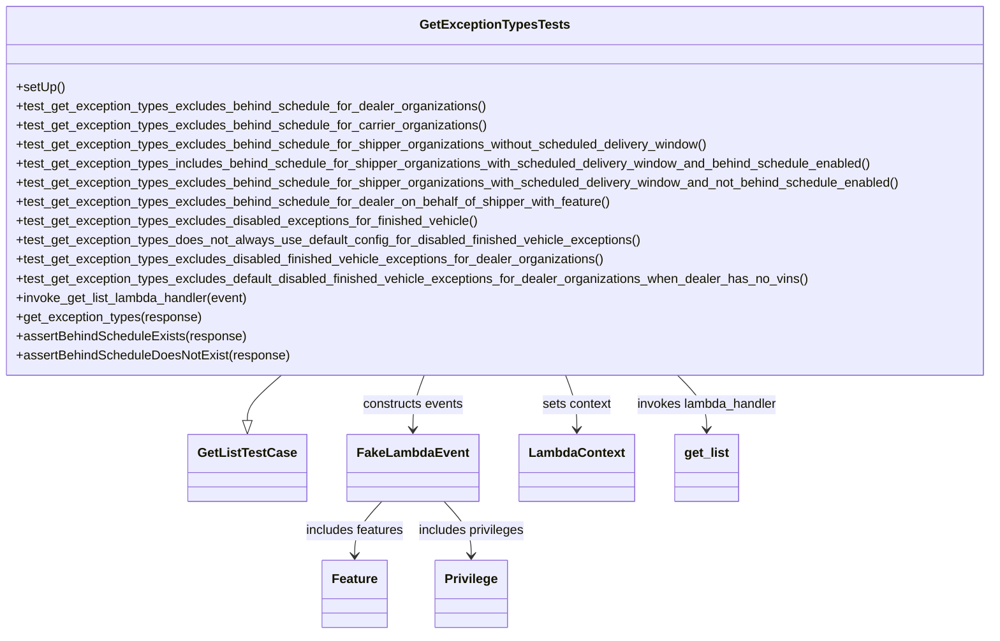

# Diagram: entity_core/entity_search/tests/integration_tests/test_get_list_exception_types.py


> Auto-generated by Obscura crawlers

## Diagram 1



### SVG

<svg id="container" width="1250.4296875" xmlns="http://www.w3.org/2000/svg" class="classDiagram" height="794" viewBox="0 0 1250.4296875 794" role="graphics-document document" aria-roledescription="class"><style>#container{font-family:"trebuchet ms",verdana,arial,sans-serif;font-size:16px;fill:#333;}@keyframes edge-animation-frame{from{stroke-dashoffset:0;}}@keyframes dash{to{stroke-dashoffset:0;}}#container .edge-animation-slow{stroke-dasharray:9,5!important;stroke-dashoffset:900;animation:dash 50s linear infinite;stroke-linecap:round;}#container .edge-animation-fast{stroke-dasharray:9,5!important;stroke-dashoffset:900;animation:dash 20s linear infinite;stroke-linecap:round;}#container .error-icon{fill:#552222;}#container .error-text{fill:#552222;stroke:#552222;}#container .edge-thickness-normal{stroke-width:1px;}#container .edge-thickness-thick{stroke-width:3.5px;}#container .edge-pattern-solid{stroke-dasharray:0;}#container .edge-thickness-invisible{stroke-width:0;fill:none;}#container .edge-pattern-dashed{stroke-dasharray:3;}#container .edge-pattern-dotted{stroke-dasharray:2;}#container .marker{fill:#333333;stroke:#333333;}#container .marker.cross{stroke:#333333;}#container svg{font-family:"trebuchet ms",verdana,arial,sans-serif;font-size:16px;}#container p{margin:0;}#container g.classGroup text{fill:#9370DB;stroke:none;font-family:"trebuchet ms",verdana,arial,sans-serif;font-size:10px;}#container g.classGroup text .title{font-weight:bolder;}#container .nodeLabel,#container .edgeLabel{color:#131300;}#container .edgeLabel .label rect{fill:#ECECFF;}#container .label text{fill:#131300;}#container .labelBkg{background:#ECECFF;}#container .edgeLabel .label span{background:#ECECFF;}#container .classTitle{font-weight:bolder;}#container .node rect,#container .node circle,#container .node ellipse,#container .node polygon,#container .node path{fill:#ECECFF;stroke:#9370DB;stroke-width:1px;}#container .divider{stroke:#9370DB;stroke-width:1;}#container g.clickable{cursor:pointer;}#container g.classGroup rect{fill:#ECECFF;stroke:#9370DB;}#container g.classGroup line{stroke:#9370DB;stroke-width:1;}#container .classLabel .box{stroke:none;stroke-width:0;fill:#ECECFF;opacity:0.5;}#container .classLabel .label{fill:#9370DB;font-size:10px;}#container .relation{stroke:#333333;stroke-width:1;fill:none;}#container .dashed-line{stroke-dasharray:3;}#container .dotted-line{stroke-dasharray:1 2;}#container #compositionStart,#container .composition{fill:#333333!important;stroke:#333333!important;stroke-width:1;}#container #compositionEnd,#container .composition{fill:#333333!important;stroke:#333333!important;stroke-width:1;}#container #dependencyStart,#container .dependency{fill:#333333!important;stroke:#333333!important;stroke-width:1;}#container #dependencyStart,#container .dependency{fill:#333333!important;stroke:#333333!important;stroke-width:1;}#container #extensionStart,#container .extension{fill:transparent!important;stroke:#333333!important;stroke-width:1;}#container #extensionEnd,#container .extension{fill:transparent!important;stroke:#333333!important;stroke-width:1;}#container #aggregationStart,#container .aggregation{fill:transparent!important;stroke:#333333!important;stroke-width:1;}#container #aggregationEnd,#container .aggregation{fill:transparent!important;stroke:#333333!important;stroke-width:1;}#container #lollipopStart,#container .lollipop{fill:#ECECFF!important;stroke:#333333!important;stroke-width:1;}#container #lollipopEnd,#container .lollipop{fill:#ECECFF!important;stroke:#333333!important;stroke-width:1;}#container .edgeTerminals{font-size:11px;line-height:initial;}#container .classTitleText{text-anchor:middle;font-size:18px;fill:#333;}#container .label-icon{display:inline-block;height:1em;overflow:visible;vertical-align:-0.125em;}#container .node .label-icon path{fill:currentColor;stroke:revert;stroke-width:revert;}#container :root{--mermaid-font-family:"trebuchet ms",verdana,arial,sans-serif;}</style><g><defs><marker id="container_class-aggregationStart" class="marker aggregation class" refX="18" refY="7" markerWidth="190" markerHeight="240" orient="auto"><path d="M 18,7 L9,13 L1,7 L9,1 Z"></path></marker></defs><defs><marker id="container_class-aggregationEnd" class="marker aggregation class" refX="1" refY="7" markerWidth="20" markerHeight="28" orient="auto"><path d="M 18,7 L9,13 L1,7 L9,1 Z"></path></marker></defs><defs><marker id="container_class-extensionStart" class="marker extension class" refX="18" refY="7" markerWidth="190" markerHeight="240" orient="auto"><path d="M 1,7 L18,13 V 1 Z"></path></marker></defs><defs><marker id="container_class-extensionEnd" class="marker extension class" refX="1" refY="7" markerWidth="20" markerHeight="28" orient="auto"><path d="M 1,1 V 13 L18,7 Z"></path></marker></defs><defs><marker id="container_class-compositionStart" class="marker composition class" refX="18" refY="7" markerWidth="190" markerHeight="240" orient="auto"><path d="M 18,7 L9,13 L1,7 L9,1 Z"></path></marker></defs><defs><marker id="container_class-compositionEnd" class="marker composition class" refX="1" refY="7" markerWidth="20" markerHeight="28" orient="auto"><path d="M 18,7 L9,13 L1,7 L9,1 Z"></path></marker></defs><defs><marker id="container_class-dependencyStart" class="marker dependency class" refX="6" refY="7" markerWidth="190" markerHeight="240" orient="auto"><path d="M 5,7 L9,13 L1,7 L9,1 Z"></path></marker></defs><defs><marker id="container_class-dependencyEnd" class="marker dependency class" refX="13" refY="7" markerWidth="20" markerHeight="28" orient="auto"><path d="M 18,7 L9,13 L14,7 L9,1 Z"></path></marker></defs><defs><marker id="container_class-lollipopStart" class="marker lollipop class" refX="13" refY="7" markerWidth="190" markerHeight="240" orient="auto"><circle stroke="black" fill="transparent" cx="7" cy="7" r="6"></circle></marker></defs><defs><marker id="container_class-lollipopEnd" class="marker lollipop class" refX="1" refY="7" markerWidth="190" markerHeight="240" orient="auto"><circle stroke="black" fill="transparent" cx="7" cy="7" r="6"></circle></marker></defs><g class="root"><g class="clusters"></g><g class="edgePaths"><path d="M369.41,470L362.582,476.167C355.753,482.333,342.095,494.667,335.266,504.125C328.438,513.583,328.438,520.167,328.438,523.458L328.438,526.75" id="id_GetExceptionTypesTests_GetListTestCase_1" class="edge-thickness-normal edge-pattern-solid relation" style=";;;" data-edge="true" data-et="edge" data-id="id_GetExceptionTypesTests_GetListTestCase_1" data-points="W3sieCI6MzY5LjQxMDQ5MTQ4Nzg3MzIsInkiOjQ3MH0seyJ4IjozMjguNDM3NSwieSI6NTA3fSx7IngiOjMyOC40Mzc1LCJ5Ijo1NDR9XQ==" marker-end="url(#container_class-extensionEnd)"></path><path d="M540.243,470L537.975,476.167C535.706,482.333,531.17,494.667,528.901,506C526.633,517.333,526.633,527.667,526.633,532.833L526.633,538" id="id_GetExceptionTypesTests_FakeLambdaEvent_2" class="edge-thickness-normal edge-pattern-solid relation" style=";;;" data-edge="true" data-et="edge" data-id="id_GetExceptionTypesTests_FakeLambdaEvent_2" data-points="W3sieCI6NTQwLjI0MzAxODMwNjkwMywieSI6NDcwfSx7IngiOjUyNi42MzI4MTI1LCJ5Ijo1MDd9LHsieCI6NTI2LjYzMjgxMjUsInkiOjU0NH1d" marker-end="url(#container_class-dependencyEnd)"></path><path d="M710.187,470L712.455,476.167C714.723,482.333,719.26,494.667,721.529,506C723.797,517.333,723.797,527.667,723.797,532.833L723.797,538" id="id_GetExceptionTypesTests_LambdaContext_3" class="edge-thickness-normal edge-pattern-solid relation" style=";;;" data-edge="true" data-et="edge" data-id="id_GetExceptionTypesTests_LambdaContext_3" data-points="W3sieCI6NzEwLjE4NjY2OTE5MzA5NywieSI6NDcwfSx7IngiOjcyMy43OTY4NzUsInkiOjUwN30seyJ4Ijo3MjMuNzk2ODc1LCJ5Ijo1NDR9XQ==" marker-end="url(#container_class-dependencyEnd)"></path><path d="M846.979,470L852.899,476.167C858.82,482.333,870.66,494.667,876.58,506C882.5,517.333,882.5,527.667,882.5,532.833L882.5,538" id="id_GetExceptionTypesTests_get_list_4" class="edge-thickness-normal edge-pattern-solid relation" style=";;;" data-edge="true" data-et="edge" data-id="id_GetExceptionTypesTests_get_list_4" data-points="W3sieCI6ODQ2Ljk3OTI4ODEyOTY2NDIsInkiOjQ3MH0seyJ4Ijo4ODIuNSwieSI6NTA3fSx7IngiOjg4Mi41LCJ5Ijo1NDR9XQ==" marker-end="url(#container_class-dependencyEnd)"></path><path d="M486.668,628L480.8,634.167C474.932,640.333,463.197,652.667,457.329,664C451.461,675.333,451.461,685.667,451.461,690.833L451.461,696" id="id_FakeLambdaEvent_Feature_5" class="edge-thickness-normal edge-pattern-solid relation" style=";;;" data-edge="true" data-et="edge" data-id="id_FakeLambdaEvent_Feature_5" data-points="W3sieCI6NDg2LjY2ODAxODE5NjIwMjUsInkiOjYyOH0seyJ4Ijo0NTEuNDYwOTM3NSwieSI6NjY1fSx7IngiOjQ1MS40NjA5Mzc1LCJ5Ijo3MDJ9XQ==" marker-end="url(#container_class-dependencyEnd)"></path><path d="M566.598,628L572.465,634.167C578.333,640.333,590.069,652.667,595.937,664C601.805,675.333,601.805,685.667,601.805,690.833L601.805,696" id="id_FakeLambdaEvent_Privilege_6" class="edge-thickness-normal edge-pattern-solid relation" style=";;;" data-edge="true" data-et="edge" data-id="id_FakeLambdaEvent_Privilege_6" data-points="W3sieCI6NTY2LjU5NzYwNjgwMzc5NzUsInkiOjYyOH0seyJ4Ijo2MDEuODA0Njg3NSwieSI6NjY1fSx7IngiOjYwMS44MDQ2ODc1LCJ5Ijo3MDJ9XQ==" marker-end="url(#container_class-dependencyEnd)"></path></g><g class="edgeLabels"><g class="edgeLabel"><g class="label" data-id="id_GetExceptionTypesTests_GetListTestCase_1" transform="translate(0, 0)"><foreignObject width="0" height="0"><div xmlns="http://www.w3.org/1999/xhtml" class="labelBkg" style="display: table-cell; white-space: nowrap; line-height: 1.5; max-width: 200px; text-align: center;"><span class="edgeLabel"></span></div></foreignObject></g></g><g class="edgeLabel" transform="translate(526.6328125, 507)"><g class="label" data-id="id_GetExceptionTypesTests_FakeLambdaEvent_2" transform="translate(-63.8671875, -12)"><foreignObject width="127.734375" height="24"><div xmlns="http://www.w3.org/1999/xhtml" class="labelBkg" style="display: table-cell; white-space: nowrap; line-height: 1.5; max-width: 200px; text-align: center;"><span class="edgeLabel"><p>constructs events</p></span></div></foreignObject></g></g><g class="edgeLabel" transform="translate(723.796875, 507)"><g class="label" data-id="id_GetExceptionTypesTests_LambdaContext_3" transform="translate(-43.6953125, -12)"><foreignObject width="87.390625" height="24"><div xmlns="http://www.w3.org/1999/xhtml" class="labelBkg" style="display: table-cell; white-space: nowrap; line-height: 1.5; max-width: 200px; text-align: center;"><span class="edgeLabel"><p>sets context</p></span></div></foreignObject></g></g><g class="edgeLabel" transform="translate(882.5, 507)"><g class="label" data-id="id_GetExceptionTypesTests_get_list_4" transform="translate(-89.53125, -12)"><foreignObject width="179.0625" height="24"><div xmlns="http://www.w3.org/1999/xhtml" class="labelBkg" style="display: table-cell; white-space: nowrap; line-height: 1.5; max-width: 200px; text-align: center;"><span class="edgeLabel"><p>invokes lambda_handler</p></span></div></foreignObject></g></g><g class="edgeLabel" transform="translate(451.4609375, 665)"><g class="label" data-id="id_FakeLambdaEvent_Feature_5" transform="translate(-62.4921875, -12)"><foreignObject width="124.984375" height="24"><div xmlns="http://www.w3.org/1999/xhtml" class="labelBkg" style="display: table-cell; white-space: nowrap; line-height: 1.5; max-width: 200px; text-align: center;"><span class="edgeLabel"><p>includes features</p></span></div></foreignObject></g></g><g class="edgeLabel" transform="translate(601.8046875, 665)"><g class="label" data-id="id_FakeLambdaEvent_Privilege_6" transform="translate(-67.8515625, -12)"><foreignObject width="135.703125" height="24"><div xmlns="http://www.w3.org/1999/xhtml" class="labelBkg" style="display: table-cell; white-space: nowrap; line-height: 1.5; max-width: 200px; text-align: center;"><span class="edgeLabel"><p>includes privileges</p></span></div></foreignObject></g></g></g><g class="nodes"><g class="node default" id="classId-GetExceptionTypesTests-0" transform="translate(625.21484375, 239)"><g class="basic label-container"><path d="M-617.21484375 -231 L617.21484375 -231 L617.21484375 231 L-617.21484375 231" stroke="none" stroke-width="0" fill="#ECECFF" style=""></path><path d="M-617.21484375 -231 C-334.92191677207177 -231, -52.628989794143536 -231, 617.21484375 -231 M-617.21484375 -231 C-132.02676889895434 -231, 353.1613059520913 -231, 617.21484375 -231 M617.21484375 -231 C617.21484375 -48.67881837348102, 617.21484375 133.64236325303796, 617.21484375 231 M617.21484375 -231 C617.21484375 -81.39282367327846, 617.21484375 68.21435265344309, 617.21484375 231 M617.21484375 231 C134.08819329458805 231, -349.0384571608239 231, -617.21484375 231 M617.21484375 231 C179.07866234748155 231, -259.0575190550369 231, -617.21484375 231 M-617.21484375 231 C-617.21484375 138.08755194851886, -617.21484375 45.17510389703773, -617.21484375 -231 M-617.21484375 231 C-617.21484375 73.99039473175384, -617.21484375 -83.01921053649232, -617.21484375 -231" stroke="#9370DB" stroke-width="1.3" fill="none" stroke-dasharray="0 0" style=""></path></g><g class="annotation-group text" transform="translate(0, -207)"></g><g class="label-group text" transform="translate(-88.6796875, -207)"><g class="label" style="font-weight: bolder" transform="translate(0,-12)"><foreignObject width="177.359375" height="24"><div xmlns="http://www.w3.org/1999/xhtml" style="display: table-cell; white-space: nowrap; line-height: 1.5; max-width: 223px; text-align: center;"><span class="nodeLabel markdown-node-label" style=""><p>GetExceptionTypesTests</p></span></div></foreignObject></g></g><g class="members-group text" transform="translate(-605.21484375, -159)"></g><g class="methods-group text" transform="translate(-605.21484375, -129)"><g class="label" style="" transform="translate(0,-12)"><foreignObject width="60.421875" height="24"><div xmlns="http://www.w3.org/1999/xhtml" style="display: table-cell; white-space: nowrap; line-height: 1.5; max-width: 118px; text-align: center;"><span class="nodeLabel markdown-node-label" style=""><p>+setUp()</p></span></div></foreignObject></g><g class="label" style="" transform="translate(0,12)"><foreignObject width="592.75" height="24"><div xmlns="http://www.w3.org/1999/xhtml" style="display: table-cell; white-space: nowrap; line-height: 1.5; max-width: 650px; text-align: center;"><span class="nodeLabel markdown-node-label" style=""><p>+test_get_exception_types_excludes_behind_schedule_for_dealer_organizations()</p></span></div></foreignObject></g><g class="label" style="" transform="translate(0,36)"><foreignObject width="594.515625" height="24"><div xmlns="http://www.w3.org/1999/xhtml" style="display: table-cell; white-space: nowrap; line-height: 1.5; max-width: 652px; text-align: center;"><span class="nodeLabel markdown-node-label" style=""><p>+test_get_exception_types_excludes_behind_schedule_for_carrier_organizations()</p></span></div></foreignObject></g><g class="label" style="" transform="translate(0,60)"><foreignObject width="878.046875" height="24"><div xmlns="http://www.w3.org/1999/xhtml" style="display: table-cell; white-space: nowrap; line-height: 1.5; max-width: 935px; text-align: center;"><span class="nodeLabel markdown-node-label" style=""><p>+test_get_exception_types_excludes_behind_schedule_for_shipper_organizations_without_scheduled_delivery_window()</p></span></div></foreignObject></g><g class="label" style="" transform="translate(0,84)"><foreignObject width="1086.953125" height="24"><div xmlns="http://www.w3.org/1999/xhtml" style="display: table-cell; white-space: nowrap; line-height: 1.5; max-width: 1144px; text-align: center;"><span class="nodeLabel markdown-node-label" style=""><p>+test_get_exception_types_includes_behind_schedule_for_shipper_organizations_with_scheduled_delivery_window_and_behind_schedule_enabled()</p></span></div></foreignObject></g><g class="label" style="" transform="translate(0,108)"><foreignObject width="1121.75" height="24"><div xmlns="http://www.w3.org/1999/xhtml" style="display: table-cell; white-space: nowrap; line-height: 1.5; max-width: 1179px; text-align: center;"><span class="nodeLabel markdown-node-label" style=""><p>+test_get_exception_types_excludes_behind_schedule_for_shipper_organizations_with_scheduled_delivery_window_and_not_behind_schedule_enabled()</p></span></div></foreignObject></g><g class="label" style="" transform="translate(0,132)"><foreignObject width="751.3125" height="24"><div xmlns="http://www.w3.org/1999/xhtml" style="display: table-cell; white-space: nowrap; line-height: 1.5; max-width: 809px; text-align: center;"><span class="nodeLabel markdown-node-label" style=""><p>+test_get_exception_types_excludes_behind_schedule_for_dealer_on_behalf_of_shipper_with_feature()</p></span></div></foreignObject></g><g class="label" style="" transform="translate(0,156)"><foreignObject width="583.078125" height="24"><div xmlns="http://www.w3.org/1999/xhtml" style="display: table-cell; white-space: nowrap; line-height: 1.5; max-width: 640px; text-align: center;"><span class="nodeLabel markdown-node-label" style=""><p>+test_get_exception_types_excludes_disabled_exceptions_for_finished_vehicle()</p></span></div></foreignObject></g><g class="label" style="" transform="translate(0,180)"><foreignObject width="787.875" height="24"><div xmlns="http://www.w3.org/1999/xhtml" style="display: table-cell; white-space: nowrap; line-height: 1.5; max-width: 845px; text-align: center;"><span class="nodeLabel markdown-node-label" style=""><p>+test_get_exception_types_does_not_always_use_default_config_for_disabled_finished_vehicle_exceptions()</p></span></div></foreignObject></g><g class="label" style="" transform="translate(0,204)"><foreignObject width="741.484375" height="24"><div xmlns="http://www.w3.org/1999/xhtml" style="display: table-cell; white-space: nowrap; line-height: 1.5; max-width: 799px; text-align: center;"><span class="nodeLabel markdown-node-label" style=""><p>+test_get_exception_types_excludes_disabled_finished_vehicle_exceptions_for_dealer_organizations()</p></span></div></foreignObject></g><g class="label" style="" transform="translate(0,228)"><foreignObject width="997.96875" height="24"><div xmlns="http://www.w3.org/1999/xhtml" style="display: table-cell; white-space: nowrap; line-height: 1.5; max-width: 1055px; text-align: center;"><span class="nodeLabel markdown-node-label" style=""><p>+test_get_exception_types_excludes_default_disabled_finished_vehicle_exceptions_for_dealer_organizations_when_dealer_has_no_vins()</p></span></div></foreignObject></g><g class="label" style="" transform="translate(0,252)"><foreignObject width="295.515625" height="24"><div xmlns="http://www.w3.org/1999/xhtml" style="display: table-cell; white-space: nowrap; line-height: 1.5; max-width: 353px; text-align: center;"><span class="nodeLabel markdown-node-label" style=""><p>+invoke_get_list_lambda_handler(event)</p></span></div></foreignObject></g><g class="label" style="" transform="translate(0,276)"><foreignObject width="233.234375" height="24"><div xmlns="http://www.w3.org/1999/xhtml" style="display: table-cell; white-space: nowrap; line-height: 1.5; max-width: 291px; text-align: center;"><span class="nodeLabel markdown-node-label" style=""><p>+get_exception_types(response)</p></span></div></foreignObject></g><g class="label" style="" transform="translate(0,300)"><foreignObject width="287.921875" height="24"><div xmlns="http://www.w3.org/1999/xhtml" style="display: table-cell; white-space: nowrap; line-height: 1.5; max-width: 345px; text-align: center;"><span class="nodeLabel markdown-node-label" style=""><p>+assertBehindScheduleExists(response)</p></span></div></foreignObject></g><g class="label" style="" transform="translate(0,324)"><foreignObject width="342.34375" height="24"><div xmlns="http://www.w3.org/1999/xhtml" style="display: table-cell; white-space: nowrap; line-height: 1.5; max-width: 400px; text-align: center;"><span class="nodeLabel markdown-node-label" style=""><p>+assertBehindScheduleDoesNotExist(response)</p></span></div></foreignObject></g></g><g class="divider" style=""><path d="M-617.21484375 -183 C-332.6656852878452 -183, -48.11652682569036 -183, 617.21484375 -183 M-617.21484375 -183 C-369.6558660666293 -183, -122.0968883832586 -183, 617.21484375 -183" stroke="#9370DB" stroke-width="1.3" fill="none" stroke-dasharray="0 0" style=""></path></g><g class="divider" style=""><path d="M-617.21484375 -159 C-259.28086120811605 -159, 98.6531213337679 -159, 617.21484375 -159 M-617.21484375 -159 C-276.19368777911575 -159, 64.8274681917685 -159, 617.21484375 -159" stroke="#9370DB" stroke-width="1.3" fill="none" stroke-dasharray="0 0" style=""></path></g></g><g class="node default" id="classId-GetListTestCase-1" transform="translate(328.4375, 586)"><g class="basic label-container"><path d="M-70.328125 -42 L70.328125 -42 L70.328125 42 L-70.328125 42" stroke="none" stroke-width="0" fill="#ECECFF" style=""></path><path d="M-70.328125 -42 C-16.092621693677017 -42, 38.142881612645965 -42, 70.328125 -42 M-70.328125 -42 C-22.51293675322384 -42, 25.30225149355232 -42, 70.328125 -42 M70.328125 -42 C70.328125 -9.054836016222396, 70.328125 23.89032796755521, 70.328125 42 M70.328125 -42 C70.328125 -10.50472656508791, 70.328125 20.99054686982418, 70.328125 42 M70.328125 42 C24.650423485287796 42, -21.02727802942441 42, -70.328125 42 M70.328125 42 C41.26400118553896 42, 12.199877371077918 42, -70.328125 42 M-70.328125 42 C-70.328125 18.246486427218958, -70.328125 -5.507027145562084, -70.328125 -42 M-70.328125 42 C-70.328125 22.654076733523635, -70.328125 3.308153467047269, -70.328125 -42" stroke="#9370DB" stroke-width="1.3" fill="none" stroke-dasharray="0 0" style=""></path></g><g class="annotation-group text" transform="translate(0, -18)"></g><g class="label-group text" transform="translate(-58.328125, -18)"><g class="label" style="font-weight: bolder" transform="translate(0,-12)"><foreignObject width="116.65625" height="24"><div xmlns="http://www.w3.org/1999/xhtml" style="display: table-cell; white-space: nowrap; line-height: 1.5; max-width: 163px; text-align: center;"><span class="nodeLabel markdown-node-label" style=""><p>GetListTestCase</p></span></div></foreignObject></g></g><g class="members-group text" transform="translate(-58.328125, 30)"></g><g class="methods-group text" transform="translate(-58.328125, 60)"></g><g class="divider" style=""><path d="M-70.328125 6 C-18.302023460134045 6, 33.72407807973191 6, 70.328125 6 M-70.328125 6 C-17.382678487304403 6, 35.56276802539119 6, 70.328125 6" stroke="#9370DB" stroke-width="1.3" fill="none" stroke-dasharray="0 0" style=""></path></g><g class="divider" style=""><path d="M-70.328125 24 C-16.533830738533098 24, 37.260463522933804 24, 70.328125 24 M-70.328125 24 C-26.80206884304019 24, 16.723987313919622 24, 70.328125 24" stroke="#9370DB" stroke-width="1.3" fill="none" stroke-dasharray="0 0" style=""></path></g></g><g class="node default" id="classId-FakeLambdaEvent-2" transform="translate(526.6328125, 586)"><g class="basic label-container"><path d="M-77.8671875 -42 L77.8671875 -42 L77.8671875 42 L-77.8671875 42" stroke="none" stroke-width="0" fill="#ECECFF" style=""></path><path d="M-77.8671875 -42 C-38.104837104407366 -42, 1.6575132911852677 -42, 77.8671875 -42 M-77.8671875 -42 C-31.809701071509053 -42, 14.247785356981893 -42, 77.8671875 -42 M77.8671875 -42 C77.8671875 -8.8134696587246, 77.8671875 24.3730606825508, 77.8671875 42 M77.8671875 -42 C77.8671875 -9.73061359606178, 77.8671875 22.53877280787644, 77.8671875 42 M77.8671875 42 C35.67554157789748 42, -6.516104344205047 42, -77.8671875 42 M77.8671875 42 C39.07223913583432 42, 0.27729077166864613 42, -77.8671875 42 M-77.8671875 42 C-77.8671875 17.22516728635935, -77.8671875 -7.5496654272812975, -77.8671875 -42 M-77.8671875 42 C-77.8671875 23.57430300292732, -77.8671875 5.148606005854639, -77.8671875 -42" stroke="#9370DB" stroke-width="1.3" fill="none" stroke-dasharray="0 0" style=""></path></g><g class="annotation-group text" transform="translate(0, -18)"></g><g class="label-group text" transform="translate(-65.8671875, -18)"><g class="label" style="font-weight: bolder" transform="translate(0,-12)"><foreignObject width="131.734375" height="24"><div xmlns="http://www.w3.org/1999/xhtml" style="display: table-cell; white-space: nowrap; line-height: 1.5; max-width: 181px; text-align: center;"><span class="nodeLabel markdown-node-label" style=""><p>FakeLambdaEvent</p></span></div></foreignObject></g></g><g class="members-group text" transform="translate(-65.8671875, 30)"></g><g class="methods-group text" transform="translate(-65.8671875, 60)"></g><g class="divider" style=""><path d="M-77.8671875 6 C-37.82870544900258 6, 2.2097766019948466 6, 77.8671875 6 M-77.8671875 6 C-43.82077678155416 6, -9.774366063108317 6, 77.8671875 6" stroke="#9370DB" stroke-width="1.3" fill="none" stroke-dasharray="0 0" style=""></path></g><g class="divider" style=""><path d="M-77.8671875 24 C-22.955731226967607 24, 31.955725046064785 24, 77.8671875 24 M-77.8671875 24 C-30.65282501383895 24, 16.5615374723221 24, 77.8671875 24" stroke="#9370DB" stroke-width="1.3" fill="none" stroke-dasharray="0 0" style=""></path></g></g><g class="node default" id="classId-LambdaContext-3" transform="translate(723.796875, 586)"><g class="basic label-container"><path d="M-69.296875 -42 L69.296875 -42 L69.296875 42 L-69.296875 42" stroke="none" stroke-width="0" fill="#ECECFF" style=""></path><path d="M-69.296875 -42 C-39.908649389792615 -42, -10.520423779585222 -42, 69.296875 -42 M-69.296875 -42 C-16.951827376023047 -42, 35.393220247953906 -42, 69.296875 -42 M69.296875 -42 C69.296875 -10.023993357017254, 69.296875 21.952013285965492, 69.296875 42 M69.296875 -42 C69.296875 -10.38825113702952, 69.296875 21.22349772594096, 69.296875 42 M69.296875 42 C17.347474309609467 42, -34.601926380781066 42, -69.296875 42 M69.296875 42 C23.626584822576632 42, -22.043705354846736 42, -69.296875 42 M-69.296875 42 C-69.296875 24.065486893570498, -69.296875 6.130973787140995, -69.296875 -42 M-69.296875 42 C-69.296875 17.114861626828194, -69.296875 -7.770276746343612, -69.296875 -42" stroke="#9370DB" stroke-width="1.3" fill="none" stroke-dasharray="0 0" style=""></path></g><g class="annotation-group text" transform="translate(0, -18)"></g><g class="label-group text" transform="translate(-57.296875, -18)"><g class="label" style="font-weight: bolder" transform="translate(0,-12)"><foreignObject width="114.59375" height="24"><div xmlns="http://www.w3.org/1999/xhtml" style="display: table-cell; white-space: nowrap; line-height: 1.5; max-width: 163px; text-align: center;"><span class="nodeLabel markdown-node-label" style=""><p>LambdaContext</p></span></div></foreignObject></g></g><g class="members-group text" transform="translate(-57.296875, 30)"></g><g class="methods-group text" transform="translate(-57.296875, 60)"></g><g class="divider" style=""><path d="M-69.296875 6 C-36.435207946503354 6, -3.573540893006708 6, 69.296875 6 M-69.296875 6 C-40.55106916551094 6, -11.805263331021877 6, 69.296875 6" stroke="#9370DB" stroke-width="1.3" fill="none" stroke-dasharray="0 0" style=""></path></g><g class="divider" style=""><path d="M-69.296875 24 C-33.076860292565 24, 3.143154414869997 24, 69.296875 24 M-69.296875 24 C-22.515088656595402 24, 24.266697686809195 24, 69.296875 24" stroke="#9370DB" stroke-width="1.3" fill="none" stroke-dasharray="0 0" style=""></path></g></g><g class="node default" id="classId-Feature-4" transform="translate(451.4609375, 744)"><g class="basic label-container"><path d="M-39.390625 -42 L39.390625 -42 L39.390625 42 L-39.390625 42" stroke="none" stroke-width="0" fill="#ECECFF" style=""></path><path d="M-39.390625 -42 C-13.43517525054747 -42, 12.52027449890506 -42, 39.390625 -42 M-39.390625 -42 C-17.95214241056517 -42, 3.4863401788696606 -42, 39.390625 -42 M39.390625 -42 C39.390625 -14.126116063307439, 39.390625 13.747767873385122, 39.390625 42 M39.390625 -42 C39.390625 -8.71150724764852, 39.390625 24.57698550470296, 39.390625 42 M39.390625 42 C18.876660750635402 42, -1.637303498729196 42, -39.390625 42 M39.390625 42 C22.03258499382665 42, 4.674544987653299 42, -39.390625 42 M-39.390625 42 C-39.390625 11.506281697638276, -39.390625 -18.98743660472345, -39.390625 -42 M-39.390625 42 C-39.390625 21.446587220203202, -39.390625 0.8931744404064048, -39.390625 -42" stroke="#9370DB" stroke-width="1.3" fill="none" stroke-dasharray="0 0" style=""></path></g><g class="annotation-group text" transform="translate(0, -18)"></g><g class="label-group text" transform="translate(-27.390625, -18)"><g class="label" style="font-weight: bolder" transform="translate(0,-12)"><foreignObject width="54.78125" height="24"><div xmlns="http://www.w3.org/1999/xhtml" style="display: table-cell; white-space: nowrap; line-height: 1.5; max-width: 104px; text-align: center;"><span class="nodeLabel markdown-node-label" style=""><p>Feature</p></span></div></foreignObject></g></g><g class="members-group text" transform="translate(-27.390625, 30)"></g><g class="methods-group text" transform="translate(-27.390625, 60)"></g><g class="divider" style=""><path d="M-39.390625 6 C-11.761557824897146 6, 15.867509350205708 6, 39.390625 6 M-39.390625 6 C-8.219009851024506 6, 22.95260529795099 6, 39.390625 6" stroke="#9370DB" stroke-width="1.3" fill="none" stroke-dasharray="0 0" style=""></path></g><g class="divider" style=""><path d="M-39.390625 24 C-8.098525953378086 24, 23.193573093243828 24, 39.390625 24 M-39.390625 24 C-10.143165065451619 24, 19.104294869096762 24, 39.390625 24" stroke="#9370DB" stroke-width="1.3" fill="none" stroke-dasharray="0 0" style=""></path></g></g><g class="node default" id="classId-Privilege-5" transform="translate(601.8046875, 744)"><g class="basic label-container"><path d="M-43.8671875 -42 L43.8671875 -42 L43.8671875 42 L-43.8671875 42" stroke="none" stroke-width="0" fill="#ECECFF" style=""></path><path d="M-43.8671875 -42 C-10.457647162325998 -42, 22.951893175348005 -42, 43.8671875 -42 M-43.8671875 -42 C-15.708635884182943 -42, 12.449915731634114 -42, 43.8671875 -42 M43.8671875 -42 C43.8671875 -17.82332011795955, 43.8671875 6.353359764080899, 43.8671875 42 M43.8671875 -42 C43.8671875 -13.593126230376814, 43.8671875 14.813747539246371, 43.8671875 42 M43.8671875 42 C20.519757757495675 42, -2.8276719850086494 42, -43.8671875 42 M43.8671875 42 C17.927717961531393 42, -8.011751576937215 42, -43.8671875 42 M-43.8671875 42 C-43.8671875 11.668881378845526, -43.8671875 -18.662237242308947, -43.8671875 -42 M-43.8671875 42 C-43.8671875 13.958232959670777, -43.8671875 -14.083534080658445, -43.8671875 -42" stroke="#9370DB" stroke-width="1.3" fill="none" stroke-dasharray="0 0" style=""></path></g><g class="annotation-group text" transform="translate(0, -18)"></g><g class="label-group text" transform="translate(-31.8671875, -18)"><g class="label" style="font-weight: bolder" transform="translate(0,-12)"><foreignObject width="63.734375" height="24"><div xmlns="http://www.w3.org/1999/xhtml" style="display: table-cell; white-space: nowrap; line-height: 1.5; max-width: 112px; text-align: center;"><span class="nodeLabel markdown-node-label" style=""><p>Privilege</p></span></div></foreignObject></g></g><g class="members-group text" transform="translate(-31.8671875, 30)"></g><g class="methods-group text" transform="translate(-31.8671875, 60)"></g><g class="divider" style=""><path d="M-43.8671875 6 C-24.435878637636158 6, -5.004569775272316 6, 43.8671875 6 M-43.8671875 6 C-12.310600838522678 6, 19.245985822954644 6, 43.8671875 6" stroke="#9370DB" stroke-width="1.3" fill="none" stroke-dasharray="0 0" style=""></path></g><g class="divider" style=""><path d="M-43.8671875 24 C-22.59817724379288 24, -1.329166987585758 24, 43.8671875 24 M-43.8671875 24 C-8.893883943374192 24, 26.079419613251616 24, 43.8671875 24" stroke="#9370DB" stroke-width="1.3" fill="none" stroke-dasharray="0 0" style=""></path></g></g><g class="node default" id="classId-get_list-6" transform="translate(882.5, 586)"><g class="basic label-container"><path d="M-39.40625 -42 L39.40625 -42 L39.40625 42 L-39.40625 42" stroke="none" stroke-width="0" fill="#ECECFF" style=""></path><path d="M-39.40625 -42 C-21.854132374150137 -42, -4.302014748300273 -42, 39.40625 -42 M-39.40625 -42 C-17.13564870095107 -42, 5.134952598097861 -42, 39.40625 -42 M39.40625 -42 C39.40625 -18.094150249133353, 39.40625 5.811699501733294, 39.40625 42 M39.40625 -42 C39.40625 -18.08768615131321, 39.40625 5.824627697373579, 39.40625 42 M39.40625 42 C17.70490931158415 42, -3.9964313768317012 42, -39.40625 42 M39.40625 42 C9.438948252727727 42, -20.528353494544547 42, -39.40625 42 M-39.40625 42 C-39.40625 14.684633485720997, -39.40625 -12.630733028558005, -39.40625 -42 M-39.40625 42 C-39.40625 15.460198981206005, -39.40625 -11.07960203758799, -39.40625 -42" stroke="#9370DB" stroke-width="1.3" fill="none" stroke-dasharray="0 0" style=""></path></g><g class="annotation-group text" transform="translate(0, -18)"></g><g class="label-group text" transform="translate(-27.40625, -18)"><g class="label" style="font-weight: bolder" transform="translate(0,-12)"><foreignObject width="54.8125" height="24"><div xmlns="http://www.w3.org/1999/xhtml" style="display: table-cell; white-space: nowrap; line-height: 1.5; max-width: 103px; text-align: center;"><span class="nodeLabel markdown-node-label" style=""><p>get_list</p></span></div></foreignObject></g></g><g class="members-group text" transform="translate(-27.40625, 30)"></g><g class="methods-group text" transform="translate(-27.40625, 60)"></g><g class="divider" style=""><path d="M-39.40625 6 C-18.33814695295804 6, 2.729956094083917 6, 39.40625 6 M-39.40625 6 C-15.21908299207471 6, 8.968084015850579 6, 39.40625 6" stroke="#9370DB" stroke-width="1.3" fill="none" stroke-dasharray="0 0" style=""></path></g><g class="divider" style=""><path d="M-39.40625 24 C-8.835501900233009 24, 21.735246199533982 24, 39.40625 24 M-39.40625 24 C-17.194157339752618 24, 5.0179353204947645 24, 39.40625 24" stroke="#9370DB" stroke-width="1.3" fill="none" stroke-dasharray="0 0" style=""></path></g></g></g></g></g></svg>

## Diagram 2

```mermaid
flowchart TD
    Start[Start test case]
    Start --> CreateEvent[Create FakeLambdaEvent with org_id, features, privileges, org_profiles, query params]
    CreateEvent --> Invoke[Call invoke_get_list_lambda_handler(event)]
    Invoke --> Lambda[get_list.lambda_handler(event, context)]
    Lambda --> Parse[Parse response body json and extract exceptionTypes -> get_exception_types()]
    Parse --> CheckBS{exceptionTypes contains "BS"?}
    CheckBS -->|yes| AssertBS[assertBehindScheduleExists(response)]
    CheckBS -->|no| AssertNoBS[assertBehindScheduleDoesNotExist(response)]
    Parse --> CheckSS{exceptionTypes contains "SS"?}
    CheckSS -->|yes| AssertSSIn[assertIn("SS")]
    CheckSS -->|no| AssertSSNotIn[assertNotIn("SS")]
    Parse --> CheckDefault{exceptionTypes equals ["T"] for dealer with no VINs?}
    CheckDefault -->|yes| AssertEqualT[assertEqual(["T"])]
    AssertBS --> End[End]
    AssertNoBS --> End
    AssertSSIn --> End
    AssertSSNotIn --> End
    AssertEqualT --> End
```

> SVG rendering failed for this diagram.
