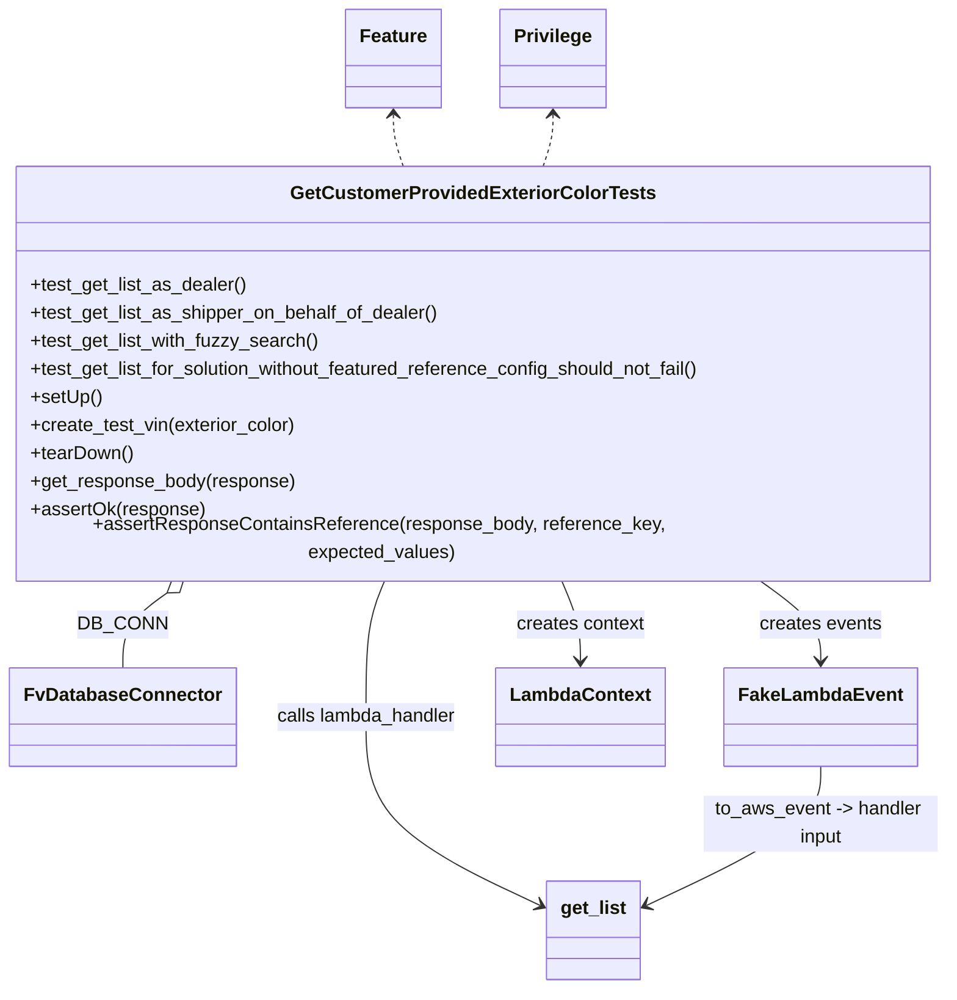
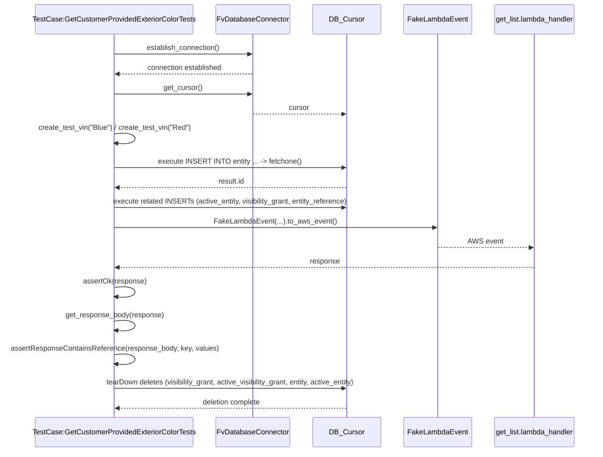

# Diagram: entity_core/entity_search/tests/integration_tests/test_get_list_featured_reference.py

> Auto-generated by Obscura crawlers

## Diagram 1

### SVG

<svg id="container" width="801.2421875" xmlns="http://www.w3.org/2000/svg" class="classDiagram" height="832" viewBox="0 0 801.2421875 832" role="graphics-document document" aria-roledescription="class"><g><defs><marker id="container_class-aggregationStart" class="marker aggregation class" refX="18" refY="7" markerWidth="190" markerHeight="240" orient="auto"><path d="M 18,7 L9,13 L1,7 L9,1 Z"></path></marker></defs><defs><marker id="container_class-aggregationEnd" class="marker aggregation class" refX="1" refY="7" markerWidth="20" markerHeight="28" orient="auto"><path d="M 18,7 L9,13 L1,7 L9,1 Z"></path></marker></defs><defs><marker id="container_class-extensionStart" class="marker extension class" refX="18" refY="7" markerWidth="190" markerHeight="240" orient="auto"><path d="M 1,7 L18,13 V 1 Z"></path></marker></defs><defs><marker id="container_class-extensionEnd" class="marker extension class" refX="1" refY="7" markerWidth="20" markerHeight="28" orient="auto"><path d="M 1,1 V 13 L18,7 Z"></path></marker></defs><defs><marker id="container_class-compositionStart" class="marker composition class" refX="18" refY="7" markerWidth="190" markerHeight="240" orient="auto"><path d="M 18,7 L9,13 L1,7 L9,1 Z"></path></marker></defs><defs><marker id="container_class-compositionEnd" class="marker composition class" refX="1" refY="7" markerWidth="20" markerHeight="28" orient="auto"><path d="M 18,7 L9,13 L1,7 L9,1 Z"></path></marker></defs><defs><marker id="container_class-dependencyStart" class="marker dependency class" refX="6" refY="7" markerWidth="190" markerHeight="240" orient="auto"><path d="M 5,7 L9,13 L1,7 L9,1 Z"></path></marker></defs><defs><marker id="container_class-dependencyEnd" class="marker dependency class" refX="13" refY="7" markerWidth="20" markerHeight="28" orient="auto"><path d="M 18,7 L9,13 L14,7 L9,1 Z"></path></marker></defs><defs><marker id="container_class-lollipopStart" class="marker lollipop class" refX="13" refY="7" markerWidth="190" markerHeight="240" orient="auto"><circle stroke="black" fill="transparent" cx="7" cy="7" r="6"></circle></marker></defs><defs><marker id="container_class-lollipopEnd" class="marker lollipop class" refX="1" refY="7" markerWidth="190" markerHeight="240" orient="auto"><circle stroke="black" fill="transparent" cx="7" cy="7" r="6"></circle></marker></defs><g class="root"><g class="clusters"></g><g class="edgePaths"><path d="M143.128,493.917L136.704,498.431C130.28,502.945,117.431,511.972,111.006,522.653C104.582,533.333,104.582,545.667,104.582,551.833L104.582,558" id="id_GetCustomerProvidedExteriorColorTests_FvDatabaseConnector_1" class="edge-thickness-normal edge-pattern-solid relation" style=";;;" data-edge="true" data-et="edge" data-id="id_GetCustomerProvidedExteriorColorTests_FvDatabaseConnector_1" data-points="W3sieCI6MTU3LjI0MjgyNjAyMTYzNDYsInkiOjQ4NH0seyJ4IjoxMDQuNTgyMDMxMjUsInkiOjUyMX0seyJ4IjoxMDQuNTgyMDMxMjUsInkiOjU1OH1d" marker-start="url(#container_class-aggregationStart)"></path><path d="M637.808,484L646.361,490.167C654.915,496.333,672.022,508.667,680.575,520C689.129,531.333,689.129,541.667,689.129,546.833L689.129,552" id="id_GetCustomerProvidedExteriorColorTests_FakeLambdaEvent_2" class="edge-thickness-normal edge-pattern-solid relation" style=";;;" data-edge="true" data-et="edge" data-id="id_GetCustomerProvidedExteriorColorTests_FakeLambdaEvent_2" data-points="W3sieCI6NjM3LjgwNzgwNDk4Nzk4MDcsInkiOjQ4NH0seyJ4Ijo2ODkuMTI4OTA2MjUsInkiOjUyMX0seyJ4Ijo2ODkuMTI4OTA2MjUsInkiOjU1OH1d" marker-end="url(#container_class-dependencyEnd)"></path><path d="M325.526,484L322.818,490.167C320.11,496.333,314.694,508.667,311.985,528C309.277,547.333,309.277,573.667,309.277,602C309.277,630.333,309.277,660.667,333.462,687.421C357.647,714.176,406.016,737.351,430.201,748.939L454.386,760.527" id="id_GetCustomerProvidedExteriorColorTests_get_list_3" class="edge-thickness-normal edge-pattern-solid relation" style=";;;" data-edge="true" data-et="edge" data-id="id_GetCustomerProvidedExteriorColorTests_get_list_3" data-points="W3sieCI6MzI1LjUyNTk5MTU4NjUzODQ1LCJ5Ijo0ODR9LHsieCI6MzA5LjI3NzM0Mzc1LCJ5Ijo1MjF9LHsieCI6MzA5LjI3NzM0Mzc1LCJ5Ijo2MDB9LHsieCI6MzA5LjI3NzM0Mzc1LCJ5Ijo2OTF9LHsieCI6NDU5Ljc5Njg3NSwieSI6NzYzLjExOTEwNDkxMzUxNDh9XQ==" marker-end="url(#container_class-dependencyEnd)"></path><path d="M475.716,484L478.424,490.167C481.132,496.333,486.549,508.667,489.257,520C491.965,531.333,491.965,541.667,491.965,546.833L491.965,552" id="id_GetCustomerProvidedExteriorColorTests_LambdaContext_4" class="edge-thickness-normal edge-pattern-solid relation" style=";;;" data-edge="true" data-et="edge" data-id="id_GetCustomerProvidedExteriorColorTests_LambdaContext_4" data-points="W3sieCI6NDc1LjcxNjE5NTkxMzQ2MTU1LCJ5Ijo0ODR9LHsieCI6NDkxLjk2NDg0Mzc1LCJ5Ijo1MjF9LHsieCI6NDkxLjk2NDg0Mzc1LCJ5Ijo1NTh9XQ==" marker-end="url(#container_class-dependencyEnd)"></path><path d="M689.129,642L689.129,650.167C689.129,658.333,689.129,674.667,664.944,694.421C640.759,714.176,592.39,737.351,568.205,748.939L544.02,760.527" id="id_FakeLambdaEvent_get_list_5" class="edge-thickness-normal edge-pattern-solid relation" style=";;;" data-edge="true" data-et="edge" data-id="id_FakeLambdaEvent_get_list_5" data-points="W3sieCI6Njg5LjEyODkwNjI1LCJ5Ijo2NDJ9LHsieCI6Njg5LjEyODkwNjI1LCJ5Ijo2OTF9LHsieCI6NTM4LjYwOTM3NSwieSI6NzYzLjExOTEwNDkxMzUxNDh9XQ==" marker-end="url(#container_class-dependencyEnd)"></path><path d="M333.992,98L333.992,101.167C333.992,104.333,333.992,110.667,335.409,118C336.825,125.333,339.658,133.667,341.074,137.833L342.491,142" id="id_Feature_GetCustomerProvidedExteriorColorTests_6" class="edge-thickness-normal edge-pattern-dashed relation" style=";;;" data-edge="true" data-et="edge" data-id="id_Feature_GetCustomerProvidedExteriorColorTests_6" data-points="W3sieCI6MzMzLjk5MjE4NzUsInkiOjkyfSx7IngiOjMzMy45OTIxODc1LCJ5IjoxMTd9LHsieCI6MzQyLjQ5MDc3MjQ4MDg2NzM1LCJ5IjoxNDJ9XQ==" marker-start="url(#container_class-dependencyStart)"></path><path d="M467.25,98L467.25,101.167C467.25,104.333,467.25,110.667,465.834,118C464.417,125.333,461.584,133.667,460.168,137.833L458.751,142" id="id_Privilege_GetCustomerProvidedExteriorColorTests_7" class="edge-thickness-normal edge-pattern-dashed relation" style=";;;" data-edge="true" data-et="edge" data-id="id_Privilege_GetCustomerProvidedExteriorColorTests_7" data-points="W3sieCI6NDY3LjI1LCJ5Ijo5Mn0seyJ4Ijo0NjcuMjUsInkiOjExN30seyJ4Ijo0NTguNzUxNDE1MDE5MTMyNjUsInkiOjE0Mn1d" marker-start="url(#container_class-dependencyStart)"></path></g><g class="edgeLabels"><g class="edgeLabel" transform="translate(104.58203125, 521)"><g class="label" data-id="id_GetCustomerProvidedExteriorColorTests_FvDatabaseConnector_1" transform="translate(-34.484375, -12)"><foreignObject width="68.96875" height="24">

DB_CONN

</foreignObject></g></g><g class="edgeLabel" transform="translate(689.12890625, 521)"><g class="label" data-id="id_GetCustomerProvidedExteriorColorTests_FakeLambdaEvent_2" transform="translate(-52.1953125, -12)"><foreignObject width="104.390625" height="24">

creates events

</foreignObject></g></g><g class="edgeLabel" transform="translate(309.27734375, 600)"><g class="label" data-id="id_GetCustomerProvidedExteriorColorTests_get_list_3" transform="translate(-78.390625, -12)"><foreignObject width="156.78125" height="24">

calls lambda_handler

</foreignObject></g></g><g class="edgeLabel" transform="translate(491.96484375, 521)"><g class="label" data-id="id_GetCustomerProvidedExteriorColorTests_LambdaContext_4" transform="translate(-55.140625, -12)"><foreignObject width="110.28125" height="24">

creates context

</foreignObject></g></g><g class="edgeLabel" transform="translate(689.12890625, 691)"><g class="label" data-id="id_FakeLambdaEvent_get_list_5" transform="translate(-100, -24)"><foreignObject width="200" height="48">

to_aws_event -&gt; handler input

</foreignObject></g></g><g class="edgeLabel"><g class="label" data-id="id_Feature_GetCustomerProvidedExteriorColorTests_6" transform="translate(0, 0)"><foreignObject width="0" height="0">

</foreignObject></g></g><g class="edgeLabel"><g class="label" data-id="id_Privilege_GetCustomerProvidedExteriorColorTests_7" transform="translate(0, 0)"><foreignObject width="0" height="0">

</foreignObject></g></g></g><g class="nodes"><g class="node default" id="classId-GetCustomerProvidedExteriorColorTests-0" transform="translate(400.62109375, 313)"><g class="basic label-container"><path d="M-392.62109375 -171 L392.62109375 -171 L392.62109375 171 L-392.62109375 171" stroke="none" stroke-width="0" fill="#ECECFF" style=""></path><path d="M-392.62109375 -171 C-177.18968584369398 -171, 38.24172206261204 -171, 392.62109375 -171 M-392.62109375 -171 C-224.3335491239518 -171, -56.046004497903596 -171, 392.62109375 -171 M392.62109375 -171 C392.62109375 -42.675223265703494, 392.62109375 85.64955346859301, 392.62109375 171 M392.62109375 -171 C392.62109375 -82.56134508747256, 392.62109375 5.87730982505488, 392.62109375 171 M392.62109375 171 C199.03981503203346 171, 5.458536314066919 171, -392.62109375 171 M392.62109375 171 C105.6873381042804 171, -181.2464175414392 171, -392.62109375 171 M-392.62109375 171 C-392.62109375 70.55765360030657, -392.62109375 -29.88469279938687, -392.62109375 -171 M-392.62109375 171 C-392.62109375 82.89422192751786, -392.62109375 -5.211556144964277, -392.62109375 -171" stroke="#9370DB" stroke-width="1.3" fill="none" stroke-dasharray="0 0" style=""></path></g><g class="annotation-group text" transform="translate(0, -147)"></g><g class="label-group text" transform="translate(-147.6171875, -147)"><g class="label" style="font-weight: bolder" transform="translate(0,-12)"><foreignObject width="295.234375" height="24">

GetCustomerProvidedExteriorColorTests

</foreignObject></g></g><g class="members-group text" transform="translate(-380.62109375, -99)"></g><g class="methods-group text" transform="translate(-380.62109375, -69)"><g class="label" style="" transform="translate(0,-12)"><foreignObject width="185.28125" height="24">

+test_get_list_as_dealer()

</foreignObject></g><g class="label" style="" transform="translate(0,12)"><foreignObject width="350.5625" height="24">

+test_get_list_as_shipper_on_behalf_of_dealer()

</foreignObject></g><g class="label" style="" transform="translate(0,36)"><foreignObject width="246.375" height="24">

+test_get_list_with_fuzzy_search()

</foreignObject></g><g class="label" style="" transform="translate(0,60)"><foreignObject width="585.640625" height="24">

+test_get_list_for_solution_without_featured_reference_config_should_not_fail()

</foreignObject></g><g class="label" style="" transform="translate(0,84)"><foreignObject width="60.421875" height="24">

+setUp()

</foreignObject></g><g class="label" style="" transform="translate(0,108)"><foreignObject width="228.328125" height="24">

+create_test_vin(exterior_color)

</foreignObject></g><g class="label" style="" transform="translate(0,132)"><foreignObject width="87.75" height="24">

+tearDown()

</foreignObject></g><g class="label" style="" transform="translate(0,156)"><foreignObject width="226.140625" height="24">

+get_response_body(response)

</foreignObject></g><g class="label" style="" transform="translate(0,180)"><foreignObject width="147.6875" height="24">

+assertOk(response)

</foreignObject></g><g class="label" style="" transform="translate(0,204)"><foreignObject width="613.625" height="24">

+assertResponseContainsReference(response_body, reference_key, expected_values)

</foreignObject></g></g><g class="divider" style=""><path d="M-392.62109375 -123 C-205.71372937092966 -123, -18.80636499185931 -123, 392.62109375 -123 M-392.62109375 -123 C-226.01493217409705 -123, -59.40877059819411 -123, 392.62109375 -123" stroke="#9370DB" stroke-width="1.3" fill="none" stroke-dasharray="0 0" style=""></path></g><g class="divider" style=""><path d="M-392.62109375 -99 C-113.6029228467757 -99, 165.4152480564486 -99, 392.62109375 -99 M-392.62109375 -99 C-104.37654135380302 -99, 183.86801104239396 -99, 392.62109375 -99" stroke="#9370DB" stroke-width="1.3" fill="none" stroke-dasharray="0 0" style=""></path></g></g><g class="node default" id="classId-FvDatabaseConnector-1" transform="translate(104.58203125, 600)"><g class="basic label-container"><path d="M-91.3046875 -42 L91.3046875 -42 L91.3046875 42 L-91.3046875 42" stroke="none" stroke-width="0" fill="#ECECFF" style=""></path><path d="M-91.3046875 -42 C-33.08421608678292 -42, 25.136255326434167 -42, 91.3046875 -42 M-91.3046875 -42 C-51.56561364633491 -42, -11.82653979266982 -42, 91.3046875 -42 M91.3046875 -42 C91.3046875 -23.15437466548187, 91.3046875 -4.308749330963742, 91.3046875 42 M91.3046875 -42 C91.3046875 -24.83570953936432, 91.3046875 -7.67141907872864, 91.3046875 42 M91.3046875 42 C43.02423735015842 42, -5.256212799683155 42, -91.3046875 42 M91.3046875 42 C34.299200653484625 42, -22.70628619303075 42, -91.3046875 42 M-91.3046875 42 C-91.3046875 20.435698628222788, -91.3046875 -1.1286027435544241, -91.3046875 -42 M-91.3046875 42 C-91.3046875 23.198462363941434, -91.3046875 4.396924727882869, -91.3046875 -42" stroke="#9370DB" stroke-width="1.3" fill="none" stroke-dasharray="0 0" style=""></path></g><g class="annotation-group text" transform="translate(0, -18)"></g><g class="label-group text" transform="translate(-79.3046875, -18)"><g class="label" style="font-weight: bolder" transform="translate(0,-12)"><foreignObject width="158.609375" height="24">

FvDatabaseConnector

</foreignObject></g></g><g class="members-group text" transform="translate(-79.3046875, 30)"></g><g class="methods-group text" transform="translate(-79.3046875, 60)"></g><g class="divider" style=""><path d="M-91.3046875 6 C-23.399217361940146 6, 44.50625277611971 6, 91.3046875 6 M-91.3046875 6 C-51.631662530866386 6, -11.958637561732772 6, 91.3046875 6" stroke="#9370DB" stroke-width="1.3" fill="none" stroke-dasharray="0 0" style=""></path></g><g class="divider" style=""><path d="M-91.3046875 24 C-26.46979418674003 24, 38.36509912651994 24, 91.3046875 24 M-91.3046875 24 C-51.87254253417976 24, -12.440397568359515 24, 91.3046875 24" stroke="#9370DB" stroke-width="1.3" fill="none" stroke-dasharray="0 0" style=""></path></g></g><g class="node default" id="classId-FakeLambdaEvent-2" transform="translate(689.12890625, 600)"><g class="basic label-container"><path d="M-77.8671875 -42 L77.8671875 -42 L77.8671875 42 L-77.8671875 42" stroke="none" stroke-width="0" fill="#ECECFF" style=""></path><path d="M-77.8671875 -42 C-23.276319544826286 -42, 31.314548410347427 -42, 77.8671875 -42 M-77.8671875 -42 C-26.878961381723727 -42, 24.109264736552547 -42, 77.8671875 -42 M77.8671875 -42 C77.8671875 -9.712407797022045, 77.8671875 22.57518440595591, 77.8671875 42 M77.8671875 -42 C77.8671875 -23.713311913739574, 77.8671875 -5.426623827479148, 77.8671875 42 M77.8671875 42 C37.61896236139496 42, -2.629262777210073 42, -77.8671875 42 M77.8671875 42 C20.84020885950023 42, -36.18676978099954 42, -77.8671875 42 M-77.8671875 42 C-77.8671875 12.097589357836377, -77.8671875 -17.804821284327247, -77.8671875 -42 M-77.8671875 42 C-77.8671875 17.443643886499334, -77.8671875 -7.112712227001332, -77.8671875 -42" stroke="#9370DB" stroke-width="1.3" fill="none" stroke-dasharray="0 0" style=""></path></g><g class="annotation-group text" transform="translate(0, -18)"></g><g class="label-group text" transform="translate(-65.8671875, -18)"><g class="label" style="font-weight: bolder" transform="translate(0,-12)"><foreignObject width="131.734375" height="24">

FakeLambdaEvent

</foreignObject></g></g><g class="members-group text" transform="translate(-65.8671875, 30)"></g><g class="methods-group text" transform="translate(-65.8671875, 60)"></g><g class="divider" style=""><path d="M-77.8671875 6 C-41.011650537391965 6, -4.15611357478393 6, 77.8671875 6 M-77.8671875 6 C-39.81029930880432 6, -1.7534111176086355 6, 77.8671875 6" stroke="#9370DB" stroke-width="1.3" fill="none" stroke-dasharray="0 0" style=""></path></g><g class="divider" style=""><path d="M-77.8671875 24 C-19.221123617354735 24, 39.42494026529053 24, 77.8671875 24 M-77.8671875 24 C-20.09129022743862 24, 37.68460704512276 24, 77.8671875 24" stroke="#9370DB" stroke-width="1.3" fill="none" stroke-dasharray="0 0" style=""></path></g></g><g class="node default" id="classId-LambdaContext-3" transform="translate(491.96484375, 600)"><g class="basic label-container"><path d="M-69.296875 -42 L69.296875 -42 L69.296875 42 L-69.296875 42" stroke="none" stroke-width="0" fill="#ECECFF" style=""></path><path d="M-69.296875 -42 C-25.160524433285907 -42, 18.975826133428185 -42, 69.296875 -42 M-69.296875 -42 C-38.77314508282282 -42, -8.249415165645651 -42, 69.296875 -42 M69.296875 -42 C69.296875 -11.074357830064873, 69.296875 19.851284339870254, 69.296875 42 M69.296875 -42 C69.296875 -17.144074441263257, 69.296875 7.711851117473486, 69.296875 42 M69.296875 42 C26.96367285409996 42, -15.369529291800077 42, -69.296875 42 M69.296875 42 C19.667426029029883 42, -29.962022941940234 42, -69.296875 42 M-69.296875 42 C-69.296875 19.218901832822485, -69.296875 -3.562196334355029, -69.296875 -42 M-69.296875 42 C-69.296875 21.697771606560348, -69.296875 1.3955432131206962, -69.296875 -42" stroke="#9370DB" stroke-width="1.3" fill="none" stroke-dasharray="0 0" style=""></path></g><g class="annotation-group text" transform="translate(0, -18)"></g><g class="label-group text" transform="translate(-57.296875, -18)"><g class="label" style="font-weight: bolder" transform="translate(0,-12)"><foreignObject width="114.59375" height="24">

LambdaContext

</foreignObject></g></g><g class="members-group text" transform="translate(-57.296875, 30)"></g><g class="methods-group text" transform="translate(-57.296875, 60)"></g><g class="divider" style=""><path d="M-69.296875 6 C-38.18774915288442 6, -7.0786233057688435 6, 69.296875 6 M-69.296875 6 C-22.602937401354396 6, 24.09100019729121 6, 69.296875 6" stroke="#9370DB" stroke-width="1.3" fill="none" stroke-dasharray="0 0" style=""></path></g><g class="divider" style=""><path d="M-69.296875 24 C-21.32469063765258 24, 26.64749372469484 24, 69.296875 24 M-69.296875 24 C-25.88219060494761 24, 17.53249379010478 24, 69.296875 24" stroke="#9370DB" stroke-width="1.3" fill="none" stroke-dasharray="0 0" style=""></path></g></g><g class="node default" id="classId-get_list-4" transform="translate(499.203125, 782)"><g class="basic label-container"><path d="M-39.40625 -42 L39.40625 -42 L39.40625 42 L-39.40625 42" stroke="none" stroke-width="0" fill="#ECECFF" style=""></path><path d="M-39.40625 -42 C-10.099809729763571 -42, 19.206630540472858 -42, 39.40625 -42 M-39.40625 -42 C-9.558105475627354 -42, 20.290039048745292 -42, 39.40625 -42 M39.40625 -42 C39.40625 -23.0987407714158, 39.40625 -4.1974815428316035, 39.40625 42 M39.40625 -42 C39.40625 -24.874341572335013, 39.40625 -7.748683144670025, 39.40625 42 M39.40625 42 C10.887336539283542 42, -17.631576921432917 42, -39.40625 42 M39.40625 42 C13.543843463389056 42, -12.318563073221888 42, -39.40625 42 M-39.40625 42 C-39.40625 15.298948838889391, -39.40625 -11.402102322221218, -39.40625 -42 M-39.40625 42 C-39.40625 12.098300671402633, -39.40625 -17.803398657194734, -39.40625 -42" stroke="#9370DB" stroke-width="1.3" fill="none" stroke-dasharray="0 0" style=""></path></g><g class="annotation-group text" transform="translate(0, -18)"></g><g class="label-group text" transform="translate(-27.40625, -18)"><g class="label" style="font-weight: bolder" transform="translate(0,-12)"><foreignObject width="54.8125" height="24">

get_list

</foreignObject></g></g><g class="members-group text" transform="translate(-27.40625, 30)"></g><g class="methods-group text" transform="translate(-27.40625, 60)"></g><g class="divider" style=""><path d="M-39.40625 6 C-15.984530910417313 6, 7.437188179165375 6, 39.40625 6 M-39.40625 6 C-19.790427186075117 6, -0.1746043721502346 6, 39.40625 6" stroke="#9370DB" stroke-width="1.3" fill="none" stroke-dasharray="0 0" style=""></path></g><g class="divider" style=""><path d="M-39.40625 24 C-9.577005191520243 24, 20.252239616959514 24, 39.40625 24 M-39.40625 24 C-18.214383563095065 24, 2.977482873809869 24, 39.40625 24" stroke="#9370DB" stroke-width="1.3" fill="none" stroke-dasharray="0 0" style=""></path></g></g><g class="node default" id="classId-Feature-5" transform="translate(333.9921875, 50)"><g class="basic label-container"><path d="M-39.390625 -42 L39.390625 -42 L39.390625 42 L-39.390625 42" stroke="none" stroke-width="0" fill="#ECECFF" style=""></path><path d="M-39.390625 -42 C-13.76462078240187 -42, 11.86138343519626 -42, 39.390625 -42 M-39.390625 -42 C-15.292243062133178 -42, 8.806138875733645 -42, 39.390625 -42 M39.390625 -42 C39.390625 -14.655816297223808, 39.390625 12.688367405552384, 39.390625 42 M39.390625 -42 C39.390625 -12.152835493380252, 39.390625 17.694329013239496, 39.390625 42 M39.390625 42 C22.84538587384457 42, 6.300146747689141 42, -39.390625 42 M39.390625 42 C21.092606527701932 42, 2.794588055403864 42, -39.390625 42 M-39.390625 42 C-39.390625 9.159910828765838, -39.390625 -23.680178342468324, -39.390625 -42 M-39.390625 42 C-39.390625 12.298944732831774, -39.390625 -17.40211053433645, -39.390625 -42" stroke="#9370DB" stroke-width="1.3" fill="none" stroke-dasharray="0 0" style=""></path></g><g class="annotation-group text" transform="translate(0, -18)"></g><g class="label-group text" transform="translate(-27.390625, -18)"><g class="label" style="font-weight: bolder" transform="translate(0,-12)"><foreignObject width="54.78125" height="24">

Feature

</foreignObject></g></g><g class="members-group text" transform="translate(-27.390625, 30)"></g><g class="methods-group text" transform="translate(-27.390625, 60)"></g><g class="divider" style=""><path d="M-39.390625 6 C-8.453164257820447 6, 22.484296484359106 6, 39.390625 6 M-39.390625 6 C-21.34160835906004 6, -3.292591718120079 6, 39.390625 6" stroke="#9370DB" stroke-width="1.3" fill="none" stroke-dasharray="0 0" style=""></path></g><g class="divider" style=""><path d="M-39.390625 24 C-16.320221433529934 24, 6.750182132940132 24, 39.390625 24 M-39.390625 24 C-14.017874741530235 24, 11.35487551693953 24, 39.390625 24" stroke="#9370DB" stroke-width="1.3" fill="none" stroke-dasharray="0 0" style=""></path></g></g><g class="node default" id="classId-Privilege-6" transform="translate(467.25, 50)"><g class="basic label-container"><path d="M-43.8671875 -42 L43.8671875 -42 L43.8671875 42 L-43.8671875 42" stroke="none" stroke-width="0" fill="#ECECFF" style=""></path><path d="M-43.8671875 -42 C-11.214535344495083 -42, 21.438116811009834 -42, 43.8671875 -42 M-43.8671875 -42 C-17.02626166341158 -42, 9.814664173176837 -42, 43.8671875 -42 M43.8671875 -42 C43.8671875 -21.45941894394185, 43.8671875 -0.9188378878836971, 43.8671875 42 M43.8671875 -42 C43.8671875 -23.526930704216323, 43.8671875 -5.053861408432645, 43.8671875 42 M43.8671875 42 C14.849129605155294 42, -14.168928289689411 42, -43.8671875 42 M43.8671875 42 C24.857511341175886 42, 5.847835182351773 42, -43.8671875 42 M-43.8671875 42 C-43.8671875 13.37373995586023, -43.8671875 -15.252520088279539, -43.8671875 -42 M-43.8671875 42 C-43.8671875 15.82550142416762, -43.8671875 -10.348997151664761, -43.8671875 -42" stroke="#9370DB" stroke-width="1.3" fill="none" stroke-dasharray="0 0" style=""></path></g><g class="annotation-group text" transform="translate(0, -18)"></g><g class="label-group text" transform="translate(-31.8671875, -18)"><g class="label" style="font-weight: bolder" transform="translate(0,-12)"><foreignObject width="63.734375" height="24">

Privilege

</foreignObject></g></g><g class="members-group text" transform="translate(-31.8671875, 30)"></g><g class="methods-group text" transform="translate(-31.8671875, 60)"></g><g class="divider" style=""><path d="M-43.8671875 6 C-22.028735227839963 6, -0.19028295567992615 6, 43.8671875 6 M-43.8671875 6 C-21.545495040958762 6, 0.7761974180824751 6, 43.8671875 6" stroke="#9370DB" stroke-width="1.3" fill="none" stroke-dasharray="0 0" style=""></path></g><g class="divider" style=""><path d="M-43.8671875 24 C-14.347211468603696 24, 15.172764562792608 24, 43.8671875 24 M-43.8671875 24 C-9.487686246932334 24, 24.89181500613533 24, 43.8671875 24" stroke="#9370DB" stroke-width="1.3" fill="none" stroke-dasharray="0 0" style=""></path></g></g></g></g></g></svg>

## Diagram 2

### SVG

<svg id="container" width="1391" xmlns="http://www.w3.org/2000/svg" height="1059" viewBox="-89 -10 1391 1059" role="graphics-document document" aria-roledescription="sequence"><g><rect x="1054" y="973" fill="#eaeaea" stroke="#666" width="198" height="65" name="Handler" rx="3" ry="3" class="actor actor-bottom"></rect><text x="1153" y="1005.5" dominant-baseline="central" alignment-baseline="central" class="actor actor-box" style="text-anchor: middle; font-size: 16px; font-weight: 400;"><tspan x="1153" dy="0">get_list.lambda_handler</tspan></text></g><g><rect x="853" y="973" fill="#eaeaea" stroke="#666" width="151" height="65" name="EventBuilder" rx="3" ry="3" class="actor actor-bottom"></rect><text x="928.5" y="1005.5" dominant-baseline="central" alignment-baseline="central" class="actor actor-box" style="text-anchor: middle; font-size: 16px; font-weight: 400;"><tspan x="928.5" dy="0">FakeLambdaEvent</tspan></text></g><g><rect x="653" y="973" fill="#eaeaea" stroke="#666" width="150" height="65" name="Cursor" rx="3" ry="3" class="actor actor-bottom"></rect><text x="728" y="1005.5" dominant-baseline="central" alignment-baseline="central" class="actor actor-box" style="text-anchor: middle; font-size: 16px; font-weight: 400;"><tspan x="728" dy="0">DB_Cursor</tspan></text></g><g><rect x="426" y="973" fill="#eaeaea" stroke="#666" width="177" height="65" name="DB" rx="3" ry="3" class="actor actor-bottom"></rect><text x="514.5" y="1005.5" dominant-baseline="central" alignment-baseline="central" class="actor actor-box" style="text-anchor: middle; font-size: 16px; font-weight: 400;"><tspan x="514.5" dy="0">FvDatabaseConnector</tspan></text></g><g><rect x="0" y="973" fill="#eaeaea" stroke="#666" width="376" height="65" name="TestCase" rx="3" ry="3" class="actor actor-bottom"></rect><text x="188" y="1005.5" dominant-baseline="central" alignment-baseline="central" class="actor actor-box" style="text-anchor: middle; font-size: 16px; font-weight: 400;"><tspan x="188" dy="0">TestCase:GetCustomerProvidedExteriorColorTests</tspan></text></g><g><line id="actor4" x1="1153" y1="65" x2="1153" y2="973" class="actor-line 200" stroke-width="0.5px" stroke="#999" name="Handler"></line><g id="root-4"><rect x="1054" y="0" fill="#eaeaea" stroke="#666" width="198" height="65" name="Handler" rx="3" ry="3" class="actor actor-top"></rect><text x="1153" y="32.5" dominant-baseline="central" alignment-baseline="central" class="actor actor-box" style="text-anchor: middle; font-size: 16px; font-weight: 400;"><tspan x="1153" dy="0">get_list.lambda_handler</tspan></text></g></g><g><line id="actor3" x1="928.5" y1="65" x2="928.5" y2="973" class="actor-line 200" stroke-width="0.5px" stroke="#999" name="EventBuilder"></line><g id="root-3"><rect x="853" y="0" fill="#eaeaea" stroke="#666" width="151" height="65" name="EventBuilder" rx="3" ry="3" class="actor actor-top"></rect><text x="928.5" y="32.5" dominant-baseline="central" alignment-baseline="central" class="actor actor-box" style="text-anchor: middle; font-size: 16px; font-weight: 400;"><tspan x="928.5" dy="0">FakeLambdaEvent</tspan></text></g></g><g><line id="actor2" x1="728" y1="65" x2="728" y2="973" class="actor-line 200" stroke-width="0.5px" stroke="#999" name="Cursor"></line><g id="root-2"><rect x="653" y="0" fill="#eaeaea" stroke="#666" width="150" height="65" name="Cursor" rx="3" ry="3" class="actor actor-top"></rect><text x="728" y="32.5" dominant-baseline="central" alignment-baseline="central" class="actor actor-box" style="text-anchor: middle; font-size: 16px; font-weight: 400;"><tspan x="728" dy="0">DB_Cursor</tspan></text></g></g><g><line id="actor1" x1="514.5" y1="65" x2="514.5" y2="973" class="actor-line 200" stroke-width="0.5px" stroke="#999" name="DB"></line><g id="root-1"><rect x="426" y="0" fill="#eaeaea" stroke="#666" width="177" height="65" name="DB" rx="3" ry="3" class="actor actor-top"></rect><text x="514.5" y="32.5" dominant-baseline="central" alignment-baseline="central" class="actor actor-box" style="text-anchor: middle; font-size: 16px; font-weight: 400;"><tspan x="514.5" dy="0">FvDatabaseConnector</tspan></text></g></g><g><line id="actor0" x1="188" y1="65" x2="188" y2="973" class="actor-line 200" stroke-width="0.5px" stroke="#999" name="TestCase"></line><g id="root-0"><rect x="0" y="0" fill="#eaeaea" stroke="#666" width="376" height="65" name="TestCase" rx="3" ry="3" class="actor actor-top"></rect><text x="188" y="32.5" dominant-baseline="central" alignment-baseline="central" class="actor actor-box" style="text-anchor: middle; font-size: 16px; font-weight: 400;"><tspan x="188" dy="0">TestCase:GetCustomerProvidedExteriorColorTests</tspan></text></g></g><g></g><defs><symbol id="computer" width="24" height="24"><path transform="scale(.5)" d="M2 2v13h20v-13h-20zm18 11h-16v-9h16v9zm-10.228 6l.466-1h3.524l.467 1h-4.457zm14.228 3h-24l2-6h2.104l-1.33 4h18.45l-1.297-4h2.073l2 6zm-5-10h-14v-7h14v7z"></path></symbol></defs><defs><symbol id="database" fill-rule="evenodd" clip-rule="evenodd"><path transform="scale(.5)" d="M12.258.001l.256.004.255.005.253.008.251.01.249.012.247.015.246.016.242.019.241.02.239.023.236.024.233.027.231.028.229.031.225.032.223.034.22.036.217.038.214.04.211.041.208.043.205.045.201.046.198.048.194.05.191.051.187.053.183.054.18.056.175.057.172.059.168.06.163.061.16.063.155.064.15.066.074.033.073.033.071.034.07.034.069.035.068.035.067.035.066.035.064.036.064.036.062.036.06.036.06.037.058.037.058.037.055.038.055.038.053.038.052.038.051.039.05.039.048.039.047.039.045.04.044.04.043.04.041.04.04.041.039.041.037.041.036.041.034.041.033.042.032.042.03.042.029.042.027.042.026.043.024.043.023.043.021.043.02.043.018.044.017.043.015.044.013.044.012.044.011.045.009.044.007.045.006.045.004.045.002.045.001.045v17l-.001.045-.002.045-.004.045-.006.045-.007.045-.009.044-.011.045-.012.044-.013.044-.015.044-.017.043-.018.044-.02.043-.021.043-.023.043-.024.043-.026.043-.027.042-.029.042-.03.042-.032.042-.033.042-.034.041-.036.041-.037.041-.039.041-.04.041-.041.04-.043.04-.044.04-.045.04-.047.039-.048.039-.05.039-.051.039-.052.038-.053.038-.055.038-.055.038-.058.037-.058.037-.06.037-.06.036-.062.036-.064.036-.064.036-.066.035-.067.035-.068.035-.069.035-.07.034-.071.034-.073.033-.074.033-.15.066-.155.064-.16.063-.163.061-.168.06-.172.059-.175.057-.18.056-.183.054-.187.053-.191.051-.194.05-.198.048-.201.046-.205.045-.208.043-.211.041-.214.04-.217.038-.22.036-.223.034-.225.032-.229.031-.231.028-.233.027-.236.024-.239.023-.241.02-.242.019-.246.016-.247.015-.249.012-.251.01-.253.008-.255.005-.256.004-.258.001-.258-.001-.256-.004-.255-.005-.253-.008-.251-.01-.249-.012-.247-.015-.245-.016-.243-.019-.241-.02-.238-.023-.236-.024-.234-.027-.231-.028-.228-.031-.226-.032-.223-.034-.22-.036-.217-.038-.214-.04-.211-.041-.208-.043-.204-.045-.201-.046-.198-.048-.195-.05-.19-.051-.187-.053-.184-.054-.179-.056-.176-.057-.172-.059-.167-.06-.164-.061-.159-.063-.155-.064-.151-.066-.074-.033-.072-.033-.072-.034-.07-.034-.069-.035-.068-.035-.067-.035-.066-.035-.064-.036-.063-.036-.062-.036-.061-.036-.06-.037-.058-.037-.057-.037-.056-.038-.055-.038-.053-.038-.052-.038-.051-.039-.049-.039-.049-.039-.046-.039-.046-.04-.044-.04-.043-.04-.041-.04-.04-.041-.039-.041-.037-.041-.036-.041-.034-.041-.033-.042-.032-.042-.03-.042-.029-.042-.027-.042-.026-.043-.024-.043-.023-.043-.021-.043-.02-.043-.018-.044-.017-.043-.015-.044-.013-.044-.012-.044-.011-.045-.009-.044-.007-.045-.006-.045-.004-.045-.002-.045-.001-.045v-17l.001-.045.002-.045.004-.045.006-.045.007-.045.009-.044.011-.045.012-.044.013-.044.015-.044.017-.043.018-.044.02-.043.021-.043.023-.043.024-.043.026-.043.027-.042.029-.042.03-.042.032-.042.033-.042.034-.041.036-.041.037-.041.039-.041.04-.041.041-.04.043-.04.044-.04.046-.04.046-.039.049-.039.049-.039.051-.039.052-.038.053-.038.055-.038.056-.038.057-.037.058-.037.06-.037.061-.036.062-.036.063-.036.064-.036.066-.035.067-.035.068-.035.069-.035.07-.034.072-.034.072-.033.074-.033.151-.066.155-.064.159-.063.164-.061.167-.06.172-.059.176-.057.179-.056.184-.054.187-.053.19-.051.195-.05.198-.048.201-.046.204-.045.208-.043.211-.041.214-.04.217-.038.22-.036.223-.034.226-.032.228-.031.231-.028.234-.027.236-.024.238-.023.241-.02.243-.019.245-.016.247-.015.249-.012.251-.01.253-.008.255-.005.256-.004.258-.001.258.001zm-9.258 20.499v.01l.001.021.003.021.004.022.005.021.006.022.007.022.009.023.01.022.011.023.012.023.013.023.015.023.016.024.017.023.018.024.019.024.021.024.022.025.023.024.024.025.052.049.056.05.061.051.066.051.07.051.075.051.079.052.084.052.088.052.092.052.097.052.102.051.105.052.11.052.114.051.119.051.123.051.127.05.131.05.135.05.139.048.144.049.147.047.152.047.155.047.16.045.163.045.167.043.171.043.176.041.178.041.183.039.187.039.19.037.194.035.197.035.202.033.204.031.209.03.212.029.216.027.219.025.222.024.226.021.23.02.233.018.236.016.24.015.243.012.246.01.249.008.253.005.256.004.259.001.26-.001.257-.004.254-.005.25-.008.247-.011.244-.012.241-.014.237-.016.233-.018.231-.021.226-.021.224-.024.22-.026.216-.027.212-.028.21-.031.205-.031.202-.034.198-.034.194-.036.191-.037.187-.039.183-.04.179-.04.175-.042.172-.043.168-.044.163-.045.16-.046.155-.046.152-.047.148-.048.143-.049.139-.049.136-.05.131-.05.126-.05.123-.051.118-.052.114-.051.11-.052.106-.052.101-.052.096-.052.092-.052.088-.053.083-.051.079-.052.074-.052.07-.051.065-.051.06-.051.056-.05.051-.05.023-.024.023-.025.021-.024.02-.024.019-.024.018-.024.017-.024.015-.023.014-.024.013-.023.012-.023.01-.023.01-.022.008-.022.006-.022.006-.022.004-.022.004-.021.001-.021.001-.021v-4.127l-.077.055-.08.053-.083.054-.085.053-.087.052-.09.052-.093.051-.095.05-.097.05-.1.049-.102.049-.105.048-.106.047-.109.047-.111.046-.114.045-.115.045-.118.044-.12.043-.122.042-.124.042-.126.041-.128.04-.13.04-.132.038-.134.038-.135.037-.138.037-.139.035-.142.035-.143.034-.144.033-.147.032-.148.031-.15.03-.151.03-.153.029-.154.027-.156.027-.158.026-.159.025-.161.024-.162.023-.163.022-.165.021-.166.02-.167.019-.169.018-.169.017-.171.016-.173.015-.173.014-.175.013-.175.012-.177.011-.178.01-.179.008-.179.008-.181.006-.182.005-.182.004-.184.003-.184.002h-.37l-.184-.002-.184-.003-.182-.004-.182-.005-.181-.006-.179-.008-.179-.008-.178-.01-.176-.011-.176-.012-.175-.013-.173-.014-.172-.015-.171-.016-.17-.017-.169-.018-.167-.019-.166-.02-.165-.021-.163-.022-.162-.023-.161-.024-.159-.025-.157-.026-.156-.027-.155-.027-.153-.029-.151-.03-.15-.03-.148-.031-.146-.032-.145-.033-.143-.034-.141-.035-.14-.035-.137-.037-.136-.037-.134-.038-.132-.038-.13-.04-.128-.04-.126-.041-.124-.042-.122-.042-.12-.044-.117-.043-.116-.045-.113-.045-.112-.046-.109-.047-.106-.047-.105-.048-.102-.049-.1-.049-.097-.05-.095-.05-.093-.052-.09-.051-.087-.052-.085-.053-.083-.054-.08-.054-.077-.054v4.127zm0-5.654v.011l.001.021.003.021.004.021.005.022.006.022.007.022.009.022.01.022.011.023.012.023.013.023.015.024.016.023.017.024.018.024.019.024.021.024.022.024.023.025.024.024.052.05.056.05.061.05.066.051.07.051.075.052.079.051.084.052.088.052.092.052.097.052.102.052.105.052.11.051.114.051.119.052.123.05.127.051.131.05.135.049.139.049.144.048.147.048.152.047.155.046.16.045.163.045.167.044.171.042.176.042.178.04.183.04.187.038.19.037.194.036.197.034.202.033.204.032.209.03.212.028.216.027.219.025.222.024.226.022.23.02.233.018.236.016.24.014.243.012.246.01.249.008.253.006.256.003.259.001.26-.001.257-.003.254-.006.25-.008.247-.01.244-.012.241-.015.237-.016.233-.018.231-.02.226-.022.224-.024.22-.025.216-.027.212-.029.21-.03.205-.032.202-.033.198-.035.194-.036.191-.037.187-.039.183-.039.179-.041.175-.042.172-.043.168-.044.163-.045.16-.045.155-.047.152-.047.148-.048.143-.048.139-.05.136-.049.131-.05.126-.051.123-.051.118-.051.114-.052.11-.052.106-.052.101-.052.096-.052.092-.052.088-.052.083-.052.079-.052.074-.051.07-.052.065-.051.06-.05.056-.051.051-.049.023-.025.023-.024.021-.025.02-.024.019-.024.018-.024.017-.024.015-.023.014-.023.013-.024.012-.022.01-.023.01-.023.008-.022.006-.022.006-.022.004-.021.004-.022.001-.021.001-.021v-4.139l-.077.054-.08.054-.083.054-.085.052-.087.053-.09.051-.093.051-.095.051-.097.05-.1.049-.102.049-.105.048-.106.047-.109.047-.111.046-.114.045-.115.044-.118.044-.12.044-.122.042-.124.042-.126.041-.128.04-.13.039-.132.039-.134.038-.135.037-.138.036-.139.036-.142.035-.143.033-.144.033-.147.033-.148.031-.15.03-.151.03-.153.028-.154.028-.156.027-.158.026-.159.025-.161.024-.162.023-.163.022-.165.021-.166.02-.167.019-.169.018-.169.017-.171.016-.173.015-.173.014-.175.013-.175.012-.177.011-.178.009-.179.009-.179.007-.181.007-.182.005-.182.004-.184.003-.184.002h-.37l-.184-.002-.184-.003-.182-.004-.182-.005-.181-.007-.179-.007-.179-.009-.178-.009-.176-.011-.176-.012-.175-.013-.173-.014-.172-.015-.171-.016-.17-.017-.169-.018-.167-.019-.166-.02-.165-.021-.163-.022-.162-.023-.161-.024-.159-.025-.157-.026-.156-.027-.155-.028-.153-.028-.151-.03-.15-.03-.148-.031-.146-.033-.145-.033-.143-.033-.141-.035-.14-.036-.137-.036-.136-.037-.134-.038-.132-.039-.13-.039-.128-.04-.126-.041-.124-.042-.122-.043-.12-.043-.117-.044-.116-.044-.113-.046-.112-.046-.109-.046-.106-.047-.105-.048-.102-.049-.1-.049-.097-.05-.095-.051-.093-.051-.09-.051-.087-.053-.085-.052-.083-.054-.08-.054-.077-.054v4.139zm0-5.666v.011l.001.02.003.022.004.021.005.022.006.021.007.022.009.023.01.022.011.023.012.023.013.023.015.023.016.024.017.024.018.023.019.024.021.025.022.024.023.024.024.025.052.05.056.05.061.05.066.051.07.051.075.052.079.051.084.052.088.052.092.052.097.052.102.052.105.051.11.052.114.051.119.051.123.051.127.05.131.05.135.05.139.049.144.048.147.048.152.047.155.046.16.045.163.045.167.043.171.043.176.042.178.04.183.04.187.038.19.037.194.036.197.034.202.033.204.032.209.03.212.028.216.027.219.025.222.024.226.021.23.02.233.018.236.017.24.014.243.012.246.01.249.008.253.006.256.003.259.001.26-.001.257-.003.254-.006.25-.008.247-.01.244-.013.241-.014.237-.016.233-.018.231-.02.226-.022.224-.024.22-.025.216-.027.212-.029.21-.03.205-.032.202-.033.198-.035.194-.036.191-.037.187-.039.183-.039.179-.041.175-.042.172-.043.168-.044.163-.045.16-.045.155-.047.152-.047.148-.048.143-.049.139-.049.136-.049.131-.051.126-.05.123-.051.118-.052.114-.051.11-.052.106-.052.101-.052.096-.052.092-.052.088-.052.083-.052.079-.052.074-.052.07-.051.065-.051.06-.051.056-.05.051-.049.023-.025.023-.025.021-.024.02-.024.019-.024.018-.024.017-.024.015-.023.014-.024.013-.023.012-.023.01-.022.01-.023.008-.022.006-.022.006-.022.004-.022.004-.021.001-.021.001-.021v-4.153l-.077.054-.08.054-.083.053-.085.053-.087.053-.09.051-.093.051-.095.051-.097.05-.1.049-.102.048-.105.048-.106.048-.109.046-.111.046-.114.046-.115.044-.118.044-.12.043-.122.043-.124.042-.126.041-.128.04-.13.039-.132.039-.134.038-.135.037-.138.036-.139.036-.142.034-.143.034-.144.033-.147.032-.148.032-.15.03-.151.03-.153.028-.154.028-.156.027-.158.026-.159.024-.161.024-.162.023-.163.023-.165.021-.166.02-.167.019-.169.018-.169.017-.171.016-.173.015-.173.014-.175.013-.175.012-.177.01-.178.01-.179.009-.179.007-.181.006-.182.006-.182.004-.184.003-.184.001-.185.001-.185-.001-.184-.001-.184-.003-.182-.004-.182-.006-.181-.006-.179-.007-.179-.009-.178-.01-.176-.01-.176-.012-.175-.013-.173-.014-.172-.015-.171-.016-.17-.017-.169-.018-.167-.019-.166-.02-.165-.021-.163-.023-.162-.023-.161-.024-.159-.024-.157-.026-.156-.027-.155-.028-.153-.028-.151-.03-.15-.03-.148-.032-.146-.032-.145-.033-.143-.034-.141-.034-.14-.036-.137-.036-.136-.037-.134-.038-.132-.039-.13-.039-.128-.041-.126-.041-.124-.041-.122-.043-.12-.043-.117-.044-.116-.044-.113-.046-.112-.046-.109-.046-.106-.048-.105-.048-.102-.048-.1-.05-.097-.049-.095-.051-.093-.051-.09-.052-.087-.052-.085-.053-.083-.053-.08-.054-.077-.054v4.153zm8.74-8.179l-.257.004-.254.005-.25.008-.247.011-.244.012-.241.014-.237.016-.233.018-.231.021-.226.022-.224.023-.22.026-.216.027-.212.028-.21.031-.205.032-.202.033-.198.034-.194.036-.191.038-.187.038-.183.04-.179.041-.175.042-.172.043-.168.043-.163.045-.16.046-.155.046-.152.048-.148.048-.143.048-.139.049-.136.05-.131.05-.126.051-.123.051-.118.051-.114.052-.11.052-.106.052-.101.052-.096.052-.092.052-.088.052-.083.052-.079.052-.074.051-.07.052-.065.051-.06.05-.056.05-.051.05-.023.025-.023.024-.021.024-.02.025-.019.024-.018.024-.017.023-.015.024-.014.023-.013.023-.012.023-.01.023-.01.022-.008.022-.006.023-.006.021-.004.022-.004.021-.001.021-.001.021.001.021.001.021.004.021.004.022.006.021.006.023.008.022.01.022.01.023.012.023.013.023.014.023.015.024.017.023.018.024.019.024.02.025.021.024.023.024.023.025.051.05.056.05.06.05.065.051.07.052.074.051.079.052.083.052.088.052.092.052.096.052.101.052.106.052.11.052.114.052.118.051.123.051.126.051.131.05.136.05.139.049.143.048.148.048.152.048.155.046.16.046.163.045.168.043.172.043.175.042.179.041.183.04.187.038.191.038.194.036.198.034.202.033.205.032.21.031.212.028.216.027.22.026.224.023.226.022.231.021.233.018.237.016.241.014.244.012.247.011.25.008.254.005.257.004.26.001.26-.001.257-.004.254-.005.25-.008.247-.011.244-.012.241-.014.237-.016.233-.018.231-.021.226-.022.224-.023.22-.026.216-.027.212-.028.21-.031.205-.032.202-.033.198-.034.194-.036.191-.038.187-.038.183-.04.179-.041.175-.042.172-.043.168-.043.163-.045.16-.046.155-.046.152-.048.148-.048.143-.048.139-.049.136-.05.131-.05.126-.051.123-.051.118-.051.114-.052.11-.052.106-.052.101-.052.096-.052.092-.052.088-.052.083-.052.079-.052.074-.051.07-.052.065-.051.06-.05.056-.05.051-.05.023-.025.023-.024.021-.024.02-.025.019-.024.018-.024.017-.023.015-.024.014-.023.013-.023.012-.023.01-.023.01-.022.008-.022.006-.023.006-.021.004-.022.004-.021.001-.021.001-.021-.001-.021-.001-.021-.004-.021-.004-.022-.006-.021-.006-.023-.008-.022-.01-.022-.01-.023-.012-.023-.013-.023-.014-.023-.015-.024-.017-.023-.018-.024-.019-.024-.02-.025-.021-.024-.023-.024-.023-.025-.051-.05-.056-.05-.06-.05-.065-.051-.07-.052-.074-.051-.079-.052-.083-.052-.088-.052-.092-.052-.096-.052-.101-.052-.106-.052-.11-.052-.114-.052-.118-.051-.123-.051-.126-.051-.131-.05-.136-.05-.139-.049-.143-.048-.148-.048-.152-.048-.155-.046-.16-.046-.163-.045-.168-.043-.172-.043-.175-.042-.179-.041-.183-.04-.187-.038-.191-.038-.194-.036-.198-.034-.202-.033-.205-.032-.21-.031-.212-.028-.216-.027-.22-.026-.224-.023-.226-.022-.231-.021-.233-.018-.237-.016-.241-.014-.244-.012-.247-.011-.25-.008-.254-.005-.257-.004-.26-.001-.26.001z"></path></symbol></defs><defs><symbol id="clock" width="24" height="24"><path transform="scale(.5)" d="M12 2c5.514 0 10 4.486 10 10s-4.486 10-10 10-10-4.486-10-10 4.486-10 10-10zm0-2c-6.627 0-12 5.373-12 12s5.373 12 12 12 12-5.373 12-12-5.373-12-12-12zm5.848 12.459c.202.038.202.333.001.372-1.907.361-6.045 1.111-6.547 1.111-.719 0-1.301-.582-1.301-1.301 0-.512.77-5.447 1.125-7.445.034-.192.312-.181.343.014l.985 6.238 5.394 1.011z"></path></symbol></defs><defs><marker id="arrowhead" refX="7.9" refY="5" markerUnits="userSpaceOnUse" markerWidth="12" markerHeight="12" orient="auto-start-reverse"><path d="M -1 0 L 10 5 L 0 10 z"></path></marker></defs><defs><marker id="crosshead" markerWidth="15" markerHeight="8" orient="auto" refX="4" refY="4.5"><path fill="none" stroke="#000000" stroke-width="1pt" d="M 1,2 L 6,7 M 6,2 L 1,7" style="stroke-dasharray: 0, 0;"></path></marker></defs><defs><marker id="filled-head" refX="15.5" refY="7" markerWidth="20" markerHeight="28" orient="auto"><path d="M 18,7 L9,13 L14,7 L9,1 Z"></path></marker></defs><defs><marker id="sequencenumber" refX="15" refY="15" markerWidth="60" markerHeight="40" orient="auto"><circle cx="15" cy="15" r="6"></circle></marker></defs><text x="350" y="80" text-anchor="middle" dominant-baseline="middle" alignment-baseline="middle" class="messageText" dy="1em" style="font-size: 16px; font-weight: 400;">establish_connection()</text><line x1="189" y1="113" x2="510.5" y2="113" class="messageLine0" stroke-width="2" stroke="none" marker-end="url(#arrowhead)" style="fill: none;"></line><text x="353" y="128" text-anchor="middle" dominant-baseline="middle" alignment-baseline="middle" class="messageText" dy="1em" style="font-size: 16px; font-weight: 400;">connection established</text><line x1="513.5" y1="161" x2="192" y2="161" class="messageLine1" stroke-width="2" stroke="none" marker-end="url(#arrowhead)" style="stroke-dasharray: 3, 3; fill: none;"></line><text x="350" y="176" text-anchor="middle" dominant-baseline="middle" alignment-baseline="middle" class="messageText" dy="1em" style="font-size: 16px; font-weight: 400;">get_cursor()</text><line x1="189" y1="209" x2="510.5" y2="209" class="messageLine0" stroke-width="2" stroke="none" marker-end="url(#arrowhead)" style="fill: none;"></line><text x="620" y="224" text-anchor="middle" dominant-baseline="middle" alignment-baseline="middle" class="messageText" dy="1em" style="font-size: 16px; font-weight: 400;">cursor</text><line x1="515.5" y1="257" x2="724" y2="257" class="messageLine1" stroke-width="2" stroke="none" marker-end="url(#arrowhead)" style="stroke-dasharray: 3, 3; fill: none;"></line><text x="189" y="272" text-anchor="middle" dominant-baseline="middle" alignment-baseline="middle" class="messageText" dy="1em" style="font-size: 16px; font-weight: 400;">create_test_vin("Blue") / create_test_vin("Red")</text><path d="M 189,305 C 249,295 249,335 189,325" class="messageLine0" stroke-width="2" stroke="none" marker-end="url(#arrowhead)" style="fill: none;"></path><text x="457" y="350" text-anchor="middle" dominant-baseline="middle" alignment-baseline="middle" class="messageText" dy="1em" style="font-size: 16px; font-weight: 400;">execute INSERT INTO entity ... -&gt; fetchone()</text><line x1="189" y1="383" x2="724" y2="383" class="messageLine0" stroke-width="2" stroke="none" marker-end="url(#arrowhead)" style="fill: none;"></line><text x="460" y="398" text-anchor="middle" dominant-baseline="middle" alignment-baseline="middle" class="messageText" dy="1em" style="font-size: 16px; font-weight: 400;">result.id</text><line x1="727" y1="431" x2="192" y2="431" class="messageLine1" stroke-width="2" stroke="none" marker-end="url(#arrowhead)" style="stroke-dasharray: 3, 3; fill: none;"></line><text x="457" y="446" text-anchor="middle" dominant-baseline="middle" alignment-baseline="middle" class="messageText" dy="1em" style="font-size: 16px; font-weight: 400;">execute related INSERTs (active_entity, visibility_grant, entity_reference)</text><line x1="189" y1="479" x2="724" y2="479" class="messageLine0" stroke-width="2" stroke="none" marker-end="url(#arrowhead)" style="fill: none;"></line><text x="557" y="494" text-anchor="middle" dominant-baseline="middle" alignment-baseline="middle" class="messageText" dy="1em" style="font-size: 16px; font-weight: 400;">FakeLambdaEvent(...).to_aws_event()</text><line x1="189" y1="527" x2="924.5" y2="527" class="messageLine0" stroke-width="2" stroke="none" marker-end="url(#arrowhead)" style="fill: none;"></line><text x="1039" y="542" text-anchor="middle" dominant-baseline="middle" alignment-baseline="middle" class="messageText" dy="1em" style="font-size: 16px; font-weight: 400;">AWS event</text><line x1="929.5" y1="575" x2="1149" y2="575" class="messageLine1" stroke-width="2" stroke="none" marker-end="url(#arrowhead)" style="stroke-dasharray: 3, 3; fill: none;"></line><text x="672" y="590" text-anchor="middle" dominant-baseline="middle" alignment-baseline="middle" class="messageText" dy="1em" style="font-size: 16px; font-weight: 400;">response</text><line x1="1152" y1="623" x2="192" y2="623" class="messageLine1" stroke-width="2" stroke="none" marker-end="url(#arrowhead)" style="stroke-dasharray: 3, 3; fill: none;"></line><text x="189" y="638" text-anchor="middle" dominant-baseline="middle" alignment-baseline="middle" class="messageText" dy="1em" style="font-size: 16px; font-weight: 400;">assertOk(response)</text><path d="M 189,671 C 249,661 249,701 189,691" class="messageLine0" stroke-width="2" stroke="none" marker-end="url(#arrowhead)" style="fill: none;"></path><text x="189" y="716" text-anchor="middle" dominant-baseline="middle" alignment-baseline="middle" class="messageText" dy="1em" style="font-size: 16px; font-weight: 400;">get_response_body(response)</text><path d="M 189,749 C 249,739 249,779 189,769" class="messageLine0" stroke-width="2" stroke="none" marker-end="url(#arrowhead)" style="fill: none;"></path><text x="189" y="794" text-anchor="middle" dominant-baseline="middle" alignment-baseline="middle" class="messageText" dy="1em" style="font-size: 16px; font-weight: 400;">assertResponseContainsReference(response_body, key, values)</text><path d="M 189,827 C 249,817 249,857 189,847" class="messageLine0" stroke-width="2" stroke="none" marker-end="url(#arrowhead)" style="fill: none;"></path><text x="457" y="872" text-anchor="middle" dominant-baseline="middle" alignment-baseline="middle" class="messageText" dy="1em" style="font-size: 16px; font-weight: 400;">tearDown deletes (visibility_grant, active_visibility_grant, entity, active_entity)</text><line x1="189" y1="905" x2="724" y2="905" class="messageLine0" stroke-width="2" stroke="none" marker-end="url(#arrowhead)" style="fill: none;"></line><text x="460" y="920" text-anchor="middle" dominant-baseline="middle" alignment-baseline="middle" class="messageText" dy="1em" style="font-size: 16px; font-weight: 400;">deletion complete</text><line x1="727" y1="953" x2="192" y2="953" class="messageLine1" stroke-width="2" stroke="none" marker-end="url(#arrowhead)" style="stroke-dasharray: 3, 3; fill: none;"></line></svg>
