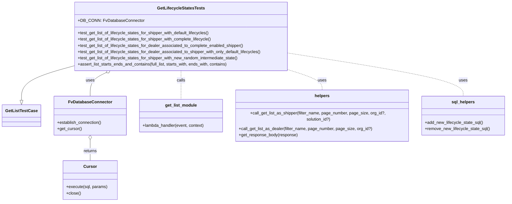
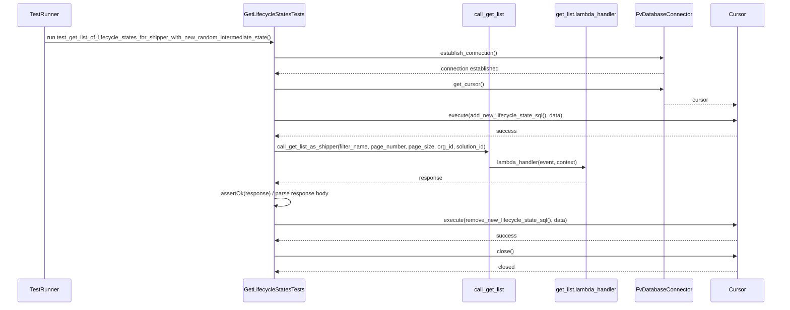

# Diagram: entity_core/entity_search/tests/integration_tests/test_get_list_lifecycle_states.py

> Auto-generated by Obscura crawlers

## Diagram 1

### SVG

<svg id="container" width="1942.3515625" xmlns="http://www.w3.org/2000/svg" class="classDiagram" height="752" viewBox="0 0 1942.3515625 752" role="graphics-document document" aria-roledescription="class"><g><defs><marker id="container_class-aggregationStart" class="marker aggregation class" refX="18" refY="7" markerWidth="190" markerHeight="240" orient="auto"><path d="M 18,7 L9,13 L1,7 L9,1 Z"></path></marker></defs><defs><marker id="container_class-aggregationEnd" class="marker aggregation class" refX="1" refY="7" markerWidth="20" markerHeight="28" orient="auto"><path d="M 18,7 L9,13 L1,7 L9,1 Z"></path></marker></defs><defs><marker id="container_class-extensionStart" class="marker extension class" refX="18" refY="7" markerWidth="190" markerHeight="240" orient="auto"><path d="M 1,7 L18,13 V 1 Z"></path></marker></defs><defs><marker id="container_class-extensionEnd" class="marker extension class" refX="1" refY="7" markerWidth="20" markerHeight="28" orient="auto"><path d="M 1,1 V 13 L18,7 Z"></path></marker></defs><defs><marker id="container_class-compositionStart" class="marker composition class" refX="18" refY="7" markerWidth="190" markerHeight="240" orient="auto"><path d="M 18,7 L9,13 L1,7 L9,1 Z"></path></marker></defs><defs><marker id="container_class-compositionEnd" class="marker composition class" refX="1" refY="7" markerWidth="20" markerHeight="28" orient="auto"><path d="M 18,7 L9,13 L1,7 L9,1 Z"></path></marker></defs><defs><marker id="container_class-dependencyStart" class="marker dependency class" refX="6" refY="7" markerWidth="190" markerHeight="240" orient="auto"><path d="M 5,7 L9,13 L1,7 L9,1 Z"></path></marker></defs><defs><marker id="container_class-dependencyEnd" class="marker dependency class" refX="13" refY="7" markerWidth="20" markerHeight="28" orient="auto"><path d="M 18,7 L9,13 L14,7 L9,1 Z"></path></marker></defs><defs><marker id="container_class-lollipopStart" class="marker lollipop class" refX="13" refY="7" markerWidth="190" markerHeight="240" orient="auto"><circle stroke="black" fill="transparent" cx="7" cy="7" r="6"></circle></marker></defs><defs><marker id="container_class-lollipopEnd" class="marker lollipop class" refX="1" refY="7" markerWidth="190" markerHeight="240" orient="auto"><circle stroke="black" fill="transparent" cx="7" cy="7" r="6"></circle></marker></defs><g class="root"><g class="clusters"></g><g class="edgePaths"><path d="M275.441,254.26L242.589,263.384C209.737,272.507,144.033,290.753,111.18,310.668C78.328,330.583,78.328,352.167,78.328,362.958L78.328,373.75" id="id_GetLifecycleStatesTests_GetListTestCase_1" class="edge-thickness-normal edge-pattern-solid relation" style=";;;" data-edge="true" data-et="edge" data-id="id_GetLifecycleStatesTests_GetListTestCase_1" data-points="W3sieCI6Mjc1LjQ0MTQwNjI1LCJ5IjoyNTQuMjYwMjI4NTEyNzQxNX0seyJ4Ijo3OC4zMjgxMjUsInkiOjMwOX0seyJ4Ijo3OC4zMjgxMjUsInkiOjM5MX1d" marker-end="url(#container_class-extensionEnd)"></path><path d="M398.022,279.502L387.842,284.418C377.662,289.334,357.302,299.167,347.122,312.25C336.941,325.333,336.941,341.667,336.941,349.833L336.941,358" id="id_GetLifecycleStatesTests_FvDatabaseConnector_2" class="edge-thickness-normal edge-pattern-solid relation" style=";;;" data-edge="true" data-et="edge" data-id="id_GetLifecycleStatesTests_FvDatabaseConnector_2" data-points="W3sieCI6NDEzLjU1NTc5Njk2NzQ1NTY1LCJ5IjoyNzJ9LHsieCI6MzM2Ljk0MTQwNjI1LCJ5IjozMDl9LHsieCI6MzM2Ljk0MTQwNjI1LCJ5IjozNTh9XQ==" marker-start="url(#container_class-aggregationStart)"></path><path d="M336.941,525.25L336.941,530.542C336.941,535.833,336.941,546.417,336.941,557.875C336.941,569.333,336.941,581.667,336.941,587.833L336.941,594" id="id_FvDatabaseConnector_Cursor_3" class="edge-thickness-normal edge-pattern-solid relation" style=";;;" data-edge="true" data-et="edge" data-id="id_FvDatabaseConnector_Cursor_3" data-points="W3sieCI6MzM2Ljk0MTQwNjI1LCJ5Ijo1MDh9LHsieCI6MzM2Ljk0MTQwNjI1LCJ5Ijo1NTd9LHsieCI6MzM2Ljk0MTQwNjI1LCJ5Ijo1OTR9XQ==" marker-start="url(#container_class-aggregationStart)"></path><path d="M686.883,272L686.883,278.167C686.883,284.333,686.883,296.667,686.883,313C686.883,329.333,686.883,349.667,686.883,359.833L686.883,370" id="id_GetLifecycleStatesTests_get_list_module_4" class="edge-thickness-normal edge-pattern-dashed relation" style=";;;" data-edge="true" data-et="edge" data-id="id_GetLifecycleStatesTests_get_list_module_4" data-points="W3sieCI6Njg2Ljg4MjgxMjUsInkiOjI3Mn0seyJ4Ijo2ODYuODgyODEyNSwieSI6MzA5fSx7IngiOjY4Ni44ODI4MTI1LCJ5IjozNzB9XQ=="></path><path d="M1098.324,267.437L1120.689,274.364C1143.055,281.291,1187.785,295.146,1210.15,308.239C1232.516,321.333,1232.516,333.667,1232.516,339.833L1232.516,346" id="id_GetLifecycleStatesTests_helpers_5" class="edge-thickness-normal edge-pattern-dashed relation" style=";;;" data-edge="true" data-et="edge" data-id="id_GetLifecycleStatesTests_helpers_5" data-points="W3sieCI6MTA5OC4zMjQyMTg3NSwieSI6MjY3LjQzNjYxMzE2NDE4NzI0fSx7IngiOjEyMzIuNTE1NjI1LCJ5IjozMDl9LHsieCI6MTIzMi41MTU2MjUsInkiOjM0Nn1d"></path><path d="M1098.324,203.878L1211.174,221.398C1324.023,238.919,1549.723,273.959,1662.572,299.646C1775.422,325.333,1775.422,341.667,1775.422,349.833L1775.422,358" id="id_GetLifecycleStatesTests_sql_helpers_6" class="edge-thickness-normal edge-pattern-dashed relation" style=";;;" data-edge="true" data-et="edge" data-id="id_GetLifecycleStatesTests_sql_helpers_6" data-points="W3sieCI6MTA5OC4zMjQyMTg3NSwieSI6MjAzLjg3NzkwNzYwMjY0OTc3fSx7IngiOjE3NzUuNDIxODc1LCJ5IjozMDl9LHsieCI6MTc3NS40MjE4NzUsInkiOjM1OH1d"></path></g><g class="edgeLabels"><g class="edgeLabel"><g class="label" data-id="id_GetLifecycleStatesTests_GetListTestCase_1" transform="translate(0, 0)"><foreignObject width="0" height="0">

</foreignObject></g></g><g class="edgeLabel" transform="translate(336.94140625, 309)"><g class="label" data-id="id_GetLifecycleStatesTests_FvDatabaseConnector_2" transform="translate(-16.4921875, -12)"><foreignObject width="32.984375" height="24">

uses

</foreignObject></g></g><g class="edgeLabel" transform="translate(336.94140625, 557)"><g class="label" data-id="id_FvDatabaseConnector_Cursor_3" transform="translate(-26.265625, -12)"><foreignObject width="52.53125" height="24">

returns

</foreignObject></g></g><g class="edgeLabel" transform="translate(686.8828125, 309)"><g class="label" data-id="id_GetLifecycleStatesTests_get_list_module_4" transform="translate(-16.4453125, -12)"><foreignObject width="32.890625" height="24">

calls

</foreignObject></g></g><g class="edgeLabel" transform="translate(1232.515625, 309)"><g class="label" data-id="id_GetLifecycleStatesTests_helpers_5" transform="translate(-16.4921875, -12)"><foreignObject width="32.984375" height="24">

uses

</foreignObject></g></g><g class="edgeLabel" transform="translate(1775.421875, 309)"><g class="label" data-id="id_GetLifecycleStatesTests_sql_helpers_6" transform="translate(-16.4921875, -12)"><foreignObject width="32.984375" height="24">

uses

</foreignObject></g></g></g><g class="nodes"><g class="node default" id="classId-GetLifecycleStatesTests-0" transform="translate(686.8828125, 140)"><g class="basic label-container"><path d="M-411.44140625 -132 L411.44140625 -132 L411.44140625 132 L-411.44140625 132" stroke="none" stroke-width="0" fill="#ECECFF" style=""></path><path d="M-411.44140625 -132 C-134.82765530651778 -132, 141.78609563696443 -132, 411.44140625 -132 M-411.44140625 -132 C-169.97165352243258 -132, 71.49809920513485 -132, 411.44140625 -132 M411.44140625 -132 C411.44140625 -64.20172802356818, 411.44140625 3.596543952863641, 411.44140625 132 M411.44140625 -132 C411.44140625 -29.3469678765005, 411.44140625 73.306064246999, 411.44140625 132 M411.44140625 132 C210.09491119221173 132, 8.74841613442345 132, -411.44140625 132 M411.44140625 132 C241.61184664118107 132, 71.78228703236215 132, -411.44140625 132 M-411.44140625 132 C-411.44140625 40.14598808442777, -411.44140625 -51.70802383114446, -411.44140625 -132 M-411.44140625 132 C-411.44140625 71.20736234082817, -411.44140625 10.414724681656338, -411.44140625 -132" stroke="#9370DB" stroke-width="1.3" fill="none" stroke-dasharray="0 0" style=""></path></g><g class="annotation-group text" transform="translate(0, -108)"></g><g class="label-group text" transform="translate(-86.9921875, -108)"><g class="label" style="font-weight: bolder" transform="translate(0,-12)"><foreignObject width="173.984375" height="24">

GetLifecycleStatesTests

</foreignObject></g></g><g class="members-group text" transform="translate(-399.44140625, -60)"><g class="label" style="" transform="translate(0,-12)"><foreignObject width="241.65625" height="24">

+DB_CONN: FvDatabaseConnector

</foreignObject></g></g><g class="methods-group text" transform="translate(-399.44140625, -12)"><g class="label" style="" transform="translate(0,-12)"><foreignObject width="512.4375" height="24">

+test_get_list_of_lifecycle_states_for_shipper_with_default_lifecycles()

</foreignObject></g><g class="label" style="" transform="translate(0,12)"><foreignObject width="520.34375" height="24">

+test_get_list_of_lifecycle_states_for_shipper_with_complete_lifecycle()

</foreignObject></g><g class="label" style="" transform="translate(0,36)"><foreignObject width="642.796875" height="24">

+test_get_list_of_lifecycle_states_for_dealer_associated_to_complete_enabled_shipper()

</foreignObject></g><g class="label" style="" transform="translate(0,60)"><foreignObject width="711.890625" height="24">

+test_get_list_of_lifecycle_states_for_dealer_associated_to_shipper_with_only_default_lifecycles()

</foreignObject></g><g class="label" style="" transform="translate(0,84)"><foreignObject width="625.890625" height="24">

+test_get_list_of_lifecycle_states_for_shipper_with_new_random_intermediate_state()

</foreignObject></g><g class="label" style="" transform="translate(0,108)"><foreignObject width="585" height="24">

+assert_list_starts_ends_and_contains(full_list, starts_with, ends_with, contains)

</foreignObject></g></g><g class="divider" style=""><path d="M-411.44140625 -84 C-83.75350042733243 -84, 243.93440539533515 -84, 411.44140625 -84 M-411.44140625 -84 C-173.50936485295267 -84, 64.42267654409466 -84, 411.44140625 -84" stroke="#9370DB" stroke-width="1.3" fill="none" stroke-dasharray="0 0" style=""></path></g><g class="divider" style=""><path d="M-411.44140625 -36 C-231.2535243359034 -36, -51.065642421806785 -36, 411.44140625 -36 M-411.44140625 -36 C-168.88791546681952 -36, 73.66557531636096 -36, 411.44140625 -36" stroke="#9370DB" stroke-width="1.3" fill="none" stroke-dasharray="0 0" style=""></path></g></g><g class="node default" id="classId-GetListTestCase-1" transform="translate(78.328125, 433)"><g class="basic label-container"><path d="M-70.328125 -42 L70.328125 -42 L70.328125 42 L-70.328125 42" stroke="none" stroke-width="0" fill="#ECECFF" style=""></path><path d="M-70.328125 -42 C-29.611922558751914 -42, 11.104279882496172 -42, 70.328125 -42 M-70.328125 -42 C-22.991123702947313 -42, 24.345877594105374 -42, 70.328125 -42 M70.328125 -42 C70.328125 -17.712257235476518, 70.328125 6.575485529046965, 70.328125 42 M70.328125 -42 C70.328125 -24.427852176818096, 70.328125 -6.855704353636192, 70.328125 42 M70.328125 42 C23.07034935614731 42, -24.187426287705378 42, -70.328125 42 M70.328125 42 C32.96139440887947 42, -4.405336182241058 42, -70.328125 42 M-70.328125 42 C-70.328125 11.462093565951733, -70.328125 -19.075812868096534, -70.328125 -42 M-70.328125 42 C-70.328125 14.076102340359299, -70.328125 -13.847795319281403, -70.328125 -42" stroke="#9370DB" stroke-width="1.3" fill="none" stroke-dasharray="0 0" style=""></path></g><g class="annotation-group text" transform="translate(0, -18)"></g><g class="label-group text" transform="translate(-58.328125, -18)"><g class="label" style="font-weight: bolder" transform="translate(0,-12)"><foreignObject width="116.65625" height="24">

GetListTestCase

</foreignObject></g></g><g class="members-group text" transform="translate(-58.328125, 30)"></g><g class="methods-group text" transform="translate(-58.328125, 60)"></g><g class="divider" style=""><path d="M-70.328125 6 C-25.796685893030016 6, 18.734753213939968 6, 70.328125 6 M-70.328125 6 C-17.007128510604723 6, 36.313867978790555 6, 70.328125 6" stroke="#9370DB" stroke-width="1.3" fill="none" stroke-dasharray="0 0" style=""></path></g><g class="divider" style=""><path d="M-70.328125 24 C-20.22121382003676 24, 29.885697359926482 24, 70.328125 24 M-70.328125 24 C-16.518536559995837 24, 37.291051880008325 24, 70.328125 24" stroke="#9370DB" stroke-width="1.3" fill="none" stroke-dasharray="0 0" style=""></path></g></g><g class="node default" id="classId-FvDatabaseConnector-2" transform="translate(336.94140625, 433)"><g class="basic label-container"><path d="M-138.28515625 -75 L138.28515625 -75 L138.28515625 75 L-138.28515625 75" stroke="none" stroke-width="0" fill="#ECECFF" style=""></path><path d="M-138.28515625 -75 C-65.76759209091198 -75, 6.749972068176049 -75, 138.28515625 -75 M-138.28515625 -75 C-44.64202984527955 -75, 49.001096559440896 -75, 138.28515625 -75 M138.28515625 -75 C138.28515625 -19.669227135000817, 138.28515625 35.661545729998366, 138.28515625 75 M138.28515625 -75 C138.28515625 -34.638478688012846, 138.28515625 5.723042623974308, 138.28515625 75 M138.28515625 75 C58.125635763623634 75, -22.03388472275273 75, -138.28515625 75 M138.28515625 75 C60.24918897602667 75, -17.786778297946654 75, -138.28515625 75 M-138.28515625 75 C-138.28515625 40.081480523592774, -138.28515625 5.162961047185547, -138.28515625 -75 M-138.28515625 75 C-138.28515625 43.636929346837604, -138.28515625 12.273858693675201, -138.28515625 -75" stroke="#9370DB" stroke-width="1.3" fill="none" stroke-dasharray="0 0" style=""></path></g><g class="annotation-group text" transform="translate(0, -51)"></g><g class="label-group text" transform="translate(-79.3046875, -51)"><g class="label" style="font-weight: bolder" transform="translate(0,-12)"><foreignObject width="158.609375" height="24">

FvDatabaseConnector

</foreignObject></g></g><g class="members-group text" transform="translate(-126.28515625, -3)"></g><g class="methods-group text" transform="translate(-126.28515625, 27)"><g class="label" style="" transform="translate(0,-12)"><foreignObject width="173.265625" height="24">

+establish_connection()

</foreignObject></g><g class="label" style="" transform="translate(0,12)"><foreignObject width="94.640625" height="24">

+get_cursor()

</foreignObject></g></g><g class="divider" style=""><path d="M-138.28515625 -27 C-47.08128511520319 -27, 44.122586019593626 -27, 138.28515625 -27 M-138.28515625 -27 C-78.36877040374911 -27, -18.45238455749822 -27, 138.28515625 -27" stroke="#9370DB" stroke-width="1.3" fill="none" stroke-dasharray="0 0" style=""></path></g><g class="divider" style=""><path d="M-138.28515625 -3 C-33.18605339512045 -3, 71.9130494597591 -3, 138.28515625 -3 M-138.28515625 -3 C-75.05289858352081 -3, -11.82064091704163 -3, 138.28515625 -3" stroke="#9370DB" stroke-width="1.3" fill="none" stroke-dasharray="0 0" style=""></path></g></g><g class="node default" id="classId-Cursor-3" transform="translate(336.94140625, 669)"><g class="basic label-container"><path d="M-102.828125 -75 L102.828125 -75 L102.828125 75 L-102.828125 75" stroke="none" stroke-width="0" fill="#ECECFF" style=""></path><path d="M-102.828125 -75 C-61.12479291620162 -75, -19.42146083240324 -75, 102.828125 -75 M-102.828125 -75 C-60.98520214947663 -75, -19.142279298953255 -75, 102.828125 -75 M102.828125 -75 C102.828125 -18.131410016971934, 102.828125 38.73717996605613, 102.828125 75 M102.828125 -75 C102.828125 -29.67294528110009, 102.828125 15.654109437799818, 102.828125 75 M102.828125 75 C31.162035336651826 75, -40.50405432669635 75, -102.828125 75 M102.828125 75 C49.00815888673202 75, -4.8118072265359615 75, -102.828125 75 M-102.828125 75 C-102.828125 23.44485306383003, -102.828125 -28.110293872339938, -102.828125 -75 M-102.828125 75 C-102.828125 22.864355935327765, -102.828125 -29.27128812934447, -102.828125 -75" stroke="#9370DB" stroke-width="1.3" fill="none" stroke-dasharray="0 0" style=""></path></g><g class="annotation-group text" transform="translate(0, -51)"></g><g class="label-group text" transform="translate(-23.90625, -51)"><g class="label" style="font-weight: bolder" transform="translate(0,-12)"><foreignObject width="47.8125" height="24">

Cursor

</foreignObject></g></g><g class="members-group text" transform="translate(-90.828125, -3)"></g><g class="methods-group text" transform="translate(-90.828125, 27)"><g class="label" style="" transform="translate(0,-12)"><foreignObject width="157.75" height="24">

+execute(sql, params)

</foreignObject></g><g class="label" style="" transform="translate(0,12)"><foreignObject width="56.15625" height="24">

+close()

</foreignObject></g></g><g class="divider" style=""><path d="M-102.828125 -27 C-60.159823936287424 -27, -17.491522872574848 -27, 102.828125 -27 M-102.828125 -27 C-50.07046237848023 -27, 2.687200243039541 -27, 102.828125 -27" stroke="#9370DB" stroke-width="1.3" fill="none" stroke-dasharray="0 0" style=""></path></g><g class="divider" style=""><path d="M-102.828125 -3 C-35.16481290342365 -3, 32.498499193152696 -3, 102.828125 -3 M-102.828125 -3 C-44.83731742082102 -3, 13.153490158357954 -3, 102.828125 -3" stroke="#9370DB" stroke-width="1.3" fill="none" stroke-dasharray="0 0" style=""></path></g></g><g class="node default" id="classId-get_list_module-4" transform="translate(686.8828125, 433)"><g class="basic label-container"><path d="M-161.65625 -63 L161.65625 -63 L161.65625 63 L-161.65625 63" stroke="none" stroke-width="0" fill="#ECECFF" style=""></path><path d="M-161.65625 -63 C-39.53296424436333 -63, 82.59032151127334 -63, 161.65625 -63 M-161.65625 -63 C-34.0518495483133 -63, 93.5525509033734 -63, 161.65625 -63 M161.65625 -63 C161.65625 -33.444202562725984, 161.65625 -3.8884051254519676, 161.65625 63 M161.65625 -63 C161.65625 -24.09400806088817, 161.65625 14.811983878223657, 161.65625 63 M161.65625 63 C48.6574005025208 63, -64.3414489949584 63, -161.65625 63 M161.65625 63 C54.995219965301615 63, -51.66581006939677 63, -161.65625 63 M-161.65625 63 C-161.65625 29.62431138045889, -161.65625 -3.751377239082217, -161.65625 -63 M-161.65625 63 C-161.65625 19.036288979204812, -161.65625 -24.927422041590376, -161.65625 -63" stroke="#9370DB" stroke-width="1.3" fill="none" stroke-dasharray="0 0" style=""></path></g><g class="annotation-group text" transform="translate(0, -39)"></g><g class="label-group text" transform="translate(-59.125, -39)"><g class="label" style="font-weight: bolder" transform="translate(0,-12)"><foreignObject width="118.25" height="24">

get_list_module

</foreignObject></g></g><g class="members-group text" transform="translate(-149.65625, 9)"></g><g class="methods-group text" transform="translate(-149.65625, 39)"><g class="label" style="" transform="translate(0,-12)"><foreignObject width="240.1875" height="24">

+lambda_handler(event, context)

</foreignObject></g></g><g class="divider" style=""><path d="M-161.65625 -15 C-79.29989250118896 -15, 3.056464997622072 -15, 161.65625 -15 M-161.65625 -15 C-55.34498970153439 -15, 50.966270596931224 -15, 161.65625 -15" stroke="#9370DB" stroke-width="1.3" fill="none" stroke-dasharray="0 0" style=""></path></g><g class="divider" style=""><path d="M-161.65625 9 C-59.3127486475625 9, 43.030752704875 9, 161.65625 9 M-161.65625 9 C-63.13333293004206 9, 35.38958413991588 9, 161.65625 9" stroke="#9370DB" stroke-width="1.3" fill="none" stroke-dasharray="0 0" style=""></path></g></g><g class="node default" id="classId-helpers-5" transform="translate(1232.515625, 433)"><g class="basic label-container"><path d="M-333.9765625 -87 L333.9765625 -87 L333.9765625 87 L-333.9765625 87" stroke="none" stroke-width="0" fill="#ECECFF" style=""></path><path d="M-333.9765625 -87 C-196.63585355625816 -87, -59.29514461251631 -87, 333.9765625 -87 M-333.9765625 -87 C-121.72049972278586 -87, 90.53556305442828 -87, 333.9765625 -87 M333.9765625 -87 C333.9765625 -28.691929520752026, 333.9765625 29.616140958495947, 333.9765625 87 M333.9765625 -87 C333.9765625 -43.143768492468425, 333.9765625 0.7124630150631504, 333.9765625 87 M333.9765625 87 C154.72217911130397 87, -24.532204277392054 87, -333.9765625 87 M333.9765625 87 C132.4628615893278 87, -69.05083932134443 87, -333.9765625 87 M-333.9765625 87 C-333.9765625 48.76338874310645, -333.9765625 10.526777486212893, -333.9765625 -87 M-333.9765625 87 C-333.9765625 50.36093008600885, -333.9765625 13.7218601720177, -333.9765625 -87" stroke="#9370DB" stroke-width="1.3" fill="none" stroke-dasharray="0 0" style=""></path></g><g class="annotation-group text" transform="translate(0, -63)"></g><g class="label-group text" transform="translate(-27.578125, -63)"><g class="label" style="font-weight: bolder" transform="translate(0,-12)"><foreignObject width="55.15625" height="24">

helpers

</foreignObject></g></g><g class="members-group text" transform="translate(-321.9765625, -15)"></g><g class="methods-group text" transform="translate(-321.9765625, 15)"><g class="label" style="" transform="translate(0,-12)"><foreignObject width="616.375" height="24">

+call_get_list_as_shipper(filter_name, page_number, page_size, org_id?, solution_id?)

</foreignObject></g><g class="label" style="" transform="translate(0,12)"><foreignObject width="510.921875" height="24">

+call_get_list_as_dealer(filter_name, page_number, page_size, org_id?)

</foreignObject></g><g class="label" style="" transform="translate(0,36)"><foreignObject width="226.140625" height="24">

+get_response_body(response)

</foreignObject></g></g><g class="divider" style=""><path d="M-333.9765625 -39 C-131.94869858442436 -39, 70.07916533115127 -39, 333.9765625 -39 M-333.9765625 -39 C-130.8076711393404 -39, 72.36122022131917 -39, 333.9765625 -39" stroke="#9370DB" stroke-width="1.3" fill="none" stroke-dasharray="0 0" style=""></path></g><g class="divider" style=""><path d="M-333.9765625 -15 C-137.67208178216927 -15, 58.632398935661456 -15, 333.9765625 -15 M-333.9765625 -15 C-98.38544703437779 -15, 137.20566843124442 -15, 333.9765625 -15" stroke="#9370DB" stroke-width="1.3" fill="none" stroke-dasharray="0 0" style=""></path></g></g><g class="node default" id="classId-sql_helpers-6" transform="translate(1775.421875, 433)"><g class="basic label-container"><path d="M-158.9296875 -75 L158.9296875 -75 L158.9296875 75 L-158.9296875 75" stroke="none" stroke-width="0" fill="#ECECFF" style=""></path><path d="M-158.9296875 -75 C-47.91346243748244 -75, 63.102762625035126 -75, 158.9296875 -75 M-158.9296875 -75 C-33.942678603009156 -75, 91.04433029398169 -75, 158.9296875 -75 M158.9296875 -75 C158.9296875 -44.4444521742727, 158.9296875 -13.888904348545402, 158.9296875 75 M158.9296875 -75 C158.9296875 -27.360973690325842, 158.9296875 20.278052619348315, 158.9296875 75 M158.9296875 75 C67.34690380994316 75, -24.235879880113686 75, -158.9296875 75 M158.9296875 75 C80.10295141589854 75, 1.27621533179709 75, -158.9296875 75 M-158.9296875 75 C-158.9296875 41.29192326462565, -158.9296875 7.5838465292513035, -158.9296875 -75 M-158.9296875 75 C-158.9296875 24.105001015610014, -158.9296875 -26.78999796877997, -158.9296875 -75" stroke="#9370DB" stroke-width="1.3" fill="none" stroke-dasharray="0 0" style=""></path></g><g class="annotation-group text" transform="translate(0, -51)"></g><g class="label-group text" transform="translate(-42.78125, -51)"><g class="label" style="font-weight: bolder" transform="translate(0,-12)"><foreignObject width="85.5625" height="24">

sql_helpers

</foreignObject></g></g><g class="members-group text" transform="translate(-146.9296875, -3)"></g><g class="methods-group text" transform="translate(-146.9296875, 27)"><g class="label" style="" transform="translate(0,-12)"><foreignObject width="225.0625" height="24">

+add_new_lifecycle_state_sql()

</foreignObject></g><g class="label" style="" transform="translate(0,12)"><foreignObject width="251.078125" height="24">

+remove_new_lifecycle_state_sql()

</foreignObject></g></g><g class="divider" style=""><path d="M-158.9296875 -27 C-41.95238648798164 -27, 75.02491452403672 -27, 158.9296875 -27 M-158.9296875 -27 C-38.040561046086765 -27, 82.84856540782647 -27, 158.9296875 -27" stroke="#9370DB" stroke-width="1.3" fill="none" stroke-dasharray="0 0" style=""></path></g><g class="divider" style=""><path d="M-158.9296875 -3 C-34.94587084230018 -3, 89.03794581539964 -3, 158.9296875 -3 M-158.9296875 -3 C-34.66764797809775 -3, 89.5943915438045 -3, 158.9296875 -3" stroke="#9370DB" stroke-width="1.3" fill="none" stroke-dasharray="0 0" style=""></path></g></g></g></g></g></svg>

## Diagram 2

### SVG

<svg id="container" width="2385" xmlns="http://www.w3.org/2000/svg" height="921" viewBox="-50 -10 2385 921" role="graphics-document document" aria-roledescription="sequence"><g><rect x="2135" y="835" fill="#eaeaea" stroke="#666" width="150" height="65" name="Cursor" rx="3" ry="3" class="actor actor-bottom"></rect><text x="2210" y="867.5" dominant-baseline="central" alignment-baseline="central" class="actor actor-box" style="text-anchor: middle; font-size: 16px; font-weight: 400;"><tspan x="2210" dy="0">Cursor</tspan></text></g><g><rect x="1908" y="835" fill="#eaeaea" stroke="#666" width="177" height="65" name="DB" rx="3" ry="3" class="actor actor-bottom"></rect><text x="1996.5" y="867.5" dominant-baseline="central" alignment-baseline="central" class="actor actor-box" style="text-anchor: middle; font-size: 16px; font-weight: 400;"><tspan x="1996.5" dy="0">FvDatabaseConnector</tspan></text></g><g><rect x="1660" y="835" fill="#eaeaea" stroke="#666" width="198" height="65" name="Lambda" rx="3" ry="3" class="actor actor-bottom"></rect><text x="1759" y="867.5" dominant-baseline="central" alignment-baseline="central" class="actor actor-box" style="text-anchor: middle; font-size: 16px; font-weight: 400;"><tspan x="1759" dy="0">get_list.lambda_handler</tspan></text></g><g><rect x="1382" y="835" fill="#eaeaea" stroke="#666" width="150" height="65" name="Helpers" rx="3" ry="3" class="actor actor-bottom"></rect><text x="1457" y="867.5" dominant-baseline="central" alignment-baseline="central" class="actor actor-box" style="text-anchor: middle; font-size: 16px; font-weight: 400;"><tspan x="1457" dy="0">call_get_list</tspan></text></g><g><rect x="697.5" y="835" fill="#eaeaea" stroke="#666" width="189" height="65" name="Tests" rx="3" ry="3" class="actor actor-bottom"></rect><text x="792" y="867.5" dominant-baseline="central" alignment-baseline="central" class="actor actor-box" style="text-anchor: middle; font-size: 16px; font-weight: 400;"><tspan x="792" dy="0">GetLifecycleStatesTests</tspan></text></g><g><rect x="0" y="835" fill="#eaeaea" stroke="#666" width="150" height="65" name="TestRunner" rx="3" ry="3" class="actor actor-bottom"></rect><text x="75" y="867.5" dominant-baseline="central" alignment-baseline="central" class="actor actor-box" style="text-anchor: middle; font-size: 16px; font-weight: 400;"><tspan x="75" dy="0">TestRunner</tspan></text></g><g><line id="actor5" x1="2210" y1="65" x2="2210" y2="835" class="actor-line 200" stroke-width="0.5px" stroke="#999" name="Cursor"></line><g id="root-5"><rect x="2135" y="0" fill="#eaeaea" stroke="#666" width="150" height="65" name="Cursor" rx="3" ry="3" class="actor actor-top"></rect><text x="2210" y="32.5" dominant-baseline="central" alignment-baseline="central" class="actor actor-box" style="text-anchor: middle; font-size: 16px; font-weight: 400;"><tspan x="2210" dy="0">Cursor</tspan></text></g></g><g><line id="actor4" x1="1996.5" y1="65" x2="1996.5" y2="835" class="actor-line 200" stroke-width="0.5px" stroke="#999" name="DB"></line><g id="root-4"><rect x="1908" y="0" fill="#eaeaea" stroke="#666" width="177" height="65" name="DB" rx="3" ry="3" class="actor actor-top"></rect><text x="1996.5" y="32.5" dominant-baseline="central" alignment-baseline="central" class="actor actor-box" style="text-anchor: middle; font-size: 16px; font-weight: 400;"><tspan x="1996.5" dy="0">FvDatabaseConnector</tspan></text></g></g><g><line id="actor3" x1="1759" y1="65" x2="1759" y2="835" class="actor-line 200" stroke-width="0.5px" stroke="#999" name="Lambda"></line><g id="root-3"><rect x="1660" y="0" fill="#eaeaea" stroke="#666" width="198" height="65" name="Lambda" rx="3" ry="3" class="actor actor-top"></rect><text x="1759" y="32.5" dominant-baseline="central" alignment-baseline="central" class="actor actor-box" style="text-anchor: middle; font-size: 16px; font-weight: 400;"><tspan x="1759" dy="0">get_list.lambda_handler</tspan></text></g></g><g><line id="actor2" x1="1457" y1="65" x2="1457" y2="835" class="actor-line 200" stroke-width="0.5px" stroke="#999" name="Helpers"></line><g id="root-2"><rect x="1382" y="0" fill="#eaeaea" stroke="#666" width="150" height="65" name="Helpers" rx="3" ry="3" class="actor actor-top"></rect><text x="1457" y="32.5" dominant-baseline="central" alignment-baseline="central" class="actor actor-box" style="text-anchor: middle; font-size: 16px; font-weight: 400;"><tspan x="1457" dy="0">call_get_list</tspan></text></g></g><g><line id="actor1" x1="792" y1="65" x2="792" y2="835" class="actor-line 200" stroke-width="0.5px" stroke="#999" name="Tests"></line><g id="root-1"><rect x="697.5" y="0" fill="#eaeaea" stroke="#666" width="189" height="65" name="Tests" rx="3" ry="3" class="actor actor-top"></rect><text x="792" y="32.5" dominant-baseline="central" alignment-baseline="central" class="actor actor-box" style="text-anchor: middle; font-size: 16px; font-weight: 400;"><tspan x="792" dy="0">GetLifecycleStatesTests</tspan></text></g></g><g><line id="actor0" x1="75" y1="65" x2="75" y2="835" class="actor-line 200" stroke-width="0.5px" stroke="#999" name="TestRunner"></line><g id="root-0"><rect x="0" y="0" fill="#eaeaea" stroke="#666" width="150" height="65" name="TestRunner" rx="3" ry="3" class="actor actor-top"></rect><text x="75" y="32.5" dominant-baseline="central" alignment-baseline="central" class="actor actor-box" style="text-anchor: middle; font-size: 16px; font-weight: 400;"><tspan x="75" dy="0">TestRunner</tspan></text></g></g><g></g><defs><symbol id="computer" width="24" height="24"><path transform="scale(.5)" d="M2 2v13h20v-13h-20zm18 11h-16v-9h16v9zm-10.228 6l.466-1h3.524l.467 1h-4.457zm14.228 3h-24l2-6h2.104l-1.33 4h18.45l-1.297-4h2.073l2 6zm-5-10h-14v-7h14v7z"></path></symbol></defs><defs><symbol id="database" fill-rule="evenodd" clip-rule="evenodd"><path transform="scale(.5)" d="M12.258.001l.256.004.255.005.253.008.251.01.249.012.247.015.246.016.242.019.241.02.239.023.236.024.233.027.231.028.229.031.225.032.223.034.22.036.217.038.214.04.211.041.208.043.205.045.201.046.198.048.194.05.191.051.187.053.183.054.18.056.175.057.172.059.168.06.163.061.16.063.155.064.15.066.074.033.073.033.071.034.07.034.069.035.068.035.067.035.066.035.064.036.064.036.062.036.06.036.06.037.058.037.058.037.055.038.055.038.053.038.052.038.051.039.05.039.048.039.047.039.045.04.044.04.043.04.041.04.04.041.039.041.037.041.036.041.034.041.033.042.032.042.03.042.029.042.027.042.026.043.024.043.023.043.021.043.02.043.018.044.017.043.015.044.013.044.012.044.011.045.009.044.007.045.006.045.004.045.002.045.001.045v17l-.001.045-.002.045-.004.045-.006.045-.007.045-.009.044-.011.045-.012.044-.013.044-.015.044-.017.043-.018.044-.02.043-.021.043-.023.043-.024.043-.026.043-.027.042-.029.042-.03.042-.032.042-.033.042-.034.041-.036.041-.037.041-.039.041-.04.041-.041.04-.043.04-.044.04-.045.04-.047.039-.048.039-.05.039-.051.039-.052.038-.053.038-.055.038-.055.038-.058.037-.058.037-.06.037-.06.036-.062.036-.064.036-.064.036-.066.035-.067.035-.068.035-.069.035-.07.034-.071.034-.073.033-.074.033-.15.066-.155.064-.16.063-.163.061-.168.06-.172.059-.175.057-.18.056-.183.054-.187.053-.191.051-.194.05-.198.048-.201.046-.205.045-.208.043-.211.041-.214.04-.217.038-.22.036-.223.034-.225.032-.229.031-.231.028-.233.027-.236.024-.239.023-.241.02-.242.019-.246.016-.247.015-.249.012-.251.01-.253.008-.255.005-.256.004-.258.001-.258-.001-.256-.004-.255-.005-.253-.008-.251-.01-.249-.012-.247-.015-.245-.016-.243-.019-.241-.02-.238-.023-.236-.024-.234-.027-.231-.028-.228-.031-.226-.032-.223-.034-.22-.036-.217-.038-.214-.04-.211-.041-.208-.043-.204-.045-.201-.046-.198-.048-.195-.05-.19-.051-.187-.053-.184-.054-.179-.056-.176-.057-.172-.059-.167-.06-.164-.061-.159-.063-.155-.064-.151-.066-.074-.033-.072-.033-.072-.034-.07-.034-.069-.035-.068-.035-.067-.035-.066-.035-.064-.036-.063-.036-.062-.036-.061-.036-.06-.037-.058-.037-.057-.037-.056-.038-.055-.038-.053-.038-.052-.038-.051-.039-.049-.039-.049-.039-.046-.039-.046-.04-.044-.04-.043-.04-.041-.04-.04-.041-.039-.041-.037-.041-.036-.041-.034-.041-.033-.042-.032-.042-.03-.042-.029-.042-.027-.042-.026-.043-.024-.043-.023-.043-.021-.043-.02-.043-.018-.044-.017-.043-.015-.044-.013-.044-.012-.044-.011-.045-.009-.044-.007-.045-.006-.045-.004-.045-.002-.045-.001-.045v-17l.001-.045.002-.045.004-.045.006-.045.007-.045.009-.044.011-.045.012-.044.013-.044.015-.044.017-.043.018-.044.02-.043.021-.043.023-.043.024-.043.026-.043.027-.042.029-.042.03-.042.032-.042.033-.042.034-.041.036-.041.037-.041.039-.041.04-.041.041-.04.043-.04.044-.04.046-.04.046-.039.049-.039.049-.039.051-.039.052-.038.053-.038.055-.038.056-.038.057-.037.058-.037.06-.037.061-.036.062-.036.063-.036.064-.036.066-.035.067-.035.068-.035.069-.035.07-.034.072-.034.072-.033.074-.033.151-.066.155-.064.159-.063.164-.061.167-.06.172-.059.176-.057.179-.056.184-.054.187-.053.19-.051.195-.05.198-.048.201-.046.204-.045.208-.043.211-.041.214-.04.217-.038.22-.036.223-.034.226-.032.228-.031.231-.028.234-.027.236-.024.238-.023.241-.02.243-.019.245-.016.247-.015.249-.012.251-.01.253-.008.255-.005.256-.004.258-.001.258.001zm-9.258 20.499v.01l.001.021.003.021.004.022.005.021.006.022.007.022.009.023.01.022.011.023.012.023.013.023.015.023.016.024.017.023.018.024.019.024.021.024.022.025.023.024.024.025.052.049.056.05.061.051.066.051.07.051.075.051.079.052.084.052.088.052.092.052.097.052.102.051.105.052.11.052.114.051.119.051.123.051.127.05.131.05.135.05.139.048.144.049.147.047.152.047.155.047.16.045.163.045.167.043.171.043.176.041.178.041.183.039.187.039.19.037.194.035.197.035.202.033.204.031.209.03.212.029.216.027.219.025.222.024.226.021.23.02.233.018.236.016.24.015.243.012.246.01.249.008.253.005.256.004.259.001.26-.001.257-.004.254-.005.25-.008.247-.011.244-.012.241-.014.237-.016.233-.018.231-.021.226-.021.224-.024.22-.026.216-.027.212-.028.21-.031.205-.031.202-.034.198-.034.194-.036.191-.037.187-.039.183-.04.179-.04.175-.042.172-.043.168-.044.163-.045.16-.046.155-.046.152-.047.148-.048.143-.049.139-.049.136-.05.131-.05.126-.05.123-.051.118-.052.114-.051.11-.052.106-.052.101-.052.096-.052.092-.052.088-.053.083-.051.079-.052.074-.052.07-.051.065-.051.06-.051.056-.05.051-.05.023-.024.023-.025.021-.024.02-.024.019-.024.018-.024.017-.024.015-.023.014-.024.013-.023.012-.023.01-.023.01-.022.008-.022.006-.022.006-.022.004-.022.004-.021.001-.021.001-.021v-4.127l-.077.055-.08.053-.083.054-.085.053-.087.052-.09.052-.093.051-.095.05-.097.05-.1.049-.102.049-.105.048-.106.047-.109.047-.111.046-.114.045-.115.045-.118.044-.12.043-.122.042-.124.042-.126.041-.128.04-.13.04-.132.038-.134.038-.135.037-.138.037-.139.035-.142.035-.143.034-.144.033-.147.032-.148.031-.15.03-.151.03-.153.029-.154.027-.156.027-.158.026-.159.025-.161.024-.162.023-.163.022-.165.021-.166.02-.167.019-.169.018-.169.017-.171.016-.173.015-.173.014-.175.013-.175.012-.177.011-.178.01-.179.008-.179.008-.181.006-.182.005-.182.004-.184.003-.184.002h-.37l-.184-.002-.184-.003-.182-.004-.182-.005-.181-.006-.179-.008-.179-.008-.178-.01-.176-.011-.176-.012-.175-.013-.173-.014-.172-.015-.171-.016-.17-.017-.169-.018-.167-.019-.166-.02-.165-.021-.163-.022-.162-.023-.161-.024-.159-.025-.157-.026-.156-.027-.155-.027-.153-.029-.151-.03-.15-.03-.148-.031-.146-.032-.145-.033-.143-.034-.141-.035-.14-.035-.137-.037-.136-.037-.134-.038-.132-.038-.13-.04-.128-.04-.126-.041-.124-.042-.122-.042-.12-.044-.117-.043-.116-.045-.113-.045-.112-.046-.109-.047-.106-.047-.105-.048-.102-.049-.1-.049-.097-.05-.095-.05-.093-.052-.09-.051-.087-.052-.085-.053-.083-.054-.08-.054-.077-.054v4.127zm0-5.654v.011l.001.021.003.021.004.021.005.022.006.022.007.022.009.022.01.022.011.023.012.023.013.023.015.024.016.023.017.024.018.024.019.024.021.024.022.024.023.025.024.024.052.05.056.05.061.05.066.051.07.051.075.052.079.051.084.052.088.052.092.052.097.052.102.052.105.052.11.051.114.051.119.052.123.05.127.051.131.05.135.049.139.049.144.048.147.048.152.047.155.046.16.045.163.045.167.044.171.042.176.042.178.04.183.04.187.038.19.037.194.036.197.034.202.033.204.032.209.03.212.028.216.027.219.025.222.024.226.022.23.02.233.018.236.016.24.014.243.012.246.01.249.008.253.006.256.003.259.001.26-.001.257-.003.254-.006.25-.008.247-.01.244-.012.241-.015.237-.016.233-.018.231-.02.226-.022.224-.024.22-.025.216-.027.212-.029.21-.03.205-.032.202-.033.198-.035.194-.036.191-.037.187-.039.183-.039.179-.041.175-.042.172-.043.168-.044.163-.045.16-.045.155-.047.152-.047.148-.048.143-.048.139-.05.136-.049.131-.05.126-.051.123-.051.118-.051.114-.052.11-.052.106-.052.101-.052.096-.052.092-.052.088-.052.083-.052.079-.052.074-.051.07-.052.065-.051.06-.05.056-.051.051-.049.023-.025.023-.024.021-.025.02-.024.019-.024.018-.024.017-.024.015-.023.014-.023.013-.024.012-.022.01-.023.01-.023.008-.022.006-.022.006-.022.004-.021.004-.022.001-.021.001-.021v-4.139l-.077.054-.08.054-.083.054-.085.052-.087.053-.09.051-.093.051-.095.051-.097.05-.1.049-.102.049-.105.048-.106.047-.109.047-.111.046-.114.045-.115.044-.118.044-.12.044-.122.042-.124.042-.126.041-.128.04-.13.039-.132.039-.134.038-.135.037-.138.036-.139.036-.142.035-.143.033-.144.033-.147.033-.148.031-.15.03-.151.03-.153.028-.154.028-.156.027-.158.026-.159.025-.161.024-.162.023-.163.022-.165.021-.166.02-.167.019-.169.018-.169.017-.171.016-.173.015-.173.014-.175.013-.175.012-.177.011-.178.009-.179.009-.179.007-.181.007-.182.005-.182.004-.184.003-.184.002h-.37l-.184-.002-.184-.003-.182-.004-.182-.005-.181-.007-.179-.007-.179-.009-.178-.009-.176-.011-.176-.012-.175-.013-.173-.014-.172-.015-.171-.016-.17-.017-.169-.018-.167-.019-.166-.02-.165-.021-.163-.022-.162-.023-.161-.024-.159-.025-.157-.026-.156-.027-.155-.028-.153-.028-.151-.03-.15-.03-.148-.031-.146-.033-.145-.033-.143-.033-.141-.035-.14-.036-.137-.036-.136-.037-.134-.038-.132-.039-.13-.039-.128-.04-.126-.041-.124-.042-.122-.043-.12-.043-.117-.044-.116-.044-.113-.046-.112-.046-.109-.046-.106-.047-.105-.048-.102-.049-.1-.049-.097-.05-.095-.051-.093-.051-.09-.051-.087-.053-.085-.052-.083-.054-.08-.054-.077-.054v4.139zm0-5.666v.011l.001.02.003.022.004.021.005.022.006.021.007.022.009.023.01.022.011.023.012.023.013.023.015.023.016.024.017.024.018.023.019.024.021.025.022.024.023.024.024.025.052.05.056.05.061.05.066.051.07.051.075.052.079.051.084.052.088.052.092.052.097.052.102.052.105.051.11.052.114.051.119.051.123.051.127.05.131.05.135.05.139.049.144.048.147.048.152.047.155.046.16.045.163.045.167.043.171.043.176.042.178.04.183.04.187.038.19.037.194.036.197.034.202.033.204.032.209.03.212.028.216.027.219.025.222.024.226.021.23.02.233.018.236.017.24.014.243.012.246.01.249.008.253.006.256.003.259.001.26-.001.257-.003.254-.006.25-.008.247-.01.244-.013.241-.014.237-.016.233-.018.231-.02.226-.022.224-.024.22-.025.216-.027.212-.029.21-.03.205-.032.202-.033.198-.035.194-.036.191-.037.187-.039.183-.039.179-.041.175-.042.172-.043.168-.044.163-.045.16-.045.155-.047.152-.047.148-.048.143-.049.139-.049.136-.049.131-.051.126-.05.123-.051.118-.052.114-.051.11-.052.106-.052.101-.052.096-.052.092-.052.088-.052.083-.052.079-.052.074-.052.07-.051.065-.051.06-.051.056-.05.051-.049.023-.025.023-.025.021-.024.02-.024.019-.024.018-.024.017-.024.015-.023.014-.024.013-.023.012-.023.01-.022.01-.023.008-.022.006-.022.006-.022.004-.022.004-.021.001-.021.001-.021v-4.153l-.077.054-.08.054-.083.053-.085.053-.087.053-.09.051-.093.051-.095.051-.097.05-.1.049-.102.048-.105.048-.106.048-.109.046-.111.046-.114.046-.115.044-.118.044-.12.043-.122.043-.124.042-.126.041-.128.04-.13.039-.132.039-.134.038-.135.037-.138.036-.139.036-.142.034-.143.034-.144.033-.147.032-.148.032-.15.03-.151.03-.153.028-.154.028-.156.027-.158.026-.159.024-.161.024-.162.023-.163.023-.165.021-.166.02-.167.019-.169.018-.169.017-.171.016-.173.015-.173.014-.175.013-.175.012-.177.01-.178.01-.179.009-.179.007-.181.006-.182.006-.182.004-.184.003-.184.001-.185.001-.185-.001-.184-.001-.184-.003-.182-.004-.182-.006-.181-.006-.179-.007-.179-.009-.178-.01-.176-.01-.176-.012-.175-.013-.173-.014-.172-.015-.171-.016-.17-.017-.169-.018-.167-.019-.166-.02-.165-.021-.163-.023-.162-.023-.161-.024-.159-.024-.157-.026-.156-.027-.155-.028-.153-.028-.151-.03-.15-.03-.148-.032-.146-.032-.145-.033-.143-.034-.141-.034-.14-.036-.137-.036-.136-.037-.134-.038-.132-.039-.13-.039-.128-.041-.126-.041-.124-.041-.122-.043-.12-.043-.117-.044-.116-.044-.113-.046-.112-.046-.109-.046-.106-.048-.105-.048-.102-.048-.1-.05-.097-.049-.095-.051-.093-.051-.09-.052-.087-.052-.085-.053-.083-.053-.08-.054-.077-.054v4.153zm8.74-8.179l-.257.004-.254.005-.25.008-.247.011-.244.012-.241.014-.237.016-.233.018-.231.021-.226.022-.224.023-.22.026-.216.027-.212.028-.21.031-.205.032-.202.033-.198.034-.194.036-.191.038-.187.038-.183.04-.179.041-.175.042-.172.043-.168.043-.163.045-.16.046-.155.046-.152.048-.148.048-.143.048-.139.049-.136.05-.131.05-.126.051-.123.051-.118.051-.114.052-.11.052-.106.052-.101.052-.096.052-.092.052-.088.052-.083.052-.079.052-.074.051-.07.052-.065.051-.06.05-.056.05-.051.05-.023.025-.023.024-.021.024-.02.025-.019.024-.018.024-.017.023-.015.024-.014.023-.013.023-.012.023-.01.023-.01.022-.008.022-.006.023-.006.021-.004.022-.004.021-.001.021-.001.021.001.021.001.021.004.021.004.022.006.021.006.023.008.022.01.022.01.023.012.023.013.023.014.023.015.024.017.023.018.024.019.024.02.025.021.024.023.024.023.025.051.05.056.05.06.05.065.051.07.052.074.051.079.052.083.052.088.052.092.052.096.052.101.052.106.052.11.052.114.052.118.051.123.051.126.051.131.05.136.05.139.049.143.048.148.048.152.048.155.046.16.046.163.045.168.043.172.043.175.042.179.041.183.04.187.038.191.038.194.036.198.034.202.033.205.032.21.031.212.028.216.027.22.026.224.023.226.022.231.021.233.018.237.016.241.014.244.012.247.011.25.008.254.005.257.004.26.001.26-.001.257-.004.254-.005.25-.008.247-.011.244-.012.241-.014.237-.016.233-.018.231-.021.226-.022.224-.023.22-.026.216-.027.212-.028.21-.031.205-.032.202-.033.198-.034.194-.036.191-.038.187-.038.183-.04.179-.041.175-.042.172-.043.168-.043.163-.045.16-.046.155-.046.152-.048.148-.048.143-.048.139-.049.136-.05.131-.05.126-.051.123-.051.118-.051.114-.052.11-.052.106-.052.101-.052.096-.052.092-.052.088-.052.083-.052.079-.052.074-.051.07-.052.065-.051.06-.05.056-.05.051-.05.023-.025.023-.024.021-.024.02-.025.019-.024.018-.024.017-.023.015-.024.014-.023.013-.023.012-.023.01-.023.01-.022.008-.022.006-.023.006-.021.004-.022.004-.021.001-.021.001-.021-.001-.021-.001-.021-.004-.021-.004-.022-.006-.021-.006-.023-.008-.022-.01-.022-.01-.023-.012-.023-.013-.023-.014-.023-.015-.024-.017-.023-.018-.024-.019-.024-.02-.025-.021-.024-.023-.024-.023-.025-.051-.05-.056-.05-.06-.05-.065-.051-.07-.052-.074-.051-.079-.052-.083-.052-.088-.052-.092-.052-.096-.052-.101-.052-.106-.052-.11-.052-.114-.052-.118-.051-.123-.051-.126-.051-.131-.05-.136-.05-.139-.049-.143-.048-.148-.048-.152-.048-.155-.046-.16-.046-.163-.045-.168-.043-.172-.043-.175-.042-.179-.041-.183-.04-.187-.038-.191-.038-.194-.036-.198-.034-.202-.033-.205-.032-.21-.031-.212-.028-.216-.027-.22-.026-.224-.023-.226-.022-.231-.021-.233-.018-.237-.016-.241-.014-.244-.012-.247-.011-.25-.008-.254-.005-.257-.004-.26-.001-.26.001z"></path></symbol></defs><defs><symbol id="clock" width="24" height="24"><path transform="scale(.5)" d="M12 2c5.514 0 10 4.486 10 10s-4.486 10-10 10-10-4.486-10-10 4.486-10 10-10zm0-2c-6.627 0-12 5.373-12 12s5.373 12 12 12 12-5.373 12-12-5.373-12-12-12zm5.848 12.459c.202.038.202.333.001.372-1.907.361-6.045 1.111-6.547 1.111-.719 0-1.301-.582-1.301-1.301 0-.512.77-5.447 1.125-7.445.034-.192.312-.181.343.014l.985 6.238 5.394 1.011z"></path></symbol></defs><defs><marker id="arrowhead" refX="7.9" refY="5" markerUnits="userSpaceOnUse" markerWidth="12" markerHeight="12" orient="auto-start-reverse"><path d="M -1 0 L 10 5 L 0 10 z"></path></marker></defs><defs><marker id="crosshead" markerWidth="15" markerHeight="8" orient="auto" refX="4" refY="4.5"><path fill="none" stroke="#000000" stroke-width="1pt" d="M 1,2 L 6,7 M 6,2 L 1,7" style="stroke-dasharray: 0, 0;"></path></marker></defs><defs><marker id="filled-head" refX="15.5" refY="7" markerWidth="20" markerHeight="28" orient="auto"><path d="M 18,7 L9,13 L14,7 L9,1 Z"></path></marker></defs><defs><marker id="sequencenumber" refX="15" refY="15" markerWidth="60" markerHeight="40" orient="auto"><circle cx="15" cy="15" r="6"></circle></marker></defs><text x="432" y="80" text-anchor="middle" dominant-baseline="middle" alignment-baseline="middle" class="messageText" dy="1em" style="font-size: 16px; font-weight: 400;">run test_get_list_of_lifecycle_states_for_shipper_with_new_random_intermediate_state()</text><line x1="76" y1="113" x2="788" y2="113" class="messageLine0" stroke-width="2" stroke="none" marker-end="url(#arrowhead)" style="fill: none;"></line><text x="1393" y="128" text-anchor="middle" dominant-baseline="middle" alignment-baseline="middle" class="messageText" dy="1em" style="font-size: 16px; font-weight: 400;">establish_connection()</text><line x1="793" y1="161" x2="1992.5" y2="161" class="messageLine0" stroke-width="2" stroke="none" marker-end="url(#arrowhead)" style="fill: none;"></line><text x="1396" y="176" text-anchor="middle" dominant-baseline="middle" alignment-baseline="middle" class="messageText" dy="1em" style="font-size: 16px; font-weight: 400;">connection established</text><line x1="1995.5" y1="209" x2="796" y2="209" class="messageLine1" stroke-width="2" stroke="none" marker-end="url(#arrowhead)" style="stroke-dasharray: 3, 3; fill: none;"></line><text x="1393" y="224" text-anchor="middle" dominant-baseline="middle" alignment-baseline="middle" class="messageText" dy="1em" style="font-size: 16px; font-weight: 400;">get_cursor()</text><line x1="793" y1="257" x2="1992.5" y2="257" class="messageLine0" stroke-width="2" stroke="none" marker-end="url(#arrowhead)" style="fill: none;"></line><text x="2102" y="272" text-anchor="middle" dominant-baseline="middle" alignment-baseline="middle" class="messageText" dy="1em" style="font-size: 16px; font-weight: 400;">cursor</text><line x1="1997.5" y1="305" x2="2206" y2="305" class="messageLine1" stroke-width="2" stroke="none" marker-end="url(#arrowhead)" style="stroke-dasharray: 3, 3; fill: none;"></line><text x="1500" y="320" text-anchor="middle" dominant-baseline="middle" alignment-baseline="middle" class="messageText" dy="1em" style="font-size: 16px; font-weight: 400;">execute(add_new_lifecycle_state_sql(), data)</text><line x1="793" y1="353" x2="2206" y2="353" class="messageLine0" stroke-width="2" stroke="none" marker-end="url(#arrowhead)" style="fill: none;"></line><text x="1503" y="368" text-anchor="middle" dominant-baseline="middle" alignment-baseline="middle" class="messageText" dy="1em" style="font-size: 16px; font-weight: 400;">success</text><line x1="2209" y1="401" x2="796" y2="401" class="messageLine1" stroke-width="2" stroke="none" marker-end="url(#arrowhead)" style="stroke-dasharray: 3, 3; fill: none;"></line><text x="1123" y="416" text-anchor="middle" dominant-baseline="middle" alignment-baseline="middle" class="messageText" dy="1em" style="font-size: 16px; font-weight: 400;">call_get_list_as_shipper(filter_name, page_number, page_size, org_id, solution_id)</text><line x1="793" y1="449" x2="1453" y2="449" class="messageLine0" stroke-width="2" stroke="none" marker-end="url(#arrowhead)" style="fill: none;"></line><text x="1607" y="464" text-anchor="middle" dominant-baseline="middle" alignment-baseline="middle" class="messageText" dy="1em" style="font-size: 16px; font-weight: 400;">lambda_handler(event, context)</text><line x1="1458" y1="497" x2="1755" y2="497" class="messageLine0" stroke-width="2" stroke="none" marker-end="url(#arrowhead)" style="fill: none;"></line><text x="1277" y="512" text-anchor="middle" dominant-baseline="middle" alignment-baseline="middle" class="messageText" dy="1em" style="font-size: 16px; font-weight: 400;">response</text><line x1="1758" y1="545" x2="796" y2="545" class="messageLine1" stroke-width="2" stroke="none" marker-end="url(#arrowhead)" style="stroke-dasharray: 3, 3; fill: none;"></line><text x="793" y="560" text-anchor="middle" dominant-baseline="middle" alignment-baseline="middle" class="messageText" dy="1em" style="font-size: 16px; font-weight: 400;">assertOk(response) / parse response body</text><path d="M 793,593 C 853,583 853,623 793,613" class="messageLine0" stroke-width="2" stroke="none" marker-end="url(#arrowhead)" style="fill: none;"></path><text x="1500" y="638" text-anchor="middle" dominant-baseline="middle" alignment-baseline="middle" class="messageText" dy="1em" style="font-size: 16px; font-weight: 400;">execute(remove_new_lifecycle_state_sql(), data)</text><line x1="793" y1="671" x2="2206" y2="671" class="messageLine0" stroke-width="2" stroke="none" marker-end="url(#arrowhead)" style="fill: none;"></line><text x="1503" y="686" text-anchor="middle" dominant-baseline="middle" alignment-baseline="middle" class="messageText" dy="1em" style="font-size: 16px; font-weight: 400;">success</text><line x1="2209" y1="719" x2="796" y2="719" class="messageLine1" stroke-width="2" stroke="none" marker-end="url(#arrowhead)" style="stroke-dasharray: 3, 3; fill: none;"></line><text x="1500" y="734" text-anchor="middle" dominant-baseline="middle" alignment-baseline="middle" class="messageText" dy="1em" style="font-size: 16px; font-weight: 400;">close()</text><line x1="793" y1="767" x2="2206" y2="767" class="messageLine0" stroke-width="2" stroke="none" marker-end="url(#arrowhead)" style="fill: none;"></line><text x="1503" y="782" text-anchor="middle" dominant-baseline="middle" alignment-baseline="middle" class="messageText" dy="1em" style="font-size: 16px; font-weight: 400;">closed</text><line x1="2209" y1="815" x2="796" y2="815" class="messageLine1" stroke-width="2" stroke="none" marker-end="url(#arrowhead)" style="stroke-dasharray: 3, 3; fill: none;"></line></svg>
