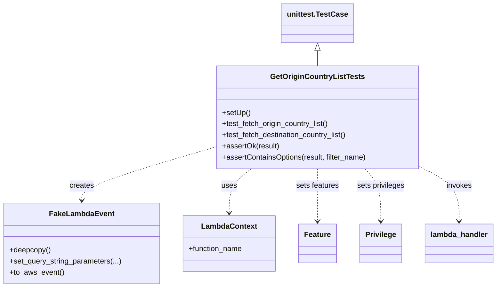

# Diagram: entity_core/entity_search/tests/integration_tests/test_get_list_origin_and_destination_country.py


> Auto-generated by Obscura crawlers

## Diagram 1



### SVG

<svg id="container" width="1056.7265625" xmlns="http://www.w3.org/2000/svg" class="classDiagram" height="620" viewBox="0 0 1056.7265625 620" role="graphics-document document" aria-roledescription="class"><style>#container{font-family:"trebuchet ms",verdana,arial,sans-serif;font-size:16px;fill:#333;}@keyframes edge-animation-frame{from{stroke-dashoffset:0;}}@keyframes dash{to{stroke-dashoffset:0;}}#container .edge-animation-slow{stroke-dasharray:9,5!important;stroke-dashoffset:900;animation:dash 50s linear infinite;stroke-linecap:round;}#container .edge-animation-fast{stroke-dasharray:9,5!important;stroke-dashoffset:900;animation:dash 20s linear infinite;stroke-linecap:round;}#container .error-icon{fill:#552222;}#container .error-text{fill:#552222;stroke:#552222;}#container .edge-thickness-normal{stroke-width:1px;}#container .edge-thickness-thick{stroke-width:3.5px;}#container .edge-pattern-solid{stroke-dasharray:0;}#container .edge-thickness-invisible{stroke-width:0;fill:none;}#container .edge-pattern-dashed{stroke-dasharray:3;}#container .edge-pattern-dotted{stroke-dasharray:2;}#container .marker{fill:#333333;stroke:#333333;}#container .marker.cross{stroke:#333333;}#container svg{font-family:"trebuchet ms",verdana,arial,sans-serif;font-size:16px;}#container p{margin:0;}#container g.classGroup text{fill:#9370DB;stroke:none;font-family:"trebuchet ms",verdana,arial,sans-serif;font-size:10px;}#container g.classGroup text .title{font-weight:bolder;}#container .nodeLabel,#container .edgeLabel{color:#131300;}#container .edgeLabel .label rect{fill:#ECECFF;}#container .label text{fill:#131300;}#container .labelBkg{background:#ECECFF;}#container .edgeLabel .label span{background:#ECECFF;}#container .classTitle{font-weight:bolder;}#container .node rect,#container .node circle,#container .node ellipse,#container .node polygon,#container .node path{fill:#ECECFF;stroke:#9370DB;stroke-width:1px;}#container .divider{stroke:#9370DB;stroke-width:1;}#container g.clickable{cursor:pointer;}#container g.classGroup rect{fill:#ECECFF;stroke:#9370DB;}#container g.classGroup line{stroke:#9370DB;stroke-width:1;}#container .classLabel .box{stroke:none;stroke-width:0;fill:#ECECFF;opacity:0.5;}#container .classLabel .label{fill:#9370DB;font-size:10px;}#container .relation{stroke:#333333;stroke-width:1;fill:none;}#container .dashed-line{stroke-dasharray:3;}#container .dotted-line{stroke-dasharray:1 2;}#container #compositionStart,#container .composition{fill:#333333!important;stroke:#333333!important;stroke-width:1;}#container #compositionEnd,#container .composition{fill:#333333!important;stroke:#333333!important;stroke-width:1;}#container #dependencyStart,#container .dependency{fill:#333333!important;stroke:#333333!important;stroke-width:1;}#container #dependencyStart,#container .dependency{fill:#333333!important;stroke:#333333!important;stroke-width:1;}#container #extensionStart,#container .extension{fill:transparent!important;stroke:#333333!important;stroke-width:1;}#container #extensionEnd,#container .extension{fill:transparent!important;stroke:#333333!important;stroke-width:1;}#container #aggregationStart,#container .aggregation{fill:transparent!important;stroke:#333333!important;stroke-width:1;}#container #aggregationEnd,#container .aggregation{fill:transparent!important;stroke:#333333!important;stroke-width:1;}#container #lollipopStart,#container .lollipop{fill:#ECECFF!important;stroke:#333333!important;stroke-width:1;}#container #lollipopEnd,#container .lollipop{fill:#ECECFF!important;stroke:#333333!important;stroke-width:1;}#container .edgeTerminals{font-size:11px;line-height:initial;}#container .classTitleText{text-anchor:middle;font-size:18px;fill:#333;}#container .label-icon{display:inline-block;height:1em;overflow:visible;vertical-align:-0.125em;}#container .node .label-icon path{fill:currentColor;stroke:revert;stroke-width:revert;}#container :root{--mermaid-font-family:"trebuchet ms",verdana,arial,sans-serif;}</style><g><defs><marker id="container_class-aggregationStart" class="marker aggregation class" refX="18" refY="7" markerWidth="190" markerHeight="240" orient="auto"><path d="M 18,7 L9,13 L1,7 L9,1 Z"></path></marker></defs><defs><marker id="container_class-aggregationEnd" class="marker aggregation class" refX="1" refY="7" markerWidth="20" markerHeight="28" orient="auto"><path d="M 18,7 L9,13 L1,7 L9,1 Z"></path></marker></defs><defs><marker id="container_class-extensionStart" class="marker extension class" refX="18" refY="7" markerWidth="190" markerHeight="240" orient="auto"><path d="M 1,7 L18,13 V 1 Z"></path></marker></defs><defs><marker id="container_class-extensionEnd" class="marker extension class" refX="1" refY="7" markerWidth="20" markerHeight="28" orient="auto"><path d="M 1,1 V 13 L18,7 Z"></path></marker></defs><defs><marker id="container_class-compositionStart" class="marker composition class" refX="18" refY="7" markerWidth="190" markerHeight="240" orient="auto"><path d="M 18,7 L9,13 L1,7 L9,1 Z"></path></marker></defs><defs><marker id="container_class-compositionEnd" class="marker composition class" refX="1" refY="7" markerWidth="20" markerHeight="28" orient="auto"><path d="M 18,7 L9,13 L1,7 L9,1 Z"></path></marker></defs><defs><marker id="container_class-dependencyStart" class="marker dependency class" refX="6" refY="7" markerWidth="190" markerHeight="240" orient="auto"><path d="M 5,7 L9,13 L1,7 L9,1 Z"></path></marker></defs><defs><marker id="container_class-dependencyEnd" class="marker dependency class" refX="13" refY="7" markerWidth="20" markerHeight="28" orient="auto"><path d="M 18,7 L9,13 L14,7 L9,1 Z"></path></marker></defs><defs><marker id="container_class-lollipopStart" class="marker lollipop class" refX="13" refY="7" markerWidth="190" markerHeight="240" orient="auto"><circle stroke="black" fill="transparent" cx="7" cy="7" r="6"></circle></marker></defs><defs><marker id="container_class-lollipopEnd" class="marker lollipop class" refX="1" refY="7" markerWidth="190" markerHeight="240" orient="auto"><circle stroke="black" fill="transparent" cx="7" cy="7" r="6"></circle></marker></defs><g class="root"><g class="clusters"></g><g class="edgePaths"><path d="M677.648,109.25L677.648,110.542C677.648,111.833,677.648,114.417,677.648,119.875C677.648,125.333,677.648,133.667,677.648,137.833L677.648,142" id="id_unittest.TestCase_GetOriginCountryListTests_1" class="edge-thickness-normal edge-pattern-solid relation" style=";;;" data-edge="true" data-et="edge" data-id="id_unittest.TestCase_GetOriginCountryListTests_1" data-points="W3sieCI6Njc3LjY0ODQzNzUsInkiOjkyfSx7IngiOjY3Ny42NDg0Mzc1LCJ5IjoxMTd9LHsieCI6Njc3LjY0ODQzNzUsInkiOjE0Mn1d" marker-start="url(#container_class-extensionStart)"></path><path d="M460.625,316.753L412.827,330.794C365.03,344.836,269.435,372.918,221.637,392.126C173.84,411.333,173.84,421.667,173.84,426.833L173.84,432" id="id_GetOriginCountryListTests_FakeLambdaEvent_2" class="edge-thickness-normal edge-pattern-dashed relation" style=";;;" data-edge="true" data-et="edge" data-id="id_GetOriginCountryListTests_FakeLambdaEvent_2" data-points="W3sieCI6NDYwLjYyNSwieSI6MzE2Ljc1MzMxNjUzNDIxMjA1fSx7IngiOjE3My44Mzk4NDM3NSwieSI6NDAxfSx7IngiOjE3My44Mzk4NDM3NSwieSI6NDM4fV0=" marker-end="url(#container_class-dependencyEnd)"></path><path d="M536.139,364L528.277,370.167C520.415,376.333,504.692,388.667,496.83,404.5C488.969,420.333,488.969,439.667,488.969,449.333L488.969,459" id="id_GetOriginCountryListTests_LambdaContext_3" class="edge-thickness-normal edge-pattern-dashed relation" style=";;;" data-edge="true" data-et="edge" data-id="id_GetOriginCountryListTests_LambdaContext_3" data-points="W3sieCI6NTM2LjEzODY3MTg3NSwieSI6MzY0fSx7IngiOjQ4OC45Njg3NSwieSI6NDAxfSx7IngiOjQ4OC45Njg3NSwieSI6NDY1fV0=" marker-end="url(#container_class-dependencyEnd)"></path><path d="M677.648,364L677.648,370.167C677.648,376.333,677.648,388.667,677.648,407.5C677.648,426.333,677.648,451.667,677.648,464.333L677.648,477" id="id_GetOriginCountryListTests_Feature_4" class="edge-thickness-normal edge-pattern-dashed relation" style=";;;" data-edge="true" data-et="edge" data-id="id_GetOriginCountryListTests_Feature_4" data-points="W3sieCI6Njc3LjY0ODQzNzUsInkiOjM2NH0seyJ4Ijo2NzcuNjQ4NDM3NSwieSI6NDAxfSx7IngiOjY3Ny42NDg0Mzc1LCJ5Ijo0ODN9XQ==" marker-end="url(#container_class-dependencyEnd)"></path><path d="M777.592,364L783.144,370.167C788.697,376.333,799.801,388.667,805.354,407.5C810.906,426.333,810.906,451.667,810.906,464.333L810.906,477" id="id_GetOriginCountryListTests_Privilege_5" class="edge-thickness-normal edge-pattern-dashed relation" style=";;;" data-edge="true" data-et="edge" data-id="id_GetOriginCountryListTests_Privilege_5" data-points="W3sieCI6Nzc3LjU5MTc5Njg3NSwieSI6MzY0fSx7IngiOjgxMC45MDYyNSwieSI6NDAxfSx7IngiOjgxMC45MDYyNSwieSI6NDgzfV0=" marker-end="url(#container_class-dependencyEnd)"></path><path d="M894.672,360.386L908.352,367.155C922.031,373.924,949.391,387.462,963.07,406.898C976.75,426.333,976.75,451.667,976.75,464.333L976.75,477" id="id_GetOriginCountryListTests_lambda_handler_6" class="edge-thickness-normal edge-pattern-dashed relation" style=";;;" data-edge="true" data-et="edge" data-id="id_GetOriginCountryListTests_lambda_handler_6" data-points="W3sieCI6ODk0LjY3MTg3NSwieSI6MzYwLjM4NjQ5NjAxNjcxNjd9LHsieCI6OTc2Ljc1LCJ5Ijo0MDF9LHsieCI6OTc2Ljc1LCJ5Ijo0ODN9XQ==" marker-end="url(#container_class-dependencyEnd)"></path></g><g class="edgeLabels"><g class="edgeLabel"><g class="label" data-id="id_unittest.TestCase_GetOriginCountryListTests_1" transform="translate(0, 0)"><foreignObject width="0" height="0"><div xmlns="http://www.w3.org/1999/xhtml" class="labelBkg" style="display: table-cell; white-space: nowrap; line-height: 1.5; max-width: 200px; text-align: center;"><span class="edgeLabel"></span></div></foreignObject></g></g><g class="edgeLabel" transform="translate(173.83984375, 401)"><g class="label" data-id="id_GetOriginCountryListTests_FakeLambdaEvent_2" transform="translate(-26.171875, -12)"><foreignObject width="52.34375" height="24"><div xmlns="http://www.w3.org/1999/xhtml" class="labelBkg" style="display: table-cell; white-space: nowrap; line-height: 1.5; max-width: 200px; text-align: center;"><span class="edgeLabel"><p>creates</p></span></div></foreignObject></g></g><g class="edgeLabel" transform="translate(488.96875, 401)"><g class="label" data-id="id_GetOriginCountryListTests_LambdaContext_3" transform="translate(-16.4921875, -12)"><foreignObject width="32.984375" height="24"><div xmlns="http://www.w3.org/1999/xhtml" class="labelBkg" style="display: table-cell; white-space: nowrap; line-height: 1.5; max-width: 200px; text-align: center;"><span class="edgeLabel"><p>uses</p></span></div></foreignObject></g></g><g class="edgeLabel" transform="translate(677.6484375, 401)"><g class="label" data-id="id_GetOriginCountryListTests_Feature_4" transform="translate(-46.5625, -12)"><foreignObject width="93.125" height="24"><div xmlns="http://www.w3.org/1999/xhtml" class="labelBkg" style="display: table-cell; white-space: nowrap; line-height: 1.5; max-width: 200px; text-align: center;"><span class="edgeLabel"><p>sets features</p></span></div></foreignObject></g></g><g class="edgeLabel" transform="translate(810.90625, 401)"><g class="label" data-id="id_GetOriginCountryListTests_Privilege_5" transform="translate(-51.921875, -12)"><foreignObject width="103.84375" height="24"><div xmlns="http://www.w3.org/1999/xhtml" class="labelBkg" style="display: table-cell; white-space: nowrap; line-height: 1.5; max-width: 200px; text-align: center;"><span class="edgeLabel"><p>sets privileges</p></span></div></foreignObject></g></g><g class="edgeLabel" transform="translate(976.75, 401)"><g class="label" data-id="id_GetOriginCountryListTests_lambda_handler_6" transform="translate(-27.5859375, -12)"><foreignObject width="55.171875" height="24"><div xmlns="http://www.w3.org/1999/xhtml" class="labelBkg" style="display: table-cell; white-space: nowrap; line-height: 1.5; max-width: 200px; text-align: center;"><span class="edgeLabel"><p>invokes</p></span></div></foreignObject></g></g></g><g class="nodes"><g class="node default" id="classId-unittest.TestCase-0" transform="translate(677.6484375, 50)"><g class="basic label-container"><path d="M-74.7109375 -42 L74.7109375 -42 L74.7109375 42 L-74.7109375 42" stroke="none" stroke-width="0" fill="#ECECFF" style=""></path><path d="M-74.7109375 -42 C-31.698124948384383 -42, 11.314687603231235 -42, 74.7109375 -42 M-74.7109375 -42 C-26.162988069369582 -42, 22.384961361260835 -42, 74.7109375 -42 M74.7109375 -42 C74.7109375 -22.55699159331781, 74.7109375 -3.113983186635622, 74.7109375 42 M74.7109375 -42 C74.7109375 -21.773453097103534, 74.7109375 -1.546906194207068, 74.7109375 42 M74.7109375 42 C19.417168103969026 42, -35.87660129206195 42, -74.7109375 42 M74.7109375 42 C23.547646850716077 42, -27.615643798567845 42, -74.7109375 42 M-74.7109375 42 C-74.7109375 21.969599898392072, -74.7109375 1.9391997967841448, -74.7109375 -42 M-74.7109375 42 C-74.7109375 15.314181606270434, -74.7109375 -11.371636787459131, -74.7109375 -42" stroke="#9370DB" stroke-width="1.3" fill="none" stroke-dasharray="0 0" style=""></path></g><g class="annotation-group text" transform="translate(0, -18)"></g><g class="label-group text" transform="translate(-62.7109375, -18)"><g class="label" style="font-weight: bolder" transform="translate(0,-12)"><foreignObject width="125.421875" height="24"><div xmlns="http://www.w3.org/1999/xhtml" style="display: table-cell; white-space: nowrap; line-height: 1.5; max-width: 172px; text-align: center;"><span class="nodeLabel markdown-node-label" style=""><p>unittest.TestCase</p></span></div></foreignObject></g></g><g class="members-group text" transform="translate(-62.7109375, 30)"></g><g class="methods-group text" transform="translate(-62.7109375, 60)"></g><g class="divider" style=""><path d="M-74.7109375 6 C-38.445390824143345 6, -2.1798441482866906 6, 74.7109375 6 M-74.7109375 6 C-19.169375970378482 6, 36.372185559243036 6, 74.7109375 6" stroke="#9370DB" stroke-width="1.3" fill="none" stroke-dasharray="0 0" style=""></path></g><g class="divider" style=""><path d="M-74.7109375 24 C-23.644026073816427 24, 27.422885352367146 24, 74.7109375 24 M-74.7109375 24 C-36.00086896009705 24, 2.7091995798058974 24, 74.7109375 24" stroke="#9370DB" stroke-width="1.3" fill="none" stroke-dasharray="0 0" style=""></path></g></g><g class="node default" id="classId-GetOriginCountryListTests-1" transform="translate(677.6484375, 253)"><g class="basic label-container"><path d="M-217.0234375 -111 L217.0234375 -111 L217.0234375 111 L-217.0234375 111" stroke="none" stroke-width="0" fill="#ECECFF" style=""></path><path d="M-217.0234375 -111 C-64.98666767479807 -111, 87.05010215040386 -111, 217.0234375 -111 M-217.0234375 -111 C-46.15338378105281 -111, 124.71666993789438 -111, 217.0234375 -111 M217.0234375 -111 C217.0234375 -39.817174938512125, 217.0234375 31.36565012297575, 217.0234375 111 M217.0234375 -111 C217.0234375 -31.58417704037528, 217.0234375 47.83164591924944, 217.0234375 111 M217.0234375 111 C70.25968478662867 111, -76.50406792674266 111, -217.0234375 111 M217.0234375 111 C78.98980176920867 111, -59.04383396158266 111, -217.0234375 111 M-217.0234375 111 C-217.0234375 34.70985610196243, -217.0234375 -41.58028779607514, -217.0234375 -111 M-217.0234375 111 C-217.0234375 31.143024303574563, -217.0234375 -48.71395139285087, -217.0234375 -111" stroke="#9370DB" stroke-width="1.3" fill="none" stroke-dasharray="0 0" style=""></path></g><g class="annotation-group text" transform="translate(0, -87)"></g><g class="label-group text" transform="translate(-96.109375, -87)"><g class="label" style="font-weight: bolder" transform="translate(0,-12)"><foreignObject width="192.21875" height="24"><div xmlns="http://www.w3.org/1999/xhtml" style="display: table-cell; white-space: nowrap; line-height: 1.5; max-width: 238px; text-align: center;"><span class="nodeLabel markdown-node-label" style=""><p>GetOriginCountryListTests</p></span></div></foreignObject></g></g><g class="members-group text" transform="translate(-205.0234375, -39)"></g><g class="methods-group text" transform="translate(-205.0234375, -9)"><g class="label" style="" transform="translate(0,-12)"><foreignObject width="60.421875" height="24"><div xmlns="http://www.w3.org/1999/xhtml" style="display: table-cell; white-space: nowrap; line-height: 1.5; max-width: 118px; text-align: center;"><span class="nodeLabel markdown-node-label" style=""><p>+setUp()</p></span></div></foreignObject></g><g class="label" style="" transform="translate(0,12)"><foreignObject width="233.8125" height="24"><div xmlns="http://www.w3.org/1999/xhtml" style="display: table-cell; white-space: nowrap; line-height: 1.5; max-width: 291px; text-align: center;"><span class="nodeLabel markdown-node-label" style=""><p>+test_fetch_origin_country_list()</p></span></div></foreignObject></g><g class="label" style="" transform="translate(0,36)"><foreignObject width="274.71875" height="24"><div xmlns="http://www.w3.org/1999/xhtml" style="display: table-cell; white-space: nowrap; line-height: 1.5; max-width: 332px; text-align: center;"><span class="nodeLabel markdown-node-label" style=""><p>+test_fetch_destination_country_list()</p></span></div></foreignObject></g><g class="label" style="" transform="translate(0,60)"><foreignObject width="123.046875" height="24"><div xmlns="http://www.w3.org/1999/xhtml" style="display: table-cell; white-space: nowrap; line-height: 1.5; max-width: 180px; text-align: center;"><span class="nodeLabel markdown-node-label" style=""><p>+assertOk(result)</p></span></div></foreignObject></g><g class="label" style="" transform="translate(0,84)"><foreignObject width="313.9375" height="24"><div xmlns="http://www.w3.org/1999/xhtml" style="display: table-cell; white-space: nowrap; line-height: 1.5; max-width: 371px; text-align: center;"><span class="nodeLabel markdown-node-label" style=""><p>+assertContainsOptions(result, filter_name)</p></span></div></foreignObject></g></g><g class="divider" style=""><path d="M-217.0234375 -63 C-65.87209520615218 -63, 85.27924708769564 -63, 217.0234375 -63 M-217.0234375 -63 C-71.62227268470369 -63, 73.77889213059262 -63, 217.0234375 -63" stroke="#9370DB" stroke-width="1.3" fill="none" stroke-dasharray="0 0" style=""></path></g><g class="divider" style=""><path d="M-217.0234375 -39 C-92.64415287587705 -39, 31.73513174824589 -39, 217.0234375 -39 M-217.0234375 -39 C-101.57454234276034 -39, 13.874352814479323 -39, 217.0234375 -39" stroke="#9370DB" stroke-width="1.3" fill="none" stroke-dasharray="0 0" style=""></path></g></g><g class="node default" id="classId-FakeLambdaEvent-2" transform="translate(173.83984375, 525)"><g class="basic label-container"><path d="M-165.83984375 -87 L165.83984375 -87 L165.83984375 87 L-165.83984375 87" stroke="none" stroke-width="0" fill="#ECECFF" style=""></path><path d="M-165.83984375 -87 C-74.55590553253576 -87, 16.72803268492848 -87, 165.83984375 -87 M-165.83984375 -87 C-43.94702754600412 -87, 77.94578865799176 -87, 165.83984375 -87 M165.83984375 -87 C165.83984375 -39.3671958200178, 165.83984375 8.265608359964403, 165.83984375 87 M165.83984375 -87 C165.83984375 -44.92304352268023, 165.83984375 -2.8460870453604628, 165.83984375 87 M165.83984375 87 C69.75509947491608 87, -26.32964480016784 87, -165.83984375 87 M165.83984375 87 C50.720752277667984 87, -64.39833919466403 87, -165.83984375 87 M-165.83984375 87 C-165.83984375 50.889637351031936, -165.83984375 14.779274702063873, -165.83984375 -87 M-165.83984375 87 C-165.83984375 48.0173803439556, -165.83984375 9.034760687911202, -165.83984375 -87" stroke="#9370DB" stroke-width="1.3" fill="none" stroke-dasharray="0 0" style=""></path></g><g class="annotation-group text" transform="translate(0, -63)"></g><g class="label-group text" transform="translate(-65.8671875, -63)"><g class="label" style="font-weight: bolder" transform="translate(0,-12)"><foreignObject width="131.734375" height="24"><div xmlns="http://www.w3.org/1999/xhtml" style="display: table-cell; white-space: nowrap; line-height: 1.5; max-width: 181px; text-align: center;"><span class="nodeLabel markdown-node-label" style=""><p>FakeLambdaEvent</p></span></div></foreignObject></g></g><g class="members-group text" transform="translate(-153.83984375, -15)"></g><g class="methods-group text" transform="translate(-153.83984375, 15)"><g class="label" style="" transform="translate(0,-12)"><foreignObject width="88.859375" height="24"><div xmlns="http://www.w3.org/1999/xhtml" style="display: table-cell; white-space: nowrap; line-height: 1.5; max-width: 146px; text-align: center;"><span class="nodeLabel markdown-node-label" style=""><p>+deepcopy()</p></span></div></foreignObject></g><g class="label" style="" transform="translate(0,12)"><foreignObject width="241.8125" height="24"><div xmlns="http://www.w3.org/1999/xhtml" style="display: table-cell; white-space: nowrap; line-height: 1.5; max-width: 299px; text-align: center;"><span class="nodeLabel markdown-node-label" style=""><p>+set_query_string_parameters(...)</p></span></div></foreignObject></g><g class="label" style="" transform="translate(0,36)"><foreignObject width="116.421875" height="24"><div xmlns="http://www.w3.org/1999/xhtml" style="display: table-cell; white-space: nowrap; line-height: 1.5; max-width: 174px; text-align: center;"><span class="nodeLabel markdown-node-label" style=""><p>+to_aws_event()</p></span></div></foreignObject></g></g><g class="divider" style=""><path d="M-165.83984375 -39 C-89.95189143598361 -39, -14.063939121967223 -39, 165.83984375 -39 M-165.83984375 -39 C-91.9837684215381 -39, -18.127693093076203 -39, 165.83984375 -39" stroke="#9370DB" stroke-width="1.3" fill="none" stroke-dasharray="0 0" style=""></path></g><g class="divider" style=""><path d="M-165.83984375 -15 C-56.591137941705966 -15, 52.65756786658807 -15, 165.83984375 -15 M-165.83984375 -15 C-84.12922745276914 -15, -2.4186111555382865 -15, 165.83984375 -15" stroke="#9370DB" stroke-width="1.3" fill="none" stroke-dasharray="0 0" style=""></path></g></g><g class="node default" id="classId-LambdaContext-3" transform="translate(488.96875, 525)"><g class="basic label-container"><path d="M-99.2890625 -60 L99.2890625 -60 L99.2890625 60 L-99.2890625 60" stroke="none" stroke-width="0" fill="#ECECFF" style=""></path><path d="M-99.2890625 -60 C-31.65094160771052 -60, 35.98717928457896 -60, 99.2890625 -60 M-99.2890625 -60 C-48.63006418206187 -60, 2.0289341358762556 -60, 99.2890625 -60 M99.2890625 -60 C99.2890625 -13.477912052170865, 99.2890625 33.04417589565827, 99.2890625 60 M99.2890625 -60 C99.2890625 -14.954076563547197, 99.2890625 30.091846872905606, 99.2890625 60 M99.2890625 60 C40.007013670244795 60, -19.27503515951041 60, -99.2890625 60 M99.2890625 60 C57.17912913495228 60, 15.069195769904553 60, -99.2890625 60 M-99.2890625 60 C-99.2890625 18.604071097200794, -99.2890625 -22.79185780559841, -99.2890625 -60 M-99.2890625 60 C-99.2890625 31.261574410277102, -99.2890625 2.523148820554205, -99.2890625 -60" stroke="#9370DB" stroke-width="1.3" fill="none" stroke-dasharray="0 0" style=""></path></g><g class="annotation-group text" transform="translate(0, -36)"></g><g class="label-group text" transform="translate(-57.296875, -36)"><g class="label" style="font-weight: bolder" transform="translate(0,-12)"><foreignObject width="114.59375" height="24"><div xmlns="http://www.w3.org/1999/xhtml" style="display: table-cell; white-space: nowrap; line-height: 1.5; max-width: 163px; text-align: center;"><span class="nodeLabel markdown-node-label" style=""><p>LambdaContext</p></span></div></foreignObject></g></g><g class="members-group text" transform="translate(-87.2890625, 12)"><g class="label" style="" transform="translate(0,-12)"><foreignObject width="117.28125" height="24"><div xmlns="http://www.w3.org/1999/xhtml" style="display: table-cell; white-space: nowrap; line-height: 1.5; max-width: 175px; text-align: center;"><span class="nodeLabel markdown-node-label" style=""><p>+function_name</p></span></div></foreignObject></g></g><g class="methods-group text" transform="translate(-87.2890625, 60)"></g><g class="divider" style=""><path d="M-99.2890625 -12 C-46.67416650171062 -12, 5.940729496578754 -12, 99.2890625 -12 M-99.2890625 -12 C-55.57311217360628 -12, -11.857161847212566 -12, 99.2890625 -12" stroke="#9370DB" stroke-width="1.3" fill="none" stroke-dasharray="0 0" style=""></path></g><g class="divider" style=""><path d="M-99.2890625 36 C-26.73836819565335 36, 45.8123261086933 36, 99.2890625 36 M-99.2890625 36 C-44.820994011331685 36, 9.64707447733663 36, 99.2890625 36" stroke="#9370DB" stroke-width="1.3" fill="none" stroke-dasharray="0 0" style=""></path></g></g><g class="node default" id="classId-Feature-4" transform="translate(677.6484375, 525)"><g class="basic label-container"><path d="M-39.390625 -42 L39.390625 -42 L39.390625 42 L-39.390625 42" stroke="none" stroke-width="0" fill="#ECECFF" style=""></path><path d="M-39.390625 -42 C-20.688580174777446 -42, -1.9865353495548916 -42, 39.390625 -42 M-39.390625 -42 C-18.51404630110644 -42, 2.3625323977871204 -42, 39.390625 -42 M39.390625 -42 C39.390625 -9.169161234092087, 39.390625 23.661677531815826, 39.390625 42 M39.390625 -42 C39.390625 -9.092062577235133, 39.390625 23.815874845529734, 39.390625 42 M39.390625 42 C16.41023893466619 42, -6.570147130667621 42, -39.390625 42 M39.390625 42 C18.221114016594854 42, -2.948396966810293 42, -39.390625 42 M-39.390625 42 C-39.390625 20.099383593008618, -39.390625 -1.8012328139827645, -39.390625 -42 M-39.390625 42 C-39.390625 16.200958221360636, -39.390625 -9.598083557278727, -39.390625 -42" stroke="#9370DB" stroke-width="1.3" fill="none" stroke-dasharray="0 0" style=""></path></g><g class="annotation-group text" transform="translate(0, -18)"></g><g class="label-group text" transform="translate(-27.390625, -18)"><g class="label" style="font-weight: bolder" transform="translate(0,-12)"><foreignObject width="54.78125" height="24"><div xmlns="http://www.w3.org/1999/xhtml" style="display: table-cell; white-space: nowrap; line-height: 1.5; max-width: 104px; text-align: center;"><span class="nodeLabel markdown-node-label" style=""><p>Feature</p></span></div></foreignObject></g></g><g class="members-group text" transform="translate(-27.390625, 30)"></g><g class="methods-group text" transform="translate(-27.390625, 60)"></g><g class="divider" style=""><path d="M-39.390625 6 C-14.76225224560202 6, 9.866120508795959 6, 39.390625 6 M-39.390625 6 C-11.120627044120564 6, 17.149370911758872 6, 39.390625 6" stroke="#9370DB" stroke-width="1.3" fill="none" stroke-dasharray="0 0" style=""></path></g><g class="divider" style=""><path d="M-39.390625 24 C-10.354938494498988 24, 18.680748011002024 24, 39.390625 24 M-39.390625 24 C-10.608269636964145 24, 18.17408572607171 24, 39.390625 24" stroke="#9370DB" stroke-width="1.3" fill="none" stroke-dasharray="0 0" style=""></path></g></g><g class="node default" id="classId-Privilege-5" transform="translate(810.90625, 525)"><g class="basic label-container"><path d="M-43.8671875 -42 L43.8671875 -42 L43.8671875 42 L-43.8671875 42" stroke="none" stroke-width="0" fill="#ECECFF" style=""></path><path d="M-43.8671875 -42 C-17.382986245307993 -42, 9.101215009384013 -42, 43.8671875 -42 M-43.8671875 -42 C-22.013978822803438 -42, -0.1607701456068753 -42, 43.8671875 -42 M43.8671875 -42 C43.8671875 -16.485525872293444, 43.8671875 9.028948255413113, 43.8671875 42 M43.8671875 -42 C43.8671875 -20.769373220249374, 43.8671875 0.4612535595012517, 43.8671875 42 M43.8671875 42 C9.32962175440285 42, -25.2079439911943 42, -43.8671875 42 M43.8671875 42 C24.28745921131353 42, 4.707730922627057 42, -43.8671875 42 M-43.8671875 42 C-43.8671875 8.981764784891908, -43.8671875 -24.036470430216184, -43.8671875 -42 M-43.8671875 42 C-43.8671875 18.79030245509645, -43.8671875 -4.419395089807097, -43.8671875 -42" stroke="#9370DB" stroke-width="1.3" fill="none" stroke-dasharray="0 0" style=""></path></g><g class="annotation-group text" transform="translate(0, -18)"></g><g class="label-group text" transform="translate(-31.8671875, -18)"><g class="label" style="font-weight: bolder" transform="translate(0,-12)"><foreignObject width="63.734375" height="24"><div xmlns="http://www.w3.org/1999/xhtml" style="display: table-cell; white-space: nowrap; line-height: 1.5; max-width: 112px; text-align: center;"><span class="nodeLabel markdown-node-label" style=""><p>Privilege</p></span></div></foreignObject></g></g><g class="members-group text" transform="translate(-31.8671875, 30)"></g><g class="methods-group text" transform="translate(-31.8671875, 60)"></g><g class="divider" style=""><path d="M-43.8671875 6 C-9.743464504999508 6, 24.380258490000983 6, 43.8671875 6 M-43.8671875 6 C-25.478100389252948 6, -7.089013278505895 6, 43.8671875 6" stroke="#9370DB" stroke-width="1.3" fill="none" stroke-dasharray="0 0" style=""></path></g><g class="divider" style=""><path d="M-43.8671875 24 C-15.327009523978347 24, 13.213168452043305 24, 43.8671875 24 M-43.8671875 24 C-10.710239064375145 24, 22.44670937124971 24, 43.8671875 24" stroke="#9370DB" stroke-width="1.3" fill="none" stroke-dasharray="0 0" style=""></path></g></g><g class="node default" id="classId-lambda_handler-6" transform="translate(976.75, 525)"><g class="basic label-container"><path d="M-71.9765625 -42 L71.9765625 -42 L71.9765625 42 L-71.9765625 42" stroke="none" stroke-width="0" fill="#ECECFF" style=""></path><path d="M-71.9765625 -42 C-34.37705390586541 -42, 3.222454688269181 -42, 71.9765625 -42 M-71.9765625 -42 C-29.516744009166118 -42, 12.943074481667765 -42, 71.9765625 -42 M71.9765625 -42 C71.9765625 -24.31445211727547, 71.9765625 -6.628904234550937, 71.9765625 42 M71.9765625 -42 C71.9765625 -20.557788529559517, 71.9765625 0.8844229408809667, 71.9765625 42 M71.9765625 42 C32.22469460414253 42, -7.527173291714945 42, -71.9765625 42 M71.9765625 42 C28.1348815416928 42, -15.706799416614402 42, -71.9765625 42 M-71.9765625 42 C-71.9765625 12.931200827589524, -71.9765625 -16.13759834482095, -71.9765625 -42 M-71.9765625 42 C-71.9765625 9.898649223955871, -71.9765625 -22.202701552088257, -71.9765625 -42" stroke="#9370DB" stroke-width="1.3" fill="none" stroke-dasharray="0 0" style=""></path></g><g class="annotation-group text" transform="translate(0, -18)"></g><g class="label-group text" transform="translate(-59.9765625, -18)"><g class="label" style="font-weight: bolder" transform="translate(0,-12)"><foreignObject width="119.953125" height="24"><div xmlns="http://www.w3.org/1999/xhtml" style="display: table-cell; white-space: nowrap; line-height: 1.5; max-width: 170px; text-align: center;"><span class="nodeLabel markdown-node-label" style=""><p>lambda_handler</p></span></div></foreignObject></g></g><g class="members-group text" transform="translate(-59.9765625, 30)"></g><g class="methods-group text" transform="translate(-59.9765625, 60)"></g><g class="divider" style=""><path d="M-71.9765625 6 C-23.709452365886094 6, 24.557657768227813 6, 71.9765625 6 M-71.9765625 6 C-19.648956598761025 6, 32.67864930247795 6, 71.9765625 6" stroke="#9370DB" stroke-width="1.3" fill="none" stroke-dasharray="0 0" style=""></path></g><g class="divider" style=""><path d="M-71.9765625 24 C-31.74128642089658 24, 8.493989658206843 24, 71.9765625 24 M-71.9765625 24 C-19.388535200241407 24, 33.19949209951719 24, 71.9765625 24" stroke="#9370DB" stroke-width="1.3" fill="none" stroke-dasharray="0 0" style=""></path></g></g></g></g></g></svg>

## Diagram 2

```mermaid
flowchart TD
    A[setUp\ncreate FakeLambdaEvent(features, solutions, privileges,\norganization_id, path_parameters)] --> B[test_fetch_origin_country_list\n(skipped)]
    A --> C[test_fetch_destination_country_list\n(skipped)]
    B -.-> D[prepare event\nset query params: originCountry/query/pageNumber/pageSize]
    C -.-> D2[prepare event\nset query params: destinationCountry/query/pageNumber/pageSize]
    D --> E[call lambda_handler(event, LambdaContext("get_list"))]
    D2 --> E
    E --> F[assertOk(result)\ncheck statusCode == "200"]
    E --> G[assertContainsOptions(result, filter_name)\nbody contains filter and meta]
```

> SVG rendering failed for this diagram.
