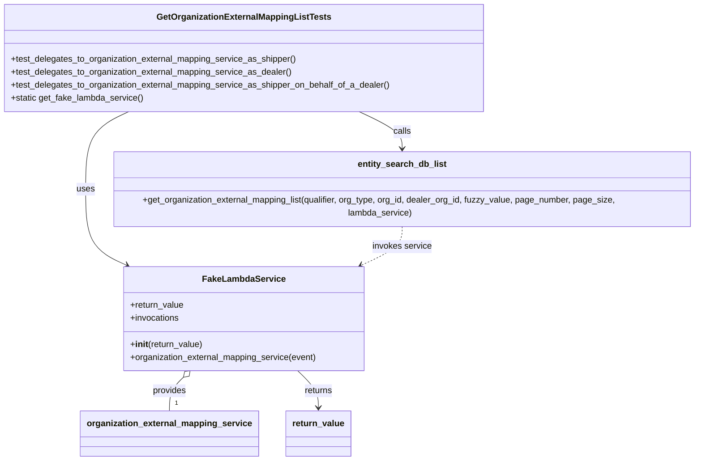
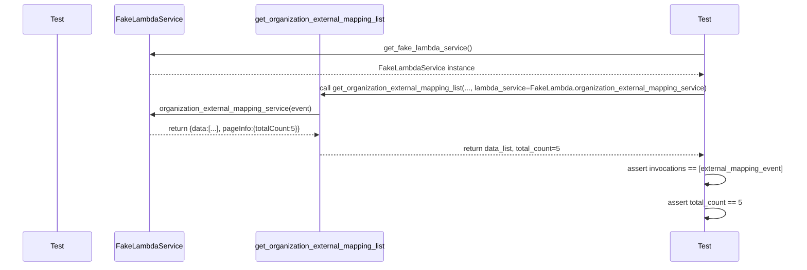

# Diagram: entity_core/entity_search/tests/unit_tests/common/test_get_organization_external_mapping.py

> Auto-generated by Obscura crawlers

## Diagram 1

### SVG

<svg id="container" width="1307.447265625" xmlns="http://www.w3.org/2000/svg" class="classDiagram" height="838" viewBox="0 0 1307.447265625 838" role="graphics-document document" aria-roledescription="class"><g><defs><marker id="container_class-aggregationStart" class="marker aggregation class" refX="18" refY="7" markerWidth="190" markerHeight="240" orient="auto"><path d="M 18,7 L9,13 L1,7 L9,1 Z"></path></marker></defs><defs><marker id="container_class-aggregationEnd" class="marker aggregation class" refX="1" refY="7" markerWidth="20" markerHeight="28" orient="auto"><path d="M 18,7 L9,13 L1,7 L9,1 Z"></path></marker></defs><defs><marker id="container_class-extensionStart" class="marker extension class" refX="18" refY="7" markerWidth="190" markerHeight="240" orient="auto"><path d="M 1,7 L18,13 V 1 Z"></path></marker></defs><defs><marker id="container_class-extensionEnd" class="marker extension class" refX="1" refY="7" markerWidth="20" markerHeight="28" orient="auto"><path d="M 1,1 V 13 L18,7 Z"></path></marker></defs><defs><marker id="container_class-compositionStart" class="marker composition class" refX="18" refY="7" markerWidth="190" markerHeight="240" orient="auto"><path d="M 18,7 L9,13 L1,7 L9,1 Z"></path></marker></defs><defs><marker id="container_class-compositionEnd" class="marker composition class" refX="1" refY="7" markerWidth="20" markerHeight="28" orient="auto"><path d="M 18,7 L9,13 L1,7 L9,1 Z"></path></marker></defs><defs><marker id="container_class-dependencyStart" class="marker dependency class" refX="6" refY="7" markerWidth="190" markerHeight="240" orient="auto"><path d="M 5,7 L9,13 L1,7 L9,1 Z"></path></marker></defs><defs><marker id="container_class-dependencyEnd" class="marker dependency class" refX="13" refY="7" markerWidth="20" markerHeight="28" orient="auto"><path d="M 18,7 L9,13 L14,7 L9,1 Z"></path></marker></defs><defs><marker id="container_class-lollipopStart" class="marker lollipop class" refX="13" refY="7" markerWidth="190" markerHeight="240" orient="auto"><circle stroke="black" fill="transparent" cx="7" cy="7" r="6"></circle></marker></defs><defs><marker id="container_class-lollipopEnd" class="marker lollipop class" refX="1" refY="7" markerWidth="190" markerHeight="240" orient="auto"><circle stroke="black" fill="transparent" cx="7" cy="7" r="6"></circle></marker></defs><g class="root"><g class="clusters"></g><g class="edgePaths"><path d="M228.866,206L215.218,212.167C201.57,218.333,174.274,230.667,160.626,253.5C146.979,276.333,146.979,309.667,146.979,343C146.979,376.333,146.979,409.667,160.02,432.096C173.061,454.525,199.143,466.05,212.184,471.812L225.225,477.575" id="id_GetOrganizationExternalMappingListTests_FakeLambdaService_1" class="edge-thickness-normal edge-pattern-solid relation" style=";;;" data-edge="true" data-et="edge" data-id="id_GetOrganizationExternalMappingListTests_FakeLambdaService_1" data-points="W3sieCI6MjI4Ljg2NTU2NDY4MjkwNDQyLCJ5IjoyMDZ9LHsieCI6MTQ2Ljk3ODUxNTYyNSwieSI6MjQzfSx7IngiOjE0Ni45Nzg1MTU2MjUsInkiOjM0M30seyJ4IjoxNDYuOTc4NTE1NjI1LCJ5Ijo0NDN9LHsieCI6MjMwLjcxMjY0MDk3NzQ0MzYsInkiOjQ4MH1d" marker-end="url(#container_class-dependencyEnd)"></path><path d="M667.072,206L680.72,212.167C694.368,218.333,721.663,230.667,735.311,242C748.959,253.333,748.959,263.667,748.959,268.833L748.959,274" id="id_GetOrganizationExternalMappingListTests_entity_search_db_list_2" class="edge-thickness-normal edge-pattern-solid relation" style=";;;" data-edge="true" data-et="edge" data-id="id_GetOrganizationExternalMappingListTests_entity_search_db_list_2" data-points="W3sieCI6NjY3LjA3MTkzNTMxNzA5NTYsInkiOjIwNn0seyJ4Ijo3NDguOTU4OTg0Mzc1LCJ5IjoyNDN9LHsieCI6NzQ4Ljk1ODk4NDM3NSwieSI6MjgwfV0=" marker-end="url(#container_class-dependencyEnd)"></path><path d="M339.462,684.179L335.313,688.316C331.164,692.453,322.865,700.726,318.716,711.03C314.566,721.333,314.566,733.667,314.566,739.833L314.566,746" id="id_FakeLambdaService_organization_external_mapping_service_3" class="edge-thickness-normal edge-pattern-solid relation" style=";;;" data-edge="true" data-et="edge" data-id="id_FakeLambdaService_organization_external_mapping_service_3" data-points="W3sieCI6MzUxLjY3ODMzNjQ2NjE2NTQzLCJ5Ijo2NzJ9LHsieCI6MzE0LjU2NjQwNjI1LCJ5Ijo3MDl9LHsieCI6MzE0LjU2NjQwNjI1LCJ5Ijo3NDZ9XQ==" marker-start="url(#container_class-aggregationStart)"></path><path d="M544.259,672L550.444,678.167C556.63,684.333,569,696.667,575.186,708C581.371,719.333,581.371,729.667,581.371,734.833L581.371,740" id="id_FakeLambdaService_return_value_4" class="edge-thickness-normal edge-pattern-solid relation" style=";;;" data-edge="true" data-et="edge" data-id="id_FakeLambdaService_return_value_4" data-points="W3sieCI6NTQ0LjI1OTE2MzUzMzgzNDYsInkiOjY3Mn0seyJ4Ijo1ODEuMzcxMDkzNzUsInkiOjcwOX0seyJ4Ijo1ODEuMzcxMDkzNzUsInkiOjc0Nn1d" marker-end="url(#container_class-dependencyEnd)"></path><path d="M748.959,406L748.959,412.167C748.959,418.333,748.959,430.667,735.918,442.596C722.877,454.525,696.795,466.05,683.754,471.812L670.713,477.575" id="id_entity_search_db_list_FakeLambdaService_5" class="edge-thickness-normal edge-pattern-dashed relation" style=";;;" data-edge="true" data-et="edge" data-id="id_entity_search_db_list_FakeLambdaService_5" data-points="W3sieCI6NzQ4Ljk1ODk4NDM3NSwieSI6NDA2fSx7IngiOjc0OC45NTg5ODQzNzUsInkiOjQ0M30seyJ4Ijo2NjUuMjI0ODU5MDIyNTU2NCwieSI6NDgwfV0=" marker-end="url(#container_class-dependencyEnd)"></path></g><g class="edgeLabels"><g class="edgeLabel" transform="translate(146.978515625, 343)"><g class="label" data-id="id_GetOrganizationExternalMappingListTests_FakeLambdaService_1" transform="translate(-16.4921875, -12)"><foreignObject width="32.984375" height="24">

uses

</foreignObject></g></g><g class="edgeLabel" transform="translate(748.958984375, 243)"><g class="label" data-id="id_GetOrganizationExternalMappingListTests_entity_search_db_list_2" transform="translate(-16.4453125, -12)"><foreignObject width="32.890625" height="24">

calls

</foreignObject></g></g><g class="edgeLabel" transform="translate(314.56640625, 709)"><g class="label" data-id="id_FakeLambdaService_organization_external_mapping_service_3" transform="translate(-31.3125, -12)"><foreignObject width="62.625" height="24">

provides

</foreignObject></g></g><g class="edgeLabel" transform="translate(581.37109375, 709)"><g class="label" data-id="id_FakeLambdaService_return_value_4" transform="translate(-26.265625, -12)"><foreignObject width="52.53125" height="24">

returns

</foreignObject></g></g><g class="edgeLabel" transform="translate(748.958984375, 443)"><g class="label" data-id="id_entity_search_db_list_FakeLambdaService_5" transform="translate(-55.109375, -12)"><foreignObject width="110.21875" height="24">

invokes service

</foreignObject></g></g><g class="edgeTerminals" transform="translate(324.5664081249999, 723.5000016071428)"><g class="inner" transform="translate(0, 0)"></g><foreignObject style="width: 9px; height: 12px;">
1
</foreignObject></g></g><g class="nodes"><g class="node default" id="classId-GetOrganizationExternalMappingListTests-0" transform="translate(447.96875, 107)"><g class="basic label-container"><path d="M-439.96875 -99 L439.96875 -99 L439.96875 99 L-439.96875 99" stroke="none" stroke-width="0" fill="#ECECFF" style=""></path><path d="M-439.96875 -99 C-108.62102476378095 -99, 222.7267004724381 -99, 439.96875 -99 M-439.96875 -99 C-164.9761826163491 -99, 110.01638476730182 -99, 439.96875 -99 M439.96875 -99 C439.96875 -30.431710709157954, 439.96875 38.13657858168409, 439.96875 99 M439.96875 -99 C439.96875 -58.62315040100069, 439.96875 -18.246300802001386, 439.96875 99 M439.96875 99 C248.51596786829955 99, 57.06318573659911 99, -439.96875 99 M439.96875 99 C256.7645319306516 99, 73.56031386130314 99, -439.96875 99 M-439.96875 99 C-439.96875 37.33125369143657, -439.96875 -24.337492617126856, -439.96875 -99 M-439.96875 99 C-439.96875 28.84594220444714, -439.96875 -41.30811559110572, -439.96875 -99" stroke="#9370DB" stroke-width="1.3" fill="none" stroke-dasharray="0 0" style=""></path></g><g class="annotation-group text" transform="translate(0, -75)"></g><g class="label-group text" transform="translate(-153.453125, -75)"><g class="label" style="font-weight: bolder" transform="translate(0,-12)"><foreignObject width="306.90625" height="24">

GetOrganizationExternalMappingListTests

</foreignObject></g></g><g class="members-group text" transform="translate(-427.96875, -27)"></g><g class="methods-group text" transform="translate(-427.96875, 3)"><g class="label" style="" transform="translate(0,-12)"><foreignObject width="529.90625" height="24">

+test_delegates_to_organization_external_mapping_service_as_shipper()

</foreignObject></g><g class="label" style="" transform="translate(0,12)"><foreignObject width="520.5" height="24">

+test_delegates_to_organization_external_mapping_service_as_dealer()

</foreignObject></g><g class="label" style="" transform="translate(0,36)"><foreignObject width="702.484375" height="24">

+test_delegates_to_organization_external_mapping_service_as_shipper_on_behalf_of_a_dealer()

</foreignObject></g><g class="label" style="" transform="translate(0,60)"><foreignObject width="245.171875" height="24">

+static get_fake_lambda_service()

</foreignObject></g></g><g class="divider" style=""><path d="M-439.96875 -51 C-205.23995487376982 -51, 29.488840252460363 -51, 439.96875 -51 M-439.96875 -51 C-173.96341656755703 -51, 92.04191686488593 -51, 439.96875 -51" stroke="#9370DB" stroke-width="1.3" fill="none" stroke-dasharray="0 0" style=""></path></g><g class="divider" style=""><path d="M-439.96875 -27 C-222.93424473502472 -27, -5.89973947004944 -27, 439.96875 -27 M-439.96875 -27 C-159.0133113788698 -27, 121.94212724226043 -27, 439.96875 -27" stroke="#9370DB" stroke-width="1.3" fill="none" stroke-dasharray="0 0" style=""></path></g></g><g class="node default" id="classId-FakeLambdaService-1" transform="translate(447.96875, 576)"><g class="basic label-container"><path d="M-221.93359375 -96 L221.93359375 -96 L221.93359375 96 L-221.93359375 96" stroke="none" stroke-width="0" fill="#ECECFF" style=""></path><path d="M-221.93359375 -96 C-123.36952370543534 -96, -24.805453660870683 -96, 221.93359375 -96 M-221.93359375 -96 C-57.08922347495883 -96, 107.75514680008234 -96, 221.93359375 -96 M221.93359375 -96 C221.93359375 -44.410205043097505, 221.93359375 7.179589913804989, 221.93359375 96 M221.93359375 -96 C221.93359375 -50.40029576421111, 221.93359375 -4.800591528422217, 221.93359375 96 M221.93359375 96 C55.436194322179546 96, -111.06120510564091 96, -221.93359375 96 M221.93359375 96 C48.42553089677611 96, -125.08253195644778 96, -221.93359375 96 M-221.93359375 96 C-221.93359375 37.779480210724785, -221.93359375 -20.44103957855043, -221.93359375 -96 M-221.93359375 96 C-221.93359375 41.70150358243721, -221.93359375 -12.596992835125576, -221.93359375 -96" stroke="#9370DB" stroke-width="1.3" fill="none" stroke-dasharray="0 0" style=""></path></g><g class="annotation-group text" transform="translate(0, -72)"></g><g class="label-group text" transform="translate(-72.3046875, -72)"><g class="label" style="font-weight: bolder" transform="translate(0,-12)"><foreignObject width="144.609375" height="24">

FakeLambdaService

</foreignObject></g></g><g class="members-group text" transform="translate(-209.93359375, -24)"><g class="label" style="" transform="translate(0,-12)"><foreignObject width="99.765625" height="24">

+return_value

</foreignObject></g><g class="label" style="" transform="translate(0,12)"><foreignObject width="91.59375" height="24">

+invocations

</foreignObject></g></g><g class="methods-group text" transform="translate(-209.93359375, 48)"><g class="label" style="" transform="translate(0,-12)"><foreignObject width="134.578125" height="24">

+<strong>init</strong>(return_value)

</foreignObject></g><g class="label" style="" transform="translate(0,12)"><foreignObject width="347.5625" height="24">

+organization_external_mapping_service(event)

</foreignObject></g></g><g class="divider" style=""><path d="M-221.93359375 -48 C-66.33450030699095 -48, 89.2645931360181 -48, 221.93359375 -48 M-221.93359375 -48 C-111.07277636635524 -48, -0.21195898271048463 -48, 221.93359375 -48" stroke="#9370DB" stroke-width="1.3" fill="none" stroke-dasharray="0 0" style=""></path></g><g class="divider" style=""><path d="M-221.93359375 24 C-132.61880080796027 24, -43.30400786592057 24, 221.93359375 24 M-221.93359375 24 C-106.06556976231752 24, 9.802454225364954 24, 221.93359375 24" stroke="#9370DB" stroke-width="1.3" fill="none" stroke-dasharray="0 0" style=""></path></g></g><g class="node default" id="classId-entity_search_db_list-2" transform="translate(748.958984375, 343)"><g class="basic label-container"><path d="M-550.48828125 -63 L550.48828125 -63 L550.48828125 63 L-550.48828125 63" stroke="none" stroke-width="0" fill="#ECECFF" style=""></path><path d="M-550.48828125 -63 C-295.10059569553783 -63, -39.71291014107567 -63, 550.48828125 -63 M-550.48828125 -63 C-295.1225276139171 -63, -39.75677397783426 -63, 550.48828125 -63 M550.48828125 -63 C550.48828125 -19.71958695799163, 550.48828125 23.56082608401674, 550.48828125 63 M550.48828125 -63 C550.48828125 -18.76494275688345, 550.48828125 25.4701144862331, 550.48828125 63 M550.48828125 63 C314.2771717657101 63, 78.06606228142016 63, -550.48828125 63 M550.48828125 63 C261.79339353864196 63, -26.90149417271607 63, -550.48828125 63 M-550.48828125 63 C-550.48828125 28.597078230955994, -550.48828125 -5.805843538088013, -550.48828125 -63 M-550.48828125 63 C-550.48828125 23.81741810063283, -550.48828125 -15.365163798734343, -550.48828125 -63" stroke="#9370DB" stroke-width="1.3" fill="none" stroke-dasharray="0 0" style=""></path></g><g class="annotation-group text" transform="translate(0, -39)"></g><g class="label-group text" transform="translate(-78.5703125, -39)"><g class="label" style="font-weight: bolder" transform="translate(0,-12)"><foreignObject width="157.140625" height="24">

entity_search_db_list

</foreignObject></g></g><g class="members-group text" transform="translate(-538.48828125, 9)"></g><g class="methods-group text" transform="translate(-538.48828125, 39)"><g class="label" style="" transform="translate(0,-12)"><foreignObject width="998.40625" height="24">

+get_organization_external_mapping_list(qualifier, org_type, org_id, dealer_org_id, fuzzy_value, page_number, page_size, lambda_service)

</foreignObject></g></g><g class="divider" style=""><path d="M-550.48828125 -15 C-268.6335983728648 -15, 13.22108450427038 -15, 550.48828125 -15 M-550.48828125 -15 C-312.93843957072943 -15, -75.3885978914588 -15, 550.48828125 -15" stroke="#9370DB" stroke-width="1.3" fill="none" stroke-dasharray="0 0" style=""></path></g><g class="divider" style=""><path d="M-550.48828125 9 C-303.52269854510746 9, -56.557115840214976 9, 550.48828125 9 M-550.48828125 9 C-326.19738161070404 9, -101.90648197140808 9, 550.48828125 9" stroke="#9370DB" stroke-width="1.3" fill="none" stroke-dasharray="0 0" style=""></path></g></g><g class="node default" id="classId-organization_external_mapping_service-3" transform="translate(314.56640625, 788)"><g class="basic label-container"><path d="M-158.40625 -42 L158.40625 -42 L158.40625 42 L-158.40625 42" stroke="none" stroke-width="0" fill="#ECECFF" style=""></path><path d="M-158.40625 -42 C-83.96190652959916 -42, -9.517563059198324 -42, 158.40625 -42 M-158.40625 -42 C-63.950165781826726 -42, 30.505918436346548 -42, 158.40625 -42 M158.40625 -42 C158.40625 -16.202025248043164, 158.40625 9.595949503913673, 158.40625 42 M158.40625 -42 C158.40625 -23.8816896813587, 158.40625 -5.7633793627174015, 158.40625 42 M158.40625 42 C87.0901707650674 42, 15.774091530134797 42, -158.40625 42 M158.40625 42 C34.87533603312353 42, -88.65557793375294 42, -158.40625 42 M-158.40625 42 C-158.40625 10.318746622668954, -158.40625 -21.362506754662093, -158.40625 -42 M-158.40625 42 C-158.40625 22.03608880362902, -158.40625 2.072177607258041, -158.40625 -42" stroke="#9370DB" stroke-width="1.3" fill="none" stroke-dasharray="0 0" style=""></path></g><g class="annotation-group text" transform="translate(0, -18)"></g><g class="label-group text" transform="translate(-146.40625, -18)"><g class="label" style="font-weight: bolder" transform="translate(0,-12)"><foreignObject width="292.8125" height="24">

organization_external_mapping_service

</foreignObject></g></g><g class="members-group text" transform="translate(-146.40625, 30)"></g><g class="methods-group text" transform="translate(-146.40625, 60)"></g><g class="divider" style=""><path d="M-158.40625 6 C-91.98787997674313 6, -25.56950995348626 6, 158.40625 6 M-158.40625 6 C-58.15537455652321 6, 42.09550088695357 6, 158.40625 6" stroke="#9370DB" stroke-width="1.3" fill="none" stroke-dasharray="0 0" style=""></path></g><g class="divider" style=""><path d="M-158.40625 24 C-81.52089592897708 24, -4.635541857954166 24, 158.40625 24 M-158.40625 24 C-75.90503887235899 24, 6.596172255282028 24, 158.40625 24" stroke="#9370DB" stroke-width="1.3" fill="none" stroke-dasharray="0 0" style=""></path></g></g><g class="node default" id="classId-return_value-4" transform="translate(581.37109375, 788)"><g class="basic label-container"><path d="M-58.3984375 -42 L58.3984375 -42 L58.3984375 42 L-58.3984375 42" stroke="none" stroke-width="0" fill="#ECECFF" style=""></path><path d="M-58.3984375 -42 C-22.796488222432906 -42, 12.805461055134188 -42, 58.3984375 -42 M-58.3984375 -42 C-24.23434276343422 -42, 9.929751973131559 -42, 58.3984375 -42 M58.3984375 -42 C58.3984375 -23.83878444605563, 58.3984375 -5.67756889211126, 58.3984375 42 M58.3984375 -42 C58.3984375 -16.734513998756626, 58.3984375 8.530972002486749, 58.3984375 42 M58.3984375 42 C30.806950230587926 42, 3.2154629611758523 42, -58.3984375 42 M58.3984375 42 C25.409561640441396 42, -7.579314219117208 42, -58.3984375 42 M-58.3984375 42 C-58.3984375 21.77901069341503, -58.3984375 1.5580213868300632, -58.3984375 -42 M-58.3984375 42 C-58.3984375 18.261753181867682, -58.3984375 -5.476493636264635, -58.3984375 -42" stroke="#9370DB" stroke-width="1.3" fill="none" stroke-dasharray="0 0" style=""></path></g><g class="annotation-group text" transform="translate(0, -18)"></g><g class="label-group text" transform="translate(-46.3984375, -18)"><g class="label" style="font-weight: bolder" transform="translate(0,-12)"><foreignObject width="92.796875" height="24">

return_value

</foreignObject></g></g><g class="members-group text" transform="translate(-46.3984375, 30)"></g><g class="methods-group text" transform="translate(-46.3984375, 60)"></g><g class="divider" style=""><path d="M-58.3984375 6 C-13.468418628187997 6, 31.461600243624005 6, 58.3984375 6 M-58.3984375 6 C-15.194769028448569 6, 28.008899443102862 6, 58.3984375 6" stroke="#9370DB" stroke-width="1.3" fill="none" stroke-dasharray="0 0" style=""></path></g><g class="divider" style=""><path d="M-58.3984375 24 C-33.81383877663366 24, -9.229240053267311 24, 58.3984375 24 M-58.3984375 24 C-33.920847267892185 24, -9.443257035784377 24, 58.3984375 24" stroke="#9370DB" stroke-width="1.3" fill="none" stroke-dasharray="0 0" style=""></path></g></g></g></g></g></svg>

## Diagram 2

### SVG

<svg id="container" width="1890.5" xmlns="http://www.w3.org/2000/svg" height="615" viewBox="-50 -10 1890.5 615" role="graphics-document document" aria-roledescription="sequence"><g><rect x="1541" y="529" fill="#eaeaea" stroke="#666" width="150" height="65" name="Test" rx="3" ry="3" class="actor actor-bottom"></rect><text x="1616" y="561.5" dominant-baseline="central" alignment-baseline="central" class="actor actor-box" style="text-anchor: middle; font-size: 16px; font-weight: 400;"><tspan x="1616" dy="0">Test</tspan></text></g><g><rect x="535.5" y="529" fill="#eaeaea" stroke="#666" width="311" height="65" name="ListFunc" rx="3" ry="3" class="actor actor-bottom"></rect><text x="691" y="561.5" dominant-baseline="central" alignment-baseline="central" class="actor actor-box" style="text-anchor: middle; font-size: 16px; font-weight: 400;"><tspan x="691" dy="0">get_organization_external_mapping_list</tspan></text></g><g><rect x="200" y="529" fill="#eaeaea" stroke="#666" width="162" height="65" name="FakeLambda" rx="3" ry="3" class="actor actor-bottom"></rect><text x="281" y="561.5" dominant-baseline="central" alignment-baseline="central" class="actor actor-box" style="text-anchor: middle; font-size: 16px; font-weight: 400;"><tspan x="281" dy="0">FakeLambdaService</tspan></text></g><g><rect x="0" y="529" fill="#eaeaea" stroke="#666" width="150" height="65" name="TestCase" rx="3" ry="3" class="actor actor-bottom"></rect><text x="75" y="561.5" dominant-baseline="central" alignment-baseline="central" class="actor actor-box" style="text-anchor: middle; font-size: 16px; font-weight: 400;"><tspan x="75" dy="0">Test</tspan></text></g><g><line id="actor3" x1="1616" y1="65" x2="1616" y2="529" class="actor-line 200" stroke-width="0.5px" stroke="#999" name="Test"></line><g id="root-3"><rect x="1541" y="0" fill="#eaeaea" stroke="#666" width="150" height="65" name="Test" rx="3" ry="3" class="actor actor-top"></rect><text x="1616" y="32.5" dominant-baseline="central" alignment-baseline="central" class="actor actor-box" style="text-anchor: middle; font-size: 16px; font-weight: 400;"><tspan x="1616" dy="0">Test</tspan></text></g></g><g><line id="actor2" x1="691" y1="65" x2="691" y2="529" class="actor-line 200" stroke-width="0.5px" stroke="#999" name="ListFunc"></line><g id="root-2"><rect x="535.5" y="0" fill="#eaeaea" stroke="#666" width="311" height="65" name="ListFunc" rx="3" ry="3" class="actor actor-top"></rect><text x="691" y="32.5" dominant-baseline="central" alignment-baseline="central" class="actor actor-box" style="text-anchor: middle; font-size: 16px; font-weight: 400;"><tspan x="691" dy="0">get_organization_external_mapping_list</tspan></text></g></g><g><line id="actor1" x1="281" y1="65" x2="281" y2="529" class="actor-line 200" stroke-width="0.5px" stroke="#999" name="FakeLambda"></line><g id="root-1"><rect x="200" y="0" fill="#eaeaea" stroke="#666" width="162" height="65" name="FakeLambda" rx="3" ry="3" class="actor actor-top"></rect><text x="281" y="32.5" dominant-baseline="central" alignment-baseline="central" class="actor actor-box" style="text-anchor: middle; font-size: 16px; font-weight: 400;"><tspan x="281" dy="0">FakeLambdaService</tspan></text></g></g><g><line id="actor0" x1="75" y1="65" x2="75" y2="529" class="actor-line 200" stroke-width="0.5px" stroke="#999" name="TestCase"></line><g id="root-0"><rect x="0" y="0" fill="#eaeaea" stroke="#666" width="150" height="65" name="TestCase" rx="3" ry="3" class="actor actor-top"></rect><text x="75" y="32.5" dominant-baseline="central" alignment-baseline="central" class="actor actor-box" style="text-anchor: middle; font-size: 16px; font-weight: 400;"><tspan x="75" dy="0">Test</tspan></text></g></g><g></g><defs><symbol id="computer" width="24" height="24"><path transform="scale(.5)" d="M2 2v13h20v-13h-20zm18 11h-16v-9h16v9zm-10.228 6l.466-1h3.524l.467 1h-4.457zm14.228 3h-24l2-6h2.104l-1.33 4h18.45l-1.297-4h2.073l2 6zm-5-10h-14v-7h14v7z"></path></symbol></defs><defs><symbol id="database" fill-rule="evenodd" clip-rule="evenodd"><path transform="scale(.5)" d="M12.258.001l.256.004.255.005.253.008.251.01.249.012.247.015.246.016.242.019.241.02.239.023.236.024.233.027.231.028.229.031.225.032.223.034.22.036.217.038.214.04.211.041.208.043.205.045.201.046.198.048.194.05.191.051.187.053.183.054.18.056.175.057.172.059.168.06.163.061.16.063.155.064.15.066.074.033.073.033.071.034.07.034.069.035.068.035.067.035.066.035.064.036.064.036.062.036.06.036.06.037.058.037.058.037.055.038.055.038.053.038.052.038.051.039.05.039.048.039.047.039.045.04.044.04.043.04.041.04.04.041.039.041.037.041.036.041.034.041.033.042.032.042.03.042.029.042.027.042.026.043.024.043.023.043.021.043.02.043.018.044.017.043.015.044.013.044.012.044.011.045.009.044.007.045.006.045.004.045.002.045.001.045v17l-.001.045-.002.045-.004.045-.006.045-.007.045-.009.044-.011.045-.012.044-.013.044-.015.044-.017.043-.018.044-.02.043-.021.043-.023.043-.024.043-.026.043-.027.042-.029.042-.03.042-.032.042-.033.042-.034.041-.036.041-.037.041-.039.041-.04.041-.041.04-.043.04-.044.04-.045.04-.047.039-.048.039-.05.039-.051.039-.052.038-.053.038-.055.038-.055.038-.058.037-.058.037-.06.037-.06.036-.062.036-.064.036-.064.036-.066.035-.067.035-.068.035-.069.035-.07.034-.071.034-.073.033-.074.033-.15.066-.155.064-.16.063-.163.061-.168.06-.172.059-.175.057-.18.056-.183.054-.187.053-.191.051-.194.05-.198.048-.201.046-.205.045-.208.043-.211.041-.214.04-.217.038-.22.036-.223.034-.225.032-.229.031-.231.028-.233.027-.236.024-.239.023-.241.02-.242.019-.246.016-.247.015-.249.012-.251.01-.253.008-.255.005-.256.004-.258.001-.258-.001-.256-.004-.255-.005-.253-.008-.251-.01-.249-.012-.247-.015-.245-.016-.243-.019-.241-.02-.238-.023-.236-.024-.234-.027-.231-.028-.228-.031-.226-.032-.223-.034-.22-.036-.217-.038-.214-.04-.211-.041-.208-.043-.204-.045-.201-.046-.198-.048-.195-.05-.19-.051-.187-.053-.184-.054-.179-.056-.176-.057-.172-.059-.167-.06-.164-.061-.159-.063-.155-.064-.151-.066-.074-.033-.072-.033-.072-.034-.07-.034-.069-.035-.068-.035-.067-.035-.066-.035-.064-.036-.063-.036-.062-.036-.061-.036-.06-.037-.058-.037-.057-.037-.056-.038-.055-.038-.053-.038-.052-.038-.051-.039-.049-.039-.049-.039-.046-.039-.046-.04-.044-.04-.043-.04-.041-.04-.04-.041-.039-.041-.037-.041-.036-.041-.034-.041-.033-.042-.032-.042-.03-.042-.029-.042-.027-.042-.026-.043-.024-.043-.023-.043-.021-.043-.02-.043-.018-.044-.017-.043-.015-.044-.013-.044-.012-.044-.011-.045-.009-.044-.007-.045-.006-.045-.004-.045-.002-.045-.001-.045v-17l.001-.045.002-.045.004-.045.006-.045.007-.045.009-.044.011-.045.012-.044.013-.044.015-.044.017-.043.018-.044.02-.043.021-.043.023-.043.024-.043.026-.043.027-.042.029-.042.03-.042.032-.042.033-.042.034-.041.036-.041.037-.041.039-.041.04-.041.041-.04.043-.04.044-.04.046-.04.046-.039.049-.039.049-.039.051-.039.052-.038.053-.038.055-.038.056-.038.057-.037.058-.037.06-.037.061-.036.062-.036.063-.036.064-.036.066-.035.067-.035.068-.035.069-.035.07-.034.072-.034.072-.033.074-.033.151-.066.155-.064.159-.063.164-.061.167-.06.172-.059.176-.057.179-.056.184-.054.187-.053.19-.051.195-.05.198-.048.201-.046.204-.045.208-.043.211-.041.214-.04.217-.038.22-.036.223-.034.226-.032.228-.031.231-.028.234-.027.236-.024.238-.023.241-.02.243-.019.245-.016.247-.015.249-.012.251-.01.253-.008.255-.005.256-.004.258-.001.258.001zm-9.258 20.499v.01l.001.021.003.021.004.022.005.021.006.022.007.022.009.023.01.022.011.023.012.023.013.023.015.023.016.024.017.023.018.024.019.024.021.024.022.025.023.024.024.025.052.049.056.05.061.051.066.051.07.051.075.051.079.052.084.052.088.052.092.052.097.052.102.051.105.052.11.052.114.051.119.051.123.051.127.05.131.05.135.05.139.048.144.049.147.047.152.047.155.047.16.045.163.045.167.043.171.043.176.041.178.041.183.039.187.039.19.037.194.035.197.035.202.033.204.031.209.03.212.029.216.027.219.025.222.024.226.021.23.02.233.018.236.016.24.015.243.012.246.01.249.008.253.005.256.004.259.001.26-.001.257-.004.254-.005.25-.008.247-.011.244-.012.241-.014.237-.016.233-.018.231-.021.226-.021.224-.024.22-.026.216-.027.212-.028.21-.031.205-.031.202-.034.198-.034.194-.036.191-.037.187-.039.183-.04.179-.04.175-.042.172-.043.168-.044.163-.045.16-.046.155-.046.152-.047.148-.048.143-.049.139-.049.136-.05.131-.05.126-.05.123-.051.118-.052.114-.051.11-.052.106-.052.101-.052.096-.052.092-.052.088-.053.083-.051.079-.052.074-.052.07-.051.065-.051.06-.051.056-.05.051-.05.023-.024.023-.025.021-.024.02-.024.019-.024.018-.024.017-.024.015-.023.014-.024.013-.023.012-.023.01-.023.01-.022.008-.022.006-.022.006-.022.004-.022.004-.021.001-.021.001-.021v-4.127l-.077.055-.08.053-.083.054-.085.053-.087.052-.09.052-.093.051-.095.05-.097.05-.1.049-.102.049-.105.048-.106.047-.109.047-.111.046-.114.045-.115.045-.118.044-.12.043-.122.042-.124.042-.126.041-.128.04-.13.04-.132.038-.134.038-.135.037-.138.037-.139.035-.142.035-.143.034-.144.033-.147.032-.148.031-.15.03-.151.03-.153.029-.154.027-.156.027-.158.026-.159.025-.161.024-.162.023-.163.022-.165.021-.166.02-.167.019-.169.018-.169.017-.171.016-.173.015-.173.014-.175.013-.175.012-.177.011-.178.01-.179.008-.179.008-.181.006-.182.005-.182.004-.184.003-.184.002h-.37l-.184-.002-.184-.003-.182-.004-.182-.005-.181-.006-.179-.008-.179-.008-.178-.01-.176-.011-.176-.012-.175-.013-.173-.014-.172-.015-.171-.016-.17-.017-.169-.018-.167-.019-.166-.02-.165-.021-.163-.022-.162-.023-.161-.024-.159-.025-.157-.026-.156-.027-.155-.027-.153-.029-.151-.03-.15-.03-.148-.031-.146-.032-.145-.033-.143-.034-.141-.035-.14-.035-.137-.037-.136-.037-.134-.038-.132-.038-.13-.04-.128-.04-.126-.041-.124-.042-.122-.042-.12-.044-.117-.043-.116-.045-.113-.045-.112-.046-.109-.047-.106-.047-.105-.048-.102-.049-.1-.049-.097-.05-.095-.05-.093-.052-.09-.051-.087-.052-.085-.053-.083-.054-.08-.054-.077-.054v4.127zm0-5.654v.011l.001.021.003.021.004.021.005.022.006.022.007.022.009.022.01.022.011.023.012.023.013.023.015.024.016.023.017.024.018.024.019.024.021.024.022.024.023.025.024.024.052.05.056.05.061.05.066.051.07.051.075.052.079.051.084.052.088.052.092.052.097.052.102.052.105.052.11.051.114.051.119.052.123.05.127.051.131.05.135.049.139.049.144.048.147.048.152.047.155.046.16.045.163.045.167.044.171.042.176.042.178.04.183.04.187.038.19.037.194.036.197.034.202.033.204.032.209.03.212.028.216.027.219.025.222.024.226.022.23.02.233.018.236.016.24.014.243.012.246.01.249.008.253.006.256.003.259.001.26-.001.257-.003.254-.006.25-.008.247-.01.244-.012.241-.015.237-.016.233-.018.231-.02.226-.022.224-.024.22-.025.216-.027.212-.029.21-.03.205-.032.202-.033.198-.035.194-.036.191-.037.187-.039.183-.039.179-.041.175-.042.172-.043.168-.044.163-.045.16-.045.155-.047.152-.047.148-.048.143-.048.139-.05.136-.049.131-.05.126-.051.123-.051.118-.051.114-.052.11-.052.106-.052.101-.052.096-.052.092-.052.088-.052.083-.052.079-.052.074-.051.07-.052.065-.051.06-.05.056-.051.051-.049.023-.025.023-.024.021-.025.02-.024.019-.024.018-.024.017-.024.015-.023.014-.023.013-.024.012-.022.01-.023.01-.023.008-.022.006-.022.006-.022.004-.021.004-.022.001-.021.001-.021v-4.139l-.077.054-.08.054-.083.054-.085.052-.087.053-.09.051-.093.051-.095.051-.097.05-.1.049-.102.049-.105.048-.106.047-.109.047-.111.046-.114.045-.115.044-.118.044-.12.044-.122.042-.124.042-.126.041-.128.04-.13.039-.132.039-.134.038-.135.037-.138.036-.139.036-.142.035-.143.033-.144.033-.147.033-.148.031-.15.03-.151.03-.153.028-.154.028-.156.027-.158.026-.159.025-.161.024-.162.023-.163.022-.165.021-.166.02-.167.019-.169.018-.169.017-.171.016-.173.015-.173.014-.175.013-.175.012-.177.011-.178.009-.179.009-.179.007-.181.007-.182.005-.182.004-.184.003-.184.002h-.37l-.184-.002-.184-.003-.182-.004-.182-.005-.181-.007-.179-.007-.179-.009-.178-.009-.176-.011-.176-.012-.175-.013-.173-.014-.172-.015-.171-.016-.17-.017-.169-.018-.167-.019-.166-.02-.165-.021-.163-.022-.162-.023-.161-.024-.159-.025-.157-.026-.156-.027-.155-.028-.153-.028-.151-.03-.15-.03-.148-.031-.146-.033-.145-.033-.143-.033-.141-.035-.14-.036-.137-.036-.136-.037-.134-.038-.132-.039-.13-.039-.128-.04-.126-.041-.124-.042-.122-.043-.12-.043-.117-.044-.116-.044-.113-.046-.112-.046-.109-.046-.106-.047-.105-.048-.102-.049-.1-.049-.097-.05-.095-.051-.093-.051-.09-.051-.087-.053-.085-.052-.083-.054-.08-.054-.077-.054v4.139zm0-5.666v.011l.001.02.003.022.004.021.005.022.006.021.007.022.009.023.01.022.011.023.012.023.013.023.015.023.016.024.017.024.018.023.019.024.021.025.022.024.023.024.024.025.052.05.056.05.061.05.066.051.07.051.075.052.079.051.084.052.088.052.092.052.097.052.102.052.105.051.11.052.114.051.119.051.123.051.127.05.131.05.135.05.139.049.144.048.147.048.152.047.155.046.16.045.163.045.167.043.171.043.176.042.178.04.183.04.187.038.19.037.194.036.197.034.202.033.204.032.209.03.212.028.216.027.219.025.222.024.226.021.23.02.233.018.236.017.24.014.243.012.246.01.249.008.253.006.256.003.259.001.26-.001.257-.003.254-.006.25-.008.247-.01.244-.013.241-.014.237-.016.233-.018.231-.02.226-.022.224-.024.22-.025.216-.027.212-.029.21-.03.205-.032.202-.033.198-.035.194-.036.191-.037.187-.039.183-.039.179-.041.175-.042.172-.043.168-.044.163-.045.16-.045.155-.047.152-.047.148-.048.143-.049.139-.049.136-.049.131-.051.126-.05.123-.051.118-.052.114-.051.11-.052.106-.052.101-.052.096-.052.092-.052.088-.052.083-.052.079-.052.074-.052.07-.051.065-.051.06-.051.056-.05.051-.049.023-.025.023-.025.021-.024.02-.024.019-.024.018-.024.017-.024.015-.023.014-.024.013-.023.012-.023.01-.022.01-.023.008-.022.006-.022.006-.022.004-.022.004-.021.001-.021.001-.021v-4.153l-.077.054-.08.054-.083.053-.085.053-.087.053-.09.051-.093.051-.095.051-.097.05-.1.049-.102.048-.105.048-.106.048-.109.046-.111.046-.114.046-.115.044-.118.044-.12.043-.122.043-.124.042-.126.041-.128.04-.13.039-.132.039-.134.038-.135.037-.138.036-.139.036-.142.034-.143.034-.144.033-.147.032-.148.032-.15.03-.151.03-.153.028-.154.028-.156.027-.158.026-.159.024-.161.024-.162.023-.163.023-.165.021-.166.02-.167.019-.169.018-.169.017-.171.016-.173.015-.173.014-.175.013-.175.012-.177.01-.178.01-.179.009-.179.007-.181.006-.182.006-.182.004-.184.003-.184.001-.185.001-.185-.001-.184-.001-.184-.003-.182-.004-.182-.006-.181-.006-.179-.007-.179-.009-.178-.01-.176-.01-.176-.012-.175-.013-.173-.014-.172-.015-.171-.016-.17-.017-.169-.018-.167-.019-.166-.02-.165-.021-.163-.023-.162-.023-.161-.024-.159-.024-.157-.026-.156-.027-.155-.028-.153-.028-.151-.03-.15-.03-.148-.032-.146-.032-.145-.033-.143-.034-.141-.034-.14-.036-.137-.036-.136-.037-.134-.038-.132-.039-.13-.039-.128-.041-.126-.041-.124-.041-.122-.043-.12-.043-.117-.044-.116-.044-.113-.046-.112-.046-.109-.046-.106-.048-.105-.048-.102-.048-.1-.05-.097-.049-.095-.051-.093-.051-.09-.052-.087-.052-.085-.053-.083-.053-.08-.054-.077-.054v4.153zm8.74-8.179l-.257.004-.254.005-.25.008-.247.011-.244.012-.241.014-.237.016-.233.018-.231.021-.226.022-.224.023-.22.026-.216.027-.212.028-.21.031-.205.032-.202.033-.198.034-.194.036-.191.038-.187.038-.183.04-.179.041-.175.042-.172.043-.168.043-.163.045-.16.046-.155.046-.152.048-.148.048-.143.048-.139.049-.136.05-.131.05-.126.051-.123.051-.118.051-.114.052-.11.052-.106.052-.101.052-.096.052-.092.052-.088.052-.083.052-.079.052-.074.051-.07.052-.065.051-.06.05-.056.05-.051.05-.023.025-.023.024-.021.024-.02.025-.019.024-.018.024-.017.023-.015.024-.014.023-.013.023-.012.023-.01.023-.01.022-.008.022-.006.023-.006.021-.004.022-.004.021-.001.021-.001.021.001.021.001.021.004.021.004.022.006.021.006.023.008.022.01.022.01.023.012.023.013.023.014.023.015.024.017.023.018.024.019.024.02.025.021.024.023.024.023.025.051.05.056.05.06.05.065.051.07.052.074.051.079.052.083.052.088.052.092.052.096.052.101.052.106.052.11.052.114.052.118.051.123.051.126.051.131.05.136.05.139.049.143.048.148.048.152.048.155.046.16.046.163.045.168.043.172.043.175.042.179.041.183.04.187.038.191.038.194.036.198.034.202.033.205.032.21.031.212.028.216.027.22.026.224.023.226.022.231.021.233.018.237.016.241.014.244.012.247.011.25.008.254.005.257.004.26.001.26-.001.257-.004.254-.005.25-.008.247-.011.244-.012.241-.014.237-.016.233-.018.231-.021.226-.022.224-.023.22-.026.216-.027.212-.028.21-.031.205-.032.202-.033.198-.034.194-.036.191-.038.187-.038.183-.04.179-.041.175-.042.172-.043.168-.043.163-.045.16-.046.155-.046.152-.048.148-.048.143-.048.139-.049.136-.05.131-.05.126-.051.123-.051.118-.051.114-.052.11-.052.106-.052.101-.052.096-.052.092-.052.088-.052.083-.052.079-.052.074-.051.07-.052.065-.051.06-.05.056-.05.051-.05.023-.025.023-.024.021-.024.02-.025.019-.024.018-.024.017-.023.015-.024.014-.023.013-.023.012-.023.01-.023.01-.022.008-.022.006-.023.006-.021.004-.022.004-.021.001-.021.001-.021-.001-.021-.001-.021-.004-.021-.004-.022-.006-.021-.006-.023-.008-.022-.01-.022-.01-.023-.012-.023-.013-.023-.014-.023-.015-.024-.017-.023-.018-.024-.019-.024-.02-.025-.021-.024-.023-.024-.023-.025-.051-.05-.056-.05-.06-.05-.065-.051-.07-.052-.074-.051-.079-.052-.083-.052-.088-.052-.092-.052-.096-.052-.101-.052-.106-.052-.11-.052-.114-.052-.118-.051-.123-.051-.126-.051-.131-.05-.136-.05-.139-.049-.143-.048-.148-.048-.152-.048-.155-.046-.16-.046-.163-.045-.168-.043-.172-.043-.175-.042-.179-.041-.183-.04-.187-.038-.191-.038-.194-.036-.198-.034-.202-.033-.205-.032-.21-.031-.212-.028-.216-.027-.22-.026-.224-.023-.226-.022-.231-.021-.233-.018-.237-.016-.241-.014-.244-.012-.247-.011-.25-.008-.254-.005-.257-.004-.26-.001-.26.001z"></path></symbol></defs><defs><symbol id="clock" width="24" height="24"><path transform="scale(.5)" d="M12 2c5.514 0 10 4.486 10 10s-4.486 10-10 10-10-4.486-10-10 4.486-10 10-10zm0-2c-6.627 0-12 5.373-12 12s5.373 12 12 12 12-5.373 12-12-5.373-12-12-12zm5.848 12.459c.202.038.202.333.001.372-1.907.361-6.045 1.111-6.547 1.111-.719 0-1.301-.582-1.301-1.301 0-.512.77-5.447 1.125-7.445.034-.192.312-.181.343.014l.985 6.238 5.394 1.011z"></path></symbol></defs><defs><marker id="arrowhead" refX="7.9" refY="5" markerUnits="userSpaceOnUse" markerWidth="12" markerHeight="12" orient="auto-start-reverse"><path d="M -1 0 L 10 5 L 0 10 z"></path></marker></defs><defs><marker id="crosshead" markerWidth="15" markerHeight="8" orient="auto" refX="4" refY="4.5"><path fill="none" stroke="#000000" stroke-width="1pt" d="M 1,2 L 6,7 M 6,2 L 1,7" style="stroke-dasharray: 0, 0;"></path></marker></defs><defs><marker id="filled-head" refX="15.5" refY="7" markerWidth="20" markerHeight="28" orient="auto"><path d="M 18,7 L9,13 L14,7 L9,1 Z"></path></marker></defs><defs><marker id="sequencenumber" refX="15" refY="15" markerWidth="60" markerHeight="40" orient="auto"><circle cx="15" cy="15" r="6"></circle></marker></defs><text x="950" y="80" text-anchor="middle" dominant-baseline="middle" alignment-baseline="middle" class="messageText" dy="1em" style="font-size: 16px; font-weight: 400;">get_fake_lambda_service()</text><line x1="1615" y1="113" x2="285" y2="113" class="messageLine0" stroke-width="2" stroke="none" marker-end="url(#arrowhead)" style="fill: none;"></line><text x="947" y="128" text-anchor="middle" dominant-baseline="middle" alignment-baseline="middle" class="messageText" dy="1em" style="font-size: 16px; font-weight: 400;">FakeLambdaService instance</text><line x1="282" y1="161" x2="1612" y2="161" class="messageLine1" stroke-width="2" stroke="none" marker-end="url(#arrowhead)" style="stroke-dasharray: 3, 3; fill: none;"></line><text x="1155" y="176" text-anchor="middle" dominant-baseline="middle" alignment-baseline="middle" class="messageText" dy="1em" style="font-size: 16px; font-weight: 400;">call get_organization_external_mapping_list(..., lambda_service=FakeLambda.organization_external_mapping_service)</text><line x1="1615" y1="209" x2="695" y2="209" class="messageLine0" stroke-width="2" stroke="none" marker-end="url(#arrowhead)" style="fill: none;"></line><text x="488" y="224" text-anchor="middle" dominant-baseline="middle" alignment-baseline="middle" class="messageText" dy="1em" style="font-size: 16px; font-weight: 400;">organization_external_mapping_service(event)</text><line x1="690" y1="257" x2="285" y2="257" class="messageLine0" stroke-width="2" stroke="none" marker-end="url(#arrowhead)" style="fill: none;"></line><text x="485" y="272" text-anchor="middle" dominant-baseline="middle" alignment-baseline="middle" class="messageText" dy="1em" style="font-size: 16px; font-weight: 400;">return {data:[...], pageInfo:{totalCount:5}}</text><line x1="282" y1="305" x2="687" y2="305" class="messageLine1" stroke-width="2" stroke="none" marker-end="url(#arrowhead)" style="stroke-dasharray: 3, 3; fill: none;"></line><text x="1152" y="320" text-anchor="middle" dominant-baseline="middle" alignment-baseline="middle" class="messageText" dy="1em" style="font-size: 16px; font-weight: 400;">return data_list, total_count=5</text><line x1="692" y1="353" x2="1612" y2="353" class="messageLine1" stroke-width="2" stroke="none" marker-end="url(#arrowhead)" style="stroke-dasharray: 3, 3; fill: none;"></line><text x="1617" y="368" text-anchor="middle" dominant-baseline="middle" alignment-baseline="middle" class="messageText" dy="1em" style="font-size: 16px; font-weight: 400;">assert invocations == [external_mapping_event]</text><path d="M 1617,401 C 1677,391 1677,431 1617,421" class="messageLine0" stroke-width="2" stroke="none" marker-end="url(#arrowhead)" style="fill: none;"></path><text x="1617" y="446" text-anchor="middle" dominant-baseline="middle" alignment-baseline="middle" class="messageText" dy="1em" style="font-size: 16px; font-weight: 400;">assert total_count == 5</text><path d="M 1617,479 C 1677,469 1677,509 1617,499" class="messageLine0" stroke-width="2" stroke="none" marker-end="url(#arrowhead)" style="fill: none;"></path></svg>
