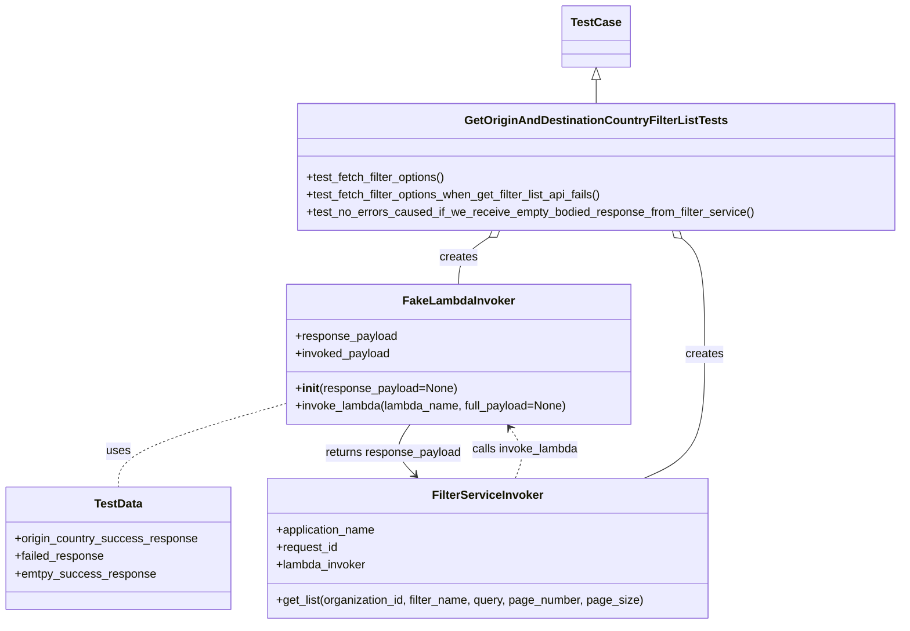
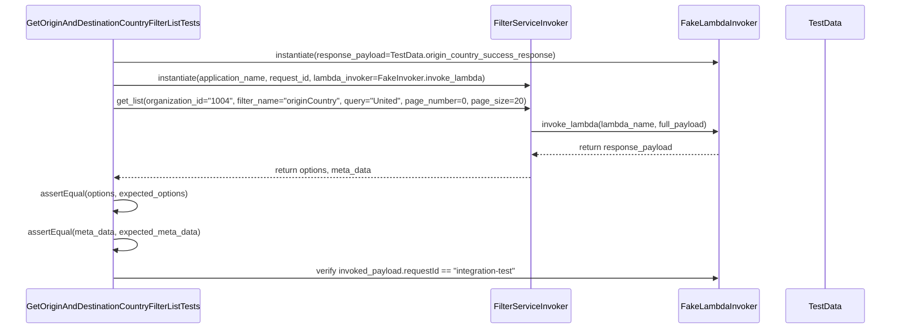

# Diagram: entity_core/entity_search/tests/unit_tests/common/test_get_origin_and_destination_country_filter_list.py

> Auto-generated by Obscura crawlers

## Diagram 1

### SVG

<svg id="container" width="1230.4296875" xmlns="http://www.w3.org/2000/svg" class="classDiagram" height="856" viewBox="0 0 1230.4296875 856" role="graphics-document document" aria-roledescription="class"><g><defs><marker id="container_class-aggregationStart" class="marker aggregation class" refX="18" refY="7" markerWidth="190" markerHeight="240" orient="auto"><path d="M 18,7 L9,13 L1,7 L9,1 Z"></path></marker></defs><defs><marker id="container_class-aggregationEnd" class="marker aggregation class" refX="1" refY="7" markerWidth="20" markerHeight="28" orient="auto"><path d="M 18,7 L9,13 L1,7 L9,1 Z"></path></marker></defs><defs><marker id="container_class-extensionStart" class="marker extension class" refX="18" refY="7" markerWidth="190" markerHeight="240" orient="auto"><path d="M 1,7 L18,13 V 1 Z"></path></marker></defs><defs><marker id="container_class-extensionEnd" class="marker extension class" refX="1" refY="7" markerWidth="20" markerHeight="28" orient="auto"><path d="M 1,1 V 13 L18,7 Z"></path></marker></defs><defs><marker id="container_class-compositionStart" class="marker composition class" refX="18" refY="7" markerWidth="190" markerHeight="240" orient="auto"><path d="M 18,7 L9,13 L1,7 L9,1 Z"></path></marker></defs><defs><marker id="container_class-compositionEnd" class="marker composition class" refX="1" refY="7" markerWidth="20" markerHeight="28" orient="auto"><path d="M 18,7 L9,13 L1,7 L9,1 Z"></path></marker></defs><defs><marker id="container_class-dependencyStart" class="marker dependency class" refX="6" refY="7" markerWidth="190" markerHeight="240" orient="auto"><path d="M 5,7 L9,13 L1,7 L9,1 Z"></path></marker></defs><defs><marker id="container_class-dependencyEnd" class="marker dependency class" refX="13" refY="7" markerWidth="20" markerHeight="28" orient="auto"><path d="M 18,7 L9,13 L14,7 L9,1 Z"></path></marker></defs><defs><marker id="container_class-lollipopStart" class="marker lollipop class" refX="13" refY="7" markerWidth="190" markerHeight="240" orient="auto"><circle stroke="black" fill="transparent" cx="7" cy="7" r="6"></circle></marker></defs><defs><marker id="container_class-lollipopEnd" class="marker lollipop class" refX="1" refY="7" markerWidth="190" markerHeight="240" orient="auto"><circle stroke="black" fill="transparent" cx="7" cy="7" r="6"></circle></marker></defs><g class="root"><g class="clusters"></g><g class="edgePaths"><path d="M816.137,109.25L816.137,110.542C816.137,111.833,816.137,114.417,816.137,119.875C816.137,125.333,816.137,133.667,816.137,137.833L816.137,142" id="id_TestCase_GetOriginAndDestinationCountryFilterListTests_1" class="edge-thickness-normal edge-pattern-solid relation" style=";;;" data-edge="true" data-et="edge" data-id="id_TestCase_GetOriginAndDestinationCountryFilterListTests_1" data-points="W3sieCI6ODE2LjEzNjcxODc1LCJ5Ijo5Mn0seyJ4Ijo4MTYuMTM2NzE4NzUsInkiOjExN30seyJ4Ijo4MTYuMTM2NzE4NzUsInkiOjE0Mn1d" marker-start="url(#container_class-extensionStart)"></path><path d="M670.256,325.518L663.333,330.099C656.41,334.679,642.564,343.839,635.642,354.586C628.719,365.333,628.719,377.667,628.719,383.833L628.719,390" id="id_GetOriginAndDestinationCountryFilterListTests_FakeLambdaInvoker_2" class="edge-thickness-normal edge-pattern-solid relation" style=";;;" data-edge="true" data-et="edge" data-id="id_GetOriginAndDestinationCountryFilterListTests_FakeLambdaInvoker_2" data-points="W3sieCI6Njg0LjY0MTg1MzU3ODYyOSwieSI6MzE2fSx7IngiOjYyOC43MTg3NSwieSI6MzUzfSx7IngiOjYyOC43MTg3NSwieSI6MzkwfV0=" marker-start="url(#container_class-aggregationStart)"></path><path d="M933.991,327.031L939.194,331.359C944.398,335.687,954.804,344.344,960.008,370.839C965.211,397.333,965.211,441.667,965.211,486C965.211,530.333,965.211,574.667,951.387,603C937.563,631.333,909.915,643.667,896.091,649.833L882.267,656" id="id_GetOriginAndDestinationCountryFilterListTests_FilterServiceInvoker_3" class="edge-thickness-normal edge-pattern-solid relation" style=";;;" data-edge="true" data-et="edge" data-id="id_GetOriginAndDestinationCountryFilterListTests_FilterServiceInvoker_3" data-points="W3sieCI6OTIwLjcyOTExNDE2MzMwNjUsInkiOjMxNn0seyJ4Ijo5NjUuMjEwOTM3NSwieSI6MzUzfSx7IngiOjk2NS4yMTA5Mzc1LCJ5Ijo0ODZ9LHsieCI6OTY1LjIxMDkzNzUsInkiOjYxOX0seyJ4Ijo4ODIuMjY3Mzg3MjE4MDQ1MSwieSI6NjU2fV0=" marker-start="url(#container_class-aggregationStart)"></path><path d="M391.742,553.433L353.339,564.36C314.935,575.288,238.128,597.144,199.724,616.239C161.32,635.333,161.32,651.667,161.32,659.833L161.32,668" id="id_FakeLambdaInvoker_TestData_4" class="edge-thickness-normal edge-pattern-dashed relation" style=";;;" data-edge="true" data-et="edge" data-id="id_FakeLambdaInvoker_TestData_4" data-points="W3sieCI6MzkxLjc0MjE4NzUsInkiOjU1My40MzI1ODA2MDc0MTh9LHsieCI6MTYxLjMyMDMxMjUsInkiOjYxOX0seyJ4IjoxNjEuMzIwMzEyNSwieSI6NjY4fV0="></path><path d="M707.289,656L709.873,649.833C712.457,643.667,717.625,631.333,716.425,619.816C715.224,608.299,707.655,597.599,703.871,592.249L700.087,586.898" id="id_FilterServiceInvoker_FakeLambdaInvoker_5" class="edge-thickness-normal edge-pattern-dashed relation" style=";;;" data-edge="true" data-et="edge" data-id="id_FilterServiceInvoker_FakeLambdaInvoker_5" data-points="W3sieCI6NzA3LjI4OTAwMzc1OTM5ODUsInkiOjY1Nn0seyJ4Ijo3MjIuNzkyOTY4NzUsInkiOjYxOX0seyJ4Ijo2OTYuNjIxOTQ1NDg4NzIxOCwieSI6NTgyfV0=" marker-end="url(#container_class-dependencyEnd)"></path><path d="M560.816,582L556.454,588.167C552.092,594.333,543.368,606.667,544.44,618.291C545.513,629.916,556.381,640.832,561.815,646.29L567.249,651.748" id="id_FakeLambdaInvoker_FilterServiceInvoker_6" class="edge-thickness-normal edge-pattern-solid relation" style=";;;" data-edge="true" data-et="edge" data-id="id_FakeLambdaInvoker_FilterServiceInvoker_6" data-points="W3sieCI6NTYwLjgxNTU1NDUxMTI3ODIsInkiOjU4Mn0seyJ4Ijo1MzQuNjQ0NTMxMjUsInkiOjYxOX0seyJ4Ijo1NzEuNDgyNjEyNzgxOTU0OSwieSI6NjU2fV0=" marker-end="url(#container_class-dependencyEnd)"></path></g><g class="edgeLabels"><g class="edgeLabel"><g class="label" data-id="id_TestCase_GetOriginAndDestinationCountryFilterListTests_1" transform="translate(0, 0)"><foreignObject width="0" height="0">

</foreignObject></g></g><g class="edgeLabel" transform="translate(628.71875, 353)"><g class="label" data-id="id_GetOriginAndDestinationCountryFilterListTests_FakeLambdaInvoker_2" transform="translate(-26.171875, -12)"><foreignObject width="52.34375" height="24">

creates

</foreignObject></g></g><g class="edgeLabel" transform="translate(965.2109375, 486)"><g class="label" data-id="id_GetOriginAndDestinationCountryFilterListTests_FilterServiceInvoker_3" transform="translate(-26.171875, -12)"><foreignObject width="52.34375" height="24">

creates

</foreignObject></g></g><g class="edgeLabel" transform="translate(161.3203125, 619)"><g class="label" data-id="id_FakeLambdaInvoker_TestData_4" transform="translate(-16.4921875, -12)"><foreignObject width="32.984375" height="24">

uses

</foreignObject></g></g><g class="edgeLabel" transform="translate(721.29062, 616.87601)"><g class="label" data-id="id_FilterServiceInvoker_FakeLambdaInvoker_5" transform="translate(-73.734375, -12)"><foreignObject width="147.46875" height="24">

calls invoke_lambda

</foreignObject></g></g><g class="edgeLabel" transform="translate(537.07563, 621.44178)"><g class="label" data-id="id_FakeLambdaInvoker_FilterServiceInvoker_6" transform="translate(-94.4140625, -12)"><foreignObject width="188.828125" height="24">

returns response_payload

</foreignObject></g></g></g><g class="nodes"><g class="node default" id="classId-GetOriginAndDestinationCountryFilterListTests-0" transform="translate(816.13671875, 229)"><g class="basic label-container"><path d="M-406.29296875 -87 L406.29296875 -87 L406.29296875 87 L-406.29296875 87" stroke="none" stroke-width="0" fill="#ECECFF" style=""></path><path d="M-406.29296875 -87 C-98.35879616937024 -87, 209.57537641125953 -87, 406.29296875 -87 M-406.29296875 -87 C-210.78342660398877 -87, -15.273884457977545 -87, 406.29296875 -87 M406.29296875 -87 C406.29296875 -42.26969024604829, 406.29296875 2.4606195079034165, 406.29296875 87 M406.29296875 -87 C406.29296875 -50.39843509623855, 406.29296875 -13.796870192477101, 406.29296875 87 M406.29296875 87 C126.00048475720195 87, -154.2919992355961 87, -406.29296875 87 M406.29296875 87 C198.93859670484895 87, -8.415775340302105 87, -406.29296875 87 M-406.29296875 87 C-406.29296875 50.902803516966564, -406.29296875 14.805607033933128, -406.29296875 -87 M-406.29296875 87 C-406.29296875 32.6153992288537, -406.29296875 -21.769201542292606, -406.29296875 -87" stroke="#9370DB" stroke-width="1.3" fill="none" stroke-dasharray="0 0" style=""></path></g><g class="annotation-group text" transform="translate(0, -63)"></g><g class="label-group text" transform="translate(-171.5703125, -63)"><g class="label" style="font-weight: bolder" transform="translate(0,-12)"><foreignObject width="343.140625" height="24">

GetOriginAndDestinationCountryFilterListTests

</foreignObject></g></g><g class="members-group text" transform="translate(-394.29296875, -15)"></g><g class="methods-group text" transform="translate(-394.29296875, 15)"><g class="label" style="" transform="translate(0,-12)"><foreignObject width="194.625" height="24">

+test_fetch_filter_options()

</foreignObject></g><g class="label" style="" transform="translate(0,12)"><foreignObject width="413.03125" height="24">

+test_fetch_filter_options_when_get_filter_list_api_fails()

</foreignObject></g><g class="label" style="" transform="translate(0,36)"><foreignObject width="617.015625" height="24">

+test_no_errors_caused_if_we_receive_empty_bodied_response_from_filter_service()

</foreignObject></g></g><g class="divider" style=""><path d="M-406.29296875 -39 C-167.78071640193266 -39, 70.73153594613467 -39, 406.29296875 -39 M-406.29296875 -39 C-130.2194898762258 -39, 145.8539889975484 -39, 406.29296875 -39" stroke="#9370DB" stroke-width="1.3" fill="none" stroke-dasharray="0 0" style=""></path></g><g class="divider" style=""><path d="M-406.29296875 -15 C-151.04406138703757 -15, 104.20484597592485 -15, 406.29296875 -15 M-406.29296875 -15 C-82.01280319231523 -15, 242.26736236536954 -15, 406.29296875 -15" stroke="#9370DB" stroke-width="1.3" fill="none" stroke-dasharray="0 0" style=""></path></g></g><g class="node default" id="classId-FakeLambdaInvoker-1" transform="translate(628.71875, 486)"><g class="basic label-container"><path d="M-236.9765625 -96 L236.9765625 -96 L236.9765625 96 L-236.9765625 96" stroke="none" stroke-width="0" fill="#ECECFF" style=""></path><path d="M-236.9765625 -96 C-66.06336482226439 -96, 104.84983285547122 -96, 236.9765625 -96 M-236.9765625 -96 C-80.86635753041963 -96, 75.24384743916073 -96, 236.9765625 -96 M236.9765625 -96 C236.9765625 -54.492290199215695, 236.9765625 -12.98458039843139, 236.9765625 96 M236.9765625 -96 C236.9765625 -47.06579166983195, 236.9765625 1.868416660336095, 236.9765625 96 M236.9765625 96 C56.629594157877676 96, -123.71737418424465 96, -236.9765625 96 M236.9765625 96 C140.45599736672142 96, 43.93543223344287 96, -236.9765625 96 M-236.9765625 96 C-236.9765625 37.5141492224284, -236.9765625 -20.9717015551432, -236.9765625 -96 M-236.9765625 96 C-236.9765625 42.599127531294485, -236.9765625 -10.80174493741103, -236.9765625 -96" stroke="#9370DB" stroke-width="1.3" fill="none" stroke-dasharray="0 0" style=""></path></g><g class="annotation-group text" transform="translate(0, -72)"></g><g class="label-group text" transform="translate(-73.21875, -72)"><g class="label" style="font-weight: bolder" transform="translate(0,-12)"><foreignObject width="146.4375" height="24">

FakeLambdaInvoker

</foreignObject></g></g><g class="members-group text" transform="translate(-224.9765625, -24)"><g class="label" style="" transform="translate(0,-12)"><foreignObject width="140.046875" height="24">

+response_payload

</foreignObject></g><g class="label" style="" transform="translate(0,12)"><foreignObject width="131.3125" height="24">

+invoked_payload

</foreignObject></g></g><g class="methods-group text" transform="translate(-224.9765625, 48)"><g class="label" style="" transform="translate(0,-12)"><foreignObject width="221.21875" height="24">

+<strong>init</strong>(response_payload=None)

</foreignObject></g><g class="label" style="" transform="translate(0,12)"><foreignObject width="376.734375" height="24">

+invoke_lambda(lambda_name, full_payload=None)

</foreignObject></g></g><g class="divider" style=""><path d="M-236.9765625 -48 C-125.42578764037114 -48, -13.875012780742281 -48, 236.9765625 -48 M-236.9765625 -48 C-72.46775607909308 -48, 92.04105034181384 -48, 236.9765625 -48" stroke="#9370DB" stroke-width="1.3" fill="none" stroke-dasharray="0 0" style=""></path></g><g class="divider" style=""><path d="M-236.9765625 24 C-131.50311724144916 24, -26.02967198289835 24, 236.9765625 24 M-236.9765625 24 C-107.59567806078303 24, 21.78520637843394 24, 236.9765625 24" stroke="#9370DB" stroke-width="1.3" fill="none" stroke-dasharray="0 0" style=""></path></g></g><g class="node default" id="classId-TestData-2" transform="translate(161.3203125, 752)"><g class="basic label-container"><path d="M-153.3203125 -84 L153.3203125 -84 L153.3203125 84 L-153.3203125 84" stroke="none" stroke-width="0" fill="#ECECFF" style=""></path><path d="M-153.3203125 -84 C-70.44207745311265 -84, 12.436157593774709 -84, 153.3203125 -84 M-153.3203125 -84 C-51.630554359902334 -84, 50.05920378019533 -84, 153.3203125 -84 M153.3203125 -84 C153.3203125 -38.125011638262414, 153.3203125 7.7499767234751715, 153.3203125 84 M153.3203125 -84 C153.3203125 -45.09537656646102, 153.3203125 -6.19075313292204, 153.3203125 84 M153.3203125 84 C49.9034657496168 84, -53.5133810007664 84, -153.3203125 84 M153.3203125 84 C51.166866678730514 84, -50.98657914253897 84, -153.3203125 84 M-153.3203125 84 C-153.3203125 38.15237780133497, -153.3203125 -7.6952443973300575, -153.3203125 -84 M-153.3203125 84 C-153.3203125 19.294801950252904, -153.3203125 -45.41039609949419, -153.3203125 -84" stroke="#9370DB" stroke-width="1.3" fill="none" stroke-dasharray="0 0" style=""></path></g><g class="annotation-group text" transform="translate(0, -60)"></g><g class="label-group text" transform="translate(-32.140625, -60)"><g class="label" style="font-weight: bolder" transform="translate(0,-12)"><foreignObject width="64.28125" height="24">

TestData

</foreignObject></g></g><g class="members-group text" transform="translate(-141.3203125, -12)"><g class="label" style="" transform="translate(0,-12)"><foreignObject width="250.5" height="24">

+origin_country_success_response

</foreignObject></g><g class="label" style="" transform="translate(0,12)"><foreignObject width="123.5" height="24">

+failed_response

</foreignObject></g><g class="label" style="" transform="translate(0,36)"><foreignObject width="190.59375" height="24">

+emtpy_success_response

</foreignObject></g></g><g class="methods-group text" transform="translate(-141.3203125, 84)"></g><g class="divider" style=""><path d="M-153.3203125 -36 C-51.96801378832973 -36, 49.384284923340545 -36, 153.3203125 -36 M-153.3203125 -36 C-54.3156575832939 -36, 44.6889973334122 -36, 153.3203125 -36" stroke="#9370DB" stroke-width="1.3" fill="none" stroke-dasharray="0 0" style=""></path></g><g class="divider" style=""><path d="M-153.3203125 60 C-88.82621419330071 60, -24.33211588660143 60, 153.3203125 60 M-153.3203125 60 C-77.16990777191918 60, -1.0195030438383696 60, 153.3203125 60" stroke="#9370DB" stroke-width="1.3" fill="none" stroke-dasharray="0 0" style=""></path></g></g><g class="node default" id="classId-FilterServiceInvoker-3" transform="translate(667.0625, 752)"><g class="basic label-container"><path d="M-302.421875 -96 L302.421875 -96 L302.421875 96 L-302.421875 96" stroke="none" stroke-width="0" fill="#ECECFF" style=""></path><path d="M-302.421875 -96 C-99.39201297201649 -96, 103.63784905596702 -96, 302.421875 -96 M-302.421875 -96 C-118.54645529825518 -96, 65.32896440348964 -96, 302.421875 -96 M302.421875 -96 C302.421875 -56.96096292632707, 302.421875 -17.92192585265414, 302.421875 96 M302.421875 -96 C302.421875 -56.497026451995204, 302.421875 -16.994052903990408, 302.421875 96 M302.421875 96 C167.7680159254054 96, 33.11415685081079 96, -302.421875 96 M302.421875 96 C131.18270257292625 96, -40.05646985414751 96, -302.421875 96 M-302.421875 96 C-302.421875 20.236200767763847, -302.421875 -55.527598464472305, -302.421875 -96 M-302.421875 96 C-302.421875 45.739997765772245, -302.421875 -4.520004468455511, -302.421875 -96" stroke="#9370DB" stroke-width="1.3" fill="none" stroke-dasharray="0 0" style=""></path></g><g class="annotation-group text" transform="translate(0, -72)"></g><g class="label-group text" transform="translate(-73.078125, -72)"><g class="label" style="font-weight: bolder" transform="translate(0,-12)"><foreignObject width="146.15625" height="24">

FilterServiceInvoker

</foreignObject></g></g><g class="members-group text" transform="translate(-290.421875, -24)"><g class="label" style="" transform="translate(0,-12)"><foreignObject width="138.703125" height="24">

+application_name

</foreignObject></g><g class="label" style="" transform="translate(0,12)"><foreignObject width="85.65625" height="24">

+request_id

</foreignObject></g><g class="label" style="" transform="translate(0,36)"><foreignObject width="124.984375" height="24">

+lambda_invoker

</foreignObject></g></g><g class="methods-group text" transform="translate(-290.421875, 72)"><g class="label" style="" transform="translate(0,-12)"><foreignObject width="507.765625" height="24">

+get_list(organization_id, filter_name, query, page_number, page_size)

</foreignObject></g></g><g class="divider" style=""><path d="M-302.421875 -48 C-72.9266487387134 -48, 156.5685775225732 -48, 302.421875 -48 M-302.421875 -48 C-90.33329196750228 -48, 121.75529106499545 -48, 302.421875 -48" stroke="#9370DB" stroke-width="1.3" fill="none" stroke-dasharray="0 0" style=""></path></g><g class="divider" style=""><path d="M-302.421875 48 C-90.41396296608909 48, 121.59394906782182 48, 302.421875 48 M-302.421875 48 C-113.85952966578938 48, 74.70281566842124 48, 302.421875 48" stroke="#9370DB" stroke-width="1.3" fill="none" stroke-dasharray="0 0" style=""></path></g></g><g class="node default" id="classId-TestCase-4" transform="translate(816.13671875, 50)"><g class="basic label-container"><path d="M-44.359375 -42 L44.359375 -42 L44.359375 42 L-44.359375 42" stroke="none" stroke-width="0" fill="#ECECFF" style=""></path><path d="M-44.359375 -42 C-14.137690230968559 -42, 16.083994538062882 -42, 44.359375 -42 M-44.359375 -42 C-18.764746831901235 -42, 6.829881336197531 -42, 44.359375 -42 M44.359375 -42 C44.359375 -17.918172844255658, 44.359375 6.163654311488685, 44.359375 42 M44.359375 -42 C44.359375 -8.5298430630261, 44.359375 24.9403138739478, 44.359375 42 M44.359375 42 C13.438479106602934 42, -17.482416786794133 42, -44.359375 42 M44.359375 42 C21.881415114360472 42, -0.5965447712790564 42, -44.359375 42 M-44.359375 42 C-44.359375 14.246119986030518, -44.359375 -13.507760027938964, -44.359375 -42 M-44.359375 42 C-44.359375 24.23854862777881, -44.359375 6.4770972555576165, -44.359375 -42" stroke="#9370DB" stroke-width="1.3" fill="none" stroke-dasharray="0 0" style=""></path></g><g class="annotation-group text" transform="translate(0, -18)"></g><g class="label-group text" transform="translate(-32.359375, -18)"><g class="label" style="font-weight: bolder" transform="translate(0,-12)"><foreignObject width="64.71875" height="24">

TestCase

</foreignObject></g></g><g class="members-group text" transform="translate(-32.359375, 30)"></g><g class="methods-group text" transform="translate(-32.359375, 60)"></g><g class="divider" style=""><path d="M-44.359375 6 C-13.60716542031938 6, 17.14504415936124 6, 44.359375 6 M-44.359375 6 C-24.285441782915655 6, -4.211508565831309 6, 44.359375 6" stroke="#9370DB" stroke-width="1.3" fill="none" stroke-dasharray="0 0" style=""></path></g><g class="divider" style=""><path d="M-44.359375 24 C-9.76880086147387 24, 24.82177327705226 24, 44.359375 24 M-44.359375 24 C-18.823971762189842 24, 6.711431475620316 24, 44.359375 24" stroke="#9370DB" stroke-width="1.3" fill="none" stroke-dasharray="0 0" style=""></path></g></g></g></g></g></svg>

## Diagram 2

### SVG

<svg id="container" width="1803" xmlns="http://www.w3.org/2000/svg" height="663" viewBox="-50 -10 1803 663" role="graphics-document document" aria-roledescription="sequence"><g><rect x="1553" y="577" fill="#eaeaea" stroke="#666" width="150" height="65" name="Data" rx="3" ry="3" class="actor actor-bottom"></rect><text x="1628" y="609.5" dominant-baseline="central" alignment-baseline="central" class="actor actor-box" style="text-anchor: middle; font-size: 16px; font-weight: 400;"><tspan x="1628" dy="0">TestData</tspan></text></g><g><rect x="1338" y="577" fill="#eaeaea" stroke="#666" width="165" height="65" name="FakeInvoker" rx="3" ry="3" class="actor actor-bottom"></rect><text x="1420.5" y="609.5" dominant-baseline="central" alignment-baseline="central" class="actor actor-box" style="text-anchor: middle; font-size: 16px; font-weight: 400;"><tspan x="1420.5" dy="0">FakeLambdaInvoker</tspan></text></g><g><rect x="946.5" y="577" fill="#eaeaea" stroke="#666" width="164" height="65" name="Filter" rx="3" ry="3" class="actor actor-bottom"></rect><text x="1028.5" y="609.5" dominant-baseline="central" alignment-baseline="central" class="actor actor-box" style="text-anchor: middle; font-size: 16px; font-weight: 400;"><tspan x="1028.5" dy="0">FilterServiceInvoker</tspan></text></g><g><rect x="0" y="577" fill="#eaeaea" stroke="#666" width="357" height="65" name="Test" rx="3" ry="3" class="actor actor-bottom"></rect><text x="178.5" y="609.5" dominant-baseline="central" alignment-baseline="central" class="actor actor-box" style="text-anchor: middle; font-size: 16px; font-weight: 400;"><tspan x="178.5" dy="0">GetOriginAndDestinationCountryFilterListTests</tspan></text></g><g><line id="actor3" x1="1628" y1="65" x2="1628" y2="577" class="actor-line 200" stroke-width="0.5px" stroke="#999" name="Data"></line><g id="root-3"><rect x="1553" y="0" fill="#eaeaea" stroke="#666" width="150" height="65" name="Data" rx="3" ry="3" class="actor actor-top"></rect><text x="1628" y="32.5" dominant-baseline="central" alignment-baseline="central" class="actor actor-box" style="text-anchor: middle; font-size: 16px; font-weight: 400;"><tspan x="1628" dy="0">TestData</tspan></text></g></g><g><line id="actor2" x1="1420.5" y1="65" x2="1420.5" y2="577" class="actor-line 200" stroke-width="0.5px" stroke="#999" name="FakeInvoker"></line><g id="root-2"><rect x="1338" y="0" fill="#eaeaea" stroke="#666" width="165" height="65" name="FakeInvoker" rx="3" ry="3" class="actor actor-top"></rect><text x="1420.5" y="32.5" dominant-baseline="central" alignment-baseline="central" class="actor actor-box" style="text-anchor: middle; font-size: 16px; font-weight: 400;"><tspan x="1420.5" dy="0">FakeLambdaInvoker</tspan></text></g></g><g><line id="actor1" x1="1028.5" y1="65" x2="1028.5" y2="577" class="actor-line 200" stroke-width="0.5px" stroke="#999" name="Filter"></line><g id="root-1"><rect x="946.5" y="0" fill="#eaeaea" stroke="#666" width="164" height="65" name="Filter" rx="3" ry="3" class="actor actor-top"></rect><text x="1028.5" y="32.5" dominant-baseline="central" alignment-baseline="central" class="actor actor-box" style="text-anchor: middle; font-size: 16px; font-weight: 400;"><tspan x="1028.5" dy="0">FilterServiceInvoker</tspan></text></g></g><g><line id="actor0" x1="178.5" y1="65" x2="178.5" y2="577" class="actor-line 200" stroke-width="0.5px" stroke="#999" name="Test"></line><g id="root-0"><rect x="0" y="0" fill="#eaeaea" stroke="#666" width="357" height="65" name="Test" rx="3" ry="3" class="actor actor-top"></rect><text x="178.5" y="32.5" dominant-baseline="central" alignment-baseline="central" class="actor actor-box" style="text-anchor: middle; font-size: 16px; font-weight: 400;"><tspan x="178.5" dy="0">GetOriginAndDestinationCountryFilterListTests</tspan></text></g></g><g></g><defs><symbol id="computer" width="24" height="24"><path transform="scale(.5)" d="M2 2v13h20v-13h-20zm18 11h-16v-9h16v9zm-10.228 6l.466-1h3.524l.467 1h-4.457zm14.228 3h-24l2-6h2.104l-1.33 4h18.45l-1.297-4h2.073l2 6zm-5-10h-14v-7h14v7z"></path></symbol></defs><defs><symbol id="database" fill-rule="evenodd" clip-rule="evenodd"><path transform="scale(.5)" d="M12.258.001l.256.004.255.005.253.008.251.01.249.012.247.015.246.016.242.019.241.02.239.023.236.024.233.027.231.028.229.031.225.032.223.034.22.036.217.038.214.04.211.041.208.043.205.045.201.046.198.048.194.05.191.051.187.053.183.054.18.056.175.057.172.059.168.06.163.061.16.063.155.064.15.066.074.033.073.033.071.034.07.034.069.035.068.035.067.035.066.035.064.036.064.036.062.036.06.036.06.037.058.037.058.037.055.038.055.038.053.038.052.038.051.039.05.039.048.039.047.039.045.04.044.04.043.04.041.04.04.041.039.041.037.041.036.041.034.041.033.042.032.042.03.042.029.042.027.042.026.043.024.043.023.043.021.043.02.043.018.044.017.043.015.044.013.044.012.044.011.045.009.044.007.045.006.045.004.045.002.045.001.045v17l-.001.045-.002.045-.004.045-.006.045-.007.045-.009.044-.011.045-.012.044-.013.044-.015.044-.017.043-.018.044-.02.043-.021.043-.023.043-.024.043-.026.043-.027.042-.029.042-.03.042-.032.042-.033.042-.034.041-.036.041-.037.041-.039.041-.04.041-.041.04-.043.04-.044.04-.045.04-.047.039-.048.039-.05.039-.051.039-.052.038-.053.038-.055.038-.055.038-.058.037-.058.037-.06.037-.06.036-.062.036-.064.036-.064.036-.066.035-.067.035-.068.035-.069.035-.07.034-.071.034-.073.033-.074.033-.15.066-.155.064-.16.063-.163.061-.168.06-.172.059-.175.057-.18.056-.183.054-.187.053-.191.051-.194.05-.198.048-.201.046-.205.045-.208.043-.211.041-.214.04-.217.038-.22.036-.223.034-.225.032-.229.031-.231.028-.233.027-.236.024-.239.023-.241.02-.242.019-.246.016-.247.015-.249.012-.251.01-.253.008-.255.005-.256.004-.258.001-.258-.001-.256-.004-.255-.005-.253-.008-.251-.01-.249-.012-.247-.015-.245-.016-.243-.019-.241-.02-.238-.023-.236-.024-.234-.027-.231-.028-.228-.031-.226-.032-.223-.034-.22-.036-.217-.038-.214-.04-.211-.041-.208-.043-.204-.045-.201-.046-.198-.048-.195-.05-.19-.051-.187-.053-.184-.054-.179-.056-.176-.057-.172-.059-.167-.06-.164-.061-.159-.063-.155-.064-.151-.066-.074-.033-.072-.033-.072-.034-.07-.034-.069-.035-.068-.035-.067-.035-.066-.035-.064-.036-.063-.036-.062-.036-.061-.036-.06-.037-.058-.037-.057-.037-.056-.038-.055-.038-.053-.038-.052-.038-.051-.039-.049-.039-.049-.039-.046-.039-.046-.04-.044-.04-.043-.04-.041-.04-.04-.041-.039-.041-.037-.041-.036-.041-.034-.041-.033-.042-.032-.042-.03-.042-.029-.042-.027-.042-.026-.043-.024-.043-.023-.043-.021-.043-.02-.043-.018-.044-.017-.043-.015-.044-.013-.044-.012-.044-.011-.045-.009-.044-.007-.045-.006-.045-.004-.045-.002-.045-.001-.045v-17l.001-.045.002-.045.004-.045.006-.045.007-.045.009-.044.011-.045.012-.044.013-.044.015-.044.017-.043.018-.044.02-.043.021-.043.023-.043.024-.043.026-.043.027-.042.029-.042.03-.042.032-.042.033-.042.034-.041.036-.041.037-.041.039-.041.04-.041.041-.04.043-.04.044-.04.046-.04.046-.039.049-.039.049-.039.051-.039.052-.038.053-.038.055-.038.056-.038.057-.037.058-.037.06-.037.061-.036.062-.036.063-.036.064-.036.066-.035.067-.035.068-.035.069-.035.07-.034.072-.034.072-.033.074-.033.151-.066.155-.064.159-.063.164-.061.167-.06.172-.059.176-.057.179-.056.184-.054.187-.053.19-.051.195-.05.198-.048.201-.046.204-.045.208-.043.211-.041.214-.04.217-.038.22-.036.223-.034.226-.032.228-.031.231-.028.234-.027.236-.024.238-.023.241-.02.243-.019.245-.016.247-.015.249-.012.251-.01.253-.008.255-.005.256-.004.258-.001.258.001zm-9.258 20.499v.01l.001.021.003.021.004.022.005.021.006.022.007.022.009.023.01.022.011.023.012.023.013.023.015.023.016.024.017.023.018.024.019.024.021.024.022.025.023.024.024.025.052.049.056.05.061.051.066.051.07.051.075.051.079.052.084.052.088.052.092.052.097.052.102.051.105.052.11.052.114.051.119.051.123.051.127.05.131.05.135.05.139.048.144.049.147.047.152.047.155.047.16.045.163.045.167.043.171.043.176.041.178.041.183.039.187.039.19.037.194.035.197.035.202.033.204.031.209.03.212.029.216.027.219.025.222.024.226.021.23.02.233.018.236.016.24.015.243.012.246.01.249.008.253.005.256.004.259.001.26-.001.257-.004.254-.005.25-.008.247-.011.244-.012.241-.014.237-.016.233-.018.231-.021.226-.021.224-.024.22-.026.216-.027.212-.028.21-.031.205-.031.202-.034.198-.034.194-.036.191-.037.187-.039.183-.04.179-.04.175-.042.172-.043.168-.044.163-.045.16-.046.155-.046.152-.047.148-.048.143-.049.139-.049.136-.05.131-.05.126-.05.123-.051.118-.052.114-.051.11-.052.106-.052.101-.052.096-.052.092-.052.088-.053.083-.051.079-.052.074-.052.07-.051.065-.051.06-.051.056-.05.051-.05.023-.024.023-.025.021-.024.02-.024.019-.024.018-.024.017-.024.015-.023.014-.024.013-.023.012-.023.01-.023.01-.022.008-.022.006-.022.006-.022.004-.022.004-.021.001-.021.001-.021v-4.127l-.077.055-.08.053-.083.054-.085.053-.087.052-.09.052-.093.051-.095.05-.097.05-.1.049-.102.049-.105.048-.106.047-.109.047-.111.046-.114.045-.115.045-.118.044-.12.043-.122.042-.124.042-.126.041-.128.04-.13.04-.132.038-.134.038-.135.037-.138.037-.139.035-.142.035-.143.034-.144.033-.147.032-.148.031-.15.03-.151.03-.153.029-.154.027-.156.027-.158.026-.159.025-.161.024-.162.023-.163.022-.165.021-.166.02-.167.019-.169.018-.169.017-.171.016-.173.015-.173.014-.175.013-.175.012-.177.011-.178.01-.179.008-.179.008-.181.006-.182.005-.182.004-.184.003-.184.002h-.37l-.184-.002-.184-.003-.182-.004-.182-.005-.181-.006-.179-.008-.179-.008-.178-.01-.176-.011-.176-.012-.175-.013-.173-.014-.172-.015-.171-.016-.17-.017-.169-.018-.167-.019-.166-.02-.165-.021-.163-.022-.162-.023-.161-.024-.159-.025-.157-.026-.156-.027-.155-.027-.153-.029-.151-.03-.15-.03-.148-.031-.146-.032-.145-.033-.143-.034-.141-.035-.14-.035-.137-.037-.136-.037-.134-.038-.132-.038-.13-.04-.128-.04-.126-.041-.124-.042-.122-.042-.12-.044-.117-.043-.116-.045-.113-.045-.112-.046-.109-.047-.106-.047-.105-.048-.102-.049-.1-.049-.097-.05-.095-.05-.093-.052-.09-.051-.087-.052-.085-.053-.083-.054-.08-.054-.077-.054v4.127zm0-5.654v.011l.001.021.003.021.004.021.005.022.006.022.007.022.009.022.01.022.011.023.012.023.013.023.015.024.016.023.017.024.018.024.019.024.021.024.022.024.023.025.024.024.052.05.056.05.061.05.066.051.07.051.075.052.079.051.084.052.088.052.092.052.097.052.102.052.105.052.11.051.114.051.119.052.123.05.127.051.131.05.135.049.139.049.144.048.147.048.152.047.155.046.16.045.163.045.167.044.171.042.176.042.178.04.183.04.187.038.19.037.194.036.197.034.202.033.204.032.209.03.212.028.216.027.219.025.222.024.226.022.23.02.233.018.236.016.24.014.243.012.246.01.249.008.253.006.256.003.259.001.26-.001.257-.003.254-.006.25-.008.247-.01.244-.012.241-.015.237-.016.233-.018.231-.02.226-.022.224-.024.22-.025.216-.027.212-.029.21-.03.205-.032.202-.033.198-.035.194-.036.191-.037.187-.039.183-.039.179-.041.175-.042.172-.043.168-.044.163-.045.16-.045.155-.047.152-.047.148-.048.143-.048.139-.05.136-.049.131-.05.126-.051.123-.051.118-.051.114-.052.11-.052.106-.052.101-.052.096-.052.092-.052.088-.052.083-.052.079-.052.074-.051.07-.052.065-.051.06-.05.056-.051.051-.049.023-.025.023-.024.021-.025.02-.024.019-.024.018-.024.017-.024.015-.023.014-.023.013-.024.012-.022.01-.023.01-.023.008-.022.006-.022.006-.022.004-.021.004-.022.001-.021.001-.021v-4.139l-.077.054-.08.054-.083.054-.085.052-.087.053-.09.051-.093.051-.095.051-.097.05-.1.049-.102.049-.105.048-.106.047-.109.047-.111.046-.114.045-.115.044-.118.044-.12.044-.122.042-.124.042-.126.041-.128.04-.13.039-.132.039-.134.038-.135.037-.138.036-.139.036-.142.035-.143.033-.144.033-.147.033-.148.031-.15.03-.151.03-.153.028-.154.028-.156.027-.158.026-.159.025-.161.024-.162.023-.163.022-.165.021-.166.02-.167.019-.169.018-.169.017-.171.016-.173.015-.173.014-.175.013-.175.012-.177.011-.178.009-.179.009-.179.007-.181.007-.182.005-.182.004-.184.003-.184.002h-.37l-.184-.002-.184-.003-.182-.004-.182-.005-.181-.007-.179-.007-.179-.009-.178-.009-.176-.011-.176-.012-.175-.013-.173-.014-.172-.015-.171-.016-.17-.017-.169-.018-.167-.019-.166-.02-.165-.021-.163-.022-.162-.023-.161-.024-.159-.025-.157-.026-.156-.027-.155-.028-.153-.028-.151-.03-.15-.03-.148-.031-.146-.033-.145-.033-.143-.033-.141-.035-.14-.036-.137-.036-.136-.037-.134-.038-.132-.039-.13-.039-.128-.04-.126-.041-.124-.042-.122-.043-.12-.043-.117-.044-.116-.044-.113-.046-.112-.046-.109-.046-.106-.047-.105-.048-.102-.049-.1-.049-.097-.05-.095-.051-.093-.051-.09-.051-.087-.053-.085-.052-.083-.054-.08-.054-.077-.054v4.139zm0-5.666v.011l.001.02.003.022.004.021.005.022.006.021.007.022.009.023.01.022.011.023.012.023.013.023.015.023.016.024.017.024.018.023.019.024.021.025.022.024.023.024.024.025.052.05.056.05.061.05.066.051.07.051.075.052.079.051.084.052.088.052.092.052.097.052.102.052.105.051.11.052.114.051.119.051.123.051.127.05.131.05.135.05.139.049.144.048.147.048.152.047.155.046.16.045.163.045.167.043.171.043.176.042.178.04.183.04.187.038.19.037.194.036.197.034.202.033.204.032.209.03.212.028.216.027.219.025.222.024.226.021.23.02.233.018.236.017.24.014.243.012.246.01.249.008.253.006.256.003.259.001.26-.001.257-.003.254-.006.25-.008.247-.01.244-.013.241-.014.237-.016.233-.018.231-.02.226-.022.224-.024.22-.025.216-.027.212-.029.21-.03.205-.032.202-.033.198-.035.194-.036.191-.037.187-.039.183-.039.179-.041.175-.042.172-.043.168-.044.163-.045.16-.045.155-.047.152-.047.148-.048.143-.049.139-.049.136-.049.131-.051.126-.05.123-.051.118-.052.114-.051.11-.052.106-.052.101-.052.096-.052.092-.052.088-.052.083-.052.079-.052.074-.052.07-.051.065-.051.06-.051.056-.05.051-.049.023-.025.023-.025.021-.024.02-.024.019-.024.018-.024.017-.024.015-.023.014-.024.013-.023.012-.023.01-.022.01-.023.008-.022.006-.022.006-.022.004-.022.004-.021.001-.021.001-.021v-4.153l-.077.054-.08.054-.083.053-.085.053-.087.053-.09.051-.093.051-.095.051-.097.05-.1.049-.102.048-.105.048-.106.048-.109.046-.111.046-.114.046-.115.044-.118.044-.12.043-.122.043-.124.042-.126.041-.128.04-.13.039-.132.039-.134.038-.135.037-.138.036-.139.036-.142.034-.143.034-.144.033-.147.032-.148.032-.15.03-.151.03-.153.028-.154.028-.156.027-.158.026-.159.024-.161.024-.162.023-.163.023-.165.021-.166.02-.167.019-.169.018-.169.017-.171.016-.173.015-.173.014-.175.013-.175.012-.177.01-.178.01-.179.009-.179.007-.181.006-.182.006-.182.004-.184.003-.184.001-.185.001-.185-.001-.184-.001-.184-.003-.182-.004-.182-.006-.181-.006-.179-.007-.179-.009-.178-.01-.176-.01-.176-.012-.175-.013-.173-.014-.172-.015-.171-.016-.17-.017-.169-.018-.167-.019-.166-.02-.165-.021-.163-.023-.162-.023-.161-.024-.159-.024-.157-.026-.156-.027-.155-.028-.153-.028-.151-.03-.15-.03-.148-.032-.146-.032-.145-.033-.143-.034-.141-.034-.14-.036-.137-.036-.136-.037-.134-.038-.132-.039-.13-.039-.128-.041-.126-.041-.124-.041-.122-.043-.12-.043-.117-.044-.116-.044-.113-.046-.112-.046-.109-.046-.106-.048-.105-.048-.102-.048-.1-.05-.097-.049-.095-.051-.093-.051-.09-.052-.087-.052-.085-.053-.083-.053-.08-.054-.077-.054v4.153zm8.74-8.179l-.257.004-.254.005-.25.008-.247.011-.244.012-.241.014-.237.016-.233.018-.231.021-.226.022-.224.023-.22.026-.216.027-.212.028-.21.031-.205.032-.202.033-.198.034-.194.036-.191.038-.187.038-.183.04-.179.041-.175.042-.172.043-.168.043-.163.045-.16.046-.155.046-.152.048-.148.048-.143.048-.139.049-.136.05-.131.05-.126.051-.123.051-.118.051-.114.052-.11.052-.106.052-.101.052-.096.052-.092.052-.088.052-.083.052-.079.052-.074.051-.07.052-.065.051-.06.05-.056.05-.051.05-.023.025-.023.024-.021.024-.02.025-.019.024-.018.024-.017.023-.015.024-.014.023-.013.023-.012.023-.01.023-.01.022-.008.022-.006.023-.006.021-.004.022-.004.021-.001.021-.001.021.001.021.001.021.004.021.004.022.006.021.006.023.008.022.01.022.01.023.012.023.013.023.014.023.015.024.017.023.018.024.019.024.02.025.021.024.023.024.023.025.051.05.056.05.06.05.065.051.07.052.074.051.079.052.083.052.088.052.092.052.096.052.101.052.106.052.11.052.114.052.118.051.123.051.126.051.131.05.136.05.139.049.143.048.148.048.152.048.155.046.16.046.163.045.168.043.172.043.175.042.179.041.183.04.187.038.191.038.194.036.198.034.202.033.205.032.21.031.212.028.216.027.22.026.224.023.226.022.231.021.233.018.237.016.241.014.244.012.247.011.25.008.254.005.257.004.26.001.26-.001.257-.004.254-.005.25-.008.247-.011.244-.012.241-.014.237-.016.233-.018.231-.021.226-.022.224-.023.22-.026.216-.027.212-.028.21-.031.205-.032.202-.033.198-.034.194-.036.191-.038.187-.038.183-.04.179-.041.175-.042.172-.043.168-.043.163-.045.16-.046.155-.046.152-.048.148-.048.143-.048.139-.049.136-.05.131-.05.126-.051.123-.051.118-.051.114-.052.11-.052.106-.052.101-.052.096-.052.092-.052.088-.052.083-.052.079-.052.074-.051.07-.052.065-.051.06-.05.056-.05.051-.05.023-.025.023-.024.021-.024.02-.025.019-.024.018-.024.017-.023.015-.024.014-.023.013-.023.012-.023.01-.023.01-.022.008-.022.006-.023.006-.021.004-.022.004-.021.001-.021.001-.021-.001-.021-.001-.021-.004-.021-.004-.022-.006-.021-.006-.023-.008-.022-.01-.022-.01-.023-.012-.023-.013-.023-.014-.023-.015-.024-.017-.023-.018-.024-.019-.024-.02-.025-.021-.024-.023-.024-.023-.025-.051-.05-.056-.05-.06-.05-.065-.051-.07-.052-.074-.051-.079-.052-.083-.052-.088-.052-.092-.052-.096-.052-.101-.052-.106-.052-.11-.052-.114-.052-.118-.051-.123-.051-.126-.051-.131-.05-.136-.05-.139-.049-.143-.048-.148-.048-.152-.048-.155-.046-.16-.046-.163-.045-.168-.043-.172-.043-.175-.042-.179-.041-.183-.04-.187-.038-.191-.038-.194-.036-.198-.034-.202-.033-.205-.032-.21-.031-.212-.028-.216-.027-.22-.026-.224-.023-.226-.022-.231-.021-.233-.018-.237-.016-.241-.014-.244-.012-.247-.011-.25-.008-.254-.005-.257-.004-.26-.001-.26.001z"></path></symbol></defs><defs><symbol id="clock" width="24" height="24"><path transform="scale(.5)" d="M12 2c5.514 0 10 4.486 10 10s-4.486 10-10 10-10-4.486-10-10 4.486-10 10-10zm0-2c-6.627 0-12 5.373-12 12s5.373 12 12 12 12-5.373 12-12-5.373-12-12-12zm5.848 12.459c.202.038.202.333.001.372-1.907.361-6.045 1.111-6.547 1.111-.719 0-1.301-.582-1.301-1.301 0-.512.77-5.447 1.125-7.445.034-.192.312-.181.343.014l.985 6.238 5.394 1.011z"></path></symbol></defs><defs><marker id="arrowhead" refX="7.9" refY="5" markerUnits="userSpaceOnUse" markerWidth="12" markerHeight="12" orient="auto-start-reverse"><path d="M -1 0 L 10 5 L 0 10 z"></path></marker></defs><defs><marker id="crosshead" markerWidth="15" markerHeight="8" orient="auto" refX="4" refY="4.5"><path fill="none" stroke="#000000" stroke-width="1pt" d="M 1,2 L 6,7 M 6,2 L 1,7" style="stroke-dasharray: 0, 0;"></path></marker></defs><defs><marker id="filled-head" refX="15.5" refY="7" markerWidth="20" markerHeight="28" orient="auto"><path d="M 18,7 L9,13 L14,7 L9,1 Z"></path></marker></defs><defs><marker id="sequencenumber" refX="15" refY="15" markerWidth="60" markerHeight="40" orient="auto"><circle cx="15" cy="15" r="6"></circle></marker></defs><text x="798" y="80" text-anchor="middle" dominant-baseline="middle" alignment-baseline="middle" class="messageText" dy="1em" style="font-size: 16px; font-weight: 400;">instantiate(response_payload=TestData.origin_country_success_response)</text><line x1="179.5" y1="113" x2="1416.5" y2="113" class="messageLine0" stroke-width="2" stroke="none" marker-end="url(#arrowhead)" style="fill: none;"></line><text x="602" y="128" text-anchor="middle" dominant-baseline="middle" alignment-baseline="middle" class="messageText" dy="1em" style="font-size: 16px; font-weight: 400;">instantiate(application_name, request_id, lambda_invoker=FakeInvoker.invoke_lambda)</text><line x1="179.5" y1="161" x2="1024.5" y2="161" class="messageLine0" stroke-width="2" stroke="none" marker-end="url(#arrowhead)" style="fill: none;"></line><text x="602" y="176" text-anchor="middle" dominant-baseline="middle" alignment-baseline="middle" class="messageText" dy="1em" style="font-size: 16px; font-weight: 400;">get_list(organization_id="1004", filter_name="originCountry", query="United", page_number=0, page_size=20)</text><line x1="179.5" y1="209" x2="1024.5" y2="209" class="messageLine0" stroke-width="2" stroke="none" marker-end="url(#arrowhead)" style="fill: none;"></line><text x="1223" y="224" text-anchor="middle" dominant-baseline="middle" alignment-baseline="middle" class="messageText" dy="1em" style="font-size: 16px; font-weight: 400;">invoke_lambda(lambda_name, full_payload)</text><line x1="1029.5" y1="257" x2="1416.5" y2="257" class="messageLine0" stroke-width="2" stroke="none" marker-end="url(#arrowhead)" style="fill: none;"></line><text x="1226" y="272" text-anchor="middle" dominant-baseline="middle" alignment-baseline="middle" class="messageText" dy="1em" style="font-size: 16px; font-weight: 400;">return response_payload</text><line x1="1419.5" y1="305" x2="1032.5" y2="305" class="messageLine1" stroke-width="2" stroke="none" marker-end="url(#arrowhead)" style="stroke-dasharray: 3, 3; fill: none;"></line><text x="605" y="320" text-anchor="middle" dominant-baseline="middle" alignment-baseline="middle" class="messageText" dy="1em" style="font-size: 16px; font-weight: 400;">return options, meta_data</text><line x1="1027.5" y1="353" x2="182.5" y2="353" class="messageLine1" stroke-width="2" stroke="none" marker-end="url(#arrowhead)" style="stroke-dasharray: 3, 3; fill: none;"></line><text x="180" y="368" text-anchor="middle" dominant-baseline="middle" alignment-baseline="middle" class="messageText" dy="1em" style="font-size: 16px; font-weight: 400;">assertEqual(options, expected_options)</text><path d="M 179.5,401 C 239.5,391 239.5,431 179.5,421" class="messageLine0" stroke-width="2" stroke="none" marker-end="url(#arrowhead)" style="fill: none;"></path><text x="180" y="446" text-anchor="middle" dominant-baseline="middle" alignment-baseline="middle" class="messageText" dy="1em" style="font-size: 16px; font-weight: 400;">assertEqual(meta_data, expected_meta_data)</text><path d="M 179.5,479 C 239.5,469 239.5,509 179.5,499" class="messageLine0" stroke-width="2" stroke="none" marker-end="url(#arrowhead)" style="fill: none;"></path><text x="798" y="524" text-anchor="middle" dominant-baseline="middle" alignment-baseline="middle" class="messageText" dy="1em" style="font-size: 16px; font-weight: 400;">verify invoked_payload.requestId == "integration-test"</text><line x1="179.5" y1="557" x2="1416.5" y2="557" class="messageLine0" stroke-width="2" stroke="none" marker-end="url(#arrowhead)" style="fill: none;"></line></svg>
