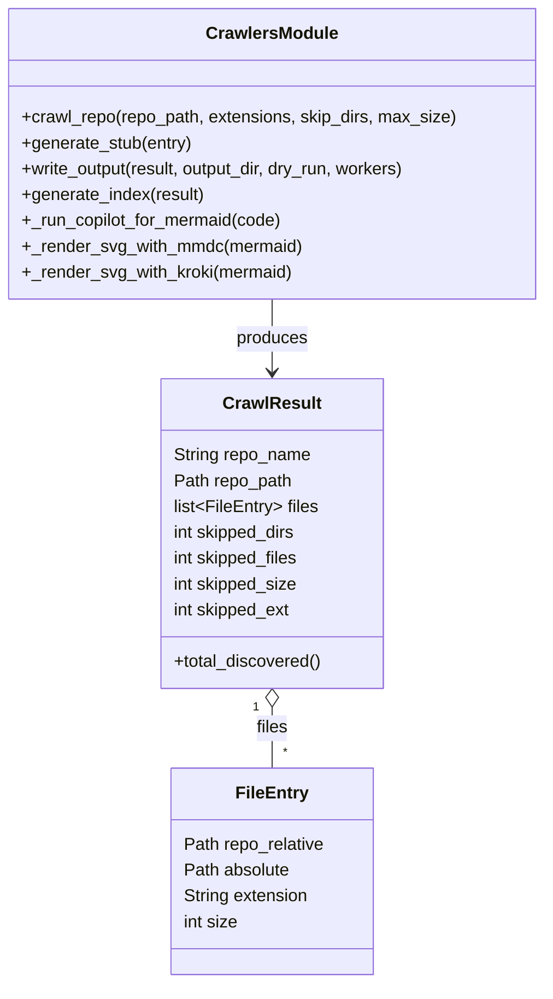

# Diagram: entity_core/entity_service/config/config.dev.yml


> Auto-generated by Obscura crawlers

## Diagram 1

```mermaid
flowchart TD
    A[Crawl Repo] --> B{Is directory?}
    B -- No --> Z[Exit with error]
    B -- Yes --> C[Walk filesystem (os.walk)]
    C --> D[Filter dirs & files (SKIP_DIRS, SKIP_FILES, extensions)]
    D --> E{File passes checks? (size, ext, not skipped)}
    E -- No --> C
    E -- Yes --> F[Create FileEntry]
    F --> G[Collect into CrawlResult]
    G --> H[Generate stubs (copilot -> mermaid)]
    H --> I{Render SVG?}
    I -- mmdc OK --> J[Render with mmdc -> SVG]
    I -- mmdc fail --> K[Render via Kroki -> SVG]
    J --> L[Embed Mermaid + SVG into .md]
    K --> L
    L --> M[Write INDEX.md]
    M --> N[Done]
```

> SVG rendering failed for this diagram.

## Diagram 2



### SVG

<svg id="container" width="504.3515625" xmlns="http://www.w3.org/2000/svg" class="classDiagram" height="914" viewBox="0 0 504.3515625 914" role="graphics-document document" aria-roledescription="class"><style>#container{font-family:"trebuchet ms",verdana,arial,sans-serif;font-size:16px;fill:#333;}@keyframes edge-animation-frame{from{stroke-dashoffset:0;}}@keyframes dash{to{stroke-dashoffset:0;}}#container .edge-animation-slow{stroke-dasharray:9,5!important;stroke-dashoffset:900;animation:dash 50s linear infinite;stroke-linecap:round;}#container .edge-animation-fast{stroke-dasharray:9,5!important;stroke-dashoffset:900;animation:dash 20s linear infinite;stroke-linecap:round;}#container .error-icon{fill:#552222;}#container .error-text{fill:#552222;stroke:#552222;}#container .edge-thickness-normal{stroke-width:1px;}#container .edge-thickness-thick{stroke-width:3.5px;}#container .edge-pattern-solid{stroke-dasharray:0;}#container .edge-thickness-invisible{stroke-width:0;fill:none;}#container .edge-pattern-dashed{stroke-dasharray:3;}#container .edge-pattern-dotted{stroke-dasharray:2;}#container .marker{fill:#333333;stroke:#333333;}#container .marker.cross{stroke:#333333;}#container svg{font-family:"trebuchet ms",verdana,arial,sans-serif;font-size:16px;}#container p{margin:0;}#container g.classGroup text{fill:#9370DB;stroke:none;font-family:"trebuchet ms",verdana,arial,sans-serif;font-size:10px;}#container g.classGroup text .title{font-weight:bolder;}#container .nodeLabel,#container .edgeLabel{color:#131300;}#container .edgeLabel .label rect{fill:#ECECFF;}#container .label text{fill:#131300;}#container .labelBkg{background:#ECECFF;}#container .edgeLabel .label span{background:#ECECFF;}#container .classTitle{font-weight:bolder;}#container .node rect,#container .node circle,#container .node ellipse,#container .node polygon,#container .node path{fill:#ECECFF;stroke:#9370DB;stroke-width:1px;}#container .divider{stroke:#9370DB;stroke-width:1;}#container g.clickable{cursor:pointer;}#container g.classGroup rect{fill:#ECECFF;stroke:#9370DB;}#container g.classGroup line{stroke:#9370DB;stroke-width:1;}#container .classLabel .box{stroke:none;stroke-width:0;fill:#ECECFF;opacity:0.5;}#container .classLabel .label{fill:#9370DB;font-size:10px;}#container .relation{stroke:#333333;stroke-width:1;fill:none;}#container .dashed-line{stroke-dasharray:3;}#container .dotted-line{stroke-dasharray:1 2;}#container #compositionStart,#container .composition{fill:#333333!important;stroke:#333333!important;stroke-width:1;}#container #compositionEnd,#container .composition{fill:#333333!important;stroke:#333333!important;stroke-width:1;}#container #dependencyStart,#container .dependency{fill:#333333!important;stroke:#333333!important;stroke-width:1;}#container #dependencyStart,#container .dependency{fill:#333333!important;stroke:#333333!important;stroke-width:1;}#container #extensionStart,#container .extension{fill:transparent!important;stroke:#333333!important;stroke-width:1;}#container #extensionEnd,#container .extension{fill:transparent!important;stroke:#333333!important;stroke-width:1;}#container #aggregationStart,#container .aggregation{fill:transparent!important;stroke:#333333!important;stroke-width:1;}#container #aggregationEnd,#container .aggregation{fill:transparent!important;stroke:#333333!important;stroke-width:1;}#container #lollipopStart,#container .lollipop{fill:#ECECFF!important;stroke:#333333!important;stroke-width:1;}#container #lollipopEnd,#container .lollipop{fill:#ECECFF!important;stroke:#333333!important;stroke-width:1;}#container .edgeTerminals{font-size:11px;line-height:initial;}#container .classTitleText{text-anchor:middle;font-size:18px;fill:#333;}#container .label-icon{display:inline-block;height:1em;overflow:visible;vertical-align:-0.125em;}#container .node .label-icon path{fill:currentColor;stroke:revert;stroke-width:revert;}#container :root{--mermaid-font-family:"trebuchet ms",verdana,arial,sans-serif;}</style><g><defs><marker id="container_class-aggregationStart" class="marker aggregation class" refX="18" refY="7" markerWidth="190" markerHeight="240" orient="auto"><path d="M 18,7 L9,13 L1,7 L9,1 Z"></path></marker></defs><defs><marker id="container_class-aggregationEnd" class="marker aggregation class" refX="1" refY="7" markerWidth="20" markerHeight="28" orient="auto"><path d="M 18,7 L9,13 L1,7 L9,1 Z"></path></marker></defs><defs><marker id="container_class-extensionStart" class="marker extension class" refX="18" refY="7" markerWidth="190" markerHeight="240" orient="auto"><path d="M 1,7 L18,13 V 1 Z"></path></marker></defs><defs><marker id="container_class-extensionEnd" class="marker extension class" refX="1" refY="7" markerWidth="20" markerHeight="28" orient="auto"><path d="M 1,1 V 13 L18,7 Z"></path></marker></defs><defs><marker id="container_class-compositionStart" class="marker composition class" refX="18" refY="7" markerWidth="190" markerHeight="240" orient="auto"><path d="M 18,7 L9,13 L1,7 L9,1 Z"></path></marker></defs><defs><marker id="container_class-compositionEnd" class="marker composition class" refX="1" refY="7" markerWidth="20" markerHeight="28" orient="auto"><path d="M 18,7 L9,13 L1,7 L9,1 Z"></path></marker></defs><defs><marker id="container_class-dependencyStart" class="marker dependency class" refX="6" refY="7" markerWidth="190" markerHeight="240" orient="auto"><path d="M 5,7 L9,13 L1,7 L9,1 Z"></path></marker></defs><defs><marker id="container_class-dependencyEnd" class="marker dependency class" refX="13" refY="7" markerWidth="20" markerHeight="28" orient="auto"><path d="M 18,7 L9,13 L14,7 L9,1 Z"></path></marker></defs><defs><marker id="container_class-lollipopStart" class="marker lollipop class" refX="13" refY="7" markerWidth="190" markerHeight="240" orient="auto"><circle stroke="black" fill="transparent" cx="7" cy="7" r="6"></circle></marker></defs><defs><marker id="container_class-lollipopEnd" class="marker lollipop class" refX="1" refY="7" markerWidth="190" markerHeight="240" orient="auto"><circle stroke="black" fill="transparent" cx="7" cy="7" r="6"></circle></marker></defs><g class="root"><g class="clusters"></g><g class="edgePaths"><path d="M252.176,278L252.176,284.167C252.176,290.333,252.176,302.667,252.176,314C252.176,325.333,252.176,335.667,252.176,340.833L252.176,346" id="id_CrawlersModule_CrawlResult_1" class="edge-thickness-normal edge-pattern-solid relation" style=";;;" data-edge="true" data-et="edge" data-id="id_CrawlersModule_CrawlResult_1" data-points="W3sieCI6MjUyLjE3NTc4MTI1LCJ5IjoyNzh9LHsieCI6MjUyLjE3NTc4MTI1LCJ5IjozMTV9LHsieCI6MjUyLjE3NTc4MTI1LCJ5IjozNTJ9XQ==" marker-end="url(#container_class-dependencyEnd)"></path><path d="M252.176,657.25L252.176,660.542C252.176,663.833,252.176,670.417,252.176,679.875C252.176,689.333,252.176,701.667,252.176,707.833L252.176,714" id="id_CrawlResult_FileEntry_2" class="edge-thickness-normal edge-pattern-solid relation" style=";;;" data-edge="true" data-et="edge" data-id="id_CrawlResult_FileEntry_2" data-points="W3sieCI6MjUyLjE3NTc4MTI1LCJ5Ijo2NDB9LHsieCI6MjUyLjE3NTc4MTI1LCJ5Ijo2Nzd9LHsieCI6MjUyLjE3NTc4MTI1LCJ5Ijo3MTR9XQ==" marker-start="url(#container_class-aggregationStart)"></path></g><g class="edgeLabels"><g class="edgeLabel" transform="translate(252.17578125, 315)"><g class="label" data-id="id_CrawlersModule_CrawlResult_1" transform="translate(-33.4765625, -12)"><foreignObject width="66.953125" height="24"><div xmlns="http://www.w3.org/1999/xhtml" class="labelBkg" style="display: table-cell; white-space: nowrap; line-height: 1.5; max-width: 200px; text-align: center;"><span class="edgeLabel"><p>produces</p></span></div></foreignObject></g></g><g class="edgeLabel" transform="translate(252.17578125, 677)"><g class="label" data-id="id_CrawlResult_FileEntry_2" transform="translate(-15.0078125, -12)"><foreignObject width="30.015625" height="24"><div xmlns="http://www.w3.org/1999/xhtml" class="labelBkg" style="display: table-cell; white-space: nowrap; line-height: 1.5; max-width: 200px; text-align: center;"><span class="edgeLabel"><p>files</p></span></div></foreignObject></g></g><g class="edgeTerminals" transform="translate(237.17578062500002, 657.4999994642857)"><g class="inner" transform="translate(0, 0)"><foreignObject style="width: 9px; height: 12px;"><div xmlns="http://www.w3.org/1999/xhtml" style="display: inline-block; padding-right: 1px; white-space: nowrap;"><span class="edgeLabel">1</span></div></foreignObject></g></g><g class="edgeTerminals" transform="translate(262.175780625, 691.4999994642857)"><g class="inner" transform="translate(0, 0)"></g><foreignObject style="width: 9px; height: 12px;"><div xmlns="http://www.w3.org/1999/xhtml" style="display: inline-block; padding-right: 1px; white-space: nowrap;"><span class="edgeLabel">*</span></div></foreignObject></g></g><g class="nodes"><g class="node default" id="classId-FileEntry-0" transform="translate(252.17578125, 810)"><g class="basic label-container"><path d="M-94.09375 -96 L94.09375 -96 L94.09375 96 L-94.09375 96" stroke="none" stroke-width="0" fill="#ECECFF" style=""></path><path d="M-94.09375 -96 C-36.153947989163974 -96, 21.78585402167205 -96, 94.09375 -96 M-94.09375 -96 C-40.798707993345054 -96, 12.496334013309891 -96, 94.09375 -96 M94.09375 -96 C94.09375 -19.92177704308604, 94.09375 56.15644591382792, 94.09375 96 M94.09375 -96 C94.09375 -41.995930752707594, 94.09375 12.008138494584813, 94.09375 96 M94.09375 96 C55.40480041235698 96, 16.715850824713954 96, -94.09375 96 M94.09375 96 C31.371300371511104 96, -31.35114925697779 96, -94.09375 96 M-94.09375 96 C-94.09375 25.657640279430154, -94.09375 -44.68471944113969, -94.09375 -96 M-94.09375 96 C-94.09375 40.72028462044047, -94.09375 -14.559430759119067, -94.09375 -96" stroke="#9370DB" stroke-width="1.3" fill="none" stroke-dasharray="0 0" style=""></path></g><g class="annotation-group text" transform="translate(0, -72)"></g><g class="label-group text" transform="translate(-31.859375, -72)"><g class="label" style="font-weight: bolder" transform="translate(0,-12)"><foreignObject width="63.71875" height="24"><div xmlns="http://www.w3.org/1999/xhtml" style="display: table-cell; white-space: nowrap; line-height: 1.5; max-width: 113px; text-align: center;"><span class="nodeLabel markdown-node-label" style=""><p>FileEntry</p></span></div></foreignObject></g></g><g class="members-group text" transform="translate(-82.09375, -24)"><g class="label" style="" transform="translate(0,-12)"><foreignObject width="132.328125" height="24"><div xmlns="http://www.w3.org/1999/xhtml" style="display: table-cell; white-space: nowrap; line-height: 1.5; max-width: 182px; text-align: center;"><span class="nodeLabel markdown-node-label" style=""><p>Path repo_relative</p></span></div></foreignObject></g><g class="label" style="" transform="translate(0,12)"><foreignObject width="99.796875" height="24"><div xmlns="http://www.w3.org/1999/xhtml" style="display: table-cell; white-space: nowrap; line-height: 1.5; max-width: 150px; text-align: center;"><span class="nodeLabel markdown-node-label" style=""><p>Path absolute</p></span></div></foreignObject></g><g class="label" style="" transform="translate(0,36)"><foreignObject width="117.796875" height="24"><div xmlns="http://www.w3.org/1999/xhtml" style="display: table-cell; white-space: nowrap; line-height: 1.5; max-width: 168px; text-align: center;"><span class="nodeLabel markdown-node-label" style=""><p>String extension</p></span></div></foreignObject></g><g class="label" style="" transform="translate(0,60)"><foreignObject width="51.5" height="24"><div xmlns="http://www.w3.org/1999/xhtml" style="display: table-cell; white-space: nowrap; line-height: 1.5; max-width: 102px; text-align: center;"><span class="nodeLabel markdown-node-label" style=""><p>int size</p></span></div></foreignObject></g></g><g class="methods-group text" transform="translate(-82.09375, 96)"></g><g class="divider" style=""><path d="M-94.09375 -48 C-40.243742546144745 -48, 13.60626490771051 -48, 94.09375 -48 M-94.09375 -48 C-30.14390723030651 -48, 33.80593553938698 -48, 94.09375 -48" stroke="#9370DB" stroke-width="1.3" fill="none" stroke-dasharray="0 0" style=""></path></g><g class="divider" style=""><path d="M-94.09375 72 C-37.648024599508624 72, 18.797700800982753 72, 94.09375 72 M-94.09375 72 C-43.09615634424132 72, 7.9014373115173555 72, 94.09375 72" stroke="#9370DB" stroke-width="1.3" fill="none" stroke-dasharray="0 0" style=""></path></g></g><g class="node default" id="classId-CrawlResult-1" transform="translate(252.17578125, 496)"><g class="basic label-container"><path d="M-103.0078125 -144 L103.0078125 -144 L103.0078125 144 L-103.0078125 144" stroke="none" stroke-width="0" fill="#ECECFF" style=""></path><path d="M-103.0078125 -144 C-53.85961594797269 -144, -4.711419395945384 -144, 103.0078125 -144 M-103.0078125 -144 C-21.839175763643453 -144, 59.32946097271309 -144, 103.0078125 -144 M103.0078125 -144 C103.0078125 -85.32342470008899, 103.0078125 -26.646849400177985, 103.0078125 144 M103.0078125 -144 C103.0078125 -58.64512036717085, 103.0078125 26.709759265658306, 103.0078125 144 M103.0078125 144 C36.735191105076765 144, -29.53743028984647 144, -103.0078125 144 M103.0078125 144 C49.22389921689554 144, -4.560014066208922 144, -103.0078125 144 M-103.0078125 144 C-103.0078125 70.51343538092716, -103.0078125 -2.973129238145674, -103.0078125 -144 M-103.0078125 144 C-103.0078125 58.000954643146756, -103.0078125 -27.99809071370649, -103.0078125 -144" stroke="#9370DB" stroke-width="1.3" fill="none" stroke-dasharray="0 0" style=""></path></g><g class="annotation-group text" transform="translate(0, -120)"></g><g class="label-group text" transform="translate(-43.28125, -120)"><g class="label" style="font-weight: bolder" transform="translate(0,-12)"><foreignObject width="86.5625" height="24"><div xmlns="http://www.w3.org/1999/xhtml" style="display: table-cell; white-space: nowrap; line-height: 1.5; max-width: 135px; text-align: center;"><span class="nodeLabel markdown-node-label" style=""><p>CrawlResult</p></span></div></foreignObject></g></g><g class="members-group text" transform="translate(-91.0078125, -72)"><g class="label" style="" transform="translate(0,-12)"><foreignObject width="128.90625" height="24"><div xmlns="http://www.w3.org/1999/xhtml" style="display: table-cell; white-space: nowrap; line-height: 1.5; max-width: 179px; text-align: center;"><span class="nodeLabel markdown-node-label" style=""><p>String repo_name</p></span></div></foreignObject></g><g class="label" style="" transform="translate(0,12)"><foreignObject width="110.984375" height="24"><div xmlns="http://www.w3.org/1999/xhtml" style="display: table-cell; white-space: nowrap; line-height: 1.5; max-width: 161px; text-align: center;"><span class="nodeLabel markdown-node-label" style=""><p>Path repo_path</p></span></div></foreignObject></g><g class="label" style="" transform="translate(0,36)"><foreignObject width="135.4375" height="24"><div xmlns="http://www.w3.org/1999/xhtml" style="display: table-cell; white-space: nowrap; line-height: 1.5; max-width: 225px; text-align: center;"><span class="nodeLabel markdown-node-label" style=""><p>list&lt;FileEntry&gt; files</p></span></div></foreignObject></g><g class="label" style="" transform="translate(0,60)"><foreignObject width="116.875" height="24"><div xmlns="http://www.w3.org/1999/xhtml" style="display: table-cell; white-space: nowrap; line-height: 1.5; max-width: 167px; text-align: center;"><span class="nodeLabel markdown-node-label" style=""><p>int skipped_dirs</p></span></div></foreignObject></g><g class="label" style="" transform="translate(0,84)"><foreignObject width="119.390625" height="24"><div xmlns="http://www.w3.org/1999/xhtml" style="display: table-cell; white-space: nowrap; line-height: 1.5; max-width: 169px; text-align: center;"><span class="nodeLabel markdown-node-label" style=""><p>int skipped_files</p></span></div></foreignObject></g><g class="label" style="" transform="translate(0,108)"><foreignObject width="117.28125" height="24"><div xmlns="http://www.w3.org/1999/xhtml" style="display: table-cell; white-space: nowrap; line-height: 1.5; max-width: 167px; text-align: center;"><span class="nodeLabel markdown-node-label" style=""><p>int skipped_size</p></span></div></foreignObject></g><g class="label" style="" transform="translate(0,132)"><foreignObject width="111.5" height="24"><div xmlns="http://www.w3.org/1999/xhtml" style="display: table-cell; white-space: nowrap; line-height: 1.5; max-width: 162px; text-align: center;"><span class="nodeLabel markdown-node-label" style=""><p>int skipped_ext</p></span></div></foreignObject></g></g><g class="methods-group text" transform="translate(-91.0078125, 120)"><g class="label" style="" transform="translate(0,-12)"><foreignObject width="138.734375" height="24"><div xmlns="http://www.w3.org/1999/xhtml" style="display: table-cell; white-space: nowrap; line-height: 1.5; max-width: 196px; text-align: center;"><span class="nodeLabel markdown-node-label" style=""><p>+total_discovered()</p></span></div></foreignObject></g></g><g class="divider" style=""><path d="M-103.0078125 -96 C-55.379687040744834 -96, -7.751561581489668 -96, 103.0078125 -96 M-103.0078125 -96 C-41.81709761823131 -96, 19.373617263537383 -96, 103.0078125 -96" stroke="#9370DB" stroke-width="1.3" fill="none" stroke-dasharray="0 0" style=""></path></g><g class="divider" style=""><path d="M-103.0078125 96 C-34.916034978404824 96, 33.17574254319035 96, 103.0078125 96 M-103.0078125 96 C-50.77608826896212 96, 1.4556359620757604 96, 103.0078125 96" stroke="#9370DB" stroke-width="1.3" fill="none" stroke-dasharray="0 0" style=""></path></g></g><g class="node default" id="classId-CrawlersModule-2" transform="translate(252.17578125, 143)"><g class="basic label-container"><path d="M-244.17578125 -135 L244.17578125 -135 L244.17578125 135 L-244.17578125 135" stroke="none" stroke-width="0" fill="#ECECFF" style=""></path><path d="M-244.17578125 -135 C-129.3854044985482 -135, -14.595027747096395 -135, 244.17578125 -135 M-244.17578125 -135 C-110.37116201644275 -135, 23.433457217114494 -135, 244.17578125 -135 M244.17578125 -135 C244.17578125 -57.250473953054, 244.17578125 20.499052093892004, 244.17578125 135 M244.17578125 -135 C244.17578125 -58.12659659886582, 244.17578125 18.746806802268367, 244.17578125 135 M244.17578125 135 C138.69074601309032 135, 33.20571077618064 135, -244.17578125 135 M244.17578125 135 C96.89057571728364 135, -50.39462981543272 135, -244.17578125 135 M-244.17578125 135 C-244.17578125 70.79535588544152, -244.17578125 6.590711770883047, -244.17578125 -135 M-244.17578125 135 C-244.17578125 41.76025347076437, -244.17578125 -51.47949305847126, -244.17578125 -135" stroke="#9370DB" stroke-width="1.3" fill="none" stroke-dasharray="0 0" style=""></path></g><g class="annotation-group text" transform="translate(0, -111)"></g><g class="label-group text" transform="translate(-58.5859375, -111)"><g class="label" style="font-weight: bolder" transform="translate(0,-12)"><foreignObject width="117.171875" height="24"><div xmlns="http://www.w3.org/1999/xhtml" style="display: table-cell; white-space: nowrap; line-height: 1.5; max-width: 165px; text-align: center;"><span class="nodeLabel markdown-node-label" style=""><p>CrawlersModule</p></span></div></foreignObject></g></g><g class="members-group text" transform="translate(-232.17578125, -63)"></g><g class="methods-group text" transform="translate(-232.17578125, -33)"><g class="label" style="" transform="translate(0,-12)"><foreignObject width="405.765625" height="24"><div xmlns="http://www.w3.org/1999/xhtml" style="display: table-cell; white-space: nowrap; line-height: 1.5; max-width: 463px; text-align: center;"><span class="nodeLabel markdown-node-label" style=""><p>+crawl_repo(repo_path, extensions, skip_dirs, max_size)</p></span></div></foreignObject></g><g class="label" style="" transform="translate(0,12)"><foreignObject width="159.796875" height="24"><div xmlns="http://www.w3.org/1999/xhtml" style="display: table-cell; white-space: nowrap; line-height: 1.5; max-width: 217px; text-align: center;"><span class="nodeLabel markdown-node-label" style=""><p>+generate_stub(entry)</p></span></div></foreignObject></g><g class="label" style="" transform="translate(0,36)"><foreignObject width="366.9375" height="24"><div xmlns="http://www.w3.org/1999/xhtml" style="display: table-cell; white-space: nowrap; line-height: 1.5; max-width: 424px; text-align: center;"><span class="nodeLabel markdown-node-label" style=""><p>+write_output(result, output_dir, dry_run, workers)</p></span></div></foreignObject></g><g class="label" style="" transform="translate(0,60)"><foreignObject width="171.265625" height="24"><div xmlns="http://www.w3.org/1999/xhtml" style="display: table-cell; white-space: nowrap; line-height: 1.5; max-width: 229px; text-align: center;"><span class="nodeLabel markdown-node-label" style=""><p>+generate_index(result)</p></span></div></foreignObject></g><g class="label" style="" transform="translate(0,84)"><foreignObject width="244.5" height="24"><div xmlns="http://www.w3.org/1999/xhtml" style="display: table-cell; white-space: nowrap; line-height: 1.5; max-width: 302px; text-align: center;"><span class="nodeLabel markdown-node-label" style=""><p>+_run_copilot_for_mermaid(code)</p></span></div></foreignObject></g><g class="label" style="" transform="translate(0,108)"><foreignObject width="261.328125" height="24"><div xmlns="http://www.w3.org/1999/xhtml" style="display: table-cell; white-space: nowrap; line-height: 1.5; max-width: 319px; text-align: center;"><span class="nodeLabel markdown-node-label" style=""><p>+_render_svg_with_mmdc(mermaid)</p></span></div></foreignObject></g><g class="label" style="" transform="translate(0,132)"><foreignObject width="252.609375" height="24"><div xmlns="http://www.w3.org/1999/xhtml" style="display: table-cell; white-space: nowrap; line-height: 1.5; max-width: 310px; text-align: center;"><span class="nodeLabel markdown-node-label" style=""><p>+_render_svg_with_kroki(mermaid)</p></span></div></foreignObject></g></g><g class="divider" style=""><path d="M-244.17578125 -87 C-95.10023052564617 -87, 53.975320198707664 -87, 244.17578125 -87 M-244.17578125 -87 C-129.6463949984701 -87, -15.117008746940172 -87, 244.17578125 -87" stroke="#9370DB" stroke-width="1.3" fill="none" stroke-dasharray="0 0" style=""></path></g><g class="divider" style=""><path d="M-244.17578125 -63 C-94.9939575807434 -63, 54.1878660885132 -63, 244.17578125 -63 M-244.17578125 -63 C-68.48478515612814 -63, 107.20621093774372 -63, 244.17578125 -63" stroke="#9370DB" stroke-width="1.3" fill="none" stroke-dasharray="0 0" style=""></path></g></g></g></g></g></svg>
