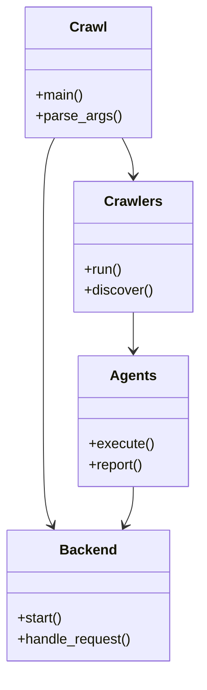
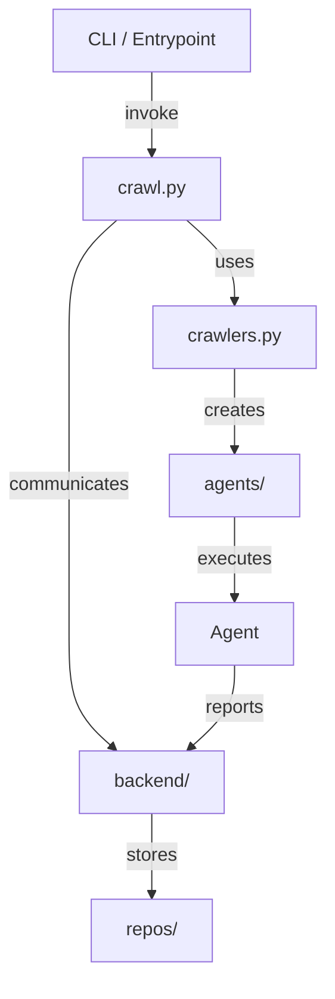

# Diagram: entity_core/entity_service/config/config.dev2.yml

> Auto-generated by Obscura crawlers

## Diagram 1

### SVG

<svg id="container" width="228.171875" xmlns="http://www.w3.org/2000/svg" class="classDiagram" height="766" viewBox="0 0 228.171875 766" role="graphics-document document" aria-roledescription="class"><g><defs><marker id="container_class-aggregationStart" class="marker aggregation class" refX="18" refY="7" markerWidth="190" markerHeight="240" orient="auto"><path d="M 18,7 L9,13 L1,7 L9,1 Z"></path></marker></defs><defs><marker id="container_class-aggregationEnd" class="marker aggregation class" refX="1" refY="7" markerWidth="20" markerHeight="28" orient="auto"><path d="M 18,7 L9,13 L1,7 L9,1 Z"></path></marker></defs><defs><marker id="container_class-extensionStart" class="marker extension class" refX="18" refY="7" markerWidth="190" markerHeight="240" orient="auto"><path d="M 1,7 L18,13 V 1 Z"></path></marker></defs><defs><marker id="container_class-extensionEnd" class="marker extension class" refX="1" refY="7" markerWidth="20" markerHeight="28" orient="auto"><path d="M 1,1 V 13 L18,7 Z"></path></marker></defs><defs><marker id="container_class-compositionStart" class="marker composition class" refX="18" refY="7" markerWidth="190" markerHeight="240" orient="auto"><path d="M 18,7 L9,13 L1,7 L9,1 Z"></path></marker></defs><defs><marker id="container_class-compositionEnd" class="marker composition class" refX="1" refY="7" markerWidth="20" markerHeight="28" orient="auto"><path d="M 18,7 L9,13 L1,7 L9,1 Z"></path></marker></defs><defs><marker id="container_class-dependencyStart" class="marker dependency class" refX="6" refY="7" markerWidth="190" markerHeight="240" orient="auto"><path d="M 5,7 L9,13 L1,7 L9,1 Z"></path></marker></defs><defs><marker id="container_class-dependencyEnd" class="marker dependency class" refX="13" refY="7" markerWidth="20" markerHeight="28" orient="auto"><path d="M 18,7 L9,13 L14,7 L9,1 Z"></path></marker></defs><defs><marker id="container_class-lollipopStart" class="marker lollipop class" refX="13" refY="7" markerWidth="190" markerHeight="240" orient="auto"><circle stroke="black" fill="transparent" cx="7" cy="7" r="6"></circle></marker></defs><defs><marker id="container_class-lollipopEnd" class="marker lollipop class" refX="1" refY="7" markerWidth="190" markerHeight="240" orient="auto"><circle stroke="black" fill="transparent" cx="7" cy="7" r="6"></circle></marker></defs><g class="root"><g class="clusters"></g><g class="edgePaths"><path d="M140.018,158L142.15,162.167C144.283,166.333,148.548,174.667,150.68,182C152.813,189.333,152.813,195.667,152.813,198.833L152.813,202" id="id_Crawl_Crawlers_1" class="edge-thickness-normal edge-pattern-solid relation" style=";;;" data-edge="true" data-et="edge" data-id="id_Crawl_Crawlers_1" data-points="W3sieCI6MTQwLjAxNzU3ODEyNSwieSI6MTU4fSx7IngiOjE1Mi44MTI1LCJ5IjoxODN9LHsieCI6MTUyLjgxMjUsInkiOjIwOH1d" marker-end="url(#container_class-dependencyEnd)"></path><path d="M63.248,158L61.116,162.167C58.983,166.333,54.718,174.667,52.586,195.5C50.453,216.333,50.453,249.667,50.453,283C50.453,316.333,50.453,349.667,50.453,383C50.453,416.333,50.453,449.667,50.453,483C50.453,516.333,50.453,549.667,52.13,569.61C53.807,589.553,57.161,596.106,58.838,599.382L60.514,602.659" id="id_Crawl_Backend_2" class="edge-thickness-normal edge-pattern-solid relation" style=";;;" data-edge="true" data-et="edge" data-id="id_Crawl_Backend_2" data-points="W3sieCI6NjMuMjQ4MDQ2ODc1LCJ5IjoxNTh9LHsieCI6NTAuNDUzMTI1LCJ5IjoxODN9LHsieCI6NTAuNDUzMTI1LCJ5IjoyODN9LHsieCI6NTAuNDUzMTI1LCJ5IjozODN9LHsieCI6NTAuNDUzMTI1LCJ5Ijo0ODN9LHsieCI6NTAuNDUzMTI1LCJ5Ijo1ODN9LHsieCI6NjMuMjQ4MDQ2ODc1LCJ5Ijo2MDh9XQ==" marker-end="url(#container_class-dependencyEnd)"></path><path d="M152.813,358L152.813,362.167C152.813,366.333,152.813,374.667,152.813,382C152.813,389.333,152.813,395.667,152.813,398.833L152.813,402" id="id_Crawlers_Agents_3" class="edge-thickness-normal edge-pattern-solid relation" style=";;;" data-edge="true" data-et="edge" data-id="id_Crawlers_Agents_3" data-points="W3sieCI6MTUyLjgxMjUsInkiOjM1OH0seyJ4IjoxNTIuODEyNSwieSI6MzgzfSx7IngiOjE1Mi44MTI1LCJ5Ijo0MDh9XQ==" marker-end="url(#container_class-dependencyEnd)"></path><path d="M152.813,558L152.813,562.167C152.813,566.333,152.813,574.667,151.136,582.11C149.459,589.553,146.105,596.106,144.428,599.382L142.751,602.659" id="id_Agents_Backend_4" class="edge-thickness-normal edge-pattern-solid relation" style=";;;" data-edge="true" data-et="edge" data-id="id_Agents_Backend_4" data-points="W3sieCI6MTUyLjgxMjUsInkiOjU1OH0seyJ4IjoxNTIuODEyNSwieSI6NTgzfSx7IngiOjE0MC4wMTc1NzgxMjUsInkiOjYwOH1d" marker-end="url(#container_class-dependencyEnd)"></path></g><g class="edgeLabels"><g class="edgeLabel"><g class="label" data-id="id_Crawl_Crawlers_1" transform="translate(0, 0)"><foreignObject width="0" height="0">

</foreignObject></g></g><g class="edgeLabel"><g class="label" data-id="id_Crawl_Backend_2" transform="translate(0, 0)"><foreignObject width="0" height="0">

</foreignObject></g></g><g class="edgeLabel"><g class="label" data-id="id_Crawlers_Agents_3" transform="translate(0, 0)"><foreignObject width="0" height="0">

</foreignObject></g></g><g class="edgeLabel"><g class="label" data-id="id_Agents_Backend_4" transform="translate(0, 0)"><foreignObject width="0" height="0">

</foreignObject></g></g></g><g class="nodes"><g class="node default" id="classId-Crawl-0" transform="translate(101.6328125, 83)"><g class="basic label-container"><path d="M-70.33984375 -75 L70.33984375 -75 L70.33984375 75 L-70.33984375 75" stroke="none" stroke-width="0" fill="#ECECFF" style=""></path><path d="M-70.33984375 -75 C-24.44032843726835 -75, 21.459186875463303 -75, 70.33984375 -75 M-70.33984375 -75 C-35.24056991140038 -75, -0.14129607280075618 -75, 70.33984375 -75 M70.33984375 -75 C70.33984375 -34.15208150558072, 70.33984375 6.695836988838565, 70.33984375 75 M70.33984375 -75 C70.33984375 -35.89049926840357, 70.33984375 3.2190014631928534, 70.33984375 75 M70.33984375 75 C40.80209977577353 75, 11.264355801547062 75, -70.33984375 75 M70.33984375 75 C26.922373913161934 75, -16.495095923676132 75, -70.33984375 75 M-70.33984375 75 C-70.33984375 34.05250733478613, -70.33984375 -6.894985330427744, -70.33984375 -75 M-70.33984375 75 C-70.33984375 28.53863205571794, -70.33984375 -17.92273588856412, -70.33984375 -75" stroke="#9370DB" stroke-width="1.3" fill="none" stroke-dasharray="0 0" style=""></path></g><g class="annotation-group text" transform="translate(0, -51)"></g><g class="label-group text" transform="translate(-20.1484375, -51)"><g class="label" style="font-weight: bolder" transform="translate(0,-12)"><foreignObject width="40.296875" height="24">

Crawl

</foreignObject></g></g><g class="members-group text" transform="translate(-58.33984375, -3)"></g><g class="methods-group text" transform="translate(-58.33984375, 27)"><g class="label" style="" transform="translate(0,-12)"><foreignObject width="54.65625" height="24">

+main()

</foreignObject></g><g class="label" style="" transform="translate(0,12)"><foreignObject width="96.53125" height="24">

+parse_args()

</foreignObject></g></g><g class="divider" style=""><path d="M-70.33984375 -27 C-23.397975299886 -27, 23.543893150228 -27, 70.33984375 -27 M-70.33984375 -27 C-32.650177970988544 -27, 5.039487808022912 -27, 70.33984375 -27" stroke="#9370DB" stroke-width="1.3" fill="none" stroke-dasharray="0 0" style=""></path></g><g class="divider" style=""><path d="M-70.33984375 -3 C-25.998011782738487 -3, 18.343820184523025 -3, 70.33984375 -3 M-70.33984375 -3 C-39.561051116188125 -3, -8.782258482376257 -3, 70.33984375 -3" stroke="#9370DB" stroke-width="1.3" fill="none" stroke-dasharray="0 0" style=""></path></g></g><g class="node default" id="classId-Crawlers-1" transform="translate(152.8125, 283)"><g class="basic label-container"><path d="M-67.359375 -75 L67.359375 -75 L67.359375 75 L-67.359375 75" stroke="none" stroke-width="0" fill="#ECECFF" style=""></path><path d="M-67.359375 -75 C-19.64701857334287 -75, 28.06533785331426 -75, 67.359375 -75 M-67.359375 -75 C-36.75357760165052 -75, -6.147780203301039 -75, 67.359375 -75 M67.359375 -75 C67.359375 -26.616418208498416, 67.359375 21.767163583003168, 67.359375 75 M67.359375 -75 C67.359375 -33.46952456142561, 67.359375 8.060950877148784, 67.359375 75 M67.359375 75 C25.570219745286572 75, -16.218935509426856 75, -67.359375 75 M67.359375 75 C15.910036314064968 75, -35.539302371870065 75, -67.359375 75 M-67.359375 75 C-67.359375 18.07487101548967, -67.359375 -38.85025796902066, -67.359375 -75 M-67.359375 75 C-67.359375 28.058420765444104, -67.359375 -18.88315846911179, -67.359375 -75" stroke="#9370DB" stroke-width="1.3" fill="none" stroke-dasharray="0 0" style=""></path></g><g class="annotation-group text" transform="translate(0, -51)"></g><g class="label-group text" transform="translate(-31.5, -51)"><g class="label" style="font-weight: bolder" transform="translate(0,-12)"><foreignObject width="63" height="24">

Crawlers

</foreignObject></g></g><g class="members-group text" transform="translate(-55.359375, -3)"></g><g class="methods-group text" transform="translate(-55.359375, 27)"><g class="label" style="" transform="translate(0,-12)"><foreignObject width="43.21875" height="24">

+run()

</foreignObject></g><g class="label" style="" transform="translate(0,12)"><foreignObject width="79.21875" height="24">

+discover()

</foreignObject></g></g><g class="divider" style=""><path d="M-67.359375 -27 C-14.10858876164339 -27, 39.14219747671322 -27, 67.359375 -27 M-67.359375 -27 C-33.95752627151045 -27, -0.5556775430209058 -27, 67.359375 -27" stroke="#9370DB" stroke-width="1.3" fill="none" stroke-dasharray="0 0" style=""></path></g><g class="divider" style=""><path d="M-67.359375 -3 C-20.250358887525714 -3, 26.858657224948573 -3, 67.359375 -3 M-67.359375 -3 C-34.66930894670867 -3, -1.9792428934173358 -3, 67.359375 -3" stroke="#9370DB" stroke-width="1.3" fill="none" stroke-dasharray="0 0" style=""></path></g></g><g class="node default" id="classId-Backend-2" transform="translate(101.6328125, 683)"><g class="basic label-container"><path d="M-93.6328125 -75 L93.6328125 -75 L93.6328125 75 L-93.6328125 75" stroke="none" stroke-width="0" fill="#ECECFF" style=""></path><path d="M-93.6328125 -75 C-25.51087414111963 -75, 42.61106421776074 -75, 93.6328125 -75 M-93.6328125 -75 C-29.574349707272077 -75, 34.484113085455846 -75, 93.6328125 -75 M93.6328125 -75 C93.6328125 -27.453657629420753, 93.6328125 20.092684741158493, 93.6328125 75 M93.6328125 -75 C93.6328125 -42.670228094262384, 93.6328125 -10.340456188524769, 93.6328125 75 M93.6328125 75 C22.631371767700386 75, -48.37006896459923 75, -93.6328125 75 M93.6328125 75 C29.69290681640505 75, -34.2469988671899 75, -93.6328125 75 M-93.6328125 75 C-93.6328125 35.42750829286345, -93.6328125 -4.144983414273099, -93.6328125 -75 M-93.6328125 75 C-93.6328125 26.469299121312822, -93.6328125 -22.061401757374355, -93.6328125 -75" stroke="#9370DB" stroke-width="1.3" fill="none" stroke-dasharray="0 0" style=""></path></g><g class="annotation-group text" transform="translate(0, -51)"></g><g class="label-group text" transform="translate(-31.296875, -51)"><g class="label" style="font-weight: bolder" transform="translate(0,-12)"><foreignObject width="62.59375" height="24">

Backend

</foreignObject></g></g><g class="members-group text" transform="translate(-81.6328125, -3)"></g><g class="methods-group text" transform="translate(-81.6328125, 27)"><g class="label" style="" transform="translate(0,-12)"><foreignObject width="52.15625" height="24">

+start()

</foreignObject></g><g class="label" style="" transform="translate(0,12)"><foreignObject width="131.96875" height="24">

+handle_request()

</foreignObject></g></g><g class="divider" style=""><path d="M-93.6328125 -27 C-40.82661317283185 -27, 11.979586154336303 -27, 93.6328125 -27 M-93.6328125 -27 C-32.34282921336458 -27, 28.947154073270838 -27, 93.6328125 -27" stroke="#9370DB" stroke-width="1.3" fill="none" stroke-dasharray="0 0" style=""></path></g><g class="divider" style=""><path d="M-93.6328125 -3 C-41.356092393251636 -3, 10.920627713496728 -3, 93.6328125 -3 M-93.6328125 -3 C-37.846298091544895 -3, 17.94021631691021 -3, 93.6328125 -3" stroke="#9370DB" stroke-width="1.3" fill="none" stroke-dasharray="0 0" style=""></path></g></g><g class="node default" id="classId-Agents-3" transform="translate(152.8125, 483)"><g class="basic label-container"><path d="M-61.6328125 -75 L61.6328125 -75 L61.6328125 75 L-61.6328125 75" stroke="none" stroke-width="0" fill="#ECECFF" style=""></path><path d="M-61.6328125 -75 C-19.5059394872086 -75, 22.6209335255828 -75, 61.6328125 -75 M-61.6328125 -75 C-32.02596865587016 -75, -2.4191248117403177 -75, 61.6328125 -75 M61.6328125 -75 C61.6328125 -33.69985602950582, 61.6328125 7.600287940988366, 61.6328125 75 M61.6328125 -75 C61.6328125 -22.249219101601717, 61.6328125 30.501561796796565, 61.6328125 75 M61.6328125 75 C28.33593615683499 75, -4.960940186330021 75, -61.6328125 75 M61.6328125 75 C25.74342613218583 75, -10.145960235628337 75, -61.6328125 75 M-61.6328125 75 C-61.6328125 37.45040714118652, -61.6328125 -0.09918571762696615, -61.6328125 -75 M-61.6328125 75 C-61.6328125 27.584222877144434, -61.6328125 -19.831554245711132, -61.6328125 -75" stroke="#9370DB" stroke-width="1.3" fill="none" stroke-dasharray="0 0" style=""></path></g><g class="annotation-group text" transform="translate(0, -51)"></g><g class="label-group text" transform="translate(-24.9375, -51)"><g class="label" style="font-weight: bolder" transform="translate(0,-12)"><foreignObject width="49.875" height="24">

Agents

</foreignObject></g></g><g class="members-group text" transform="translate(-49.6328125, -3)"></g><g class="methods-group text" transform="translate(-49.6328125, 27)"><g class="label" style="" transform="translate(0,-12)"><foreignObject width="74.328125" height="24">

+execute()

</foreignObject></g><g class="label" style="" transform="translate(0,12)"><foreignObject width="63.578125" height="24">

+report()

</foreignObject></g></g><g class="divider" style=""><path d="M-61.6328125 -27 C-28.671023465022394 -27, 4.290765569955212 -27, 61.6328125 -27 M-61.6328125 -27 C-22.50688274642698 -27, 16.619047007146037 -27, 61.6328125 -27" stroke="#9370DB" stroke-width="1.3" fill="none" stroke-dasharray="0 0" style=""></path></g><g class="divider" style=""><path d="M-61.6328125 -3 C-13.098443161267262 -3, 35.435926177465475 -3, 61.6328125 -3 M-61.6328125 -3 C-31.496272209833975 -3, -1.3597319196679507 -3, 61.6328125 -3" stroke="#9370DB" stroke-width="1.3" fill="none" stroke-dasharray="0 0" style=""></path></g></g></g></g></g></svg>

## Diagram 2

### SVG

<svg id="container" width="284.984375" xmlns="http://www.w3.org/2000/svg" class="flowchart" height="838" viewBox="0 0 284.984375 838" role="graphics-document document" aria-roledescription="flowchart-v2"><g><marker id="container_flowchart-v2-pointEnd" class="marker flowchart-v2" viewBox="0 0 10 10" refX="5" refY="5" markerUnits="userSpaceOnUse" markerWidth="8" markerHeight="8" orient="auto"><path d="M 0 0 L 10 5 L 0 10 z" class="arrowMarkerPath" style="stroke-width: 1; stroke-dasharray: 1, 0;"></path></marker><marker id="container_flowchart-v2-pointStart" class="marker flowchart-v2" viewBox="0 0 10 10" refX="4.5" refY="5" markerUnits="userSpaceOnUse" markerWidth="8" markerHeight="8" orient="auto"><path d="M 0 5 L 10 10 L 10 0 z" class="arrowMarkerPath" style="stroke-width: 1; stroke-dasharray: 1, 0;"></path></marker><marker id="container_flowchart-v2-circleEnd" class="marker flowchart-v2" viewBox="0 0 10 10" refX="11" refY="5" markerUnits="userSpaceOnUse" markerWidth="11" markerHeight="11" orient="auto"><circle cx="5" cy="5" r="5" class="arrowMarkerPath" style="stroke-width: 1; stroke-dasharray: 1, 0;"></circle></marker><marker id="container_flowchart-v2-circleStart" class="marker flowchart-v2" viewBox="0 0 10 10" refX="-1" refY="5" markerUnits="userSpaceOnUse" markerWidth="11" markerHeight="11" orient="auto"><circle cx="5" cy="5" r="5" class="arrowMarkerPath" style="stroke-width: 1; stroke-dasharray: 1, 0;"></circle></marker><marker id="container_flowchart-v2-crossEnd" class="marker cross flowchart-v2" viewBox="0 0 11 11" refX="12" refY="5.2" markerUnits="userSpaceOnUse" markerWidth="11" markerHeight="11" orient="auto"><path d="M 1,1 l 9,9 M 10,1 l -9,9" class="arrowMarkerPath" style="stroke-width: 2; stroke-dasharray: 1, 0;"></path></marker><marker id="container_flowchart-v2-crossStart" class="marker cross flowchart-v2" viewBox="0 0 11 11" refX="-1" refY="5.2" markerUnits="userSpaceOnUse" markerWidth="11" markerHeight="11" orient="auto"><path d="M 1,1 l 9,9 M 10,1 l -9,9" class="arrowMarkerPath" style="stroke-width: 2; stroke-dasharray: 1, 0;"></path></marker><g class="root"><g class="clusters"></g><g class="edgePaths"><path d="M133.484,62L133.484,68.167C133.484,74.333,133.484,86.667,133.484,98.333C133.484,110,133.484,121,133.484,126.5L133.484,132" id="L_CLI_Crawl_0" class="edge-thickness-normal edge-pattern-solid edge-thickness-normal edge-pattern-solid flowchart-link" style=";" data-edge="true" data-et="edge" data-id="L_CLI_Crawl_0" data-points="W3sieCI6MTMzLjQ4NDM3NSwieSI6NjJ9LHsieCI6MTMzLjQ4NDM3NSwieSI6OTl9LHsieCI6MTMzLjQ4NDM3NSwieSI6MTM2fV0=" marker-end="url(#container_flowchart-v2-pointEnd)"></path><path d="M164.229,190L171.25,196.167C178.272,202.333,192.316,214.667,199.338,226.333C206.359,238,206.359,249,206.359,254.5L206.359,260" id="L_Crawl_Crawlers_0" class="edge-thickness-normal edge-pattern-solid edge-thickness-normal edge-pattern-solid flowchart-link" style=";" data-edge="true" data-et="edge" data-id="L_Crawl_Crawlers_0" data-points="W3sieCI6MTY0LjIyODUxNTYyNSwieSI6MTkwfSx7IngiOjIwNi4zNTkzNzUsInkiOjIyN30seyJ4IjoyMDYuMzU5Mzc1LCJ5IjoyNjR9XQ==" marker-end="url(#container_flowchart-v2-pointEnd)"></path><path d="M206.359,318L206.359,324.167C206.359,330.333,206.359,342.667,206.359,354.333C206.359,366,206.359,377,206.359,382.5L206.359,388" id="L_Crawlers_AgentPool_0" class="edge-thickness-normal edge-pattern-solid edge-thickness-normal edge-pattern-solid flowchart-link" style=";" data-edge="true" data-et="edge" data-id="L_Crawlers_AgentPool_0" data-points="W3sieCI6MjA2LjM1OTM3NSwieSI6MzE4fSx7IngiOjIwNi4zNTkzNzUsInkiOjM1NX0seyJ4IjoyMDYuMzU5Mzc1LCJ5IjozOTJ9XQ==" marker-end="url(#container_flowchart-v2-pointEnd)"></path><path d="M206.359,446L206.359,452.167C206.359,458.333,206.359,470.667,206.359,482.333C206.359,494,206.359,505,206.359,510.5L206.359,516" id="L_AgentPool_AgentWorker_0" class="edge-thickness-normal edge-pattern-solid edge-thickness-normal edge-pattern-solid flowchart-link" style=";" data-edge="true" data-et="edge" data-id="L_AgentPool_AgentWorker_0" data-points="W3sieCI6MjA2LjM1OTM3NSwieSI6NDQ2fSx7IngiOjIwNi4zNTkzNzUsInkiOjQ4M30seyJ4IjoyMDYuMzU5Mzc1LCJ5Ijo1MjB9XQ==" marker-end="url(#container_flowchart-v2-pointEnd)"></path><path d="M102.74,190L95.718,196.167C88.697,202.333,74.653,214.667,67.631,231.5C60.609,248.333,60.609,269.667,60.609,291C60.609,312.333,60.609,333.667,60.609,355C60.609,376.333,60.609,397.667,60.609,419C60.609,440.333,60.609,461.667,60.609,483C60.609,504.333,60.609,525.667,60.609,547C60.609,568.333,60.609,589.667,67.13,606.06C73.651,622.454,86.693,633.907,93.214,639.634L99.735,645.361" id="L_Crawl_Backend_0" class="edge-thickness-normal edge-pattern-solid edge-thickness-normal edge-pattern-solid flowchart-link" style=";" data-edge="true" data-et="edge" data-id="L_Crawl_Backend_0" data-points="W3sieCI6MTAyLjc0MDIzNDM3NSwieSI6MTkwfSx7IngiOjYwLjYwOTM3NSwieSI6MjI3fSx7IngiOjYwLjYwOTM3NSwieSI6MjkxfSx7IngiOjYwLjYwOTM3NSwieSI6MzU1fSx7IngiOjYwLjYwOTM3NSwieSI6NDE5fSx7IngiOjYwLjYwOTM3NSwieSI6NDgzfSx7IngiOjYwLjYwOTM3NSwieSI6NTQ3fSx7IngiOjYwLjYwOTM3NSwieSI6NjExfSx7IngiOjEwMi43NDAyMzQzNzUsInkiOjY0OH1d" marker-end="url(#container_flowchart-v2-pointEnd)"></path><path d="M206.359,574L206.359,580.167C206.359,586.333,206.359,598.667,199.838,610.56C193.318,622.454,180.276,633.907,173.755,639.634L167.234,645.361" id="L_AgentWorker_Backend_0" class="edge-thickness-normal edge-pattern-solid edge-thickness-normal edge-pattern-solid flowchart-link" style=";" data-edge="true" data-et="edge" data-id="L_AgentWorker_Backend_0" data-points="W3sieCI6MjA2LjM1OTM3NSwieSI6NTc0fSx7IngiOjIwNi4zNTkzNzUsInkiOjYxMX0seyJ4IjoxNjQuMjI4NTE1NjI1LCJ5Ijo2NDh9XQ==" marker-end="url(#container_flowchart-v2-pointEnd)"></path><path d="M133.484,702L133.484,708.167C133.484,714.333,133.484,726.667,133.484,738.333C133.484,750,133.484,761,133.484,766.5L133.484,772" id="L_Backend_Repos_0" class="edge-thickness-normal edge-pattern-solid edge-thickness-normal edge-pattern-solid flowchart-link" style=";" data-edge="true" data-et="edge" data-id="L_Backend_Repos_0" data-points="W3sieCI6MTMzLjQ4NDM3NSwieSI6NzAyfSx7IngiOjEzMy40ODQzNzUsInkiOjczOX0seyJ4IjoxMzMuNDg0Mzc1LCJ5Ijo3NzZ9XQ==" marker-end="url(#container_flowchart-v2-pointEnd)"></path></g><g class="edgeLabels"><g class="edgeLabel" transform="translate(133.484375, 99)"><g class="label" data-id="L_CLI_Crawl_0" transform="translate(-23.8515625, -12)"><foreignObject width="47.703125" height="24">

invoke

</foreignObject></g></g><g class="edgeLabel" transform="translate(206.359375, 227)"><g class="label" data-id="L_Crawl_Crawlers_0" transform="translate(-16.4921875, -12)"><foreignObject width="32.984375" height="24">

uses

</foreignObject></g></g><g class="edgeLabel" transform="translate(206.359375, 355)"><g class="label" data-id="L_Crawlers_AgentPool_0" transform="translate(-26.171875, -12)"><foreignObject width="52.34375" height="24">

creates

</foreignObject></g></g><g class="edgeLabel" transform="translate(206.359375, 483)"><g class="label" data-id="L_AgentPool_AgentWorker_0" transform="translate(-31.7265625, -12)"><foreignObject width="63.453125" height="24">

executes

</foreignObject></g></g><g class="edgeLabel" transform="translate(60.609375, 419)"><g class="label" data-id="L_Crawl_Backend_0" transform="translate(-52.609375, -12)"><foreignObject width="105.21875" height="24">

communicates

</foreignObject></g></g><g class="edgeLabel" transform="translate(206.359375, 611)"><g class="label" data-id="L_AgentWorker_Backend_0" transform="translate(-26.3515625, -12)"><foreignObject width="52.703125" height="24">

reports

</foreignObject></g></g><g class="edgeLabel" transform="translate(133.484375, 739)"><g class="label" data-id="L_Backend_Repos_0" transform="translate(-22.125, -12)"><foreignObject width="44.25" height="24">

stores

</foreignObject></g></g></g><g class="nodes"><g class="node default" id="flowchart-CLI-0" transform="translate(133.484375, 35)"><rect class="basic label-container" style="" x="-87.28125" y="-27" width="174.5625" height="54"></rect><g class="label" style="" transform="translate(-57.28125, -12)"><rect></rect><foreignObject width="114.5625" height="24">

CLI / Entrypoint

</foreignObject></g></g><g class="node default" id="flowchart-Crawl-1" transform="translate(133.484375, 163)"><rect class="basic label-container" style="" x="-59.6328125" y="-27" width="119.265625" height="54"></rect><g class="label" style="" transform="translate(-29.6328125, -12)"><rect></rect><foreignObject width="59.265625" height="24">

crawl.py

</foreignObject></g></g><g class="node default" id="flowchart-Crawlers-3" transform="translate(206.359375, 291)"><rect class="basic label-container" style="" x="-70.625" y="-27" width="141.25" height="54"></rect><g class="label" style="" transform="translate(-40.625, -12)"><rect></rect><foreignObject width="81.25" height="24">

crawlers.py

</foreignObject></g></g><g class="node default" id="flowchart-AgentPool-5" transform="translate(206.359375, 419)"><rect class="basic label-container" style="" x="-58.140625" y="-27" width="116.28125" height="54"></rect><g class="label" style="" transform="translate(-28.140625, -12)"><rect></rect><foreignObject width="56.28125" height="24">

agents/

</foreignObject></g></g><g class="node default" id="flowchart-AgentWorker-7" transform="translate(206.359375, 547)"><rect class="basic label-container" style="" x="-50.5546875" y="-27" width="101.109375" height="54"></rect><g class="label" style="" transform="translate(-20.5546875, -12)"><rect></rect><foreignObject width="41.109375" height="24">

Agent

</foreignObject></g></g><g class="node default" id="flowchart-Backend-9" transform="translate(133.484375, 675)"><rect class="basic label-container" style="" x="-64.8671875" y="-27" width="129.734375" height="54"></rect><g class="label" style="" transform="translate(-34.8671875, -12)"><rect></rect><foreignObject width="69.734375" height="24">

backend/

</foreignObject></g></g><g class="node default" id="flowchart-Repos-13" transform="translate(133.484375, 803)"><rect class="basic label-container" style="" x="-54.53125" y="-27" width="109.0625" height="54"></rect><g class="label" style="" transform="translate(-24.53125, -12)"><rect></rect><foreignObject width="49.0625" height="24">

repos/

</foreignObject></g></g></g></g></g></svg>
