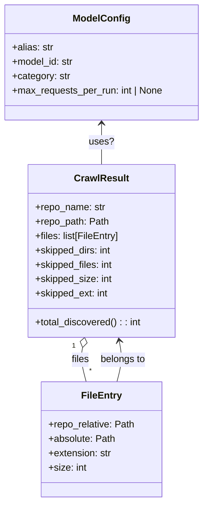

# Diagram: entity_core/entity_service/config/config.prod-b.yml


> Auto-generated by Obscura crawlers

## Diagram 1



### SVG

<svg id="container" width="340.046875" xmlns="http://www.w3.org/2000/svg" class="classDiagram" height="836" viewBox="0 0 340.046875 836" role="graphics-document document" aria-roledescription="class"><style>#container{font-family:"trebuchet ms",verdana,arial,sans-serif;font-size:16px;fill:#333;}@keyframes edge-animation-frame{from{stroke-dashoffset:0;}}@keyframes dash{to{stroke-dashoffset:0;}}#container .edge-animation-slow{stroke-dasharray:9,5!important;stroke-dashoffset:900;animation:dash 50s linear infinite;stroke-linecap:round;}#container .edge-animation-fast{stroke-dasharray:9,5!important;stroke-dashoffset:900;animation:dash 20s linear infinite;stroke-linecap:round;}#container .error-icon{fill:#552222;}#container .error-text{fill:#552222;stroke:#552222;}#container .edge-thickness-normal{stroke-width:1px;}#container .edge-thickness-thick{stroke-width:3.5px;}#container .edge-pattern-solid{stroke-dasharray:0;}#container .edge-thickness-invisible{stroke-width:0;fill:none;}#container .edge-pattern-dashed{stroke-dasharray:3;}#container .edge-pattern-dotted{stroke-dasharray:2;}#container .marker{fill:#333333;stroke:#333333;}#container .marker.cross{stroke:#333333;}#container svg{font-family:"trebuchet ms",verdana,arial,sans-serif;font-size:16px;}#container p{margin:0;}#container g.classGroup text{fill:#9370DB;stroke:none;font-family:"trebuchet ms",verdana,arial,sans-serif;font-size:10px;}#container g.classGroup text .title{font-weight:bolder;}#container .nodeLabel,#container .edgeLabel{color:#131300;}#container .edgeLabel .label rect{fill:#ECECFF;}#container .label text{fill:#131300;}#container .labelBkg{background:#ECECFF;}#container .edgeLabel .label span{background:#ECECFF;}#container .classTitle{font-weight:bolder;}#container .node rect,#container .node circle,#container .node ellipse,#container .node polygon,#container .node path{fill:#ECECFF;stroke:#9370DB;stroke-width:1px;}#container .divider{stroke:#9370DB;stroke-width:1;}#container g.clickable{cursor:pointer;}#container g.classGroup rect{fill:#ECECFF;stroke:#9370DB;}#container g.classGroup line{stroke:#9370DB;stroke-width:1;}#container .classLabel .box{stroke:none;stroke-width:0;fill:#ECECFF;opacity:0.5;}#container .classLabel .label{fill:#9370DB;font-size:10px;}#container .relation{stroke:#333333;stroke-width:1;fill:none;}#container .dashed-line{stroke-dasharray:3;}#container .dotted-line{stroke-dasharray:1 2;}#container #compositionStart,#container .composition{fill:#333333!important;stroke:#333333!important;stroke-width:1;}#container #compositionEnd,#container .composition{fill:#333333!important;stroke:#333333!important;stroke-width:1;}#container #dependencyStart,#container .dependency{fill:#333333!important;stroke:#333333!important;stroke-width:1;}#container #dependencyStart,#container .dependency{fill:#333333!important;stroke:#333333!important;stroke-width:1;}#container #extensionStart,#container .extension{fill:transparent!important;stroke:#333333!important;stroke-width:1;}#container #extensionEnd,#container .extension{fill:transparent!important;stroke:#333333!important;stroke-width:1;}#container #aggregationStart,#container .aggregation{fill:transparent!important;stroke:#333333!important;stroke-width:1;}#container #aggregationEnd,#container .aggregation{fill:transparent!important;stroke:#333333!important;stroke-width:1;}#container #lollipopStart,#container .lollipop{fill:#ECECFF!important;stroke:#333333!important;stroke-width:1;}#container #lollipopEnd,#container .lollipop{fill:#ECECFF!important;stroke:#333333!important;stroke-width:1;}#container .edgeTerminals{font-size:11px;line-height:initial;}#container .classTitleText{text-anchor:middle;font-size:18px;fill:#333;}#container .label-icon{display:inline-block;height:1em;overflow:visible;vertical-align:-0.125em;}#container .node .label-icon path{fill:currentColor;stroke:revert;stroke-width:revert;}#container :root{--mermaid-font-family:"trebuchet ms",verdana,arial,sans-serif;}</style><g><defs><marker id="container_class-aggregationStart" class="marker aggregation class" refX="18" refY="7" markerWidth="190" markerHeight="240" orient="auto"><path d="M 18,7 L9,13 L1,7 L9,1 Z"></path></marker></defs><defs><marker id="container_class-aggregationEnd" class="marker aggregation class" refX="1" refY="7" markerWidth="20" markerHeight="28" orient="auto"><path d="M 18,7 L9,13 L1,7 L9,1 Z"></path></marker></defs><defs><marker id="container_class-extensionStart" class="marker extension class" refX="18" refY="7" markerWidth="190" markerHeight="240" orient="auto"><path d="M 1,7 L18,13 V 1 Z"></path></marker></defs><defs><marker id="container_class-extensionEnd" class="marker extension class" refX="1" refY="7" markerWidth="20" markerHeight="28" orient="auto"><path d="M 1,1 V 13 L18,7 Z"></path></marker></defs><defs><marker id="container_class-compositionStart" class="marker composition class" refX="18" refY="7" markerWidth="190" markerHeight="240" orient="auto"><path d="M 18,7 L9,13 L1,7 L9,1 Z"></path></marker></defs><defs><marker id="container_class-compositionEnd" class="marker composition class" refX="1" refY="7" markerWidth="20" markerHeight="28" orient="auto"><path d="M 18,7 L9,13 L1,7 L9,1 Z"></path></marker></defs><defs><marker id="container_class-dependencyStart" class="marker dependency class" refX="6" refY="7" markerWidth="190" markerHeight="240" orient="auto"><path d="M 5,7 L9,13 L1,7 L9,1 Z"></path></marker></defs><defs><marker id="container_class-dependencyEnd" class="marker dependency class" refX="13" refY="7" markerWidth="20" markerHeight="28" orient="auto"><path d="M 18,7 L9,13 L14,7 L9,1 Z"></path></marker></defs><defs><marker id="container_class-lollipopStart" class="marker lollipop class" refX="13" refY="7" markerWidth="190" markerHeight="240" orient="auto"><circle stroke="black" fill="transparent" cx="7" cy="7" r="6"></circle></marker></defs><defs><marker id="container_class-lollipopEnd" class="marker lollipop class" refX="1" refY="7" markerWidth="190" markerHeight="240" orient="auto"><circle stroke="black" fill="transparent" cx="7" cy="7" r="6"></circle></marker></defs><g class="root"><g class="clusters"></g><g class="edgePaths"><path d="M137.492,578.908L136.815,582.257C136.138,585.605,134.784,592.303,135.803,601.818C136.823,611.333,140.216,623.667,141.913,629.833L143.61,636" id="id_CrawlResult_FileEntry_1" class="edge-thickness-normal edge-pattern-solid relation" style=";;;" data-edge="true" data-et="edge" data-id="id_CrawlResult_FileEntry_1" data-points="W3sieCI6MTQwLjkxMDE3NzgzMTQ5MTcyLCJ5Ijo1NjJ9LHsieCI6MTMzLjQyOTY4NzUsInkiOjU5OX0seyJ4IjoxNDMuNjA5OTAzNjY1NDEzNTMsInkiOjYzNn1d" marker-start="url(#container_class-aggregationStart)"></path><path d="M170.023,206L170.023,211.167C170.023,216.333,170.023,226.667,170.023,238C170.023,249.333,170.023,261.667,170.023,267.833L170.023,274" id="id_ModelConfig_CrawlResult_2" class="edge-thickness-normal edge-pattern-solid relation" style=";;;" data-edge="true" data-et="edge" data-id="id_ModelConfig_CrawlResult_2" data-points="W3sieCI6MTcwLjAyMzQzNzUsInkiOjIwMH0seyJ4IjoxNzAuMDIzNDM3NSwieSI6MjM3fSx7IngiOjE3MC4wMjM0Mzc1LCJ5IjoyNzR9XQ==" marker-start="url(#container_class-dependencyStart)"></path><path d="M196.437,636L198.134,629.833C199.83,623.667,203.224,611.333,203.872,599.98C204.52,588.627,202.423,578.254,201.374,573.068L200.326,567.881" id="id_FileEntry_CrawlResult_3" class="edge-thickness-normal edge-pattern-solid relation" style=";;;" data-edge="true" data-et="edge" data-id="id_FileEntry_CrawlResult_3" data-points="W3sieCI6MTk2LjQzNjk3MTMzNDU4NjQ3LCJ5Ijo2MzZ9LHsieCI6MjA2LjYxNzE4NzUsInkiOjU5OX0seyJ4IjoxOTkuMTM2Njk3MTY4NTA4MjgsInkiOjU2Mn1d" marker-end="url(#container_class-dependencyEnd)"></path></g><g class="edgeLabels"><g class="edgeLabel" transform="translate(133.51277, 599.30195)"><g class="label" data-id="id_CrawlResult_FileEntry_1" transform="translate(-15.0078125, -12)"><foreignObject width="30.015625" height="24"><div xmlns="http://www.w3.org/1999/xhtml" class="labelBkg" style="display: table-cell; white-space: nowrap; line-height: 1.5; max-width: 200px; text-align: center;"><span class="edgeLabel"><p>files</p></span></div></foreignObject></g></g><g class="edgeLabel" transform="translate(170.0234375, 237)"><g class="label" data-id="id_ModelConfig_CrawlResult_2" transform="translate(-19.921875, -12)"><foreignObject width="39.84375" height="24"><div xmlns="http://www.w3.org/1999/xhtml" class="labelBkg" style="display: table-cell; white-space: nowrap; line-height: 1.5; max-width: 200px; text-align: center;"><span class="edgeLabel"><p>uses?</p></span></div></foreignObject></g></g><g class="edgeLabel" transform="translate(206.53411, 599.30195)"><g class="label" data-id="id_FileEntry_CrawlResult_3" transform="translate(-38.1796875, -12)"><foreignObject width="76.359375" height="24"><div xmlns="http://www.w3.org/1999/xhtml" class="labelBkg" style="display: table-cell; white-space: nowrap; line-height: 1.5; max-width: 200px; text-align: center;"><span class="edgeLabel"><p>belongs to</p></span></div></foreignObject></g></g><g class="edgeTerminals" transform="translate(122.73974657504108, 576.1804611781827)"><g class="inner" transform="translate(0, 0)"><foreignObject style="width: 9px; height: 12px;"><div xmlns="http://www.w3.org/1999/xhtml" style="display: inline-block; padding-right: 1px; white-space: nowrap;"><span class="edgeLabel">1</span></div></foreignObject></g></g><g class="edgeTerminals" transform="translate(148.4300108331898, 610.1477704539151)"><g class="inner" transform="translate(0, 0)"></g><foreignObject style="width: 9px; height: 12px;"><div xmlns="http://www.w3.org/1999/xhtml" style="display: inline-block; padding-right: 1px; white-space: nowrap;"><span class="edgeLabel">*</span></div></foreignObject></g></g><g class="nodes"><g class="node default" id="classId-ModelConfig-0" transform="translate(170.0234375, 104)"><g class="basic label-container"><path d="M-162.0234375 -96 L162.0234375 -96 L162.0234375 96 L-162.0234375 96" stroke="none" stroke-width="0" fill="#ECECFF" style=""></path><path d="M-162.0234375 -96 C-41.8437504241972 -96, 78.3359366516056 -96, 162.0234375 -96 M-162.0234375 -96 C-67.20618161004354 -96, 27.611074279912913 -96, 162.0234375 -96 M162.0234375 -96 C162.0234375 -36.801194475679004, 162.0234375 22.39761104864199, 162.0234375 96 M162.0234375 -96 C162.0234375 -24.48513527255848, 162.0234375 47.02972945488304, 162.0234375 96 M162.0234375 96 C54.08897412384658 96, -53.845489252306834 96, -162.0234375 96 M162.0234375 96 C63.138821689799485 96, -35.74579412040103 96, -162.0234375 96 M-162.0234375 96 C-162.0234375 28.40237324466142, -162.0234375 -39.19525351067716, -162.0234375 -96 M-162.0234375 96 C-162.0234375 36.16511674923237, -162.0234375 -23.669766501535264, -162.0234375 -96" stroke="#9370DB" stroke-width="1.3" fill="none" stroke-dasharray="0 0" style=""></path></g><g class="annotation-group text" transform="translate(0, -72)"></g><g class="label-group text" transform="translate(-45.484375, -72)"><g class="label" style="font-weight: bolder" transform="translate(0,-12)"><foreignObject width="90.96875" height="24"><div xmlns="http://www.w3.org/1999/xhtml" style="display: table-cell; white-space: nowrap; line-height: 1.5; max-width: 140px; text-align: center;"><span class="nodeLabel markdown-node-label" style=""><p>ModelConfig</p></span></div></foreignObject></g></g><g class="members-group text" transform="translate(-150.0234375, -24)"><g class="label" style="" transform="translate(0,-12)"><foreignObject width="69.015625" height="24"><div xmlns="http://www.w3.org/1999/xhtml" style="display: table-cell; white-space: nowrap; line-height: 1.5; max-width: 127px; text-align: center;"><span class="nodeLabel markdown-node-label" style=""><p>+alias: str</p></span></div></foreignObject></g><g class="label" style="" transform="translate(0,12)"><foreignObject width="103.921875" height="24"><div xmlns="http://www.w3.org/1999/xhtml" style="display: table-cell; white-space: nowrap; line-height: 1.5; max-width: 162px; text-align: center;"><span class="nodeLabel markdown-node-label" style=""><p>+model_id: str</p></span></div></foreignObject></g><g class="label" style="" transform="translate(0,36)"><foreignObject width="97.46875" height="24"><div xmlns="http://www.w3.org/1999/xhtml" style="display: table-cell; white-space: nowrap; line-height: 1.5; max-width: 156px; text-align: center;"><span class="nodeLabel markdown-node-label" style=""><p>+category: str</p></span></div></foreignObject></g><g class="label" style="" transform="translate(0,60)"><foreignObject width="254.5625" height="24"><div xmlns="http://www.w3.org/1999/xhtml" style="display: table-cell; white-space: nowrap; line-height: 1.5; max-width: 312px; text-align: center;"><span class="nodeLabel markdown-node-label" style=""><p>+max_requests_per_run: int | None</p></span></div></foreignObject></g></g><g class="methods-group text" transform="translate(-150.0234375, 96)"></g><g class="divider" style=""><path d="M-162.0234375 -48 C-60.13218921023426 -48, 41.75905907953148 -48, 162.0234375 -48 M-162.0234375 -48 C-70.03176364173983 -48, 21.959910216520342 -48, 162.0234375 -48" stroke="#9370DB" stroke-width="1.3" fill="none" stroke-dasharray="0 0" style=""></path></g><g class="divider" style=""><path d="M-162.0234375 72 C-83.92093377503362 72, -5.818430050067235 72, 162.0234375 72 M-162.0234375 72 C-81.94346629873544 72, -1.8634950974708886 72, 162.0234375 72" stroke="#9370DB" stroke-width="1.3" fill="none" stroke-dasharray="0 0" style=""></path></g></g><g class="node default" id="classId-FileEntry-1" transform="translate(170.0234375, 732)"><g class="basic label-container"><path d="M-100.0078125 -96 L100.0078125 -96 L100.0078125 96 L-100.0078125 96" stroke="none" stroke-width="0" fill="#ECECFF" style=""></path><path d="M-100.0078125 -96 C-23.264301015920722 -96, 53.479210468158556 -96, 100.0078125 -96 M-100.0078125 -96 C-44.088645151435394 -96, 11.830522197129213 -96, 100.0078125 -96 M100.0078125 -96 C100.0078125 -48.01082502533949, 100.0078125 -0.021650050678985622, 100.0078125 96 M100.0078125 -96 C100.0078125 -55.40189658998132, 100.0078125 -14.80379317996264, 100.0078125 96 M100.0078125 96 C53.955605106682775 96, 7.90339771336555 96, -100.0078125 96 M100.0078125 96 C40.081032549174964 96, -19.845747401650073 96, -100.0078125 96 M-100.0078125 96 C-100.0078125 55.41820366770828, -100.0078125 14.836407335416567, -100.0078125 -96 M-100.0078125 96 C-100.0078125 45.084997445521495, -100.0078125 -5.83000510895701, -100.0078125 -96" stroke="#9370DB" stroke-width="1.3" fill="none" stroke-dasharray="0 0" style=""></path></g><g class="annotation-group text" transform="translate(0, -72)"></g><g class="label-group text" transform="translate(-31.859375, -72)"><g class="label" style="font-weight: bolder" transform="translate(0,-12)"><foreignObject width="63.71875" height="24"><div xmlns="http://www.w3.org/1999/xhtml" style="display: table-cell; white-space: nowrap; line-height: 1.5; max-width: 113px; text-align: center;"><span class="nodeLabel markdown-node-label" style=""><p>FileEntry</p></span></div></foreignObject></g></g><g class="members-group text" transform="translate(-88.0078125, -24)"><g class="label" style="" transform="translate(0,-12)"><foreignObject width="144.15625" height="24"><div xmlns="http://www.w3.org/1999/xhtml" style="display: table-cell; white-space: nowrap; line-height: 1.5; max-width: 202px; text-align: center;"><span class="nodeLabel markdown-node-label" style=""><p>+repo_relative: Path</p></span></div></foreignObject></g><g class="label" style="" transform="translate(0,12)"><foreignObject width="111.390625" height="24"><div xmlns="http://www.w3.org/1999/xhtml" style="display: table-cell; white-space: nowrap; line-height: 1.5; max-width: 169px; text-align: center;"><span class="nodeLabel markdown-node-label" style=""><p>+absolute: Path</p></span></div></foreignObject></g><g class="label" style="" transform="translate(0,36)"><foreignObject width="106.171875" height="24"><div xmlns="http://www.w3.org/1999/xhtml" style="display: table-cell; white-space: nowrap; line-height: 1.5; max-width: 164px; text-align: center;"><span class="nodeLabel markdown-node-label" style=""><p>+extension: str</p></span></div></foreignObject></g><g class="label" style="" transform="translate(0,60)"><foreignObject width="63.3125" height="24"><div xmlns="http://www.w3.org/1999/xhtml" style="display: table-cell; white-space: nowrap; line-height: 1.5; max-width: 121px; text-align: center;"><span class="nodeLabel markdown-node-label" style=""><p>+size: int</p></span></div></foreignObject></g></g><g class="methods-group text" transform="translate(-88.0078125, 96)"></g><g class="divider" style=""><path d="M-100.0078125 -48 C-52.9692708961845 -48, -5.930729292368994 -48, 100.0078125 -48 M-100.0078125 -48 C-28.91707966224459 -48, 42.17365317551082 -48, 100.0078125 -48" stroke="#9370DB" stroke-width="1.3" fill="none" stroke-dasharray="0 0" style=""></path></g><g class="divider" style=""><path d="M-100.0078125 72 C-59.63281796491155 72, -19.257823429823105 72, 100.0078125 72 M-100.0078125 72 C-21.05417601887342 72, 57.89946046225316 72, 100.0078125 72" stroke="#9370DB" stroke-width="1.3" fill="none" stroke-dasharray="0 0" style=""></path></g></g><g class="node default" id="classId-CrawlResult-2" transform="translate(170.0234375, 418)"><g class="basic label-container"><path d="M-123.0390625 -144 L123.0390625 -144 L123.0390625 144 L-123.0390625 144" stroke="none" stroke-width="0" fill="#ECECFF" style=""></path><path d="M-123.0390625 -144 C-24.863322003124807 -144, 73.31241849375039 -144, 123.0390625 -144 M-123.0390625 -144 C-30.04637921357174 -144, 62.94630407285652 -144, 123.0390625 -144 M123.0390625 -144 C123.0390625 -72.24620221510357, 123.0390625 -0.49240443020713087, 123.0390625 144 M123.0390625 -144 C123.0390625 -48.10918102674263, 123.0390625 47.781637946514735, 123.0390625 144 M123.0390625 144 C68.43675349460258 144, 13.834444489205168 144, -123.0390625 144 M123.0390625 144 C67.30767830141916 144, 11.576294102838318 144, -123.0390625 144 M-123.0390625 144 C-123.0390625 50.990815761393094, -123.0390625 -42.01836847721381, -123.0390625 -144 M-123.0390625 144 C-123.0390625 64.81100770382278, -123.0390625 -14.377984592354437, -123.0390625 -144" stroke="#9370DB" stroke-width="1.3" fill="none" stroke-dasharray="0 0" style=""></path></g><g class="annotation-group text" transform="translate(0, -120)"></g><g class="label-group text" transform="translate(-43.28125, -120)"><g class="label" style="font-weight: bolder" transform="translate(0,-12)"><foreignObject width="86.5625" height="24"><div xmlns="http://www.w3.org/1999/xhtml" style="display: table-cell; white-space: nowrap; line-height: 1.5; max-width: 135px; text-align: center;"><span class="nodeLabel markdown-node-label" style=""><p>CrawlResult</p></span></div></foreignObject></g></g><g class="members-group text" transform="translate(-111.0390625, -72)"><g class="label" style="" transform="translate(0,-12)"><foreignObject width="117.265625" height="24"><div xmlns="http://www.w3.org/1999/xhtml" style="display: table-cell; white-space: nowrap; line-height: 1.5; max-width: 175px; text-align: center;"><span class="nodeLabel markdown-node-label" style=""><p>+repo_name: str</p></span></div></foreignObject></g><g class="label" style="" transform="translate(0,12)"><foreignObject width="122.8125" height="24"><div xmlns="http://www.w3.org/1999/xhtml" style="display: table-cell; white-space: nowrap; line-height: 1.5; max-width: 180px; text-align: center;"><span class="nodeLabel markdown-node-label" style=""><p>+repo_path: Path</p></span></div></foreignObject></g><g class="label" style="" transform="translate(0,36)"><foreignObject width="141.3125" height="24"><div xmlns="http://www.w3.org/1999/xhtml" style="display: table-cell; white-space: nowrap; line-height: 1.5; max-width: 199px; text-align: center;"><span class="nodeLabel markdown-node-label" style=""><p>+files: list[FileEntry]</p></span></div></foreignObject></g><g class="label" style="" transform="translate(0,60)"><foreignObject width="128.703125" height="24"><div xmlns="http://www.w3.org/1999/xhtml" style="display: table-cell; white-space: nowrap; line-height: 1.5; max-width: 186px; text-align: center;"><span class="nodeLabel markdown-node-label" style=""><p>+skipped_dirs: int</p></span></div></foreignObject></g><g class="label" style="" transform="translate(0,84)"><foreignObject width="131.203125" height="24"><div xmlns="http://www.w3.org/1999/xhtml" style="display: table-cell; white-space: nowrap; line-height: 1.5; max-width: 189px; text-align: center;"><span class="nodeLabel markdown-node-label" style=""><p>+skipped_files: int</p></span></div></foreignObject></g><g class="label" style="" transform="translate(0,108)"><foreignObject width="129.109375" height="24"><div xmlns="http://www.w3.org/1999/xhtml" style="display: table-cell; white-space: nowrap; line-height: 1.5; max-width: 187px; text-align: center;"><span class="nodeLabel markdown-node-label" style=""><p>+skipped_size: int</p></span></div></foreignObject></g><g class="label" style="" transform="translate(0,132)"><foreignObject width="123.390625" height="24"><div xmlns="http://www.w3.org/1999/xhtml" style="display: table-cell; white-space: nowrap; line-height: 1.5; max-width: 181px; text-align: center;"><span class="nodeLabel markdown-node-label" style=""><p>+skipped_ext: int</p></span></div></foreignObject></g></g><g class="methods-group text" transform="translate(-111.0390625, 120)"><g class="label" style="" transform="translate(0,-12)"><foreignObject width="178.796875" height="24"><div xmlns="http://www.w3.org/1999/xhtml" style="display: table-cell; white-space: nowrap; line-height: 1.5; max-width: 236px; text-align: center;"><span class="nodeLabel markdown-node-label" style=""><p>+total_discovered() : : int</p></span></div></foreignObject></g></g><g class="divider" style=""><path d="M-123.0390625 -96 C-50.542129878609046 -96, 21.954802742781908 -96, 123.0390625 -96 M-123.0390625 -96 C-62.98646680856862 -96, -2.933871117137244 -96, 123.0390625 -96" stroke="#9370DB" stroke-width="1.3" fill="none" stroke-dasharray="0 0" style=""></path></g><g class="divider" style=""><path d="M-123.0390625 96 C-62.944417703561584 96, -2.8497729071231674 96, 123.0390625 96 M-123.0390625 96 C-36.886160594290644 96, 49.26674131141871 96, 123.0390625 96" stroke="#9370DB" stroke-width="1.3" fill="none" stroke-dasharray="0 0" style=""></path></g></g></g></g></g></svg>

## Diagram 2

```mermaid
flowchart TD
    CR[Crawl Repo] --> D1[Walk filesystem]
    D1 --> Filt[Filter extensions / skip lists]
    Filt --> Found[Collect FileEntry objects]
    Found --> StubGen[Generate stub for each file]
    StubGen --> Copilot[Call copilot (-p) to generate Mermaid]
    Copilot --> Split[Split Mermaid into diagrams]
    Split --> RenderMMDCCalled{Try mmdc}
    RenderMMDCCalled -->|succeeds| RenderSVG_MMD[Render SVG with mmdc]
    RenderMMDCCalled -->|fails| RenderKroki[POST to Kroki for SVG]
    RenderSVG_MMD --> WriteMD[Write Markdown (.md) with Mermaid + SVG]
    RenderKroki --> WriteMD
    WriteMD --> Index[Update INDEX.md]
    Index --> Done[Done]
    subgraph RateLimits
        CopilotSemaphore[/copilot semaphore (MAX_COPILOT_CONCURRENT)/]
        KrokiSemaphore[/kroki semaphore (MAX_KROKI_CONCURRENT)/]
    end
    Copilot --> CopilotSemaphore
    RenderKroki --> KrokiSemaphore
```

> SVG rendering failed for this diagram.
