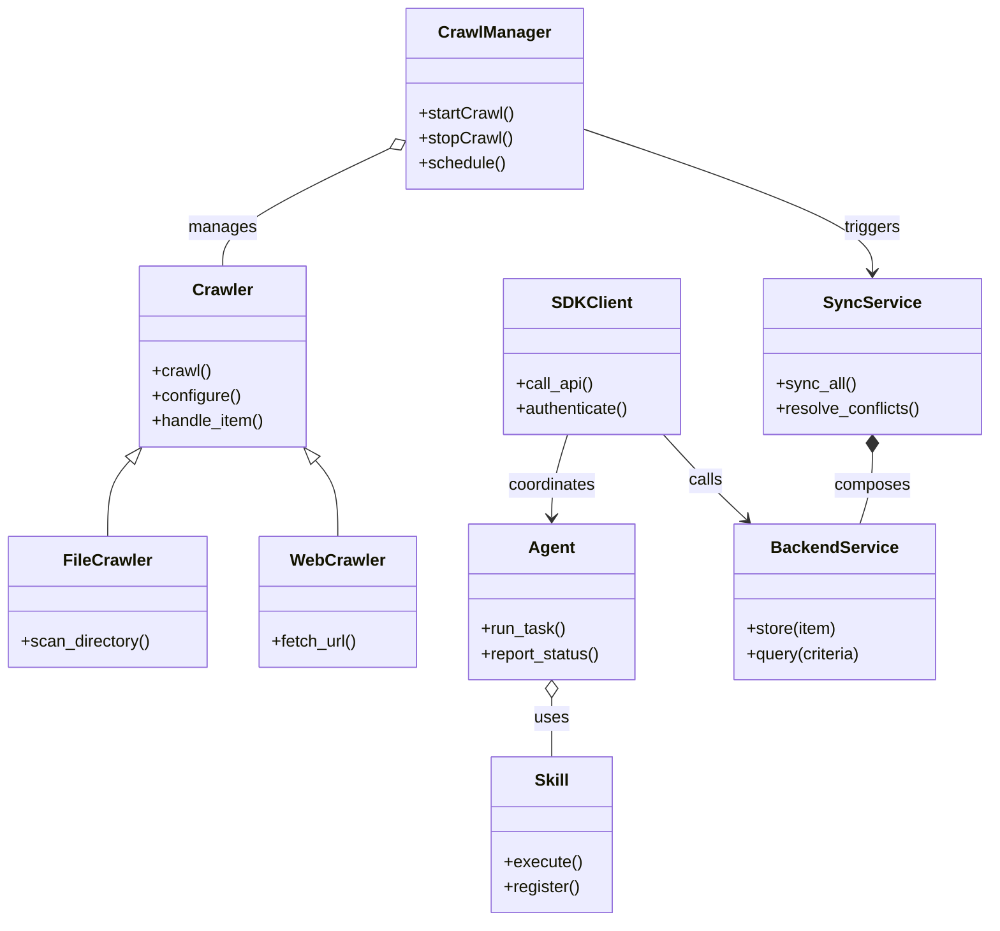

# Diagram: entity_core/entity_service/config/config.qa.yml


> Auto-generated by Obscura crawlers

## Diagram 1

```mermaid
flowchart TD
    User[User / External Trigger] --> Request[Request]
    Request --> CrawlManager[Crawl Manager\n(crawl.py)]
    CrawlManager --> Crawlers[Crawlers Module\n(crawlers/)]
    Crawlers -->|produces| Items[Items / Data]
    Items --> Backend[Backend Service\n(backend/)]
    Backend --> Sync[Sync Service\n(sync.py)]
    Sync --> SDK[SDK / Clients\n(sdk/)]
    Agents[Agents\n(agents/)] --> SDK
    SDK -->|calls| Backend
    CrawlManager --> Agents
    Backend -->|stores| Repos[Repos\n(repos/)]
```

> SVG rendering failed for this diagram.

## Diagram 2



### SVG

<svg id="container" width="948.630859375" xmlns="http://www.w3.org/2000/svg" class="classDiagram" height="886" viewBox="0 0 948.630859375 886" role="graphics-document document" aria-roledescription="class"><style>#container{font-family:"trebuchet ms",verdana,arial,sans-serif;font-size:16px;fill:#333;}@keyframes edge-animation-frame{from{stroke-dashoffset:0;}}@keyframes dash{to{stroke-dashoffset:0;}}#container .edge-animation-slow{stroke-dasharray:9,5!important;stroke-dashoffset:900;animation:dash 50s linear infinite;stroke-linecap:round;}#container .edge-animation-fast{stroke-dasharray:9,5!important;stroke-dashoffset:900;animation:dash 20s linear infinite;stroke-linecap:round;}#container .error-icon{fill:#552222;}#container .error-text{fill:#552222;stroke:#552222;}#container .edge-thickness-normal{stroke-width:1px;}#container .edge-thickness-thick{stroke-width:3.5px;}#container .edge-pattern-solid{stroke-dasharray:0;}#container .edge-thickness-invisible{stroke-width:0;fill:none;}#container .edge-pattern-dashed{stroke-dasharray:3;}#container .edge-pattern-dotted{stroke-dasharray:2;}#container .marker{fill:#333333;stroke:#333333;}#container .marker.cross{stroke:#333333;}#container svg{font-family:"trebuchet ms",verdana,arial,sans-serif;font-size:16px;}#container p{margin:0;}#container g.classGroup text{fill:#9370DB;stroke:none;font-family:"trebuchet ms",verdana,arial,sans-serif;font-size:10px;}#container g.classGroup text .title{font-weight:bolder;}#container .nodeLabel,#container .edgeLabel{color:#131300;}#container .edgeLabel .label rect{fill:#ECECFF;}#container .label text{fill:#131300;}#container .labelBkg{background:#ECECFF;}#container .edgeLabel .label span{background:#ECECFF;}#container .classTitle{font-weight:bolder;}#container .node rect,#container .node circle,#container .node ellipse,#container .node polygon,#container .node path{fill:#ECECFF;stroke:#9370DB;stroke-width:1px;}#container .divider{stroke:#9370DB;stroke-width:1;}#container g.clickable{cursor:pointer;}#container g.classGroup rect{fill:#ECECFF;stroke:#9370DB;}#container g.classGroup line{stroke:#9370DB;stroke-width:1;}#container .classLabel .box{stroke:none;stroke-width:0;fill:#ECECFF;opacity:0.5;}#container .classLabel .label{fill:#9370DB;font-size:10px;}#container .relation{stroke:#333333;stroke-width:1;fill:none;}#container .dashed-line{stroke-dasharray:3;}#container .dotted-line{stroke-dasharray:1 2;}#container #compositionStart,#container .composition{fill:#333333!important;stroke:#333333!important;stroke-width:1;}#container #compositionEnd,#container .composition{fill:#333333!important;stroke:#333333!important;stroke-width:1;}#container #dependencyStart,#container .dependency{fill:#333333!important;stroke:#333333!important;stroke-width:1;}#container #dependencyStart,#container .dependency{fill:#333333!important;stroke:#333333!important;stroke-width:1;}#container #extensionStart,#container .extension{fill:transparent!important;stroke:#333333!important;stroke-width:1;}#container #extensionEnd,#container .extension{fill:transparent!important;stroke:#333333!important;stroke-width:1;}#container #aggregationStart,#container .aggregation{fill:transparent!important;stroke:#333333!important;stroke-width:1;}#container #aggregationEnd,#container .aggregation{fill:transparent!important;stroke:#333333!important;stroke-width:1;}#container #lollipopStart,#container .lollipop{fill:#ECECFF!important;stroke:#333333!important;stroke-width:1;}#container #lollipopEnd,#container .lollipop{fill:#ECECFF!important;stroke:#333333!important;stroke-width:1;}#container .edgeTerminals{font-size:11px;line-height:initial;}#container .classTitleText{text-anchor:middle;font-size:18px;fill:#333;}#container .label-icon{display:inline-block;height:1em;overflow:visible;vertical-align:-0.125em;}#container .node .label-icon path{fill:currentColor;stroke:revert;stroke-width:revert;}#container :root{--mermaid-font-family:"trebuchet ms",verdana,arial,sans-serif;}</style><g><defs><marker id="container_class-aggregationStart" class="marker aggregation class" refX="18" refY="7" markerWidth="190" markerHeight="240" orient="auto"><path d="M 18,7 L9,13 L1,7 L9,1 Z"></path></marker></defs><defs><marker id="container_class-aggregationEnd" class="marker aggregation class" refX="1" refY="7" markerWidth="20" markerHeight="28" orient="auto"><path d="M 18,7 L9,13 L1,7 L9,1 Z"></path></marker></defs><defs><marker id="container_class-extensionStart" class="marker extension class" refX="18" refY="7" markerWidth="190" markerHeight="240" orient="auto"><path d="M 1,7 L18,13 V 1 Z"></path></marker></defs><defs><marker id="container_class-extensionEnd" class="marker extension class" refX="1" refY="7" markerWidth="20" markerHeight="28" orient="auto"><path d="M 1,1 V 13 L18,7 Z"></path></marker></defs><defs><marker id="container_class-compositionStart" class="marker composition class" refX="18" refY="7" markerWidth="190" markerHeight="240" orient="auto"><path d="M 18,7 L9,13 L1,7 L9,1 Z"></path></marker></defs><defs><marker id="container_class-compositionEnd" class="marker composition class" refX="1" refY="7" markerWidth="20" markerHeight="28" orient="auto"><path d="M 18,7 L9,13 L1,7 L9,1 Z"></path></marker></defs><defs><marker id="container_class-dependencyStart" class="marker dependency class" refX="6" refY="7" markerWidth="190" markerHeight="240" orient="auto"><path d="M 5,7 L9,13 L1,7 L9,1 Z"></path></marker></defs><defs><marker id="container_class-dependencyEnd" class="marker dependency class" refX="13" refY="7" markerWidth="20" markerHeight="28" orient="auto"><path d="M 18,7 L9,13 L14,7 L9,1 Z"></path></marker></defs><defs><marker id="container_class-lollipopStart" class="marker lollipop class" refX="13" refY="7" markerWidth="190" markerHeight="240" orient="auto"><circle stroke="black" fill="transparent" cx="7" cy="7" r="6"></circle></marker></defs><defs><marker id="container_class-lollipopEnd" class="marker lollipop class" refX="1" refY="7" markerWidth="190" markerHeight="240" orient="auto"><circle stroke="black" fill="transparent" cx="7" cy="7" r="6"></circle></marker></defs><g class="root"><g class="clusters"></g><g class="edgePaths"><path d="M375.078,141.893L347.941,154.744C320.804,167.595,266.53,193.298,239.393,212.315C212.256,231.333,212.256,243.667,212.256,249.833L212.256,256" id="id_CrawlManager_Crawler_1" class="edge-thickness-normal edge-pattern-solid relation" style=";;;" data-edge="true" data-et="edge" data-id="id_CrawlManager_Crawler_1" data-points="W3sieCI6MzkwLjY2Nzk2ODc1LCJ5IjoxMzQuNTA5NjYzMzY3MjIyODZ9LHsieCI6MjEyLjI1NTg1OTM3NSwieSI6MjE5fSx7IngiOjIxMi4yNTU4NTkzNzUsInkiOjI1Nn1d" marker-start="url(#container_class-aggregationStart)"></path><path d="M123.769,442.914L120.214,446.928C116.659,450.942,109.548,458.971,105.993,471.152C102.438,483.333,102.438,499.667,102.438,507.833L102.438,516" id="id_Crawler_FileCrawler_2" class="edge-thickness-normal edge-pattern-solid relation" style=";;;" data-edge="true" data-et="edge" data-id="id_Crawler_FileCrawler_2" data-points="W3sieCI6MTM1LjIwNTg4MTQyNjQxMTI4LCJ5Ijo0MzB9LHsieCI6MTAyLjQzNzUsInkiOjQ2N30seyJ4IjoxMDIuNDM3NSwieSI6NTE2fV0=" marker-start="url(#container_class-extensionStart)"></path><path d="M300.743,442.914L304.298,446.928C307.853,450.942,314.964,458.971,318.519,471.152C322.074,483.333,322.074,499.667,322.074,507.833L322.074,516" id="id_Crawler_WebCrawler_3" class="edge-thickness-normal edge-pattern-solid relation" style=";;;" data-edge="true" data-et="edge" data-id="id_Crawler_WebCrawler_3" data-points="W3sieCI6Mjg5LjMwNTgzNzMyMzU4ODcsInkiOjQzMH0seyJ4IjozMjIuMDc0MjE4NzUsInkiOjQ2N30seyJ4IjozMjIuMDc0MjE4NzUsInkiOjUxNn1d" marker-start="url(#container_class-extensionStart)"></path><path d="M527.961,671.25L527.961,674.542C527.961,677.833,527.961,684.417,527.961,693.875C527.961,703.333,527.961,715.667,527.961,721.833L527.961,728" id="id_Agent_Skill_4" class="edge-thickness-normal edge-pattern-solid relation" style=";;;" data-edge="true" data-et="edge" data-id="id_Agent_Skill_4" data-points="W3sieCI6NTI3Ljk2MDkzNzUsInkiOjY1NH0seyJ4Ijo1MjcuOTYwOTM3NSwieSI6NjkxfSx7IngiOjUyNy45NjA5Mzc1LCJ5Ijo3Mjh9XQ==" marker-start="url(#container_class-aggregationStart)"></path><path d="M636.432,418L643.929,426.167C651.426,434.333,666.419,450.667,679.754,464.315C693.088,477.964,704.765,488.929,710.603,494.411L716.441,499.893" id="id_SDKClient_BackendService_5" class="edge-thickness-normal edge-pattern-solid relation" style=";;;" data-edge="true" data-et="edge" data-id="id_SDKClient_BackendService_5" data-points="W3sieCI6NjM2LjQzMjQxMjQyNDM5NTEsInkiOjQxOH0seyJ4Ijo2ODEuNDEyMTA5Mzc1LCJ5Ijo0Njd9LHsieCI6NzIwLjgxNDk0MTQwNjI1LCJ5Ijo1MDR9XQ==" marker-end="url(#container_class-dependencyEnd)"></path><path d="M837.135,435.25L837.135,440.542C837.135,445.833,837.135,456.417,835.128,467.875C833.121,479.333,829.107,491.667,827.1,497.833L825.094,504" id="id_SyncService_BackendService_6" class="edge-thickness-normal edge-pattern-solid relation" style=";;;" data-edge="true" data-et="edge" data-id="id_SyncService_BackendService_6" data-points="W3sieCI6ODM3LjEzNDc2NTYyNSwieSI6NDE4fSx7IngiOjgzNy4xMzQ3NjU2MjUsInkiOjQ2N30seyJ4Ijo4MjUuMDkzNTA1ODU5Mzc1LCJ5Ijo1MDR9XQ==" marker-start="url(#container_class-compositionStart)"></path><path d="M543.619,418L541.009,426.167C538.4,434.333,533.18,450.667,530.571,464C527.961,477.333,527.961,487.667,527.961,492.833L527.961,498" id="id_SDKClient_Agent_7" class="edge-thickness-normal edge-pattern-solid relation" style=";;;" data-edge="true" data-et="edge" data-id="id_SDKClient_Agent_7" data-points="W3sieCI6NTQzLjYxOTIwMzYyOTAzMjMsInkiOjQxOH0seyJ4Ijo1MjcuOTYwOTM3NSwieSI6NDY3fSx7IngiOjUyNy45NjA5Mzc1LCJ5Ijo1MDR9XQ==" marker-end="url(#container_class-dependencyEnd)"></path><path d="M557.527,123.496L604.129,139.414C650.73,155.331,743.932,187.165,790.534,210.249C837.135,233.333,837.135,247.667,837.135,254.833L837.135,262" id="id_CrawlManager_SyncService_8" class="edge-thickness-normal edge-pattern-solid relation" style=";;;" data-edge="true" data-et="edge" data-id="id_CrawlManager_SyncService_8" data-points="W3sieCI6NTU3LjUyNzM0Mzc1LCJ5IjoxMjMuNDk2NDg0MTk2MzY4NTN9LHsieCI6ODM3LjEzNDc2NTYyNSwieSI6MjE5fSx7IngiOjgzNy4xMzQ3NjU2MjUsInkiOjI2OH1d" marker-end="url(#container_class-dependencyEnd)"></path></g><g class="edgeLabels"><g class="edgeLabel" transform="translate(212.255859375, 219)"><g class="label" data-id="id_CrawlManager_Crawler_1" transform="translate(-32.296875, -12)"><foreignObject width="64.59375" height="24"><div xmlns="http://www.w3.org/1999/xhtml" class="labelBkg" style="display: table-cell; white-space: nowrap; line-height: 1.5; max-width: 200px; text-align: center;"><span class="edgeLabel"><p>manages</p></span></div></foreignObject></g></g><g class="edgeLabel"><g class="label" data-id="id_Crawler_FileCrawler_2" transform="translate(0, 0)"><foreignObject width="0" height="0"><div xmlns="http://www.w3.org/1999/xhtml" class="labelBkg" style="display: table-cell; white-space: nowrap; line-height: 1.5; max-width: 200px; text-align: center;"><span class="edgeLabel"></span></div></foreignObject></g></g><g class="edgeLabel"><g class="label" data-id="id_Crawler_WebCrawler_3" transform="translate(0, 0)"><foreignObject width="0" height="0"><div xmlns="http://www.w3.org/1999/xhtml" class="labelBkg" style="display: table-cell; white-space: nowrap; line-height: 1.5; max-width: 200px; text-align: center;"><span class="edgeLabel"></span></div></foreignObject></g></g><g class="edgeLabel" transform="translate(527.9609375, 691)"><g class="label" data-id="id_Agent_Skill_4" transform="translate(-16.4921875, -12)"><foreignObject width="32.984375" height="24"><div xmlns="http://www.w3.org/1999/xhtml" class="labelBkg" style="display: table-cell; white-space: nowrap; line-height: 1.5; max-width: 200px; text-align: center;"><span class="edgeLabel"><p>uses</p></span></div></foreignObject></g></g><g class="edgeLabel" transform="translate(677.1982, 462.40945)"><g class="label" data-id="id_SDKClient_BackendService_5" transform="translate(-16.4453125, -12)"><foreignObject width="32.890625" height="24"><div xmlns="http://www.w3.org/1999/xhtml" class="labelBkg" style="display: table-cell; white-space: nowrap; line-height: 1.5; max-width: 200px; text-align: center;"><span class="edgeLabel"><p>calls</p></span></div></foreignObject></g></g><g class="edgeLabel" transform="translate(837.134765625, 467)"><g class="label" data-id="id_SyncService_BackendService_6" transform="translate(-36.453125, -12)"><foreignObject width="72.90625" height="24"><div xmlns="http://www.w3.org/1999/xhtml" class="labelBkg" style="display: table-cell; white-space: nowrap; line-height: 1.5; max-width: 200px; text-align: center;"><span class="edgeLabel"><p>composes</p></span></div></foreignObject></g></g><g class="edgeLabel" transform="translate(527.9609375, 467)"><g class="label" data-id="id_SDKClient_Agent_7" transform="translate(-42.8046875, -12)"><foreignObject width="85.609375" height="24"><div xmlns="http://www.w3.org/1999/xhtml" class="labelBkg" style="display: table-cell; white-space: nowrap; line-height: 1.5; max-width: 200px; text-align: center;"><span class="edgeLabel"><p>coordinates</p></span></div></foreignObject></g></g><g class="edgeLabel" transform="translate(837.134765625, 219)"><g class="label" data-id="id_CrawlManager_SyncService_8" transform="translate(-27.4921875, -12)"><foreignObject width="54.984375" height="24"><div xmlns="http://www.w3.org/1999/xhtml" class="labelBkg" style="display: table-cell; white-space: nowrap; line-height: 1.5; max-width: 200px; text-align: center;"><span class="edgeLabel"><p>triggers</p></span></div></foreignObject></g></g></g><g class="nodes"><g class="node default" id="classId-CrawlManager-0" transform="translate(474.09765625, 95)"><g class="basic label-container"><path d="M-83.4296875 -87 L83.4296875 -87 L83.4296875 87 L-83.4296875 87" stroke="none" stroke-width="0" fill="#ECECFF" style=""></path><path d="M-83.4296875 -87 C-46.13751237655521 -87, -8.845337253110415 -87, 83.4296875 -87 M-83.4296875 -87 C-38.39341937055398 -87, 6.642848758892043 -87, 83.4296875 -87 M83.4296875 -87 C83.4296875 -45.22026427347271, 83.4296875 -3.4405285469454157, 83.4296875 87 M83.4296875 -87 C83.4296875 -30.542824062828906, 83.4296875 25.914351874342188, 83.4296875 87 M83.4296875 87 C45.128268892906995 87, 6.82685028581399 87, -83.4296875 87 M83.4296875 87 C35.58538405088067 87, -12.25891939823866 87, -83.4296875 87 M-83.4296875 87 C-83.4296875 29.317835566071835, -83.4296875 -28.36432886785633, -83.4296875 -87 M-83.4296875 87 C-83.4296875 20.25211990931453, -83.4296875 -46.49576018137094, -83.4296875 -87" stroke="#9370DB" stroke-width="1.3" fill="none" stroke-dasharray="0 0" style=""></path></g><g class="annotation-group text" transform="translate(0, -63)"></g><g class="label-group text" transform="translate(-51.59375, -63)"><g class="label" style="font-weight: bolder" transform="translate(0,-12)"><foreignObject width="103.1875" height="24"><div xmlns="http://www.w3.org/1999/xhtml" style="display: table-cell; white-space: nowrap; line-height: 1.5; max-width: 152px; text-align: center;"><span class="nodeLabel markdown-node-label" style=""><p>CrawlManager</p></span></div></foreignObject></g></g><g class="members-group text" transform="translate(-71.4296875, -15)"></g><g class="methods-group text" transform="translate(-71.4296875, 15)"><g class="label" style="" transform="translate(0,-12)"><foreignObject width="91.265625" height="24"><div xmlns="http://www.w3.org/1999/xhtml" style="display: table-cell; white-space: nowrap; line-height: 1.5; max-width: 149px; text-align: center;"><span class="nodeLabel markdown-node-label" style=""><p>+startCrawl()</p></span></div></foreignObject></g><g class="label" style="" transform="translate(0,12)"><foreignObject width="89.34375" height="24"><div xmlns="http://www.w3.org/1999/xhtml" style="display: table-cell; white-space: nowrap; line-height: 1.5; max-width: 147px; text-align: center;"><span class="nodeLabel markdown-node-label" style=""><p>+stopCrawl()</p></span></div></foreignObject></g><g class="label" style="" transform="translate(0,36)"><foreignObject width="83.78125" height="24"><div xmlns="http://www.w3.org/1999/xhtml" style="display: table-cell; white-space: nowrap; line-height: 1.5; max-width: 141px; text-align: center;"><span class="nodeLabel markdown-node-label" style=""><p>+schedule()</p></span></div></foreignObject></g></g><g class="divider" style=""><path d="M-83.4296875 -39 C-40.10977845375087 -39, 3.2101305924982597 -39, 83.4296875 -39 M-83.4296875 -39 C-16.93807160402278 -39, 49.55354429195444 -39, 83.4296875 -39" stroke="#9370DB" stroke-width="1.3" fill="none" stroke-dasharray="0 0" style=""></path></g><g class="divider" style=""><path d="M-83.4296875 -15 C-35.67590546379646 -15, 12.077876572407078 -15, 83.4296875 -15 M-83.4296875 -15 C-32.33426325193635 -15, 18.761160996127302 -15, 83.4296875 -15" stroke="#9370DB" stroke-width="1.3" fill="none" stroke-dasharray="0 0" style=""></path></g></g><g class="node default" id="classId-Crawler-1" transform="translate(212.255859375, 343)"><g class="basic label-container"><path d="M-80.4609375 -87 L80.4609375 -87 L80.4609375 87 L-80.4609375 87" stroke="none" stroke-width="0" fill="#ECECFF" style=""></path><path d="M-80.4609375 -87 C-35.92678550142888 -87, 8.607366497142237 -87, 80.4609375 -87 M-80.4609375 -87 C-26.264686411511413 -87, 27.931564676977175 -87, 80.4609375 -87 M80.4609375 -87 C80.4609375 -24.95935377174918, 80.4609375 37.08129245650164, 80.4609375 87 M80.4609375 -87 C80.4609375 -50.565919547766256, 80.4609375 -14.131839095532513, 80.4609375 87 M80.4609375 87 C39.48624510817 87, -1.488447283659994 87, -80.4609375 87 M80.4609375 87 C44.72622411651639 87, 8.991510733032783 87, -80.4609375 87 M-80.4609375 87 C-80.4609375 27.380779477791826, -80.4609375 -32.23844104441635, -80.4609375 -87 M-80.4609375 87 C-80.4609375 28.595831124326487, -80.4609375 -29.808337751347025, -80.4609375 -87" stroke="#9370DB" stroke-width="1.3" fill="none" stroke-dasharray="0 0" style=""></path></g><g class="annotation-group text" transform="translate(0, -63)"></g><g class="label-group text" transform="translate(-27.734375, -63)"><g class="label" style="font-weight: bolder" transform="translate(0,-12)"><foreignObject width="55.46875" height="24"><div xmlns="http://www.w3.org/1999/xhtml" style="display: table-cell; white-space: nowrap; line-height: 1.5; max-width: 105px; text-align: center;"><span class="nodeLabel markdown-node-label" style=""><p>Crawler</p></span></div></foreignObject></g></g><g class="members-group text" transform="translate(-68.4609375, -15)"></g><g class="methods-group text" transform="translate(-68.4609375, 15)"><g class="label" style="" transform="translate(0,-12)"><foreignObject width="56.40625" height="24"><div xmlns="http://www.w3.org/1999/xhtml" style="display: table-cell; white-space: nowrap; line-height: 1.5; max-width: 114px; text-align: center;"><span class="nodeLabel markdown-node-label" style=""><p>+crawl()</p></span></div></foreignObject></g><g class="label" style="" transform="translate(0,12)"><foreignObject width="85.5" height="24"><div xmlns="http://www.w3.org/1999/xhtml" style="display: table-cell; white-space: nowrap; line-height: 1.5; max-width: 143px; text-align: center;"><span class="nodeLabel markdown-node-label" style=""><p>+configure()</p></span></div></foreignObject></g><g class="label" style="" transform="translate(0,36)"><foreignObject width="109.1875" height="24"><div xmlns="http://www.w3.org/1999/xhtml" style="display: table-cell; white-space: nowrap; line-height: 1.5; max-width: 167px; text-align: center;"><span class="nodeLabel markdown-node-label" style=""><p>+handle_item()</p></span></div></foreignObject></g></g><g class="divider" style=""><path d="M-80.4609375 -39 C-40.018945419503765 -39, 0.423046660992469 -39, 80.4609375 -39 M-80.4609375 -39 C-16.930000319795994 -39, 46.60093686040801 -39, 80.4609375 -39" stroke="#9370DB" stroke-width="1.3" fill="none" stroke-dasharray="0 0" style=""></path></g><g class="divider" style=""><path d="M-80.4609375 -15 C-23.236159438694507 -15, 33.988618622610986 -15, 80.4609375 -15 M-80.4609375 -15 C-28.958656272864246 -15, 22.543624954271507 -15, 80.4609375 -15" stroke="#9370DB" stroke-width="1.3" fill="none" stroke-dasharray="0 0" style=""></path></g></g><g class="node default" id="classId-FileCrawler-2" transform="translate(102.4375, 579)"><g class="basic label-container"><path d="M-94.4375 -63 L94.4375 -63 L94.4375 63 L-94.4375 63" stroke="none" stroke-width="0" fill="#ECECFF" style=""></path><path d="M-94.4375 -63 C-55.76573010948164 -63, -17.093960218963275 -63, 94.4375 -63 M-94.4375 -63 C-46.074819720656755 -63, 2.2878605586864893 -63, 94.4375 -63 M94.4375 -63 C94.4375 -31.141575833821708, 94.4375 0.7168483323565837, 94.4375 63 M94.4375 -63 C94.4375 -27.96521348096323, 94.4375 7.069573038073543, 94.4375 63 M94.4375 63 C50.09060973575231 63, 5.743719471504619 63, -94.4375 63 M94.4375 63 C43.4569943936066 63, -7.523511212786801 63, -94.4375 63 M-94.4375 63 C-94.4375 26.761452298027947, -94.4375 -9.477095403944105, -94.4375 -63 M-94.4375 63 C-94.4375 36.81716003226899, -94.4375 10.634320064537981, -94.4375 -63" stroke="#9370DB" stroke-width="1.3" fill="none" stroke-dasharray="0 0" style=""></path></g><g class="annotation-group text" transform="translate(0, -39)"></g><g class="label-group text" transform="translate(-40.40625, -39)"><g class="label" style="font-weight: bolder" transform="translate(0,-12)"><foreignObject width="80.8125" height="24"><div xmlns="http://www.w3.org/1999/xhtml" style="display: table-cell; white-space: nowrap; line-height: 1.5; max-width: 130px; text-align: center;"><span class="nodeLabel markdown-node-label" style=""><p>FileCrawler</p></span></div></foreignObject></g></g><g class="members-group text" transform="translate(-82.4375, 9)"></g><g class="methods-group text" transform="translate(-82.4375, 39)"><g class="label" style="" transform="translate(0,-12)"><foreignObject width="124.46875" height="24"><div xmlns="http://www.w3.org/1999/xhtml" style="display: table-cell; white-space: nowrap; line-height: 1.5; max-width: 182px; text-align: center;"><span class="nodeLabel markdown-node-label" style=""><p>+scan_directory()</p></span></div></foreignObject></g></g><g class="divider" style=""><path d="M-94.4375 -15 C-46.360383049028165 -15, 1.7167339019436696 -15, 94.4375 -15 M-94.4375 -15 C-39.182095328543355 -15, 16.07330934291329 -15, 94.4375 -15" stroke="#9370DB" stroke-width="1.3" fill="none" stroke-dasharray="0 0" style=""></path></g><g class="divider" style=""><path d="M-94.4375 9 C-26.929850382265485 9, 40.57779923546903 9, 94.4375 9 M-94.4375 9 C-46.776239923523214 9, 0.8850201529535724 9, 94.4375 9" stroke="#9370DB" stroke-width="1.3" fill="none" stroke-dasharray="0 0" style=""></path></g></g><g class="node default" id="classId-WebCrawler-3" transform="translate(322.07421875, 579)"><g class="basic label-container"><path d="M-75.19921875 -63 L75.19921875 -63 L75.19921875 63 L-75.19921875 63" stroke="none" stroke-width="0" fill="#ECECFF" style=""></path><path d="M-75.19921875 -63 C-32.97729927249049 -63, 9.244620205019018 -63, 75.19921875 -63 M-75.19921875 -63 C-35.55355076194537 -63, 4.092117226109266 -63, 75.19921875 -63 M75.19921875 -63 C75.19921875 -22.880800387990575, 75.19921875 17.23839922401885, 75.19921875 63 M75.19921875 -63 C75.19921875 -23.13945996024681, 75.19921875 16.72108007950638, 75.19921875 63 M75.19921875 63 C42.35380401560951 63, 9.508389281219024 63, -75.19921875 63 M75.19921875 63 C31.435269095991224 63, -12.328680558017552 63, -75.19921875 63 M-75.19921875 63 C-75.19921875 13.197564185161347, -75.19921875 -36.604871629677305, -75.19921875 -63 M-75.19921875 63 C-75.19921875 13.787647552448952, -75.19921875 -35.424704895102096, -75.19921875 -63" stroke="#9370DB" stroke-width="1.3" fill="none" stroke-dasharray="0 0" style=""></path></g><g class="annotation-group text" transform="translate(0, -39)"></g><g class="label-group text" transform="translate(-43.6171875, -39)"><g class="label" style="font-weight: bolder" transform="translate(0,-12)"><foreignObject width="87.234375" height="24"><div xmlns="http://www.w3.org/1999/xhtml" style="display: table-cell; white-space: nowrap; line-height: 1.5; max-width: 136px; text-align: center;"><span class="nodeLabel markdown-node-label" style=""><p>WebCrawler</p></span></div></foreignObject></g></g><g class="members-group text" transform="translate(-63.19921875, 9)"></g><g class="methods-group text" transform="translate(-63.19921875, 39)"><g class="label" style="" transform="translate(0,-12)"><foreignObject width="82.78125" height="24"><div xmlns="http://www.w3.org/1999/xhtml" style="display: table-cell; white-space: nowrap; line-height: 1.5; max-width: 140px; text-align: center;"><span class="nodeLabel markdown-node-label" style=""><p>+fetch_url()</p></span></div></foreignObject></g></g><g class="divider" style=""><path d="M-75.19921875 -15 C-40.71301919481074 -15, -6.226819639621482 -15, 75.19921875 -15 M-75.19921875 -15 C-16.230023753621225 -15, 42.73917124275755 -15, 75.19921875 -15" stroke="#9370DB" stroke-width="1.3" fill="none" stroke-dasharray="0 0" style=""></path></g><g class="divider" style=""><path d="M-75.19921875 9 C-28.670078646972208 9, 17.859061456055585 9, 75.19921875 9 M-75.19921875 9 C-44.79221363299361 9, -14.385208515987223 9, 75.19921875 9" stroke="#9370DB" stroke-width="1.3" fill="none" stroke-dasharray="0 0" style=""></path></g></g><g class="node default" id="classId-Agent-4" transform="translate(527.9609375, 579)"><g class="basic label-container"><path d="M-80.6875 -75 L80.6875 -75 L80.6875 75 L-80.6875 75" stroke="none" stroke-width="0" fill="#ECECFF" style=""></path><path d="M-80.6875 -75 C-32.996475244859596 -75, 14.694549510280808 -75, 80.6875 -75 M-80.6875 -75 C-47.91327898121044 -75, -15.139057962420878 -75, 80.6875 -75 M80.6875 -75 C80.6875 -23.943828254165595, 80.6875 27.11234349166881, 80.6875 75 M80.6875 -75 C80.6875 -38.044979934207184, 80.6875 -1.0899598684143683, 80.6875 75 M80.6875 75 C34.162254537159555 75, -12.36299092568089 75, -80.6875 75 M80.6875 75 C36.72417753540521 75, -7.239144929189578 75, -80.6875 75 M-80.6875 75 C-80.6875 20.84969148111727, -80.6875 -33.30061703776546, -80.6875 -75 M-80.6875 75 C-80.6875 15.047808613157237, -80.6875 -44.904382773685526, -80.6875 -75" stroke="#9370DB" stroke-width="1.3" fill="none" stroke-dasharray="0 0" style=""></path></g><g class="annotation-group text" transform="translate(0, -51)"></g><g class="label-group text" transform="translate(-21.078125, -51)"><g class="label" style="font-weight: bolder" transform="translate(0,-12)"><foreignObject width="42.15625" height="24"><div xmlns="http://www.w3.org/1999/xhtml" style="display: table-cell; white-space: nowrap; line-height: 1.5; max-width: 91px; text-align: center;"><span class="nodeLabel markdown-node-label" style=""><p>Agent</p></span></div></foreignObject></g></g><g class="members-group text" transform="translate(-68.6875, -3)"></g><g class="methods-group text" transform="translate(-68.6875, 27)"><g class="label" style="" transform="translate(0,-12)"><foreignObject width="81.09375" height="24"><div xmlns="http://www.w3.org/1999/xhtml" style="display: table-cell; white-space: nowrap; line-height: 1.5; max-width: 138px; text-align: center;"><span class="nodeLabel markdown-node-label" style=""><p>+run_task()</p></span></div></foreignObject></g><g class="label" style="" transform="translate(0,12)"><foreignObject width="116.296875" height="24"><div xmlns="http://www.w3.org/1999/xhtml" style="display: table-cell; white-space: nowrap; line-height: 1.5; max-width: 174px; text-align: center;"><span class="nodeLabel markdown-node-label" style=""><p>+report_status()</p></span></div></foreignObject></g></g><g class="divider" style=""><path d="M-80.6875 -27 C-17.557869305929813 -27, 45.571761388140374 -27, 80.6875 -27 M-80.6875 -27 C-32.44855883429919 -27, 15.790382331401617 -27, 80.6875 -27" stroke="#9370DB" stroke-width="1.3" fill="none" stroke-dasharray="0 0" style=""></path></g><g class="divider" style=""><path d="M-80.6875 -3 C-33.47348026546655 -3, 13.740539469066903 -3, 80.6875 -3 M-80.6875 -3 C-27.876994989422826 -3, 24.933510021154348 -3, 80.6875 -3" stroke="#9370DB" stroke-width="1.3" fill="none" stroke-dasharray="0 0" style=""></path></g></g><g class="node default" id="classId-Skill-5" transform="translate(527.9609375, 803)"><g class="basic label-container"><path d="M-57.16796875 -75 L57.16796875 -75 L57.16796875 75 L-57.16796875 75" stroke="none" stroke-width="0" fill="#ECECFF" style=""></path><path d="M-57.16796875 -75 C-28.83937784448355 -75, -0.5107869389671009 -75, 57.16796875 -75 M-57.16796875 -75 C-12.756163108014334 -75, 31.65564253397133 -75, 57.16796875 -75 M57.16796875 -75 C57.16796875 -28.040920164629682, 57.16796875 18.918159670740636, 57.16796875 75 M57.16796875 -75 C57.16796875 -25.56521187353976, 57.16796875 23.86957625292048, 57.16796875 75 M57.16796875 75 C17.360896617988985 75, -22.44617551402203 75, -57.16796875 75 M57.16796875 75 C31.223788198309027 75, 5.279607646618054 75, -57.16796875 75 M-57.16796875 75 C-57.16796875 21.886073115445164, -57.16796875 -31.22785376910967, -57.16796875 -75 M-57.16796875 75 C-57.16796875 22.562876217070574, -57.16796875 -29.87424756585885, -57.16796875 -75" stroke="#9370DB" stroke-width="1.3" fill="none" stroke-dasharray="0 0" style=""></path></g><g class="annotation-group text" transform="translate(0, -51)"></g><g class="label-group text" transform="translate(-16.0078125, -51)"><g class="label" style="font-weight: bolder" transform="translate(0,-12)"><foreignObject width="32.015625" height="24"><div xmlns="http://www.w3.org/1999/xhtml" style="display: table-cell; white-space: nowrap; line-height: 1.5; max-width: 81px; text-align: center;"><span class="nodeLabel markdown-node-label" style=""><p>Skill</p></span></div></foreignObject></g></g><g class="members-group text" transform="translate(-45.16796875, -3)"></g><g class="methods-group text" transform="translate(-45.16796875, 27)"><g class="label" style="" transform="translate(0,-12)"><foreignObject width="74.328125" height="24"><div xmlns="http://www.w3.org/1999/xhtml" style="display: table-cell; white-space: nowrap; line-height: 1.5; max-width: 132px; text-align: center;"><span class="nodeLabel markdown-node-label" style=""><p>+execute()</p></span></div></foreignObject></g><g class="label" style="" transform="translate(0,12)"><foreignObject width="73.515625" height="24"><div xmlns="http://www.w3.org/1999/xhtml" style="display: table-cell; white-space: nowrap; line-height: 1.5; max-width: 131px; text-align: center;"><span class="nodeLabel markdown-node-label" style=""><p>+register()</p></span></div></foreignObject></g></g><g class="divider" style=""><path d="M-57.16796875 -27 C-31.28280216225337 -27, -5.397635574506737 -27, 57.16796875 -27 M-57.16796875 -27 C-34.10893850606334 -27, -11.04990826212667 -27, 57.16796875 -27" stroke="#9370DB" stroke-width="1.3" fill="none" stroke-dasharray="0 0" style=""></path></g><g class="divider" style=""><path d="M-57.16796875 -3 C-18.1474659596541 -3, 20.873036830691802 -3, 57.16796875 -3 M-57.16796875 -3 C-13.182024354024946 -3, 30.803920041950107 -3, 57.16796875 -3" stroke="#9370DB" stroke-width="1.3" fill="none" stroke-dasharray="0 0" style=""></path></g></g><g class="node default" id="classId-BackendService-6" transform="translate(800.685546875, 579)"><g class="basic label-container"><path d="M-96.96484375 -75 L96.96484375 -75 L96.96484375 75 L-96.96484375 75" stroke="none" stroke-width="0" fill="#ECECFF" style=""></path><path d="M-96.96484375 -75 C-48.50833556956685 -75, -0.05182738913370599 -75, 96.96484375 -75 M-96.96484375 -75 C-24.55181959907938 -75, 47.86120455184124 -75, 96.96484375 -75 M96.96484375 -75 C96.96484375 -27.4107015528841, 96.96484375 20.178596894231802, 96.96484375 75 M96.96484375 -75 C96.96484375 -40.49941762998835, 96.96484375 -5.998835259976701, 96.96484375 75 M96.96484375 75 C44.6009585295548 75, -7.762926690890396 75, -96.96484375 75 M96.96484375 75 C44.09867916381644 75, -8.767485422367116 75, -96.96484375 75 M-96.96484375 75 C-96.96484375 28.70102113662955, -96.96484375 -17.5979577267409, -96.96484375 -75 M-96.96484375 75 C-96.96484375 19.275495380163697, -96.96484375 -36.449009239672606, -96.96484375 -75" stroke="#9370DB" stroke-width="1.3" fill="none" stroke-dasharray="0 0" style=""></path></g><g class="annotation-group text" transform="translate(0, -51)"></g><g class="label-group text" transform="translate(-57.9453125, -51)"><g class="label" style="font-weight: bolder" transform="translate(0,-12)"><foreignObject width="115.890625" height="24"><div xmlns="http://www.w3.org/1999/xhtml" style="display: table-cell; white-space: nowrap; line-height: 1.5; max-width: 164px; text-align: center;"><span class="nodeLabel markdown-node-label" style=""><p>BackendService</p></span></div></foreignObject></g></g><g class="members-group text" transform="translate(-84.96484375, -3)"></g><g class="methods-group text" transform="translate(-84.96484375, 27)"><g class="label" style="" transform="translate(0,-12)"><foreignObject width="87.609375" height="24"><div xmlns="http://www.w3.org/1999/xhtml" style="display: table-cell; white-space: nowrap; line-height: 1.5; max-width: 145px; text-align: center;"><span class="nodeLabel markdown-node-label" style=""><p>+store(item)</p></span></div></foreignObject></g><g class="label" style="" transform="translate(0,12)"><foreignObject width="111.984375" height="24"><div xmlns="http://www.w3.org/1999/xhtml" style="display: table-cell; white-space: nowrap; line-height: 1.5; max-width: 169px; text-align: center;"><span class="nodeLabel markdown-node-label" style=""><p>+query(criteria)</p></span></div></foreignObject></g></g><g class="divider" style=""><path d="M-96.96484375 -27 C-53.933990240530534 -27, -10.903136731061068 -27, 96.96484375 -27 M-96.96484375 -27 C-47.08057322614288 -27, 2.803697297714237 -27, 96.96484375 -27" stroke="#9370DB" stroke-width="1.3" fill="none" stroke-dasharray="0 0" style=""></path></g><g class="divider" style=""><path d="M-96.96484375 -3 C-54.93323897847308 -3, -12.901634206946156 -3, 96.96484375 -3 M-96.96484375 -3 C-33.16399487217119 -3, 30.636854005657625 -3, 96.96484375 -3" stroke="#9370DB" stroke-width="1.3" fill="none" stroke-dasharray="0 0" style=""></path></g></g><g class="node default" id="classId-SyncService-7" transform="translate(837.134765625, 343)"><g class="basic label-container"><path d="M-103.49609375 -75 L103.49609375 -75 L103.49609375 75 L-103.49609375 75" stroke="none" stroke-width="0" fill="#ECECFF" style=""></path><path d="M-103.49609375 -75 C-35.209962606729206 -75, 33.07616853654159 -75, 103.49609375 -75 M-103.49609375 -75 C-35.60399075956636 -75, 32.288112230867284 -75, 103.49609375 -75 M103.49609375 -75 C103.49609375 -30.96044559552874, 103.49609375 13.079108808942522, 103.49609375 75 M103.49609375 -75 C103.49609375 -34.23280265598792, 103.49609375 6.534394688024165, 103.49609375 75 M103.49609375 75 C37.09089913177566 75, -29.314295486448685 75, -103.49609375 75 M103.49609375 75 C42.16332360058409 75, -19.169446548831814 75, -103.49609375 75 M-103.49609375 75 C-103.49609375 25.55574534188098, -103.49609375 -23.888509316238043, -103.49609375 -75 M-103.49609375 75 C-103.49609375 31.554924304649944, -103.49609375 -11.890151390700112, -103.49609375 -75" stroke="#9370DB" stroke-width="1.3" fill="none" stroke-dasharray="0 0" style=""></path></g><g class="annotation-group text" transform="translate(0, -51)"></g><g class="label-group text" transform="translate(-43.7421875, -51)"><g class="label" style="font-weight: bolder" transform="translate(0,-12)"><foreignObject width="87.484375" height="24"><div xmlns="http://www.w3.org/1999/xhtml" style="display: table-cell; white-space: nowrap; line-height: 1.5; max-width: 136px; text-align: center;"><span class="nodeLabel markdown-node-label" style=""><p>SyncService</p></span></div></foreignObject></g></g><g class="members-group text" transform="translate(-91.49609375, -3)"></g><g class="methods-group text" transform="translate(-91.49609375, 27)"><g class="label" style="" transform="translate(0,-12)"><foreignObject width="76.375" height="24"><div xmlns="http://www.w3.org/1999/xhtml" style="display: table-cell; white-space: nowrap; line-height: 1.5; max-width: 134px; text-align: center;"><span class="nodeLabel markdown-node-label" style=""><p>+sync_all()</p></span></div></foreignObject></g><g class="label" style="" transform="translate(0,12)"><foreignObject width="139.25" height="24"><div xmlns="http://www.w3.org/1999/xhtml" style="display: table-cell; white-space: nowrap; line-height: 1.5; max-width: 197px; text-align: center;"><span class="nodeLabel markdown-node-label" style=""><p>+resolve_conflicts()</p></span></div></foreignObject></g></g><g class="divider" style=""><path d="M-103.49609375 -27 C-24.536473304830366 -27, 54.42314714033927 -27, 103.49609375 -27 M-103.49609375 -27 C-38.74201375897678 -27, 26.012066232046436 -27, 103.49609375 -27" stroke="#9370DB" stroke-width="1.3" fill="none" stroke-dasharray="0 0" style=""></path></g><g class="divider" style=""><path d="M-103.49609375 -3 C-24.50908252295001 -3, 54.47792870409998 -3, 103.49609375 -3 M-103.49609375 -3 C-43.744192256514715 -3, 16.00770923697057 -3, 103.49609375 -3" stroke="#9370DB" stroke-width="1.3" fill="none" stroke-dasharray="0 0" style=""></path></g></g><g class="node default" id="classId-SDKClient-8" transform="translate(567.5859375, 343)"><g class="basic label-container"><path d="M-85.05078125 -75 L85.05078125 -75 L85.05078125 75 L-85.05078125 75" stroke="none" stroke-width="0" fill="#ECECFF" style=""></path><path d="M-85.05078125 -75 C-49.182334683659995 -75, -13.31388811731999 -75, 85.05078125 -75 M-85.05078125 -75 C-33.69453739018909 -75, 17.66170646962182 -75, 85.05078125 -75 M85.05078125 -75 C85.05078125 -23.98820283442548, 85.05078125 27.02359433114904, 85.05078125 75 M85.05078125 -75 C85.05078125 -42.84637920122442, 85.05078125 -10.692758402448845, 85.05078125 75 M85.05078125 75 C21.399877388718842 75, -42.251026472562316 75, -85.05078125 75 M85.05078125 75 C41.08909789888443 75, -2.872585452231135 75, -85.05078125 75 M-85.05078125 75 C-85.05078125 36.31881224050452, -85.05078125 -2.3623755189909588, -85.05078125 -75 M-85.05078125 75 C-85.05078125 32.708925458122735, -85.05078125 -9.58214908375453, -85.05078125 -75" stroke="#9370DB" stroke-width="1.3" fill="none" stroke-dasharray="0 0" style=""></path></g><g class="annotation-group text" transform="translate(0, -51)"></g><g class="label-group text" transform="translate(-35.9765625, -51)"><g class="label" style="font-weight: bolder" transform="translate(0,-12)"><foreignObject width="71.953125" height="24"><div xmlns="http://www.w3.org/1999/xhtml" style="display: table-cell; white-space: nowrap; line-height: 1.5; max-width: 120px; text-align: center;"><span class="nodeLabel markdown-node-label" style=""><p>SDKClient</p></span></div></foreignObject></g></g><g class="members-group text" transform="translate(-73.05078125, -3)"></g><g class="methods-group text" transform="translate(-73.05078125, 27)"><g class="label" style="" transform="translate(0,-12)"><foreignObject width="74.484375" height="24"><div xmlns="http://www.w3.org/1999/xhtml" style="display: table-cell; white-space: nowrap; line-height: 1.5; max-width: 132px; text-align: center;"><span class="nodeLabel markdown-node-label" style=""><p>+call_api()</p></span></div></foreignObject></g><g class="label" style="" transform="translate(0,12)"><foreignObject width="110.125" height="24"><div xmlns="http://www.w3.org/1999/xhtml" style="display: table-cell; white-space: nowrap; line-height: 1.5; max-width: 167px; text-align: center;"><span class="nodeLabel markdown-node-label" style=""><p>+authenticate()</p></span></div></foreignObject></g></g><g class="divider" style=""><path d="M-85.05078125 -27 C-29.32868346211834 -27, 26.393414325763317 -27, 85.05078125 -27 M-85.05078125 -27 C-38.570052860340134 -27, 7.910675529319732 -27, 85.05078125 -27" stroke="#9370DB" stroke-width="1.3" fill="none" stroke-dasharray="0 0" style=""></path></g><g class="divider" style=""><path d="M-85.05078125 -3 C-19.87822926663773 -3, 45.29432271672454 -3, 85.05078125 -3 M-85.05078125 -3 C-37.714114039701634 -3, 9.622553170596731 -3, 85.05078125 -3" stroke="#9370DB" stroke-width="1.3" fill="none" stroke-dasharray="0 0" style=""></path></g></g></g></g></g></svg>
