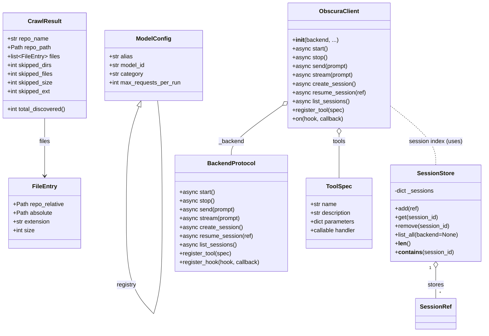

# Diagram: entity_core/entity_service/config/config.staging.yml


> Auto-generated by Obscura crawlers

## Diagram 1



### SVG

<svg id="container" width="1323.62890625" xmlns="http://www.w3.org/2000/svg" class="classDiagram" height="908" viewBox="0 0 1323.62890625 908" role="graphics-document document" aria-roledescription="class"><style>#container{font-family:"trebuchet ms",verdana,arial,sans-serif;font-size:16px;fill:#333;}@keyframes edge-animation-frame{from{stroke-dashoffset:0;}}@keyframes dash{to{stroke-dashoffset:0;}}#container .edge-animation-slow{stroke-dasharray:9,5!important;stroke-dashoffset:900;animation:dash 50s linear infinite;stroke-linecap:round;}#container .edge-animation-fast{stroke-dasharray:9,5!important;stroke-dashoffset:900;animation:dash 20s linear infinite;stroke-linecap:round;}#container .error-icon{fill:#552222;}#container .error-text{fill:#552222;stroke:#552222;}#container .edge-thickness-normal{stroke-width:1px;}#container .edge-thickness-thick{stroke-width:3.5px;}#container .edge-pattern-solid{stroke-dasharray:0;}#container .edge-thickness-invisible{stroke-width:0;fill:none;}#container .edge-pattern-dashed{stroke-dasharray:3;}#container .edge-pattern-dotted{stroke-dasharray:2;}#container .marker{fill:#333333;stroke:#333333;}#container .marker.cross{stroke:#333333;}#container svg{font-family:"trebuchet ms",verdana,arial,sans-serif;font-size:16px;}#container p{margin:0;}#container g.classGroup text{fill:#9370DB;stroke:none;font-family:"trebuchet ms",verdana,arial,sans-serif;font-size:10px;}#container g.classGroup text .title{font-weight:bolder;}#container .nodeLabel,#container .edgeLabel{color:#131300;}#container .edgeLabel .label rect{fill:#ECECFF;}#container .label text{fill:#131300;}#container .labelBkg{background:#ECECFF;}#container .edgeLabel .label span{background:#ECECFF;}#container .classTitle{font-weight:bolder;}#container .node rect,#container .node circle,#container .node ellipse,#container .node polygon,#container .node path{fill:#ECECFF;stroke:#9370DB;stroke-width:1px;}#container .divider{stroke:#9370DB;stroke-width:1;}#container g.clickable{cursor:pointer;}#container g.classGroup rect{fill:#ECECFF;stroke:#9370DB;}#container g.classGroup line{stroke:#9370DB;stroke-width:1;}#container .classLabel .box{stroke:none;stroke-width:0;fill:#ECECFF;opacity:0.5;}#container .classLabel .label{fill:#9370DB;font-size:10px;}#container .relation{stroke:#333333;stroke-width:1;fill:none;}#container .dashed-line{stroke-dasharray:3;}#container .dotted-line{stroke-dasharray:1 2;}#container #compositionStart,#container .composition{fill:#333333!important;stroke:#333333!important;stroke-width:1;}#container #compositionEnd,#container .composition{fill:#333333!important;stroke:#333333!important;stroke-width:1;}#container #dependencyStart,#container .dependency{fill:#333333!important;stroke:#333333!important;stroke-width:1;}#container #dependencyStart,#container .dependency{fill:#333333!important;stroke:#333333!important;stroke-width:1;}#container #extensionStart,#container .extension{fill:transparent!important;stroke:#333333!important;stroke-width:1;}#container #extensionEnd,#container .extension{fill:transparent!important;stroke:#333333!important;stroke-width:1;}#container #aggregationStart,#container .aggregation{fill:transparent!important;stroke:#333333!important;stroke-width:1;}#container #aggregationEnd,#container .aggregation{fill:transparent!important;stroke:#333333!important;stroke-width:1;}#container #lollipopStart,#container .lollipop{fill:#ECECFF!important;stroke:#333333!important;stroke-width:1;}#container #lollipopEnd,#container .lollipop{fill:#ECECFF!important;stroke:#333333!important;stroke-width:1;}#container .edgeTerminals{font-size:11px;line-height:initial;}#container .classTitleText{text-anchor:middle;font-size:18px;fill:#333;}#container .label-icon{display:inline-block;height:1em;overflow:visible;vertical-align:-0.125em;}#container .node .label-icon path{fill:currentColor;stroke:revert;stroke-width:revert;}#container :root{--mermaid-font-family:"trebuchet ms",verdana,arial,sans-serif;}</style><g><defs><marker id="container_class-aggregationStart" class="marker aggregation class" refX="18" refY="7" markerWidth="190" markerHeight="240" orient="auto"><path d="M 18,7 L9,13 L1,7 L9,1 Z"></path></marker></defs><defs><marker id="container_class-aggregationEnd" class="marker aggregation class" refX="1" refY="7" markerWidth="20" markerHeight="28" orient="auto"><path d="M 18,7 L9,13 L1,7 L9,1 Z"></path></marker></defs><defs><marker id="container_class-extensionStart" class="marker extension class" refX="18" refY="7" markerWidth="190" markerHeight="240" orient="auto"><path d="M 1,7 L18,13 V 1 Z"></path></marker></defs><defs><marker id="container_class-extensionEnd" class="marker extension class" refX="1" refY="7" markerWidth="20" markerHeight="28" orient="auto"><path d="M 1,1 V 13 L18,7 Z"></path></marker></defs><defs><marker id="container_class-compositionStart" class="marker composition class" refX="18" refY="7" markerWidth="190" markerHeight="240" orient="auto"><path d="M 18,7 L9,13 L1,7 L9,1 Z"></path></marker></defs><defs><marker id="container_class-compositionEnd" class="marker composition class" refX="1" refY="7" markerWidth="20" markerHeight="28" orient="auto"><path d="M 18,7 L9,13 L1,7 L9,1 Z"></path></marker></defs><defs><marker id="container_class-dependencyStart" class="marker dependency class" refX="6" refY="7" markerWidth="190" markerHeight="240" orient="auto"><path d="M 5,7 L9,13 L1,7 L9,1 Z"></path></marker></defs><defs><marker id="container_class-dependencyEnd" class="marker dependency class" refX="13" refY="7" markerWidth="20" markerHeight="28" orient="auto"><path d="M 18,7 L9,13 L14,7 L9,1 Z"></path></marker></defs><defs><marker id="container_class-lollipopStart" class="marker lollipop class" refX="13" refY="7" markerWidth="190" markerHeight="240" orient="auto"><circle stroke="black" fill="transparent" cx="7" cy="7" r="6"></circle></marker></defs><defs><marker id="container_class-lollipopEnd" class="marker lollipop class" refX="1" refY="7" markerWidth="190" markerHeight="240" orient="auto"><circle stroke="black" fill="transparent" cx="7" cy="7" r="6"></circle></marker></defs><g class="root"><g class="clusters"></g><g class="edgePaths"><path d="M123,323L123,333.667C123,344.333,123,365.667,123,392C123,418.333,123,449.667,123,465.333L123,481" id="id_CrawlResult_FileEntry_1" class="edge-thickness-normal edge-pattern-solid relation" style=";;;" data-edge="true" data-et="edge" data-id="id_CrawlResult_FileEntry_1" data-points="W3sieCI6MTIzLCJ5IjozMjN9LHsieCI6MTIzLCJ5IjozODd9LHsieCI6MTIzLCJ5Ijo0ODd9XQ==" marker-end="url(#container_class-dependencyEnd)"></path><path d="M776.346,286.014L752.505,302.845C728.665,319.676,680.985,353.338,657.145,376.336C633.305,399.333,633.305,411.667,633.305,417.833L633.305,424" id="id_ObscuraClient_BackendProtocol_2" class="edge-thickness-normal edge-pattern-solid relation" style=";;;" data-edge="true" data-et="edge" data-id="id_ObscuraClient_BackendProtocol_2" data-points="W3sieCI6NzkwLjQzNzUsInkiOjI3Ni4wNjU1NjM1NTQ4ODM4fSx7IngiOjYzMy4zMDQ2ODc1LCJ5IjozODd9LHsieCI6NjMzLjMwNDY4NzUsInkiOjQyNH1d" marker-start="url(#container_class-aggregationStart)"></path><path d="M927.926,367.25L927.926,370.542C927.926,373.833,927.926,380.417,927.926,400.375C927.926,420.333,927.926,453.667,927.926,470.333L927.926,487" id="id_ObscuraClient_ToolSpec_3" class="edge-thickness-normal edge-pattern-solid relation" style=";;;" data-edge="true" data-et="edge" data-id="id_ObscuraClient_ToolSpec_3" data-points="W3sieCI6OTI3LjkyNTc4MTI1LCJ5IjozNTB9LHsieCI6OTI3LjkyNTc4MTI1LCJ5IjozODd9LHsieCI6OTI3LjkyNTc4MTI1LCJ5Ijo0ODd9XQ==" marker-start="url(#container_class-aggregationStart)"></path><path d="M1065.414,287.095L1086.592,303.746C1107.771,320.397,1150.128,353.698,1171.306,381.016C1192.484,408.333,1192.484,429.667,1192.484,440.333L1192.484,451" id="id_ObscuraClient_SessionStore_4" class="edge-thickness-normal edge-pattern-dashed relation" style=";;;" data-edge="true" data-et="edge" data-id="id_ObscuraClient_SessionStore_4" data-points="W3sieCI6MTA2NS40MTQwNjI1LCJ5IjoyODcuMDk1MzgyOTM0NDI3OX0seyJ4IjoxMTkyLjQ4NDM3NSwieSI6Mzg3fSx7IngiOjExOTIuNDg0Mzc1LCJ5Ijo0NTF9XQ=="></path><path d="M380.908,291.223L375.14,307.186C369.372,323.149,357.835,355.074,352.067,403.696C346.298,452.317,346.298,517.633,346.298,550.292L346.298,582.95" id="ModelConfig-cyclic-special-1" class="edge-thickness-normal edge-pattern-solid relation" style=";;;" data-edge="true" data-et="edge" data-id="ModelConfig-cyclic-special-1" data-points="W3sieCI6Mzg2Ljc3MDU1Mjg4NDc4NzMsInkiOjI3NX0seyJ4IjozNDYuMjk4NDM3NTAwMzcyNTMsInkiOjM4N30seyJ4IjozNDYuMjk4NDM3NTAwMzcyNTMsInkiOjU4Mi45NDk5OTk5OTkyNTQ5fV0=" marker-start="url(#container_class-extensionStart)"></path><path d="M346.298,583.05L346.298,615.708C346.298,648.367,346.298,713.683,358.818,759.5C371.337,805.317,396.375,831.633,408.894,844.792L421.413,857.95" id="ModelConfig-cyclic-special-mid" class="edge-thickness-normal edge-pattern-solid relation" style=";;;" data-edge="true" data-et="edge" data-id="ModelConfig-cyclic-special-mid" data-points="W3sieCI6MzQ2LjI5ODQzNzUwMDM3MjUzLCJ5Ijo1ODMuMDUwMDAwMDAwNzQ1MX0seyJ4IjozNDYuMjk4NDM3NTAwMzcyNTMsInkiOjc3OX0seyJ4Ijo0MjEuNDEzMzY2Mjk2NzU5NywieSI6ODU3Ljk0OTk5OTk5OTI1NDl9XQ=="></path><path d="M421.476,857.95L425.413,844.792C429.35,831.633,437.224,805.317,441.161,759.492C445.098,713.667,445.098,648.333,445.098,583C445.098,517.667,445.098,452.333,442.976,401C440.855,349.667,436.613,312.333,434.491,293.667L432.37,275" id="ModelConfig-cyclic-special-2" class="edge-thickness-normal edge-pattern-solid relation" style=";;;" data-edge="true" data-et="edge" data-id="ModelConfig-cyclic-special-2" data-points="W3sieCI6NDIxLjQ3NTg5NzQ0ODc5ODksInkiOjg1Ny45NDk5OTk5OTkyNTQ5fSx7IngiOjQ0NS4wOTc2NTYyNSwieSI6Nzc5fSx7IngiOjQ0NS4wOTc2NTYyNSwieSI6NTgzfSx7IngiOjQ0NS4wOTc2NTYyNSwieSI6Mzg3fSx7IngiOjQzMi4zNzAxOTIzMDc2OTIzLCJ5IjoyNzV9XQ=="></path><path d="M1192.484,732.25L1192.484,740.042C1192.484,747.833,1192.484,763.417,1192.484,777.375C1192.484,791.333,1192.484,803.667,1192.484,809.833L1192.484,816" id="id_SessionStore_SessionRef_6" class="edge-thickness-normal edge-pattern-solid relation" style=";;;" data-edge="true" data-et="edge" data-id="id_SessionStore_SessionRef_6" data-points="W3sieCI6MTE5Mi40ODQzNzUsInkiOjcxNX0seyJ4IjoxMTkyLjQ4NDM3NSwieSI6Nzc5fSx7IngiOjExOTIuNDg0Mzc1LCJ5Ijo4MTZ9XQ==" marker-start="url(#container_class-aggregationStart)"></path></g><g class="edgeLabels"><g class="edgeLabel" transform="translate(123, 387)"><g class="label" data-id="id_CrawlResult_FileEntry_1" transform="translate(-15.0078125, -12)"><foreignObject width="30.015625" height="24"><div xmlns="http://www.w3.org/1999/xhtml" class="labelBkg" style="display: table-cell; white-space: nowrap; line-height: 1.5; max-width: 200px; text-align: center;"><span class="edgeLabel"><p>files</p></span></div></foreignObject></g></g><g class="edgeLabel" transform="translate(633.3046875, 387)"><g class="label" data-id="id_ObscuraClient_BackendProtocol_2" transform="translate(-34.8671875, -12)"><foreignObject width="69.734375" height="24"><div xmlns="http://www.w3.org/1999/xhtml" class="labelBkg" style="display: table-cell; white-space: nowrap; line-height: 1.5; max-width: 200px; text-align: center;"><span class="edgeLabel"><p>_backend</p></span></div></foreignObject></g></g><g class="edgeLabel" transform="translate(927.92578125, 387)"><g class="label" data-id="id_ObscuraClient_ToolSpec_3" transform="translate(-18.1953125, -12)"><foreignObject width="36.390625" height="24"><div xmlns="http://www.w3.org/1999/xhtml" class="labelBkg" style="display: table-cell; white-space: nowrap; line-height: 1.5; max-width: 200px; text-align: center;"><span class="edgeLabel"><p>tools</p></span></div></foreignObject></g></g><g class="edgeLabel" transform="translate(1192.484375, 387)"><g class="label" data-id="id_ObscuraClient_SessionStore_4" transform="translate(-72.9140625, -12)"><foreignObject width="145.828125" height="24"><div xmlns="http://www.w3.org/1999/xhtml" class="labelBkg" style="display: table-cell; white-space: nowrap; line-height: 1.5; max-width: 200px; text-align: center;"><span class="edgeLabel"><p>session index (uses)</p></span></div></foreignObject></g></g><g class="edgeLabel"><g class="label" data-id="ModelConfig-cyclic-special-1" transform="translate(0, 0)"><foreignObject width="0" height="0"><div xmlns="http://www.w3.org/1999/xhtml" class="labelBkg" style="display: table-cell; white-space: nowrap; line-height: 1.5; max-width: 200px; text-align: center;"><span class="edgeLabel"></span></div></foreignObject></g></g><g class="edgeLabel" transform="translate(346.29843750037253, 779)"><g class="label" data-id="ModelConfig-cyclic-special-mid" transform="translate(-27.2734375, -12)"><foreignObject width="54.546875" height="24"><div xmlns="http://www.w3.org/1999/xhtml" class="labelBkg" style="display: table-cell; white-space: nowrap; line-height: 1.5; max-width: 200px; text-align: center;"><span class="edgeLabel"><p>registry</p></span></div></foreignObject></g></g><g class="edgeLabel"><g class="label" data-id="ModelConfig-cyclic-special-2" transform="translate(0, 0)"><foreignObject width="0" height="0"><div xmlns="http://www.w3.org/1999/xhtml" class="labelBkg" style="display: table-cell; white-space: nowrap; line-height: 1.5; max-width: 200px; text-align: center;"><span class="edgeLabel"></span></div></foreignObject></g></g><g class="edgeLabel" transform="translate(1192.484375, 779)"><g class="label" data-id="id_SessionStore_SessionRef_6" transform="translate(-22.125, -12)"><foreignObject width="44.25" height="24"><div xmlns="http://www.w3.org/1999/xhtml" class="labelBkg" style="display: table-cell; white-space: nowrap; line-height: 1.5; max-width: 200px; text-align: center;"><span class="edgeLabel"><p>stores</p></span></div></foreignObject></g></g><g class="edgeTerminals" transform="translate(1177.4843775000002, 732.5000021428572)"><g class="inner" transform="translate(0, 0)"><foreignObject style="width: 9px; height: 12px;"><div xmlns="http://www.w3.org/1999/xhtml" style="display: inline-block; padding-right: 1px; white-space: nowrap;"><span class="edgeLabel">1</span></div></foreignObject></g></g><g class="edgeTerminals" transform="translate(1202.4843774999997, 793.5000021428572)"><g class="inner" transform="translate(0, 0)"></g><foreignObject style="width: 9px; height: 12px;"><div xmlns="http://www.w3.org/1999/xhtml" style="display: inline-block; padding-right: 1px; white-space: nowrap;"><span class="edgeLabel">*</span></div></foreignObject></g></g><g class="nodes"><g class="node default" id="classId-FileEntry-0" transform="translate(123, 583)"><g class="basic label-container"><path d="M-98.0859375 -96 L98.0859375 -96 L98.0859375 96 L-98.0859375 96" stroke="none" stroke-width="0" fill="#ECECFF" style=""></path><path d="M-98.0859375 -96 C-36.44664534251499 -96, 25.19264681497002 -96, 98.0859375 -96 M-98.0859375 -96 C-33.35929320497604 -96, 31.36735109004792 -96, 98.0859375 -96 M98.0859375 -96 C98.0859375 -47.517002539178094, 98.0859375 0.9659949216438122, 98.0859375 96 M98.0859375 -96 C98.0859375 -29.441705932377943, 98.0859375 37.116588135244115, 98.0859375 96 M98.0859375 96 C40.21303777383049 96, -17.659861952339014 96, -98.0859375 96 M98.0859375 96 C39.321825652601746 96, -19.44228619479651 96, -98.0859375 96 M-98.0859375 96 C-98.0859375 19.218960041237565, -98.0859375 -57.56207991752487, -98.0859375 -96 M-98.0859375 96 C-98.0859375 51.42271707805859, -98.0859375 6.845434156117179, -98.0859375 -96" stroke="#9370DB" stroke-width="1.3" fill="none" stroke-dasharray="0 0" style=""></path></g><g class="annotation-group text" transform="translate(0, -72)"></g><g class="label-group text" transform="translate(-31.859375, -72)"><g class="label" style="font-weight: bolder" transform="translate(0,-12)"><foreignObject width="63.71875" height="24"><div xmlns="http://www.w3.org/1999/xhtml" style="display: table-cell; white-space: nowrap; line-height: 1.5; max-width: 113px; text-align: center;"><span class="nodeLabel markdown-node-label" style=""><p>FileEntry</p></span></div></foreignObject></g></g><g class="members-group text" transform="translate(-86.0859375, -24)"><g class="label" style="" transform="translate(0,-12)"><foreignObject width="140.3125" height="24"><div xmlns="http://www.w3.org/1999/xhtml" style="display: table-cell; white-space: nowrap; line-height: 1.5; max-width: 198px; text-align: center;"><span class="nodeLabel markdown-node-label" style=""><p>+Path repo_relative</p></span></div></foreignObject></g><g class="label" style="" transform="translate(0,12)"><foreignObject width="107.78125" height="24"><div xmlns="http://www.w3.org/1999/xhtml" style="display: table-cell; white-space: nowrap; line-height: 1.5; max-width: 165px; text-align: center;"><span class="nodeLabel markdown-node-label" style=""><p>+Path absolute</p></span></div></foreignObject></g><g class="label" style="" transform="translate(0,36)"><foreignObject width="102.328125" height="24"><div xmlns="http://www.w3.org/1999/xhtml" style="display: table-cell; white-space: nowrap; line-height: 1.5; max-width: 160px; text-align: center;"><span class="nodeLabel markdown-node-label" style=""><p>+str extension</p></span></div></foreignObject></g><g class="label" style="" transform="translate(0,60)"><foreignObject width="59.484375" height="24"><div xmlns="http://www.w3.org/1999/xhtml" style="display: table-cell; white-space: nowrap; line-height: 1.5; max-width: 117px; text-align: center;"><span class="nodeLabel markdown-node-label" style=""><p>+int size</p></span></div></foreignObject></g></g><g class="methods-group text" transform="translate(-86.0859375, 96)"></g><g class="divider" style=""><path d="M-98.0859375 -48 C-25.812376486530567 -48, 46.461184526938865 -48, 98.0859375 -48 M-98.0859375 -48 C-46.50744667356586 -48, 5.071044152868282 -48, 98.0859375 -48" stroke="#9370DB" stroke-width="1.3" fill="none" stroke-dasharray="0 0" style=""></path></g><g class="divider" style=""><path d="M-98.0859375 72 C-47.36874168920349 72, 3.348454121593022 72, 98.0859375 72 M-98.0859375 72 C-35.92084891381973 72, 26.244239672360536 72, 98.0859375 72" stroke="#9370DB" stroke-width="1.3" fill="none" stroke-dasharray="0 0" style=""></path></g></g><g class="node default" id="classId-CrawlResult-1" transform="translate(123, 179)"><g class="basic label-container"><path d="M-115 -144 L115 -144 L115 144 L-115 144" stroke="none" stroke-width="0" fill="#ECECFF" style=""></path><path d="M-115 -144 C-33.0364911539844 -144, 48.9270176920312 -144, 115 -144 M-115 -144 C-58.68285691767777 -144, -2.3657138353555354 -144, 115 -144 M115 -144 C115 -66.22517144561951, 115 11.549657108760982, 115 144 M115 -144 C115 -48.927649535197475, 115 46.14470092960505, 115 144 M115 144 C42.98711227978275 144, -29.0257754404345 144, -115 144 M115 144 C67.1988038821796 144, 19.397607764359208 144, -115 144 M-115 144 C-115 45.952718238993995, -115 -52.09456352201201, -115 -144 M-115 144 C-115 64.19672862590019, -115 -15.606542748199615, -115 -144" stroke="#9370DB" stroke-width="1.3" fill="none" stroke-dasharray="0 0" style=""></path></g><g class="annotation-group text" transform="translate(0, -120)"></g><g class="label-group text" transform="translate(-43.28125, -120)"><g class="label" style="font-weight: bolder" transform="translate(0,-12)"><foreignObject width="86.5625" height="24"><div xmlns="http://www.w3.org/1999/xhtml" style="display: table-cell; white-space: nowrap; line-height: 1.5; max-width: 135px; text-align: center;"><span class="nodeLabel markdown-node-label" style=""><p>CrawlResult</p></span></div></foreignObject></g></g><g class="members-group text" transform="translate(-103, -72)"><g class="label" style="" transform="translate(0,-12)"><foreignObject width="113.4375" height="24"><div xmlns="http://www.w3.org/1999/xhtml" style="display: table-cell; white-space: nowrap; line-height: 1.5; max-width: 171px; text-align: center;"><span class="nodeLabel markdown-node-label" style=""><p>+str repo_name</p></span></div></foreignObject></g><g class="label" style="" transform="translate(0,12)"><foreignObject width="118.96875" height="24"><div xmlns="http://www.w3.org/1999/xhtml" style="display: table-cell; white-space: nowrap; line-height: 1.5; max-width: 176px; text-align: center;"><span class="nodeLabel markdown-node-label" style=""><p>+Path repo_path</p></span></div></foreignObject></g><g class="label" style="" transform="translate(0,36)"><foreignObject width="143.421875" height="24"><div xmlns="http://www.w3.org/1999/xhtml" style="display: table-cell; white-space: nowrap; line-height: 1.5; max-width: 240px; text-align: center;"><span class="nodeLabel markdown-node-label" style=""><p>+list&lt;FileEntry&gt; files</p></span></div></foreignObject></g><g class="label" style="" transform="translate(0,60)"><foreignObject width="124.859375" height="24"><div xmlns="http://www.w3.org/1999/xhtml" style="display: table-cell; white-space: nowrap; line-height: 1.5; max-width: 182px; text-align: center;"><span class="nodeLabel markdown-node-label" style=""><p>+int skipped_dirs</p></span></div></foreignObject></g><g class="label" style="" transform="translate(0,84)"><foreignObject width="127.375" height="24"><div xmlns="http://www.w3.org/1999/xhtml" style="display: table-cell; white-space: nowrap; line-height: 1.5; max-width: 185px; text-align: center;"><span class="nodeLabel markdown-node-label" style=""><p>+int skipped_files</p></span></div></foreignObject></g><g class="label" style="" transform="translate(0,108)"><foreignObject width="125.265625" height="24"><div xmlns="http://www.w3.org/1999/xhtml" style="display: table-cell; white-space: nowrap; line-height: 1.5; max-width: 183px; text-align: center;"><span class="nodeLabel markdown-node-label" style=""><p>+int skipped_size</p></span></div></foreignObject></g><g class="label" style="" transform="translate(0,132)"><foreignObject width="119.484375" height="24"><div xmlns="http://www.w3.org/1999/xhtml" style="display: table-cell; white-space: nowrap; line-height: 1.5; max-width: 177px; text-align: center;"><span class="nodeLabel markdown-node-label" style=""><p>+int skipped_ext</p></span></div></foreignObject></g></g><g class="methods-group text" transform="translate(-103, 120)"><g class="label" style="" transform="translate(0,-12)"><foreignObject width="162.71875" height="24"><div xmlns="http://www.w3.org/1999/xhtml" style="display: table-cell; white-space: nowrap; line-height: 1.5; max-width: 220px; text-align: center;"><span class="nodeLabel markdown-node-label" style=""><p>+int total_discovered()</p></span></div></foreignObject></g></g><g class="divider" style=""><path d="M-115 -96 C-48.04103205357245 -96, 18.9179358928551 -96, 115 -96 M-115 -96 C-25.60164638779473 -96, 63.79670722441054 -96, 115 -96" stroke="#9370DB" stroke-width="1.3" fill="none" stroke-dasharray="0 0" style=""></path></g><g class="divider" style=""><path d="M-115 96 C-32.49633981429426 96, 50.00732037141148 96, 115 96 M-115 96 C-57.95604034338789 96, -0.9120806867757807 96, 115 96" stroke="#9370DB" stroke-width="1.3" fill="none" stroke-dasharray="0 0" style=""></path></g></g><g class="node default" id="classId-ModelConfig-2" transform="translate(421.4609375, 179)"><g class="basic label-container"><path d="M-133.4609375 -96 L133.4609375 -96 L133.4609375 96 L-133.4609375 96" stroke="none" stroke-width="0" fill="#ECECFF" style=""></path><path d="M-133.4609375 -96 C-26.789117763911037 -96, 79.88270197217793 -96, 133.4609375 -96 M-133.4609375 -96 C-60.2069173327033 -96, 13.047102834593403 -96, 133.4609375 -96 M133.4609375 -96 C133.4609375 -27.1583143600827, 133.4609375 41.6833712798346, 133.4609375 96 M133.4609375 -96 C133.4609375 -24.803800010538524, 133.4609375 46.39239997892295, 133.4609375 96 M133.4609375 96 C47.87865929900174 96, -37.70361890199652 96, -133.4609375 96 M133.4609375 96 C54.68875377811803 96, -24.083429943763946 96, -133.4609375 96 M-133.4609375 96 C-133.4609375 23.400994985737213, -133.4609375 -49.19801002852557, -133.4609375 -96 M-133.4609375 96 C-133.4609375 24.376918260889767, -133.4609375 -47.24616347822047, -133.4609375 -96" stroke="#9370DB" stroke-width="1.3" fill="none" stroke-dasharray="0 0" style=""></path></g><g class="annotation-group text" transform="translate(0, -72)"></g><g class="label-group text" transform="translate(-45.484375, -72)"><g class="label" style="font-weight: bolder" transform="translate(0,-12)"><foreignObject width="90.96875" height="24"><div xmlns="http://www.w3.org/1999/xhtml" style="display: table-cell; white-space: nowrap; line-height: 1.5; max-width: 140px; text-align: center;"><span class="nodeLabel markdown-node-label" style=""><p>ModelConfig</p></span></div></foreignObject></g></g><g class="members-group text" transform="translate(-121.4609375, -24)"><g class="label" style="" transform="translate(0,-12)"><foreignObject width="65.421875" height="24"><div xmlns="http://www.w3.org/1999/xhtml" style="display: table-cell; white-space: nowrap; line-height: 1.5; max-width: 123px; text-align: center;"><span class="nodeLabel markdown-node-label" style=""><p>+str alias</p></span></div></foreignObject></g><g class="label" style="" transform="translate(0,12)"><foreignObject width="100.09375" height="24"><div xmlns="http://www.w3.org/1999/xhtml" style="display: table-cell; white-space: nowrap; line-height: 1.5; max-width: 157px; text-align: center;"><span class="nodeLabel markdown-node-label" style=""><p>+str model_id</p></span></div></foreignObject></g><g class="label" style="" transform="translate(0,36)"><foreignObject width="93.5625" height="24"><div xmlns="http://www.w3.org/1999/xhtml" style="display: table-cell; white-space: nowrap; line-height: 1.5; max-width: 151px; text-align: center;"><span class="nodeLabel markdown-node-label" style=""><p>+str category</p></span></div></foreignObject></g><g class="label" style="" transform="translate(0,60)"><foreignObject width="197.4375" height="24"><div xmlns="http://www.w3.org/1999/xhtml" style="display: table-cell; white-space: nowrap; line-height: 1.5; max-width: 255px; text-align: center;"><span class="nodeLabel markdown-node-label" style=""><p>+int max_requests_per_run</p></span></div></foreignObject></g></g><g class="methods-group text" transform="translate(-121.4609375, 96)"></g><g class="divider" style=""><path d="M-133.4609375 -48 C-33.22444471630686 -48, 67.01204806738627 -48, 133.4609375 -48 M-133.4609375 -48 C-32.41801448267523 -48, 68.62490853464953 -48, 133.4609375 -48" stroke="#9370DB" stroke-width="1.3" fill="none" stroke-dasharray="0 0" style=""></path></g><g class="divider" style=""><path d="M-133.4609375 72 C-78.91510192602982 72, -24.36926635205964 72, 133.4609375 72 M-133.4609375 72 C-51.050449412639324 72, 31.360038674721352 72, 133.4609375 72" stroke="#9370DB" stroke-width="1.3" fill="none" stroke-dasharray="0 0" style=""></path></g></g><g class="node default" id="classId-ObscuraClient-3" transform="translate(927.92578125, 179)"><g class="basic label-container"><path d="M-137.48828125 -171 L137.48828125 -171 L137.48828125 171 L-137.48828125 171" stroke="none" stroke-width="0" fill="#ECECFF" style=""></path><path d="M-137.48828125 -171 C-32.09843407032817 -171, 73.29141310934367 -171, 137.48828125 -171 M-137.48828125 -171 C-75.69619409083589 -171, -13.904106931671791 -171, 137.48828125 -171 M137.48828125 -171 C137.48828125 -100.0436912722663, 137.48828125 -29.087382544532602, 137.48828125 171 M137.48828125 -171 C137.48828125 -69.58104638039623, 137.48828125 31.83790723920754, 137.48828125 171 M137.48828125 171 C60.97559980945468 171, -15.537081631090643 171, -137.48828125 171 M137.48828125 171 C30.87959872605805 171, -75.7290837978839 171, -137.48828125 171 M-137.48828125 171 C-137.48828125 55.51256043185873, -137.48828125 -59.97487913628254, -137.48828125 -171 M-137.48828125 171 C-137.48828125 63.205614903832284, -137.48828125 -44.58877019233543, -137.48828125 -171" stroke="#9370DB" stroke-width="1.3" fill="none" stroke-dasharray="0 0" style=""></path></g><g class="annotation-group text" transform="translate(0, -147)"></g><g class="label-group text" transform="translate(-51.0859375, -147)"><g class="label" style="font-weight: bolder" transform="translate(0,-12)"><foreignObject width="102.171875" height="24"><div xmlns="http://www.w3.org/1999/xhtml" style="display: table-cell; white-space: nowrap; line-height: 1.5; max-width: 151px; text-align: center;"><span class="nodeLabel markdown-node-label" style=""><p>ObscuraClient</p></span></div></foreignObject></g></g><g class="members-group text" transform="translate(-125.48828125, -99)"></g><g class="methods-group text" transform="translate(-125.48828125, -69)"><g class="label" style="" transform="translate(0,-12)"><foreignObject width="123.8125" height="24"><div xmlns="http://www.w3.org/1999/xhtml" style="display: table-cell; white-space: nowrap; line-height: 1.5; max-width: 213px; text-align: center;"><span class="nodeLabel markdown-node-label" style=""><p>+<strong>init</strong>(backend, ...)</p></span></div></foreignObject></g><g class="label" style="" transform="translate(0,12)"><foreignObject width="96.796875" height="24"><div xmlns="http://www.w3.org/1999/xhtml" style="display: table-cell; white-space: nowrap; line-height: 1.5; max-width: 154px; text-align: center;"><span class="nodeLabel markdown-node-label" style=""><p>+async start()</p></span></div></foreignObject></g><g class="label" style="" transform="translate(0,36)"><foreignObject width="94.859375" height="24"><div xmlns="http://www.w3.org/1999/xhtml" style="display: table-cell; white-space: nowrap; line-height: 1.5; max-width: 152px; text-align: center;"><span class="nodeLabel markdown-node-label" style=""><p>+async stop()</p></span></div></foreignObject></g><g class="label" style="" transform="translate(0,60)"><foreignObject width="151.671875" height="24"><div xmlns="http://www.w3.org/1999/xhtml" style="display: table-cell; white-space: nowrap; line-height: 1.5; max-width: 209px; text-align: center;"><span class="nodeLabel markdown-node-label" style=""><p>+async send(prompt)</p></span></div></foreignObject></g><g class="label" style="" transform="translate(0,84)"><foreignObject width="166.453125" height="24"><div xmlns="http://www.w3.org/1999/xhtml" style="display: table-cell; white-space: nowrap; line-height: 1.5; max-width: 224px; text-align: center;"><span class="nodeLabel markdown-node-label" style=""><p>+async stream(prompt)</p></span></div></foreignObject></g><g class="label" style="" transform="translate(0,108)"><foreignObject width="170.078125" height="24"><div xmlns="http://www.w3.org/1999/xhtml" style="display: table-cell; white-space: nowrap; line-height: 1.5; max-width: 227px; text-align: center;"><span class="nodeLabel markdown-node-label" style=""><p>+async create_session()</p></span></div></foreignObject></g><g class="label" style="" transform="translate(0,132)"><foreignObject width="199.890625" height="24"><div xmlns="http://www.w3.org/1999/xhtml" style="display: table-cell; white-space: nowrap; line-height: 1.5; max-width: 257px; text-align: center;"><span class="nodeLabel markdown-node-label" style=""><p>+async resume_session(ref)</p></span></div></foreignObject></g><g class="label" style="" transform="translate(0,156)"><foreignObject width="155.453125" height="24"><div xmlns="http://www.w3.org/1999/xhtml" style="display: table-cell; white-space: nowrap; line-height: 1.5; max-width: 213px; text-align: center;"><span class="nodeLabel markdown-node-label" style=""><p>+async list_sessions()</p></span></div></foreignObject></g><g class="label" style="" transform="translate(0,180)"><foreignObject width="142.484375" height="24"><div xmlns="http://www.w3.org/1999/xhtml" style="display: table-cell; white-space: nowrap; line-height: 1.5; max-width: 200px; text-align: center;"><span class="nodeLabel markdown-node-label" style=""><p>+register_tool(spec)</p></span></div></foreignObject></g><g class="label" style="" transform="translate(0,204)"><foreignObject width="140.78125" height="24"><div xmlns="http://www.w3.org/1999/xhtml" style="display: table-cell; white-space: nowrap; line-height: 1.5; max-width: 198px; text-align: center;"><span class="nodeLabel markdown-node-label" style=""><p>+on(hook, callback)</p></span></div></foreignObject></g></g><g class="divider" style=""><path d="M-137.48828125 -123 C-73.18336076032313 -123, -8.878440270646252 -123, 137.48828125 -123 M-137.48828125 -123 C-57.827950990852955 -123, 21.83237926829409 -123, 137.48828125 -123" stroke="#9370DB" stroke-width="1.3" fill="none" stroke-dasharray="0 0" style=""></path></g><g class="divider" style=""><path d="M-137.48828125 -99 C-75.19535201830084 -99, -12.902422786601662 -99, 137.48828125 -99 M-137.48828125 -99 C-35.28298428410503 -99, 66.92231268178995 -99, 137.48828125 -99" stroke="#9370DB" stroke-width="1.3" fill="none" stroke-dasharray="0 0" style=""></path></g></g><g class="node default" id="classId-SessionStore-4" transform="translate(1192.484375, 583)"><g class="basic label-container"><path d="M-123.14453125 -132 L123.14453125 -132 L123.14453125 132 L-123.14453125 132" stroke="none" stroke-width="0" fill="#ECECFF" style=""></path><path d="M-123.14453125 -132 C-66.63332246976496 -132, -10.122113689529925 -132, 123.14453125 -132 M-123.14453125 -132 C-66.27078771817662 -132, -9.397044186353256 -132, 123.14453125 -132 M123.14453125 -132 C123.14453125 -56.065245360681715, 123.14453125 19.86950927863657, 123.14453125 132 M123.14453125 -132 C123.14453125 -35.34691484144233, 123.14453125 61.306170317115345, 123.14453125 132 M123.14453125 132 C32.597533584298105 132, -57.94946408140379 132, -123.14453125 132 M123.14453125 132 C31.90092392722177 132, -59.34268339555646 132, -123.14453125 132 M-123.14453125 132 C-123.14453125 70.15132610808425, -123.14453125 8.30265221616851, -123.14453125 -132 M-123.14453125 132 C-123.14453125 26.52224710152204, -123.14453125 -78.95550579695592, -123.14453125 -132" stroke="#9370DB" stroke-width="1.3" fill="none" stroke-dasharray="0 0" style=""></path></g><g class="annotation-group text" transform="translate(0, -108)"></g><g class="label-group text" transform="translate(-47.7890625, -108)"><g class="label" style="font-weight: bolder" transform="translate(0,-12)"><foreignObject width="95.578125" height="24"><div xmlns="http://www.w3.org/1999/xhtml" style="display: table-cell; white-space: nowrap; line-height: 1.5; max-width: 143px; text-align: center;"><span class="nodeLabel markdown-node-label" style=""><p>SessionStore</p></span></div></foreignObject></g></g><g class="members-group text" transform="translate(-111.14453125, -60)"><g class="label" style="" transform="translate(0,-12)"><foreignObject width="108.203125" height="24"><div xmlns="http://www.w3.org/1999/xhtml" style="display: table-cell; white-space: nowrap; line-height: 1.5; max-width: 166px; text-align: center;"><span class="nodeLabel markdown-node-label" style=""><p>-dict _sessions</p></span></div></foreignObject></g></g><g class="methods-group text" transform="translate(-111.14453125, -12)"><g class="label" style="" transform="translate(0,-12)"><foreignObject width="67.015625" height="24"><div xmlns="http://www.w3.org/1999/xhtml" style="display: table-cell; white-space: nowrap; line-height: 1.5; max-width: 124px; text-align: center;"><span class="nodeLabel markdown-node-label" style=""><p>+add(ref)</p></span></div></foreignObject></g><g class="label" style="" transform="translate(0,12)"><foreignObject width="117.53125" height="24"><div xmlns="http://www.w3.org/1999/xhtml" style="display: table-cell; white-space: nowrap; line-height: 1.5; max-width: 175px; text-align: center;"><span class="nodeLabel markdown-node-label" style=""><p>+get(session_id)</p></span></div></foreignObject></g><g class="label" style="" transform="translate(0,36)"><foreignObject width="148.90625" height="24"><div xmlns="http://www.w3.org/1999/xhtml" style="display: table-cell; white-space: nowrap; line-height: 1.5; max-width: 206px; text-align: center;"><span class="nodeLabel markdown-node-label" style=""><p>+remove(session_id)</p></span></div></foreignObject></g><g class="label" style="" transform="translate(0,60)"><foreignObject width="174.5" height="24"><div xmlns="http://www.w3.org/1999/xhtml" style="display: table-cell; white-space: nowrap; line-height: 1.5; max-width: 232px; text-align: center;"><span class="nodeLabel markdown-node-label" style=""><p>+list_all(backend=None)</p></span></div></foreignObject></g><g class="label" style="" transform="translate(0,84)"><foreignObject width="41.109375" height="24"><div xmlns="http://www.w3.org/1999/xhtml" style="display: table-cell; white-space: nowrap; line-height: 1.5; max-width: 130px; text-align: center;"><span class="nodeLabel markdown-node-label" style=""><p>+<strong>len</strong>()</p></span></div></foreignObject></g><g class="label" style="" transform="translate(0,108)"><foreignObject width="157.125" height="24"><div xmlns="http://www.w3.org/1999/xhtml" style="display: table-cell; white-space: nowrap; line-height: 1.5; max-width: 245px; text-align: center;"><span class="nodeLabel markdown-node-label" style=""><p>+<strong>contains</strong>(session_id)</p></span></div></foreignObject></g></g><g class="divider" style=""><path d="M-123.14453125 -84 C-61.907231194113365 -84, -0.6699311382267297 -84, 123.14453125 -84 M-123.14453125 -84 C-43.49471267553726 -84, 36.155105898925484 -84, 123.14453125 -84" stroke="#9370DB" stroke-width="1.3" fill="none" stroke-dasharray="0 0" style=""></path></g><g class="divider" style=""><path d="M-123.14453125 -36 C-34.25922294766525 -36, 54.6260853546695 -36, 123.14453125 -36 M-123.14453125 -36 C-49.02562028903823 -36, 25.09329067192354 -36, 123.14453125 -36" stroke="#9370DB" stroke-width="1.3" fill="none" stroke-dasharray="0 0" style=""></path></g></g><g class="node default" id="classId-ToolSpec-5" transform="translate(927.92578125, 583)"><g class="basic label-container"><path d="M-91.4140625 -96 L91.4140625 -96 L91.4140625 96 L-91.4140625 96" stroke="none" stroke-width="0" fill="#ECECFF" style=""></path><path d="M-91.4140625 -96 C-43.911187704721215 -96, 3.5916870905575706 -96, 91.4140625 -96 M-91.4140625 -96 C-23.409206856462234 -96, 44.59564878707553 -96, 91.4140625 -96 M91.4140625 -96 C91.4140625 -24.026556259319236, 91.4140625 47.94688748136153, 91.4140625 96 M91.4140625 -96 C91.4140625 -33.950885882723945, 91.4140625 28.09822823455211, 91.4140625 96 M91.4140625 96 C36.984623721636105 96, -17.44481505672779 96, -91.4140625 96 M91.4140625 96 C25.749862916796033 96, -39.914336666407934 96, -91.4140625 96 M-91.4140625 96 C-91.4140625 43.98437104034629, -91.4140625 -8.031257919307421, -91.4140625 -96 M-91.4140625 96 C-91.4140625 22.71148435865642, -91.4140625 -50.57703128268716, -91.4140625 -96" stroke="#9370DB" stroke-width="1.3" fill="none" stroke-dasharray="0 0" style=""></path></g><g class="annotation-group text" transform="translate(0, -72)"></g><g class="label-group text" transform="translate(-33.203125, -72)"><g class="label" style="font-weight: bolder" transform="translate(0,-12)"><foreignObject width="66.40625" height="24"><div xmlns="http://www.w3.org/1999/xhtml" style="display: table-cell; white-space: nowrap; line-height: 1.5; max-width: 116px; text-align: center;"><span class="nodeLabel markdown-node-label" style=""><p>ToolSpec</p></span></div></foreignObject></g></g><g class="members-group text" transform="translate(-79.4140625, -24)"><g class="label" style="" transform="translate(0,-12)"><foreignObject width="72.171875" height="24"><div xmlns="http://www.w3.org/1999/xhtml" style="display: table-cell; white-space: nowrap; line-height: 1.5; max-width: 130px; text-align: center;"><span class="nodeLabel markdown-node-label" style=""><p>+str name</p></span></div></foreignObject></g><g class="label" style="" transform="translate(0,12)"><foreignObject width="114.265625" height="24"><div xmlns="http://www.w3.org/1999/xhtml" style="display: table-cell; white-space: nowrap; line-height: 1.5; max-width: 172px; text-align: center;"><span class="nodeLabel markdown-node-label" style=""><p>+str description</p></span></div></foreignObject></g><g class="label" style="" transform="translate(0,36)"><foreignObject width="122.203125" height="24"><div xmlns="http://www.w3.org/1999/xhtml" style="display: table-cell; white-space: nowrap; line-height: 1.5; max-width: 180px; text-align: center;"><span class="nodeLabel markdown-node-label" style=""><p>+dict parameters</p></span></div></foreignObject></g><g class="label" style="" transform="translate(0,60)"><foreignObject width="125.625" height="24"><div xmlns="http://www.w3.org/1999/xhtml" style="display: table-cell; white-space: nowrap; line-height: 1.5; max-width: 184px; text-align: center;"><span class="nodeLabel markdown-node-label" style=""><p>+callable handler</p></span></div></foreignObject></g></g><g class="methods-group text" transform="translate(-79.4140625, 96)"></g><g class="divider" style=""><path d="M-91.4140625 -48 C-37.34902927331661 -48, 16.71600395336678 -48, 91.4140625 -48 M-91.4140625 -48 C-36.812431952506444 -48, 17.789198594987113 -48, 91.4140625 -48" stroke="#9370DB" stroke-width="1.3" fill="none" stroke-dasharray="0 0" style=""></path></g><g class="divider" style=""><path d="M-91.4140625 72 C-43.02783970215567 72, 5.358383095688666 72, 91.4140625 72 M-91.4140625 72 C-20.792971923505377 72, 49.82811865298925 72, 91.4140625 72" stroke="#9370DB" stroke-width="1.3" fill="none" stroke-dasharray="0 0" style=""></path></g></g><g class="node default" id="classId-BackendProtocol-6" transform="translate(633.3046875, 583)"><g class="basic label-container"><path d="M-153.20703125 -159 L153.20703125 -159 L153.20703125 159 L-153.20703125 159" stroke="none" stroke-width="0" fill="#ECECFF" style=""></path><path d="M-153.20703125 -159 C-76.02896916618236 -159, 1.1490929176352722 -159, 153.20703125 -159 M-153.20703125 -159 C-56.63953239599114 -159, 39.92796645801772 -159, 153.20703125 -159 M153.20703125 -159 C153.20703125 -58.72622415419478, 153.20703125 41.54755169161044, 153.20703125 159 M153.20703125 -159 C153.20703125 -44.8594182583531, 153.20703125 69.2811634832938, 153.20703125 159 M153.20703125 159 C88.91828568885462 159, 24.629540127709248 159, -153.20703125 159 M153.20703125 159 C66.29404607415077 159, -20.61893910169846 159, -153.20703125 159 M-153.20703125 159 C-153.20703125 89.71568443261641, -153.20703125 20.431368865232827, -153.20703125 -159 M-153.20703125 159 C-153.20703125 77.56529463340166, -153.20703125 -3.8694107331966734, -153.20703125 -159" stroke="#9370DB" stroke-width="1.3" fill="none" stroke-dasharray="0 0" style=""></path></g><g class="annotation-group text" transform="translate(0, -135)"></g><g class="label-group text" transform="translate(-61.9140625, -135)"><g class="label" style="font-weight: bolder" transform="translate(0,-12)"><foreignObject width="123.828125" height="24"><div xmlns="http://www.w3.org/1999/xhtml" style="display: table-cell; white-space: nowrap; line-height: 1.5; max-width: 172px; text-align: center;"><span class="nodeLabel markdown-node-label" style=""><p>BackendProtocol</p></span></div></foreignObject></g></g><g class="members-group text" transform="translate(-141.20703125, -87)"></g><g class="methods-group text" transform="translate(-141.20703125, -57)"><g class="label" style="" transform="translate(0,-12)"><foreignObject width="96.796875" height="24"><div xmlns="http://www.w3.org/1999/xhtml" style="display: table-cell; white-space: nowrap; line-height: 1.5; max-width: 154px; text-align: center;"><span class="nodeLabel markdown-node-label" style=""><p>+async start()</p></span></div></foreignObject></g><g class="label" style="" transform="translate(0,12)"><foreignObject width="94.859375" height="24"><div xmlns="http://www.w3.org/1999/xhtml" style="display: table-cell; white-space: nowrap; line-height: 1.5; max-width: 152px; text-align: center;"><span class="nodeLabel markdown-node-label" style=""><p>+async stop()</p></span></div></foreignObject></g><g class="label" style="" transform="translate(0,36)"><foreignObject width="151.671875" height="24"><div xmlns="http://www.w3.org/1999/xhtml" style="display: table-cell; white-space: nowrap; line-height: 1.5; max-width: 209px; text-align: center;"><span class="nodeLabel markdown-node-label" style=""><p>+async send(prompt)</p></span></div></foreignObject></g><g class="label" style="" transform="translate(0,60)"><foreignObject width="166.453125" height="24"><div xmlns="http://www.w3.org/1999/xhtml" style="display: table-cell; white-space: nowrap; line-height: 1.5; max-width: 224px; text-align: center;"><span class="nodeLabel markdown-node-label" style=""><p>+async stream(prompt)</p></span></div></foreignObject></g><g class="label" style="" transform="translate(0,84)"><foreignObject width="170.078125" height="24"><div xmlns="http://www.w3.org/1999/xhtml" style="display: table-cell; white-space: nowrap; line-height: 1.5; max-width: 227px; text-align: center;"><span class="nodeLabel markdown-node-label" style=""><p>+async create_session()</p></span></div></foreignObject></g><g class="label" style="" transform="translate(0,108)"><foreignObject width="199.890625" height="24"><div xmlns="http://www.w3.org/1999/xhtml" style="display: table-cell; white-space: nowrap; line-height: 1.5; max-width: 257px; text-align: center;"><span class="nodeLabel markdown-node-label" style=""><p>+async resume_session(ref)</p></span></div></foreignObject></g><g class="label" style="" transform="translate(0,132)"><foreignObject width="155.453125" height="24"><div xmlns="http://www.w3.org/1999/xhtml" style="display: table-cell; white-space: nowrap; line-height: 1.5; max-width: 213px; text-align: center;"><span class="nodeLabel markdown-node-label" style=""><p>+async list_sessions()</p></span></div></foreignObject></g><g class="label" style="" transform="translate(0,156)"><foreignObject width="142.484375" height="24"><div xmlns="http://www.w3.org/1999/xhtml" style="display: table-cell; white-space: nowrap; line-height: 1.5; max-width: 200px; text-align: center;"><span class="nodeLabel markdown-node-label" style=""><p>+register_tool(spec)</p></span></div></foreignObject></g><g class="label" style="" transform="translate(0,180)"><foreignObject width="220.5" height="24"><div xmlns="http://www.w3.org/1999/xhtml" style="display: table-cell; white-space: nowrap; line-height: 1.5; max-width: 278px; text-align: center;"><span class="nodeLabel markdown-node-label" style=""><p>+register_hook(hook, callback)</p></span></div></foreignObject></g></g><g class="divider" style=""><path d="M-153.20703125 -111 C-50.913254589892134 -111, 51.38052207021573 -111, 153.20703125 -111 M-153.20703125 -111 C-72.79865626119414 -111, 7.609718727611721 -111, 153.20703125 -111" stroke="#9370DB" stroke-width="1.3" fill="none" stroke-dasharray="0 0" style=""></path></g><g class="divider" style=""><path d="M-153.20703125 -87 C-82.57991184308933 -87, -11.952792436178669 -87, 153.20703125 -87 M-153.20703125 -87 C-67.36682582185033 -87, 18.473379606299346 -87, 153.20703125 -87" stroke="#9370DB" stroke-width="1.3" fill="none" stroke-dasharray="0 0" style=""></path></g></g><g class="node default" id="classId-SessionRef-7" transform="translate(1192.484375, 858)"><g class="basic label-container"><path d="M-52.2890625 -42 L52.2890625 -42 L52.2890625 42 L-52.2890625 42" stroke="none" stroke-width="0" fill="#ECECFF" style=""></path><path d="M-52.2890625 -42 C-30.060198201409666 -42, -7.831333902819331 -42, 52.2890625 -42 M-52.2890625 -42 C-27.96594723909614 -42, -3.6428319781922767 -42, 52.2890625 -42 M52.2890625 -42 C52.2890625 -11.636633710315131, 52.2890625 18.726732579369738, 52.2890625 42 M52.2890625 -42 C52.2890625 -21.96565009256494, 52.2890625 -1.9313001851298779, 52.2890625 42 M52.2890625 42 C15.672954819690212 42, -20.943152860619577 42, -52.2890625 42 M52.2890625 42 C23.835324421561477 42, -4.6184136568770455 42, -52.2890625 42 M-52.2890625 42 C-52.2890625 17.328862007782735, -52.2890625 -7.342275984434529, -52.2890625 -42 M-52.2890625 42 C-52.2890625 15.844867800086526, -52.2890625 -10.310264399826949, -52.2890625 -42" stroke="#9370DB" stroke-width="1.3" fill="none" stroke-dasharray="0 0" style=""></path></g><g class="annotation-group text" transform="translate(0, -18)"></g><g class="label-group text" transform="translate(-40.2890625, -18)"><g class="label" style="font-weight: bolder" transform="translate(0,-12)"><foreignObject width="80.578125" height="24"><div xmlns="http://www.w3.org/1999/xhtml" style="display: table-cell; white-space: nowrap; line-height: 1.5; max-width: 131px; text-align: center;"><span class="nodeLabel markdown-node-label" style=""><p>SessionRef</p></span></div></foreignObject></g></g><g class="members-group text" transform="translate(-40.2890625, 30)"></g><g class="methods-group text" transform="translate(-40.2890625, 60)"></g><g class="divider" style=""><path d="M-52.2890625 6 C-18.394405134636926 6, 15.500252230726147 6, 52.2890625 6 M-52.2890625 6 C-15.966490829685135 6, 20.35608084062973 6, 52.2890625 6" stroke="#9370DB" stroke-width="1.3" fill="none" stroke-dasharray="0 0" style=""></path></g><g class="divider" style=""><path d="M-52.2890625 24 C-28.634071919981377 24, -4.979081339962754 24, 52.2890625 24 M-52.2890625 24 C-18.544957410990342 24, 15.199147678019315 24, 52.2890625 24" stroke="#9370DB" stroke-width="1.3" fill="none" stroke-dasharray="0 0" style=""></path></g></g><g class="label edgeLabel" id="ModelConfig---ModelConfig---1" transform="translate(346.29843750037253, 583)"><rect width="0.1" height="0.1"></rect><g class="label" style="" transform="translate(0, 0)"><rect></rect><foreignObject width="0" height="0"><div xmlns="http://www.w3.org/1999/xhtml" style="display: table-cell; white-space: nowrap; line-height: 1.5; max-width: 10px; text-align: center;"><span class="nodeLabel"></span></div></foreignObject></g></g><g class="label edgeLabel" id="ModelConfig---ModelConfig---2" transform="translate(421.4609375, 858)"><rect width="0.1" height="0.1"></rect><g class="label" style="" transform="translate(0, 0)"><rect></rect><foreignObject width="0" height="0"><div xmlns="http://www.w3.org/1999/xhtml" style="display: table-cell; white-space: nowrap; line-height: 1.5; max-width: 10px; text-align: center;"><span class="nodeLabel"></span></div></foreignObject></g></g></g></g></g></svg>

## Diagram 2

```mermaid
flowchart TD
    A[Start: crawl_repo(repo_path)] --> B{repo_path.is_dir?}
    B -- No --> C[Error: raise FileNotFoundError]
    B -- Yes --> D[Initialize result and settings]
    D --> E[Walk filesystem (os.walk)]
    E --> F[Filter dirs by SKIP_DIRS]
    F --> G[For each file in sorted(files)]
    G --> H{fname in SKIP_FILES or SKIP_FILENAMES?}
    H -- Yes --> I[skipped_files += 1]
    H -- No --> J[ext = fpath.suffix.lower()]
    J --> K{ext in extensions?}
    K -- No --> L[skipped_ext += 1]
    K -- Yes --> M[Try stat() to get size]
    M --> N{stat success?}
    N -- No --> I
    N -- Yes --> O{size > MAX_FILE_SIZE?}
    O -- Yes --> P[skipped_size += 1]
    O -- No --> Q{size == 0?}
    Q -- Yes --> I
    Q -- No --> R[Append FileEntry to result.files]
    R --> S[Continue next file]
    S --> T[After walk complete]
    T --> U[Return CrawlResult]
```

> SVG rendering failed for this diagram.
