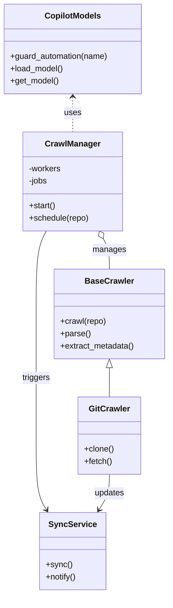
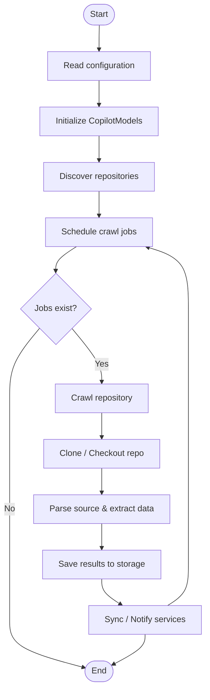
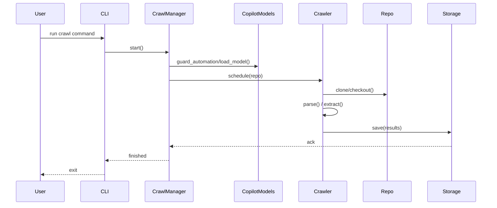

# Diagram: entity_core/entity_service/config/config.test.yml

> Auto-generated by Obscura crawlers

## Diagram 1

### SVG

<svg id="container" width="329.5546875" xmlns="http://www.w3.org/2000/svg" class="classDiagram" height="1152" viewBox="0 0 329.5546875 1152" role="graphics-document document" aria-roledescription="class"><g><defs><marker id="container_class-aggregationStart" class="marker aggregation class" refX="18" refY="7" markerWidth="190" markerHeight="240" orient="auto"><path d="M 18,7 L9,13 L1,7 L9,1 Z"></path></marker></defs><defs><marker id="container_class-aggregationEnd" class="marker aggregation class" refX="1" refY="7" markerWidth="20" markerHeight="28" orient="auto"><path d="M 18,7 L9,13 L1,7 L9,1 Z"></path></marker></defs><defs><marker id="container_class-extensionStart" class="marker extension class" refX="18" refY="7" markerWidth="190" markerHeight="240" orient="auto"><path d="M 1,7 L18,13 V 1 Z"></path></marker></defs><defs><marker id="container_class-extensionEnd" class="marker extension class" refX="1" refY="7" markerWidth="20" markerHeight="28" orient="auto"><path d="M 1,1 V 13 L18,7 Z"></path></marker></defs><defs><marker id="container_class-compositionStart" class="marker composition class" refX="18" refY="7" markerWidth="190" markerHeight="240" orient="auto"><path d="M 18,7 L9,13 L1,7 L9,1 Z"></path></marker></defs><defs><marker id="container_class-compositionEnd" class="marker composition class" refX="1" refY="7" markerWidth="20" markerHeight="28" orient="auto"><path d="M 18,7 L9,13 L1,7 L9,1 Z"></path></marker></defs><defs><marker id="container_class-dependencyStart" class="marker dependency class" refX="6" refY="7" markerWidth="190" markerHeight="240" orient="auto"><path d="M 5,7 L9,13 L1,7 L9,1 Z"></path></marker></defs><defs><marker id="container_class-dependencyEnd" class="marker dependency class" refX="13" refY="7" markerWidth="20" markerHeight="28" orient="auto"><path d="M 18,7 L9,13 L14,7 L9,1 Z"></path></marker></defs><defs><marker id="container_class-lollipopStart" class="marker lollipop class" refX="13" refY="7" markerWidth="190" markerHeight="240" orient="auto"><circle stroke="black" fill="transparent" cx="7" cy="7" r="6"></circle></marker></defs><defs><marker id="container_class-lollipopEnd" class="marker lollipop class" refX="1" refY="7" markerWidth="190" markerHeight="240" orient="auto"><circle stroke="black" fill="transparent" cx="7" cy="7" r="6"></circle></marker></defs><g class="root"><g class="clusters"></g><g class="edgePaths"><path d="M142.641,188L142.641,193.167C142.641,198.333,142.641,208.667,142.641,220C142.641,231.333,142.641,243.667,142.641,249.833L142.641,256" id="id_CopilotModels_CrawlManager_1" class="edge-thickness-normal edge-pattern-dashed relation" style=";;;" data-edge="true" data-et="edge" data-id="id_CopilotModels_CrawlManager_1" data-points="W3sieCI6MTQyLjY0MDYyNSwieSI6MTgyfSx7IngiOjE0Mi42NDA2MjUsInkiOjIxOX0seyJ4IjoxNDIuNjQwNjI1LCJ5IjoyNTZ9XQ==" marker-start="url(#container_class-dependencyStart)"></path><path d="M202.259,463.203L204.207,466.836C206.155,470.469,210.05,477.734,211.998,487.534C213.945,497.333,213.945,509.667,213.945,515.833L213.945,522" id="id_CrawlManager_BaseCrawler_2" class="edge-thickness-normal edge-pattern-solid relation" style=";;;" data-edge="true" data-et="edge" data-id="id_CrawlManager_BaseCrawler_2" data-points="W3sieCI6MTk0LjEwODY3MDExMjc4MTk3LCJ5Ijo0NDh9LHsieCI6MjEzLjk0NTMxMjUsInkiOjQ4NX0seyJ4IjoyMTMuOTQ1MzEyNSwieSI6NTIyfV0=" marker-start="url(#container_class-aggregationStart)"></path><path d="M213.945,713.25L213.945,716.542C213.945,719.833,213.945,726.417,213.945,735.875C213.945,745.333,213.945,757.667,213.945,763.833L213.945,770" id="id_BaseCrawler_GitCrawler_3" class="edge-thickness-normal edge-pattern-solid relation" style=";;;" data-edge="true" data-et="edge" data-id="id_BaseCrawler_GitCrawler_3" data-points="W3sieCI6MjEzLjk0NTMxMjUsInkiOjY5Nn0seyJ4IjoyMTMuOTQ1MzEyNSwieSI6NzMzfSx7IngiOjIxMy45NDUzMTI1LCJ5Ijo3NzB9XQ==" marker-start="url(#container_class-extensionStart)"></path><path d="M91.173,448L87.866,454.167C84.56,460.333,77.948,472.667,74.642,499.5C71.336,526.333,71.336,567.667,71.336,609C71.336,650.333,71.336,691.667,71.336,731C71.336,770.333,71.336,807.667,71.336,845C71.336,882.333,71.336,919.667,74.725,943.656C78.114,967.646,84.892,978.292,88.281,983.616L91.67,988.939" id="id_CrawlManager_SyncService_4" class="edge-thickness-normal edge-pattern-solid relation" style=";;;" data-edge="true" data-et="edge" data-id="id_CrawlManager_SyncService_4" data-points="W3sieCI6OTEuMTcyNTc5ODg3MjE4MDMsInkiOjQ0OH0seyJ4Ijo3MS4zMzU5Mzc1LCJ5Ijo0ODV9LHsieCI6NzEuMzM1OTM3NSwieSI6NjA5fSx7IngiOjcxLjMzNTkzNzUsInkiOjczM30seyJ4Ijo3MS4zMzU5Mzc1LCJ5Ijo4NDV9LHsieCI6NzEuMzM1OTM3NSwieSI6OTU3fSx7IngiOjk0Ljg5MTk1MDMzNDgyMTQzLCJ5Ijo5OTR9XQ==" marker-end="url(#container_class-dependencyEnd)"></path><path d="M213.945,920L213.945,926.167C213.945,932.333,213.945,944.667,210.556,956.156C207.167,967.646,200.389,978.292,197.001,983.616L193.612,988.939" id="id_GitCrawler_SyncService_5" class="edge-thickness-normal edge-pattern-solid relation" style=";;;" data-edge="true" data-et="edge" data-id="id_GitCrawler_SyncService_5" data-points="W3sieCI6MjEzLjk0NTMxMjUsInkiOjkyMH0seyJ4IjoyMTMuOTQ1MzEyNSwieSI6OTU3fSx7IngiOjE5MC4zODkyOTk2NjUxNzg1NiwieSI6OTk0fV0=" marker-end="url(#container_class-dependencyEnd)"></path></g><g class="edgeLabels"><g class="edgeLabel" transform="translate(142.640625, 219)"><g class="label" data-id="id_CopilotModels_CrawlManager_1" transform="translate(-16.4921875, -12)"><foreignObject width="32.984375" height="24">

uses

</foreignObject></g></g><g class="edgeLabel" transform="translate(213.9453125, 485)"><g class="label" data-id="id_CrawlManager_BaseCrawler_2" transform="translate(-32.296875, -12)"><foreignObject width="64.59375" height="24">

manages

</foreignObject></g></g><g class="edgeLabel"><g class="label" data-id="id_BaseCrawler_GitCrawler_3" transform="translate(0, 0)"><foreignObject width="0" height="0">

</foreignObject></g></g><g class="edgeLabel" transform="translate(71.3359375, 733)"><g class="label" data-id="id_CrawlManager_SyncService_4" transform="translate(-27.4921875, -12)"><foreignObject width="54.984375" height="24">

triggers

</foreignObject></g></g><g class="edgeLabel" transform="translate(213.9453125, 957)"><g class="label" data-id="id_GitCrawler_SyncService_5" transform="translate(-29.4140625, -12)"><foreignObject width="58.828125" height="24">

updates

</foreignObject></g></g></g><g class="nodes"><g class="node default" id="classId-CopilotModels-0" transform="translate(142.640625, 95)"><g class="basic label-container"><path d="M-134.640625 -87 L134.640625 -87 L134.640625 87 L-134.640625 87" stroke="none" stroke-width="0" fill="#ECECFF" style=""></path><path d="M-134.640625 -87 C-73.39191147359223 -87, -12.143197947184461 -87, 134.640625 -87 M-134.640625 -87 C-46.87030455061377 -87, 40.900015898772466 -87, 134.640625 -87 M134.640625 -87 C134.640625 -33.859861850247356, 134.640625 19.28027629950529, 134.640625 87 M134.640625 -87 C134.640625 -31.51079843175482, 134.640625 23.978403136490357, 134.640625 87 M134.640625 87 C43.631367394903904 87, -47.37789021019219 87, -134.640625 87 M134.640625 87 C51.08166141550187 87, -32.47730216899626 87, -134.640625 87 M-134.640625 87 C-134.640625 26.695024976666232, -134.640625 -33.609950046667535, -134.640625 -87 M-134.640625 87 C-134.640625 19.512580048663253, -134.640625 -47.974839902673494, -134.640625 -87" stroke="#9370DB" stroke-width="1.3" fill="none" stroke-dasharray="0 0" style=""></path></g><g class="annotation-group text" transform="translate(0, -63)"></g><g class="label-group text" transform="translate(-52.65625, -63)"><g class="label" style="font-weight: bolder" transform="translate(0,-12)"><foreignObject width="105.3125" height="24">

CopilotModels

</foreignObject></g></g><g class="members-group text" transform="translate(-122.640625, -15)"></g><g class="methods-group text" transform="translate(-122.640625, 15)"><g class="label" style="" transform="translate(0,-12)"><foreignObject width="192.625" height="24">

+guard_automation(name)

</foreignObject></g><g class="label" style="" transform="translate(0,12)"><foreignObject width="104.78125" height="24">

+load_model()

</foreignObject></g><g class="label" style="" transform="translate(0,36)"><foreignObject width="95.265625" height="24">

+get_model()

</foreignObject></g></g><g class="divider" style=""><path d="M-134.640625 -39 C-48.64935929532946 -39, 37.34190640934108 -39, 134.640625 -39 M-134.640625 -39 C-63.69887176111179 -39, 7.242881477776422 -39, 134.640625 -39" stroke="#9370DB" stroke-width="1.3" fill="none" stroke-dasharray="0 0" style=""></path></g><g class="divider" style=""><path d="M-134.640625 -15 C-30.252834679813446 -15, 74.13495564037311 -15, 134.640625 -15 M-134.640625 -15 C-40.01449284545053 -15, 54.61163930909893 -15, 134.640625 -15" stroke="#9370DB" stroke-width="1.3" fill="none" stroke-dasharray="0 0" style=""></path></g></g><g class="node default" id="classId-CrawlManager-1" transform="translate(142.640625, 352)"><g class="basic label-container"><path d="M-96.3203125 -96 L96.3203125 -96 L96.3203125 96 L-96.3203125 96" stroke="none" stroke-width="0" fill="#ECECFF" style=""></path><path d="M-96.3203125 -96 C-51.78081971473321 -96, -7.241326929466425 -96, 96.3203125 -96 M-96.3203125 -96 C-52.07722153504396 -96, -7.834130570087922 -96, 96.3203125 -96 M96.3203125 -96 C96.3203125 -42.154889681055394, 96.3203125 11.690220637889212, 96.3203125 96 M96.3203125 -96 C96.3203125 -26.121251679757933, 96.3203125 43.757496640484135, 96.3203125 96 M96.3203125 96 C29.063048367861924 96, -38.19421576427615 96, -96.3203125 96 M96.3203125 96 C56.603006985717734 96, 16.885701471435468 96, -96.3203125 96 M-96.3203125 96 C-96.3203125 44.136208372881605, -96.3203125 -7.727583254236791, -96.3203125 -96 M-96.3203125 96 C-96.3203125 32.48199086298515, -96.3203125 -31.0360182740297, -96.3203125 -96" stroke="#9370DB" stroke-width="1.3" fill="none" stroke-dasharray="0 0" style=""></path></g><g class="annotation-group text" transform="translate(0, -72)"></g><g class="label-group text" transform="translate(-51.59375, -72)"><g class="label" style="font-weight: bolder" transform="translate(0,-12)"><foreignObject width="103.1875" height="24">

CrawlManager

</foreignObject></g></g><g class="members-group text" transform="translate(-84.3203125, -24)"><g class="label" style="" transform="translate(0,-12)"><foreignObject width="63.625" height="24">

-workers

</foreignObject></g><g class="label" style="" transform="translate(0,12)"><foreignObject width="37.09375" height="24">

-jobs

</foreignObject></g></g><g class="methods-group text" transform="translate(-84.3203125, 48)"><g class="label" style="" transform="translate(0,-12)"><foreignObject width="52.15625" height="24">

+start()

</foreignObject></g><g class="label" style="" transform="translate(0,12)"><foreignObject width="117.046875" height="24">

+schedule(repo)

</foreignObject></g></g><g class="divider" style=""><path d="M-96.3203125 -48 C-32.342591708090936 -48, 31.63512908381813 -48, 96.3203125 -48 M-96.3203125 -48 C-34.695940152216494 -48, 26.928432195567012 -48, 96.3203125 -48" stroke="#9370DB" stroke-width="1.3" fill="none" stroke-dasharray="0 0" style=""></path></g><g class="divider" style=""><path d="M-96.3203125 24 C-19.646935108292197 24, 57.026442283415605 24, 96.3203125 24 M-96.3203125 24 C-44.22231091069031 24, 7.875690678619378 24, 96.3203125 24" stroke="#9370DB" stroke-width="1.3" fill="none" stroke-dasharray="0 0" style=""></path></g></g><g class="node default" id="classId-BaseCrawler-2" transform="translate(213.9453125, 609)"><g class="basic label-container"><path d="M-107.609375 -87 L107.609375 -87 L107.609375 87 L-107.609375 87" stroke="none" stroke-width="0" fill="#ECECFF" style=""></path><path d="M-107.609375 -87 C-32.61221498472774 -87, 42.384945030544515 -87, 107.609375 -87 M-107.609375 -87 C-61.01976882755764 -87, -14.430162655115282 -87, 107.609375 -87 M107.609375 -87 C107.609375 -25.02979762002014, 107.609375 36.94040475995972, 107.609375 87 M107.609375 -87 C107.609375 -42.41400776358791, 107.609375 2.171984472824178, 107.609375 87 M107.609375 87 C35.85766602184415 87, -35.894042956311694 87, -107.609375 87 M107.609375 87 C56.36204958330778 87, 5.114724166615559 87, -107.609375 87 M-107.609375 87 C-107.609375 42.947713425927944, -107.609375 -1.1045731481441123, -107.609375 -87 M-107.609375 87 C-107.609375 29.370977871681077, -107.609375 -28.258044256637845, -107.609375 -87" stroke="#9370DB" stroke-width="1.3" fill="none" stroke-dasharray="0 0" style=""></path></g><g class="annotation-group text" transform="translate(0, -63)"></g><g class="label-group text" transform="translate(-45.25, -63)"><g class="label" style="font-weight: bolder" transform="translate(0,-12)"><foreignObject width="90.5" height="24">

BaseCrawler

</foreignObject></g></g><g class="members-group text" transform="translate(-95.609375, -15)"></g><g class="methods-group text" transform="translate(-95.609375, 15)"><g class="label" style="" transform="translate(0,-12)"><foreignObject width="89.671875" height="24">

+crawl(repo)

</foreignObject></g><g class="label" style="" transform="translate(0,12)"><foreignObject width="58.53125" height="24">

+parse()

</foreignObject></g><g class="label" style="" transform="translate(0,36)"><foreignObject width="145.96875" height="24">

+extract_metadata()

</foreignObject></g></g><g class="divider" style=""><path d="M-107.609375 -39 C-41.08202922934666 -39, 25.44531654130668 -39, 107.609375 -39 M-107.609375 -39 C-49.037946993789184 -39, 9.533481012421632 -39, 107.609375 -39" stroke="#9370DB" stroke-width="1.3" fill="none" stroke-dasharray="0 0" style=""></path></g><g class="divider" style=""><path d="M-107.609375 -15 C-57.64321026885055 -15, -7.677045537701105 -15, 107.609375 -15 M-107.609375 -15 C-34.174444415633104 -15, 39.26048616873379 -15, 107.609375 -15" stroke="#9370DB" stroke-width="1.3" fill="none" stroke-dasharray="0 0" style=""></path></g></g><g class="node default" id="classId-GitCrawler-3" transform="translate(213.9453125, 845)"><g class="basic label-container"><path d="M-60.1484375 -75 L60.1484375 -75 L60.1484375 75 L-60.1484375 75" stroke="none" stroke-width="0" fill="#ECECFF" style=""></path><path d="M-60.1484375 -75 C-20.781385563751357 -75, 18.585666372497286 -75, 60.1484375 -75 M-60.1484375 -75 C-24.77176646095394 -75, 10.604904578092118 -75, 60.1484375 -75 M60.1484375 -75 C60.1484375 -40.839437389470405, 60.1484375 -6.678874778940809, 60.1484375 75 M60.1484375 -75 C60.1484375 -21.20528460505509, 60.1484375 32.58943078988982, 60.1484375 75 M60.1484375 75 C34.26164120203425 75, 8.374844904068496 75, -60.1484375 75 M60.1484375 75 C20.17074240389146 75, -19.80695269221708 75, -60.1484375 75 M-60.1484375 75 C-60.1484375 43.607828870218455, -60.1484375 12.215657740436917, -60.1484375 -75 M-60.1484375 75 C-60.1484375 18.857712950481883, -60.1484375 -37.284574099036234, -60.1484375 -75" stroke="#9370DB" stroke-width="1.3" fill="none" stroke-dasharray="0 0" style=""></path></g><g class="annotation-group text" transform="translate(0, -51)"></g><g class="label-group text" transform="translate(-38.234375, -51)"><g class="label" style="font-weight: bolder" transform="translate(0,-12)"><foreignObject width="76.46875" height="24">

GitCrawler

</foreignObject></g></g><g class="members-group text" transform="translate(-48.1484375, -3)"></g><g class="methods-group text" transform="translate(-48.1484375, 27)"><g class="label" style="" transform="translate(0,-12)"><foreignObject width="58.0625" height="24">

+clone()

</foreignObject></g><g class="label" style="" transform="translate(0,12)"><foreignObject width="54.59375" height="24">

+fetch()

</foreignObject></g></g><g class="divider" style=""><path d="M-60.1484375 -27 C-12.390880584496166 -27, 35.36667633100767 -27, 60.1484375 -27 M-60.1484375 -27 C-16.343102841452883 -27, 27.462231817094235 -27, 60.1484375 -27" stroke="#9370DB" stroke-width="1.3" fill="none" stroke-dasharray="0 0" style=""></path></g><g class="divider" style=""><path d="M-60.1484375 -3 C-22.017087908811547 -3, 16.114261682376906 -3, 60.1484375 -3 M-60.1484375 -3 C-23.76125554347621 -3, 12.62592641304758 -3, 60.1484375 -3" stroke="#9370DB" stroke-width="1.3" fill="none" stroke-dasharray="0 0" style=""></path></g></g><g class="node default" id="classId-SyncService-4" transform="translate(142.640625, 1069)"><g class="basic label-container"><path d="M-64.16796875 -75 L64.16796875 -75 L64.16796875 75 L-64.16796875 75" stroke="none" stroke-width="0" fill="#ECECFF" style=""></path><path d="M-64.16796875 -75 C-24.634311827263446 -75, 14.899345095473109 -75, 64.16796875 -75 M-64.16796875 -75 C-18.18082146561899 -75, 27.80632581876202 -75, 64.16796875 -75 M64.16796875 -75 C64.16796875 -24.09550313212064, 64.16796875 26.80899373575872, 64.16796875 75 M64.16796875 -75 C64.16796875 -33.87931425451688, 64.16796875 7.2413714909662446, 64.16796875 75 M64.16796875 75 C32.84109413441462 75, 1.5142195188292291 75, -64.16796875 75 M64.16796875 75 C19.282360200339006 75, -25.603248349321987 75, -64.16796875 75 M-64.16796875 75 C-64.16796875 19.77497168772041, -64.16796875 -35.45005662455918, -64.16796875 -75 M-64.16796875 75 C-64.16796875 16.781130332541935, -64.16796875 -41.43773933491613, -64.16796875 -75" stroke="#9370DB" stroke-width="1.3" fill="none" stroke-dasharray="0 0" style=""></path></g><g class="annotation-group text" transform="translate(0, -51)"></g><g class="label-group text" transform="translate(-43.7421875, -51)"><g class="label" style="font-weight: bolder" transform="translate(0,-12)"><foreignObject width="87.484375" height="24">

SyncService

</foreignObject></g></g><g class="members-group text" transform="translate(-52.16796875, -3)"></g><g class="methods-group text" transform="translate(-52.16796875, 27)"><g class="label" style="" transform="translate(0,-12)"><foreignObject width="50.453125" height="24">

+sync()

</foreignObject></g><g class="label" style="" transform="translate(0,12)"><foreignObject width="60.59375" height="24">

+notify()

</foreignObject></g></g><g class="divider" style=""><path d="M-64.16796875 -27 C-18.489714250603463 -27, 27.188540248793075 -27, 64.16796875 -27 M-64.16796875 -27 C-14.871070261782798 -27, 34.425828226434405 -27, 64.16796875 -27" stroke="#9370DB" stroke-width="1.3" fill="none" stroke-dasharray="0 0" style=""></path></g><g class="divider" style=""><path d="M-64.16796875 -3 C-25.451576802805036 -3, 13.264815144389928 -3, 64.16796875 -3 M-64.16796875 -3 C-34.327966062341005 -3, -4.4879633746820105 -3, 64.16796875 -3" stroke="#9370DB" stroke-width="1.3" fill="none" stroke-dasharray="0 0" style=""></path></g></g></g></g></g></svg>

## Diagram 2

### SVG

<svg id="container" width="390.75" xmlns="http://www.w3.org/2000/svg" class="flowchart" height="1284.40625" viewBox="0 0 390.75 1284.40625" role="graphics-document document" aria-roledescription="flowchart-v2"><g><marker id="container_flowchart-v2-pointEnd" class="marker flowchart-v2" viewBox="0 0 10 10" refX="5" refY="5" markerUnits="userSpaceOnUse" markerWidth="8" markerHeight="8" orient="auto"><path d="M 0 0 L 10 5 L 0 10 z" class="arrowMarkerPath" style="stroke-width: 1; stroke-dasharray: 1, 0;"></path></marker><marker id="container_flowchart-v2-pointStart" class="marker flowchart-v2" viewBox="0 0 10 10" refX="4.5" refY="5" markerUnits="userSpaceOnUse" markerWidth="8" markerHeight="8" orient="auto"><path d="M 0 5 L 10 10 L 10 0 z" class="arrowMarkerPath" style="stroke-width: 1; stroke-dasharray: 1, 0;"></path></marker><marker id="container_flowchart-v2-circleEnd" class="marker flowchart-v2" viewBox="0 0 10 10" refX="11" refY="5" markerUnits="userSpaceOnUse" markerWidth="11" markerHeight="11" orient="auto"><circle cx="5" cy="5" r="5" class="arrowMarkerPath" style="stroke-width: 1; stroke-dasharray: 1, 0;"></circle></marker><marker id="container_flowchart-v2-circleStart" class="marker flowchart-v2" viewBox="0 0 10 10" refX="-1" refY="5" markerUnits="userSpaceOnUse" markerWidth="11" markerHeight="11" orient="auto"><circle cx="5" cy="5" r="5" class="arrowMarkerPath" style="stroke-width: 1; stroke-dasharray: 1, 0;"></circle></marker><marker id="container_flowchart-v2-crossEnd" class="marker cross flowchart-v2" viewBox="0 0 11 11" refX="12" refY="5.2" markerUnits="userSpaceOnUse" markerWidth="11" markerHeight="11" orient="auto"><path d="M 1,1 l 9,9 M 10,1 l -9,9" class="arrowMarkerPath" style="stroke-width: 2; stroke-dasharray: 1, 0;"></path></marker><marker id="container_flowchart-v2-crossStart" class="marker cross flowchart-v2" viewBox="0 0 11 11" refX="-1" refY="5.2" markerUnits="userSpaceOnUse" markerWidth="11" markerHeight="11" orient="auto"><path d="M 1,1 l 9,9 M 10,1 l -9,9" class="arrowMarkerPath" style="stroke-width: 2; stroke-dasharray: 1, 0;"></path></marker><g class="root"><g class="clusters"></g><g class="edgePaths"><path d="M187.836,47.5L187.753,51.583C187.669,55.667,187.503,63.833,187.419,71.417C187.336,79,187.336,86,187.336,89.5L187.336,93" id="L_Start_ReadConfig_0" class="edge-thickness-normal edge-pattern-solid edge-thickness-normal edge-pattern-solid flowchart-link" style=";" data-edge="true" data-et="edge" data-id="L_Start_ReadConfig_0" data-points="W3sieCI6MTg3LjgzNTkzNzUsInkiOjQ3LjV9LHsieCI6MTg3LjMzNTkzNzUsInkiOjcyfSx7IngiOjE4Ny4zMzU5Mzc1LCJ5Ijo5N31d" marker-end="url(#container_flowchart-v2-pointEnd)"></path><path d="M187.336,151L187.336,155.167C187.336,159.333,187.336,167.667,187.336,175.333C187.336,183,187.336,190,187.336,193.5L187.336,197" id="L_ReadConfig_InitModels_0" class="edge-thickness-normal edge-pattern-solid edge-thickness-normal edge-pattern-solid flowchart-link" style=";" data-edge="true" data-et="edge" data-id="L_ReadConfig_InitModels_0" data-points="W3sieCI6MTg3LjMzNTkzNzUsInkiOjE1MX0seyJ4IjoxODcuMzM1OTM3NSwieSI6MTc2fSx7IngiOjE4Ny4zMzU5Mzc1LCJ5IjoyMDF9XQ==" marker-end="url(#container_flowchart-v2-pointEnd)"></path><path d="M187.336,255L187.336,259.167C187.336,263.333,187.336,271.667,187.336,279.333C187.336,287,187.336,294,187.336,297.5L187.336,301" id="L_InitModels_Discover_0" class="edge-thickness-normal edge-pattern-solid edge-thickness-normal edge-pattern-solid flowchart-link" style=";" data-edge="true" data-et="edge" data-id="L_InitModels_Discover_0" data-points="W3sieCI6MTg3LjMzNTkzNzUsInkiOjI1NX0seyJ4IjoxODcuMzM1OTM3NSwieSI6MjgwfSx7IngiOjE4Ny4zMzU5Mzc1LCJ5IjozMDV9XQ==" marker-end="url(#container_flowchart-v2-pointEnd)"></path><path d="M187.336,359L187.336,363.167C187.336,367.333,187.336,375.667,187.336,383.333C187.336,391,187.336,398,187.336,401.5L187.336,405" id="L_Discover_Schedule_0" class="edge-thickness-normal edge-pattern-solid edge-thickness-normal edge-pattern-solid flowchart-link" style=";" data-edge="true" data-et="edge" data-id="L_Discover_Schedule_0" data-points="W3sieCI6MTg3LjMzNTkzNzUsInkiOjM1OX0seyJ4IjoxODcuMzM1OTM3NSwieSI6Mzg0fSx7IngiOjE4Ny4zMzU5Mzc1LCJ5Ijo0MDl9XQ==" marker-end="url(#container_flowchart-v2-pointEnd)"></path><path d="M144.727,463L138.151,467.167C131.576,471.333,118.424,479.667,111.849,487.333C105.273,495,105.273,502,105.273,505.5L105.273,509" id="L_Schedule_JobsExist_0" class="edge-thickness-normal edge-pattern-solid edge-thickness-normal edge-pattern-solid flowchart-link" style=";" data-edge="true" data-et="edge" data-id="L_Schedule_JobsExist_0" data-points="W3sieCI6MTQ0LjcyNjU2MjUsInkiOjQ2M30seyJ4IjoxMDUuMjczNDM3NSwieSI6NDg4fSx7IngiOjEwNS4yNzM0Mzc1LCJ5Ijo1MTN9XQ==" marker-end="url(#container_flowchart-v2-pointEnd)"></path><path d="M135.28,613.4L144.801,624.567C154.322,635.735,173.364,658.071,182.885,674.738C192.406,691.406,192.406,702.406,192.406,707.906L192.406,713.406" id="L_JobsExist_CrawlJob_0" class="edge-thickness-normal edge-pattern-solid edge-thickness-normal edge-pattern-solid flowchart-link" style=";" data-edge="true" data-et="edge" data-id="L_JobsExist_CrawlJob_0" data-points="W3sieCI6MTM1LjI4MDA1ODIxOTAwMTQzLCJ5Ijo2MTMuMzk5NjI5MjgwOTk4NX0seyJ4IjoxOTIuNDA2MjUsInkiOjY4MC40MDYyNX0seyJ4IjoxOTIuNDA2MjUsInkiOjcxNy40MDYyNX1d" marker-end="url(#container_flowchart-v2-pointEnd)"></path><path d="M75.267,613.4L65.746,624.567C56.225,635.735,37.183,658.071,27.662,679.905C18.141,701.74,18.141,723.073,18.141,742.406C18.141,761.74,18.141,779.073,18.141,796.406C18.141,813.74,18.141,831.073,18.141,848.406C18.141,865.74,18.141,883.073,18.141,900.406C18.141,917.74,18.141,935.073,18.141,952.406C18.141,969.74,18.141,987.073,18.141,1004.406C18.141,1021.74,18.141,1039.073,18.141,1056.406C18.141,1073.74,18.141,1091.073,18.141,1108.406C18.141,1125.74,18.141,1143.073,18.141,1160.406C18.141,1177.74,18.141,1195.073,41.626,1209.976C65.112,1224.88,112.083,1237.353,135.569,1243.59L159.055,1249.827" id="L_JobsExist_End_0" class="edge-thickness-normal edge-pattern-solid edge-thickness-normal edge-pattern-solid flowchart-link" style=";" data-edge="true" data-et="edge" data-id="L_JobsExist_End_0" data-points="W3sieCI6NzUuMjY2ODE2NzgwOTk4NTUsInkiOjYxMy4zOTk2MjkyODA5OTg1fSx7IngiOjE4LjE0MDYyNSwieSI6NjgwLjQwNjI1fSx7IngiOjE4LjE0MDYyNSwieSI6NzQ0LjQwNjI1fSx7IngiOjE4LjE0MDYyNSwieSI6Nzk2LjQwNjI1fSx7IngiOjE4LjE0MDYyNSwieSI6ODQ4LjQwNjI1fSx7IngiOjE4LjE0MDYyNSwieSI6OTAwLjQwNjI1fSx7IngiOjE4LjE0MDYyNSwieSI6OTUyLjQwNjI1fSx7IngiOjE4LjE0MDYyNSwieSI6MTAwNC40MDYyNX0seyJ4IjoxOC4xNDA2MjUsInkiOjEwNTYuNDA2MjV9LHsieCI6MTguMTQwNjI1LCJ5IjoxMTA4LjQwNjI1fSx7IngiOjE4LjE0MDYyNSwieSI6MTE2MC40MDYyNX0seyJ4IjoxOC4xNDA2MjUsInkiOjEyMTIuNDA2MjV9LHsieCI6MTYyLjkyMDc4OTY0NjU4MDcyLCJ5IjoxMjUwLjg1MzMyNTY3MTkyNjh9XQ==" marker-end="url(#container_flowchart-v2-pointEnd)"></path><path d="M192.406,771.406L192.406,775.573C192.406,779.74,192.406,788.073,192.406,795.74C192.406,803.406,192.406,810.406,192.406,813.906L192.406,817.406" id="L_CrawlJob_Clone_0" class="edge-thickness-normal edge-pattern-solid edge-thickness-normal edge-pattern-solid flowchart-link" style=";" data-edge="true" data-et="edge" data-id="L_CrawlJob_Clone_0" data-points="W3sieCI6MTkyLjQwNjI1LCJ5Ijo3NzEuNDA2MjV9LHsieCI6MTkyLjQwNjI1LCJ5Ijo3OTYuNDA2MjV9LHsieCI6MTkyLjQwNjI1LCJ5Ijo4MjEuNDA2MjV9XQ==" marker-end="url(#container_flowchart-v2-pointEnd)"></path><path d="M192.406,875.406L192.406,879.573C192.406,883.74,192.406,892.073,192.406,899.74C192.406,907.406,192.406,914.406,192.406,917.906L192.406,921.406" id="L_Clone_Parse_0" class="edge-thickness-normal edge-pattern-solid edge-thickness-normal edge-pattern-solid flowchart-link" style=";" data-edge="true" data-et="edge" data-id="L_Clone_Parse_0" data-points="W3sieCI6MTkyLjQwNjI1LCJ5Ijo4NzUuNDA2MjV9LHsieCI6MTkyLjQwNjI1LCJ5Ijo5MDAuNDA2MjV9LHsieCI6MTkyLjQwNjI1LCJ5Ijo5MjUuNDA2MjV9XQ==" marker-end="url(#container_flowchart-v2-pointEnd)"></path><path d="M192.406,979.406L192.406,983.573C192.406,987.74,192.406,996.073,192.406,1003.74C192.406,1011.406,192.406,1018.406,192.406,1021.906L192.406,1025.406" id="L_Parse_Save_0" class="edge-thickness-normal edge-pattern-solid edge-thickness-normal edge-pattern-solid flowchart-link" style=";" data-edge="true" data-et="edge" data-id="L_Parse_Save_0" data-points="W3sieCI6MTkyLjQwNjI1LCJ5Ijo5NzkuNDA2MjV9LHsieCI6MTkyLjQwNjI1LCJ5IjoxMDA0LjQwNjI1fSx7IngiOjE5Mi40MDYyNSwieSI6MTAyOS40MDYyNX1d" marker-end="url(#container_flowchart-v2-pointEnd)"></path><path d="M192.406,1083.406L192.406,1087.573C192.406,1091.74,192.406,1100.073,198.419,1108.049C204.431,1116.026,216.456,1123.646,222.468,1127.455L228.481,1131.265" id="L_Save_Sync_0" class="edge-thickness-normal edge-pattern-solid edge-thickness-normal edge-pattern-solid flowchart-link" style=";" data-edge="true" data-et="edge" data-id="L_Save_Sync_0" data-points="W3sieCI6MTkyLjQwNjI1LCJ5IjoxMDgzLjQwNjI1fSx7IngiOjE5Mi40MDYyNSwieSI6MTEwOC40MDYyNX0seyJ4IjoyMzEuODU5Mzc1LCJ5IjoxMTMzLjQwNjI1fV0=" marker-end="url(#container_flowchart-v2-pointEnd)"></path><path d="M317.078,1133.406L323.654,1129.24C330.229,1125.073,343.38,1116.74,349.956,1103.906C356.531,1091.073,356.531,1073.74,356.531,1056.406C356.531,1039.073,356.531,1021.74,356.531,1004.406C356.531,987.073,356.531,969.74,356.531,952.406C356.531,935.073,356.531,917.74,356.531,900.406C356.531,883.073,356.531,865.74,356.531,848.406C356.531,831.073,356.531,813.74,356.531,796.406C356.531,779.073,356.531,761.74,356.531,742.406C356.531,723.073,356.531,701.74,356.531,674.039C356.531,646.339,356.531,612.271,356.531,580.203C356.531,548.135,356.531,518.068,343.611,499.063C330.691,480.058,304.851,472.117,291.931,468.146L279.011,464.175" id="L_Sync_Schedule_0" class="edge-thickness-normal edge-pattern-solid edge-thickness-normal edge-pattern-solid flowchart-link" style=";" data-edge="true" data-et="edge" data-id="L_Sync_Schedule_0" data-points="W3sieCI6MzE3LjA3ODEyNSwieSI6MTEzMy40MDYyNX0seyJ4IjozNTYuNTMxMjUsInkiOjExMDguNDA2MjV9LHsieCI6MzU2LjUzMTI1LCJ5IjoxMDU2LjQwNjI1fSx7IngiOjM1Ni41MzEyNSwieSI6MTAwNC40MDYyNX0seyJ4IjozNTYuNTMxMjUsInkiOjk1Mi40MDYyNX0seyJ4IjozNTYuNTMxMjUsInkiOjkwMC40MDYyNX0seyJ4IjozNTYuNTMxMjUsInkiOjg0OC40MDYyNX0seyJ4IjozNTYuNTMxMjUsInkiOjc5Ni40MDYyNX0seyJ4IjozNTYuNTMxMjUsInkiOjc0NC40MDYyNX0seyJ4IjozNTYuNTMxMjUsInkiOjY4MC40MDYyNX0seyJ4IjozNTYuNTMxMjUsInkiOjU3OC4yMDMxMjV9LHsieCI6MzU2LjUzMTI1LCJ5Ijo0ODh9LHsieCI6Mjc1LjE4NzM0OTc1OTYxNTM2LCJ5Ijo0NjN9XQ==" marker-end="url(#container_flowchart-v2-pointEnd)"></path><path d="M274.469,1187.406L274.469,1191.573C274.469,1195.74,274.469,1204.073,264.346,1213.528C254.224,1222.983,233.98,1233.56,223.857,1238.849L213.735,1244.138" id="L_Sync_End_0" class="edge-thickness-normal edge-pattern-solid edge-thickness-normal edge-pattern-solid flowchart-link" style=";" data-edge="true" data-et="edge" data-id="L_Sync_End_0" data-points="W3sieCI6Mjc0LjQ2ODc1LCJ5IjoxMTg3LjQwNjI1fSx7IngiOjI3NC40Njg3NSwieSI6MTIxMi40MDYyNX0seyJ4IjoyMTAuMTg5ODEwOTc1MjcxNTQsInkiOjEyNDUuOTg5ODAwMzE2OTQyfV0=" marker-end="url(#container_flowchart-v2-pointEnd)"></path></g><g class="edgeLabels"><g class="edgeLabel"><g class="label" data-id="L_Start_ReadConfig_0" transform="translate(0, 0)"><foreignObject width="0" height="0">

</foreignObject></g></g><g class="edgeLabel"><g class="label" data-id="L_ReadConfig_InitModels_0" transform="translate(0, 0)"><foreignObject width="0" height="0">

</foreignObject></g></g><g class="edgeLabel"><g class="label" data-id="L_InitModels_Discover_0" transform="translate(0, 0)"><foreignObject width="0" height="0">

</foreignObject></g></g><g class="edgeLabel"><g class="label" data-id="L_Discover_Schedule_0" transform="translate(0, 0)"><foreignObject width="0" height="0">

</foreignObject></g></g><g class="edgeLabel"><g class="label" data-id="L_Schedule_JobsExist_0" transform="translate(0, 0)"><foreignObject width="0" height="0">

</foreignObject></g></g><g class="edgeLabel" transform="translate(192.40625, 680.40625)"><g class="label" data-id="L_JobsExist_CrawlJob_0" transform="translate(-12.03125, -12)"><foreignObject width="24.0625" height="24">

Yes

</foreignObject></g></g><g class="edgeLabel" transform="translate(18.140625, 952.40625)"><g class="label" data-id="L_JobsExist_End_0" transform="translate(-10.140625, -12)"><foreignObject width="20.28125" height="24">

No

</foreignObject></g></g><g class="edgeLabel"><g class="label" data-id="L_CrawlJob_Clone_0" transform="translate(0, 0)"><foreignObject width="0" height="0">

</foreignObject></g></g><g class="edgeLabel"><g class="label" data-id="L_Clone_Parse_0" transform="translate(0, 0)"><foreignObject width="0" height="0">

</foreignObject></g></g><g class="edgeLabel"><g class="label" data-id="L_Parse_Save_0" transform="translate(0, 0)"><foreignObject width="0" height="0">

</foreignObject></g></g><g class="edgeLabel"><g class="label" data-id="L_Save_Sync_0" transform="translate(0, 0)"><foreignObject width="0" height="0">

</foreignObject></g></g><g class="edgeLabel"><g class="label" data-id="L_Sync_Schedule_0" transform="translate(0, 0)"><foreignObject width="0" height="0">

</foreignObject></g></g><g class="edgeLabel"><g class="label" data-id="L_Sync_End_0" transform="translate(0, 0)"><foreignObject width="0" height="0">

</foreignObject></g></g></g><g class="nodes"><g class="node default" id="flowchart-Start-0" transform="translate(187.3359375, 27.5)"><g class="basic label-container outer-path"><path d="M-10.3984375 -19.5 C-5.374711463613809 -19.5, -0.3509854272276183 -19.5, 10.3984375 -19.5 C10.3984375 -19.5, 10.398437499999998 -19.5, 10.398437499999998 -19.5 C10.779885620571541 -19.487767701216995, 11.161333741143084 -19.47553540243399, 11.6478067896239 -19.45993515863156 C12.139019438666386 -19.412548465148074, 12.630232087708873 -19.365161771664585, 12.892042152847864 -19.3399052695533 C13.22659730675931 -19.285816986782866, 13.561152460670757 -19.23172870401243, 14.126030759676757 -19.140403561325776 C14.568263412623796 -19.03946684412837, 15.010496065570836 -18.938530126930964, 15.34470188623539 -18.862249829261074 C15.612155397075355 -18.7828710311359, 15.87960890791532 -18.703492233010724, 16.543047751460602 -18.50658706670804 C16.804631891518177 -18.41032168510957, 17.066216031575753 -18.314056303511098, 17.716144095147794 -18.074876768247425 C18.106946688903022 -17.90188005273904, 18.49774928265825 -17.728883337230652, 18.85917041279238 -17.568892924097174 C19.188086120685956 -17.39729780996966, 19.51700182857953 -17.225702695842152, 19.967429764076783 -16.990714730406097 C20.341231262581 -16.764114065311404, 20.71503276108522 -16.53751340021671, 21.036368073605697 -16.342718045390892 C21.317437852390142 -16.146655935025485, 21.598507631174588 -15.950593824660077, 22.061592844578712 -15.627565626425154 C22.329505933850882 -15.413912067197321, 22.597419023123056 -15.200258507969489, 23.03889120850187 -14.848196188198123 C23.238452031349645 -14.666960328977808, 23.438012854197417 -14.485724469757491, 23.964247236767985 -14.007812326905688 C24.180073490158748 -13.784954000614782, 24.39589974354951 -13.562095674323876, 24.833858442968648 -13.10986736009568 C25.024057202644 -12.886449074364997, 25.21425596231935 -12.663030788634314, 25.644151408126582 -12.158051136245305 C25.82648995444514 -11.913734095561734, 26.0088285007637 -11.669417054878163, 26.391796464640635 -11.156274872382312 C26.617911010501402 -10.808902209682971, 26.844025556362173 -10.461529546983632, 27.073721378604247 -10.108655082055241 C27.212851952068018 -9.861614660372046, 27.351982525531792 -9.614574238688851, 27.6871239742735 -9.019496659696287 C27.86559326547257 -8.64890135789032, 28.04406255667164 -8.278306056084352, 28.22948364880834 -7.893275190886684 C28.36700407970957 -7.5535970677839925, 28.5045245106108 -7.2139189446813, 28.698571729970325 -6.734618561215508 C28.812250642344132 -6.392235789420591, 28.92592955471794 -6.049853017625674, 29.09246063421488 -5.548287939305138 C29.217797963766515 -5.070322380182506, 29.343135293318152 -4.592356821059873, 29.40953178754556 -4.339158212148133 C29.4938379128754 -3.906264076685309, 29.578144038205238 -3.4733699412224843, 29.648482276581777 -3.1121979531509023 C29.7011103950595 -2.7040246588351455, 29.753738513537225 -2.2958513645193883, 29.808330202509367 -1.872449005199798 C29.82626552002907 -1.5930919577026426, 29.84420083754878 -1.3137349102054872, 29.888418715913414 -0.6250057626472757 C29.888418715913414 -0.3715280121810524, 29.888418715913414 -0.11805026171482913, 29.888418715913414 0.625005762647271 C29.865579928735087 0.9807383080869322, 29.842741141556758 1.3364708535265932, 29.808330202509367 1.8724490051997846 C29.768432453228638 2.181888069919381, 29.728534703947908 2.491327134638977, 29.648482276581777 3.1121979531508885 C29.556507300367006 3.5844700170956285, 29.464532324152238 4.056742081040369, 29.40953178754556 4.339158212148129 C29.30196709341313 4.749349009708425, 29.194402399280698 5.15953980726872, 29.092460634214884 5.548287939305125 C28.9509953241115 5.974358913900276, 28.80953001400811 6.400429888495426, 28.69857172997033 6.734618561215495 C28.56258191287475 7.070516038625826, 28.426592095779174 7.406413516036157, 28.229483648808344 7.893275190886679 C28.0318046139955 8.303759936329314, 27.834125579182658 8.71424468177195, 27.687123974273504 9.019496659696284 C27.507492095910994 9.33845124942903, 27.32786021754848 9.657405839161775, 27.07372137860425 10.108655082055236 C26.86633673989109 10.427253577691564, 26.658952101177924 10.745852073327892, 26.39179646464064 11.156274872382301 C26.200995101602103 11.411931316492181, 26.010193738563565 11.667587760602062, 25.644151408126582 12.158051136245302 C25.45296584599309 12.38262857629397, 25.261780283859597 12.607206016342637, 24.83385844296866 13.10986736009567 C24.566524300654834 13.385911810575967, 24.299190158341005 13.661956261056263, 23.96424723676799 14.007812326905684 C23.715954714322656 14.233305026330386, 23.467662191877327 14.458797725755087, 23.038891208501887 14.848196188198111 C22.682321919055788 15.132550707824084, 22.325752629609685 15.416905227450057, 22.061592844578715 15.627565626425152 C21.729143162200312 15.859468133337527, 21.39669347982191 16.091370640249902, 21.036368073605708 16.34271804539089 C20.78932603465907 16.492476381180506, 20.542283995712435 16.642234716970123, 19.967429764076787 16.990714730406093 C19.61144167189065 17.176433490078345, 19.25545357970451 17.362152249750597, 18.859170412792388 17.56889292409717 C18.513674929134172 17.72183352595328, 18.168179445475957 17.87477412780939, 17.716144095147804 18.07487676824742 C17.446173662372868 18.17422838308792, 17.176203229597935 18.27357999792842, 16.543047751460616 18.506587066708033 C16.1302264915022 18.62911024972068, 15.717405231543783 18.751633432733325, 15.344701886235413 18.86224982926107 C14.87063480447568 18.97045254709591, 14.396567722715945 19.078655264930752, 14.126030759676766 19.140403561325773 C13.863161752930415 19.18290218375693, 13.600292746184062 19.225400806188087, 12.892042152847878 19.3399052695533 C12.59615420282448 19.368449224234734, 12.300266252801078 19.396993178916166, 11.6478067896239 19.45993515863156 C11.17632680311305 19.475054604118842, 10.704846816602199 19.49017404960612, 10.398437500000004 19.5 C10.398437500000002 19.5, 10.3984375 19.5, 10.3984375 19.5 C2.0998522587098414 19.5, -6.198732982580317 19.5, -10.398437499999996 19.5 C-10.834171515380078 19.486026858231572, -11.26990553076016 19.47205371646314, -11.647806789623893 19.45993515863156 C-12.094846627066792 19.416809763157506, -12.541886464509691 19.373684367683456, -12.892042152847871 19.3399052695533 C-13.329254160452475 19.269220222793543, -13.766466168057079 19.19853517603379, -14.126030759676759 19.140403561325773 C-14.457302463793535 19.064792956611015, -14.788574167910312 18.989182351896254, -15.344701886235388 18.862249829261074 C-15.611995454209573 18.782918501338905, -15.879289022183759 18.703587173416736, -16.54304775146059 18.506587066708043 C-16.88311202626631 18.38144027005984, -17.223176301072034 18.256293473411638, -17.716144095147797 18.074876768247425 C-18.171614103489762 17.873253706592184, -18.62708411183173 17.671630644936947, -18.85917041279238 17.568892924097174 C-19.141121443226304 17.42179925211805, -19.423072473660227 17.274705580138928, -19.96742976407678 16.990714730406097 C-20.327024519865304 16.772726276233744, -20.686619275653833 16.55473782206139, -21.036368073605686 16.3427180453909 C-21.315477453523783 16.148023424410358, -21.594586833441884 15.953328803429814, -22.061592844578712 15.627565626425156 C-22.307239371558445 15.431669058087436, -22.552885898538175 15.235772489749717, -23.03889120850187 14.848196188198125 C-23.269545129285863 14.638722400110424, -23.500199050069856 14.429248612022725, -23.964247236767974 14.007812326905697 C-24.181512683900124 13.783467914916805, -24.398778131032273 13.559123502927914, -24.833858442968655 13.109867360095677 C-25.080514807865914 12.820130758742597, -25.327171172763173 12.530394157389514, -25.64415140812658 12.158051136245307 C-25.806725741433137 11.940216340440971, -25.969300074739696 11.722381544636633, -26.391796464640635 11.156274872382316 C-26.55487437209426 10.905743413983858, -26.71795227954789 10.655211955585399, -27.073721378604244 10.108655082055249 C-27.26416115690318 9.770509971566836, -27.454600935202116 9.432364861078426, -27.6871239742735 9.019496659696289 C-27.863380072393024 8.653497100674745, -28.039636170512548 8.287497541653199, -28.22948364880834 7.893275190886686 C-28.325380751559237 7.6564074930476185, -28.421277854310134 7.419539795208552, -28.698571729970325 6.73461856121551 C-28.83608072242757 6.320463385016918, -28.973589714884817 5.906308208818327, -29.09246063421488 5.5482879393051325 C-29.18326745483813 5.202002176343667, -29.27407427546138 4.855716413382201, -29.409531787545557 4.339158212148136 C-29.496035644931933 3.894979187065841, -29.58253950231831 3.4508001619835453, -29.648482276581777 3.112197953150904 C-29.69209504718827 2.7739459166426226, -29.73570781779476 2.435693880134341, -29.808330202509364 1.872449005199809 C-29.836419776983934 1.4349312092619764, -29.8645093514585 0.9974134133241436, -29.888418715913414 0.6250057626472781 C-29.888418715913414 0.2817700119871773, -29.888418715913414 -0.06146573867292349, -29.888418715913414 -0.6250057626472687 C-29.870335877956666 -0.9066605600276872, -29.85225303999992 -1.1883153574081058, -29.808330202509367 -1.8724490051997822 C-29.768479983276787 -2.1815194362517993, -29.72862976404421 -2.4905898673038163, -29.648482276581777 -3.112197953150895 C-29.591997182283993 -3.4022369742411005, -29.535512087986213 -3.6922759953313062, -29.40953178754556 -4.339158212148126 C-29.343596176197266 -4.5905992748939, -29.277660564848972 -4.8420403376396735, -29.092460634214884 -5.548287939305123 C-28.953923018348114 -5.965541165324314, -28.815385402481343 -6.382794391343507, -28.698571729970332 -6.734618561215485 C-28.53249775869571 -7.144824481085613, -28.366423787421084 -7.555030400955741, -28.229483648808344 -7.893275190886676 C-28.102033421637106 -8.157928314605758, -27.97458319446587 -8.422581438324842, -27.687123974273504 -9.019496659696282 C-27.46897528073974 -9.406841755016048, -27.25082658720598 -9.794186850335814, -27.073721378604247 -10.108655082055243 C-26.819730670656774 -10.498853015517392, -26.565739962709305 -10.889050948979541, -26.39179646464064 -11.156274872382308 C-26.182842408053734 -11.436254272102598, -25.97388835146683 -11.716233671822888, -25.644151408126586 -12.158051136245302 C-25.376497715890096 -12.472452393072816, -25.108844023653607 -12.78685364990033, -24.833858442968662 -13.10986736009567 C-24.520987038244296 -13.432932772693622, -24.20811563351993 -13.755998185291574, -23.964247236767996 -14.007812326905677 C-23.659919879998334 -14.284194380263262, -23.355592523228673 -14.560576433620849, -23.038891208501887 -14.848196188198107 C-22.75608381886104 -15.073727555615982, -22.473276429220192 -15.299258923033857, -22.06159284457872 -15.627565626425149 C-21.841019318091107 -15.781428170028839, -21.620445791603494 -15.935290713632531, -21.03636807360571 -16.342718045390885 C-20.68082705604277 -16.55824909962848, -20.325286038479828 -16.773780153866074, -19.96742976407679 -16.99071473040609 C-19.664005247486372 -17.149011106358632, -19.360580730895958 -17.307307482311174, -18.859170412792388 -17.56889292409717 C-18.520030999947632 -17.719019881950302, -18.180891587102877 -17.86914683980343, -17.716144095147804 -18.07487676824742 C-17.328164167805888 -18.21765696795638, -16.940184240463974 -18.36043716766534, -16.54304775146062 -18.506587066708033 C-16.11005609436512 -18.63509671771439, -15.67706443726962 -18.763606368720747, -15.344701886235413 -18.862249829261067 C-14.932826289532445 -18.95625774646907, -14.520950692829476 -19.05026566367707, -14.126030759676768 -19.140403561325773 C-13.852527565991661 -19.184621436631836, -13.579024372306556 -19.2288393119379, -12.89204215284788 -19.3399052695533 C-12.503669239899663 -19.37737113737865, -12.115296326951446 -19.414837005204, -11.647806789623903 -19.45993515863156 C-11.372715290677942 -19.468756807569637, -11.097623791731982 -19.477578456507715, -10.398437500000005 -19.5 C-10.398437500000004 -19.5, -10.398437500000002 -19.5, -10.3984375 -19.5" stroke="none" stroke-width="0" fill="#ECECFF" style=""></path><path d="M-10.3984375 -19.5 C-2.498363587850008 -19.5, 5.401710324299984 -19.5, 10.3984375 -19.5 M-10.3984375 -19.5 C-5.4479466245503705 -19.5, -0.497455749100741 -19.5, 10.3984375 -19.5 M10.3984375 -19.5 C10.3984375 -19.5, 10.398437499999998 -19.5, 10.398437499999998 -19.5 M10.3984375 -19.5 C10.3984375 -19.5, 10.398437499999998 -19.5, 10.398437499999998 -19.5 M10.398437499999998 -19.5 C10.726424569706001 -19.48948209306263, 11.054411639412006 -19.478964186125264, 11.6478067896239 -19.45993515863156 M10.398437499999998 -19.5 C10.878175075067398 -19.48461574972013, 11.3579126501348 -19.469231499440262, 11.6478067896239 -19.45993515863156 M11.6478067896239 -19.45993515863156 C11.979674812270371 -19.427920249616545, 12.311542834916844 -19.395905340601534, 12.892042152847864 -19.3399052695533 M11.6478067896239 -19.45993515863156 C12.127622624418333 -19.413647902111908, 12.607438459212766 -19.367360645592257, 12.892042152847864 -19.3399052695533 M12.892042152847864 -19.3399052695533 C13.180599046517827 -19.29325362877687, 13.469155940187788 -19.246601988000446, 14.126030759676757 -19.140403561325776 M12.892042152847864 -19.3399052695533 C13.320183952276508 -19.27068662371092, 13.748325751705153 -19.20146797786854, 14.126030759676757 -19.140403561325776 M14.126030759676757 -19.140403561325776 C14.449503917592146 -19.066572923891215, 14.772977075507535 -18.99274228645665, 15.34470188623539 -18.862249829261074 M14.126030759676757 -19.140403561325776 C14.439349342218783 -19.068890639455386, 14.75266792476081 -18.997377717584996, 15.34470188623539 -18.862249829261074 M15.34470188623539 -18.862249829261074 C15.667890185783008 -18.766329238405344, 15.991078485330625 -18.670408647549614, 16.543047751460602 -18.50658706670804 M15.34470188623539 -18.862249829261074 C15.7423197081288 -18.74423894686165, 16.139937530022213 -18.62622806446222, 16.543047751460602 -18.50658706670804 M16.543047751460602 -18.50658706670804 C16.902525532581958 -18.3742959202792, 17.262003313703318 -18.242004773850358, 17.716144095147794 -18.074876768247425 M16.543047751460602 -18.50658706670804 C16.810716304630983 -18.408082564840356, 17.078384857801364 -18.309578062972676, 17.716144095147794 -18.074876768247425 M17.716144095147794 -18.074876768247425 C18.00502769715729 -17.946996567065405, 18.29391129916678 -17.81911636588338, 18.85917041279238 -17.568892924097174 M17.716144095147794 -18.074876768247425 C18.028274877961266 -17.936705729726597, 18.34040566077474 -17.798534691205774, 18.85917041279238 -17.568892924097174 M18.85917041279238 -17.568892924097174 C19.087238793506568 -17.449909795963354, 19.315307174220756 -17.330926667829534, 19.967429764076783 -16.990714730406097 M18.85917041279238 -17.568892924097174 C19.099923191643423 -17.4432923535801, 19.340675970494463 -17.317691783063026, 19.967429764076783 -16.990714730406097 M19.967429764076783 -16.990714730406097 C20.262789268107326 -16.81166606333767, 20.55814877213787 -16.63261739626925, 21.036368073605697 -16.342718045390892 M19.967429764076783 -16.990714730406097 C20.37722129611779 -16.74229669548049, 20.78701282815879 -16.493878660554884, 21.036368073605697 -16.342718045390892 M21.036368073605697 -16.342718045390892 C21.33960398565209 -16.131193800018394, 21.642839897698483 -15.919669554645894, 22.061592844578712 -15.627565626425154 M21.036368073605697 -16.342718045390892 C21.249814645406758 -16.19382695685564, 21.463261217207823 -16.044935868320394, 22.061592844578712 -15.627565626425154 M22.061592844578712 -15.627565626425154 C22.409800804734427 -15.349879044403945, 22.758008764890146 -15.072192462382736, 23.03889120850187 -14.848196188198123 M22.061592844578712 -15.627565626425154 C22.295136275931174 -15.44132095477328, 22.52867970728364 -15.255076283121404, 23.03889120850187 -14.848196188198123 M23.03889120850187 -14.848196188198123 C23.2910244086105 -14.619215486938375, 23.543157608719135 -14.390234785678627, 23.964247236767985 -14.007812326905688 M23.03889120850187 -14.848196188198123 C23.331511989388268 -14.582445737318693, 23.624132770274667 -14.316695286439263, 23.964247236767985 -14.007812326905688 M23.964247236767985 -14.007812326905688 C24.186059914928425 -13.778772525545474, 24.407872593088868 -13.54973272418526, 24.833858442968648 -13.10986736009568 M23.964247236767985 -14.007812326905688 C24.209572519827898 -13.754493830566007, 24.454897802887807 -13.501175334226327, 24.833858442968648 -13.10986736009568 M24.833858442968648 -13.10986736009568 C25.14362725230191 -12.745995290308246, 25.45339606163518 -12.38212322052081, 25.644151408126582 -12.158051136245305 M24.833858442968648 -13.10986736009568 C25.007480539742907 -12.90592096584746, 25.181102636517164 -12.701974571599242, 25.644151408126582 -12.158051136245305 M25.644151408126582 -12.158051136245305 C25.86954265531054 -11.856047398583835, 26.094933902494496 -11.554043660922364, 26.391796464640635 -11.156274872382312 M25.644151408126582 -12.158051136245305 C25.869729643215827 -11.855796851825696, 26.095307878305075 -11.553542567406089, 26.391796464640635 -11.156274872382312 M26.391796464640635 -11.156274872382312 C26.56030533794984 -10.897399992011161, 26.72881421125904 -10.63852511164001, 27.073721378604247 -10.108655082055241 M26.391796464640635 -11.156274872382312 C26.61600037236523 -10.81183746293831, 26.840204280089825 -10.467400053494309, 27.073721378604247 -10.108655082055241 M27.073721378604247 -10.108655082055241 C27.232036371603936 -9.827550780852896, 27.390351364603628 -9.546446479650548, 27.6871239742735 -9.019496659696287 M27.073721378604247 -10.108655082055241 C27.275862723311672 -9.749732655496473, 27.478004068019096 -9.390810228937704, 27.6871239742735 -9.019496659696287 M27.6871239742735 -9.019496659696287 C27.818168898394074 -8.74737907084772, 27.949213822514647 -8.475261481999151, 28.22948364880834 -7.893275190886684 M27.6871239742735 -9.019496659696287 C27.88924335861372 -8.599791433451799, 28.091362742953933 -8.180086207207312, 28.22948364880834 -7.893275190886684 M28.22948364880834 -7.893275190886684 C28.387265674203142 -7.503550537653592, 28.54504769959794 -7.113825884420498, 28.698571729970325 -6.734618561215508 M28.22948364880834 -7.893275190886684 C28.38104443360826 -7.518917122202456, 28.532605218408175 -7.144559053518228, 28.698571729970325 -6.734618561215508 M28.698571729970325 -6.734618561215508 C28.7811259071346 -6.485978532818599, 28.863680084298878 -6.23733850442169, 29.09246063421488 -5.548287939305138 M28.698571729970325 -6.734618561215508 C28.821053735854775 -6.365722274349015, 28.943535741739222 -5.996825987482523, 29.09246063421488 -5.548287939305138 M29.09246063421488 -5.548287939305138 C29.160985708271244 -5.286972132973258, 29.229510782327612 -5.025656326641378, 29.40953178754556 -4.339158212148133 M29.09246063421488 -5.548287939305138 C29.185408212349202 -5.193838540143782, 29.278355790483527 -4.839389140982425, 29.40953178754556 -4.339158212148133 M29.40953178754556 -4.339158212148133 C29.470196992064913 -4.027655208536768, 29.53086219658427 -3.716152204925402, 29.648482276581777 -3.1121979531509023 M29.40953178754556 -4.339158212148133 C29.462147080587254 -4.0689898026251585, 29.514762373628948 -3.7988213931021844, 29.648482276581777 -3.1121979531509023 M29.648482276581777 -3.1121979531509023 C29.686959009449374 -2.8137800111201217, 29.72543574231697 -2.515362069089341, 29.808330202509367 -1.872449005199798 M29.648482276581777 -3.1121979531509023 C29.683949599324723 -2.8371204017716862, 29.719416922067666 -2.5620428503924706, 29.808330202509367 -1.872449005199798 M29.808330202509367 -1.872449005199798 C29.832208680301534 -1.5005224392264598, 29.856087158093697 -1.1285958732531214, 29.888418715913414 -0.6250057626472757 M29.808330202509367 -1.872449005199798 C29.836533484466617 -1.4331601234361586, 29.864736766423867 -0.9938712416725195, 29.888418715913414 -0.6250057626472757 M29.888418715913414 -0.6250057626472757 C29.888418715913414 -0.19173225374398445, 29.888418715913414 0.2415412551593068, 29.888418715913414 0.625005762647271 M29.888418715913414 -0.6250057626472757 C29.888418715913414 -0.20858964551785852, 29.888418715913414 0.20782647161155865, 29.888418715913414 0.625005762647271 M29.888418715913414 0.625005762647271 C29.860053339458364 1.0668193970544635, 29.83168796300331 1.508633031461656, 29.808330202509367 1.8724490051997846 M29.888418715913414 0.625005762647271 C29.871119330890362 0.8944576481935556, 29.85381994586731 1.1639095337398402, 29.808330202509367 1.8724490051997846 M29.808330202509367 1.8724490051997846 C29.7635644542961 2.2196433083450073, 29.71879870608284 2.5668376114902296, 29.648482276581777 3.1121979531508885 M29.808330202509367 1.8724490051997846 C29.75533429967624 2.2834747623488134, 29.70233839684311 2.6945005194978418, 29.648482276581777 3.1121979531508885 M29.648482276581777 3.1121979531508885 C29.59845585175975 3.3690730715233723, 29.548429426937723 3.625948189895856, 29.40953178754556 4.339158212148129 M29.648482276581777 3.1121979531508885 C29.592240720750787 3.400986455685988, 29.535999164919797 3.689774958221088, 29.40953178754556 4.339158212148129 M29.40953178754556 4.339158212148129 C29.311007163947554 4.71487530276931, 29.212482540349544 5.090592393390493, 29.092460634214884 5.548287939305125 M29.40953178754556 4.339158212148129 C29.3183352896336 4.686929983498654, 29.22713879172164 5.034701754849179, 29.092460634214884 5.548287939305125 M29.092460634214884 5.548287939305125 C28.948421906617384 5.982109637374152, 28.804383179019883 6.4159313354431795, 28.69857172997033 6.734618561215495 M29.092460634214884 5.548287939305125 C28.938069640626487 6.01328901312914, 28.78367864703809 6.478290086953154, 28.69857172997033 6.734618561215495 M28.69857172997033 6.734618561215495 C28.55844471305668 7.080735002163782, 28.418317696143028 7.426851443112068, 28.229483648808344 7.893275190886679 M28.69857172997033 6.734618561215495 C28.562320061295217 7.071162817089828, 28.426068392620106 7.407707072964161, 28.229483648808344 7.893275190886679 M28.229483648808344 7.893275190886679 C28.02635757904672 8.315070820948337, 27.823231509285097 8.736866451009995, 27.687123974273504 9.019496659696284 M28.229483648808344 7.893275190886679 C28.033143598623393 8.300979506099816, 27.836803548438443 8.708683821312952, 27.687123974273504 9.019496659696284 M27.687123974273504 9.019496659696284 C27.531589181574372 9.29566443373918, 27.376054388875243 9.571832207782077, 27.07372137860425 10.108655082055236 M27.687123974273504 9.019496659696284 C27.466593599459358 9.411070671300752, 27.246063224645212 9.802644682905221, 27.07372137860425 10.108655082055236 M27.07372137860425 10.108655082055236 C26.924270434588244 10.338251865261467, 26.774819490572238 10.5678486484677, 26.39179646464064 11.156274872382301 M27.07372137860425 10.108655082055236 C26.80955910070859 10.51447927840677, 26.545396822812933 10.920303474758303, 26.39179646464064 11.156274872382301 M26.39179646464064 11.156274872382301 C26.129739864160822 11.507406843177826, 25.867683263681002 11.85853881397335, 25.644151408126582 12.158051136245302 M26.39179646464064 11.156274872382301 C26.147804288880298 11.483202159756676, 25.903812113119955 11.81012944713105, 25.644151408126582 12.158051136245302 M25.644151408126582 12.158051136245302 C25.46833292137149 12.364577535143138, 25.2925144346164 12.571103934040975, 24.83385844296866 13.10986736009567 M25.644151408126582 12.158051136245302 C25.365937187430372 12.484857390712694, 25.087722966734162 12.811663645180086, 24.83385844296866 13.10986736009567 M24.83385844296866 13.10986736009567 C24.55314300363168 13.399729098377291, 24.2724275642947 13.689590836658912, 23.96424723676799 14.007812326905684 M24.83385844296866 13.10986736009567 C24.567162227090332 13.38525309915658, 24.300466011212006 13.66063883821749, 23.96424723676799 14.007812326905684 M23.96424723676799 14.007812326905684 C23.594983063280104 14.343168279072742, 23.22571888979222 14.6785242312398, 23.038891208501887 14.848196188198111 M23.96424723676799 14.007812326905684 C23.73479003971253 14.216199282166706, 23.50533284265707 14.424586237427729, 23.038891208501887 14.848196188198111 M23.038891208501887 14.848196188198111 C22.684465700227815 15.130841099387805, 22.33004019195374 15.4134860105775, 22.061592844578715 15.627565626425152 M23.038891208501887 14.848196188198111 C22.724250956764553 15.099113416029896, 22.409610705027216 15.350030643861682, 22.061592844578715 15.627565626425152 M22.061592844578715 15.627565626425152 C21.72694472057826 15.861001671044068, 21.3922965965778 16.094437715662984, 21.036368073605708 16.34271804539089 M22.061592844578715 15.627565626425152 C21.827854043100842 15.790611695946481, 21.59411524162297 15.95365776546781, 21.036368073605708 16.34271804539089 M21.036368073605708 16.34271804539089 C20.659712097407017 16.571049111638743, 20.283056121208322 16.7993801778866, 19.967429764076787 16.990714730406093 M21.036368073605708 16.34271804539089 C20.750964155464267 16.51573157778782, 20.465560237322826 16.688745110184755, 19.967429764076787 16.990714730406093 M19.967429764076787 16.990714730406093 C19.688439756315727 17.13626363875341, 19.409449748554664 17.281812547100728, 18.859170412792388 17.56889292409717 M19.967429764076787 16.990714730406093 C19.59243148274324 17.18635109357994, 19.217433201409694 17.38198745675379, 18.859170412792388 17.56889292409717 M18.859170412792388 17.56889292409717 C18.408307481671265 17.768476569330833, 17.95744455055014 17.968060214564495, 17.716144095147804 18.07487676824742 M18.859170412792388 17.56889292409717 C18.533979326508998 17.71284537154399, 18.208788240225612 17.856797818990813, 17.716144095147804 18.07487676824742 M17.716144095147804 18.07487676824742 C17.440230095751094 18.17641567054646, 17.164316096354387 18.277954572845502, 16.543047751460616 18.506587066708033 M17.716144095147804 18.07487676824742 C17.377788156581495 18.19939488136783, 17.03943221801519 18.323912994488243, 16.543047751460616 18.506587066708033 M16.543047751460616 18.506587066708033 C16.127107812199046 18.630035857367574, 15.711167872937473 18.753484648027115, 15.344701886235413 18.86224982926107 M16.543047751460616 18.506587066708033 C16.08161159408497 18.64353889608931, 15.620175436709323 18.780490725470585, 15.344701886235413 18.86224982926107 M15.344701886235413 18.86224982926107 C14.992797346645965 18.94256974403063, 14.640892807056517 19.022889658800192, 14.126030759676766 19.140403561325773 M15.344701886235413 18.86224982926107 C14.95963121464109 18.950139697231506, 14.574560543046768 19.038029565201942, 14.126030759676766 19.140403561325773 M14.126030759676766 19.140403561325773 C13.790367142238557 19.194671051882953, 13.454703524800346 19.248938542440133, 12.892042152847878 19.3399052695533 M14.126030759676766 19.140403561325773 C13.860817567052193 19.183281173550288, 13.59560437442762 19.226158785774803, 12.892042152847878 19.3399052695533 M12.892042152847878 19.3399052695533 C12.412513655185135 19.38616480700543, 11.932985157522394 19.43242434445756, 11.6478067896239 19.45993515863156 M12.892042152847878 19.3399052695533 C12.473055529254216 19.38032440522624, 12.054068905660554 19.42074354089918, 11.6478067896239 19.45993515863156 M11.6478067896239 19.45993515863156 C11.151760492871379 19.475842397872867, 10.655714196118856 19.49174963711418, 10.398437500000004 19.5 M11.6478067896239 19.45993515863156 C11.244255221241607 19.472876271964104, 10.840703652859316 19.485817385296645, 10.398437500000004 19.5 M10.398437500000004 19.5 C10.398437500000002 19.5, 10.398437500000002 19.5, 10.3984375 19.5 M10.398437500000004 19.5 C10.398437500000002 19.5, 10.398437500000002 19.5, 10.3984375 19.5 M10.3984375 19.5 C6.212044385641475 19.5, 2.0256512712829498 19.5, -10.398437499999996 19.5 M10.3984375 19.5 C2.229340676743293 19.5, -5.939756146513414 19.5, -10.398437499999996 19.5 M-10.398437499999996 19.5 C-10.788891891787943 19.48747888762873, -11.179346283575889 19.474957775257458, -11.647806789623893 19.45993515863156 M-10.398437499999996 19.5 C-10.65324964742736 19.49182867039376, -10.908061794854724 19.483657340787524, -11.647806789623893 19.45993515863156 M-11.647806789623893 19.45993515863156 C-12.144868599790085 19.411984203609116, -12.641930409956275 19.364033248586672, -12.892042152847871 19.3399052695533 M-11.647806789623893 19.45993515863156 C-12.139134516434359 19.4125373637342, -12.630462243244823 19.365139568836838, -12.892042152847871 19.3399052695533 M-12.892042152847871 19.3399052695533 C-13.2302392501629 19.285228185617065, -13.568436347477927 19.23055110168083, -14.126030759676759 19.140403561325773 M-12.892042152847871 19.3399052695533 C-13.143363125450016 19.299273643726234, -13.39468409805216 19.25864201789917, -14.126030759676759 19.140403561325773 M-14.126030759676759 19.140403561325773 C-14.494481687106795 19.05630704150687, -14.862932614536831 18.972210521687966, -15.344701886235388 18.862249829261074 M-14.126030759676759 19.140403561325773 C-14.459843066338513 19.064213080659105, -14.793655373000266 18.988022599992437, -15.344701886235388 18.862249829261074 M-15.344701886235388 18.862249829261074 C-15.662354424956762 18.767972223160772, -15.980006963678134 18.67369461706047, -16.54304775146059 18.506587066708043 M-15.344701886235388 18.862249829261074 C-15.800309272076383 18.72702794867544, -16.25591665791738 18.591806068089802, -16.54304775146059 18.506587066708043 M-16.54304775146059 18.506587066708043 C-16.834209080080278 18.39943700631018, -17.12537040869996 18.29228694591232, -17.716144095147797 18.074876768247425 M-16.54304775146059 18.506587066708043 C-16.96930991511848 18.349718650157694, -17.395572078776368 18.192850233607345, -17.716144095147797 18.074876768247425 M-17.716144095147797 18.074876768247425 C-18.026592354505258 17.93745053295029, -18.33704061386272 17.800024297653156, -18.85917041279238 17.568892924097174 M-17.716144095147797 18.074876768247425 C-18.003156572563693 17.94782485841805, -18.29016904997959 17.820772948588676, -18.85917041279238 17.568892924097174 M-18.85917041279238 17.568892924097174 C-19.1757152476901 17.403751686487677, -19.49226008258782 17.23861044887818, -19.96742976407678 16.990714730406097 M-18.85917041279238 17.568892924097174 C-19.201357680081635 17.390374045933775, -19.543544947370894 17.211855167770373, -19.96742976407678 16.990714730406097 M-19.96742976407678 16.990714730406097 C-20.28950603644613 16.79547020136553, -20.611582308815485 16.60022567232496, -21.036368073605686 16.3427180453909 M-19.96742976407678 16.990714730406097 C-20.30522205970825 16.78594305570643, -20.643014355339716 16.581171381006765, -21.036368073605686 16.3427180453909 M-21.036368073605686 16.3427180453909 C-21.376309176885883 16.10558984755582, -21.71625028016608 15.86846164972074, -22.061592844578712 15.627565626425156 M-21.036368073605686 16.3427180453909 C-21.247848152847627 16.195198696936803, -21.459328232089568 16.047679348482706, -22.061592844578712 15.627565626425156 M-22.061592844578712 15.627565626425156 C-22.273522192094845 15.458557611457827, -22.485451539610978 15.2895495964905, -23.03889120850187 14.848196188198125 M-22.061592844578712 15.627565626425156 C-22.357667458381908 15.391454000793473, -22.6537420721851 15.15534237516179, -23.03889120850187 14.848196188198125 M-23.03889120850187 14.848196188198125 C-23.319211138482217 14.593617044648887, -23.599531068462568 14.339037901099651, -23.964247236767974 14.007812326905697 M-23.03889120850187 14.848196188198125 C-23.378498254943075 14.539774054130278, -23.718105301384284 14.231351920062432, -23.964247236767974 14.007812326905697 M-23.964247236767974 14.007812326905697 C-24.307486553618787 13.653389551785237, -24.650725870469596 13.298966776664777, -24.833858442968655 13.109867360095677 M-23.964247236767974 14.007812326905697 C-24.213692896639916 13.750239203218369, -24.463138556511858 13.492666079531041, -24.833858442968655 13.109867360095677 M-24.833858442968655 13.109867360095677 C-25.013688433549483 12.898628820543097, -25.193518424130307 12.687390280990515, -25.64415140812658 12.158051136245307 M-24.833858442968655 13.109867360095677 C-25.14298759143777 12.746746672357006, -25.452116739906884 12.383625984618332, -25.64415140812658 12.158051136245307 M-25.64415140812658 12.158051136245307 C-25.858473367458945 11.870879235872103, -26.072795326791308 11.583707335498898, -26.391796464640635 11.156274872382316 M-25.64415140812658 12.158051136245307 C-25.91101248491229 11.800481604896682, -26.177873561698007 11.442912073548058, -26.391796464640635 11.156274872382316 M-26.391796464640635 11.156274872382316 C-26.59466456825467 10.844614987517737, -26.797532671868705 10.532955102653158, -27.073721378604244 10.108655082055249 M-26.391796464640635 11.156274872382316 C-26.66223155874218 10.740813945851533, -26.932666652843732 10.325353019320753, -27.073721378604244 10.108655082055249 M-27.073721378604244 10.108655082055249 C-27.24033833872427 9.81280979756541, -27.406955298844302 9.516964513075575, -27.6871239742735 9.019496659696289 M-27.073721378604244 10.108655082055249 C-27.255417597917887 9.786035045926578, -27.43711381723153 9.463415009797906, -27.6871239742735 9.019496659696289 M-27.6871239742735 9.019496659696289 C-27.86016842047373 8.660166164603504, -28.033212866673956 8.300835669510718, -28.22948364880834 7.893275190886686 M-27.6871239742735 9.019496659696289 C-27.800141561733547 8.784813221146516, -27.913159149193593 8.550129782596745, -28.22948364880834 7.893275190886686 M-28.22948364880834 7.893275190886686 C-28.408885005383016 7.450150371657969, -28.588286361957692 7.007025552429253, -28.698571729970325 6.73461856121551 M-28.22948364880834 7.893275190886686 C-28.33907123409714 7.622591736491522, -28.448658819385944 7.351908282096357, -28.698571729970325 6.73461856121551 M-28.698571729970325 6.73461856121551 C-28.819141421953415 6.371481859134068, -28.939711113936504 6.008345157052626, -29.09246063421488 5.5482879393051325 M-28.698571729970325 6.73461856121551 C-28.798318369366424 6.434197575823204, -28.898065008762526 6.133776590430899, -29.09246063421488 5.5482879393051325 M-29.09246063421488 5.5482879393051325 C-29.207005060286054 5.111480398827456, -29.321549486357227 4.674672858349779, -29.409531787545557 4.339158212148136 M-29.09246063421488 5.5482879393051325 C-29.205186333034074 5.11841599408063, -29.317912031853268 4.688544048856127, -29.409531787545557 4.339158212148136 M-29.409531787545557 4.339158212148136 C-29.48981742391939 3.9269084377437684, -29.57010306029322 3.514658663339401, -29.648482276581777 3.112197953150904 M-29.409531787545557 4.339158212148136 C-29.504464828604107 3.851697110417825, -29.599397869662656 3.364236008687514, -29.648482276581777 3.112197953150904 M-29.648482276581777 3.112197953150904 C-29.70100882531512 2.7048124137153473, -29.753535374048464 2.297426874279791, -29.808330202509364 1.872449005199809 M-29.648482276581777 3.112197953150904 C-29.693784753290824 2.7608408897814147, -29.73908722999987 2.4094838264119254, -29.808330202509364 1.872449005199809 M-29.808330202509364 1.872449005199809 C-29.82488578500181 1.614582444454265, -29.841441367494262 1.3567158837087208, -29.888418715913414 0.6250057626472781 M-29.808330202509364 1.872449005199809 C-29.84013505012151 1.3770628312297282, -29.871939897733654 0.8816766572596474, -29.888418715913414 0.6250057626472781 M-29.888418715913414 0.6250057626472781 C-29.888418715913414 0.33250837549301826, -29.888418715913414 0.04001098833875838, -29.888418715913414 -0.6250057626472687 M-29.888418715913414 0.6250057626472781 C-29.888418715913414 0.32101560484238073, -29.888418715913414 0.01702544703748332, -29.888418715913414 -0.6250057626472687 M-29.888418715913414 -0.6250057626472687 C-29.860885715257936 -1.0538544720944603, -29.83335271460246 -1.4827031815416518, -29.808330202509367 -1.8724490051997822 M-29.888418715913414 -0.6250057626472687 C-29.860495906116157 -1.0599260641259642, -29.8325730963189 -1.4948463656046598, -29.808330202509367 -1.8724490051997822 M-29.808330202509367 -1.8724490051997822 C-29.775391449636846 -2.1279154679865844, -29.742452696764328 -2.383381930773387, -29.648482276581777 -3.112197953150895 M-29.808330202509367 -1.8724490051997822 C-29.752738091881888 -2.3036104373225794, -29.697145981254412 -2.7347718694453764, -29.648482276581777 -3.112197953150895 M-29.648482276581777 -3.112197953150895 C-29.56814913645319 -3.524691649296006, -29.487815996324606 -3.9371853454411165, -29.40953178754556 -4.339158212148126 M-29.648482276581777 -3.112197953150895 C-29.562147300874553 -3.555509806503908, -29.475812325167333 -3.9988216598569206, -29.40953178754556 -4.339158212148126 M-29.40953178754556 -4.339158212148126 C-29.316713710574845 -4.693113767246489, -29.22389563360413 -5.047069322344852, -29.092460634214884 -5.548287939305123 M-29.40953178754556 -4.339158212148126 C-29.335580810661824 -4.621165337561942, -29.261629833778084 -4.903172462975759, -29.092460634214884 -5.548287939305123 M-29.092460634214884 -5.548287939305123 C-28.942342433092954 -6.000420042997168, -28.792224231971026 -6.452552146689212, -28.698571729970332 -6.734618561215485 M-29.092460634214884 -5.548287939305123 C-28.94245010275213 -6.00009575913856, -28.79243957128938 -6.451903578971997, -28.698571729970332 -6.734618561215485 M-28.698571729970332 -6.734618561215485 C-28.560275854926388 -7.076212046342881, -28.42197997988244 -7.417805531470276, -28.229483648808344 -7.893275190886676 M-28.698571729970332 -6.734618561215485 C-28.51958384989501 -7.176722085496778, -28.340595969819688 -7.618825609778072, -28.229483648808344 -7.893275190886676 M-28.229483648808344 -7.893275190886676 C-28.087244781281388 -8.18863724273062, -27.945005913754432 -8.483999294574563, -27.687123974273504 -9.019496659696282 M-28.229483648808344 -7.893275190886676 C-28.089686087897096 -8.183567817307507, -27.94988852698585 -8.473860443728338, -27.687123974273504 -9.019496659696282 M-27.687123974273504 -9.019496659696282 C-27.490596199321608 -9.368451624718533, -27.294068424369712 -9.717406589740783, -27.073721378604247 -10.108655082055243 M-27.687123974273504 -9.019496659696282 C-27.559938094729954 -9.245328067792705, -27.432752215186404 -9.47115947588913, -27.073721378604247 -10.108655082055243 M-27.073721378604247 -10.108655082055243 C-26.88846782628496 -10.393254285961783, -26.703214273965667 -10.677853489868324, -26.39179646464064 -11.156274872382308 M-27.073721378604247 -10.108655082055243 C-26.912871342154144 -10.355763932325157, -26.752021305704044 -10.602872782595071, -26.39179646464064 -11.156274872382308 M-26.39179646464064 -11.156274872382308 C-26.112279205921716 -11.530802534519546, -25.832761947202787 -11.905330196656784, -25.644151408126586 -12.158051136245302 M-26.39179646464064 -11.156274872382308 C-26.124151764157844 -11.514894388095438, -25.856507063675046 -11.873513903808568, -25.644151408126586 -12.158051136245302 M-25.644151408126586 -12.158051136245302 C-25.44319669970427 -12.394103971404993, -25.24224199128195 -12.630156806564685, -24.833858442968662 -13.10986736009567 M-25.644151408126586 -12.158051136245302 C-25.37333186397707 -12.47617118287193, -25.10251231982756 -12.794291229498558, -24.833858442968662 -13.10986736009567 M-24.833858442968662 -13.10986736009567 C-24.50630992730239 -13.448088094754361, -24.178761411636113 -13.786308829413052, -23.964247236767996 -14.007812326905677 M-24.833858442968662 -13.10986736009567 C-24.514051229495124 -13.44009456466763, -24.194244016021585 -13.77032176923959, -23.964247236767996 -14.007812326905677 M-23.964247236767996 -14.007812326905677 C-23.65462936748694 -14.28899908374682, -23.345011498205885 -14.570185840587964, -23.038891208501887 -14.848196188198107 M-23.964247236767996 -14.007812326905677 C-23.750054377017054 -14.202336614898968, -23.535861517266113 -14.396860902892257, -23.038891208501887 -14.848196188198107 M-23.038891208501887 -14.848196188198107 C-22.804718435799924 -15.034942742828733, -22.57054566309796 -15.221689297459356, -22.06159284457872 -15.627565626425149 M-23.038891208501887 -14.848196188198107 C-22.798625584616683 -15.039801629509787, -22.55835996073148 -15.231407070821467, -22.06159284457872 -15.627565626425149 M-22.06159284457872 -15.627565626425149 C-21.73660579855772 -15.854262521266921, -21.411618752536718 -16.080959416108694, -21.03636807360571 -16.342718045390885 M-22.06159284457872 -15.627565626425149 C-21.724148078879335 -15.862952487228569, -21.38670331317995 -16.09833934803199, -21.03636807360571 -16.342718045390885 M-21.03636807360571 -16.342718045390885 C-20.63760570484624 -16.584450136720665, -20.238843336086774 -16.826182228050445, -19.96742976407679 -16.99071473040609 M-21.03636807360571 -16.342718045390885 C-20.72528808112264 -16.531296564943077, -20.414208088639562 -16.71987508449527, -19.96742976407679 -16.99071473040609 M-19.96742976407679 -16.99071473040609 C-19.65495590512172 -17.153732142473892, -19.34248204616665 -17.31674955454169, -18.859170412792388 -17.56889292409717 M-19.96742976407679 -16.99071473040609 C-19.614994507468996 -17.17457997803282, -19.2625592508612 -17.35844522565955, -18.859170412792388 -17.56889292409717 M-18.859170412792388 -17.56889292409717 C-18.40231595393382 -17.771128840927844, -17.94546149507525 -17.973364757758517, -17.716144095147804 -18.07487676824742 M-18.859170412792388 -17.56889292409717 C-18.48865170148204 -17.732910566547204, -18.118132990171695 -17.896928208997235, -17.716144095147804 -18.07487676824742 M-17.716144095147804 -18.07487676824742 C-17.426641160794013 -18.181416524225405, -17.137138226440218 -18.28795628020339, -16.54304775146062 -18.506587066708033 M-17.716144095147804 -18.07487676824742 C-17.249413105456394 -18.246638086867833, -16.782682115764985 -18.418399405488245, -16.54304775146062 -18.506587066708033 M-16.54304775146062 -18.506587066708033 C-16.122524001237473 -18.631396308400053, -15.70200025101433 -18.756205550092073, -15.344701886235413 -18.862249829261067 M-16.54304775146062 -18.506587066708033 C-16.13370419153748 -18.62807808660503, -15.72436063161434 -18.749569106502022, -15.344701886235413 -18.862249829261067 M-15.344701886235413 -18.862249829261067 C-14.93967272943598 -18.954695091238282, -14.534643572636547 -19.0471403532155, -14.126030759676768 -19.140403561325773 M-15.344701886235413 -18.862249829261067 C-14.958409585572108 -18.950418526094627, -14.572117284908801 -19.038587222928182, -14.126030759676768 -19.140403561325773 M-14.126030759676768 -19.140403561325773 C-13.8537675433434 -19.184420966709776, -13.58150432701003 -19.228438372093777, -12.89204215284788 -19.3399052695533 M-14.126030759676768 -19.140403561325773 C-13.696479385453944 -19.20985009628946, -13.26692801123112 -19.27929663125315, -12.89204215284788 -19.3399052695533 M-12.89204215284788 -19.3399052695533 C-12.395343826803181 -19.387821159699698, -11.898645500758484 -19.435737049846093, -11.647806789623903 -19.45993515863156 M-12.89204215284788 -19.3399052695533 C-12.412231887585124 -19.386191988786926, -11.932421622322368 -19.432478708020554, -11.647806789623903 -19.45993515863156 M-11.647806789623903 -19.45993515863156 C-11.367719987533443 -19.468916997218713, -11.08763318544298 -19.477898835805867, -10.398437500000005 -19.5 M-11.647806789623903 -19.45993515863156 C-11.376206208637894 -19.46864486062532, -11.104605627651884 -19.47735456261908, -10.398437500000005 -19.5 M-10.398437500000005 -19.5 C-10.398437500000004 -19.5, -10.398437500000002 -19.5, -10.3984375 -19.5 M-10.398437500000005 -19.5 C-10.398437500000004 -19.5, -10.398437500000004 -19.5, -10.3984375 -19.5" stroke="#9370DB" stroke-width="1.3" fill="none" stroke-dasharray="0 0" style=""></path></g><g class="label" style="" transform="translate(-17.5234375, -12)"><rect></rect><foreignObject width="35.046875" height="24">

Start

</foreignObject></g></g><g class="node default" id="flowchart-ReadConfig-1" transform="translate(187.3359375, 124)"><rect class="basic label-container" style="" x="-98.28125" y="-27" width="196.5625" height="54"></rect><g class="label" style="" transform="translate(-68.28125, -12)"><rect></rect><foreignObject width="136.5625" height="24">

Read configuration

</foreignObject></g></g><g class="node default" id="flowchart-InitModels-3" transform="translate(187.3359375, 228)"><rect class="basic label-container" style="" x="-115.2265625" y="-27" width="230.453125" height="54"></rect><g class="label" style="" transform="translate(-85.2265625, -12)"><rect></rect><foreignObject width="170.453125" height="24">

Initialize CopilotModels

</foreignObject></g></g><g class="node default" id="flowchart-Discover-5" transform="translate(187.3359375, 332)"><rect class="basic label-container" style="" x="-106.4296875" y="-27" width="212.859375" height="54"></rect><g class="label" style="" transform="translate(-76.4296875, -12)"><rect></rect><foreignObject width="152.859375" height="24">

Discover repositories

</foreignObject></g></g><g class="node default" id="flowchart-Schedule-7" transform="translate(187.3359375, 436)"><rect class="basic label-container" style="" x="-102.0078125" y="-27" width="204.015625" height="54"></rect><g class="label" style="" transform="translate(-72.0078125, -12)"><rect></rect><foreignObject width="144.015625" height="24">

Schedule crawl jobs

</foreignObject></g></g><g class="node default" id="flowchart-JobsExist-9" transform="translate(105.2734375, 578.203125)"><polygon points="65.203125,0 130.40625,-65.203125 65.203125,-130.40625 0,-65.203125" class="label-container" transform="translate(-64.703125, 65.203125)"></polygon><g class="label" style="" transform="translate(-38.203125, -12)"><rect></rect><foreignObject width="76.40625" height="24">

Jobs exist?

</foreignObject></g></g><g class="node default" id="flowchart-CrawlJob-11" transform="translate(192.40625, 744.40625)"><rect class="basic label-container" style="" x="-88.7734375" y="-27" width="177.546875" height="54"></rect><g class="label" style="" transform="translate(-58.7734375, -12)"><rect></rect><foreignObject width="117.546875" height="24">

Crawl repository

</foreignObject></g></g><g class="node default" id="flowchart-End-13" transform="translate(187.3359375, 1256.90625)"><g class="basic label-container outer-path"><path d="M-6.5546875 -19.5 C-2.8572054764238435 -19.5, 0.840276547152313 -19.5, 6.5546875 -19.5 C6.5546875 -19.5, 6.5546875 -19.5, 6.554687499999999 -19.5 C6.815928179953918 -19.491622519868013, 7.077168859907838 -19.48324503973603, 7.8040567896239 -19.45993515863156 C8.218916404316236 -19.419914150543875, 8.63377601900857 -19.379893142456186, 9.048292152847864 -19.3399052695533 C9.298749929536191 -19.2994131985474, 9.549207706224518 -19.258921127541495, 10.282280759676757 -19.140403561325776 C10.693870996576951 -19.04646077563061, 11.105461233477147 -18.952517989935444, 11.50095188623539 -18.862249829261074 C11.911192768245122 -18.740492488878917, 12.321433650254857 -18.61873514849676, 12.699297751460602 -18.50658706670804 C13.113814642161156 -18.3540410191781, 13.52833153286171 -18.201494971648163, 13.872394095147794 -18.074876768247425 C14.176955608470767 -17.940056420795642, 14.481517121793738 -17.80523607334386, 15.015420412792382 -17.568892924097174 C15.402835403989465 -17.3667787713408, 15.790250395186549 -17.16466461858443, 16.123679764076783 -16.990714730406097 C16.497718638803725 -16.76397016645021, 16.871757513530667 -16.537225602494324, 17.192618073605697 -16.342718045390892 C17.42950586929311 -16.177475373826752, 17.666393664980525 -16.01223270226261, 18.217842844578712 -15.627565626425154 C18.44415672785304 -15.447086326979237, 18.670470611127374 -15.266607027533318, 19.19514120850187 -14.848196188198123 C19.461582026670875 -14.606221686774772, 19.728022844839884 -14.36424718535142, 20.120497236767985 -14.007812326905688 C20.34581872281616 -13.775149393322906, 20.57114020886433 -13.542486459740125, 20.990108442968648 -13.10986736009568 C21.270774948622382 -12.780180512178214, 21.551441454276116 -12.450493664260748, 21.800401408126582 -12.158051136245305 C22.048518150117022 -11.825597305878317, 22.296634892107463 -11.493143475511328, 22.548046464640635 -11.156274872382312 C22.750177826519998 -10.845746820665049, 22.952309188399358 -10.535218768947788, 23.229971378604247 -10.108655082055241 C23.447408189882747 -9.72257400576559, 23.664845001161243 -9.336492929475938, 23.8433739742735 -9.019496659696287 C23.957855578514437 -8.781773158976055, 24.072337182755376 -8.544049658255824, 24.38573364880834 -7.893275190886684 C24.541803267479434 -7.5077802153682764, 24.69787288615053 -7.122285239849869, 24.854821729970325 -6.734618561215508 C24.97168671698811 -6.382639840224994, 25.08855170400589 -6.0306611192344795, 25.24871063421488 -5.548287939305138 C25.35181305526416 -5.155113722972288, 25.45491547631344 -4.761939506639439, 25.56578178754556 -4.339158212148133 C25.64778769690917 -3.918075199521081, 25.72979360627278 -3.4969921868940292, 25.804732276581777 -3.1121979531509023 C25.857195322529417 -2.705304928781221, 25.909658368477057 -2.2984119044115396, 25.964580202509367 -1.872449005199798 C25.98703553315687 -1.5226891047482731, 26.009490863804373 -1.1729292042967483, 26.044668715913414 -0.6250057626472757 C26.044668715913414 -0.20133632858074774, 26.044668715913414 0.22233310548578022, 26.044668715913414 0.625005762647271 C26.017182026863996 1.0531331314480372, 25.989695337814577 1.4812605002488035, 25.964580202509367 1.8724490051997846 C25.918284688606374 2.2315078689481385, 25.87198917470338 2.590566732696492, 25.804732276581777 3.1121979531508885 C25.754666642455174 3.3692744030154733, 25.704601008328574 3.6263508528800585, 25.56578178754556 4.339158212148129 C25.4620157342147 4.734863145990695, 25.35824968088384 5.13056807983326, 25.248710634214884 5.548287939305125 C25.10101963408892 5.99310970031928, 24.953328633962958 6.437931461333435, 24.85482172997033 6.734618561215495 C24.731748206443207 7.038612543792189, 24.608674682916085 7.342606526368884, 24.385733648808344 7.893275190886679 C24.25744711695271 8.159664919176958, 24.12916058509708 8.426054647467238, 23.843373974273504 9.019496659696284 C23.66834338155564 9.330281200836263, 23.493312788837777 9.64106574197624, 23.22997137860425 10.108655082055236 C23.093054499890464 10.31899617508946, 22.956137621176676 10.529337268123681, 22.54804646464064 11.156274872382301 C22.31025491007029 11.474893892250293, 22.072463355499945 11.793512912118285, 21.800401408126582 12.158051136245302 C21.55930264250795 12.441259465249349, 21.31820387688932 12.724467794253396, 20.99010844296866 13.10986736009567 C20.675281401646494 13.434952128041603, 20.360454360324326 13.760036895987536, 20.12049723676799 14.007812326905684 C19.83388160104339 14.268109063836603, 19.547265965318793 14.528405800767521, 19.195141208501887 14.848196188198111 C18.84784114892732 15.125158743666102, 18.500541089352755 15.402121299134093, 18.217842844578715 15.627565626425152 C17.821443348209446 15.904076755234726, 17.425043851840172 16.1805878840443, 17.192618073605708 16.34271804539089 C16.97580894374297 16.474149014025553, 16.758999813880234 16.605579982660213, 16.123679764076787 16.990714730406093 C15.790591716179401 17.164486551641083, 15.457503668282015 17.33825837287607, 15.015420412792386 17.56889292409717 C14.608173161713774 17.749169201589194, 14.200925910635164 17.929445479081213, 13.872394095147804 18.07487676824742 C13.544269184073634 18.19562976867614, 13.216144272999466 18.316382769104866, 12.699297751460616 18.506587066708033 C12.434806088661139 18.58508680388185, 12.17031442586166 18.66358654105567, 11.500951886235413 18.86224982926107 C11.144310765641976 18.943650837735714, 10.787669645048538 19.025051846210356, 10.282280759676766 19.140403561325773 C9.90546286866556 19.201324555678077, 9.528644977654354 19.26224555003038, 9.048292152847878 19.3399052695533 C8.706292833330943 19.372897532592738, 8.364293513814008 19.405889795632177, 7.804056789623901 19.45993515863156 C7.423205652923218 19.472148313303784, 7.042354516222536 19.484361467976008, 6.5546875000000036 19.5 C6.554687500000003 19.5, 6.554687500000002 19.5, 6.5546875 19.5 C3.576307942710971 19.5, 0.5979283854219419 19.5, -6.5546874999999964 19.5 C-6.842442469651106 19.49077225820436, -7.130197439302215 19.481544516408718, -7.8040567896238935 19.45993515863156 C-8.08680771110886 19.43265851729364, -8.369558632593824 19.40538187595572, -9.048292152847871 19.3399052695533 C-9.455670537704869 19.274043491556178, -9.863048922561864 19.208181713559057, -10.282280759676759 19.140403561325773 C-10.76477562991282 19.03027725576767, -11.247270500148884 18.920150950209567, -11.500951886235388 18.862249829261074 C-11.896597351826632 18.74482433185902, -12.292242817417874 18.627398834456972, -12.699297751460593 18.506587066708043 C-13.09103668134321 18.36242351931627, -13.482775611225826 18.218259971924493, -13.872394095147797 18.074876768247425 C-14.111880235117765 17.968863358186653, -14.351366375087734 17.86284994812588, -15.01542041279238 17.568892924097174 C-15.39718021768203 17.36972907841507, -15.77894002257168 17.170565232732965, -16.12367976407678 16.990714730406097 C-16.527318657157622 16.74602646137506, -16.930957550238464 16.501338192344026, -17.192618073605686 16.3427180453909 C-17.489338686540197 16.135738590636098, -17.786059299474708 15.928759135881297, -18.217842844578712 15.627565626425156 C-18.506632415102615 15.397263628945565, -18.79542198562652 15.166961631465973, -19.19514120850187 14.848196188198125 C-19.473076541466753 14.595782672565354, -19.751011874431637 14.343369156932582, -20.120497236767974 14.007812326905697 C-20.45309297557499 13.664379919969464, -20.785688714382005 13.320947513033232, -20.990108442968655 13.109867360095677 C-21.250782345709702 12.803664961170782, -21.511456248450752 12.497462562245886, -21.80040140812658 12.158051136245307 C-22.06167907672783 11.807962863204908, -22.322956745329087 11.45787459016451, -22.548046464640635 11.156274872382316 C-22.685842005166652 10.944583918850773, -22.82363754569267 10.732892965319229, -23.229971378604244 10.108655082055249 C-23.453199389169527 9.712291145009395, -23.67642739973481 9.31592720796354, -23.8433739742735 9.019496659696289 C-23.976814733444332 8.7424040681032, -24.110255492615163 8.465311476510111, -24.38573364880834 7.893275190886686 C-24.501085185181392 7.608354665875015, -24.61643672155444 7.323434140863344, -24.854821729970325 6.73461856121551 C-24.98826378582034 6.332712350099542, -25.12170584167036 5.930806138983574, -25.24871063421488 5.5482879393051325 C-25.37488335076184 5.067136687510315, -25.5010560673088 4.5859854357154965, -25.565781787545557 4.339158212148136 C-25.65036079899632 3.9048628641288765, -25.73493981044708 3.4705675161096172, -25.804732276581777 3.112197953150904 C-25.862241896958654 2.66616469406691, -25.919751517335527 2.220131434982916, -25.964580202509364 1.872449005199809 C-25.996599653080317 1.373720216921924, -26.028619103651266 0.8749914286440392, -26.044668715913414 0.6250057626472781 C-26.044668715913414 0.13240137198578011, -26.044668715913414 -0.3602030186757179, -26.044668715913414 -0.6250057626472687 C-26.020391733690794 -1.0031393567919447, -25.99611475146817 -1.3812729509366206, -25.964580202509367 -1.8724490051997822 C-25.90746217183985 -2.315445171841641, -25.850344141170332 -2.7584413384835003, -25.804732276581777 -3.112197953150895 C-25.75027159062244 -3.391842065282033, -25.695810904663105 -3.671486177413171, -25.56578178754556 -4.339158212148126 C-25.50089294290546 -4.586607499763995, -25.436004098265357 -4.834056787379866, -25.248710634214884 -5.548287939305123 C-25.15259619727758 -5.837769309604408, -25.056481760340276 -6.127250679903693, -24.854821729970332 -6.734618561215485 C-24.72232425615118 -7.061889883213182, -24.589826782332025 -7.389161205210877, -24.385733648808344 -7.893275190886676 C-24.251831558625227 -8.171325746197676, -24.117929468442114 -8.449376301508675, -23.843373974273504 -9.019496659696282 C-23.60235653836382 -9.447447522815768, -23.36133910245414 -9.875398385935254, -23.229971378604247 -10.108655082055243 C-23.093478231747685 -10.318345209168834, -22.956985084891123 -10.528035336282423, -22.54804646464064 -11.156274872382308 C-22.260054422673118 -11.542157972004027, -21.972062380705598 -11.928041071625746, -21.800401408126586 -12.158051136245302 C-21.53588825449129 -12.468763337730145, -21.271375100855995 -12.779475539214989, -20.990108442968662 -13.10986736009567 C-20.715573465671874 -13.393347263895421, -20.441038488375085 -13.676827167695171, -20.120497236767996 -14.007812326905677 C-19.839335335921128 -14.26315612611856, -19.55817343507426 -14.51849992533144, -19.195141208501887 -14.848196188198107 C-18.99188965664285 -15.010283892054742, -18.78863810478381 -15.172371595911377, -18.21784284457872 -15.627565626425149 C-17.96442510300606 -15.804338872669014, -17.711007361433403 -15.981112118912877, -17.19261807360571 -16.342718045390885 C-16.97131208084304 -16.476875038741987, -16.750006088080372 -16.61103203209309, -16.12367976407679 -16.99071473040609 C-15.88601861859661 -17.114702397773872, -15.648357473116429 -17.238690065141654, -15.01542041279239 -17.56889292409717 C-14.697975286475558 -17.709416464842533, -14.380530160158727 -17.8499400055879, -13.872394095147806 -18.07487676824742 C-13.494595565396603 -18.21391011952719, -13.1167970356454 -18.352943470806956, -12.699297751460618 -18.506587066708033 C-12.361627252575456 -18.60680589830853, -12.023956753690292 -18.70702472990903, -11.500951886235413 -18.862249829261067 C-11.07875799016443 -18.958612830966622, -10.656564094093447 -19.054975832672177, -10.282280759676768 -19.140403561325773 C-9.93484988242948 -19.19657349119242, -9.587419005182195 -19.25274342105907, -9.04829215284788 -19.3399052695533 C-8.794471592168309 -19.364391033778173, -8.540651031488737 -19.388876798003043, -7.804056789623903 -19.45993515863156 C-7.368906122012884 -19.47388959357245, -6.933755454401865 -19.487844028513347, -6.554687500000006 -19.5 C-6.554687500000004 -19.5, -6.554687500000002 -19.5, -6.5546875 -19.5" stroke="none" stroke-width="0" fill="#ECECFF" style=""></path><path d="M-6.5546875 -19.5 C-1.566083720624964 -19.5, 3.422520058750072 -19.5, 6.5546875 -19.5 M-6.5546875 -19.5 C-3.7503789928049076 -19.5, -0.9460704856098152 -19.5, 6.5546875 -19.5 M6.5546875 -19.5 C6.5546875 -19.5, 6.554687499999999 -19.5, 6.554687499999999 -19.5 M6.5546875 -19.5 C6.5546875 -19.5, 6.554687499999999 -19.5, 6.554687499999999 -19.5 M6.554687499999999 -19.5 C6.847310658212593 -19.490616144872547, 7.139933816425187 -19.481232289745094, 7.8040567896239 -19.45993515863156 M6.554687499999999 -19.5 C6.910718753107433 -19.48858277068564, 7.266750006214867 -19.477165541371278, 7.8040567896239 -19.45993515863156 M7.8040567896239 -19.45993515863156 C8.262310348093912 -19.415727988976492, 8.720563906563923 -19.37152081932143, 9.048292152847864 -19.3399052695533 M7.8040567896239 -19.45993515863156 C8.071699474038475 -19.434115990753508, 8.339342158453052 -19.408296822875453, 9.048292152847864 -19.3399052695533 M9.048292152847864 -19.3399052695533 C9.44402141642168 -19.275926831144957, 9.839750679995497 -19.21194839273662, 10.282280759676757 -19.140403561325776 M9.048292152847864 -19.3399052695533 C9.298634840981865 -19.299431805172336, 9.548977529115868 -19.258958340791374, 10.282280759676757 -19.140403561325776 M10.282280759676757 -19.140403561325776 C10.668697803831646 -19.05220639260429, 11.055114847986536 -18.964009223882808, 11.50095188623539 -18.862249829261074 M10.282280759676757 -19.140403561325776 C10.75769094101134 -19.03189428977752, 11.233101122345925 -18.92338501822926, 11.50095188623539 -18.862249829261074 M11.50095188623539 -18.862249829261074 C11.776716371416507 -18.78040437757664, 12.052480856597622 -18.698558925892208, 12.699297751460602 -18.50658706670804 M11.50095188623539 -18.862249829261074 C11.780687888735063 -18.77922565208341, 12.060423891234734 -18.696201474905752, 12.699297751460602 -18.50658706670804 M12.699297751460602 -18.50658706670804 C13.119726090450813 -18.35186555156268, 13.540154429441023 -18.19714403641732, 13.872394095147794 -18.074876768247425 M12.699297751460602 -18.50658706670804 C13.116665098659054 -18.352992024837544, 13.534032445857504 -18.19939698296705, 13.872394095147794 -18.074876768247425 M13.872394095147794 -18.074876768247425 C14.107045445718489 -17.97100357603478, 14.341696796289186 -17.867130383822133, 15.015420412792382 -17.568892924097174 M13.872394095147794 -18.074876768247425 C14.137303842693372 -17.957609081277454, 14.40221359023895 -17.840341394307483, 15.015420412792382 -17.568892924097174 M15.015420412792382 -17.568892924097174 C15.240421040838173 -17.451510240565465, 15.465421668883963 -17.334127557033757, 16.123679764076783 -16.990714730406097 M15.015420412792382 -17.568892924097174 C15.357241719282959 -17.390564967448036, 15.699063025773537 -17.212237010798898, 16.123679764076783 -16.990714730406097 M16.123679764076783 -16.990714730406097 C16.36534971181954 -16.844212987874183, 16.607019659562297 -16.69771124534227, 17.192618073605697 -16.342718045390892 M16.123679764076783 -16.990714730406097 C16.357457100359774 -16.848997535323228, 16.591234436642765 -16.707280340240356, 17.192618073605697 -16.342718045390892 M17.192618073605697 -16.342718045390892 C17.490043776495245 -16.13524675040631, 17.787469479384793 -15.927775455421724, 18.217842844578712 -15.627565626425154 M17.192618073605697 -16.342718045390892 C17.42551006681584 -16.180262672659396, 17.65840206002598 -16.0178072999279, 18.217842844578712 -15.627565626425154 M18.217842844578712 -15.627565626425154 C18.52683121753848 -15.381155621515669, 18.835819590498247 -15.134745616606184, 19.19514120850187 -14.848196188198123 M18.217842844578712 -15.627565626425154 C18.495785674136997 -15.405913616221744, 18.77372850369528 -15.184261606018334, 19.19514120850187 -14.848196188198123 M19.19514120850187 -14.848196188198123 C19.43938630810288 -14.626379251111695, 19.683631407703892 -14.404562314025265, 20.120497236767985 -14.007812326905688 M19.19514120850187 -14.848196188198123 C19.50019564808475 -14.571153817467133, 19.805250087667623 -14.294111446736142, 20.120497236767985 -14.007812326905688 M20.120497236767985 -14.007812326905688 C20.392293590558875 -13.727160276720948, 20.664089944349765 -13.446508226536206, 20.990108442968648 -13.10986736009568 M20.120497236767985 -14.007812326905688 C20.4140277812574 -13.70471794041448, 20.707558325746813 -13.40162355392327, 20.990108442968648 -13.10986736009568 M20.990108442968648 -13.10986736009568 C21.173657695583344 -12.894259963726112, 21.357206948198044 -12.678652567356544, 21.800401408126582 -12.158051136245305 M20.990108442968648 -13.10986736009568 C21.28090172389153 -12.768285025717235, 21.571695004814416 -12.426702691338788, 21.800401408126582 -12.158051136245305 M21.800401408126582 -12.158051136245305 C22.04232651466331 -11.833893533316699, 22.284251621200035 -11.509735930388093, 22.548046464640635 -11.156274872382312 M21.800401408126582 -12.158051136245305 C21.96218124520286 -11.941280893009449, 22.123961082279138 -11.724510649773592, 22.548046464640635 -11.156274872382312 M22.548046464640635 -11.156274872382312 C22.780295200687295 -10.799478446296737, 23.012543936733955 -10.442682020211162, 23.229971378604247 -10.108655082055241 M22.548046464640635 -11.156274872382312 C22.775232999419867 -10.807255346834884, 23.002419534199095 -10.458235821287456, 23.229971378604247 -10.108655082055241 M23.229971378604247 -10.108655082055241 C23.466289101703808 -9.689049034927656, 23.702606824803368 -9.269442987800069, 23.8433739742735 -9.019496659696287 M23.229971378604247 -10.108655082055241 C23.407791047626606 -9.79291825351203, 23.585610716648965 -9.477181424968816, 23.8433739742735 -9.019496659696287 M23.8433739742735 -9.019496659696287 C24.024286097778386 -8.643828764339053, 24.205198221283275 -8.26816086898182, 24.38573364880834 -7.893275190886684 M23.8433739742735 -9.019496659696287 C23.98074009546448 -8.734252969879073, 24.118106216655455 -8.449009280061858, 24.38573364880834 -7.893275190886684 M24.38573364880834 -7.893275190886684 C24.531295593111658 -7.533734374208753, 24.67685753741497 -7.174193557530822, 24.854821729970325 -6.734618561215508 M24.38573364880834 -7.893275190886684 C24.526624003662437 -7.545273290467365, 24.66751435851653 -7.197271390048044, 24.854821729970325 -6.734618561215508 M24.854821729970325 -6.734618561215508 C24.977288358154354 -6.365768589532581, 25.09975498633838 -5.996918617849654, 25.24871063421488 -5.548287939305138 M24.854821729970325 -6.734618561215508 C24.946632903623307 -6.4580979342967115, 25.03844407727629 -6.181577307377914, 25.24871063421488 -5.548287939305138 M25.24871063421488 -5.548287939305138 C25.33376261584219 -5.2239478715982, 25.418814597469495 -4.8996078038912625, 25.56578178754556 -4.339158212148133 M25.24871063421488 -5.548287939305138 C25.342516519342244 -5.190565443586715, 25.436322404469607 -4.8328429478682935, 25.56578178754556 -4.339158212148133 M25.56578178754556 -4.339158212148133 C25.653141586045926 -3.8905841103487036, 25.74050138454629 -3.442010008549274, 25.804732276581777 -3.1121979531509023 M25.56578178754556 -4.339158212148133 C25.63616805150196 -3.9777396228741657, 25.706554315458366 -3.6163210336001983, 25.804732276581777 -3.1121979531509023 M25.804732276581777 -3.1121979531509023 C25.839514386627922 -2.8424347761375155, 25.874296496674067 -2.572671599124129, 25.964580202509367 -1.872449005199798 M25.804732276581777 -3.1121979531509023 C25.862295833074675 -2.6657463762019447, 25.91985938956757 -2.2192947992529866, 25.964580202509367 -1.872449005199798 M25.964580202509367 -1.872449005199798 C25.984480100351526 -1.5624920333997294, 26.004379998193688 -1.2525350615996609, 26.044668715913414 -0.6250057626472757 M25.964580202509367 -1.872449005199798 C25.987004868863703 -1.5231667258661377, 26.009429535218036 -1.1738844465324774, 26.044668715913414 -0.6250057626472757 M26.044668715913414 -0.6250057626472757 C26.044668715913414 -0.23736606069002547, 26.044668715913414 0.15027364126722476, 26.044668715913414 0.625005762647271 M26.044668715913414 -0.6250057626472757 C26.044668715913414 -0.15623910907374688, 26.044668715913414 0.31252754449978193, 26.044668715913414 0.625005762647271 M26.044668715913414 0.625005762647271 C26.018893292592118 1.026478786423712, 25.99311786927082 1.427951810200153, 25.964580202509367 1.8724490051997846 M26.044668715913414 0.625005762647271 C26.026039400858355 0.9151723819422696, 26.007410085803297 1.205339001237268, 25.964580202509367 1.8724490051997846 M25.964580202509367 1.8724490051997846 C25.931046878740236 2.1325268424494057, 25.897513554971102 2.392604679699027, 25.804732276581777 3.1121979531508885 M25.964580202509367 1.8724490051997846 C25.909095474624394 2.302777597976839, 25.853610746739417 2.7331061907538934, 25.804732276581777 3.1121979531508885 M25.804732276581777 3.1121979531508885 C25.75005728622925 3.3929424730478215, 25.69538229587672 3.673686992944754, 25.56578178754556 4.339158212148129 M25.804732276581777 3.1121979531508885 C25.718726282882848 3.5538205534216947, 25.632720289183915 3.9954431536925012, 25.56578178754556 4.339158212148129 M25.56578178754556 4.339158212148129 C25.462144729000176 4.734371232966981, 25.35850767045479 5.1295842537858345, 25.248710634214884 5.548287939305125 M25.56578178754556 4.339158212148129 C25.448829670083736 4.785147323398409, 25.33187755262191 5.231136434648688, 25.248710634214884 5.548287939305125 M25.248710634214884 5.548287939305125 C25.155286091837468 5.82966777576652, 25.061861549460055 6.111047612227916, 24.85482172997033 6.734618561215495 M25.248710634214884 5.548287939305125 C25.144146602891283 5.8632181416358975, 25.03958257156768 6.178148343966669, 24.85482172997033 6.734618561215495 M24.85482172997033 6.734618561215495 C24.753423712545306 6.985073624652603, 24.652025695120283 7.235528688089711, 24.385733648808344 7.893275190886679 M24.85482172997033 6.734618561215495 C24.676474229170186 7.175140336306201, 24.498126728370046 7.615662111396908, 24.385733648808344 7.893275190886679 M24.385733648808344 7.893275190886679 C24.18687960683832 8.306199863832326, 23.9880255648683 8.719124536777972, 23.843373974273504 9.019496659696284 M24.385733648808344 7.893275190886679 C24.26500760405019 8.143965405950535, 24.144281559292036 8.39465562101439, 23.843373974273504 9.019496659696284 M23.843373974273504 9.019496659696284 C23.613182221776512 9.428225425697223, 23.38299046927952 9.836954191698162, 23.22997137860425 10.108655082055236 M23.843373974273504 9.019496659696284 C23.657142727245667 9.350169096752857, 23.47091148021783 9.68084153380943, 23.22997137860425 10.108655082055236 M23.22997137860425 10.108655082055236 C23.07479166414933 10.347052795045897, 22.91961194969441 10.585450508036558, 22.54804646464064 11.156274872382301 M23.22997137860425 10.108655082055236 C23.075061315253368 10.346638538538635, 22.920151251902485 10.584621995022033, 22.54804646464064 11.156274872382301 M22.54804646464064 11.156274872382301 C22.298798219794726 11.490244813493595, 22.049549974948814 11.824214754604888, 21.800401408126582 12.158051136245302 M22.54804646464064 11.156274872382301 C22.30437483167243 11.48277266161727, 22.060703198704214 11.809270450852239, 21.800401408126582 12.158051136245302 M21.800401408126582 12.158051136245302 C21.566071184079075 12.433308751178982, 21.331740960031567 12.708566366112661, 20.99010844296866 13.10986736009567 M21.800401408126582 12.158051136245302 C21.491348267959957 12.521082540306875, 21.18229512779333 12.884113944368448, 20.99010844296866 13.10986736009567 M20.99010844296866 13.10986736009567 C20.68617829211071 13.423700193985953, 20.382248141252763 13.737533027876234, 20.12049723676799 14.007812326905684 M20.99010844296866 13.10986736009567 C20.686612235215527 13.423252112102837, 20.383116027462396 13.736636864110006, 20.12049723676799 14.007812326905684 M20.12049723676799 14.007812326905684 C19.784984867059745 14.312515783903864, 19.4494724973515 14.617219240902042, 19.195141208501887 14.848196188198111 M20.12049723676799 14.007812326905684 C19.859940579929006 14.244442988695486, 19.599383923090024 14.481073650485289, 19.195141208501887 14.848196188198111 M19.195141208501887 14.848196188198111 C18.8388528420989 15.132326679172879, 18.48256447569591 15.416457170147648, 18.217842844578715 15.627565626425152 M19.195141208501887 14.848196188198111 C18.95965860385052 15.035987298952293, 18.724175999199154 15.223778409706473, 18.217842844578715 15.627565626425152 M18.217842844578715 15.627565626425152 C17.858186463962223 15.878446348269435, 17.498530083345727 16.129327070113717, 17.192618073605708 16.34271804539089 M18.217842844578715 15.627565626425152 C17.81965137590425 15.9053267575416, 17.421459907229785 16.183087888658047, 17.192618073605708 16.34271804539089 M17.192618073605708 16.34271804539089 C16.83446957811816 16.55982976806962, 16.476321082630616 16.77694149074835, 16.123679764076787 16.990714730406093 M17.192618073605708 16.34271804539089 C16.96304390597854 16.481887254934037, 16.733469738351374 16.621056464477185, 16.123679764076787 16.990714730406093 M16.123679764076787 16.990714730406093 C15.718249157912958 17.202227617951067, 15.312818551749128 17.413740505496037, 15.015420412792386 17.56889292409717 M16.123679764076787 16.990714730406093 C15.744815019116928 17.1883682251772, 15.365950274157068 17.386021719948307, 15.015420412792386 17.56889292409717 M15.015420412792386 17.56889292409717 C14.717933583564609 17.70058151876306, 14.420446754336831 17.832270113428947, 13.872394095147804 18.07487676824742 M15.015420412792386 17.56889292409717 C14.667947147294441 17.722709031304912, 14.320473881796497 17.876525138512655, 13.872394095147804 18.07487676824742 M13.872394095147804 18.07487676824742 C13.58795013229123 18.17955477594981, 13.303506169434655 18.284232783652197, 12.699297751460616 18.506587066708033 M13.872394095147804 18.07487676824742 C13.417684496032278 18.242214104011392, 12.962974896916752 18.409551439775363, 12.699297751460616 18.506587066708033 M12.699297751460616 18.506587066708033 C12.435827759437021 18.584783577358426, 12.172357767413427 18.662980088008823, 11.500951886235413 18.86224982926107 M12.699297751460616 18.506587066708033 C12.440865247298236 18.58328847740353, 12.182432743135855 18.65998988809903, 11.500951886235413 18.86224982926107 M11.500951886235413 18.86224982926107 C11.193420054917429 18.932441962926653, 10.885888223599444 19.002634096592235, 10.282280759676766 19.140403561325773 M11.500951886235413 18.86224982926107 C11.146884371285664 18.94306342904189, 10.792816856335914 19.023877028822703, 10.282280759676766 19.140403561325773 M10.282280759676766 19.140403561325773 C9.949356679605872 19.194228144726836, 9.616432599534978 19.248052728127895, 9.048292152847878 19.3399052695533 M10.282280759676766 19.140403561325773 C9.818988993676161 19.215304981171446, 9.355697227675556 19.29020640101712, 9.048292152847878 19.3399052695533 M9.048292152847878 19.3399052695533 C8.570038554070015 19.386041819043296, 8.091784955292153 19.43217836853329, 7.804056789623901 19.45993515863156 M9.048292152847878 19.3399052695533 C8.688857232401217 19.37457952404505, 8.329422311954556 19.409253778536804, 7.804056789623901 19.45993515863156 M7.804056789623901 19.45993515863156 C7.357323575306722 19.47426102330126, 6.910590360989544 19.48858688797096, 6.5546875000000036 19.5 M7.804056789623901 19.45993515863156 C7.3053656012628 19.475927214398787, 6.8066744129017 19.491919270166015, 6.5546875000000036 19.5 M6.5546875000000036 19.5 C6.554687500000003 19.5, 6.554687500000002 19.5, 6.5546875 19.5 M6.5546875000000036 19.5 C6.554687500000003 19.5, 6.554687500000001 19.5, 6.5546875 19.5 M6.5546875 19.5 C3.1054001871149675 19.5, -0.3438871257700651 19.5, -6.5546874999999964 19.5 M6.5546875 19.5 C3.718194356539131 19.5, 0.8817012130782622 19.5, -6.5546874999999964 19.5 M-6.5546874999999964 19.5 C-6.976805503789889 19.486463497221308, -7.398923507579782 19.47292699444262, -7.8040567896238935 19.45993515863156 M-6.5546874999999964 19.5 C-7.0488194807729165 19.484154149146168, -7.542951461545837 19.46830829829233, -7.8040567896238935 19.45993515863156 M-7.8040567896238935 19.45993515863156 C-8.265190722571381 19.41545012271481, -8.726324655518868 19.37096508679806, -9.048292152847871 19.3399052695533 M-7.8040567896238935 19.45993515863156 C-8.258887194357735 19.416058216500478, -8.713717599091577 19.372181274369396, -9.048292152847871 19.3399052695533 M-9.048292152847871 19.3399052695533 C-9.525117421542125 19.262815857946, -10.001942690236381 19.185726446338695, -10.282280759676759 19.140403561325773 M-9.048292152847871 19.3399052695533 C-9.355690874033805 19.290207428224644, -9.66308959521974 19.24050958689599, -10.282280759676759 19.140403561325773 M-10.282280759676759 19.140403561325773 C-10.543104448865645 19.080872256302044, -10.80392813805453 19.02134095127832, -11.500951886235388 18.862249829261074 M-10.282280759676759 19.140403561325773 C-10.702142018308601 19.04457296889382, -11.122003276940442 18.94874237646187, -11.500951886235388 18.862249829261074 M-11.500951886235388 18.862249829261074 C-11.952167047860781 18.728331537767374, -12.403382209486175 18.594413246273675, -12.699297751460593 18.506587066708043 M-11.500951886235388 18.862249829261074 C-11.767678997290334 18.783086622779145, -12.03440610834528 18.70392341629721, -12.699297751460593 18.506587066708043 M-12.699297751460593 18.506587066708043 C-13.092157940552433 18.36201088556247, -13.485018129644272 18.217434704416892, -13.872394095147797 18.074876768247425 M-12.699297751460593 18.506587066708043 C-13.1185576100975 18.352295563134014, -13.537817468734406 18.198004059559985, -13.872394095147797 18.074876768247425 M-13.872394095147797 18.074876768247425 C-14.25984048204014 17.903365745958897, -14.647286868932483 17.73185472367037, -15.01542041279238 17.568892924097174 M-13.872394095147797 18.074876768247425 C-14.123476298661878 17.963730124840676, -14.374558502175958 17.85258348143393, -15.01542041279238 17.568892924097174 M-15.01542041279238 17.568892924097174 C-15.408974109489996 17.3635762126132, -15.802527806187612 17.15825950112923, -16.12367976407678 16.990714730406097 M-15.01542041279238 17.568892924097174 C-15.303106191008753 17.418807437873227, -15.590791969225124 17.268721951649283, -16.12367976407678 16.990714730406097 M-16.12367976407678 16.990714730406097 C-16.391777384188906 16.82819237757763, -16.659875004301032 16.665670024749165, -17.192618073605686 16.3427180453909 M-16.12367976407678 16.990714730406097 C-16.481635224788864 16.77372002654265, -16.839590685500948 16.556725322679206, -17.192618073605686 16.3427180453909 M-17.192618073605686 16.3427180453909 C-17.48508020495439 16.13870912304366, -17.777542336303092 15.93470020069642, -18.217842844578712 15.627565626425156 M-17.192618073605686 16.3427180453909 C-17.550121834130447 16.09333889813719, -17.907625594655205 15.843959750883482, -18.217842844578712 15.627565626425156 M-18.217842844578712 15.627565626425156 C-18.45837041330235 15.43575129107547, -18.698897982025994 15.243936955725783, -19.19514120850187 14.848196188198125 M-18.217842844578712 15.627565626425156 C-18.58856733564217 15.331922710195075, -18.95929182670563 15.036279793964994, -19.19514120850187 14.848196188198125 M-19.19514120850187 14.848196188198125 C-19.55417199131178 14.522133930684126, -19.91320277412169 14.196071673170126, -20.120497236767974 14.007812326905697 M-19.19514120850187 14.848196188198125 C-19.513799460860987 14.558799194640914, -19.832457713220105 14.269402201083702, -20.120497236767974 14.007812326905697 M-20.120497236767974 14.007812326905697 C-20.338198943608695 13.783017440950118, -20.555900650449416 13.55822255499454, -20.990108442968655 13.109867360095677 M-20.120497236767974 14.007812326905697 C-20.45945640340178 13.657809158291164, -20.798415570035583 13.30780598967663, -20.990108442968655 13.109867360095677 M-20.990108442968655 13.109867360095677 C-21.314056716221444 12.729339285154015, -21.63800498947423 12.348811210212352, -21.80040140812658 12.158051136245307 M-20.990108442968655 13.109867360095677 C-21.156660563323566 12.914225762442676, -21.323212683678477 12.718584164789673, -21.80040140812658 12.158051136245307 M-21.80040140812658 12.158051136245307 C-22.02536302319291 11.856623066481166, -22.25032463825924 11.555194996717026, -22.548046464640635 11.156274872382316 M-21.80040140812658 12.158051136245307 C-22.023168634989847 11.859563346760392, -22.245935861853116 11.56107555727548, -22.548046464640635 11.156274872382316 M-22.548046464640635 11.156274872382316 C-22.772182912262455 10.811941099771749, -22.99631935988428 10.467607327161181, -23.229971378604244 10.108655082055249 M-22.548046464640635 11.156274872382316 C-22.74844265772147 10.848412505897654, -22.948838850802304 10.540550139412995, -23.229971378604244 10.108655082055249 M-23.229971378604244 10.108655082055249 C-23.37213146146362 9.856235459669067, -23.514291544322994 9.603815837282887, -23.8433739742735 9.019496659696289 M-23.229971378604244 10.108655082055249 C-23.359690471586337 9.878325696983017, -23.48940956456843 9.647996311910784, -23.8433739742735 9.019496659696289 M-23.8433739742735 9.019496659696289 C-24.06030787927935 8.569028764309657, -24.277241784285195 8.118560868923023, -24.38573364880834 7.893275190886686 M-23.8433739742735 9.019496659696289 C-23.95333392276323 8.791162473891376, -24.06329387125296 8.562828288086461, -24.38573364880834 7.893275190886686 M-24.38573364880834 7.893275190886686 C-24.567043702682017 7.44543585242728, -24.748353756555698 6.997596513967872, -24.854821729970325 6.73461856121551 M-24.38573364880834 7.893275190886686 C-24.5649763533884 7.450542245152004, -24.744219057968454 7.007809299417322, -24.854821729970325 6.73461856121551 M-24.854821729970325 6.73461856121551 C-24.977616768723323 6.364779469223964, -25.10041180747632 5.994940377232419, -25.24871063421488 5.5482879393051325 M-24.854821729970325 6.73461856121551 C-24.954744718447262 6.4336664404891355, -25.054667706924196 6.132714319762761, -25.24871063421488 5.5482879393051325 M-25.24871063421488 5.5482879393051325 C-25.336320165078508 5.214194827911254, -25.423929695942135 4.880101716517376, -25.565781787545557 4.339158212148136 M-25.24871063421488 5.5482879393051325 C-25.364333659459742 5.10736723271034, -25.479956684704607 4.666446526115546, -25.565781787545557 4.339158212148136 M-25.565781787545557 4.339158212148136 C-25.656165645806993 3.8750562026108817, -25.746549504068426 3.410954193073627, -25.804732276581777 3.112197953150904 M-25.565781787545557 4.339158212148136 C-25.619527254144867 4.06318660026908, -25.673272720744173 3.787214988390024, -25.804732276581777 3.112197953150904 M-25.804732276581777 3.112197953150904 C-25.866118033550602 2.6361021440894867, -25.92750379051943 2.1600063350280694, -25.964580202509364 1.872449005199809 M-25.804732276581777 3.112197953150904 C-25.867698783285647 2.6238421612988208, -25.93066528998952 2.135486369446737, -25.964580202509364 1.872449005199809 M-25.964580202509364 1.872449005199809 C-25.98513932135494 1.5522241341579326, -26.005698440200515 1.2319992631160561, -26.044668715913414 0.6250057626472781 M-25.964580202509364 1.872449005199809 C-25.983251195538568 1.58163321781566, -26.001922188567768 1.290817430431511, -26.044668715913414 0.6250057626472781 M-26.044668715913414 0.6250057626472781 C-26.044668715913414 0.1476522418852868, -26.044668715913414 -0.32970127887670453, -26.044668715913414 -0.6250057626472687 M-26.044668715913414 0.6250057626472781 C-26.044668715913414 0.334780856825216, -26.044668715913414 0.044555951003153904, -26.044668715913414 -0.6250057626472687 M-26.044668715913414 -0.6250057626472687 C-26.015052370235324 -1.0863042524674806, -25.985436024557234 -1.5476027422876926, -25.964580202509367 -1.8724490051997822 M-26.044668715913414 -0.6250057626472687 C-26.02818656388961 -0.8817285845716771, -26.011704411865807 -1.1384514064960856, -25.964580202509367 -1.8724490051997822 M-25.964580202509367 -1.8724490051997822 C-25.92346879556723 -2.191300959077435, -25.882357388625095 -2.5101529129550872, -25.804732276581777 -3.112197953150895 M-25.964580202509367 -1.8724490051997822 C-25.926428776401764 -2.1683439322391305, -25.88827735029416 -2.4642388592784785, -25.804732276581777 -3.112197953150895 M-25.804732276581777 -3.112197953150895 C-25.736065268659985 -3.464788526052041, -25.66739826073819 -3.817379098953187, -25.56578178754556 -4.339158212148126 M-25.804732276581777 -3.112197953150895 C-25.739680483062887 -3.446225164168969, -25.674628689543997 -3.780252375187043, -25.56578178754556 -4.339158212148126 M-25.56578178754556 -4.339158212148126 C-25.467583047794236 -4.713632566422954, -25.36938430804291 -5.088106920697783, -25.248710634214884 -5.548287939305123 M-25.56578178754556 -4.339158212148126 C-25.48240637381569 -4.657104799833013, -25.39903096008582 -4.975051387517898, -25.248710634214884 -5.548287939305123 M-25.248710634214884 -5.548287939305123 C-25.137390791075735 -5.88356557043189, -25.026070947936585 -6.2188432015586566, -24.854821729970332 -6.734618561215485 M-25.248710634214884 -5.548287939305123 C-25.109940461053682 -5.966241590842168, -24.971170287892484 -6.3841952423792145, -24.854821729970332 -6.734618561215485 M-24.854821729970332 -6.734618561215485 C-24.68951088727788 -7.142939538733557, -24.52420004458543 -7.551260516251628, -24.385733648808344 -7.893275190886676 M-24.854821729970332 -6.734618561215485 C-24.68028427002899 -7.165729461722828, -24.505746810087647 -7.59684036223017, -24.385733648808344 -7.893275190886676 M-24.385733648808344 -7.893275190886676 C-24.246369265115156 -8.182668315545696, -24.10700488142197 -8.472061440204715, -23.843373974273504 -9.019496659696282 M-24.385733648808344 -7.893275190886676 C-24.212535717917888 -8.252924400222765, -24.03933778702743 -8.612573609558854, -23.843373974273504 -9.019496659696282 M-23.843373974273504 -9.019496659696282 C-23.640161725273742 -9.380320585266915, -23.43694947627398 -9.74114451083755, -23.229971378604247 -10.108655082055243 M-23.843373974273504 -9.019496659696282 C-23.714672232688056 -9.248019634345773, -23.585970491102607 -9.476542608995267, -23.229971378604247 -10.108655082055243 M-23.229971378604247 -10.108655082055243 C-23.003287417596802 -10.456902519329256, -22.77660345658936 -10.805149956603268, -22.54804646464064 -11.156274872382308 M-23.229971378604247 -10.108655082055243 C-23.083230494440727 -10.334088485575094, -22.936489610277203 -10.559521889094944, -22.54804646464064 -11.156274872382308 M-22.54804646464064 -11.156274872382308 C-22.34733099636858 -11.425215314311544, -22.146615528096515 -11.694155756240779, -21.800401408126586 -12.158051136245302 M-22.54804646464064 -11.156274872382308 C-22.392887505667392 -11.36417374213451, -22.237728546694143 -11.57207261188671, -21.800401408126586 -12.158051136245302 M-21.800401408126586 -12.158051136245302 C-21.597919187275167 -12.395898274422136, -21.395436966423752 -12.633745412598968, -20.990108442968662 -13.10986736009567 M-21.800401408126586 -12.158051136245302 C-21.6194410531499 -12.370617466136816, -21.438480698173212 -12.58318379602833, -20.990108442968662 -13.10986736009567 M-20.990108442968662 -13.10986736009567 C-20.688258125825712 -13.421552594917694, -20.38640780868276 -13.733237829739718, -20.120497236767996 -14.007812326905677 M-20.990108442968662 -13.10986736009567 C-20.725572670865205 -13.383022263583292, -20.46103689876175 -13.656177167070913, -20.120497236767996 -14.007812326905677 M-20.120497236767996 -14.007812326905677 C-19.84382249805408 -14.259081004193213, -19.56714775934017 -14.510349681480749, -19.195141208501887 -14.848196188198107 M-20.120497236767996 -14.007812326905677 C-19.87710737346981 -14.228852561010196, -19.633717510171618 -14.449892795114716, -19.195141208501887 -14.848196188198107 M-19.195141208501887 -14.848196188198107 C-18.905437414278662 -15.079227254749394, -18.615733620055437 -15.310258321300681, -18.21784284457872 -15.627565626425149 M-19.195141208501887 -14.848196188198107 C-18.95369457899969 -15.040743450061457, -18.7122479494975 -15.233290711924807, -18.21784284457872 -15.627565626425149 M-18.21784284457872 -15.627565626425149 C-17.98940032120812 -15.786917241611027, -17.76095779783752 -15.946268856796905, -17.19261807360571 -16.342718045390885 M-18.21784284457872 -15.627565626425149 C-17.94106560821452 -15.82063344501936, -17.664288371850322 -16.013701263613573, -17.19261807360571 -16.342718045390885 M-17.19261807360571 -16.342718045390885 C-16.970645781550942 -16.477278953288465, -16.748673489496177 -16.611839861186045, -16.12367976407679 -16.99071473040609 M-17.19261807360571 -16.342718045390885 C-16.856513759403388 -16.546466455828526, -16.520409445201064 -16.750214866266163, -16.12367976407679 -16.99071473040609 M-16.12367976407679 -16.99071473040609 C-15.861677372454338 -17.127401210294984, -15.599674980831887 -17.264087690183874, -15.01542041279239 -17.56889292409717 M-16.12367976407679 -16.99071473040609 C-15.784859490206687 -17.16747705025938, -15.446039216336585 -17.34423937011267, -15.01542041279239 -17.56889292409717 M-15.01542041279239 -17.56889292409717 C-14.690428220525561 -17.712757327062842, -14.365436028258735 -17.85662173002851, -13.872394095147806 -18.07487676824742 M-15.01542041279239 -17.56889292409717 C-14.768254551358353 -17.678305919039243, -14.52108868992432 -17.787718913981312, -13.872394095147806 -18.07487676824742 M-13.872394095147806 -18.07487676824742 C-13.559546747310831 -18.190007484180608, -13.246699399473856 -18.3051382001138, -12.699297751460618 -18.506587066708033 M-13.872394095147806 -18.07487676824742 C-13.615703061152766 -18.1693414415835, -13.359012027157727 -18.263806114919582, -12.699297751460618 -18.506587066708033 M-12.699297751460618 -18.506587066708033 C-12.25120944861628 -18.639577322928734, -11.803121145771941 -18.772567579149435, -11.500951886235413 -18.862249829261067 M-12.699297751460618 -18.506587066708033 C-12.451302236851289 -18.580190833689063, -12.20330672224196 -18.65379460067009, -11.500951886235413 -18.862249829261067 M-11.500951886235413 -18.862249829261067 C-11.066857505997492 -18.96132903881981, -10.63276312575957 -19.060408248378554, -10.282280759676768 -19.140403561325773 M-11.500951886235413 -18.862249829261067 C-11.158826118453716 -18.94033780317796, -10.816700350672017 -19.01842577709485, -10.282280759676768 -19.140403561325773 M-10.282280759676768 -19.140403561325773 C-10.022497025487056 -19.182403380816616, -9.762713291297343 -19.224403200307464, -9.04829215284788 -19.3399052695533 M-10.282280759676768 -19.140403561325773 C-9.98881503430741 -19.1878488239428, -9.69534930893805 -19.23529408655983, -9.04829215284788 -19.3399052695533 M-9.04829215284788 -19.3399052695533 C-8.670461058122077 -19.376354180853124, -8.292629963396275 -19.41280309215295, -7.804056789623903 -19.45993515863156 M-9.04829215284788 -19.3399052695533 C-8.686023061798384 -19.374852933074518, -8.323753970748886 -19.409800596595737, -7.804056789623903 -19.45993515863156 M-7.804056789623903 -19.45993515863156 C-7.552120624953456 -19.468014261068543, -7.300184460283008 -19.47609336350553, -6.554687500000006 -19.5 M-7.804056789623903 -19.45993515863156 C-7.519006660008835 -19.469076161471897, -7.233956530393767 -19.47821716431223, -6.554687500000006 -19.5 M-6.554687500000006 -19.5 C-6.554687500000004 -19.5, -6.5546875000000036 -19.5, -6.5546875 -19.5 M-6.554687500000006 -19.5 C-6.554687500000004 -19.5, -6.5546875000000036 -19.5, -6.5546875 -19.5" stroke="#9370DB" stroke-width="1.3" fill="none" stroke-dasharray="0 0" style=""></path></g><g class="label" style="" transform="translate(-13.6796875, -12)"><rect></rect><foreignObject width="27.359375" height="24">

End

</foreignObject></g></g><g class="node default" id="flowchart-Clone-15" transform="translate(192.40625, 848.40625)"><rect class="basic label-container" style="" x="-111.09375" y="-27" width="222.1875" height="54"></rect><g class="label" style="" transform="translate(-81.09375, -12)"><rect></rect><foreignObject width="162.1875" height="24">

Clone / Checkout repo

</foreignObject></g></g><g class="node default" id="flowchart-Parse-17" transform="translate(192.40625, 952.40625)"><rect class="basic label-container" style="" x="-129.125" y="-27" width="258.25" height="54"></rect><g class="label" style="" transform="translate(-99.125, -12)"><rect></rect><foreignObject width="198.25" height="24">

Parse source &amp; extract data

</foreignObject></g></g><g class="node default" id="flowchart-Save-19" transform="translate(192.40625, 1056.40625)"><rect class="basic label-container" style="" x="-111.875" y="-27" width="223.75" height="54"></rect><g class="label" style="" transform="translate(-81.875, -12)"><rect></rect><foreignObject width="163.75" height="24">

Save results to storage

</foreignObject></g></g><g class="node default" id="flowchart-Sync-21" transform="translate(274.46875, 1160.40625)"><rect class="basic label-container" style="" x="-108.28125" y="-27" width="216.5625" height="54"></rect><g class="label" style="" transform="translate(-78.28125, -12)"><rect></rect><foreignObject width="156.5625" height="24">

Sync / Notify services

</foreignObject></g></g></g></g></g></svg>

## Diagram 3

### SVG

<svg id="container" width="1572" xmlns="http://www.w3.org/2000/svg" height="681" viewBox="-50 -10 1572 681" role="graphics-document document" aria-roledescription="sequence"><g><rect x="1322" y="595" fill="#eaeaea" stroke="#666" width="150" height="65" name="Storage" rx="3" ry="3" class="actor actor-bottom"></rect><text x="1397" y="627.5" dominant-baseline="central" alignment-baseline="central" class="actor actor-box" style="text-anchor: middle; font-size: 16px; font-weight: 400;"><tspan x="1397" dy="0">Storage</tspan></text></g><g><rect x="1122" y="595" fill="#eaeaea" stroke="#666" width="150" height="65" name="Repo" rx="3" ry="3" class="actor actor-bottom"></rect><text x="1197" y="627.5" dominant-baseline="central" alignment-baseline="central" class="actor actor-box" style="text-anchor: middle; font-size: 16px; font-weight: 400;"><tspan x="1197" dy="0">Repo</tspan></text></g><g><rect x="922" y="595" fill="#eaeaea" stroke="#666" width="150" height="65" name="Crawler" rx="3" ry="3" class="actor actor-bottom"></rect><text x="997" y="627.5" dominant-baseline="central" alignment-baseline="central" class="actor actor-box" style="text-anchor: middle; font-size: 16px; font-weight: 400;"><tspan x="997" dy="0">Crawler</tspan></text></g><g><rect x="722" y="595" fill="#eaeaea" stroke="#666" width="150" height="65" name="Models" rx="3" ry="3" class="actor actor-bottom"></rect><text x="797" y="627.5" dominant-baseline="central" alignment-baseline="central" class="actor actor-box" style="text-anchor: middle; font-size: 16px; font-weight: 400;"><tspan x="797" dy="0">CopilotModels</tspan></text></g><g><rect x="413" y="595" fill="#eaeaea" stroke="#666" width="150" height="65" name="Manager" rx="3" ry="3" class="actor actor-bottom"></rect><text x="488" y="627.5" dominant-baseline="central" alignment-baseline="central" class="actor actor-box" style="text-anchor: middle; font-size: 16px; font-weight: 400;"><tspan x="488" dy="0">CrawlManager</tspan></text></g><g><rect x="213" y="595" fill="#eaeaea" stroke="#666" width="150" height="65" name="CLI" rx="3" ry="3" class="actor actor-bottom"></rect><text x="288" y="627.5" dominant-baseline="central" alignment-baseline="central" class="actor actor-box" style="text-anchor: middle; font-size: 16px; font-weight: 400;"><tspan x="288" dy="0">CLI</tspan></text></g><g><rect x="0" y="595" fill="#eaeaea" stroke="#666" width="150" height="65" name="User" rx="3" ry="3" class="actor actor-bottom"></rect><text x="75" y="627.5" dominant-baseline="central" alignment-baseline="central" class="actor actor-box" style="text-anchor: middle; font-size: 16px; font-weight: 400;"><tspan x="75" dy="0">User</tspan></text></g><g><line id="actor6" x1="1397" y1="65" x2="1397" y2="595" class="actor-line 200" stroke-width="0.5px" stroke="#999" name="Storage"></line><g id="root-6"><rect x="1322" y="0" fill="#eaeaea" stroke="#666" width="150" height="65" name="Storage" rx="3" ry="3" class="actor actor-top"></rect><text x="1397" y="32.5" dominant-baseline="central" alignment-baseline="central" class="actor actor-box" style="text-anchor: middle; font-size: 16px; font-weight: 400;"><tspan x="1397" dy="0">Storage</tspan></text></g></g><g><line id="actor5" x1="1197" y1="65" x2="1197" y2="595" class="actor-line 200" stroke-width="0.5px" stroke="#999" name="Repo"></line><g id="root-5"><rect x="1122" y="0" fill="#eaeaea" stroke="#666" width="150" height="65" name="Repo" rx="3" ry="3" class="actor actor-top"></rect><text x="1197" y="32.5" dominant-baseline="central" alignment-baseline="central" class="actor actor-box" style="text-anchor: middle; font-size: 16px; font-weight: 400;"><tspan x="1197" dy="0">Repo</tspan></text></g></g><g><line id="actor4" x1="997" y1="65" x2="997" y2="595" class="actor-line 200" stroke-width="0.5px" stroke="#999" name="Crawler"></line><g id="root-4"><rect x="922" y="0" fill="#eaeaea" stroke="#666" width="150" height="65" name="Crawler" rx="3" ry="3" class="actor actor-top"></rect><text x="997" y="32.5" dominant-baseline="central" alignment-baseline="central" class="actor actor-box" style="text-anchor: middle; font-size: 16px; font-weight: 400;"><tspan x="997" dy="0">Crawler</tspan></text></g></g><g><line id="actor3" x1="797" y1="65" x2="797" y2="595" class="actor-line 200" stroke-width="0.5px" stroke="#999" name="Models"></line><g id="root-3"><rect x="722" y="0" fill="#eaeaea" stroke="#666" width="150" height="65" name="Models" rx="3" ry="3" class="actor actor-top"></rect><text x="797" y="32.5" dominant-baseline="central" alignment-baseline="central" class="actor actor-box" style="text-anchor: middle; font-size: 16px; font-weight: 400;"><tspan x="797" dy="0">CopilotModels</tspan></text></g></g><g><line id="actor2" x1="488" y1="65" x2="488" y2="595" class="actor-line 200" stroke-width="0.5px" stroke="#999" name="Manager"></line><g id="root-2"><rect x="413" y="0" fill="#eaeaea" stroke="#666" width="150" height="65" name="Manager" rx="3" ry="3" class="actor actor-top"></rect><text x="488" y="32.5" dominant-baseline="central" alignment-baseline="central" class="actor actor-box" style="text-anchor: middle; font-size: 16px; font-weight: 400;"><tspan x="488" dy="0">CrawlManager</tspan></text></g></g><g><line id="actor1" x1="288" y1="65" x2="288" y2="595" class="actor-line 200" stroke-width="0.5px" stroke="#999" name="CLI"></line><g id="root-1"><rect x="213" y="0" fill="#eaeaea" stroke="#666" width="150" height="65" name="CLI" rx="3" ry="3" class="actor actor-top"></rect><text x="288" y="32.5" dominant-baseline="central" alignment-baseline="central" class="actor actor-box" style="text-anchor: middle; font-size: 16px; font-weight: 400;"><tspan x="288" dy="0">CLI</tspan></text></g></g><g><line id="actor0" x1="75" y1="65" x2="75" y2="595" class="actor-line 200" stroke-width="0.5px" stroke="#999" name="User"></line><g id="root-0"><rect x="0" y="0" fill="#eaeaea" stroke="#666" width="150" height="65" name="User" rx="3" ry="3" class="actor actor-top"></rect><text x="75" y="32.5" dominant-baseline="central" alignment-baseline="central" class="actor actor-box" style="text-anchor: middle; font-size: 16px; font-weight: 400;"><tspan x="75" dy="0">User</tspan></text></g></g><g></g><defs><symbol id="computer" width="24" height="24"><path transform="scale(.5)" d="M2 2v13h20v-13h-20zm18 11h-16v-9h16v9zm-10.228 6l.466-1h3.524l.467 1h-4.457zm14.228 3h-24l2-6h2.104l-1.33 4h18.45l-1.297-4h2.073l2 6zm-5-10h-14v-7h14v7z"></path></symbol></defs><defs><symbol id="database" fill-rule="evenodd" clip-rule="evenodd"><path transform="scale(.5)" d="M12.258.001l.256.004.255.005.253.008.251.01.249.012.247.015.246.016.242.019.241.02.239.023.236.024.233.027.231.028.229.031.225.032.223.034.22.036.217.038.214.04.211.041.208.043.205.045.201.046.198.048.194.05.191.051.187.053.183.054.18.056.175.057.172.059.168.06.163.061.16.063.155.064.15.066.074.033.073.033.071.034.07.034.069.035.068.035.067.035.066.035.064.036.064.036.062.036.06.036.06.037.058.037.058.037.055.038.055.038.053.038.052.038.051.039.05.039.048.039.047.039.045.04.044.04.043.04.041.04.04.041.039.041.037.041.036.041.034.041.033.042.032.042.03.042.029.042.027.042.026.043.024.043.023.043.021.043.02.043.018.044.017.043.015.044.013.044.012.044.011.045.009.044.007.045.006.045.004.045.002.045.001.045v17l-.001.045-.002.045-.004.045-.006.045-.007.045-.009.044-.011.045-.012.044-.013.044-.015.044-.017.043-.018.044-.02.043-.021.043-.023.043-.024.043-.026.043-.027.042-.029.042-.03.042-.032.042-.033.042-.034.041-.036.041-.037.041-.039.041-.04.041-.041.04-.043.04-.044.04-.045.04-.047.039-.048.039-.05.039-.051.039-.052.038-.053.038-.055.038-.055.038-.058.037-.058.037-.06.037-.06.036-.062.036-.064.036-.064.036-.066.035-.067.035-.068.035-.069.035-.07.034-.071.034-.073.033-.074.033-.15.066-.155.064-.16.063-.163.061-.168.06-.172.059-.175.057-.18.056-.183.054-.187.053-.191.051-.194.05-.198.048-.201.046-.205.045-.208.043-.211.041-.214.04-.217.038-.22.036-.223.034-.225.032-.229.031-.231.028-.233.027-.236.024-.239.023-.241.02-.242.019-.246.016-.247.015-.249.012-.251.01-.253.008-.255.005-.256.004-.258.001-.258-.001-.256-.004-.255-.005-.253-.008-.251-.01-.249-.012-.247-.015-.245-.016-.243-.019-.241-.02-.238-.023-.236-.024-.234-.027-.231-.028-.228-.031-.226-.032-.223-.034-.22-.036-.217-.038-.214-.04-.211-.041-.208-.043-.204-.045-.201-.046-.198-.048-.195-.05-.19-.051-.187-.053-.184-.054-.179-.056-.176-.057-.172-.059-.167-.06-.164-.061-.159-.063-.155-.064-.151-.066-.074-.033-.072-.033-.072-.034-.07-.034-.069-.035-.068-.035-.067-.035-.066-.035-.064-.036-.063-.036-.062-.036-.061-.036-.06-.037-.058-.037-.057-.037-.056-.038-.055-.038-.053-.038-.052-.038-.051-.039-.049-.039-.049-.039-.046-.039-.046-.04-.044-.04-.043-.04-.041-.04-.04-.041-.039-.041-.037-.041-.036-.041-.034-.041-.033-.042-.032-.042-.03-.042-.029-.042-.027-.042-.026-.043-.024-.043-.023-.043-.021-.043-.02-.043-.018-.044-.017-.043-.015-.044-.013-.044-.012-.044-.011-.045-.009-.044-.007-.045-.006-.045-.004-.045-.002-.045-.001-.045v-17l.001-.045.002-.045.004-.045.006-.045.007-.045.009-.044.011-.045.012-.044.013-.044.015-.044.017-.043.018-.044.02-.043.021-.043.023-.043.024-.043.026-.043.027-.042.029-.042.03-.042.032-.042.033-.042.034-.041.036-.041.037-.041.039-.041.04-.041.041-.04.043-.04.044-.04.046-.04.046-.039.049-.039.049-.039.051-.039.052-.038.053-.038.055-.038.056-.038.057-.037.058-.037.06-.037.061-.036.062-.036.063-.036.064-.036.066-.035.067-.035.068-.035.069-.035.07-.034.072-.034.072-.033.074-.033.151-.066.155-.064.159-.063.164-.061.167-.06.172-.059.176-.057.179-.056.184-.054.187-.053.19-.051.195-.05.198-.048.201-.046.204-.045.208-.043.211-.041.214-.04.217-.038.22-.036.223-.034.226-.032.228-.031.231-.028.234-.027.236-.024.238-.023.241-.02.243-.019.245-.016.247-.015.249-.012.251-.01.253-.008.255-.005.256-.004.258-.001.258.001zm-9.258 20.499v.01l.001.021.003.021.004.022.005.021.006.022.007.022.009.023.01.022.011.023.012.023.013.023.015.023.016.024.017.023.018.024.019.024.021.024.022.025.023.024.024.025.052.049.056.05.061.051.066.051.07.051.075.051.079.052.084.052.088.052.092.052.097.052.102.051.105.052.11.052.114.051.119.051.123.051.127.05.131.05.135.05.139.048.144.049.147.047.152.047.155.047.16.045.163.045.167.043.171.043.176.041.178.041.183.039.187.039.19.037.194.035.197.035.202.033.204.031.209.03.212.029.216.027.219.025.222.024.226.021.23.02.233.018.236.016.24.015.243.012.246.01.249.008.253.005.256.004.259.001.26-.001.257-.004.254-.005.25-.008.247-.011.244-.012.241-.014.237-.016.233-.018.231-.021.226-.021.224-.024.22-.026.216-.027.212-.028.21-.031.205-.031.202-.034.198-.034.194-.036.191-.037.187-.039.183-.04.179-.04.175-.042.172-.043.168-.044.163-.045.16-.046.155-.046.152-.047.148-.048.143-.049.139-.049.136-.05.131-.05.126-.05.123-.051.118-.052.114-.051.11-.052.106-.052.101-.052.096-.052.092-.052.088-.053.083-.051.079-.052.074-.052.07-.051.065-.051.06-.051.056-.05.051-.05.023-.024.023-.025.021-.024.02-.024.019-.024.018-.024.017-.024.015-.023.014-.024.013-.023.012-.023.01-.023.01-.022.008-.022.006-.022.006-.022.004-.022.004-.021.001-.021.001-.021v-4.127l-.077.055-.08.053-.083.054-.085.053-.087.052-.09.052-.093.051-.095.05-.097.05-.1.049-.102.049-.105.048-.106.047-.109.047-.111.046-.114.045-.115.045-.118.044-.12.043-.122.042-.124.042-.126.041-.128.04-.13.04-.132.038-.134.038-.135.037-.138.037-.139.035-.142.035-.143.034-.144.033-.147.032-.148.031-.15.03-.151.03-.153.029-.154.027-.156.027-.158.026-.159.025-.161.024-.162.023-.163.022-.165.021-.166.02-.167.019-.169.018-.169.017-.171.016-.173.015-.173.014-.175.013-.175.012-.177.011-.178.01-.179.008-.179.008-.181.006-.182.005-.182.004-.184.003-.184.002h-.37l-.184-.002-.184-.003-.182-.004-.182-.005-.181-.006-.179-.008-.179-.008-.178-.01-.176-.011-.176-.012-.175-.013-.173-.014-.172-.015-.171-.016-.17-.017-.169-.018-.167-.019-.166-.02-.165-.021-.163-.022-.162-.023-.161-.024-.159-.025-.157-.026-.156-.027-.155-.027-.153-.029-.151-.03-.15-.03-.148-.031-.146-.032-.145-.033-.143-.034-.141-.035-.14-.035-.137-.037-.136-.037-.134-.038-.132-.038-.13-.04-.128-.04-.126-.041-.124-.042-.122-.042-.12-.044-.117-.043-.116-.045-.113-.045-.112-.046-.109-.047-.106-.047-.105-.048-.102-.049-.1-.049-.097-.05-.095-.05-.093-.052-.09-.051-.087-.052-.085-.053-.083-.054-.08-.054-.077-.054v4.127zm0-5.654v.011l.001.021.003.021.004.021.005.022.006.022.007.022.009.022.01.022.011.023.012.023.013.023.015.024.016.023.017.024.018.024.019.024.021.024.022.024.023.025.024.024.052.05.056.05.061.05.066.051.07.051.075.052.079.051.084.052.088.052.092.052.097.052.102.052.105.052.11.051.114.051.119.052.123.05.127.051.131.05.135.049.139.049.144.048.147.048.152.047.155.046.16.045.163.045.167.044.171.042.176.042.178.04.183.04.187.038.19.037.194.036.197.034.202.033.204.032.209.03.212.028.216.027.219.025.222.024.226.022.23.02.233.018.236.016.24.014.243.012.246.01.249.008.253.006.256.003.259.001.26-.001.257-.003.254-.006.25-.008.247-.01.244-.012.241-.015.237-.016.233-.018.231-.02.226-.022.224-.024.22-.025.216-.027.212-.029.21-.03.205-.032.202-.033.198-.035.194-.036.191-.037.187-.039.183-.039.179-.041.175-.042.172-.043.168-.044.163-.045.16-.045.155-.047.152-.047.148-.048.143-.048.139-.05.136-.049.131-.05.126-.051.123-.051.118-.051.114-.052.11-.052.106-.052.101-.052.096-.052.092-.052.088-.052.083-.052.079-.052.074-.051.07-.052.065-.051.06-.05.056-.051.051-.049.023-.025.023-.024.021-.025.02-.024.019-.024.018-.024.017-.024.015-.023.014-.023.013-.024.012-.022.01-.023.01-.023.008-.022.006-.022.006-.022.004-.021.004-.022.001-.021.001-.021v-4.139l-.077.054-.08.054-.083.054-.085.052-.087.053-.09.051-.093.051-.095.051-.097.05-.1.049-.102.049-.105.048-.106.047-.109.047-.111.046-.114.045-.115.044-.118.044-.12.044-.122.042-.124.042-.126.041-.128.04-.13.039-.132.039-.134.038-.135.037-.138.036-.139.036-.142.035-.143.033-.144.033-.147.033-.148.031-.15.03-.151.03-.153.028-.154.028-.156.027-.158.026-.159.025-.161.024-.162.023-.163.022-.165.021-.166.02-.167.019-.169.018-.169.017-.171.016-.173.015-.173.014-.175.013-.175.012-.177.011-.178.009-.179.009-.179.007-.181.007-.182.005-.182.004-.184.003-.184.002h-.37l-.184-.002-.184-.003-.182-.004-.182-.005-.181-.007-.179-.007-.179-.009-.178-.009-.176-.011-.176-.012-.175-.013-.173-.014-.172-.015-.171-.016-.17-.017-.169-.018-.167-.019-.166-.02-.165-.021-.163-.022-.162-.023-.161-.024-.159-.025-.157-.026-.156-.027-.155-.028-.153-.028-.151-.03-.15-.03-.148-.031-.146-.033-.145-.033-.143-.033-.141-.035-.14-.036-.137-.036-.136-.037-.134-.038-.132-.039-.13-.039-.128-.04-.126-.041-.124-.042-.122-.043-.12-.043-.117-.044-.116-.044-.113-.046-.112-.046-.109-.046-.106-.047-.105-.048-.102-.049-.1-.049-.097-.05-.095-.051-.093-.051-.09-.051-.087-.053-.085-.052-.083-.054-.08-.054-.077-.054v4.139zm0-5.666v.011l.001.02.003.022.004.021.005.022.006.021.007.022.009.023.01.022.011.023.012.023.013.023.015.023.016.024.017.024.018.023.019.024.021.025.022.024.023.024.024.025.052.05.056.05.061.05.066.051.07.051.075.052.079.051.084.052.088.052.092.052.097.052.102.052.105.051.11.052.114.051.119.051.123.051.127.05.131.05.135.05.139.049.144.048.147.048.152.047.155.046.16.045.163.045.167.043.171.043.176.042.178.04.183.04.187.038.19.037.194.036.197.034.202.033.204.032.209.03.212.028.216.027.219.025.222.024.226.021.23.02.233.018.236.017.24.014.243.012.246.01.249.008.253.006.256.003.259.001.26-.001.257-.003.254-.006.25-.008.247-.01.244-.013.241-.014.237-.016.233-.018.231-.02.226-.022.224-.024.22-.025.216-.027.212-.029.21-.03.205-.032.202-.033.198-.035.194-.036.191-.037.187-.039.183-.039.179-.041.175-.042.172-.043.168-.044.163-.045.16-.045.155-.047.152-.047.148-.048.143-.049.139-.049.136-.049.131-.051.126-.05.123-.051.118-.052.114-.051.11-.052.106-.052.101-.052.096-.052.092-.052.088-.052.083-.052.079-.052.074-.052.07-.051.065-.051.06-.051.056-.05.051-.049.023-.025.023-.025.021-.024.02-.024.019-.024.018-.024.017-.024.015-.023.014-.024.013-.023.012-.023.01-.022.01-.023.008-.022.006-.022.006-.022.004-.022.004-.021.001-.021.001-.021v-4.153l-.077.054-.08.054-.083.053-.085.053-.087.053-.09.051-.093.051-.095.051-.097.05-.1.049-.102.048-.105.048-.106.048-.109.046-.111.046-.114.046-.115.044-.118.044-.12.043-.122.043-.124.042-.126.041-.128.04-.13.039-.132.039-.134.038-.135.037-.138.036-.139.036-.142.034-.143.034-.144.033-.147.032-.148.032-.15.03-.151.03-.153.028-.154.028-.156.027-.158.026-.159.024-.161.024-.162.023-.163.023-.165.021-.166.02-.167.019-.169.018-.169.017-.171.016-.173.015-.173.014-.175.013-.175.012-.177.01-.178.01-.179.009-.179.007-.181.006-.182.006-.182.004-.184.003-.184.001-.185.001-.185-.001-.184-.001-.184-.003-.182-.004-.182-.006-.181-.006-.179-.007-.179-.009-.178-.01-.176-.01-.176-.012-.175-.013-.173-.014-.172-.015-.171-.016-.17-.017-.169-.018-.167-.019-.166-.02-.165-.021-.163-.023-.162-.023-.161-.024-.159-.024-.157-.026-.156-.027-.155-.028-.153-.028-.151-.03-.15-.03-.148-.032-.146-.032-.145-.033-.143-.034-.141-.034-.14-.036-.137-.036-.136-.037-.134-.038-.132-.039-.13-.039-.128-.041-.126-.041-.124-.041-.122-.043-.12-.043-.117-.044-.116-.044-.113-.046-.112-.046-.109-.046-.106-.048-.105-.048-.102-.048-.1-.05-.097-.049-.095-.051-.093-.051-.09-.052-.087-.052-.085-.053-.083-.053-.08-.054-.077-.054v4.153zm8.74-8.179l-.257.004-.254.005-.25.008-.247.011-.244.012-.241.014-.237.016-.233.018-.231.021-.226.022-.224.023-.22.026-.216.027-.212.028-.21.031-.205.032-.202.033-.198.034-.194.036-.191.038-.187.038-.183.04-.179.041-.175.042-.172.043-.168.043-.163.045-.16.046-.155.046-.152.048-.148.048-.143.048-.139.049-.136.05-.131.05-.126.051-.123.051-.118.051-.114.052-.11.052-.106.052-.101.052-.096.052-.092.052-.088.052-.083.052-.079.052-.074.051-.07.052-.065.051-.06.05-.056.05-.051.05-.023.025-.023.024-.021.024-.02.025-.019.024-.018.024-.017.023-.015.024-.014.023-.013.023-.012.023-.01.023-.01.022-.008.022-.006.023-.006.021-.004.022-.004.021-.001.021-.001.021.001.021.001.021.004.021.004.022.006.021.006.023.008.022.01.022.01.023.012.023.013.023.014.023.015.024.017.023.018.024.019.024.02.025.021.024.023.024.023.025.051.05.056.05.06.05.065.051.07.052.074.051.079.052.083.052.088.052.092.052.096.052.101.052.106.052.11.052.114.052.118.051.123.051.126.051.131.05.136.05.139.049.143.048.148.048.152.048.155.046.16.046.163.045.168.043.172.043.175.042.179.041.183.04.187.038.191.038.194.036.198.034.202.033.205.032.21.031.212.028.216.027.22.026.224.023.226.022.231.021.233.018.237.016.241.014.244.012.247.011.25.008.254.005.257.004.26.001.26-.001.257-.004.254-.005.25-.008.247-.011.244-.012.241-.014.237-.016.233-.018.231-.021.226-.022.224-.023.22-.026.216-.027.212-.028.21-.031.205-.032.202-.033.198-.034.194-.036.191-.038.187-.038.183-.04.179-.041.175-.042.172-.043.168-.043.163-.045.16-.046.155-.046.152-.048.148-.048.143-.048.139-.049.136-.05.131-.05.126-.051.123-.051.118-.051.114-.052.11-.052.106-.052.101-.052.096-.052.092-.052.088-.052.083-.052.079-.052.074-.051.07-.052.065-.051.06-.05.056-.05.051-.05.023-.025.023-.024.021-.024.02-.025.019-.024.018-.024.017-.023.015-.024.014-.023.013-.023.012-.023.01-.023.01-.022.008-.022.006-.023.006-.021.004-.022.004-.021.001-.021.001-.021-.001-.021-.001-.021-.004-.021-.004-.022-.006-.021-.006-.023-.008-.022-.01-.022-.01-.023-.012-.023-.013-.023-.014-.023-.015-.024-.017-.023-.018-.024-.019-.024-.02-.025-.021-.024-.023-.024-.023-.025-.051-.05-.056-.05-.06-.05-.065-.051-.07-.052-.074-.051-.079-.052-.083-.052-.088-.052-.092-.052-.096-.052-.101-.052-.106-.052-.11-.052-.114-.052-.118-.051-.123-.051-.126-.051-.131-.05-.136-.05-.139-.049-.143-.048-.148-.048-.152-.048-.155-.046-.16-.046-.163-.045-.168-.043-.172-.043-.175-.042-.179-.041-.183-.04-.187-.038-.191-.038-.194-.036-.198-.034-.202-.033-.205-.032-.21-.031-.212-.028-.216-.027-.22-.026-.224-.023-.226-.022-.231-.021-.233-.018-.237-.016-.241-.014-.244-.012-.247-.011-.25-.008-.254-.005-.257-.004-.26-.001-.26.001z"></path></symbol></defs><defs><symbol id="clock" width="24" height="24"><path transform="scale(.5)" d="M12 2c5.514 0 10 4.486 10 10s-4.486 10-10 10-10-4.486-10-10 4.486-10 10-10zm0-2c-6.627 0-12 5.373-12 12s5.373 12 12 12 12-5.373 12-12-5.373-12-12-12zm5.848 12.459c.202.038.202.333.001.372-1.907.361-6.045 1.111-6.547 1.111-.719 0-1.301-.582-1.301-1.301 0-.512.77-5.447 1.125-7.445.034-.192.312-.181.343.014l.985 6.238 5.394 1.011z"></path></symbol></defs><defs><marker id="arrowhead" refX="7.9" refY="5" markerUnits="userSpaceOnUse" markerWidth="12" markerHeight="12" orient="auto-start-reverse"><path d="M -1 0 L 10 5 L 0 10 z"></path></marker></defs><defs><marker id="crosshead" markerWidth="15" markerHeight="8" orient="auto" refX="4" refY="4.5"><path fill="none" stroke="#000000" stroke-width="1pt" d="M 1,2 L 6,7 M 6,2 L 1,7" style="stroke-dasharray: 0, 0;"></path></marker></defs><defs><marker id="filled-head" refX="15.5" refY="7" markerWidth="20" markerHeight="28" orient="auto"><path d="M 18,7 L9,13 L14,7 L9,1 Z"></path></marker></defs><defs><marker id="sequencenumber" refX="15" refY="15" markerWidth="60" markerHeight="40" orient="auto"><circle cx="15" cy="15" r="6"></circle></marker></defs><text x="180" y="80" text-anchor="middle" dominant-baseline="middle" alignment-baseline="middle" class="messageText" dy="1em" style="font-size: 16px; font-weight: 400;">run crawl command</text><line x1="76" y1="113" x2="284" y2="113" class="messageLine0" stroke-width="2" stroke="none" marker-end="url(#arrowhead)" style="fill: none;"></line><text x="387" y="128" text-anchor="middle" dominant-baseline="middle" alignment-baseline="middle" class="messageText" dy="1em" style="font-size: 16px; font-weight: 400;">start()</text><line x1="289" y1="161" x2="484" y2="161" class="messageLine0" stroke-width="2" stroke="none" marker-end="url(#arrowhead)" style="fill: none;"></line><text x="641" y="176" text-anchor="middle" dominant-baseline="middle" alignment-baseline="middle" class="messageText" dy="1em" style="font-size: 16px; font-weight: 400;">guard_automation/load_model()</text><line x1="489" y1="209" x2="793" y2="209" class="messageLine0" stroke-width="2" stroke="none" marker-end="url(#arrowhead)" style="fill: none;"></line><text x="741" y="224" text-anchor="middle" dominant-baseline="middle" alignment-baseline="middle" class="messageText" dy="1em" style="font-size: 16px; font-weight: 400;">schedule(repo)</text><line x1="489" y1="257" x2="993" y2="257" class="messageLine0" stroke-width="2" stroke="none" marker-end="url(#arrowhead)" style="fill: none;"></line><text x="1096" y="272" text-anchor="middle" dominant-baseline="middle" alignment-baseline="middle" class="messageText" dy="1em" style="font-size: 16px; font-weight: 400;">clone/checkout()</text><line x1="998" y1="305" x2="1193" y2="305" class="messageLine0" stroke-width="2" stroke="none" marker-end="url(#arrowhead)" style="fill: none;"></line><text x="998" y="320" text-anchor="middle" dominant-baseline="middle" alignment-baseline="middle" class="messageText" dy="1em" style="font-size: 16px; font-weight: 400;">parse() / extract()</text><path d="M 998,353 C 1058,343 1058,383 998,373" class="messageLine0" stroke-width="2" stroke="none" marker-end="url(#arrowhead)" style="fill: none;"></path><text x="1196" y="398" text-anchor="middle" dominant-baseline="middle" alignment-baseline="middle" class="messageText" dy="1em" style="font-size: 16px; font-weight: 400;">save(results)</text><line x1="998" y1="431" x2="1393" y2="431" class="messageLine0" stroke-width="2" stroke="none" marker-end="url(#arrowhead)" style="fill: none;"></line><text x="944" y="446" text-anchor="middle" dominant-baseline="middle" alignment-baseline="middle" class="messageText" dy="1em" style="font-size: 16px; font-weight: 400;">ack</text><line x1="1396" y1="479" x2="492" y2="479" class="messageLine1" stroke-width="2" stroke="none" marker-end="url(#arrowhead)" style="stroke-dasharray: 3, 3; fill: none;"></line><text x="390" y="494" text-anchor="middle" dominant-baseline="middle" alignment-baseline="middle" class="messageText" dy="1em" style="font-size: 16px; font-weight: 400;">finished</text><line x1="487" y1="527" x2="292" y2="527" class="messageLine1" stroke-width="2" stroke="none" marker-end="url(#arrowhead)" style="stroke-dasharray: 3, 3; fill: none;"></line><text x="183" y="542" text-anchor="middle" dominant-baseline="middle" alignment-baseline="middle" class="messageText" dy="1em" style="font-size: 16px; font-weight: 400;">exit</text><line x1="287" y1="575" x2="79" y2="575" class="messageLine1" stroke-width="2" stroke="none" marker-end="url(#arrowhead)" style="stroke-dasharray: 3, 3; fill: none;"></line></svg>
