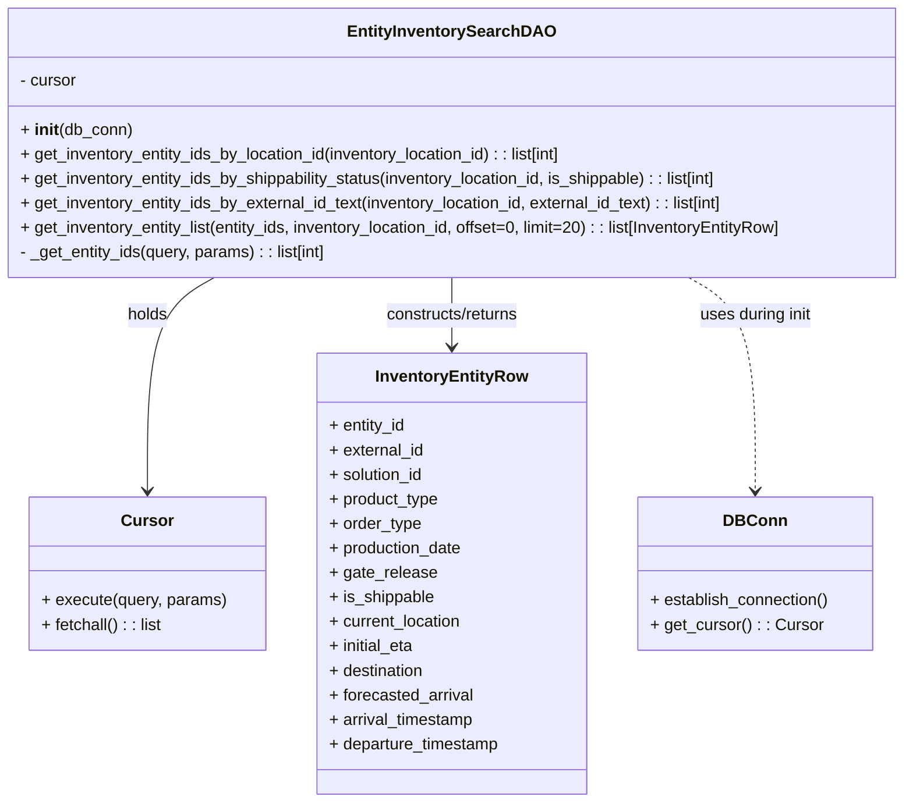
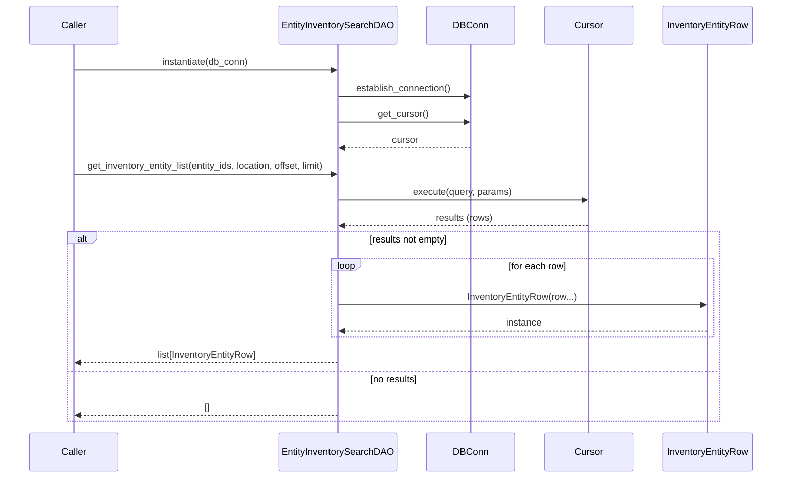

# Diagram: entity_core/entity_service/entity_inventory/entity_inventory_service/db/daos/entity_inventory_search_dao.py

> Auto-generated by Obscura crawlers

## Diagram 1

### SVG

<svg id="container" width="901.9453125" xmlns="http://www.w3.org/2000/svg" class="classDiagram" height="786" viewBox="0 0 901.9453125 786" role="graphics-document document" aria-roledescription="class"><g><defs><marker id="container_class-aggregationStart" class="marker aggregation class" refX="18" refY="7" markerWidth="190" markerHeight="240" orient="auto"><path d="M 18,7 L9,13 L1,7 L9,1 Z"></path></marker></defs><defs><marker id="container_class-aggregationEnd" class="marker aggregation class" refX="1" refY="7" markerWidth="20" markerHeight="28" orient="auto"><path d="M 18,7 L9,13 L1,7 L9,1 Z"></path></marker></defs><defs><marker id="container_class-extensionStart" class="marker extension class" refX="18" refY="7" markerWidth="190" markerHeight="240" orient="auto"><path d="M 1,7 L18,13 V 1 Z"></path></marker></defs><defs><marker id="container_class-extensionEnd" class="marker extension class" refX="1" refY="7" markerWidth="20" markerHeight="28" orient="auto"><path d="M 1,1 V 13 L18,7 Z"></path></marker></defs><defs><marker id="container_class-compositionStart" class="marker composition class" refX="18" refY="7" markerWidth="190" markerHeight="240" orient="auto"><path d="M 18,7 L9,13 L1,7 L9,1 Z"></path></marker></defs><defs><marker id="container_class-compositionEnd" class="marker composition class" refX="1" refY="7" markerWidth="20" markerHeight="28" orient="auto"><path d="M 18,7 L9,13 L1,7 L9,1 Z"></path></marker></defs><defs><marker id="container_class-dependencyStart" class="marker dependency class" refX="6" refY="7" markerWidth="190" markerHeight="240" orient="auto"><path d="M 5,7 L9,13 L1,7 L9,1 Z"></path></marker></defs><defs><marker id="container_class-dependencyEnd" class="marker dependency class" refX="13" refY="7" markerWidth="20" markerHeight="28" orient="auto"><path d="M 18,7 L9,13 L14,7 L9,1 Z"></path></marker></defs><defs><marker id="container_class-lollipopStart" class="marker lollipop class" refX="13" refY="7" markerWidth="190" markerHeight="240" orient="auto"><circle stroke="black" fill="transparent" cx="7" cy="7" r="6"></circle></marker></defs><defs><marker id="container_class-lollipopEnd" class="marker lollipop class" refX="1" refY="7" markerWidth="190" markerHeight="240" orient="auto"><circle stroke="black" fill="transparent" cx="7" cy="7" r="6"></circle></marker></defs><g class="root"><g class="clusters"></g><g class="edgePaths"><path d="M218.789,272L207.942,278.167C197.095,284.333,175.401,296.667,164.554,331.5C153.707,366.333,153.707,423.667,153.707,452.333L153.707,481" id="id_EntityInventorySearchDAO_Cursor_1" class="edge-thickness-normal edge-pattern-solid relation" style=";;;" data-edge="true" data-et="edge" data-id="id_EntityInventorySearchDAO_Cursor_1" data-points="W3sieCI6MjE4Ljc4ODg1NDQ3NDg1MjA2LCJ5IjoyNzJ9LHsieCI6MTUzLjcwNzAzMTI1LCJ5IjozMDl9LHsieCI6MTUzLjcwNzAzMTI1LCJ5Ijo0ODd9XQ==" marker-end="url(#container_class-dependencyEnd)"></path><path d="M450.973,272L450.973,278.167C450.973,284.333,450.973,296.667,450.973,308C450.973,319.333,450.973,329.667,450.973,334.833L450.973,340" id="id_EntityInventorySearchDAO_InventoryEntityRow_2" class="edge-thickness-normal edge-pattern-solid relation" style=";;;" data-edge="true" data-et="edge" data-id="id_EntityInventorySearchDAO_InventoryEntityRow_2" data-points="W3sieCI6NDUwLjk3MjY1NjI1LCJ5IjoyNzJ9LHsieCI6NDUwLjk3MjY1NjI1LCJ5IjozMDl9LHsieCI6NDUwLjk3MjY1NjI1LCJ5IjozNDZ9XQ==" marker-end="url(#container_class-dependencyEnd)"></path><path d="M683.507,272L694.371,278.167C705.234,284.333,726.961,296.667,737.824,331.5C748.688,366.333,748.688,423.667,748.688,452.333L748.688,481" id="id_EntityInventorySearchDAO_DBConn_3" class="edge-thickness-normal edge-pattern-dashed relation" style=";;;" data-edge="true" data-et="edge" data-id="id_EntityInventorySearchDAO_DBConn_3" data-points="W3sieCI6NjgzLjUwNzMyNzEwNzk4ODIsInkiOjI3Mn0seyJ4Ijo3NDguNjg3NSwieSI6MzA5fSx7IngiOjc0OC42ODc1LCJ5Ijo0ODd9XQ==" marker-end="url(#container_class-dependencyEnd)"></path></g><g class="edgeLabels"><g class="edgeLabel" transform="translate(153.70703125, 309)"><g class="label" data-id="id_EntityInventorySearchDAO_Cursor_1" transform="translate(-20.1875, -12)"><foreignObject width="40.375" height="24">

holds

</foreignObject></g></g><g class="edgeLabel" transform="translate(450.97265625, 309)"><g class="label" data-id="id_EntityInventorySearchDAO_InventoryEntityRow_2" transform="translate(-68.03125, -12)"><foreignObject width="136.0625" height="24">

constructs/returns

</foreignObject></g></g><g class="edgeLabel" transform="translate(748.6875, 309)"><g class="label" data-id="id_EntityInventorySearchDAO_DBConn_3" transform="translate(-56.453125, -12)"><foreignObject width="112.90625" height="24">

uses during init

</foreignObject></g></g></g><g class="nodes"><g class="node default" id="classId-EntityInventorySearchDAO-0" transform="translate(450.97265625, 140)"><g class="basic label-container"><path d="M-442.97265625 -132 L442.97265625 -132 L442.97265625 132 L-442.97265625 132" stroke="none" stroke-width="0" fill="#ECECFF" style=""></path><path d="M-442.97265625 -132 C-139.20237603855327 -132, 164.56790417289346 -132, 442.97265625 -132 M-442.97265625 -132 C-128.6061603362283 -132, 185.7603355775434 -132, 442.97265625 -132 M442.97265625 -132 C442.97265625 -30.356229117355213, 442.97265625 71.28754176528957, 442.97265625 132 M442.97265625 -132 C442.97265625 -66.97755790904704, 442.97265625 -1.9551158180940718, 442.97265625 132 M442.97265625 132 C136.366713033128 132, -170.23923018374398 132, -442.97265625 132 M442.97265625 132 C230.2112081720255 132, 17.449760094050987 132, -442.97265625 132 M-442.97265625 132 C-442.97265625 33.74324201423026, -442.97265625 -64.51351597153948, -442.97265625 -132 M-442.97265625 132 C-442.97265625 60.9211418743817, -442.97265625 -10.157716251236593, -442.97265625 -132" stroke="#9370DB" stroke-width="1.3" fill="none" stroke-dasharray="0 0" style=""></path></g><g class="annotation-group text" transform="translate(0, -108)"></g><g class="label-group text" transform="translate(-96.2421875, -108)"><g class="label" style="font-weight: bolder" transform="translate(0,-12)"><foreignObject width="192.484375" height="24">

EntityInventorySearchDAO

</foreignObject></g></g><g class="members-group text" transform="translate(-430.97265625, -60)"><g class="label" style="" transform="translate(0,-12)"><foreignObject width="56.421875" height="24">

- cursor

</foreignObject></g></g><g class="methods-group text" transform="translate(-430.97265625, -12)"><g class="label" style="" transform="translate(0,-12)"><foreignObject width="109.21875" height="24">

+ <strong>init</strong>(db_conn)

</foreignObject></g><g class="label" style="" transform="translate(0,12)"><foreignObject width="546.3125" height="24">

+ get_inventory_entity_ids_by_location_id(inventory_location_id) : : list[int]

</foreignObject></g><g class="label" style="" transform="translate(0,36)"><foreignObject width="702.671875" height="24">

+ get_inventory_entity_ids_by_shippability_status(inventory_location_id, is_shippable) : : list[int]

</foreignObject></g><g class="label" style="" transform="translate(0,60)"><foreignObject width="707.53125" height="24">

+ get_inventory_entity_ids_by_external_id_text(inventory_location_id, external_id_text) : : list[int]

</foreignObject></g><g class="label" style="" transform="translate(0,84)"><foreignObject width="765.703125" height="24">

+ get_inventory_entity_list(entity_ids, inventory_location_id, offset=0, limit=20) : : list[InventoryEntityRow]

</foreignObject></g><g class="label" style="" transform="translate(0,108)"><foreignObject width="307.046875" height="24">

- _get_entity_ids(query, params) : : list[int]

</foreignObject></g></g><g class="divider" style=""><path d="M-442.97265625 -84 C-192.09372168886622 -84, 58.78521287226755 -84, 442.97265625 -84 M-442.97265625 -84 C-225.69766105946798 -84, -8.422665868935951 -84, 442.97265625 -84" stroke="#9370DB" stroke-width="1.3" fill="none" stroke-dasharray="0 0" style=""></path></g><g class="divider" style=""><path d="M-442.97265625 -36 C-185.09615813405696 -36, 72.78033998188607 -36, 442.97265625 -36 M-442.97265625 -36 C-195.62822075236645 -36, 51.71621474526711 -36, 442.97265625 -36" stroke="#9370DB" stroke-width="1.3" fill="none" stroke-dasharray="0 0" style=""></path></g></g><g class="node default" id="classId-InventoryEntityRow-1" transform="translate(450.97265625, 562)"><g class="basic label-container"><path d="M-132.7109375 -216 L132.7109375 -216 L132.7109375 216 L-132.7109375 216" stroke="none" stroke-width="0" fill="#ECECFF" style=""></path><path d="M-132.7109375 -216 C-26.583048420779747 -216, 79.5448406584405 -216, 132.7109375 -216 M-132.7109375 -216 C-59.685179963156486 -216, 13.340577573687028 -216, 132.7109375 -216 M132.7109375 -216 C132.7109375 -80.38264324678087, 132.7109375 55.234713506438254, 132.7109375 216 M132.7109375 -216 C132.7109375 -48.43882195081122, 132.7109375 119.12235609837757, 132.7109375 216 M132.7109375 216 C44.67831492031334 216, -43.35430765937332 216, -132.7109375 216 M132.7109375 216 C32.661302612576705 216, -67.38833227484659 216, -132.7109375 216 M-132.7109375 216 C-132.7109375 89.72322835313196, -132.7109375 -36.553543293736084, -132.7109375 -216 M-132.7109375 216 C-132.7109375 85.8985656952265, -132.7109375 -44.20286860954701, -132.7109375 -216" stroke="#9370DB" stroke-width="1.3" fill="none" stroke-dasharray="0 0" style=""></path></g><g class="annotation-group text" transform="translate(0, -192)"></g><g class="label-group text" transform="translate(-71.71875, -192)"><g class="label" style="font-weight: bolder" transform="translate(0,-12)"><foreignObject width="143.4375" height="24">

InventoryEntityRow

</foreignObject></g></g><g class="members-group text" transform="translate(-120.7109375, -144)"><g class="label" style="" transform="translate(0,-12)"><foreignObject width="76.109375" height="24">

+ entity_id

</foreignObject></g><g class="label" style="" transform="translate(0,12)"><foreignObject width="94.015625" height="24">

+ external_id

</foreignObject></g><g class="label" style="" transform="translate(0,36)"><foreignObject width="94.453125" height="24">

+ solution_id

</foreignObject></g><g class="label" style="" transform="translate(0,60)"><foreignObject width="108.875" height="24">

+ product_type

</foreignObject></g><g class="label" style="" transform="translate(0,84)"><foreignObject width="90.25" height="24">

+ order_type

</foreignObject></g><g class="label" style="" transform="translate(0,108)"><foreignObject width="132.84375" height="24">

+ production_date

</foreignObject></g><g class="label" style="" transform="translate(0,132)"><foreignObject width="103.53125" height="24">

+ gate_release

</foreignObject></g><g class="label" style="" transform="translate(0,156)"><foreignObject width="103.953125" height="24">

+ is_shippable

</foreignObject></g><g class="label" style="" transform="translate(0,180)"><foreignObject width="132.09375" height="24">

+ current_location

</foreignObject></g><g class="label" style="" transform="translate(0,204)"><foreignObject width="85.234375" height="24">

+ initial_eta

</foreignObject></g><g class="label" style="" transform="translate(0,228)"><foreignObject width="95.375" height="24">

+ destination

</foreignObject></g><g class="label" style="" transform="translate(0,252)"><foreignObject width="142.9375" height="24">

+ forecasted_arrival

</foreignObject></g><g class="label" style="" transform="translate(0,276)"><foreignObject width="144.421875" height="24">

+ arrival_timestamp

</foreignObject></g><g class="label" style="" transform="translate(0,300)"><foreignObject width="169.703125" height="24">

+ departure_timestamp

</foreignObject></g></g><g class="methods-group text" transform="translate(-120.7109375, 216)"></g><g class="divider" style=""><path d="M-132.7109375 -168 C-72.03938652071082 -168, -11.367835541421627 -168, 132.7109375 -168 M-132.7109375 -168 C-36.68749849791817 -168, 59.33594050416366 -168, 132.7109375 -168" stroke="#9370DB" stroke-width="1.3" fill="none" stroke-dasharray="0 0" style=""></path></g><g class="divider" style=""><path d="M-132.7109375 192 C-78.02820732515806 192, -23.345477150316114 192, 132.7109375 192 M-132.7109375 192 C-37.77354566808056 192, 57.16384616383888 192, 132.7109375 192" stroke="#9370DB" stroke-width="1.3" fill="none" stroke-dasharray="0 0" style=""></path></g></g><g class="node default" id="classId-DBConn-2" transform="translate(748.6875, 562)"><g class="basic label-container"><path d="M-115.00390625 -75 L115.00390625 -75 L115.00390625 75 L-115.00390625 75" stroke="none" stroke-width="0" fill="#ECECFF" style=""></path><path d="M-115.00390625 -75 C-57.80631111689604 -75, -0.6087159837920808 -75, 115.00390625 -75 M-115.00390625 -75 C-25.18358051486007 -75, 64.63674522027986 -75, 115.00390625 -75 M115.00390625 -75 C115.00390625 -44.67475221543663, 115.00390625 -14.349504430873253, 115.00390625 75 M115.00390625 -75 C115.00390625 -33.95347112045539, 115.00390625 7.09305775908922, 115.00390625 75 M115.00390625 75 C58.53395003478297 75, 2.063993819565937 75, -115.00390625 75 M115.00390625 75 C25.34427910645111 75, -64.31534803709778 75, -115.00390625 75 M-115.00390625 75 C-115.00390625 42.560942563544515, -115.00390625 10.12188512708903, -115.00390625 -75 M-115.00390625 75 C-115.00390625 34.217361844127346, -115.00390625 -6.565276311745308, -115.00390625 -75" stroke="#9370DB" stroke-width="1.3" fill="none" stroke-dasharray="0 0" style=""></path></g><g class="annotation-group text" transform="translate(0, -51)"></g><g class="label-group text" transform="translate(-28.4921875, -51)"><g class="label" style="font-weight: bolder" transform="translate(0,-12)"><foreignObject width="56.984375" height="24">

DBConn

</foreignObject></g></g><g class="members-group text" transform="translate(-103.00390625, -3)"></g><g class="methods-group text" transform="translate(-103.00390625, 27)"><g class="label" style="" transform="translate(0,-12)"><foreignObject width="177.515625" height="24">

+ establish_connection()

</foreignObject></g><g class="label" style="" transform="translate(0,12)"><foreignObject width="166.21875" height="24">

+ get_cursor() : : Cursor

</foreignObject></g></g><g class="divider" style=""><path d="M-115.00390625 -27 C-56.72274283141451 -27, 1.5584205871709855 -27, 115.00390625 -27 M-115.00390625 -27 C-64.19585103270177 -27, -13.387795815403535 -27, 115.00390625 -27" stroke="#9370DB" stroke-width="1.3" fill="none" stroke-dasharray="0 0" style=""></path></g><g class="divider" style=""><path d="M-115.00390625 -3 C-52.661353093394354 -3, 9.681200063211293 -3, 115.00390625 -3 M-115.00390625 -3 C-39.438744241481714 -3, 36.12641776703657 -3, 115.00390625 -3" stroke="#9370DB" stroke-width="1.3" fill="none" stroke-dasharray="0 0" style=""></path></g></g><g class="node default" id="classId-Cursor-3" transform="translate(153.70703125, 562)"><g class="basic label-container"><path d="M-114.5546875 -75 L114.5546875 -75 L114.5546875 75 L-114.5546875 75" stroke="none" stroke-width="0" fill="#ECECFF" style=""></path><path d="M-114.5546875 -75 C-29.213001455673833 -75, 56.128684588652334 -75, 114.5546875 -75 M-114.5546875 -75 C-34.23624766020774 -75, 46.082192179584524 -75, 114.5546875 -75 M114.5546875 -75 C114.5546875 -27.25141517496111, 114.5546875 20.49716965007778, 114.5546875 75 M114.5546875 -75 C114.5546875 -42.008089745819966, 114.5546875 -9.016179491639932, 114.5546875 75 M114.5546875 75 C50.865437447557994 75, -12.823812604884012 75, -114.5546875 75 M114.5546875 75 C68.01142756408314 75, 21.468167628166285 75, -114.5546875 75 M-114.5546875 75 C-114.5546875 38.18046792434808, -114.5546875 1.3609358486961582, -114.5546875 -75 M-114.5546875 75 C-114.5546875 16.51256008832687, -114.5546875 -41.97487982334626, -114.5546875 -75" stroke="#9370DB" stroke-width="1.3" fill="none" stroke-dasharray="0 0" style=""></path></g><g class="annotation-group text" transform="translate(0, -51)"></g><g class="label-group text" transform="translate(-23.90625, -51)"><g class="label" style="font-weight: bolder" transform="translate(0,-12)"><foreignObject width="47.8125" height="24">

Cursor

</foreignObject></g></g><g class="members-group text" transform="translate(-102.5546875, -3)"></g><g class="methods-group text" transform="translate(-102.5546875, 27)"><g class="label" style="" transform="translate(0,-12)"><foreignObject width="181.203125" height="24">

+ execute(query, params)

</foreignObject></g><g class="label" style="" transform="translate(0,12)"><foreignObject width="119.84375" height="24">

+ fetchall() : : list

</foreignObject></g></g><g class="divider" style=""><path d="M-114.5546875 -27 C-60.81273137768382 -27, -7.070775255367636 -27, 114.5546875 -27 M-114.5546875 -27 C-38.026744333411614 -27, 38.50119883317677 -27, 114.5546875 -27" stroke="#9370DB" stroke-width="1.3" fill="none" stroke-dasharray="0 0" style=""></path></g><g class="divider" style=""><path d="M-114.5546875 -3 C-43.73205844395794 -3, 27.09057061208412 -3, 114.5546875 -3 M-114.5546875 -3 C-62.803466414692714 -3, -11.052245329385428 -3, 114.5546875 -3" stroke="#9370DB" stroke-width="1.3" fill="none" stroke-dasharray="0 0" style=""></path></g></g></g></g></g></svg>

## Diagram 2

### SVG

<svg id="container" width="1385" xmlns="http://www.w3.org/2000/svg" height="854" viewBox="-50 -10 1385 854" role="graphics-document document" aria-roledescription="sequence"><g><rect x="1124" y="768" fill="#eaeaea" stroke="#666" width="161" height="65" name="ROW" rx="3" ry="3" class="actor actor-bottom"></rect><text x="1204.5" y="800.5" dominant-baseline="central" alignment-baseline="central" class="actor actor-box" style="text-anchor: middle; font-size: 16px; font-weight: 400;"><tspan x="1204.5" dy="0">InventoryEntityRow</tspan></text></g><g><rect x="924" y="768" fill="#eaeaea" stroke="#666" width="150" height="65" name="CUR" rx="3" ry="3" class="actor actor-bottom"></rect><text x="999" y="800.5" dominant-baseline="central" alignment-baseline="central" class="actor actor-box" style="text-anchor: middle; font-size: 16px; font-weight: 400;"><tspan x="999" dy="0">Cursor</tspan></text></g><g><rect x="724" y="768" fill="#eaeaea" stroke="#666" width="150" height="65" name="DB" rx="3" ry="3" class="actor actor-bottom"></rect><text x="799" y="800.5" dominant-baseline="central" alignment-baseline="central" class="actor actor-box" style="text-anchor: middle; font-size: 16px; font-weight: 400;"><tspan x="799" dy="0">DBConn</tspan></text></g><g><rect x="459.5" y="768" fill="#eaeaea" stroke="#666" width="209" height="65" name="DAO" rx="3" ry="3" class="actor actor-bottom"></rect><text x="564" y="800.5" dominant-baseline="central" alignment-baseline="central" class="actor actor-box" style="text-anchor: middle; font-size: 16px; font-weight: 400;"><tspan x="564" dy="0">EntityInventorySearchDAO</tspan></text></g><g><rect x="0" y="768" fill="#eaeaea" stroke="#666" width="150" height="65" name="Caller" rx="3" ry="3" class="actor actor-bottom"></rect><text x="75" y="800.5" dominant-baseline="central" alignment-baseline="central" class="actor actor-box" style="text-anchor: middle; font-size: 16px; font-weight: 400;"><tspan x="75" dy="0">Caller</tspan></text></g><g><line id="actor4" x1="1204.5" y1="65" x2="1204.5" y2="768" class="actor-line 200" stroke-width="0.5px" stroke="#999" name="ROW"></line><g id="root-4"><rect x="1124" y="0" fill="#eaeaea" stroke="#666" width="161" height="65" name="ROW" rx="3" ry="3" class="actor actor-top"></rect><text x="1204.5" y="32.5" dominant-baseline="central" alignment-baseline="central" class="actor actor-box" style="text-anchor: middle; font-size: 16px; font-weight: 400;"><tspan x="1204.5" dy="0">InventoryEntityRow</tspan></text></g></g><g><line id="actor3" x1="999" y1="65" x2="999" y2="768" class="actor-line 200" stroke-width="0.5px" stroke="#999" name="CUR"></line><g id="root-3"><rect x="924" y="0" fill="#eaeaea" stroke="#666" width="150" height="65" name="CUR" rx="3" ry="3" class="actor actor-top"></rect><text x="999" y="32.5" dominant-baseline="central" alignment-baseline="central" class="actor actor-box" style="text-anchor: middle; font-size: 16px; font-weight: 400;"><tspan x="999" dy="0">Cursor</tspan></text></g></g><g><line id="actor2" x1="799" y1="65" x2="799" y2="768" class="actor-line 200" stroke-width="0.5px" stroke="#999" name="DB"></line><g id="root-2"><rect x="724" y="0" fill="#eaeaea" stroke="#666" width="150" height="65" name="DB" rx="3" ry="3" class="actor actor-top"></rect><text x="799" y="32.5" dominant-baseline="central" alignment-baseline="central" class="actor actor-box" style="text-anchor: middle; font-size: 16px; font-weight: 400;"><tspan x="799" dy="0">DBConn</tspan></text></g></g><g><line id="actor1" x1="564" y1="65" x2="564" y2="768" class="actor-line 200" stroke-width="0.5px" stroke="#999" name="DAO"></line><g id="root-1"><rect x="459.5" y="0" fill="#eaeaea" stroke="#666" width="209" height="65" name="DAO" rx="3" ry="3" class="actor actor-top"></rect><text x="564" y="32.5" dominant-baseline="central" alignment-baseline="central" class="actor actor-box" style="text-anchor: middle; font-size: 16px; font-weight: 400;"><tspan x="564" dy="0">EntityInventorySearchDAO</tspan></text></g></g><g><line id="actor0" x1="75" y1="65" x2="75" y2="768" class="actor-line 200" stroke-width="0.5px" stroke="#999" name="Caller"></line><g id="root-0"><rect x="0" y="0" fill="#eaeaea" stroke="#666" width="150" height="65" name="Caller" rx="3" ry="3" class="actor actor-top"></rect><text x="75" y="32.5" dominant-baseline="central" alignment-baseline="central" class="actor actor-box" style="text-anchor: middle; font-size: 16px; font-weight: 400;"><tspan x="75" dy="0">Caller</tspan></text></g></g><g></g><defs><symbol id="computer" width="24" height="24"><path transform="scale(.5)" d="M2 2v13h20v-13h-20zm18 11h-16v-9h16v9zm-10.228 6l.466-1h3.524l.467 1h-4.457zm14.228 3h-24l2-6h2.104l-1.33 4h18.45l-1.297-4h2.073l2 6zm-5-10h-14v-7h14v7z"></path></symbol></defs><defs><symbol id="database" fill-rule="evenodd" clip-rule="evenodd"><path transform="scale(.5)" d="M12.258.001l.256.004.255.005.253.008.251.01.249.012.247.015.246.016.242.019.241.02.239.023.236.024.233.027.231.028.229.031.225.032.223.034.22.036.217.038.214.04.211.041.208.043.205.045.201.046.198.048.194.05.191.051.187.053.183.054.18.056.175.057.172.059.168.06.163.061.16.063.155.064.15.066.074.033.073.033.071.034.07.034.069.035.068.035.067.035.066.035.064.036.064.036.062.036.06.036.06.037.058.037.058.037.055.038.055.038.053.038.052.038.051.039.05.039.048.039.047.039.045.04.044.04.043.04.041.04.04.041.039.041.037.041.036.041.034.041.033.042.032.042.03.042.029.042.027.042.026.043.024.043.023.043.021.043.02.043.018.044.017.043.015.044.013.044.012.044.011.045.009.044.007.045.006.045.004.045.002.045.001.045v17l-.001.045-.002.045-.004.045-.006.045-.007.045-.009.044-.011.045-.012.044-.013.044-.015.044-.017.043-.018.044-.02.043-.021.043-.023.043-.024.043-.026.043-.027.042-.029.042-.03.042-.032.042-.033.042-.034.041-.036.041-.037.041-.039.041-.04.041-.041.04-.043.04-.044.04-.045.04-.047.039-.048.039-.05.039-.051.039-.052.038-.053.038-.055.038-.055.038-.058.037-.058.037-.06.037-.06.036-.062.036-.064.036-.064.036-.066.035-.067.035-.068.035-.069.035-.07.034-.071.034-.073.033-.074.033-.15.066-.155.064-.16.063-.163.061-.168.06-.172.059-.175.057-.18.056-.183.054-.187.053-.191.051-.194.05-.198.048-.201.046-.205.045-.208.043-.211.041-.214.04-.217.038-.22.036-.223.034-.225.032-.229.031-.231.028-.233.027-.236.024-.239.023-.241.02-.242.019-.246.016-.247.015-.249.012-.251.01-.253.008-.255.005-.256.004-.258.001-.258-.001-.256-.004-.255-.005-.253-.008-.251-.01-.249-.012-.247-.015-.245-.016-.243-.019-.241-.02-.238-.023-.236-.024-.234-.027-.231-.028-.228-.031-.226-.032-.223-.034-.22-.036-.217-.038-.214-.04-.211-.041-.208-.043-.204-.045-.201-.046-.198-.048-.195-.05-.19-.051-.187-.053-.184-.054-.179-.056-.176-.057-.172-.059-.167-.06-.164-.061-.159-.063-.155-.064-.151-.066-.074-.033-.072-.033-.072-.034-.07-.034-.069-.035-.068-.035-.067-.035-.066-.035-.064-.036-.063-.036-.062-.036-.061-.036-.06-.037-.058-.037-.057-.037-.056-.038-.055-.038-.053-.038-.052-.038-.051-.039-.049-.039-.049-.039-.046-.039-.046-.04-.044-.04-.043-.04-.041-.04-.04-.041-.039-.041-.037-.041-.036-.041-.034-.041-.033-.042-.032-.042-.03-.042-.029-.042-.027-.042-.026-.043-.024-.043-.023-.043-.021-.043-.02-.043-.018-.044-.017-.043-.015-.044-.013-.044-.012-.044-.011-.045-.009-.044-.007-.045-.006-.045-.004-.045-.002-.045-.001-.045v-17l.001-.045.002-.045.004-.045.006-.045.007-.045.009-.044.011-.045.012-.044.013-.044.015-.044.017-.043.018-.044.02-.043.021-.043.023-.043.024-.043.026-.043.027-.042.029-.042.03-.042.032-.042.033-.042.034-.041.036-.041.037-.041.039-.041.04-.041.041-.04.043-.04.044-.04.046-.04.046-.039.049-.039.049-.039.051-.039.052-.038.053-.038.055-.038.056-.038.057-.037.058-.037.06-.037.061-.036.062-.036.063-.036.064-.036.066-.035.067-.035.068-.035.069-.035.07-.034.072-.034.072-.033.074-.033.151-.066.155-.064.159-.063.164-.061.167-.06.172-.059.176-.057.179-.056.184-.054.187-.053.19-.051.195-.05.198-.048.201-.046.204-.045.208-.043.211-.041.214-.04.217-.038.22-.036.223-.034.226-.032.228-.031.231-.028.234-.027.236-.024.238-.023.241-.02.243-.019.245-.016.247-.015.249-.012.251-.01.253-.008.255-.005.256-.004.258-.001.258.001zm-9.258 20.499v.01l.001.021.003.021.004.022.005.021.006.022.007.022.009.023.01.022.011.023.012.023.013.023.015.023.016.024.017.023.018.024.019.024.021.024.022.025.023.024.024.025.052.049.056.05.061.051.066.051.07.051.075.051.079.052.084.052.088.052.092.052.097.052.102.051.105.052.11.052.114.051.119.051.123.051.127.05.131.05.135.05.139.048.144.049.147.047.152.047.155.047.16.045.163.045.167.043.171.043.176.041.178.041.183.039.187.039.19.037.194.035.197.035.202.033.204.031.209.03.212.029.216.027.219.025.222.024.226.021.23.02.233.018.236.016.24.015.243.012.246.01.249.008.253.005.256.004.259.001.26-.001.257-.004.254-.005.25-.008.247-.011.244-.012.241-.014.237-.016.233-.018.231-.021.226-.021.224-.024.22-.026.216-.027.212-.028.21-.031.205-.031.202-.034.198-.034.194-.036.191-.037.187-.039.183-.04.179-.04.175-.042.172-.043.168-.044.163-.045.16-.046.155-.046.152-.047.148-.048.143-.049.139-.049.136-.05.131-.05.126-.05.123-.051.118-.052.114-.051.11-.052.106-.052.101-.052.096-.052.092-.052.088-.053.083-.051.079-.052.074-.052.07-.051.065-.051.06-.051.056-.05.051-.05.023-.024.023-.025.021-.024.02-.024.019-.024.018-.024.017-.024.015-.023.014-.024.013-.023.012-.023.01-.023.01-.022.008-.022.006-.022.006-.022.004-.022.004-.021.001-.021.001-.021v-4.127l-.077.055-.08.053-.083.054-.085.053-.087.052-.09.052-.093.051-.095.05-.097.05-.1.049-.102.049-.105.048-.106.047-.109.047-.111.046-.114.045-.115.045-.118.044-.12.043-.122.042-.124.042-.126.041-.128.04-.13.04-.132.038-.134.038-.135.037-.138.037-.139.035-.142.035-.143.034-.144.033-.147.032-.148.031-.15.03-.151.03-.153.029-.154.027-.156.027-.158.026-.159.025-.161.024-.162.023-.163.022-.165.021-.166.02-.167.019-.169.018-.169.017-.171.016-.173.015-.173.014-.175.013-.175.012-.177.011-.178.01-.179.008-.179.008-.181.006-.182.005-.182.004-.184.003-.184.002h-.37l-.184-.002-.184-.003-.182-.004-.182-.005-.181-.006-.179-.008-.179-.008-.178-.01-.176-.011-.176-.012-.175-.013-.173-.014-.172-.015-.171-.016-.17-.017-.169-.018-.167-.019-.166-.02-.165-.021-.163-.022-.162-.023-.161-.024-.159-.025-.157-.026-.156-.027-.155-.027-.153-.029-.151-.03-.15-.03-.148-.031-.146-.032-.145-.033-.143-.034-.141-.035-.14-.035-.137-.037-.136-.037-.134-.038-.132-.038-.13-.04-.128-.04-.126-.041-.124-.042-.122-.042-.12-.044-.117-.043-.116-.045-.113-.045-.112-.046-.109-.047-.106-.047-.105-.048-.102-.049-.1-.049-.097-.05-.095-.05-.093-.052-.09-.051-.087-.052-.085-.053-.083-.054-.08-.054-.077-.054v4.127zm0-5.654v.011l.001.021.003.021.004.021.005.022.006.022.007.022.009.022.01.022.011.023.012.023.013.023.015.024.016.023.017.024.018.024.019.024.021.024.022.024.023.025.024.024.052.05.056.05.061.05.066.051.07.051.075.052.079.051.084.052.088.052.092.052.097.052.102.052.105.052.11.051.114.051.119.052.123.05.127.051.131.05.135.049.139.049.144.048.147.048.152.047.155.046.16.045.163.045.167.044.171.042.176.042.178.04.183.04.187.038.19.037.194.036.197.034.202.033.204.032.209.03.212.028.216.027.219.025.222.024.226.022.23.02.233.018.236.016.24.014.243.012.246.01.249.008.253.006.256.003.259.001.26-.001.257-.003.254-.006.25-.008.247-.01.244-.012.241-.015.237-.016.233-.018.231-.02.226-.022.224-.024.22-.025.216-.027.212-.029.21-.03.205-.032.202-.033.198-.035.194-.036.191-.037.187-.039.183-.039.179-.041.175-.042.172-.043.168-.044.163-.045.16-.045.155-.047.152-.047.148-.048.143-.048.139-.05.136-.049.131-.05.126-.051.123-.051.118-.051.114-.052.11-.052.106-.052.101-.052.096-.052.092-.052.088-.052.083-.052.079-.052.074-.051.07-.052.065-.051.06-.05.056-.051.051-.049.023-.025.023-.024.021-.025.02-.024.019-.024.018-.024.017-.024.015-.023.014-.023.013-.024.012-.022.01-.023.01-.023.008-.022.006-.022.006-.022.004-.021.004-.022.001-.021.001-.021v-4.139l-.077.054-.08.054-.083.054-.085.052-.087.053-.09.051-.093.051-.095.051-.097.05-.1.049-.102.049-.105.048-.106.047-.109.047-.111.046-.114.045-.115.044-.118.044-.12.044-.122.042-.124.042-.126.041-.128.04-.13.039-.132.039-.134.038-.135.037-.138.036-.139.036-.142.035-.143.033-.144.033-.147.033-.148.031-.15.03-.151.03-.153.028-.154.028-.156.027-.158.026-.159.025-.161.024-.162.023-.163.022-.165.021-.166.02-.167.019-.169.018-.169.017-.171.016-.173.015-.173.014-.175.013-.175.012-.177.011-.178.009-.179.009-.179.007-.181.007-.182.005-.182.004-.184.003-.184.002h-.37l-.184-.002-.184-.003-.182-.004-.182-.005-.181-.007-.179-.007-.179-.009-.178-.009-.176-.011-.176-.012-.175-.013-.173-.014-.172-.015-.171-.016-.17-.017-.169-.018-.167-.019-.166-.02-.165-.021-.163-.022-.162-.023-.161-.024-.159-.025-.157-.026-.156-.027-.155-.028-.153-.028-.151-.03-.15-.03-.148-.031-.146-.033-.145-.033-.143-.033-.141-.035-.14-.036-.137-.036-.136-.037-.134-.038-.132-.039-.13-.039-.128-.04-.126-.041-.124-.042-.122-.043-.12-.043-.117-.044-.116-.044-.113-.046-.112-.046-.109-.046-.106-.047-.105-.048-.102-.049-.1-.049-.097-.05-.095-.051-.093-.051-.09-.051-.087-.053-.085-.052-.083-.054-.08-.054-.077-.054v4.139zm0-5.666v.011l.001.02.003.022.004.021.005.022.006.021.007.022.009.023.01.022.011.023.012.023.013.023.015.023.016.024.017.024.018.023.019.024.021.025.022.024.023.024.024.025.052.05.056.05.061.05.066.051.07.051.075.052.079.051.084.052.088.052.092.052.097.052.102.052.105.051.11.052.114.051.119.051.123.051.127.05.131.05.135.05.139.049.144.048.147.048.152.047.155.046.16.045.163.045.167.043.171.043.176.042.178.04.183.04.187.038.19.037.194.036.197.034.202.033.204.032.209.03.212.028.216.027.219.025.222.024.226.021.23.02.233.018.236.017.24.014.243.012.246.01.249.008.253.006.256.003.259.001.26-.001.257-.003.254-.006.25-.008.247-.01.244-.013.241-.014.237-.016.233-.018.231-.02.226-.022.224-.024.22-.025.216-.027.212-.029.21-.03.205-.032.202-.033.198-.035.194-.036.191-.037.187-.039.183-.039.179-.041.175-.042.172-.043.168-.044.163-.045.16-.045.155-.047.152-.047.148-.048.143-.049.139-.049.136-.049.131-.051.126-.05.123-.051.118-.052.114-.051.11-.052.106-.052.101-.052.096-.052.092-.052.088-.052.083-.052.079-.052.074-.052.07-.051.065-.051.06-.051.056-.05.051-.049.023-.025.023-.025.021-.024.02-.024.019-.024.018-.024.017-.024.015-.023.014-.024.013-.023.012-.023.01-.022.01-.023.008-.022.006-.022.006-.022.004-.022.004-.021.001-.021.001-.021v-4.153l-.077.054-.08.054-.083.053-.085.053-.087.053-.09.051-.093.051-.095.051-.097.05-.1.049-.102.048-.105.048-.106.048-.109.046-.111.046-.114.046-.115.044-.118.044-.12.043-.122.043-.124.042-.126.041-.128.04-.13.039-.132.039-.134.038-.135.037-.138.036-.139.036-.142.034-.143.034-.144.033-.147.032-.148.032-.15.03-.151.03-.153.028-.154.028-.156.027-.158.026-.159.024-.161.024-.162.023-.163.023-.165.021-.166.02-.167.019-.169.018-.169.017-.171.016-.173.015-.173.014-.175.013-.175.012-.177.01-.178.01-.179.009-.179.007-.181.006-.182.006-.182.004-.184.003-.184.001-.185.001-.185-.001-.184-.001-.184-.003-.182-.004-.182-.006-.181-.006-.179-.007-.179-.009-.178-.01-.176-.01-.176-.012-.175-.013-.173-.014-.172-.015-.171-.016-.17-.017-.169-.018-.167-.019-.166-.02-.165-.021-.163-.023-.162-.023-.161-.024-.159-.024-.157-.026-.156-.027-.155-.028-.153-.028-.151-.03-.15-.03-.148-.032-.146-.032-.145-.033-.143-.034-.141-.034-.14-.036-.137-.036-.136-.037-.134-.038-.132-.039-.13-.039-.128-.041-.126-.041-.124-.041-.122-.043-.12-.043-.117-.044-.116-.044-.113-.046-.112-.046-.109-.046-.106-.048-.105-.048-.102-.048-.1-.05-.097-.049-.095-.051-.093-.051-.09-.052-.087-.052-.085-.053-.083-.053-.08-.054-.077-.054v4.153zm8.74-8.179l-.257.004-.254.005-.25.008-.247.011-.244.012-.241.014-.237.016-.233.018-.231.021-.226.022-.224.023-.22.026-.216.027-.212.028-.21.031-.205.032-.202.033-.198.034-.194.036-.191.038-.187.038-.183.04-.179.041-.175.042-.172.043-.168.043-.163.045-.16.046-.155.046-.152.048-.148.048-.143.048-.139.049-.136.05-.131.05-.126.051-.123.051-.118.051-.114.052-.11.052-.106.052-.101.052-.096.052-.092.052-.088.052-.083.052-.079.052-.074.051-.07.052-.065.051-.06.05-.056.05-.051.05-.023.025-.023.024-.021.024-.02.025-.019.024-.018.024-.017.023-.015.024-.014.023-.013.023-.012.023-.01.023-.01.022-.008.022-.006.023-.006.021-.004.022-.004.021-.001.021-.001.021.001.021.001.021.004.021.004.022.006.021.006.023.008.022.01.022.01.023.012.023.013.023.014.023.015.024.017.023.018.024.019.024.02.025.021.024.023.024.023.025.051.05.056.05.06.05.065.051.07.052.074.051.079.052.083.052.088.052.092.052.096.052.101.052.106.052.11.052.114.052.118.051.123.051.126.051.131.05.136.05.139.049.143.048.148.048.152.048.155.046.16.046.163.045.168.043.172.043.175.042.179.041.183.04.187.038.191.038.194.036.198.034.202.033.205.032.21.031.212.028.216.027.22.026.224.023.226.022.231.021.233.018.237.016.241.014.244.012.247.011.25.008.254.005.257.004.26.001.26-.001.257-.004.254-.005.25-.008.247-.011.244-.012.241-.014.237-.016.233-.018.231-.021.226-.022.224-.023.22-.026.216-.027.212-.028.21-.031.205-.032.202-.033.198-.034.194-.036.191-.038.187-.038.183-.04.179-.041.175-.042.172-.043.168-.043.163-.045.16-.046.155-.046.152-.048.148-.048.143-.048.139-.049.136-.05.131-.05.126-.051.123-.051.118-.051.114-.052.11-.052.106-.052.101-.052.096-.052.092-.052.088-.052.083-.052.079-.052.074-.051.07-.052.065-.051.06-.05.056-.05.051-.05.023-.025.023-.024.021-.024.02-.025.019-.024.018-.024.017-.023.015-.024.014-.023.013-.023.012-.023.01-.023.01-.022.008-.022.006-.023.006-.021.004-.022.004-.021.001-.021.001-.021-.001-.021-.001-.021-.004-.021-.004-.022-.006-.021-.006-.023-.008-.022-.01-.022-.01-.023-.012-.023-.013-.023-.014-.023-.015-.024-.017-.023-.018-.024-.019-.024-.02-.025-.021-.024-.023-.024-.023-.025-.051-.05-.056-.05-.06-.05-.065-.051-.07-.052-.074-.051-.079-.052-.083-.052-.088-.052-.092-.052-.096-.052-.101-.052-.106-.052-.11-.052-.114-.052-.118-.051-.123-.051-.126-.051-.131-.05-.136-.05-.139-.049-.143-.048-.148-.048-.152-.048-.155-.046-.16-.046-.163-.045-.168-.043-.172-.043-.175-.042-.179-.041-.183-.04-.187-.038-.191-.038-.194-.036-.198-.034-.202-.033-.205-.032-.21-.031-.212-.028-.216-.027-.22-.026-.224-.023-.226-.022-.231-.021-.233-.018-.237-.016-.241-.014-.244-.012-.247-.011-.25-.008-.254-.005-.257-.004-.26-.001-.26.001z"></path></symbol></defs><defs><symbol id="clock" width="24" height="24"><path transform="scale(.5)" d="M12 2c5.514 0 10 4.486 10 10s-4.486 10-10 10-10-4.486-10-10 4.486-10 10-10zm0-2c-6.627 0-12 5.373-12 12s5.373 12 12 12 12-5.373 12-12-5.373-12-12-12zm5.848 12.459c.202.038.202.333.001.372-1.907.361-6.045 1.111-6.547 1.111-.719 0-1.301-.582-1.301-1.301 0-.512.77-5.447 1.125-7.445.034-.192.312-.181.343.014l.985 6.238 5.394 1.011z"></path></symbol></defs><defs><marker id="arrowhead" refX="7.9" refY="5" markerUnits="userSpaceOnUse" markerWidth="12" markerHeight="12" orient="auto-start-reverse"><path d="M -1 0 L 10 5 L 0 10 z"></path></marker></defs><defs><marker id="crosshead" markerWidth="15" markerHeight="8" orient="auto" refX="4" refY="4.5"><path fill="none" stroke="#000000" stroke-width="1pt" d="M 1,2 L 6,7 M 6,2 L 1,7" style="stroke-dasharray: 0, 0;"></path></marker></defs><defs><marker id="filled-head" refX="15.5" refY="7" markerWidth="20" markerHeight="28" orient="auto"><path d="M 18,7 L9,13 L14,7 L9,1 Z"></path></marker></defs><defs><marker id="sequencenumber" refX="15" refY="15" markerWidth="60" markerHeight="40" orient="auto"><circle cx="15" cy="15" r="6"></circle></marker></defs><g><line x1="553" y1="456" x2="1215.5" y2="456" class="loopLine"></line><line x1="1215.5" y1="456" x2="1215.5" y2="597" class="loopLine"></line><line x1="553" y1="597" x2="1215.5" y2="597" class="loopLine"></line><line x1="553" y1="456" x2="553" y2="597" class="loopLine"></line><polygon points="553,456 603,456 603,469 594.6,476 553,476" class="labelBox"></polygon><text x="578" y="469" text-anchor="middle" dominant-baseline="middle" alignment-baseline="middle" class="labelText" style="font-size: 16px; font-weight: 400;">loop</text><text x="909.25" y="474" text-anchor="middle" class="loopText" style="font-size: 16px; font-weight: 400;"><tspan x="909.25">[for each row]</tspan></text></g><g><line x1="64" y1="411" x2="1225.5" y2="411" class="loopLine"></line><line x1="1225.5" y1="411" x2="1225.5" y2="748" class="loopLine"></line><line x1="64" y1="748" x2="1225.5" y2="748" class="loopLine"></line><line x1="64" y1="411" x2="64" y2="748" class="loopLine"></line><line x1="64" y1="660" x2="1225.5" y2="660" class="loopLine" style="stroke-dasharray: 3, 3;"></line><polygon points="64,411 114,411 114,424 105.6,431 64,431" class="labelBox"></polygon><text x="89" y="424" text-anchor="middle" dominant-baseline="middle" alignment-baseline="middle" class="labelText" style="font-size: 16px; font-weight: 400;">alt</text><text x="669.75" y="429" text-anchor="middle" class="loopText" style="font-size: 16px; font-weight: 400;"><tspan x="669.75">[results not empty]</tspan></text><text x="644.75" y="678" text-anchor="middle" class="loopText" style="font-size: 16px; font-weight: 400;">[no results]</text></g><text x="318" y="80" text-anchor="middle" dominant-baseline="middle" alignment-baseline="middle" class="messageText" dy="1em" style="font-size: 16px; font-weight: 400;">instantiate(db_conn)</text><line x1="76" y1="113" x2="560" y2="113" class="messageLine0" stroke-width="2" stroke="none" marker-end="url(#arrowhead)" style="fill: none;"></line><text x="680" y="128" text-anchor="middle" dominant-baseline="middle" alignment-baseline="middle" class="messageText" dy="1em" style="font-size: 16px; font-weight: 400;">establish_connection()</text><line x1="565" y1="161" x2="795" y2="161" class="messageLine0" stroke-width="2" stroke="none" marker-end="url(#arrowhead)" style="fill: none;"></line><text x="680" y="176" text-anchor="middle" dominant-baseline="middle" alignment-baseline="middle" class="messageText" dy="1em" style="font-size: 16px; font-weight: 400;">get_cursor()</text><line x1="565" y1="209" x2="795" y2="209" class="messageLine0" stroke-width="2" stroke="none" marker-end="url(#arrowhead)" style="fill: none;"></line><text x="683" y="224" text-anchor="middle" dominant-baseline="middle" alignment-baseline="middle" class="messageText" dy="1em" style="font-size: 16px; font-weight: 400;">cursor</text><line x1="798" y1="257" x2="568" y2="257" class="messageLine1" stroke-width="2" stroke="none" marker-end="url(#arrowhead)" style="stroke-dasharray: 3, 3; fill: none;"></line><text x="318" y="272" text-anchor="middle" dominant-baseline="middle" alignment-baseline="middle" class="messageText" dy="1em" style="font-size: 16px; font-weight: 400;">get_inventory_entity_list(entity_ids, location, offset, limit)</text><line x1="76" y1="305" x2="560" y2="305" class="messageLine0" stroke-width="2" stroke="none" marker-end="url(#arrowhead)" style="fill: none;"></line><text x="780" y="320" text-anchor="middle" dominant-baseline="middle" alignment-baseline="middle" class="messageText" dy="1em" style="font-size: 16px; font-weight: 400;">execute(query, params)</text><line x1="565" y1="353" x2="995" y2="353" class="messageLine0" stroke-width="2" stroke="none" marker-end="url(#arrowhead)" style="fill: none;"></line><text x="783" y="368" text-anchor="middle" dominant-baseline="middle" alignment-baseline="middle" class="messageText" dy="1em" style="font-size: 16px; font-weight: 400;">results (rows)</text><line x1="998" y1="401" x2="568" y2="401" class="messageLine1" stroke-width="2" stroke="none" marker-end="url(#arrowhead)" style="stroke-dasharray: 3, 3; fill: none;"></line><text x="883" y="506" text-anchor="middle" dominant-baseline="middle" alignment-baseline="middle" class="messageText" dy="1em" style="font-size: 16px; font-weight: 400;">InventoryEntityRow(row...)</text><line x1="565" y1="539" x2="1200.5" y2="539" class="messageLine0" stroke-width="2" stroke="none" marker-end="url(#arrowhead)" style="fill: none;"></line><text x="886" y="554" text-anchor="middle" dominant-baseline="middle" alignment-baseline="middle" class="messageText" dy="1em" style="font-size: 16px; font-weight: 400;">instance</text><line x1="1203.5" y1="587" x2="568" y2="587" class="messageLine1" stroke-width="2" stroke="none" marker-end="url(#arrowhead)" style="stroke-dasharray: 3, 3; fill: none;"></line><text x="321" y="612" text-anchor="middle" dominant-baseline="middle" alignment-baseline="middle" class="messageText" dy="1em" style="font-size: 16px; font-weight: 400;">list[InventoryEntityRow]</text><line x1="563" y1="645" x2="79" y2="645" class="messageLine1" stroke-width="2" stroke="none" marker-end="url(#arrowhead)" style="stroke-dasharray: 3, 3; fill: none;"></line><text x="321" y="705" text-anchor="middle" dominant-baseline="middle" alignment-baseline="middle" class="messageText" dy="1em" style="font-size: 16px; font-weight: 400;">[]</text><line x1="563" y1="738" x2="79" y2="738" class="messageLine1" stroke-width="2" stroke="none" marker-end="url(#arrowhead)" style="stroke-dasharray: 3, 3; fill: none;"></line></svg>
