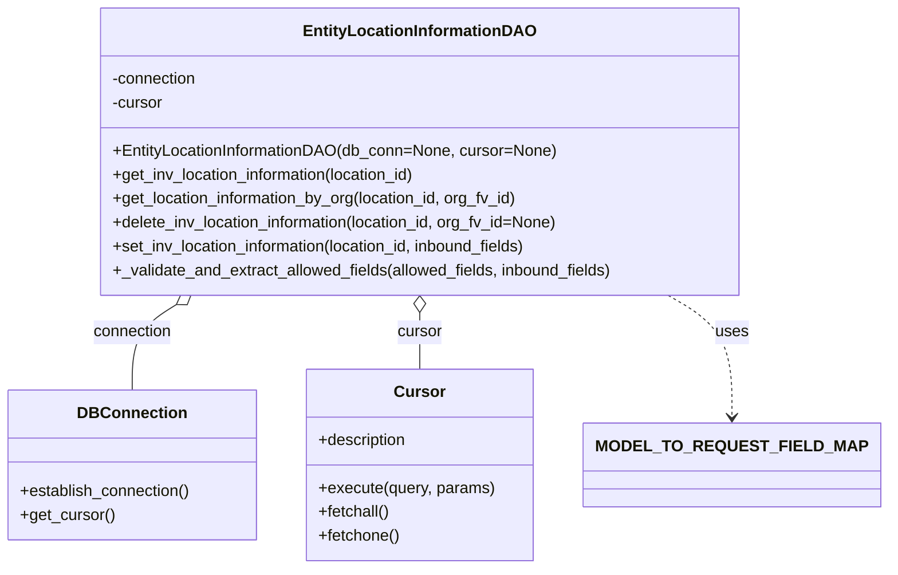

# Diagram: entity_core/entity_service/entity_inventory/entity_inventory_service/db/daos/entity_location_information_dao.py


> Auto-generated by Obscura crawlers

## Diagram 1



### SVG

<svg id="container" width="849.9375" xmlns="http://www.w3.org/2000/svg" class="classDiagram" height="570" viewBox="0 0 849.9375 570" role="graphics-document document" aria-roledescription="class"><style>#container{font-family:"trebuchet ms",verdana,arial,sans-serif;font-size:16px;fill:#333;}@keyframes edge-animation-frame{from{stroke-dashoffset:0;}}@keyframes dash{to{stroke-dashoffset:0;}}#container .edge-animation-slow{stroke-dasharray:9,5!important;stroke-dashoffset:900;animation:dash 50s linear infinite;stroke-linecap:round;}#container .edge-animation-fast{stroke-dasharray:9,5!important;stroke-dashoffset:900;animation:dash 20s linear infinite;stroke-linecap:round;}#container .error-icon{fill:#552222;}#container .error-text{fill:#552222;stroke:#552222;}#container .edge-thickness-normal{stroke-width:1px;}#container .edge-thickness-thick{stroke-width:3.5px;}#container .edge-pattern-solid{stroke-dasharray:0;}#container .edge-thickness-invisible{stroke-width:0;fill:none;}#container .edge-pattern-dashed{stroke-dasharray:3;}#container .edge-pattern-dotted{stroke-dasharray:2;}#container .marker{fill:#333333;stroke:#333333;}#container .marker.cross{stroke:#333333;}#container svg{font-family:"trebuchet ms",verdana,arial,sans-serif;font-size:16px;}#container p{margin:0;}#container g.classGroup text{fill:#9370DB;stroke:none;font-family:"trebuchet ms",verdana,arial,sans-serif;font-size:10px;}#container g.classGroup text .title{font-weight:bolder;}#container .nodeLabel,#container .edgeLabel{color:#131300;}#container .edgeLabel .label rect{fill:#ECECFF;}#container .label text{fill:#131300;}#container .labelBkg{background:#ECECFF;}#container .edgeLabel .label span{background:#ECECFF;}#container .classTitle{font-weight:bolder;}#container .node rect,#container .node circle,#container .node ellipse,#container .node polygon,#container .node path{fill:#ECECFF;stroke:#9370DB;stroke-width:1px;}#container .divider{stroke:#9370DB;stroke-width:1;}#container g.clickable{cursor:pointer;}#container g.classGroup rect{fill:#ECECFF;stroke:#9370DB;}#container g.classGroup line{stroke:#9370DB;stroke-width:1;}#container .classLabel .box{stroke:none;stroke-width:0;fill:#ECECFF;opacity:0.5;}#container .classLabel .label{fill:#9370DB;font-size:10px;}#container .relation{stroke:#333333;stroke-width:1;fill:none;}#container .dashed-line{stroke-dasharray:3;}#container .dotted-line{stroke-dasharray:1 2;}#container #compositionStart,#container .composition{fill:#333333!important;stroke:#333333!important;stroke-width:1;}#container #compositionEnd,#container .composition{fill:#333333!important;stroke:#333333!important;stroke-width:1;}#container #dependencyStart,#container .dependency{fill:#333333!important;stroke:#333333!important;stroke-width:1;}#container #dependencyStart,#container .dependency{fill:#333333!important;stroke:#333333!important;stroke-width:1;}#container #extensionStart,#container .extension{fill:transparent!important;stroke:#333333!important;stroke-width:1;}#container #extensionEnd,#container .extension{fill:transparent!important;stroke:#333333!important;stroke-width:1;}#container #aggregationStart,#container .aggregation{fill:transparent!important;stroke:#333333!important;stroke-width:1;}#container #aggregationEnd,#container .aggregation{fill:transparent!important;stroke:#333333!important;stroke-width:1;}#container #lollipopStart,#container .lollipop{fill:#ECECFF!important;stroke:#333333!important;stroke-width:1;}#container #lollipopEnd,#container .lollipop{fill:#ECECFF!important;stroke:#333333!important;stroke-width:1;}#container .edgeTerminals{font-size:11px;line-height:initial;}#container .classTitleText{text-anchor:middle;font-size:18px;fill:#333;}#container .label-icon{display:inline-block;height:1em;overflow:visible;vertical-align:-0.125em;}#container .node .label-icon path{fill:currentColor;stroke:revert;stroke-width:revert;}#container :root{--mermaid-font-family:"trebuchet ms",verdana,arial,sans-serif;}</style><g><defs><marker id="container_class-aggregationStart" class="marker aggregation class" refX="18" refY="7" markerWidth="190" markerHeight="240" orient="auto"><path d="M 18,7 L9,13 L1,7 L9,1 Z"></path></marker></defs><defs><marker id="container_class-aggregationEnd" class="marker aggregation class" refX="1" refY="7" markerWidth="20" markerHeight="28" orient="auto"><path d="M 18,7 L9,13 L1,7 L9,1 Z"></path></marker></defs><defs><marker id="container_class-extensionStart" class="marker extension class" refX="18" refY="7" markerWidth="190" markerHeight="240" orient="auto"><path d="M 1,7 L18,13 V 1 Z"></path></marker></defs><defs><marker id="container_class-extensionEnd" class="marker extension class" refX="1" refY="7" markerWidth="20" markerHeight="28" orient="auto"><path d="M 1,1 V 13 L18,7 Z"></path></marker></defs><defs><marker id="container_class-compositionStart" class="marker composition class" refX="18" refY="7" markerWidth="190" markerHeight="240" orient="auto"><path d="M 18,7 L9,13 L1,7 L9,1 Z"></path></marker></defs><defs><marker id="container_class-compositionEnd" class="marker composition class" refX="1" refY="7" markerWidth="20" markerHeight="28" orient="auto"><path d="M 18,7 L9,13 L1,7 L9,1 Z"></path></marker></defs><defs><marker id="container_class-dependencyStart" class="marker dependency class" refX="6" refY="7" markerWidth="190" markerHeight="240" orient="auto"><path d="M 5,7 L9,13 L1,7 L9,1 Z"></path></marker></defs><defs><marker id="container_class-dependencyEnd" class="marker dependency class" refX="13" refY="7" markerWidth="20" markerHeight="28" orient="auto"><path d="M 18,7 L9,13 L14,7 L9,1 Z"></path></marker></defs><defs><marker id="container_class-lollipopStart" class="marker lollipop class" refX="13" refY="7" markerWidth="190" markerHeight="240" orient="auto"><circle stroke="black" fill="transparent" cx="7" cy="7" r="6"></circle></marker></defs><defs><marker id="container_class-lollipopEnd" class="marker lollipop class" refX="1" refY="7" markerWidth="190" markerHeight="240" orient="auto"><circle stroke="black" fill="transparent" cx="7" cy="7" r="6"></circle></marker></defs><g class="root"><g class="clusters"></g><g class="edgePaths"><path d="M176.352,305.207L169.013,309.839C161.675,314.472,146.998,323.736,139.659,338.035C132.32,352.333,132.32,371.667,132.32,381.333L132.32,391" id="id_EntityLocationInformationDAO_DBConnection_1" class="edge-thickness-normal edge-pattern-solid relation" style=";;;" data-edge="true" data-et="edge" data-id="id_EntityLocationInformationDAO_DBConnection_1" data-points="W3sieCI6MTkwLjkzOTMxMjg0NTMwMzg3LCJ5IjoyOTZ9LHsieCI6MTMyLjMyMDMxMjUsInkiOjMzM30seyJ4IjoxMzIuMzIwMzEyNSwieSI6MzkxfV0=" marker-start="url(#container_class-aggregationStart)"></path><path d="M419.078,313.25L419.078,316.542C419.078,319.833,419.078,326.417,419.078,335.875C419.078,345.333,419.078,357.667,419.078,363.833L419.078,370" id="id_EntityLocationInformationDAO_Cursor_2" class="edge-thickness-normal edge-pattern-solid relation" style=";;;" data-edge="true" data-et="edge" data-id="id_EntityLocationInformationDAO_Cursor_2" data-points="W3sieCI6NDE5LjA3ODEyNSwieSI6Mjk2fSx7IngiOjQxOS4wNzgxMjUsInkiOjMzM30seyJ4Ijo0MTkuMDc4MTI1LCJ5IjozNzB9XQ==" marker-start="url(#container_class-aggregationStart)"></path><path d="M651.903,296L661.874,302.167C671.844,308.333,691.786,320.667,701.756,341C711.727,361.333,711.727,389.667,711.727,403.833L711.727,418" id="id_EntityLocationInformationDAO_MODEL_TO_REQUEST_FIELD_MAP_3" class="edge-thickness-normal edge-pattern-dashed relation" style=";;;" data-edge="true" data-et="edge" data-id="id_EntityLocationInformationDAO_MODEL_TO_REQUEST_FIELD_MAP_3" data-points="W3sieCI6NjUxLjkwMzQwMTI0MzA5MzksInkiOjI5Nn0seyJ4Ijo3MTEuNzI2NTYyNSwieSI6MzMzfSx7IngiOjcxMS43MjY1NjI1LCJ5Ijo0MjR9XQ==" marker-end="url(#container_class-dependencyEnd)"></path></g><g class="edgeLabels"><g class="edgeLabel" transform="translate(132.3203125, 333)"><g class="label" data-id="id_EntityLocationInformationDAO_DBConnection_1" transform="translate(-40.40625, -12)"><foreignObject width="80.8125" height="24"><div xmlns="http://www.w3.org/1999/xhtml" class="labelBkg" style="display: table-cell; white-space: nowrap; line-height: 1.5; max-width: 200px; text-align: center;"><span class="edgeLabel"><p>connection</p></span></div></foreignObject></g></g><g class="edgeLabel" transform="translate(419.078125, 333)"><g class="label" data-id="id_EntityLocationInformationDAO_Cursor_2" transform="translate(-22.8671875, -12)"><foreignObject width="45.734375" height="24"><div xmlns="http://www.w3.org/1999/xhtml" class="labelBkg" style="display: table-cell; white-space: nowrap; line-height: 1.5; max-width: 200px; text-align: center;"><span class="edgeLabel"><p>cursor</p></span></div></foreignObject></g></g><g class="edgeLabel" transform="translate(711.7265625, 333)"><g class="label" data-id="id_EntityLocationInformationDAO_MODEL_TO_REQUEST_FIELD_MAP_3" transform="translate(-16.4921875, -12)"><foreignObject width="32.984375" height="24"><div xmlns="http://www.w3.org/1999/xhtml" class="labelBkg" style="display: table-cell; white-space: nowrap; line-height: 1.5; max-width: 200px; text-align: center;"><span class="edgeLabel"><p>uses</p></span></div></foreignObject></g></g></g><g class="nodes"><g class="node default" id="classId-EntityLocationInformationDAO-0" transform="translate(419.078125, 152)"><g class="basic label-container"><path d="M-322.48046875 -144 L322.48046875 -144 L322.48046875 144 L-322.48046875 144" stroke="none" stroke-width="0" fill="#ECECFF" style=""></path><path d="M-322.48046875 -144 C-69.25553880068173 -144, 183.96939114863653 -144, 322.48046875 -144 M-322.48046875 -144 C-91.76585884442898 -144, 138.94875106114205 -144, 322.48046875 -144 M322.48046875 -144 C322.48046875 -32.15234588922341, 322.48046875 79.69530822155318, 322.48046875 144 M322.48046875 -144 C322.48046875 -41.507259979215405, 322.48046875 60.98548004156919, 322.48046875 144 M322.48046875 144 C73.71057024088054 144, -175.05932826823891 144, -322.48046875 144 M322.48046875 144 C133.80073192655456 144, -54.879004896890876 144, -322.48046875 144 M-322.48046875 144 C-322.48046875 36.99375953771842, -322.48046875 -70.01248092456316, -322.48046875 -144 M-322.48046875 144 C-322.48046875 80.37641028507142, -322.48046875 16.752820570142816, -322.48046875 -144" stroke="#9370DB" stroke-width="1.3" fill="none" stroke-dasharray="0 0" style=""></path></g><g class="annotation-group text" transform="translate(0, -120)"></g><g class="label-group text" transform="translate(-111.3046875, -120)"><g class="label" style="font-weight: bolder" transform="translate(0,-12)"><foreignObject width="222.609375" height="24"><div xmlns="http://www.w3.org/1999/xhtml" style="display: table-cell; white-space: nowrap; line-height: 1.5; max-width: 270px; text-align: center;"><span class="nodeLabel markdown-node-label" style=""><p>EntityLocationInformationDAO</p></span></div></foreignObject></g></g><g class="members-group text" transform="translate(-310.48046875, -72)"><g class="label" style="" transform="translate(0,-12)"><foreignObject width="87.25" height="24"><div xmlns="http://www.w3.org/1999/xhtml" style="display: table-cell; white-space: nowrap; line-height: 1.5; max-width: 145px; text-align: center;"><span class="nodeLabel markdown-node-label" style=""><p>-connection</p></span></div></foreignObject></g><g class="label" style="" transform="translate(0,12)"><foreignObject width="52.1875" height="24"><div xmlns="http://www.w3.org/1999/xhtml" style="display: table-cell; white-space: nowrap; line-height: 1.5; max-width: 110px; text-align: center;"><span class="nodeLabel markdown-node-label" style=""><p>-cursor</p></span></div></foreignObject></g></g><g class="methods-group text" transform="translate(-310.48046875, 0)"><g class="label" style="" transform="translate(0,-12)"><foreignObject width="447.125" height="24"><div xmlns="http://www.w3.org/1999/xhtml" style="display: table-cell; white-space: nowrap; line-height: 1.5; max-width: 504px; text-align: center;"><span class="nodeLabel markdown-node-label" style=""><p>+EntityLocationInformationDAO(db_conn=None, cursor=None)</p></span></div></foreignObject></g><g class="label" style="" transform="translate(0,12)"><foreignObject width="313.625" height="24"><div xmlns="http://www.w3.org/1999/xhtml" style="display: table-cell; white-space: nowrap; line-height: 1.5; max-width: 371px; text-align: center;"><span class="nodeLabel markdown-node-label" style=""><p>+get_inv_location_information(location_id)</p></span></div></foreignObject></g><g class="label" style="" transform="translate(0,36)"><foreignObject width="415.78125" height="24"><div xmlns="http://www.w3.org/1999/xhtml" style="display: table-cell; white-space: nowrap; line-height: 1.5; max-width: 473px; text-align: center;"><span class="nodeLabel markdown-node-label" style=""><p>+get_location_information_by_org(location_id, org_fv_id)</p></span></div></foreignObject></g><g class="label" style="" transform="translate(0,60)"><foreignObject width="457.875" height="24"><div xmlns="http://www.w3.org/1999/xhtml" style="display: table-cell; white-space: nowrap; line-height: 1.5; max-width: 515px; text-align: center;"><span class="nodeLabel markdown-node-label" style=""><p>+delete_inv_location_information(location_id, org_fv_id=None)</p></span></div></foreignObject></g><g class="label" style="" transform="translate(0,84)"><foreignObject width="429.671875" height="24"><div xmlns="http://www.w3.org/1999/xhtml" style="display: table-cell; white-space: nowrap; line-height: 1.5; max-width: 487px; text-align: center;"><span class="nodeLabel markdown-node-label" style=""><p>+set_inv_location_information(location_id, inbound_fields)</p></span></div></foreignObject></g><g class="label" style="" transform="translate(0,108)"><foreignObject width="509.65625" height="24"><div xmlns="http://www.w3.org/1999/xhtml" style="display: table-cell; white-space: nowrap; line-height: 1.5; max-width: 567px; text-align: center;"><span class="nodeLabel markdown-node-label" style=""><p>+_validate_and_extract_allowed_fields(allowed_fields, inbound_fields)</p></span></div></foreignObject></g></g><g class="divider" style=""><path d="M-322.48046875 -96 C-98.54902963567088 -96, 125.38240947865825 -96, 322.48046875 -96 M-322.48046875 -96 C-112.70571232517173 -96, 97.06904409965654 -96, 322.48046875 -96" stroke="#9370DB" stroke-width="1.3" fill="none" stroke-dasharray="0 0" style=""></path></g><g class="divider" style=""><path d="M-322.48046875 -24 C-84.69167392145775 -24, 153.0971209070845 -24, 322.48046875 -24 M-322.48046875 -24 C-117.20500693299655 -24, 88.07045488400689 -24, 322.48046875 -24" stroke="#9370DB" stroke-width="1.3" fill="none" stroke-dasharray="0 0" style=""></path></g></g><g class="node default" id="classId-DBConnection-1" transform="translate(132.3203125, 466)"><g class="basic label-container"><path d="M-124.3203125 -75 L124.3203125 -75 L124.3203125 75 L-124.3203125 75" stroke="none" stroke-width="0" fill="#ECECFF" style=""></path><path d="M-124.3203125 -75 C-25.971872290424287 -75, 72.37656791915143 -75, 124.3203125 -75 M-124.3203125 -75 C-60.775010685055044 -75, 2.7702911298899124 -75, 124.3203125 -75 M124.3203125 -75 C124.3203125 -40.86541217359456, 124.3203125 -6.730824347189113, 124.3203125 75 M124.3203125 -75 C124.3203125 -32.28074535843988, 124.3203125 10.43850928312024, 124.3203125 75 M124.3203125 75 C69.23103352968876 75, 14.141754559377517 75, -124.3203125 75 M124.3203125 75 C38.146186544281846 75, -48.02793941143631 75, -124.3203125 75 M-124.3203125 75 C-124.3203125 24.14386719766349, -124.3203125 -26.71226560467302, -124.3203125 -75 M-124.3203125 75 C-124.3203125 32.40211151504307, -124.3203125 -10.195776969913865, -124.3203125 -75" stroke="#9370DB" stroke-width="1.3" fill="none" stroke-dasharray="0 0" style=""></path></g><g class="annotation-group text" transform="translate(0, -51)"></g><g class="label-group text" transform="translate(-51.375, -51)"><g class="label" style="font-weight: bolder" transform="translate(0,-12)"><foreignObject width="102.75" height="24"><div xmlns="http://www.w3.org/1999/xhtml" style="display: table-cell; white-space: nowrap; line-height: 1.5; max-width: 152px; text-align: center;"><span class="nodeLabel markdown-node-label" style=""><p>DBConnection</p></span></div></foreignObject></g></g><g class="members-group text" transform="translate(-112.3203125, -3)"></g><g class="methods-group text" transform="translate(-112.3203125, 27)"><g class="label" style="" transform="translate(0,-12)"><foreignObject width="173.265625" height="24"><div xmlns="http://www.w3.org/1999/xhtml" style="display: table-cell; white-space: nowrap; line-height: 1.5; max-width: 231px; text-align: center;"><span class="nodeLabel markdown-node-label" style=""><p>+establish_connection()</p></span></div></foreignObject></g><g class="label" style="" transform="translate(0,12)"><foreignObject width="94.640625" height="24"><div xmlns="http://www.w3.org/1999/xhtml" style="display: table-cell; white-space: nowrap; line-height: 1.5; max-width: 152px; text-align: center;"><span class="nodeLabel markdown-node-label" style=""><p>+get_cursor()</p></span></div></foreignObject></g></g><g class="divider" style=""><path d="M-124.3203125 -27 C-53.28935023581718 -27, 17.741612028365637 -27, 124.3203125 -27 M-124.3203125 -27 C-48.415045242222305 -27, 27.49022201555539 -27, 124.3203125 -27" stroke="#9370DB" stroke-width="1.3" fill="none" stroke-dasharray="0 0" style=""></path></g><g class="divider" style=""><path d="M-124.3203125 -3 C-58.47144798049084 -3, 7.377416539018327 -3, 124.3203125 -3 M-124.3203125 -3 C-37.42005509077636 -3, 49.48020231844728 -3, 124.3203125 -3" stroke="#9370DB" stroke-width="1.3" fill="none" stroke-dasharray="0 0" style=""></path></g></g><g class="node default" id="classId-Cursor-2" transform="translate(419.078125, 466)"><g class="basic label-container"><path d="M-112.4375 -96 L112.4375 -96 L112.4375 96 L-112.4375 96" stroke="none" stroke-width="0" fill="#ECECFF" style=""></path><path d="M-112.4375 -96 C-62.03542455554319 -96, -11.633349111086375 -96, 112.4375 -96 M-112.4375 -96 C-29.168750723197718 -96, 54.099998553604564 -96, 112.4375 -96 M112.4375 -96 C112.4375 -42.57431553790808, 112.4375 10.851368924183845, 112.4375 96 M112.4375 -96 C112.4375 -48.915089953348755, 112.4375 -1.8301799066975093, 112.4375 96 M112.4375 96 C47.803743249915385 96, -16.83001350016923 96, -112.4375 96 M112.4375 96 C40.46332186578688 96, -31.510856268426238 96, -112.4375 96 M-112.4375 96 C-112.4375 55.59927886912294, -112.4375 15.198557738245881, -112.4375 -96 M-112.4375 96 C-112.4375 44.18786758535374, -112.4375 -7.624264829292514, -112.4375 -96" stroke="#9370DB" stroke-width="1.3" fill="none" stroke-dasharray="0 0" style=""></path></g><g class="annotation-group text" transform="translate(0, -72)"></g><g class="label-group text" transform="translate(-23.90625, -72)"><g class="label" style="font-weight: bolder" transform="translate(0,-12)"><foreignObject width="47.8125" height="24"><div xmlns="http://www.w3.org/1999/xhtml" style="display: table-cell; white-space: nowrap; line-height: 1.5; max-width: 98px; text-align: center;"><span class="nodeLabel markdown-node-label" style=""><p>Cursor</p></span></div></foreignObject></g></g><g class="members-group text" transform="translate(-100.4375, -24)"><g class="label" style="" transform="translate(0,-12)"><foreignObject width="90.59375" height="24"><div xmlns="http://www.w3.org/1999/xhtml" style="display: table-cell; white-space: nowrap; line-height: 1.5; max-width: 148px; text-align: center;"><span class="nodeLabel markdown-node-label" style=""><p>+description</p></span></div></foreignObject></g></g><g class="methods-group text" transform="translate(-100.4375, 24)"><g class="label" style="" transform="translate(0,-12)"><foreignObject width="176.96875" height="24"><div xmlns="http://www.w3.org/1999/xhtml" style="display: table-cell; white-space: nowrap; line-height: 1.5; max-width: 234px; text-align: center;"><span class="nodeLabel markdown-node-label" style=""><p>+execute(query, params)</p></span></div></foreignObject></g><g class="label" style="" transform="translate(0,12)"><foreignObject width="72.515625" height="24"><div xmlns="http://www.w3.org/1999/xhtml" style="display: table-cell; white-space: nowrap; line-height: 1.5; max-width: 130px; text-align: center;"><span class="nodeLabel markdown-node-label" style=""><p>+fetchall()</p></span></div></foreignObject></g><g class="label" style="" transform="translate(0,36)"><foreignObject width="82.046875" height="24"><div xmlns="http://www.w3.org/1999/xhtml" style="display: table-cell; white-space: nowrap; line-height: 1.5; max-width: 139px; text-align: center;"><span class="nodeLabel markdown-node-label" style=""><p>+fetchone()</p></span></div></foreignObject></g></g><g class="divider" style=""><path d="M-112.4375 -48 C-35.5286339580381 -48, 41.3802320839238 -48, 112.4375 -48 M-112.4375 -48 C-54.0339809297005 -48, 4.369538140599005 -48, 112.4375 -48" stroke="#9370DB" stroke-width="1.3" fill="none" stroke-dasharray="0 0" style=""></path></g><g class="divider" style=""><path d="M-112.4375 0 C-56.13520319091304 0, 0.1670936181739222 0, 112.4375 0 M-112.4375 0 C-27.362941612309754 0, 57.71161677538049 0, 112.4375 0" stroke="#9370DB" stroke-width="1.3" fill="none" stroke-dasharray="0 0" style=""></path></g></g><g class="node default" id="classId-MODEL_TO_REQUEST_FIELD_MAP-3" transform="translate(711.7265625, 466)"><g class="basic label-container"><path d="M-130.2109375 -42 L130.2109375 -42 L130.2109375 42 L-130.2109375 42" stroke="none" stroke-width="0" fill="#ECECFF" style=""></path><path d="M-130.2109375 -42 C-54.131192530725045 -42, 21.94855243854991 -42, 130.2109375 -42 M-130.2109375 -42 C-42.75489636044492 -42, 44.701144779110166 -42, 130.2109375 -42 M130.2109375 -42 C130.2109375 -20.31529829806933, 130.2109375 1.369403403861341, 130.2109375 42 M130.2109375 -42 C130.2109375 -14.893874292282359, 130.2109375 12.212251415435283, 130.2109375 42 M130.2109375 42 C45.466381414549474 42, -39.27817467090105 42, -130.2109375 42 M130.2109375 42 C74.77878654514177 42, 19.346635590283555 42, -130.2109375 42 M-130.2109375 42 C-130.2109375 8.619975028708971, -130.2109375 -24.760049942582057, -130.2109375 -42 M-130.2109375 42 C-130.2109375 22.808584271548717, -130.2109375 3.617168543097435, -130.2109375 -42" stroke="#9370DB" stroke-width="1.3" fill="none" stroke-dasharray="0 0" style=""></path></g><g class="annotation-group text" transform="translate(0, -18)"></g><g class="label-group text" transform="translate(-118.2109375, -18)"><g class="label" style="font-weight: bolder" transform="translate(0,-12)"><foreignObject width="236.421875" height="24"><div xmlns="http://www.w3.org/1999/xhtml" style="display: table-cell; white-space: nowrap; line-height: 1.5; max-width: 284px; text-align: center;"><span class="nodeLabel markdown-node-label" style=""><p>MODEL_TO_REQUEST_FIELD_MAP</p></span></div></foreignObject></g></g><g class="members-group text" transform="translate(-118.2109375, 30)"></g><g class="methods-group text" transform="translate(-118.2109375, 60)"></g><g class="divider" style=""><path d="M-130.2109375 6 C-47.49876658492498 6, 35.21340433015004 6, 130.2109375 6 M-130.2109375 6 C-41.16058191754368 6, 47.88977366491264 6, 130.2109375 6" stroke="#9370DB" stroke-width="1.3" fill="none" stroke-dasharray="0 0" style=""></path></g><g class="divider" style=""><path d="M-130.2109375 24 C-75.49803891096127 24, -20.785140321922555 24, 130.2109375 24 M-130.2109375 24 C-75.67009135903834 24, -21.12924521807666 24, 130.2109375 24" stroke="#9370DB" stroke-width="1.3" fill="none" stroke-dasharray="0 0" style=""></path></g></g></g></g></g></svg>

## Diagram 2

```mermaid
flowchart TD
    Start([Start]) --> Validate{Validate inbound_fields\nagainst MODEL_TO_REQUEST_FIELD_MAP}
    Validate -->|invalid fields or no valid fields| ErrorInvalid([Raise Exception:\n"Fields provided are either not allowed or do not exist" or "No valid fields provided for updating"])
    Validate -->|valid fields| BuildQuery[Build INSERT INTO entity_location_information\n(location_id, columns) VALUES (...) ON CONFLICT DO UPDATE SET ... RETURNING columns]
    BuildQuery --> Execute[Execute query via cursor.execute(parameters)]
    Execute --> Fetch[Fetch one result via cursor.fetchone()]
    Fetch --> CheckResult{result exists?}
    CheckResult -->|yes| Return[Return dict mapping fields to result]
    CheckResult -->|no| ErrorNoResult([Raise Exception:\n"Failed to update location information"])
    ErrorInvalid --> End([End])
    ErrorNoResult --> End
    Return --> End
```

> SVG rendering failed for this diagram.
