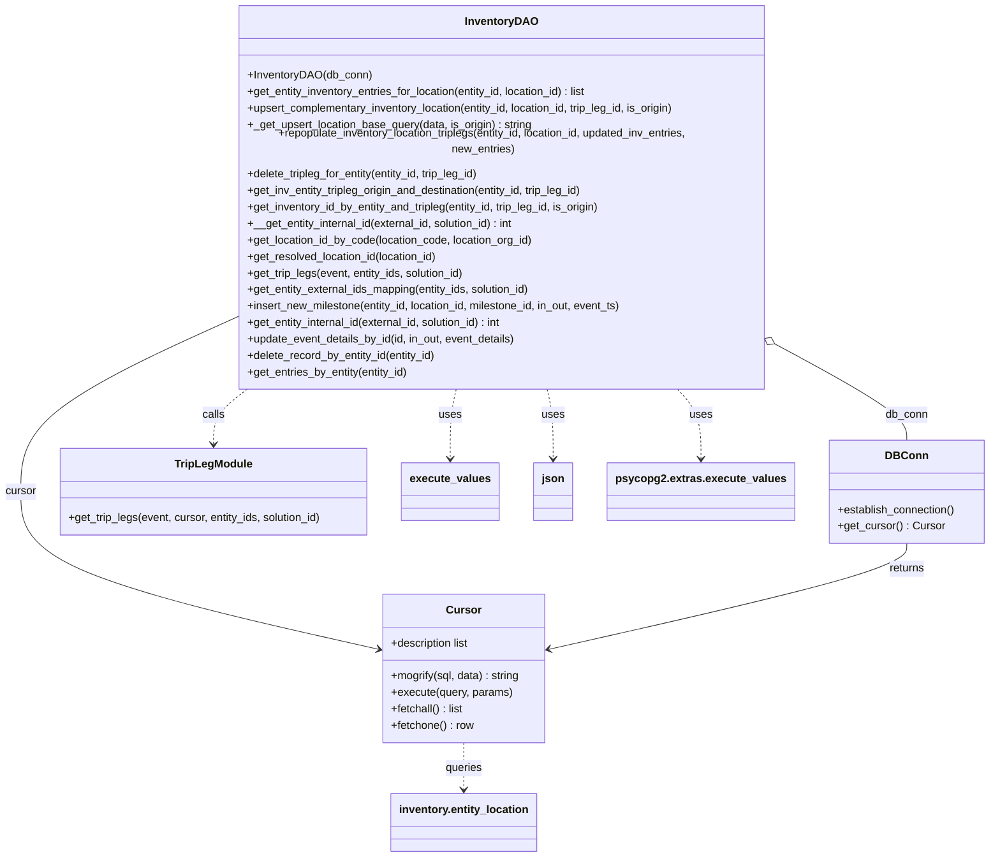
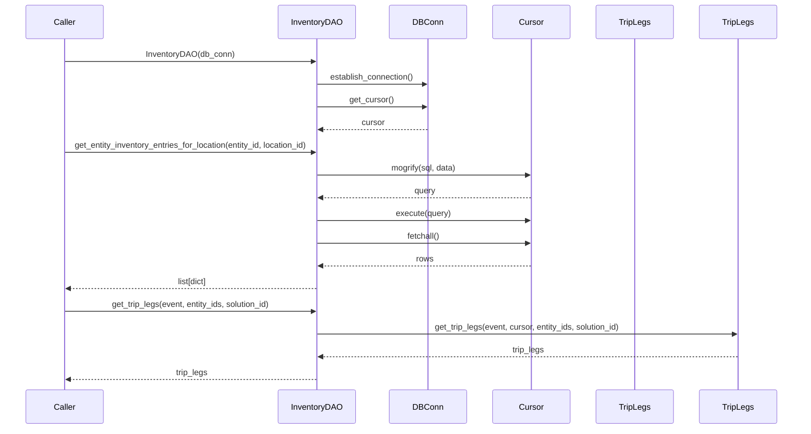

# Diagram: entity_core/entity_service/entity_inventory/entity_inventory_service/db/daos/inventory_dao.py

> Auto-generated by Obscura crawlers

## Diagram 1

### SVG

<svg id="container" width="1421.3828125" xmlns="http://www.w3.org/2000/svg" class="classDiagram" height="1222" viewBox="0 0 1421.3828125 1222" role="graphics-document document" aria-roledescription="class"><g><defs><marker id="container_class-aggregationStart" class="marker aggregation class" refX="18" refY="7" markerWidth="190" markerHeight="240" orient="auto"><path d="M 18,7 L9,13 L1,7 L9,1 Z"></path></marker></defs><defs><marker id="container_class-aggregationEnd" class="marker aggregation class" refX="1" refY="7" markerWidth="20" markerHeight="28" orient="auto"><path d="M 18,7 L9,13 L1,7 L9,1 Z"></path></marker></defs><defs><marker id="container_class-extensionStart" class="marker extension class" refX="18" refY="7" markerWidth="190" markerHeight="240" orient="auto"><path d="M 1,7 L18,13 V 1 Z"></path></marker></defs><defs><marker id="container_class-extensionEnd" class="marker extension class" refX="1" refY="7" markerWidth="20" markerHeight="28" orient="auto"><path d="M 1,1 V 13 L18,7 Z"></path></marker></defs><defs><marker id="container_class-compositionStart" class="marker composition class" refX="18" refY="7" markerWidth="190" markerHeight="240" orient="auto"><path d="M 18,7 L9,13 L1,7 L9,1 Z"></path></marker></defs><defs><marker id="container_class-compositionEnd" class="marker composition class" refX="1" refY="7" markerWidth="20" markerHeight="28" orient="auto"><path d="M 18,7 L9,13 L1,7 L9,1 Z"></path></marker></defs><defs><marker id="container_class-dependencyStart" class="marker dependency class" refX="6" refY="7" markerWidth="190" markerHeight="240" orient="auto"><path d="M 5,7 L9,13 L1,7 L9,1 Z"></path></marker></defs><defs><marker id="container_class-dependencyEnd" class="marker dependency class" refX="13" refY="7" markerWidth="20" markerHeight="28" orient="auto"><path d="M 18,7 L9,13 L14,7 L9,1 Z"></path></marker></defs><defs><marker id="container_class-lollipopStart" class="marker lollipop class" refX="13" refY="7" markerWidth="190" markerHeight="240" orient="auto"><circle stroke="black" fill="transparent" cx="7" cy="7" r="6"></circle></marker></defs><defs><marker id="container_class-lollipopEnd" class="marker lollipop class" refX="1" refY="7" markerWidth="190" markerHeight="240" orient="auto"><circle stroke="black" fill="transparent" cx="7" cy="7" r="6"></circle></marker></defs><g class="root"><g class="clusters"></g><g class="edgePaths"><path d="M1139.375,492.927L1166.23,507.272C1193.085,521.618,1246.794,550.309,1273.649,570.821C1300.504,591.333,1300.504,603.667,1300.504,609.833L1300.504,616" id="id_InventoryDAO_DBConn_1" class="edge-thickness-normal edge-pattern-solid relation" style=";;;" data-edge="true" data-et="edge" data-id="id_InventoryDAO_DBConn_1" data-points="W3sieCI6MTEyNC4xNjAxNTYyNSwieSI6NDg0Ljc5ODkzNzQ0MDc5NzN9LHsieCI6MTMwMC41MDM5MDYyNSwieSI6NTc5fSx7IngiOjEzMDAuNTAzOTA2MjUsInkiOjYxNn1d" marker-start="url(#container_class-aggregationStart)"></path><path d="M338.676,445.428L287.374,467.69C236.073,489.952,133.47,534.476,82.169,575.405C30.867,616.333,30.867,653.667,30.867,691C30.867,728.333,30.867,765.667,115.859,803.747C200.852,841.826,370.836,880.653,455.828,900.066L540.821,919.479" id="id_InventoryDAO_Cursor_2" class="edge-thickness-normal edge-pattern-solid relation" style=";;;" data-edge="true" data-et="edge" data-id="id_InventoryDAO_Cursor_2" data-points="W3sieCI6MzM4LjY3NTc4MTI1LCJ5Ijo0NDUuNDI4MjIzMzI4NzQyNDN9LHsieCI6MzAuODY3MTg3NSwieSI6NTc5fSx7IngiOjMwLjg2NzE4NzUsInkiOjY5MX0seyJ4IjozMC44NjcxODc1LCJ5Ijo4MDN9LHsieCI6NTQ2LjY2OTkyMTg3NSwieSI6OTIwLjgxNTQyNzY0MTM5NTl9XQ==" marker-end="url(#container_class-dependencyEnd)"></path><path d="M365.682,542L357.235,548.167C348.788,554.333,331.894,566.667,323.447,580C315,593.333,315,607.667,315,614.833L315,622" id="id_InventoryDAO_TripLegModule_3" class="edge-thickness-normal edge-pattern-dashed relation" style=";;;" data-edge="true" data-et="edge" data-id="id_InventoryDAO_TripLegModule_3" data-points="W3sieCI6MzY1LjY4MjQ1MDE0MzkxNDUsInkiOjU0Mn0seyJ4IjozMTUsInkiOjU3OX0seyJ4IjozMTUsInkiOjYyOH1d" marker-end="url(#container_class-dependencyEnd)"></path><path d="M667.725,542L666.254,548.167C664.783,554.333,661.841,566.667,660.37,583.5C658.898,600.333,658.898,621.667,658.898,632.333L658.898,643" id="id_InventoryDAO_execute_values_4" class="edge-thickness-normal edge-pattern-dashed relation" style=";;;" data-edge="true" data-et="edge" data-id="id_InventoryDAO_execute_values_4" data-points="W3sieCI6NjY3LjcyNDgyNzgxNjYxMTksInkiOjU0Mn0seyJ4Ijo2NTguODk4NDM3NSwieSI6NTc5fSx7IngiOjY1OC44OTg0Mzc1LCJ5Ijo2NDl9XQ==" marker-end="url(#container_class-dependencyEnd)"></path><path d="M795.111,542L796.582,548.167C798.053,554.333,800.995,566.667,802.466,583.5C803.938,600.333,803.938,621.667,803.938,632.333L803.938,643" id="id_InventoryDAO_json_5" class="edge-thickness-normal edge-pattern-dashed relation" style=";;;" data-edge="true" data-et="edge" data-id="id_InventoryDAO_json_5" data-points="W3sieCI6Nzk1LjExMTEwOTY4MzM4ODEsInkiOjU0Mn0seyJ4Ijo4MDMuOTM3NSwieSI6NTc5fSx7IngiOjgwMy45Mzc1LCJ5Ijo2NDl9XQ==" marker-end="url(#container_class-dependencyEnd)"></path><path d="M1300.504,766L1300.504,772.167C1300.504,778.333,1300.504,790.667,1215.512,816.247C1130.519,841.826,960.535,880.653,875.543,900.066L790.551,919.479" id="id_DBConn_Cursor_6" class="edge-thickness-normal edge-pattern-solid relation" style=";;;" data-edge="true" data-et="edge" data-id="id_DBConn_Cursor_6" data-points="W3sieCI6MTMwMC41MDM5MDYyNSwieSI6NzY2fSx7IngiOjEzMDAuNTAzOTA2MjUsInkiOjgwM30seyJ4Ijo3ODQuNzAxMTcxODc1LCJ5Ijo5MjAuODE1NDI3NjQxMzk1OX1d" marker-end="url(#container_class-dependencyEnd)"></path><path d="M665.686,1056L665.686,1062.167C665.686,1068.333,665.686,1080.667,665.686,1092C665.686,1103.333,665.686,1113.667,665.686,1118.833L665.686,1124" id="id_Cursor_inventory.entity_location_7" class="edge-thickness-normal edge-pattern-dashed relation" style=";;;" data-edge="true" data-et="edge" data-id="id_Cursor_inventory.entity_location_7" data-points="W3sieCI6NjY1LjY4NTU0Njg3NSwieSI6MTA1Nn0seyJ4Ijo2NjUuNjg1NTQ2ODc1LCJ5IjoxMDkzfSx7IngiOjY2NS42ODU1NDY4NzUsInkiOjExMzB9XQ==" marker-end="url(#container_class-dependencyEnd)"></path><path d="M975.641,542L981.281,548.167C986.922,554.333,998.203,566.667,1003.844,583.5C1009.484,600.333,1009.484,621.667,1009.484,632.333L1009.484,643" id="id_InventoryDAO_psycopg2.extras.execute_values_8" class="edge-thickness-normal edge-pattern-dashed relation" style=";;;" data-edge="true" data-et="edge" data-id="id_InventoryDAO_psycopg2.extras.execute_values_8" data-points="W3sieCI6OTc1LjY0MDc2NjM0NDU3MjQsInkiOjU0Mn0seyJ4IjoxMDA5LjQ4NDM3NSwieSI6NTc5fSx7IngiOjEwMDkuNDg0Mzc1LCJ5Ijo2NDl9XQ==" marker-end="url(#container_class-dependencyEnd)"></path></g><g class="edgeLabels"><g class="edgeLabel" transform="translate(1300.50390625, 579)"><g class="label" data-id="id_InventoryDAO_DBConn_1" transform="translate(-31.09375, -12)"><foreignObject width="62.1875" height="24">

db_conn

</foreignObject></g></g><g class="edgeLabel" transform="translate(30.8671875, 691)"><g class="label" data-id="id_InventoryDAO_Cursor_2" transform="translate(-22.8671875, -12)"><foreignObject width="45.734375" height="24">

cursor

</foreignObject></g></g><g class="edgeLabel" transform="translate(315, 579)"><g class="label" data-id="id_InventoryDAO_TripLegModule_3" transform="translate(-16.4453125, -12)"><foreignObject width="32.890625" height="24">

calls

</foreignObject></g></g><g class="edgeLabel" transform="translate(658.8984375, 579)"><g class="label" data-id="id_InventoryDAO_execute_values_4" transform="translate(-16.4921875, -12)"><foreignObject width="32.984375" height="24">

uses

</foreignObject></g></g><g class="edgeLabel" transform="translate(803.9375, 579)"><g class="label" data-id="id_InventoryDAO_json_5" transform="translate(-16.4921875, -12)"><foreignObject width="32.984375" height="24">

uses

</foreignObject></g></g><g class="edgeLabel" transform="translate(1300.50390625, 803)"><g class="label" data-id="id_DBConn_Cursor_6" transform="translate(-26.265625, -12)"><foreignObject width="52.53125" height="24">

returns

</foreignObject></g></g><g class="edgeLabel" transform="translate(665.685546875, 1093)"><g class="label" data-id="id_Cursor_inventory.entity_location_7" transform="translate(-27.2421875, -12)"><foreignObject width="54.484375" height="24">

queries

</foreignObject></g></g><g class="edgeLabel" transform="translate(1009.484375, 579)"><g class="label" data-id="id_InventoryDAO_psycopg2.extras.execute_values_8" transform="translate(-16.4921875, -12)"><foreignObject width="32.984375" height="24">

uses

</foreignObject></g></g></g><g class="nodes"><g class="node default" id="classId-InventoryDAO-0" transform="translate(731.41796875, 275)"><g class="basic label-container"><path d="M-392.7421875 -267 L392.7421875 -267 L392.7421875 267 L-392.7421875 267" stroke="none" stroke-width="0" fill="#ECECFF" style=""></path><path d="M-392.7421875 -267 C-132.37283346169085 -267, 127.99652057661831 -267, 392.7421875 -267 M-392.7421875 -267 C-117.51695274000787 -267, 157.70828201998427 -267, 392.7421875 -267 M392.7421875 -267 C392.7421875 -119.79903599784447, 392.7421875 27.40192800431106, 392.7421875 267 M392.7421875 -267 C392.7421875 -94.9658644723315, 392.7421875 77.068271055337, 392.7421875 267 M392.7421875 267 C167.70602173231754 267, -57.330144035364924 267, -392.7421875 267 M392.7421875 267 C152.4281315723449 267, -87.88592435531018 267, -392.7421875 267 M-392.7421875 267 C-392.7421875 146.81521471783884, -392.7421875 26.630429435677684, -392.7421875 -267 M-392.7421875 267 C-392.7421875 119.73722613944472, -392.7421875 -27.52554772111057, -392.7421875 -267" stroke="#9370DB" stroke-width="1.3" fill="none" stroke-dasharray="0 0" style=""></path></g><g class="annotation-group text" transform="translate(0, -243)"></g><g class="label-group text" transform="translate(-50.25, -243)"><g class="label" style="font-weight: bolder" transform="translate(0,-12)"><foreignObject width="100.5" height="24">

InventoryDAO

</foreignObject></g></g><g class="members-group text" transform="translate(-380.7421875, -195)"></g><g class="methods-group text" transform="translate(-380.7421875, -165)"><g class="label" style="" transform="translate(0,-12)"><foreignObject width="179.578125" height="24">

+InventoryDAO(db_conn)

</foreignObject></g><g class="label" style="" transform="translate(0,12)"><foreignObject width="508.296875" height="24">

+get_entity_inventory_entries_for_location(entity_id, location_id) : list

</foreignObject></g><g class="label" style="" transform="translate(0,36)"><foreignObject width="639.53125" height="24">

+upsert_complementary_inventory_location(entity_id, location_id, trip_leg_id, is_origin)

</foreignObject></g><g class="label" style="" transform="translate(0,60)"><foreignObject width="418.6875" height="24">

+_get_upsert_location_base_query(data, is_origin) : string

</foreignObject></g><g class="label" style="" transform="translate(0,84)"><foreignObject width="711.234375" height="24">

+repopulate_inventory_location_triplegs(entity_id, location_id, updated_inv_entries, new_entries)

</foreignObject></g><g class="label" style="" transform="translate(0,108)"><foreignObject width="346.859375" height="24">

+delete_tripleg_for_entity(entity_id, trip_leg_id)

</foreignObject></g><g class="label" style="" transform="translate(0,132)"><foreignObject width="502.453125" height="24">

+get_inv_entity_tripleg_origin_and_destination(entity_id, trip_leg_id)

</foreignObject></g><g class="label" style="" transform="translate(0,156)"><foreignObject width="525.515625" height="24">

+get_inventory_id_by_entity_and_tripleg(entity_id, trip_leg_id, is_origin)

</foreignObject></g><g class="label" style="" transform="translate(0,180)"><foreignObject width="397.453125" height="24">

+__get_entity_internal_id(external_id, solution_id) : int

</foreignObject></g><g class="label" style="" transform="translate(0,204)"><foreignObject width="422" height="24">

+get_location_id_by_code(location_code, location_org_id)

</foreignObject></g><g class="label" style="" transform="translate(0,228)"><foreignObject width="282.359375" height="24">

+get_resolved_location_id(location_id)

</foreignObject></g><g class="label" style="" transform="translate(0,252)"><foreignObject width="321.859375" height="24">

+get_trip_legs(event, entity_ids, solution_id)

</foreignObject></g><g class="label" style="" transform="translate(0,276)"><foreignObject width="420.921875" height="24">

+get_entity_external_ids_mapping(entity_ids, solution_id)

</foreignObject></g><g class="label" style="" transform="translate(0,300)"><foreignObject width="558.078125" height="24">

+insert_new_milestone(entity_id, location_id, milestone_id, in_out, event_ts)

</foreignObject></g><g class="label" style="" transform="translate(0,324)"><foreignObject width="382.109375" height="24">

+get_entity_internal_id(external_id, solution_id) : int

</foreignObject></g><g class="label" style="" transform="translate(0,348)"><foreignObject width="396.5625" height="24">

+update_event_details_by_id(id, in_out, event_details)

</foreignObject></g><g class="label" style="" transform="translate(0,372)"><foreignObject width="279.484375" height="24">

+delete_record_by_entity_id(entity_id)

</foreignObject></g><g class="label" style="" transform="translate(0,396)"><foreignObject width="238.328125" height="24">

+get_entries_by_entity(entity_id)

</foreignObject></g></g><g class="divider" style=""><path d="M-392.7421875 -219 C-152.49962124573537 -219, 87.74294500852926 -219, 392.7421875 -219 M-392.7421875 -219 C-200.32933187173612 -219, -7.916476243472232 -219, 392.7421875 -219" stroke="#9370DB" stroke-width="1.3" fill="none" stroke-dasharray="0 0" style=""></path></g><g class="divider" style=""><path d="M-392.7421875 -195 C-196.62851314793858 -195, -0.5148387958771536 -195, 392.7421875 -195 M-392.7421875 -195 C-207.48346743676137 -195, -22.224747373522746 -195, 392.7421875 -195" stroke="#9370DB" stroke-width="1.3" fill="none" stroke-dasharray="0 0" style=""></path></g></g><g class="node default" id="classId-DBConn-1" transform="translate(1300.50390625, 691)"><g class="basic label-container"><path d="M-112.87890625 -75 L112.87890625 -75 L112.87890625 75 L-112.87890625 75" stroke="none" stroke-width="0" fill="#ECECFF" style=""></path><path d="M-112.87890625 -75 C-47.44836560427247 -75, 17.982175041455065 -75, 112.87890625 -75 M-112.87890625 -75 C-43.5525573401403 -75, 25.773791569719407 -75, 112.87890625 -75 M112.87890625 -75 C112.87890625 -39.76518349117541, 112.87890625 -4.530366982350813, 112.87890625 75 M112.87890625 -75 C112.87890625 -31.456469353438756, 112.87890625 12.087061293122488, 112.87890625 75 M112.87890625 75 C51.11594183918764 75, -10.647022571624717 75, -112.87890625 75 M112.87890625 75 C58.79045493422673 75, 4.70200361845346 75, -112.87890625 75 M-112.87890625 75 C-112.87890625 19.140796053777578, -112.87890625 -36.718407892444844, -112.87890625 -75 M-112.87890625 75 C-112.87890625 26.301658626521466, -112.87890625 -22.39668274695707, -112.87890625 -75" stroke="#9370DB" stroke-width="1.3" fill="none" stroke-dasharray="0 0" style=""></path></g><g class="annotation-group text" transform="translate(0, -51)"></g><g class="label-group text" transform="translate(-28.4921875, -51)"><g class="label" style="font-weight: bolder" transform="translate(0,-12)"><foreignObject width="56.984375" height="24">

DBConn

</foreignObject></g></g><g class="members-group text" transform="translate(-100.87890625, -3)"></g><g class="methods-group text" transform="translate(-100.87890625, 27)"><g class="label" style="" transform="translate(0,-12)"><foreignObject width="173.265625" height="24">

+establish_connection()

</foreignObject></g><g class="label" style="" transform="translate(0,12)"><foreignObject width="153.890625" height="24">

+get_cursor() : Cursor

</foreignObject></g></g><g class="divider" style=""><path d="M-112.87890625 -27 C-42.08932189143573 -27, 28.70026246712854 -27, 112.87890625 -27 M-112.87890625 -27 C-24.448659185205614 -27, 63.98158787958877 -27, 112.87890625 -27" stroke="#9370DB" stroke-width="1.3" fill="none" stroke-dasharray="0 0" style=""></path></g><g class="divider" style=""><path d="M-112.87890625 -3 C-33.36651838335709 -3, 46.14586948328582 -3, 112.87890625 -3 M-112.87890625 -3 C-65.9198501824302 -3, -18.96079411486039 -3, 112.87890625 -3" stroke="#9370DB" stroke-width="1.3" fill="none" stroke-dasharray="0 0" style=""></path></g></g><g class="node default" id="classId-Cursor-2" transform="translate(665.685546875, 948)"><g class="basic label-container"><path d="M-119.015625 -108 L119.015625 -108 L119.015625 108 L-119.015625 108" stroke="none" stroke-width="0" fill="#ECECFF" style=""></path><path d="M-119.015625 -108 C-56.99859826401745 -108, 5.018428471965095 -108, 119.015625 -108 M-119.015625 -108 C-53.46691207359271 -108, 12.081800852814581 -108, 119.015625 -108 M119.015625 -108 C119.015625 -24.49324136336935, 119.015625 59.0135172732613, 119.015625 108 M119.015625 -108 C119.015625 -34.71921634356367, 119.015625 38.561567312872654, 119.015625 108 M119.015625 108 C25.59725402102852 108, -67.82111695794296 108, -119.015625 108 M119.015625 108 C64.1430185373114 108, 9.270412074622811 108, -119.015625 108 M-119.015625 108 C-119.015625 49.11838795359657, -119.015625 -9.763224092806865, -119.015625 -108 M-119.015625 108 C-119.015625 27.739117709464622, -119.015625 -52.521764581070755, -119.015625 -108" stroke="#9370DB" stroke-width="1.3" fill="none" stroke-dasharray="0 0" style=""></path></g><g class="annotation-group text" transform="translate(0, -84)"></g><g class="label-group text" transform="translate(-23.90625, -84)"><g class="label" style="font-weight: bolder" transform="translate(0,-12)"><foreignObject width="47.8125" height="24">

Cursor

</foreignObject></g></g><g class="members-group text" transform="translate(-107.015625, -36)"><g class="label" style="" transform="translate(0,-12)"><foreignObject width="117.28125" height="24">

+description list

</foreignObject></g></g><g class="methods-group text" transform="translate(-107.015625, 12)"><g class="label" style="" transform="translate(0,-12)"><foreignObject width="190.125" height="24">

+mogrify(sql, data) : string

</foreignObject></g><g class="label" style="" transform="translate(0,12)"><foreignObject width="176.96875" height="24">

+execute(query, params)

</foreignObject></g><g class="label" style="" transform="translate(0,36)"><foreignObject width="107.28125" height="24">

+fetchall() : list

</foreignObject></g><g class="label" style="" transform="translate(0,60)"><foreignObject width="120.875" height="24">

+fetchone() : row

</foreignObject></g></g><g class="divider" style=""><path d="M-119.015625 -60 C-71.39973309032692 -60, -23.783841180653823 -60, 119.015625 -60 M-119.015625 -60 C-61.203915516200205 -60, -3.3922060324004093 -60, 119.015625 -60" stroke="#9370DB" stroke-width="1.3" fill="none" stroke-dasharray="0 0" style=""></path></g><g class="divider" style=""><path d="M-119.015625 -12 C-64.33337111781816 -12, -9.65111723563632 -12, 119.015625 -12 M-119.015625 -12 C-25.87937624245842 -12, 67.25687251508316 -12, 119.015625 -12" stroke="#9370DB" stroke-width="1.3" fill="none" stroke-dasharray="0 0" style=""></path></g></g><g class="node default" id="classId-TripLegModule-3" transform="translate(315, 691)"><g class="basic label-container"><path d="M-226.265625 -63 L226.265625 -63 L226.265625 63 L-226.265625 63" stroke="none" stroke-width="0" fill="#ECECFF" style=""></path><path d="M-226.265625 -63 C-83.27633300778481 -63, 59.71295898443037 -63, 226.265625 -63 M-226.265625 -63 C-131.95896664121366 -63, -37.65230828242733 -63, 226.265625 -63 M226.265625 -63 C226.265625 -24.326406973084033, 226.265625 14.347186053831933, 226.265625 63 M226.265625 -63 C226.265625 -17.152858870982833, 226.265625 28.694282258034335, 226.265625 63 M226.265625 63 C115.0492315952624 63, 3.8328381905247966 63, -226.265625 63 M226.265625 63 C57.09214676164453 63, -112.08133147671094 63, -226.265625 63 M-226.265625 63 C-226.265625 25.23105846058546, -226.265625 -12.537883078829083, -226.265625 -63 M-226.265625 63 C-226.265625 27.788079800360713, -226.265625 -7.423840399278575, -226.265625 -63" stroke="#9370DB" stroke-width="1.3" fill="none" stroke-dasharray="0 0" style=""></path></g><g class="annotation-group text" transform="translate(0, -39)"></g><g class="label-group text" transform="translate(-54.140625, -39)"><g class="label" style="font-weight: bolder" transform="translate(0,-12)"><foreignObject width="108.28125" height="24">

TripLegModule

</foreignObject></g></g><g class="members-group text" transform="translate(-214.265625, 9)"></g><g class="methods-group text" transform="translate(-214.265625, 39)"><g class="label" style="" transform="translate(0,-12)"><foreignObject width="374.390625" height="24">

+get_trip_legs(event, cursor, entity_ids, solution_id)

</foreignObject></g></g><g class="divider" style=""><path d="M-226.265625 -15 C-105.49300756076649 -15, 15.279609878467028 -15, 226.265625 -15 M-226.265625 -15 C-79.11294732734439 -15, 68.03973034531123 -15, 226.265625 -15" stroke="#9370DB" stroke-width="1.3" fill="none" stroke-dasharray="0 0" style=""></path></g><g class="divider" style=""><path d="M-226.265625 9 C-120.07953581477997 9, -13.893446629559946 9, 226.265625 9 M-226.265625 9 C-122.1263615734099 9, -17.98709814681979 9, 226.265625 9" stroke="#9370DB" stroke-width="1.3" fill="none" stroke-dasharray="0 0" style=""></path></g></g><g class="node default" id="classId-execute_values-4" transform="translate(658.8984375, 691)"><g class="basic label-container"><path d="M-67.6328125 -42 L67.6328125 -42 L67.6328125 42 L-67.6328125 42" stroke="none" stroke-width="0" fill="#ECECFF" style=""></path><path d="M-67.6328125 -42 C-20.36264107959945 -42, 26.907530340801102 -42, 67.6328125 -42 M-67.6328125 -42 C-17.878865310539034 -42, 31.875081878921932 -42, 67.6328125 -42 M67.6328125 -42 C67.6328125 -18.199652389546372, 67.6328125 5.600695220907255, 67.6328125 42 M67.6328125 -42 C67.6328125 -23.90084292412218, 67.6328125 -5.801685848244361, 67.6328125 42 M67.6328125 42 C40.02180979273561 42, 12.410807085471212 42, -67.6328125 42 M67.6328125 42 C38.87858801525566 42, 10.12436353051131 42, -67.6328125 42 M-67.6328125 42 C-67.6328125 14.357818567357512, -67.6328125 -13.284362865284976, -67.6328125 -42 M-67.6328125 42 C-67.6328125 17.758956131092102, -67.6328125 -6.482087737815796, -67.6328125 -42" stroke="#9370DB" stroke-width="1.3" fill="none" stroke-dasharray="0 0" style=""></path></g><g class="annotation-group text" transform="translate(0, -18)"></g><g class="label-group text" transform="translate(-55.6328125, -18)"><g class="label" style="font-weight: bolder" transform="translate(0,-12)"><foreignObject width="111.265625" height="24">

execute_values

</foreignObject></g></g><g class="members-group text" transform="translate(-55.6328125, 30)"></g><g class="methods-group text" transform="translate(-55.6328125, 60)"></g><g class="divider" style=""><path d="M-67.6328125 6 C-37.661942211345064 6, -7.691071922690121 6, 67.6328125 6 M-67.6328125 6 C-37.72533741402091 6, -7.8178623280418265 6, 67.6328125 6" stroke="#9370DB" stroke-width="1.3" fill="none" stroke-dasharray="0 0" style=""></path></g><g class="divider" style=""><path d="M-67.6328125 24 C-35.17950249489539 24, -2.726192489790776 24, 67.6328125 24 M-67.6328125 24 C-26.5858593168712 24, 14.461093866257599 24, 67.6328125 24" stroke="#9370DB" stroke-width="1.3" fill="none" stroke-dasharray="0 0" style=""></path></g></g><g class="node default" id="classId-json-5" transform="translate(803.9375, 691)"><g class="basic label-container"><path d="M-27.40625 -42 L27.40625 -42 L27.40625 42 L-27.40625 42" stroke="none" stroke-width="0" fill="#ECECFF" style=""></path><path d="M-27.40625 -42 C-7.516805881765961 -42, 12.372638236468077 -42, 27.40625 -42 M-27.40625 -42 C-15.23052013938702 -42, -3.054790278774039 -42, 27.40625 -42 M27.40625 -42 C27.40625 -18.475462201101962, 27.40625 5.049075597796076, 27.40625 42 M27.40625 -42 C27.40625 -11.049886907227538, 27.40625 19.900226185544923, 27.40625 42 M27.40625 42 C8.458398132241989 42, -10.489453735516022 42, -27.40625 42 M27.40625 42 C7.296058654890285 42, -12.81413269021943 42, -27.40625 42 M-27.40625 42 C-27.40625 23.57668215691112, -27.40625 5.153364313822237, -27.40625 -42 M-27.40625 42 C-27.40625 13.262298524189355, -27.40625 -15.475402951621291, -27.40625 -42" stroke="#9370DB" stroke-width="1.3" fill="none" stroke-dasharray="0 0" style=""></path></g><g class="annotation-group text" transform="translate(0, -18)"></g><g class="label-group text" transform="translate(-15.40625, -18)"><g class="label" style="font-weight: bolder" transform="translate(0,-12)"><foreignObject width="30.8125" height="24">

json

</foreignObject></g></g><g class="members-group text" transform="translate(-15.40625, 30)"></g><g class="methods-group text" transform="translate(-15.40625, 60)"></g><g class="divider" style=""><path d="M-27.40625 6 C-12.903908156509207 6, 1.5984336869815863 6, 27.40625 6 M-27.40625 6 C-7.292640657534854 6, 12.820968684930293 6, 27.40625 6" stroke="#9370DB" stroke-width="1.3" fill="none" stroke-dasharray="0 0" style=""></path></g><g class="divider" style=""><path d="M-27.40625 24 C-9.387447521036563 24, 8.631354957926874 24, 27.40625 24 M-27.40625 24 C-8.9744602673672 24, 9.457329465265602 24, 27.40625 24" stroke="#9370DB" stroke-width="1.3" fill="none" stroke-dasharray="0 0" style=""></path></g></g><g class="node default" id="classId-inventory.entity_location-6" transform="translate(665.685546875, 1172)"><g class="basic label-container"><path d="M-103.5703125 -42 L103.5703125 -42 L103.5703125 42 L-103.5703125 42" stroke="none" stroke-width="0" fill="#ECECFF" style=""></path><path d="M-103.5703125 -42 C-38.85636205975456 -42, 25.85758838049088 -42, 103.5703125 -42 M-103.5703125 -42 C-50.61558192114061 -42, 2.3391486577187806 -42, 103.5703125 -42 M103.5703125 -42 C103.5703125 -21.813791739621674, 103.5703125 -1.6275834792433486, 103.5703125 42 M103.5703125 -42 C103.5703125 -10.683940459722336, 103.5703125 20.632119080555327, 103.5703125 42 M103.5703125 42 C40.24979561817042 42, -23.070721263659166 42, -103.5703125 42 M103.5703125 42 C35.67855983057552 42, -32.213192838848954 42, -103.5703125 42 M-103.5703125 42 C-103.5703125 18.93639346873649, -103.5703125 -4.127213062527019, -103.5703125 -42 M-103.5703125 42 C-103.5703125 18.009300712226462, -103.5703125 -5.981398575547075, -103.5703125 -42" stroke="#9370DB" stroke-width="1.3" fill="none" stroke-dasharray="0 0" style=""></path></g><g class="annotation-group text" transform="translate(0, -18)"></g><g class="label-group text" transform="translate(-91.5703125, -18)"><g class="label" style="font-weight: bolder" transform="translate(0,-12)"><foreignObject width="183.140625" height="24">

inventory.entity_location

</foreignObject></g></g><g class="members-group text" transform="translate(-91.5703125, 30)"></g><g class="methods-group text" transform="translate(-91.5703125, 60)"></g><g class="divider" style=""><path d="M-103.5703125 6 C-35.688955703226725 6, 32.19240109354655 6, 103.5703125 6 M-103.5703125 6 C-56.982497210597536 6, -10.394681921195073 6, 103.5703125 6" stroke="#9370DB" stroke-width="1.3" fill="none" stroke-dasharray="0 0" style=""></path></g><g class="divider" style=""><path d="M-103.5703125 24 C-27.42017261302128 24, 48.72996727395744 24, 103.5703125 24 M-103.5703125 24 C-28.462467039844526 24, 46.64537842031095 24, 103.5703125 24" stroke="#9370DB" stroke-width="1.3" fill="none" stroke-dasharray="0 0" style=""></path></g></g><g class="node default" id="classId-psycopg2.extras.execute_values-7" transform="translate(1009.484375, 691)"><g class="basic label-container"><path d="M-128.140625 -42 L128.140625 -42 L128.140625 42 L-128.140625 42" stroke="none" stroke-width="0" fill="#ECECFF" style=""></path><path d="M-128.140625 -42 C-32.15322924333557 -42, 63.83416651332885 -42, 128.140625 -42 M-128.140625 -42 C-53.05462044418934 -42, 22.03138411162132 -42, 128.140625 -42 M128.140625 -42 C128.140625 -13.280944257503798, 128.140625 15.438111484992405, 128.140625 42 M128.140625 -42 C128.140625 -17.542622412642313, 128.140625 6.914755174715374, 128.140625 42 M128.140625 42 C47.99138207095882 42, -32.15786085808236 42, -128.140625 42 M128.140625 42 C40.47984331835893 42, -47.18093836328214 42, -128.140625 42 M-128.140625 42 C-128.140625 13.605979763994732, -128.140625 -14.788040472010536, -128.140625 -42 M-128.140625 42 C-128.140625 19.530435571092646, -128.140625 -2.9391288578147083, -128.140625 -42" stroke="#9370DB" stroke-width="1.3" fill="none" stroke-dasharray="0 0" style=""></path></g><g class="annotation-group text" transform="translate(0, -18)"></g><g class="label-group text" transform="translate(-116.140625, -18)"><g class="label" style="font-weight: bolder" transform="translate(0,-12)"><foreignObject width="232.28125" height="24">

psycopg2.extras.execute_values

</foreignObject></g></g><g class="members-group text" transform="translate(-116.140625, 30)"></g><g class="methods-group text" transform="translate(-116.140625, 60)"></g><g class="divider" style=""><path d="M-128.140625 6 C-52.73178031152216 6, 22.677064376955684 6, 128.140625 6 M-128.140625 6 C-50.457538335588836 6, 27.225548328822327 6, 128.140625 6" stroke="#9370DB" stroke-width="1.3" fill="none" stroke-dasharray="0 0" style=""></path></g><g class="divider" style=""><path d="M-128.140625 24 C-56.611248751213566 24, 14.918127497572868 24, 128.140625 24 M-128.140625 24 C-48.389909843425386 24, 31.36080531314923 24, 128.140625 24" stroke="#9370DB" stroke-width="1.3" fill="none" stroke-dasharray="0 0" style=""></path></g></g></g></g></g></svg>

## Diagram 2

### SVG

<svg id="container" width="1621" xmlns="http://www.w3.org/2000/svg" height="891" viewBox="-50 -10 1621 891" role="graphics-document document" aria-roledescription="sequence"><g><rect x="1371" y="805" fill="#eaeaea" stroke="#666" width="150" height="65" name="TripLegs" rx="3" ry="3" class="actor actor-bottom"></rect><text x="1446" y="837.5" dominant-baseline="central" alignment-baseline="central" class="actor actor-box" style="text-anchor: middle; font-size: 16px; font-weight: 400;"><tspan x="1446" dy="0">TripLegs</tspan></text></g><g><rect x="1171" y="805" fill="#eaeaea" stroke="#666" width="150" height="65" name="TripLegModule" rx="3" ry="3" class="actor actor-bottom"></rect><text x="1246" y="837.5" dominant-baseline="central" alignment-baseline="central" class="actor actor-box" style="text-anchor: middle; font-size: 16px; font-weight: 400;"><tspan x="1246" dy="0">TripLegs</tspan></text></g><g><rect x="971" y="805" fill="#eaeaea" stroke="#666" width="150" height="65" name="Cursor" rx="3" ry="3" class="actor actor-bottom"></rect><text x="1046" y="837.5" dominant-baseline="central" alignment-baseline="central" class="actor actor-box" style="text-anchor: middle; font-size: 16px; font-weight: 400;"><tspan x="1046" dy="0">Cursor</tspan></text></g><g><rect x="771" y="805" fill="#eaeaea" stroke="#666" width="150" height="65" name="DBConn" rx="3" ry="3" class="actor actor-bottom"></rect><text x="846" y="837.5" dominant-baseline="central" alignment-baseline="central" class="actor actor-box" style="text-anchor: middle; font-size: 16px; font-weight: 400;"><tspan x="846" dy="0">DBConn</tspan></text></g><g><rect x="536" y="805" fill="#eaeaea" stroke="#666" width="150" height="65" name="InventoryDAO" rx="3" ry="3" class="actor actor-bottom"></rect><text x="611" y="837.5" dominant-baseline="central" alignment-baseline="central" class="actor actor-box" style="text-anchor: middle; font-size: 16px; font-weight: 400;"><tspan x="611" dy="0">InventoryDAO</tspan></text></g><g><rect x="0" y="805" fill="#eaeaea" stroke="#666" width="150" height="65" name="Caller" rx="3" ry="3" class="actor actor-bottom"></rect><text x="75" y="837.5" dominant-baseline="central" alignment-baseline="central" class="actor actor-box" style="text-anchor: middle; font-size: 16px; font-weight: 400;"><tspan x="75" dy="0">Caller</tspan></text></g><g><line id="actor5" x1="1446" y1="65" x2="1446" y2="805" class="actor-line 200" stroke-width="0.5px" stroke="#999" name="TripLegs"></line><g id="root-5"><rect x="1371" y="0" fill="#eaeaea" stroke="#666" width="150" height="65" name="TripLegs" rx="3" ry="3" class="actor actor-top"></rect><text x="1446" y="32.5" dominant-baseline="central" alignment-baseline="central" class="actor actor-box" style="text-anchor: middle; font-size: 16px; font-weight: 400;"><tspan x="1446" dy="0">TripLegs</tspan></text></g></g><g><line id="actor4" x1="1246" y1="65" x2="1246" y2="805" class="actor-line 200" stroke-width="0.5px" stroke="#999" name="TripLegModule"></line><g id="root-4"><rect x="1171" y="0" fill="#eaeaea" stroke="#666" width="150" height="65" name="TripLegModule" rx="3" ry="3" class="actor actor-top"></rect><text x="1246" y="32.5" dominant-baseline="central" alignment-baseline="central" class="actor actor-box" style="text-anchor: middle; font-size: 16px; font-weight: 400;"><tspan x="1246" dy="0">TripLegs</tspan></text></g></g><g><line id="actor3" x1="1046" y1="65" x2="1046" y2="805" class="actor-line 200" stroke-width="0.5px" stroke="#999" name="Cursor"></line><g id="root-3"><rect x="971" y="0" fill="#eaeaea" stroke="#666" width="150" height="65" name="Cursor" rx="3" ry="3" class="actor actor-top"></rect><text x="1046" y="32.5" dominant-baseline="central" alignment-baseline="central" class="actor actor-box" style="text-anchor: middle; font-size: 16px; font-weight: 400;"><tspan x="1046" dy="0">Cursor</tspan></text></g></g><g><line id="actor2" x1="846" y1="65" x2="846" y2="805" class="actor-line 200" stroke-width="0.5px" stroke="#999" name="DBConn"></line><g id="root-2"><rect x="771" y="0" fill="#eaeaea" stroke="#666" width="150" height="65" name="DBConn" rx="3" ry="3" class="actor actor-top"></rect><text x="846" y="32.5" dominant-baseline="central" alignment-baseline="central" class="actor actor-box" style="text-anchor: middle; font-size: 16px; font-weight: 400;"><tspan x="846" dy="0">DBConn</tspan></text></g></g><g><line id="actor1" x1="611" y1="65" x2="611" y2="805" class="actor-line 200" stroke-width="0.5px" stroke="#999" name="InventoryDAO"></line><g id="root-1"><rect x="536" y="0" fill="#eaeaea" stroke="#666" width="150" height="65" name="InventoryDAO" rx="3" ry="3" class="actor actor-top"></rect><text x="611" y="32.5" dominant-baseline="central" alignment-baseline="central" class="actor actor-box" style="text-anchor: middle; font-size: 16px; font-weight: 400;"><tspan x="611" dy="0">InventoryDAO</tspan></text></g></g><g><line id="actor0" x1="75" y1="65" x2="75" y2="805" class="actor-line 200" stroke-width="0.5px" stroke="#999" name="Caller"></line><g id="root-0"><rect x="0" y="0" fill="#eaeaea" stroke="#666" width="150" height="65" name="Caller" rx="3" ry="3" class="actor actor-top"></rect><text x="75" y="32.5" dominant-baseline="central" alignment-baseline="central" class="actor actor-box" style="text-anchor: middle; font-size: 16px; font-weight: 400;"><tspan x="75" dy="0">Caller</tspan></text></g></g><g></g><defs><symbol id="computer" width="24" height="24"><path transform="scale(.5)" d="M2 2v13h20v-13h-20zm18 11h-16v-9h16v9zm-10.228 6l.466-1h3.524l.467 1h-4.457zm14.228 3h-24l2-6h2.104l-1.33 4h18.45l-1.297-4h2.073l2 6zm-5-10h-14v-7h14v7z"></path></symbol></defs><defs><symbol id="database" fill-rule="evenodd" clip-rule="evenodd"><path transform="scale(.5)" d="M12.258.001l.256.004.255.005.253.008.251.01.249.012.247.015.246.016.242.019.241.02.239.023.236.024.233.027.231.028.229.031.225.032.223.034.22.036.217.038.214.04.211.041.208.043.205.045.201.046.198.048.194.05.191.051.187.053.183.054.18.056.175.057.172.059.168.06.163.061.16.063.155.064.15.066.074.033.073.033.071.034.07.034.069.035.068.035.067.035.066.035.064.036.064.036.062.036.06.036.06.037.058.037.058.037.055.038.055.038.053.038.052.038.051.039.05.039.048.039.047.039.045.04.044.04.043.04.041.04.04.041.039.041.037.041.036.041.034.041.033.042.032.042.03.042.029.042.027.042.026.043.024.043.023.043.021.043.02.043.018.044.017.043.015.044.013.044.012.044.011.045.009.044.007.045.006.045.004.045.002.045.001.045v17l-.001.045-.002.045-.004.045-.006.045-.007.045-.009.044-.011.045-.012.044-.013.044-.015.044-.017.043-.018.044-.02.043-.021.043-.023.043-.024.043-.026.043-.027.042-.029.042-.03.042-.032.042-.033.042-.034.041-.036.041-.037.041-.039.041-.04.041-.041.04-.043.04-.044.04-.045.04-.047.039-.048.039-.05.039-.051.039-.052.038-.053.038-.055.038-.055.038-.058.037-.058.037-.06.037-.06.036-.062.036-.064.036-.064.036-.066.035-.067.035-.068.035-.069.035-.07.034-.071.034-.073.033-.074.033-.15.066-.155.064-.16.063-.163.061-.168.06-.172.059-.175.057-.18.056-.183.054-.187.053-.191.051-.194.05-.198.048-.201.046-.205.045-.208.043-.211.041-.214.04-.217.038-.22.036-.223.034-.225.032-.229.031-.231.028-.233.027-.236.024-.239.023-.241.02-.242.019-.246.016-.247.015-.249.012-.251.01-.253.008-.255.005-.256.004-.258.001-.258-.001-.256-.004-.255-.005-.253-.008-.251-.01-.249-.012-.247-.015-.245-.016-.243-.019-.241-.02-.238-.023-.236-.024-.234-.027-.231-.028-.228-.031-.226-.032-.223-.034-.22-.036-.217-.038-.214-.04-.211-.041-.208-.043-.204-.045-.201-.046-.198-.048-.195-.05-.19-.051-.187-.053-.184-.054-.179-.056-.176-.057-.172-.059-.167-.06-.164-.061-.159-.063-.155-.064-.151-.066-.074-.033-.072-.033-.072-.034-.07-.034-.069-.035-.068-.035-.067-.035-.066-.035-.064-.036-.063-.036-.062-.036-.061-.036-.06-.037-.058-.037-.057-.037-.056-.038-.055-.038-.053-.038-.052-.038-.051-.039-.049-.039-.049-.039-.046-.039-.046-.04-.044-.04-.043-.04-.041-.04-.04-.041-.039-.041-.037-.041-.036-.041-.034-.041-.033-.042-.032-.042-.03-.042-.029-.042-.027-.042-.026-.043-.024-.043-.023-.043-.021-.043-.02-.043-.018-.044-.017-.043-.015-.044-.013-.044-.012-.044-.011-.045-.009-.044-.007-.045-.006-.045-.004-.045-.002-.045-.001-.045v-17l.001-.045.002-.045.004-.045.006-.045.007-.045.009-.044.011-.045.012-.044.013-.044.015-.044.017-.043.018-.044.02-.043.021-.043.023-.043.024-.043.026-.043.027-.042.029-.042.03-.042.032-.042.033-.042.034-.041.036-.041.037-.041.039-.041.04-.041.041-.04.043-.04.044-.04.046-.04.046-.039.049-.039.049-.039.051-.039.052-.038.053-.038.055-.038.056-.038.057-.037.058-.037.06-.037.061-.036.062-.036.063-.036.064-.036.066-.035.067-.035.068-.035.069-.035.07-.034.072-.034.072-.033.074-.033.151-.066.155-.064.159-.063.164-.061.167-.06.172-.059.176-.057.179-.056.184-.054.187-.053.19-.051.195-.05.198-.048.201-.046.204-.045.208-.043.211-.041.214-.04.217-.038.22-.036.223-.034.226-.032.228-.031.231-.028.234-.027.236-.024.238-.023.241-.02.243-.019.245-.016.247-.015.249-.012.251-.01.253-.008.255-.005.256-.004.258-.001.258.001zm-9.258 20.499v.01l.001.021.003.021.004.022.005.021.006.022.007.022.009.023.01.022.011.023.012.023.013.023.015.023.016.024.017.023.018.024.019.024.021.024.022.025.023.024.024.025.052.049.056.05.061.051.066.051.07.051.075.051.079.052.084.052.088.052.092.052.097.052.102.051.105.052.11.052.114.051.119.051.123.051.127.05.131.05.135.05.139.048.144.049.147.047.152.047.155.047.16.045.163.045.167.043.171.043.176.041.178.041.183.039.187.039.19.037.194.035.197.035.202.033.204.031.209.03.212.029.216.027.219.025.222.024.226.021.23.02.233.018.236.016.24.015.243.012.246.01.249.008.253.005.256.004.259.001.26-.001.257-.004.254-.005.25-.008.247-.011.244-.012.241-.014.237-.016.233-.018.231-.021.226-.021.224-.024.22-.026.216-.027.212-.028.21-.031.205-.031.202-.034.198-.034.194-.036.191-.037.187-.039.183-.04.179-.04.175-.042.172-.043.168-.044.163-.045.16-.046.155-.046.152-.047.148-.048.143-.049.139-.049.136-.05.131-.05.126-.05.123-.051.118-.052.114-.051.11-.052.106-.052.101-.052.096-.052.092-.052.088-.053.083-.051.079-.052.074-.052.07-.051.065-.051.06-.051.056-.05.051-.05.023-.024.023-.025.021-.024.02-.024.019-.024.018-.024.017-.024.015-.023.014-.024.013-.023.012-.023.01-.023.01-.022.008-.022.006-.022.006-.022.004-.022.004-.021.001-.021.001-.021v-4.127l-.077.055-.08.053-.083.054-.085.053-.087.052-.09.052-.093.051-.095.05-.097.05-.1.049-.102.049-.105.048-.106.047-.109.047-.111.046-.114.045-.115.045-.118.044-.12.043-.122.042-.124.042-.126.041-.128.04-.13.04-.132.038-.134.038-.135.037-.138.037-.139.035-.142.035-.143.034-.144.033-.147.032-.148.031-.15.03-.151.03-.153.029-.154.027-.156.027-.158.026-.159.025-.161.024-.162.023-.163.022-.165.021-.166.02-.167.019-.169.018-.169.017-.171.016-.173.015-.173.014-.175.013-.175.012-.177.011-.178.01-.179.008-.179.008-.181.006-.182.005-.182.004-.184.003-.184.002h-.37l-.184-.002-.184-.003-.182-.004-.182-.005-.181-.006-.179-.008-.179-.008-.178-.01-.176-.011-.176-.012-.175-.013-.173-.014-.172-.015-.171-.016-.17-.017-.169-.018-.167-.019-.166-.02-.165-.021-.163-.022-.162-.023-.161-.024-.159-.025-.157-.026-.156-.027-.155-.027-.153-.029-.151-.03-.15-.03-.148-.031-.146-.032-.145-.033-.143-.034-.141-.035-.14-.035-.137-.037-.136-.037-.134-.038-.132-.038-.13-.04-.128-.04-.126-.041-.124-.042-.122-.042-.12-.044-.117-.043-.116-.045-.113-.045-.112-.046-.109-.047-.106-.047-.105-.048-.102-.049-.1-.049-.097-.05-.095-.05-.093-.052-.09-.051-.087-.052-.085-.053-.083-.054-.08-.054-.077-.054v4.127zm0-5.654v.011l.001.021.003.021.004.021.005.022.006.022.007.022.009.022.01.022.011.023.012.023.013.023.015.024.016.023.017.024.018.024.019.024.021.024.022.024.023.025.024.024.052.05.056.05.061.05.066.051.07.051.075.052.079.051.084.052.088.052.092.052.097.052.102.052.105.052.11.051.114.051.119.052.123.05.127.051.131.05.135.049.139.049.144.048.147.048.152.047.155.046.16.045.163.045.167.044.171.042.176.042.178.04.183.04.187.038.19.037.194.036.197.034.202.033.204.032.209.03.212.028.216.027.219.025.222.024.226.022.23.02.233.018.236.016.24.014.243.012.246.01.249.008.253.006.256.003.259.001.26-.001.257-.003.254-.006.25-.008.247-.01.244-.012.241-.015.237-.016.233-.018.231-.02.226-.022.224-.024.22-.025.216-.027.212-.029.21-.03.205-.032.202-.033.198-.035.194-.036.191-.037.187-.039.183-.039.179-.041.175-.042.172-.043.168-.044.163-.045.16-.045.155-.047.152-.047.148-.048.143-.048.139-.05.136-.049.131-.05.126-.051.123-.051.118-.051.114-.052.11-.052.106-.052.101-.052.096-.052.092-.052.088-.052.083-.052.079-.052.074-.051.07-.052.065-.051.06-.05.056-.051.051-.049.023-.025.023-.024.021-.025.02-.024.019-.024.018-.024.017-.024.015-.023.014-.023.013-.024.012-.022.01-.023.01-.023.008-.022.006-.022.006-.022.004-.021.004-.022.001-.021.001-.021v-4.139l-.077.054-.08.054-.083.054-.085.052-.087.053-.09.051-.093.051-.095.051-.097.05-.1.049-.102.049-.105.048-.106.047-.109.047-.111.046-.114.045-.115.044-.118.044-.12.044-.122.042-.124.042-.126.041-.128.04-.13.039-.132.039-.134.038-.135.037-.138.036-.139.036-.142.035-.143.033-.144.033-.147.033-.148.031-.15.03-.151.03-.153.028-.154.028-.156.027-.158.026-.159.025-.161.024-.162.023-.163.022-.165.021-.166.02-.167.019-.169.018-.169.017-.171.016-.173.015-.173.014-.175.013-.175.012-.177.011-.178.009-.179.009-.179.007-.181.007-.182.005-.182.004-.184.003-.184.002h-.37l-.184-.002-.184-.003-.182-.004-.182-.005-.181-.007-.179-.007-.179-.009-.178-.009-.176-.011-.176-.012-.175-.013-.173-.014-.172-.015-.171-.016-.17-.017-.169-.018-.167-.019-.166-.02-.165-.021-.163-.022-.162-.023-.161-.024-.159-.025-.157-.026-.156-.027-.155-.028-.153-.028-.151-.03-.15-.03-.148-.031-.146-.033-.145-.033-.143-.033-.141-.035-.14-.036-.137-.036-.136-.037-.134-.038-.132-.039-.13-.039-.128-.04-.126-.041-.124-.042-.122-.043-.12-.043-.117-.044-.116-.044-.113-.046-.112-.046-.109-.046-.106-.047-.105-.048-.102-.049-.1-.049-.097-.05-.095-.051-.093-.051-.09-.051-.087-.053-.085-.052-.083-.054-.08-.054-.077-.054v4.139zm0-5.666v.011l.001.02.003.022.004.021.005.022.006.021.007.022.009.023.01.022.011.023.012.023.013.023.015.023.016.024.017.024.018.023.019.024.021.025.022.024.023.024.024.025.052.05.056.05.061.05.066.051.07.051.075.052.079.051.084.052.088.052.092.052.097.052.102.052.105.051.11.052.114.051.119.051.123.051.127.05.131.05.135.05.139.049.144.048.147.048.152.047.155.046.16.045.163.045.167.043.171.043.176.042.178.04.183.04.187.038.19.037.194.036.197.034.202.033.204.032.209.03.212.028.216.027.219.025.222.024.226.021.23.02.233.018.236.017.24.014.243.012.246.01.249.008.253.006.256.003.259.001.26-.001.257-.003.254-.006.25-.008.247-.01.244-.013.241-.014.237-.016.233-.018.231-.02.226-.022.224-.024.22-.025.216-.027.212-.029.21-.03.205-.032.202-.033.198-.035.194-.036.191-.037.187-.039.183-.039.179-.041.175-.042.172-.043.168-.044.163-.045.16-.045.155-.047.152-.047.148-.048.143-.049.139-.049.136-.049.131-.051.126-.05.123-.051.118-.052.114-.051.11-.052.106-.052.101-.052.096-.052.092-.052.088-.052.083-.052.079-.052.074-.052.07-.051.065-.051.06-.051.056-.05.051-.049.023-.025.023-.025.021-.024.02-.024.019-.024.018-.024.017-.024.015-.023.014-.024.013-.023.012-.023.01-.022.01-.023.008-.022.006-.022.006-.022.004-.022.004-.021.001-.021.001-.021v-4.153l-.077.054-.08.054-.083.053-.085.053-.087.053-.09.051-.093.051-.095.051-.097.05-.1.049-.102.048-.105.048-.106.048-.109.046-.111.046-.114.046-.115.044-.118.044-.12.043-.122.043-.124.042-.126.041-.128.04-.13.039-.132.039-.134.038-.135.037-.138.036-.139.036-.142.034-.143.034-.144.033-.147.032-.148.032-.15.03-.151.03-.153.028-.154.028-.156.027-.158.026-.159.024-.161.024-.162.023-.163.023-.165.021-.166.02-.167.019-.169.018-.169.017-.171.016-.173.015-.173.014-.175.013-.175.012-.177.01-.178.01-.179.009-.179.007-.181.006-.182.006-.182.004-.184.003-.184.001-.185.001-.185-.001-.184-.001-.184-.003-.182-.004-.182-.006-.181-.006-.179-.007-.179-.009-.178-.01-.176-.01-.176-.012-.175-.013-.173-.014-.172-.015-.171-.016-.17-.017-.169-.018-.167-.019-.166-.02-.165-.021-.163-.023-.162-.023-.161-.024-.159-.024-.157-.026-.156-.027-.155-.028-.153-.028-.151-.03-.15-.03-.148-.032-.146-.032-.145-.033-.143-.034-.141-.034-.14-.036-.137-.036-.136-.037-.134-.038-.132-.039-.13-.039-.128-.041-.126-.041-.124-.041-.122-.043-.12-.043-.117-.044-.116-.044-.113-.046-.112-.046-.109-.046-.106-.048-.105-.048-.102-.048-.1-.05-.097-.049-.095-.051-.093-.051-.09-.052-.087-.052-.085-.053-.083-.053-.08-.054-.077-.054v4.153zm8.74-8.179l-.257.004-.254.005-.25.008-.247.011-.244.012-.241.014-.237.016-.233.018-.231.021-.226.022-.224.023-.22.026-.216.027-.212.028-.21.031-.205.032-.202.033-.198.034-.194.036-.191.038-.187.038-.183.04-.179.041-.175.042-.172.043-.168.043-.163.045-.16.046-.155.046-.152.048-.148.048-.143.048-.139.049-.136.05-.131.05-.126.051-.123.051-.118.051-.114.052-.11.052-.106.052-.101.052-.096.052-.092.052-.088.052-.083.052-.079.052-.074.051-.07.052-.065.051-.06.05-.056.05-.051.05-.023.025-.023.024-.021.024-.02.025-.019.024-.018.024-.017.023-.015.024-.014.023-.013.023-.012.023-.01.023-.01.022-.008.022-.006.023-.006.021-.004.022-.004.021-.001.021-.001.021.001.021.001.021.004.021.004.022.006.021.006.023.008.022.01.022.01.023.012.023.013.023.014.023.015.024.017.023.018.024.019.024.02.025.021.024.023.024.023.025.051.05.056.05.06.05.065.051.07.052.074.051.079.052.083.052.088.052.092.052.096.052.101.052.106.052.11.052.114.052.118.051.123.051.126.051.131.05.136.05.139.049.143.048.148.048.152.048.155.046.16.046.163.045.168.043.172.043.175.042.179.041.183.04.187.038.191.038.194.036.198.034.202.033.205.032.21.031.212.028.216.027.22.026.224.023.226.022.231.021.233.018.237.016.241.014.244.012.247.011.25.008.254.005.257.004.26.001.26-.001.257-.004.254-.005.25-.008.247-.011.244-.012.241-.014.237-.016.233-.018.231-.021.226-.022.224-.023.22-.026.216-.027.212-.028.21-.031.205-.032.202-.033.198-.034.194-.036.191-.038.187-.038.183-.04.179-.041.175-.042.172-.043.168-.043.163-.045.16-.046.155-.046.152-.048.148-.048.143-.048.139-.049.136-.05.131-.05.126-.051.123-.051.118-.051.114-.052.11-.052.106-.052.101-.052.096-.052.092-.052.088-.052.083-.052.079-.052.074-.051.07-.052.065-.051.06-.05.056-.05.051-.05.023-.025.023-.024.021-.024.02-.025.019-.024.018-.024.017-.023.015-.024.014-.023.013-.023.012-.023.01-.023.01-.022.008-.022.006-.023.006-.021.004-.022.004-.021.001-.021.001-.021-.001-.021-.001-.021-.004-.021-.004-.022-.006-.021-.006-.023-.008-.022-.01-.022-.01-.023-.012-.023-.013-.023-.014-.023-.015-.024-.017-.023-.018-.024-.019-.024-.02-.025-.021-.024-.023-.024-.023-.025-.051-.05-.056-.05-.06-.05-.065-.051-.07-.052-.074-.051-.079-.052-.083-.052-.088-.052-.092-.052-.096-.052-.101-.052-.106-.052-.11-.052-.114-.052-.118-.051-.123-.051-.126-.051-.131-.05-.136-.05-.139-.049-.143-.048-.148-.048-.152-.048-.155-.046-.16-.046-.163-.045-.168-.043-.172-.043-.175-.042-.179-.041-.183-.04-.187-.038-.191-.038-.194-.036-.198-.034-.202-.033-.205-.032-.21-.031-.212-.028-.216-.027-.22-.026-.224-.023-.226-.022-.231-.021-.233-.018-.237-.016-.241-.014-.244-.012-.247-.011-.25-.008-.254-.005-.257-.004-.26-.001-.26.001z"></path></symbol></defs><defs><symbol id="clock" width="24" height="24"><path transform="scale(.5)" d="M12 2c5.514 0 10 4.486 10 10s-4.486 10-10 10-10-4.486-10-10 4.486-10 10-10zm0-2c-6.627 0-12 5.373-12 12s5.373 12 12 12 12-5.373 12-12-5.373-12-12-12zm5.848 12.459c.202.038.202.333.001.372-1.907.361-6.045 1.111-6.547 1.111-.719 0-1.301-.582-1.301-1.301 0-.512.77-5.447 1.125-7.445.034-.192.312-.181.343.014l.985 6.238 5.394 1.011z"></path></symbol></defs><defs><marker id="arrowhead" refX="7.9" refY="5" markerUnits="userSpaceOnUse" markerWidth="12" markerHeight="12" orient="auto-start-reverse"><path d="M -1 0 L 10 5 L 0 10 z"></path></marker></defs><defs><marker id="crosshead" markerWidth="15" markerHeight="8" orient="auto" refX="4" refY="4.5"><path fill="none" stroke="#000000" stroke-width="1pt" d="M 1,2 L 6,7 M 6,2 L 1,7" style="stroke-dasharray: 0, 0;"></path></marker></defs><defs><marker id="filled-head" refX="15.5" refY="7" markerWidth="20" markerHeight="28" orient="auto"><path d="M 18,7 L9,13 L14,7 L9,1 Z"></path></marker></defs><defs><marker id="sequencenumber" refX="15" refY="15" markerWidth="60" markerHeight="40" orient="auto"><circle cx="15" cy="15" r="6"></circle></marker></defs><text x="342" y="80" text-anchor="middle" dominant-baseline="middle" alignment-baseline="middle" class="messageText" dy="1em" style="font-size: 16px; font-weight: 400;">InventoryDAO(db_conn)</text><line x1="76" y1="113" x2="607" y2="113" class="messageLine0" stroke-width="2" stroke="none" marker-end="url(#arrowhead)" style="fill: none;"></line><text x="727" y="128" text-anchor="middle" dominant-baseline="middle" alignment-baseline="middle" class="messageText" dy="1em" style="font-size: 16px; font-weight: 400;">establish_connection()</text><line x1="612" y1="161" x2="842" y2="161" class="messageLine0" stroke-width="2" stroke="none" marker-end="url(#arrowhead)" style="fill: none;"></line><text x="727" y="176" text-anchor="middle" dominant-baseline="middle" alignment-baseline="middle" class="messageText" dy="1em" style="font-size: 16px; font-weight: 400;">get_cursor()</text><line x1="612" y1="209" x2="842" y2="209" class="messageLine0" stroke-width="2" stroke="none" marker-end="url(#arrowhead)" style="fill: none;"></line><text x="730" y="224" text-anchor="middle" dominant-baseline="middle" alignment-baseline="middle" class="messageText" dy="1em" style="font-size: 16px; font-weight: 400;">cursor</text><line x1="845" y1="257" x2="615" y2="257" class="messageLine1" stroke-width="2" stroke="none" marker-end="url(#arrowhead)" style="stroke-dasharray: 3, 3; fill: none;"></line><text x="342" y="272" text-anchor="middle" dominant-baseline="middle" alignment-baseline="middle" class="messageText" dy="1em" style="font-size: 16px; font-weight: 400;">get_entity_inventory_entries_for_location(entity_id, location_id)</text><line x1="76" y1="305" x2="607" y2="305" class="messageLine0" stroke-width="2" stroke="none" marker-end="url(#arrowhead)" style="fill: none;"></line><text x="827" y="320" text-anchor="middle" dominant-baseline="middle" alignment-baseline="middle" class="messageText" dy="1em" style="font-size: 16px; font-weight: 400;">mogrify(sql, data)</text><line x1="612" y1="353" x2="1042" y2="353" class="messageLine0" stroke-width="2" stroke="none" marker-end="url(#arrowhead)" style="fill: none;"></line><text x="830" y="368" text-anchor="middle" dominant-baseline="middle" alignment-baseline="middle" class="messageText" dy="1em" style="font-size: 16px; font-weight: 400;">query</text><line x1="1045" y1="401" x2="615" y2="401" class="messageLine1" stroke-width="2" stroke="none" marker-end="url(#arrowhead)" style="stroke-dasharray: 3, 3; fill: none;"></line><text x="827" y="416" text-anchor="middle" dominant-baseline="middle" alignment-baseline="middle" class="messageText" dy="1em" style="font-size: 16px; font-weight: 400;">execute(query)</text><line x1="612" y1="449" x2="1042" y2="449" class="messageLine0" stroke-width="2" stroke="none" marker-end="url(#arrowhead)" style="fill: none;"></line><text x="827" y="464" text-anchor="middle" dominant-baseline="middle" alignment-baseline="middle" class="messageText" dy="1em" style="font-size: 16px; font-weight: 400;">fetchall()</text><line x1="612" y1="497" x2="1042" y2="497" class="messageLine0" stroke-width="2" stroke="none" marker-end="url(#arrowhead)" style="fill: none;"></line><text x="830" y="512" text-anchor="middle" dominant-baseline="middle" alignment-baseline="middle" class="messageText" dy="1em" style="font-size: 16px; font-weight: 400;">rows</text><line x1="1045" y1="545" x2="615" y2="545" class="messageLine1" stroke-width="2" stroke="none" marker-end="url(#arrowhead)" style="stroke-dasharray: 3, 3; fill: none;"></line><text x="345" y="560" text-anchor="middle" dominant-baseline="middle" alignment-baseline="middle" class="messageText" dy="1em" style="font-size: 16px; font-weight: 400;">list[dict]</text><line x1="610" y1="593" x2="79" y2="593" class="messageLine1" stroke-width="2" stroke="none" marker-end="url(#arrowhead)" style="stroke-dasharray: 3, 3; fill: none;"></line><text x="342" y="608" text-anchor="middle" dominant-baseline="middle" alignment-baseline="middle" class="messageText" dy="1em" style="font-size: 16px; font-weight: 400;">get_trip_legs(event, entity_ids, solution_id)</text><line x1="76" y1="641" x2="607" y2="641" class="messageLine0" stroke-width="2" stroke="none" marker-end="url(#arrowhead)" style="fill: none;"></line><text x="1027" y="656" text-anchor="middle" dominant-baseline="middle" alignment-baseline="middle" class="messageText" dy="1em" style="font-size: 16px; font-weight: 400;">get_trip_legs(event, cursor, entity_ids, solution_id)</text><line x1="612" y1="689" x2="1442" y2="689" class="messageLine0" stroke-width="2" stroke="none" marker-end="url(#arrowhead)" style="fill: none;"></line><text x="1030" y="704" text-anchor="middle" dominant-baseline="middle" alignment-baseline="middle" class="messageText" dy="1em" style="font-size: 16px; font-weight: 400;">trip_legs</text><line x1="1445" y1="737" x2="615" y2="737" class="messageLine1" stroke-width="2" stroke="none" marker-end="url(#arrowhead)" style="stroke-dasharray: 3, 3; fill: none;"></line><text x="345" y="752" text-anchor="middle" dominant-baseline="middle" alignment-baseline="middle" class="messageText" dy="1em" style="font-size: 16px; font-weight: 400;">trip_legs</text><line x1="610" y1="785" x2="79" y2="785" class="messageLine1" stroke-width="2" stroke="none" marker-end="url(#arrowhead)" style="stroke-dasharray: 3, 3; fill: none;"></line></svg>
