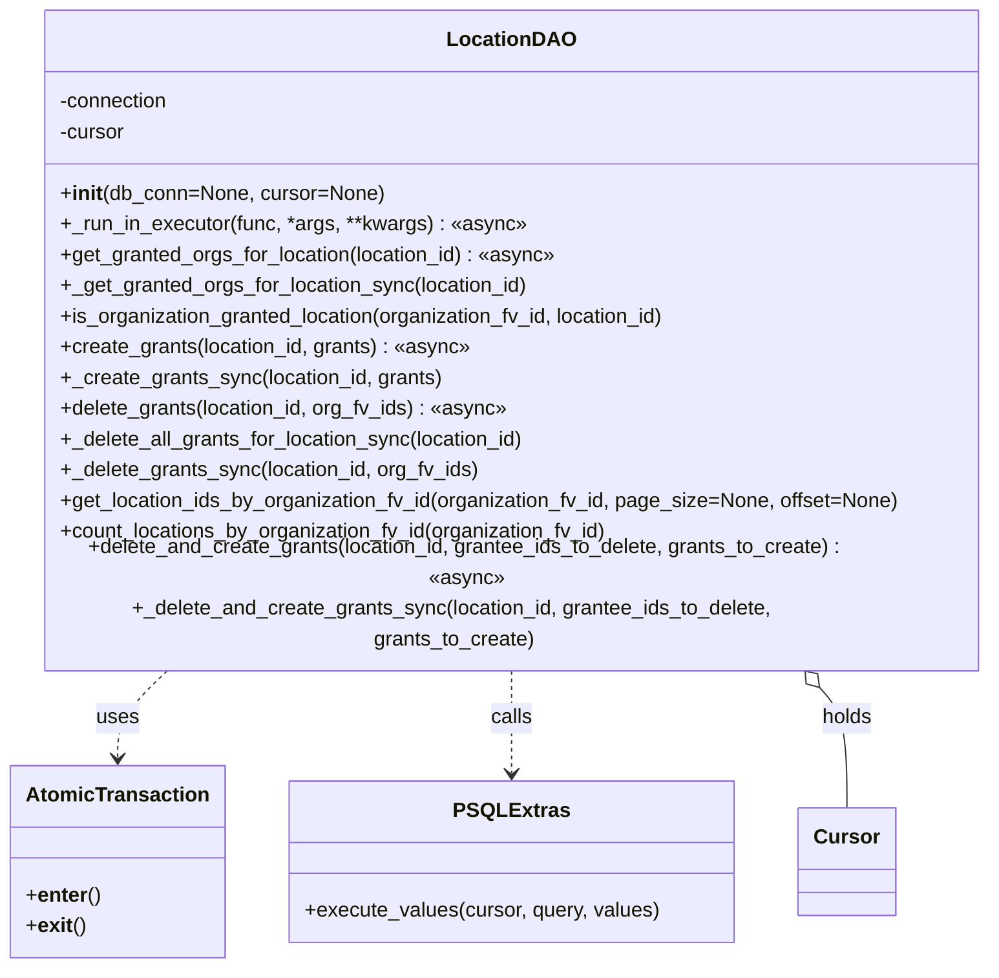
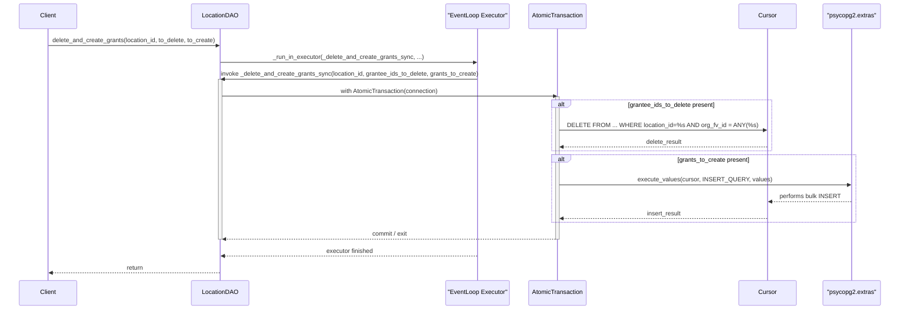

# Diagram: entity_core/entity_service/entity_inventory/entity_inventory_service/db/daos/inventory_location_grant_dao.py

> Auto-generated by Obscura crawlers

## Diagram 1

### SVG

<svg id="container" width="761.1875" xmlns="http://www.w3.org/2000/svg" class="classDiagram" height="720" viewBox="0 0 761.1875 720" role="graphics-document document" aria-roledescription="class"><g><defs><marker id="container_class-aggregationStart" class="marker aggregation class" refX="18" refY="7" markerWidth="190" markerHeight="240" orient="auto"><path d="M 18,7 L9,13 L1,7 L9,1 Z"></path></marker></defs><defs><marker id="container_class-aggregationEnd" class="marker aggregation class" refX="1" refY="7" markerWidth="20" markerHeight="28" orient="auto"><path d="M 18,7 L9,13 L1,7 L9,1 Z"></path></marker></defs><defs><marker id="container_class-extensionStart" class="marker extension class" refX="18" refY="7" markerWidth="190" markerHeight="240" orient="auto"><path d="M 1,7 L18,13 V 1 Z"></path></marker></defs><defs><marker id="container_class-extensionEnd" class="marker extension class" refX="1" refY="7" markerWidth="20" markerHeight="28" orient="auto"><path d="M 1,1 V 13 L18,7 Z"></path></marker></defs><defs><marker id="container_class-compositionStart" class="marker composition class" refX="18" refY="7" markerWidth="190" markerHeight="240" orient="auto"><path d="M 18,7 L9,13 L1,7 L9,1 Z"></path></marker></defs><defs><marker id="container_class-compositionEnd" class="marker composition class" refX="1" refY="7" markerWidth="20" markerHeight="28" orient="auto"><path d="M 18,7 L9,13 L1,7 L9,1 Z"></path></marker></defs><defs><marker id="container_class-dependencyStart" class="marker dependency class" refX="6" refY="7" markerWidth="190" markerHeight="240" orient="auto"><path d="M 5,7 L9,13 L1,7 L9,1 Z"></path></marker></defs><defs><marker id="container_class-dependencyEnd" class="marker dependency class" refX="13" refY="7" markerWidth="20" markerHeight="28" orient="auto"><path d="M 18,7 L9,13 L14,7 L9,1 Z"></path></marker></defs><defs><marker id="container_class-lollipopStart" class="marker lollipop class" refX="13" refY="7" markerWidth="190" markerHeight="240" orient="auto"><circle stroke="black" fill="transparent" cx="7" cy="7" r="6"></circle></marker></defs><defs><marker id="container_class-lollipopEnd" class="marker lollipop class" refX="1" refY="7" markerWidth="190" markerHeight="240" orient="auto"><circle stroke="black" fill="transparent" cx="7" cy="7" r="6"></circle></marker></defs><g class="root"><g class="clusters"></g><g class="edgePaths"><path d="M127.98,488L121.288,494.167C114.596,500.333,101.212,512.667,94.52,524C87.828,535.333,87.828,545.667,87.828,550.833L87.828,556" id="id_LocationDAO_AtomicTransaction_1" class="edge-thickness-normal edge-pattern-dashed relation" style=";;;" data-edge="true" data-et="edge" data-id="id_LocationDAO_AtomicTransaction_1" data-points="W3sieCI6MTI3Ljk3OTYzNjczMjg1MTk5LCJ5Ijo0ODh9LHsieCI6ODcuODI4MTI1LCJ5Ijo1MjV9LHsieCI6ODcuODI4MTI1LCJ5Ijo1NjJ9XQ==" marker-end="url(#container_class-dependencyEnd)"></path><path d="M388.422,488L388.422,494.167C388.422,500.333,388.422,512.667,388.422,526C388.422,539.333,388.422,553.667,388.422,560.833L388.422,568" id="id_LocationDAO_PSQLExtras_2" class="edge-thickness-normal edge-pattern-dashed relation" style=";;;" data-edge="true" data-et="edge" data-id="id_LocationDAO_PSQLExtras_2" data-points="W3sieCI6Mzg4LjQyMTg3NSwieSI6NDg4fSx7IngiOjM4OC40MjE4NzUsInkiOjUyNX0seyJ4IjozODguNDIxODc1LCJ5Ijo1NzR9XQ==" marker-end="url(#container_class-dependencyEnd)"></path><path d="M622.534,500.653L626.294,504.711C630.054,508.769,637.574,516.884,641.334,532.609C645.094,548.333,645.094,571.667,645.094,583.333L645.094,595" id="id_LocationDAO_Cursor_3" class="edge-thickness-normal edge-pattern-solid relation" style=";;;" data-edge="true" data-et="edge" data-id="id_LocationDAO_Cursor_3" data-points="W3sieCI6NjEwLjgwOTA1OTExNTUyMzUsInkiOjQ4OH0seyJ4Ijo2NDUuMDkzNzUsInkiOjUyNX0seyJ4Ijo2NDUuMDkzNzUsInkiOjU5NX1d" marker-start="url(#container_class-aggregationStart)"></path></g><g class="edgeLabels"><g class="edgeLabel" transform="translate(87.828125, 525)"><g class="label" data-id="id_LocationDAO_AtomicTransaction_1" transform="translate(-16.4921875, -12)"><foreignObject width="32.984375" height="24">

uses

</foreignObject></g></g><g class="edgeLabel" transform="translate(388.421875, 525)"><g class="label" data-id="id_LocationDAO_PSQLExtras_2" transform="translate(-16.4453125, -12)"><foreignObject width="32.890625" height="24">

calls

</foreignObject></g></g><g class="edgeLabel" transform="translate(645.09375, 525)"><g class="label" data-id="id_LocationDAO_Cursor_3" transform="translate(-20.1875, -12)"><foreignObject width="40.375" height="24">

holds

</foreignObject></g></g></g><g class="nodes"><g class="node default" id="classId-LocationDAO-0" transform="translate(388.421875, 248)"><g class="basic label-container"><path d="M-364.765625 -240 L364.765625 -240 L364.765625 240 L-364.765625 240" stroke="none" stroke-width="0" fill="#ECECFF" style=""></path><path d="M-364.765625 -240 C-107.49498487071514 -240, 149.7756552585697 -240, 364.765625 -240 M-364.765625 -240 C-146.2215271339943 -240, 72.3225707320114 -240, 364.765625 -240 M364.765625 -240 C364.765625 -89.67931074472924, 364.765625 60.64137851054153, 364.765625 240 M364.765625 -240 C364.765625 -77.90367603802025, 364.765625 84.1926479239595, 364.765625 240 M364.765625 240 C195.25922008252485 240, 25.752815165049697 240, -364.765625 240 M364.765625 240 C135.40351502999678 240, -93.95859494000644 240, -364.765625 240 M-364.765625 240 C-364.765625 97.18832855946005, -364.765625 -45.62334288107991, -364.765625 -240 M-364.765625 240 C-364.765625 98.08647054442193, -364.765625 -43.82705891115614, -364.765625 -240" stroke="#9370DB" stroke-width="1.3" fill="none" stroke-dasharray="0 0" style=""></path></g><g class="annotation-group text" transform="translate(0, -216)"></g><g class="label-group text" transform="translate(-46.640625, -216)"><g class="label" style="font-weight: bolder" transform="translate(0,-12)"><foreignObject width="93.28125" height="24">

LocationDAO

</foreignObject></g></g><g class="members-group text" transform="translate(-352.765625, -168)"><g class="label" style="" transform="translate(0,-12)"><foreignObject width="87.25" height="24">

-connection

</foreignObject></g><g class="label" style="" transform="translate(0,12)"><foreignObject width="52.1875" height="24">

-cursor

</foreignObject></g></g><g class="methods-group text" transform="translate(-352.765625, -96)"><g class="label" style="" transform="translate(0,-12)"><foreignObject width="251.359375" height="24">

+<strong>init</strong>(db_conn=None, cursor=None)

</foreignObject></g><g class="label" style="" transform="translate(0,12)"><foreignObject width="363.15625" height="24">

+_run_in_executor(func, *args, **kwargs) : «async»

</foreignObject></g><g class="label" style="" transform="translate(0,36)"><foreignObject width="391.140625" height="24">

+get_granted_orgs_for_location(location_id) : «async»

</foreignObject></g><g class="label" style="" transform="translate(0,60)"><foreignObject width="367.765625" height="24">

+_get_granted_orgs_for_location_sync(location_id)

</foreignObject></g><g class="label" style="" transform="translate(0,84)"><foreignObject width="483.125" height="24">

+is_organization_granted_location(organization_fv_id, location_id)

</foreignObject></g><g class="label" style="" transform="translate(0,108)"><foreignObject width="322.5" height="24">

+create_grants(location_id, grants) : «async»

</foreignObject></g><g class="label" style="" transform="translate(0,132)"><foreignObject width="298.34375" height="24">

+_create_grants_sync(location_id, grants)

</foreignObject></g><g class="label" style="" transform="translate(0,156)"><foreignObject width="352.53125" height="24">

+delete_grants(location_id, org_fv_ids) : «async»

</foreignObject></g><g class="label" style="" transform="translate(0,180)"><foreignObject width="366.6875" height="24">

+_delete_all_grants_for_location_sync(location_id)

</foreignObject></g><g class="label" style="" transform="translate(0,204)"><foreignObject width="328.375" height="24">

+_delete_grants_sync(location_id, org_fv_ids)

</foreignObject></g><g class="label" style="" transform="translate(0,228)"><foreignObject width="658.890625" height="24">

+get_location_ids_by_organization_fv_id(organization_fv_id, page_size=None, offset=None)

</foreignObject></g><g class="label" style="" transform="translate(0,252)"><foreignObject width="434.125" height="24">

+count_locations_by_organization_fv_id(organization_fv_id)

</foreignObject></g><g class="label" style="" transform="translate(0,276)"><foreignObject width="655.390625" height="24">

+delete_and_create_grants(location_id, grantee_ids_to_delete, grants_to_create) : «async»

</foreignObject></g><g class="label" style="" transform="translate(0,300)"><foreignObject width="631.21875" height="24">

+_delete_and_create_grants_sync(location_id, grantee_ids_to_delete, grants_to_create)

</foreignObject></g></g><g class="divider" style=""><path d="M-364.765625 -192 C-152.82735088844785 -192, 59.110923223104294 -192, 364.765625 -192 M-364.765625 -192 C-148.23316866815978 -192, 68.29928766368045 -192, 364.765625 -192" stroke="#9370DB" stroke-width="1.3" fill="none" stroke-dasharray="0 0" style=""></path></g><g class="divider" style=""><path d="M-364.765625 -120 C-149.77101346328408 -120, 65.22359807343184 -120, 364.765625 -120 M-364.765625 -120 C-196.8147836924528 -120, -28.863942384905613 -120, 364.765625 -120" stroke="#9370DB" stroke-width="1.3" fill="none" stroke-dasharray="0 0" style=""></path></g></g><g class="node default" id="classId-AtomicTransaction-1" transform="translate(87.828125, 637)"><g class="basic label-container"><path d="M-79.828125 -75 L79.828125 -75 L79.828125 75 L-79.828125 75" stroke="none" stroke-width="0" fill="#ECECFF" style=""></path><path d="M-79.828125 -75 C-43.11395709627032 -75, -6.399789192540638 -75, 79.828125 -75 M-79.828125 -75 C-42.9613006419036 -75, -6.094476283807197 -75, 79.828125 -75 M79.828125 -75 C79.828125 -37.90371877203556, 79.828125 -0.8074375440711208, 79.828125 75 M79.828125 -75 C79.828125 -30.4929400333573, 79.828125 14.0141199332854, 79.828125 75 M79.828125 75 C31.36823425615166 75, -17.09165648769668 75, -79.828125 75 M79.828125 75 C44.90269152401329 75, 9.977258048026584 75, -79.828125 75 M-79.828125 75 C-79.828125 18.989015796634625, -79.828125 -37.02196840673075, -79.828125 -75 M-79.828125 75 C-79.828125 19.643163997726745, -79.828125 -35.71367200454651, -79.828125 -75" stroke="#9370DB" stroke-width="1.3" fill="none" stroke-dasharray="0 0" style=""></path></g><g class="annotation-group text" transform="translate(0, -51)"></g><g class="label-group text" transform="translate(-67.828125, -51)"><g class="label" style="font-weight: bolder" transform="translate(0,-12)"><foreignObject width="135.65625" height="24">

AtomicTransaction

</foreignObject></g></g><g class="members-group text" transform="translate(-67.828125, -3)"></g><g class="methods-group text" transform="translate(-67.828125, 27)"><g class="label" style="" transform="translate(0,-12)"><foreignObject width="57.5625" height="24">

+<strong>enter</strong>()

</foreignObject></g><g class="label" style="" transform="translate(0,12)"><foreignObject width="45.875" height="24">

+<strong>exit</strong>()

</foreignObject></g></g><g class="divider" style=""><path d="M-79.828125 -27 C-33.85093942551993 -27, 12.126246148960135 -27, 79.828125 -27 M-79.828125 -27 C-24.200708696851663 -27, 31.426707606296674 -27, 79.828125 -27" stroke="#9370DB" stroke-width="1.3" fill="none" stroke-dasharray="0 0" style=""></path></g><g class="divider" style=""><path d="M-79.828125 -3 C-16.237913961287745 -3, 47.35229707742451 -3, 79.828125 -3 M-79.828125 -3 C-45.40054863578007 -3, -10.972972271560138 -3, 79.828125 -3" stroke="#9370DB" stroke-width="1.3" fill="none" stroke-dasharray="0 0" style=""></path></g></g><g class="node default" id="classId-PSQLExtras-2" transform="translate(388.421875, 637)"><g class="basic label-container"><path d="M-170.765625 -63 L170.765625 -63 L170.765625 63 L-170.765625 63" stroke="none" stroke-width="0" fill="#ECECFF" style=""></path><path d="M-170.765625 -63 C-74.85348912167836 -63, 21.05864675664327 -63, 170.765625 -63 M-170.765625 -63 C-84.36673226712648 -63, 2.0321604657470402 -63, 170.765625 -63 M170.765625 -63 C170.765625 -18.921111894737734, 170.765625 25.15777621052453, 170.765625 63 M170.765625 -63 C170.765625 -35.72358333289121, 170.765625 -8.447166665782426, 170.765625 63 M170.765625 63 C56.9888882587113 63, -56.7878484825774 63, -170.765625 63 M170.765625 63 C82.1544552959405 63, -6.456714408119012 63, -170.765625 63 M-170.765625 63 C-170.765625 24.060877011166987, -170.765625 -14.878245977666026, -170.765625 -63 M-170.765625 63 C-170.765625 14.081844549589292, -170.765625 -34.83631090082142, -170.765625 -63" stroke="#9370DB" stroke-width="1.3" fill="none" stroke-dasharray="0 0" style=""></path></g><g class="annotation-group text" transform="translate(0, -39)"></g><g class="label-group text" transform="translate(-41.359375, -39)"><g class="label" style="font-weight: bolder" transform="translate(0,-12)"><foreignObject width="82.71875" height="24">

PSQLExtras

</foreignObject></g></g><g class="members-group text" transform="translate(-158.765625, 9)"></g><g class="methods-group text" transform="translate(-158.765625, 39)"><g class="label" style="" transform="translate(0,-12)"><foreignObject width="276.171875" height="24">

+execute_values(cursor, query, values)

</foreignObject></g></g><g class="divider" style=""><path d="M-170.765625 -15 C-52.95062498975612 -15, 64.86437502048776 -15, 170.765625 -15 M-170.765625 -15 C-90.67078638547362 -15, -10.575947770947238 -15, 170.765625 -15" stroke="#9370DB" stroke-width="1.3" fill="none" stroke-dasharray="0 0" style=""></path></g><g class="divider" style=""><path d="M-170.765625 9 C-82.68675294228328 9, 5.392119115433445 9, 170.765625 9 M-170.765625 9 C-56.29386822136881 9, 58.17788855726238 9, 170.765625 9" stroke="#9370DB" stroke-width="1.3" fill="none" stroke-dasharray="0 0" style=""></path></g></g><g class="node default" id="classId-Cursor-3" transform="translate(645.09375, 637)"><g class="basic label-container"><path d="M-35.90625 -42 L35.90625 -42 L35.90625 42 L-35.90625 42" stroke="none" stroke-width="0" fill="#ECECFF" style=""></path><path d="M-35.90625 -42 C-13.213909369864801 -42, 9.478431260270398 -42, 35.90625 -42 M-35.90625 -42 C-17.046217870569844 -42, 1.8138142588603117 -42, 35.90625 -42 M35.90625 -42 C35.90625 -14.178578461284335, 35.90625 13.64284307743133, 35.90625 42 M35.90625 -42 C35.90625 -20.487993924927828, 35.90625 1.024012150144344, 35.90625 42 M35.90625 42 C12.160140869433906 42, -11.585968261132187 42, -35.90625 42 M35.90625 42 C10.019328078328268 42, -15.867593843343464 42, -35.90625 42 M-35.90625 42 C-35.90625 8.946444497627525, -35.90625 -24.10711100474495, -35.90625 -42 M-35.90625 42 C-35.90625 18.734686249064065, -35.90625 -4.530627501871869, -35.90625 -42" stroke="#9370DB" stroke-width="1.3" fill="none" stroke-dasharray="0 0" style=""></path></g><g class="annotation-group text" transform="translate(0, -18)"></g><g class="label-group text" transform="translate(-23.90625, -18)"><g class="label" style="font-weight: bolder" transform="translate(0,-12)"><foreignObject width="47.8125" height="24">

Cursor

</foreignObject></g></g><g class="members-group text" transform="translate(-23.90625, 30)"></g><g class="methods-group text" transform="translate(-23.90625, 60)"></g><g class="divider" style=""><path d="M-35.90625 6 C-18.373020153162287 6, -0.8397903063245735 6, 35.90625 6 M-35.90625 6 C-17.601292226868818 6, 0.7036655462623642 6, 35.90625 6" stroke="#9370DB" stroke-width="1.3" fill="none" stroke-dasharray="0 0" style=""></path></g><g class="divider" style=""><path d="M-35.90625 24 C-9.47827859178118 24, 16.94969281643764 24, 35.90625 24 M-35.90625 24 C-15.556805462126757 24, 4.792639075746486 24, 35.90625 24" stroke="#9370DB" stroke-width="1.3" fill="none" stroke-dasharray="0 0" style=""></path></g></g></g></g></g></svg>

## Diagram 2

### SVG

<svg id="container" width="2475" xmlns="http://www.w3.org/2000/svg" height="857" viewBox="-50 -10 2475 857" role="graphics-document document" aria-roledescription="sequence"><g><rect x="2225" y="771" fill="#eaeaea" stroke="#666" width="150" height="65" name="PSQLExtras" rx="3" ry="3" class="actor actor-bottom"></rect><text x="2300" y="803.5" dominant-baseline="central" alignment-baseline="central" class="actor actor-box" style="text-anchor: middle; font-size: 16px; font-weight: 400;"><tspan x="2300" dy="0">"psycopg2.extras"</tspan></text></g><g><rect x="1997" y="771" fill="#eaeaea" stroke="#666" width="150" height="65" name="Cursor" rx="3" ry="3" class="actor actor-bottom"></rect><text x="2072" y="803.5" dominant-baseline="central" alignment-baseline="central" class="actor actor-box" style="text-anchor: middle; font-size: 16px; font-weight: 400;"><tspan x="2072" dy="0">Cursor</tspan></text></g><g><rect x="1460" y="771" fill="#eaeaea" stroke="#666" width="154" height="65" name="AtomicTransaction" rx="3" ry="3" class="actor actor-bottom"></rect><text x="1537" y="803.5" dominant-baseline="central" alignment-baseline="central" class="actor actor-box" style="text-anchor: middle; font-size: 16px; font-weight: 400;"><tspan x="1537" dy="0">AtomicTransaction</tspan></text></g><g><rect x="1234" y="771" fill="#eaeaea" stroke="#666" width="176" height="65" name="Executor" rx="3" ry="3" class="actor actor-bottom"></rect><text x="1322" y="803.5" dominant-baseline="central" alignment-baseline="central" class="actor actor-box" style="text-anchor: middle; font-size: 16px; font-weight: 400;"><tspan x="1322" dy="0">"EventLoop Executor"</tspan></text></g><g><rect x="501" y="771" fill="#eaeaea" stroke="#666" width="150" height="65" name="LocationDAO" rx="3" ry="3" class="actor actor-bottom"></rect><text x="576" y="803.5" dominant-baseline="central" alignment-baseline="central" class="actor actor-box" style="text-anchor: middle; font-size: 16px; font-weight: 400;"><tspan x="576" dy="0">LocationDAO</tspan></text></g><g><rect x="0" y="771" fill="#eaeaea" stroke="#666" width="150" height="65" name="Client" rx="3" ry="3" class="actor actor-bottom"></rect><text x="75" y="803.5" dominant-baseline="central" alignment-baseline="central" class="actor actor-box" style="text-anchor: middle; font-size: 16px; font-weight: 400;"><tspan x="75" dy="0">Client</tspan></text></g><g><line id="actor5" x1="2300" y1="65" x2="2300" y2="771" class="actor-line 200" stroke-width="0.5px" stroke="#999" name="PSQLExtras"></line><g id="root-5"><rect x="2225" y="0" fill="#eaeaea" stroke="#666" width="150" height="65" name="PSQLExtras" rx="3" ry="3" class="actor actor-top"></rect><text x="2300" y="32.5" dominant-baseline="central" alignment-baseline="central" class="actor actor-box" style="text-anchor: middle; font-size: 16px; font-weight: 400;"><tspan x="2300" dy="0">"psycopg2.extras"</tspan></text></g></g><g><line id="actor4" x1="2072" y1="65" x2="2072" y2="771" class="actor-line 200" stroke-width="0.5px" stroke="#999" name="Cursor"></line><g id="root-4"><rect x="1997" y="0" fill="#eaeaea" stroke="#666" width="150" height="65" name="Cursor" rx="3" ry="3" class="actor actor-top"></rect><text x="2072" y="32.5" dominant-baseline="central" alignment-baseline="central" class="actor actor-box" style="text-anchor: middle; font-size: 16px; font-weight: 400;"><tspan x="2072" dy="0">Cursor</tspan></text></g></g><g><line id="actor3" x1="1537" y1="65" x2="1537" y2="771" class="actor-line 200" stroke-width="0.5px" stroke="#999" name="AtomicTransaction"></line><g id="root-3"><rect x="1460" y="0" fill="#eaeaea" stroke="#666" width="154" height="65" name="AtomicTransaction" rx="3" ry="3" class="actor actor-top"></rect><text x="1537" y="32.5" dominant-baseline="central" alignment-baseline="central" class="actor actor-box" style="text-anchor: middle; font-size: 16px; font-weight: 400;"><tspan x="1537" dy="0">AtomicTransaction</tspan></text></g></g><g><line id="actor2" x1="1322" y1="65" x2="1322" y2="771" class="actor-line 200" stroke-width="0.5px" stroke="#999" name="Executor"></line><g id="root-2"><rect x="1234" y="0" fill="#eaeaea" stroke="#666" width="176" height="65" name="Executor" rx="3" ry="3" class="actor actor-top"></rect><text x="1322" y="32.5" dominant-baseline="central" alignment-baseline="central" class="actor actor-box" style="text-anchor: middle; font-size: 16px; font-weight: 400;"><tspan x="1322" dy="0">"EventLoop Executor"</tspan></text></g></g><g><line id="actor1" x1="576" y1="65" x2="576" y2="771" class="actor-line 200" stroke-width="0.5px" stroke="#999" name="LocationDAO"></line><g id="root-1"><rect x="501" y="0" fill="#eaeaea" stroke="#666" width="150" height="65" name="LocationDAO" rx="3" ry="3" class="actor actor-top"></rect><text x="576" y="32.5" dominant-baseline="central" alignment-baseline="central" class="actor actor-box" style="text-anchor: middle; font-size: 16px; font-weight: 400;"><tspan x="576" dy="0">LocationDAO</tspan></text></g></g><g><line id="actor0" x1="75" y1="65" x2="75" y2="771" class="actor-line 200" stroke-width="0.5px" stroke="#999" name="Client"></line><g id="root-0"><rect x="0" y="0" fill="#eaeaea" stroke="#666" width="150" height="65" name="Client" rx="3" ry="3" class="actor actor-top"></rect><text x="75" y="32.5" dominant-baseline="central" alignment-baseline="central" class="actor actor-box" style="text-anchor: middle; font-size: 16px; font-weight: 400;"><tspan x="75" dy="0">Client</tspan></text></g></g><g></g><defs><symbol id="computer" width="24" height="24"><path transform="scale(.5)" d="M2 2v13h20v-13h-20zm18 11h-16v-9h16v9zm-10.228 6l.466-1h3.524l.467 1h-4.457zm14.228 3h-24l2-6h2.104l-1.33 4h18.45l-1.297-4h2.073l2 6zm-5-10h-14v-7h14v7z"></path></symbol></defs><defs><symbol id="database" fill-rule="evenodd" clip-rule="evenodd"><path transform="scale(.5)" d="M12.258.001l.256.004.255.005.253.008.251.01.249.012.247.015.246.016.242.019.241.02.239.023.236.024.233.027.231.028.229.031.225.032.223.034.22.036.217.038.214.04.211.041.208.043.205.045.201.046.198.048.194.05.191.051.187.053.183.054.18.056.175.057.172.059.168.06.163.061.16.063.155.064.15.066.074.033.073.033.071.034.07.034.069.035.068.035.067.035.066.035.064.036.064.036.062.036.06.036.06.037.058.037.058.037.055.038.055.038.053.038.052.038.051.039.05.039.048.039.047.039.045.04.044.04.043.04.041.04.04.041.039.041.037.041.036.041.034.041.033.042.032.042.03.042.029.042.027.042.026.043.024.043.023.043.021.043.02.043.018.044.017.043.015.044.013.044.012.044.011.045.009.044.007.045.006.045.004.045.002.045.001.045v17l-.001.045-.002.045-.004.045-.006.045-.007.045-.009.044-.011.045-.012.044-.013.044-.015.044-.017.043-.018.044-.02.043-.021.043-.023.043-.024.043-.026.043-.027.042-.029.042-.03.042-.032.042-.033.042-.034.041-.036.041-.037.041-.039.041-.04.041-.041.04-.043.04-.044.04-.045.04-.047.039-.048.039-.05.039-.051.039-.052.038-.053.038-.055.038-.055.038-.058.037-.058.037-.06.037-.06.036-.062.036-.064.036-.064.036-.066.035-.067.035-.068.035-.069.035-.07.034-.071.034-.073.033-.074.033-.15.066-.155.064-.16.063-.163.061-.168.06-.172.059-.175.057-.18.056-.183.054-.187.053-.191.051-.194.05-.198.048-.201.046-.205.045-.208.043-.211.041-.214.04-.217.038-.22.036-.223.034-.225.032-.229.031-.231.028-.233.027-.236.024-.239.023-.241.02-.242.019-.246.016-.247.015-.249.012-.251.01-.253.008-.255.005-.256.004-.258.001-.258-.001-.256-.004-.255-.005-.253-.008-.251-.01-.249-.012-.247-.015-.245-.016-.243-.019-.241-.02-.238-.023-.236-.024-.234-.027-.231-.028-.228-.031-.226-.032-.223-.034-.22-.036-.217-.038-.214-.04-.211-.041-.208-.043-.204-.045-.201-.046-.198-.048-.195-.05-.19-.051-.187-.053-.184-.054-.179-.056-.176-.057-.172-.059-.167-.06-.164-.061-.159-.063-.155-.064-.151-.066-.074-.033-.072-.033-.072-.034-.07-.034-.069-.035-.068-.035-.067-.035-.066-.035-.064-.036-.063-.036-.062-.036-.061-.036-.06-.037-.058-.037-.057-.037-.056-.038-.055-.038-.053-.038-.052-.038-.051-.039-.049-.039-.049-.039-.046-.039-.046-.04-.044-.04-.043-.04-.041-.04-.04-.041-.039-.041-.037-.041-.036-.041-.034-.041-.033-.042-.032-.042-.03-.042-.029-.042-.027-.042-.026-.043-.024-.043-.023-.043-.021-.043-.02-.043-.018-.044-.017-.043-.015-.044-.013-.044-.012-.044-.011-.045-.009-.044-.007-.045-.006-.045-.004-.045-.002-.045-.001-.045v-17l.001-.045.002-.045.004-.045.006-.045.007-.045.009-.044.011-.045.012-.044.013-.044.015-.044.017-.043.018-.044.02-.043.021-.043.023-.043.024-.043.026-.043.027-.042.029-.042.03-.042.032-.042.033-.042.034-.041.036-.041.037-.041.039-.041.04-.041.041-.04.043-.04.044-.04.046-.04.046-.039.049-.039.049-.039.051-.039.052-.038.053-.038.055-.038.056-.038.057-.037.058-.037.06-.037.061-.036.062-.036.063-.036.064-.036.066-.035.067-.035.068-.035.069-.035.07-.034.072-.034.072-.033.074-.033.151-.066.155-.064.159-.063.164-.061.167-.06.172-.059.176-.057.179-.056.184-.054.187-.053.19-.051.195-.05.198-.048.201-.046.204-.045.208-.043.211-.041.214-.04.217-.038.22-.036.223-.034.226-.032.228-.031.231-.028.234-.027.236-.024.238-.023.241-.02.243-.019.245-.016.247-.015.249-.012.251-.01.253-.008.255-.005.256-.004.258-.001.258.001zm-9.258 20.499v.01l.001.021.003.021.004.022.005.021.006.022.007.022.009.023.01.022.011.023.012.023.013.023.015.023.016.024.017.023.018.024.019.024.021.024.022.025.023.024.024.025.052.049.056.05.061.051.066.051.07.051.075.051.079.052.084.052.088.052.092.052.097.052.102.051.105.052.11.052.114.051.119.051.123.051.127.05.131.05.135.05.139.048.144.049.147.047.152.047.155.047.16.045.163.045.167.043.171.043.176.041.178.041.183.039.187.039.19.037.194.035.197.035.202.033.204.031.209.03.212.029.216.027.219.025.222.024.226.021.23.02.233.018.236.016.24.015.243.012.246.01.249.008.253.005.256.004.259.001.26-.001.257-.004.254-.005.25-.008.247-.011.244-.012.241-.014.237-.016.233-.018.231-.021.226-.021.224-.024.22-.026.216-.027.212-.028.21-.031.205-.031.202-.034.198-.034.194-.036.191-.037.187-.039.183-.04.179-.04.175-.042.172-.043.168-.044.163-.045.16-.046.155-.046.152-.047.148-.048.143-.049.139-.049.136-.05.131-.05.126-.05.123-.051.118-.052.114-.051.11-.052.106-.052.101-.052.096-.052.092-.052.088-.053.083-.051.079-.052.074-.052.07-.051.065-.051.06-.051.056-.05.051-.05.023-.024.023-.025.021-.024.02-.024.019-.024.018-.024.017-.024.015-.023.014-.024.013-.023.012-.023.01-.023.01-.022.008-.022.006-.022.006-.022.004-.022.004-.021.001-.021.001-.021v-4.127l-.077.055-.08.053-.083.054-.085.053-.087.052-.09.052-.093.051-.095.05-.097.05-.1.049-.102.049-.105.048-.106.047-.109.047-.111.046-.114.045-.115.045-.118.044-.12.043-.122.042-.124.042-.126.041-.128.04-.13.04-.132.038-.134.038-.135.037-.138.037-.139.035-.142.035-.143.034-.144.033-.147.032-.148.031-.15.03-.151.03-.153.029-.154.027-.156.027-.158.026-.159.025-.161.024-.162.023-.163.022-.165.021-.166.02-.167.019-.169.018-.169.017-.171.016-.173.015-.173.014-.175.013-.175.012-.177.011-.178.01-.179.008-.179.008-.181.006-.182.005-.182.004-.184.003-.184.002h-.37l-.184-.002-.184-.003-.182-.004-.182-.005-.181-.006-.179-.008-.179-.008-.178-.01-.176-.011-.176-.012-.175-.013-.173-.014-.172-.015-.171-.016-.17-.017-.169-.018-.167-.019-.166-.02-.165-.021-.163-.022-.162-.023-.161-.024-.159-.025-.157-.026-.156-.027-.155-.027-.153-.029-.151-.03-.15-.03-.148-.031-.146-.032-.145-.033-.143-.034-.141-.035-.14-.035-.137-.037-.136-.037-.134-.038-.132-.038-.13-.04-.128-.04-.126-.041-.124-.042-.122-.042-.12-.044-.117-.043-.116-.045-.113-.045-.112-.046-.109-.047-.106-.047-.105-.048-.102-.049-.1-.049-.097-.05-.095-.05-.093-.052-.09-.051-.087-.052-.085-.053-.083-.054-.08-.054-.077-.054v4.127zm0-5.654v.011l.001.021.003.021.004.021.005.022.006.022.007.022.009.022.01.022.011.023.012.023.013.023.015.024.016.023.017.024.018.024.019.024.021.024.022.024.023.025.024.024.052.05.056.05.061.05.066.051.07.051.075.052.079.051.084.052.088.052.092.052.097.052.102.052.105.052.11.051.114.051.119.052.123.05.127.051.131.05.135.049.139.049.144.048.147.048.152.047.155.046.16.045.163.045.167.044.171.042.176.042.178.04.183.04.187.038.19.037.194.036.197.034.202.033.204.032.209.03.212.028.216.027.219.025.222.024.226.022.23.02.233.018.236.016.24.014.243.012.246.01.249.008.253.006.256.003.259.001.26-.001.257-.003.254-.006.25-.008.247-.01.244-.012.241-.015.237-.016.233-.018.231-.02.226-.022.224-.024.22-.025.216-.027.212-.029.21-.03.205-.032.202-.033.198-.035.194-.036.191-.037.187-.039.183-.039.179-.041.175-.042.172-.043.168-.044.163-.045.16-.045.155-.047.152-.047.148-.048.143-.048.139-.05.136-.049.131-.05.126-.051.123-.051.118-.051.114-.052.11-.052.106-.052.101-.052.096-.052.092-.052.088-.052.083-.052.079-.052.074-.051.07-.052.065-.051.06-.05.056-.051.051-.049.023-.025.023-.024.021-.025.02-.024.019-.024.018-.024.017-.024.015-.023.014-.023.013-.024.012-.022.01-.023.01-.023.008-.022.006-.022.006-.022.004-.021.004-.022.001-.021.001-.021v-4.139l-.077.054-.08.054-.083.054-.085.052-.087.053-.09.051-.093.051-.095.051-.097.05-.1.049-.102.049-.105.048-.106.047-.109.047-.111.046-.114.045-.115.044-.118.044-.12.044-.122.042-.124.042-.126.041-.128.04-.13.039-.132.039-.134.038-.135.037-.138.036-.139.036-.142.035-.143.033-.144.033-.147.033-.148.031-.15.03-.151.03-.153.028-.154.028-.156.027-.158.026-.159.025-.161.024-.162.023-.163.022-.165.021-.166.02-.167.019-.169.018-.169.017-.171.016-.173.015-.173.014-.175.013-.175.012-.177.011-.178.009-.179.009-.179.007-.181.007-.182.005-.182.004-.184.003-.184.002h-.37l-.184-.002-.184-.003-.182-.004-.182-.005-.181-.007-.179-.007-.179-.009-.178-.009-.176-.011-.176-.012-.175-.013-.173-.014-.172-.015-.171-.016-.17-.017-.169-.018-.167-.019-.166-.02-.165-.021-.163-.022-.162-.023-.161-.024-.159-.025-.157-.026-.156-.027-.155-.028-.153-.028-.151-.03-.15-.03-.148-.031-.146-.033-.145-.033-.143-.033-.141-.035-.14-.036-.137-.036-.136-.037-.134-.038-.132-.039-.13-.039-.128-.04-.126-.041-.124-.042-.122-.043-.12-.043-.117-.044-.116-.044-.113-.046-.112-.046-.109-.046-.106-.047-.105-.048-.102-.049-.1-.049-.097-.05-.095-.051-.093-.051-.09-.051-.087-.053-.085-.052-.083-.054-.08-.054-.077-.054v4.139zm0-5.666v.011l.001.02.003.022.004.021.005.022.006.021.007.022.009.023.01.022.011.023.012.023.013.023.015.023.016.024.017.024.018.023.019.024.021.025.022.024.023.024.024.025.052.05.056.05.061.05.066.051.07.051.075.052.079.051.084.052.088.052.092.052.097.052.102.052.105.051.11.052.114.051.119.051.123.051.127.05.131.05.135.05.139.049.144.048.147.048.152.047.155.046.16.045.163.045.167.043.171.043.176.042.178.04.183.04.187.038.19.037.194.036.197.034.202.033.204.032.209.03.212.028.216.027.219.025.222.024.226.021.23.02.233.018.236.017.24.014.243.012.246.01.249.008.253.006.256.003.259.001.26-.001.257-.003.254-.006.25-.008.247-.01.244-.013.241-.014.237-.016.233-.018.231-.02.226-.022.224-.024.22-.025.216-.027.212-.029.21-.03.205-.032.202-.033.198-.035.194-.036.191-.037.187-.039.183-.039.179-.041.175-.042.172-.043.168-.044.163-.045.16-.045.155-.047.152-.047.148-.048.143-.049.139-.049.136-.049.131-.051.126-.05.123-.051.118-.052.114-.051.11-.052.106-.052.101-.052.096-.052.092-.052.088-.052.083-.052.079-.052.074-.052.07-.051.065-.051.06-.051.056-.05.051-.049.023-.025.023-.025.021-.024.02-.024.019-.024.018-.024.017-.024.015-.023.014-.024.013-.023.012-.023.01-.022.01-.023.008-.022.006-.022.006-.022.004-.022.004-.021.001-.021.001-.021v-4.153l-.077.054-.08.054-.083.053-.085.053-.087.053-.09.051-.093.051-.095.051-.097.05-.1.049-.102.048-.105.048-.106.048-.109.046-.111.046-.114.046-.115.044-.118.044-.12.043-.122.043-.124.042-.126.041-.128.04-.13.039-.132.039-.134.038-.135.037-.138.036-.139.036-.142.034-.143.034-.144.033-.147.032-.148.032-.15.03-.151.03-.153.028-.154.028-.156.027-.158.026-.159.024-.161.024-.162.023-.163.023-.165.021-.166.02-.167.019-.169.018-.169.017-.171.016-.173.015-.173.014-.175.013-.175.012-.177.01-.178.01-.179.009-.179.007-.181.006-.182.006-.182.004-.184.003-.184.001-.185.001-.185-.001-.184-.001-.184-.003-.182-.004-.182-.006-.181-.006-.179-.007-.179-.009-.178-.01-.176-.01-.176-.012-.175-.013-.173-.014-.172-.015-.171-.016-.17-.017-.169-.018-.167-.019-.166-.02-.165-.021-.163-.023-.162-.023-.161-.024-.159-.024-.157-.026-.156-.027-.155-.028-.153-.028-.151-.03-.15-.03-.148-.032-.146-.032-.145-.033-.143-.034-.141-.034-.14-.036-.137-.036-.136-.037-.134-.038-.132-.039-.13-.039-.128-.041-.126-.041-.124-.041-.122-.043-.12-.043-.117-.044-.116-.044-.113-.046-.112-.046-.109-.046-.106-.048-.105-.048-.102-.048-.1-.05-.097-.049-.095-.051-.093-.051-.09-.052-.087-.052-.085-.053-.083-.053-.08-.054-.077-.054v4.153zm8.74-8.179l-.257.004-.254.005-.25.008-.247.011-.244.012-.241.014-.237.016-.233.018-.231.021-.226.022-.224.023-.22.026-.216.027-.212.028-.21.031-.205.032-.202.033-.198.034-.194.036-.191.038-.187.038-.183.04-.179.041-.175.042-.172.043-.168.043-.163.045-.16.046-.155.046-.152.048-.148.048-.143.048-.139.049-.136.05-.131.05-.126.051-.123.051-.118.051-.114.052-.11.052-.106.052-.101.052-.096.052-.092.052-.088.052-.083.052-.079.052-.074.051-.07.052-.065.051-.06.05-.056.05-.051.05-.023.025-.023.024-.021.024-.02.025-.019.024-.018.024-.017.023-.015.024-.014.023-.013.023-.012.023-.01.023-.01.022-.008.022-.006.023-.006.021-.004.022-.004.021-.001.021-.001.021.001.021.001.021.004.021.004.022.006.021.006.023.008.022.01.022.01.023.012.023.013.023.014.023.015.024.017.023.018.024.019.024.02.025.021.024.023.024.023.025.051.05.056.05.06.05.065.051.07.052.074.051.079.052.083.052.088.052.092.052.096.052.101.052.106.052.11.052.114.052.118.051.123.051.126.051.131.05.136.05.139.049.143.048.148.048.152.048.155.046.16.046.163.045.168.043.172.043.175.042.179.041.183.04.187.038.191.038.194.036.198.034.202.033.205.032.21.031.212.028.216.027.22.026.224.023.226.022.231.021.233.018.237.016.241.014.244.012.247.011.25.008.254.005.257.004.26.001.26-.001.257-.004.254-.005.25-.008.247-.011.244-.012.241-.014.237-.016.233-.018.231-.021.226-.022.224-.023.22-.026.216-.027.212-.028.21-.031.205-.032.202-.033.198-.034.194-.036.191-.038.187-.038.183-.04.179-.041.175-.042.172-.043.168-.043.163-.045.16-.046.155-.046.152-.048.148-.048.143-.048.139-.049.136-.05.131-.05.126-.051.123-.051.118-.051.114-.052.11-.052.106-.052.101-.052.096-.052.092-.052.088-.052.083-.052.079-.052.074-.051.07-.052.065-.051.06-.05.056-.05.051-.05.023-.025.023-.024.021-.024.02-.025.019-.024.018-.024.017-.023.015-.024.014-.023.013-.023.012-.023.01-.023.01-.022.008-.022.006-.023.006-.021.004-.022.004-.021.001-.021.001-.021-.001-.021-.001-.021-.004-.021-.004-.022-.006-.021-.006-.023-.008-.022-.01-.022-.01-.023-.012-.023-.013-.023-.014-.023-.015-.024-.017-.023-.018-.024-.019-.024-.02-.025-.021-.024-.023-.024-.023-.025-.051-.05-.056-.05-.06-.05-.065-.051-.07-.052-.074-.051-.079-.052-.083-.052-.088-.052-.092-.052-.096-.052-.101-.052-.106-.052-.11-.052-.114-.052-.118-.051-.123-.051-.126-.051-.131-.05-.136-.05-.139-.049-.143-.048-.148-.048-.152-.048-.155-.046-.16-.046-.163-.045-.168-.043-.172-.043-.175-.042-.179-.041-.183-.04-.187-.038-.191-.038-.194-.036-.198-.034-.202-.033-.205-.032-.21-.031-.212-.028-.216-.027-.22-.026-.224-.023-.226-.022-.231-.021-.233-.018-.237-.016-.241-.014-.244-.012-.247-.011-.25-.008-.254-.005-.257-.004-.26-.001-.26.001z"></path></symbol></defs><defs><symbol id="clock" width="24" height="24"><path transform="scale(.5)" d="M12 2c5.514 0 10 4.486 10 10s-4.486 10-10 10-10-4.486-10-10 4.486-10 10-10zm0-2c-6.627 0-12 5.373-12 12s5.373 12 12 12 12-5.373 12-12-5.373-12-12-12zm5.848 12.459c.202.038.202.333.001.372-1.907.361-6.045 1.111-6.547 1.111-.719 0-1.301-.582-1.301-1.301 0-.512.77-5.447 1.125-7.445.034-.192.312-.181.343.014l.985 6.238 5.394 1.011z"></path></symbol></defs><defs><marker id="arrowhead" refX="7.9" refY="5" markerUnits="userSpaceOnUse" markerWidth="12" markerHeight="12" orient="auto-start-reverse"><path d="M -1 0 L 10 5 L 0 10 z"></path></marker></defs><defs><marker id="crosshead" markerWidth="15" markerHeight="8" orient="auto" refX="4" refY="4.5"><path fill="none" stroke="#000000" stroke-width="1pt" d="M 1,2 L 6,7 M 6,2 L 1,7" style="stroke-dasharray: 0, 0;"></path></marker></defs><defs><marker id="filled-head" refX="15.5" refY="7" markerWidth="20" markerHeight="28" orient="auto"><path d="M 18,7 L9,13 L14,7 L9,1 Z"></path></marker></defs><defs><marker id="sequencenumber" refX="15" refY="15" markerWidth="60" markerHeight="40" orient="auto"><circle cx="15" cy="15" r="6"></circle></marker></defs><g><rect x="571" y="209" fill="#EDF2AE" stroke="#666" width="10" height="446" class="activation0"></rect></g><g><rect x="1532" y="259" fill="#EDF2AE" stroke="#666" width="10" height="396" class="activation0"></rect></g><g><line x1="1522" y1="267" x2="2083" y2="267" class="loopLine"></line><line x1="2083" y1="267" x2="2083" y2="408" class="loopLine"></line><line x1="1522" y1="408" x2="2083" y2="408" class="loopLine"></line><line x1="1522" y1="267" x2="1522" y2="408" class="loopLine"></line><polygon points="1522,267 1572,267 1572,280 1563.6,287 1522,287" class="labelBox"></polygon><text x="1547" y="280" text-anchor="middle" dominant-baseline="middle" alignment-baseline="middle" class="labelText" style="font-size: 16px; font-weight: 400;">alt</text><text x="1827.5" y="285" text-anchor="middle" class="loopText" style="font-size: 16px; font-weight: 400;"><tspan x="1827.5">[grantee_ids_to_delete present]</tspan></text></g><g><line x1="1522" y1="418" x2="2311" y2="418" class="loopLine"></line><line x1="2311" y1="418" x2="2311" y2="607" class="loopLine"></line><line x1="1522" y1="607" x2="2311" y2="607" class="loopLine"></line><line x1="1522" y1="418" x2="1522" y2="607" class="loopLine"></line><polygon points="1522,418 1572,418 1572,431 1563.6,438 1522,438" class="labelBox"></polygon><text x="1547" y="431" text-anchor="middle" dominant-baseline="middle" alignment-baseline="middle" class="labelText" style="font-size: 16px; font-weight: 400;">alt</text><text x="1941.5" y="436" text-anchor="middle" class="loopText" style="font-size: 16px; font-weight: 400;"><tspan x="1941.5">[grants_to_create present]</tspan></text></g><text x="324" y="80" text-anchor="middle" dominant-baseline="middle" alignment-baseline="middle" class="messageText" dy="1em" style="font-size: 16px; font-weight: 400;">delete_and_create_grants(location_id, to_delete, to_create)</text><line x1="76" y1="113" x2="572" y2="113" class="messageLine0" stroke-width="2" stroke="none" marker-end="url(#arrowhead)" style="fill: none;"></line><text x="948" y="128" text-anchor="middle" dominant-baseline="middle" alignment-baseline="middle" class="messageText" dy="1em" style="font-size: 16px; font-weight: 400;">_run_in_executor(_delete_and_create_grants_sync, ...)</text><line x1="577" y1="161" x2="1318" y2="161" class="messageLine0" stroke-width="2" stroke="none" marker-end="url(#arrowhead)" style="fill: none;"></line><text x="951" y="176" text-anchor="middle" dominant-baseline="middle" alignment-baseline="middle" class="messageText" dy="1em" style="font-size: 16px; font-weight: 400;">invoke _delete_and_create_grants_sync(location_id, grantee_ids_to_delete, grants_to_create)</text><line x1="1321" y1="209" x2="580" y2="209" class="messageLine0" stroke-width="2" stroke="none" marker-end="url(#arrowhead)" style="fill: none;"></line><text x="1057" y="224" text-anchor="middle" dominant-baseline="middle" alignment-baseline="middle" class="messageText" dy="1em" style="font-size: 16px; font-weight: 400;">with AtomicTransaction(connection)</text><line x1="581" y1="257" x2="1533" y2="257" class="messageLine0" stroke-width="2" stroke="none" marker-end="url(#arrowhead)" style="fill: none;"></line><text x="1805" y="317" text-anchor="middle" dominant-baseline="middle" alignment-baseline="middle" class="messageText" dy="1em" style="font-size: 16px; font-weight: 400;">DELETE FROM ... WHERE location_id=%s AND org_fv_id = ANY(%s)</text><line x1="1542" y1="350" x2="2068" y2="350" class="messageLine0" stroke-width="2" stroke="none" marker-end="url(#arrowhead)" style="fill: none;"></line><text x="1808" y="365" text-anchor="middle" dominant-baseline="middle" alignment-baseline="middle" class="messageText" dy="1em" style="font-size: 16px; font-weight: 400;">delete_result</text><line x1="2071" y1="398" x2="1545" y2="398" class="messageLine1" stroke-width="2" stroke="none" marker-end="url(#arrowhead)" style="stroke-dasharray: 3, 3; fill: none;"></line><text x="1919" y="468" text-anchor="middle" dominant-baseline="middle" alignment-baseline="middle" class="messageText" dy="1em" style="font-size: 16px; font-weight: 400;">execute_values(cursor, INSERT_QUERY, values)</text><line x1="1542" y1="501" x2="2296" y2="501" class="messageLine0" stroke-width="2" stroke="none" marker-end="url(#arrowhead)" style="fill: none;"></line><text x="2188" y="516" text-anchor="middle" dominant-baseline="middle" alignment-baseline="middle" class="messageText" dy="1em" style="font-size: 16px; font-weight: 400;">performs bulk INSERT</text><line x1="2299" y1="549" x2="2076" y2="549" class="messageLine1" stroke-width="2" stroke="none" marker-end="url(#arrowhead)" style="stroke-dasharray: 3, 3; fill: none;"></line><text x="1808" y="564" text-anchor="middle" dominant-baseline="middle" alignment-baseline="middle" class="messageText" dy="1em" style="font-size: 16px; font-weight: 400;">insert_result</text><line x1="2071" y1="597" x2="1545" y2="597" class="messageLine1" stroke-width="2" stroke="none" marker-end="url(#arrowhead)" style="stroke-dasharray: 3, 3; fill: none;"></line><text x="1058" y="622" text-anchor="middle" dominant-baseline="middle" alignment-baseline="middle" class="messageText" dy="1em" style="font-size: 16px; font-weight: 400;">commit / exit</text><line x1="1532" y1="655" x2="584" y2="655" class="messageLine1" stroke-width="2" stroke="none" marker-end="url(#arrowhead)" style="stroke-dasharray: 3, 3; fill: none;"></line><text x="951" y="670" text-anchor="middle" dominant-baseline="middle" alignment-baseline="middle" class="messageText" dy="1em" style="font-size: 16px; font-weight: 400;">executor finished</text><line x1="1321" y1="703" x2="580" y2="703" class="messageLine1" stroke-width="2" stroke="none" marker-end="url(#arrowhead)" style="stroke-dasharray: 3, 3; fill: none;"></line><text x="327" y="718" text-anchor="middle" dominant-baseline="middle" alignment-baseline="middle" class="messageText" dy="1em" style="font-size: 16px; font-weight: 400;">return</text><line x1="575" y1="751" x2="79" y2="751" class="messageLine1" stroke-width="2" stroke="none" marker-end="url(#arrowhead)" style="stroke-dasharray: 3, 3; fill: none;"></line></svg>
