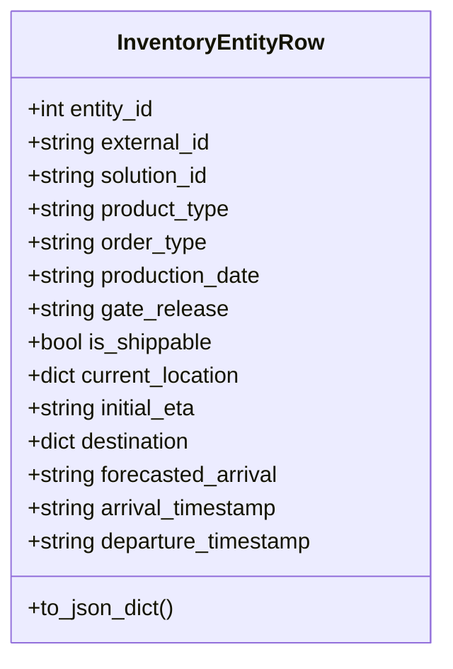

# Diagram: entity_core/entity_service/entity_inventory/entity_inventory_service/db/models/inventory_entity.py


> Auto-generated by Obscura crawlers

## Diagram 1



### SVG

<svg id="container" width="323.0625" xmlns="http://www.w3.org/2000/svg" class="classDiagram" height="472" viewBox="0 0 323.0625 472" role="graphics-document document" aria-roledescription="class"><style>#container{font-family:"trebuchet ms",verdana,arial,sans-serif;font-size:16px;fill:#333;}@keyframes edge-animation-frame{from{stroke-dashoffset:0;}}@keyframes dash{to{stroke-dashoffset:0;}}#container .edge-animation-slow{stroke-dasharray:9,5!important;stroke-dashoffset:900;animation:dash 50s linear infinite;stroke-linecap:round;}#container .edge-animation-fast{stroke-dasharray:9,5!important;stroke-dashoffset:900;animation:dash 20s linear infinite;stroke-linecap:round;}#container .error-icon{fill:#552222;}#container .error-text{fill:#552222;stroke:#552222;}#container .edge-thickness-normal{stroke-width:1px;}#container .edge-thickness-thick{stroke-width:3.5px;}#container .edge-pattern-solid{stroke-dasharray:0;}#container .edge-thickness-invisible{stroke-width:0;fill:none;}#container .edge-pattern-dashed{stroke-dasharray:3;}#container .edge-pattern-dotted{stroke-dasharray:2;}#container .marker{fill:#333333;stroke:#333333;}#container .marker.cross{stroke:#333333;}#container svg{font-family:"trebuchet ms",verdana,arial,sans-serif;font-size:16px;}#container p{margin:0;}#container g.classGroup text{fill:#9370DB;stroke:none;font-family:"trebuchet ms",verdana,arial,sans-serif;font-size:10px;}#container g.classGroup text .title{font-weight:bolder;}#container .nodeLabel,#container .edgeLabel{color:#131300;}#container .edgeLabel .label rect{fill:#ECECFF;}#container .label text{fill:#131300;}#container .labelBkg{background:#ECECFF;}#container .edgeLabel .label span{background:#ECECFF;}#container .classTitle{font-weight:bolder;}#container .node rect,#container .node circle,#container .node ellipse,#container .node polygon,#container .node path{fill:#ECECFF;stroke:#9370DB;stroke-width:1px;}#container .divider{stroke:#9370DB;stroke-width:1;}#container g.clickable{cursor:pointer;}#container g.classGroup rect{fill:#ECECFF;stroke:#9370DB;}#container g.classGroup line{stroke:#9370DB;stroke-width:1;}#container .classLabel .box{stroke:none;stroke-width:0;fill:#ECECFF;opacity:0.5;}#container .classLabel .label{fill:#9370DB;font-size:10px;}#container .relation{stroke:#333333;stroke-width:1;fill:none;}#container .dashed-line{stroke-dasharray:3;}#container .dotted-line{stroke-dasharray:1 2;}#container #compositionStart,#container .composition{fill:#333333!important;stroke:#333333!important;stroke-width:1;}#container #compositionEnd,#container .composition{fill:#333333!important;stroke:#333333!important;stroke-width:1;}#container #dependencyStart,#container .dependency{fill:#333333!important;stroke:#333333!important;stroke-width:1;}#container #dependencyStart,#container .dependency{fill:#333333!important;stroke:#333333!important;stroke-width:1;}#container #extensionStart,#container .extension{fill:transparent!important;stroke:#333333!important;stroke-width:1;}#container #extensionEnd,#container .extension{fill:transparent!important;stroke:#333333!important;stroke-width:1;}#container #aggregationStart,#container .aggregation{fill:transparent!important;stroke:#333333!important;stroke-width:1;}#container #aggregationEnd,#container .aggregation{fill:transparent!important;stroke:#333333!important;stroke-width:1;}#container #lollipopStart,#container .lollipop{fill:#ECECFF!important;stroke:#333333!important;stroke-width:1;}#container #lollipopEnd,#container .lollipop{fill:#ECECFF!important;stroke:#333333!important;stroke-width:1;}#container .edgeTerminals{font-size:11px;line-height:initial;}#container .classTitleText{text-anchor:middle;font-size:18px;fill:#333;}#container .label-icon{display:inline-block;height:1em;overflow:visible;vertical-align:-0.125em;}#container .node .label-icon path{fill:currentColor;stroke:revert;stroke-width:revert;}#container :root{--mermaid-font-family:"trebuchet ms",verdana,arial,sans-serif;}</style><g><defs><marker id="container_class-aggregationStart" class="marker aggregation class" refX="18" refY="7" markerWidth="190" markerHeight="240" orient="auto"><path d="M 18,7 L9,13 L1,7 L9,1 Z"></path></marker></defs><defs><marker id="container_class-aggregationEnd" class="marker aggregation class" refX="1" refY="7" markerWidth="20" markerHeight="28" orient="auto"><path d="M 18,7 L9,13 L1,7 L9,1 Z"></path></marker></defs><defs><marker id="container_class-extensionStart" class="marker extension class" refX="18" refY="7" markerWidth="190" markerHeight="240" orient="auto"><path d="M 1,7 L18,13 V 1 Z"></path></marker></defs><defs><marker id="container_class-extensionEnd" class="marker extension class" refX="1" refY="7" markerWidth="20" markerHeight="28" orient="auto"><path d="M 1,1 V 13 L18,7 Z"></path></marker></defs><defs><marker id="container_class-compositionStart" class="marker composition class" refX="18" refY="7" markerWidth="190" markerHeight="240" orient="auto"><path d="M 18,7 L9,13 L1,7 L9,1 Z"></path></marker></defs><defs><marker id="container_class-compositionEnd" class="marker composition class" refX="1" refY="7" markerWidth="20" markerHeight="28" orient="auto"><path d="M 18,7 L9,13 L1,7 L9,1 Z"></path></marker></defs><defs><marker id="container_class-dependencyStart" class="marker dependency class" refX="6" refY="7" markerWidth="190" markerHeight="240" orient="auto"><path d="M 5,7 L9,13 L1,7 L9,1 Z"></path></marker></defs><defs><marker id="container_class-dependencyEnd" class="marker dependency class" refX="13" refY="7" markerWidth="20" markerHeight="28" orient="auto"><path d="M 18,7 L9,13 L14,7 L9,1 Z"></path></marker></defs><defs><marker id="container_class-lollipopStart" class="marker lollipop class" refX="13" refY="7" markerWidth="190" markerHeight="240" orient="auto"><circle stroke="black" fill="transparent" cx="7" cy="7" r="6"></circle></marker></defs><defs><marker id="container_class-lollipopEnd" class="marker lollipop class" refX="1" refY="7" markerWidth="190" markerHeight="240" orient="auto"><circle stroke="black" fill="transparent" cx="7" cy="7" r="6"></circle></marker></defs><g class="root"><g class="clusters"></g><g class="edgePaths"></g><g class="edgeLabels"></g><g class="nodes"><g class="node default" id="classId-InventoryEntityRow-0" transform="translate(161.53125, 236)"><g class="basic label-container"><path d="M-153.53125 -228 L153.53125 -228 L153.53125 228 L-153.53125 228" stroke="none" stroke-width="0" fill="#ECECFF" style=""></path><path d="M-153.53125 -228 C-31.849597328131125 -228, 89.83205534373775 -228, 153.53125 -228 M-153.53125 -228 C-69.6511298559574 -228, 14.228990288085214 -228, 153.53125 -228 M153.53125 -228 C153.53125 -78.20088517072108, 153.53125 71.59822965855784, 153.53125 228 M153.53125 -228 C153.53125 -106.94667655010367, 153.53125 14.10664689979265, 153.53125 228 M153.53125 228 C83.1552872146501 228, 12.779324429300203 228, -153.53125 228 M153.53125 228 C37.26079574263753 228, -79.00965851472495 228, -153.53125 228 M-153.53125 228 C-153.53125 51.87180468035325, -153.53125 -124.2563906392935, -153.53125 -228 M-153.53125 228 C-153.53125 74.13136191121214, -153.53125 -79.73727617757572, -153.53125 -228" stroke="#9370DB" stroke-width="1.3" fill="none" stroke-dasharray="0 0" style=""></path></g><g class="annotation-group text" transform="translate(0, -204)"></g><g class="label-group text" transform="translate(-71.71875, -204)"><g class="label" style="font-weight: bolder" transform="translate(0,-12)"><foreignObject width="143.4375" height="24"><div xmlns="http://www.w3.org/1999/xhtml" style="display: table-cell; white-space: nowrap; line-height: 1.5; max-width: 191px; text-align: center;"><span class="nodeLabel markdown-node-label" style=""><p>InventoryEntityRow</p></span></div></foreignObject></g></g><g class="members-group text" transform="translate(-141.53125, -156)"><g class="label" style="" transform="translate(0,-12)"><foreignObject width="95.765625" height="24"><div xmlns="http://www.w3.org/1999/xhtml" style="display: table-cell; white-space: nowrap; line-height: 1.5; max-width: 153px; text-align: center;"><span class="nodeLabel markdown-node-label" style=""><p>+int entity_id</p></span></div></foreignObject></g><g class="label" style="" transform="translate(0,12)"><foreignObject width="135.640625" height="24"><div xmlns="http://www.w3.org/1999/xhtml" style="display: table-cell; white-space: nowrap; line-height: 1.5; max-width: 193px; text-align: center;"><span class="nodeLabel markdown-node-label" style=""><p>+string external_id</p></span></div></foreignObject></g><g class="label" style="" transform="translate(0,36)"><foreignObject width="136.09375" height="24"><div xmlns="http://www.w3.org/1999/xhtml" style="display: table-cell; white-space: nowrap; line-height: 1.5; max-width: 193px; text-align: center;"><span class="nodeLabel markdown-node-label" style=""><p>+string solution_id</p></span></div></foreignObject></g><g class="label" style="" transform="translate(0,60)"><foreignObject width="150.5" height="24"><div xmlns="http://www.w3.org/1999/xhtml" style="display: table-cell; white-space: nowrap; line-height: 1.5; max-width: 208px; text-align: center;"><span class="nodeLabel markdown-node-label" style=""><p>+string product_type</p></span></div></foreignObject></g><g class="label" style="" transform="translate(0,84)"><foreignObject width="131.875" height="24"><div xmlns="http://www.w3.org/1999/xhtml" style="display: table-cell; white-space: nowrap; line-height: 1.5; max-width: 189px; text-align: center;"><span class="nodeLabel markdown-node-label" style=""><p>+string order_type</p></span></div></foreignObject></g><g class="label" style="" transform="translate(0,108)"><foreignObject width="174.46875" height="24"><div xmlns="http://www.w3.org/1999/xhtml" style="display: table-cell; white-space: nowrap; line-height: 1.5; max-width: 232px; text-align: center;"><span class="nodeLabel markdown-node-label" style=""><p>+string production_date</p></span></div></foreignObject></g><g class="label" style="" transform="translate(0,132)"><foreignObject width="145.15625" height="24"><div xmlns="http://www.w3.org/1999/xhtml" style="display: table-cell; white-space: nowrap; line-height: 1.5; max-width: 203px; text-align: center;"><span class="nodeLabel markdown-node-label" style=""><p>+string gate_release</p></span></div></foreignObject></g><g class="label" style="" transform="translate(0,156)"><foreignObject width="136.84375" height="24"><div xmlns="http://www.w3.org/1999/xhtml" style="display: table-cell; white-space: nowrap; line-height: 1.5; max-width: 194px; text-align: center;"><span class="nodeLabel markdown-node-label" style=""><p>+bool is_shippable</p></span></div></foreignObject></g><g class="label" style="" transform="translate(0,180)"><foreignObject width="159.59375" height="24"><div xmlns="http://www.w3.org/1999/xhtml" style="display: table-cell; white-space: nowrap; line-height: 1.5; max-width: 217px; text-align: center;"><span class="nodeLabel markdown-node-label" style=""><p>+dict current_location</p></span></div></foreignObject></g><g class="label" style="" transform="translate(0,204)"><foreignObject width="126.875" height="24"><div xmlns="http://www.w3.org/1999/xhtml" style="display: table-cell; white-space: nowrap; line-height: 1.5; max-width: 184px; text-align: center;"><span class="nodeLabel markdown-node-label" style=""><p>+string initial_eta</p></span></div></foreignObject></g><g class="label" style="" transform="translate(0,228)"><foreignObject width="122.875" height="24"><div xmlns="http://www.w3.org/1999/xhtml" style="display: table-cell; white-space: nowrap; line-height: 1.5; max-width: 180px; text-align: center;"><span class="nodeLabel markdown-node-label" style=""><p>+dict destination</p></span></div></foreignObject></g><g class="label" style="" transform="translate(0,252)"><foreignObject width="184.5625" height="24"><div xmlns="http://www.w3.org/1999/xhtml" style="display: table-cell; white-space: nowrap; line-height: 1.5; max-width: 242px; text-align: center;"><span class="nodeLabel markdown-node-label" style=""><p>+string forecasted_arrival</p></span></div></foreignObject></g><g class="label" style="" transform="translate(0,276)"><foreignObject width="186.0625" height="24"><div xmlns="http://www.w3.org/1999/xhtml" style="display: table-cell; white-space: nowrap; line-height: 1.5; max-width: 243px; text-align: center;"><span class="nodeLabel markdown-node-label" style=""><p>+string arrival_timestamp</p></span></div></foreignObject></g><g class="label" style="" transform="translate(0,300)"><foreignObject width="211.34375" height="24"><div xmlns="http://www.w3.org/1999/xhtml" style="display: table-cell; white-space: nowrap; line-height: 1.5; max-width: 269px; text-align: center;"><span class="nodeLabel markdown-node-label" style=""><p>+string departure_timestamp</p></span></div></foreignObject></g></g><g class="methods-group text" transform="translate(-141.53125, 204)"><g class="label" style="" transform="translate(0,-12)"><foreignObject width="107.90625" height="24"><div xmlns="http://www.w3.org/1999/xhtml" style="display: table-cell; white-space: nowrap; line-height: 1.5; max-width: 165px; text-align: center;"><span class="nodeLabel markdown-node-label" style=""><p>+to_json_dict()</p></span></div></foreignObject></g></g><g class="divider" style=""><path d="M-153.53125 -180 C-74.94162161855202 -180, 3.6480067628959603 -180, 153.53125 -180 M-153.53125 -180 C-85.33642401471397 -180, -17.14159802942794 -180, 153.53125 -180" stroke="#9370DB" stroke-width="1.3" fill="none" stroke-dasharray="0 0" style=""></path></g><g class="divider" style=""><path d="M-153.53125 180 C-49.82233565350582 180, 53.886578692988365 180, 153.53125 180 M-153.53125 180 C-35.14434852987162 180, 83.24255294025676 180, 153.53125 180" stroke="#9370DB" stroke-width="1.3" fill="none" stroke-dasharray="0 0" style=""></path></g></g></g></g></g></svg>

## Diagram 2

```mermaid
flowchart LR
IE[InventoryEntityRow] -->|to_json_dict()| JSON[JSON Object]
JSON --> EID["entityId = entity_id"]
JSON --> EXT["externalId = external_id"]
JSON --> SOL["solutionId = solution_id"]
JSON --> PT["productType = product_type"]
JSON --> OT["orderType = order_type"]
JSON --> PD["productionDate = production_date"]
JSON --> GR["gateRelease = gate_release"]
JSON --> SH["isShippable = is_shippable"]
JSON --> CL["currentLocation = current_location"]
JSON --> IEta["initialEta = initial_eta"]
JSON --> DST["destination = destination"]
JSON --> FA["forecastedArrival = forecasted_arrival"]
JSON --> AT["arrivalTimestamp = arrival_timestamp"]
JSON --> DT["departureTimestamp = departure_timestamp"]
```

> SVG rendering failed for this diagram.
