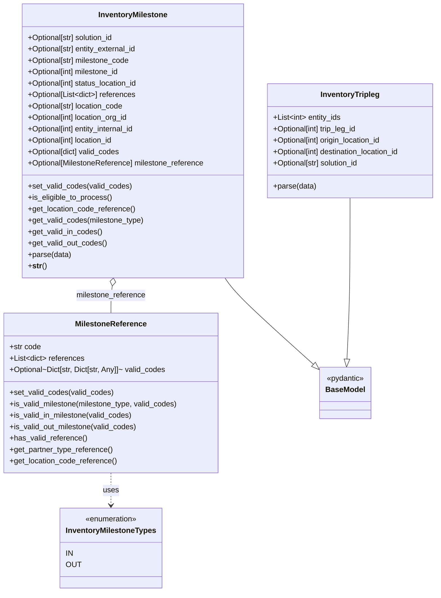

# Diagram: entity_core/entity_service/entity_inventory/entity_inventory_service/db/models/inventory_events.py

> Auto-generated by Obscura crawlers

## Mermaid

> SVG rendering failed for this diagram.
