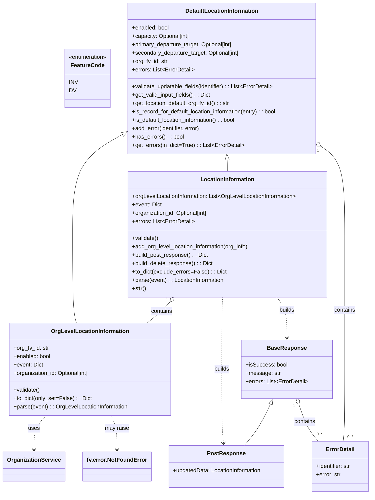

# Diagram: entity_core/entity_service/entity_inventory/entity_inventory_service/db/models/inventory_location_information.py


> Auto-generated by Obscura crawlers

## Diagram 1



### SVG

<svg id="container" width="1050.5703125" xmlns="http://www.w3.org/2000/svg" class="classDiagram" height="1414" viewBox="0 0 1050.5703125 1414" role="graphics-document document" aria-roledescription="class"><style>#container{font-family:"trebuchet ms",verdana,arial,sans-serif;font-size:16px;fill:#333;}@keyframes edge-animation-frame{from{stroke-dashoffset:0;}}@keyframes dash{to{stroke-dashoffset:0;}}#container .edge-animation-slow{stroke-dasharray:9,5!important;stroke-dashoffset:900;animation:dash 50s linear infinite;stroke-linecap:round;}#container .edge-animation-fast{stroke-dasharray:9,5!important;stroke-dashoffset:900;animation:dash 20s linear infinite;stroke-linecap:round;}#container .error-icon{fill:#552222;}#container .error-text{fill:#552222;stroke:#552222;}#container .edge-thickness-normal{stroke-width:1px;}#container .edge-thickness-thick{stroke-width:3.5px;}#container .edge-pattern-solid{stroke-dasharray:0;}#container .edge-thickness-invisible{stroke-width:0;fill:none;}#container .edge-pattern-dashed{stroke-dasharray:3;}#container .edge-pattern-dotted{stroke-dasharray:2;}#container .marker{fill:#333333;stroke:#333333;}#container .marker.cross{stroke:#333333;}#container svg{font-family:"trebuchet ms",verdana,arial,sans-serif;font-size:16px;}#container p{margin:0;}#container g.classGroup text{fill:#9370DB;stroke:none;font-family:"trebuchet ms",verdana,arial,sans-serif;font-size:10px;}#container g.classGroup text .title{font-weight:bolder;}#container .nodeLabel,#container .edgeLabel{color:#131300;}#container .edgeLabel .label rect{fill:#ECECFF;}#container .label text{fill:#131300;}#container .labelBkg{background:#ECECFF;}#container .edgeLabel .label span{background:#ECECFF;}#container .classTitle{font-weight:bolder;}#container .node rect,#container .node circle,#container .node ellipse,#container .node polygon,#container .node path{fill:#ECECFF;stroke:#9370DB;stroke-width:1px;}#container .divider{stroke:#9370DB;stroke-width:1;}#container g.clickable{cursor:pointer;}#container g.classGroup rect{fill:#ECECFF;stroke:#9370DB;}#container g.classGroup line{stroke:#9370DB;stroke-width:1;}#container .classLabel .box{stroke:none;stroke-width:0;fill:#ECECFF;opacity:0.5;}#container .classLabel .label{fill:#9370DB;font-size:10px;}#container .relation{stroke:#333333;stroke-width:1;fill:none;}#container .dashed-line{stroke-dasharray:3;}#container .dotted-line{stroke-dasharray:1 2;}#container #compositionStart,#container .composition{fill:#333333!important;stroke:#333333!important;stroke-width:1;}#container #compositionEnd,#container .composition{fill:#333333!important;stroke:#333333!important;stroke-width:1;}#container #dependencyStart,#container .dependency{fill:#333333!important;stroke:#333333!important;stroke-width:1;}#container #dependencyStart,#container .dependency{fill:#333333!important;stroke:#333333!important;stroke-width:1;}#container #extensionStart,#container .extension{fill:transparent!important;stroke:#333333!important;stroke-width:1;}#container #extensionEnd,#container .extension{fill:transparent!important;stroke:#333333!important;stroke-width:1;}#container #aggregationStart,#container .aggregation{fill:transparent!important;stroke:#333333!important;stroke-width:1;}#container #aggregationEnd,#container .aggregation{fill:transparent!important;stroke:#333333!important;stroke-width:1;}#container #lollipopStart,#container .lollipop{fill:#ECECFF!important;stroke:#333333!important;stroke-width:1;}#container #lollipopEnd,#container .lollipop{fill:#ECECFF!important;stroke:#333333!important;stroke-width:1;}#container .edgeTerminals{font-size:11px;line-height:initial;}#container .classTitleText{text-anchor:middle;font-size:18px;fill:#333;}#container .label-icon{display:inline-block;height:1em;overflow:visible;vertical-align:-0.125em;}#container .node .label-icon path{fill:currentColor;stroke:revert;stroke-width:revert;}#container :root{--mermaid-font-family:"trebuchet ms",verdana,arial,sans-serif;}</style><g><defs><marker id="container_class-aggregationStart" class="marker aggregation class" refX="18" refY="7" markerWidth="190" markerHeight="240" orient="auto"><path d="M 18,7 L9,13 L1,7 L9,1 Z"></path></marker></defs><defs><marker id="container_class-aggregationEnd" class="marker aggregation class" refX="1" refY="7" markerWidth="20" markerHeight="28" orient="auto"><path d="M 18,7 L9,13 L1,7 L9,1 Z"></path></marker></defs><defs><marker id="container_class-extensionStart" class="marker extension class" refX="18" refY="7" markerWidth="190" markerHeight="240" orient="auto"><path d="M 1,7 L18,13 V 1 Z"></path></marker></defs><defs><marker id="container_class-extensionEnd" class="marker extension class" refX="1" refY="7" markerWidth="20" markerHeight="28" orient="auto"><path d="M 1,1 V 13 L18,7 Z"></path></marker></defs><defs><marker id="container_class-compositionStart" class="marker composition class" refX="18" refY="7" markerWidth="190" markerHeight="240" orient="auto"><path d="M 18,7 L9,13 L1,7 L9,1 Z"></path></marker></defs><defs><marker id="container_class-compositionEnd" class="marker composition class" refX="1" refY="7" markerWidth="20" markerHeight="28" orient="auto"><path d="M 18,7 L9,13 L1,7 L9,1 Z"></path></marker></defs><defs><marker id="container_class-dependencyStart" class="marker dependency class" refX="6" refY="7" markerWidth="190" markerHeight="240" orient="auto"><path d="M 5,7 L9,13 L1,7 L9,1 Z"></path></marker></defs><defs><marker id="container_class-dependencyEnd" class="marker dependency class" refX="13" refY="7" markerWidth="20" markerHeight="28" orient="auto"><path d="M 18,7 L9,13 L14,7 L9,1 Z"></path></marker></defs><defs><marker id="container_class-lollipopStart" class="marker lollipop class" refX="13" refY="7" markerWidth="190" markerHeight="240" orient="auto"><circle stroke="black" fill="transparent" cx="7" cy="7" r="6"></circle></marker></defs><defs><marker id="container_class-lollipopEnd" class="marker lollipop class" refX="1" refY="7" markerWidth="190" markerHeight="240" orient="auto"><circle stroke="black" fill="transparent" cx="7" cy="7" r="6"></circle></marker></defs><g class="root"><g class="clusters"></g><g class="edgePaths"><path d="M331.766,386.432L308.375,399.527C284.983,412.621,238.199,438.811,214.808,486.072C191.416,533.333,191.416,601.667,191.416,672C191.416,742.333,191.416,814.667,193.273,857C195.13,899.333,198.844,911.667,200.701,917.833L202.558,924" id="id_DefaultLocationInformation_OrgLevelLocationInformation_1" class="edge-thickness-normal edge-pattern-solid relation" style=";;;" data-edge="true" data-et="edge" data-id="id_DefaultLocationInformation_OrgLevelLocationInformation_1" data-points="W3sieCI6MzQ2LjgxODM1OTM3NSwieSI6Mzc4LjAwNTkzNDA3MTkxNjZ9LHsieCI6MTkxLjQxNjAxNTYyNSwieSI6NDY1fSx7IngiOjE5MS40MTYwMTU2MjUsInkiOjY3MH0seyJ4IjoxOTEuNDE2MDE1NjI1LCJ5Ijo4ODd9LHsieCI6MjAyLjU1Nzc1MDA5MjQ1NTYyLCJ5Ijo5MjR9XQ==" marker-start="url(#container_class-extensionStart)"></path><path d="M634.248,457.226L634.316,458.522C634.384,459.817,634.521,462.409,634.59,467.871C634.658,473.333,634.658,481.667,634.658,485.833L634.658,490" id="id_DefaultLocationInformation_LocationInformation_2" class="edge-thickness-normal edge-pattern-solid relation" style=";;;" data-edge="true" data-et="edge" data-id="id_DefaultLocationInformation_LocationInformation_2" data-points="W3sieCI6NjMzLjMzNzYxNTA4MDM5NDIsInkiOjQ0MH0seyJ4Ijo2MzQuNjU4MjAzMTI1LCJ5Ijo0NjV9LHsieCI6NjM0LjY1ODIwMzEyNSwieSI6NDkwfV0=" marker-start="url(#container_class-extensionStart)"></path><path d="M760.666,1155.537L755.082,1167.114C749.498,1178.692,738.331,1201.846,725.714,1221.59C713.097,1241.333,699.03,1257.667,691.997,1265.833L684.963,1274" id="id_BaseResponse_PostResponse_3" class="edge-thickness-normal edge-pattern-solid relation" style=";;;" data-edge="true" data-et="edge" data-id="id_BaseResponse_PostResponse_3" data-points="W3sieCI6NzY4LjE1OTExNjEyNDI2MDMsInkiOjExNDB9LHsieCI6NzI3LjE2NDA2MjUsInkiOjEyMjV9LHsieCI6Njg0Ljk2MzM3NDQyNjYwNTUsInkiOjEyNzR9XQ==" marker-start="url(#container_class-extensionStart)"></path><path d="M911.245,423.221L921.357,430.184C931.469,437.147,951.694,451.074,961.806,492.203C971.918,533.333,971.918,601.667,971.918,672C971.918,742.333,971.918,814.667,971.918,879C971.918,943.333,971.918,999.667,971.918,1056C971.918,1112.333,971.918,1168.667,971.218,1203C970.519,1237.333,969.119,1249.667,968.42,1255.833L967.72,1262" id="id_DefaultLocationInformation_ErrorDetail_4" class="edge-thickness-normal edge-pattern-solid relation" style=";;;" data-edge="true" data-et="edge" data-id="id_DefaultLocationInformation_ErrorDetail_4" data-points="W3sieCI6ODk3LjAzNzEwOTM3NSwieSI6NDEzLjQzNzc0MTAwODM5ODd9LHsieCI6OTcxLjkxNzk2ODc1LCJ5Ijo0NjV9LHsieCI6OTcxLjkxNzk2ODc1LCJ5Ijo2NzB9LHsieCI6OTcxLjkxNzk2ODc1LCJ5Ijo4ODd9LHsieCI6OTcxLjkxNzk2ODc1LCJ5IjoxMDU2fSx7IngiOjk3MS45MTc5Njg3NSwieSI6MTIyNX0seyJ4Ijo5NjcuNzE5OTMyNjI2MTQ2OCwieSI6MTI2Mn1d" marker-start="url(#container_class-aggregationStart)"></path><path d="M842.036,1156.369L845.838,1167.808C849.64,1179.246,857.245,1202.123,866.405,1219.728C875.565,1237.333,886.28,1249.667,891.638,1255.833L896.996,1262" id="id_BaseResponse_ErrorDetail_5" class="edge-thickness-normal edge-pattern-solid relation" style=";;;" data-edge="true" data-et="edge" data-id="id_BaseResponse_ErrorDetail_5" data-points="W3sieCI6ODM2LjU5NDUzNTg3Mjc4MTEsInkiOjExNDB9LHsieCI6ODY0Ljg0OTYwOTM3NSwieSI6MTIyNX0seyJ4Ijo4OTYuOTk1ODc4NzI3MDY0MiwieSI6MTI2Mn1d" marker-start="url(#container_class-aggregationStart)"></path><path d="M472.401,863.21L469.071,867.175C465.741,871.14,459.082,879.07,448.085,889.202C437.088,899.333,421.754,911.667,414.087,917.833L406.42,924" id="id_LocationInformation_OrgLevelLocationInformation_6" class="edge-thickness-normal edge-pattern-solid relation" style=";;;" data-edge="true" data-et="edge" data-id="id_LocationInformation_OrgLevelLocationInformation_6" data-points="W3sieCI6NDgzLjQ5NDQyODY0MzQzMzE0LCJ5Ijo4NTB9LHsieCI6NDUyLjQyMTg3NSwieSI6ODg3fSx7IngiOjQwNi40MjAzMTQ4MTEzOTA1NCwieSI6OTI0fV0=" marker-start="url(#container_class-aggregationStart)"></path><path d="M125.957,1188L120.521,1194.167C115.086,1200.333,104.215,1212.667,98.779,1229C93.344,1245.333,93.344,1265.667,93.344,1275.833L93.344,1286" id="id_OrgLevelLocationInformation_OrganizationService_7" class="edge-thickness-normal edge-pattern-dashed relation" style=";;;" data-edge="true" data-et="edge" data-id="id_OrgLevelLocationInformation_OrganizationService_7" data-points="W3sieCI6MTI1Ljk1NjkyNzIzNzQyNjAzLCJ5IjoxMTg4fSx7IngiOjkzLjM0Mzc1LCJ5IjoxMjI1fSx7IngiOjkzLjM0Mzc1LCJ5IjoxMjkyfV0=" marker-end="url(#container_class-dependencyEnd)"></path><path d="M304.9,1188L307.824,1194.167C310.749,1200.333,316.597,1212.667,319.521,1229C322.445,1245.333,322.445,1265.667,322.445,1275.833L322.445,1286" id="id_OrgLevelLocationInformation_fv.error.NotFoundError_8" class="edge-thickness-normal edge-pattern-dashed relation" style=";;;" data-edge="true" data-et="edge" data-id="id_OrgLevelLocationInformation_fv.error.NotFoundError_8" data-points="W3sieCI6MzA0LjkwMDE1OTQ4NTk0Njc0LCJ5IjoxMTg4fSx7IngiOjMyMi40NDUzMTI1LCJ5IjoxMjI1fSx7IngiOjMyMi40NDUzMTI1LCJ5IjoxMjkyfV0=" marker-end="url(#container_class-dependencyEnd)"></path><path d="M624.098,850L623.737,856.167C623.375,862.333,622.651,874.667,622.29,909C621.928,943.333,621.928,999.667,621.928,1056C621.928,1112.333,621.928,1168.667,622.675,1204.005C623.423,1239.344,624.918,1253.688,625.666,1260.86L626.413,1268.032" id="id_LocationInformation_PostResponse_9" class="edge-thickness-normal edge-pattern-dashed relation" style=";;;" data-edge="true" data-et="edge" data-id="id_LocationInformation_PostResponse_9" data-points="W3sieCI6NjI0LjA5ODM2NzI5NTUwNjksInkiOjg1MH0seyJ4Ijo2MjEuOTI3NzM0Mzc1LCJ5Ijo4ODd9LHsieCI6NjIxLjkyNzczNDM3NSwieSI6MTA1Nn0seyJ4Ijo2MjEuOTI3NzM0Mzc1LCJ5IjoxMjI1fSx7IngiOjYyNy4wMzUxMjA0MTI4NDQsInkiOjEyNzR9XQ==" marker-end="url(#container_class-dependencyEnd)"></path><path d="M779.001,850L783.946,856.167C788.892,862.333,798.782,874.667,803.727,894C808.672,913.333,808.672,939.667,808.672,952.833L808.672,966" id="id_LocationInformation_BaseResponse_10" class="edge-thickness-normal edge-pattern-dashed relation" style=";;;" data-edge="true" data-et="edge" data-id="id_LocationInformation_BaseResponse_10" data-points="W3sieCI6Nzc5LjAwMTM0MTA4NTgyOTUsInkiOjg1MH0seyJ4Ijo4MDguNjcxODc1LCJ5Ijo4ODd9LHsieCI6ODA4LjY3MTg3NSwieSI6OTcyfV0=" marker-end="url(#container_class-dependencyEnd)"></path></g><g class="edgeLabels"><g class="edgeLabel"><g class="label" data-id="id_DefaultLocationInformation_OrgLevelLocationInformation_1" transform="translate(0, 0)"><foreignObject width="0" height="0"><div xmlns="http://www.w3.org/1999/xhtml" class="labelBkg" style="display: table-cell; white-space: nowrap; line-height: 1.5; max-width: 200px; text-align: center;"><span class="edgeLabel"></span></div></foreignObject></g></g><g class="edgeLabel"><g class="label" data-id="id_DefaultLocationInformation_LocationInformation_2" transform="translate(0, 0)"><foreignObject width="0" height="0"><div xmlns="http://www.w3.org/1999/xhtml" class="labelBkg" style="display: table-cell; white-space: nowrap; line-height: 1.5; max-width: 200px; text-align: center;"><span class="edgeLabel"></span></div></foreignObject></g></g><g class="edgeLabel"><g class="label" data-id="id_BaseResponse_PostResponse_3" transform="translate(0, 0)"><foreignObject width="0" height="0"><div xmlns="http://www.w3.org/1999/xhtml" class="labelBkg" style="display: table-cell; white-space: nowrap; line-height: 1.5; max-width: 200px; text-align: center;"><span class="edgeLabel"></span></div></foreignObject></g></g><g class="edgeLabel" transform="translate(971.91796875, 887)"><g class="label" data-id="id_DefaultLocationInformation_ErrorDetail_4" transform="translate(-30.890625, -12)"><foreignObject width="61.78125" height="24"><div xmlns="http://www.w3.org/1999/xhtml" class="labelBkg" style="display: table-cell; white-space: nowrap; line-height: 1.5; max-width: 200px; text-align: center;"><span class="edgeLabel"><p>contains</p></span></div></foreignObject></g></g><g class="edgeLabel" transform="translate(858.45261, 1205.75585)"><g class="label" data-id="id_BaseResponse_ErrorDetail_5" transform="translate(-30.890625, -12)"><foreignObject width="61.78125" height="24"><div xmlns="http://www.w3.org/1999/xhtml" class="labelBkg" style="display: table-cell; white-space: nowrap; line-height: 1.5; max-width: 200px; text-align: center;"><span class="edgeLabel"><p>contains</p></span></div></foreignObject></g></g><g class="edgeLabel" transform="translate(448.24586, 890.35886)"><g class="label" data-id="id_LocationInformation_OrgLevelLocationInformation_6" transform="translate(-30.890625, -12)"><foreignObject width="61.78125" height="24"><div xmlns="http://www.w3.org/1999/xhtml" class="labelBkg" style="display: table-cell; white-space: nowrap; line-height: 1.5; max-width: 200px; text-align: center;"><span class="edgeLabel"><p>contains</p></span></div></foreignObject></g></g><g class="edgeLabel" transform="translate(93.34375, 1225)"><g class="label" data-id="id_OrgLevelLocationInformation_OrganizationService_7" transform="translate(-16.4921875, -12)"><foreignObject width="32.984375" height="24"><div xmlns="http://www.w3.org/1999/xhtml" class="labelBkg" style="display: table-cell; white-space: nowrap; line-height: 1.5; max-width: 200px; text-align: center;"><span class="edgeLabel"><p>uses</p></span></div></foreignObject></g></g><g class="edgeLabel" transform="translate(322.4453125, 1225)"><g class="label" data-id="id_OrgLevelLocationInformation_fv.error.NotFoundError_8" transform="translate(-34.65625, -12)"><foreignObject width="69.3125" height="24"><div xmlns="http://www.w3.org/1999/xhtml" class="labelBkg" style="display: table-cell; white-space: nowrap; line-height: 1.5; max-width: 200px; text-align: center;"><span class="edgeLabel"><p>may raise</p></span></div></foreignObject></g></g><g class="edgeLabel" transform="translate(621.927734375, 1056)"><g class="label" data-id="id_LocationInformation_PostResponse_9" transform="translate(-22.4921875, -12)"><foreignObject width="44.984375" height="24"><div xmlns="http://www.w3.org/1999/xhtml" class="labelBkg" style="display: table-cell; white-space: nowrap; line-height: 1.5; max-width: 200px; text-align: center;"><span class="edgeLabel"><p>builds</p></span></div></foreignObject></g></g><g class="edgeLabel" transform="translate(808.671875, 887)"><g class="label" data-id="id_LocationInformation_BaseResponse_10" transform="translate(-22.4921875, -12)"><foreignObject width="44.984375" height="24"><div xmlns="http://www.w3.org/1999/xhtml" class="labelBkg" style="display: table-cell; white-space: nowrap; line-height: 1.5; max-width: 200px; text-align: center;"><span class="edgeLabel"><p>builds</p></span></div></foreignObject></g></g><g class="edgeTerminals" transform="translate(902.9434208058391, 435.7170011359198)"><g class="inner" transform="translate(0, 0)"><foreignObject style="width: 9px; height: 12px;"><div xmlns="http://www.w3.org/1999/xhtml" style="display: inline-block; padding-right: 1px; white-space: nowrap;"><span class="edgeLabel">1</span></div></foreignObject></g></g><g class="edgeTerminals" transform="translate(827.8805813141711, 1161.3381587385988)"><g class="inner" transform="translate(0, 0)"><foreignObject style="width: 9px; height: 12px;"><div xmlns="http://www.w3.org/1999/xhtml" style="display: inline-block; padding-right: 1px; white-space: nowrap;"><span class="edgeLabel">1</span></div></foreignObject></g></g><g class="edgeTerminals" transform="translate(460.75343695983275, 853.7546402830179)"><g class="inner" transform="translate(0, 0)"><foreignObject style="width: 9px; height: 12px;"><div xmlns="http://www.w3.org/1999/xhtml" style="display: inline-block; padding-right: 1px; white-space: nowrap;"><span class="edgeLabel">1</span></div></foreignObject></g></g><g class="edgeTerminals" transform="translate(979.5972041464154, 1241.3026210146654)"><g class="inner" transform="translate(0, 0)"></g><foreignObject style="width: 36px; height: 12px;"><div xmlns="http://www.w3.org/1999/xhtml" style="display: inline-block; padding-right: 1px; white-space: nowrap;"><span class="edgeLabel">0..*</span></div></foreignObject></g><g class="edgeTerminals" transform="translate(891.8416468444627, 1233.9516544438322)"><g class="inner" transform="translate(0, 0)"></g><foreignObject style="width: 36px; height: 12px;"><div xmlns="http://www.w3.org/1999/xhtml" style="display: inline-block; padding-right: 1px; white-space: nowrap;"><span class="edgeLabel">0..*</span></div></foreignObject></g><g class="edgeTerminals" transform="translate(424.4579180338927, 919.7203078309433)"><g class="inner" transform="translate(0, 0)"></g><foreignObject style="width: 36px; height: 12px;"><div xmlns="http://www.w3.org/1999/xhtml" style="display: inline-block; padding-right: 1px; white-space: nowrap;"><span class="edgeLabel">0..*</span></div></foreignObject></g></g><g class="nodes"><g class="node default" id="classId-FeatureCode-0" transform="translate(229.263671875, 224)"><g class="basic label-container"><path d="M-67.5546875 -84 L67.5546875 -84 L67.5546875 84 L-67.5546875 84" stroke="none" stroke-width="0" fill="#ECECFF" style=""></path><path d="M-67.5546875 -84 C-28.017670481435424 -84, 11.519346537129152 -84, 67.5546875 -84 M-67.5546875 -84 C-30.00703650665799 -84, 7.540614486684021 -84, 67.5546875 -84 M67.5546875 -84 C67.5546875 -24.31371046363845, 67.5546875 35.3725790727231, 67.5546875 84 M67.5546875 -84 C67.5546875 -30.111704894443434, 67.5546875 23.77659021111313, 67.5546875 84 M67.5546875 84 C18.999941962949194 84, -29.554803574101612 84, -67.5546875 84 M67.5546875 84 C38.99514145384722 84, 10.435595407694436 84, -67.5546875 84 M-67.5546875 84 C-67.5546875 44.39816080708233, -67.5546875 4.796321614164654, -67.5546875 -84 M-67.5546875 84 C-67.5546875 25.68979228949928, -67.5546875 -32.62041542100144, -67.5546875 -84" stroke="#9370DB" stroke-width="1.3" fill="none" stroke-dasharray="0 0" style=""></path></g><g class="annotation-group text" transform="translate(-55.5546875, -60)"><g class="label" style="" transform="translate(0,-12)"><foreignObject width="111.109375" height="24"><div xmlns="http://www.w3.org/1999/xhtml" style="display: table-cell; white-space: nowrap; line-height: 1.5; max-width: 161px; text-align: center;"><span class="nodeLabel markdown-node-label" style=""><p>«enumeration»</p></span></div></foreignObject></g></g><g class="label-group text" transform="translate(-45.71875, -36)"><g class="label" style="font-weight: bolder" transform="translate(0,-12)"><foreignObject width="91.4375" height="24"><div xmlns="http://www.w3.org/1999/xhtml" style="display: table-cell; white-space: nowrap; line-height: 1.5; max-width: 140px; text-align: center;"><span class="nodeLabel markdown-node-label" style=""><p>FeatureCode</p></span></div></foreignObject></g></g><g class="members-group text" transform="translate(-55.5546875, 12)"><g class="label" style="" transform="translate(0,-12)"><foreignObject width="24.546875" height="24"><div xmlns="http://www.w3.org/1999/xhtml" style="display: table-cell; white-space: nowrap; line-height: 1.5; max-width: 75px; text-align: center;"><span class="nodeLabel markdown-node-label" style=""><p>INV</p></span></div></foreignObject></g><g class="label" style="" transform="translate(0,12)"><foreignObject width="19.125" height="24"><div xmlns="http://www.w3.org/1999/xhtml" style="display: table-cell; white-space: nowrap; line-height: 1.5; max-width: 69px; text-align: center;"><span class="nodeLabel markdown-node-label" style=""><p>DV</p></span></div></foreignObject></g></g><g class="methods-group text" transform="translate(-55.5546875, 84)"></g><g class="divider" style=""><path d="M-67.5546875 -12 C-22.3604376430129 -12, 22.8338122139742 -12, 67.5546875 -12 M-67.5546875 -12 C-13.644469829904466 -12, 40.26574784019107 -12, 67.5546875 -12" stroke="#9370DB" stroke-width="1.3" fill="none" stroke-dasharray="0 0" style=""></path></g><g class="divider" style=""><path d="M-67.5546875 60 C-13.704473836487274 60, 40.14573982702545 60, 67.5546875 60 M-67.5546875 60 C-35.24605263081116 60, -2.9374177616223136 60, 67.5546875 60" stroke="#9370DB" stroke-width="1.3" fill="none" stroke-dasharray="0 0" style=""></path></g></g><g class="node default" id="classId-ErrorDetail-1" transform="translate(959.55078125, 1334)"><g class="basic label-container"><path d="M-83.01953125 -72 L83.01953125 -72 L83.01953125 72 L-83.01953125 72" stroke="none" stroke-width="0" fill="#ECECFF" style=""></path><path d="M-83.01953125 -72 C-43.27557156927764 -72, -3.5316118885552754 -72, 83.01953125 -72 M-83.01953125 -72 C-19.647453238488644 -72, 43.72462477302271 -72, 83.01953125 -72 M83.01953125 -72 C83.01953125 -29.915185090390175, 83.01953125 12.16962981921965, 83.01953125 72 M83.01953125 -72 C83.01953125 -28.36464969804876, 83.01953125 15.270700603902483, 83.01953125 72 M83.01953125 72 C27.000020703734904 72, -29.01948984253019 72, -83.01953125 72 M83.01953125 72 C36.214601820366916 72, -10.590327609266168 72, -83.01953125 72 M-83.01953125 72 C-83.01953125 16.15637782997736, -83.01953125 -39.68724434004528, -83.01953125 -72 M-83.01953125 72 C-83.01953125 23.21731300402815, -83.01953125 -25.5653739919437, -83.01953125 -72" stroke="#9370DB" stroke-width="1.3" fill="none" stroke-dasharray="0 0" style=""></path></g><g class="annotation-group text" transform="translate(0, -48)"></g><g class="label-group text" transform="translate(-39.8203125, -48)"><g class="label" style="font-weight: bolder" transform="translate(0,-12)"><foreignObject width="79.640625" height="24"><div xmlns="http://www.w3.org/1999/xhtml" style="display: table-cell; white-space: nowrap; line-height: 1.5; max-width: 129px; text-align: center;"><span class="nodeLabel markdown-node-label" style=""><p>ErrorDetail</p></span></div></foreignObject></g></g><g class="members-group text" transform="translate(-71.01953125, 0)"><g class="label" style="" transform="translate(0,-12)"><foreignObject width="102.21875" height="24"><div xmlns="http://www.w3.org/1999/xhtml" style="display: table-cell; white-space: nowrap; line-height: 1.5; max-width: 160px; text-align: center;"><span class="nodeLabel markdown-node-label" style=""><p>+identifier: str</p></span></div></foreignObject></g><g class="label" style="" transform="translate(0,12)"><foreignObject width="71.765625" height="24"><div xmlns="http://www.w3.org/1999/xhtml" style="display: table-cell; white-space: nowrap; line-height: 1.5; max-width: 130px; text-align: center;"><span class="nodeLabel markdown-node-label" style=""><p>+error: str</p></span></div></foreignObject></g></g><g class="methods-group text" transform="translate(-71.01953125, 72)"></g><g class="divider" style=""><path d="M-83.01953125 -24 C-40.24068889594594 -24, 2.538153458108127 -24, 83.01953125 -24 M-83.01953125 -24 C-42.750675590310884 -24, -2.481819930621768 -24, 83.01953125 -24" stroke="#9370DB" stroke-width="1.3" fill="none" stroke-dasharray="0 0" style=""></path></g><g class="divider" style=""><path d="M-83.01953125 48 C-28.95870368223514 48, 25.10212388552972 48, 83.01953125 48 M-83.01953125 48 C-33.365193469986515 48, 16.28914431002697 48, 83.01953125 48" stroke="#9370DB" stroke-width="1.3" fill="none" stroke-dasharray="0 0" style=""></path></g></g><g class="node default" id="classId-BaseResponse-2" transform="translate(808.671875, 1056)"><g class="basic label-container"><path d="M-128.24609375 -84 L128.24609375 -84 L128.24609375 84 L-128.24609375 84" stroke="none" stroke-width="0" fill="#ECECFF" style=""></path><path d="M-128.24609375 -84 C-54.07810622849814 -84, 20.089881293003714 -84, 128.24609375 -84 M-128.24609375 -84 C-52.39532424647449 -84, 23.455445257051025 -84, 128.24609375 -84 M128.24609375 -84 C128.24609375 -44.28844231531595, 128.24609375 -4.576884630631895, 128.24609375 84 M128.24609375 -84 C128.24609375 -41.42632819566285, 128.24609375 1.147343608674305, 128.24609375 84 M128.24609375 84 C53.29964618561367 84, -21.646801378772665 84, -128.24609375 84 M128.24609375 84 C32.92161040634251 84, -62.40287293731498 84, -128.24609375 84 M-128.24609375 84 C-128.24609375 45.03327679364632, -128.24609375 6.0665535872926455, -128.24609375 -84 M-128.24609375 84 C-128.24609375 35.395773741962934, -128.24609375 -13.208452516074132, -128.24609375 -84" stroke="#9370DB" stroke-width="1.3" fill="none" stroke-dasharray="0 0" style=""></path></g><g class="annotation-group text" transform="translate(0, -60)"></g><g class="label-group text" transform="translate(-52.9609375, -60)"><g class="label" style="font-weight: bolder" transform="translate(0,-12)"><foreignObject width="105.921875" height="24"><div xmlns="http://www.w3.org/1999/xhtml" style="display: table-cell; white-space: nowrap; line-height: 1.5; max-width: 155px; text-align: center;"><span class="nodeLabel markdown-node-label" style=""><p>BaseResponse</p></span></div></foreignObject></g></g><g class="members-group text" transform="translate(-116.24609375, -12)"><g class="label" style="" transform="translate(0,-12)"><foreignObject width="117.125" height="24"><div xmlns="http://www.w3.org/1999/xhtml" style="display: table-cell; white-space: nowrap; line-height: 1.5; max-width: 175px; text-align: center;"><span class="nodeLabel markdown-node-label" style=""><p>+isSuccess: bool</p></span></div></foreignObject></g><g class="label" style="" transform="translate(0,12)"><foreignObject width="97.875" height="24"><div xmlns="http://www.w3.org/1999/xhtml" style="display: table-cell; white-space: nowrap; line-height: 1.5; max-width: 156px; text-align: center;"><span class="nodeLabel markdown-node-label" style=""><p>+message: str</p></span></div></foreignObject></g><g class="label" style="" transform="translate(0,36)"><foreignObject width="179.53125" height="24"><div xmlns="http://www.w3.org/1999/xhtml" style="display: table-cell; white-space: nowrap; line-height: 1.5; max-width: 277px; text-align: center;"><span class="nodeLabel markdown-node-label" style=""><p>+errors: List&lt;ErrorDetail&gt;</p></span></div></foreignObject></g></g><g class="methods-group text" transform="translate(-116.24609375, 84)"></g><g class="divider" style=""><path d="M-128.24609375 -36 C-44.976506258924616 -36, 38.29308123215077 -36, 128.24609375 -36 M-128.24609375 -36 C-29.981780988579345 -36, 68.28253177284131 -36, 128.24609375 -36" stroke="#9370DB" stroke-width="1.3" fill="none" stroke-dasharray="0 0" style=""></path></g><g class="divider" style=""><path d="M-128.24609375 60 C-33.13866052962683 60, 61.968772690746334 60, 128.24609375 60 M-128.24609375 60 C-76.90279522867706 60, -25.55949670735413 60, 128.24609375 60" stroke="#9370DB" stroke-width="1.3" fill="none" stroke-dasharray="0 0" style=""></path></g></g><g class="node default" id="classId-PostResponse-3" transform="translate(633.2890625, 1334)"><g class="basic label-container"><path d="M-167.0859375 -60 L167.0859375 -60 L167.0859375 60 L-167.0859375 60" stroke="none" stroke-width="0" fill="#ECECFF" style=""></path><path d="M-167.0859375 -60 C-92.87234048381873 -60, -18.658743467637464 -60, 167.0859375 -60 M-167.0859375 -60 C-99.98728841825076 -60, -32.88863933650151 -60, 167.0859375 -60 M167.0859375 -60 C167.0859375 -27.854846755534005, 167.0859375 4.290306488931989, 167.0859375 60 M167.0859375 -60 C167.0859375 -24.502594043674222, 167.0859375 10.994811912651556, 167.0859375 60 M167.0859375 60 C41.309134272266874 60, -84.46766895546625 60, -167.0859375 60 M167.0859375 60 C92.18905258362052 60, 17.292167667241046 60, -167.0859375 60 M-167.0859375 60 C-167.0859375 24.837293742815824, -167.0859375 -10.325412514368352, -167.0859375 -60 M-167.0859375 60 C-167.0859375 23.1891081178236, -167.0859375 -13.621783764352799, -167.0859375 -60" stroke="#9370DB" stroke-width="1.3" fill="none" stroke-dasharray="0 0" style=""></path></g><g class="annotation-group text" transform="translate(0, -36)"></g><g class="label-group text" transform="translate(-51.625, -36)"><g class="label" style="font-weight: bolder" transform="translate(0,-12)"><foreignObject width="103.25" height="24"><div xmlns="http://www.w3.org/1999/xhtml" style="display: table-cell; white-space: nowrap; line-height: 1.5; max-width: 151px; text-align: center;"><span class="nodeLabel markdown-node-label" style=""><p>PostResponse</p></span></div></foreignObject></g></g><g class="members-group text" transform="translate(-155.0859375, 12)"><g class="label" style="" transform="translate(0,-12)"><foreignObject width="258.546875" height="24"><div xmlns="http://www.w3.org/1999/xhtml" style="display: table-cell; white-space: nowrap; line-height: 1.5; max-width: 316px; text-align: center;"><span class="nodeLabel markdown-node-label" style=""><p>+updatedData: LocationInformation</p></span></div></foreignObject></g></g><g class="methods-group text" transform="translate(-155.0859375, 60)"></g><g class="divider" style=""><path d="M-167.0859375 -12 C-57.60260082302878 -12, 51.88073585394244 -12, 167.0859375 -12 M-167.0859375 -12 C-55.17767523837574 -12, 56.73058702324852 -12, 167.0859375 -12" stroke="#9370DB" stroke-width="1.3" fill="none" stroke-dasharray="0 0" style=""></path></g><g class="divider" style=""><path d="M-167.0859375 36 C-43.130476891931266 36, 80.82498371613747 36, 167.0859375 36 M-167.0859375 36 C-78.49419285316563 36, 10.097551793668742 36, 167.0859375 36" stroke="#9370DB" stroke-width="1.3" fill="none" stroke-dasharray="0 0" style=""></path></g></g><g class="node default" id="classId-DefaultLocationInformation-4" transform="translate(621.927734375, 224)"><g class="basic label-container"><path d="M-275.109375 -216 L275.109375 -216 L275.109375 216 L-275.109375 216" stroke="none" stroke-width="0" fill="#ECECFF" style=""></path><path d="M-275.109375 -216 C-83.3811546292707 -216, 108.34706574145861 -216, 275.109375 -216 M-275.109375 -216 C-139.51450281777312 -216, -3.919630635546241 -216, 275.109375 -216 M275.109375 -216 C275.109375 -123.21132027665905, 275.109375 -30.422640553318104, 275.109375 216 M275.109375 -216 C275.109375 -92.28717586541089, 275.109375 31.425648269178225, 275.109375 216 M275.109375 216 C146.33038858575728 216, 17.551402171514553 216, -275.109375 216 M275.109375 216 C154.6434203617353 216, 34.17746572347059 216, -275.109375 216 M-275.109375 216 C-275.109375 87.29254514814056, -275.109375 -41.41490970371888, -275.109375 -216 M-275.109375 216 C-275.109375 76.13395563809092, -275.109375 -63.73208872381815, -275.109375 -216" stroke="#9370DB" stroke-width="1.3" fill="none" stroke-dasharray="0 0" style=""></path></g><g class="annotation-group text" transform="translate(0, -192)"></g><g class="label-group text" transform="translate(-101.4375, -192)"><g class="label" style="font-weight: bolder" transform="translate(0,-12)"><foreignObject width="202.875" height="24"><div xmlns="http://www.w3.org/1999/xhtml" style="display: table-cell; white-space: nowrap; line-height: 1.5; max-width: 251px; text-align: center;"><span class="nodeLabel markdown-node-label" style=""><p>DefaultLocationInformation</p></span></div></foreignObject></g></g><g class="members-group text" transform="translate(-263.109375, -144)"><g class="label" style="" transform="translate(0,-12)"><foreignObject width="108.15625" height="24"><div xmlns="http://www.w3.org/1999/xhtml" style="display: table-cell; white-space: nowrap; line-height: 1.5; max-width: 166px; text-align: center;"><span class="nodeLabel markdown-node-label" style=""><p>+enabled: bool</p></span></div></foreignObject></g><g class="label" style="" transform="translate(0,12)"><foreignObject width="169.046875" height="24"><div xmlns="http://www.w3.org/1999/xhtml" style="display: table-cell; white-space: nowrap; line-height: 1.5; max-width: 226px; text-align: center;"><span class="nodeLabel markdown-node-label" style=""><p>+capacity: Optional[int]</p></span></div></foreignObject></g><g class="label" style="" transform="translate(0,36)"><foreignObject width="295.8125" height="24"><div xmlns="http://www.w3.org/1999/xhtml" style="display: table-cell; white-space: nowrap; line-height: 1.5; max-width: 353px; text-align: center;"><span class="nodeLabel markdown-node-label" style=""><p>+primary_departure_target: Optional[int]</p></span></div></foreignObject></g><g class="label" style="" transform="translate(0,60)"><foreignObject width="313.71875" height="24"><div xmlns="http://www.w3.org/1999/xhtml" style="display: table-cell; white-space: nowrap; line-height: 1.5; max-width: 371px; text-align: center;"><span class="nodeLabel markdown-node-label" style=""><p>+secondary_departure_target: Optional[int]</p></span></div></foreignObject></g><g class="label" style="" transform="translate(0,84)"><foreignObject width="102.3125" height="24"><div xmlns="http://www.w3.org/1999/xhtml" style="display: table-cell; white-space: nowrap; line-height: 1.5; max-width: 160px; text-align: center;"><span class="nodeLabel markdown-node-label" style=""><p>+org_fv_id: str</p></span></div></foreignObject></g><g class="label" style="" transform="translate(0,108)"><foreignObject width="179.53125" height="24"><div xmlns="http://www.w3.org/1999/xhtml" style="display: table-cell; white-space: nowrap; line-height: 1.5; max-width: 277px; text-align: center;"><span class="nodeLabel markdown-node-label" style=""><p>+errors: List&lt;ErrorDetail&gt;</p></span></div></foreignObject></g></g><g class="methods-group text" transform="translate(-263.109375, 24)"><g class="label" style="" transform="translate(0,-12)"><foreignObject width="412.375" height="24"><div xmlns="http://www.w3.org/1999/xhtml" style="display: table-cell; white-space: nowrap; line-height: 1.5; max-width: 510px; text-align: center;"><span class="nodeLabel markdown-node-label" style=""><p>+validate_updatable_fields(identifier) : : List&lt;ErrorDetail&gt;</p></span></div></foreignObject></g><g class="label" style="" transform="translate(0,12)"><foreignObject width="226.703125" height="24"><div xmlns="http://www.w3.org/1999/xhtml" style="display: table-cell; white-space: nowrap; line-height: 1.5; max-width: 284px; text-align: center;"><span class="nodeLabel markdown-node-label" style=""><p>+get_valid_input_fields() : : Dict</p></span></div></foreignObject></g><g class="label" style="" transform="translate(0,36)"><foreignObject width="282.640625" height="24"><div xmlns="http://www.w3.org/1999/xhtml" style="display: table-cell; white-space: nowrap; line-height: 1.5; max-width: 341px; text-align: center;"><span class="nodeLabel markdown-node-label" style=""><p>+get_location_default_org_fv_id() : : str</p></span></div></foreignObject></g><g class="label" style="" transform="translate(0,60)"><foreignObject width="424.78125" height="24"><div xmlns="http://www.w3.org/1999/xhtml" style="display: table-cell; white-space: nowrap; line-height: 1.5; max-width: 482px; text-align: center;"><span class="nodeLabel markdown-node-label" style=""><p>+is_record_for_default_location_information(entry) : : bool</p></span></div></foreignObject></g><g class="label" style="" transform="translate(0,84)"><foreignObject width="304.75" height="24"><div xmlns="http://www.w3.org/1999/xhtml" style="display: table-cell; white-space: nowrap; line-height: 1.5; max-width: 362px; text-align: center;"><span class="nodeLabel markdown-node-label" style=""><p>+is_default_location_information() : : bool</p></span></div></foreignObject></g><g class="label" style="" transform="translate(0,108)"><foreignObject width="199.546875" height="24"><div xmlns="http://www.w3.org/1999/xhtml" style="display: table-cell; white-space: nowrap; line-height: 1.5; max-width: 257px; text-align: center;"><span class="nodeLabel markdown-node-label" style=""><p>+add_error(identifier, error)</p></span></div></foreignObject></g><g class="label" style="" transform="translate(0,132)"><foreignObject width="148.0625" height="24"><div xmlns="http://www.w3.org/1999/xhtml" style="display: table-cell; white-space: nowrap; line-height: 1.5; max-width: 206px; text-align: center;"><span class="nodeLabel markdown-node-label" style=""><p>+has_errors() : : bool</p></span></div></foreignObject></g><g class="label" style="" transform="translate(0,156)"><foreignObject width="322.171875" height="24"><div xmlns="http://www.w3.org/1999/xhtml" style="display: table-cell; white-space: nowrap; line-height: 1.5; max-width: 419px; text-align: center;"><span class="nodeLabel markdown-node-label" style=""><p>+get_errors(in_dict=True) : : List&lt;ErrorDetail&gt;</p></span></div></foreignObject></g></g><g class="divider" style=""><path d="M-275.109375 -168 C-83.53377874620253 -168, 108.04181750759494 -168, 275.109375 -168 M-275.109375 -168 C-113.49847333419592 -168, 48.11242833160816 -168, 275.109375 -168" stroke="#9370DB" stroke-width="1.3" fill="none" stroke-dasharray="0 0" style=""></path></g><g class="divider" style=""><path d="M-275.109375 0 C-112.83921925606163 0, 49.43093648787675 0, 275.109375 0 M-275.109375 0 C-101.71684604860059 0, 71.67568290279883 0, 275.109375 0" stroke="#9370DB" stroke-width="1.3" fill="none" stroke-dasharray="0 0" style=""></path></g></g><g class="node default" id="classId-OrgLevelLocationInformation-5" transform="translate(242.306640625, 1056)"><g class="basic label-container"><path d="M-230.62890625 -132 L230.62890625 -132 L230.62890625 132 L-230.62890625 132" stroke="none" stroke-width="0" fill="#ECECFF" style=""></path><path d="M-230.62890625 -132 C-86.38902431652471 -132, 57.85085761695058 -132, 230.62890625 -132 M-230.62890625 -132 C-79.48837180482425 -132, 71.65216264035149 -132, 230.62890625 -132 M230.62890625 -132 C230.62890625 -48.93703141212414, 230.62890625 34.125937175751716, 230.62890625 132 M230.62890625 -132 C230.62890625 -51.816635317811475, 230.62890625 28.36672936437705, 230.62890625 132 M230.62890625 132 C51.67073335383981 132, -127.28743954232039 132, -230.62890625 132 M230.62890625 132 C107.44102587792146 132, -15.746854494157077 132, -230.62890625 132 M-230.62890625 132 C-230.62890625 51.51644127812763, -230.62890625 -28.96711744374474, -230.62890625 -132 M-230.62890625 132 C-230.62890625 38.50490228633814, -230.62890625 -54.99019542732373, -230.62890625 -132" stroke="#9370DB" stroke-width="1.3" fill="none" stroke-dasharray="0 0" style=""></path></g><g class="annotation-group text" transform="translate(0, -108)"></g><g class="label-group text" transform="translate(-106.8671875, -108)"><g class="label" style="font-weight: bolder" transform="translate(0,-12)"><foreignObject width="213.734375" height="24"><div xmlns="http://www.w3.org/1999/xhtml" style="display: table-cell; white-space: nowrap; line-height: 1.5; max-width: 261px; text-align: center;"><span class="nodeLabel markdown-node-label" style=""><p>OrgLevelLocationInformation</p></span></div></foreignObject></g></g><g class="members-group text" transform="translate(-218.62890625, -60)"><g class="label" style="" transform="translate(0,-12)"><foreignObject width="102.3125" height="24"><div xmlns="http://www.w3.org/1999/xhtml" style="display: table-cell; white-space: nowrap; line-height: 1.5; max-width: 160px; text-align: center;"><span class="nodeLabel markdown-node-label" style=""><p>+org_fv_id: str</p></span></div></foreignObject></g><g class="label" style="" transform="translate(0,12)"><foreignObject width="108.15625" height="24"><div xmlns="http://www.w3.org/1999/xhtml" style="display: table-cell; white-space: nowrap; line-height: 1.5; max-width: 166px; text-align: center;"><span class="nodeLabel markdown-node-label" style=""><p>+enabled: bool</p></span></div></foreignObject></g><g class="label" style="" transform="translate(0,36)"><foreignObject width="84.71875" height="24"><div xmlns="http://www.w3.org/1999/xhtml" style="display: table-cell; white-space: nowrap; line-height: 1.5; max-width: 142px; text-align: center;"><span class="nodeLabel markdown-node-label" style=""><p>+event: Dict</p></span></div></foreignObject></g><g class="label" style="" transform="translate(0,60)"><foreignObject width="221.765625" height="24"><div xmlns="http://www.w3.org/1999/xhtml" style="display: table-cell; white-space: nowrap; line-height: 1.5; max-width: 279px; text-align: center;"><span class="nodeLabel markdown-node-label" style=""><p>+organization_id: Optional[int]</p></span></div></foreignObject></g></g><g class="methods-group text" transform="translate(-218.62890625, 60)"><g class="label" style="" transform="translate(0,-12)"><foreignObject width="76.09375" height="24"><div xmlns="http://www.w3.org/1999/xhtml" style="display: table-cell; white-space: nowrap; line-height: 1.5; max-width: 133px; text-align: center;"><span class="nodeLabel markdown-node-label" style=""><p>+validate()</p></span></div></foreignObject></g><g class="label" style="" transform="translate(0,12)"><foreignObject width="222.234375" height="24"><div xmlns="http://www.w3.org/1999/xhtml" style="display: table-cell; white-space: nowrap; line-height: 1.5; max-width: 280px; text-align: center;"><span class="nodeLabel markdown-node-label" style=""><p>+to_dict(only_set=False) : : Dict</p></span></div></foreignObject></g><g class="label" style="" transform="translate(0,36)"><foreignObject width="330.390625" height="24"><div xmlns="http://www.w3.org/1999/xhtml" style="display: table-cell; white-space: nowrap; line-height: 1.5; max-width: 388px; text-align: center;"><span class="nodeLabel markdown-node-label" style=""><p>+parse(event) : : OrgLevelLocationInformation</p></span></div></foreignObject></g></g><g class="divider" style=""><path d="M-230.62890625 -84 C-86.6041582937547 -84, 57.42058966249061 -84, 230.62890625 -84 M-230.62890625 -84 C-101.60743475918838 -84, 27.41403673162324 -84, 230.62890625 -84" stroke="#9370DB" stroke-width="1.3" fill="none" stroke-dasharray="0 0" style=""></path></g><g class="divider" style=""><path d="M-230.62890625 36 C-76.29291242479553 36, 78.04308140040894 36, 230.62890625 36 M-230.62890625 36 C-117.72372240872892 36, -4.818538567457836 36, 230.62890625 36" stroke="#9370DB" stroke-width="1.3" fill="none" stroke-dasharray="0 0" style=""></path></g></g><g class="node default" id="classId-LocationInformation-6" transform="translate(634.658203125, 670)"><g class="basic label-container"><path d="M-288.5234375 -180 L288.5234375 -180 L288.5234375 180 L-288.5234375 180" stroke="none" stroke-width="0" fill="#ECECFF" style=""></path><path d="M-288.5234375 -180 C-90.3599382945209 -180, 107.8035609109582 -180, 288.5234375 -180 M-288.5234375 -180 C-116.36556146425545 -180, 55.7923145714891 -180, 288.5234375 -180 M288.5234375 -180 C288.5234375 -57.910419093684524, 288.5234375 64.17916181263095, 288.5234375 180 M288.5234375 -180 C288.5234375 -84.84181759582462, 288.5234375 10.316364808350755, 288.5234375 180 M288.5234375 180 C130.97586544241886 180, -26.57170661516227 180, -288.5234375 180 M288.5234375 180 C138.38103647742165 180, -11.76136454515671 180, -288.5234375 180 M-288.5234375 180 C-288.5234375 68.43894399191177, -288.5234375 -43.12211201617646, -288.5234375 -180 M-288.5234375 180 C-288.5234375 59.66496846132182, -288.5234375 -60.67006307735636, -288.5234375 -180" stroke="#9370DB" stroke-width="1.3" fill="none" stroke-dasharray="0 0" style=""></path></g><g class="annotation-group text" transform="translate(0, -156)"></g><g class="label-group text" transform="translate(-74.734375, -156)"><g class="label" style="font-weight: bolder" transform="translate(0,-12)"><foreignObject width="149.46875" height="24"><div xmlns="http://www.w3.org/1999/xhtml" style="display: table-cell; white-space: nowrap; line-height: 1.5; max-width: 198px; text-align: center;"><span class="nodeLabel markdown-node-label" style=""><p>LocationInformation</p></span></div></foreignObject></g></g><g class="members-group text" transform="translate(-276.5234375, -108)"><g class="label" style="" transform="translate(0,-12)"><foreignObject width="478.3125" height="24"><div xmlns="http://www.w3.org/1999/xhtml" style="display: table-cell; white-space: nowrap; line-height: 1.5; max-width: 576px; text-align: center;"><span class="nodeLabel markdown-node-label" style=""><p>+orgLevelLocationInformation: List&lt;OrgLevelLocationInformation&gt;</p></span></div></foreignObject></g><g class="label" style="" transform="translate(0,12)"><foreignObject width="84.71875" height="24"><div xmlns="http://www.w3.org/1999/xhtml" style="display: table-cell; white-space: nowrap; line-height: 1.5; max-width: 142px; text-align: center;"><span class="nodeLabel markdown-node-label" style=""><p>+event: Dict</p></span></div></foreignObject></g><g class="label" style="" transform="translate(0,36)"><foreignObject width="221.765625" height="24"><div xmlns="http://www.w3.org/1999/xhtml" style="display: table-cell; white-space: nowrap; line-height: 1.5; max-width: 279px; text-align: center;"><span class="nodeLabel markdown-node-label" style=""><p>+organization_id: Optional[int]</p></span></div></foreignObject></g><g class="label" style="" transform="translate(0,60)"><foreignObject width="179.53125" height="24"><div xmlns="http://www.w3.org/1999/xhtml" style="display: table-cell; white-space: nowrap; line-height: 1.5; max-width: 277px; text-align: center;"><span class="nodeLabel markdown-node-label" style=""><p>+errors: List&lt;ErrorDetail&gt;</p></span></div></foreignObject></g></g><g class="methods-group text" transform="translate(-276.5234375, 12)"><g class="label" style="" transform="translate(0,-12)"><foreignObject width="76.09375" height="24"><div xmlns="http://www.w3.org/1999/xhtml" style="display: table-cell; white-space: nowrap; line-height: 1.5; max-width: 133px; text-align: center;"><span class="nodeLabel markdown-node-label" style=""><p>+validate()</p></span></div></foreignObject></g><g class="label" style="" transform="translate(0,12)"><foreignObject width="342.34375" height="24"><div xmlns="http://www.w3.org/1999/xhtml" style="display: table-cell; white-space: nowrap; line-height: 1.5; max-width: 400px; text-align: center;"><span class="nodeLabel markdown-node-label" style=""><p>+add_org_level_location_information(org_info)</p></span></div></foreignObject></g><g class="label" style="" transform="translate(0,36)"><foreignObject width="219.546875" height="24"><div xmlns="http://www.w3.org/1999/xhtml" style="display: table-cell; white-space: nowrap; line-height: 1.5; max-width: 277px; text-align: center;"><span class="nodeLabel markdown-node-label" style=""><p>+build_post_response() : : Dict</p></span></div></foreignObject></g><g class="label" style="" transform="translate(0,60)"><foreignObject width="232.6875" height="24"><div xmlns="http://www.w3.org/1999/xhtml" style="display: table-cell; white-space: nowrap; line-height: 1.5; max-width: 290px; text-align: center;"><span class="nodeLabel markdown-node-label" style=""><p>+build_delete_response() : : Dict</p></span></div></foreignObject></g><g class="label" style="" transform="translate(0,84)"><foreignObject width="268.453125" height="24"><div xmlns="http://www.w3.org/1999/xhtml" style="display: table-cell; white-space: nowrap; line-height: 1.5; max-width: 326px; text-align: center;"><span class="nodeLabel markdown-node-label" style=""><p>+to_dict(exclude_errors=False) : : Dict</p></span></div></foreignObject></g><g class="label" style="" transform="translate(0,108)"><foreignObject width="267.625" height="24"><div xmlns="http://www.w3.org/1999/xhtml" style="display: table-cell; white-space: nowrap; line-height: 1.5; max-width: 325px; text-align: center;"><span class="nodeLabel markdown-node-label" style=""><p>+parse(event) : : LocationInformation</p></span></div></foreignObject></g><g class="label" style="" transform="translate(0,132)"><foreignObject width="38.6875" height="24"><div xmlns="http://www.w3.org/1999/xhtml" style="display: table-cell; white-space: nowrap; line-height: 1.5; max-width: 126px; text-align: center;"><span class="nodeLabel markdown-node-label" style=""><p>+<strong>str</strong>()</p></span></div></foreignObject></g></g><g class="divider" style=""><path d="M-288.5234375 -132 C-81.00145679558383 -132, 126.52052390883233 -132, 288.5234375 -132 M-288.5234375 -132 C-140.16776978949378 -132, 8.18789792101245 -132, 288.5234375 -132" stroke="#9370DB" stroke-width="1.3" fill="none" stroke-dasharray="0 0" style=""></path></g><g class="divider" style=""><path d="M-288.5234375 -12 C-106.39833722840399 -12, 75.72676304319202 -12, 288.5234375 -12 M-288.5234375 -12 C-79.27123854591505 -12, 129.9809604081699 -12, 288.5234375 -12" stroke="#9370DB" stroke-width="1.3" fill="none" stroke-dasharray="0 0" style=""></path></g></g><g class="node default" id="classId-OrganizationService-7" transform="translate(93.34375, 1334)"><g class="basic label-container"><path d="M-85.34375 -42 L85.34375 -42 L85.34375 42 L-85.34375 42" stroke="none" stroke-width="0" fill="#ECECFF" style=""></path><path d="M-85.34375 -42 C-44.064102060001055 -42, -2.78445412000211 -42, 85.34375 -42 M-85.34375 -42 C-32.88134048823334 -42, 19.581069023533317 -42, 85.34375 -42 M85.34375 -42 C85.34375 -11.207856460696668, 85.34375 19.584287078606664, 85.34375 42 M85.34375 -42 C85.34375 -22.325230495802053, 85.34375 -2.650460991604106, 85.34375 42 M85.34375 42 C47.62141023646012 42, 9.899070472920243 42, -85.34375 42 M85.34375 42 C22.990696439712856 42, -39.36235712057429 42, -85.34375 42 M-85.34375 42 C-85.34375 12.937552036863842, -85.34375 -16.124895926272316, -85.34375 -42 M-85.34375 42 C-85.34375 16.110016454082693, -85.34375 -9.779967091834614, -85.34375 -42" stroke="#9370DB" stroke-width="1.3" fill="none" stroke-dasharray="0 0" style=""></path></g><g class="annotation-group text" transform="translate(0, -18)"></g><g class="label-group text" transform="translate(-73.34375, -18)"><g class="label" style="font-weight: bolder" transform="translate(0,-12)"><foreignObject width="146.6875" height="24"><div xmlns="http://www.w3.org/1999/xhtml" style="display: table-cell; white-space: nowrap; line-height: 1.5; max-width: 194px; text-align: center;"><span class="nodeLabel markdown-node-label" style=""><p>OrganizationService</p></span></div></foreignObject></g></g><g class="members-group text" transform="translate(-73.34375, 30)"></g><g class="methods-group text" transform="translate(-73.34375, 60)"></g><g class="divider" style=""><path d="M-85.34375 6 C-21.489814689805932 6, 42.364120620388135 6, 85.34375 6 M-85.34375 6 C-38.7227672230021 6, 7.898215553995797 6, 85.34375 6" stroke="#9370DB" stroke-width="1.3" fill="none" stroke-dasharray="0 0" style=""></path></g><g class="divider" style=""><path d="M-85.34375 24 C-48.654624579640014 24, -11.965499159280029 24, 85.34375 24 M-85.34375 24 C-49.46711872605182 24, -13.590487452103645 24, 85.34375 24" stroke="#9370DB" stroke-width="1.3" fill="none" stroke-dasharray="0 0" style=""></path></g></g><g class="node default" id="classId-fv.error.NotFoundError-8" transform="translate(322.4453125, 1334)"><g class="basic label-container"><path d="M-93.7578125 -42 L93.7578125 -42 L93.7578125 42 L-93.7578125 42" stroke="none" stroke-width="0" fill="#ECECFF" style=""></path><path d="M-93.7578125 -42 C-40.49497156328482 -42, 12.767869373430358 -42, 93.7578125 -42 M-93.7578125 -42 C-55.638470327926484 -42, -17.519128155852968 -42, 93.7578125 -42 M93.7578125 -42 C93.7578125 -14.378218281320127, 93.7578125 13.243563437359747, 93.7578125 42 M93.7578125 -42 C93.7578125 -20.900682323913546, 93.7578125 0.19863535217290718, 93.7578125 42 M93.7578125 42 C31.771631528516274 42, -30.214549442967453 42, -93.7578125 42 M93.7578125 42 C38.87443939909694 42, -16.008933701806114 42, -93.7578125 42 M-93.7578125 42 C-93.7578125 23.33699971499261, -93.7578125 4.673999429985223, -93.7578125 -42 M-93.7578125 42 C-93.7578125 14.136750989966579, -93.7578125 -13.726498020066842, -93.7578125 -42" stroke="#9370DB" stroke-width="1.3" fill="none" stroke-dasharray="0 0" style=""></path></g><g class="annotation-group text" transform="translate(0, -18)"></g><g class="label-group text" transform="translate(-81.7578125, -18)"><g class="label" style="font-weight: bolder" transform="translate(0,-12)"><foreignObject width="163.515625" height="24"><div xmlns="http://www.w3.org/1999/xhtml" style="display: table-cell; white-space: nowrap; line-height: 1.5; max-width: 213px; text-align: center;"><span class="nodeLabel markdown-node-label" style=""><p>fv.error.NotFoundError</p></span></div></foreignObject></g></g><g class="members-group text" transform="translate(-81.7578125, 30)"></g><g class="methods-group text" transform="translate(-81.7578125, 60)"></g><g class="divider" style=""><path d="M-93.7578125 6 C-24.56958858396611 6, 44.61863533206778 6, 93.7578125 6 M-93.7578125 6 C-54.68192833099055 6, -15.606044161981103 6, 93.7578125 6" stroke="#9370DB" stroke-width="1.3" fill="none" stroke-dasharray="0 0" style=""></path></g><g class="divider" style=""><path d="M-93.7578125 24 C-19.484314427863822 24, 54.789183644272356 24, 93.7578125 24 M-93.7578125 24 C-29.570802547335276 24, 34.61620740532945 24, 93.7578125 24" stroke="#9370DB" stroke-width="1.3" fill="none" stroke-dasharray="0 0" style=""></path></g></g></g></g></g></svg>

## Diagram 2

```mermaid
flowchart TD
    Start([Start])
    ParseEvent[/Event received -> LocationInformation.parse()/]
    CreateLI[Create LocationInformation instance]
    CheckBody{body contains orgLevelLocationInformation?}
    ForEachOrg[Iterate org entries]
    OrgEnabled{org.enabled?}
    CreateOrgEnabled[Create OrgLevelLocationInformation(enabled=True)]
    CreateOrgDisabled[Create OrgLevelLocationInformation(enabled=False)]
    AddOrg[Add org to LocationInformation.orgLevelLocationInformation]
    ValidateLI[LocationInformation.validate()]
    ValidateGlobal[validate_updatable_fields(identifier="Global")]
    ValidateOrgs[For each org_info: org_info.validate()]
    OrgValidateCall[OrganizationService.get_organization_id_by_fv_id(org_fv_id)]
    OrgNotFound[NotFoundError -> add ErrorDetail(org_fv_id)]
    AggregateErrors[Aggregate errors from global + orgs]
    ErrorsExist{errors exist?}
    BuildSuccess[build_post_response() -> success response]
    BuildFail[build_post_response()/build_delete_response() -> failure response]
    End([End])

    Start --> ParseEvent --> CreateLI --> CheckBody
    CheckBody -->|yes| ForEachOrg
    CheckBody -->|no| ValidateLI
    ForEachOrg --> OrgEnabled
    OrgEnabled -->|yes| CreateOrgEnabled --> AddOrg --> ForEachOrg
    OrgEnabled -->|no| CreateOrgDisabled --> AddOrg --> ForEachOrg
    ForEachOrg --> ValidateLI
    ValidateLI --> ValidateGlobal --> ValidateOrgs
    ValidateOrgs --> OrgValidateCall -->|found| AggregateErrors
    OrgValidateCall -->|NotFound| OrgNotFound --> AggregateErrors
    AggregateErrors --> ErrorsExist
    ErrorsExist -->|no| BuildSuccess --> End
    ErrorsExist -->|yes| BuildFail --> End
```

> SVG rendering failed for this diagram.
