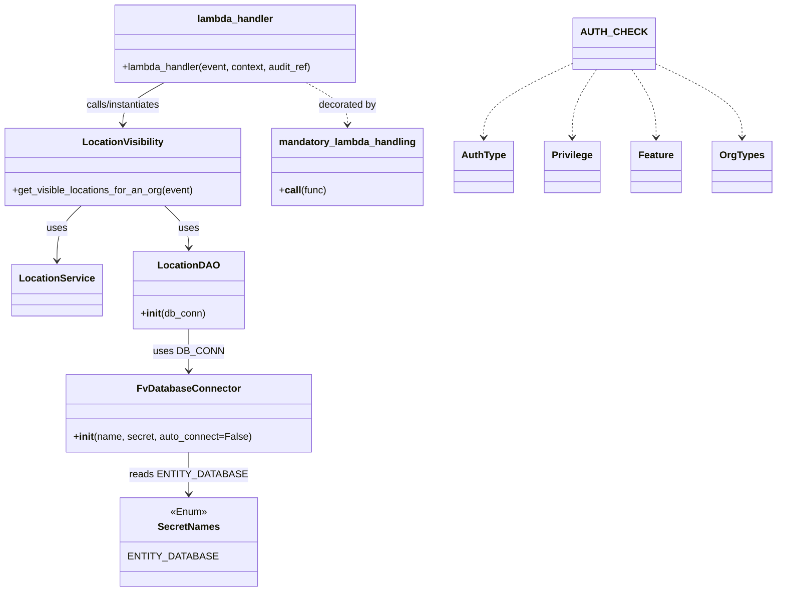

# Diagram: entity_core/entity_service/entity_inventory/entity_inventory_service/lambdas/get_visible_locations.py


> Auto-generated by Obscura crawlers

## Diagram 1



> SVG rendering failed for this diagram.

## Diagram 2

```mermaid
flowchart TD
evt[Incoming event] --> dec{mandatory_lambda_handling(auth_check=AUTH_CHECK)}
dec --> lh[lambda_handler(event, context, audit_ref)]
lh --> instVis[Create LocationVisibility(LocationService(), LocationDAO(DB_CONN))]
instVis --> LS[LocationService]
instVis --> LD[LocationDAO]
LD --> DB[FvDatabaseConnector("get_visible_locations_for_organization", SecretNames.ENTITY_DATABASE)]
DB --> Secret[SecretNames.ENTITY_DATABASE]
instVis --> callGet[get_visible_locations_for_an_org(event)]
callGet --> resp[Return visible locations]
```

> SVG rendering failed for this diagram.
