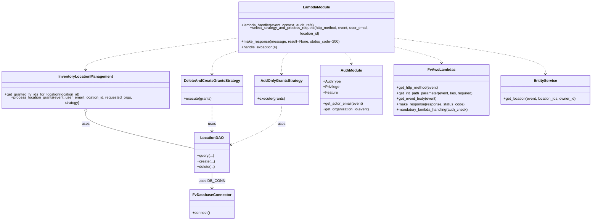

# Diagram: entity_core/entity_service/entity_inventory/entity_inventory_service/lambdas/grant_location_visibility.py


> Auto-generated by Obscura crawlers

## Diagram 1

```mermaid
flowchart TD
  Start([lambda_handler invoked]) --> GetMethod[get_http_method(event)]
  GetMethod --> GetEmail[auth.get_actor_email(event)]
  GetEmail --> GetPathParam[get_int_path_parameter(event, "location_id")]
  GetPathParam --> GetLocation[get_location(event, location_ids=[location_id], owner_id=owner_id)]
  GetLocation --> LocationExists{location exists?}
  LocationExists -- No --> BadLocation[BadRequestError: "Location does not exist"] --> HandleException[handle_exception(e)] --> End([End])
  LocationExists -- Yes --> MethodValid{http_method in {"GET","PUT","POST"}?}
  MethodValid -- No --> InvalidMethod[BadRequestError: "Invalid HTTP method"] --> HandleException --> End
  MethodValid -- Yes --> TryProcess[select_strategy_and_process_request(http_method, event, user_email, location_id)]
  TryProcess -.-> HandleException
  TryProcess --> ProcessStart{http_method == "GET" ?}
  ProcessStart -- Yes --> GETProcess[InventoryLocationManagement.get_granted_fv_ids_for_location(location_id)]
  GETProcess --> MakeSuccess1[make_response("success", grant_result)] --> End
  ProcessStart -- No --> PutPostBranch{http_method == "PUT" or "POST"}
  PutPostBranch -- Yes --> GetBody[fv.aws.lambdas.get_event_body(event)]
  GetBody --> ReqOrgs{body.orgs_fv_id present and non-empty?}
  ReqOrgs -- No --> EmptyOrgs[raise BadRequestError: "At least one organization FV ID required"] --> HandleException --> End
  ReqOrgs -- Yes --> ChooseStrategy{http_method == "PUT" ?}
  ChooseStrategy -- Yes --> StrategyPUT[DeleteAndCreateGrantsStrategy(location_grant_dao)]
  ChooseStrategy -- No --> StrategyPOST[AddOnlyGrantsStrategy(location_grant_dao)]
  StrategyPUT --> CallProcess[handler.process_location_grants(event, user_email, location_id, requested_organizations, strategy)]
  StrategyPOST --> CallProcess
  CallProcess --> SuccessCheck{is_success?}
  SuccessCheck -- No --> MakeError[make_response("Error: {error_msg}", status_code=400)] --> End
  SuccessCheck -- Yes --> MakeSuccess2[make_response("success", grant_result)] --> End
```

> SVG rendering failed for this diagram.

## Diagram 2



### SVG

<svg id="container" width="2568.1640625" xmlns="http://www.w3.org/2000/svg" class="classDiagram" height="934" viewBox="0 0 2568.1640625 934" role="graphics-document document" aria-roledescription="class"><style>#container{font-family:"trebuchet ms",verdana,arial,sans-serif;font-size:16px;fill:#333;}@keyframes edge-animation-frame{from{stroke-dashoffset:0;}}@keyframes dash{to{stroke-dashoffset:0;}}#container .edge-animation-slow{stroke-dasharray:9,5!important;stroke-dashoffset:900;animation:dash 50s linear infinite;stroke-linecap:round;}#container .edge-animation-fast{stroke-dasharray:9,5!important;stroke-dashoffset:900;animation:dash 20s linear infinite;stroke-linecap:round;}#container .error-icon{fill:#552222;}#container .error-text{fill:#552222;stroke:#552222;}#container .edge-thickness-normal{stroke-width:1px;}#container .edge-thickness-thick{stroke-width:3.5px;}#container .edge-pattern-solid{stroke-dasharray:0;}#container .edge-thickness-invisible{stroke-width:0;fill:none;}#container .edge-pattern-dashed{stroke-dasharray:3;}#container .edge-pattern-dotted{stroke-dasharray:2;}#container .marker{fill:#333333;stroke:#333333;}#container .marker.cross{stroke:#333333;}#container svg{font-family:"trebuchet ms",verdana,arial,sans-serif;font-size:16px;}#container p{margin:0;}#container g.classGroup text{fill:#9370DB;stroke:none;font-family:"trebuchet ms",verdana,arial,sans-serif;font-size:10px;}#container g.classGroup text .title{font-weight:bolder;}#container .nodeLabel,#container .edgeLabel{color:#131300;}#container .edgeLabel .label rect{fill:#ECECFF;}#container .label text{fill:#131300;}#container .labelBkg{background:#ECECFF;}#container .edgeLabel .label span{background:#ECECFF;}#container .classTitle{font-weight:bolder;}#container .node rect,#container .node circle,#container .node ellipse,#container .node polygon,#container .node path{fill:#ECECFF;stroke:#9370DB;stroke-width:1px;}#container .divider{stroke:#9370DB;stroke-width:1;}#container g.clickable{cursor:pointer;}#container g.classGroup rect{fill:#ECECFF;stroke:#9370DB;}#container g.classGroup line{stroke:#9370DB;stroke-width:1;}#container .classLabel .box{stroke:none;stroke-width:0;fill:#ECECFF;opacity:0.5;}#container .classLabel .label{fill:#9370DB;font-size:10px;}#container .relation{stroke:#333333;stroke-width:1;fill:none;}#container .dashed-line{stroke-dasharray:3;}#container .dotted-line{stroke-dasharray:1 2;}#container #compositionStart,#container .composition{fill:#333333!important;stroke:#333333!important;stroke-width:1;}#container #compositionEnd,#container .composition{fill:#333333!important;stroke:#333333!important;stroke-width:1;}#container #dependencyStart,#container .dependency{fill:#333333!important;stroke:#333333!important;stroke-width:1;}#container #dependencyStart,#container .dependency{fill:#333333!important;stroke:#333333!important;stroke-width:1;}#container #extensionStart,#container .extension{fill:transparent!important;stroke:#333333!important;stroke-width:1;}#container #extensionEnd,#container .extension{fill:transparent!important;stroke:#333333!important;stroke-width:1;}#container #aggregationStart,#container .aggregation{fill:transparent!important;stroke:#333333!important;stroke-width:1;}#container #aggregationEnd,#container .aggregation{fill:transparent!important;stroke:#333333!important;stroke-width:1;}#container #lollipopStart,#container .lollipop{fill:#ECECFF!important;stroke:#333333!important;stroke-width:1;}#container #lollipopEnd,#container .lollipop{fill:#ECECFF!important;stroke:#333333!important;stroke-width:1;}#container .edgeTerminals{font-size:11px;line-height:initial;}#container .classTitleText{text-anchor:middle;font-size:18px;fill:#333;}#container .label-icon{display:inline-block;height:1em;overflow:visible;vertical-align:-0.125em;}#container .node .label-icon path{fill:currentColor;stroke:revert;stroke-width:revert;}#container :root{--mermaid-font-family:"trebuchet ms",verdana,arial,sans-serif;}</style><g><defs><marker id="container_class-aggregationStart" class="marker aggregation class" refX="18" refY="7" markerWidth="190" markerHeight="240" orient="auto"><path d="M 18,7 L9,13 L1,7 L9,1 Z"></path></marker></defs><defs><marker id="container_class-aggregationEnd" class="marker aggregation class" refX="1" refY="7" markerWidth="20" markerHeight="28" orient="auto"><path d="M 18,7 L9,13 L1,7 L9,1 Z"></path></marker></defs><defs><marker id="container_class-extensionStart" class="marker extension class" refX="18" refY="7" markerWidth="190" markerHeight="240" orient="auto"><path d="M 1,7 L18,13 V 1 Z"></path></marker></defs><defs><marker id="container_class-extensionEnd" class="marker extension class" refX="1" refY="7" markerWidth="20" markerHeight="28" orient="auto"><path d="M 1,1 V 13 L18,7 Z"></path></marker></defs><defs><marker id="container_class-compositionStart" class="marker composition class" refX="18" refY="7" markerWidth="190" markerHeight="240" orient="auto"><path d="M 18,7 L9,13 L1,7 L9,1 Z"></path></marker></defs><defs><marker id="container_class-compositionEnd" class="marker composition class" refX="1" refY="7" markerWidth="20" markerHeight="28" orient="auto"><path d="M 18,7 L9,13 L1,7 L9,1 Z"></path></marker></defs><defs><marker id="container_class-dependencyStart" class="marker dependency class" refX="6" refY="7" markerWidth="190" markerHeight="240" orient="auto"><path d="M 5,7 L9,13 L1,7 L9,1 Z"></path></marker></defs><defs><marker id="container_class-dependencyEnd" class="marker dependency class" refX="13" refY="7" markerWidth="20" markerHeight="28" orient="auto"><path d="M 18,7 L9,13 L14,7 L9,1 Z"></path></marker></defs><defs><marker id="container_class-lollipopStart" class="marker lollipop class" refX="13" refY="7" markerWidth="190" markerHeight="240" orient="auto"><circle stroke="black" fill="transparent" cx="7" cy="7" r="6"></circle></marker></defs><defs><marker id="container_class-lollipopEnd" class="marker lollipop class" refX="1" refY="7" markerWidth="190" markerHeight="240" orient="auto"><circle stroke="black" fill="transparent" cx="7" cy="7" r="6"></circle></marker></defs><g class="root"><g class="clusters"></g><g class="edgePaths"><path d="M375.617,459.25L375.617,468.542C375.617,477.833,375.617,496.417,454.684,523.613C533.75,550.808,691.883,586.617,770.949,604.521L850.016,622.425" id="id_InventoryLocationManagement_LocationDAO_1" class="edge-thickness-normal edge-pattern-solid relation" style=";;;" data-edge="true" data-et="edge" data-id="id_InventoryLocationManagement_LocationDAO_1" data-points="W3sieCI6Mzc1LjYxNzE4NzUsInkiOjQ0Mn0seyJ4IjozNzUuNjE3MTg3NSwieSI6NTE1fSx7IngiOjg1MC4wMTU2MjUsInkiOjYyMi40MjUyNjk2NDU2MDg2fV0=" marker-start="url(#container_class-aggregationStart)"></path><path d="M923.211,430L923.211,444.167C923.211,458.333,923.211,486.667,923.211,506C923.211,525.333,923.211,535.667,923.211,540.833L923.211,546" id="id_DeleteAndCreateGrantsStrategy_LocationDAO_2" class="edge-thickness-normal edge-pattern-dashed relation" style=";;;" data-edge="true" data-et="edge" data-id="id_DeleteAndCreateGrantsStrategy_LocationDAO_2" data-points="W3sieCI6OTIzLjIxMDkzNzUsInkiOjQzMH0seyJ4Ijo5MjMuMjEwOTM3NSwieSI6NTE1fSx7IngiOjkyMy4yMTA5Mzc1LCJ5Ijo1NTJ9XQ==" marker-end="url(#container_class-dependencyEnd)"></path><path d="M1217.902,430L1217.902,444.167C1217.902,458.333,1217.902,486.667,1181.908,515.979C1145.914,545.291,1073.925,575.583,1037.931,590.728L1001.937,605.874" id="id_AddOnlyGrantsStrategy_LocationDAO_3" class="edge-thickness-normal edge-pattern-dashed relation" style=";;;" data-edge="true" data-et="edge" data-id="id_AddOnlyGrantsStrategy_LocationDAO_3" data-points="W3sieCI6MTIxNy45MDIzNDM3NSwieSI6NDMwfSx7IngiOjEyMTcuOTAyMzQzNzUsInkiOjUxNX0seyJ4Ijo5OTYuNDA2MjUsInkiOjYwOC4yMDA5Mzg0ODE3Mjc1fV0=" marker-end="url(#container_class-dependencyEnd)"></path><path d="M923.211,726L923.211,732.167C923.211,738.333,923.211,750.667,923.211,762C923.211,773.333,923.211,783.667,923.211,788.833L923.211,794" id="id_LocationDAO_FvDatabaseConnector_4" class="edge-thickness-normal edge-pattern-solid relation" style=";;;" data-edge="true" data-et="edge" data-id="id_LocationDAO_FvDatabaseConnector_4" data-points="W3sieCI6OTIzLjIxMDkzNzUsInkiOjcyNn0seyJ4Ijo5MjMuMjEwOTM3NSwieSI6NzYzfSx7IngiOjkyMy4yMTA5Mzc1LCJ5Ijo4MDB9XQ==" marker-end="url(#container_class-dependencyEnd)"></path><path d="M1712.74,185.821L1745.694,193.351C1778.648,200.88,1844.557,215.94,1877.511,226.637C1910.465,237.333,1910.465,243.667,1910.465,246.833L1910.465,250" id="id_LambdaModule_FvAwsLambdas_5" class="edge-thickness-normal edge-pattern-dashed relation" style=";;;" data-edge="true" data-et="edge" data-id="id_LambdaModule_FvAwsLambdas_5" data-points="W3sieCI6MTcxMi43NDAyMzQzNzUsInkiOjE4NS44MjA2MDUyODg0NDU5Nn0seyJ4IjoxOTEwLjQ2NDg0Mzc1LCJ5IjoyMzF9LHsieCI6MTkxMC40NjQ4NDM3NSwieSI6MjU2fV0=" marker-end="url(#container_class-dependencyEnd)"></path><path d="M1487.453,206L1492.49,210.167C1497.526,214.333,1507.599,222.667,1512.635,230.5C1517.672,238.333,1517.672,245.667,1517.672,249.333L1517.672,253" id="id_LambdaModule_AuthModule_6" class="edge-thickness-normal edge-pattern-dashed relation" style=";;;" data-edge="true" data-et="edge" data-id="id_LambdaModule_AuthModule_6" data-points="W3sieCI6MTQ4Ny40NTMxNzIyNTMwMjQxLCJ5IjoyMDZ9LHsieCI6MTUxNy42NzE4NzUsInkiOjIzMX0seyJ4IjoxNTE3LjY3MTg3NSwieSI6MjU5fV0=" marker-end="url(#container_class-dependencyEnd)"></path><path d="M1712.74,149.929L1821.314,163.441C1929.888,176.953,2147.036,203.976,2255.61,228.655C2364.184,253.333,2364.184,275.667,2364.184,286.833L2364.184,298" id="id_LambdaModule_EntityService_7" class="edge-thickness-normal edge-pattern-dashed relation" style=";;;" data-edge="true" data-et="edge" data-id="id_LambdaModule_EntityService_7" data-points="W3sieCI6MTcxMi43NDAyMzQzNzUsInkiOjE0OS45Mjg4ODIzOTg0ODY3M30seyJ4IjoyMzY0LjE4MzU5Mzc1LCJ5IjoyMzF9LHsieCI6MjM2NC4xODM1OTM3NSwieSI6MzA0fV0=" marker-end="url(#container_class-dependencyEnd)"></path><path d="M1022.834,150.112L914.965,163.593C807.095,177.075,591.356,204.037,483.487,226.685C375.617,249.333,375.617,267.667,375.617,276.833L375.617,286" id="id_LambdaModule_InventoryLocationManagement_8" class="edge-thickness-normal edge-pattern-dashed relation" style=";;;" data-edge="true" data-et="edge" data-id="id_LambdaModule_InventoryLocationManagement_8" data-points="W3sieCI6MTAyMi44MzM5ODQzNzUsInkiOjE1MC4xMTE3NTU5MTY5MzU1Mn0seyJ4IjozNzUuNjE3MTg3NSwieSI6MjMxfSx7IngiOjM3NS42MTcxODc1LCJ5IjoyOTJ9XQ==" marker-end="url(#container_class-dependencyEnd)"></path><path d="M1022.834,203.213L1006.23,207.845C989.626,212.476,956.419,221.738,939.815,237.536C923.211,253.333,923.211,275.667,923.211,286.833L923.211,298" id="id_LambdaModule_DeleteAndCreateGrantsStrategy_9" class="edge-thickness-normal edge-pattern-dashed relation" style=";;;" data-edge="true" data-et="edge" data-id="id_LambdaModule_DeleteAndCreateGrantsStrategy_9" data-points="W3sieCI6MTAyMi44MzM5ODQzNzUsInkiOjIwMy4yMTM0MDU0OTk0NDQyNn0seyJ4Ijo5MjMuMjEwOTM3NSwieSI6MjMxfSx7IngiOjkyMy4yMTA5Mzc1LCJ5IjozMDR9XQ==" marker-end="url(#container_class-dependencyEnd)"></path><path d="M1248.121,206L1243.085,210.167C1238.048,214.333,1227.975,222.667,1222.939,238C1217.902,253.333,1217.902,275.667,1217.902,286.833L1217.902,298" id="id_LambdaModule_AddOnlyGrantsStrategy_10" class="edge-thickness-normal edge-pattern-dashed relation" style=";;;" data-edge="true" data-et="edge" data-id="id_LambdaModule_AddOnlyGrantsStrategy_10" data-points="W3sieCI6MTI0OC4xMjEwNDY0OTY5NzU5LCJ5IjoyMDZ9LHsieCI6MTIxNy45MDIzNDM3NSwieSI6MjMxfSx7IngiOjEyMTcuOTAyMzQzNzUsInkiOjMwNH1d" marker-end="url(#container_class-dependencyEnd)"></path></g><g class="edgeLabels"><g class="edgeLabel" transform="translate(375.6171875, 515)"><g class="label" data-id="id_InventoryLocationManagement_LocationDAO_1" transform="translate(-16.4921875, -12)"><foreignObject width="32.984375" height="24"><div xmlns="http://www.w3.org/1999/xhtml" class="labelBkg" style="display: table-cell; white-space: nowrap; line-height: 1.5; max-width: 200px; text-align: center;"><span class="edgeLabel"><p>uses</p></span></div></foreignObject></g></g><g class="edgeLabel" transform="translate(923.2109375, 515)"><g class="label" data-id="id_DeleteAndCreateGrantsStrategy_LocationDAO_2" transform="translate(-16.4921875, -12)"><foreignObject width="32.984375" height="24"><div xmlns="http://www.w3.org/1999/xhtml" class="labelBkg" style="display: table-cell; white-space: nowrap; line-height: 1.5; max-width: 200px; text-align: center;"><span class="edgeLabel"><p>uses</p></span></div></foreignObject></g></g><g class="edgeLabel" transform="translate(1217.90234375, 515)"><g class="label" data-id="id_AddOnlyGrantsStrategy_LocationDAO_3" transform="translate(-16.4921875, -12)"><foreignObject width="32.984375" height="24"><div xmlns="http://www.w3.org/1999/xhtml" class="labelBkg" style="display: table-cell; white-space: nowrap; line-height: 1.5; max-width: 200px; text-align: center;"><span class="edgeLabel"><p>uses</p></span></div></foreignObject></g></g><g class="edgeLabel" transform="translate(923.2109375, 763)"><g class="label" data-id="id_LocationDAO_FvDatabaseConnector_4" transform="translate(-53.09375, -12)"><foreignObject width="106.1875" height="24"><div xmlns="http://www.w3.org/1999/xhtml" class="labelBkg" style="display: table-cell; white-space: nowrap; line-height: 1.5; max-width: 200px; text-align: center;"><span class="edgeLabel"><p>uses DB_CONN</p></span></div></foreignObject></g></g><g class="edgeLabel"><g class="label" data-id="id_LambdaModule_FvAwsLambdas_5" transform="translate(0, 0)"><foreignObject width="0" height="0"><div xmlns="http://www.w3.org/1999/xhtml" class="labelBkg" style="display: table-cell; white-space: nowrap; line-height: 1.5; max-width: 200px; text-align: center;"><span class="edgeLabel"></span></div></foreignObject></g></g><g class="edgeLabel"><g class="label" data-id="id_LambdaModule_AuthModule_6" transform="translate(0, 0)"><foreignObject width="0" height="0"><div xmlns="http://www.w3.org/1999/xhtml" class="labelBkg" style="display: table-cell; white-space: nowrap; line-height: 1.5; max-width: 200px; text-align: center;"><span class="edgeLabel"></span></div></foreignObject></g></g><g class="edgeLabel"><g class="label" data-id="id_LambdaModule_EntityService_7" transform="translate(0, 0)"><foreignObject width="0" height="0"><div xmlns="http://www.w3.org/1999/xhtml" class="labelBkg" style="display: table-cell; white-space: nowrap; line-height: 1.5; max-width: 200px; text-align: center;"><span class="edgeLabel"></span></div></foreignObject></g></g><g class="edgeLabel"><g class="label" data-id="id_LambdaModule_InventoryLocationManagement_8" transform="translate(0, 0)"><foreignObject width="0" height="0"><div xmlns="http://www.w3.org/1999/xhtml" class="labelBkg" style="display: table-cell; white-space: nowrap; line-height: 1.5; max-width: 200px; text-align: center;"><span class="edgeLabel"></span></div></foreignObject></g></g><g class="edgeLabel"><g class="label" data-id="id_LambdaModule_DeleteAndCreateGrantsStrategy_9" transform="translate(0, 0)"><foreignObject width="0" height="0"><div xmlns="http://www.w3.org/1999/xhtml" class="labelBkg" style="display: table-cell; white-space: nowrap; line-height: 1.5; max-width: 200px; text-align: center;"><span class="edgeLabel"></span></div></foreignObject></g></g><g class="edgeLabel"><g class="label" data-id="id_LambdaModule_AddOnlyGrantsStrategy_10" transform="translate(0, 0)"><foreignObject width="0" height="0"><div xmlns="http://www.w3.org/1999/xhtml" class="labelBkg" style="display: table-cell; white-space: nowrap; line-height: 1.5; max-width: 200px; text-align: center;"><span class="edgeLabel"></span></div></foreignObject></g></g></g><g class="nodes"><g class="node default" id="classId-InventoryLocationManagement-0" transform="translate(375.6171875, 367)"><g class="basic label-container"><path d="M-367.6171875 -75 L367.6171875 -75 L367.6171875 75 L-367.6171875 75" stroke="none" stroke-width="0" fill="#ECECFF" style=""></path><path d="M-367.6171875 -75 C-193.78834620325998 -75, -19.959504906519953 -75, 367.6171875 -75 M-367.6171875 -75 C-144.61173479928897 -75, 78.39371790142206 -75, 367.6171875 -75 M367.6171875 -75 C367.6171875 -39.733737183909106, 367.6171875 -4.4674743678182125, 367.6171875 75 M367.6171875 -75 C367.6171875 -38.312387142244944, 367.6171875 -1.624774284489888, 367.6171875 75 M367.6171875 75 C168.537392555025 75, -30.542402389949984 75, -367.6171875 75 M367.6171875 75 C75.55483386065418 75, -216.50751977869163 75, -367.6171875 75 M-367.6171875 75 C-367.6171875 27.77986159900025, -367.6171875 -19.440276801999502, -367.6171875 -75 M-367.6171875 75 C-367.6171875 37.24465633665, -367.6171875 -0.5106873266999941, -367.6171875 -75" stroke="#9370DB" stroke-width="1.3" fill="none" stroke-dasharray="0 0" style=""></path></g><g class="annotation-group text" transform="translate(0, -51)"></g><g class="label-group text" transform="translate(-113.421875, -51)"><g class="label" style="font-weight: bolder" transform="translate(0,-12)"><foreignObject width="226.84375" height="24"><div xmlns="http://www.w3.org/1999/xhtml" style="display: table-cell; white-space: nowrap; line-height: 1.5; max-width: 275px; text-align: center;"><span class="nodeLabel markdown-node-label" style=""><p>InventoryLocationManagement</p></span></div></foreignObject></g></g><g class="members-group text" transform="translate(-355.6171875, -3)"></g><g class="methods-group text" transform="translate(-355.6171875, 27)"><g class="label" style="" transform="translate(0,-12)"><foreignObject width="331.828125" height="24"><div xmlns="http://www.w3.org/1999/xhtml" style="display: table-cell; white-space: nowrap; line-height: 1.5; max-width: 389px; text-align: center;"><span class="nodeLabel markdown-node-label" style=""><p>+get_granted_fv_ids_for_location(location_id)</p></span></div></foreignObject></g><g class="label" style="" transform="translate(0,12)"><foreignObject width="597.8125" height="24"><div xmlns="http://www.w3.org/1999/xhtml" style="display: table-cell; white-space: nowrap; line-height: 1.5; max-width: 655px; text-align: center;"><span class="nodeLabel markdown-node-label" style=""><p>+process_location_grants(event, user_email, location_id, requested_orgs, strategy)</p></span></div></foreignObject></g></g><g class="divider" style=""><path d="M-367.6171875 -27 C-117.23832300977489 -27, 133.14054148045022 -27, 367.6171875 -27 M-367.6171875 -27 C-163.662917731846 -27, 40.29135203630801 -27, 367.6171875 -27" stroke="#9370DB" stroke-width="1.3" fill="none" stroke-dasharray="0 0" style=""></path></g><g class="divider" style=""><path d="M-367.6171875 -3 C-116.81605061691411 -3, 133.98508626617178 -3, 367.6171875 -3 M-367.6171875 -3 C-155.6711049994298 -3, 56.27497750114043 -3, 367.6171875 -3" stroke="#9370DB" stroke-width="1.3" fill="none" stroke-dasharray="0 0" style=""></path></g></g><g class="node default" id="classId-DeleteAndCreateGrantsStrategy-1" transform="translate(923.2109375, 367)"><g class="basic label-container"><path d="M-129.9765625 -63 L129.9765625 -63 L129.9765625 63 L-129.9765625 63" stroke="none" stroke-width="0" fill="#ECECFF" style=""></path><path d="M-129.9765625 -63 C-51.0885593818893 -63, 27.799443736221406 -63, 129.9765625 -63 M-129.9765625 -63 C-51.95377169213775 -63, 26.0690191157245 -63, 129.9765625 -63 M129.9765625 -63 C129.9765625 -23.12607247310011, 129.9765625 16.747855053799782, 129.9765625 63 M129.9765625 -63 C129.9765625 -28.279109359239214, 129.9765625 6.441781281521571, 129.9765625 63 M129.9765625 63 C71.45894313284737 63, 12.941323765694719 63, -129.9765625 63 M129.9765625 63 C33.738922202522176 63, -62.49871809495565 63, -129.9765625 63 M-129.9765625 63 C-129.9765625 23.388135578876025, -129.9765625 -16.22372884224795, -129.9765625 -63 M-129.9765625 63 C-129.9765625 27.69018002109162, -129.9765625 -7.619639957816759, -129.9765625 -63" stroke="#9370DB" stroke-width="1.3" fill="none" stroke-dasharray="0 0" style=""></path></g><g class="annotation-group text" transform="translate(0, -39)"></g><g class="label-group text" transform="translate(-116.359375, -39)"><g class="label" style="font-weight: bolder" transform="translate(0,-12)"><foreignObject width="232.71875" height="24"><div xmlns="http://www.w3.org/1999/xhtml" style="display: table-cell; white-space: nowrap; line-height: 1.5; max-width: 277px; text-align: center;"><span class="nodeLabel markdown-node-label" style=""><p>DeleteAndCreateGrantsStrategy</p></span></div></foreignObject></g></g><g class="members-group text" transform="translate(-117.9765625, 9)"></g><g class="methods-group text" transform="translate(-117.9765625, 39)"><g class="label" style="" transform="translate(0,-12)"><foreignObject width="119.59375" height="24"><div xmlns="http://www.w3.org/1999/xhtml" style="display: table-cell; white-space: nowrap; line-height: 1.5; max-width: 177px; text-align: center;"><span class="nodeLabel markdown-node-label" style=""><p>+execute(grants)</p></span></div></foreignObject></g></g><g class="divider" style=""><path d="M-129.9765625 -15 C-72.64943087205373 -15, -15.322299244107441 -15, 129.9765625 -15 M-129.9765625 -15 C-48.78858099121169 -15, 32.39940051757662 -15, 129.9765625 -15" stroke="#9370DB" stroke-width="1.3" fill="none" stroke-dasharray="0 0" style=""></path></g><g class="divider" style=""><path d="M-129.9765625 9 C-53.98934902273918 9, 21.997864454521647 9, 129.9765625 9 M-129.9765625 9 C-66.6744781127379 9, -3.3723937254758027 9, 129.9765625 9" stroke="#9370DB" stroke-width="1.3" fill="none" stroke-dasharray="0 0" style=""></path></g></g><g class="node default" id="classId-AddOnlyGrantsStrategy-2" transform="translate(1217.90234375, 367)"><g class="basic label-container"><path d="M-114.71484375 -63 L114.71484375 -63 L114.71484375 63 L-114.71484375 63" stroke="none" stroke-width="0" fill="#ECECFF" style=""></path><path d="M-114.71484375 -63 C-56.826724840323564 -63, 1.0613940693528718 -63, 114.71484375 -63 M-114.71484375 -63 C-37.81115875646215 -63, 39.0925262370757 -63, 114.71484375 -63 M114.71484375 -63 C114.71484375 -16.497390874371177, 114.71484375 30.005218251257645, 114.71484375 63 M114.71484375 -63 C114.71484375 -32.64678255568046, 114.71484375 -2.2935651113609126, 114.71484375 63 M114.71484375 63 C49.619157557846194 63, -15.476528634307613 63, -114.71484375 63 M114.71484375 63 C58.90006223105278 63, 3.0852807121055577 63, -114.71484375 63 M-114.71484375 63 C-114.71484375 32.27083978895847, -114.71484375 1.5416795779169306, -114.71484375 -63 M-114.71484375 63 C-114.71484375 14.75090243008924, -114.71484375 -33.49819513982152, -114.71484375 -63" stroke="#9370DB" stroke-width="1.3" fill="none" stroke-dasharray="0 0" style=""></path></g><g class="annotation-group text" transform="translate(0, -39)"></g><g class="label-group text" transform="translate(-85.8359375, -39)"><g class="label" style="font-weight: bolder" transform="translate(0,-12)"><foreignObject width="171.671875" height="24"><div xmlns="http://www.w3.org/1999/xhtml" style="display: table-cell; white-space: nowrap; line-height: 1.5; max-width: 218px; text-align: center;"><span class="nodeLabel markdown-node-label" style=""><p>AddOnlyGrantsStrategy</p></span></div></foreignObject></g></g><g class="members-group text" transform="translate(-102.71484375, 9)"></g><g class="methods-group text" transform="translate(-102.71484375, 39)"><g class="label" style="" transform="translate(0,-12)"><foreignObject width="119.59375" height="24"><div xmlns="http://www.w3.org/1999/xhtml" style="display: table-cell; white-space: nowrap; line-height: 1.5; max-width: 177px; text-align: center;"><span class="nodeLabel markdown-node-label" style=""><p>+execute(grants)</p></span></div></foreignObject></g></g><g class="divider" style=""><path d="M-114.71484375 -15 C-24.532726214190504 -15, 65.64939132161899 -15, 114.71484375 -15 M-114.71484375 -15 C-55.89952794667121 -15, 2.9157878566575732 -15, 114.71484375 -15" stroke="#9370DB" stroke-width="1.3" fill="none" stroke-dasharray="0 0" style=""></path></g><g class="divider" style=""><path d="M-114.71484375 9 C-60.15361698296432 9, -5.592390215928646 9, 114.71484375 9 M-114.71484375 9 C-29.703814073781686 9, 55.30721560243663 9, 114.71484375 9" stroke="#9370DB" stroke-width="1.3" fill="none" stroke-dasharray="0 0" style=""></path></g></g><g class="node default" id="classId-LocationDAO-3" transform="translate(923.2109375, 639)"><g class="basic label-container"><path d="M-73.1953125 -87 L73.1953125 -87 L73.1953125 87 L-73.1953125 87" stroke="none" stroke-width="0" fill="#ECECFF" style=""></path><path d="M-73.1953125 -87 C-39.0313671041387 -87, -4.867421708277405 -87, 73.1953125 -87 M-73.1953125 -87 C-42.026553540130664 -87, -10.857794580261334 -87, 73.1953125 -87 M73.1953125 -87 C73.1953125 -39.92812212872792, 73.1953125 7.143755742544158, 73.1953125 87 M73.1953125 -87 C73.1953125 -49.17938551284273, 73.1953125 -11.358771025685456, 73.1953125 87 M73.1953125 87 C16.00158604788541 87, -41.19214040422918 87, -73.1953125 87 M73.1953125 87 C18.2858283884407 87, -36.6236557231186 87, -73.1953125 87 M-73.1953125 87 C-73.1953125 43.30067821247964, -73.1953125 -0.39864357504072245, -73.1953125 -87 M-73.1953125 87 C-73.1953125 29.974318637286288, -73.1953125 -27.051362725427424, -73.1953125 -87" stroke="#9370DB" stroke-width="1.3" fill="none" stroke-dasharray="0 0" style=""></path></g><g class="annotation-group text" transform="translate(0, -63)"></g><g class="label-group text" transform="translate(-46.640625, -63)"><g class="label" style="font-weight: bolder" transform="translate(0,-12)"><foreignObject width="93.28125" height="24"><div xmlns="http://www.w3.org/1999/xhtml" style="display: table-cell; white-space: nowrap; line-height: 1.5; max-width: 142px; text-align: center;"><span class="nodeLabel markdown-node-label" style=""><p>LocationDAO</p></span></div></foreignObject></g></g><g class="members-group text" transform="translate(-61.1953125, -15)"></g><g class="methods-group text" transform="translate(-61.1953125, 15)"><g class="label" style="" transform="translate(0,-12)"><foreignObject width="71.53125" height="24"><div xmlns="http://www.w3.org/1999/xhtml" style="display: table-cell; white-space: nowrap; line-height: 1.5; max-width: 129px; text-align: center;"><span class="nodeLabel markdown-node-label" style=""><p>+query(...)</p></span></div></foreignObject></g><g class="label" style="" transform="translate(0,12)"><foreignObject width="74.75" height="24"><div xmlns="http://www.w3.org/1999/xhtml" style="display: table-cell; white-space: nowrap; line-height: 1.5; max-width: 132px; text-align: center;"><span class="nodeLabel markdown-node-label" style=""><p>+create(...)</p></span></div></foreignObject></g><g class="label" style="" transform="translate(0,36)"><foreignObject width="75.75" height="24"><div xmlns="http://www.w3.org/1999/xhtml" style="display: table-cell; white-space: nowrap; line-height: 1.5; max-width: 133px; text-align: center;"><span class="nodeLabel markdown-node-label" style=""><p>+delete(...)</p></span></div></foreignObject></g></g><g class="divider" style=""><path d="M-73.1953125 -39 C-24.616048600133055 -39, 23.96321529973389 -39, 73.1953125 -39 M-73.1953125 -39 C-28.41682836878914 -39, 16.36165576242172 -39, 73.1953125 -39" stroke="#9370DB" stroke-width="1.3" fill="none" stroke-dasharray="0 0" style=""></path></g><g class="divider" style=""><path d="M-73.1953125 -15 C-37.460388372578024 -15, -1.7254642451560471 -15, 73.1953125 -15 M-73.1953125 -15 C-36.459127596026214 -15, 0.27705730794757244 -15, 73.1953125 -15" stroke="#9370DB" stroke-width="1.3" fill="none" stroke-dasharray="0 0" style=""></path></g></g><g class="node default" id="classId-FvDatabaseConnector-4" transform="translate(923.2109375, 863)"><g class="basic label-container"><path d="M-91.3046875 -63 L91.3046875 -63 L91.3046875 63 L-91.3046875 63" stroke="none" stroke-width="0" fill="#ECECFF" style=""></path><path d="M-91.3046875 -63 C-38.47167532456055 -63, 14.3613368508789 -63, 91.3046875 -63 M-91.3046875 -63 C-49.44432741480742 -63, -7.583967329614836 -63, 91.3046875 -63 M91.3046875 -63 C91.3046875 -24.977297458841775, 91.3046875 13.04540508231645, 91.3046875 63 M91.3046875 -63 C91.3046875 -24.076344412376685, 91.3046875 14.847311175246631, 91.3046875 63 M91.3046875 63 C49.4773224190174 63, 7.649957338034795 63, -91.3046875 63 M91.3046875 63 C35.39830320395407 63, -20.508081092091857 63, -91.3046875 63 M-91.3046875 63 C-91.3046875 27.49370512960897, -91.3046875 -8.012589740782062, -91.3046875 -63 M-91.3046875 63 C-91.3046875 14.060479337699014, -91.3046875 -34.87904132460197, -91.3046875 -63" stroke="#9370DB" stroke-width="1.3" fill="none" stroke-dasharray="0 0" style=""></path></g><g class="annotation-group text" transform="translate(0, -39)"></g><g class="label-group text" transform="translate(-79.3046875, -39)"><g class="label" style="font-weight: bolder" transform="translate(0,-12)"><foreignObject width="158.609375" height="24"><div xmlns="http://www.w3.org/1999/xhtml" style="display: table-cell; white-space: nowrap; line-height: 1.5; max-width: 207px; text-align: center;"><span class="nodeLabel markdown-node-label" style=""><p>FvDatabaseConnector</p></span></div></foreignObject></g></g><g class="members-group text" transform="translate(-79.3046875, 9)"></g><g class="methods-group text" transform="translate(-79.3046875, 39)"><g class="label" style="" transform="translate(0,-12)"><foreignObject width="75.921875" height="24"><div xmlns="http://www.w3.org/1999/xhtml" style="display: table-cell; white-space: nowrap; line-height: 1.5; max-width: 133px; text-align: center;"><span class="nodeLabel markdown-node-label" style=""><p>+connect()</p></span></div></foreignObject></g></g><g class="divider" style=""><path d="M-91.3046875 -15 C-20.84597530054407 -15, 49.61273689891186 -15, 91.3046875 -15 M-91.3046875 -15 C-19.75784943260244 -15, 51.78898863479512 -15, 91.3046875 -15" stroke="#9370DB" stroke-width="1.3" fill="none" stroke-dasharray="0 0" style=""></path></g><g class="divider" style=""><path d="M-91.3046875 9 C-31.756887411137697 9, 27.790912677724606 9, 91.3046875 9 M-91.3046875 9 C-21.95667606380114 9, 47.39133537239772 9, 91.3046875 9" stroke="#9370DB" stroke-width="1.3" fill="none" stroke-dasharray="0 0" style=""></path></g></g><g class="node default" id="classId-LambdaModule-5" transform="translate(1367.787109375, 107)"><g class="basic label-container"><path d="M-344.953125 -99 L344.953125 -99 L344.953125 99 L-344.953125 99" stroke="none" stroke-width="0" fill="#ECECFF" style=""></path><path d="M-344.953125 -99 C-111.11023502622751 -99, 122.73265494754497 -99, 344.953125 -99 M-344.953125 -99 C-125.9027257918255 -99, 93.147673416349 -99, 344.953125 -99 M344.953125 -99 C344.953125 -24.16570760327913, 344.953125 50.66858479344174, 344.953125 99 M344.953125 -99 C344.953125 -21.02098755173654, 344.953125 56.95802489652692, 344.953125 99 M344.953125 99 C128.2563297603993 99, -88.44046547920141 99, -344.953125 99 M344.953125 99 C144.33046860195216 99, -56.292187796095675 99, -344.953125 99 M-344.953125 99 C-344.953125 36.15466721155436, -344.953125 -26.690665576891277, -344.953125 -99 M-344.953125 99 C-344.953125 53.87773061005554, -344.953125 8.755461220111087, -344.953125 -99" stroke="#9370DB" stroke-width="1.3" fill="none" stroke-dasharray="0 0" style=""></path></g><g class="annotation-group text" transform="translate(0, -75)"></g><g class="label-group text" transform="translate(-56.21875, -75)"><g class="label" style="font-weight: bolder" transform="translate(0,-12)"><foreignObject width="112.4375" height="24"><div xmlns="http://www.w3.org/1999/xhtml" style="display: table-cell; white-space: nowrap; line-height: 1.5; max-width: 162px; text-align: center;"><span class="nodeLabel markdown-node-label" style=""><p>LambdaModule</p></span></div></foreignObject></g></g><g class="members-group text" transform="translate(-332.953125, -27)"></g><g class="methods-group text" transform="translate(-332.953125, 3)"><g class="label" style="" transform="translate(0,-12)"><foreignObject width="321.6875" height="24"><div xmlns="http://www.w3.org/1999/xhtml" style="display: table-cell; white-space: nowrap; line-height: 1.5; max-width: 379px; text-align: center;"><span class="nodeLabel markdown-node-label" style=""><p>+lambda_handler(event, context, audit_refs)</p></span></div></foreignObject></g><g class="label" style="" transform="translate(0,12)"><foreignObject width="609.6875" height="24"><div xmlns="http://www.w3.org/1999/xhtml" style="display: table-cell; white-space: nowrap; line-height: 1.5; max-width: 667px; text-align: center;"><span class="nodeLabel markdown-node-label" style=""><p>+select_strategy_and_process_request(http_method, event, user_email, location_id)</p></span></div></foreignObject></g><g class="label" style="" transform="translate(0,36)"><foreignObject width="418.921875" height="24"><div xmlns="http://www.w3.org/1999/xhtml" style="display: table-cell; white-space: nowrap; line-height: 1.5; max-width: 476px; text-align: center;"><span class="nodeLabel markdown-node-label" style=""><p>+make_response(message, result=None, status_code=200)</p></span></div></foreignObject></g><g class="label" style="" transform="translate(0,60)"><foreignObject width="155.859375" height="24"><div xmlns="http://www.w3.org/1999/xhtml" style="display: table-cell; white-space: nowrap; line-height: 1.5; max-width: 213px; text-align: center;"><span class="nodeLabel markdown-node-label" style=""><p>+handle_exception(e)</p></span></div></foreignObject></g></g><g class="divider" style=""><path d="M-344.953125 -51 C-132.88270232659525 -51, 79.1877203468095 -51, 344.953125 -51 M-344.953125 -51 C-102.42472275636564 -51, 140.10367948726872 -51, 344.953125 -51" stroke="#9370DB" stroke-width="1.3" fill="none" stroke-dasharray="0 0" style=""></path></g><g class="divider" style=""><path d="M-344.953125 -27 C-88.46030134422364 -27, 168.03252231155273 -27, 344.953125 -27 M-344.953125 -27 C-140.1765906925397 -27, 64.59994361492062 -27, 344.953125 -27" stroke="#9370DB" stroke-width="1.3" fill="none" stroke-dasharray="0 0" style=""></path></g></g><g class="node default" id="classId-AuthModule-6" transform="translate(1517.671875, 367)"><g class="basic label-container"><path d="M-135.0546875 -108 L135.0546875 -108 L135.0546875 108 L-135.0546875 108" stroke="none" stroke-width="0" fill="#ECECFF" style=""></path><path d="M-135.0546875 -108 C-51.55125918115364 -108, 31.95216913769272 -108, 135.0546875 -108 M-135.0546875 -108 C-45.893363827524524 -108, 43.26795984495095 -108, 135.0546875 -108 M135.0546875 -108 C135.0546875 -25.878612283148712, 135.0546875 56.242775433702576, 135.0546875 108 M135.0546875 -108 C135.0546875 -32.74267302970088, 135.0546875 42.51465394059824, 135.0546875 108 M135.0546875 108 C64.44256476284751 108, -6.169557974304979 108, -135.0546875 108 M135.0546875 108 C61.78510914388082 108, -11.484469212238366 108, -135.0546875 108 M-135.0546875 108 C-135.0546875 54.05401859114103, -135.0546875 0.10803718228206094, -135.0546875 -108 M-135.0546875 108 C-135.0546875 30.224038281507603, -135.0546875 -47.551923436984794, -135.0546875 -108" stroke="#9370DB" stroke-width="1.3" fill="none" stroke-dasharray="0 0" style=""></path></g><g class="annotation-group text" transform="translate(0, -84)"></g><g class="label-group text" transform="translate(-44.09375, -84)"><g class="label" style="font-weight: bolder" transform="translate(0,-12)"><foreignObject width="88.1875" height="24"><div xmlns="http://www.w3.org/1999/xhtml" style="display: table-cell; white-space: nowrap; line-height: 1.5; max-width: 138px; text-align: center;"><span class="nodeLabel markdown-node-label" style=""><p>AuthModule</p></span></div></foreignObject></g></g><g class="members-group text" transform="translate(-123.0546875, -36)"><g class="label" style="" transform="translate(0,-12)"><foreignObject width="75.1875" height="24"><div xmlns="http://www.w3.org/1999/xhtml" style="display: table-cell; white-space: nowrap; line-height: 1.5; max-width: 133px; text-align: center;"><span class="nodeLabel markdown-node-label" style=""><p>+AuthType</p></span></div></foreignObject></g><g class="label" style="" transform="translate(0,12)"><foreignObject width="70.15625" height="24"><div xmlns="http://www.w3.org/1999/xhtml" style="display: table-cell; white-space: nowrap; line-height: 1.5; max-width: 128px; text-align: center;"><span class="nodeLabel markdown-node-label" style=""><p>+Privilege</p></span></div></foreignObject></g><g class="label" style="" transform="translate(0,36)"><foreignObject width="62.0625" height="24"><div xmlns="http://www.w3.org/1999/xhtml" style="display: table-cell; white-space: nowrap; line-height: 1.5; max-width: 119px; text-align: center;"><span class="nodeLabel markdown-node-label" style=""><p>+Feature</p></span></div></foreignObject></g></g><g class="methods-group text" transform="translate(-123.0546875, 60)"><g class="label" style="" transform="translate(0,-12)"><foreignObject width="173.71875" height="24"><div xmlns="http://www.w3.org/1999/xhtml" style="display: table-cell; white-space: nowrap; line-height: 1.5; max-width: 231px; text-align: center;"><span class="nodeLabel markdown-node-label" style=""><p>+get_actor_email(event)</p></span></div></foreignObject></g><g class="label" style="" transform="translate(0,12)"><foreignObject width="202.015625" height="24"><div xmlns="http://www.w3.org/1999/xhtml" style="display: table-cell; white-space: nowrap; line-height: 1.5; max-width: 259px; text-align: center;"><span class="nodeLabel markdown-node-label" style=""><p>+get_organization_id(event)</p></span></div></foreignObject></g></g><g class="divider" style=""><path d="M-135.0546875 -60 C-66.64497323640146 -60, 1.7647410271970898 -60, 135.0546875 -60 M-135.0546875 -60 C-65.54853361214613 -60, 3.9576202757077397 -60, 135.0546875 -60" stroke="#9370DB" stroke-width="1.3" fill="none" stroke-dasharray="0 0" style=""></path></g><g class="divider" style=""><path d="M-135.0546875 36 C-74.82457388325778 36, -14.594460266515583 36, 135.0546875 36 M-135.0546875 36 C-48.85740731551692 36, 37.339872868966154 36, 135.0546875 36" stroke="#9370DB" stroke-width="1.3" fill="none" stroke-dasharray="0 0" style=""></path></g></g><g class="node default" id="classId-FvAwsLambdas-7" transform="translate(1910.46484375, 367)"><g class="basic label-container"><path d="M-207.73828125 -111 L207.73828125 -111 L207.73828125 111 L-207.73828125 111" stroke="none" stroke-width="0" fill="#ECECFF" style=""></path><path d="M-207.73828125 -111 C-95.58376866286919 -111, 16.57074392426162 -111, 207.73828125 -111 M-207.73828125 -111 C-69.41157372212405 -111, 68.9151338057519 -111, 207.73828125 -111 M207.73828125 -111 C207.73828125 -33.03507128504556, 207.73828125 44.92985742990888, 207.73828125 111 M207.73828125 -111 C207.73828125 -42.63915749273181, 207.73828125 25.721685014536376, 207.73828125 111 M207.73828125 111 C66.54468934006024 111, -74.64890256987951 111, -207.73828125 111 M207.73828125 111 C68.97527086261846 111, -69.78773952476308 111, -207.73828125 111 M-207.73828125 111 C-207.73828125 54.815508015685104, -207.73828125 -1.3689839686297915, -207.73828125 -111 M-207.73828125 111 C-207.73828125 46.301090558693886, -207.73828125 -18.397818882612228, -207.73828125 -111" stroke="#9370DB" stroke-width="1.3" fill="none" stroke-dasharray="0 0" style=""></path></g><g class="annotation-group text" transform="translate(0, -87)"></g><g class="label-group text" transform="translate(-55.2109375, -87)"><g class="label" style="font-weight: bolder" transform="translate(0,-12)"><foreignObject width="110.421875" height="24"><div xmlns="http://www.w3.org/1999/xhtml" style="display: table-cell; white-space: nowrap; line-height: 1.5; max-width: 159px; text-align: center;"><span class="nodeLabel markdown-node-label" style=""><p>FvAwsLambdas</p></span></div></foreignObject></g></g><g class="members-group text" transform="translate(-195.73828125, -39)"></g><g class="methods-group text" transform="translate(-195.73828125, -9)"><g class="label" style="" transform="translate(0,-12)"><foreignObject width="184.5" height="24"><div xmlns="http://www.w3.org/1999/xhtml" style="display: table-cell; white-space: nowrap; line-height: 1.5; max-width: 242px; text-align: center;"><span class="nodeLabel markdown-node-label" style=""><p>+get_http_method(event)</p></span></div></foreignObject></g><g class="label" style="" transform="translate(0,12)"><foreignObject width="336.265625" height="24"><div xmlns="http://www.w3.org/1999/xhtml" style="display: table-cell; white-space: nowrap; line-height: 1.5; max-width: 394px; text-align: center;"><span class="nodeLabel markdown-node-label" style=""><p>+get_int_path_parameter(event, key, required)</p></span></div></foreignObject></g><g class="label" style="" transform="translate(0,36)"><foreignObject width="174.203125" height="24"><div xmlns="http://www.w3.org/1999/xhtml" style="display: table-cell; white-space: nowrap; line-height: 1.5; max-width: 232px; text-align: center;"><span class="nodeLabel markdown-node-label" style=""><p>+get_event_body(event)</p></span></div></foreignObject></g><g class="label" style="" transform="translate(0,60)"><foreignObject width="293.109375" height="24"><div xmlns="http://www.w3.org/1999/xhtml" style="display: table-cell; white-space: nowrap; line-height: 1.5; max-width: 350px; text-align: center;"><span class="nodeLabel markdown-node-label" style=""><p>+make_response(response, status_code)</p></span></div></foreignObject></g><g class="label" style="" transform="translate(0,84)"><foreignObject width="314.828125" height="24"><div xmlns="http://www.w3.org/1999/xhtml" style="display: table-cell; white-space: nowrap; line-height: 1.5; max-width: 372px; text-align: center;"><span class="nodeLabel markdown-node-label" style=""><p>+mandatory_lambda_handling(auth_check)</p></span></div></foreignObject></g></g><g class="divider" style=""><path d="M-207.73828125 -63 C-61.5845119974708 -63, 84.5692572550584 -63, 207.73828125 -63 M-207.73828125 -63 C-118.24894911922671 -63, -28.759616988453416 -63, 207.73828125 -63" stroke="#9370DB" stroke-width="1.3" fill="none" stroke-dasharray="0 0" style=""></path></g><g class="divider" style=""><path d="M-207.73828125 -39 C-103.52940538079474 -39, 0.6794704884105158 -39, 207.73828125 -39 M-207.73828125 -39 C-111.09841977206591 -39, -14.45855829413182 -39, 207.73828125 -39" stroke="#9370DB" stroke-width="1.3" fill="none" stroke-dasharray="0 0" style=""></path></g></g><g class="node default" id="classId-EntityService-8" transform="translate(2364.18359375, 367)"><g class="basic label-container"><path d="M-195.98046875 -63 L195.98046875 -63 L195.98046875 63 L-195.98046875 63" stroke="none" stroke-width="0" fill="#ECECFF" style=""></path><path d="M-195.98046875 -63 C-54.9015654688649 -63, 86.1773378122702 -63, 195.98046875 -63 M-195.98046875 -63 C-60.108597730685375 -63, 75.76327328862925 -63, 195.98046875 -63 M195.98046875 -63 C195.98046875 -22.747788942144737, 195.98046875 17.504422115710526, 195.98046875 63 M195.98046875 -63 C195.98046875 -28.720542149698773, 195.98046875 5.558915700602455, 195.98046875 63 M195.98046875 63 C85.2929980136582 63, -25.394472722683588 63, -195.98046875 63 M195.98046875 63 C84.66625529790363 63, -26.647958154192736 63, -195.98046875 63 M-195.98046875 63 C-195.98046875 31.120814289028225, -195.98046875 -0.7583714219435507, -195.98046875 -63 M-195.98046875 63 C-195.98046875 26.973984438159363, -195.98046875 -9.052031123681274, -195.98046875 -63" stroke="#9370DB" stroke-width="1.3" fill="none" stroke-dasharray="0 0" style=""></path></g><g class="annotation-group text" transform="translate(0, -39)"></g><g class="label-group text" transform="translate(-47.9296875, -39)"><g class="label" style="font-weight: bolder" transform="translate(0,-12)"><foreignObject width="95.859375" height="24"><div xmlns="http://www.w3.org/1999/xhtml" style="display: table-cell; white-space: nowrap; line-height: 1.5; max-width: 144px; text-align: center;"><span class="nodeLabel markdown-node-label" style=""><p>EntityService</p></span></div></foreignObject></g></g><g class="members-group text" transform="translate(-183.98046875, 9)"></g><g class="methods-group text" transform="translate(-183.98046875, 39)"><g class="label" style="" transform="translate(0,-12)"><foreignObject width="320.03125" height="24"><div xmlns="http://www.w3.org/1999/xhtml" style="display: table-cell; white-space: nowrap; line-height: 1.5; max-width: 377px; text-align: center;"><span class="nodeLabel markdown-node-label" style=""><p>+get_location(event, location_ids, owner_id)</p></span></div></foreignObject></g></g><g class="divider" style=""><path d="M-195.98046875 -15 C-113.34947746140018 -15, -30.718486172800368 -15, 195.98046875 -15 M-195.98046875 -15 C-69.08389804442092 -15, 57.81267266115816 -15, 195.98046875 -15" stroke="#9370DB" stroke-width="1.3" fill="none" stroke-dasharray="0 0" style=""></path></g><g class="divider" style=""><path d="M-195.98046875 9 C-69.80467464546483 9, 56.37111945907034 9, 195.98046875 9 M-195.98046875 9 C-62.6040455264322 9, 70.7723776971356 9, 195.98046875 9" stroke="#9370DB" stroke-width="1.3" fill="none" stroke-dasharray="0 0" style=""></path></g></g></g></g></g></svg>
