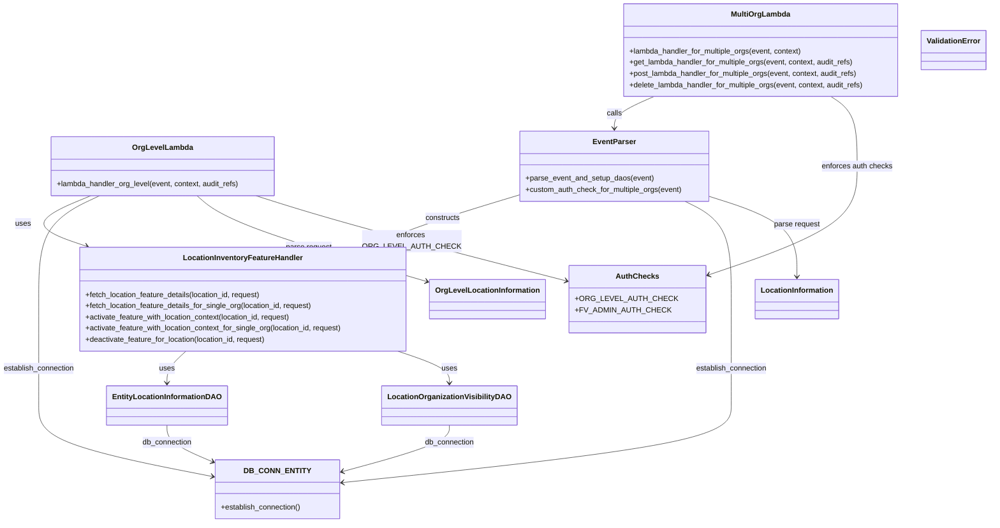
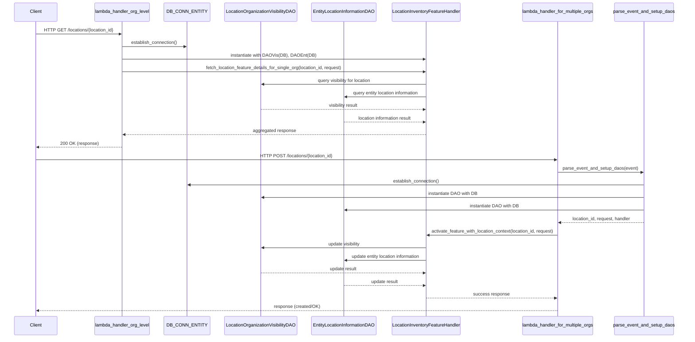

# Diagram: entity_core/entity_service/entity_inventory/entity_inventory_service/lambdas/location_information.py

> Auto-generated by Obscura crawlers

## Diagram 1

### SVG

<svg id="container" width="2064.78515625" xmlns="http://www.w3.org/2000/svg" class="classDiagram" height="1116" viewBox="0 0 2064.78515625 1116" role="graphics-document document" aria-roledescription="class"><g><defs><marker id="container_class-aggregationStart" class="marker aggregation class" refX="18" refY="7" markerWidth="190" markerHeight="240" orient="auto"><path d="M 18,7 L9,13 L1,7 L9,1 Z"></path></marker></defs><defs><marker id="container_class-aggregationEnd" class="marker aggregation class" refX="1" refY="7" markerWidth="20" markerHeight="28" orient="auto"><path d="M 18,7 L9,13 L1,7 L9,1 Z"></path></marker></defs><defs><marker id="container_class-extensionStart" class="marker extension class" refX="18" refY="7" markerWidth="190" markerHeight="240" orient="auto"><path d="M 1,7 L18,13 V 1 Z"></path></marker></defs><defs><marker id="container_class-extensionEnd" class="marker extension class" refX="1" refY="7" markerWidth="20" markerHeight="28" orient="auto"><path d="M 1,1 V 13 L18,7 Z"></path></marker></defs><defs><marker id="container_class-compositionStart" class="marker composition class" refX="18" refY="7" markerWidth="190" markerHeight="240" orient="auto"><path d="M 18,7 L9,13 L1,7 L9,1 Z"></path></marker></defs><defs><marker id="container_class-compositionEnd" class="marker composition class" refX="1" refY="7" markerWidth="20" markerHeight="28" orient="auto"><path d="M 18,7 L9,13 L1,7 L9,1 Z"></path></marker></defs><defs><marker id="container_class-dependencyStart" class="marker dependency class" refX="6" refY="7" markerWidth="190" markerHeight="240" orient="auto"><path d="M 5,7 L9,13 L1,7 L9,1 Z"></path></marker></defs><defs><marker id="container_class-dependencyEnd" class="marker dependency class" refX="13" refY="7" markerWidth="20" markerHeight="28" orient="auto"><path d="M 18,7 L9,13 L14,7 L9,1 Z"></path></marker></defs><defs><marker id="container_class-lollipopStart" class="marker lollipop class" refX="13" refY="7" markerWidth="190" markerHeight="240" orient="auto"><circle stroke="black" fill="transparent" cx="7" cy="7" r="6"></circle></marker></defs><defs><marker id="container_class-lollipopEnd" class="marker lollipop class" refX="1" refY="7" markerWidth="190" markerHeight="240" orient="auto"><circle stroke="black" fill="transparent" cx="7" cy="7" r="6"></circle></marker></defs><g class="root"><g class="clusters"></g><g class="edgePaths"><path d="M193.016,418L169.008,428.167C145,438.333,96.984,458.667,95.739,476.674C94.495,494.682,140.02,510.364,162.783,518.205L185.546,526.046" id="id_OrgLevelLambda_LocationInventoryFeatureHandler_1" class="edge-thickness-normal edge-pattern-solid relation" style=";;;" data-edge="true" data-et="edge" data-id="id_OrgLevelLambda_LocationInventoryFeatureHandler_1" data-points="W3sieCI6MTkzLjAxNTUzMDQ5Mzk1MTYyLCJ5Ijo0MTh9LHsieCI6NDguOTY4NzUsInkiOjQ3OX0seyJ4IjoxOTEuMjE4ODg0Mjc3MzQzNzYsInkiOjUyOH1d" marker-end="url(#container_class-dependencyEnd)"></path><path d="M1346.932,206L1332.703,212.167C1318.474,218.333,1290.016,230.667,1275.787,242C1261.559,253.333,1261.559,263.667,1261.559,268.833L1261.559,274" id="id_MultiOrgLambda_EventParser_2" class="edge-thickness-normal edge-pattern-solid relation" style=";;;" data-edge="true" data-et="edge" data-id="id_MultiOrgLambda_EventParser_2" data-points="W3sieCI6MTM0Ni45MzE5Mjc4NDkyNjQ2LCJ5IjoyMDZ9LHsieCI6MTI2MS41NTg1OTM3NSwieSI6MjQzfSx7IngiOjEyNjEuNTU4NTkzNzUsInkiOjI4MH1d" marker-end="url(#container_class-dependencyEnd)"></path><path d="M1058.996,419.39L1027.742,429.325C996.488,439.26,933.979,459.13,885.364,476.824C836.75,494.517,802.029,510.035,784.668,517.793L767.307,525.552" id="id_EventParser_LocationInventoryFeatureHandler_3" class="edge-thickness-normal edge-pattern-solid relation" style=";;;" data-edge="true" data-et="edge" data-id="id_EventParser_LocationInventoryFeatureHandler_3" data-points="W3sieCI6MTA1OC45OTYwOTM3NSwieSI6NDE5LjM4OTk3NjIxNzI5ODh9LHsieCI6ODcxLjQ3MDcwMzEyNSwieSI6NDc5fSx7IngiOjc2MS44Mjk2MTQyNTc4MTI1LCJ5Ijo1Mjh9XQ==" marker-end="url(#container_class-dependencyEnd)"></path><path d="M397.048,750L390.581,756.167C384.113,762.333,371.179,774.667,364.711,786C358.244,797.333,358.244,807.667,358.244,812.833L358.244,818" id="id_LocationInventoryFeatureHandler_EntityLocationInformationDAO_4" class="edge-thickness-normal edge-pattern-solid relation" style=";;;" data-edge="true" data-et="edge" data-id="id_LocationInventoryFeatureHandler_EntityLocationInformationDAO_4" data-points="W3sieCI6Mzk3LjA0Nzg1MTU2MjUsInkiOjc1MH0seyJ4IjozNTguMjQ0MTQwNjI1LCJ5Ijo3ODd9LHsieCI6MzU4LjI0NDE0MDYyNSwieSI6ODI0fV0=" marker-end="url(#container_class-dependencyEnd)"></path><path d="M836.719,750L854.678,756.167C872.637,762.333,908.555,774.667,926.514,786C944.473,797.333,944.473,807.667,944.473,812.833L944.473,818" id="id_LocationInventoryFeatureHandler_LocationOrganizationVisibilityDAO_5" class="edge-thickness-normal edge-pattern-solid relation" style=";;;" data-edge="true" data-et="edge" data-id="id_LocationInventoryFeatureHandler_LocationOrganizationVisibilityDAO_5" data-points="W3sieCI6ODM2LjcxOTIzODI4MTI1LCJ5Ijo3NTB9LHsieCI6OTQ0LjQ3MjY1NjI1LCJ5Ijo3ODd9LHsieCI6OTQ0LjQ3MjY1NjI1LCJ5Ijo4MjR9XQ==" marker-end="url(#container_class-dependencyEnd)"></path><path d="M358.244,908L358.244,914.167C358.244,920.333,358.244,932.667,373.874,945.634C389.503,958.602,420.763,972.203,436.392,979.004L452.022,985.805" id="id_EntityLocationInformationDAO_DB_CONN_ENTITY_6" class="edge-thickness-normal edge-pattern-solid relation" style=";;;" data-edge="true" data-et="edge" data-id="id_EntityLocationInformationDAO_DB_CONN_ENTITY_6" data-points="W3sieCI6MzU4LjI0NDE0MDYyNSwieSI6OTA4fSx7IngiOjM1OC4yNDQxNDA2MjUsInkiOjk0NX0seyJ4Ijo0NTcuNTIzNDM3NSwieSI6OTg4LjE5OTAyNzc2NDc5Mzl9XQ==" marker-end="url(#container_class-dependencyEnd)"></path><path d="M944.473,908L944.473,914.167C944.473,920.333,944.473,932.667,907.79,949.126C871.108,965.584,797.743,986.169,761.061,996.461L724.378,1006.753" id="id_LocationOrganizationVisibilityDAO_DB_CONN_ENTITY_7" class="edge-thickness-normal edge-pattern-solid relation" style=";;;" data-edge="true" data-et="edge" data-id="id_LocationOrganizationVisibilityDAO_DB_CONN_ENTITY_7" data-points="W3sieCI6OTQ0LjQ3MjY1NjI1LCJ5Ijo5MDh9LHsieCI6OTQ0LjQ3MjY1NjI1LCJ5Ijo5NDV9LHsieCI6NzE4LjYwMTU2MjUsInkiOjEwMDguMzczOTIxODExNDY2M31d" marker-end="url(#container_class-dependencyEnd)"></path><path d="M211.556,418L190.54,428.167C169.524,438.333,127.493,458.667,106.477,495.5C85.461,532.333,85.461,585.667,85.461,637C85.461,688.333,85.461,737.667,85.461,775.5C85.461,813.333,85.461,839.667,85.461,866C85.461,892.333,85.461,918.667,146.491,943.976C207.52,969.285,329.58,993.571,390.609,1005.714L451.639,1017.856" id="id_OrgLevelLambda_DB_CONN_ENTITY_8" class="edge-thickness-normal edge-pattern-solid relation" style=";;;" data-edge="true" data-et="edge" data-id="id_OrgLevelLambda_DB_CONN_ENTITY_8" data-points="W3sieCI6MjExLjU1NTkxNjA3ODYyOTAyLCJ5Ijo0MTh9LHsieCI6ODUuNDYwOTM3NSwieSI6NDc5fSx7IngiOjg1LjQ2MDkzNzUsInkiOjYzOX0seyJ4Ijo4NS40NjA5Mzc1LCJ5Ijo3ODd9LHsieCI6ODUuNDYwOTM3NSwieSI6ODY2fSx7IngiOjg1LjQ2MDkzNzUsInkiOjk0NX0seyJ4Ijo0NTcuNTIzNDM3NSwieSI6MTAxOS4wMjczMjY1NjY0NTg5fV0=" marker-end="url(#container_class-dependencyEnd)"></path><path d="M1418.782,430L1435.902,438.167C1453.022,446.333,1487.262,462.667,1504.382,497.5C1521.502,532.333,1521.502,585.667,1521.502,637C1521.502,688.333,1521.502,737.667,1521.502,775.5C1521.502,813.333,1521.502,839.667,1521.502,866C1521.502,892.333,1521.502,918.667,1388.68,946.063C1255.857,973.459,990.212,1001.917,857.39,1016.147L724.567,1030.376" id="id_EventParser_DB_CONN_ENTITY_9" class="edge-thickness-normal edge-pattern-solid relation" style=";;;" data-edge="true" data-et="edge" data-id="id_EventParser_DB_CONN_ENTITY_9" data-points="W3sieCI6MTQxOC43ODIzOTk4MjM1ODg4LCJ5Ijo0MzB9LHsieCI6MTUyMS41MDE5NTMxMjUsInkiOjQ3OX0seyJ4IjoxNTIxLjUwMTk1MzEyNSwieSI6NjM5fSx7IngiOjE1MjEuNTAxOTUzMTI1LCJ5Ijo3ODd9LHsieCI6MTUyMS41MDE5NTMxMjUsInkiOjg2Nn0seyJ4IjoxNTIxLjUwMTk1MzEyNSwieSI6OTQ1fSx7IngiOjcxOC42MDE1NjI1LCJ5IjoxMDMxLjAxNTI2MTkzNjU5NjN9XQ==" marker-end="url(#container_class-dependencyEnd)"></path><path d="M412.026,418L423.361,428.167C434.696,438.333,457.367,458.667,540.355,489.507C623.343,520.347,766.65,561.694,838.303,582.367L909.956,603.041" id="id_OrgLevelLambda_OrgLevelLocationInformation_10" class="edge-thickness-normal edge-pattern-solid relation" style=";;;" data-edge="true" data-et="edge" data-id="id_OrgLevelLambda_OrgLevelLocationInformation_10" data-points="W3sieCI6NDEyLjAyNjA2NzkxODM0Njc3LCJ5Ijo0MTh9LHsieCI6NDgwLjAzNzEwOTM3NSwieSI6NDc5fSx7IngiOjkxNS43MjA3MDMxMjUsInkiOjYwNC43MDQyMjI4NzE4MzQ2fV0=" marker-end="url(#container_class-dependencyEnd)"></path><path d="M1464.121,419.41L1495.355,429.341C1526.59,439.273,1589.059,459.137,1620.293,487.735C1651.527,516.333,1651.527,553.667,1651.527,572.333L1651.527,591" id="id_EventParser_LocationInformation_11" class="edge-thickness-normal edge-pattern-solid relation" style=";;;" data-edge="true" data-et="edge" data-id="id_EventParser_LocationInformation_11" data-points="W3sieCI6MTQ2NC4xMjEwOTM3NSwieSI6NDE5LjQwOTY0ODIwODk5MTF9LHsieCI6MTY1MS41MjczNDM3NSwieSI6NDc5fSx7IngiOjE2NTEuNTI3MzQzNzUsInkiOjU5N31d" marker-end="url(#container_class-dependencyEnd)"></path><path d="M1726.135,206L1735.527,212.167C1744.918,218.333,1763.701,230.667,1773.093,255.5C1782.484,280.333,1782.484,317.667,1782.484,357C1782.484,396.333,1782.484,437.667,1729.745,477.062C1677.005,516.457,1571.526,553.914,1518.786,572.643L1466.047,591.371" id="id_MultiOrgLambda_AuthChecks_12" class="edge-thickness-normal edge-pattern-solid relation" style=";;;" data-edge="true" data-et="edge" data-id="id_MultiOrgLambda_AuthChecks_12" data-points="W3sieCI6MTcyNi4xMzUyNTM5MDYyNSwieSI6MjA2fSx7IngiOjE3ODIuNDg0Mzc1LCJ5IjoyNDN9LHsieCI6MTc4Mi40ODQzNzUsInkiOjM1NX0seyJ4IjoxNzgyLjQ4NDM3NSwieSI6NDc5fSx7IngiOjE0NjAuMzkyNTc4MTI1LCJ5Ijo1OTMuMzc5MDUwNDAxNjI2NX1d" marker-end="url(#container_class-dependencyEnd)"></path><path d="M530.705,418L561.192,428.167C591.679,438.333,652.653,458.667,763.81,489.709C874.967,520.751,1036.307,562.502,1116.977,583.377L1197.646,604.252" id="id_OrgLevelLambda_AuthChecks_13" class="edge-thickness-normal edge-pattern-solid relation" style=";;;" data-edge="true" data-et="edge" data-id="id_OrgLevelLambda_AuthChecks_13" data-points="W3sieCI6NTMwLjcwNDc3ODg1NTg0NjgsInkiOjQxOH0seyJ4Ijo3MTMuNjI2OTUzMTI1LCJ5Ijo0Nzl9LHsieCI6MTIwMy40NTUwNzgxMjUsInkiOjYwNS43NTU0NTIyMjUxMTQ0fV0=" marker-end="url(#container_class-dependencyEnd)"></path></g><g class="edgeLabels"><g class="edgeLabel" transform="translate(48.96875, 479)"><g class="label" data-id="id_OrgLevelLambda_LocationInventoryFeatureHandler_1" transform="translate(-16.4921875, -12)"><foreignObject width="32.984375" height="24">

uses

</foreignObject></g></g><g class="edgeLabel" transform="translate(1261.55859375, 243)"><g class="label" data-id="id_MultiOrgLambda_EventParser_2" transform="translate(-16.4453125, -12)"><foreignObject width="32.890625" height="24">

calls

</foreignObject></g></g><g class="edgeLabel" transform="translate(908.00882, 467.38537)"><g class="label" data-id="id_EventParser_LocationInventoryFeatureHandler_3" transform="translate(-37.84375, -12)"><foreignObject width="75.6875" height="24">

constructs

</foreignObject></g></g><g class="edgeLabel" transform="translate(358.244140625, 787)"><g class="label" data-id="id_LocationInventoryFeatureHandler_EntityLocationInformationDAO_4" transform="translate(-16.4921875, -12)"><foreignObject width="32.984375" height="24">

uses

</foreignObject></g></g><g class="edgeLabel" transform="translate(944.47265625, 787)"><g class="label" data-id="id_LocationInventoryFeatureHandler_LocationOrganizationVisibilityDAO_5" transform="translate(-16.4921875, -12)"><foreignObject width="32.984375" height="24">

uses

</foreignObject></g></g><g class="edgeLabel" transform="translate(358.244140625, 945)"><g class="label" data-id="id_EntityLocationInformationDAO_DB_CONN_ENTITY_6" transform="translate(-53.78125, -12)"><foreignObject width="107.5625" height="24">

db_connection

</foreignObject></g></g><g class="edgeLabel" transform="translate(944.47265625, 945)"><g class="label" data-id="id_LocationOrganizationVisibilityDAO_DB_CONN_ENTITY_7" transform="translate(-53.78125, -12)"><foreignObject width="107.5625" height="24">

db_connection

</foreignObject></g></g><g class="edgeLabel" transform="translate(85.4609375, 787)"><g class="label" data-id="id_OrgLevelLambda_DB_CONN_ENTITY_8" transform="translate(-77.4609375, -12)"><foreignObject width="154.921875" height="24">

establish_connection

</foreignObject></g></g><g class="edgeLabel" transform="translate(1521.501953125, 787)"><g class="label" data-id="id_EventParser_DB_CONN_ENTITY_9" transform="translate(-77.4609375, -12)"><foreignObject width="154.921875" height="24">

establish_connection

</foreignObject></g></g><g class="edgeLabel" transform="translate(653.98958, 529.18908)"><g class="label" data-id="id_OrgLevelLambda_OrgLevelLocationInformation_10" transform="translate(-49.84375, -12)"><foreignObject width="99.6875" height="24">

parse request

</foreignObject></g></g><g class="edgeLabel" transform="translate(1651.52734375, 479)"><g class="label" data-id="id_EventParser_LocationInformation_11" transform="translate(-49.84375, -12)"><foreignObject width="99.6875" height="24">

parse request

</foreignObject></g></g><g class="edgeLabel" transform="translate(1782.484375, 355)"><g class="label" data-id="id_MultiOrgLambda_AuthChecks_12" transform="translate(-76.2421875, -12)"><foreignObject width="152.484375" height="24">

enforces auth checks

</foreignObject></g></g><g class="edgeLabel" transform="translate(865.203, 518.22415)"><g class="label" data-id="id_OrgLevelLambda_AuthChecks_13" transform="translate(-100, -24)"><foreignObject width="200" height="48">

enforces ORG_LEVEL_AUTH_CHECK

</foreignObject></g></g></g><g class="nodes"><g class="node default" id="classId-OrgLevelLambda-0" transform="translate(341.78515625, 355)"><g class="basic label-container"><path d="M-239.9921875 -63 L239.9921875 -63 L239.9921875 63 L-239.9921875 63" stroke="none" stroke-width="0" fill="#ECECFF" style=""></path><path d="M-239.9921875 -63 C-139.4591984337813 -63, -38.926209367562564 -63, 239.9921875 -63 M-239.9921875 -63 C-131.37706735126696 -63, -22.761947202533918 -63, 239.9921875 -63 M239.9921875 -63 C239.9921875 -13.369055856791796, 239.9921875 36.26188828641641, 239.9921875 63 M239.9921875 -63 C239.9921875 -35.179150489638104, 239.9921875 -7.3583009792762155, 239.9921875 63 M239.9921875 63 C79.12583369912159 63, -81.74052010175683 63, -239.9921875 63 M239.9921875 63 C72.71400890231442 63, -94.56416969537116 63, -239.9921875 63 M-239.9921875 63 C-239.9921875 25.884994620099384, -239.9921875 -11.230010759801232, -239.9921875 -63 M-239.9921875 63 C-239.9921875 22.469112347524785, -239.9921875 -18.06177530495043, -239.9921875 -63" stroke="#9370DB" stroke-width="1.3" fill="none" stroke-dasharray="0 0" style=""></path></g><g class="annotation-group text" transform="translate(0, -39)"></g><g class="label-group text" transform="translate(-61.265625, -39)"><g class="label" style="font-weight: bolder" transform="translate(0,-12)"><foreignObject width="122.53125" height="24">

OrgLevelLambda

</foreignObject></g></g><g class="members-group text" transform="translate(-227.9921875, 9)"></g><g class="methods-group text" transform="translate(-227.9921875, 39)"><g class="label" style="" transform="translate(0,-12)"><foreignObject width="394.71875" height="24">

+lambda_handler_org_level(event, context, audit_refs)

</foreignObject></g></g><g class="divider" style=""><path d="M-239.9921875 -15 C-132.1394900798959 -15, -24.286792659791757 -15, 239.9921875 -15 M-239.9921875 -15 C-90.38357146885076 -15, 59.22504456229848 -15, 239.9921875 -15" stroke="#9370DB" stroke-width="1.3" fill="none" stroke-dasharray="0 0" style=""></path></g><g class="divider" style=""><path d="M-239.9921875 9 C-91.18549434229737 9, 57.62119881540525 9, 239.9921875 9 M-239.9921875 9 C-88.8248607598999 9, 62.34246598020019 9, 239.9921875 9" stroke="#9370DB" stroke-width="1.3" fill="none" stroke-dasharray="0 0" style=""></path></g></g><g class="node default" id="classId-MultiOrgLambda-1" transform="translate(1575.36328125, 107)"><g class="basic label-container"><path d="M-297.0625 -99 L297.0625 -99 L297.0625 99 L-297.0625 99" stroke="none" stroke-width="0" fill="#ECECFF" style=""></path><path d="M-297.0625 -99 C-91.57489224276583 -99, 113.91271551446835 -99, 297.0625 -99 M-297.0625 -99 C-73.7707934965415 -99, 149.520913006917 -99, 297.0625 -99 M297.0625 -99 C297.0625 -32.92475248723446, 297.0625 33.150495025531086, 297.0625 99 M297.0625 -99 C297.0625 -37.830861961150006, 297.0625 23.338276077699987, 297.0625 99 M297.0625 99 C160.64640435457534 99, 24.230308709150677 99, -297.0625 99 M297.0625 99 C143.53331122507032 99, -9.995877549859358 99, -297.0625 99 M-297.0625 99 C-297.0625 38.650359119211934, -297.0625 -21.69928176157613, -297.0625 -99 M-297.0625 99 C-297.0625 46.86601120647751, -297.0625 -5.267977587044982, -297.0625 -99" stroke="#9370DB" stroke-width="1.3" fill="none" stroke-dasharray="0 0" style=""></path></g><g class="annotation-group text" transform="translate(0, -75)"></g><g class="label-group text" transform="translate(-60.765625, -75)"><g class="label" style="font-weight: bolder" transform="translate(0,-12)"><foreignObject width="121.53125" height="24">

MultiOrgLambda

</foreignObject></g></g><g class="members-group text" transform="translate(-285.0625, -27)"></g><g class="methods-group text" transform="translate(-285.0625, 3)"><g class="label" style="" transform="translate(0,-12)"><foreignObject width="374.140625" height="24">

+lambda_handler_for_multiple_orgs(event, context)

</foreignObject></g><g class="label" style="" transform="translate(0,12)"><foreignObject width="486.359375" height="24">

+get_lambda_handler_for_multiple_orgs(event, context, audit_refs)

</foreignObject></g><g class="label" style="" transform="translate(0,36)"><foreignObject width="495.890625" height="24">

+post_lambda_handler_for_multiple_orgs(event, context, audit_refs)

</foreignObject></g><g class="label" style="" transform="translate(0,60)"><foreignObject width="509.359375" height="24">

+delete_lambda_handler_for_multiple_orgs(event, context, audit_refs)

</foreignObject></g></g><g class="divider" style=""><path d="M-297.0625 -51 C-168.32420868432064 -51, -39.585917368641276 -51, 297.0625 -51 M-297.0625 -51 C-92.04899778600108 -51, 112.96450442799784 -51, 297.0625 -51" stroke="#9370DB" stroke-width="1.3" fill="none" stroke-dasharray="0 0" style=""></path></g><g class="divider" style=""><path d="M-297.0625 -27 C-124.5693870360034 -27, 47.92372592799319 -27, 297.0625 -27 M-297.0625 -27 C-161.56290672807927 -27, -26.06331345615854 -27, 297.0625 -27" stroke="#9370DB" stroke-width="1.3" fill="none" stroke-dasharray="0 0" style=""></path></g></g><g class="node default" id="classId-EventParser-2" transform="translate(1261.55859375, 355)"><g class="basic label-container"><path d="M-202.5625 -75 L202.5625 -75 L202.5625 75 L-202.5625 75" stroke="none" stroke-width="0" fill="#ECECFF" style=""></path><path d="M-202.5625 -75 C-57.37306977109989 -75, 87.81636045780022 -75, 202.5625 -75 M-202.5625 -75 C-41.58263770182583 -75, 119.39722459634834 -75, 202.5625 -75 M202.5625 -75 C202.5625 -20.32394494623879, 202.5625 34.35211010752242, 202.5625 75 M202.5625 -75 C202.5625 -31.234809376313898, 202.5625 12.530381247372205, 202.5625 75 M202.5625 75 C51.48533428361051 75, -99.59183143277897 75, -202.5625 75 M202.5625 75 C113.1778282249808 75, 23.7931564499616 75, -202.5625 75 M-202.5625 75 C-202.5625 16.080585611032355, -202.5625 -42.83882877793529, -202.5625 -75 M-202.5625 75 C-202.5625 19.35913049790409, -202.5625 -36.28173900419182, -202.5625 -75" stroke="#9370DB" stroke-width="1.3" fill="none" stroke-dasharray="0 0" style=""></path></g><g class="annotation-group text" transform="translate(0, -51)"></g><g class="label-group text" transform="translate(-43.578125, -51)"><g class="label" style="font-weight: bolder" transform="translate(0,-12)"><foreignObject width="87.15625" height="24">

EventParser

</foreignObject></g></g><g class="members-group text" transform="translate(-190.5625, -3)"></g><g class="methods-group text" transform="translate(-190.5625, 27)"><g class="label" style="" transform="translate(0,-12)"><foreignObject width="274.40625" height="24">

+parse_event_and_setup_daos(event)

</foreignObject></g><g class="label" style="" transform="translate(0,12)"><foreignObject width="337.546875" height="24">

+custom_auth_check_for_multiple_orgs(event)

</foreignObject></g></g><g class="divider" style=""><path d="M-202.5625 -27 C-86.679521144192 -27, 29.20345771161601 -27, 202.5625 -27 M-202.5625 -27 C-111.04303446674874 -27, -19.523568933497472 -27, 202.5625 -27" stroke="#9370DB" stroke-width="1.3" fill="none" stroke-dasharray="0 0" style=""></path></g><g class="divider" style=""><path d="M-202.5625 -3 C-56.02623143411449 -3, 90.51003713177101 -3, 202.5625 -3 M-202.5625 -3 C-54.53776200634496 -3, 93.48697598731007 -3, 202.5625 -3" stroke="#9370DB" stroke-width="1.3" fill="none" stroke-dasharray="0 0" style=""></path></g></g><g class="node default" id="classId-LocationInventoryFeatureHandler-3" transform="translate(513.458984375, 639)"><g class="basic label-container"><path d="M-352.26171875 -111 L352.26171875 -111 L352.26171875 111 L-352.26171875 111" stroke="none" stroke-width="0" fill="#ECECFF" style=""></path><path d="M-352.26171875 -111 C-119.97518863478115 -111, 112.3113414804377 -111, 352.26171875 -111 M-352.26171875 -111 C-127.05156829250606 -111, 98.15858216498788 -111, 352.26171875 -111 M352.26171875 -111 C352.26171875 -23.662568443757095, 352.26171875 63.67486311248581, 352.26171875 111 M352.26171875 -111 C352.26171875 -54.484241042140916, 352.26171875 2.031517915718169, 352.26171875 111 M352.26171875 111 C76.93155657899871 111, -198.39860559200258 111, -352.26171875 111 M352.26171875 111 C138.26294543792346 111, -75.73582787415307 111, -352.26171875 111 M-352.26171875 111 C-352.26171875 28.260229670666916, -352.26171875 -54.47954065866617, -352.26171875 -111 M-352.26171875 111 C-352.26171875 52.18022411494827, -352.26171875 -6.639551770103466, -352.26171875 -111" stroke="#9370DB" stroke-width="1.3" fill="none" stroke-dasharray="0 0" style=""></path></g><g class="annotation-group text" transform="translate(0, -87)"></g><g class="label-group text" transform="translate(-122.7734375, -87)"><g class="label" style="font-weight: bolder" transform="translate(0,-12)"><foreignObject width="245.546875" height="24">

LocationInventoryFeatureHandler

</foreignObject></g></g><g class="members-group text" transform="translate(-340.26171875, -39)"></g><g class="methods-group text" transform="translate(-340.26171875, -9)"><g class="label" style="" transform="translate(0,-12)"><foreignObject width="383.78125" height="24">

+fetch_location_feature_details(location_id, request)

</foreignObject></g><g class="label" style="" transform="translate(0,12)"><foreignObject width="493.515625" height="24">

+fetch_location_feature_details_for_single_org(location_id, request)

</foreignObject></g><g class="label" style="" transform="translate(0,36)"><foreignObject width="447.703125" height="24">

+activate_feature_with_location_context(location_id, request)

</foreignObject></g><g class="label" style="" transform="translate(0,60)"><foreignObject width="557.75" height="24">

+activate_feature_with_location_context_for_single_org(location_id, request)

</foreignObject></g><g class="label" style="" transform="translate(0,84)"><foreignObject width="392.6875" height="24">

+deactivate_feature_for_location(location_id, request)

</foreignObject></g></g><g class="divider" style=""><path d="M-352.26171875 -63 C-191.1316837170783 -63, -30.001648684156578 -63, 352.26171875 -63 M-352.26171875 -63 C-157.05617942737803 -63, 38.14935989524395 -63, 352.26171875 -63" stroke="#9370DB" stroke-width="1.3" fill="none" stroke-dasharray="0 0" style=""></path></g><g class="divider" style=""><path d="M-352.26171875 -39 C-177.9530425861045 -39, -3.644366422208975 -39, 352.26171875 -39 M-352.26171875 -39 C-167.63849852426 -39, 16.984721701479998 -39, 352.26171875 -39" stroke="#9370DB" stroke-width="1.3" fill="none" stroke-dasharray="0 0" style=""></path></g></g><g class="node default" id="classId-EntityLocationInformationDAO-4" transform="translate(358.244140625, 866)"><g class="basic label-container"><path d="M-123.3046875 -42 L123.3046875 -42 L123.3046875 42 L-123.3046875 42" stroke="none" stroke-width="0" fill="#ECECFF" style=""></path><path d="M-123.3046875 -42 C-35.60761573608934 -42, 52.08945602782131 -42, 123.3046875 -42 M-123.3046875 -42 C-62.58949463080569 -42, -1.8743017616113775 -42, 123.3046875 -42 M123.3046875 -42 C123.3046875 -20.142095110403364, 123.3046875 1.7158097791932718, 123.3046875 42 M123.3046875 -42 C123.3046875 -16.582969492207543, 123.3046875 8.834061015584915, 123.3046875 42 M123.3046875 42 C52.333184241512754 42, -18.638319016974492 42, -123.3046875 42 M123.3046875 42 C37.13486666522002 42, -49.03495416955997 42, -123.3046875 42 M-123.3046875 42 C-123.3046875 16.743813600609613, -123.3046875 -8.512372798780774, -123.3046875 -42 M-123.3046875 42 C-123.3046875 11.224644224036169, -123.3046875 -19.550711551927662, -123.3046875 -42" stroke="#9370DB" stroke-width="1.3" fill="none" stroke-dasharray="0 0" style=""></path></g><g class="annotation-group text" transform="translate(0, -18)"></g><g class="label-group text" transform="translate(-111.3046875, -18)"><g class="label" style="font-weight: bolder" transform="translate(0,-12)"><foreignObject width="222.609375" height="24">

EntityLocationInformationDAO

</foreignObject></g></g><g class="members-group text" transform="translate(-111.3046875, 30)"></g><g class="methods-group text" transform="translate(-111.3046875, 60)"></g><g class="divider" style=""><path d="M-123.3046875 6 C-27.44546156194025 6, 68.4137643761195 6, 123.3046875 6 M-123.3046875 6 C-27.872992277463666 6, 67.55870294507267 6, 123.3046875 6" stroke="#9370DB" stroke-width="1.3" fill="none" stroke-dasharray="0 0" style=""></path></g><g class="divider" style=""><path d="M-123.3046875 24 C-57.243921538873806 24, 8.816844422252387 24, 123.3046875 24 M-123.3046875 24 C-36.30372382923588 24, 50.697239841528244 24, 123.3046875 24" stroke="#9370DB" stroke-width="1.3" fill="none" stroke-dasharray="0 0" style=""></path></g></g><g class="node default" id="classId-LocationOrganizationVisibilityDAO-5" transform="translate(944.47265625, 866)"><g class="basic label-container"><path d="M-137.125 -42 L137.125 -42 L137.125 42 L-137.125 42" stroke="none" stroke-width="0" fill="#ECECFF" style=""></path><path d="M-137.125 -42 C-72.28514793854623 -42, -7.445295877092462 -42, 137.125 -42 M-137.125 -42 C-53.9413182833988 -42, 29.2423634332024 -42, 137.125 -42 M137.125 -42 C137.125 -9.99403420859798, 137.125 22.01193158280404, 137.125 42 M137.125 -42 C137.125 -14.859813950173198, 137.125 12.280372099653604, 137.125 42 M137.125 42 C80.54355835138111 42, 23.96211670276223 42, -137.125 42 M137.125 42 C62.36848735716009 42, -12.388025285679817 42, -137.125 42 M-137.125 42 C-137.125 9.233916106454409, -137.125 -23.532167787091183, -137.125 -42 M-137.125 42 C-137.125 13.247739790589272, -137.125 -15.504520418821457, -137.125 -42" stroke="#9370DB" stroke-width="1.3" fill="none" stroke-dasharray="0 0" style=""></path></g><g class="annotation-group text" transform="translate(0, -18)"></g><g class="label-group text" transform="translate(-125.125, -18)"><g class="label" style="font-weight: bolder" transform="translate(0,-12)"><foreignObject width="250.25" height="24">

LocationOrganizationVisibilityDAO

</foreignObject></g></g><g class="members-group text" transform="translate(-125.125, 30)"></g><g class="methods-group text" transform="translate(-125.125, 60)"></g><g class="divider" style=""><path d="M-137.125 6 C-58.45808897658243 6, 20.208822046835138 6, 137.125 6 M-137.125 6 C-56.90612035223508 6, 23.312759295529844 6, 137.125 6" stroke="#9370DB" stroke-width="1.3" fill="none" stroke-dasharray="0 0" style=""></path></g><g class="divider" style=""><path d="M-137.125 24 C-52.28836959246216 24, 32.54826081507568 24, 137.125 24 M-137.125 24 C-77.53481972310888 24, -17.944639446217764 24, 137.125 24" stroke="#9370DB" stroke-width="1.3" fill="none" stroke-dasharray="0 0" style=""></path></g></g><g class="node default" id="classId-DB_CONN_ENTITY-6" transform="translate(588.0625, 1045)"><g class="basic label-container"><path d="M-130.5390625 -63 L130.5390625 -63 L130.5390625 63 L-130.5390625 63" stroke="none" stroke-width="0" fill="#ECECFF" style=""></path><path d="M-130.5390625 -63 C-51.497834507935664 -63, 27.54339348412867 -63, 130.5390625 -63 M-130.5390625 -63 C-31.035464996069564 -63, 68.46813250786087 -63, 130.5390625 -63 M130.5390625 -63 C130.5390625 -35.24443624778619, 130.5390625 -7.48887249557238, 130.5390625 63 M130.5390625 -63 C130.5390625 -17.610710896744564, 130.5390625 27.778578206510872, 130.5390625 63 M130.5390625 63 C73.7082269974905 63, 16.877391494980984 63, -130.5390625 63 M130.5390625 63 C55.51799222781757 63, -19.503078044364855 63, -130.5390625 63 M-130.5390625 63 C-130.5390625 16.7999903354794, -130.5390625 -29.4000193290412, -130.5390625 -63 M-130.5390625 63 C-130.5390625 30.015737153966363, -130.5390625 -2.9685256920672742, -130.5390625 -63" stroke="#9370DB" stroke-width="1.3" fill="none" stroke-dasharray="0 0" style=""></path></g><g class="annotation-group text" transform="translate(0, -39)"></g><g class="label-group text" transform="translate(-63.8125, -39)"><g class="label" style="font-weight: bolder" transform="translate(0,-12)"><foreignObject width="127.625" height="24">

DB_CONN_ENTITY

</foreignObject></g></g><g class="members-group text" transform="translate(-118.5390625, 9)"></g><g class="methods-group text" transform="translate(-118.5390625, 39)"><g class="label" style="" transform="translate(0,-12)"><foreignObject width="173.265625" height="24">

+establish_connection()

</foreignObject></g></g><g class="divider" style=""><path d="M-130.5390625 -15 C-69.81231217915085 -15, -9.085561858301702 -15, 130.5390625 -15 M-130.5390625 -15 C-58.62578316590606 -15, 13.287496168187886 -15, 130.5390625 -15" stroke="#9370DB" stroke-width="1.3" fill="none" stroke-dasharray="0 0" style=""></path></g><g class="divider" style=""><path d="M-130.5390625 9 C-33.23940844881807 9, 64.06024560236386 9, 130.5390625 9 M-130.5390625 9 C-72.54455156660697 9, -14.55004063321394 9, 130.5390625 9" stroke="#9370DB" stroke-width="1.3" fill="none" stroke-dasharray="0 0" style=""></path></g></g><g class="node default" id="classId-OrgLevelLocationInformation-7" transform="translate(1034.587890625, 639)"><g class="basic label-container"><path d="M-118.8671875 -42 L118.8671875 -42 L118.8671875 42 L-118.8671875 42" stroke="none" stroke-width="0" fill="#ECECFF" style=""></path><path d="M-118.8671875 -42 C-50.785267136810816 -42, 17.296653226378368 -42, 118.8671875 -42 M-118.8671875 -42 C-46.3525024390152 -42, 26.162182621969606 -42, 118.8671875 -42 M118.8671875 -42 C118.8671875 -17.689092301465983, 118.8671875 6.621815397068033, 118.8671875 42 M118.8671875 -42 C118.8671875 -13.420886757846361, 118.8671875 15.158226484307278, 118.8671875 42 M118.8671875 42 C23.779742714625 42, -71.30770207075 42, -118.8671875 42 M118.8671875 42 C51.07518251631183 42, -16.716822467376346 42, -118.8671875 42 M-118.8671875 42 C-118.8671875 11.64701971234021, -118.8671875 -18.70596057531958, -118.8671875 -42 M-118.8671875 42 C-118.8671875 13.914874765805354, -118.8671875 -14.170250468389291, -118.8671875 -42" stroke="#9370DB" stroke-width="1.3" fill="none" stroke-dasharray="0 0" style=""></path></g><g class="annotation-group text" transform="translate(0, -18)"></g><g class="label-group text" transform="translate(-106.8671875, -18)"><g class="label" style="font-weight: bolder" transform="translate(0,-12)"><foreignObject width="213.734375" height="24">

OrgLevelLocationInformation

</foreignObject></g></g><g class="members-group text" transform="translate(-106.8671875, 30)"></g><g class="methods-group text" transform="translate(-106.8671875, 60)"></g><g class="divider" style=""><path d="M-118.8671875 6 C-44.03235619561778 6, 30.80247510876444 6, 118.8671875 6 M-118.8671875 6 C-48.76600301372119 6, 21.335181472557622 6, 118.8671875 6" stroke="#9370DB" stroke-width="1.3" fill="none" stroke-dasharray="0 0" style=""></path></g><g class="divider" style=""><path d="M-118.8671875 24 C-58.341084216243985 24, 2.1850190675120302 24, 118.8671875 24 M-118.8671875 24 C-58.26986965450309 24, 2.3274481909938203 24, 118.8671875 24" stroke="#9370DB" stroke-width="1.3" fill="none" stroke-dasharray="0 0" style=""></path></g></g><g class="node default" id="classId-LocationInformation-8" transform="translate(1651.52734375, 639)"><g class="basic label-container"><path d="M-86.734375 -42 L86.734375 -42 L86.734375 42 L-86.734375 42" stroke="none" stroke-width="0" fill="#ECECFF" style=""></path><path d="M-86.734375 -42 C-39.731644714508775 -42, 7.27108557098245 -42, 86.734375 -42 M-86.734375 -42 C-36.235688545090255 -42, 14.26299790981949 -42, 86.734375 -42 M86.734375 -42 C86.734375 -9.111980205378217, 86.734375 23.776039589243567, 86.734375 42 M86.734375 -42 C86.734375 -20.16711727922391, 86.734375 1.6657654415521819, 86.734375 42 M86.734375 42 C25.554878810341286 42, -35.62461737931743 42, -86.734375 42 M86.734375 42 C42.31735182223626 42, -2.0996713555274766 42, -86.734375 42 M-86.734375 42 C-86.734375 10.926493016761917, -86.734375 -20.147013966476166, -86.734375 -42 M-86.734375 42 C-86.734375 25.11958637708643, -86.734375 8.239172754172863, -86.734375 -42" stroke="#9370DB" stroke-width="1.3" fill="none" stroke-dasharray="0 0" style=""></path></g><g class="annotation-group text" transform="translate(0, -18)"></g><g class="label-group text" transform="translate(-74.734375, -18)"><g class="label" style="font-weight: bolder" transform="translate(0,-12)"><foreignObject width="149.46875" height="24">

LocationInformation

</foreignObject></g></g><g class="members-group text" transform="translate(-74.734375, 30)"></g><g class="methods-group text" transform="translate(-74.734375, 60)"></g><g class="divider" style=""><path d="M-86.734375 6 C-22.26991764645433 6, 42.19453970709134 6, 86.734375 6 M-86.734375 6 C-36.1676135898791 6, 14.399147820241794 6, 86.734375 6" stroke="#9370DB" stroke-width="1.3" fill="none" stroke-dasharray="0 0" style=""></path></g><g class="divider" style=""><path d="M-86.734375 24 C-34.78323424977298 24, 17.167906500454038 24, 86.734375 24 M-86.734375 24 C-43.521449993796196 24, -0.3085249875923921 24, 86.734375 24" stroke="#9370DB" stroke-width="1.3" fill="none" stroke-dasharray="0 0" style=""></path></g></g><g class="node default" id="classId-ValidationError-9" transform="translate(1989.60546875, 107)"><g class="basic label-container"><path d="M-67.1796875 -42 L67.1796875 -42 L67.1796875 42 L-67.1796875 42" stroke="none" stroke-width="0" fill="#ECECFF" style=""></path><path d="M-67.1796875 -42 C-31.72832589701406 -42, 3.7230357059718813 -42, 67.1796875 -42 M-67.1796875 -42 C-23.604530886160475 -42, 19.97062572767905 -42, 67.1796875 -42 M67.1796875 -42 C67.1796875 -20.466605994177204, 67.1796875 1.066788011645592, 67.1796875 42 M67.1796875 -42 C67.1796875 -17.19984215612944, 67.1796875 7.600315687741123, 67.1796875 42 M67.1796875 42 C15.910632270759194 42, -35.35842295848161 42, -67.1796875 42 M67.1796875 42 C37.12134402103327 42, 7.063000542066547 42, -67.1796875 42 M-67.1796875 42 C-67.1796875 22.794143375617583, -67.1796875 3.5882867512351666, -67.1796875 -42 M-67.1796875 42 C-67.1796875 15.233366867392142, -67.1796875 -11.533266265215715, -67.1796875 -42" stroke="#9370DB" stroke-width="1.3" fill="none" stroke-dasharray="0 0" style=""></path></g><g class="annotation-group text" transform="translate(0, -18)"></g><g class="label-group text" transform="translate(-55.1796875, -18)"><g class="label" style="font-weight: bolder" transform="translate(0,-12)"><foreignObject width="110.359375" height="24">

ValidationError

</foreignObject></g></g><g class="members-group text" transform="translate(-55.1796875, 30)"></g><g class="methods-group text" transform="translate(-55.1796875, 60)"></g><g class="divider" style=""><path d="M-67.1796875 6 C-23.48355544356027 6, 20.21257661287946 6, 67.1796875 6 M-67.1796875 6 C-15.210478899589503 6, 36.75872970082099 6, 67.1796875 6" stroke="#9370DB" stroke-width="1.3" fill="none" stroke-dasharray="0 0" style=""></path></g><g class="divider" style=""><path d="M-67.1796875 24 C-14.188011712170699 24, 38.8036640756586 24, 67.1796875 24 M-67.1796875 24 C-22.56982874365257 24, 22.040030012694857 24, 67.1796875 24" stroke="#9370DB" stroke-width="1.3" fill="none" stroke-dasharray="0 0" style=""></path></g></g><g class="node default" id="classId-AuthChecks-10" transform="translate(1331.923828125, 639)"><g class="basic label-container"><path d="M-128.46875 -72 L128.46875 -72 L128.46875 72 L-128.46875 72" stroke="none" stroke-width="0" fill="#ECECFF" style=""></path><path d="M-128.46875 -72 C-51.50256374577128 -72, 25.463622508457433 -72, 128.46875 -72 M-128.46875 -72 C-28.230887362985413 -72, 72.00697527402917 -72, 128.46875 -72 M128.46875 -72 C128.46875 -17.4184075766166, 128.46875 37.1631848467668, 128.46875 72 M128.46875 -72 C128.46875 -23.533060370408037, 128.46875 24.933879259183925, 128.46875 72 M128.46875 72 C33.775737357800864 72, -60.91727528439827 72, -128.46875 72 M128.46875 72 C64.90344842900694 72, 1.3381468580138716 72, -128.46875 72 M-128.46875 72 C-128.46875 39.82029634021439, -128.46875 7.640592680428782, -128.46875 -72 M-128.46875 72 C-128.46875 32.83016902524467, -128.46875 -6.339661949510656, -128.46875 -72" stroke="#9370DB" stroke-width="1.3" fill="none" stroke-dasharray="0 0" style=""></path></g><g class="annotation-group text" transform="translate(0, -48)"></g><g class="label-group text" transform="translate(-42.625, -48)"><g class="label" style="font-weight: bolder" transform="translate(0,-12)"><foreignObject width="85.25" height="24">

AuthChecks

</foreignObject></g></g><g class="members-group text" transform="translate(-116.46875, 0)"><g class="label" style="" transform="translate(0,-12)"><foreignObject width="190.3125" height="24">

+ORG_LEVEL_AUTH_CHECK

</foreignObject></g><g class="label" style="" transform="translate(0,12)"><foreignObject width="181.0625" height="24">

+FV_ADMIN_AUTH_CHECK

</foreignObject></g></g><g class="methods-group text" transform="translate(-116.46875, 72)"></g><g class="divider" style=""><path d="M-128.46875 -24 C-59.28257047232961 -24, 9.90360905534078 -24, 128.46875 -24 M-128.46875 -24 C-49.70836308554253 -24, 29.05202382891494 -24, 128.46875 -24" stroke="#9370DB" stroke-width="1.3" fill="none" stroke-dasharray="0 0" style=""></path></g><g class="divider" style=""><path d="M-128.46875 48 C-31.427826690000572 48, 65.61309661999886 48, 128.46875 48 M-128.46875 48 C-76.87748088370634 48, -25.286211767412667 48, 128.46875 48" stroke="#9370DB" stroke-width="1.3" fill="none" stroke-dasharray="0 0" style=""></path></g></g></g></g></g></svg>

## Diagram 2

### SVG

<svg id="container" width="2574" xmlns="http://www.w3.org/2000/svg" height="1275" viewBox="-50 -10 2574 1275" role="graphics-document document" aria-roledescription="sequence"><g><rect x="2238" y="1189" fill="#eaeaea" stroke="#666" width="236" height="65" name="Parser" rx="3" ry="3" class="actor actor-bottom"></rect><text x="2356" y="1221.5" dominant-baseline="central" alignment-baseline="central" class="actor actor-box" style="text-anchor: middle; font-size: 16px; font-weight: 400;"><tspan x="2356" dy="0">parse_event_and_setup_daos</tspan></text></g><g><rect x="1883" y="1189" fill="#eaeaea" stroke="#666" width="274" height="65" name="MultiLambda" rx="3" ry="3" class="actor actor-bottom"></rect><text x="2020" y="1221.5" dominant-baseline="central" alignment-baseline="central" class="actor actor-box" style="text-anchor: middle; font-size: 16px; font-weight: 400;"><tspan x="2020" dy="0">lambda_handler_for_multiple_orgs</tspan></text></g><g><rect x="1378" y="1189" fill="#eaeaea" stroke="#666" width="264" height="65" name="Handler" rx="3" ry="3" class="actor actor-bottom"></rect><text x="1510" y="1221.5" dominant-baseline="central" alignment-baseline="central" class="actor actor-box" style="text-anchor: middle; font-size: 16px; font-weight: 400;"><tspan x="1510" dy="0">LocationInventoryFeatureHandler</tspan></text></g><g><rect x="1069" y="1189" fill="#eaeaea" stroke="#666" width="240" height="65" name="DAOEnt" rx="3" ry="3" class="actor actor-bottom"></rect><text x="1189" y="1221.5" dominant-baseline="central" alignment-baseline="central" class="actor actor-box" style="text-anchor: middle; font-size: 16px; font-weight: 400;"><tspan x="1189" dy="0">EntityLocationInformationDAO</tspan></text></g><g><rect x="752" y="1189" fill="#eaeaea" stroke="#666" width="267" height="65" name="DAOVis" rx="3" ry="3" class="actor actor-bottom"></rect><text x="885.5" y="1221.5" dominant-baseline="central" alignment-baseline="central" class="actor actor-box" style="text-anchor: middle; font-size: 16px; font-weight: 400;"><tspan x="885.5" dy="0">LocationOrganizationVisibilityDAO</tspan></text></g><g><rect x="552" y="1189" fill="#eaeaea" stroke="#666" width="150" height="65" name="DB" rx="3" ry="3" class="actor actor-bottom"></rect><text x="627" y="1221.5" dominant-baseline="central" alignment-baseline="central" class="actor actor-box" style="text-anchor: middle; font-size: 16px; font-weight: 400;"><tspan x="627" dy="0">DB_CONN_ENTITY</tspan></text></g><g><rect x="285.5" y="1189" fill="#eaeaea" stroke="#666" width="213" height="65" name="OrgLambda" rx="3" ry="3" class="actor actor-bottom"></rect><text x="392" y="1221.5" dominant-baseline="central" alignment-baseline="central" class="actor actor-box" style="text-anchor: middle; font-size: 16px; font-weight: 400;"><tspan x="392" dy="0">lambda_handler_org_level</tspan></text></g><g><rect x="0" y="1189" fill="#eaeaea" stroke="#666" width="150" height="65" name="Client" rx="3" ry="3" class="actor actor-bottom"></rect><text x="75" y="1221.5" dominant-baseline="central" alignment-baseline="central" class="actor actor-box" style="text-anchor: middle; font-size: 16px; font-weight: 400;"><tspan x="75" dy="0">Client</tspan></text></g><g><line id="actor7" x1="2356" y1="65" x2="2356" y2="1189" class="actor-line 200" stroke-width="0.5px" stroke="#999" name="Parser"></line><g id="root-7"><rect x="2238" y="0" fill="#eaeaea" stroke="#666" width="236" height="65" name="Parser" rx="3" ry="3" class="actor actor-top"></rect><text x="2356" y="32.5" dominant-baseline="central" alignment-baseline="central" class="actor actor-box" style="text-anchor: middle; font-size: 16px; font-weight: 400;"><tspan x="2356" dy="0">parse_event_and_setup_daos</tspan></text></g></g><g><line id="actor6" x1="2020" y1="65" x2="2020" y2="1189" class="actor-line 200" stroke-width="0.5px" stroke="#999" name="MultiLambda"></line><g id="root-6"><rect x="1883" y="0" fill="#eaeaea" stroke="#666" width="274" height="65" name="MultiLambda" rx="3" ry="3" class="actor actor-top"></rect><text x="2020" y="32.5" dominant-baseline="central" alignment-baseline="central" class="actor actor-box" style="text-anchor: middle; font-size: 16px; font-weight: 400;"><tspan x="2020" dy="0">lambda_handler_for_multiple_orgs</tspan></text></g></g><g><line id="actor5" x1="1510" y1="65" x2="1510" y2="1189" class="actor-line 200" stroke-width="0.5px" stroke="#999" name="Handler"></line><g id="root-5"><rect x="1378" y="0" fill="#eaeaea" stroke="#666" width="264" height="65" name="Handler" rx="3" ry="3" class="actor actor-top"></rect><text x="1510" y="32.5" dominant-baseline="central" alignment-baseline="central" class="actor actor-box" style="text-anchor: middle; font-size: 16px; font-weight: 400;"><tspan x="1510" dy="0">LocationInventoryFeatureHandler</tspan></text></g></g><g><line id="actor4" x1="1189" y1="65" x2="1189" y2="1189" class="actor-line 200" stroke-width="0.5px" stroke="#999" name="DAOEnt"></line><g id="root-4"><rect x="1069" y="0" fill="#eaeaea" stroke="#666" width="240" height="65" name="DAOEnt" rx="3" ry="3" class="actor actor-top"></rect><text x="1189" y="32.5" dominant-baseline="central" alignment-baseline="central" class="actor actor-box" style="text-anchor: middle; font-size: 16px; font-weight: 400;"><tspan x="1189" dy="0">EntityLocationInformationDAO</tspan></text></g></g><g><line id="actor3" x1="885.5" y1="65" x2="885.5" y2="1189" class="actor-line 200" stroke-width="0.5px" stroke="#999" name="DAOVis"></line><g id="root-3"><rect x="752" y="0" fill="#eaeaea" stroke="#666" width="267" height="65" name="DAOVis" rx="3" ry="3" class="actor actor-top"></rect><text x="885.5" y="32.5" dominant-baseline="central" alignment-baseline="central" class="actor actor-box" style="text-anchor: middle; font-size: 16px; font-weight: 400;"><tspan x="885.5" dy="0">LocationOrganizationVisibilityDAO</tspan></text></g></g><g><line id="actor2" x1="627" y1="65" x2="627" y2="1189" class="actor-line 200" stroke-width="0.5px" stroke="#999" name="DB"></line><g id="root-2"><rect x="552" y="0" fill="#eaeaea" stroke="#666" width="150" height="65" name="DB" rx="3" ry="3" class="actor actor-top"></rect><text x="627" y="32.5" dominant-baseline="central" alignment-baseline="central" class="actor actor-box" style="text-anchor: middle; font-size: 16px; font-weight: 400;"><tspan x="627" dy="0">DB_CONN_ENTITY</tspan></text></g></g><g><line id="actor1" x1="392" y1="65" x2="392" y2="1189" class="actor-line 200" stroke-width="0.5px" stroke="#999" name="OrgLambda"></line><g id="root-1"><rect x="285.5" y="0" fill="#eaeaea" stroke="#666" width="213" height="65" name="OrgLambda" rx="3" ry="3" class="actor actor-top"></rect><text x="392" y="32.5" dominant-baseline="central" alignment-baseline="central" class="actor actor-box" style="text-anchor: middle; font-size: 16px; font-weight: 400;"><tspan x="392" dy="0">lambda_handler_org_level</tspan></text></g></g><g><line id="actor0" x1="75" y1="65" x2="75" y2="1189" class="actor-line 200" stroke-width="0.5px" stroke="#999" name="Client"></line><g id="root-0"><rect x="0" y="0" fill="#eaeaea" stroke="#666" width="150" height="65" name="Client" rx="3" ry="3" class="actor actor-top"></rect><text x="75" y="32.5" dominant-baseline="central" alignment-baseline="central" class="actor actor-box" style="text-anchor: middle; font-size: 16px; font-weight: 400;"><tspan x="75" dy="0">Client</tspan></text></g></g><g></g><defs><symbol id="computer" width="24" height="24"><path transform="scale(.5)" d="M2 2v13h20v-13h-20zm18 11h-16v-9h16v9zm-10.228 6l.466-1h3.524l.467 1h-4.457zm14.228 3h-24l2-6h2.104l-1.33 4h18.45l-1.297-4h2.073l2 6zm-5-10h-14v-7h14v7z"></path></symbol></defs><defs><symbol id="database" fill-rule="evenodd" clip-rule="evenodd"><path transform="scale(.5)" d="M12.258.001l.256.004.255.005.253.008.251.01.249.012.247.015.246.016.242.019.241.02.239.023.236.024.233.027.231.028.229.031.225.032.223.034.22.036.217.038.214.04.211.041.208.043.205.045.201.046.198.048.194.05.191.051.187.053.183.054.18.056.175.057.172.059.168.06.163.061.16.063.155.064.15.066.074.033.073.033.071.034.07.034.069.035.068.035.067.035.066.035.064.036.064.036.062.036.06.036.06.037.058.037.058.037.055.038.055.038.053.038.052.038.051.039.05.039.048.039.047.039.045.04.044.04.043.04.041.04.04.041.039.041.037.041.036.041.034.041.033.042.032.042.03.042.029.042.027.042.026.043.024.043.023.043.021.043.02.043.018.044.017.043.015.044.013.044.012.044.011.045.009.044.007.045.006.045.004.045.002.045.001.045v17l-.001.045-.002.045-.004.045-.006.045-.007.045-.009.044-.011.045-.012.044-.013.044-.015.044-.017.043-.018.044-.02.043-.021.043-.023.043-.024.043-.026.043-.027.042-.029.042-.03.042-.032.042-.033.042-.034.041-.036.041-.037.041-.039.041-.04.041-.041.04-.043.04-.044.04-.045.04-.047.039-.048.039-.05.039-.051.039-.052.038-.053.038-.055.038-.055.038-.058.037-.058.037-.06.037-.06.036-.062.036-.064.036-.064.036-.066.035-.067.035-.068.035-.069.035-.07.034-.071.034-.073.033-.074.033-.15.066-.155.064-.16.063-.163.061-.168.06-.172.059-.175.057-.18.056-.183.054-.187.053-.191.051-.194.05-.198.048-.201.046-.205.045-.208.043-.211.041-.214.04-.217.038-.22.036-.223.034-.225.032-.229.031-.231.028-.233.027-.236.024-.239.023-.241.02-.242.019-.246.016-.247.015-.249.012-.251.01-.253.008-.255.005-.256.004-.258.001-.258-.001-.256-.004-.255-.005-.253-.008-.251-.01-.249-.012-.247-.015-.245-.016-.243-.019-.241-.02-.238-.023-.236-.024-.234-.027-.231-.028-.228-.031-.226-.032-.223-.034-.22-.036-.217-.038-.214-.04-.211-.041-.208-.043-.204-.045-.201-.046-.198-.048-.195-.05-.19-.051-.187-.053-.184-.054-.179-.056-.176-.057-.172-.059-.167-.06-.164-.061-.159-.063-.155-.064-.151-.066-.074-.033-.072-.033-.072-.034-.07-.034-.069-.035-.068-.035-.067-.035-.066-.035-.064-.036-.063-.036-.062-.036-.061-.036-.06-.037-.058-.037-.057-.037-.056-.038-.055-.038-.053-.038-.052-.038-.051-.039-.049-.039-.049-.039-.046-.039-.046-.04-.044-.04-.043-.04-.041-.04-.04-.041-.039-.041-.037-.041-.036-.041-.034-.041-.033-.042-.032-.042-.03-.042-.029-.042-.027-.042-.026-.043-.024-.043-.023-.043-.021-.043-.02-.043-.018-.044-.017-.043-.015-.044-.013-.044-.012-.044-.011-.045-.009-.044-.007-.045-.006-.045-.004-.045-.002-.045-.001-.045v-17l.001-.045.002-.045.004-.045.006-.045.007-.045.009-.044.011-.045.012-.044.013-.044.015-.044.017-.043.018-.044.02-.043.021-.043.023-.043.024-.043.026-.043.027-.042.029-.042.03-.042.032-.042.033-.042.034-.041.036-.041.037-.041.039-.041.04-.041.041-.04.043-.04.044-.04.046-.04.046-.039.049-.039.049-.039.051-.039.052-.038.053-.038.055-.038.056-.038.057-.037.058-.037.06-.037.061-.036.062-.036.063-.036.064-.036.066-.035.067-.035.068-.035.069-.035.07-.034.072-.034.072-.033.074-.033.151-.066.155-.064.159-.063.164-.061.167-.06.172-.059.176-.057.179-.056.184-.054.187-.053.19-.051.195-.05.198-.048.201-.046.204-.045.208-.043.211-.041.214-.04.217-.038.22-.036.223-.034.226-.032.228-.031.231-.028.234-.027.236-.024.238-.023.241-.02.243-.019.245-.016.247-.015.249-.012.251-.01.253-.008.255-.005.256-.004.258-.001.258.001zm-9.258 20.499v.01l.001.021.003.021.004.022.005.021.006.022.007.022.009.023.01.022.011.023.012.023.013.023.015.023.016.024.017.023.018.024.019.024.021.024.022.025.023.024.024.025.052.049.056.05.061.051.066.051.07.051.075.051.079.052.084.052.088.052.092.052.097.052.102.051.105.052.11.052.114.051.119.051.123.051.127.05.131.05.135.05.139.048.144.049.147.047.152.047.155.047.16.045.163.045.167.043.171.043.176.041.178.041.183.039.187.039.19.037.194.035.197.035.202.033.204.031.209.03.212.029.216.027.219.025.222.024.226.021.23.02.233.018.236.016.24.015.243.012.246.01.249.008.253.005.256.004.259.001.26-.001.257-.004.254-.005.25-.008.247-.011.244-.012.241-.014.237-.016.233-.018.231-.021.226-.021.224-.024.22-.026.216-.027.212-.028.21-.031.205-.031.202-.034.198-.034.194-.036.191-.037.187-.039.183-.04.179-.04.175-.042.172-.043.168-.044.163-.045.16-.046.155-.046.152-.047.148-.048.143-.049.139-.049.136-.05.131-.05.126-.05.123-.051.118-.052.114-.051.11-.052.106-.052.101-.052.096-.052.092-.052.088-.053.083-.051.079-.052.074-.052.07-.051.065-.051.06-.051.056-.05.051-.05.023-.024.023-.025.021-.024.02-.024.019-.024.018-.024.017-.024.015-.023.014-.024.013-.023.012-.023.01-.023.01-.022.008-.022.006-.022.006-.022.004-.022.004-.021.001-.021.001-.021v-4.127l-.077.055-.08.053-.083.054-.085.053-.087.052-.09.052-.093.051-.095.05-.097.05-.1.049-.102.049-.105.048-.106.047-.109.047-.111.046-.114.045-.115.045-.118.044-.12.043-.122.042-.124.042-.126.041-.128.04-.13.04-.132.038-.134.038-.135.037-.138.037-.139.035-.142.035-.143.034-.144.033-.147.032-.148.031-.15.03-.151.03-.153.029-.154.027-.156.027-.158.026-.159.025-.161.024-.162.023-.163.022-.165.021-.166.02-.167.019-.169.018-.169.017-.171.016-.173.015-.173.014-.175.013-.175.012-.177.011-.178.01-.179.008-.179.008-.181.006-.182.005-.182.004-.184.003-.184.002h-.37l-.184-.002-.184-.003-.182-.004-.182-.005-.181-.006-.179-.008-.179-.008-.178-.01-.176-.011-.176-.012-.175-.013-.173-.014-.172-.015-.171-.016-.17-.017-.169-.018-.167-.019-.166-.02-.165-.021-.163-.022-.162-.023-.161-.024-.159-.025-.157-.026-.156-.027-.155-.027-.153-.029-.151-.03-.15-.03-.148-.031-.146-.032-.145-.033-.143-.034-.141-.035-.14-.035-.137-.037-.136-.037-.134-.038-.132-.038-.13-.04-.128-.04-.126-.041-.124-.042-.122-.042-.12-.044-.117-.043-.116-.045-.113-.045-.112-.046-.109-.047-.106-.047-.105-.048-.102-.049-.1-.049-.097-.05-.095-.05-.093-.052-.09-.051-.087-.052-.085-.053-.083-.054-.08-.054-.077-.054v4.127zm0-5.654v.011l.001.021.003.021.004.021.005.022.006.022.007.022.009.022.01.022.011.023.012.023.013.023.015.024.016.023.017.024.018.024.019.024.021.024.022.024.023.025.024.024.052.05.056.05.061.05.066.051.07.051.075.052.079.051.084.052.088.052.092.052.097.052.102.052.105.052.11.051.114.051.119.052.123.05.127.051.131.05.135.049.139.049.144.048.147.048.152.047.155.046.16.045.163.045.167.044.171.042.176.042.178.04.183.04.187.038.19.037.194.036.197.034.202.033.204.032.209.03.212.028.216.027.219.025.222.024.226.022.23.02.233.018.236.016.24.014.243.012.246.01.249.008.253.006.256.003.259.001.26-.001.257-.003.254-.006.25-.008.247-.01.244-.012.241-.015.237-.016.233-.018.231-.02.226-.022.224-.024.22-.025.216-.027.212-.029.21-.03.205-.032.202-.033.198-.035.194-.036.191-.037.187-.039.183-.039.179-.041.175-.042.172-.043.168-.044.163-.045.16-.045.155-.047.152-.047.148-.048.143-.048.139-.05.136-.049.131-.05.126-.051.123-.051.118-.051.114-.052.11-.052.106-.052.101-.052.096-.052.092-.052.088-.052.083-.052.079-.052.074-.051.07-.052.065-.051.06-.05.056-.051.051-.049.023-.025.023-.024.021-.025.02-.024.019-.024.018-.024.017-.024.015-.023.014-.023.013-.024.012-.022.01-.023.01-.023.008-.022.006-.022.006-.022.004-.021.004-.022.001-.021.001-.021v-4.139l-.077.054-.08.054-.083.054-.085.052-.087.053-.09.051-.093.051-.095.051-.097.05-.1.049-.102.049-.105.048-.106.047-.109.047-.111.046-.114.045-.115.044-.118.044-.12.044-.122.042-.124.042-.126.041-.128.04-.13.039-.132.039-.134.038-.135.037-.138.036-.139.036-.142.035-.143.033-.144.033-.147.033-.148.031-.15.03-.151.03-.153.028-.154.028-.156.027-.158.026-.159.025-.161.024-.162.023-.163.022-.165.021-.166.02-.167.019-.169.018-.169.017-.171.016-.173.015-.173.014-.175.013-.175.012-.177.011-.178.009-.179.009-.179.007-.181.007-.182.005-.182.004-.184.003-.184.002h-.37l-.184-.002-.184-.003-.182-.004-.182-.005-.181-.007-.179-.007-.179-.009-.178-.009-.176-.011-.176-.012-.175-.013-.173-.014-.172-.015-.171-.016-.17-.017-.169-.018-.167-.019-.166-.02-.165-.021-.163-.022-.162-.023-.161-.024-.159-.025-.157-.026-.156-.027-.155-.028-.153-.028-.151-.03-.15-.03-.148-.031-.146-.033-.145-.033-.143-.033-.141-.035-.14-.036-.137-.036-.136-.037-.134-.038-.132-.039-.13-.039-.128-.04-.126-.041-.124-.042-.122-.043-.12-.043-.117-.044-.116-.044-.113-.046-.112-.046-.109-.046-.106-.047-.105-.048-.102-.049-.1-.049-.097-.05-.095-.051-.093-.051-.09-.051-.087-.053-.085-.052-.083-.054-.08-.054-.077-.054v4.139zm0-5.666v.011l.001.02.003.022.004.021.005.022.006.021.007.022.009.023.01.022.011.023.012.023.013.023.015.023.016.024.017.024.018.023.019.024.021.025.022.024.023.024.024.025.052.05.056.05.061.05.066.051.07.051.075.052.079.051.084.052.088.052.092.052.097.052.102.052.105.051.11.052.114.051.119.051.123.051.127.05.131.05.135.05.139.049.144.048.147.048.152.047.155.046.16.045.163.045.167.043.171.043.176.042.178.04.183.04.187.038.19.037.194.036.197.034.202.033.204.032.209.03.212.028.216.027.219.025.222.024.226.021.23.02.233.018.236.017.24.014.243.012.246.01.249.008.253.006.256.003.259.001.26-.001.257-.003.254-.006.25-.008.247-.01.244-.013.241-.014.237-.016.233-.018.231-.02.226-.022.224-.024.22-.025.216-.027.212-.029.21-.03.205-.032.202-.033.198-.035.194-.036.191-.037.187-.039.183-.039.179-.041.175-.042.172-.043.168-.044.163-.045.16-.045.155-.047.152-.047.148-.048.143-.049.139-.049.136-.049.131-.051.126-.05.123-.051.118-.052.114-.051.11-.052.106-.052.101-.052.096-.052.092-.052.088-.052.083-.052.079-.052.074-.052.07-.051.065-.051.06-.051.056-.05.051-.049.023-.025.023-.025.021-.024.02-.024.019-.024.018-.024.017-.024.015-.023.014-.024.013-.023.012-.023.01-.022.01-.023.008-.022.006-.022.006-.022.004-.022.004-.021.001-.021.001-.021v-4.153l-.077.054-.08.054-.083.053-.085.053-.087.053-.09.051-.093.051-.095.051-.097.05-.1.049-.102.048-.105.048-.106.048-.109.046-.111.046-.114.046-.115.044-.118.044-.12.043-.122.043-.124.042-.126.041-.128.04-.13.039-.132.039-.134.038-.135.037-.138.036-.139.036-.142.034-.143.034-.144.033-.147.032-.148.032-.15.03-.151.03-.153.028-.154.028-.156.027-.158.026-.159.024-.161.024-.162.023-.163.023-.165.021-.166.02-.167.019-.169.018-.169.017-.171.016-.173.015-.173.014-.175.013-.175.012-.177.01-.178.01-.179.009-.179.007-.181.006-.182.006-.182.004-.184.003-.184.001-.185.001-.185-.001-.184-.001-.184-.003-.182-.004-.182-.006-.181-.006-.179-.007-.179-.009-.178-.01-.176-.01-.176-.012-.175-.013-.173-.014-.172-.015-.171-.016-.17-.017-.169-.018-.167-.019-.166-.02-.165-.021-.163-.023-.162-.023-.161-.024-.159-.024-.157-.026-.156-.027-.155-.028-.153-.028-.151-.03-.15-.03-.148-.032-.146-.032-.145-.033-.143-.034-.141-.034-.14-.036-.137-.036-.136-.037-.134-.038-.132-.039-.13-.039-.128-.041-.126-.041-.124-.041-.122-.043-.12-.043-.117-.044-.116-.044-.113-.046-.112-.046-.109-.046-.106-.048-.105-.048-.102-.048-.1-.05-.097-.049-.095-.051-.093-.051-.09-.052-.087-.052-.085-.053-.083-.053-.08-.054-.077-.054v4.153zm8.74-8.179l-.257.004-.254.005-.25.008-.247.011-.244.012-.241.014-.237.016-.233.018-.231.021-.226.022-.224.023-.22.026-.216.027-.212.028-.21.031-.205.032-.202.033-.198.034-.194.036-.191.038-.187.038-.183.04-.179.041-.175.042-.172.043-.168.043-.163.045-.16.046-.155.046-.152.048-.148.048-.143.048-.139.049-.136.05-.131.05-.126.051-.123.051-.118.051-.114.052-.11.052-.106.052-.101.052-.096.052-.092.052-.088.052-.083.052-.079.052-.074.051-.07.052-.065.051-.06.05-.056.05-.051.05-.023.025-.023.024-.021.024-.02.025-.019.024-.018.024-.017.023-.015.024-.014.023-.013.023-.012.023-.01.023-.01.022-.008.022-.006.023-.006.021-.004.022-.004.021-.001.021-.001.021.001.021.001.021.004.021.004.022.006.021.006.023.008.022.01.022.01.023.012.023.013.023.014.023.015.024.017.023.018.024.019.024.02.025.021.024.023.024.023.025.051.05.056.05.06.05.065.051.07.052.074.051.079.052.083.052.088.052.092.052.096.052.101.052.106.052.11.052.114.052.118.051.123.051.126.051.131.05.136.05.139.049.143.048.148.048.152.048.155.046.16.046.163.045.168.043.172.043.175.042.179.041.183.04.187.038.191.038.194.036.198.034.202.033.205.032.21.031.212.028.216.027.22.026.224.023.226.022.231.021.233.018.237.016.241.014.244.012.247.011.25.008.254.005.257.004.26.001.26-.001.257-.004.254-.005.25-.008.247-.011.244-.012.241-.014.237-.016.233-.018.231-.021.226-.022.224-.023.22-.026.216-.027.212-.028.21-.031.205-.032.202-.033.198-.034.194-.036.191-.038.187-.038.183-.04.179-.041.175-.042.172-.043.168-.043.163-.045.16-.046.155-.046.152-.048.148-.048.143-.048.139-.049.136-.05.131-.05.126-.051.123-.051.118-.051.114-.052.11-.052.106-.052.101-.052.096-.052.092-.052.088-.052.083-.052.079-.052.074-.051.07-.052.065-.051.06-.05.056-.05.051-.05.023-.025.023-.024.021-.024.02-.025.019-.024.018-.024.017-.023.015-.024.014-.023.013-.023.012-.023.01-.023.01-.022.008-.022.006-.023.006-.021.004-.022.004-.021.001-.021.001-.021-.001-.021-.001-.021-.004-.021-.004-.022-.006-.021-.006-.023-.008-.022-.01-.022-.01-.023-.012-.023-.013-.023-.014-.023-.015-.024-.017-.023-.018-.024-.019-.024-.02-.025-.021-.024-.023-.024-.023-.025-.051-.05-.056-.05-.06-.05-.065-.051-.07-.052-.074-.051-.079-.052-.083-.052-.088-.052-.092-.052-.096-.052-.101-.052-.106-.052-.11-.052-.114-.052-.118-.051-.123-.051-.126-.051-.131-.05-.136-.05-.139-.049-.143-.048-.148-.048-.152-.048-.155-.046-.16-.046-.163-.045-.168-.043-.172-.043-.175-.042-.179-.041-.183-.04-.187-.038-.191-.038-.194-.036-.198-.034-.202-.033-.205-.032-.21-.031-.212-.028-.216-.027-.22-.026-.224-.023-.226-.022-.231-.021-.233-.018-.237-.016-.241-.014-.244-.012-.247-.011-.25-.008-.254-.005-.257-.004-.26-.001-.26.001z"></path></symbol></defs><defs><symbol id="clock" width="24" height="24"><path transform="scale(.5)" d="M12 2c5.514 0 10 4.486 10 10s-4.486 10-10 10-10-4.486-10-10 4.486-10 10-10zm0-2c-6.627 0-12 5.373-12 12s5.373 12 12 12 12-5.373 12-12-5.373-12-12-12zm5.848 12.459c.202.038.202.333.001.372-1.907.361-6.045 1.111-6.547 1.111-.719 0-1.301-.582-1.301-1.301 0-.512.77-5.447 1.125-7.445.034-.192.312-.181.343.014l.985 6.238 5.394 1.011z"></path></symbol></defs><defs><marker id="arrowhead" refX="7.9" refY="5" markerUnits="userSpaceOnUse" markerWidth="12" markerHeight="12" orient="auto-start-reverse"><path d="M -1 0 L 10 5 L 0 10 z"></path></marker></defs><defs><marker id="crosshead" markerWidth="15" markerHeight="8" orient="auto" refX="4" refY="4.5"><path fill="none" stroke="#000000" stroke-width="1pt" d="M 1,2 L 6,7 M 6,2 L 1,7" style="stroke-dasharray: 0, 0;"></path></marker></defs><defs><marker id="filled-head" refX="15.5" refY="7" markerWidth="20" markerHeight="28" orient="auto"><path d="M 18,7 L9,13 L14,7 L9,1 Z"></path></marker></defs><defs><marker id="sequencenumber" refX="15" refY="15" markerWidth="60" markerHeight="40" orient="auto"><circle cx="15" cy="15" r="6"></circle></marker></defs><text x="232" y="80" text-anchor="middle" dominant-baseline="middle" alignment-baseline="middle" class="messageText" dy="1em" style="font-size: 16px; font-weight: 400;">HTTP GET /locations/{location_id}</text><line x1="76" y1="113" x2="388" y2="113" class="messageLine0" stroke-width="2" stroke="none" marker-end="url(#arrowhead)" style="fill: none;"></line><text x="508" y="128" text-anchor="middle" dominant-baseline="middle" alignment-baseline="middle" class="messageText" dy="1em" style="font-size: 16px; font-weight: 400;">establish_connection()</text><line x1="393" y1="161" x2="623" y2="161" class="messageLine0" stroke-width="2" stroke="none" marker-end="url(#arrowhead)" style="fill: none;"></line><text x="950" y="176" text-anchor="middle" dominant-baseline="middle" alignment-baseline="middle" class="messageText" dy="1em" style="font-size: 16px; font-weight: 400;">instantiate with DAOVis(DB), DAOEnt(DB)</text><line x1="393" y1="209" x2="1506" y2="209" class="messageLine0" stroke-width="2" stroke="none" marker-end="url(#arrowhead)" style="fill: none;"></line><text x="950" y="224" text-anchor="middle" dominant-baseline="middle" alignment-baseline="middle" class="messageText" dy="1em" style="font-size: 16px; font-weight: 400;">fetch_location_feature_details_for_single_org(location_id, request)</text><line x1="393" y1="257" x2="1506" y2="257" class="messageLine0" stroke-width="2" stroke="none" marker-end="url(#arrowhead)" style="fill: none;"></line><text x="1199" y="272" text-anchor="middle" dominant-baseline="middle" alignment-baseline="middle" class="messageText" dy="1em" style="font-size: 16px; font-weight: 400;">query visibility for location</text><line x1="1509" y1="305" x2="889.5" y2="305" class="messageLine0" stroke-width="2" stroke="none" marker-end="url(#arrowhead)" style="fill: none;"></line><text x="1351" y="320" text-anchor="middle" dominant-baseline="middle" alignment-baseline="middle" class="messageText" dy="1em" style="font-size: 16px; font-weight: 400;">query entity location information</text><line x1="1509" y1="353" x2="1193" y2="353" class="messageLine0" stroke-width="2" stroke="none" marker-end="url(#arrowhead)" style="fill: none;"></line><text x="1196" y="368" text-anchor="middle" dominant-baseline="middle" alignment-baseline="middle" class="messageText" dy="1em" style="font-size: 16px; font-weight: 400;">visibility result</text><line x1="886.5" y1="401" x2="1506" y2="401" class="messageLine1" stroke-width="2" stroke="none" marker-end="url(#arrowhead)" style="stroke-dasharray: 3, 3; fill: none;"></line><text x="1348" y="416" text-anchor="middle" dominant-baseline="middle" alignment-baseline="middle" class="messageText" dy="1em" style="font-size: 16px; font-weight: 400;">location information result</text><line x1="1190" y1="449" x2="1506" y2="449" class="messageLine1" stroke-width="2" stroke="none" marker-end="url(#arrowhead)" style="stroke-dasharray: 3, 3; fill: none;"></line><text x="953" y="464" text-anchor="middle" dominant-baseline="middle" alignment-baseline="middle" class="messageText" dy="1em" style="font-size: 16px; font-weight: 400;">aggregated response</text><line x1="1509" y1="497" x2="396" y2="497" class="messageLine1" stroke-width="2" stroke="none" marker-end="url(#arrowhead)" style="stroke-dasharray: 3, 3; fill: none;"></line><text x="235" y="512" text-anchor="middle" dominant-baseline="middle" alignment-baseline="middle" class="messageText" dy="1em" style="font-size: 16px; font-weight: 400;">200 OK (response)</text><line x1="391" y1="545" x2="79" y2="545" class="messageLine1" stroke-width="2" stroke="none" marker-end="url(#arrowhead)" style="stroke-dasharray: 3, 3; fill: none;"></line><text x="1046" y="560" text-anchor="middle" dominant-baseline="middle" alignment-baseline="middle" class="messageText" dy="1em" style="font-size: 16px; font-weight: 400;">HTTP POST /locations/{location_id}</text><line x1="76" y1="593" x2="2016" y2="593" class="messageLine0" stroke-width="2" stroke="none" marker-end="url(#arrowhead)" style="fill: none;"></line><text x="2187" y="608" text-anchor="middle" dominant-baseline="middle" alignment-baseline="middle" class="messageText" dy="1em" style="font-size: 16px; font-weight: 400;">parse_event_and_setup_daos(event)</text><line x1="2021" y1="641" x2="2352" y2="641" class="messageLine0" stroke-width="2" stroke="none" marker-end="url(#arrowhead)" style="fill: none;"></line><text x="1493" y="656" text-anchor="middle" dominant-baseline="middle" alignment-baseline="middle" class="messageText" dy="1em" style="font-size: 16px; font-weight: 400;">establish_connection()</text><line x1="2355" y1="689" x2="631" y2="689" class="messageLine0" stroke-width="2" stroke="none" marker-end="url(#arrowhead)" style="fill: none;"></line><text x="1622" y="704" text-anchor="middle" dominant-baseline="middle" alignment-baseline="middle" class="messageText" dy="1em" style="font-size: 16px; font-weight: 400;">instantiate DAO with DB</text><line x1="2355" y1="737" x2="889.5" y2="737" class="messageLine0" stroke-width="2" stroke="none" marker-end="url(#arrowhead)" style="fill: none;"></line><text x="1774" y="752" text-anchor="middle" dominant-baseline="middle" alignment-baseline="middle" class="messageText" dy="1em" style="font-size: 16px; font-weight: 400;">instantiate DAO with DB</text><line x1="2355" y1="785" x2="1193" y2="785" class="messageLine0" stroke-width="2" stroke="none" marker-end="url(#arrowhead)" style="fill: none;"></line><text x="2190" y="800" text-anchor="middle" dominant-baseline="middle" alignment-baseline="middle" class="messageText" dy="1em" style="font-size: 16px; font-weight: 400;">location_id, request, handler</text><line x1="2355" y1="833" x2="2024" y2="833" class="messageLine1" stroke-width="2" stroke="none" marker-end="url(#arrowhead)" style="stroke-dasharray: 3, 3; fill: none;"></line><text x="1767" y="848" text-anchor="middle" dominant-baseline="middle" alignment-baseline="middle" class="messageText" dy="1em" style="font-size: 16px; font-weight: 400;">activate_feature_with_location_context(location_id, request)</text><line x1="2019" y1="881" x2="1514" y2="881" class="messageLine0" stroke-width="2" stroke="none" marker-end="url(#arrowhead)" style="fill: none;"></line><text x="1199" y="896" text-anchor="middle" dominant-baseline="middle" alignment-baseline="middle" class="messageText" dy="1em" style="font-size: 16px; font-weight: 400;">update visibility</text><line x1="1509" y1="929" x2="889.5" y2="929" class="messageLine0" stroke-width="2" stroke="none" marker-end="url(#arrowhead)" style="fill: none;"></line><text x="1351" y="944" text-anchor="middle" dominant-baseline="middle" alignment-baseline="middle" class="messageText" dy="1em" style="font-size: 16px; font-weight: 400;">update entity location information</text><line x1="1509" y1="977" x2="1193" y2="977" class="messageLine0" stroke-width="2" stroke="none" marker-end="url(#arrowhead)" style="fill: none;"></line><text x="1196" y="992" text-anchor="middle" dominant-baseline="middle" alignment-baseline="middle" class="messageText" dy="1em" style="font-size: 16px; font-weight: 400;">update result</text><line x1="886.5" y1="1025" x2="1506" y2="1025" class="messageLine1" stroke-width="2" stroke="none" marker-end="url(#arrowhead)" style="stroke-dasharray: 3, 3; fill: none;"></line><text x="1348" y="1040" text-anchor="middle" dominant-baseline="middle" alignment-baseline="middle" class="messageText" dy="1em" style="font-size: 16px; font-weight: 400;">update result</text><line x1="1190" y1="1073" x2="1506" y2="1073" class="messageLine1" stroke-width="2" stroke="none" marker-end="url(#arrowhead)" style="stroke-dasharray: 3, 3; fill: none;"></line><text x="1764" y="1088" text-anchor="middle" dominant-baseline="middle" alignment-baseline="middle" class="messageText" dy="1em" style="font-size: 16px; font-weight: 400;">success response</text><line x1="1511" y1="1121" x2="2016" y2="1121" class="messageLine1" stroke-width="2" stroke="none" marker-end="url(#arrowhead)" style="stroke-dasharray: 3, 3; fill: none;"></line><text x="1049" y="1136" text-anchor="middle" dominant-baseline="middle" alignment-baseline="middle" class="messageText" dy="1em" style="font-size: 16px; font-weight: 400;">response (created/OK)</text><line x1="2019" y1="1169" x2="79" y2="1169" class="messageLine1" stroke-width="2" stroke="none" marker-end="url(#arrowhead)" style="stroke-dasharray: 3, 3; fill: none;"></line></svg>
