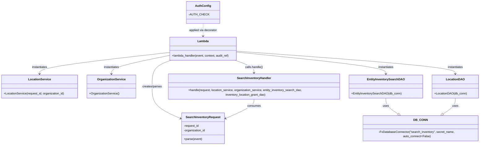

# Diagram: entity_core/entity_service/entity_inventory/entity_inventory_service/lambdas/search_inventory.py


> Auto-generated by Obscura crawlers

## Diagram 1



### SVG

<svg id="container" width="2617.451171875" xmlns="http://www.w3.org/2000/svg" class="classDiagram" height="778" viewBox="0 0 2617.451171875 778" role="graphics-document document" aria-roledescription="class"><style>#container{font-family:"trebuchet ms",verdana,arial,sans-serif;font-size:16px;fill:#333;}@keyframes edge-animation-frame{from{stroke-dashoffset:0;}}@keyframes dash{to{stroke-dashoffset:0;}}#container .edge-animation-slow{stroke-dasharray:9,5!important;stroke-dashoffset:900;animation:dash 50s linear infinite;stroke-linecap:round;}#container .edge-animation-fast{stroke-dasharray:9,5!important;stroke-dashoffset:900;animation:dash 20s linear infinite;stroke-linecap:round;}#container .error-icon{fill:#552222;}#container .error-text{fill:#552222;stroke:#552222;}#container .edge-thickness-normal{stroke-width:1px;}#container .edge-thickness-thick{stroke-width:3.5px;}#container .edge-pattern-solid{stroke-dasharray:0;}#container .edge-thickness-invisible{stroke-width:0;fill:none;}#container .edge-pattern-dashed{stroke-dasharray:3;}#container .edge-pattern-dotted{stroke-dasharray:2;}#container .marker{fill:#333333;stroke:#333333;}#container .marker.cross{stroke:#333333;}#container svg{font-family:"trebuchet ms",verdana,arial,sans-serif;font-size:16px;}#container p{margin:0;}#container g.classGroup text{fill:#9370DB;stroke:none;font-family:"trebuchet ms",verdana,arial,sans-serif;font-size:10px;}#container g.classGroup text .title{font-weight:bolder;}#container .nodeLabel,#container .edgeLabel{color:#131300;}#container .edgeLabel .label rect{fill:#ECECFF;}#container .label text{fill:#131300;}#container .labelBkg{background:#ECECFF;}#container .edgeLabel .label span{background:#ECECFF;}#container .classTitle{font-weight:bolder;}#container .node rect,#container .node circle,#container .node ellipse,#container .node polygon,#container .node path{fill:#ECECFF;stroke:#9370DB;stroke-width:1px;}#container .divider{stroke:#9370DB;stroke-width:1;}#container g.clickable{cursor:pointer;}#container g.classGroup rect{fill:#ECECFF;stroke:#9370DB;}#container g.classGroup line{stroke:#9370DB;stroke-width:1;}#container .classLabel .box{stroke:none;stroke-width:0;fill:#ECECFF;opacity:0.5;}#container .classLabel .label{fill:#9370DB;font-size:10px;}#container .relation{stroke:#333333;stroke-width:1;fill:none;}#container .dashed-line{stroke-dasharray:3;}#container .dotted-line{stroke-dasharray:1 2;}#container #compositionStart,#container .composition{fill:#333333!important;stroke:#333333!important;stroke-width:1;}#container #compositionEnd,#container .composition{fill:#333333!important;stroke:#333333!important;stroke-width:1;}#container #dependencyStart,#container .dependency{fill:#333333!important;stroke:#333333!important;stroke-width:1;}#container #dependencyStart,#container .dependency{fill:#333333!important;stroke:#333333!important;stroke-width:1;}#container #extensionStart,#container .extension{fill:transparent!important;stroke:#333333!important;stroke-width:1;}#container #extensionEnd,#container .extension{fill:transparent!important;stroke:#333333!important;stroke-width:1;}#container #aggregationStart,#container .aggregation{fill:transparent!important;stroke:#333333!important;stroke-width:1;}#container #aggregationEnd,#container .aggregation{fill:transparent!important;stroke:#333333!important;stroke-width:1;}#container #lollipopStart,#container .lollipop{fill:#ECECFF!important;stroke:#333333!important;stroke-width:1;}#container #lollipopEnd,#container .lollipop{fill:#ECECFF!important;stroke:#333333!important;stroke-width:1;}#container .edgeTerminals{font-size:11px;line-height:initial;}#container .classTitleText{text-anchor:middle;font-size:18px;fill:#333;}#container .label-icon{display:inline-block;height:1em;overflow:visible;vertical-align:-0.125em;}#container .node .label-icon path{fill:currentColor;stroke:revert;stroke-width:revert;}#container :root{--mermaid-font-family:"trebuchet ms",verdana,arial,sans-serif;}</style><g><defs><marker id="container_class-aggregationStart" class="marker aggregation class" refX="18" refY="7" markerWidth="190" markerHeight="240" orient="auto"><path d="M 18,7 L9,13 L1,7 L9,1 Z"></path></marker></defs><defs><marker id="container_class-aggregationEnd" class="marker aggregation class" refX="1" refY="7" markerWidth="20" markerHeight="28" orient="auto"><path d="M 18,7 L9,13 L1,7 L9,1 Z"></path></marker></defs><defs><marker id="container_class-extensionStart" class="marker extension class" refX="18" refY="7" markerWidth="190" markerHeight="240" orient="auto"><path d="M 1,7 L18,13 V 1 Z"></path></marker></defs><defs><marker id="container_class-extensionEnd" class="marker extension class" refX="1" refY="7" markerWidth="20" markerHeight="28" orient="auto"><path d="M 1,1 V 13 L18,7 Z"></path></marker></defs><defs><marker id="container_class-compositionStart" class="marker composition class" refX="18" refY="7" markerWidth="190" markerHeight="240" orient="auto"><path d="M 18,7 L9,13 L1,7 L9,1 Z"></path></marker></defs><defs><marker id="container_class-compositionEnd" class="marker composition class" refX="1" refY="7" markerWidth="20" markerHeight="28" orient="auto"><path d="M 18,7 L9,13 L1,7 L9,1 Z"></path></marker></defs><defs><marker id="container_class-dependencyStart" class="marker dependency class" refX="6" refY="7" markerWidth="190" markerHeight="240" orient="auto"><path d="M 5,7 L9,13 L1,7 L9,1 Z"></path></marker></defs><defs><marker id="container_class-dependencyEnd" class="marker dependency class" refX="13" refY="7" markerWidth="20" markerHeight="28" orient="auto"><path d="M 18,7 L9,13 L14,7 L9,1 Z"></path></marker></defs><defs><marker id="container_class-lollipopStart" class="marker lollipop class" refX="13" refY="7" markerWidth="190" markerHeight="240" orient="auto"><circle stroke="black" fill="transparent" cx="7" cy="7" r="6"></circle></marker></defs><defs><marker id="container_class-lollipopEnd" class="marker lollipop class" refX="1" refY="7" markerWidth="190" markerHeight="240" orient="auto"><circle stroke="black" fill="transparent" cx="7" cy="7" r="6"></circle></marker></defs><g class="root"><g class="clusters"></g><g class="edgePaths"><path d="M925.277,328L907.689,334.167C890.102,340.333,854.926,352.667,837.338,375.5C819.75,398.333,819.75,431.667,819.75,465C819.75,498.333,819.75,531.667,846.961,559.877C874.171,588.088,928.592,611.176,955.803,622.721L983.014,634.265" id="id_Lambda_SearchInventoryRequest_1" class="edge-thickness-normal edge-pattern-solid relation" style=";;;" data-edge="true" data-et="edge" data-id="id_Lambda_SearchInventoryRequest_1" data-points="W3sieCI6OTI1LjI3NzMyNDIxODc1LCJ5IjozMjh9LHsieCI6ODE5Ljc1LCJ5IjozNjV9LHsieCI6ODE5Ljc1LCJ5Ijo0NjV9LHsieCI6ODE5Ljc1LCJ5Ijo1NjV9LHsieCI6OTg4LjUzNzEwOTM3NSwieSI6NjM2LjYwNzk4MzQ1NTExNDR9XQ==" marker-end="url(#container_class-dependencyEnd)"></path><path d="M920.604,285.704L802.92,298.92C685.237,312.136,449.87,338.568,332.187,356.951C214.504,375.333,214.504,385.667,214.504,390.833L214.504,396" id="id_Lambda_LocationService_2" class="edge-thickness-normal edge-pattern-solid relation" style=";;;" data-edge="true" data-et="edge" data-id="id_Lambda_LocationService_2" data-points="W3sieCI6OTIwLjYwMzUxNTYyNSwieSI6Mjg1LjcwMzUxMTQxNTU1NTE3fSx7IngiOjIxNC41MDM5MDYyNSwieSI6MzY1fSx7IngiOjIxNC41MDM5MDYyNSwieSI6NDAyfV0=" marker-end="url(#container_class-dependencyEnd)"></path><path d="M920.604,301.576L867.323,312.146C814.043,322.717,707.482,343.859,654.202,359.596C600.922,375.333,600.922,385.667,600.922,390.833L600.922,396" id="id_Lambda_OrganizationService_3" class="edge-thickness-normal edge-pattern-solid relation" style=";;;" data-edge="true" data-et="edge" data-id="id_Lambda_OrganizationService_3" data-points="W3sieCI6OTIwLjYwMzUxNTYyNSwieSI6MzAxLjU3NTc3Mjk1ODE4NTI3fSx7IngiOjYwMC45MjE4NzUsInkiOjM2NX0seyJ4Ijo2MDAuOTIxODc1LCJ5Ijo0MDJ9XQ==" marker-end="url(#container_class-dependencyEnd)"></path><path d="M1289.314,283.221L1427.22,296.851C1565.125,310.481,1840.936,337.74,1978.841,356.537C2116.746,375.333,2116.746,385.667,2116.746,390.833L2116.746,396" id="id_Lambda_EntityInventorySearchDAO_4" class="edge-thickness-normal edge-pattern-solid relation" style=";;;" data-edge="true" data-et="edge" data-id="id_Lambda_EntityInventorySearchDAO_4" data-points="W3sieCI6MTI4OS4zMTQ0NTMxMjUsInkiOjI4My4yMjA3NzY1ODg0NTQ0NH0seyJ4IjoyMTE2Ljc0NjA5Mzc1LCJ5IjozNjV9LHsieCI6MjExNi43NDYwOTM3NSwieSI6NDAyfV0=" marker-end="url(#container_class-dependencyEnd)"></path><path d="M1289.314,278.372L1488.358,292.81C1687.402,307.248,2085.49,336.124,2284.534,355.729C2483.578,375.333,2483.578,385.667,2483.578,390.833L2483.578,396" id="id_Lambda_LocationDAO_5" class="edge-thickness-normal edge-pattern-solid relation" style=";;;" data-edge="true" data-et="edge" data-id="id_Lambda_LocationDAO_5" data-points="W3sieCI6MTI4OS4zMTQ0NTMxMjUsInkiOjI3OC4zNzI0NzI3Mzg2NTgxfSx7IngiOjI0ODMuNTc4MTI1LCJ5IjozNjV9LHsieCI6MjQ4My41NzgxMjUsInkiOjQwMn1d" marker-end="url(#container_class-dependencyEnd)"></path><path d="M1284.641,328L1302.229,334.167C1319.816,340.333,1354.992,352.667,1372.58,364C1390.168,375.333,1390.168,385.667,1390.168,390.833L1390.168,396" id="id_Lambda_SearchInventoryHandler_6" class="edge-thickness-normal edge-pattern-solid relation" style=";;;" data-edge="true" data-et="edge" data-id="id_Lambda_SearchInventoryHandler_6" data-points="W3sieCI6MTI4NC42NDA2NDQ1MzEyNSwieSI6MzI4fSx7IngiOjEzOTAuMTY3OTY4NzUsInkiOjM2NX0seyJ4IjoxMzkwLjE2Nzk2ODc1LCJ5Ijo0MDJ9XQ==" marker-end="url(#container_class-dependencyEnd)"></path><path d="M1390.168,528L1390.168,534.167C1390.168,540.333,1390.168,552.667,1362.957,570.377C1335.747,588.088,1281.326,611.176,1254.115,622.721L1226.904,634.265" id="id_SearchInventoryHandler_SearchInventoryRequest_7" class="edge-thickness-normal edge-pattern-solid relation" style=";;;" data-edge="true" data-et="edge" data-id="id_SearchInventoryHandler_SearchInventoryRequest_7" data-points="W3sieCI6MTM5MC4xNjc5Njg3NSwieSI6NTI4fSx7IngiOjEzOTAuMTY3OTY4NzUsInkiOjU2NX0seyJ4IjoxMjIxLjM4MDg1OTM3NSwieSI6NjM2LjYwNzk4MzQ1NTExNDR9XQ==" marker-end="url(#container_class-dependencyEnd)"></path><path d="M2116.746,528L2116.746,534.167C2116.746,540.333,2116.746,552.667,2128.999,566.917C2141.253,581.167,2165.759,597.334,2178.012,605.417L2190.266,613.501" id="id_EntityInventorySearchDAO_DB_CONN_8" class="edge-thickness-normal edge-pattern-solid relation" style=";;;" data-edge="true" data-et="edge" data-id="id_EntityInventorySearchDAO_DB_CONN_8" data-points="W3sieCI6MjExNi43NDYwOTM3NSwieSI6NTI4fSx7IngiOjIxMTYuNzQ2MDkzNzUsInkiOjU2NX0seyJ4IjoyMjA0LjY2NDUxNDQ2MjgxLCJ5Ijo2MjN9XQ==" marker-end="url(#container_class-extensionEnd)"></path><path d="M2483.578,528L2483.578,534.167C2483.578,540.333,2483.578,552.667,2471.325,566.917C2459.072,581.167,2434.565,597.334,2422.312,605.417L2410.059,613.501" id="id_LocationDAO_DB_CONN_9" class="edge-thickness-normal edge-pattern-solid relation" style=";;;" data-edge="true" data-et="edge" data-id="id_LocationDAO_DB_CONN_9" data-points="W3sieCI6MjQ4My41NzgxMjUsInkiOjUyOH0seyJ4IjoyNDgzLjU3ODEyNSwieSI6NTY1fSx7IngiOjIzOTUuNjU5NzA0Mjg3MTksInkiOjYyM31d" marker-end="url(#container_class-extensionEnd)"></path><path d="M1104.959,128L1104.959,134.167C1104.959,140.333,1104.959,152.667,1104.959,164C1104.959,175.333,1104.959,185.667,1104.959,190.833L1104.959,196" id="id_AuthConfig_Lambda_10" class="edge-thickness-normal edge-pattern-dashed relation" style=";;;" data-edge="true" data-et="edge" data-id="id_AuthConfig_Lambda_10" data-points="W3sieCI6MTEwNC45NTg5ODQzNzUsInkiOjEyOH0seyJ4IjoxMTA0Ljk1ODk4NDM3NSwieSI6MTY1fSx7IngiOjExMDQuOTU4OTg0Mzc1LCJ5IjoyMDJ9XQ==" marker-end="url(#container_class-dependencyEnd)"></path></g><g class="edgeLabels"><g class="edgeLabel" transform="translate(819.75, 465)"><g class="label" data-id="id_Lambda_SearchInventoryRequest_1" transform="translate(-53.9140625, -12)"><foreignObject width="107.828125" height="24"><div xmlns="http://www.w3.org/1999/xhtml" class="labelBkg" style="display: table-cell; white-space: nowrap; line-height: 1.5; max-width: 200px; text-align: center;"><span class="edgeLabel"><p>creates/parses</p></span></div></foreignObject></g></g><g class="edgeLabel" transform="translate(214.50390625, 365)"><g class="label" data-id="id_Lambda_LocationService_2" transform="translate(-42.9140625, -12)"><foreignObject width="85.828125" height="24"><div xmlns="http://www.w3.org/1999/xhtml" class="labelBkg" style="display: table-cell; white-space: nowrap; line-height: 1.5; max-width: 200px; text-align: center;"><span class="edgeLabel"><p>instantiates</p></span></div></foreignObject></g></g><g class="edgeLabel" transform="translate(600.921875, 365)"><g class="label" data-id="id_Lambda_OrganizationService_3" transform="translate(-42.9140625, -12)"><foreignObject width="85.828125" height="24"><div xmlns="http://www.w3.org/1999/xhtml" class="labelBkg" style="display: table-cell; white-space: nowrap; line-height: 1.5; max-width: 200px; text-align: center;"><span class="edgeLabel"><p>instantiates</p></span></div></foreignObject></g></g><g class="edgeLabel" transform="translate(2116.74609375, 365)"><g class="label" data-id="id_Lambda_EntityInventorySearchDAO_4" transform="translate(-42.9140625, -12)"><foreignObject width="85.828125" height="24"><div xmlns="http://www.w3.org/1999/xhtml" class="labelBkg" style="display: table-cell; white-space: nowrap; line-height: 1.5; max-width: 200px; text-align: center;"><span class="edgeLabel"><p>instantiates</p></span></div></foreignObject></g></g><g class="edgeLabel" transform="translate(2483.578125, 365)"><g class="label" data-id="id_Lambda_LocationDAO_5" transform="translate(-42.9140625, -12)"><foreignObject width="85.828125" height="24"><div xmlns="http://www.w3.org/1999/xhtml" class="labelBkg" style="display: table-cell; white-space: nowrap; line-height: 1.5; max-width: 200px; text-align: center;"><span class="edgeLabel"><p>instantiates</p></span></div></foreignObject></g></g><g class="edgeLabel" transform="translate(1390.16796875, 365)"><g class="label" data-id="id_Lambda_SearchInventoryHandler_6" transform="translate(-48.7265625, -12)"><foreignObject width="97.453125" height="24"><div xmlns="http://www.w3.org/1999/xhtml" class="labelBkg" style="display: table-cell; white-space: nowrap; line-height: 1.5; max-width: 200px; text-align: center;"><span class="edgeLabel"><p>calls.handle()</p></span></div></foreignObject></g></g><g class="edgeLabel" transform="translate(1390.16796875, 565)"><g class="label" data-id="id_SearchInventoryHandler_SearchInventoryRequest_7" transform="translate(-36.375, -12)"><foreignObject width="72.75" height="24"><div xmlns="http://www.w3.org/1999/xhtml" class="labelBkg" style="display: table-cell; white-space: nowrap; line-height: 1.5; max-width: 200px; text-align: center;"><span class="edgeLabel"><p>consumes</p></span></div></foreignObject></g></g><g class="edgeLabel" transform="translate(2116.74609375, 565)"><g class="label" data-id="id_EntityInventorySearchDAO_DB_CONN_8" transform="translate(-16.4921875, -12)"><foreignObject width="32.984375" height="24"><div xmlns="http://www.w3.org/1999/xhtml" class="labelBkg" style="display: table-cell; white-space: nowrap; line-height: 1.5; max-width: 200px; text-align: center;"><span class="edgeLabel"><p>uses</p></span></div></foreignObject></g></g><g class="edgeLabel" transform="translate(2483.578125, 565)"><g class="label" data-id="id_LocationDAO_DB_CONN_9" transform="translate(-16.4921875, -12)"><foreignObject width="32.984375" height="24"><div xmlns="http://www.w3.org/1999/xhtml" class="labelBkg" style="display: table-cell; white-space: nowrap; line-height: 1.5; max-width: 200px; text-align: center;"><span class="edgeLabel"><p>uses</p></span></div></foreignObject></g></g><g class="edgeLabel" transform="translate(1104.958984375, 165)"><g class="label" data-id="id_AuthConfig_Lambda_10" transform="translate(-77.5546875, -12)"><foreignObject width="155.109375" height="24"><div xmlns="http://www.w3.org/1999/xhtml" class="labelBkg" style="display: table-cell; white-space: nowrap; line-height: 1.5; max-width: 200px; text-align: center;"><span class="edgeLabel"><p>applied via decorator</p></span></div></foreignObject></g></g></g><g class="nodes"><g class="node default" id="classId-Lambda-0" transform="translate(1104.958984375, 265)"><g class="basic label-container"><path d="M-184.35546875 -63 L184.35546875 -63 L184.35546875 63 L-184.35546875 63" stroke="none" stroke-width="0" fill="#ECECFF" style=""></path><path d="M-184.35546875 -63 C-74.19518328251029 -63, 35.96510218497943 -63, 184.35546875 -63 M-184.35546875 -63 C-71.91004545164446 -63, 40.53537784671107 -63, 184.35546875 -63 M184.35546875 -63 C184.35546875 -34.54641189043814, 184.35546875 -6.092823780876273, 184.35546875 63 M184.35546875 -63 C184.35546875 -37.778020387496774, 184.35546875 -12.556040774993548, 184.35546875 63 M184.35546875 63 C95.5119607669926 63, 6.668452783985202 63, -184.35546875 63 M184.35546875 63 C89.21327397304823 63, -5.928920803903537 63, -184.35546875 63 M-184.35546875 63 C-184.35546875 27.724207143992267, -184.35546875 -7.551585712015466, -184.35546875 -63 M-184.35546875 63 C-184.35546875 34.89852369315851, -184.35546875 6.797047386317018, -184.35546875 -63" stroke="#9370DB" stroke-width="1.3" fill="none" stroke-dasharray="0 0" style=""></path></g><g class="annotation-group text" transform="translate(0, -39)"></g><g class="label-group text" transform="translate(-29.1328125, -39)"><g class="label" style="font-weight: bolder" transform="translate(0,-12)"><foreignObject width="58.265625" height="24"><div xmlns="http://www.w3.org/1999/xhtml" style="display: table-cell; white-space: nowrap; line-height: 1.5; max-width: 108px; text-align: center;"><span class="nodeLabel markdown-node-label" style=""><p>Lambda</p></span></div></foreignObject></g></g><g class="members-group text" transform="translate(-172.35546875, 9)"></g><g class="methods-group text" transform="translate(-172.35546875, 39)"><g class="label" style="" transform="translate(0,-12)"><foreignObject width="315.578125" height="24"><div xmlns="http://www.w3.org/1999/xhtml" style="display: table-cell; white-space: nowrap; line-height: 1.5; max-width: 373px; text-align: center;"><span class="nodeLabel markdown-node-label" style=""><p>+lambda_handler(event, context, audit_ref)</p></span></div></foreignObject></g></g><g class="divider" style=""><path d="M-184.35546875 -15 C-80.09627562872625 -15, 24.162917492547507 -15, 184.35546875 -15 M-184.35546875 -15 C-52.184278591851665 -15, 79.98691156629667 -15, 184.35546875 -15" stroke="#9370DB" stroke-width="1.3" fill="none" stroke-dasharray="0 0" style=""></path></g><g class="divider" style=""><path d="M-184.35546875 9 C-76.13734707841425 9, 32.0807745931715 9, 184.35546875 9 M-184.35546875 9 C-73.36211201299068 9, 37.63124472401864 9, 184.35546875 9" stroke="#9370DB" stroke-width="1.3" fill="none" stroke-dasharray="0 0" style=""></path></g></g><g class="node default" id="classId-SearchInventoryRequest-1" transform="translate(1104.958984375, 686)"><g class="basic label-container"><path d="M-116.421875 -84 L116.421875 -84 L116.421875 84 L-116.421875 84" stroke="none" stroke-width="0" fill="#ECECFF" style=""></path><path d="M-116.421875 -84 C-68.27656708708963 -84, -20.13125917417925 -84, 116.421875 -84 M-116.421875 -84 C-29.883099469226536 -84, 56.65567606154693 -84, 116.421875 -84 M116.421875 -84 C116.421875 -44.55860533896798, 116.421875 -5.117210677935958, 116.421875 84 M116.421875 -84 C116.421875 -41.1120908988585, 116.421875 1.7758182022830056, 116.421875 84 M116.421875 84 C37.102769703953484 84, -42.21633559209303 84, -116.421875 84 M116.421875 84 C65.68937985709154 84, 14.956884714183076 84, -116.421875 84 M-116.421875 84 C-116.421875 34.01836840495444, -116.421875 -15.963263190091126, -116.421875 -84 M-116.421875 84 C-116.421875 45.15012199702779, -116.421875 6.3002439940555774, -116.421875 -84" stroke="#9370DB" stroke-width="1.3" fill="none" stroke-dasharray="0 0" style=""></path></g><g class="annotation-group text" transform="translate(0, -60)"></g><g class="label-group text" transform="translate(-89.640625, -60)"><g class="label" style="font-weight: bolder" transform="translate(0,-12)"><foreignObject width="179.28125" height="24"><div xmlns="http://www.w3.org/1999/xhtml" style="display: table-cell; white-space: nowrap; line-height: 1.5; max-width: 227px; text-align: center;"><span class="nodeLabel markdown-node-label" style=""><p>SearchInventoryRequest</p></span></div></foreignObject></g></g><g class="members-group text" transform="translate(-104.421875, -12)"><g class="label" style="" transform="translate(0,-12)"><foreignObject width="84.125" height="24"><div xmlns="http://www.w3.org/1999/xhtml" style="display: table-cell; white-space: nowrap; line-height: 1.5; max-width: 141px; text-align: center;"><span class="nodeLabel markdown-node-label" style=""><p>-request_id</p></span></div></foreignObject></g><g class="label" style="" transform="translate(0,12)"><foreignObject width="119.203125" height="24"><div xmlns="http://www.w3.org/1999/xhtml" style="display: table-cell; white-space: nowrap; line-height: 1.5; max-width: 177px; text-align: center;"><span class="nodeLabel markdown-node-label" style=""><p>-organization_id</p></span></div></foreignObject></g></g><g class="methods-group text" transform="translate(-104.421875, 60)"><g class="label" style="" transform="translate(0,-12)"><foreignObject width="98.875" height="24"><div xmlns="http://www.w3.org/1999/xhtml" style="display: table-cell; white-space: nowrap; line-height: 1.5; max-width: 156px; text-align: center;"><span class="nodeLabel markdown-node-label" style=""><p>+parse(event)</p></span></div></foreignObject></g></g><g class="divider" style=""><path d="M-116.421875 -36 C-57.00392057952612 -36, 2.4140338409477664 -36, 116.421875 -36 M-116.421875 -36 C-25.528400258957134 -36, 65.36507448208573 -36, 116.421875 -36" stroke="#9370DB" stroke-width="1.3" fill="none" stroke-dasharray="0 0" style=""></path></g><g class="divider" style=""><path d="M-116.421875 36 C-69.84559625192725 36, -23.269317503854495 36, 116.421875 36 M-116.421875 36 C-69.03863904335361 36, -21.65540308670721 36, 116.421875 36" stroke="#9370DB" stroke-width="1.3" fill="none" stroke-dasharray="0 0" style=""></path></g></g><g class="node default" id="classId-LocationService-2" transform="translate(214.50390625, 465)"><g class="basic label-container"><path d="M-206.50390625 -63 L206.50390625 -63 L206.50390625 63 L-206.50390625 63" stroke="none" stroke-width="0" fill="#ECECFF" style=""></path><path d="M-206.50390625 -63 C-51.67497270510461 -63, 103.15396083979078 -63, 206.50390625 -63 M-206.50390625 -63 C-69.99422939617 -63, 66.51544745766 -63, 206.50390625 -63 M206.50390625 -63 C206.50390625 -23.213425084344408, 206.50390625 16.573149831311184, 206.50390625 63 M206.50390625 -63 C206.50390625 -14.591963216378986, 206.50390625 33.81607356724203, 206.50390625 63 M206.50390625 63 C95.69842037813245 63, -15.107065493735092 63, -206.50390625 63 M206.50390625 63 C72.15046304176235 63, -62.2029801664753 63, -206.50390625 63 M-206.50390625 63 C-206.50390625 30.249876982512625, -206.50390625 -2.500246034974751, -206.50390625 -63 M-206.50390625 63 C-206.50390625 17.40830608711846, -206.50390625 -28.183387825763077, -206.50390625 -63" stroke="#9370DB" stroke-width="1.3" fill="none" stroke-dasharray="0 0" style=""></path></g><g class="annotation-group text" transform="translate(0, -39)"></g><g class="label-group text" transform="translate(-57.9921875, -39)"><g class="label" style="font-weight: bolder" transform="translate(0,-12)"><foreignObject width="115.984375" height="24"><div xmlns="http://www.w3.org/1999/xhtml" style="display: table-cell; white-space: nowrap; line-height: 1.5; max-width: 164px; text-align: center;"><span class="nodeLabel markdown-node-label" style=""><p>LocationService</p></span></div></foreignObject></g></g><g class="members-group text" transform="translate(-194.50390625, 9)"></g><g class="methods-group text" transform="translate(-194.50390625, 39)"><g class="label" style="" transform="translate(0,-12)"><foreignObject width="331.015625" height="24"><div xmlns="http://www.w3.org/1999/xhtml" style="display: table-cell; white-space: nowrap; line-height: 1.5; max-width: 388px; text-align: center;"><span class="nodeLabel markdown-node-label" style=""><p>+LocationService(request_id, organization_id)</p></span></div></foreignObject></g></g><g class="divider" style=""><path d="M-206.50390625 -15 C-114.28607104668124 -15, -22.068235843362487 -15, 206.50390625 -15 M-206.50390625 -15 C-106.79801488821705 -15, -7.092123526434108 -15, 206.50390625 -15" stroke="#9370DB" stroke-width="1.3" fill="none" stroke-dasharray="0 0" style=""></path></g><g class="divider" style=""><path d="M-206.50390625 9 C-41.375820135211825 9, 123.75226597957635 9, 206.50390625 9 M-206.50390625 9 C-41.95736904414247 9, 122.58916816171507 9, 206.50390625 9" stroke="#9370DB" stroke-width="1.3" fill="none" stroke-dasharray="0 0" style=""></path></g></g><g class="node default" id="classId-OrganizationService-3" transform="translate(600.921875, 465)"><g class="basic label-container"><path d="M-129.9140625 -63 L129.9140625 -63 L129.9140625 63 L-129.9140625 63" stroke="none" stroke-width="0" fill="#ECECFF" style=""></path><path d="M-129.9140625 -63 C-26.130345963226944 -63, 77.65337057354611 -63, 129.9140625 -63 M-129.9140625 -63 C-54.754404577673824 -63, 20.40525334465235 -63, 129.9140625 -63 M129.9140625 -63 C129.9140625 -19.84507147042998, 129.9140625 23.309857059140043, 129.9140625 63 M129.9140625 -63 C129.9140625 -26.284869142513507, 129.9140625 10.430261714972985, 129.9140625 63 M129.9140625 63 C53.19340868196092 63, -23.527245136078164 63, -129.9140625 63 M129.9140625 63 C61.94758453402348 63, -6.018893431953046 63, -129.9140625 63 M-129.9140625 63 C-129.9140625 23.79781962058958, -129.9140625 -15.404360758820843, -129.9140625 -63 M-129.9140625 63 C-129.9140625 25.483752899746193, -129.9140625 -12.032494200507614, -129.9140625 -63" stroke="#9370DB" stroke-width="1.3" fill="none" stroke-dasharray="0 0" style=""></path></g><g class="annotation-group text" transform="translate(0, -39)"></g><g class="label-group text" transform="translate(-73.34375, -39)"><g class="label" style="font-weight: bolder" transform="translate(0,-12)"><foreignObject width="146.6875" height="24"><div xmlns="http://www.w3.org/1999/xhtml" style="display: table-cell; white-space: nowrap; line-height: 1.5; max-width: 194px; text-align: center;"><span class="nodeLabel markdown-node-label" style=""><p>OrganizationService</p></span></div></foreignObject></g></g><g class="members-group text" transform="translate(-117.9140625, 9)"></g><g class="methods-group text" transform="translate(-117.9140625, 39)"><g class="label" style="" transform="translate(0,-12)"><foreignObject width="162.484375" height="24"><div xmlns="http://www.w3.org/1999/xhtml" style="display: table-cell; white-space: nowrap; line-height: 1.5; max-width: 220px; text-align: center;"><span class="nodeLabel markdown-node-label" style=""><p>+OrganizationService()</p></span></div></foreignObject></g></g><g class="divider" style=""><path d="M-129.9140625 -15 C-75.60441763491522 -15, -21.29477276983046 -15, 129.9140625 -15 M-129.9140625 -15 C-52.367842653915616 -15, 25.178377192168767 -15, 129.9140625 -15" stroke="#9370DB" stroke-width="1.3" fill="none" stroke-dasharray="0 0" style=""></path></g><g class="divider" style=""><path d="M-129.9140625 9 C-41.35261481992994 9, 47.20883286014012 9, 129.9140625 9 M-129.9140625 9 C-35.10889362484937 9, 59.696275250301255 9, 129.9140625 9" stroke="#9370DB" stroke-width="1.3" fill="none" stroke-dasharray="0 0" style=""></path></g></g><g class="node default" id="classId-EntityInventorySearchDAO-4" transform="translate(2116.74609375, 465)"><g class="basic label-container"><path d="M-195.07421875 -63 L195.07421875 -63 L195.07421875 63 L-195.07421875 63" stroke="none" stroke-width="0" fill="#ECECFF" style=""></path><path d="M-195.07421875 -63 C-45.61673156059561 -63, 103.84075562880878 -63, 195.07421875 -63 M-195.07421875 -63 C-62.970472057950445 -63, 69.13327463409911 -63, 195.07421875 -63 M195.07421875 -63 C195.07421875 -15.029478787274087, 195.07421875 32.941042425451826, 195.07421875 63 M195.07421875 -63 C195.07421875 -22.651612076474954, 195.07421875 17.69677584705009, 195.07421875 63 M195.07421875 63 C109.73173394562261 63, 24.389249141245216 63, -195.07421875 63 M195.07421875 63 C72.02890784086102 63, -51.01640306827795 63, -195.07421875 63 M-195.07421875 63 C-195.07421875 37.209905796586575, -195.07421875 11.41981159317315, -195.07421875 -63 M-195.07421875 63 C-195.07421875 15.034460293218572, -195.07421875 -32.931079413562856, -195.07421875 -63" stroke="#9370DB" stroke-width="1.3" fill="none" stroke-dasharray="0 0" style=""></path></g><g class="annotation-group text" transform="translate(0, -39)"></g><g class="label-group text" transform="translate(-96.2421875, -39)"><g class="label" style="font-weight: bolder" transform="translate(0,-12)"><foreignObject width="192.484375" height="24"><div xmlns="http://www.w3.org/1999/xhtml" style="display: table-cell; white-space: nowrap; line-height: 1.5; max-width: 239px; text-align: center;"><span class="nodeLabel markdown-node-label" style=""><p>EntityInventorySearchDAO</p></span></div></foreignObject></g></g><g class="members-group text" transform="translate(-183.07421875, 9)"></g><g class="methods-group text" transform="translate(-183.07421875, 39)"><g class="label" style="" transform="translate(0,-12)"><foreignObject width="269.90625" height="24"><div xmlns="http://www.w3.org/1999/xhtml" style="display: table-cell; white-space: nowrap; line-height: 1.5; max-width: 327px; text-align: center;"><span class="nodeLabel markdown-node-label" style=""><p>+EntityInventorySearchDAO(db_conn)</p></span></div></foreignObject></g></g><g class="divider" style=""><path d="M-195.07421875 -15 C-75.64223187026735 -15, 43.789755009465296 -15, 195.07421875 -15 M-195.07421875 -15 C-40.475966380778004 -15, 114.12228598844399 -15, 195.07421875 -15" stroke="#9370DB" stroke-width="1.3" fill="none" stroke-dasharray="0 0" style=""></path></g><g class="divider" style=""><path d="M-195.07421875 9 C-83.02648611384907 9, 29.02124652230185 9, 195.07421875 9 M-195.07421875 9 C-56.1352140182847 9, 82.8037907134306 9, 195.07421875 9" stroke="#9370DB" stroke-width="1.3" fill="none" stroke-dasharray="0 0" style=""></path></g></g><g class="node default" id="classId-LocationDAO-5" transform="translate(2483.578125, 465)"><g class="basic label-container"><path d="M-121.7578125 -63 L121.7578125 -63 L121.7578125 63 L-121.7578125 63" stroke="none" stroke-width="0" fill="#ECECFF" style=""></path><path d="M-121.7578125 -63 C-60.140716534474365 -63, 1.4763794310512708 -63, 121.7578125 -63 M-121.7578125 -63 C-63.360292113714365 -63, -4.962771727428731 -63, 121.7578125 -63 M121.7578125 -63 C121.7578125 -12.999100144468649, 121.7578125 37.0017997110627, 121.7578125 63 M121.7578125 -63 C121.7578125 -34.66008371635162, 121.7578125 -6.320167432703236, 121.7578125 63 M121.7578125 63 C64.0322742952072 63, 6.306736090414404 63, -121.7578125 63 M121.7578125 63 C42.38240351555953 63, -36.99300546888094 63, -121.7578125 63 M-121.7578125 63 C-121.7578125 19.387599861909642, -121.7578125 -24.224800276180716, -121.7578125 -63 M-121.7578125 63 C-121.7578125 16.67687613860548, -121.7578125 -29.64624772278904, -121.7578125 -63" stroke="#9370DB" stroke-width="1.3" fill="none" stroke-dasharray="0 0" style=""></path></g><g class="annotation-group text" transform="translate(0, -39)"></g><g class="label-group text" transform="translate(-46.640625, -39)"><g class="label" style="font-weight: bolder" transform="translate(0,-12)"><foreignObject width="93.28125" height="24"><div xmlns="http://www.w3.org/1999/xhtml" style="display: table-cell; white-space: nowrap; line-height: 1.5; max-width: 142px; text-align: center;"><span class="nodeLabel markdown-node-label" style=""><p>LocationDAO</p></span></div></foreignObject></g></g><g class="members-group text" transform="translate(-109.7578125, 9)"></g><g class="methods-group text" transform="translate(-109.7578125, 39)"><g class="label" style="" transform="translate(0,-12)"><foreignObject width="172.875" height="24"><div xmlns="http://www.w3.org/1999/xhtml" style="display: table-cell; white-space: nowrap; line-height: 1.5; max-width: 230px; text-align: center;"><span class="nodeLabel markdown-node-label" style=""><p>+LocationDAO(db_conn)</p></span></div></foreignObject></g></g><g class="divider" style=""><path d="M-121.7578125 -15 C-30.327490916262548 -15, 61.102830667474905 -15, 121.7578125 -15 M-121.7578125 -15 C-36.23170230816183 -15, 49.29440788367634 -15, 121.7578125 -15" stroke="#9370DB" stroke-width="1.3" fill="none" stroke-dasharray="0 0" style=""></path></g><g class="divider" style=""><path d="M-121.7578125 9 C-35.52251019312219 9, 50.712792113755626 9, 121.7578125 9 M-121.7578125 9 C-67.5020843028779 9, -13.246356105755794 9, 121.7578125 9" stroke="#9370DB" stroke-width="1.3" fill="none" stroke-dasharray="0 0" style=""></path></g></g><g class="node default" id="classId-SearchInventoryHandler-6" transform="translate(1390.16796875, 465)"><g class="basic label-container"><path d="M-481.50390625 -63 L481.50390625 -63 L481.50390625 63 L-481.50390625 63" stroke="none" stroke-width="0" fill="#ECECFF" style=""></path><path d="M-481.50390625 -63 C-223.87675988006328 -63, 33.75038648987345 -63, 481.50390625 -63 M-481.50390625 -63 C-167.53553186504024 -63, 146.43284251991952 -63, 481.50390625 -63 M481.50390625 -63 C481.50390625 -33.76154399356616, 481.50390625 -4.523087987132314, 481.50390625 63 M481.50390625 -63 C481.50390625 -24.810273902528074, 481.50390625 13.379452194943852, 481.50390625 63 M481.50390625 63 C192.9641401362777 63, -95.57562597744459 63, -481.50390625 63 M481.50390625 63 C263.2007184726434 63, 44.89753069528683 63, -481.50390625 63 M-481.50390625 63 C-481.50390625 13.316450668256145, -481.50390625 -36.36709866348771, -481.50390625 -63 M-481.50390625 63 C-481.50390625 16.39272886008461, -481.50390625 -30.21454227983078, -481.50390625 -63" stroke="#9370DB" stroke-width="1.3" fill="none" stroke-dasharray="0 0" style=""></path></g><g class="annotation-group text" transform="translate(0, -39)"></g><g class="label-group text" transform="translate(-88.7578125, -39)"><g class="label" style="font-weight: bolder" transform="translate(0,-12)"><foreignObject width="177.515625" height="24"><div xmlns="http://www.w3.org/1999/xhtml" style="display: table-cell; white-space: nowrap; line-height: 1.5; max-width: 226px; text-align: center;"><span class="nodeLabel markdown-node-label" style=""><p>SearchInventoryHandler</p></span></div></foreignObject></g></g><g class="members-group text" transform="translate(-469.50390625, 9)"></g><g class="methods-group text" transform="translate(-469.50390625, 39)"><g class="label" style="" transform="translate(0,-12)"><foreignObject width="850.25" height="24"><div xmlns="http://www.w3.org/1999/xhtml" style="display: table-cell; white-space: nowrap; line-height: 1.5; max-width: 908px; text-align: center;"><span class="nodeLabel markdown-node-label" style=""><p>+handle(request, location_service, organization_service, entity_inventory_search_dao, inventory_location_grant_dao)</p></span></div></foreignObject></g></g><g class="divider" style=""><path d="M-481.50390625 -15 C-267.73994813083186 -15, -53.97599001166378 -15, 481.50390625 -15 M-481.50390625 -15 C-96.73765604021298 -15, 288.02859416957403 -15, 481.50390625 -15" stroke="#9370DB" stroke-width="1.3" fill="none" stroke-dasharray="0 0" style=""></path></g><g class="divider" style=""><path d="M-481.50390625 9 C-104.15408078010643 9, 273.19574468978715 9, 481.50390625 9 M-481.50390625 9 C-238.44868566535354 9, 4.606534919292926 9, 481.50390625 9" stroke="#9370DB" stroke-width="1.3" fill="none" stroke-dasharray="0 0" style=""></path></g></g><g class="node default" id="classId-DB_CONN-7" transform="translate(2300.162109375, 686)"><g class="basic label-container"><path d="M-309.2890625 -63 L309.2890625 -63 L309.2890625 63 L-309.2890625 63" stroke="none" stroke-width="0" fill="#ECECFF" style=""></path><path d="M-309.2890625 -63 C-127.01025011122968 -63, 55.26856227754064 -63, 309.2890625 -63 M-309.2890625 -63 C-145.34785829962888 -63, 18.593345900742236 -63, 309.2890625 -63 M309.2890625 -63 C309.2890625 -31.98152050336256, 309.2890625 -0.9630410067251205, 309.2890625 63 M309.2890625 -63 C309.2890625 -14.274491994321359, 309.2890625 34.45101601135728, 309.2890625 63 M309.2890625 63 C183.84192883045475 63, 58.394795160909496 63, -309.2890625 63 M309.2890625 63 C139.23913418156494 63, -30.81079413687013 63, -309.2890625 63 M-309.2890625 63 C-309.2890625 30.526673649831523, -309.2890625 -1.946652700336955, -309.2890625 -63 M-309.2890625 63 C-309.2890625 31.699375573407405, -309.2890625 0.39875114681480994, -309.2890625 -63" stroke="#9370DB" stroke-width="1.3" fill="none" stroke-dasharray="0 0" style=""></path></g><g class="annotation-group text" transform="translate(0, -39)"></g><g class="label-group text" transform="translate(-34.40625, -39)"><g class="label" style="font-weight: bolder" transform="translate(0,-12)"><foreignObject width="68.8125" height="24"><div xmlns="http://www.w3.org/1999/xhtml" style="display: table-cell; white-space: nowrap; line-height: 1.5; max-width: 119px; text-align: center;"><span class="nodeLabel markdown-node-label" style=""><p>DB_CONN</p></span></div></foreignObject></g></g><g class="members-group text" transform="translate(-297.2890625, 9)"></g><g class="methods-group text" transform="translate(-297.2890625, 39)"><g class="label" style="" transform="translate(0,-12)"><foreignObject width="560.171875" height="24"><div xmlns="http://www.w3.org/1999/xhtml" style="display: table-cell; white-space: nowrap; line-height: 1.5; max-width: 618px; text-align: center;"><span class="nodeLabel markdown-node-label" style=""><p>-FvDatabaseConnector("search_inventory", secret_name, auto_connect=False)</p></span></div></foreignObject></g></g><g class="divider" style=""><path d="M-309.2890625 -15 C-154.68316882618592 -15, -0.0772751523718398 -15, 309.2890625 -15 M-309.2890625 -15 C-123.78028649950866 -15, 61.728489500982676 -15, 309.2890625 -15" stroke="#9370DB" stroke-width="1.3" fill="none" stroke-dasharray="0 0" style=""></path></g><g class="divider" style=""><path d="M-309.2890625 9 C-151.00350697791976 9, 7.282048544160489 9, 309.2890625 9 M-309.2890625 9 C-167.51133664949327 9, -25.733610798986547 9, 309.2890625 9" stroke="#9370DB" stroke-width="1.3" fill="none" stroke-dasharray="0 0" style=""></path></g></g><g class="node default" id="classId-AuthConfig-8" transform="translate(1104.958984375, 68)"><g class="basic label-container"><path d="M-81.62109375 -60 L81.62109375 -60 L81.62109375 60 L-81.62109375 60" stroke="none" stroke-width="0" fill="#ECECFF" style=""></path><path d="M-81.62109375 -60 C-45.1712754101078 -60, -8.721457070215607 -60, 81.62109375 -60 M-81.62109375 -60 C-18.084349471075384 -60, 45.45239480784923 -60, 81.62109375 -60 M81.62109375 -60 C81.62109375 -23.261810303006804, 81.62109375 13.476379393986392, 81.62109375 60 M81.62109375 -60 C81.62109375 -33.06265231070669, 81.62109375 -6.1253046214133775, 81.62109375 60 M81.62109375 60 C38.139697065780986 60, -5.341699618438028 60, -81.62109375 60 M81.62109375 60 C19.433314476790052 60, -42.754464796419896 60, -81.62109375 60 M-81.62109375 60 C-81.62109375 34.89919478491339, -81.62109375 9.798389569826782, -81.62109375 -60 M-81.62109375 60 C-81.62109375 15.433789360334508, -81.62109375 -29.132421279330984, -81.62109375 -60" stroke="#9370DB" stroke-width="1.3" fill="none" stroke-dasharray="0 0" style=""></path></g><g class="annotation-group text" transform="translate(0, -36)"></g><g class="label-group text" transform="translate(-39.9296875, -36)"><g class="label" style="font-weight: bolder" transform="translate(0,-12)"><foreignObject width="79.859375" height="24"><div xmlns="http://www.w3.org/1999/xhtml" style="display: table-cell; white-space: nowrap; line-height: 1.5; max-width: 129px; text-align: center;"><span class="nodeLabel markdown-node-label" style=""><p>AuthConfig</p></span></div></foreignObject></g></g><g class="members-group text" transform="translate(-69.62109375, 12)"><g class="label" style="" transform="translate(0,-12)"><foreignObject width="99.3125" height="24"><div xmlns="http://www.w3.org/1999/xhtml" style="display: table-cell; white-space: nowrap; line-height: 1.5; max-width: 157px; text-align: center;"><span class="nodeLabel markdown-node-label" style=""><p>-AUTH_CHECK</p></span></div></foreignObject></g></g><g class="methods-group text" transform="translate(-69.62109375, 60)"></g><g class="divider" style=""><path d="M-81.62109375 -12 C-21.824018326052723 -12, 37.973057097894554 -12, 81.62109375 -12 M-81.62109375 -12 C-35.26367739059524 -12, 11.093738968809518 -12, 81.62109375 -12" stroke="#9370DB" stroke-width="1.3" fill="none" stroke-dasharray="0 0" style=""></path></g><g class="divider" style=""><path d="M-81.62109375 36 C-43.4405791018842 36, -5.260064453768393 36, 81.62109375 36 M-81.62109375 36 C-31.253855450364917 36, 19.113382849270167 36, 81.62109375 36" stroke="#9370DB" stroke-width="1.3" fill="none" stroke-dasharray="0 0" style=""></path></g></g></g></g></g></svg>

## Diagram 2

```mermaid
flowchart TD
    Event[Incoming Event] --> Auth[mandatory_lambda_handling(auth_check=AUTH_CHECK)]
    Auth --> Parse[SearchInventoryRequest.parse(event)]
    Parse --> LocationInit[Init LocationService(request_id, organization_id)]
    Parse --> OrgInit[Init OrganizationService()]
    DB[DB_CONN (FvDatabaseConnector)] --> EISDAO[EntityInventorySearchDAO(DB_CONN)]
    DB --> LocDAO[LocationDAO(DB_CONN)]
    LocationInit --> HandlerCall[SearchInventoryHandler.handle(...)]
    OrgInit --> HandlerCall
    EISDAO --> HandlerCall
    LocDAO --> HandlerCall
    HandlerCall --> Return[Return handler result]
    Return --> Response[Lambda Response]
```

> SVG rendering failed for this diagram.
