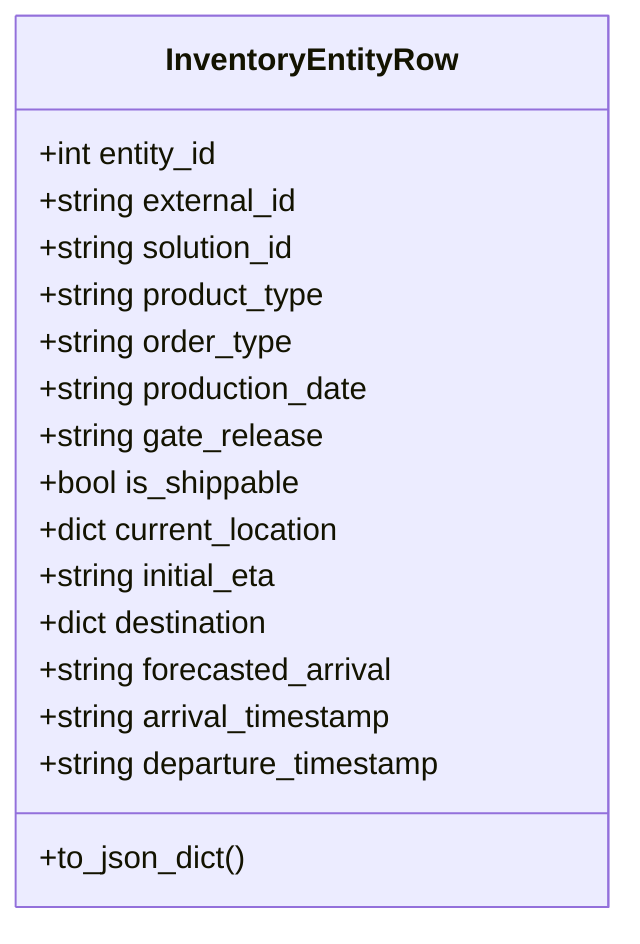
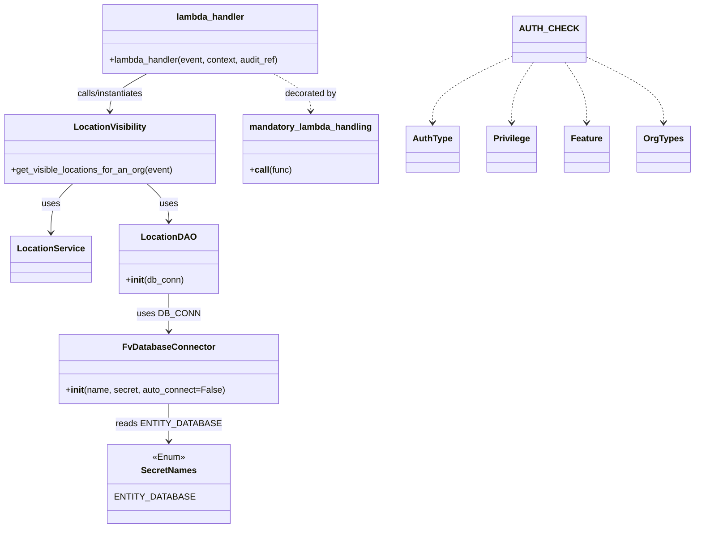
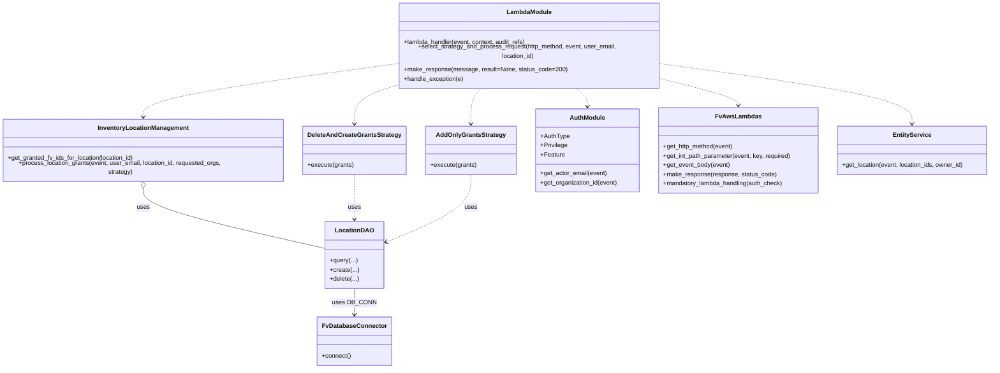
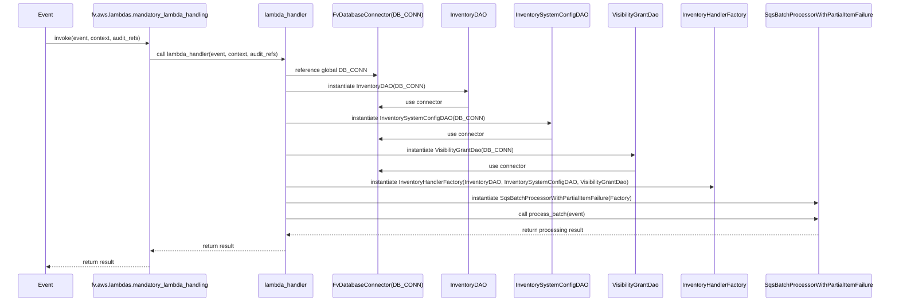

# Diagram: entity_core/entity_service/entity_inventory/entity_inventory_service/service/entity_organization_visibility/__init__.py


> Auto-generated by Obscura crawlers

## Diagram 1



### SVG

<svg id="container" width="323.0625" xmlns="http://www.w3.org/2000/svg" class="classDiagram" height="472" viewBox="0 0 323.0625 472" role="graphics-document document" aria-roledescription="class"><style>#container{font-family:"trebuchet ms",verdana,arial,sans-serif;font-size:16px;fill:#333;}@keyframes edge-animation-frame{from{stroke-dashoffset:0;}}@keyframes dash{to{stroke-dashoffset:0;}}#container .edge-animation-slow{stroke-dasharray:9,5!important;stroke-dashoffset:900;animation:dash 50s linear infinite;stroke-linecap:round;}#container .edge-animation-fast{stroke-dasharray:9,5!important;stroke-dashoffset:900;animation:dash 20s linear infinite;stroke-linecap:round;}#container .error-icon{fill:#552222;}#container .error-text{fill:#552222;stroke:#552222;}#container .edge-thickness-normal{stroke-width:1px;}#container .edge-thickness-thick{stroke-width:3.5px;}#container .edge-pattern-solid{stroke-dasharray:0;}#container .edge-thickness-invisible{stroke-width:0;fill:none;}#container .edge-pattern-dashed{stroke-dasharray:3;}#container .edge-pattern-dotted{stroke-dasharray:2;}#container .marker{fill:#333333;stroke:#333333;}#container .marker.cross{stroke:#333333;}#container svg{font-family:"trebuchet ms",verdana,arial,sans-serif;font-size:16px;}#container p{margin:0;}#container g.classGroup text{fill:#9370DB;stroke:none;font-family:"trebuchet ms",verdana,arial,sans-serif;font-size:10px;}#container g.classGroup text .title{font-weight:bolder;}#container .nodeLabel,#container .edgeLabel{color:#131300;}#container .edgeLabel .label rect{fill:#ECECFF;}#container .label text{fill:#131300;}#container .labelBkg{background:#ECECFF;}#container .edgeLabel .label span{background:#ECECFF;}#container .classTitle{font-weight:bolder;}#container .node rect,#container .node circle,#container .node ellipse,#container .node polygon,#container .node path{fill:#ECECFF;stroke:#9370DB;stroke-width:1px;}#container .divider{stroke:#9370DB;stroke-width:1;}#container g.clickable{cursor:pointer;}#container g.classGroup rect{fill:#ECECFF;stroke:#9370DB;}#container g.classGroup line{stroke:#9370DB;stroke-width:1;}#container .classLabel .box{stroke:none;stroke-width:0;fill:#ECECFF;opacity:0.5;}#container .classLabel .label{fill:#9370DB;font-size:10px;}#container .relation{stroke:#333333;stroke-width:1;fill:none;}#container .dashed-line{stroke-dasharray:3;}#container .dotted-line{stroke-dasharray:1 2;}#container #compositionStart,#container .composition{fill:#333333!important;stroke:#333333!important;stroke-width:1;}#container #compositionEnd,#container .composition{fill:#333333!important;stroke:#333333!important;stroke-width:1;}#container #dependencyStart,#container .dependency{fill:#333333!important;stroke:#333333!important;stroke-width:1;}#container #dependencyStart,#container .dependency{fill:#333333!important;stroke:#333333!important;stroke-width:1;}#container #extensionStart,#container .extension{fill:transparent!important;stroke:#333333!important;stroke-width:1;}#container #extensionEnd,#container .extension{fill:transparent!important;stroke:#333333!important;stroke-width:1;}#container #aggregationStart,#container .aggregation{fill:transparent!important;stroke:#333333!important;stroke-width:1;}#container #aggregationEnd,#container .aggregation{fill:transparent!important;stroke:#333333!important;stroke-width:1;}#container #lollipopStart,#container .lollipop{fill:#ECECFF!important;stroke:#333333!important;stroke-width:1;}#container #lollipopEnd,#container .lollipop{fill:#ECECFF!important;stroke:#333333!important;stroke-width:1;}#container .edgeTerminals{font-size:11px;line-height:initial;}#container .classTitleText{text-anchor:middle;font-size:18px;fill:#333;}#container .label-icon{display:inline-block;height:1em;overflow:visible;vertical-align:-0.125em;}#container .node .label-icon path{fill:currentColor;stroke:revert;stroke-width:revert;}#container :root{--mermaid-font-family:"trebuchet ms",verdana,arial,sans-serif;}</style><g><defs><marker id="container_class-aggregationStart" class="marker aggregation class" refX="18" refY="7" markerWidth="190" markerHeight="240" orient="auto"><path d="M 18,7 L9,13 L1,7 L9,1 Z"></path></marker></defs><defs><marker id="container_class-aggregationEnd" class="marker aggregation class" refX="1" refY="7" markerWidth="20" markerHeight="28" orient="auto"><path d="M 18,7 L9,13 L1,7 L9,1 Z"></path></marker></defs><defs><marker id="container_class-extensionStart" class="marker extension class" refX="18" refY="7" markerWidth="190" markerHeight="240" orient="auto"><path d="M 1,7 L18,13 V 1 Z"></path></marker></defs><defs><marker id="container_class-extensionEnd" class="marker extension class" refX="1" refY="7" markerWidth="20" markerHeight="28" orient="auto"><path d="M 1,1 V 13 L18,7 Z"></path></marker></defs><defs><marker id="container_class-compositionStart" class="marker composition class" refX="18" refY="7" markerWidth="190" markerHeight="240" orient="auto"><path d="M 18,7 L9,13 L1,7 L9,1 Z"></path></marker></defs><defs><marker id="container_class-compositionEnd" class="marker composition class" refX="1" refY="7" markerWidth="20" markerHeight="28" orient="auto"><path d="M 18,7 L9,13 L1,7 L9,1 Z"></path></marker></defs><defs><marker id="container_class-dependencyStart" class="marker dependency class" refX="6" refY="7" markerWidth="190" markerHeight="240" orient="auto"><path d="M 5,7 L9,13 L1,7 L9,1 Z"></path></marker></defs><defs><marker id="container_class-dependencyEnd" class="marker dependency class" refX="13" refY="7" markerWidth="20" markerHeight="28" orient="auto"><path d="M 18,7 L9,13 L14,7 L9,1 Z"></path></marker></defs><defs><marker id="container_class-lollipopStart" class="marker lollipop class" refX="13" refY="7" markerWidth="190" markerHeight="240" orient="auto"><circle stroke="black" fill="transparent" cx="7" cy="7" r="6"></circle></marker></defs><defs><marker id="container_class-lollipopEnd" class="marker lollipop class" refX="1" refY="7" markerWidth="190" markerHeight="240" orient="auto"><circle stroke="black" fill="transparent" cx="7" cy="7" r="6"></circle></marker></defs><g class="root"><g class="clusters"></g><g class="edgePaths"></g><g class="edgeLabels"></g><g class="nodes"><g class="node default" id="classId-InventoryEntityRow-0" transform="translate(161.53125, 236)"><g class="basic label-container"><path d="M-153.53125 -228 L153.53125 -228 L153.53125 228 L-153.53125 228" stroke="none" stroke-width="0" fill="#ECECFF" style=""></path><path d="M-153.53125 -228 C-33.603414306486755 -228, 86.32442138702649 -228, 153.53125 -228 M-153.53125 -228 C-86.9010426606815 -228, -20.270835321362995 -228, 153.53125 -228 M153.53125 -228 C153.53125 -136.20051174533162, 153.53125 -44.40102349066325, 153.53125 228 M153.53125 -228 C153.53125 -131.9598704443051, 153.53125 -35.91974088861019, 153.53125 228 M153.53125 228 C46.035343171576656 228, -61.46056365684669 228, -153.53125 228 M153.53125 228 C81.25640965890828 228, 8.981569317816565 228, -153.53125 228 M-153.53125 228 C-153.53125 59.68674947964834, -153.53125 -108.62650104070332, -153.53125 -228 M-153.53125 228 C-153.53125 131.97946381333276, -153.53125 35.95892762666551, -153.53125 -228" stroke="#9370DB" stroke-width="1.3" fill="none" stroke-dasharray="0 0" style=""></path></g><g class="annotation-group text" transform="translate(0, -204)"></g><g class="label-group text" transform="translate(-71.71875, -204)"><g class="label" style="font-weight: bolder" transform="translate(0,-12)"><foreignObject width="143.4375" height="24"><div xmlns="http://www.w3.org/1999/xhtml" style="display: table-cell; white-space: nowrap; line-height: 1.5; max-width: 191px; text-align: center;"><span class="nodeLabel markdown-node-label" style=""><p>InventoryEntityRow</p></span></div></foreignObject></g></g><g class="members-group text" transform="translate(-141.53125, -156)"><g class="label" style="" transform="translate(0,-12)"><foreignObject width="95.765625" height="24"><div xmlns="http://www.w3.org/1999/xhtml" style="display: table-cell; white-space: nowrap; line-height: 1.5; max-width: 153px; text-align: center;"><span class="nodeLabel markdown-node-label" style=""><p>+int entity_id</p></span></div></foreignObject></g><g class="label" style="" transform="translate(0,12)"><foreignObject width="135.640625" height="24"><div xmlns="http://www.w3.org/1999/xhtml" style="display: table-cell; white-space: nowrap; line-height: 1.5; max-width: 193px; text-align: center;"><span class="nodeLabel markdown-node-label" style=""><p>+string external_id</p></span></div></foreignObject></g><g class="label" style="" transform="translate(0,36)"><foreignObject width="136.09375" height="24"><div xmlns="http://www.w3.org/1999/xhtml" style="display: table-cell; white-space: nowrap; line-height: 1.5; max-width: 193px; text-align: center;"><span class="nodeLabel markdown-node-label" style=""><p>+string solution_id</p></span></div></foreignObject></g><g class="label" style="" transform="translate(0,60)"><foreignObject width="150.5" height="24"><div xmlns="http://www.w3.org/1999/xhtml" style="display: table-cell; white-space: nowrap; line-height: 1.5; max-width: 208px; text-align: center;"><span class="nodeLabel markdown-node-label" style=""><p>+string product_type</p></span></div></foreignObject></g><g class="label" style="" transform="translate(0,84)"><foreignObject width="131.875" height="24"><div xmlns="http://www.w3.org/1999/xhtml" style="display: table-cell; white-space: nowrap; line-height: 1.5; max-width: 189px; text-align: center;"><span class="nodeLabel markdown-node-label" style=""><p>+string order_type</p></span></div></foreignObject></g><g class="label" style="" transform="translate(0,108)"><foreignObject width="174.46875" height="24"><div xmlns="http://www.w3.org/1999/xhtml" style="display: table-cell; white-space: nowrap; line-height: 1.5; max-width: 232px; text-align: center;"><span class="nodeLabel markdown-node-label" style=""><p>+string production_date</p></span></div></foreignObject></g><g class="label" style="" transform="translate(0,132)"><foreignObject width="145.15625" height="24"><div xmlns="http://www.w3.org/1999/xhtml" style="display: table-cell; white-space: nowrap; line-height: 1.5; max-width: 203px; text-align: center;"><span class="nodeLabel markdown-node-label" style=""><p>+string gate_release</p></span></div></foreignObject></g><g class="label" style="" transform="translate(0,156)"><foreignObject width="136.84375" height="24"><div xmlns="http://www.w3.org/1999/xhtml" style="display: table-cell; white-space: nowrap; line-height: 1.5; max-width: 194px; text-align: center;"><span class="nodeLabel markdown-node-label" style=""><p>+bool is_shippable</p></span></div></foreignObject></g><g class="label" style="" transform="translate(0,180)"><foreignObject width="159.59375" height="24"><div xmlns="http://www.w3.org/1999/xhtml" style="display: table-cell; white-space: nowrap; line-height: 1.5; max-width: 217px; text-align: center;"><span class="nodeLabel markdown-node-label" style=""><p>+dict current_location</p></span></div></foreignObject></g><g class="label" style="" transform="translate(0,204)"><foreignObject width="126.875" height="24"><div xmlns="http://www.w3.org/1999/xhtml" style="display: table-cell; white-space: nowrap; line-height: 1.5; max-width: 184px; text-align: center;"><span class="nodeLabel markdown-node-label" style=""><p>+string initial_eta</p></span></div></foreignObject></g><g class="label" style="" transform="translate(0,228)"><foreignObject width="122.875" height="24"><div xmlns="http://www.w3.org/1999/xhtml" style="display: table-cell; white-space: nowrap; line-height: 1.5; max-width: 180px; text-align: center;"><span class="nodeLabel markdown-node-label" style=""><p>+dict destination</p></span></div></foreignObject></g><g class="label" style="" transform="translate(0,252)"><foreignObject width="184.5625" height="24"><div xmlns="http://www.w3.org/1999/xhtml" style="display: table-cell; white-space: nowrap; line-height: 1.5; max-width: 242px; text-align: center;"><span class="nodeLabel markdown-node-label" style=""><p>+string forecasted_arrival</p></span></div></foreignObject></g><g class="label" style="" transform="translate(0,276)"><foreignObject width="186.0625" height="24"><div xmlns="http://www.w3.org/1999/xhtml" style="display: table-cell; white-space: nowrap; line-height: 1.5; max-width: 243px; text-align: center;"><span class="nodeLabel markdown-node-label" style=""><p>+string arrival_timestamp</p></span></div></foreignObject></g><g class="label" style="" transform="translate(0,300)"><foreignObject width="211.34375" height="24"><div xmlns="http://www.w3.org/1999/xhtml" style="display: table-cell; white-space: nowrap; line-height: 1.5; max-width: 269px; text-align: center;"><span class="nodeLabel markdown-node-label" style=""><p>+string departure_timestamp</p></span></div></foreignObject></g></g><g class="methods-group text" transform="translate(-141.53125, 204)"><g class="label" style="" transform="translate(0,-12)"><foreignObject width="107.90625" height="24"><div xmlns="http://www.w3.org/1999/xhtml" style="display: table-cell; white-space: nowrap; line-height: 1.5; max-width: 165px; text-align: center;"><span class="nodeLabel markdown-node-label" style=""><p>+to_json_dict()</p></span></div></foreignObject></g></g><g class="divider" style=""><path d="M-153.53125 -180 C-36.27119692382624 -180, 80.98885615234752 -180, 153.53125 -180 M-153.53125 -180 C-41.88404763739574 -180, 69.76315472520852 -180, 153.53125 -180" stroke="#9370DB" stroke-width="1.3" fill="none" stroke-dasharray="0 0" style=""></path></g><g class="divider" style=""><path d="M-153.53125 180 C-37.537585261179856 180, 78.45607947764029 180, 153.53125 180 M-153.53125 180 C-73.24166194053267 180, 7.047926118934669 180, 153.53125 180" stroke="#9370DB" stroke-width="1.3" fill="none" stroke-dasharray="0 0" style=""></path></g></g></g></g></g></svg>

## Diagram 2

```mermaid
flowchart LR
IE[InventoryEntityRow] -->|to_json_dict()| JSON[JSON Object]
JSON --> EID["entityId = entity_id"]
JSON --> EXT["externalId = external_id"]
JSON --> SOL["solutionId = solution_id"]
JSON --> PT["productType = product_type"]
JSON --> OT["orderType = order_type"]
JSON --> PD["productionDate = production_date"]
JSON --> GR["gateRelease = gate_release"]
JSON --> SH["isShippable = is_shippable"]
JSON --> CL["currentLocation = current_location"]
JSON --> IEta["initialEta = initial_eta"]
JSON --> DST["destination = destination"]
JSON --> FA["forecastedArrival = forecasted_arrival"]
JSON --> AT["arrivalTimestamp = arrival_timestamp"]
JSON --> DT["departureTimestamp = departure_timestamp"]
```

> SVG rendering failed for this diagram.

## Diagram 3



> SVG rendering failed for this diagram.

## Diagram 4

```mermaid
flowchart TD
evt[Incoming event] --> dec{mandatory_lambda_handling(auth_check=AUTH_CHECK)}
dec --> lh[lambda_handler(event, context, audit_ref)]
lh --> instVis[Create LocationVisibility(LocationService(), LocationDAO(DB_CONN))]
instVis --> LS[LocationService]
instVis --> LD[LocationDAO]
LD --> DB[FvDatabaseConnector("get_visible_locations_for_organization", SecretNames.ENTITY_DATABASE)]
DB --> Secret[SecretNames.ENTITY_DATABASE]
instVis --> callGet[get_visible_locations_for_an_org(event)]
callGet --> resp[Return visible locations]
```

> SVG rendering failed for this diagram.

## Diagram 5

```mermaid
flowchart TD
  Start([lambda_handler invoked]) --> GetMethod[get_http_method(event)]
  GetMethod --> GetEmail[auth.get_actor_email(event)]
  GetEmail --> GetPathParam[get_int_path_parameter(event, "location_id")]
  GetPathParam --> GetLocation[get_location(event, location_ids=[location_id], owner_id=owner_id)]
  GetLocation --> LocationExists{location exists?}
  LocationExists -- No --> BadLocation[BadRequestError: "Location does not exist"] --> HandleException[handle_exception(e)] --> End([End])
  LocationExists -- Yes --> MethodValid{http_method in {"GET","PUT","POST"}?}
  MethodValid -- No --> InvalidMethod[BadRequestError: "Invalid HTTP method"] --> HandleException --> End
  MethodValid -- Yes --> TryProcess[select_strategy_and_process_request(http_method, event, user_email, location_id)]
  TryProcess -.-> HandleException
  TryProcess --> ProcessStart{http_method == "GET" ?}
  ProcessStart -- Yes --> GETProcess[InventoryLocationManagement.get_granted_fv_ids_for_location(location_id)]
  GETProcess --> MakeSuccess1[make_response("success", grant_result)] --> End
  ProcessStart -- No --> PutPostBranch{http_method == "PUT" or "POST"}
  PutPostBranch -- Yes --> GetBody[fv.aws.lambdas.get_event_body(event)]
  GetBody --> ReqOrgs{body.orgs_fv_id present and non-empty?}
  ReqOrgs -- No --> EmptyOrgs[raise BadRequestError: "At least one organization FV ID required"] --> HandleException --> End
  ReqOrgs -- Yes --> ChooseStrategy{http_method == "PUT" ?}
  ChooseStrategy -- Yes --> StrategyPUT[DeleteAndCreateGrantsStrategy(location_grant_dao)]
  ChooseStrategy -- No --> StrategyPOST[AddOnlyGrantsStrategy(location_grant_dao)]
  StrategyPUT --> CallProcess[handler.process_location_grants(event, user_email, location_id, requested_organizations, strategy)]
  StrategyPOST --> CallProcess
  CallProcess --> SuccessCheck{is_success?}
  SuccessCheck -- No --> MakeError[make_response("Error: {error_msg}", status_code=400)] --> End
  SuccessCheck -- Yes --> MakeSuccess2[make_response("success", grant_result)] --> End
```

> SVG rendering failed for this diagram.

## Diagram 6



### SVG

<svg id="container" width="2568.1640625" xmlns="http://www.w3.org/2000/svg" class="classDiagram" height="934" viewBox="0 0 2568.1640625 934" role="graphics-document document" aria-roledescription="class"><style>#container{font-family:"trebuchet ms",verdana,arial,sans-serif;font-size:16px;fill:#333;}@keyframes edge-animation-frame{from{stroke-dashoffset:0;}}@keyframes dash{to{stroke-dashoffset:0;}}#container .edge-animation-slow{stroke-dasharray:9,5!important;stroke-dashoffset:900;animation:dash 50s linear infinite;stroke-linecap:round;}#container .edge-animation-fast{stroke-dasharray:9,5!important;stroke-dashoffset:900;animation:dash 20s linear infinite;stroke-linecap:round;}#container .error-icon{fill:#552222;}#container .error-text{fill:#552222;stroke:#552222;}#container .edge-thickness-normal{stroke-width:1px;}#container .edge-thickness-thick{stroke-width:3.5px;}#container .edge-pattern-solid{stroke-dasharray:0;}#container .edge-thickness-invisible{stroke-width:0;fill:none;}#container .edge-pattern-dashed{stroke-dasharray:3;}#container .edge-pattern-dotted{stroke-dasharray:2;}#container .marker{fill:#333333;stroke:#333333;}#container .marker.cross{stroke:#333333;}#container svg{font-family:"trebuchet ms",verdana,arial,sans-serif;font-size:16px;}#container p{margin:0;}#container g.classGroup text{fill:#9370DB;stroke:none;font-family:"trebuchet ms",verdana,arial,sans-serif;font-size:10px;}#container g.classGroup text .title{font-weight:bolder;}#container .nodeLabel,#container .edgeLabel{color:#131300;}#container .edgeLabel .label rect{fill:#ECECFF;}#container .label text{fill:#131300;}#container .labelBkg{background:#ECECFF;}#container .edgeLabel .label span{background:#ECECFF;}#container .classTitle{font-weight:bolder;}#container .node rect,#container .node circle,#container .node ellipse,#container .node polygon,#container .node path{fill:#ECECFF;stroke:#9370DB;stroke-width:1px;}#container .divider{stroke:#9370DB;stroke-width:1;}#container g.clickable{cursor:pointer;}#container g.classGroup rect{fill:#ECECFF;stroke:#9370DB;}#container g.classGroup line{stroke:#9370DB;stroke-width:1;}#container .classLabel .box{stroke:none;stroke-width:0;fill:#ECECFF;opacity:0.5;}#container .classLabel .label{fill:#9370DB;font-size:10px;}#container .relation{stroke:#333333;stroke-width:1;fill:none;}#container .dashed-line{stroke-dasharray:3;}#container .dotted-line{stroke-dasharray:1 2;}#container #compositionStart,#container .composition{fill:#333333!important;stroke:#333333!important;stroke-width:1;}#container #compositionEnd,#container .composition{fill:#333333!important;stroke:#333333!important;stroke-width:1;}#container #dependencyStart,#container .dependency{fill:#333333!important;stroke:#333333!important;stroke-width:1;}#container #dependencyStart,#container .dependency{fill:#333333!important;stroke:#333333!important;stroke-width:1;}#container #extensionStart,#container .extension{fill:transparent!important;stroke:#333333!important;stroke-width:1;}#container #extensionEnd,#container .extension{fill:transparent!important;stroke:#333333!important;stroke-width:1;}#container #aggregationStart,#container .aggregation{fill:transparent!important;stroke:#333333!important;stroke-width:1;}#container #aggregationEnd,#container .aggregation{fill:transparent!important;stroke:#333333!important;stroke-width:1;}#container #lollipopStart,#container .lollipop{fill:#ECECFF!important;stroke:#333333!important;stroke-width:1;}#container #lollipopEnd,#container .lollipop{fill:#ECECFF!important;stroke:#333333!important;stroke-width:1;}#container .edgeTerminals{font-size:11px;line-height:initial;}#container .classTitleText{text-anchor:middle;font-size:18px;fill:#333;}#container .label-icon{display:inline-block;height:1em;overflow:visible;vertical-align:-0.125em;}#container .node .label-icon path{fill:currentColor;stroke:revert;stroke-width:revert;}#container :root{--mermaid-font-family:"trebuchet ms",verdana,arial,sans-serif;}</style><g><defs><marker id="container_class-aggregationStart" class="marker aggregation class" refX="18" refY="7" markerWidth="190" markerHeight="240" orient="auto"><path d="M 18,7 L9,13 L1,7 L9,1 Z"></path></marker></defs><defs><marker id="container_class-aggregationEnd" class="marker aggregation class" refX="1" refY="7" markerWidth="20" markerHeight="28" orient="auto"><path d="M 18,7 L9,13 L1,7 L9,1 Z"></path></marker></defs><defs><marker id="container_class-extensionStart" class="marker extension class" refX="18" refY="7" markerWidth="190" markerHeight="240" orient="auto"><path d="M 1,7 L18,13 V 1 Z"></path></marker></defs><defs><marker id="container_class-extensionEnd" class="marker extension class" refX="1" refY="7" markerWidth="20" markerHeight="28" orient="auto"><path d="M 1,1 V 13 L18,7 Z"></path></marker></defs><defs><marker id="container_class-compositionStart" class="marker composition class" refX="18" refY="7" markerWidth="190" markerHeight="240" orient="auto"><path d="M 18,7 L9,13 L1,7 L9,1 Z"></path></marker></defs><defs><marker id="container_class-compositionEnd" class="marker composition class" refX="1" refY="7" markerWidth="20" markerHeight="28" orient="auto"><path d="M 18,7 L9,13 L1,7 L9,1 Z"></path></marker></defs><defs><marker id="container_class-dependencyStart" class="marker dependency class" refX="6" refY="7" markerWidth="190" markerHeight="240" orient="auto"><path d="M 5,7 L9,13 L1,7 L9,1 Z"></path></marker></defs><defs><marker id="container_class-dependencyEnd" class="marker dependency class" refX="13" refY="7" markerWidth="20" markerHeight="28" orient="auto"><path d="M 18,7 L9,13 L14,7 L9,1 Z"></path></marker></defs><defs><marker id="container_class-lollipopStart" class="marker lollipop class" refX="13" refY="7" markerWidth="190" markerHeight="240" orient="auto"><circle stroke="black" fill="transparent" cx="7" cy="7" r="6"></circle></marker></defs><defs><marker id="container_class-lollipopEnd" class="marker lollipop class" refX="1" refY="7" markerWidth="190" markerHeight="240" orient="auto"><circle stroke="black" fill="transparent" cx="7" cy="7" r="6"></circle></marker></defs><g class="root"><g class="clusters"></g><g class="edgePaths"><path d="M375.617,459.25L375.617,468.542C375.617,477.833,375.617,496.417,454.684,523.613C533.75,550.808,691.883,586.617,770.949,604.521L850.016,622.425" id="id_InventoryLocationManagement_LocationDAO_1" class="edge-thickness-normal edge-pattern-solid relation" style=";;;" data-edge="true" data-et="edge" data-id="id_InventoryLocationManagement_LocationDAO_1" data-points="W3sieCI6Mzc1LjYxNzE4NzUsInkiOjQ0Mn0seyJ4IjozNzUuNjE3MTg3NSwieSI6NTE1fSx7IngiOjg1MC4wMTU2MjUsInkiOjYyMi40MjUyNjk2NDU2MDg2fV0=" marker-start="url(#container_class-aggregationStart)"></path><path d="M923.211,430L923.211,444.167C923.211,458.333,923.211,486.667,923.211,506C923.211,525.333,923.211,535.667,923.211,540.833L923.211,546" id="id_DeleteAndCreateGrantsStrategy_LocationDAO_2" class="edge-thickness-normal edge-pattern-dashed relation" style=";;;" data-edge="true" data-et="edge" data-id="id_DeleteAndCreateGrantsStrategy_LocationDAO_2" data-points="W3sieCI6OTIzLjIxMDkzNzUsInkiOjQzMH0seyJ4Ijo5MjMuMjEwOTM3NSwieSI6NTE1fSx7IngiOjkyMy4yMTA5Mzc1LCJ5Ijo1NTJ9XQ==" marker-end="url(#container_class-dependencyEnd)"></path><path d="M1217.902,430L1217.902,444.167C1217.902,458.333,1217.902,486.667,1181.908,515.979C1145.914,545.291,1073.925,575.583,1037.931,590.728L1001.937,605.874" id="id_AddOnlyGrantsStrategy_LocationDAO_3" class="edge-thickness-normal edge-pattern-dashed relation" style=";;;" data-edge="true" data-et="edge" data-id="id_AddOnlyGrantsStrategy_LocationDAO_3" data-points="W3sieCI6MTIxNy45MDIzNDM3NSwieSI6NDMwfSx7IngiOjEyMTcuOTAyMzQzNzUsInkiOjUxNX0seyJ4Ijo5OTYuNDA2MjUsInkiOjYwOC4yMDA5Mzg0ODE3Mjc1fV0=" marker-end="url(#container_class-dependencyEnd)"></path><path d="M923.211,726L923.211,732.167C923.211,738.333,923.211,750.667,923.211,762C923.211,773.333,923.211,783.667,923.211,788.833L923.211,794" id="id_LocationDAO_FvDatabaseConnector_4" class="edge-thickness-normal edge-pattern-solid relation" style=";;;" data-edge="true" data-et="edge" data-id="id_LocationDAO_FvDatabaseConnector_4" data-points="W3sieCI6OTIzLjIxMDkzNzUsInkiOjcyNn0seyJ4Ijo5MjMuMjEwOTM3NSwieSI6NzYzfSx7IngiOjkyMy4yMTA5Mzc1LCJ5Ijo4MDB9XQ==" marker-end="url(#container_class-dependencyEnd)"></path><path d="M1712.74,185.821L1745.694,193.351C1778.648,200.88,1844.557,215.94,1877.511,226.637C1910.465,237.333,1910.465,243.667,1910.465,246.833L1910.465,250" id="id_LambdaModule_FvAwsLambdas_5" class="edge-thickness-normal edge-pattern-dashed relation" style=";;;" data-edge="true" data-et="edge" data-id="id_LambdaModule_FvAwsLambdas_5" data-points="W3sieCI6MTcxMi43NDAyMzQzNzUsInkiOjE4NS44MjA2MDUyODg0NDU5Nn0seyJ4IjoxOTEwLjQ2NDg0Mzc1LCJ5IjoyMzF9LHsieCI6MTkxMC40NjQ4NDM3NSwieSI6MjU2fV0=" marker-end="url(#container_class-dependencyEnd)"></path><path d="M1487.453,206L1492.49,210.167C1497.526,214.333,1507.599,222.667,1512.635,230.5C1517.672,238.333,1517.672,245.667,1517.672,249.333L1517.672,253" id="id_LambdaModule_AuthModule_6" class="edge-thickness-normal edge-pattern-dashed relation" style=";;;" data-edge="true" data-et="edge" data-id="id_LambdaModule_AuthModule_6" data-points="W3sieCI6MTQ4Ny40NTMxNzIyNTMwMjQxLCJ5IjoyMDZ9LHsieCI6MTUxNy42NzE4NzUsInkiOjIzMX0seyJ4IjoxNTE3LjY3MTg3NSwieSI6MjU5fV0=" marker-end="url(#container_class-dependencyEnd)"></path><path d="M1712.74,149.929L1821.314,163.441C1929.888,176.953,2147.036,203.976,2255.61,228.655C2364.184,253.333,2364.184,275.667,2364.184,286.833L2364.184,298" id="id_LambdaModule_EntityService_7" class="edge-thickness-normal edge-pattern-dashed relation" style=";;;" data-edge="true" data-et="edge" data-id="id_LambdaModule_EntityService_7" data-points="W3sieCI6MTcxMi43NDAyMzQzNzUsInkiOjE0OS45Mjg4ODIzOTg0ODY3M30seyJ4IjoyMzY0LjE4MzU5Mzc1LCJ5IjoyMzF9LHsieCI6MjM2NC4xODM1OTM3NSwieSI6MzA0fV0=" marker-end="url(#container_class-dependencyEnd)"></path><path d="M1022.834,150.112L914.965,163.593C807.095,177.075,591.356,204.037,483.487,226.685C375.617,249.333,375.617,267.667,375.617,276.833L375.617,286" id="id_LambdaModule_InventoryLocationManagement_8" class="edge-thickness-normal edge-pattern-dashed relation" style=";;;" data-edge="true" data-et="edge" data-id="id_LambdaModule_InventoryLocationManagement_8" data-points="W3sieCI6MTAyMi44MzM5ODQzNzUsInkiOjE1MC4xMTE3NTU5MTY5MzU1Mn0seyJ4IjozNzUuNjE3MTg3NSwieSI6MjMxfSx7IngiOjM3NS42MTcxODc1LCJ5IjoyOTJ9XQ==" marker-end="url(#container_class-dependencyEnd)"></path><path d="M1022.834,203.213L1006.23,207.845C989.626,212.476,956.419,221.738,939.815,237.536C923.211,253.333,923.211,275.667,923.211,286.833L923.211,298" id="id_LambdaModule_DeleteAndCreateGrantsStrategy_9" class="edge-thickness-normal edge-pattern-dashed relation" style=";;;" data-edge="true" data-et="edge" data-id="id_LambdaModule_DeleteAndCreateGrantsStrategy_9" data-points="W3sieCI6MTAyMi44MzM5ODQzNzUsInkiOjIwMy4yMTM0MDU0OTk0NDQyNn0seyJ4Ijo5MjMuMjEwOTM3NSwieSI6MjMxfSx7IngiOjkyMy4yMTA5Mzc1LCJ5IjozMDR9XQ==" marker-end="url(#container_class-dependencyEnd)"></path><path d="M1248.121,206L1243.085,210.167C1238.048,214.333,1227.975,222.667,1222.939,238C1217.902,253.333,1217.902,275.667,1217.902,286.833L1217.902,298" id="id_LambdaModule_AddOnlyGrantsStrategy_10" class="edge-thickness-normal edge-pattern-dashed relation" style=";;;" data-edge="true" data-et="edge" data-id="id_LambdaModule_AddOnlyGrantsStrategy_10" data-points="W3sieCI6MTI0OC4xMjEwNDY0OTY5NzU5LCJ5IjoyMDZ9LHsieCI6MTIxNy45MDIzNDM3NSwieSI6MjMxfSx7IngiOjEyMTcuOTAyMzQzNzUsInkiOjMwNH1d" marker-end="url(#container_class-dependencyEnd)"></path></g><g class="edgeLabels"><g class="edgeLabel" transform="translate(375.6171875, 515)"><g class="label" data-id="id_InventoryLocationManagement_LocationDAO_1" transform="translate(-16.4921875, -12)"><foreignObject width="32.984375" height="24"><div xmlns="http://www.w3.org/1999/xhtml" class="labelBkg" style="display: table-cell; white-space: nowrap; line-height: 1.5; max-width: 200px; text-align: center;"><span class="edgeLabel"><p>uses</p></span></div></foreignObject></g></g><g class="edgeLabel" transform="translate(923.2109375, 515)"><g class="label" data-id="id_DeleteAndCreateGrantsStrategy_LocationDAO_2" transform="translate(-16.4921875, -12)"><foreignObject width="32.984375" height="24"><div xmlns="http://www.w3.org/1999/xhtml" class="labelBkg" style="display: table-cell; white-space: nowrap; line-height: 1.5; max-width: 200px; text-align: center;"><span class="edgeLabel"><p>uses</p></span></div></foreignObject></g></g><g class="edgeLabel" transform="translate(1217.90234375, 515)"><g class="label" data-id="id_AddOnlyGrantsStrategy_LocationDAO_3" transform="translate(-16.4921875, -12)"><foreignObject width="32.984375" height="24"><div xmlns="http://www.w3.org/1999/xhtml" class="labelBkg" style="display: table-cell; white-space: nowrap; line-height: 1.5; max-width: 200px; text-align: center;"><span class="edgeLabel"><p>uses</p></span></div></foreignObject></g></g><g class="edgeLabel" transform="translate(923.2109375, 763)"><g class="label" data-id="id_LocationDAO_FvDatabaseConnector_4" transform="translate(-53.09375, -12)"><foreignObject width="106.1875" height="24"><div xmlns="http://www.w3.org/1999/xhtml" class="labelBkg" style="display: table-cell; white-space: nowrap; line-height: 1.5; max-width: 200px; text-align: center;"><span class="edgeLabel"><p>uses DB_CONN</p></span></div></foreignObject></g></g><g class="edgeLabel"><g class="label" data-id="id_LambdaModule_FvAwsLambdas_5" transform="translate(0, 0)"><foreignObject width="0" height="0"><div xmlns="http://www.w3.org/1999/xhtml" class="labelBkg" style="display: table-cell; white-space: nowrap; line-height: 1.5; max-width: 200px; text-align: center;"><span class="edgeLabel"></span></div></foreignObject></g></g><g class="edgeLabel"><g class="label" data-id="id_LambdaModule_AuthModule_6" transform="translate(0, 0)"><foreignObject width="0" height="0"><div xmlns="http://www.w3.org/1999/xhtml" class="labelBkg" style="display: table-cell; white-space: nowrap; line-height: 1.5; max-width: 200px; text-align: center;"><span class="edgeLabel"></span></div></foreignObject></g></g><g class="edgeLabel"><g class="label" data-id="id_LambdaModule_EntityService_7" transform="translate(0, 0)"><foreignObject width="0" height="0"><div xmlns="http://www.w3.org/1999/xhtml" class="labelBkg" style="display: table-cell; white-space: nowrap; line-height: 1.5; max-width: 200px; text-align: center;"><span class="edgeLabel"></span></div></foreignObject></g></g><g class="edgeLabel"><g class="label" data-id="id_LambdaModule_InventoryLocationManagement_8" transform="translate(0, 0)"><foreignObject width="0" height="0"><div xmlns="http://www.w3.org/1999/xhtml" class="labelBkg" style="display: table-cell; white-space: nowrap; line-height: 1.5; max-width: 200px; text-align: center;"><span class="edgeLabel"></span></div></foreignObject></g></g><g class="edgeLabel"><g class="label" data-id="id_LambdaModule_DeleteAndCreateGrantsStrategy_9" transform="translate(0, 0)"><foreignObject width="0" height="0"><div xmlns="http://www.w3.org/1999/xhtml" class="labelBkg" style="display: table-cell; white-space: nowrap; line-height: 1.5; max-width: 200px; text-align: center;"><span class="edgeLabel"></span></div></foreignObject></g></g><g class="edgeLabel"><g class="label" data-id="id_LambdaModule_AddOnlyGrantsStrategy_10" transform="translate(0, 0)"><foreignObject width="0" height="0"><div xmlns="http://www.w3.org/1999/xhtml" class="labelBkg" style="display: table-cell; white-space: nowrap; line-height: 1.5; max-width: 200px; text-align: center;"><span class="edgeLabel"></span></div></foreignObject></g></g></g><g class="nodes"><g class="node default" id="classId-InventoryLocationManagement-0" transform="translate(375.6171875, 367)"><g class="basic label-container"><path d="M-367.6171875 -75 L367.6171875 -75 L367.6171875 75 L-367.6171875 75" stroke="none" stroke-width="0" fill="#ECECFF" style=""></path><path d="M-367.6171875 -75 C-194.08396679255029 -75, -20.55074608510057 -75, 367.6171875 -75 M-367.6171875 -75 C-115.51323567384304 -75, 136.59071615231392 -75, 367.6171875 -75 M367.6171875 -75 C367.6171875 -36.12425097617466, 367.6171875 2.751498047650685, 367.6171875 75 M367.6171875 -75 C367.6171875 -25.110830053610982, 367.6171875 24.778339892778035, 367.6171875 75 M367.6171875 75 C137.0323425485192 75, -93.55250240296158 75, -367.6171875 75 M367.6171875 75 C74.04933503898485 75, -219.5185174220303 75, -367.6171875 75 M-367.6171875 75 C-367.6171875 44.73985121315013, -367.6171875 14.479702426300257, -367.6171875 -75 M-367.6171875 75 C-367.6171875 31.790695395895405, -367.6171875 -11.41860920820919, -367.6171875 -75" stroke="#9370DB" stroke-width="1.3" fill="none" stroke-dasharray="0 0" style=""></path></g><g class="annotation-group text" transform="translate(0, -51)"></g><g class="label-group text" transform="translate(-113.421875, -51)"><g class="label" style="font-weight: bolder" transform="translate(0,-12)"><foreignObject width="226.84375" height="24"><div xmlns="http://www.w3.org/1999/xhtml" style="display: table-cell; white-space: nowrap; line-height: 1.5; max-width: 275px; text-align: center;"><span class="nodeLabel markdown-node-label" style=""><p>InventoryLocationManagement</p></span></div></foreignObject></g></g><g class="members-group text" transform="translate(-355.6171875, -3)"></g><g class="methods-group text" transform="translate(-355.6171875, 27)"><g class="label" style="" transform="translate(0,-12)"><foreignObject width="331.828125" height="24"><div xmlns="http://www.w3.org/1999/xhtml" style="display: table-cell; white-space: nowrap; line-height: 1.5; max-width: 389px; text-align: center;"><span class="nodeLabel markdown-node-label" style=""><p>+get_granted_fv_ids_for_location(location_id)</p></span></div></foreignObject></g><g class="label" style="" transform="translate(0,12)"><foreignObject width="597.8125" height="24"><div xmlns="http://www.w3.org/1999/xhtml" style="display: table-cell; white-space: nowrap; line-height: 1.5; max-width: 655px; text-align: center;"><span class="nodeLabel markdown-node-label" style=""><p>+process_location_grants(event, user_email, location_id, requested_orgs, strategy)</p></span></div></foreignObject></g></g><g class="divider" style=""><path d="M-367.6171875 -27 C-152.3161943926132 -27, 62.9847987147736 -27, 367.6171875 -27 M-367.6171875 -27 C-122.60845653329434 -27, 122.40027443341131 -27, 367.6171875 -27" stroke="#9370DB" stroke-width="1.3" fill="none" stroke-dasharray="0 0" style=""></path></g><g class="divider" style=""><path d="M-367.6171875 -3 C-161.12329896772724 -3, 45.370589564545526 -3, 367.6171875 -3 M-367.6171875 -3 C-148.35198392833368 -3, 70.91321964333264 -3, 367.6171875 -3" stroke="#9370DB" stroke-width="1.3" fill="none" stroke-dasharray="0 0" style=""></path></g></g><g class="node default" id="classId-DeleteAndCreateGrantsStrategy-1" transform="translate(923.2109375, 367)"><g class="basic label-container"><path d="M-129.9765625 -63 L129.9765625 -63 L129.9765625 63 L-129.9765625 63" stroke="none" stroke-width="0" fill="#ECECFF" style=""></path><path d="M-129.9765625 -63 C-45.49406037439245 -63, 38.988441751215106 -63, 129.9765625 -63 M-129.9765625 -63 C-69.08261949586579 -63, -8.18867649173157 -63, 129.9765625 -63 M129.9765625 -63 C129.9765625 -27.02346468851897, 129.9765625 8.95307062296206, 129.9765625 63 M129.9765625 -63 C129.9765625 -13.968375337436221, 129.9765625 35.06324932512756, 129.9765625 63 M129.9765625 63 C71.66283640437761 63, 13.349110308755229 63, -129.9765625 63 M129.9765625 63 C40.39384919466272 63, -49.18886411067456 63, -129.9765625 63 M-129.9765625 63 C-129.9765625 34.84659105935358, -129.9765625 6.693182118707156, -129.9765625 -63 M-129.9765625 63 C-129.9765625 13.141659092893363, -129.9765625 -36.716681814213274, -129.9765625 -63" stroke="#9370DB" stroke-width="1.3" fill="none" stroke-dasharray="0 0" style=""></path></g><g class="annotation-group text" transform="translate(0, -39)"></g><g class="label-group text" transform="translate(-116.359375, -39)"><g class="label" style="font-weight: bolder" transform="translate(0,-12)"><foreignObject width="232.71875" height="24"><div xmlns="http://www.w3.org/1999/xhtml" style="display: table-cell; white-space: nowrap; line-height: 1.5; max-width: 277px; text-align: center;"><span class="nodeLabel markdown-node-label" style=""><p>DeleteAndCreateGrantsStrategy</p></span></div></foreignObject></g></g><g class="members-group text" transform="translate(-117.9765625, 9)"></g><g class="methods-group text" transform="translate(-117.9765625, 39)"><g class="label" style="" transform="translate(0,-12)"><foreignObject width="119.59375" height="24"><div xmlns="http://www.w3.org/1999/xhtml" style="display: table-cell; white-space: nowrap; line-height: 1.5; max-width: 177px; text-align: center;"><span class="nodeLabel markdown-node-label" style=""><p>+execute(grants)</p></span></div></foreignObject></g></g><g class="divider" style=""><path d="M-129.9765625 -15 C-28.249152482037417 -15, 73.47825753592517 -15, 129.9765625 -15 M-129.9765625 -15 C-64.7035502283771 -15, 0.5694620432458066 -15, 129.9765625 -15" stroke="#9370DB" stroke-width="1.3" fill="none" stroke-dasharray="0 0" style=""></path></g><g class="divider" style=""><path d="M-129.9765625 9 C-28.037027250884492 9, 73.90250799823102 9, 129.9765625 9 M-129.9765625 9 C-77.02308781034156 9, -24.069613120683144 9, 129.9765625 9" stroke="#9370DB" stroke-width="1.3" fill="none" stroke-dasharray="0 0" style=""></path></g></g><g class="node default" id="classId-AddOnlyGrantsStrategy-2" transform="translate(1217.90234375, 367)"><g class="basic label-container"><path d="M-114.71484375 -63 L114.71484375 -63 L114.71484375 63 L-114.71484375 63" stroke="none" stroke-width="0" fill="#ECECFF" style=""></path><path d="M-114.71484375 -63 C-25.715747337244935 -63, 63.28334907551013 -63, 114.71484375 -63 M-114.71484375 -63 C-39.45534733599645 -63, 35.8041490780071 -63, 114.71484375 -63 M114.71484375 -63 C114.71484375 -20.516039410485284, 114.71484375 21.96792117902943, 114.71484375 63 M114.71484375 -63 C114.71484375 -26.10867626000696, 114.71484375 10.782647479986082, 114.71484375 63 M114.71484375 63 C47.098204533517176 63, -20.518434682965648 63, -114.71484375 63 M114.71484375 63 C56.69031873380748 63, -1.3342062823850398 63, -114.71484375 63 M-114.71484375 63 C-114.71484375 34.30935771864155, -114.71484375 5.618715437283107, -114.71484375 -63 M-114.71484375 63 C-114.71484375 33.41932564872606, -114.71484375 3.838651297452124, -114.71484375 -63" stroke="#9370DB" stroke-width="1.3" fill="none" stroke-dasharray="0 0" style=""></path></g><g class="annotation-group text" transform="translate(0, -39)"></g><g class="label-group text" transform="translate(-85.8359375, -39)"><g class="label" style="font-weight: bolder" transform="translate(0,-12)"><foreignObject width="171.671875" height="24"><div xmlns="http://www.w3.org/1999/xhtml" style="display: table-cell; white-space: nowrap; line-height: 1.5; max-width: 218px; text-align: center;"><span class="nodeLabel markdown-node-label" style=""><p>AddOnlyGrantsStrategy</p></span></div></foreignObject></g></g><g class="members-group text" transform="translate(-102.71484375, 9)"></g><g class="methods-group text" transform="translate(-102.71484375, 39)"><g class="label" style="" transform="translate(0,-12)"><foreignObject width="119.59375" height="24"><div xmlns="http://www.w3.org/1999/xhtml" style="display: table-cell; white-space: nowrap; line-height: 1.5; max-width: 177px; text-align: center;"><span class="nodeLabel markdown-node-label" style=""><p>+execute(grants)</p></span></div></foreignObject></g></g><g class="divider" style=""><path d="M-114.71484375 -15 C-33.1834574231585 -15, 48.347928903683 -15, 114.71484375 -15 M-114.71484375 -15 C-28.599858474588217 -15, 57.515126800823566 -15, 114.71484375 -15" stroke="#9370DB" stroke-width="1.3" fill="none" stroke-dasharray="0 0" style=""></path></g><g class="divider" style=""><path d="M-114.71484375 9 C-47.20680179311792 9, 20.301240163764163 9, 114.71484375 9 M-114.71484375 9 C-46.60029521298944 9, 21.514253324021126 9, 114.71484375 9" stroke="#9370DB" stroke-width="1.3" fill="none" stroke-dasharray="0 0" style=""></path></g></g><g class="node default" id="classId-LocationDAO-3" transform="translate(923.2109375, 639)"><g class="basic label-container"><path d="M-73.1953125 -87 L73.1953125 -87 L73.1953125 87 L-73.1953125 87" stroke="none" stroke-width="0" fill="#ECECFF" style=""></path><path d="M-73.1953125 -87 C-36.38685610087709 -87, 0.4216002982458207 -87, 73.1953125 -87 M-73.1953125 -87 C-35.14509595935394 -87, 2.905120581292124 -87, 73.1953125 -87 M73.1953125 -87 C73.1953125 -35.9699789662568, 73.1953125 15.060042067486407, 73.1953125 87 M73.1953125 -87 C73.1953125 -23.172841556904103, 73.1953125 40.65431688619179, 73.1953125 87 M73.1953125 87 C15.124974365031825 87, -42.94536376993635 87, -73.1953125 87 M73.1953125 87 C38.11975959030339 87, 3.044206680606777 87, -73.1953125 87 M-73.1953125 87 C-73.1953125 39.92210397684927, -73.1953125 -7.155792046301457, -73.1953125 -87 M-73.1953125 87 C-73.1953125 40.54415998069386, -73.1953125 -5.911680038612275, -73.1953125 -87" stroke="#9370DB" stroke-width="1.3" fill="none" stroke-dasharray="0 0" style=""></path></g><g class="annotation-group text" transform="translate(0, -63)"></g><g class="label-group text" transform="translate(-46.640625, -63)"><g class="label" style="font-weight: bolder" transform="translate(0,-12)"><foreignObject width="93.28125" height="24"><div xmlns="http://www.w3.org/1999/xhtml" style="display: table-cell; white-space: nowrap; line-height: 1.5; max-width: 142px; text-align: center;"><span class="nodeLabel markdown-node-label" style=""><p>LocationDAO</p></span></div></foreignObject></g></g><g class="members-group text" transform="translate(-61.1953125, -15)"></g><g class="methods-group text" transform="translate(-61.1953125, 15)"><g class="label" style="" transform="translate(0,-12)"><foreignObject width="71.53125" height="24"><div xmlns="http://www.w3.org/1999/xhtml" style="display: table-cell; white-space: nowrap; line-height: 1.5; max-width: 129px; text-align: center;"><span class="nodeLabel markdown-node-label" style=""><p>+query(...)</p></span></div></foreignObject></g><g class="label" style="" transform="translate(0,12)"><foreignObject width="74.75" height="24"><div xmlns="http://www.w3.org/1999/xhtml" style="display: table-cell; white-space: nowrap; line-height: 1.5; max-width: 132px; text-align: center;"><span class="nodeLabel markdown-node-label" style=""><p>+create(...)</p></span></div></foreignObject></g><g class="label" style="" transform="translate(0,36)"><foreignObject width="75.75" height="24"><div xmlns="http://www.w3.org/1999/xhtml" style="display: table-cell; white-space: nowrap; line-height: 1.5; max-width: 133px; text-align: center;"><span class="nodeLabel markdown-node-label" style=""><p>+delete(...)</p></span></div></foreignObject></g></g><g class="divider" style=""><path d="M-73.1953125 -39 C-23.407048714818508 -39, 26.381215070362984 -39, 73.1953125 -39 M-73.1953125 -39 C-43.88255419656461 -39, -14.569795893129225 -39, 73.1953125 -39" stroke="#9370DB" stroke-width="1.3" fill="none" stroke-dasharray="0 0" style=""></path></g><g class="divider" style=""><path d="M-73.1953125 -15 C-30.592417635229197 -15, 12.010477229541607 -15, 73.1953125 -15 M-73.1953125 -15 C-23.195914844868597 -15, 26.803482810262807 -15, 73.1953125 -15" stroke="#9370DB" stroke-width="1.3" fill="none" stroke-dasharray="0 0" style=""></path></g></g><g class="node default" id="classId-FvDatabaseConnector-4" transform="translate(923.2109375, 863)"><g class="basic label-container"><path d="M-91.3046875 -63 L91.3046875 -63 L91.3046875 63 L-91.3046875 63" stroke="none" stroke-width="0" fill="#ECECFF" style=""></path><path d="M-91.3046875 -63 C-44.612363503911055 -63, 2.0799604921778894 -63, 91.3046875 -63 M-91.3046875 -63 C-54.65561890299211 -63, -18.00655030598422 -63, 91.3046875 -63 M91.3046875 -63 C91.3046875 -14.605118551885226, 91.3046875 33.78976289622955, 91.3046875 63 M91.3046875 -63 C91.3046875 -33.64555568318269, 91.3046875 -4.291111366365392, 91.3046875 63 M91.3046875 63 C27.863067943672256 63, -35.57855161265549 63, -91.3046875 63 M91.3046875 63 C20.685179228406824 63, -49.93432904318635 63, -91.3046875 63 M-91.3046875 63 C-91.3046875 35.18410639021286, -91.3046875 7.368212780425729, -91.3046875 -63 M-91.3046875 63 C-91.3046875 22.346473433279847, -91.3046875 -18.307053133440306, -91.3046875 -63" stroke="#9370DB" stroke-width="1.3" fill="none" stroke-dasharray="0 0" style=""></path></g><g class="annotation-group text" transform="translate(0, -39)"></g><g class="label-group text" transform="translate(-79.3046875, -39)"><g class="label" style="font-weight: bolder" transform="translate(0,-12)"><foreignObject width="158.609375" height="24"><div xmlns="http://www.w3.org/1999/xhtml" style="display: table-cell; white-space: nowrap; line-height: 1.5; max-width: 207px; text-align: center;"><span class="nodeLabel markdown-node-label" style=""><p>FvDatabaseConnector</p></span></div></foreignObject></g></g><g class="members-group text" transform="translate(-79.3046875, 9)"></g><g class="methods-group text" transform="translate(-79.3046875, 39)"><g class="label" style="" transform="translate(0,-12)"><foreignObject width="75.921875" height="24"><div xmlns="http://www.w3.org/1999/xhtml" style="display: table-cell; white-space: nowrap; line-height: 1.5; max-width: 133px; text-align: center;"><span class="nodeLabel markdown-node-label" style=""><p>+connect()</p></span></div></foreignObject></g></g><g class="divider" style=""><path d="M-91.3046875 -15 C-22.758840991218236 -15, 45.78700551756353 -15, 91.3046875 -15 M-91.3046875 -15 C-46.33804543753323 -15, -1.371403375066464 -15, 91.3046875 -15" stroke="#9370DB" stroke-width="1.3" fill="none" stroke-dasharray="0 0" style=""></path></g><g class="divider" style=""><path d="M-91.3046875 9 C-22.64086347183445 9, 46.0229605563311 9, 91.3046875 9 M-91.3046875 9 C-43.447574904208615 9, 4.40953769158277 9, 91.3046875 9" stroke="#9370DB" stroke-width="1.3" fill="none" stroke-dasharray="0 0" style=""></path></g></g><g class="node default" id="classId-LambdaModule-5" transform="translate(1367.787109375, 107)"><g class="basic label-container"><path d="M-344.953125 -99 L344.953125 -99 L344.953125 99 L-344.953125 99" stroke="none" stroke-width="0" fill="#ECECFF" style=""></path><path d="M-344.953125 -99 C-93.10307564895032 -99, 158.74697370209935 -99, 344.953125 -99 M-344.953125 -99 C-160.86419743242595 -99, 23.224730135148093 -99, 344.953125 -99 M344.953125 -99 C344.953125 -27.831128920783556, 344.953125 43.33774215843289, 344.953125 99 M344.953125 -99 C344.953125 -57.998463347874434, 344.953125 -16.99692669574887, 344.953125 99 M344.953125 99 C77.8526878262852 99, -189.2477493474296 99, -344.953125 99 M344.953125 99 C93.39121579262783 99, -158.17069341474433 99, -344.953125 99 M-344.953125 99 C-344.953125 46.26649790805538, -344.953125 -6.4670041838892445, -344.953125 -99 M-344.953125 99 C-344.953125 38.955292077747494, -344.953125 -21.089415844505012, -344.953125 -99" stroke="#9370DB" stroke-width="1.3" fill="none" stroke-dasharray="0 0" style=""></path></g><g class="annotation-group text" transform="translate(0, -75)"></g><g class="label-group text" transform="translate(-56.21875, -75)"><g class="label" style="font-weight: bolder" transform="translate(0,-12)"><foreignObject width="112.4375" height="24"><div xmlns="http://www.w3.org/1999/xhtml" style="display: table-cell; white-space: nowrap; line-height: 1.5; max-width: 162px; text-align: center;"><span class="nodeLabel markdown-node-label" style=""><p>LambdaModule</p></span></div></foreignObject></g></g><g class="members-group text" transform="translate(-332.953125, -27)"></g><g class="methods-group text" transform="translate(-332.953125, 3)"><g class="label" style="" transform="translate(0,-12)"><foreignObject width="321.6875" height="24"><div xmlns="http://www.w3.org/1999/xhtml" style="display: table-cell; white-space: nowrap; line-height: 1.5; max-width: 379px; text-align: center;"><span class="nodeLabel markdown-node-label" style=""><p>+lambda_handler(event, context, audit_refs)</p></span></div></foreignObject></g><g class="label" style="" transform="translate(0,12)"><foreignObject width="609.6875" height="24"><div xmlns="http://www.w3.org/1999/xhtml" style="display: table-cell; white-space: nowrap; line-height: 1.5; max-width: 667px; text-align: center;"><span class="nodeLabel markdown-node-label" style=""><p>+select_strategy_and_process_request(http_method, event, user_email, location_id)</p></span></div></foreignObject></g><g class="label" style="" transform="translate(0,36)"><foreignObject width="418.921875" height="24"><div xmlns="http://www.w3.org/1999/xhtml" style="display: table-cell; white-space: nowrap; line-height: 1.5; max-width: 476px; text-align: center;"><span class="nodeLabel markdown-node-label" style=""><p>+make_response(message, result=None, status_code=200)</p></span></div></foreignObject></g><g class="label" style="" transform="translate(0,60)"><foreignObject width="155.859375" height="24"><div xmlns="http://www.w3.org/1999/xhtml" style="display: table-cell; white-space: nowrap; line-height: 1.5; max-width: 213px; text-align: center;"><span class="nodeLabel markdown-node-label" style=""><p>+handle_exception(e)</p></span></div></foreignObject></g></g><g class="divider" style=""><path d="M-344.953125 -51 C-91.30732105489037 -51, 162.33848289021927 -51, 344.953125 -51 M-344.953125 -51 C-97.77679827482223 -51, 149.39952845035555 -51, 344.953125 -51" stroke="#9370DB" stroke-width="1.3" fill="none" stroke-dasharray="0 0" style=""></path></g><g class="divider" style=""><path d="M-344.953125 -27 C-85.47520527467032 -27, 174.00271445065937 -27, 344.953125 -27 M-344.953125 -27 C-89.06717363704652 -27, 166.81877772590695 -27, 344.953125 -27" stroke="#9370DB" stroke-width="1.3" fill="none" stroke-dasharray="0 0" style=""></path></g></g><g class="node default" id="classId-AuthModule-6" transform="translate(1517.671875, 367)"><g class="basic label-container"><path d="M-135.0546875 -108 L135.0546875 -108 L135.0546875 108 L-135.0546875 108" stroke="none" stroke-width="0" fill="#ECECFF" style=""></path><path d="M-135.0546875 -108 C-47.12053233684459 -108, 40.81362282631082 -108, 135.0546875 -108 M-135.0546875 -108 C-56.14542967250296 -108, 22.763828154994087 -108, 135.0546875 -108 M135.0546875 -108 C135.0546875 -62.30586583537657, 135.0546875 -16.611731670753144, 135.0546875 108 M135.0546875 -108 C135.0546875 -32.517387878737566, 135.0546875 42.96522424252487, 135.0546875 108 M135.0546875 108 C35.07392585104263 108, -64.90683579791474 108, -135.0546875 108 M135.0546875 108 C51.014840956998015 108, -33.02500558600397 108, -135.0546875 108 M-135.0546875 108 C-135.0546875 60.7632357964141, -135.0546875 13.526471592828202, -135.0546875 -108 M-135.0546875 108 C-135.0546875 26.335343738285758, -135.0546875 -55.329312523428484, -135.0546875 -108" stroke="#9370DB" stroke-width="1.3" fill="none" stroke-dasharray="0 0" style=""></path></g><g class="annotation-group text" transform="translate(0, -84)"></g><g class="label-group text" transform="translate(-44.09375, -84)"><g class="label" style="font-weight: bolder" transform="translate(0,-12)"><foreignObject width="88.1875" height="24"><div xmlns="http://www.w3.org/1999/xhtml" style="display: table-cell; white-space: nowrap; line-height: 1.5; max-width: 138px; text-align: center;"><span class="nodeLabel markdown-node-label" style=""><p>AuthModule</p></span></div></foreignObject></g></g><g class="members-group text" transform="translate(-123.0546875, -36)"><g class="label" style="" transform="translate(0,-12)"><foreignObject width="75.1875" height="24"><div xmlns="http://www.w3.org/1999/xhtml" style="display: table-cell; white-space: nowrap; line-height: 1.5; max-width: 133px; text-align: center;"><span class="nodeLabel markdown-node-label" style=""><p>+AuthType</p></span></div></foreignObject></g><g class="label" style="" transform="translate(0,12)"><foreignObject width="70.15625" height="24"><div xmlns="http://www.w3.org/1999/xhtml" style="display: table-cell; white-space: nowrap; line-height: 1.5; max-width: 128px; text-align: center;"><span class="nodeLabel markdown-node-label" style=""><p>+Privilege</p></span></div></foreignObject></g><g class="label" style="" transform="translate(0,36)"><foreignObject width="62.0625" height="24"><div xmlns="http://www.w3.org/1999/xhtml" style="display: table-cell; white-space: nowrap; line-height: 1.5; max-width: 119px; text-align: center;"><span class="nodeLabel markdown-node-label" style=""><p>+Feature</p></span></div></foreignObject></g></g><g class="methods-group text" transform="translate(-123.0546875, 60)"><g class="label" style="" transform="translate(0,-12)"><foreignObject width="173.71875" height="24"><div xmlns="http://www.w3.org/1999/xhtml" style="display: table-cell; white-space: nowrap; line-height: 1.5; max-width: 231px; text-align: center;"><span class="nodeLabel markdown-node-label" style=""><p>+get_actor_email(event)</p></span></div></foreignObject></g><g class="label" style="" transform="translate(0,12)"><foreignObject width="202.015625" height="24"><div xmlns="http://www.w3.org/1999/xhtml" style="display: table-cell; white-space: nowrap; line-height: 1.5; max-width: 259px; text-align: center;"><span class="nodeLabel markdown-node-label" style=""><p>+get_organization_id(event)</p></span></div></foreignObject></g></g><g class="divider" style=""><path d="M-135.0546875 -60 C-29.046204327762922 -60, 76.96227884447416 -60, 135.0546875 -60 M-135.0546875 -60 C-40.19752758658538 -60, 54.65963232682924 -60, 135.0546875 -60" stroke="#9370DB" stroke-width="1.3" fill="none" stroke-dasharray="0 0" style=""></path></g><g class="divider" style=""><path d="M-135.0546875 36 C-42.9615674157093 36, 49.131552668581406 36, 135.0546875 36 M-135.0546875 36 C-29.51917666891252 36, 76.01633416217496 36, 135.0546875 36" stroke="#9370DB" stroke-width="1.3" fill="none" stroke-dasharray="0 0" style=""></path></g></g><g class="node default" id="classId-FvAwsLambdas-7" transform="translate(1910.46484375, 367)"><g class="basic label-container"><path d="M-207.73828125 -111 L207.73828125 -111 L207.73828125 111 L-207.73828125 111" stroke="none" stroke-width="0" fill="#ECECFF" style=""></path><path d="M-207.73828125 -111 C-103.54618956911358 -111, 0.6459021117728412 -111, 207.73828125 -111 M-207.73828125 -111 C-96.88160798662774 -111, 13.975065276744516 -111, 207.73828125 -111 M207.73828125 -111 C207.73828125 -46.25016768510264, 207.73828125 18.499664629794722, 207.73828125 111 M207.73828125 -111 C207.73828125 -54.87634241492139, 207.73828125 1.247315170157222, 207.73828125 111 M207.73828125 111 C68.80483184584622 111, -70.12861755830755 111, -207.73828125 111 M207.73828125 111 C45.92640850565661 111, -115.88546423868678 111, -207.73828125 111 M-207.73828125 111 C-207.73828125 27.52967355509206, -207.73828125 -55.94065288981588, -207.73828125 -111 M-207.73828125 111 C-207.73828125 64.36256119165668, -207.73828125 17.725122383313362, -207.73828125 -111" stroke="#9370DB" stroke-width="1.3" fill="none" stroke-dasharray="0 0" style=""></path></g><g class="annotation-group text" transform="translate(0, -87)"></g><g class="label-group text" transform="translate(-55.2109375, -87)"><g class="label" style="font-weight: bolder" transform="translate(0,-12)"><foreignObject width="110.421875" height="24"><div xmlns="http://www.w3.org/1999/xhtml" style="display: table-cell; white-space: nowrap; line-height: 1.5; max-width: 159px; text-align: center;"><span class="nodeLabel markdown-node-label" style=""><p>FvAwsLambdas</p></span></div></foreignObject></g></g><g class="members-group text" transform="translate(-195.73828125, -39)"></g><g class="methods-group text" transform="translate(-195.73828125, -9)"><g class="label" style="" transform="translate(0,-12)"><foreignObject width="184.5" height="24"><div xmlns="http://www.w3.org/1999/xhtml" style="display: table-cell; white-space: nowrap; line-height: 1.5; max-width: 242px; text-align: center;"><span class="nodeLabel markdown-node-label" style=""><p>+get_http_method(event)</p></span></div></foreignObject></g><g class="label" style="" transform="translate(0,12)"><foreignObject width="336.265625" height="24"><div xmlns="http://www.w3.org/1999/xhtml" style="display: table-cell; white-space: nowrap; line-height: 1.5; max-width: 394px; text-align: center;"><span class="nodeLabel markdown-node-label" style=""><p>+get_int_path_parameter(event, key, required)</p></span></div></foreignObject></g><g class="label" style="" transform="translate(0,36)"><foreignObject width="174.203125" height="24"><div xmlns="http://www.w3.org/1999/xhtml" style="display: table-cell; white-space: nowrap; line-height: 1.5; max-width: 232px; text-align: center;"><span class="nodeLabel markdown-node-label" style=""><p>+get_event_body(event)</p></span></div></foreignObject></g><g class="label" style="" transform="translate(0,60)"><foreignObject width="293.109375" height="24"><div xmlns="http://www.w3.org/1999/xhtml" style="display: table-cell; white-space: nowrap; line-height: 1.5; max-width: 350px; text-align: center;"><span class="nodeLabel markdown-node-label" style=""><p>+make_response(response, status_code)</p></span></div></foreignObject></g><g class="label" style="" transform="translate(0,84)"><foreignObject width="314.828125" height="24"><div xmlns="http://www.w3.org/1999/xhtml" style="display: table-cell; white-space: nowrap; line-height: 1.5; max-width: 372px; text-align: center;"><span class="nodeLabel markdown-node-label" style=""><p>+mandatory_lambda_handling(auth_check)</p></span></div></foreignObject></g></g><g class="divider" style=""><path d="M-207.73828125 -63 C-105.63106392492124 -63, -3.5238465998424715 -63, 207.73828125 -63 M-207.73828125 -63 C-47.34530371904907 -63, 113.04767381190186 -63, 207.73828125 -63" stroke="#9370DB" stroke-width="1.3" fill="none" stroke-dasharray="0 0" style=""></path></g><g class="divider" style=""><path d="M-207.73828125 -39 C-122.73687168973369 -39, -37.73546212946738 -39, 207.73828125 -39 M-207.73828125 -39 C-71.05721233872796 -39, 65.62385657254407 -39, 207.73828125 -39" stroke="#9370DB" stroke-width="1.3" fill="none" stroke-dasharray="0 0" style=""></path></g></g><g class="node default" id="classId-EntityService-8" transform="translate(2364.18359375, 367)"><g class="basic label-container"><path d="M-195.98046875 -63 L195.98046875 -63 L195.98046875 63 L-195.98046875 63" stroke="none" stroke-width="0" fill="#ECECFF" style=""></path><path d="M-195.98046875 -63 C-56.4559096946314 -63, 83.0686493607372 -63, 195.98046875 -63 M-195.98046875 -63 C-103.02191442555683 -63, -10.063360101113659 -63, 195.98046875 -63 M195.98046875 -63 C195.98046875 -30.61256216450635, 195.98046875 1.7748756709872993, 195.98046875 63 M195.98046875 -63 C195.98046875 -22.294112212466366, 195.98046875 18.411775575067267, 195.98046875 63 M195.98046875 63 C98.21592104839004 63, 0.45137334678008756 63, -195.98046875 63 M195.98046875 63 C96.38155324114366 63, -3.217362267712673 63, -195.98046875 63 M-195.98046875 63 C-195.98046875 13.354180441768762, -195.98046875 -36.29163911646248, -195.98046875 -63 M-195.98046875 63 C-195.98046875 15.591683572674064, -195.98046875 -31.81663285465187, -195.98046875 -63" stroke="#9370DB" stroke-width="1.3" fill="none" stroke-dasharray="0 0" style=""></path></g><g class="annotation-group text" transform="translate(0, -39)"></g><g class="label-group text" transform="translate(-47.9296875, -39)"><g class="label" style="font-weight: bolder" transform="translate(0,-12)"><foreignObject width="95.859375" height="24"><div xmlns="http://www.w3.org/1999/xhtml" style="display: table-cell; white-space: nowrap; line-height: 1.5; max-width: 144px; text-align: center;"><span class="nodeLabel markdown-node-label" style=""><p>EntityService</p></span></div></foreignObject></g></g><g class="members-group text" transform="translate(-183.98046875, 9)"></g><g class="methods-group text" transform="translate(-183.98046875, 39)"><g class="label" style="" transform="translate(0,-12)"><foreignObject width="320.03125" height="24"><div xmlns="http://www.w3.org/1999/xhtml" style="display: table-cell; white-space: nowrap; line-height: 1.5; max-width: 377px; text-align: center;"><span class="nodeLabel markdown-node-label" style=""><p>+get_location(event, location_ids, owner_id)</p></span></div></foreignObject></g></g><g class="divider" style=""><path d="M-195.98046875 -15 C-107.90123383314214 -15, -19.821998916284286 -15, 195.98046875 -15 M-195.98046875 -15 C-77.03822536578919 -15, 41.904018018421624 -15, 195.98046875 -15" stroke="#9370DB" stroke-width="1.3" fill="none" stroke-dasharray="0 0" style=""></path></g><g class="divider" style=""><path d="M-195.98046875 9 C-42.00794373716002 9, 111.96458127567996 9, 195.98046875 9 M-195.98046875 9 C-82.53709769596904 9, 30.906273358061924 9, 195.98046875 9" stroke="#9370DB" stroke-width="1.3" fill="none" stroke-dasharray="0 0" style=""></path></g></g></g></g></g></svg>

## Diagram 7



### SVG

<svg id="container" width="2571" xmlns="http://www.w3.org/2000/svg" height="891" viewBox="-50 -10 2571 891" role="graphics-document document" aria-roledescription="sequence"><g><rect x="2153" y="805" fill="#eaeaea" stroke="#666" width="318" height="65" name="SqsProcessor" rx="3" ry="3" class="actor actor-bottom"></rect><text x="2312" y="837.5" dominant-baseline="central" alignment-baseline="central" class="actor actor-box" style="text-anchor: middle; font-size: 16px; font-weight: 400;"><tspan x="2312" dy="0">SqsBatchProcessorWithPartialItemFailure</tspan></text></g><g><rect x="1904" y="805" fill="#eaeaea" stroke="#666" width="199" height="65" name="Factory" rx="3" ry="3" class="actor actor-bottom"></rect><text x="2003.5" y="837.5" dominant-baseline="central" alignment-baseline="central" class="actor actor-box" style="text-anchor: middle; font-size: 16px; font-weight: 400;"><tspan x="2003.5" dy="0">InventoryHandlerFactory</tspan></text></g><g><rect x="1704" y="805" fill="#eaeaea" stroke="#666" width="150" height="65" name="VisibilityGrantDao" rx="3" ry="3" class="actor actor-bottom"></rect><text x="1779" y="837.5" dominant-baseline="central" alignment-baseline="central" class="actor actor-box" style="text-anchor: middle; font-size: 16px; font-weight: 400;"><tspan x="1779" dy="0">VisibilityGrantDao</tspan></text></g><g><rect x="1438" y="805" fill="#eaeaea" stroke="#666" width="216" height="65" name="InventorySystemConfigDAO" rx="3" ry="3" class="actor actor-bottom"></rect><text x="1546" y="837.5" dominant-baseline="central" alignment-baseline="central" class="actor actor-box" style="text-anchor: middle; font-size: 16px; font-weight: 400;"><tspan x="1546" dy="0">InventorySystemConfigDAO</tspan></text></g><g><rect x="1238" y="805" fill="#eaeaea" stroke="#666" width="150" height="65" name="InventoryDAO" rx="3" ry="3" class="actor actor-bottom"></rect><text x="1313" y="837.5" dominant-baseline="central" alignment-baseline="central" class="actor actor-box" style="text-anchor: middle; font-size: 16px; font-weight: 400;"><tspan x="1313" dy="0">InventoryDAO</tspan></text></g><g><rect x="932" y="805" fill="#eaeaea" stroke="#666" width="256" height="65" name="DB_CONN" rx="3" ry="3" class="actor actor-bottom"></rect><text x="1060" y="837.5" dominant-baseline="central" alignment-baseline="central" class="actor actor-box" style="text-anchor: middle; font-size: 16px; font-weight: 400;"><tspan x="1060" dy="0">FvDatabaseConnector(DB_CONN)</tspan></text></g><g><rect x="725" y="805" fill="#eaeaea" stroke="#666" width="150" height="65" name="LambdaHandler" rx="3" ry="3" class="actor actor-bottom"></rect><text x="800" y="837.5" dominant-baseline="central" alignment-baseline="central" class="actor actor-box" style="text-anchor: middle; font-size: 16px; font-weight: 400;"><tspan x="800" dy="0">lambda_handler</tspan></text></g><g><rect x="213" y="805" fill="#eaeaea" stroke="#666" width="348" height="65" name="MandatoryLambda" rx="3" ry="3" class="actor actor-bottom"></rect><text x="387" y="837.5" dominant-baseline="central" alignment-baseline="central" class="actor actor-box" style="text-anchor: middle; font-size: 16px; font-weight: 400;"><tspan x="387" dy="0">fv.aws.lambdas.mandatory_lambda_handling</tspan></text></g><g><rect x="0" y="805" fill="#eaeaea" stroke="#666" width="150" height="65" name="Event" rx="3" ry="3" class="actor actor-bottom"></rect><text x="75" y="837.5" dominant-baseline="central" alignment-baseline="central" class="actor actor-box" style="text-anchor: middle; font-size: 16px; font-weight: 400;"><tspan x="75" dy="0">Event</tspan></text></g><g><line id="actor8" x1="2312" y1="65" x2="2312" y2="805" class="actor-line 200" stroke-width="0.5px" stroke="#999" name="SqsProcessor"></line><g id="root-8"><rect x="2153" y="0" fill="#eaeaea" stroke="#666" width="318" height="65" name="SqsProcessor" rx="3" ry="3" class="actor actor-top"></rect><text x="2312" y="32.5" dominant-baseline="central" alignment-baseline="central" class="actor actor-box" style="text-anchor: middle; font-size: 16px; font-weight: 400;"><tspan x="2312" dy="0">SqsBatchProcessorWithPartialItemFailure</tspan></text></g></g><g><line id="actor7" x1="2003.5" y1="65" x2="2003.5" y2="805" class="actor-line 200" stroke-width="0.5px" stroke="#999" name="Factory"></line><g id="root-7"><rect x="1904" y="0" fill="#eaeaea" stroke="#666" width="199" height="65" name="Factory" rx="3" ry="3" class="actor actor-top"></rect><text x="2003.5" y="32.5" dominant-baseline="central" alignment-baseline="central" class="actor actor-box" style="text-anchor: middle; font-size: 16px; font-weight: 400;"><tspan x="2003.5" dy="0">InventoryHandlerFactory</tspan></text></g></g><g><line id="actor6" x1="1779" y1="65" x2="1779" y2="805" class="actor-line 200" stroke-width="0.5px" stroke="#999" name="VisibilityGrantDao"></line><g id="root-6"><rect x="1704" y="0" fill="#eaeaea" stroke="#666" width="150" height="65" name="VisibilityGrantDao" rx="3" ry="3" class="actor actor-top"></rect><text x="1779" y="32.5" dominant-baseline="central" alignment-baseline="central" class="actor actor-box" style="text-anchor: middle; font-size: 16px; font-weight: 400;"><tspan x="1779" dy="0">VisibilityGrantDao</tspan></text></g></g><g><line id="actor5" x1="1546" y1="65" x2="1546" y2="805" class="actor-line 200" stroke-width="0.5px" stroke="#999" name="InventorySystemConfigDAO"></line><g id="root-5"><rect x="1438" y="0" fill="#eaeaea" stroke="#666" width="216" height="65" name="InventorySystemConfigDAO" rx="3" ry="3" class="actor actor-top"></rect><text x="1546" y="32.5" dominant-baseline="central" alignment-baseline="central" class="actor actor-box" style="text-anchor: middle; font-size: 16px; font-weight: 400;"><tspan x="1546" dy="0">InventorySystemConfigDAO</tspan></text></g></g><g><line id="actor4" x1="1313" y1="65" x2="1313" y2="805" class="actor-line 200" stroke-width="0.5px" stroke="#999" name="InventoryDAO"></line><g id="root-4"><rect x="1238" y="0" fill="#eaeaea" stroke="#666" width="150" height="65" name="InventoryDAO" rx="3" ry="3" class="actor actor-top"></rect><text x="1313" y="32.5" dominant-baseline="central" alignment-baseline="central" class="actor actor-box" style="text-anchor: middle; font-size: 16px; font-weight: 400;"><tspan x="1313" dy="0">InventoryDAO</tspan></text></g></g><g><line id="actor3" x1="1060" y1="65" x2="1060" y2="805" class="actor-line 200" stroke-width="0.5px" stroke="#999" name="DB_CONN"></line><g id="root-3"><rect x="932" y="0" fill="#eaeaea" stroke="#666" width="256" height="65" name="DB_CONN" rx="3" ry="3" class="actor actor-top"></rect><text x="1060" y="32.5" dominant-baseline="central" alignment-baseline="central" class="actor actor-box" style="text-anchor: middle; font-size: 16px; font-weight: 400;"><tspan x="1060" dy="0">FvDatabaseConnector(DB_CONN)</tspan></text></g></g><g><line id="actor2" x1="800" y1="65" x2="800" y2="805" class="actor-line 200" stroke-width="0.5px" stroke="#999" name="LambdaHandler"></line><g id="root-2"><rect x="725" y="0" fill="#eaeaea" stroke="#666" width="150" height="65" name="LambdaHandler" rx="3" ry="3" class="actor actor-top"></rect><text x="800" y="32.5" dominant-baseline="central" alignment-baseline="central" class="actor actor-box" style="text-anchor: middle; font-size: 16px; font-weight: 400;"><tspan x="800" dy="0">lambda_handler</tspan></text></g></g><g><line id="actor1" x1="387" y1="65" x2="387" y2="805" class="actor-line 200" stroke-width="0.5px" stroke="#999" name="MandatoryLambda"></line><g id="root-1"><rect x="213" y="0" fill="#eaeaea" stroke="#666" width="348" height="65" name="MandatoryLambda" rx="3" ry="3" class="actor actor-top"></rect><text x="387" y="32.5" dominant-baseline="central" alignment-baseline="central" class="actor actor-box" style="text-anchor: middle; font-size: 16px; font-weight: 400;"><tspan x="387" dy="0">fv.aws.lambdas.mandatory_lambda_handling</tspan></text></g></g><g><line id="actor0" x1="75" y1="65" x2="75" y2="805" class="actor-line 200" stroke-width="0.5px" stroke="#999" name="Event"></line><g id="root-0"><rect x="0" y="0" fill="#eaeaea" stroke="#666" width="150" height="65" name="Event" rx="3" ry="3" class="actor actor-top"></rect><text x="75" y="32.5" dominant-baseline="central" alignment-baseline="central" class="actor actor-box" style="text-anchor: middle; font-size: 16px; font-weight: 400;"><tspan x="75" dy="0">Event</tspan></text></g></g><style>#container{font-family:"trebuchet ms",verdana,arial,sans-serif;font-size:16px;fill:#333;}@keyframes edge-animation-frame{from{stroke-dashoffset:0;}}@keyframes dash{to{stroke-dashoffset:0;}}#container .edge-animation-slow{stroke-dasharray:9,5!important;stroke-dashoffset:900;animation:dash 50s linear infinite;stroke-linecap:round;}#container .edge-animation-fast{stroke-dasharray:9,5!important;stroke-dashoffset:900;animation:dash 20s linear infinite;stroke-linecap:round;}#container .error-icon{fill:#552222;}#container .error-text{fill:#552222;stroke:#552222;}#container .edge-thickness-normal{stroke-width:1px;}#container .edge-thickness-thick{stroke-width:3.5px;}#container .edge-pattern-solid{stroke-dasharray:0;}#container .edge-thickness-invisible{stroke-width:0;fill:none;}#container .edge-pattern-dashed{stroke-dasharray:3;}#container .edge-pattern-dotted{stroke-dasharray:2;}#container .marker{fill:#333333;stroke:#333333;}#container .marker.cross{stroke:#333333;}#container svg{font-family:"trebuchet ms",verdana,arial,sans-serif;font-size:16px;}#container p{margin:0;}#container .actor{stroke:hsl(259.6261682243, 59.7765363128%, 87.9019607843%);fill:#ECECFF;}#container text.actor&gt;tspan{fill:black;stroke:none;}#container .actor-line{stroke:hsl(259.6261682243, 59.7765363128%, 87.9019607843%);}#container .innerArc{stroke-width:1.5;stroke-dasharray:none;}#container .messageLine0{stroke-width:1.5;stroke-dasharray:none;stroke:#333;}#container .messageLine1{stroke-width:1.5;stroke-dasharray:2,2;stroke:#333;}#container #arrowhead path{fill:#333;stroke:#333;}#container .sequenceNumber{fill:white;}#container #sequencenumber{fill:#333;}#container #crosshead path{fill:#333;stroke:#333;}#container .messageText{fill:#333;stroke:none;}#container .labelBox{stroke:hsl(259.6261682243, 59.7765363128%, 87.9019607843%);fill:#ECECFF;}#container .labelText,#container .labelText&gt;tspan{fill:black;stroke:none;}#container .loopText,#container .loopText&gt;tspan{fill:black;stroke:none;}#container .loopLine{stroke-width:2px;stroke-dasharray:2,2;stroke:hsl(259.6261682243, 59.7765363128%, 87.9019607843%);fill:hsl(259.6261682243, 59.7765363128%, 87.9019607843%);}#container .note{stroke:#aaaa33;fill:#fff5ad;}#container .noteText,#container .noteText&gt;tspan{fill:black;stroke:none;}#container .activation0{fill:#f4f4f4;stroke:#666;}#container .activation1{fill:#f4f4f4;stroke:#666;}#container .activation2{fill:#f4f4f4;stroke:#666;}#container .actorPopupMenu{position:absolute;}#container .actorPopupMenuPanel{position:absolute;fill:#ECECFF;box-shadow:0px 8px 16px 0px rgba(0,0,0,0.2);filter:drop-shadow(3px 5px 2px rgb(0 0 0 / 0.4));}#container .actor-man line{stroke:hsl(259.6261682243, 59.7765363128%, 87.9019607843%);fill:#ECECFF;}#container .actor-man circle,#container line{stroke:hsl(259.6261682243, 59.7765363128%, 87.9019607843%);fill:#ECECFF;stroke-width:2px;}#container :root{--mermaid-font-family:"trebuchet ms",verdana,arial,sans-serif;}</style><g></g><defs><symbol id="computer" width="24" height="24"><path transform="scale(.5)" d="M2 2v13h20v-13h-20zm18 11h-16v-9h16v9zm-10.228 6l.466-1h3.524l.467 1h-4.457zm14.228 3h-24l2-6h2.104l-1.33 4h18.45l-1.297-4h2.073l2 6zm-5-10h-14v-7h14v7z"></path></symbol></defs><defs><symbol id="database" fill-rule="evenodd" clip-rule="evenodd"><path transform="scale(.5)" d="M12.258.001l.256.004.255.005.253.008.251.01.249.012.247.015.246.016.242.019.241.02.239.023.236.024.233.027.231.028.229.031.225.032.223.034.22.036.217.038.214.04.211.041.208.043.205.045.201.046.198.048.194.05.191.051.187.053.183.054.18.056.175.057.172.059.168.06.163.061.16.063.155.064.15.066.074.033.073.033.071.034.07.034.069.035.068.035.067.035.066.035.064.036.064.036.062.036.06.036.06.037.058.037.058.037.055.038.055.038.053.038.052.038.051.039.05.039.048.039.047.039.045.04.044.04.043.04.041.04.04.041.039.041.037.041.036.041.034.041.033.042.032.042.03.042.029.042.027.042.026.043.024.043.023.043.021.043.02.043.018.044.017.043.015.044.013.044.012.044.011.045.009.044.007.045.006.045.004.045.002.045.001.045v17l-.001.045-.002.045-.004.045-.006.045-.007.045-.009.044-.011.045-.012.044-.013.044-.015.044-.017.043-.018.044-.02.043-.021.043-.023.043-.024.043-.026.043-.027.042-.029.042-.03.042-.032.042-.033.042-.034.041-.036.041-.037.041-.039.041-.04.041-.041.04-.043.04-.044.04-.045.04-.047.039-.048.039-.05.039-.051.039-.052.038-.053.038-.055.038-.055.038-.058.037-.058.037-.06.037-.06.036-.062.036-.064.036-.064.036-.066.035-.067.035-.068.035-.069.035-.07.034-.071.034-.073.033-.074.033-.15.066-.155.064-.16.063-.163.061-.168.06-.172.059-.175.057-.18.056-.183.054-.187.053-.191.051-.194.05-.198.048-.201.046-.205.045-.208.043-.211.041-.214.04-.217.038-.22.036-.223.034-.225.032-.229.031-.231.028-.233.027-.236.024-.239.023-.241.02-.242.019-.246.016-.247.015-.249.012-.251.01-.253.008-.255.005-.256.004-.258.001-.258-.001-.256-.004-.255-.005-.253-.008-.251-.01-.249-.012-.247-.015-.245-.016-.243-.019-.241-.02-.238-.023-.236-.024-.234-.027-.231-.028-.228-.031-.226-.032-.223-.034-.22-.036-.217-.038-.214-.04-.211-.041-.208-.043-.204-.045-.201-.046-.198-.048-.195-.05-.19-.051-.187-.053-.184-.054-.179-.056-.176-.057-.172-.059-.167-.06-.164-.061-.159-.063-.155-.064-.151-.066-.074-.033-.072-.033-.072-.034-.07-.034-.069-.035-.068-.035-.067-.035-.066-.035-.064-.036-.063-.036-.062-.036-.061-.036-.06-.037-.058-.037-.057-.037-.056-.038-.055-.038-.053-.038-.052-.038-.051-.039-.049-.039-.049-.039-.046-.039-.046-.04-.044-.04-.043-.04-.041-.04-.04-.041-.039-.041-.037-.041-.036-.041-.034-.041-.033-.042-.032-.042-.03-.042-.029-.042-.027-.042-.026-.043-.024-.043-.023-.043-.021-.043-.02-.043-.018-.044-.017-.043-.015-.044-.013-.044-.012-.044-.011-.045-.009-.044-.007-.045-.006-.045-.004-.045-.002-.045-.001-.045v-17l.001-.045.002-.045.004-.045.006-.045.007-.045.009-.044.011-.045.012-.044.013-.044.015-.044.017-.043.018-.044.02-.043.021-.043.023-.043.024-.043.026-.043.027-.042.029-.042.03-.042.032-.042.033-.042.034-.041.036-.041.037-.041.039-.041.04-.041.041-.04.043-.04.044-.04.046-.04.046-.039.049-.039.049-.039.051-.039.052-.038.053-.038.055-.038.056-.038.057-.037.058-.037.06-.037.061-.036.062-.036.063-.036.064-.036.066-.035.067-.035.068-.035.069-.035.07-.034.072-.034.072-.033.074-.033.151-.066.155-.064.159-.063.164-.061.167-.06.172-.059.176-.057.179-.056.184-.054.187-.053.19-.051.195-.05.198-.048.201-.046.204-.045.208-.043.211-.041.214-.04.217-.038.22-.036.223-.034.226-.032.228-.031.231-.028.234-.027.236-.024.238-.023.241-.02.243-.019.245-.016.247-.015.249-.012.251-.01.253-.008.255-.005.256-.004.258-.001.258.001zm-9.258 20.499v.01l.001.021.003.021.004.022.005.021.006.022.007.022.009.023.01.022.011.023.012.023.013.023.015.023.016.024.017.023.018.024.019.024.021.024.022.025.023.024.024.025.052.049.056.05.061.051.066.051.07.051.075.051.079.052.084.052.088.052.092.052.097.052.102.051.105.052.11.052.114.051.119.051.123.051.127.05.131.05.135.05.139.048.144.049.147.047.152.047.155.047.16.045.163.045.167.043.171.043.176.041.178.041.183.039.187.039.19.037.194.035.197.035.202.033.204.031.209.03.212.029.216.027.219.025.222.024.226.021.23.02.233.018.236.016.24.015.243.012.246.01.249.008.253.005.256.004.259.001.26-.001.257-.004.254-.005.25-.008.247-.011.244-.012.241-.014.237-.016.233-.018.231-.021.226-.021.224-.024.22-.026.216-.027.212-.028.21-.031.205-.031.202-.034.198-.034.194-.036.191-.037.187-.039.183-.04.179-.04.175-.042.172-.043.168-.044.163-.045.16-.046.155-.046.152-.047.148-.048.143-.049.139-.049.136-.05.131-.05.126-.05.123-.051.118-.052.114-.051.11-.052.106-.052.101-.052.096-.052.092-.052.088-.053.083-.051.079-.052.074-.052.07-.051.065-.051.06-.051.056-.05.051-.05.023-.024.023-.025.021-.024.02-.024.019-.024.018-.024.017-.024.015-.023.014-.024.013-.023.012-.023.01-.023.01-.022.008-.022.006-.022.006-.022.004-.022.004-.021.001-.021.001-.021v-4.127l-.077.055-.08.053-.083.054-.085.053-.087.052-.09.052-.093.051-.095.05-.097.05-.1.049-.102.049-.105.048-.106.047-.109.047-.111.046-.114.045-.115.045-.118.044-.12.043-.122.042-.124.042-.126.041-.128.04-.13.04-.132.038-.134.038-.135.037-.138.037-.139.035-.142.035-.143.034-.144.033-.147.032-.148.031-.15.03-.151.03-.153.029-.154.027-.156.027-.158.026-.159.025-.161.024-.162.023-.163.022-.165.021-.166.02-.167.019-.169.018-.169.017-.171.016-.173.015-.173.014-.175.013-.175.012-.177.011-.178.01-.179.008-.179.008-.181.006-.182.005-.182.004-.184.003-.184.002h-.37l-.184-.002-.184-.003-.182-.004-.182-.005-.181-.006-.179-.008-.179-.008-.178-.01-.176-.011-.176-.012-.175-.013-.173-.014-.172-.015-.171-.016-.17-.017-.169-.018-.167-.019-.166-.02-.165-.021-.163-.022-.162-.023-.161-.024-.159-.025-.157-.026-.156-.027-.155-.027-.153-.029-.151-.03-.15-.03-.148-.031-.146-.032-.145-.033-.143-.034-.141-.035-.14-.035-.137-.037-.136-.037-.134-.038-.132-.038-.13-.04-.128-.04-.126-.041-.124-.042-.122-.042-.12-.044-.117-.043-.116-.045-.113-.045-.112-.046-.109-.047-.106-.047-.105-.048-.102-.049-.1-.049-.097-.05-.095-.05-.093-.052-.09-.051-.087-.052-.085-.053-.083-.054-.08-.054-.077-.054v4.127zm0-5.654v.011l.001.021.003.021.004.021.005.022.006.022.007.022.009.022.01.022.011.023.012.023.013.023.015.024.016.023.017.024.018.024.019.024.021.024.022.024.023.025.024.024.052.05.056.05.061.05.066.051.07.051.075.052.079.051.084.052.088.052.092.052.097.052.102.052.105.052.11.051.114.051.119.052.123.05.127.051.131.05.135.049.139.049.144.048.147.048.152.047.155.046.16.045.163.045.167.044.171.042.176.042.178.04.183.04.187.038.19.037.194.036.197.034.202.033.204.032.209.03.212.028.216.027.219.025.222.024.226.022.23.02.233.018.236.016.24.014.243.012.246.01.249.008.253.006.256.003.259.001.26-.001.257-.003.254-.006.25-.008.247-.01.244-.012.241-.015.237-.016.233-.018.231-.02.226-.022.224-.024.22-.025.216-.027.212-.029.21-.03.205-.032.202-.033.198-.035.194-.036.191-.037.187-.039.183-.039.179-.041.175-.042.172-.043.168-.044.163-.045.16-.045.155-.047.152-.047.148-.048.143-.048.139-.05.136-.049.131-.05.126-.051.123-.051.118-.051.114-.052.11-.052.106-.052.101-.052.096-.052.092-.052.088-.052.083-.052.079-.052.074-.051.07-.052.065-.051.06-.05.056-.051.051-.049.023-.025.023-.024.021-.025.02-.024.019-.024.018-.024.017-.024.015-.023.014-.023.013-.024.012-.022.01-.023.01-.023.008-.022.006-.022.006-.022.004-.021.004-.022.001-.021.001-.021v-4.139l-.077.054-.08.054-.083.054-.085.052-.087.053-.09.051-.093.051-.095.051-.097.05-.1.049-.102.049-.105.048-.106.047-.109.047-.111.046-.114.045-.115.044-.118.044-.12.044-.122.042-.124.042-.126.041-.128.04-.13.039-.132.039-.134.038-.135.037-.138.036-.139.036-.142.035-.143.033-.144.033-.147.033-.148.031-.15.03-.151.03-.153.028-.154.028-.156.027-.158.026-.159.025-.161.024-.162.023-.163.022-.165.021-.166.02-.167.019-.169.018-.169.017-.171.016-.173.015-.173.014-.175.013-.175.012-.177.011-.178.009-.179.009-.179.007-.181.007-.182.005-.182.004-.184.003-.184.002h-.37l-.184-.002-.184-.003-.182-.004-.182-.005-.181-.007-.179-.007-.179-.009-.178-.009-.176-.011-.176-.012-.175-.013-.173-.014-.172-.015-.171-.016-.17-.017-.169-.018-.167-.019-.166-.02-.165-.021-.163-.022-.162-.023-.161-.024-.159-.025-.157-.026-.156-.027-.155-.028-.153-.028-.151-.03-.15-.03-.148-.031-.146-.033-.145-.033-.143-.033-.141-.035-.14-.036-.137-.036-.136-.037-.134-.038-.132-.039-.13-.039-.128-.04-.126-.041-.124-.042-.122-.043-.12-.043-.117-.044-.116-.044-.113-.046-.112-.046-.109-.046-.106-.047-.105-.048-.102-.049-.1-.049-.097-.05-.095-.051-.093-.051-.09-.051-.087-.053-.085-.052-.083-.054-.08-.054-.077-.054v4.139zm0-5.666v.011l.001.02.003.022.004.021.005.022.006.021.007.022.009.023.01.022.011.023.012.023.013.023.015.023.016.024.017.024.018.023.019.024.021.025.022.024.023.024.024.025.052.05.056.05.061.05.066.051.07.051.075.052.079.051.084.052.088.052.092.052.097.052.102.052.105.051.11.052.114.051.119.051.123.051.127.05.131.05.135.05.139.049.144.048.147.048.152.047.155.046.16.045.163.045.167.043.171.043.176.042.178.04.183.04.187.038.19.037.194.036.197.034.202.033.204.032.209.03.212.028.216.027.219.025.222.024.226.021.23.02.233.018.236.017.24.014.243.012.246.01.249.008.253.006.256.003.259.001.26-.001.257-.003.254-.006.25-.008.247-.01.244-.013.241-.014.237-.016.233-.018.231-.02.226-.022.224-.024.22-.025.216-.027.212-.029.21-.03.205-.032.202-.033.198-.035.194-.036.191-.037.187-.039.183-.039.179-.041.175-.042.172-.043.168-.044.163-.045.16-.045.155-.047.152-.047.148-.048.143-.049.139-.049.136-.049.131-.051.126-.05.123-.051.118-.052.114-.051.11-.052.106-.052.101-.052.096-.052.092-.052.088-.052.083-.052.079-.052.074-.052.07-.051.065-.051.06-.051.056-.05.051-.049.023-.025.023-.025.021-.024.02-.024.019-.024.018-.024.017-.024.015-.023.014-.024.013-.023.012-.023.01-.022.01-.023.008-.022.006-.022.006-.022.004-.022.004-.021.001-.021.001-.021v-4.153l-.077.054-.08.054-.083.053-.085.053-.087.053-.09.051-.093.051-.095.051-.097.05-.1.049-.102.048-.105.048-.106.048-.109.046-.111.046-.114.046-.115.044-.118.044-.12.043-.122.043-.124.042-.126.041-.128.04-.13.039-.132.039-.134.038-.135.037-.138.036-.139.036-.142.034-.143.034-.144.033-.147.032-.148.032-.15.03-.151.03-.153.028-.154.028-.156.027-.158.026-.159.024-.161.024-.162.023-.163.023-.165.021-.166.02-.167.019-.169.018-.169.017-.171.016-.173.015-.173.014-.175.013-.175.012-.177.01-.178.01-.179.009-.179.007-.181.006-.182.006-.182.004-.184.003-.184.001-.185.001-.185-.001-.184-.001-.184-.003-.182-.004-.182-.006-.181-.006-.179-.007-.179-.009-.178-.01-.176-.01-.176-.012-.175-.013-.173-.014-.172-.015-.171-.016-.17-.017-.169-.018-.167-.019-.166-.02-.165-.021-.163-.023-.162-.023-.161-.024-.159-.024-.157-.026-.156-.027-.155-.028-.153-.028-.151-.03-.15-.03-.148-.032-.146-.032-.145-.033-.143-.034-.141-.034-.14-.036-.137-.036-.136-.037-.134-.038-.132-.039-.13-.039-.128-.041-.126-.041-.124-.041-.122-.043-.12-.043-.117-.044-.116-.044-.113-.046-.112-.046-.109-.046-.106-.048-.105-.048-.102-.048-.1-.05-.097-.049-.095-.051-.093-.051-.09-.052-.087-.052-.085-.053-.083-.053-.08-.054-.077-.054v4.153zm8.74-8.179l-.257.004-.254.005-.25.008-.247.011-.244.012-.241.014-.237.016-.233.018-.231.021-.226.022-.224.023-.22.026-.216.027-.212.028-.21.031-.205.032-.202.033-.198.034-.194.036-.191.038-.187.038-.183.04-.179.041-.175.042-.172.043-.168.043-.163.045-.16.046-.155.046-.152.048-.148.048-.143.048-.139.049-.136.05-.131.05-.126.051-.123.051-.118.051-.114.052-.11.052-.106.052-.101.052-.096.052-.092.052-.088.052-.083.052-.079.052-.074.051-.07.052-.065.051-.06.05-.056.05-.051.05-.023.025-.023.024-.021.024-.02.025-.019.024-.018.024-.017.023-.015.024-.014.023-.013.023-.012.023-.01.023-.01.022-.008.022-.006.023-.006.021-.004.022-.004.021-.001.021-.001.021.001.021.001.021.004.021.004.022.006.021.006.023.008.022.01.022.01.023.012.023.013.023.014.023.015.024.017.023.018.024.019.024.02.025.021.024.023.024.023.025.051.05.056.05.06.05.065.051.07.052.074.051.079.052.083.052.088.052.092.052.096.052.101.052.106.052.11.052.114.052.118.051.123.051.126.051.131.05.136.05.139.049.143.048.148.048.152.048.155.046.16.046.163.045.168.043.172.043.175.042.179.041.183.04.187.038.191.038.194.036.198.034.202.033.205.032.21.031.212.028.216.027.22.026.224.023.226.022.231.021.233.018.237.016.241.014.244.012.247.011.25.008.254.005.257.004.26.001.26-.001.257-.004.254-.005.25-.008.247-.011.244-.012.241-.014.237-.016.233-.018.231-.021.226-.022.224-.023.22-.026.216-.027.212-.028.21-.031.205-.032.202-.033.198-.034.194-.036.191-.038.187-.038.183-.04.179-.041.175-.042.172-.043.168-.043.163-.045.16-.046.155-.046.152-.048.148-.048.143-.048.139-.049.136-.05.131-.05.126-.051.123-.051.118-.051.114-.052.11-.052.106-.052.101-.052.096-.052.092-.052.088-.052.083-.052.079-.052.074-.051.07-.052.065-.051.06-.05.056-.05.051-.05.023-.025.023-.024.021-.024.02-.025.019-.024.018-.024.017-.023.015-.024.014-.023.013-.023.012-.023.01-.023.01-.022.008-.022.006-.023.006-.021.004-.022.004-.021.001-.021.001-.021-.001-.021-.001-.021-.004-.021-.004-.022-.006-.021-.006-.023-.008-.022-.01-.022-.01-.023-.012-.023-.013-.023-.014-.023-.015-.024-.017-.023-.018-.024-.019-.024-.02-.025-.021-.024-.023-.024-.023-.025-.051-.05-.056-.05-.06-.05-.065-.051-.07-.052-.074-.051-.079-.052-.083-.052-.088-.052-.092-.052-.096-.052-.101-.052-.106-.052-.11-.052-.114-.052-.118-.051-.123-.051-.126-.051-.131-.05-.136-.05-.139-.049-.143-.048-.148-.048-.152-.048-.155-.046-.16-.046-.163-.045-.168-.043-.172-.043-.175-.042-.179-.041-.183-.04-.187-.038-.191-.038-.194-.036-.198-.034-.202-.033-.205-.032-.21-.031-.212-.028-.216-.027-.22-.026-.224-.023-.226-.022-.231-.021-.233-.018-.237-.016-.241-.014-.244-.012-.247-.011-.25-.008-.254-.005-.257-.004-.26-.001-.26.001z"></path></symbol></defs><defs><symbol id="clock" width="24" height="24"><path transform="scale(.5)" d="M12 2c5.514 0 10 4.486 10 10s-4.486 10-10 10-10-4.486-10-10 4.486-10 10-10zm0-2c-6.627 0-12 5.373-12 12s5.373 12 12 12 12-5.373 12-12-5.373-12-12-12zm5.848 12.459c.202.038.202.333.001.372-1.907.361-6.045 1.111-6.547 1.111-.719 0-1.301-.582-1.301-1.301 0-.512.77-5.447 1.125-7.445.034-.192.312-.181.343.014l.985 6.238 5.394 1.011z"></path></symbol></defs><defs><marker id="arrowhead" refX="7.9" refY="5" markerUnits="userSpaceOnUse" markerWidth="12" markerHeight="12" orient="auto-start-reverse"><path d="M -1 0 L 10 5 L 0 10 z"></path></marker></defs><defs><marker id="crosshead" markerWidth="15" markerHeight="8" orient="auto" refX="4" refY="4.5"><path fill="none" stroke="#000000" stroke-width="1pt" d="M 1,2 L 6,7 M 6,2 L 1,7" style="stroke-dasharray: 0, 0;"></path></marker></defs><defs><marker id="filled-head" refX="15.5" refY="7" markerWidth="20" markerHeight="28" orient="auto"><path d="M 18,7 L9,13 L14,7 L9,1 Z"></path></marker></defs><defs><marker id="sequencenumber" refX="15" refY="15" markerWidth="60" markerHeight="40" orient="auto"><circle cx="15" cy="15" r="6"></circle></marker></defs><text x="230" y="80" text-anchor="middle" dominant-baseline="middle" alignment-baseline="middle" class="messageText" dy="1em" style="font-size: 16px; font-weight: 400;">invoke(event, context, audit_refs)</text><line x1="76" y1="113" x2="383" y2="113" class="messageLine0" stroke-width="2" stroke="none" marker-end="url(#arrowhead)" style="fill: none;"></line><text x="592" y="128" text-anchor="middle" dominant-baseline="middle" alignment-baseline="middle" class="messageText" dy="1em" style="font-size: 16px; font-weight: 400;">call lambda_handler(event, context, audit_refs)</text><line x1="388" y1="161" x2="796" y2="161" class="messageLine0" stroke-width="2" stroke="none" marker-end="url(#arrowhead)" style="fill: none;"></line><text x="929" y="176" text-anchor="middle" dominant-baseline="middle" alignment-baseline="middle" class="messageText" dy="1em" style="font-size: 16px; font-weight: 400;">reference global DB_CONN</text><line x1="801" y1="209" x2="1056" y2="209" class="messageLine0" stroke-width="2" stroke="none" marker-end="url(#arrowhead)" style="fill: none;"></line><text x="1055" y="224" text-anchor="middle" dominant-baseline="middle" alignment-baseline="middle" class="messageText" dy="1em" style="font-size: 16px; font-weight: 400;">instantiate InventoryDAO(DB_CONN)</text><line x1="801" y1="257" x2="1309" y2="257" class="messageLine0" stroke-width="2" stroke="none" marker-end="url(#arrowhead)" style="fill: none;"></line><text x="1188" y="272" text-anchor="middle" dominant-baseline="middle" alignment-baseline="middle" class="messageText" dy="1em" style="font-size: 16px; font-weight: 400;">use connector</text><line x1="1312" y1="305" x2="1064" y2="305" class="messageLine0" stroke-width="2" stroke="none" marker-end="url(#arrowhead)" style="fill: none;"></line><text x="1172" y="320" text-anchor="middle" dominant-baseline="middle" alignment-baseline="middle" class="messageText" dy="1em" style="font-size: 16px; font-weight: 400;">instantiate InventorySystemConfigDAO(DB_CONN)</text><line x1="801" y1="353" x2="1542" y2="353" class="messageLine0" stroke-width="2" stroke="none" marker-end="url(#arrowhead)" style="fill: none;"></line><text x="1305" y="368" text-anchor="middle" dominant-baseline="middle" alignment-baseline="middle" class="messageText" dy="1em" style="font-size: 16px; font-weight: 400;">use connector</text><line x1="1545" y1="401" x2="1064" y2="401" class="messageLine0" stroke-width="2" stroke="none" marker-end="url(#arrowhead)" style="fill: none;"></line><text x="1288" y="416" text-anchor="middle" dominant-baseline="middle" alignment-baseline="middle" class="messageText" dy="1em" style="font-size: 16px; font-weight: 400;">instantiate VisibilityGrantDao(DB_CONN)</text><line x1="801" y1="449" x2="1775" y2="449" class="messageLine0" stroke-width="2" stroke="none" marker-end="url(#arrowhead)" style="fill: none;"></line><text x="1421" y="464" text-anchor="middle" dominant-baseline="middle" alignment-baseline="middle" class="messageText" dy="1em" style="font-size: 16px; font-weight: 400;">use connector</text><line x1="1778" y1="497" x2="1064" y2="497" class="messageLine0" stroke-width="2" stroke="none" marker-end="url(#arrowhead)" style="fill: none;"></line><text x="1400" y="512" text-anchor="middle" dominant-baseline="middle" alignment-baseline="middle" class="messageText" dy="1em" style="font-size: 16px; font-weight: 400;">instantiate InventoryHandlerFactory(InventoryDAO, InventorySystemConfigDAO, VisibilityGrantDao)</text><line x1="801" y1="545" x2="1999.5" y2="545" class="messageLine0" stroke-width="2" stroke="none" marker-end="url(#arrowhead)" style="fill: none;"></line><text x="1555" y="560" text-anchor="middle" dominant-baseline="middle" alignment-baseline="middle" class="messageText" dy="1em" style="font-size: 16px; font-weight: 400;">instantiate SqsBatchProcessorWithPartialItemFailure(Factory)</text><line x1="801" y1="593" x2="2308" y2="593" class="messageLine0" stroke-width="2" stroke="none" marker-end="url(#arrowhead)" style="fill: none;"></line><text x="1555" y="608" text-anchor="middle" dominant-baseline="middle" alignment-baseline="middle" class="messageText" dy="1em" style="font-size: 16px; font-weight: 400;">call process_batch(event)</text><line x1="801" y1="641" x2="2308" y2="641" class="messageLine0" stroke-width="2" stroke="none" marker-end="url(#arrowhead)" style="fill: none;"></line><text x="1558" y="656" text-anchor="middle" dominant-baseline="middle" alignment-baseline="middle" class="messageText" dy="1em" style="font-size: 16px; font-weight: 400;">return processing result</text><line x1="2311" y1="689" x2="804" y2="689" class="messageLine1" stroke-width="2" stroke="none" marker-end="url(#arrowhead)" style="stroke-dasharray: 3, 3; fill: none;"></line><text x="595" y="704" text-anchor="middle" dominant-baseline="middle" alignment-baseline="middle" class="messageText" dy="1em" style="font-size: 16px; font-weight: 400;">return result</text><line x1="799" y1="737" x2="391" y2="737" class="messageLine1" stroke-width="2" stroke="none" marker-end="url(#arrowhead)" style="stroke-dasharray: 3, 3; fill: none;"></line><text x="233" y="752" text-anchor="middle" dominant-baseline="middle" alignment-baseline="middle" class="messageText" dy="1em" style="font-size: 16px; font-weight: 400;">return result</text><line x1="386" y1="785" x2="79" y2="785" class="messageLine1" stroke-width="2" stroke="none" marker-end="url(#arrowhead)" style="stroke-dasharray: 3, 3; fill: none;"></line></svg>
