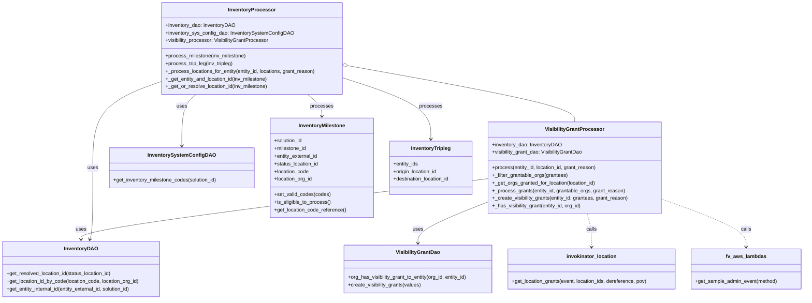
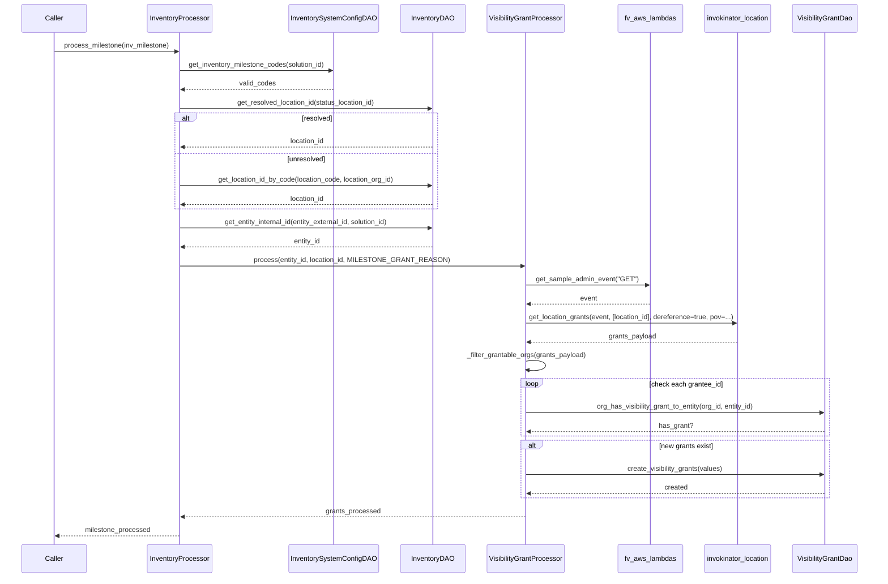
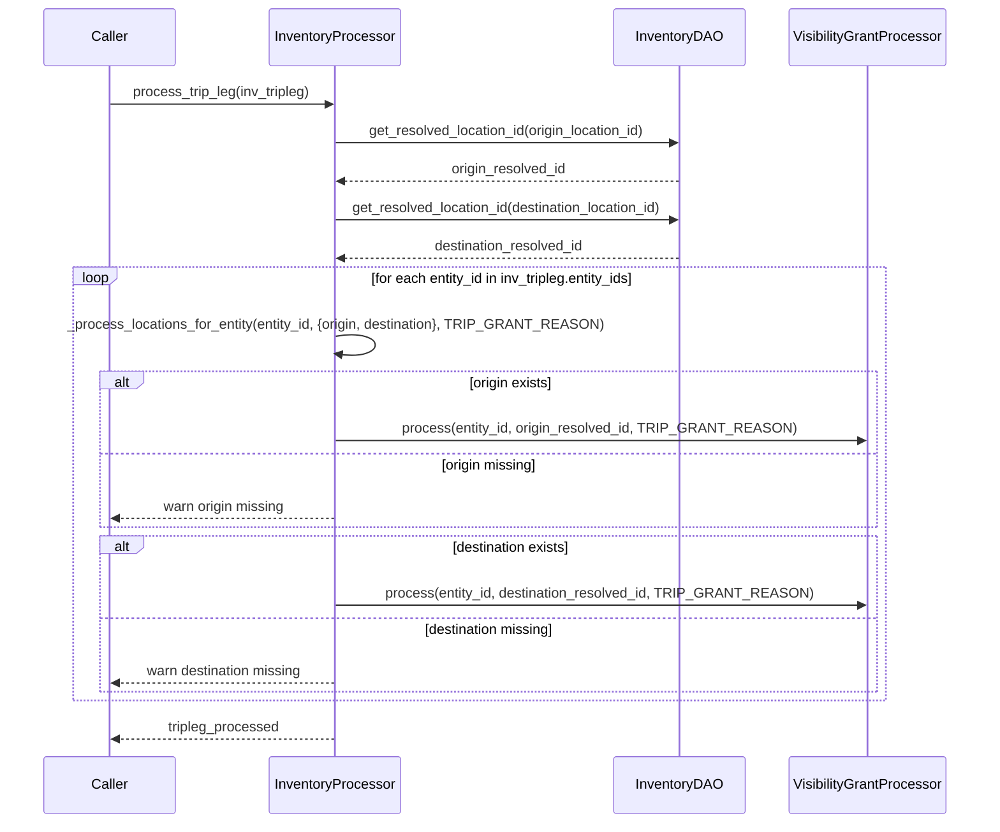

# Diagram: entity_core/entity_service/entity_inventory/entity_inventory_service/service/entity_organization_visibility/inventory_processor.py

> Auto-generated by Obscura crawlers

## Diagram 1

### SVG

<svg id="container" width="2531.59375" xmlns="http://www.w3.org/2000/svg" class="classDiagram" height="938" viewBox="0 0 2531.59375 938" role="graphics-document document" aria-roledescription="class"><g><defs><marker id="container_class-aggregationStart" class="marker aggregation class" refX="18" refY="7" markerWidth="190" markerHeight="240" orient="auto"><path d="M 18,7 L9,13 L1,7 L9,1 Z"></path></marker></defs><defs><marker id="container_class-aggregationEnd" class="marker aggregation class" refX="1" refY="7" markerWidth="20" markerHeight="28" orient="auto"><path d="M 18,7 L9,13 L1,7 L9,1 Z"></path></marker></defs><defs><marker id="container_class-extensionStart" class="marker extension class" refX="18" refY="7" markerWidth="190" markerHeight="240" orient="auto"><path d="M 1,7 L18,13 V 1 Z"></path></marker></defs><defs><marker id="container_class-extensionEnd" class="marker extension class" refX="1" refY="7" markerWidth="20" markerHeight="28" orient="auto"><path d="M 1,1 V 13 L18,7 Z"></path></marker></defs><defs><marker id="container_class-compositionStart" class="marker composition class" refX="18" refY="7" markerWidth="190" markerHeight="240" orient="auto"><path d="M 18,7 L9,13 L1,7 L9,1 Z"></path></marker></defs><defs><marker id="container_class-compositionEnd" class="marker composition class" refX="1" refY="7" markerWidth="20" markerHeight="28" orient="auto"><path d="M 18,7 L9,13 L1,7 L9,1 Z"></path></marker></defs><defs><marker id="container_class-dependencyStart" class="marker dependency class" refX="6" refY="7" markerWidth="190" markerHeight="240" orient="auto"><path d="M 5,7 L9,13 L1,7 L9,1 Z"></path></marker></defs><defs><marker id="container_class-dependencyEnd" class="marker dependency class" refX="13" refY="7" markerWidth="20" markerHeight="28" orient="auto"><path d="M 18,7 L9,13 L14,7 L9,1 Z"></path></marker></defs><defs><marker id="container_class-lollipopStart" class="marker lollipop class" refX="13" refY="7" markerWidth="190" markerHeight="240" orient="auto"><circle stroke="black" fill="transparent" cx="7" cy="7" r="6"></circle></marker></defs><defs><marker id="container_class-lollipopEnd" class="marker lollipop class" refX="1" refY="7" markerWidth="190" markerHeight="240" orient="auto"><circle stroke="black" fill="transparent" cx="7" cy="7" r="6"></circle></marker></defs><g class="root"><g class="clusters"></g><g class="edgePaths"><path d="M1095.18,205.903L1213.646,227.086C1332.112,248.269,1569.044,290.634,1687.51,319.984C1805.977,349.333,1805.977,365.667,1805.977,373.833L1805.977,382" id="id_InventoryProcessor_VisibilityGrantProcessor_1" class="edge-thickness-normal edge-pattern-solid relation" style=";;;" data-edge="true" data-et="edge" data-id="id_InventoryProcessor_VisibilityGrantProcessor_1" data-points="W3sieCI6MTA3OC4xOTkyMTg3NSwieSI6MjAyLjg2NjkzOTEwOTQyODU5fSx7IngiOjE4MDUuOTc2NTYyNSwieSI6MzMzfSx7IngiOjE4MDUuOTc2NTYyNSwieSI6MzgyfV0=" marker-start="url(#container_class-aggregationStart)"></path><path d="M1535.297,559.707L1322.102,586.256C1108.906,612.805,682.516,665.902,469.32,697.618C256.125,729.333,256.125,739.667,256.125,744.833L256.125,750" id="id_VisibilityGrantProcessor_InventoryDAO_2" class="edge-thickness-normal edge-pattern-solid relation" style=";;;" data-edge="true" data-et="edge" data-id="id_VisibilityGrantProcessor_InventoryDAO_2" data-points="W3sieCI6MTUzNS4yOTY4NzUsInkiOjU1OS43MDcyMTQ5MDQ2NTMxfSx7IngiOjI1Ni4xMjUsInkiOjcxOX0seyJ4IjoyNTYuMTI1LCJ5Ijo3NTZ9XQ==" marker-end="url(#container_class-dependencyEnd)"></path><path d="M1535.297,632.637L1498.76,647.031C1462.224,661.425,1389.151,690.212,1352.615,711.773C1316.078,733.333,1316.078,747.667,1316.078,754.833L1316.078,762" id="id_VisibilityGrantProcessor_VisibilityGrantDao_3" class="edge-thickness-normal edge-pattern-solid relation" style=";;;" data-edge="true" data-et="edge" data-id="id_VisibilityGrantProcessor_VisibilityGrantDao_3" data-points="W3sieCI6MTUzNS4yOTY4NzUsInkiOjYzMi42MzY3NTUwNjcyMTczfSx7IngiOjEzMTYuMDc4MTI1LCJ5Ijo3MTl9LHsieCI6MTMxNi4wNzgxMjUsInkiOjc2OH1d" marker-end="url(#container_class-dependencyEnd)"></path><path d="M509.246,254.753L473.141,267.794C437.036,280.836,364.827,306.918,328.722,352.126C292.617,397.333,292.617,461.667,292.617,526C292.617,590.333,292.617,654.667,291.085,692.041C289.552,729.415,286.487,739.829,284.955,745.037L283.422,750.244" id="id_InventoryProcessor_InventoryDAO_4" class="edge-thickness-normal edge-pattern-solid relation" style=";;;" data-edge="true" data-et="edge" data-id="id_InventoryProcessor_InventoryDAO_4" data-points="W3sieCI6NTA5LjI0NjA5Mzc1LCJ5IjoyNTQuNzUzMzM0NDI0NjcwNDd9LHsieCI6MjkyLjYxNzE4NzUsInkiOjMzM30seyJ4IjoyOTIuNjE3MTg3NSwieSI6NTI2fSx7IngiOjI5Mi42MTcxODc1LCJ5Ijo3MTl9LHsieCI6MjgxLjcyODM4OTYxNjkzNTUsInkiOjc1Nn1d" marker-end="url(#container_class-dependencyEnd)"></path><path d="M616.523,296L608.934,302.167C601.346,308.333,586.169,320.667,578.581,347.5C570.992,374.333,570.992,415.667,570.992,436.333L570.992,457" id="id_InventoryProcessor_InventorySystemConfigDAO_5" class="edge-thickness-normal edge-pattern-solid relation" style=";;;" data-edge="true" data-et="edge" data-id="id_InventoryProcessor_InventorySystemConfigDAO_5" data-points="W3sieCI6NjE2LjUyMjcyNTMxMDc3MzUsInkiOjI5Nn0seyJ4Ijo1NzAuOTkyMTg3NSwieSI6MzMzfSx7IngiOjU3MC45OTIxODc1LCJ5Ijo0NjN9XQ==" marker-end="url(#container_class-dependencyEnd)"></path><path d="M1850.335,670L1852.851,678.167C1855.367,686.333,1860.398,702.667,1862.914,720C1865.43,737.333,1865.43,755.667,1865.43,764.833L1865.43,774" id="id_VisibilityGrantProcessor_invokinator_location_6" class="edge-thickness-normal edge-pattern-dashed relation" style=";;;" data-edge="true" data-et="edge" data-id="id_VisibilityGrantProcessor_invokinator_location_6" data-points="W3sieCI6MTg1MC4zMzUzNzA3OTAxNTU0LCJ5Ijo2NzB9LHsieCI6MTg2NS40Mjk2ODc1LCJ5Ijo3MTl9LHsieCI6MTg2NS40Mjk2ODc1LCJ5Ijo3ODB9XQ==" marker-end="url(#container_class-dependencyEnd)"></path><path d="M2076.656,621.769L2122.458,637.974C2168.26,654.179,2259.865,686.59,2305.667,711.961C2351.469,737.333,2351.469,755.667,2351.469,764.833L2351.469,774" id="id_VisibilityGrantProcessor_fv_aws_lambdas_7" class="edge-thickness-normal edge-pattern-dashed relation" style=";;;" data-edge="true" data-et="edge" data-id="id_VisibilityGrantProcessor_fv_aws_lambdas_7" data-points="W3sieCI6MjA3Ni42NTYyNSwieSI6NjIxLjc2ODg4NzA0Mjk1MTV9LHsieCI6MjM1MS40Njg3NSwieSI6NzE5fSx7IngiOjIzNTEuNDY4NzUsInkiOjc4MH1d" marker-end="url(#container_class-dependencyEnd)"></path><path d="M964.95,296L972.282,302.167C979.615,308.333,994.28,320.667,1001.613,332C1008.945,343.333,1008.945,353.667,1008.945,358.833L1008.945,364" id="id_InventoryProcessor_InventoryMilestone_8" class="edge-thickness-normal edge-pattern-solid relation" style=";;;" data-edge="true" data-et="edge" data-id="id_InventoryProcessor_InventoryMilestone_8" data-points="W3sieCI6OTY0Ljk0OTUyMDg5MDg4NCwieSI6Mjk2fSx7IngiOjEwMDguOTQ1MzEyNSwieSI6MzMzfSx7IngiOjEwMDguOTQ1MzEyNSwieSI6MzcwfV0=" marker-end="url(#container_class-dependencyEnd)"></path><path d="M1078.199,244.122L1123.942,258.935C1169.685,273.748,1261.171,303.374,1306.913,335.354C1352.656,367.333,1352.656,401.667,1352.656,418.833L1352.656,436" id="id_InventoryProcessor_InventoryTripleg_9" class="edge-thickness-normal edge-pattern-solid relation" style=";;;" data-edge="true" data-et="edge" data-id="id_InventoryProcessor_InventoryTripleg_9" data-points="W3sieCI6MTA3OC4xOTkyMTg3NSwieSI6MjQ0LjEyMjMxNzE5MTYzODY3fSx7IngiOjEzNTIuNjU2MjUsInkiOjMzM30seyJ4IjoxMzUyLjY1NjI1LCJ5Ijo0NDJ9XQ==" marker-end="url(#container_class-dependencyEnd)"></path></g><g class="edgeLabels"><g class="edgeLabel"><g class="label" data-id="id_InventoryProcessor_VisibilityGrantProcessor_1" transform="translate(0, 0)"><foreignObject width="0" height="0">

</foreignObject></g></g><g class="edgeLabel" transform="translate(256.125, 719)"><g class="label" data-id="id_VisibilityGrantProcessor_InventoryDAO_2" transform="translate(-16.4921875, -12)"><foreignObject width="32.984375" height="24">

uses

</foreignObject></g></g><g class="edgeLabel" transform="translate(1316.078125, 719)"><g class="label" data-id="id_VisibilityGrantProcessor_VisibilityGrantDao_3" transform="translate(-16.4921875, -12)"><foreignObject width="32.984375" height="24">

uses

</foreignObject></g></g><g class="edgeLabel" transform="translate(292.6171875, 526)"><g class="label" data-id="id_InventoryProcessor_InventoryDAO_4" transform="translate(-16.4921875, -12)"><foreignObject width="32.984375" height="24">

uses

</foreignObject></g></g><g class="edgeLabel" transform="translate(570.9921875, 333)"><g class="label" data-id="id_InventoryProcessor_InventorySystemConfigDAO_5" transform="translate(-16.4921875, -12)"><foreignObject width="32.984375" height="24">

uses

</foreignObject></g></g><g class="edgeLabel" transform="translate(1865.4296875, 719)"><g class="label" data-id="id_VisibilityGrantProcessor_invokinator_location_6" transform="translate(-16.4453125, -12)"><foreignObject width="32.890625" height="24">

calls

</foreignObject></g></g><g class="edgeLabel" transform="translate(2351.46875, 719)"><g class="label" data-id="id_VisibilityGrantProcessor_fv_aws_lambdas_7" transform="translate(-16.4453125, -12)"><foreignObject width="32.890625" height="24">

calls

</foreignObject></g></g><g class="edgeLabel" transform="translate(1008.9453125, 333)"><g class="label" data-id="id_InventoryProcessor_InventoryMilestone_8" transform="translate(-35.7890625, -12)"><foreignObject width="71.578125" height="24">

processes

</foreignObject></g></g><g class="edgeLabel" transform="translate(1352.65625, 333)"><g class="label" data-id="id_InventoryProcessor_InventoryTripleg_9" transform="translate(-35.7890625, -12)"><foreignObject width="71.578125" height="24">

processes

</foreignObject></g></g></g><g class="nodes"><g class="node default" id="classId-VisibilityGrantProcessor-0" transform="translate(1805.9765625, 526)"><g class="basic label-container"><path d="M-270.6796875 -144 L270.6796875 -144 L270.6796875 144 L-270.6796875 144" stroke="none" stroke-width="0" fill="#ECECFF" style=""></path><path d="M-270.6796875 -144 C-161.58221215147907 -144, -52.48473680295814 -144, 270.6796875 -144 M-270.6796875 -144 C-138.14254026418013 -144, -5.605393028360254 -144, 270.6796875 -144 M270.6796875 -144 C270.6796875 -31.42460853925394, 270.6796875 81.15078292149212, 270.6796875 144 M270.6796875 -144 C270.6796875 -70.55240967585809, 270.6796875 2.8951806482838265, 270.6796875 144 M270.6796875 144 C81.45803951018456 144, -107.76360847963088 144, -270.6796875 144 M270.6796875 144 C56.527717404749694 144, -157.6242526905006 144, -270.6796875 144 M-270.6796875 144 C-270.6796875 62.584209393636044, -270.6796875 -18.83158121272791, -270.6796875 -144 M-270.6796875 144 C-270.6796875 83.21048726213758, -270.6796875 22.420974524275152, -270.6796875 -144" stroke="#9370DB" stroke-width="1.3" fill="none" stroke-dasharray="0 0" style=""></path></g><g class="annotation-group text" transform="translate(0, -120)"></g><g class="label-group text" transform="translate(-87.890625, -120)"><g class="label" style="font-weight: bolder" transform="translate(0,-12)"><foreignObject width="175.78125" height="24">

VisibilityGrantProcessor

</foreignObject></g></g><g class="members-group text" transform="translate(-258.6796875, -72)"><g class="label" style="" transform="translate(0,-12)"><foreignObject width="218.859375" height="24">

+inventory_dao: InventoryDAO

</foreignObject></g><g class="label" style="" transform="translate(0,12)"><foreignObject width="288.390625" height="24">

+visibility_grant_dao: VisibilityGrantDao

</foreignObject></g></g><g class="methods-group text" transform="translate(-258.6796875, 0)"><g class="label" style="" transform="translate(0,-12)"><foreignObject width="330.421875" height="24">

+process(entity_id, location_id, grant_reason)

</foreignObject></g><g class="label" style="" transform="translate(0,12)"><foreignObject width="236.90625" height="24">

+_filter_grantable_orgs(grantees)

</foreignObject></g><g class="label" style="" transform="translate(0,36)"><foreignObject width="327.359375" height="24">

+_get_orgs_granted_for_location(location_id)

</foreignObject></g><g class="label" style="" transform="translate(0,60)"><foreignObject width="417.171875" height="24">

+_process_grants(entity_id, grantable_orgs, grant_reason)

</foreignObject></g><g class="label" style="" transform="translate(0,84)"><foreignObject width="429.46875" height="24">

+_create_visibility_grants(entity_id, grantees, grant_reason)

</foreignObject></g><g class="label" style="" transform="translate(0,108)"><foreignObject width="283.25" height="24">

+_has_visibility_grant(entity_id, org_id)

</foreignObject></g></g><g class="divider" style=""><path d="M-270.6796875 -96 C-67.98931617647688 -96, 134.70105514704625 -96, 270.6796875 -96 M-270.6796875 -96 C-99.66709076375096 -96, 71.34550597249807 -96, 270.6796875 -96" stroke="#9370DB" stroke-width="1.3" fill="none" stroke-dasharray="0 0" style=""></path></g><g class="divider" style=""><path d="M-270.6796875 -24 C-73.70549370615839 -24, 123.26870008768321 -24, 270.6796875 -24 M-270.6796875 -24 C-70.2427733858301 -24, 130.1941407283398 -24, 270.6796875 -24" stroke="#9370DB" stroke-width="1.3" fill="none" stroke-dasharray="0 0" style=""></path></g></g><g class="node default" id="classId-InventoryProcessor-1" transform="translate(793.72265625, 152)"><g class="basic label-container"><path d="M-284.4765625 -144 L284.4765625 -144 L284.4765625 144 L-284.4765625 144" stroke="none" stroke-width="0" fill="#ECECFF" style=""></path><path d="M-284.4765625 -144 C-164.8430443249124 -144, -45.209526149824825 -144, 284.4765625 -144 M-284.4765625 -144 C-155.4530446606401 -144, -26.429526821280206 -144, 284.4765625 -144 M284.4765625 -144 C284.4765625 -58.647728152551494, 284.4765625 26.704543694897012, 284.4765625 144 M284.4765625 -144 C284.4765625 -39.72480399663887, 284.4765625 64.55039200672226, 284.4765625 144 M284.4765625 144 C64.32093892379191 144, -155.83468465241617 144, -284.4765625 144 M284.4765625 144 C71.13046699337087 144, -142.21562851325825 144, -284.4765625 144 M-284.4765625 144 C-284.4765625 34.77283945492388, -284.4765625 -74.45432109015223, -284.4765625 -144 M-284.4765625 144 C-284.4765625 69.12463105661095, -284.4765625 -5.750737886778097, -284.4765625 -144" stroke="#9370DB" stroke-width="1.3" fill="none" stroke-dasharray="0 0" style=""></path></g><g class="annotation-group text" transform="translate(0, -120)"></g><g class="label-group text" transform="translate(-70.875, -120)"><g class="label" style="font-weight: bolder" transform="translate(0,-12)"><foreignObject width="141.75" height="24">

InventoryProcessor

</foreignObject></g></g><g class="members-group text" transform="translate(-272.4765625, -72)"><g class="label" style="" transform="translate(0,-12)"><foreignObject width="218.859375" height="24">

+inventory_dao: InventoryDAO

</foreignObject></g><g class="label" style="" transform="translate(0,12)"><foreignObject width="397.5625" height="24">

+inventory_sys_config_dao: InventorySystemConfigDAO

</foreignObject></g><g class="label" style="" transform="translate(0,36)"><foreignObject width="328.078125" height="24">

+visibility_processor: VisibilityGrantProcessor

</foreignObject></g></g><g class="methods-group text" transform="translate(-272.4765625, 24)"><g class="label" style="" transform="translate(0,-12)"><foreignObject width="255.21875" height="24">

+process_milestone(inv_milestone)

</foreignObject></g><g class="label" style="" transform="translate(0,12)"><foreignObject width="213.65625" height="24">

+process_trip_leg(inv_tripleg)

</foreignObject></g><g class="label" style="" transform="translate(0,36)"><foreignObject width="474.078125" height="24">

+_process_locations_for_entity(entity_id, locations, grant_reason)

</foreignObject></g><g class="label" style="" transform="translate(0,60)"><foreignObject width="324.421875" height="24">

+_get_entity_and_location_id(inv_milestone)

</foreignObject></g><g class="label" style="" transform="translate(0,84)"><foreignObject width="321.828125" height="24">

+_get_or_resolve_location_id(inv_milestone)

</foreignObject></g></g><g class="divider" style=""><path d="M-284.4765625 -96 C-74.44473043392182 -96, 135.58710163215636 -96, 284.4765625 -96 M-284.4765625 -96 C-137.0651223310764 -96, 10.34631783784721 -96, 284.4765625 -96" stroke="#9370DB" stroke-width="1.3" fill="none" stroke-dasharray="0 0" style=""></path></g><g class="divider" style=""><path d="M-284.4765625 0 C-113.4277422676233 0, 57.6210779647534 0, 284.4765625 0 M-284.4765625 0 C-74.5729419668985 0, 135.330678566203 0, 284.4765625 0" stroke="#9370DB" stroke-width="1.3" fill="none" stroke-dasharray="0 0" style=""></path></g></g><g class="node default" id="classId-InventoryDAO-2" transform="translate(256.125, 843)"><g class="basic label-container"><path d="M-248.125 -87 L248.125 -87 L248.125 87 L-248.125 87" stroke="none" stroke-width="0" fill="#ECECFF" style=""></path><path d="M-248.125 -87 C-97.44862211632986 -87, 53.227755767340284 -87, 248.125 -87 M-248.125 -87 C-64.0776077115271 -87, 119.96978457694581 -87, 248.125 -87 M248.125 -87 C248.125 -40.954706457281354, 248.125 5.090587085437292, 248.125 87 M248.125 -87 C248.125 -46.852936609449294, 248.125 -6.705873218898589, 248.125 87 M248.125 87 C126.36809365925359 87, 4.611187318507177 87, -248.125 87 M248.125 87 C104.23745264155383 87, -39.65009471689234 87, -248.125 87 M-248.125 87 C-248.125 51.12632754329212, -248.125 15.252655086584241, -248.125 -87 M-248.125 87 C-248.125 38.34137446511901, -248.125 -10.31725106976198, -248.125 -87" stroke="#9370DB" stroke-width="1.3" fill="none" stroke-dasharray="0 0" style=""></path></g><g class="annotation-group text" transform="translate(0, -63)"></g><g class="label-group text" transform="translate(-50.25, -63)"><g class="label" style="font-weight: bolder" transform="translate(0,-12)"><foreignObject width="100.5" height="24">

InventoryDAO

</foreignObject></g></g><g class="members-group text" transform="translate(-236.125, -15)"></g><g class="methods-group text" transform="translate(-236.125, 15)"><g class="label" style="" transform="translate(0,-12)"><foreignObject width="334.59375" height="24">

+get_resolved_location_id(status_location_id)

</foreignObject></g><g class="label" style="" transform="translate(0,12)"><foreignObject width="422" height="24">

+get_location_id_by_code(location_code, location_org_id)

</foreignObject></g><g class="label" style="" transform="translate(0,36)"><foreignObject width="399.59375" height="24">

+get_entity_internal_id(entity_external_id, solution_id)

</foreignObject></g></g><g class="divider" style=""><path d="M-248.125 -39 C-134.36317497040932 -39, -20.601349940818636 -39, 248.125 -39 M-248.125 -39 C-116.6351977928432 -39, 14.854604414313599 -39, 248.125 -39" stroke="#9370DB" stroke-width="1.3" fill="none" stroke-dasharray="0 0" style=""></path></g><g class="divider" style=""><path d="M-248.125 -15 C-64.67437019991596 -15, 118.77625960016809 -15, 248.125 -15 M-248.125 -15 C-69.64148777532691 -15, 108.84202444934618 -15, 248.125 -15" stroke="#9370DB" stroke-width="1.3" fill="none" stroke-dasharray="0 0" style=""></path></g></g><g class="node default" id="classId-InventorySystemConfigDAO-3" transform="translate(570.9921875, 526)"><g class="basic label-container"><path d="M-226.8828125 -63 L226.8828125 -63 L226.8828125 63 L-226.8828125 63" stroke="none" stroke-width="0" fill="#ECECFF" style=""></path><path d="M-226.8828125 -63 C-101.93908600343296 -63, 23.004640493134076 -63, 226.8828125 -63 M-226.8828125 -63 C-127.7260272966823 -63, -28.569242093364608 -63, 226.8828125 -63 M226.8828125 -63 C226.8828125 -35.10287436221762, 226.8828125 -7.205748724435239, 226.8828125 63 M226.8828125 -63 C226.8828125 -35.34167374030082, 226.8828125 -7.68334748060164, 226.8828125 63 M226.8828125 63 C126.16866431834828 63, 25.454516136696554 63, -226.8828125 63 M226.8828125 63 C106.27170444361481 63, -14.339403612770383 63, -226.8828125 63 M-226.8828125 63 C-226.8828125 32.906395511291265, -226.8828125 2.8127910225825303, -226.8828125 -63 M-226.8828125 63 C-226.8828125 15.233032516428075, -226.8828125 -32.53393496714385, -226.8828125 -63" stroke="#9370DB" stroke-width="1.3" fill="none" stroke-dasharray="0 0" style=""></path></g><g class="annotation-group text" transform="translate(0, -39)"></g><g class="label-group text" transform="translate(-99.734375, -39)"><g class="label" style="font-weight: bolder" transform="translate(0,-12)"><foreignObject width="199.46875" height="24">

InventorySystemConfigDAO

</foreignObject></g></g><g class="members-group text" transform="translate(-214.8828125, 9)"></g><g class="methods-group text" transform="translate(-214.8828125, 39)"><g class="label" style="" transform="translate(0,-12)"><foreignObject width="330.03125" height="24">

+get_inventory_milestone_codes(solution_id)

</foreignObject></g></g><g class="divider" style=""><path d="M-226.8828125 -15 C-89.08370917965681 -15, 48.715394140686385 -15, 226.8828125 -15 M-226.8828125 -15 C-64.05210886622791 -15, 98.77859476754418 -15, 226.8828125 -15" stroke="#9370DB" stroke-width="1.3" fill="none" stroke-dasharray="0 0" style=""></path></g><g class="divider" style=""><path d="M-226.8828125 9 C-135.58391955212295 9, -44.2850266042459 9, 226.8828125 9 M-226.8828125 9 C-45.44206931341816 9, 135.99867387316368 9, 226.8828125 9" stroke="#9370DB" stroke-width="1.3" fill="none" stroke-dasharray="0 0" style=""></path></g></g><g class="node default" id="classId-VisibilityGrantDao-4" transform="translate(1316.078125, 843)"><g class="basic label-container"><path d="M-235.4375 -75 L235.4375 -75 L235.4375 75 L-235.4375 75" stroke="none" stroke-width="0" fill="#ECECFF" style=""></path><path d="M-235.4375 -75 C-108.19054071525589 -75, 19.056418569488216 -75, 235.4375 -75 M-235.4375 -75 C-52.70192050330331 -75, 130.03365899339337 -75, 235.4375 -75 M235.4375 -75 C235.4375 -25.3760433580862, 235.4375 24.2479132838276, 235.4375 75 M235.4375 -75 C235.4375 -32.02937191936312, 235.4375 10.941256161273756, 235.4375 75 M235.4375 75 C78.28027405517167 75, -78.87695188965665 75, -235.4375 75 M235.4375 75 C92.75990572166089 75, -49.91768855667823 75, -235.4375 75 M-235.4375 75 C-235.4375 19.37864894494868, -235.4375 -36.24270211010264, -235.4375 -75 M-235.4375 75 C-235.4375 18.558919503774746, -235.4375 -37.88216099245051, -235.4375 -75" stroke="#9370DB" stroke-width="1.3" fill="none" stroke-dasharray="0 0" style=""></path></g><g class="annotation-group text" transform="translate(0, -51)"></g><g class="label-group text" transform="translate(-66.15625, -51)"><g class="label" style="font-weight: bolder" transform="translate(0,-12)"><foreignObject width="132.3125" height="24">

VisibilityGrantDao

</foreignObject></g></g><g class="members-group text" transform="translate(-223.4375, -3)"></g><g class="methods-group text" transform="translate(-223.4375, 27)"><g class="label" style="" transform="translate(0,-12)"><foreignObject width="380.71875" height="24">

+org_has_visibility_grant_to_entity(org_id, entity_id)

</foreignObject></g><g class="label" style="" transform="translate(0,12)"><foreignObject width="231.5" height="24">

+create_visibility_grants(values)

</foreignObject></g></g><g class="divider" style=""><path d="M-235.4375 -27 C-71.40140141982553 -27, 92.63469716034894 -27, 235.4375 -27 M-235.4375 -27 C-134.35898541435824 -27, -33.28047082871646 -27, 235.4375 -27" stroke="#9370DB" stroke-width="1.3" fill="none" stroke-dasharray="0 0" style=""></path></g><g class="divider" style=""><path d="M-235.4375 -3 C-91.92334197642265 -3, 51.5908160471547 -3, 235.4375 -3 M-235.4375 -3 C-108.01141216222454 -3, 19.41467567555091 -3, 235.4375 -3" stroke="#9370DB" stroke-width="1.3" fill="none" stroke-dasharray="0 0" style=""></path></g></g><g class="node default" id="classId-InventoryMilestone-5" transform="translate(1008.9453125, 526)"><g class="basic label-container"><path d="M-161.0703125 -156 L161.0703125 -156 L161.0703125 156 L-161.0703125 156" stroke="none" stroke-width="0" fill="#ECECFF" style=""></path><path d="M-161.0703125 -156 C-71.70773208614534 -156, 17.654848327709317 -156, 161.0703125 -156 M-161.0703125 -156 C-94.1399304955992 -156, -27.209548491198404 -156, 161.0703125 -156 M161.0703125 -156 C161.0703125 -44.62581913473433, 161.0703125 66.74836173053134, 161.0703125 156 M161.0703125 -156 C161.0703125 -87.80400033883255, 161.0703125 -19.608000677665103, 161.0703125 156 M161.0703125 156 C32.27930972173641 156, -96.51169305652718 156, -161.0703125 156 M161.0703125 156 C49.389302614879185 156, -62.29170727024163 156, -161.0703125 156 M-161.0703125 156 C-161.0703125 73.05745957546729, -161.0703125 -9.885080849065417, -161.0703125 -156 M-161.0703125 156 C-161.0703125 45.90806116965794, -161.0703125 -64.18387766068412, -161.0703125 -156" stroke="#9370DB" stroke-width="1.3" fill="none" stroke-dasharray="0 0" style=""></path></g><g class="annotation-group text" transform="translate(0, -132)"></g><g class="label-group text" transform="translate(-70.765625, -132)"><g class="label" style="font-weight: bolder" transform="translate(0,-12)"><foreignObject width="141.53125" height="24">

InventoryMilestone

</foreignObject></g></g><g class="members-group text" transform="translate(-149.0703125, -84)"><g class="label" style="" transform="translate(0,-12)"><foreignObject width="90.21875" height="24">

+solution_id

</foreignObject></g><g class="label" style="" transform="translate(0,12)"><foreignObject width="102.078125" height="24">

+milestone_id

</foreignObject></g><g class="label" style="" transform="translate(0,36)"><foreignObject width="139.234375" height="24">

+entity_external_id

</foreignObject></g><g class="label" style="" transform="translate(0,60)"><foreignObject width="141.78125" height="24">

+status_location_id

</foreignObject></g><g class="label" style="" transform="translate(0,84)"><foreignObject width="110.109375" height="24">

+location_code

</foreignObject></g><g class="label" style="" transform="translate(0,108)"><foreignObject width="121.203125" height="24">

+location_org_id

</foreignObject></g></g><g class="methods-group text" transform="translate(-149.0703125, 84)"><g class="label" style="" transform="translate(0,-12)"><foreignObject width="175.953125" height="24">

+set_valid_codes(codes)

</foreignObject></g><g class="label" style="" transform="translate(0,12)"><foreignObject width="177.546875" height="24">

+is_eligible_to_process()

</foreignObject></g><g class="label" style="" transform="translate(0,36)"><foreignObject width="227.375" height="24">

+get_location_code_reference()

</foreignObject></g></g><g class="divider" style=""><path d="M-161.0703125 -108 C-75.75803501732838 -108, 9.554242465343236 -108, 161.0703125 -108 M-161.0703125 -108 C-60.83494451246398 -108, 39.400423475072046 -108, 161.0703125 -108" stroke="#9370DB" stroke-width="1.3" fill="none" stroke-dasharray="0 0" style=""></path></g><g class="divider" style=""><path d="M-161.0703125 60 C-84.28105746010257 60, -7.491802420205147 60, 161.0703125 60 M-161.0703125 60 C-78.53243391714969 60, 4.005444665700622 60, 161.0703125 60" stroke="#9370DB" stroke-width="1.3" fill="none" stroke-dasharray="0 0" style=""></path></g></g><g class="node default" id="classId-InventoryTripleg-6" transform="translate(1352.65625, 526)"><g class="basic label-container"><path d="M-132.640625 -84 L132.640625 -84 L132.640625 84 L-132.640625 84" stroke="none" stroke-width="0" fill="#ECECFF" style=""></path><path d="M-132.640625 -84 C-53.8975653267577 -84, 24.8454943464846 -84, 132.640625 -84 M-132.640625 -84 C-52.91950771999551 -84, 26.801609560008984 -84, 132.640625 -84 M132.640625 -84 C132.640625 -27.013466577714887, 132.640625 29.973066844570226, 132.640625 84 M132.640625 -84 C132.640625 -31.91639554822114, 132.640625 20.16720890355772, 132.640625 84 M132.640625 84 C68.57248931735357 84, 4.504353634707144 84, -132.640625 84 M132.640625 84 C56.16943020318671 84, -20.301764593626586 84, -132.640625 84 M-132.640625 84 C-132.640625 21.985846238190533, -132.640625 -40.028307523618935, -132.640625 -84 M-132.640625 84 C-132.640625 46.26822985810229, -132.640625 8.536459716204575, -132.640625 -84" stroke="#9370DB" stroke-width="1.3" fill="none" stroke-dasharray="0 0" style=""></path></g><g class="annotation-group text" transform="translate(0, -60)"></g><g class="label-group text" transform="translate(-60.4375, -60)"><g class="label" style="font-weight: bolder" transform="translate(0,-12)"><foreignObject width="120.875" height="24">

InventoryTripleg

</foreignObject></g></g><g class="members-group text" transform="translate(-120.640625, -12)"><g class="label" style="" transform="translate(0,-12)"><foreignObject width="79.34375" height="24">

+entity_ids

</foreignObject></g><g class="label" style="" transform="translate(0,12)"><foreignObject width="139.9375" height="24">

+origin_location_id

</foreignObject></g><g class="label" style="" transform="translate(0,36)"><foreignObject width="180.84375" height="24">

+destination_location_id

</foreignObject></g></g><g class="methods-group text" transform="translate(-120.640625, 84)"></g><g class="divider" style=""><path d="M-132.640625 -36 C-42.29517043534082 -36, 48.05028412931836 -36, 132.640625 -36 M-132.640625 -36 C-28.987500648469663 -36, 74.66562370306067 -36, 132.640625 -36" stroke="#9370DB" stroke-width="1.3" fill="none" stroke-dasharray="0 0" style=""></path></g><g class="divider" style=""><path d="M-132.640625 60 C-40.33196276387967 60, 51.976699472240654 60, 132.640625 60 M-132.640625 60 C-68.94490564973562 60, -5.2491862994712335 60, 132.640625 60" stroke="#9370DB" stroke-width="1.3" fill="none" stroke-dasharray="0 0" style=""></path></g></g><g class="node default" id="classId-invokinator_location-7" transform="translate(1865.4296875, 843)"><g class="basic label-container"><path d="M-263.9140625 -63 L263.9140625 -63 L263.9140625 63 L-263.9140625 63" stroke="none" stroke-width="0" fill="#ECECFF" style=""></path><path d="M-263.9140625 -63 C-116.94129621649392 -63, 30.03147006701215 -63, 263.9140625 -63 M-263.9140625 -63 C-106.59610916704665 -63, 50.7218441659067 -63, 263.9140625 -63 M263.9140625 -63 C263.9140625 -27.300842151993358, 263.9140625 8.398315696013285, 263.9140625 63 M263.9140625 -63 C263.9140625 -17.60943849345955, 263.9140625 27.7811230130809, 263.9140625 63 M263.9140625 63 C135.50417332252513 63, 7.094284145050267 63, -263.9140625 63 M263.9140625 63 C81.56578017098022 63, -100.78250215803956 63, -263.9140625 63 M-263.9140625 63 C-263.9140625 13.79524120616729, -263.9140625 -35.40951758766542, -263.9140625 -63 M-263.9140625 63 C-263.9140625 25.356038836466013, -263.9140625 -12.287922327067974, -263.9140625 -63" stroke="#9370DB" stroke-width="1.3" fill="none" stroke-dasharray="0 0" style=""></path></g><g class="annotation-group text" transform="translate(0, -39)"></g><g class="label-group text" transform="translate(-75.25, -39)"><g class="label" style="font-weight: bolder" transform="translate(0,-12)"><foreignObject width="150.5" height="24">

invokinator_location

</foreignObject></g></g><g class="members-group text" transform="translate(-251.9140625, 9)"></g><g class="methods-group text" transform="translate(-251.9140625, 39)"><g class="label" style="" transform="translate(0,-12)"><foreignObject width="428.578125" height="24">

+get_location_grants(event, location_ids, dereference, pov)

</foreignObject></g></g><g class="divider" style=""><path d="M-263.9140625 -15 C-110.63621194606475 -15, 42.641638607870505 -15, 263.9140625 -15 M-263.9140625 -15 C-122.08603117071283 -15, 19.742000158574342 -15, 263.9140625 -15" stroke="#9370DB" stroke-width="1.3" fill="none" stroke-dasharray="0 0" style=""></path></g><g class="divider" style=""><path d="M-263.9140625 9 C-107.67441462346352 9, 48.56523325307296 9, 263.9140625 9 M-263.9140625 9 C-145.31358614479956 9, -26.713109789599088 9, 263.9140625 9" stroke="#9370DB" stroke-width="1.3" fill="none" stroke-dasharray="0 0" style=""></path></g></g><g class="node default" id="classId-fv_aws_lambdas-8" transform="translate(2351.46875, 843)"><g class="basic label-container"><path d="M-172.125 -63 L172.125 -63 L172.125 63 L-172.125 63" stroke="none" stroke-width="0" fill="#ECECFF" style=""></path><path d="M-172.125 -63 C-100.65626288584436 -63, -29.187525771688712 -63, 172.125 -63 M-172.125 -63 C-93.37741108175855 -63, -14.629822163517105 -63, 172.125 -63 M172.125 -63 C172.125 -32.54939525423292, 172.125 -2.0987905084658323, 172.125 63 M172.125 -63 C172.125 -19.054513399066174, 172.125 24.890973201867652, 172.125 63 M172.125 63 C85.21761057573356 63, -1.6897788485328817 63, -172.125 63 M172.125 63 C77.58577336818588 63, -16.953453263628234 63, -172.125 63 M-172.125 63 C-172.125 34.33395023482091, -172.125 5.667900469641822, -172.125 -63 M-172.125 63 C-172.125 32.04580844327337, -172.125 1.0916168865467455, -172.125 -63" stroke="#9370DB" stroke-width="1.3" fill="none" stroke-dasharray="0 0" style=""></path></g><g class="annotation-group text" transform="translate(0, -39)"></g><g class="label-group text" transform="translate(-60.0625, -39)"><g class="label" style="font-weight: bolder" transform="translate(0,-12)"><foreignObject width="120.125" height="24">

fv_aws_lambdas

</foreignObject></g></g><g class="members-group text" transform="translate(-160.125, 9)"></g><g class="methods-group text" transform="translate(-160.125, 39)"><g class="label" style="" transform="translate(0,-12)"><foreignObject width="260.1875" height="24">

+get_sample_admin_event(method)

</foreignObject></g></g><g class="divider" style=""><path d="M-172.125 -15 C-90.13964382112187 -15, -8.15428764224373 -15, 172.125 -15 M-172.125 -15 C-64.5685786329531 -15, 42.98784273409379 -15, 172.125 -15" stroke="#9370DB" stroke-width="1.3" fill="none" stroke-dasharray="0 0" style=""></path></g><g class="divider" style=""><path d="M-172.125 9 C-42.983563105185965 9, 86.15787378962807 9, 172.125 9 M-172.125 9 C-98.16825503898141 9, -24.211510077962828 9, 172.125 9" stroke="#9370DB" stroke-width="1.3" fill="none" stroke-dasharray="0 0" style=""></path></g></g></g></g></g></svg>

## Diagram 2

### SVG

<svg id="container" width="2138.5" xmlns="http://www.w3.org/2000/svg" height="1419" viewBox="-50 -10 2138.5 1419" role="graphics-document document" aria-roledescription="sequence"><g><rect x="1888.5" y="1333" fill="#eaeaea" stroke="#666" width="150" height="65" name="VG" rx="3" ry="3" class="actor actor-bottom"></rect><text x="1963.5" y="1365.5" dominant-baseline="central" alignment-baseline="central" class="actor actor-box" style="text-anchor: middle; font-size: 16px; font-weight: 400;"><tspan x="1963.5" dy="0">VisibilityGrantDao</tspan></text></g><g><rect x="1669.5" y="1333" fill="#eaeaea" stroke="#666" width="169" height="65" name="INV" rx="3" ry="3" class="actor actor-bottom"></rect><text x="1754" y="1365.5" dominant-baseline="central" alignment-baseline="central" class="actor actor-box" style="text-anchor: middle; font-size: 16px; font-weight: 400;"><tspan x="1754" dy="0">invokinator_location</tspan></text></g><g><rect x="1469.5" y="1333" fill="#eaeaea" stroke="#666" width="150" height="65" name="VL" rx="3" ry="3" class="actor actor-bottom"></rect><text x="1544.5" y="1365.5" dominant-baseline="central" alignment-baseline="central" class="actor actor-box" style="text-anchor: middle; font-size: 16px; font-weight: 400;"><tspan x="1544.5" dy="0">fv_aws_lambdas</tspan></text></g><g><rect x="1142" y="1333" fill="#eaeaea" stroke="#666" width="193" height="65" name="VP" rx="3" ry="3" class="actor actor-bottom"></rect><text x="1238.5" y="1365.5" dominant-baseline="central" alignment-baseline="central" class="actor actor-box" style="text-anchor: middle; font-size: 16px; font-weight: 400;"><tspan x="1238.5" dy="0">VisibilityGrantProcessor</tspan></text></g><g><rect x="942" y="1333" fill="#eaeaea" stroke="#666" width="150" height="65" name="ID" rx="3" ry="3" class="actor actor-bottom"></rect><text x="1017" y="1365.5" dominant-baseline="central" alignment-baseline="central" class="actor actor-box" style="text-anchor: middle; font-size: 16px; font-weight: 400;"><tspan x="1017" dy="0">InventoryDAO</tspan></text></g><g><rect x="676" y="1333" fill="#eaeaea" stroke="#666" width="216" height="65" name="IS" rx="3" ry="3" class="actor actor-bottom"></rect><text x="784" y="1365.5" dominant-baseline="central" alignment-baseline="central" class="actor actor-box" style="text-anchor: middle; font-size: 16px; font-weight: 400;"><tspan x="784" dy="0">InventorySystemConfigDAO</tspan></text></g><g><rect x="312" y="1333" fill="#eaeaea" stroke="#666" width="160" height="65" name="IP" rx="3" ry="3" class="actor actor-bottom"></rect><text x="392" y="1365.5" dominant-baseline="central" alignment-baseline="central" class="actor actor-box" style="text-anchor: middle; font-size: 16px; font-weight: 400;"><tspan x="392" dy="0">InventoryProcessor</tspan></text></g><g><rect x="0" y="1333" fill="#eaeaea" stroke="#666" width="150" height="65" name="Caller" rx="3" ry="3" class="actor actor-bottom"></rect><text x="75" y="1365.5" dominant-baseline="central" alignment-baseline="central" class="actor actor-box" style="text-anchor: middle; font-size: 16px; font-weight: 400;"><tspan x="75" dy="0">Caller</tspan></text></g><g><line id="actor7" x1="1963.5" y1="65" x2="1963.5" y2="1333" class="actor-line 200" stroke-width="0.5px" stroke="#999" name="VG"></line><g id="root-7"><rect x="1888.5" y="0" fill="#eaeaea" stroke="#666" width="150" height="65" name="VG" rx="3" ry="3" class="actor actor-top"></rect><text x="1963.5" y="32.5" dominant-baseline="central" alignment-baseline="central" class="actor actor-box" style="text-anchor: middle; font-size: 16px; font-weight: 400;"><tspan x="1963.5" dy="0">VisibilityGrantDao</tspan></text></g></g><g><line id="actor6" x1="1754" y1="65" x2="1754" y2="1333" class="actor-line 200" stroke-width="0.5px" stroke="#999" name="INV"></line><g id="root-6"><rect x="1669.5" y="0" fill="#eaeaea" stroke="#666" width="169" height="65" name="INV" rx="3" ry="3" class="actor actor-top"></rect><text x="1754" y="32.5" dominant-baseline="central" alignment-baseline="central" class="actor actor-box" style="text-anchor: middle; font-size: 16px; font-weight: 400;"><tspan x="1754" dy="0">invokinator_location</tspan></text></g></g><g><line id="actor5" x1="1544.5" y1="65" x2="1544.5" y2="1333" class="actor-line 200" stroke-width="0.5px" stroke="#999" name="VL"></line><g id="root-5"><rect x="1469.5" y="0" fill="#eaeaea" stroke="#666" width="150" height="65" name="VL" rx="3" ry="3" class="actor actor-top"></rect><text x="1544.5" y="32.5" dominant-baseline="central" alignment-baseline="central" class="actor actor-box" style="text-anchor: middle; font-size: 16px; font-weight: 400;"><tspan x="1544.5" dy="0">fv_aws_lambdas</tspan></text></g></g><g><line id="actor4" x1="1238.5" y1="65" x2="1238.5" y2="1333" class="actor-line 200" stroke-width="0.5px" stroke="#999" name="VP"></line><g id="root-4"><rect x="1142" y="0" fill="#eaeaea" stroke="#666" width="193" height="65" name="VP" rx="3" ry="3" class="actor actor-top"></rect><text x="1238.5" y="32.5" dominant-baseline="central" alignment-baseline="central" class="actor actor-box" style="text-anchor: middle; font-size: 16px; font-weight: 400;"><tspan x="1238.5" dy="0">VisibilityGrantProcessor</tspan></text></g></g><g><line id="actor3" x1="1017" y1="65" x2="1017" y2="1333" class="actor-line 200" stroke-width="0.5px" stroke="#999" name="ID"></line><g id="root-3"><rect x="942" y="0" fill="#eaeaea" stroke="#666" width="150" height="65" name="ID" rx="3" ry="3" class="actor actor-top"></rect><text x="1017" y="32.5" dominant-baseline="central" alignment-baseline="central" class="actor actor-box" style="text-anchor: middle; font-size: 16px; font-weight: 400;"><tspan x="1017" dy="0">InventoryDAO</tspan></text></g></g><g><line id="actor2" x1="784" y1="65" x2="784" y2="1333" class="actor-line 200" stroke-width="0.5px" stroke="#999" name="IS"></line><g id="root-2"><rect x="676" y="0" fill="#eaeaea" stroke="#666" width="216" height="65" name="IS" rx="3" ry="3" class="actor actor-top"></rect><text x="784" y="32.5" dominant-baseline="central" alignment-baseline="central" class="actor actor-box" style="text-anchor: middle; font-size: 16px; font-weight: 400;"><tspan x="784" dy="0">InventorySystemConfigDAO</tspan></text></g></g><g><line id="actor1" x1="392" y1="65" x2="392" y2="1333" class="actor-line 200" stroke-width="0.5px" stroke="#999" name="IP"></line><g id="root-1"><rect x="312" y="0" fill="#eaeaea" stroke="#666" width="160" height="65" name="IP" rx="3" ry="3" class="actor actor-top"></rect><text x="392" y="32.5" dominant-baseline="central" alignment-baseline="central" class="actor actor-box" style="text-anchor: middle; font-size: 16px; font-weight: 400;"><tspan x="392" dy="0">InventoryProcessor</tspan></text></g></g><g><line id="actor0" x1="75" y1="65" x2="75" y2="1333" class="actor-line 200" stroke-width="0.5px" stroke="#999" name="Caller"></line><g id="root-0"><rect x="0" y="0" fill="#eaeaea" stroke="#666" width="150" height="65" name="Caller" rx="3" ry="3" class="actor actor-top"></rect><text x="75" y="32.5" dominant-baseline="central" alignment-baseline="central" class="actor actor-box" style="text-anchor: middle; font-size: 16px; font-weight: 400;"><tspan x="75" dy="0">Caller</tspan></text></g></g><g></g><defs><symbol id="computer" width="24" height="24"><path transform="scale(.5)" d="M2 2v13h20v-13h-20zm18 11h-16v-9h16v9zm-10.228 6l.466-1h3.524l.467 1h-4.457zm14.228 3h-24l2-6h2.104l-1.33 4h18.45l-1.297-4h2.073l2 6zm-5-10h-14v-7h14v7z"></path></symbol></defs><defs><symbol id="database" fill-rule="evenodd" clip-rule="evenodd"><path transform="scale(.5)" d="M12.258.001l.256.004.255.005.253.008.251.01.249.012.247.015.246.016.242.019.241.02.239.023.236.024.233.027.231.028.229.031.225.032.223.034.22.036.217.038.214.04.211.041.208.043.205.045.201.046.198.048.194.05.191.051.187.053.183.054.18.056.175.057.172.059.168.06.163.061.16.063.155.064.15.066.074.033.073.033.071.034.07.034.069.035.068.035.067.035.066.035.064.036.064.036.062.036.06.036.06.037.058.037.058.037.055.038.055.038.053.038.052.038.051.039.05.039.048.039.047.039.045.04.044.04.043.04.041.04.04.041.039.041.037.041.036.041.034.041.033.042.032.042.03.042.029.042.027.042.026.043.024.043.023.043.021.043.02.043.018.044.017.043.015.044.013.044.012.044.011.045.009.044.007.045.006.045.004.045.002.045.001.045v17l-.001.045-.002.045-.004.045-.006.045-.007.045-.009.044-.011.045-.012.044-.013.044-.015.044-.017.043-.018.044-.02.043-.021.043-.023.043-.024.043-.026.043-.027.042-.029.042-.03.042-.032.042-.033.042-.034.041-.036.041-.037.041-.039.041-.04.041-.041.04-.043.04-.044.04-.045.04-.047.039-.048.039-.05.039-.051.039-.052.038-.053.038-.055.038-.055.038-.058.037-.058.037-.06.037-.06.036-.062.036-.064.036-.064.036-.066.035-.067.035-.068.035-.069.035-.07.034-.071.034-.073.033-.074.033-.15.066-.155.064-.16.063-.163.061-.168.06-.172.059-.175.057-.18.056-.183.054-.187.053-.191.051-.194.05-.198.048-.201.046-.205.045-.208.043-.211.041-.214.04-.217.038-.22.036-.223.034-.225.032-.229.031-.231.028-.233.027-.236.024-.239.023-.241.02-.242.019-.246.016-.247.015-.249.012-.251.01-.253.008-.255.005-.256.004-.258.001-.258-.001-.256-.004-.255-.005-.253-.008-.251-.01-.249-.012-.247-.015-.245-.016-.243-.019-.241-.02-.238-.023-.236-.024-.234-.027-.231-.028-.228-.031-.226-.032-.223-.034-.22-.036-.217-.038-.214-.04-.211-.041-.208-.043-.204-.045-.201-.046-.198-.048-.195-.05-.19-.051-.187-.053-.184-.054-.179-.056-.176-.057-.172-.059-.167-.06-.164-.061-.159-.063-.155-.064-.151-.066-.074-.033-.072-.033-.072-.034-.07-.034-.069-.035-.068-.035-.067-.035-.066-.035-.064-.036-.063-.036-.062-.036-.061-.036-.06-.037-.058-.037-.057-.037-.056-.038-.055-.038-.053-.038-.052-.038-.051-.039-.049-.039-.049-.039-.046-.039-.046-.04-.044-.04-.043-.04-.041-.04-.04-.041-.039-.041-.037-.041-.036-.041-.034-.041-.033-.042-.032-.042-.03-.042-.029-.042-.027-.042-.026-.043-.024-.043-.023-.043-.021-.043-.02-.043-.018-.044-.017-.043-.015-.044-.013-.044-.012-.044-.011-.045-.009-.044-.007-.045-.006-.045-.004-.045-.002-.045-.001-.045v-17l.001-.045.002-.045.004-.045.006-.045.007-.045.009-.044.011-.045.012-.044.013-.044.015-.044.017-.043.018-.044.02-.043.021-.043.023-.043.024-.043.026-.043.027-.042.029-.042.03-.042.032-.042.033-.042.034-.041.036-.041.037-.041.039-.041.04-.041.041-.04.043-.04.044-.04.046-.04.046-.039.049-.039.049-.039.051-.039.052-.038.053-.038.055-.038.056-.038.057-.037.058-.037.06-.037.061-.036.062-.036.063-.036.064-.036.066-.035.067-.035.068-.035.069-.035.07-.034.072-.034.072-.033.074-.033.151-.066.155-.064.159-.063.164-.061.167-.06.172-.059.176-.057.179-.056.184-.054.187-.053.19-.051.195-.05.198-.048.201-.046.204-.045.208-.043.211-.041.214-.04.217-.038.22-.036.223-.034.226-.032.228-.031.231-.028.234-.027.236-.024.238-.023.241-.02.243-.019.245-.016.247-.015.249-.012.251-.01.253-.008.255-.005.256-.004.258-.001.258.001zm-9.258 20.499v.01l.001.021.003.021.004.022.005.021.006.022.007.022.009.023.01.022.011.023.012.023.013.023.015.023.016.024.017.023.018.024.019.024.021.024.022.025.023.024.024.025.052.049.056.05.061.051.066.051.07.051.075.051.079.052.084.052.088.052.092.052.097.052.102.051.105.052.11.052.114.051.119.051.123.051.127.05.131.05.135.05.139.048.144.049.147.047.152.047.155.047.16.045.163.045.167.043.171.043.176.041.178.041.183.039.187.039.19.037.194.035.197.035.202.033.204.031.209.03.212.029.216.027.219.025.222.024.226.021.23.02.233.018.236.016.24.015.243.012.246.01.249.008.253.005.256.004.259.001.26-.001.257-.004.254-.005.25-.008.247-.011.244-.012.241-.014.237-.016.233-.018.231-.021.226-.021.224-.024.22-.026.216-.027.212-.028.21-.031.205-.031.202-.034.198-.034.194-.036.191-.037.187-.039.183-.04.179-.04.175-.042.172-.043.168-.044.163-.045.16-.046.155-.046.152-.047.148-.048.143-.049.139-.049.136-.05.131-.05.126-.05.123-.051.118-.052.114-.051.11-.052.106-.052.101-.052.096-.052.092-.052.088-.053.083-.051.079-.052.074-.052.07-.051.065-.051.06-.051.056-.05.051-.05.023-.024.023-.025.021-.024.02-.024.019-.024.018-.024.017-.024.015-.023.014-.024.013-.023.012-.023.01-.023.01-.022.008-.022.006-.022.006-.022.004-.022.004-.021.001-.021.001-.021v-4.127l-.077.055-.08.053-.083.054-.085.053-.087.052-.09.052-.093.051-.095.05-.097.05-.1.049-.102.049-.105.048-.106.047-.109.047-.111.046-.114.045-.115.045-.118.044-.12.043-.122.042-.124.042-.126.041-.128.04-.13.04-.132.038-.134.038-.135.037-.138.037-.139.035-.142.035-.143.034-.144.033-.147.032-.148.031-.15.03-.151.03-.153.029-.154.027-.156.027-.158.026-.159.025-.161.024-.162.023-.163.022-.165.021-.166.02-.167.019-.169.018-.169.017-.171.016-.173.015-.173.014-.175.013-.175.012-.177.011-.178.01-.179.008-.179.008-.181.006-.182.005-.182.004-.184.003-.184.002h-.37l-.184-.002-.184-.003-.182-.004-.182-.005-.181-.006-.179-.008-.179-.008-.178-.01-.176-.011-.176-.012-.175-.013-.173-.014-.172-.015-.171-.016-.17-.017-.169-.018-.167-.019-.166-.02-.165-.021-.163-.022-.162-.023-.161-.024-.159-.025-.157-.026-.156-.027-.155-.027-.153-.029-.151-.03-.15-.03-.148-.031-.146-.032-.145-.033-.143-.034-.141-.035-.14-.035-.137-.037-.136-.037-.134-.038-.132-.038-.13-.04-.128-.04-.126-.041-.124-.042-.122-.042-.12-.044-.117-.043-.116-.045-.113-.045-.112-.046-.109-.047-.106-.047-.105-.048-.102-.049-.1-.049-.097-.05-.095-.05-.093-.052-.09-.051-.087-.052-.085-.053-.083-.054-.08-.054-.077-.054v4.127zm0-5.654v.011l.001.021.003.021.004.021.005.022.006.022.007.022.009.022.01.022.011.023.012.023.013.023.015.024.016.023.017.024.018.024.019.024.021.024.022.024.023.025.024.024.052.05.056.05.061.05.066.051.07.051.075.052.079.051.084.052.088.052.092.052.097.052.102.052.105.052.11.051.114.051.119.052.123.05.127.051.131.05.135.049.139.049.144.048.147.048.152.047.155.046.16.045.163.045.167.044.171.042.176.042.178.04.183.04.187.038.19.037.194.036.197.034.202.033.204.032.209.03.212.028.216.027.219.025.222.024.226.022.23.02.233.018.236.016.24.014.243.012.246.01.249.008.253.006.256.003.259.001.26-.001.257-.003.254-.006.25-.008.247-.01.244-.012.241-.015.237-.016.233-.018.231-.02.226-.022.224-.024.22-.025.216-.027.212-.029.21-.03.205-.032.202-.033.198-.035.194-.036.191-.037.187-.039.183-.039.179-.041.175-.042.172-.043.168-.044.163-.045.16-.045.155-.047.152-.047.148-.048.143-.048.139-.05.136-.049.131-.05.126-.051.123-.051.118-.051.114-.052.11-.052.106-.052.101-.052.096-.052.092-.052.088-.052.083-.052.079-.052.074-.051.07-.052.065-.051.06-.05.056-.051.051-.049.023-.025.023-.024.021-.025.02-.024.019-.024.018-.024.017-.024.015-.023.014-.023.013-.024.012-.022.01-.023.01-.023.008-.022.006-.022.006-.022.004-.021.004-.022.001-.021.001-.021v-4.139l-.077.054-.08.054-.083.054-.085.052-.087.053-.09.051-.093.051-.095.051-.097.05-.1.049-.102.049-.105.048-.106.047-.109.047-.111.046-.114.045-.115.044-.118.044-.12.044-.122.042-.124.042-.126.041-.128.04-.13.039-.132.039-.134.038-.135.037-.138.036-.139.036-.142.035-.143.033-.144.033-.147.033-.148.031-.15.03-.151.03-.153.028-.154.028-.156.027-.158.026-.159.025-.161.024-.162.023-.163.022-.165.021-.166.02-.167.019-.169.018-.169.017-.171.016-.173.015-.173.014-.175.013-.175.012-.177.011-.178.009-.179.009-.179.007-.181.007-.182.005-.182.004-.184.003-.184.002h-.37l-.184-.002-.184-.003-.182-.004-.182-.005-.181-.007-.179-.007-.179-.009-.178-.009-.176-.011-.176-.012-.175-.013-.173-.014-.172-.015-.171-.016-.17-.017-.169-.018-.167-.019-.166-.02-.165-.021-.163-.022-.162-.023-.161-.024-.159-.025-.157-.026-.156-.027-.155-.028-.153-.028-.151-.03-.15-.03-.148-.031-.146-.033-.145-.033-.143-.033-.141-.035-.14-.036-.137-.036-.136-.037-.134-.038-.132-.039-.13-.039-.128-.04-.126-.041-.124-.042-.122-.043-.12-.043-.117-.044-.116-.044-.113-.046-.112-.046-.109-.046-.106-.047-.105-.048-.102-.049-.1-.049-.097-.05-.095-.051-.093-.051-.09-.051-.087-.053-.085-.052-.083-.054-.08-.054-.077-.054v4.139zm0-5.666v.011l.001.02.003.022.004.021.005.022.006.021.007.022.009.023.01.022.011.023.012.023.013.023.015.023.016.024.017.024.018.023.019.024.021.025.022.024.023.024.024.025.052.05.056.05.061.05.066.051.07.051.075.052.079.051.084.052.088.052.092.052.097.052.102.052.105.051.11.052.114.051.119.051.123.051.127.05.131.05.135.05.139.049.144.048.147.048.152.047.155.046.16.045.163.045.167.043.171.043.176.042.178.04.183.04.187.038.19.037.194.036.197.034.202.033.204.032.209.03.212.028.216.027.219.025.222.024.226.021.23.02.233.018.236.017.24.014.243.012.246.01.249.008.253.006.256.003.259.001.26-.001.257-.003.254-.006.25-.008.247-.01.244-.013.241-.014.237-.016.233-.018.231-.02.226-.022.224-.024.22-.025.216-.027.212-.029.21-.03.205-.032.202-.033.198-.035.194-.036.191-.037.187-.039.183-.039.179-.041.175-.042.172-.043.168-.044.163-.045.16-.045.155-.047.152-.047.148-.048.143-.049.139-.049.136-.049.131-.051.126-.05.123-.051.118-.052.114-.051.11-.052.106-.052.101-.052.096-.052.092-.052.088-.052.083-.052.079-.052.074-.052.07-.051.065-.051.06-.051.056-.05.051-.049.023-.025.023-.025.021-.024.02-.024.019-.024.018-.024.017-.024.015-.023.014-.024.013-.023.012-.023.01-.022.01-.023.008-.022.006-.022.006-.022.004-.022.004-.021.001-.021.001-.021v-4.153l-.077.054-.08.054-.083.053-.085.053-.087.053-.09.051-.093.051-.095.051-.097.05-.1.049-.102.048-.105.048-.106.048-.109.046-.111.046-.114.046-.115.044-.118.044-.12.043-.122.043-.124.042-.126.041-.128.04-.13.039-.132.039-.134.038-.135.037-.138.036-.139.036-.142.034-.143.034-.144.033-.147.032-.148.032-.15.03-.151.03-.153.028-.154.028-.156.027-.158.026-.159.024-.161.024-.162.023-.163.023-.165.021-.166.02-.167.019-.169.018-.169.017-.171.016-.173.015-.173.014-.175.013-.175.012-.177.01-.178.01-.179.009-.179.007-.181.006-.182.006-.182.004-.184.003-.184.001-.185.001-.185-.001-.184-.001-.184-.003-.182-.004-.182-.006-.181-.006-.179-.007-.179-.009-.178-.01-.176-.01-.176-.012-.175-.013-.173-.014-.172-.015-.171-.016-.17-.017-.169-.018-.167-.019-.166-.02-.165-.021-.163-.023-.162-.023-.161-.024-.159-.024-.157-.026-.156-.027-.155-.028-.153-.028-.151-.03-.15-.03-.148-.032-.146-.032-.145-.033-.143-.034-.141-.034-.14-.036-.137-.036-.136-.037-.134-.038-.132-.039-.13-.039-.128-.041-.126-.041-.124-.041-.122-.043-.12-.043-.117-.044-.116-.044-.113-.046-.112-.046-.109-.046-.106-.048-.105-.048-.102-.048-.1-.05-.097-.049-.095-.051-.093-.051-.09-.052-.087-.052-.085-.053-.083-.053-.08-.054-.077-.054v4.153zm8.74-8.179l-.257.004-.254.005-.25.008-.247.011-.244.012-.241.014-.237.016-.233.018-.231.021-.226.022-.224.023-.22.026-.216.027-.212.028-.21.031-.205.032-.202.033-.198.034-.194.036-.191.038-.187.038-.183.04-.179.041-.175.042-.172.043-.168.043-.163.045-.16.046-.155.046-.152.048-.148.048-.143.048-.139.049-.136.05-.131.05-.126.051-.123.051-.118.051-.114.052-.11.052-.106.052-.101.052-.096.052-.092.052-.088.052-.083.052-.079.052-.074.051-.07.052-.065.051-.06.05-.056.05-.051.05-.023.025-.023.024-.021.024-.02.025-.019.024-.018.024-.017.023-.015.024-.014.023-.013.023-.012.023-.01.023-.01.022-.008.022-.006.023-.006.021-.004.022-.004.021-.001.021-.001.021.001.021.001.021.004.021.004.022.006.021.006.023.008.022.01.022.01.023.012.023.013.023.014.023.015.024.017.023.018.024.019.024.02.025.021.024.023.024.023.025.051.05.056.05.06.05.065.051.07.052.074.051.079.052.083.052.088.052.092.052.096.052.101.052.106.052.11.052.114.052.118.051.123.051.126.051.131.05.136.05.139.049.143.048.148.048.152.048.155.046.16.046.163.045.168.043.172.043.175.042.179.041.183.04.187.038.191.038.194.036.198.034.202.033.205.032.21.031.212.028.216.027.22.026.224.023.226.022.231.021.233.018.237.016.241.014.244.012.247.011.25.008.254.005.257.004.26.001.26-.001.257-.004.254-.005.25-.008.247-.011.244-.012.241-.014.237-.016.233-.018.231-.021.226-.022.224-.023.22-.026.216-.027.212-.028.21-.031.205-.032.202-.033.198-.034.194-.036.191-.038.187-.038.183-.04.179-.041.175-.042.172-.043.168-.043.163-.045.16-.046.155-.046.152-.048.148-.048.143-.048.139-.049.136-.05.131-.05.126-.051.123-.051.118-.051.114-.052.11-.052.106-.052.101-.052.096-.052.092-.052.088-.052.083-.052.079-.052.074-.051.07-.052.065-.051.06-.05.056-.05.051-.05.023-.025.023-.024.021-.024.02-.025.019-.024.018-.024.017-.023.015-.024.014-.023.013-.023.012-.023.01-.023.01-.022.008-.022.006-.023.006-.021.004-.022.004-.021.001-.021.001-.021-.001-.021-.001-.021-.004-.021-.004-.022-.006-.021-.006-.023-.008-.022-.01-.022-.01-.023-.012-.023-.013-.023-.014-.023-.015-.024-.017-.023-.018-.024-.019-.024-.02-.025-.021-.024-.023-.024-.023-.025-.051-.05-.056-.05-.06-.05-.065-.051-.07-.052-.074-.051-.079-.052-.083-.052-.088-.052-.092-.052-.096-.052-.101-.052-.106-.052-.11-.052-.114-.052-.118-.051-.123-.051-.126-.051-.131-.05-.136-.05-.139-.049-.143-.048-.148-.048-.152-.048-.155-.046-.16-.046-.163-.045-.168-.043-.172-.043-.175-.042-.179-.041-.183-.04-.187-.038-.191-.038-.194-.036-.198-.034-.202-.033-.205-.032-.21-.031-.212-.028-.216-.027-.22-.026-.224-.023-.226-.022-.231-.021-.233-.018-.237-.016-.241-.014-.244-.012-.247-.011-.25-.008-.254-.005-.257-.004-.26-.001-.26.001z"></path></symbol></defs><defs><symbol id="clock" width="24" height="24"><path transform="scale(.5)" d="M12 2c5.514 0 10 4.486 10 10s-4.486 10-10 10-10-4.486-10-10 4.486-10 10-10zm0-2c-6.627 0-12 5.373-12 12s5.373 12 12 12 12-5.373 12-12-5.373-12-12-12zm5.848 12.459c.202.038.202.333.001.372-1.907.361-6.045 1.111-6.547 1.111-.719 0-1.301-.582-1.301-1.301 0-.512.77-5.447 1.125-7.445.034-.192.312-.181.343.014l.985 6.238 5.394 1.011z"></path></symbol></defs><defs><marker id="arrowhead" refX="7.9" refY="5" markerUnits="userSpaceOnUse" markerWidth="12" markerHeight="12" orient="auto-start-reverse"><path d="M -1 0 L 10 5 L 0 10 z"></path></marker></defs><defs><marker id="crosshead" markerWidth="15" markerHeight="8" orient="auto" refX="4" refY="4.5"><path fill="none" stroke="#000000" stroke-width="1pt" d="M 1,2 L 6,7 M 6,2 L 1,7" style="stroke-dasharray: 0, 0;"></path></marker></defs><defs><marker id="filled-head" refX="15.5" refY="7" markerWidth="20" markerHeight="28" orient="auto"><path d="M 18,7 L9,13 L14,7 L9,1 Z"></path></marker></defs><defs><marker id="sequencenumber" refX="15" refY="15" markerWidth="60" markerHeight="40" orient="auto"><circle cx="15" cy="15" r="6"></circle></marker></defs><g><line x1="381" y1="267" x2="1028" y2="267" class="loopLine"></line><line x1="1028" y1="267" x2="1028" y2="501" class="loopLine"></line><line x1="381" y1="501" x2="1028" y2="501" class="loopLine"></line><line x1="381" y1="267" x2="381" y2="501" class="loopLine"></line><line x1="381" y1="365" x2="1028" y2="365" class="loopLine" style="stroke-dasharray: 3, 3;"></line><polygon points="381,267 431,267 431,280 422.6,287 381,287" class="labelBox"></polygon><text x="406" y="280" text-anchor="middle" dominant-baseline="middle" alignment-baseline="middle" class="labelText" style="font-size: 16px; font-weight: 400;">alt</text><text x="729.5" y="285" text-anchor="middle" class="loopText" style="font-size: 16px; font-weight: 400;"><tspan x="729.5">[resolved]</tspan></text><text x="704.5" y="383" text-anchor="middle" class="loopText" style="font-size: 16px; font-weight: 400;">[unresolved]</text></g><g><line x1="1227.5" y1="925" x2="1974.5" y2="925" class="loopLine"></line><line x1="1974.5" y1="925" x2="1974.5" y2="1066" class="loopLine"></line><line x1="1227.5" y1="1066" x2="1974.5" y2="1066" class="loopLine"></line><line x1="1227.5" y1="925" x2="1227.5" y2="1066" class="loopLine"></line><polygon points="1227.5,925 1277.5,925 1277.5,938 1269.1,945 1227.5,945" class="labelBox"></polygon><text x="1253" y="938" text-anchor="middle" dominant-baseline="middle" alignment-baseline="middle" class="labelText" style="font-size: 16px; font-weight: 400;">loop</text><text x="1626" y="943" text-anchor="middle" class="loopText" style="font-size: 16px; font-weight: 400;"><tspan x="1626">[check each grantee_id]</tspan></text></g><g><line x1="1227.5" y1="1076" x2="1974.5" y2="1076" class="loopLine"></line><line x1="1974.5" y1="1076" x2="1974.5" y2="1217" class="loopLine"></line><line x1="1227.5" y1="1217" x2="1974.5" y2="1217" class="loopLine"></line><line x1="1227.5" y1="1076" x2="1227.5" y2="1217" class="loopLine"></line><polygon points="1227.5,1076 1277.5,1076 1277.5,1089 1269.1,1096 1227.5,1096" class="labelBox"></polygon><text x="1253" y="1089" text-anchor="middle" dominant-baseline="middle" alignment-baseline="middle" class="labelText" style="font-size: 16px; font-weight: 400;">alt</text><text x="1626" y="1094" text-anchor="middle" class="loopText" style="font-size: 16px; font-weight: 400;"><tspan x="1626">[new grants exist]</tspan></text></g><text x="232" y="80" text-anchor="middle" dominant-baseline="middle" alignment-baseline="middle" class="messageText" dy="1em" style="font-size: 16px; font-weight: 400;">process_milestone(inv_milestone)</text><line x1="76" y1="113" x2="388" y2="113" class="messageLine0" stroke-width="2" stroke="none" marker-end="url(#arrowhead)" style="fill: none;"></line><text x="587" y="128" text-anchor="middle" dominant-baseline="middle" alignment-baseline="middle" class="messageText" dy="1em" style="font-size: 16px; font-weight: 400;">get_inventory_milestone_codes(solution_id)</text><line x1="393" y1="161" x2="780" y2="161" class="messageLine0" stroke-width="2" stroke="none" marker-end="url(#arrowhead)" style="fill: none;"></line><text x="590" y="176" text-anchor="middle" dominant-baseline="middle" alignment-baseline="middle" class="messageText" dy="1em" style="font-size: 16px; font-weight: 400;">valid_codes</text><line x1="783" y1="209" x2="396" y2="209" class="messageLine1" stroke-width="2" stroke="none" marker-end="url(#arrowhead)" style="stroke-dasharray: 3, 3; fill: none;"></line><text x="703" y="224" text-anchor="middle" dominant-baseline="middle" alignment-baseline="middle" class="messageText" dy="1em" style="font-size: 16px; font-weight: 400;">get_resolved_location_id(status_location_id)</text><line x1="393" y1="257" x2="1013" y2="257" class="messageLine0" stroke-width="2" stroke="none" marker-end="url(#arrowhead)" style="fill: none;"></line><text x="706" y="317" text-anchor="middle" dominant-baseline="middle" alignment-baseline="middle" class="messageText" dy="1em" style="font-size: 16px; font-weight: 400;">location_id</text><line x1="1016" y1="350" x2="396" y2="350" class="messageLine1" stroke-width="2" stroke="none" marker-end="url(#arrowhead)" style="stroke-dasharray: 3, 3; fill: none;"></line><text x="703" y="410" text-anchor="middle" dominant-baseline="middle" alignment-baseline="middle" class="messageText" dy="1em" style="font-size: 16px; font-weight: 400;">get_location_id_by_code(location_code, location_org_id)</text><line x1="393" y1="443" x2="1013" y2="443" class="messageLine0" stroke-width="2" stroke="none" marker-end="url(#arrowhead)" style="fill: none;"></line><text x="706" y="458" text-anchor="middle" dominant-baseline="middle" alignment-baseline="middle" class="messageText" dy="1em" style="font-size: 16px; font-weight: 400;">location_id</text><line x1="1016" y1="491" x2="396" y2="491" class="messageLine1" stroke-width="2" stroke="none" marker-end="url(#arrowhead)" style="stroke-dasharray: 3, 3; fill: none;"></line><text x="703" y="516" text-anchor="middle" dominant-baseline="middle" alignment-baseline="middle" class="messageText" dy="1em" style="font-size: 16px; font-weight: 400;">get_entity_internal_id(entity_external_id, solution_id)</text><line x1="393" y1="549" x2="1013" y2="549" class="messageLine0" stroke-width="2" stroke="none" marker-end="url(#arrowhead)" style="fill: none;"></line><text x="706" y="564" text-anchor="middle" dominant-baseline="middle" alignment-baseline="middle" class="messageText" dy="1em" style="font-size: 16px; font-weight: 400;">entity_id</text><line x1="1016" y1="597" x2="396" y2="597" class="messageLine1" stroke-width="2" stroke="none" marker-end="url(#arrowhead)" style="stroke-dasharray: 3, 3; fill: none;"></line><text x="814" y="612" text-anchor="middle" dominant-baseline="middle" alignment-baseline="middle" class="messageText" dy="1em" style="font-size: 16px; font-weight: 400;">process(entity_id, location_id, MILESTONE_GRANT_REASON)</text><line x1="393" y1="645" x2="1234.5" y2="645" class="messageLine0" stroke-width="2" stroke="none" marker-end="url(#arrowhead)" style="fill: none;"></line><text x="1390" y="660" text-anchor="middle" dominant-baseline="middle" alignment-baseline="middle" class="messageText" dy="1em" style="font-size: 16px; font-weight: 400;">get_sample_admin_event("GET")</text><line x1="1239.5" y1="693" x2="1540.5" y2="693" class="messageLine0" stroke-width="2" stroke="none" marker-end="url(#arrowhead)" style="fill: none;"></line><text x="1393" y="708" text-anchor="middle" dominant-baseline="middle" alignment-baseline="middle" class="messageText" dy="1em" style="font-size: 16px; font-weight: 400;">event</text><line x1="1543.5" y1="741" x2="1242.5" y2="741" class="messageLine1" stroke-width="2" stroke="none" marker-end="url(#arrowhead)" style="stroke-dasharray: 3, 3; fill: none;"></line><text x="1495" y="756" text-anchor="middle" dominant-baseline="middle" alignment-baseline="middle" class="messageText" dy="1em" style="font-size: 16px; font-weight: 400;">get_location_grants(event, [location_id], dereference=true, pov=...)</text><line x1="1239.5" y1="789" x2="1750" y2="789" class="messageLine0" stroke-width="2" stroke="none" marker-end="url(#arrowhead)" style="fill: none;"></line><text x="1498" y="804" text-anchor="middle" dominant-baseline="middle" alignment-baseline="middle" class="messageText" dy="1em" style="font-size: 16px; font-weight: 400;">grants_payload</text><line x1="1753" y1="837" x2="1242.5" y2="837" class="messageLine1" stroke-width="2" stroke="none" marker-end="url(#arrowhead)" style="stroke-dasharray: 3, 3; fill: none;"></line><text x="1240" y="852" text-anchor="middle" dominant-baseline="middle" alignment-baseline="middle" class="messageText" dy="1em" style="font-size: 16px; font-weight: 400;">_filter_grantable_orgs(grants_payload)</text><path d="M 1239.5,885 C 1299.5,875 1299.5,915 1239.5,905" class="messageLine0" stroke-width="2" stroke="none" marker-end="url(#arrowhead)" style="fill: none;"></path><text x="1600" y="975" text-anchor="middle" dominant-baseline="middle" alignment-baseline="middle" class="messageText" dy="1em" style="font-size: 16px; font-weight: 400;">org_has_visibility_grant_to_entity(org_id, entity_id)</text><line x1="1239.5" y1="1008" x2="1959.5" y2="1008" class="messageLine0" stroke-width="2" stroke="none" marker-end="url(#arrowhead)" style="fill: none;"></line><text x="1603" y="1023" text-anchor="middle" dominant-baseline="middle" alignment-baseline="middle" class="messageText" dy="1em" style="font-size: 16px; font-weight: 400;">has_grant?</text><line x1="1962.5" y1="1056" x2="1242.5" y2="1056" class="messageLine1" stroke-width="2" stroke="none" marker-end="url(#arrowhead)" style="stroke-dasharray: 3, 3; fill: none;"></line><text x="1600" y="1126" text-anchor="middle" dominant-baseline="middle" alignment-baseline="middle" class="messageText" dy="1em" style="font-size: 16px; font-weight: 400;">create_visibility_grants(values)</text><line x1="1239.5" y1="1159" x2="1959.5" y2="1159" class="messageLine0" stroke-width="2" stroke="none" marker-end="url(#arrowhead)" style="fill: none;"></line><text x="1603" y="1174" text-anchor="middle" dominant-baseline="middle" alignment-baseline="middle" class="messageText" dy="1em" style="font-size: 16px; font-weight: 400;">created</text><line x1="1962.5" y1="1207" x2="1242.5" y2="1207" class="messageLine1" stroke-width="2" stroke="none" marker-end="url(#arrowhead)" style="stroke-dasharray: 3, 3; fill: none;"></line><text x="817" y="1232" text-anchor="middle" dominant-baseline="middle" alignment-baseline="middle" class="messageText" dy="1em" style="font-size: 16px; font-weight: 400;">grants_processed</text><line x1="1237.5" y1="1265" x2="396" y2="1265" class="messageLine1" stroke-width="2" stroke="none" marker-end="url(#arrowhead)" style="stroke-dasharray: 3, 3; fill: none;"></line><text x="235" y="1280" text-anchor="middle" dominant-baseline="middle" alignment-baseline="middle" class="messageText" dy="1em" style="font-size: 16px; font-weight: 400;">milestone_processed</text><line x1="391" y1="1313" x2="79" y2="1313" class="messageLine1" stroke-width="2" stroke="none" marker-end="url(#arrowhead)" style="stroke-dasharray: 3, 3; fill: none;"></line></svg>

## Diagram 3

### SVG

<svg id="container" width="1205" xmlns="http://www.w3.org/2000/svg" height="984" viewBox="-50 -10 1205 984" role="graphics-document document" aria-roledescription="sequence"><g><rect x="912" y="898" fill="#eaeaea" stroke="#666" width="193" height="65" name="VP" rx="3" ry="3" class="actor actor-bottom"></rect><text x="1008.5" y="930.5" dominant-baseline="central" alignment-baseline="central" class="actor actor-box" style="text-anchor: middle; font-size: 16px; font-weight: 400;"><tspan x="1008.5" dy="0">VisibilityGrantProcessor</tspan></text></g><g><rect x="712" y="898" fill="#eaeaea" stroke="#666" width="150" height="65" name="ID" rx="3" ry="3" class="actor actor-bottom"></rect><text x="787" y="930.5" dominant-baseline="central" alignment-baseline="central" class="actor actor-box" style="text-anchor: middle; font-size: 16px; font-weight: 400;"><tspan x="787" dy="0">InventoryDAO</tspan></text></g><g><rect x="271" y="898" fill="#eaeaea" stroke="#666" width="160" height="65" name="IP" rx="3" ry="3" class="actor actor-bottom"></rect><text x="351" y="930.5" dominant-baseline="central" alignment-baseline="central" class="actor actor-box" style="text-anchor: middle; font-size: 16px; font-weight: 400;"><tspan x="351" dy="0">InventoryProcessor</tspan></text></g><g><rect x="0" y="898" fill="#eaeaea" stroke="#666" width="150" height="65" name="Caller" rx="3" ry="3" class="actor actor-bottom"></rect><text x="75" y="930.5" dominant-baseline="central" alignment-baseline="central" class="actor actor-box" style="text-anchor: middle; font-size: 16px; font-weight: 400;"><tspan x="75" dy="0">Caller</tspan></text></g><g><line id="actor3" x1="1008.5" y1="65" x2="1008.5" y2="898" class="actor-line 200" stroke-width="0.5px" stroke="#999" name="VP"></line><g id="root-3"><rect x="912" y="0" fill="#eaeaea" stroke="#666" width="193" height="65" name="VP" rx="3" ry="3" class="actor actor-top"></rect><text x="1008.5" y="32.5" dominant-baseline="central" alignment-baseline="central" class="actor actor-box" style="text-anchor: middle; font-size: 16px; font-weight: 400;"><tspan x="1008.5" dy="0">VisibilityGrantProcessor</tspan></text></g></g><g><line id="actor2" x1="787" y1="65" x2="787" y2="898" class="actor-line 200" stroke-width="0.5px" stroke="#999" name="ID"></line><g id="root-2"><rect x="712" y="0" fill="#eaeaea" stroke="#666" width="150" height="65" name="ID" rx="3" ry="3" class="actor actor-top"></rect><text x="787" y="32.5" dominant-baseline="central" alignment-baseline="central" class="actor actor-box" style="text-anchor: middle; font-size: 16px; font-weight: 400;"><tspan x="787" dy="0">InventoryDAO</tspan></text></g></g><g><line id="actor1" x1="351" y1="65" x2="351" y2="898" class="actor-line 200" stroke-width="0.5px" stroke="#999" name="IP"></line><g id="root-1"><rect x="271" y="0" fill="#eaeaea" stroke="#666" width="160" height="65" name="IP" rx="3" ry="3" class="actor actor-top"></rect><text x="351" y="32.5" dominant-baseline="central" alignment-baseline="central" class="actor actor-box" style="text-anchor: middle; font-size: 16px; font-weight: 400;"><tspan x="351" dy="0">InventoryProcessor</tspan></text></g></g><g><line id="actor0" x1="75" y1="65" x2="75" y2="898" class="actor-line 200" stroke-width="0.5px" stroke="#999" name="Caller"></line><g id="root-0"><rect x="0" y="0" fill="#eaeaea" stroke="#666" width="150" height="65" name="Caller" rx="3" ry="3" class="actor actor-top"></rect><text x="75" y="32.5" dominant-baseline="central" alignment-baseline="central" class="actor actor-box" style="text-anchor: middle; font-size: 16px; font-weight: 400;"><tspan x="75" dy="0">Caller</tspan></text></g></g><g></g><defs><symbol id="computer" width="24" height="24"><path transform="scale(.5)" d="M2 2v13h20v-13h-20zm18 11h-16v-9h16v9zm-10.228 6l.466-1h3.524l.467 1h-4.457zm14.228 3h-24l2-6h2.104l-1.33 4h18.45l-1.297-4h2.073l2 6zm-5-10h-14v-7h14v7z"></path></symbol></defs><defs><symbol id="database" fill-rule="evenodd" clip-rule="evenodd"><path transform="scale(.5)" d="M12.258.001l.256.004.255.005.253.008.251.01.249.012.247.015.246.016.242.019.241.02.239.023.236.024.233.027.231.028.229.031.225.032.223.034.22.036.217.038.214.04.211.041.208.043.205.045.201.046.198.048.194.05.191.051.187.053.183.054.18.056.175.057.172.059.168.06.163.061.16.063.155.064.15.066.074.033.073.033.071.034.07.034.069.035.068.035.067.035.066.035.064.036.064.036.062.036.06.036.06.037.058.037.058.037.055.038.055.038.053.038.052.038.051.039.05.039.048.039.047.039.045.04.044.04.043.04.041.04.04.041.039.041.037.041.036.041.034.041.033.042.032.042.03.042.029.042.027.042.026.043.024.043.023.043.021.043.02.043.018.044.017.043.015.044.013.044.012.044.011.045.009.044.007.045.006.045.004.045.002.045.001.045v17l-.001.045-.002.045-.004.045-.006.045-.007.045-.009.044-.011.045-.012.044-.013.044-.015.044-.017.043-.018.044-.02.043-.021.043-.023.043-.024.043-.026.043-.027.042-.029.042-.03.042-.032.042-.033.042-.034.041-.036.041-.037.041-.039.041-.04.041-.041.04-.043.04-.044.04-.045.04-.047.039-.048.039-.05.039-.051.039-.052.038-.053.038-.055.038-.055.038-.058.037-.058.037-.06.037-.06.036-.062.036-.064.036-.064.036-.066.035-.067.035-.068.035-.069.035-.07.034-.071.034-.073.033-.074.033-.15.066-.155.064-.16.063-.163.061-.168.06-.172.059-.175.057-.18.056-.183.054-.187.053-.191.051-.194.05-.198.048-.201.046-.205.045-.208.043-.211.041-.214.04-.217.038-.22.036-.223.034-.225.032-.229.031-.231.028-.233.027-.236.024-.239.023-.241.02-.242.019-.246.016-.247.015-.249.012-.251.01-.253.008-.255.005-.256.004-.258.001-.258-.001-.256-.004-.255-.005-.253-.008-.251-.01-.249-.012-.247-.015-.245-.016-.243-.019-.241-.02-.238-.023-.236-.024-.234-.027-.231-.028-.228-.031-.226-.032-.223-.034-.22-.036-.217-.038-.214-.04-.211-.041-.208-.043-.204-.045-.201-.046-.198-.048-.195-.05-.19-.051-.187-.053-.184-.054-.179-.056-.176-.057-.172-.059-.167-.06-.164-.061-.159-.063-.155-.064-.151-.066-.074-.033-.072-.033-.072-.034-.07-.034-.069-.035-.068-.035-.067-.035-.066-.035-.064-.036-.063-.036-.062-.036-.061-.036-.06-.037-.058-.037-.057-.037-.056-.038-.055-.038-.053-.038-.052-.038-.051-.039-.049-.039-.049-.039-.046-.039-.046-.04-.044-.04-.043-.04-.041-.04-.04-.041-.039-.041-.037-.041-.036-.041-.034-.041-.033-.042-.032-.042-.03-.042-.029-.042-.027-.042-.026-.043-.024-.043-.023-.043-.021-.043-.02-.043-.018-.044-.017-.043-.015-.044-.013-.044-.012-.044-.011-.045-.009-.044-.007-.045-.006-.045-.004-.045-.002-.045-.001-.045v-17l.001-.045.002-.045.004-.045.006-.045.007-.045.009-.044.011-.045.012-.044.013-.044.015-.044.017-.043.018-.044.02-.043.021-.043.023-.043.024-.043.026-.043.027-.042.029-.042.03-.042.032-.042.033-.042.034-.041.036-.041.037-.041.039-.041.04-.041.041-.04.043-.04.044-.04.046-.04.046-.039.049-.039.049-.039.051-.039.052-.038.053-.038.055-.038.056-.038.057-.037.058-.037.06-.037.061-.036.062-.036.063-.036.064-.036.066-.035.067-.035.068-.035.069-.035.07-.034.072-.034.072-.033.074-.033.151-.066.155-.064.159-.063.164-.061.167-.06.172-.059.176-.057.179-.056.184-.054.187-.053.19-.051.195-.05.198-.048.201-.046.204-.045.208-.043.211-.041.214-.04.217-.038.22-.036.223-.034.226-.032.228-.031.231-.028.234-.027.236-.024.238-.023.241-.02.243-.019.245-.016.247-.015.249-.012.251-.01.253-.008.255-.005.256-.004.258-.001.258.001zm-9.258 20.499v.01l.001.021.003.021.004.022.005.021.006.022.007.022.009.023.01.022.011.023.012.023.013.023.015.023.016.024.017.023.018.024.019.024.021.024.022.025.023.024.024.025.052.049.056.05.061.051.066.051.07.051.075.051.079.052.084.052.088.052.092.052.097.052.102.051.105.052.11.052.114.051.119.051.123.051.127.05.131.05.135.05.139.048.144.049.147.047.152.047.155.047.16.045.163.045.167.043.171.043.176.041.178.041.183.039.187.039.19.037.194.035.197.035.202.033.204.031.209.03.212.029.216.027.219.025.222.024.226.021.23.02.233.018.236.016.24.015.243.012.246.01.249.008.253.005.256.004.259.001.26-.001.257-.004.254-.005.25-.008.247-.011.244-.012.241-.014.237-.016.233-.018.231-.021.226-.021.224-.024.22-.026.216-.027.212-.028.21-.031.205-.031.202-.034.198-.034.194-.036.191-.037.187-.039.183-.04.179-.04.175-.042.172-.043.168-.044.163-.045.16-.046.155-.046.152-.047.148-.048.143-.049.139-.049.136-.05.131-.05.126-.05.123-.051.118-.052.114-.051.11-.052.106-.052.101-.052.096-.052.092-.052.088-.053.083-.051.079-.052.074-.052.07-.051.065-.051.06-.051.056-.05.051-.05.023-.024.023-.025.021-.024.02-.024.019-.024.018-.024.017-.024.015-.023.014-.024.013-.023.012-.023.01-.023.01-.022.008-.022.006-.022.006-.022.004-.022.004-.021.001-.021.001-.021v-4.127l-.077.055-.08.053-.083.054-.085.053-.087.052-.09.052-.093.051-.095.05-.097.05-.1.049-.102.049-.105.048-.106.047-.109.047-.111.046-.114.045-.115.045-.118.044-.12.043-.122.042-.124.042-.126.041-.128.04-.13.04-.132.038-.134.038-.135.037-.138.037-.139.035-.142.035-.143.034-.144.033-.147.032-.148.031-.15.03-.151.03-.153.029-.154.027-.156.027-.158.026-.159.025-.161.024-.162.023-.163.022-.165.021-.166.02-.167.019-.169.018-.169.017-.171.016-.173.015-.173.014-.175.013-.175.012-.177.011-.178.01-.179.008-.179.008-.181.006-.182.005-.182.004-.184.003-.184.002h-.37l-.184-.002-.184-.003-.182-.004-.182-.005-.181-.006-.179-.008-.179-.008-.178-.01-.176-.011-.176-.012-.175-.013-.173-.014-.172-.015-.171-.016-.17-.017-.169-.018-.167-.019-.166-.02-.165-.021-.163-.022-.162-.023-.161-.024-.159-.025-.157-.026-.156-.027-.155-.027-.153-.029-.151-.03-.15-.03-.148-.031-.146-.032-.145-.033-.143-.034-.141-.035-.14-.035-.137-.037-.136-.037-.134-.038-.132-.038-.13-.04-.128-.04-.126-.041-.124-.042-.122-.042-.12-.044-.117-.043-.116-.045-.113-.045-.112-.046-.109-.047-.106-.047-.105-.048-.102-.049-.1-.049-.097-.05-.095-.05-.093-.052-.09-.051-.087-.052-.085-.053-.083-.054-.08-.054-.077-.054v4.127zm0-5.654v.011l.001.021.003.021.004.021.005.022.006.022.007.022.009.022.01.022.011.023.012.023.013.023.015.024.016.023.017.024.018.024.019.024.021.024.022.024.023.025.024.024.052.05.056.05.061.05.066.051.07.051.075.052.079.051.084.052.088.052.092.052.097.052.102.052.105.052.11.051.114.051.119.052.123.05.127.051.131.05.135.049.139.049.144.048.147.048.152.047.155.046.16.045.163.045.167.044.171.042.176.042.178.04.183.04.187.038.19.037.194.036.197.034.202.033.204.032.209.03.212.028.216.027.219.025.222.024.226.022.23.02.233.018.236.016.24.014.243.012.246.01.249.008.253.006.256.003.259.001.26-.001.257-.003.254-.006.25-.008.247-.01.244-.012.241-.015.237-.016.233-.018.231-.02.226-.022.224-.024.22-.025.216-.027.212-.029.21-.03.205-.032.202-.033.198-.035.194-.036.191-.037.187-.039.183-.039.179-.041.175-.042.172-.043.168-.044.163-.045.16-.045.155-.047.152-.047.148-.048.143-.048.139-.05.136-.049.131-.05.126-.051.123-.051.118-.051.114-.052.11-.052.106-.052.101-.052.096-.052.092-.052.088-.052.083-.052.079-.052.074-.051.07-.052.065-.051.06-.05.056-.051.051-.049.023-.025.023-.024.021-.025.02-.024.019-.024.018-.024.017-.024.015-.023.014-.023.013-.024.012-.022.01-.023.01-.023.008-.022.006-.022.006-.022.004-.021.004-.022.001-.021.001-.021v-4.139l-.077.054-.08.054-.083.054-.085.052-.087.053-.09.051-.093.051-.095.051-.097.05-.1.049-.102.049-.105.048-.106.047-.109.047-.111.046-.114.045-.115.044-.118.044-.12.044-.122.042-.124.042-.126.041-.128.04-.13.039-.132.039-.134.038-.135.037-.138.036-.139.036-.142.035-.143.033-.144.033-.147.033-.148.031-.15.03-.151.03-.153.028-.154.028-.156.027-.158.026-.159.025-.161.024-.162.023-.163.022-.165.021-.166.02-.167.019-.169.018-.169.017-.171.016-.173.015-.173.014-.175.013-.175.012-.177.011-.178.009-.179.009-.179.007-.181.007-.182.005-.182.004-.184.003-.184.002h-.37l-.184-.002-.184-.003-.182-.004-.182-.005-.181-.007-.179-.007-.179-.009-.178-.009-.176-.011-.176-.012-.175-.013-.173-.014-.172-.015-.171-.016-.17-.017-.169-.018-.167-.019-.166-.02-.165-.021-.163-.022-.162-.023-.161-.024-.159-.025-.157-.026-.156-.027-.155-.028-.153-.028-.151-.03-.15-.03-.148-.031-.146-.033-.145-.033-.143-.033-.141-.035-.14-.036-.137-.036-.136-.037-.134-.038-.132-.039-.13-.039-.128-.04-.126-.041-.124-.042-.122-.043-.12-.043-.117-.044-.116-.044-.113-.046-.112-.046-.109-.046-.106-.047-.105-.048-.102-.049-.1-.049-.097-.05-.095-.051-.093-.051-.09-.051-.087-.053-.085-.052-.083-.054-.08-.054-.077-.054v4.139zm0-5.666v.011l.001.02.003.022.004.021.005.022.006.021.007.022.009.023.01.022.011.023.012.023.013.023.015.023.016.024.017.024.018.023.019.024.021.025.022.024.023.024.024.025.052.05.056.05.061.05.066.051.07.051.075.052.079.051.084.052.088.052.092.052.097.052.102.052.105.051.11.052.114.051.119.051.123.051.127.05.131.05.135.05.139.049.144.048.147.048.152.047.155.046.16.045.163.045.167.043.171.043.176.042.178.04.183.04.187.038.19.037.194.036.197.034.202.033.204.032.209.03.212.028.216.027.219.025.222.024.226.021.23.02.233.018.236.017.24.014.243.012.246.01.249.008.253.006.256.003.259.001.26-.001.257-.003.254-.006.25-.008.247-.01.244-.013.241-.014.237-.016.233-.018.231-.02.226-.022.224-.024.22-.025.216-.027.212-.029.21-.03.205-.032.202-.033.198-.035.194-.036.191-.037.187-.039.183-.039.179-.041.175-.042.172-.043.168-.044.163-.045.16-.045.155-.047.152-.047.148-.048.143-.049.139-.049.136-.049.131-.051.126-.05.123-.051.118-.052.114-.051.11-.052.106-.052.101-.052.096-.052.092-.052.088-.052.083-.052.079-.052.074-.052.07-.051.065-.051.06-.051.056-.05.051-.049.023-.025.023-.025.021-.024.02-.024.019-.024.018-.024.017-.024.015-.023.014-.024.013-.023.012-.023.01-.022.01-.023.008-.022.006-.022.006-.022.004-.022.004-.021.001-.021.001-.021v-4.153l-.077.054-.08.054-.083.053-.085.053-.087.053-.09.051-.093.051-.095.051-.097.05-.1.049-.102.048-.105.048-.106.048-.109.046-.111.046-.114.046-.115.044-.118.044-.12.043-.122.043-.124.042-.126.041-.128.04-.13.039-.132.039-.134.038-.135.037-.138.036-.139.036-.142.034-.143.034-.144.033-.147.032-.148.032-.15.03-.151.03-.153.028-.154.028-.156.027-.158.026-.159.024-.161.024-.162.023-.163.023-.165.021-.166.02-.167.019-.169.018-.169.017-.171.016-.173.015-.173.014-.175.013-.175.012-.177.01-.178.01-.179.009-.179.007-.181.006-.182.006-.182.004-.184.003-.184.001-.185.001-.185-.001-.184-.001-.184-.003-.182-.004-.182-.006-.181-.006-.179-.007-.179-.009-.178-.01-.176-.01-.176-.012-.175-.013-.173-.014-.172-.015-.171-.016-.17-.017-.169-.018-.167-.019-.166-.02-.165-.021-.163-.023-.162-.023-.161-.024-.159-.024-.157-.026-.156-.027-.155-.028-.153-.028-.151-.03-.15-.03-.148-.032-.146-.032-.145-.033-.143-.034-.141-.034-.14-.036-.137-.036-.136-.037-.134-.038-.132-.039-.13-.039-.128-.041-.126-.041-.124-.041-.122-.043-.12-.043-.117-.044-.116-.044-.113-.046-.112-.046-.109-.046-.106-.048-.105-.048-.102-.048-.1-.05-.097-.049-.095-.051-.093-.051-.09-.052-.087-.052-.085-.053-.083-.053-.08-.054-.077-.054v4.153zm8.74-8.179l-.257.004-.254.005-.25.008-.247.011-.244.012-.241.014-.237.016-.233.018-.231.021-.226.022-.224.023-.22.026-.216.027-.212.028-.21.031-.205.032-.202.033-.198.034-.194.036-.191.038-.187.038-.183.04-.179.041-.175.042-.172.043-.168.043-.163.045-.16.046-.155.046-.152.048-.148.048-.143.048-.139.049-.136.05-.131.05-.126.051-.123.051-.118.051-.114.052-.11.052-.106.052-.101.052-.096.052-.092.052-.088.052-.083.052-.079.052-.074.051-.07.052-.065.051-.06.05-.056.05-.051.05-.023.025-.023.024-.021.024-.02.025-.019.024-.018.024-.017.023-.015.024-.014.023-.013.023-.012.023-.01.023-.01.022-.008.022-.006.023-.006.021-.004.022-.004.021-.001.021-.001.021.001.021.001.021.004.021.004.022.006.021.006.023.008.022.01.022.01.023.012.023.013.023.014.023.015.024.017.023.018.024.019.024.02.025.021.024.023.024.023.025.051.05.056.05.06.05.065.051.07.052.074.051.079.052.083.052.088.052.092.052.096.052.101.052.106.052.11.052.114.052.118.051.123.051.126.051.131.05.136.05.139.049.143.048.148.048.152.048.155.046.16.046.163.045.168.043.172.043.175.042.179.041.183.04.187.038.191.038.194.036.198.034.202.033.205.032.21.031.212.028.216.027.22.026.224.023.226.022.231.021.233.018.237.016.241.014.244.012.247.011.25.008.254.005.257.004.26.001.26-.001.257-.004.254-.005.25-.008.247-.011.244-.012.241-.014.237-.016.233-.018.231-.021.226-.022.224-.023.22-.026.216-.027.212-.028.21-.031.205-.032.202-.033.198-.034.194-.036.191-.038.187-.038.183-.04.179-.041.175-.042.172-.043.168-.043.163-.045.16-.046.155-.046.152-.048.148-.048.143-.048.139-.049.136-.05.131-.05.126-.051.123-.051.118-.051.114-.052.11-.052.106-.052.101-.052.096-.052.092-.052.088-.052.083-.052.079-.052.074-.051.07-.052.065-.051.06-.05.056-.05.051-.05.023-.025.023-.024.021-.024.02-.025.019-.024.018-.024.017-.023.015-.024.014-.023.013-.023.012-.023.01-.023.01-.022.008-.022.006-.023.006-.021.004-.022.004-.021.001-.021.001-.021-.001-.021-.001-.021-.004-.021-.004-.022-.006-.021-.006-.023-.008-.022-.01-.022-.01-.023-.012-.023-.013-.023-.014-.023-.015-.024-.017-.023-.018-.024-.019-.024-.02-.025-.021-.024-.023-.024-.023-.025-.051-.05-.056-.05-.06-.05-.065-.051-.07-.052-.074-.051-.079-.052-.083-.052-.088-.052-.092-.052-.096-.052-.101-.052-.106-.052-.11-.052-.114-.052-.118-.051-.123-.051-.126-.051-.131-.05-.136-.05-.139-.049-.143-.048-.148-.048-.152-.048-.155-.046-.16-.046-.163-.045-.168-.043-.172-.043-.175-.042-.179-.041-.183-.04-.187-.038-.191-.038-.194-.036-.198-.034-.202-.033-.205-.032-.21-.031-.212-.028-.216-.027-.22-.026-.224-.023-.226-.022-.231-.021-.233-.018-.237-.016-.241-.014-.244-.012-.247-.011-.25-.008-.254-.005-.257-.004-.26-.001-.26.001z"></path></symbol></defs><defs><symbol id="clock" width="24" height="24"><path transform="scale(.5)" d="M12 2c5.514 0 10 4.486 10 10s-4.486 10-10 10-10-4.486-10-10 4.486-10 10-10zm0-2c-6.627 0-12 5.373-12 12s5.373 12 12 12 12-5.373 12-12-5.373-12-12-12zm5.848 12.459c.202.038.202.333.001.372-1.907.361-6.045 1.111-6.547 1.111-.719 0-1.301-.582-1.301-1.301 0-.512.77-5.447 1.125-7.445.034-.192.312-.181.343.014l.985 6.238 5.394 1.011z"></path></symbol></defs><defs><marker id="arrowhead" refX="7.9" refY="5" markerUnits="userSpaceOnUse" markerWidth="12" markerHeight="12" orient="auto-start-reverse"><path d="M -1 0 L 10 5 L 0 10 z"></path></marker></defs><defs><marker id="crosshead" markerWidth="15" markerHeight="8" orient="auto" refX="4" refY="4.5"><path fill="none" stroke="#000000" stroke-width="1pt" d="M 1,2 L 6,7 M 6,2 L 1,7" style="stroke-dasharray: 0, 0;"></path></marker></defs><defs><marker id="filled-head" refX="15.5" refY="7" markerWidth="20" markerHeight="28" orient="auto"><path d="M 18,7 L9,13 L14,7 L9,1 Z"></path></marker></defs><defs><marker id="sequencenumber" refX="15" refY="15" markerWidth="60" markerHeight="40" orient="auto"><circle cx="15" cy="15" r="6"></circle></marker></defs><g><line x1="64" y1="438" x2="1019.5" y2="438" class="loopLine"></line><line x1="1019.5" y1="438" x2="1019.5" y2="624" class="loopLine"></line><line x1="64" y1="624" x2="1019.5" y2="624" class="loopLine"></line><line x1="64" y1="438" x2="64" y2="624" class="loopLine"></line><line x1="64" y1="536" x2="1019.5" y2="536" class="loopLine" style="stroke-dasharray: 3, 3;"></line><polygon points="64,438 114,438 114,451 105.6,458 64,458" class="labelBox"></polygon><text x="89" y="451" text-anchor="middle" dominant-baseline="middle" alignment-baseline="middle" class="labelText" style="font-size: 16px; font-weight: 400;">alt</text><text x="566.75" y="456" text-anchor="middle" class="loopText" style="font-size: 16px; font-weight: 400;"><tspan x="566.75">[origin exists]</tspan></text><text x="541.75" y="554" text-anchor="middle" class="loopText" style="font-size: 16px; font-weight: 400;">[origin missing]</text></g><g><line x1="64" y1="634" x2="1019.5" y2="634" class="loopLine"></line><line x1="1019.5" y1="634" x2="1019.5" y2="820" class="loopLine"></line><line x1="64" y1="820" x2="1019.5" y2="820" class="loopLine"></line><line x1="64" y1="634" x2="64" y2="820" class="loopLine"></line><line x1="64" y1="732" x2="1019.5" y2="732" class="loopLine" style="stroke-dasharray: 3, 3;"></line><polygon points="64,634 114,634 114,647 105.6,654 64,654" class="labelBox"></polygon><text x="89" y="647" text-anchor="middle" dominant-baseline="middle" alignment-baseline="middle" class="labelText" style="font-size: 16px; font-weight: 400;">alt</text><text x="566.75" y="652" text-anchor="middle" class="loopText" style="font-size: 16px; font-weight: 400;"><tspan x="566.75">[destination exists]</tspan></text><text x="541.75" y="750" text-anchor="middle" class="loopText" style="font-size: 16px; font-weight: 400;">[destination missing]</text></g><g><line x1="41.5" y1="315" x2="1029.5" y2="315" class="loopLine"></line><line x1="1029.5" y1="315" x2="1029.5" y2="830" class="loopLine"></line><line x1="41.5" y1="830" x2="1029.5" y2="830" class="loopLine"></line><line x1="41.5" y1="315" x2="41.5" y2="830" class="loopLine"></line><polygon points="41.5,315 91.5,315 91.5,328 83.1,335 41.5,335" class="labelBox"></polygon><text x="67" y="328" text-anchor="middle" dominant-baseline="middle" alignment-baseline="middle" class="labelText" style="font-size: 16px; font-weight: 400;">loop</text><text x="560.5" y="333" text-anchor="middle" class="loopText" style="font-size: 16px; font-weight: 400;"><tspan x="560.5">[for each entity_id in inv_tripleg.entity_ids]</tspan></text></g><text x="212" y="80" text-anchor="middle" dominant-baseline="middle" alignment-baseline="middle" class="messageText" dy="1em" style="font-size: 16px; font-weight: 400;">process_trip_leg(inv_tripleg)</text><line x1="76" y1="113" x2="347" y2="113" class="messageLine0" stroke-width="2" stroke="none" marker-end="url(#arrowhead)" style="fill: none;"></line><text x="568" y="128" text-anchor="middle" dominant-baseline="middle" alignment-baseline="middle" class="messageText" dy="1em" style="font-size: 16px; font-weight: 400;">get_resolved_location_id(origin_location_id)</text><line x1="352" y1="161" x2="783" y2="161" class="messageLine0" stroke-width="2" stroke="none" marker-end="url(#arrowhead)" style="fill: none;"></line><text x="571" y="176" text-anchor="middle" dominant-baseline="middle" alignment-baseline="middle" class="messageText" dy="1em" style="font-size: 16px; font-weight: 400;">origin_resolved_id</text><line x1="786" y1="209" x2="355" y2="209" class="messageLine1" stroke-width="2" stroke="none" marker-end="url(#arrowhead)" style="stroke-dasharray: 3, 3; fill: none;"></line><text x="568" y="224" text-anchor="middle" dominant-baseline="middle" alignment-baseline="middle" class="messageText" dy="1em" style="font-size: 16px; font-weight: 400;">get_resolved_location_id(destination_location_id)</text><line x1="352" y1="257" x2="783" y2="257" class="messageLine0" stroke-width="2" stroke="none" marker-end="url(#arrowhead)" style="fill: none;"></line><text x="571" y="272" text-anchor="middle" dominant-baseline="middle" alignment-baseline="middle" class="messageText" dy="1em" style="font-size: 16px; font-weight: 400;">destination_resolved_id</text><line x1="786" y1="305" x2="355" y2="305" class="messageLine1" stroke-width="2" stroke="none" marker-end="url(#arrowhead)" style="stroke-dasharray: 3, 3; fill: none;"></line><text x="352" y="365" text-anchor="middle" dominant-baseline="middle" alignment-baseline="middle" class="messageText" dy="1em" style="font-size: 16px; font-weight: 400;">_process_locations_for_entity(entity_id, {origin, destination}, TRIP_GRANT_REASON)</text><path d="M 352,398 C 412,388 412,428 352,418" class="messageLine0" stroke-width="2" stroke="none" marker-end="url(#arrowhead)" style="fill: none;"></path><text x="678" y="488" text-anchor="middle" dominant-baseline="middle" alignment-baseline="middle" class="messageText" dy="1em" style="font-size: 16px; font-weight: 400;">process(entity_id, origin_resolved_id, TRIP_GRANT_REASON)</text><line x1="352" y1="521" x2="1004.5" y2="521" class="messageLine0" stroke-width="2" stroke="none" marker-end="url(#arrowhead)" style="fill: none;"></line><text x="215" y="581" text-anchor="middle" dominant-baseline="middle" alignment-baseline="middle" class="messageText" dy="1em" style="font-size: 16px; font-weight: 400;">warn origin missing</text><line x1="350" y1="614" x2="79" y2="614" class="messageLine1" stroke-width="2" stroke="none" marker-end="url(#arrowhead)" style="stroke-dasharray: 3, 3; fill: none;"></line><text x="678" y="684" text-anchor="middle" dominant-baseline="middle" alignment-baseline="middle" class="messageText" dy="1em" style="font-size: 16px; font-weight: 400;">process(entity_id, destination_resolved_id, TRIP_GRANT_REASON)</text><line x1="352" y1="717" x2="1004.5" y2="717" class="messageLine0" stroke-width="2" stroke="none" marker-end="url(#arrowhead)" style="fill: none;"></line><text x="215" y="777" text-anchor="middle" dominant-baseline="middle" alignment-baseline="middle" class="messageText" dy="1em" style="font-size: 16px; font-weight: 400;">warn destination missing</text><line x1="350" y1="810" x2="79" y2="810" class="messageLine1" stroke-width="2" stroke="none" marker-end="url(#arrowhead)" style="stroke-dasharray: 3, 3; fill: none;"></line><text x="215" y="845" text-anchor="middle" dominant-baseline="middle" alignment-baseline="middle" class="messageText" dy="1em" style="font-size: 16px; font-weight: 400;">tripleg_processed</text><line x1="350" y1="878" x2="79" y2="878" class="messageLine1" stroke-width="2" stroke="none" marker-end="url(#arrowhead)" style="stroke-dasharray: 3, 3; fill: none;"></line></svg>
