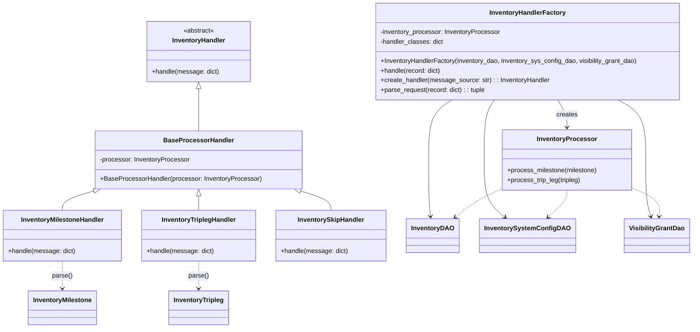
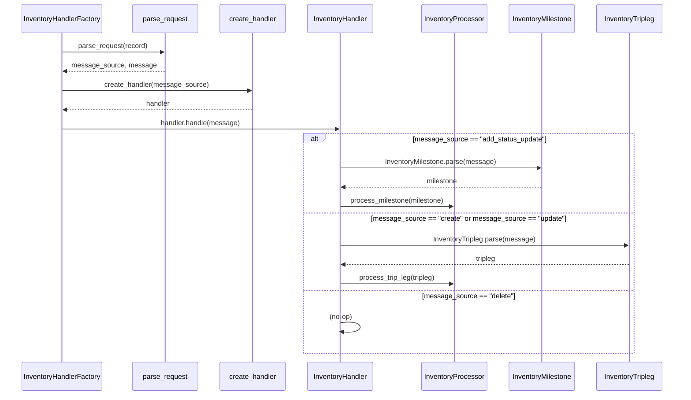

# Diagram: entity_core/entity_service/entity_inventory/entity_inventory_service/service/entity_organization_visibility/inventory_processor_factory.py

> Auto-generated by Obscura crawlers

## Diagram 1

### SVG

<svg id="container" width="1687.1484375" xmlns="http://www.w3.org/2000/svg" class="classDiagram" height="814" viewBox="0 0 1687.1484375 814" role="graphics-document document" aria-roledescription="class"><g><defs><marker id="container_class-aggregationStart" class="marker aggregation class" refX="18" refY="7" markerWidth="190" markerHeight="240" orient="auto"><path d="M 18,7 L9,13 L1,7 L9,1 Z"></path></marker></defs><defs><marker id="container_class-aggregationEnd" class="marker aggregation class" refX="1" refY="7" markerWidth="20" markerHeight="28" orient="auto"><path d="M 18,7 L9,13 L1,7 L9,1 Z"></path></marker></defs><defs><marker id="container_class-extensionStart" class="marker extension class" refX="18" refY="7" markerWidth="190" markerHeight="240" orient="auto"><path d="M 1,7 L18,13 V 1 Z"></path></marker></defs><defs><marker id="container_class-extensionEnd" class="marker extension class" refX="1" refY="7" markerWidth="20" markerHeight="28" orient="auto"><path d="M 1,1 V 13 L18,7 Z"></path></marker></defs><defs><marker id="container_class-compositionStart" class="marker composition class" refX="18" refY="7" markerWidth="190" markerHeight="240" orient="auto"><path d="M 18,7 L9,13 L1,7 L9,1 Z"></path></marker></defs><defs><marker id="container_class-compositionEnd" class="marker composition class" refX="1" refY="7" markerWidth="20" markerHeight="28" orient="auto"><path d="M 18,7 L9,13 L1,7 L9,1 Z"></path></marker></defs><defs><marker id="container_class-dependencyStart" class="marker dependency class" refX="6" refY="7" markerWidth="190" markerHeight="240" orient="auto"><path d="M 5,7 L9,13 L1,7 L9,1 Z"></path></marker></defs><defs><marker id="container_class-dependencyEnd" class="marker dependency class" refX="13" refY="7" markerWidth="20" markerHeight="28" orient="auto"><path d="M 18,7 L9,13 L14,7 L9,1 Z"></path></marker></defs><defs><marker id="container_class-lollipopStart" class="marker lollipop class" refX="13" refY="7" markerWidth="190" markerHeight="240" orient="auto"><circle stroke="black" fill="transparent" cx="7" cy="7" r="6"></circle></marker></defs><defs><marker id="container_class-lollipopEnd" class="marker lollipop class" refX="1" refY="7" markerWidth="190" markerHeight="240" orient="auto"><circle stroke="black" fill="transparent" cx="7" cy="7" r="6"></circle></marker></defs><g class="root"><g class="clusters"></g><g class="edgePaths"><path d="M488.645,220.25L488.645,231.042C488.645,241.833,488.645,263.417,488.645,280.875C488.645,298.333,488.645,311.667,488.645,318.333L488.645,325" id="id_InventoryHandler_BaseProcessorHandler_1" class="edge-thickness-normal edge-pattern-solid relation" style=";;;" data-edge="true" data-et="edge" data-id="id_InventoryHandler_BaseProcessorHandler_1" data-points="W3sieCI6NDg4LjY0NDUzMTI1LCJ5IjoyMDN9LHsieCI6NDg4LjY0NDUzMTI1LCJ5IjoyODV9LHsieCI6NDg4LjY0NDUzMTI1LCJ5IjozMjV9XQ==" marker-start="url(#container_class-extensionStart)"></path><path d="M230.644,473.929L217.748,477.774C204.852,481.619,179.061,489.31,166.165,497.322C153.27,505.333,153.27,513.667,153.27,517.833L153.27,522" id="id_BaseProcessorHandler_InventoryMilestoneHandler_2" class="edge-thickness-normal edge-pattern-solid relation" style=";;;" data-edge="true" data-et="edge" data-id="id_BaseProcessorHandler_InventoryMilestoneHandler_2" data-points="W3sieCI6MjQ3LjE3NDUzMTI1LCJ5Ijo0Njl9LHsieCI6MTUzLjI2OTUzMTI1LCJ5Ijo0OTd9LHsieCI6MTUzLjI2OTUzMTI1LCJ5Ijo1MjJ9XQ==" marker-start="url(#container_class-extensionStart)"></path><path d="M488.645,486.25L488.645,488.042C488.645,489.833,488.645,493.417,488.645,499.375C488.645,505.333,488.645,513.667,488.645,517.833L488.645,522" id="id_BaseProcessorHandler_InventoryTriplegHandler_3" class="edge-thickness-normal edge-pattern-solid relation" style=";;;" data-edge="true" data-et="edge" data-id="id_BaseProcessorHandler_InventoryTriplegHandler_3" data-points="W3sieCI6NDg4LjY0NDUzMTI1LCJ5Ijo0Njl9LHsieCI6NDg4LjY0NDUzMTI1LCJ5Ijo0OTd9LHsieCI6NDg4LjY0NDUzMTI1LCJ5Ijo1MjJ9XQ==" marker-start="url(#container_class-extensionStart)"></path><path d="M739.483,474.066L751.924,477.888C764.365,481.711,789.247,489.355,801.688,497.344C814.129,505.333,814.129,513.667,814.129,517.833L814.129,522" id="id_BaseProcessorHandler_InventorySkipHandler_4" class="edge-thickness-normal edge-pattern-solid relation" style=";;;" data-edge="true" data-et="edge" data-id="id_BaseProcessorHandler_InventorySkipHandler_4" data-points="W3sieCI6NzIyLjk5MzI4MTI1LCJ5Ijo0Njl9LHsieCI6ODE0LjEyODkwNjI1LCJ5Ijo0OTd9LHsieCI6ODE0LjEyODkwNjI1LCJ5Ijo1MjJ9XQ==" marker-start="url(#container_class-extensionStart)"></path><path d="M1360.381,248L1364.217,254.167C1368.052,260.333,1375.723,272.667,1379.559,284C1383.395,295.333,1383.395,305.667,1383.395,310.833L1383.395,316" id="id_InventoryHandlerFactory_InventoryProcessor_5" class="edge-thickness-normal edge-pattern-solid relation" style=";;;" data-edge="true" data-et="edge" data-id="id_InventoryHandlerFactory_InventoryProcessor_5" data-points="W3sieCI6MTM2MC4zODA5MjE1NzY0MzMxLCJ5IjoyNDh9LHsieCI6MTM4My4zOTQ1MzEyNSwieSI6Mjg1fSx7IngiOjEzODMuMzk0NTMxMjUsInkiOjMyMn1d" marker-end="url(#container_class-dependencyEnd)"></path><path d="M1106.901,248L1097.71,254.167C1088.52,260.333,1070.139,272.667,1060.948,297.5C1051.758,322.333,1051.758,359.667,1051.758,395C1051.758,430.333,1051.758,463.667,1052.516,487.006C1053.274,510.346,1054.791,523.692,1055.549,530.365L1056.308,537.038" id="id_InventoryHandlerFactory_InventoryDAO_6" class="edge-thickness-normal edge-pattern-solid relation" style=";;;" data-edge="true" data-et="edge" data-id="id_InventoryHandlerFactory_InventoryDAO_6" data-points="W3sieCI6MTEwNi45MDA2MjY5OTA0NDU3LCJ5IjoyNDh9LHsieCI6MTA1MS43NTc4MTI1LCJ5IjoyODV9LHsieCI6MTA1MS43NTc4MTI1LCJ5IjozOTd9LHsieCI6MTA1MS43NTc4MTI1LCJ5Ijo0OTd9LHsieCI6MTA1Ni45ODUwODUyMjcyNzI3LCJ5Ijo1NDN9XQ==" marker-end="url(#container_class-dependencyEnd)"></path><path d="M1207.786,248L1203.78,254.167C1199.774,260.333,1191.762,272.667,1187.756,297.5C1183.75,322.333,1183.75,359.667,1183.75,395C1183.75,430.333,1183.75,463.667,1191.879,487.347C1200.007,511.027,1216.264,525.054,1224.393,532.067L1232.521,539.08" id="id_InventoryHandlerFactory_InventorySystemConfigDAO_7" class="edge-thickness-normal edge-pattern-solid relation" style=";;;" data-edge="true" data-et="edge" data-id="id_InventoryHandlerFactory_InventorySystemConfigDAO_7" data-points="W3sieCI6MTIwNy43ODYzNzUzOTgwODkxLCJ5IjoyNDh9LHsieCI6MTE4My43NSwieSI6Mjg1fSx7IngiOjExODMuNzUsInkiOjM5N30seyJ4IjoxMTgzLjc1LCJ5Ijo0OTd9LHsieCI6MTIzNy4wNjQwOTgwMTEzNjM3LCJ5Ijo1NDN9XQ==" marker-end="url(#container_class-dependencyEnd)"></path><path d="M1509.658,248L1521.165,254.167C1532.672,260.333,1555.686,272.667,1567.192,297.5C1578.699,322.333,1578.699,359.667,1578.699,395C1578.699,430.333,1578.699,463.667,1580.396,487.031C1582.092,510.395,1585.486,523.789,1587.182,530.486L1588.879,537.184" id="id_InventoryHandlerFactory_VisibilityGrantDao_8" class="edge-thickness-normal edge-pattern-solid relation" style=";;;" data-edge="true" data-et="edge" data-id="id_InventoryHandlerFactory_VisibilityGrantDao_8" data-points="W3sieCI6MTUwOS42NTgzODk3MjkyOTk0LCJ5IjoyNDh9LHsieCI6MTU3OC42OTkyMTg3NSwieSI6Mjg1fSx7IngiOjE1NzguNjk5MjE4NzUsInkiOjM5N30seyJ4IjoxNTc4LjY5OTIxODc1LCJ5Ijo0OTd9LHsieCI6MTU5MC4zNTIzNjE1MDU2ODE4LCJ5Ijo1NDN9XQ==" marker-end="url(#container_class-dependencyEnd)"></path><path d="M153.27,648L153.27,654.167C153.27,660.333,153.27,672.667,153.27,684C153.27,695.333,153.27,705.667,153.27,710.833L153.27,716" id="id_InventoryMilestoneHandler_InventoryMilestone_9" class="edge-thickness-normal edge-pattern-dashed relation" style=";;;" data-edge="true" data-et="edge" data-id="id_InventoryMilestoneHandler_InventoryMilestone_9" data-points="W3sieCI6MTUzLjI2OTUzMTI1LCJ5Ijo2NDh9LHsieCI6MTUzLjI2OTUzMTI1LCJ5Ijo2ODV9LHsieCI6MTUzLjI2OTUzMTI1LCJ5Ijo3MjJ9XQ==" marker-end="url(#container_class-dependencyEnd)"></path><path d="M488.645,648L488.645,654.167C488.645,660.333,488.645,672.667,488.645,684C488.645,695.333,488.645,705.667,488.645,710.833L488.645,716" id="id_InventoryTriplegHandler_InventoryTripleg_10" class="edge-thickness-normal edge-pattern-dashed relation" style=";;;" data-edge="true" data-et="edge" data-id="id_InventoryTriplegHandler_InventoryTripleg_10" data-points="W3sieCI6NDg4LjY0NDUzMTI1LCJ5Ijo2NDh9LHsieCI6NDg4LjY0NDUzMTI1LCJ5Ijo2ODV9LHsieCI6NDg4LjY0NDUzMTI1LCJ5Ijo3MjJ9XQ==" marker-end="url(#container_class-dependencyEnd)"></path><path d="M1223.09,469.984L1213.2,474.486C1203.31,478.989,1183.53,487.995,1165.511,499.511C1147.493,511.027,1131.236,525.054,1123.107,532.067L1114.979,539.08" id="id_InventoryProcessor_InventoryDAO_11" class="edge-thickness-normal edge-pattern-dashed relation" style=";;;" data-edge="true" data-et="edge" data-id="id_InventoryProcessor_InventoryDAO_11" data-points="W3sieCI6MTIyMy4wODk4NDM3NSwieSI6NDY5Ljk4MzY5MTY4OTM0MTh9LHsieCI6MTE2My43NSwieSI6NDk3fSx7IngiOjExMTAuNDM1OTAxOTg4NjM2MywieSI6NTQzfV0=" marker-end="url(#container_class-dependencyEnd)"></path><path d="M1383.395,472L1383.395,476.167C1383.395,480.333,1383.395,488.667,1375.63,499.831C1367.865,510.994,1352.336,524.989,1344.571,531.986L1336.806,538.983" id="id_InventoryProcessor_InventorySystemConfigDAO_12" class="edge-thickness-normal edge-pattern-dashed relation" style=";;;" data-edge="true" data-et="edge" data-id="id_InventoryProcessor_InventorySystemConfigDAO_12" data-points="W3sieCI6MTM4My4zOTQ1MzEyNSwieSI6NDcyfSx7IngiOjEzODMuMzk0NTMxMjUsInkiOjQ5N30seyJ4IjoxMzMyLjM0ODk4NzkyNjEzNjMsInkiOjU0M31d" marker-end="url(#container_class-dependencyEnd)"></path><path d="M1543.699,467.433L1554.915,472.361C1566.13,477.289,1588.561,487.144,1599.018,498.745C1609.476,510.346,1607.959,523.692,1607.201,530.365L1606.442,537.038" id="id_InventoryProcessor_VisibilityGrantDao_13" class="edge-thickness-normal edge-pattern-dashed relation" style=";;;" data-edge="true" data-et="edge" data-id="id_InventoryProcessor_VisibilityGrantDao_13" data-points="W3sieCI6MTU0My42OTkyMTg3NSwieSI6NDY3LjQzMzM2NDc5ODc2NDN9LHsieCI6MTYxMC45OTIxODc1LCJ5Ijo0OTd9LHsieCI6MTYwNS43NjQ5MTQ3NzI3MjczLCJ5Ijo1NDN9XQ==" marker-end="url(#container_class-dependencyEnd)"></path></g><g class="edgeLabels"><g class="edgeLabel"><g class="label" data-id="id_InventoryHandler_BaseProcessorHandler_1" transform="translate(0, 0)"><foreignObject width="0" height="0">

</foreignObject></g></g><g class="edgeLabel"><g class="label" data-id="id_BaseProcessorHandler_InventoryMilestoneHandler_2" transform="translate(0, 0)"><foreignObject width="0" height="0">

</foreignObject></g></g><g class="edgeLabel"><g class="label" data-id="id_BaseProcessorHandler_InventoryTriplegHandler_3" transform="translate(0, 0)"><foreignObject width="0" height="0">

</foreignObject></g></g><g class="edgeLabel"><g class="label" data-id="id_BaseProcessorHandler_InventorySkipHandler_4" transform="translate(0, 0)"><foreignObject width="0" height="0">

</foreignObject></g></g><g class="edgeLabel" transform="translate(1383.39453125, 285)"><g class="label" data-id="id_InventoryHandlerFactory_InventoryProcessor_5" transform="translate(-26.171875, -12)"><foreignObject width="52.34375" height="24">

creates

</foreignObject></g></g><g class="edgeLabel"><g class="label" data-id="id_InventoryHandlerFactory_InventoryDAO_6" transform="translate(0, 0)"><foreignObject width="0" height="0">

</foreignObject></g></g><g class="edgeLabel"><g class="label" data-id="id_InventoryHandlerFactory_InventorySystemConfigDAO_7" transform="translate(0, 0)"><foreignObject width="0" height="0">

</foreignObject></g></g><g class="edgeLabel"><g class="label" data-id="id_InventoryHandlerFactory_VisibilityGrantDao_8" transform="translate(0, 0)"><foreignObject width="0" height="0">

</foreignObject></g></g><g class="edgeLabel" transform="translate(153.26953125, 685)"><g class="label" data-id="id_InventoryMilestoneHandler_InventoryMilestone_9" transform="translate(-25.2734375, -12)"><foreignObject width="50.546875" height="24">

parse()

</foreignObject></g></g><g class="edgeLabel" transform="translate(488.64453125, 685)"><g class="label" data-id="id_InventoryTriplegHandler_InventoryTripleg_10" transform="translate(-25.2734375, -12)"><foreignObject width="50.546875" height="24">

parse()

</foreignObject></g></g><g class="edgeLabel"><g class="label" data-id="id_InventoryProcessor_InventoryDAO_11" transform="translate(0, 0)"><foreignObject width="0" height="0">

</foreignObject></g></g><g class="edgeLabel"><g class="label" data-id="id_InventoryProcessor_InventorySystemConfigDAO_12" transform="translate(0, 0)"><foreignObject width="0" height="0">

</foreignObject></g></g><g class="edgeLabel"><g class="label" data-id="id_InventoryProcessor_VisibilityGrantDao_13" transform="translate(0, 0)"><foreignObject width="0" height="0">

</foreignObject></g></g></g><g class="nodes"><g class="node default" id="classId-InventoryHandler-0" transform="translate(488.64453125, 128)"><g class="basic label-container"><path d="M-127.3671875 -75 L127.3671875 -75 L127.3671875 75 L-127.3671875 75" stroke="none" stroke-width="0" fill="#ECECFF" style=""></path><path d="M-127.3671875 -75 C-43.123082753850596 -75, 41.12102199229881 -75, 127.3671875 -75 M-127.3671875 -75 C-52.04564410724505 -75, 23.275899285509894 -75, 127.3671875 -75 M127.3671875 -75 C127.3671875 -25.77414080392341, 127.3671875 23.451718392153182, 127.3671875 75 M127.3671875 -75 C127.3671875 -19.619207794022053, 127.3671875 35.761584411955894, 127.3671875 75 M127.3671875 75 C61.814099834252175 75, -3.738987831495649 75, -127.3671875 75 M127.3671875 75 C66.77609586565256 75, 6.185004231305115 75, -127.3671875 75 M-127.3671875 75 C-127.3671875 34.00619087375109, -127.3671875 -6.987618252497825, -127.3671875 -75 M-127.3671875 75 C-127.3671875 43.73228713420415, -127.3671875 12.464574268408299, -127.3671875 -75" stroke="#9370DB" stroke-width="1.3" fill="none" stroke-dasharray="0 0" style=""></path></g><g class="annotation-group text" transform="translate(-38.609375, -51)"><g class="label" style="" transform="translate(0,-12)"><foreignObject width="77.21875" height="24">

«abstract»

</foreignObject></g></g><g class="label-group text" transform="translate(-64.046875, -27)"><g class="label" style="font-weight: bolder" transform="translate(0,-12)"><foreignObject width="128.09375" height="24">

InventoryHandler

</foreignObject></g></g><g class="members-group text" transform="translate(-115.3671875, 21)"></g><g class="methods-group text" transform="translate(-115.3671875, 51)"><g class="label" style="" transform="translate(0,-12)"><foreignObject width="166.6875" height="24">

+handle(message: dict)

</foreignObject></g></g><g class="divider" style=""><path d="M-127.3671875 -3 C-48.065098512690184 -3, 31.23699047461963 -3, 127.3671875 -3 M-127.3671875 -3 C-55.91841796134493 -3, 15.530351577310142 -3, 127.3671875 -3" stroke="#9370DB" stroke-width="1.3" fill="none" stroke-dasharray="0 0" style=""></path></g><g class="divider" style=""><path d="M-127.3671875 21 C-75.70848291018436 21, -24.049778320368702 21, 127.3671875 21 M-127.3671875 21 C-47.35786231205773 21, 32.65146287588453 21, 127.3671875 21" stroke="#9370DB" stroke-width="1.3" fill="none" stroke-dasharray="0 0" style=""></path></g></g><g class="node default" id="classId-BaseProcessorHandler-1" transform="translate(488.64453125, 397)"><g class="basic label-container"><path d="M-253.0390625 -72 L253.0390625 -72 L253.0390625 72 L-253.0390625 72" stroke="none" stroke-width="0" fill="#ECECFF" style=""></path><path d="M-253.0390625 -72 C-81.2851032743481 -72, 90.4688559513038 -72, 253.0390625 -72 M-253.0390625 -72 C-147.41283319549507 -72, -41.786603890990165 -72, 253.0390625 -72 M253.0390625 -72 C253.0390625 -28.191298631861677, 253.0390625 15.617402736276645, 253.0390625 72 M253.0390625 -72 C253.0390625 -27.76084572118944, 253.0390625 16.47830855762112, 253.0390625 72 M253.0390625 72 C127.40948866809569 72, 1.7799148361913808 72, -253.0390625 72 M253.0390625 72 C124.87935607105635 72, -3.2803503578873006 72, -253.0390625 72 M-253.0390625 72 C-253.0390625 23.31693701220346, -253.0390625 -25.36612597559308, -253.0390625 -72 M-253.0390625 72 C-253.0390625 42.363831375867335, -253.0390625 12.727662751734663, -253.0390625 -72" stroke="#9370DB" stroke-width="1.3" fill="none" stroke-dasharray="0 0" style=""></path></g><g class="annotation-group text" transform="translate(0, -48)"></g><g class="label-group text" transform="translate(-82.53125, -48)"><g class="label" style="font-weight: bolder" transform="translate(0,-12)"><foreignObject width="165.0625" height="24">

BaseProcessorHandler

</foreignObject></g></g><g class="members-group text" transform="translate(-241.0390625, 0)"><g class="label" style="" transform="translate(0,-12)"><foreignObject width="224.78125" height="24">

-processor: InventoryProcessor

</foreignObject></g></g><g class="methods-group text" transform="translate(-241.0390625, 48)"><g class="label" style="" transform="translate(0,-12)"><foreignObject width="399.546875" height="24">

+BaseProcessorHandler(processor: InventoryProcessor)

</foreignObject></g></g><g class="divider" style=""><path d="M-253.0390625 -24 C-55.92769699600217 -24, 141.18366850799566 -24, 253.0390625 -24 M-253.0390625 -24 C-107.38230858300133 -24, 38.274445333997335 -24, 253.0390625 -24" stroke="#9370DB" stroke-width="1.3" fill="none" stroke-dasharray="0 0" style=""></path></g><g class="divider" style=""><path d="M-253.0390625 24 C-151.3912486281655 24, -49.74343475633103 24, 253.0390625 24 M-253.0390625 24 C-99.77666123652068 24, 53.48574002695864 24, 253.0390625 24" stroke="#9370DB" stroke-width="1.3" fill="none" stroke-dasharray="0 0" style=""></path></g></g><g class="node default" id="classId-InventoryMilestoneHandler-2" transform="translate(153.26953125, 585)"><g class="basic label-container"><path d="M-145.26953125 -63 L145.26953125 -63 L145.26953125 63 L-145.26953125 63" stroke="none" stroke-width="0" fill="#ECECFF" style=""></path><path d="M-145.26953125 -63 C-72.34940941966713 -63, 0.5707124106657488 -63, 145.26953125 -63 M-145.26953125 -63 C-41.21911208772053 -63, 62.831307074558936 -63, 145.26953125 -63 M145.26953125 -63 C145.26953125 -20.527785123904565, 145.26953125 21.94442975219087, 145.26953125 63 M145.26953125 -63 C145.26953125 -34.822295635239485, 145.26953125 -6.644591270478976, 145.26953125 63 M145.26953125 63 C63.59295297027714 63, -18.083625309445722 63, -145.26953125 63 M145.26953125 63 C33.41664332232331 63, -78.43624460535338 63, -145.26953125 63 M-145.26953125 63 C-145.26953125 20.24688860036332, -145.26953125 -22.50622279927336, -145.26953125 -63 M-145.26953125 63 C-145.26953125 13.754441684316014, -145.26953125 -35.49111663136797, -145.26953125 -63" stroke="#9370DB" stroke-width="1.3" fill="none" stroke-dasharray="0 0" style=""></path></g><g class="annotation-group text" transform="translate(0, -39)"></g><g class="label-group text" transform="translate(-99.8515625, -39)"><g class="label" style="font-weight: bolder" transform="translate(0,-12)"><foreignObject width="199.703125" height="24">

InventoryMilestoneHandler

</foreignObject></g></g><g class="members-group text" transform="translate(-133.26953125, 9)"></g><g class="methods-group text" transform="translate(-133.26953125, 39)"><g class="label" style="" transform="translate(0,-12)"><foreignObject width="166.6875" height="24">

+handle(message: dict)

</foreignObject></g></g><g class="divider" style=""><path d="M-145.26953125 -15 C-65.34200923617018 -15, 14.58551277765963 -15, 145.26953125 -15 M-145.26953125 -15 C-69.51638412245029 -15, 6.236763005099419 -15, 145.26953125 -15" stroke="#9370DB" stroke-width="1.3" fill="none" stroke-dasharray="0 0" style=""></path></g><g class="divider" style=""><path d="M-145.26953125 9 C-48.612194940037 9, 48.045141369926 9, 145.26953125 9 M-145.26953125 9 C-62.28093585246832 9, 20.707659545063365 9, 145.26953125 9" stroke="#9370DB" stroke-width="1.3" fill="none" stroke-dasharray="0 0" style=""></path></g></g><g class="node default" id="classId-InventoryTriplegHandler-3" transform="translate(488.64453125, 585)"><g class="basic label-container"><path d="M-140.10546875 -63 L140.10546875 -63 L140.10546875 63 L-140.10546875 63" stroke="none" stroke-width="0" fill="#ECECFF" style=""></path><path d="M-140.10546875 -63 C-43.8584862725065 -63, 52.38849620498701 -63, 140.10546875 -63 M-140.10546875 -63 C-82.94953897467686 -63, -25.79360919935371 -63, 140.10546875 -63 M140.10546875 -63 C140.10546875 -16.357250740420866, 140.10546875 30.285498519158267, 140.10546875 63 M140.10546875 -63 C140.10546875 -31.97124701697841, 140.10546875 -0.9424940339568195, 140.10546875 63 M140.10546875 63 C32.95070946887604 63, -74.20404981224792 63, -140.10546875 63 M140.10546875 63 C54.64191874896093 63, -30.821631252078134 63, -140.10546875 63 M-140.10546875 63 C-140.10546875 27.2289771031775, -140.10546875 -8.542045793645002, -140.10546875 -63 M-140.10546875 63 C-140.10546875 28.43415005348004, -140.10546875 -6.131699893039922, -140.10546875 -63" stroke="#9370DB" stroke-width="1.3" fill="none" stroke-dasharray="0 0" style=""></path></g><g class="annotation-group text" transform="translate(0, -39)"></g><g class="label-group text" transform="translate(-89.5234375, -39)"><g class="label" style="font-weight: bolder" transform="translate(0,-12)"><foreignObject width="179.046875" height="24">

InventoryTriplegHandler

</foreignObject></g></g><g class="members-group text" transform="translate(-128.10546875, 9)"></g><g class="methods-group text" transform="translate(-128.10546875, 39)"><g class="label" style="" transform="translate(0,-12)"><foreignObject width="166.6875" height="24">

+handle(message: dict)

</foreignObject></g></g><g class="divider" style=""><path d="M-140.10546875 -15 C-61.16510491535986 -15, 17.775258919280276 -15, 140.10546875 -15 M-140.10546875 -15 C-76.54226720624305 -15, -12.979065662486107 -15, 140.10546875 -15" stroke="#9370DB" stroke-width="1.3" fill="none" stroke-dasharray="0 0" style=""></path></g><g class="divider" style=""><path d="M-140.10546875 9 C-38.20124533157903 9, 63.70297808684194 9, 140.10546875 9 M-140.10546875 9 C-82.2507736952368 9, -24.396078640473604 9, 140.10546875 9" stroke="#9370DB" stroke-width="1.3" fill="none" stroke-dasharray="0 0" style=""></path></g></g><g class="node default" id="classId-InventorySkipHandler-4" transform="translate(814.12890625, 585)"><g class="basic label-container"><path d="M-135.37890625 -63 L135.37890625 -63 L135.37890625 63 L-135.37890625 63" stroke="none" stroke-width="0" fill="#ECECFF" style=""></path><path d="M-135.37890625 -63 C-58.94266781136791 -63, 17.493570627264177 -63, 135.37890625 -63 M-135.37890625 -63 C-78.84795140420886 -63, -22.3169965584177 -63, 135.37890625 -63 M135.37890625 -63 C135.37890625 -27.767621288107037, 135.37890625 7.464757423785926, 135.37890625 63 M135.37890625 -63 C135.37890625 -25.38303972401573, 135.37890625 12.233920551968538, 135.37890625 63 M135.37890625 63 C68.37625878756572 63, 1.373611325131435 63, -135.37890625 63 M135.37890625 63 C58.301202394184486 63, -18.776501461631028 63, -135.37890625 63 M-135.37890625 63 C-135.37890625 13.928995051515471, -135.37890625 -35.14200989696906, -135.37890625 -63 M-135.37890625 63 C-135.37890625 36.47595285274815, -135.37890625 9.951905705496301, -135.37890625 -63" stroke="#9370DB" stroke-width="1.3" fill="none" stroke-dasharray="0 0" style=""></path></g><g class="annotation-group text" transform="translate(0, -39)"></g><g class="label-group text" transform="translate(-80.0703125, -39)"><g class="label" style="font-weight: bolder" transform="translate(0,-12)"><foreignObject width="160.140625" height="24">

InventorySkipHandler

</foreignObject></g></g><g class="members-group text" transform="translate(-123.37890625, 9)"></g><g class="methods-group text" transform="translate(-123.37890625, 39)"><g class="label" style="" transform="translate(0,-12)"><foreignObject width="166.6875" height="24">

+handle(message: dict)

</foreignObject></g></g><g class="divider" style=""><path d="M-135.37890625 -15 C-31.912173484917815 -15, 71.55455928016437 -15, 135.37890625 -15 M-135.37890625 -15 C-27.237595700283123 -15, 80.90371484943375 -15, 135.37890625 -15" stroke="#9370DB" stroke-width="1.3" fill="none" stroke-dasharray="0 0" style=""></path></g><g class="divider" style=""><path d="M-135.37890625 9 C-72.87042635828588 9, -10.361946466571766 9, 135.37890625 9 M-135.37890625 9 C-48.997144011942126 9, 37.38461822611575 9, 135.37890625 9" stroke="#9370DB" stroke-width="1.3" fill="none" stroke-dasharray="0 0" style=""></path></g></g><g class="node default" id="classId-InventoryHandlerFactory-5" transform="translate(1285.7421875, 128)"><g class="basic label-container"><path d="M-379.984375 -120 L379.984375 -120 L379.984375 120 L-379.984375 120" stroke="none" stroke-width="0" fill="#ECECFF" style=""></path><path d="M-379.984375 -120 C-101.38967500364384 -120, 177.2050249927123 -120, 379.984375 -120 M-379.984375 -120 C-168.63295582175775 -120, 42.718463356484506 -120, 379.984375 -120 M379.984375 -120 C379.984375 -66.98613953976403, 379.984375 -13.97227907952805, 379.984375 120 M379.984375 -120 C379.984375 -32.27953067090735, 379.984375 55.4409386581853, 379.984375 120 M379.984375 120 C177.50645268259447 120, -24.971469634811058 120, -379.984375 120 M379.984375 120 C223.57174223253753 120, 67.15910946507506 120, -379.984375 120 M-379.984375 120 C-379.984375 35.694743223652964, -379.984375 -48.61051355269407, -379.984375 -120 M-379.984375 120 C-379.984375 45.92093745652187, -379.984375 -28.15812508695626, -379.984375 -120" stroke="#9370DB" stroke-width="1.3" fill="none" stroke-dasharray="0 0" style=""></path></g><g class="annotation-group text" transform="translate(0, -96)"></g><g class="label-group text" transform="translate(-90.640625, -96)"><g class="label" style="font-weight: bolder" transform="translate(0,-12)"><foreignObject width="181.28125" height="24">

InventoryHandlerFactory

</foreignObject></g></g><g class="members-group text" transform="translate(-367.984375, -48)"><g class="label" style="" transform="translate(0,-12)"><foreignObject width="301.21875" height="24">

-inventory_processor: InventoryProcessor

</foreignObject></g><g class="label" style="" transform="translate(0,12)"><foreignObject width="157.0625" height="24">

-handler_classes: dict

</foreignObject></g></g><g class="methods-group text" transform="translate(-367.984375, 24)"><g class="label" style="" transform="translate(0,-12)"><foreignObject width="645.328125" height="24">

+InventoryHandlerFactory(inventory_dao, inventory_sys_config_dao, visibility_grant_dao)

</foreignObject></g><g class="label" style="" transform="translate(0,12)"><foreignObject width="150.640625" height="24">

+handle(record: dict)

</foreignObject></g><g class="label" style="" transform="translate(0,36)"><foreignObject width="420.765625" height="24">

+create_handler(message_source: str) : : InventoryHandler

</foreignObject></g><g class="label" style="" transform="translate(0,60)"><foreignObject width="262.0625" height="24">

+parse_request(record: dict) : : tuple

</foreignObject></g></g><g class="divider" style=""><path d="M-379.984375 -72 C-201.2448062758861 -72, -22.50523755177221 -72, 379.984375 -72 M-379.984375 -72 C-121.35432868860136 -72, 137.2757176227973 -72, 379.984375 -72" stroke="#9370DB" stroke-width="1.3" fill="none" stroke-dasharray="0 0" style=""></path></g><g class="divider" style=""><path d="M-379.984375 0 C-159.34502601336953 0, 61.29432297326093 0, 379.984375 0 M-379.984375 0 C-108.93698077207733 0, 162.11041345584533 0, 379.984375 0" stroke="#9370DB" stroke-width="1.3" fill="none" stroke-dasharray="0 0" style=""></path></g></g><g class="node default" id="classId-InventoryProcessor-6" transform="translate(1383.39453125, 397)"><g class="basic label-container"><path d="M-160.3046875 -75 L160.3046875 -75 L160.3046875 75 L-160.3046875 75" stroke="none" stroke-width="0" fill="#ECECFF" style=""></path><path d="M-160.3046875 -75 C-68.9555573080232 -75, 22.393572883953595 -75, 160.3046875 -75 M-160.3046875 -75 C-69.58848480562062 -75, 21.127717888758752 -75, 160.3046875 -75 M160.3046875 -75 C160.3046875 -16.701033327599518, 160.3046875 41.597933344800964, 160.3046875 75 M160.3046875 -75 C160.3046875 -33.273468253052926, 160.3046875 8.453063493894149, 160.3046875 75 M160.3046875 75 C67.57131580074618 75, -25.162055898507646 75, -160.3046875 75 M160.3046875 75 C75.28562194033059 75, -9.733443619338829 75, -160.3046875 75 M-160.3046875 75 C-160.3046875 19.24478650824493, -160.3046875 -36.51042698351014, -160.3046875 -75 M-160.3046875 75 C-160.3046875 43.38866254238579, -160.3046875 11.777325084771583, -160.3046875 -75" stroke="#9370DB" stroke-width="1.3" fill="none" stroke-dasharray="0 0" style=""></path></g><g class="annotation-group text" transform="translate(0, -51)"></g><g class="label-group text" transform="translate(-70.875, -51)"><g class="label" style="font-weight: bolder" transform="translate(0,-12)"><foreignObject width="141.75" height="24">

InventoryProcessor

</foreignObject></g></g><g class="members-group text" transform="translate(-148.3046875, -3)"></g><g class="methods-group text" transform="translate(-148.3046875, 27)"><g class="label" style="" transform="translate(0,-12)"><foreignObject width="225.734375" height="24">

+process_milestone(milestone)

</foreignObject></g><g class="label" style="" transform="translate(0,12)"><foreignObject width="184.484375" height="24">

+process_trip_leg(tripleg)

</foreignObject></g></g><g class="divider" style=""><path d="M-160.3046875 -27 C-91.91025925195375 -27, -23.515831003907493 -27, 160.3046875 -27 M-160.3046875 -27 C-33.234405434637736 -27, 93.83587663072453 -27, 160.3046875 -27" stroke="#9370DB" stroke-width="1.3" fill="none" stroke-dasharray="0 0" style=""></path></g><g class="divider" style=""><path d="M-160.3046875 -3 C-76.77960878789014 -3, 6.745469924219719 -3, 160.3046875 -3 M-160.3046875 -3 C-54.616000607285415 -3, 51.07268628542917 -3, 160.3046875 -3" stroke="#9370DB" stroke-width="1.3" fill="none" stroke-dasharray="0 0" style=""></path></g></g><g class="node default" id="classId-InventoryDAO-7" transform="translate(1061.7578125, 585)"><g class="basic label-container"><path d="M-62.25 -42 L62.25 -42 L62.25 42 L-62.25 42" stroke="none" stroke-width="0" fill="#ECECFF" style=""></path><path d="M-62.25 -42 C-35.73307191732404 -42, -9.216143834648086 -42, 62.25 -42 M-62.25 -42 C-30.392311166085662 -42, 1.465377667828676 -42, 62.25 -42 M62.25 -42 C62.25 -18.98034284880987, 62.25 4.039314302380262, 62.25 42 M62.25 -42 C62.25 -16.542820978691264, 62.25 8.914358042617472, 62.25 42 M62.25 42 C25.51677886605816 42, -11.216442267883679 42, -62.25 42 M62.25 42 C21.788835514784473 42, -18.672328970431053 42, -62.25 42 M-62.25 42 C-62.25 24.04016962080903, -62.25 6.080339241618063, -62.25 -42 M-62.25 42 C-62.25 21.11655126007578, -62.25 0.23310252015156152, -62.25 -42" stroke="#9370DB" stroke-width="1.3" fill="none" stroke-dasharray="0 0" style=""></path></g><g class="annotation-group text" transform="translate(0, -18)"></g><g class="label-group text" transform="translate(-50.25, -18)"><g class="label" style="font-weight: bolder" transform="translate(0,-12)"><foreignObject width="100.5" height="24">

InventoryDAO

</foreignObject></g></g><g class="members-group text" transform="translate(-50.25, 30)"></g><g class="methods-group text" transform="translate(-50.25, 60)"></g><g class="divider" style=""><path d="M-62.25 6 C-17.04770774519487 6, 28.15458450961026 6, 62.25 6 M-62.25 6 C-28.7748849292634 6, 4.700230141473199 6, 62.25 6" stroke="#9370DB" stroke-width="1.3" fill="none" stroke-dasharray="0 0" style=""></path></g><g class="divider" style=""><path d="M-62.25 24 C-31.95692849883442 24, -1.6638569976688373 24, 62.25 24 M-62.25 24 C-27.252470482467302 24, 7.745059035065395 24, 62.25 24" stroke="#9370DB" stroke-width="1.3" fill="none" stroke-dasharray="0 0" style=""></path></g></g><g class="node default" id="classId-InventorySystemConfigDAO-8" transform="translate(1285.7421875, 585)"><g class="basic label-container"><path d="M-111.734375 -42 L111.734375 -42 L111.734375 42 L-111.734375 42" stroke="none" stroke-width="0" fill="#ECECFF" style=""></path><path d="M-111.734375 -42 C-39.2787725213156 -42, 33.176829957368795 -42, 111.734375 -42 M-111.734375 -42 C-57.2803070436138 -42, -2.8262390872276058 -42, 111.734375 -42 M111.734375 -42 C111.734375 -13.652188132037956, 111.734375 14.695623735924087, 111.734375 42 M111.734375 -42 C111.734375 -15.816098265319283, 111.734375 10.367803469361434, 111.734375 42 M111.734375 42 C47.86582816027703 42, -16.002718679445934 42, -111.734375 42 M111.734375 42 C35.4112423639783 42, -40.911890272043394 42, -111.734375 42 M-111.734375 42 C-111.734375 17.383932516215754, -111.734375 -7.232134967568491, -111.734375 -42 M-111.734375 42 C-111.734375 20.46699189000807, -111.734375 -1.066016219983858, -111.734375 -42" stroke="#9370DB" stroke-width="1.3" fill="none" stroke-dasharray="0 0" style=""></path></g><g class="annotation-group text" transform="translate(0, -18)"></g><g class="label-group text" transform="translate(-99.734375, -18)"><g class="label" style="font-weight: bolder" transform="translate(0,-12)"><foreignObject width="199.46875" height="24">

InventorySystemConfigDAO

</foreignObject></g></g><g class="members-group text" transform="translate(-99.734375, 30)"></g><g class="methods-group text" transform="translate(-99.734375, 60)"></g><g class="divider" style=""><path d="M-111.734375 6 C-63.51698229846914 6, -15.299589596938276 6, 111.734375 6 M-111.734375 6 C-37.97607767135655 6, 35.7822196572869 6, 111.734375 6" stroke="#9370DB" stroke-width="1.3" fill="none" stroke-dasharray="0 0" style=""></path></g><g class="divider" style=""><path d="M-111.734375 24 C-51.890336046318815 24, 7.95370290736237 24, 111.734375 24 M-111.734375 24 C-64.03997425931101 24, -16.345573518622018 24, 111.734375 24" stroke="#9370DB" stroke-width="1.3" fill="none" stroke-dasharray="0 0" style=""></path></g></g><g class="node default" id="classId-VisibilityGrantDao-9" transform="translate(1600.9921875, 585)"><g class="basic label-container"><path d="M-78.15625 -42 L78.15625 -42 L78.15625 42 L-78.15625 42" stroke="none" stroke-width="0" fill="#ECECFF" style=""></path><path d="M-78.15625 -42 C-35.37169511492526 -42, 7.412859770149481 -42, 78.15625 -42 M-78.15625 -42 C-33.7071853392687 -42, 10.741879321462605 -42, 78.15625 -42 M78.15625 -42 C78.15625 -21.208347166779493, 78.15625 -0.41669433355898633, 78.15625 42 M78.15625 -42 C78.15625 -9.280813530922828, 78.15625 23.438372938154345, 78.15625 42 M78.15625 42 C29.21857543147661 42, -19.719099137046783 42, -78.15625 42 M78.15625 42 C37.207648028711816 42, -3.7409539425763683 42, -78.15625 42 M-78.15625 42 C-78.15625 18.68911365474509, -78.15625 -4.621772690509822, -78.15625 -42 M-78.15625 42 C-78.15625 15.375462888461922, -78.15625 -11.249074223076157, -78.15625 -42" stroke="#9370DB" stroke-width="1.3" fill="none" stroke-dasharray="0 0" style=""></path></g><g class="annotation-group text" transform="translate(0, -18)"></g><g class="label-group text" transform="translate(-66.15625, -18)"><g class="label" style="font-weight: bolder" transform="translate(0,-12)"><foreignObject width="132.3125" height="24">

VisibilityGrantDao

</foreignObject></g></g><g class="members-group text" transform="translate(-66.15625, 30)"></g><g class="methods-group text" transform="translate(-66.15625, 60)"></g><g class="divider" style=""><path d="M-78.15625 6 C-40.6570618725036 6, -3.157873745007194 6, 78.15625 6 M-78.15625 6 C-28.344117280170565 6, 21.46801543965887 6, 78.15625 6" stroke="#9370DB" stroke-width="1.3" fill="none" stroke-dasharray="0 0" style=""></path></g><g class="divider" style=""><path d="M-78.15625 24 C-32.97002168655012 24, 12.216206626899762 24, 78.15625 24 M-78.15625 24 C-41.993681167472246 24, -5.831112334944493 24, 78.15625 24" stroke="#9370DB" stroke-width="1.3" fill="none" stroke-dasharray="0 0" style=""></path></g></g><g class="node default" id="classId-InventoryMilestone-10" transform="translate(153.26953125, 764)"><g class="basic label-container"><path d="M-82.765625 -42 L82.765625 -42 L82.765625 42 L-82.765625 42" stroke="none" stroke-width="0" fill="#ECECFF" style=""></path><path d="M-82.765625 -42 C-21.23742712390127 -42, 40.29077075219746 -42, 82.765625 -42 M-82.765625 -42 C-30.335128587810367 -42, 22.095367824379267 -42, 82.765625 -42 M82.765625 -42 C82.765625 -22.928821793514544, 82.765625 -3.857643587029088, 82.765625 42 M82.765625 -42 C82.765625 -9.943448105647398, 82.765625 22.113103788705203, 82.765625 42 M82.765625 42 C43.878148304433225 42, 4.99067160886645 42, -82.765625 42 M82.765625 42 C25.48958020806957 42, -31.786464583860862 42, -82.765625 42 M-82.765625 42 C-82.765625 13.687195637994218, -82.765625 -14.625608724011563, -82.765625 -42 M-82.765625 42 C-82.765625 17.775234119206303, -82.765625 -6.449531761587394, -82.765625 -42" stroke="#9370DB" stroke-width="1.3" fill="none" stroke-dasharray="0 0" style=""></path></g><g class="annotation-group text" transform="translate(0, -18)"></g><g class="label-group text" transform="translate(-70.765625, -18)"><g class="label" style="font-weight: bolder" transform="translate(0,-12)"><foreignObject width="141.53125" height="24">

InventoryMilestone

</foreignObject></g></g><g class="members-group text" transform="translate(-70.765625, 30)"></g><g class="methods-group text" transform="translate(-70.765625, 60)"></g><g class="divider" style=""><path d="M-82.765625 6 C-37.64967315221421 6, 7.4662786955715745 6, 82.765625 6 M-82.765625 6 C-36.90689605669943 6, 8.951832886601139 6, 82.765625 6" stroke="#9370DB" stroke-width="1.3" fill="none" stroke-dasharray="0 0" style=""></path></g><g class="divider" style=""><path d="M-82.765625 24 C-37.0179030198945 24, 8.729818960211006 24, 82.765625 24 M-82.765625 24 C-19.944004211040166 24, 42.87761657791967 24, 82.765625 24" stroke="#9370DB" stroke-width="1.3" fill="none" stroke-dasharray="0 0" style=""></path></g></g><g class="node default" id="classId-InventoryTripleg-11" transform="translate(488.64453125, 764)"><g class="basic label-container"><path d="M-72.4375 -42 L72.4375 -42 L72.4375 42 L-72.4375 42" stroke="none" stroke-width="0" fill="#ECECFF" style=""></path><path d="M-72.4375 -42 C-19.700079472300423 -42, 33.03734105539915 -42, 72.4375 -42 M-72.4375 -42 C-25.47700299331757 -42, 21.48349401336486 -42, 72.4375 -42 M72.4375 -42 C72.4375 -9.455470640979115, 72.4375 23.08905871804177, 72.4375 42 M72.4375 -42 C72.4375 -16.750584797771552, 72.4375 8.498830404456896, 72.4375 42 M72.4375 42 C30.544322537400035 42, -11.34885492519993 42, -72.4375 42 M72.4375 42 C22.385546689704263 42, -27.666406620591474 42, -72.4375 42 M-72.4375 42 C-72.4375 23.760178445832356, -72.4375 5.520356891664711, -72.4375 -42 M-72.4375 42 C-72.4375 17.672867276315763, -72.4375 -6.6542654473684735, -72.4375 -42" stroke="#9370DB" stroke-width="1.3" fill="none" stroke-dasharray="0 0" style=""></path></g><g class="annotation-group text" transform="translate(0, -18)"></g><g class="label-group text" transform="translate(-60.4375, -18)"><g class="label" style="font-weight: bolder" transform="translate(0,-12)"><foreignObject width="120.875" height="24">

InventoryTripleg

</foreignObject></g></g><g class="members-group text" transform="translate(-60.4375, 30)"></g><g class="methods-group text" transform="translate(-60.4375, 60)"></g><g class="divider" style=""><path d="M-72.4375 6 C-19.998579487373163 6, 32.44034102525367 6, 72.4375 6 M-72.4375 6 C-15.944371839946562 6, 40.548756320106875 6, 72.4375 6" stroke="#9370DB" stroke-width="1.3" fill="none" stroke-dasharray="0 0" style=""></path></g><g class="divider" style=""><path d="M-72.4375 24 C-23.477520728228193 24, 25.482458543543615 24, 72.4375 24 M-72.4375 24 C-16.97597387694865 24, 38.4855522461027 24, 72.4375 24" stroke="#9370DB" stroke-width="1.3" fill="none" stroke-dasharray="0 0" style=""></path></g></g></g></g></g></svg>

## Diagram 2

### SVG

<svg id="container" width="1636.5" xmlns="http://www.w3.org/2000/svg" height="952" viewBox="-50 -10 1636.5 952" role="graphics-document document" aria-roledescription="sequence"><g><rect x="1386.5" y="866" fill="#eaeaea" stroke="#666" width="150" height="65" name="Tripleg" rx="3" ry="3" class="actor actor-bottom"></rect><text x="1461.5" y="898.5" dominant-baseline="central" alignment-baseline="central" class="actor actor-box" style="text-anchor: middle; font-size: 16px; font-weight: 400;"><tspan x="1461.5" dy="0">InventoryTripleg</tspan></text></g><g><rect x="1176.5" y="866" fill="#eaeaea" stroke="#666" width="160" height="65" name="Milestone" rx="3" ry="3" class="actor actor-bottom"></rect><text x="1256.5" y="898.5" dominant-baseline="central" alignment-baseline="central" class="actor actor-box" style="text-anchor: middle; font-size: 16px; font-weight: 400;"><tspan x="1256.5" dy="0">InventoryMilestone</tspan></text></g><g><rect x="966.5" y="866" fill="#eaeaea" stroke="#666" width="160" height="65" name="Processor" rx="3" ry="3" class="actor actor-bottom"></rect><text x="1046.5" y="898.5" dominant-baseline="central" alignment-baseline="central" class="actor actor-box" style="text-anchor: middle; font-size: 16px; font-weight: 400;"><tspan x="1046.5" dy="0">InventoryProcessor</tspan></text></g><g><rect x="683.5" y="866" fill="#eaeaea" stroke="#666" width="150" height="65" name="Handler" rx="3" ry="3" class="actor actor-bottom"></rect><text x="758.5" y="898.5" dominant-baseline="central" alignment-baseline="central" class="actor actor-box" style="text-anchor: middle; font-size: 16px; font-weight: 400;"><tspan x="758.5" dy="0">InventoryHandler</tspan></text></g><g><rect x="483.5" y="866" fill="#eaeaea" stroke="#666" width="150" height="65" name="Creator" rx="3" ry="3" class="actor actor-bottom"></rect><text x="558.5" y="898.5" dominant-baseline="central" alignment-baseline="central" class="actor actor-box" style="text-anchor: middle; font-size: 16px; font-weight: 400;"><tspan x="558.5" dy="0">create_handler</tspan></text></g><g><rect x="283.5" y="866" fill="#eaeaea" stroke="#666" width="150" height="65" name="Parser" rx="3" ry="3" class="actor actor-bottom"></rect><text x="358.5" y="898.5" dominant-baseline="central" alignment-baseline="central" class="actor actor-box" style="text-anchor: middle; font-size: 16px; font-weight: 400;"><tspan x="358.5" dy="0">parse_request</tspan></text></g><g><rect x="0" y="866" fill="#eaeaea" stroke="#666" width="199" height="65" name="Factory" rx="3" ry="3" class="actor actor-bottom"></rect><text x="99.5" y="898.5" dominant-baseline="central" alignment-baseline="central" class="actor actor-box" style="text-anchor: middle; font-size: 16px; font-weight: 400;"><tspan x="99.5" dy="0">InventoryHandlerFactory</tspan></text></g><g><line id="actor6" x1="1461.5" y1="65" x2="1461.5" y2="866" class="actor-line 200" stroke-width="0.5px" stroke="#999" name="Tripleg"></line><g id="root-6"><rect x="1386.5" y="0" fill="#eaeaea" stroke="#666" width="150" height="65" name="Tripleg" rx="3" ry="3" class="actor actor-top"></rect><text x="1461.5" y="32.5" dominant-baseline="central" alignment-baseline="central" class="actor actor-box" style="text-anchor: middle; font-size: 16px; font-weight: 400;"><tspan x="1461.5" dy="0">InventoryTripleg</tspan></text></g></g><g><line id="actor5" x1="1256.5" y1="65" x2="1256.5" y2="866" class="actor-line 200" stroke-width="0.5px" stroke="#999" name="Milestone"></line><g id="root-5"><rect x="1176.5" y="0" fill="#eaeaea" stroke="#666" width="160" height="65" name="Milestone" rx="3" ry="3" class="actor actor-top"></rect><text x="1256.5" y="32.5" dominant-baseline="central" alignment-baseline="central" class="actor actor-box" style="text-anchor: middle; font-size: 16px; font-weight: 400;"><tspan x="1256.5" dy="0">InventoryMilestone</tspan></text></g></g><g><line id="actor4" x1="1046.5" y1="65" x2="1046.5" y2="866" class="actor-line 200" stroke-width="0.5px" stroke="#999" name="Processor"></line><g id="root-4"><rect x="966.5" y="0" fill="#eaeaea" stroke="#666" width="160" height="65" name="Processor" rx="3" ry="3" class="actor actor-top"></rect><text x="1046.5" y="32.5" dominant-baseline="central" alignment-baseline="central" class="actor actor-box" style="text-anchor: middle; font-size: 16px; font-weight: 400;"><tspan x="1046.5" dy="0">InventoryProcessor</tspan></text></g></g><g><line id="actor3" x1="758.5" y1="65" x2="758.5" y2="866" class="actor-line 200" stroke-width="0.5px" stroke="#999" name="Handler"></line><g id="root-3"><rect x="683.5" y="0" fill="#eaeaea" stroke="#666" width="150" height="65" name="Handler" rx="3" ry="3" class="actor actor-top"></rect><text x="758.5" y="32.5" dominant-baseline="central" alignment-baseline="central" class="actor actor-box" style="text-anchor: middle; font-size: 16px; font-weight: 400;"><tspan x="758.5" dy="0">InventoryHandler</tspan></text></g></g><g><line id="actor2" x1="558.5" y1="65" x2="558.5" y2="866" class="actor-line 200" stroke-width="0.5px" stroke="#999" name="Creator"></line><g id="root-2"><rect x="483.5" y="0" fill="#eaeaea" stroke="#666" width="150" height="65" name="Creator" rx="3" ry="3" class="actor actor-top"></rect><text x="558.5" y="32.5" dominant-baseline="central" alignment-baseline="central" class="actor actor-box" style="text-anchor: middle; font-size: 16px; font-weight: 400;"><tspan x="558.5" dy="0">create_handler</tspan></text></g></g><g><line id="actor1" x1="358.5" y1="65" x2="358.5" y2="866" class="actor-line 200" stroke-width="0.5px" stroke="#999" name="Parser"></line><g id="root-1"><rect x="283.5" y="0" fill="#eaeaea" stroke="#666" width="150" height="65" name="Parser" rx="3" ry="3" class="actor actor-top"></rect><text x="358.5" y="32.5" dominant-baseline="central" alignment-baseline="central" class="actor actor-box" style="text-anchor: middle; font-size: 16px; font-weight: 400;"><tspan x="358.5" dy="0">parse_request</tspan></text></g></g><g><line id="actor0" x1="99.5" y1="65" x2="99.5" y2="866" class="actor-line 200" stroke-width="0.5px" stroke="#999" name="Factory"></line><g id="root-0"><rect x="0" y="0" fill="#eaeaea" stroke="#666" width="199" height="65" name="Factory" rx="3" ry="3" class="actor actor-top"></rect><text x="99.5" y="32.5" dominant-baseline="central" alignment-baseline="central" class="actor actor-box" style="text-anchor: middle; font-size: 16px; font-weight: 400;"><tspan x="99.5" dy="0">InventoryHandlerFactory</tspan></text></g></g><g></g><defs><symbol id="computer" width="24" height="24"><path transform="scale(.5)" d="M2 2v13h20v-13h-20zm18 11h-16v-9h16v9zm-10.228 6l.466-1h3.524l.467 1h-4.457zm14.228 3h-24l2-6h2.104l-1.33 4h18.45l-1.297-4h2.073l2 6zm-5-10h-14v-7h14v7z"></path></symbol></defs><defs><symbol id="database" fill-rule="evenodd" clip-rule="evenodd"><path transform="scale(.5)" d="M12.258.001l.256.004.255.005.253.008.251.01.249.012.247.015.246.016.242.019.241.02.239.023.236.024.233.027.231.028.229.031.225.032.223.034.22.036.217.038.214.04.211.041.208.043.205.045.201.046.198.048.194.05.191.051.187.053.183.054.18.056.175.057.172.059.168.06.163.061.16.063.155.064.15.066.074.033.073.033.071.034.07.034.069.035.068.035.067.035.066.035.064.036.064.036.062.036.06.036.06.037.058.037.058.037.055.038.055.038.053.038.052.038.051.039.05.039.048.039.047.039.045.04.044.04.043.04.041.04.04.041.039.041.037.041.036.041.034.041.033.042.032.042.03.042.029.042.027.042.026.043.024.043.023.043.021.043.02.043.018.044.017.043.015.044.013.044.012.044.011.045.009.044.007.045.006.045.004.045.002.045.001.045v17l-.001.045-.002.045-.004.045-.006.045-.007.045-.009.044-.011.045-.012.044-.013.044-.015.044-.017.043-.018.044-.02.043-.021.043-.023.043-.024.043-.026.043-.027.042-.029.042-.03.042-.032.042-.033.042-.034.041-.036.041-.037.041-.039.041-.04.041-.041.04-.043.04-.044.04-.045.04-.047.039-.048.039-.05.039-.051.039-.052.038-.053.038-.055.038-.055.038-.058.037-.058.037-.06.037-.06.036-.062.036-.064.036-.064.036-.066.035-.067.035-.068.035-.069.035-.07.034-.071.034-.073.033-.074.033-.15.066-.155.064-.16.063-.163.061-.168.06-.172.059-.175.057-.18.056-.183.054-.187.053-.191.051-.194.05-.198.048-.201.046-.205.045-.208.043-.211.041-.214.04-.217.038-.22.036-.223.034-.225.032-.229.031-.231.028-.233.027-.236.024-.239.023-.241.02-.242.019-.246.016-.247.015-.249.012-.251.01-.253.008-.255.005-.256.004-.258.001-.258-.001-.256-.004-.255-.005-.253-.008-.251-.01-.249-.012-.247-.015-.245-.016-.243-.019-.241-.02-.238-.023-.236-.024-.234-.027-.231-.028-.228-.031-.226-.032-.223-.034-.22-.036-.217-.038-.214-.04-.211-.041-.208-.043-.204-.045-.201-.046-.198-.048-.195-.05-.19-.051-.187-.053-.184-.054-.179-.056-.176-.057-.172-.059-.167-.06-.164-.061-.159-.063-.155-.064-.151-.066-.074-.033-.072-.033-.072-.034-.07-.034-.069-.035-.068-.035-.067-.035-.066-.035-.064-.036-.063-.036-.062-.036-.061-.036-.06-.037-.058-.037-.057-.037-.056-.038-.055-.038-.053-.038-.052-.038-.051-.039-.049-.039-.049-.039-.046-.039-.046-.04-.044-.04-.043-.04-.041-.04-.04-.041-.039-.041-.037-.041-.036-.041-.034-.041-.033-.042-.032-.042-.03-.042-.029-.042-.027-.042-.026-.043-.024-.043-.023-.043-.021-.043-.02-.043-.018-.044-.017-.043-.015-.044-.013-.044-.012-.044-.011-.045-.009-.044-.007-.045-.006-.045-.004-.045-.002-.045-.001-.045v-17l.001-.045.002-.045.004-.045.006-.045.007-.045.009-.044.011-.045.012-.044.013-.044.015-.044.017-.043.018-.044.02-.043.021-.043.023-.043.024-.043.026-.043.027-.042.029-.042.03-.042.032-.042.033-.042.034-.041.036-.041.037-.041.039-.041.04-.041.041-.04.043-.04.044-.04.046-.04.046-.039.049-.039.049-.039.051-.039.052-.038.053-.038.055-.038.056-.038.057-.037.058-.037.06-.037.061-.036.062-.036.063-.036.064-.036.066-.035.067-.035.068-.035.069-.035.07-.034.072-.034.072-.033.074-.033.151-.066.155-.064.159-.063.164-.061.167-.06.172-.059.176-.057.179-.056.184-.054.187-.053.19-.051.195-.05.198-.048.201-.046.204-.045.208-.043.211-.041.214-.04.217-.038.22-.036.223-.034.226-.032.228-.031.231-.028.234-.027.236-.024.238-.023.241-.02.243-.019.245-.016.247-.015.249-.012.251-.01.253-.008.255-.005.256-.004.258-.001.258.001zm-9.258 20.499v.01l.001.021.003.021.004.022.005.021.006.022.007.022.009.023.01.022.011.023.012.023.013.023.015.023.016.024.017.023.018.024.019.024.021.024.022.025.023.024.024.025.052.049.056.05.061.051.066.051.07.051.075.051.079.052.084.052.088.052.092.052.097.052.102.051.105.052.11.052.114.051.119.051.123.051.127.05.131.05.135.05.139.048.144.049.147.047.152.047.155.047.16.045.163.045.167.043.171.043.176.041.178.041.183.039.187.039.19.037.194.035.197.035.202.033.204.031.209.03.212.029.216.027.219.025.222.024.226.021.23.02.233.018.236.016.24.015.243.012.246.01.249.008.253.005.256.004.259.001.26-.001.257-.004.254-.005.25-.008.247-.011.244-.012.241-.014.237-.016.233-.018.231-.021.226-.021.224-.024.22-.026.216-.027.212-.028.21-.031.205-.031.202-.034.198-.034.194-.036.191-.037.187-.039.183-.04.179-.04.175-.042.172-.043.168-.044.163-.045.16-.046.155-.046.152-.047.148-.048.143-.049.139-.049.136-.05.131-.05.126-.05.123-.051.118-.052.114-.051.11-.052.106-.052.101-.052.096-.052.092-.052.088-.053.083-.051.079-.052.074-.052.07-.051.065-.051.06-.051.056-.05.051-.05.023-.024.023-.025.021-.024.02-.024.019-.024.018-.024.017-.024.015-.023.014-.024.013-.023.012-.023.01-.023.01-.022.008-.022.006-.022.006-.022.004-.022.004-.021.001-.021.001-.021v-4.127l-.077.055-.08.053-.083.054-.085.053-.087.052-.09.052-.093.051-.095.05-.097.05-.1.049-.102.049-.105.048-.106.047-.109.047-.111.046-.114.045-.115.045-.118.044-.12.043-.122.042-.124.042-.126.041-.128.04-.13.04-.132.038-.134.038-.135.037-.138.037-.139.035-.142.035-.143.034-.144.033-.147.032-.148.031-.15.03-.151.03-.153.029-.154.027-.156.027-.158.026-.159.025-.161.024-.162.023-.163.022-.165.021-.166.02-.167.019-.169.018-.169.017-.171.016-.173.015-.173.014-.175.013-.175.012-.177.011-.178.01-.179.008-.179.008-.181.006-.182.005-.182.004-.184.003-.184.002h-.37l-.184-.002-.184-.003-.182-.004-.182-.005-.181-.006-.179-.008-.179-.008-.178-.01-.176-.011-.176-.012-.175-.013-.173-.014-.172-.015-.171-.016-.17-.017-.169-.018-.167-.019-.166-.02-.165-.021-.163-.022-.162-.023-.161-.024-.159-.025-.157-.026-.156-.027-.155-.027-.153-.029-.151-.03-.15-.03-.148-.031-.146-.032-.145-.033-.143-.034-.141-.035-.14-.035-.137-.037-.136-.037-.134-.038-.132-.038-.13-.04-.128-.04-.126-.041-.124-.042-.122-.042-.12-.044-.117-.043-.116-.045-.113-.045-.112-.046-.109-.047-.106-.047-.105-.048-.102-.049-.1-.049-.097-.05-.095-.05-.093-.052-.09-.051-.087-.052-.085-.053-.083-.054-.08-.054-.077-.054v4.127zm0-5.654v.011l.001.021.003.021.004.021.005.022.006.022.007.022.009.022.01.022.011.023.012.023.013.023.015.024.016.023.017.024.018.024.019.024.021.024.022.024.023.025.024.024.052.05.056.05.061.05.066.051.07.051.075.052.079.051.084.052.088.052.092.052.097.052.102.052.105.052.11.051.114.051.119.052.123.05.127.051.131.05.135.049.139.049.144.048.147.048.152.047.155.046.16.045.163.045.167.044.171.042.176.042.178.04.183.04.187.038.19.037.194.036.197.034.202.033.204.032.209.03.212.028.216.027.219.025.222.024.226.022.23.02.233.018.236.016.24.014.243.012.246.01.249.008.253.006.256.003.259.001.26-.001.257-.003.254-.006.25-.008.247-.01.244-.012.241-.015.237-.016.233-.018.231-.02.226-.022.224-.024.22-.025.216-.027.212-.029.21-.03.205-.032.202-.033.198-.035.194-.036.191-.037.187-.039.183-.039.179-.041.175-.042.172-.043.168-.044.163-.045.16-.045.155-.047.152-.047.148-.048.143-.048.139-.05.136-.049.131-.05.126-.051.123-.051.118-.051.114-.052.11-.052.106-.052.101-.052.096-.052.092-.052.088-.052.083-.052.079-.052.074-.051.07-.052.065-.051.06-.05.056-.051.051-.049.023-.025.023-.024.021-.025.02-.024.019-.024.018-.024.017-.024.015-.023.014-.023.013-.024.012-.022.01-.023.01-.023.008-.022.006-.022.006-.022.004-.021.004-.022.001-.021.001-.021v-4.139l-.077.054-.08.054-.083.054-.085.052-.087.053-.09.051-.093.051-.095.051-.097.05-.1.049-.102.049-.105.048-.106.047-.109.047-.111.046-.114.045-.115.044-.118.044-.12.044-.122.042-.124.042-.126.041-.128.04-.13.039-.132.039-.134.038-.135.037-.138.036-.139.036-.142.035-.143.033-.144.033-.147.033-.148.031-.15.03-.151.03-.153.028-.154.028-.156.027-.158.026-.159.025-.161.024-.162.023-.163.022-.165.021-.166.02-.167.019-.169.018-.169.017-.171.016-.173.015-.173.014-.175.013-.175.012-.177.011-.178.009-.179.009-.179.007-.181.007-.182.005-.182.004-.184.003-.184.002h-.37l-.184-.002-.184-.003-.182-.004-.182-.005-.181-.007-.179-.007-.179-.009-.178-.009-.176-.011-.176-.012-.175-.013-.173-.014-.172-.015-.171-.016-.17-.017-.169-.018-.167-.019-.166-.02-.165-.021-.163-.022-.162-.023-.161-.024-.159-.025-.157-.026-.156-.027-.155-.028-.153-.028-.151-.03-.15-.03-.148-.031-.146-.033-.145-.033-.143-.033-.141-.035-.14-.036-.137-.036-.136-.037-.134-.038-.132-.039-.13-.039-.128-.04-.126-.041-.124-.042-.122-.043-.12-.043-.117-.044-.116-.044-.113-.046-.112-.046-.109-.046-.106-.047-.105-.048-.102-.049-.1-.049-.097-.05-.095-.051-.093-.051-.09-.051-.087-.053-.085-.052-.083-.054-.08-.054-.077-.054v4.139zm0-5.666v.011l.001.02.003.022.004.021.005.022.006.021.007.022.009.023.01.022.011.023.012.023.013.023.015.023.016.024.017.024.018.023.019.024.021.025.022.024.023.024.024.025.052.05.056.05.061.05.066.051.07.051.075.052.079.051.084.052.088.052.092.052.097.052.102.052.105.051.11.052.114.051.119.051.123.051.127.05.131.05.135.05.139.049.144.048.147.048.152.047.155.046.16.045.163.045.167.043.171.043.176.042.178.04.183.04.187.038.19.037.194.036.197.034.202.033.204.032.209.03.212.028.216.027.219.025.222.024.226.021.23.02.233.018.236.017.24.014.243.012.246.01.249.008.253.006.256.003.259.001.26-.001.257-.003.254-.006.25-.008.247-.01.244-.013.241-.014.237-.016.233-.018.231-.02.226-.022.224-.024.22-.025.216-.027.212-.029.21-.03.205-.032.202-.033.198-.035.194-.036.191-.037.187-.039.183-.039.179-.041.175-.042.172-.043.168-.044.163-.045.16-.045.155-.047.152-.047.148-.048.143-.049.139-.049.136-.049.131-.051.126-.05.123-.051.118-.052.114-.051.11-.052.106-.052.101-.052.096-.052.092-.052.088-.052.083-.052.079-.052.074-.052.07-.051.065-.051.06-.051.056-.05.051-.049.023-.025.023-.025.021-.024.02-.024.019-.024.018-.024.017-.024.015-.023.014-.024.013-.023.012-.023.01-.022.01-.023.008-.022.006-.022.006-.022.004-.022.004-.021.001-.021.001-.021v-4.153l-.077.054-.08.054-.083.053-.085.053-.087.053-.09.051-.093.051-.095.051-.097.05-.1.049-.102.048-.105.048-.106.048-.109.046-.111.046-.114.046-.115.044-.118.044-.12.043-.122.043-.124.042-.126.041-.128.04-.13.039-.132.039-.134.038-.135.037-.138.036-.139.036-.142.034-.143.034-.144.033-.147.032-.148.032-.15.03-.151.03-.153.028-.154.028-.156.027-.158.026-.159.024-.161.024-.162.023-.163.023-.165.021-.166.02-.167.019-.169.018-.169.017-.171.016-.173.015-.173.014-.175.013-.175.012-.177.01-.178.01-.179.009-.179.007-.181.006-.182.006-.182.004-.184.003-.184.001-.185.001-.185-.001-.184-.001-.184-.003-.182-.004-.182-.006-.181-.006-.179-.007-.179-.009-.178-.01-.176-.01-.176-.012-.175-.013-.173-.014-.172-.015-.171-.016-.17-.017-.169-.018-.167-.019-.166-.02-.165-.021-.163-.023-.162-.023-.161-.024-.159-.024-.157-.026-.156-.027-.155-.028-.153-.028-.151-.03-.15-.03-.148-.032-.146-.032-.145-.033-.143-.034-.141-.034-.14-.036-.137-.036-.136-.037-.134-.038-.132-.039-.13-.039-.128-.041-.126-.041-.124-.041-.122-.043-.12-.043-.117-.044-.116-.044-.113-.046-.112-.046-.109-.046-.106-.048-.105-.048-.102-.048-.1-.05-.097-.049-.095-.051-.093-.051-.09-.052-.087-.052-.085-.053-.083-.053-.08-.054-.077-.054v4.153zm8.74-8.179l-.257.004-.254.005-.25.008-.247.011-.244.012-.241.014-.237.016-.233.018-.231.021-.226.022-.224.023-.22.026-.216.027-.212.028-.21.031-.205.032-.202.033-.198.034-.194.036-.191.038-.187.038-.183.04-.179.041-.175.042-.172.043-.168.043-.163.045-.16.046-.155.046-.152.048-.148.048-.143.048-.139.049-.136.05-.131.05-.126.051-.123.051-.118.051-.114.052-.11.052-.106.052-.101.052-.096.052-.092.052-.088.052-.083.052-.079.052-.074.051-.07.052-.065.051-.06.05-.056.05-.051.05-.023.025-.023.024-.021.024-.02.025-.019.024-.018.024-.017.023-.015.024-.014.023-.013.023-.012.023-.01.023-.01.022-.008.022-.006.023-.006.021-.004.022-.004.021-.001.021-.001.021.001.021.001.021.004.021.004.022.006.021.006.023.008.022.01.022.01.023.012.023.013.023.014.023.015.024.017.023.018.024.019.024.02.025.021.024.023.024.023.025.051.05.056.05.06.05.065.051.07.052.074.051.079.052.083.052.088.052.092.052.096.052.101.052.106.052.11.052.114.052.118.051.123.051.126.051.131.05.136.05.139.049.143.048.148.048.152.048.155.046.16.046.163.045.168.043.172.043.175.042.179.041.183.04.187.038.191.038.194.036.198.034.202.033.205.032.21.031.212.028.216.027.22.026.224.023.226.022.231.021.233.018.237.016.241.014.244.012.247.011.25.008.254.005.257.004.26.001.26-.001.257-.004.254-.005.25-.008.247-.011.244-.012.241-.014.237-.016.233-.018.231-.021.226-.022.224-.023.22-.026.216-.027.212-.028.21-.031.205-.032.202-.033.198-.034.194-.036.191-.038.187-.038.183-.04.179-.041.175-.042.172-.043.168-.043.163-.045.16-.046.155-.046.152-.048.148-.048.143-.048.139-.049.136-.05.131-.05.126-.051.123-.051.118-.051.114-.052.11-.052.106-.052.101-.052.096-.052.092-.052.088-.052.083-.052.079-.052.074-.051.07-.052.065-.051.06-.05.056-.05.051-.05.023-.025.023-.024.021-.024.02-.025.019-.024.018-.024.017-.023.015-.024.014-.023.013-.023.012-.023.01-.023.01-.022.008-.022.006-.023.006-.021.004-.022.004-.021.001-.021.001-.021-.001-.021-.001-.021-.004-.021-.004-.022-.006-.021-.006-.023-.008-.022-.01-.022-.01-.023-.012-.023-.013-.023-.014-.023-.015-.024-.017-.023-.018-.024-.019-.024-.02-.025-.021-.024-.023-.024-.023-.025-.051-.05-.056-.05-.06-.05-.065-.051-.07-.052-.074-.051-.079-.052-.083-.052-.088-.052-.092-.052-.096-.052-.101-.052-.106-.052-.11-.052-.114-.052-.118-.051-.123-.051-.126-.051-.131-.05-.136-.05-.139-.049-.143-.048-.148-.048-.152-.048-.155-.046-.16-.046-.163-.045-.168-.043-.172-.043-.175-.042-.179-.041-.183-.04-.187-.038-.191-.038-.194-.036-.198-.034-.202-.033-.205-.032-.21-.031-.212-.028-.216-.027-.22-.026-.224-.023-.226-.022-.231-.021-.233-.018-.237-.016-.241-.014-.244-.012-.247-.011-.25-.008-.254-.005-.257-.004-.26-.001-.26.001z"></path></symbol></defs><defs><symbol id="clock" width="24" height="24"><path transform="scale(.5)" d="M12 2c5.514 0 10 4.486 10 10s-4.486 10-10 10-10-4.486-10-10 4.486-10 10-10zm0-2c-6.627 0-12 5.373-12 12s5.373 12 12 12 12-5.373 12-12-5.373-12-12-12zm5.848 12.459c.202.038.202.333.001.372-1.907.361-6.045 1.111-6.547 1.111-.719 0-1.301-.582-1.301-1.301 0-.512.77-5.447 1.125-7.445.034-.192.312-.181.343.014l.985 6.238 5.394 1.011z"></path></symbol></defs><defs><marker id="arrowhead" refX="7.9" refY="5" markerUnits="userSpaceOnUse" markerWidth="12" markerHeight="12" orient="auto-start-reverse"><path d="M -1 0 L 10 5 L 0 10 z"></path></marker></defs><defs><marker id="crosshead" markerWidth="15" markerHeight="8" orient="auto" refX="4" refY="4.5"><path fill="none" stroke="#000000" stroke-width="1pt" d="M 1,2 L 6,7 M 6,2 L 1,7" style="stroke-dasharray: 0, 0;"></path></marker></defs><defs><marker id="filled-head" refX="15.5" refY="7" markerWidth="20" markerHeight="28" orient="auto"><path d="M 18,7 L9,13 L14,7 L9,1 Z"></path></marker></defs><defs><marker id="sequencenumber" refX="15" refY="15" markerWidth="60" markerHeight="40" orient="auto"><circle cx="15" cy="15" r="6"></circle></marker></defs><g><line x1="674.5" y1="315" x2="1472.5" y2="315" class="loopLine"></line><line x1="1472.5" y1="315" x2="1472.5" y2="846" class="loopLine"></line><line x1="674.5" y1="846" x2="1472.5" y2="846" class="loopLine"></line><line x1="674.5" y1="315" x2="674.5" y2="846" class="loopLine"></line><line x1="674.5" y1="509" x2="1472.5" y2="509" class="loopLine" style="stroke-dasharray: 3, 3;"></line><line x1="674.5" y1="698" x2="1472.5" y2="698" class="loopLine" style="stroke-dasharray: 3, 3;"></line><polygon points="674.5,315 724.5,315 724.5,328 716.1,335 674.5,335" class="labelBox"></polygon><text x="700" y="328" text-anchor="middle" dominant-baseline="middle" alignment-baseline="middle" class="labelText" style="font-size: 16px; font-weight: 400;">alt</text><text x="1098.5" y="333" text-anchor="middle" class="loopText" style="font-size: 16px; font-weight: 400;"><tspan x="1098.5">[message_source == "add_status_update"]</tspan></text><text x="1073.5" y="527" text-anchor="middle" class="loopText" style="font-size: 16px; font-weight: 400;">[message_source == "create" or message_source == "update"]</text><text x="1073.5" y="716" text-anchor="middle" class="loopText" style="font-size: 16px; font-weight: 400;">[message_source == "delete"]</text></g><text x="228" y="80" text-anchor="middle" dominant-baseline="middle" alignment-baseline="middle" class="messageText" dy="1em" style="font-size: 16px; font-weight: 400;">parse_request(record)</text><line x1="100.5" y1="113" x2="354.5" y2="113" class="messageLine0" stroke-width="2" stroke="none" marker-end="url(#arrowhead)" style="fill: none;"></line><text x="231" y="128" text-anchor="middle" dominant-baseline="middle" alignment-baseline="middle" class="messageText" dy="1em" style="font-size: 16px; font-weight: 400;">message_source, message</text><line x1="357.5" y1="161" x2="103.5" y2="161" class="messageLine1" stroke-width="2" stroke="none" marker-end="url(#arrowhead)" style="stroke-dasharray: 3, 3; fill: none;"></line><text x="328" y="176" text-anchor="middle" dominant-baseline="middle" alignment-baseline="middle" class="messageText" dy="1em" style="font-size: 16px; font-weight: 400;">create_handler(message_source)</text><line x1="100.5" y1="209" x2="554.5" y2="209" class="messageLine0" stroke-width="2" stroke="none" marker-end="url(#arrowhead)" style="fill: none;"></line><text x="331" y="224" text-anchor="middle" dominant-baseline="middle" alignment-baseline="middle" class="messageText" dy="1em" style="font-size: 16px; font-weight: 400;">handler</text><line x1="557.5" y1="257" x2="103.5" y2="257" class="messageLine1" stroke-width="2" stroke="none" marker-end="url(#arrowhead)" style="stroke-dasharray: 3, 3; fill: none;"></line><text x="428" y="272" text-anchor="middle" dominant-baseline="middle" alignment-baseline="middle" class="messageText" dy="1em" style="font-size: 16px; font-weight: 400;">handler.handle(message)</text><line x1="100.5" y1="305" x2="754.5" y2="305" class="messageLine0" stroke-width="2" stroke="none" marker-end="url(#arrowhead)" style="fill: none;"></line><text x="1006" y="365" text-anchor="middle" dominant-baseline="middle" alignment-baseline="middle" class="messageText" dy="1em" style="font-size: 16px; font-weight: 400;">InventoryMilestone.parse(message)</text><line x1="759.5" y1="398" x2="1252.5" y2="398" class="messageLine0" stroke-width="2" stroke="none" marker-end="url(#arrowhead)" style="fill: none;"></line><text x="1009" y="413" text-anchor="middle" dominant-baseline="middle" alignment-baseline="middle" class="messageText" dy="1em" style="font-size: 16px; font-weight: 400;">milestone</text><line x1="1255.5" y1="446" x2="762.5" y2="446" class="messageLine1" stroke-width="2" stroke="none" marker-end="url(#arrowhead)" style="stroke-dasharray: 3, 3; fill: none;"></line><text x="901" y="461" text-anchor="middle" dominant-baseline="middle" alignment-baseline="middle" class="messageText" dy="1em" style="font-size: 16px; font-weight: 400;">process_milestone(milestone)</text><line x1="759.5" y1="494" x2="1042.5" y2="494" class="messageLine0" stroke-width="2" stroke="none" marker-end="url(#arrowhead)" style="fill: none;"></line><text x="1109" y="554" text-anchor="middle" dominant-baseline="middle" alignment-baseline="middle" class="messageText" dy="1em" style="font-size: 16px; font-weight: 400;">InventoryTripleg.parse(message)</text><line x1="759.5" y1="587" x2="1457.5" y2="587" class="messageLine0" stroke-width="2" stroke="none" marker-end="url(#arrowhead)" style="fill: none;"></line><text x="1112" y="602" text-anchor="middle" dominant-baseline="middle" alignment-baseline="middle" class="messageText" dy="1em" style="font-size: 16px; font-weight: 400;">tripleg</text><line x1="1460.5" y1="635" x2="762.5" y2="635" class="messageLine1" stroke-width="2" stroke="none" marker-end="url(#arrowhead)" style="stroke-dasharray: 3, 3; fill: none;"></line><text x="901" y="650" text-anchor="middle" dominant-baseline="middle" alignment-baseline="middle" class="messageText" dy="1em" style="font-size: 16px; font-weight: 400;">process_trip_leg(tripleg)</text><line x1="759.5" y1="683" x2="1042.5" y2="683" class="messageLine0" stroke-width="2" stroke="none" marker-end="url(#arrowhead)" style="fill: none;"></line><text x="760" y="743" text-anchor="middle" dominant-baseline="middle" alignment-baseline="middle" class="messageText" dy="1em" style="font-size: 16px; font-weight: 400;">(no-op)</text><path d="M 759.5,776 C 819.5,766 819.5,806 759.5,796" class="messageLine0" stroke-width="2" stroke="none" marker-end="url(#arrowhead)" style="fill: none;"></path></svg>
