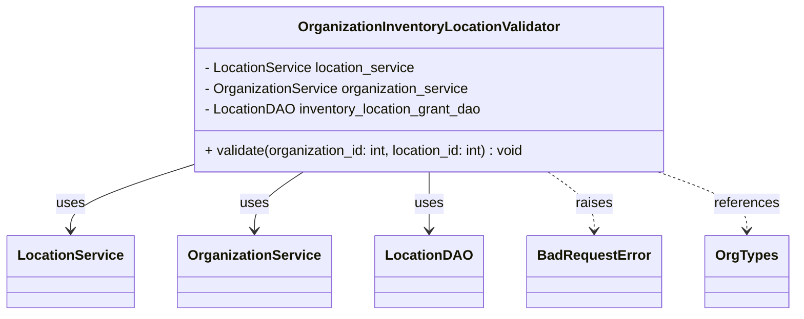
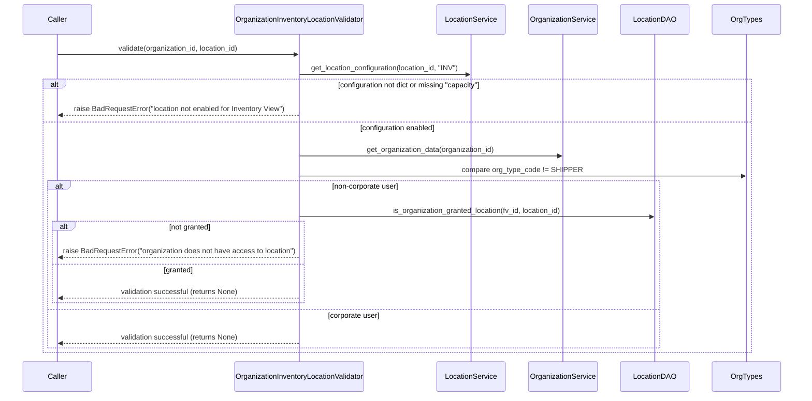

# Diagram: entity_core/entity_service/entity_inventory/entity_inventory_service/service/inventory_location.py

> Auto-generated by Obscura crawlers

## Diagram 1

### SVG

<svg id="container" width="885.015625" xmlns="http://www.w3.org/2000/svg" class="classDiagram" height="366" viewBox="0 0 885.015625 366" role="graphics-document document" aria-roledescription="class"><g><defs><marker id="container_class-aggregationStart" class="marker aggregation class" refX="18" refY="7" markerWidth="190" markerHeight="240" orient="auto"><path d="M 18,7 L9,13 L1,7 L9,1 Z"></path></marker></defs><defs><marker id="container_class-aggregationEnd" class="marker aggregation class" refX="1" refY="7" markerWidth="20" markerHeight="28" orient="auto"><path d="M 18,7 L9,13 L1,7 L9,1 Z"></path></marker></defs><defs><marker id="container_class-extensionStart" class="marker extension class" refX="18" refY="7" markerWidth="190" markerHeight="240" orient="auto"><path d="M 1,7 L18,13 V 1 Z"></path></marker></defs><defs><marker id="container_class-extensionEnd" class="marker extension class" refX="1" refY="7" markerWidth="20" markerHeight="28" orient="auto"><path d="M 1,1 V 13 L18,7 Z"></path></marker></defs><defs><marker id="container_class-compositionStart" class="marker composition class" refX="18" refY="7" markerWidth="190" markerHeight="240" orient="auto"><path d="M 18,7 L9,13 L1,7 L9,1 Z"></path></marker></defs><defs><marker id="container_class-compositionEnd" class="marker composition class" refX="1" refY="7" markerWidth="20" markerHeight="28" orient="auto"><path d="M 18,7 L9,13 L1,7 L9,1 Z"></path></marker></defs><defs><marker id="container_class-dependencyStart" class="marker dependency class" refX="6" refY="7" markerWidth="190" markerHeight="240" orient="auto"><path d="M 5,7 L9,13 L1,7 L9,1 Z"></path></marker></defs><defs><marker id="container_class-dependencyEnd" class="marker dependency class" refX="13" refY="7" markerWidth="20" markerHeight="28" orient="auto"><path d="M 18,7 L9,13 L14,7 L9,1 Z"></path></marker></defs><defs><marker id="container_class-lollipopStart" class="marker lollipop class" refX="13" refY="7" markerWidth="190" markerHeight="240" orient="auto"><circle stroke="black" fill="transparent" cx="7" cy="7" r="6"></circle></marker></defs><defs><marker id="container_class-lollipopEnd" class="marker lollipop class" refX="1" refY="7" markerWidth="190" markerHeight="240" orient="auto"><circle stroke="black" fill="transparent" cx="7" cy="7" r="6"></circle></marker></defs><g class="root"><g class="clusters"></g><g class="edgePaths"><path d="M201.234,195.952L180.694,202.794C160.154,209.635,119.073,223.317,98.533,235.325C77.992,247.333,77.992,257.667,77.992,262.833L77.992,268" id="id_OrganizationInventoryLocationValidator_LocationService_1" class="edge-thickness-normal edge-pattern-solid relation" style=";;;" data-edge="true" data-et="edge" data-id="id_OrganizationInventoryLocationValidator_LocationService_1" data-points="W3sieCI6MjAxLjIzNDM3NSwieSI6MTk1Ljk1MjIyMzUwNDc4MzUyfSx7IngiOjc3Ljk5MjE4NzUsInkiOjIzN30seyJ4Ijo3Ny45OTIxODc1LCJ5IjoyNzR9XQ==" marker-end="url(#container_class-dependencyEnd)"></path><path d="M337.294,200L328.299,206.167C319.305,212.333,301.317,224.667,292.322,236C283.328,247.333,283.328,257.667,283.328,262.833L283.328,268" id="id_OrganizationInventoryLocationValidator_OrganizationService_2" class="edge-thickness-normal edge-pattern-solid relation" style=";;;" data-edge="true" data-et="edge" data-id="id_OrganizationInventoryLocationValidator_OrganizationService_2" data-points="W3sieCI6MzM3LjI5MzcwMzAwNzUxODgsInkiOjIwMH0seyJ4IjoyODMuMzI4MTI1LCJ5IjoyMzd9LHsieCI6MjgzLjMyODEyNSwieSI6Mjc0fV0=" marker-end="url(#container_class-dependencyEnd)"></path><path d="M477.313,200L477.313,206.167C477.313,212.333,477.313,224.667,477.313,236C477.313,247.333,477.313,257.667,477.313,262.833L477.313,268" id="id_OrganizationInventoryLocationValidator_LocationDAO_3" class="edge-thickness-normal edge-pattern-solid relation" style=";;;" data-edge="true" data-et="edge" data-id="id_OrganizationInventoryLocationValidator_LocationDAO_3" data-points="W3sieCI6NDc3LjMxMjUsInkiOjIwMH0seyJ4Ijo0NzcuMzEyNSwieSI6MjM3fSx7IngiOjQ3Ny4zMTI1LCJ5IjoyNzR9XQ==" marker-end="url(#container_class-dependencyEnd)"></path><path d="M609.346,200L617.828,206.167C626.309,212.333,643.272,224.667,651.753,236C660.234,247.333,660.234,257.667,660.234,262.833L660.234,268" id="id_OrganizationInventoryLocationValidator_BadRequestError_4" class="edge-thickness-normal edge-pattern-dashed relation" style=";;;" data-edge="true" data-et="edge" data-id="id_OrganizationInventoryLocationValidator_BadRequestError_4" data-points="W3sieCI6NjA5LjM0NjMzNDU4NjQ2NjEsInkiOjIwMH0seyJ4Ijo2NjAuMjM0Mzc1LCJ5IjoyMzd9LHsieCI6NjYwLjIzNDM3NSwieSI6Mjc0fV0=" marker-end="url(#container_class-dependencyEnd)"></path><path d="M732.437,200L748.825,206.167C765.213,212.333,797.989,224.667,814.377,236C830.766,247.333,830.766,257.667,830.766,262.833L830.766,268" id="id_OrganizationInventoryLocationValidator_OrgTypes_5" class="edge-thickness-normal edge-pattern-dashed relation" style=";;;" data-edge="true" data-et="edge" data-id="id_OrganizationInventoryLocationValidator_OrgTypes_5" data-points="W3sieCI6NzMyLjQzNjU2MDE1MDM3NiwieSI6MjAwfSx7IngiOjgzMC43NjU2MjUsInkiOjIzN30seyJ4Ijo4MzAuNzY1NjI1LCJ5IjoyNzR9XQ==" marker-end="url(#container_class-dependencyEnd)"></path></g><g class="edgeLabels"><g class="edgeLabel" transform="translate(77.9921875, 237)"><g class="label" data-id="id_OrganizationInventoryLocationValidator_LocationService_1" transform="translate(-16.4921875, -12)"><foreignObject width="32.984375" height="24">

uses

</foreignObject></g></g><g class="edgeLabel" transform="translate(283.328125, 237)"><g class="label" data-id="id_OrganizationInventoryLocationValidator_OrganizationService_2" transform="translate(-16.4921875, -12)"><foreignObject width="32.984375" height="24">

uses

</foreignObject></g></g><g class="edgeLabel" transform="translate(477.3125, 237)"><g class="label" data-id="id_OrganizationInventoryLocationValidator_LocationDAO_3" transform="translate(-16.4921875, -12)"><foreignObject width="32.984375" height="24">

uses

</foreignObject></g></g><g class="edgeLabel" transform="translate(660.234375, 237)"><g class="label" data-id="id_OrganizationInventoryLocationValidator_BadRequestError_4" transform="translate(-21.25, -12)"><foreignObject width="42.5" height="24">

raises

</foreignObject></g></g><g class="edgeLabel" transform="translate(830.765625, 237)"><g class="label" data-id="id_OrganizationInventoryLocationValidator_OrgTypes_5" transform="translate(-37.828125, -12)"><foreignObject width="75.65625" height="24">

references

</foreignObject></g></g></g><g class="nodes"><g class="node default" id="classId-OrganizationInventoryLocationValidator-0" transform="translate(477.3125, 104)"><g class="basic label-container"><path d="M-276.078125 -96 L276.078125 -96 L276.078125 96 L-276.078125 96" stroke="none" stroke-width="0" fill="#ECECFF" style=""></path><path d="M-276.078125 -96 C-105.34427615532417 -96, 65.38957268935167 -96, 276.078125 -96 M-276.078125 -96 C-63.44658459827983 -96, 149.18495580344035 -96, 276.078125 -96 M276.078125 -96 C276.078125 -51.66643355310835, 276.078125 -7.332867106216696, 276.078125 96 M276.078125 -96 C276.078125 -20.577029133296747, 276.078125 54.845941733406505, 276.078125 96 M276.078125 96 C126.82532453686696 96, -22.427475926266084 96, -276.078125 96 M276.078125 96 C104.8294406633052 96, -66.41924367338959 96, -276.078125 96 M-276.078125 96 C-276.078125 53.41832650906343, -276.078125 10.836653018126853, -276.078125 -96 M-276.078125 96 C-276.078125 22.0082409144934, -276.078125 -51.9835181710132, -276.078125 -96" stroke="#9370DB" stroke-width="1.3" fill="none" stroke-dasharray="0 0" style=""></path></g><g class="annotation-group text" transform="translate(0, -72)"></g><g class="label-group text" transform="translate(-146.171875, -72)"><g class="label" style="font-weight: bolder" transform="translate(0,-12)"><foreignObject width="292.34375" height="24">

OrganizationInventoryLocationValidator

</foreignObject></g></g><g class="members-group text" transform="translate(-264.078125, -24)"><g class="label" style="" transform="translate(0,-12)"><foreignObject width="247.375" height="24">

- LocationService location_service

</foreignObject></g><g class="label" style="" transform="translate(0,12)"><foreignObject width="308.53125" height="24">

- OrganizationService organization_service

</foreignObject></g><g class="label" style="" transform="translate(0,36)"><foreignObject width="324.578125" height="24">

- LocationDAO inventory_location_grant_dao

</foreignObject></g></g><g class="methods-group text" transform="translate(-264.078125, 72)"><g class="label" style="" transform="translate(0,-12)"><foreignObject width="381.984375" height="24">

+ validate(organization_id: int, location_id: int) : void

</foreignObject></g></g><g class="divider" style=""><path d="M-276.078125 -48 C-80.15320428470369 -48, 115.77171643059262 -48, 276.078125 -48 M-276.078125 -48 C-60.40872524194489 -48, 155.2606745161102 -48, 276.078125 -48" stroke="#9370DB" stroke-width="1.3" fill="none" stroke-dasharray="0 0" style=""></path></g><g class="divider" style=""><path d="M-276.078125 48 C-98.26294732474233 48, 79.55223035051534 48, 276.078125 48 M-276.078125 48 C-162.70982664561194 48, -49.34152829122391 48, 276.078125 48" stroke="#9370DB" stroke-width="1.3" fill="none" stroke-dasharray="0 0" style=""></path></g></g><g class="node default" id="classId-LocationService-1" transform="translate(77.9921875, 316)"><g class="basic label-container"><path d="M-69.9921875 -42 L69.9921875 -42 L69.9921875 42 L-69.9921875 42" stroke="none" stroke-width="0" fill="#ECECFF" style=""></path><path d="M-69.9921875 -42 C-29.879878063008746 -42, 10.232431373982507 -42, 69.9921875 -42 M-69.9921875 -42 C-39.1705064022293 -42, -8.3488253044586 -42, 69.9921875 -42 M69.9921875 -42 C69.9921875 -22.099620587405706, 69.9921875 -2.1992411748114122, 69.9921875 42 M69.9921875 -42 C69.9921875 -12.299277370157789, 69.9921875 17.401445259684422, 69.9921875 42 M69.9921875 42 C28.640728882399166 42, -12.710729735201667 42, -69.9921875 42 M69.9921875 42 C27.19235343793614 42, -15.607480624127717 42, -69.9921875 42 M-69.9921875 42 C-69.9921875 22.348592923451836, -69.9921875 2.697185846903672, -69.9921875 -42 M-69.9921875 42 C-69.9921875 23.547491234188985, -69.9921875 5.094982468377971, -69.9921875 -42" stroke="#9370DB" stroke-width="1.3" fill="none" stroke-dasharray="0 0" style=""></path></g><g class="annotation-group text" transform="translate(0, -18)"></g><g class="label-group text" transform="translate(-57.9921875, -18)"><g class="label" style="font-weight: bolder" transform="translate(0,-12)"><foreignObject width="115.984375" height="24">

LocationService

</foreignObject></g></g><g class="members-group text" transform="translate(-57.9921875, 30)"></g><g class="methods-group text" transform="translate(-57.9921875, 60)"></g><g class="divider" style=""><path d="M-69.9921875 6 C-37.854438220605076 6, -5.716688941210151 6, 69.9921875 6 M-69.9921875 6 C-36.52953959040157 6, -3.0668916808031383 6, 69.9921875 6" stroke="#9370DB" stroke-width="1.3" fill="none" stroke-dasharray="0 0" style=""></path></g><g class="divider" style=""><path d="M-69.9921875 24 C-29.555907088704828 24, 10.880373322590344 24, 69.9921875 24 M-69.9921875 24 C-29.141089422345757 24, 11.710008655308485 24, 69.9921875 24" stroke="#9370DB" stroke-width="1.3" fill="none" stroke-dasharray="0 0" style=""></path></g></g><g class="node default" id="classId-OrganizationService-2" transform="translate(283.328125, 316)"><g class="basic label-container"><path d="M-85.34375 -42 L85.34375 -42 L85.34375 42 L-85.34375 42" stroke="none" stroke-width="0" fill="#ECECFF" style=""></path><path d="M-85.34375 -42 C-43.47536362666753 -42, -1.6069772533350601 -42, 85.34375 -42 M-85.34375 -42 C-43.06226569823516 -42, -0.7807813964703172 -42, 85.34375 -42 M85.34375 -42 C85.34375 -18.84885109102776, 85.34375 4.302297817944478, 85.34375 42 M85.34375 -42 C85.34375 -22.76869620109113, 85.34375 -3.537392402182263, 85.34375 42 M85.34375 42 C48.61415938138252 42, 11.884568762765042 42, -85.34375 42 M85.34375 42 C24.64444204601697 42, -36.05486590796606 42, -85.34375 42 M-85.34375 42 C-85.34375 8.507914960258915, -85.34375 -24.98417007948217, -85.34375 -42 M-85.34375 42 C-85.34375 12.27417404405573, -85.34375 -17.45165191188854, -85.34375 -42" stroke="#9370DB" stroke-width="1.3" fill="none" stroke-dasharray="0 0" style=""></path></g><g class="annotation-group text" transform="translate(0, -18)"></g><g class="label-group text" transform="translate(-73.34375, -18)"><g class="label" style="font-weight: bolder" transform="translate(0,-12)"><foreignObject width="146.6875" height="24">

OrganizationService

</foreignObject></g></g><g class="members-group text" transform="translate(-73.34375, 30)"></g><g class="methods-group text" transform="translate(-73.34375, 60)"></g><g class="divider" style=""><path d="M-85.34375 6 C-17.792252757164277 6, 49.759244485671445 6, 85.34375 6 M-85.34375 6 C-38.29188060518031 6, 8.75998878963938 6, 85.34375 6" stroke="#9370DB" stroke-width="1.3" fill="none" stroke-dasharray="0 0" style=""></path></g><g class="divider" style=""><path d="M-85.34375 24 C-36.736631425879715 24, 11.87048714824057 24, 85.34375 24 M-85.34375 24 C-26.387505772792423 24, 32.568738454415154 24, 85.34375 24" stroke="#9370DB" stroke-width="1.3" fill="none" stroke-dasharray="0 0" style=""></path></g></g><g class="node default" id="classId-LocationDAO-3" transform="translate(477.3125, 316)"><g class="basic label-container"><path d="M-58.640625 -42 L58.640625 -42 L58.640625 42 L-58.640625 42" stroke="none" stroke-width="0" fill="#ECECFF" style=""></path><path d="M-58.640625 -42 C-25.47647868651884 -42, 7.687667626962323 -42, 58.640625 -42 M-58.640625 -42 C-15.309755180501682 -42, 28.021114638996636 -42, 58.640625 -42 M58.640625 -42 C58.640625 -18.290588772068816, 58.640625 5.418822455862369, 58.640625 42 M58.640625 -42 C58.640625 -9.360809919074413, 58.640625 23.278380161851175, 58.640625 42 M58.640625 42 C25.571497933860513 42, -7.497629132278973 42, -58.640625 42 M58.640625 42 C20.008488708533953 42, -18.623647582932094 42, -58.640625 42 M-58.640625 42 C-58.640625 19.78760434120388, -58.640625 -2.4247913175922378, -58.640625 -42 M-58.640625 42 C-58.640625 19.027413961812012, -58.640625 -3.9451720763759752, -58.640625 -42" stroke="#9370DB" stroke-width="1.3" fill="none" stroke-dasharray="0 0" style=""></path></g><g class="annotation-group text" transform="translate(0, -18)"></g><g class="label-group text" transform="translate(-46.640625, -18)"><g class="label" style="font-weight: bolder" transform="translate(0,-12)"><foreignObject width="93.28125" height="24">

LocationDAO

</foreignObject></g></g><g class="members-group text" transform="translate(-46.640625, 30)"></g><g class="methods-group text" transform="translate(-46.640625, 60)"></g><g class="divider" style=""><path d="M-58.640625 6 C-22.316766691038396 6, 14.007091617923209 6, 58.640625 6 M-58.640625 6 C-12.784625030965536 6, 33.07137493806893 6, 58.640625 6" stroke="#9370DB" stroke-width="1.3" fill="none" stroke-dasharray="0 0" style=""></path></g><g class="divider" style=""><path d="M-58.640625 24 C-24.927688928957444 24, 8.785247142085112 24, 58.640625 24 M-58.640625 24 C-26.81178932286013 24, 5.017046354279742 24, 58.640625 24" stroke="#9370DB" stroke-width="1.3" fill="none" stroke-dasharray="0 0" style=""></path></g></g><g class="node default" id="classId-BadRequestError-4" transform="translate(660.234375, 316)"><g class="basic label-container"><path d="M-74.28125 -42 L74.28125 -42 L74.28125 42 L-74.28125 42" stroke="none" stroke-width="0" fill="#ECECFF" style=""></path><path d="M-74.28125 -42 C-36.163059956809796 -42, 1.9551300863804073 -42, 74.28125 -42 M-74.28125 -42 C-29.813883663167516 -42, 14.653482673664968 -42, 74.28125 -42 M74.28125 -42 C74.28125 -18.152822731784585, 74.28125 5.694354536430829, 74.28125 42 M74.28125 -42 C74.28125 -8.894565072726238, 74.28125 24.210869854547525, 74.28125 42 M74.28125 42 C32.81588965709844 42, -8.649470685803124 42, -74.28125 42 M74.28125 42 C36.58446165506015 42, -1.1123266898796942 42, -74.28125 42 M-74.28125 42 C-74.28125 23.252789021790704, -74.28125 4.505578043581409, -74.28125 -42 M-74.28125 42 C-74.28125 14.69545296299901, -74.28125 -12.60909407400198, -74.28125 -42" stroke="#9370DB" stroke-width="1.3" fill="none" stroke-dasharray="0 0" style=""></path></g><g class="annotation-group text" transform="translate(0, -18)"></g><g class="label-group text" transform="translate(-62.28125, -18)"><g class="label" style="font-weight: bolder" transform="translate(0,-12)"><foreignObject width="124.5625" height="24">

BadRequestError

</foreignObject></g></g><g class="members-group text" transform="translate(-62.28125, 30)"></g><g class="methods-group text" transform="translate(-62.28125, 60)"></g><g class="divider" style=""><path d="M-74.28125 6 C-18.396165929990474 6, 37.48891814001905 6, 74.28125 6 M-74.28125 6 C-30.910677363731153 6, 12.459895272537693 6, 74.28125 6" stroke="#9370DB" stroke-width="1.3" fill="none" stroke-dasharray="0 0" style=""></path></g><g class="divider" style=""><path d="M-74.28125 24 C-28.901835663497394 24, 16.477578673005212 24, 74.28125 24 M-74.28125 24 C-25.61294518941778 24, 23.055359621164442 24, 74.28125 24" stroke="#9370DB" stroke-width="1.3" fill="none" stroke-dasharray="0 0" style=""></path></g></g><g class="node default" id="classId-OrgTypes-5" transform="translate(830.765625, 316)"><g class="basic label-container"><path d="M-46.25 -42 L46.25 -42 L46.25 42 L-46.25 42" stroke="none" stroke-width="0" fill="#ECECFF" style=""></path><path d="M-46.25 -42 C-24.95418192504147 -42, -3.6583638500829423 -42, 46.25 -42 M-46.25 -42 C-23.883065433030904 -42, -1.5161308660618076 -42, 46.25 -42 M46.25 -42 C46.25 -11.956113948347475, 46.25 18.08777210330505, 46.25 42 M46.25 -42 C46.25 -20.872585836274254, 46.25 0.25482832745149153, 46.25 42 M46.25 42 C24.879314723660627 42, 3.5086294473212547 42, -46.25 42 M46.25 42 C22.580294886615594 42, -1.0894102267688126 42, -46.25 42 M-46.25 42 C-46.25 21.880788748551826, -46.25 1.7615774971036515, -46.25 -42 M-46.25 42 C-46.25 15.82350102198372, -46.25 -10.35299795603256, -46.25 -42" stroke="#9370DB" stroke-width="1.3" fill="none" stroke-dasharray="0 0" style=""></path></g><g class="annotation-group text" transform="translate(0, -18)"></g><g class="label-group text" transform="translate(-34.25, -18)"><g class="label" style="font-weight: bolder" transform="translate(0,-12)"><foreignObject width="68.5" height="24">

OrgTypes

</foreignObject></g></g><g class="members-group text" transform="translate(-34.25, 30)"></g><g class="methods-group text" transform="translate(-34.25, 60)"></g><g class="divider" style=""><path d="M-46.25 6 C-27.685017973021857 6, -9.120035946043714 6, 46.25 6 M-46.25 6 C-25.310171910034978 6, -4.370343820069955 6, 46.25 6" stroke="#9370DB" stroke-width="1.3" fill="none" stroke-dasharray="0 0" style=""></path></g><g class="divider" style=""><path d="M-46.25 24 C-25.66599029227901 24, -5.081980584558018 24, 46.25 24 M-46.25 24 C-15.038544310691442 24, 16.172911378617115 24, 46.25 24" stroke="#9370DB" stroke-width="1.3" fill="none" stroke-dasharray="0 0" style=""></path></g></g></g></g></g></svg>

## Diagram 2

### SVG

<svg id="container" width="1851" xmlns="http://www.w3.org/2000/svg" height="903" viewBox="-50 -10 1851 903" role="graphics-document document" aria-roledescription="sequence"><g><rect x="1601" y="817" fill="#eaeaea" stroke="#666" width="150" height="65" name="OrgTypes" rx="3" ry="3" class="actor actor-bottom"></rect><text x="1676" y="849.5" dominant-baseline="central" alignment-baseline="central" class="actor actor-box" style="text-anchor: middle; font-size: 16px; font-weight: 400;"><tspan x="1676" dy="0">OrgTypes</tspan></text></g><g><rect x="1401" y="817" fill="#eaeaea" stroke="#666" width="150" height="65" name="LocationDAO" rx="3" ry="3" class="actor actor-bottom"></rect><text x="1476" y="849.5" dominant-baseline="central" alignment-baseline="central" class="actor actor-box" style="text-anchor: middle; font-size: 16px; font-weight: 400;"><tspan x="1476" dy="0">LocationDAO</tspan></text></g><g><rect x="1187" y="817" fill="#eaeaea" stroke="#666" width="164" height="65" name="OrganizationService" rx="3" ry="3" class="actor actor-bottom"></rect><text x="1269" y="849.5" dominant-baseline="central" alignment-baseline="central" class="actor actor-box" style="text-anchor: middle; font-size: 16px; font-weight: 400;"><tspan x="1269" dy="0">OrganizationService</tspan></text></g><g><rect x="987" y="817" fill="#eaeaea" stroke="#666" width="150" height="65" name="LocationService" rx="3" ry="3" class="actor actor-bottom"></rect><text x="1062" y="849.5" dominant-baseline="central" alignment-baseline="central" class="actor actor-box" style="text-anchor: middle; font-size: 16px; font-weight: 400;"><tspan x="1062" dy="0">LocationService</tspan></text></g><g><rect x="506.5" y="817" fill="#eaeaea" stroke="#666" width="309" height="65" name="Validator" rx="3" ry="3" class="actor actor-bottom"></rect><text x="661" y="849.5" dominant-baseline="central" alignment-baseline="central" class="actor actor-box" style="text-anchor: middle; font-size: 16px; font-weight: 400;"><tspan x="661" dy="0">OrganizationInventoryLocationValidator</tspan></text></g><g><rect x="0" y="817" fill="#eaeaea" stroke="#666" width="150" height="65" name="Caller" rx="3" ry="3" class="actor actor-bottom"></rect><text x="75" y="849.5" dominant-baseline="central" alignment-baseline="central" class="actor actor-box" style="text-anchor: middle; font-size: 16px; font-weight: 400;"><tspan x="75" dy="0">Caller</tspan></text></g><g><line id="actor5" x1="1676" y1="65" x2="1676" y2="817" class="actor-line 200" stroke-width="0.5px" stroke="#999" name="OrgTypes"></line><g id="root-5"><rect x="1601" y="0" fill="#eaeaea" stroke="#666" width="150" height="65" name="OrgTypes" rx="3" ry="3" class="actor actor-top"></rect><text x="1676" y="32.5" dominant-baseline="central" alignment-baseline="central" class="actor actor-box" style="text-anchor: middle; font-size: 16px; font-weight: 400;"><tspan x="1676" dy="0">OrgTypes</tspan></text></g></g><g><line id="actor4" x1="1476" y1="65" x2="1476" y2="817" class="actor-line 200" stroke-width="0.5px" stroke="#999" name="LocationDAO"></line><g id="root-4"><rect x="1401" y="0" fill="#eaeaea" stroke="#666" width="150" height="65" name="LocationDAO" rx="3" ry="3" class="actor actor-top"></rect><text x="1476" y="32.5" dominant-baseline="central" alignment-baseline="central" class="actor actor-box" style="text-anchor: middle; font-size: 16px; font-weight: 400;"><tspan x="1476" dy="0">LocationDAO</tspan></text></g></g><g><line id="actor3" x1="1269" y1="65" x2="1269" y2="817" class="actor-line 200" stroke-width="0.5px" stroke="#999" name="OrganizationService"></line><g id="root-3"><rect x="1187" y="0" fill="#eaeaea" stroke="#666" width="164" height="65" name="OrganizationService" rx="3" ry="3" class="actor actor-top"></rect><text x="1269" y="32.5" dominant-baseline="central" alignment-baseline="central" class="actor actor-box" style="text-anchor: middle; font-size: 16px; font-weight: 400;"><tspan x="1269" dy="0">OrganizationService</tspan></text></g></g><g><line id="actor2" x1="1062" y1="65" x2="1062" y2="817" class="actor-line 200" stroke-width="0.5px" stroke="#999" name="LocationService"></line><g id="root-2"><rect x="987" y="0" fill="#eaeaea" stroke="#666" width="150" height="65" name="LocationService" rx="3" ry="3" class="actor actor-top"></rect><text x="1062" y="32.5" dominant-baseline="central" alignment-baseline="central" class="actor actor-box" style="text-anchor: middle; font-size: 16px; font-weight: 400;"><tspan x="1062" dy="0">LocationService</tspan></text></g></g><g><line id="actor1" x1="661" y1="65" x2="661" y2="817" class="actor-line 200" stroke-width="0.5px" stroke="#999" name="Validator"></line><g id="root-1"><rect x="506.5" y="0" fill="#eaeaea" stroke="#666" width="309" height="65" name="Validator" rx="3" ry="3" class="actor actor-top"></rect><text x="661" y="32.5" dominant-baseline="central" alignment-baseline="central" class="actor actor-box" style="text-anchor: middle; font-size: 16px; font-weight: 400;"><tspan x="661" dy="0">OrganizationInventoryLocationValidator</tspan></text></g></g><g><line id="actor0" x1="75" y1="65" x2="75" y2="817" class="actor-line 200" stroke-width="0.5px" stroke="#999" name="Caller"></line><g id="root-0"><rect x="0" y="0" fill="#eaeaea" stroke="#666" width="150" height="65" name="Caller" rx="3" ry="3" class="actor actor-top"></rect><text x="75" y="32.5" dominant-baseline="central" alignment-baseline="central" class="actor actor-box" style="text-anchor: middle; font-size: 16px; font-weight: 400;"><tspan x="75" dy="0">Caller</tspan></text></g></g><g></g><defs><symbol id="computer" width="24" height="24"><path transform="scale(.5)" d="M2 2v13h20v-13h-20zm18 11h-16v-9h16v9zm-10.228 6l.466-1h3.524l.467 1h-4.457zm14.228 3h-24l2-6h2.104l-1.33 4h18.45l-1.297-4h2.073l2 6zm-5-10h-14v-7h14v7z"></path></symbol></defs><defs><symbol id="database" fill-rule="evenodd" clip-rule="evenodd"><path transform="scale(.5)" d="M12.258.001l.256.004.255.005.253.008.251.01.249.012.247.015.246.016.242.019.241.02.239.023.236.024.233.027.231.028.229.031.225.032.223.034.22.036.217.038.214.04.211.041.208.043.205.045.201.046.198.048.194.05.191.051.187.053.183.054.18.056.175.057.172.059.168.06.163.061.16.063.155.064.15.066.074.033.073.033.071.034.07.034.069.035.068.035.067.035.066.035.064.036.064.036.062.036.06.036.06.037.058.037.058.037.055.038.055.038.053.038.052.038.051.039.05.039.048.039.047.039.045.04.044.04.043.04.041.04.04.041.039.041.037.041.036.041.034.041.033.042.032.042.03.042.029.042.027.042.026.043.024.043.023.043.021.043.02.043.018.044.017.043.015.044.013.044.012.044.011.045.009.044.007.045.006.045.004.045.002.045.001.045v17l-.001.045-.002.045-.004.045-.006.045-.007.045-.009.044-.011.045-.012.044-.013.044-.015.044-.017.043-.018.044-.02.043-.021.043-.023.043-.024.043-.026.043-.027.042-.029.042-.03.042-.032.042-.033.042-.034.041-.036.041-.037.041-.039.041-.04.041-.041.04-.043.04-.044.04-.045.04-.047.039-.048.039-.05.039-.051.039-.052.038-.053.038-.055.038-.055.038-.058.037-.058.037-.06.037-.06.036-.062.036-.064.036-.064.036-.066.035-.067.035-.068.035-.069.035-.07.034-.071.034-.073.033-.074.033-.15.066-.155.064-.16.063-.163.061-.168.06-.172.059-.175.057-.18.056-.183.054-.187.053-.191.051-.194.05-.198.048-.201.046-.205.045-.208.043-.211.041-.214.04-.217.038-.22.036-.223.034-.225.032-.229.031-.231.028-.233.027-.236.024-.239.023-.241.02-.242.019-.246.016-.247.015-.249.012-.251.01-.253.008-.255.005-.256.004-.258.001-.258-.001-.256-.004-.255-.005-.253-.008-.251-.01-.249-.012-.247-.015-.245-.016-.243-.019-.241-.02-.238-.023-.236-.024-.234-.027-.231-.028-.228-.031-.226-.032-.223-.034-.22-.036-.217-.038-.214-.04-.211-.041-.208-.043-.204-.045-.201-.046-.198-.048-.195-.05-.19-.051-.187-.053-.184-.054-.179-.056-.176-.057-.172-.059-.167-.06-.164-.061-.159-.063-.155-.064-.151-.066-.074-.033-.072-.033-.072-.034-.07-.034-.069-.035-.068-.035-.067-.035-.066-.035-.064-.036-.063-.036-.062-.036-.061-.036-.06-.037-.058-.037-.057-.037-.056-.038-.055-.038-.053-.038-.052-.038-.051-.039-.049-.039-.049-.039-.046-.039-.046-.04-.044-.04-.043-.04-.041-.04-.04-.041-.039-.041-.037-.041-.036-.041-.034-.041-.033-.042-.032-.042-.03-.042-.029-.042-.027-.042-.026-.043-.024-.043-.023-.043-.021-.043-.02-.043-.018-.044-.017-.043-.015-.044-.013-.044-.012-.044-.011-.045-.009-.044-.007-.045-.006-.045-.004-.045-.002-.045-.001-.045v-17l.001-.045.002-.045.004-.045.006-.045.007-.045.009-.044.011-.045.012-.044.013-.044.015-.044.017-.043.018-.044.02-.043.021-.043.023-.043.024-.043.026-.043.027-.042.029-.042.03-.042.032-.042.033-.042.034-.041.036-.041.037-.041.039-.041.04-.041.041-.04.043-.04.044-.04.046-.04.046-.039.049-.039.049-.039.051-.039.052-.038.053-.038.055-.038.056-.038.057-.037.058-.037.06-.037.061-.036.062-.036.063-.036.064-.036.066-.035.067-.035.068-.035.069-.035.07-.034.072-.034.072-.033.074-.033.151-.066.155-.064.159-.063.164-.061.167-.06.172-.059.176-.057.179-.056.184-.054.187-.053.19-.051.195-.05.198-.048.201-.046.204-.045.208-.043.211-.041.214-.04.217-.038.22-.036.223-.034.226-.032.228-.031.231-.028.234-.027.236-.024.238-.023.241-.02.243-.019.245-.016.247-.015.249-.012.251-.01.253-.008.255-.005.256-.004.258-.001.258.001zm-9.258 20.499v.01l.001.021.003.021.004.022.005.021.006.022.007.022.009.023.01.022.011.023.012.023.013.023.015.023.016.024.017.023.018.024.019.024.021.024.022.025.023.024.024.025.052.049.056.05.061.051.066.051.07.051.075.051.079.052.084.052.088.052.092.052.097.052.102.051.105.052.11.052.114.051.119.051.123.051.127.05.131.05.135.05.139.048.144.049.147.047.152.047.155.047.16.045.163.045.167.043.171.043.176.041.178.041.183.039.187.039.19.037.194.035.197.035.202.033.204.031.209.03.212.029.216.027.219.025.222.024.226.021.23.02.233.018.236.016.24.015.243.012.246.01.249.008.253.005.256.004.259.001.26-.001.257-.004.254-.005.25-.008.247-.011.244-.012.241-.014.237-.016.233-.018.231-.021.226-.021.224-.024.22-.026.216-.027.212-.028.21-.031.205-.031.202-.034.198-.034.194-.036.191-.037.187-.039.183-.04.179-.04.175-.042.172-.043.168-.044.163-.045.16-.046.155-.046.152-.047.148-.048.143-.049.139-.049.136-.05.131-.05.126-.05.123-.051.118-.052.114-.051.11-.052.106-.052.101-.052.096-.052.092-.052.088-.053.083-.051.079-.052.074-.052.07-.051.065-.051.06-.051.056-.05.051-.05.023-.024.023-.025.021-.024.02-.024.019-.024.018-.024.017-.024.015-.023.014-.024.013-.023.012-.023.01-.023.01-.022.008-.022.006-.022.006-.022.004-.022.004-.021.001-.021.001-.021v-4.127l-.077.055-.08.053-.083.054-.085.053-.087.052-.09.052-.093.051-.095.05-.097.05-.1.049-.102.049-.105.048-.106.047-.109.047-.111.046-.114.045-.115.045-.118.044-.12.043-.122.042-.124.042-.126.041-.128.04-.13.04-.132.038-.134.038-.135.037-.138.037-.139.035-.142.035-.143.034-.144.033-.147.032-.148.031-.15.03-.151.03-.153.029-.154.027-.156.027-.158.026-.159.025-.161.024-.162.023-.163.022-.165.021-.166.02-.167.019-.169.018-.169.017-.171.016-.173.015-.173.014-.175.013-.175.012-.177.011-.178.01-.179.008-.179.008-.181.006-.182.005-.182.004-.184.003-.184.002h-.37l-.184-.002-.184-.003-.182-.004-.182-.005-.181-.006-.179-.008-.179-.008-.178-.01-.176-.011-.176-.012-.175-.013-.173-.014-.172-.015-.171-.016-.17-.017-.169-.018-.167-.019-.166-.02-.165-.021-.163-.022-.162-.023-.161-.024-.159-.025-.157-.026-.156-.027-.155-.027-.153-.029-.151-.03-.15-.03-.148-.031-.146-.032-.145-.033-.143-.034-.141-.035-.14-.035-.137-.037-.136-.037-.134-.038-.132-.038-.13-.04-.128-.04-.126-.041-.124-.042-.122-.042-.12-.044-.117-.043-.116-.045-.113-.045-.112-.046-.109-.047-.106-.047-.105-.048-.102-.049-.1-.049-.097-.05-.095-.05-.093-.052-.09-.051-.087-.052-.085-.053-.083-.054-.08-.054-.077-.054v4.127zm0-5.654v.011l.001.021.003.021.004.021.005.022.006.022.007.022.009.022.01.022.011.023.012.023.013.023.015.024.016.023.017.024.018.024.019.024.021.024.022.024.023.025.024.024.052.05.056.05.061.05.066.051.07.051.075.052.079.051.084.052.088.052.092.052.097.052.102.052.105.052.11.051.114.051.119.052.123.05.127.051.131.05.135.049.139.049.144.048.147.048.152.047.155.046.16.045.163.045.167.044.171.042.176.042.178.04.183.04.187.038.19.037.194.036.197.034.202.033.204.032.209.03.212.028.216.027.219.025.222.024.226.022.23.02.233.018.236.016.24.014.243.012.246.01.249.008.253.006.256.003.259.001.26-.001.257-.003.254-.006.25-.008.247-.01.244-.012.241-.015.237-.016.233-.018.231-.02.226-.022.224-.024.22-.025.216-.027.212-.029.21-.03.205-.032.202-.033.198-.035.194-.036.191-.037.187-.039.183-.039.179-.041.175-.042.172-.043.168-.044.163-.045.16-.045.155-.047.152-.047.148-.048.143-.048.139-.05.136-.049.131-.05.126-.051.123-.051.118-.051.114-.052.11-.052.106-.052.101-.052.096-.052.092-.052.088-.052.083-.052.079-.052.074-.051.07-.052.065-.051.06-.05.056-.051.051-.049.023-.025.023-.024.021-.025.02-.024.019-.024.018-.024.017-.024.015-.023.014-.023.013-.024.012-.022.01-.023.01-.023.008-.022.006-.022.006-.022.004-.021.004-.022.001-.021.001-.021v-4.139l-.077.054-.08.054-.083.054-.085.052-.087.053-.09.051-.093.051-.095.051-.097.05-.1.049-.102.049-.105.048-.106.047-.109.047-.111.046-.114.045-.115.044-.118.044-.12.044-.122.042-.124.042-.126.041-.128.04-.13.039-.132.039-.134.038-.135.037-.138.036-.139.036-.142.035-.143.033-.144.033-.147.033-.148.031-.15.03-.151.03-.153.028-.154.028-.156.027-.158.026-.159.025-.161.024-.162.023-.163.022-.165.021-.166.02-.167.019-.169.018-.169.017-.171.016-.173.015-.173.014-.175.013-.175.012-.177.011-.178.009-.179.009-.179.007-.181.007-.182.005-.182.004-.184.003-.184.002h-.37l-.184-.002-.184-.003-.182-.004-.182-.005-.181-.007-.179-.007-.179-.009-.178-.009-.176-.011-.176-.012-.175-.013-.173-.014-.172-.015-.171-.016-.17-.017-.169-.018-.167-.019-.166-.02-.165-.021-.163-.022-.162-.023-.161-.024-.159-.025-.157-.026-.156-.027-.155-.028-.153-.028-.151-.03-.15-.03-.148-.031-.146-.033-.145-.033-.143-.033-.141-.035-.14-.036-.137-.036-.136-.037-.134-.038-.132-.039-.13-.039-.128-.04-.126-.041-.124-.042-.122-.043-.12-.043-.117-.044-.116-.044-.113-.046-.112-.046-.109-.046-.106-.047-.105-.048-.102-.049-.1-.049-.097-.05-.095-.051-.093-.051-.09-.051-.087-.053-.085-.052-.083-.054-.08-.054-.077-.054v4.139zm0-5.666v.011l.001.02.003.022.004.021.005.022.006.021.007.022.009.023.01.022.011.023.012.023.013.023.015.023.016.024.017.024.018.023.019.024.021.025.022.024.023.024.024.025.052.05.056.05.061.05.066.051.07.051.075.052.079.051.084.052.088.052.092.052.097.052.102.052.105.051.11.052.114.051.119.051.123.051.127.05.131.05.135.05.139.049.144.048.147.048.152.047.155.046.16.045.163.045.167.043.171.043.176.042.178.04.183.04.187.038.19.037.194.036.197.034.202.033.204.032.209.03.212.028.216.027.219.025.222.024.226.021.23.02.233.018.236.017.24.014.243.012.246.01.249.008.253.006.256.003.259.001.26-.001.257-.003.254-.006.25-.008.247-.01.244-.013.241-.014.237-.016.233-.018.231-.02.226-.022.224-.024.22-.025.216-.027.212-.029.21-.03.205-.032.202-.033.198-.035.194-.036.191-.037.187-.039.183-.039.179-.041.175-.042.172-.043.168-.044.163-.045.16-.045.155-.047.152-.047.148-.048.143-.049.139-.049.136-.049.131-.051.126-.05.123-.051.118-.052.114-.051.11-.052.106-.052.101-.052.096-.052.092-.052.088-.052.083-.052.079-.052.074-.052.07-.051.065-.051.06-.051.056-.05.051-.049.023-.025.023-.025.021-.024.02-.024.019-.024.018-.024.017-.024.015-.023.014-.024.013-.023.012-.023.01-.022.01-.023.008-.022.006-.022.006-.022.004-.022.004-.021.001-.021.001-.021v-4.153l-.077.054-.08.054-.083.053-.085.053-.087.053-.09.051-.093.051-.095.051-.097.05-.1.049-.102.048-.105.048-.106.048-.109.046-.111.046-.114.046-.115.044-.118.044-.12.043-.122.043-.124.042-.126.041-.128.04-.13.039-.132.039-.134.038-.135.037-.138.036-.139.036-.142.034-.143.034-.144.033-.147.032-.148.032-.15.03-.151.03-.153.028-.154.028-.156.027-.158.026-.159.024-.161.024-.162.023-.163.023-.165.021-.166.02-.167.019-.169.018-.169.017-.171.016-.173.015-.173.014-.175.013-.175.012-.177.01-.178.01-.179.009-.179.007-.181.006-.182.006-.182.004-.184.003-.184.001-.185.001-.185-.001-.184-.001-.184-.003-.182-.004-.182-.006-.181-.006-.179-.007-.179-.009-.178-.01-.176-.01-.176-.012-.175-.013-.173-.014-.172-.015-.171-.016-.17-.017-.169-.018-.167-.019-.166-.02-.165-.021-.163-.023-.162-.023-.161-.024-.159-.024-.157-.026-.156-.027-.155-.028-.153-.028-.151-.03-.15-.03-.148-.032-.146-.032-.145-.033-.143-.034-.141-.034-.14-.036-.137-.036-.136-.037-.134-.038-.132-.039-.13-.039-.128-.041-.126-.041-.124-.041-.122-.043-.12-.043-.117-.044-.116-.044-.113-.046-.112-.046-.109-.046-.106-.048-.105-.048-.102-.048-.1-.05-.097-.049-.095-.051-.093-.051-.09-.052-.087-.052-.085-.053-.083-.053-.08-.054-.077-.054v4.153zm8.74-8.179l-.257.004-.254.005-.25.008-.247.011-.244.012-.241.014-.237.016-.233.018-.231.021-.226.022-.224.023-.22.026-.216.027-.212.028-.21.031-.205.032-.202.033-.198.034-.194.036-.191.038-.187.038-.183.04-.179.041-.175.042-.172.043-.168.043-.163.045-.16.046-.155.046-.152.048-.148.048-.143.048-.139.049-.136.05-.131.05-.126.051-.123.051-.118.051-.114.052-.11.052-.106.052-.101.052-.096.052-.092.052-.088.052-.083.052-.079.052-.074.051-.07.052-.065.051-.06.05-.056.05-.051.05-.023.025-.023.024-.021.024-.02.025-.019.024-.018.024-.017.023-.015.024-.014.023-.013.023-.012.023-.01.023-.01.022-.008.022-.006.023-.006.021-.004.022-.004.021-.001.021-.001.021.001.021.001.021.004.021.004.022.006.021.006.023.008.022.01.022.01.023.012.023.013.023.014.023.015.024.017.023.018.024.019.024.02.025.021.024.023.024.023.025.051.05.056.05.06.05.065.051.07.052.074.051.079.052.083.052.088.052.092.052.096.052.101.052.106.052.11.052.114.052.118.051.123.051.126.051.131.05.136.05.139.049.143.048.148.048.152.048.155.046.16.046.163.045.168.043.172.043.175.042.179.041.183.04.187.038.191.038.194.036.198.034.202.033.205.032.21.031.212.028.216.027.22.026.224.023.226.022.231.021.233.018.237.016.241.014.244.012.247.011.25.008.254.005.257.004.26.001.26-.001.257-.004.254-.005.25-.008.247-.011.244-.012.241-.014.237-.016.233-.018.231-.021.226-.022.224-.023.22-.026.216-.027.212-.028.21-.031.205-.032.202-.033.198-.034.194-.036.191-.038.187-.038.183-.04.179-.041.175-.042.172-.043.168-.043.163-.045.16-.046.155-.046.152-.048.148-.048.143-.048.139-.049.136-.05.131-.05.126-.051.123-.051.118-.051.114-.052.11-.052.106-.052.101-.052.096-.052.092-.052.088-.052.083-.052.079-.052.074-.051.07-.052.065-.051.06-.05.056-.05.051-.05.023-.025.023-.024.021-.024.02-.025.019-.024.018-.024.017-.023.015-.024.014-.023.013-.023.012-.023.01-.023.01-.022.008-.022.006-.023.006-.021.004-.022.004-.021.001-.021.001-.021-.001-.021-.001-.021-.004-.021-.004-.022-.006-.021-.006-.023-.008-.022-.01-.022-.01-.023-.012-.023-.013-.023-.014-.023-.015-.024-.017-.023-.018-.024-.019-.024-.02-.025-.021-.024-.023-.024-.023-.025-.051-.05-.056-.05-.06-.05-.065-.051-.07-.052-.074-.051-.079-.052-.083-.052-.088-.052-.092-.052-.096-.052-.101-.052-.106-.052-.11-.052-.114-.052-.118-.051-.123-.051-.126-.051-.131-.05-.136-.05-.139-.049-.143-.048-.148-.048-.152-.048-.155-.046-.16-.046-.163-.045-.168-.043-.172-.043-.175-.042-.179-.041-.183-.04-.187-.038-.191-.038-.194-.036-.198-.034-.202-.033-.205-.032-.21-.031-.212-.028-.216-.027-.22-.026-.224-.023-.226-.022-.231-.021-.233-.018-.237-.016-.241-.014-.244-.012-.247-.011-.25-.008-.254-.005-.257-.004-.26-.001-.26.001z"></path></symbol></defs><defs><symbol id="clock" width="24" height="24"><path transform="scale(.5)" d="M12 2c5.514 0 10 4.486 10 10s-4.486 10-10 10-10-4.486-10-10 4.486-10 10-10zm0-2c-6.627 0-12 5.373-12 12s5.373 12 12 12 12-5.373 12-12-5.373-12-12-12zm5.848 12.459c.202.038.202.333.001.372-1.907.361-6.045 1.111-6.547 1.111-.719 0-1.301-.582-1.301-1.301 0-.512.77-5.447 1.125-7.445.034-.192.312-.181.343.014l.985 6.238 5.394 1.011z"></path></symbol></defs><defs><marker id="arrowhead" refX="7.9" refY="5" markerUnits="userSpaceOnUse" markerWidth="12" markerHeight="12" orient="auto-start-reverse"><path d="M -1 0 L 10 5 L 0 10 z"></path></marker></defs><defs><marker id="crosshead" markerWidth="15" markerHeight="8" orient="auto" refX="4" refY="4.5"><path fill="none" stroke="#000000" stroke-width="1pt" d="M 1,2 L 6,7 M 6,2 L 1,7" style="stroke-dasharray: 0, 0;"></path></marker></defs><defs><marker id="filled-head" refX="15.5" refY="7" markerWidth="20" markerHeight="28" orient="auto"><path d="M 18,7 L9,13 L14,7 L9,1 Z"></path></marker></defs><defs><marker id="sequencenumber" refX="15" refY="15" markerWidth="60" markerHeight="40" orient="auto"><circle cx="15" cy="15" r="6"></circle></marker></defs><g><line x1="64" y1="498" x2="672" y2="498" class="loopLine"></line><line x1="672" y1="498" x2="672" y2="684" class="loopLine"></line><line x1="64" y1="684" x2="672" y2="684" class="loopLine"></line><line x1="64" y1="498" x2="64" y2="684" class="loopLine"></line><line x1="64" y1="596" x2="672" y2="596" class="loopLine" style="stroke-dasharray: 3, 3;"></line><polygon points="64,498 114,498 114,511 105.6,518 64,518" class="labelBox"></polygon><text x="89" y="511" text-anchor="middle" dominant-baseline="middle" alignment-baseline="middle" class="labelText" style="font-size: 16px; font-weight: 400;">alt</text><text x="393" y="516" text-anchor="middle" class="loopText" style="font-size: 16px; font-weight: 400;"><tspan x="393">[not granted]</tspan></text><text x="368" y="614" text-anchor="middle" class="loopText" style="font-size: 16px; font-weight: 400;">[granted]</text></g><g><line x1="54" y1="405" x2="1487" y2="405" class="loopLine"></line><line x1="1487" y1="405" x2="1487" y2="787" class="loopLine"></line><line x1="54" y1="787" x2="1487" y2="787" class="loopLine"></line><line x1="54" y1="405" x2="54" y2="787" class="loopLine"></line><line x1="54" y1="699" x2="1487" y2="699" class="loopLine" style="stroke-dasharray: 3, 3;"></line><polygon points="54,405 104,405 104,418 95.6,425 54,425" class="labelBox"></polygon><text x="79" y="418" text-anchor="middle" dominant-baseline="middle" alignment-baseline="middle" class="labelText" style="font-size: 16px; font-weight: 400;">alt</text><text x="795.5" y="423" text-anchor="middle" class="loopText" style="font-size: 16px; font-weight: 400;"><tspan x="795.5">[non-corporate user]</tspan></text><text x="770.5" y="717" text-anchor="middle" class="loopText" style="font-size: 16px; font-weight: 400;">[corporate user]</text></g><g><line x1="44" y1="171" x2="1687" y2="171" class="loopLine"></line><line x1="1687" y1="171" x2="1687" y2="797" class="loopLine"></line><line x1="44" y1="797" x2="1687" y2="797" class="loopLine"></line><line x1="44" y1="171" x2="44" y2="797" class="loopLine"></line><line x1="44" y1="269" x2="1687" y2="269" class="loopLine" style="stroke-dasharray: 3, 3;"></line><polygon points="44,171 94,171 94,184 85.6,191 44,191" class="labelBox"></polygon><text x="69" y="184" text-anchor="middle" dominant-baseline="middle" alignment-baseline="middle" class="labelText" style="font-size: 16px; font-weight: 400;">alt</text><text x="890.5" y="189" text-anchor="middle" class="loopText" style="font-size: 16px; font-weight: 400;"><tspan x="890.5">[configuration not dict or missing "capacity"]</tspan></text><text x="865.5" y="287" text-anchor="middle" class="loopText" style="font-size: 16px; font-weight: 400;">[configuration enabled]</text></g><text x="367" y="80" text-anchor="middle" dominant-baseline="middle" alignment-baseline="middle" class="messageText" dy="1em" style="font-size: 16px; font-weight: 400;">validate(organization_id, location_id)</text><line x1="76" y1="113" x2="657" y2="113" class="messageLine0" stroke-width="2" stroke="none" marker-end="url(#arrowhead)" style="fill: none;"></line><text x="860" y="128" text-anchor="middle" dominant-baseline="middle" alignment-baseline="middle" class="messageText" dy="1em" style="font-size: 16px; font-weight: 400;">get_location_configuration(location_id, "INV")</text><line x1="662" y1="161" x2="1058" y2="161" class="messageLine0" stroke-width="2" stroke="none" marker-end="url(#arrowhead)" style="fill: none;"></line><text x="370" y="221" text-anchor="middle" dominant-baseline="middle" alignment-baseline="middle" class="messageText" dy="1em" style="font-size: 16px; font-weight: 400;">raise BadRequestError("location not enabled for Inventory View")</text><line x1="660" y1="254" x2="79" y2="254" class="messageLine1" stroke-width="2" stroke="none" marker-end="url(#arrowhead)" style="stroke-dasharray: 3, 3; fill: none;"></line><text x="964" y="314" text-anchor="middle" dominant-baseline="middle" alignment-baseline="middle" class="messageText" dy="1em" style="font-size: 16px; font-weight: 400;">get_organization_data(organization_id)</text><line x1="662" y1="347" x2="1265" y2="347" class="messageLine0" stroke-width="2" stroke="none" marker-end="url(#arrowhead)" style="fill: none;"></line><text x="1167" y="362" text-anchor="middle" dominant-baseline="middle" alignment-baseline="middle" class="messageText" dy="1em" style="font-size: 16px; font-weight: 400;">compare org_type_code != SHIPPER</text><line x1="662" y1="395" x2="1672" y2="395" class="messageLine0" stroke-width="2" stroke="none" marker-end="url(#arrowhead)" style="fill: none;"></line><text x="1067" y="455" text-anchor="middle" dominant-baseline="middle" alignment-baseline="middle" class="messageText" dy="1em" style="font-size: 16px; font-weight: 400;">is_organization_granted_location(fv_id, location_id)</text><line x1="662" y1="488" x2="1472" y2="488" class="messageLine0" stroke-width="2" stroke="none" marker-end="url(#arrowhead)" style="fill: none;"></line><text x="370" y="548" text-anchor="middle" dominant-baseline="middle" alignment-baseline="middle" class="messageText" dy="1em" style="font-size: 16px; font-weight: 400;">raise BadRequestError("organization does not have access to location")</text><line x1="660" y1="581" x2="79" y2="581" class="messageLine1" stroke-width="2" stroke="none" marker-end="url(#arrowhead)" style="stroke-dasharray: 3, 3; fill: none;"></line><text x="370" y="641" text-anchor="middle" dominant-baseline="middle" alignment-baseline="middle" class="messageText" dy="1em" style="font-size: 16px; font-weight: 400;">validation successful (returns None)</text><line x1="660" y1="674" x2="79" y2="674" class="messageLine1" stroke-width="2" stroke="none" marker-end="url(#arrowhead)" style="stroke-dasharray: 3, 3; fill: none;"></line><text x="370" y="744" text-anchor="middle" dominant-baseline="middle" alignment-baseline="middle" class="messageText" dy="1em" style="font-size: 16px; font-weight: 400;">validation successful (returns None)</text><line x1="660" y1="777" x2="79" y2="777" class="messageLine1" stroke-width="2" stroke="none" marker-end="url(#arrowhead)" style="stroke-dasharray: 3, 3; fill: none;"></line></svg>
